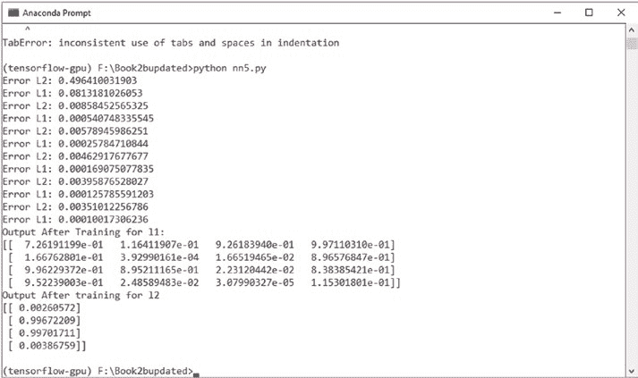
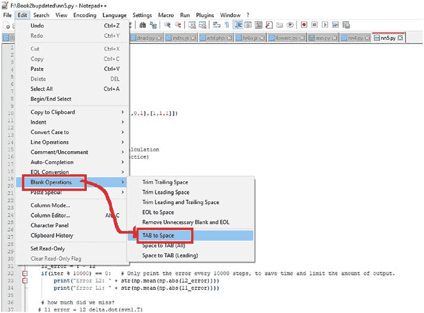
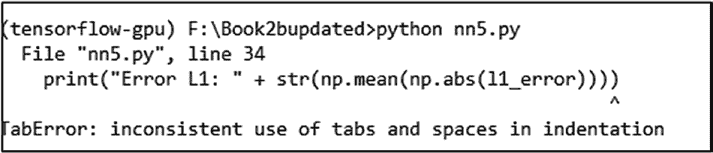

# 第 1 章 神经网络基础

```
for iter in range(60000):
#### 前向传播
l0 = X
l1 = nonlin(np.dot(l0,syn0))
l2 = nonlin(np.dot(l1, syn1))

# 使用链式法则进行误差反向传播。
l2_error = Y - l2
if(iter % 10000) == 0: # 每 10000 步才打印一次误差，以节省时间并限制输出量。
print("L2 误差: " + str(np.mean(np.abs(l2_error))))

#### 我们错过了多少？
#### l1_error = l2_delta.dot(syn1.T)
# 将我们的误差乘以
# l1 处 sigmoid 函数的斜率
l2_delta = l2_error*nonlin(l2, deriv=True)
l1_error = l2_delta.dot(syn1.T)
l1_delta = l1_error * nonlin(l1,deriv=True)

if(iter % 10000) == 0: # 每 10000 步才打印一次误差，以节省时间并限制输出量。
print("L1 误差: " + str(np.mean(np.abs(l1_error))))
```


#### 更新权重

`syn1 += l1.T.dot(l2_delta)`

`syn0 += l0.T.dot(l1_delta)`



## 第 1 章 神经网络基础

`print("Output After Training for l1:")`

`print(l1)`

`print("Output After training for l2")`

`print(l2)`

输出结果如图 1-17 所示。

***图 1-17.** 神经网络的输出*





## 第 1 章 神经网络基础

运行代码时，我们可能会遇到错误，例如 `TabError`：

`inconsistent use of tabs and spaces in indentation`（图 1-18）。

***图 1-18.** 制表符和空格错误*

可以通过以下方式修正。在你使用的任何 IDE（集成开发环境）中，将缩进操作从制表符改为空格（图 1-19）。

***图 1-19.** 修正错误*

## 第 1 章 神经网络基础

### 反向传播

反向传播是一种系统性的方法，在深度学习中尤为著名，我们通过它计算梯度以发现误差，并匹配神经网络中的权重。

反向传播会导致微分反向传播回网络的起点。它利用微分的链式法则进行反向传播。

### 本章小结

在本章中，我们学习了神经网络的基础知识以及神经网络的演变过程。我们还简要介绍了激活函数及其类型。

在下一章中，我们将开始在 Unity 中使用神经网络，并为其实现机器学习智能体。

