# 第 2 章 Unity ML-Agents

在本章中，我们将学习 Unity ML-Agents 的工作原理。首先，我们将简要介绍 Unity IDE，然后了解 Unity 的这一特性。我们将查看一些演示，然后创建自己的模拟场景。我们还将了解如何使用 Python 训练智能体。

## Unity IDE

Unity IDE 是一个支持游戏开发的游戏引擎，并且内置了物理引擎用于构建游戏。它支持多种平台，包括 Windows、Linux、MacOS 以及其他设备。他们发布的 Unity ML-Agents 是一个非常出色的扩展，因此我们可以基于 Unity 快速构建大量用于研究目的的模拟场景。

## 机器学习智能体入门

Unity 发生了许多变化。他们推出了一项激动人心的功能（使用 ML-Agents），帮助开发者使用机器学习实现来训练他们创建的游戏，从而使整个流程能够被训练好的模型复制，并且我们可以比较其中的差异。该方法使用了强化学习方法。

© Abhishek Nandy, Manisha Biswas 2018

A. Nandy and M. Biswas, *Unity 中的神经网络*,

`doi.org/10.1007/978-1-4842-3673-4_2`

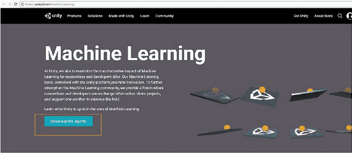

强化学习是机器学习的一部分，其学习基础基于环境和模拟，其中软件智能体（软件程序）根据环境的影响采取行动，以便我们能够提供奖励。

为了使机器学习智能体完美运行，我们需要执行的步骤如下：

1.  首先，我们必须确保已安装 Unity IDE。从以下链接下载并安装 Unity 游戏引擎。

    `https://store.unity.com/download?ref=personal`

2.  我们需要克隆机器学习 GitHub 仓库。以下链接将带我们进入机器学习背景页面（图 2-1）。Unity ML-Agents 包含最新版本，因此无需搜索特定版本。

    `https://github.com/Unity-Technologies/ml-agents`

***图 2-1.** Unity ML-Agents 网站链接*

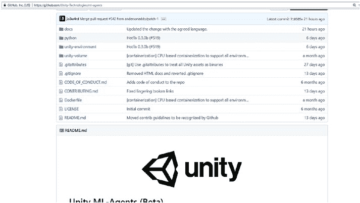

3.  当我们点击下载 ML-Agents 时，它会带我们进入 GitHub 仓库。它会带我们进入以下链接，在那里我们拥有机器学习智能体 Unity 所需的重要文件。

    `https://github.com/Unity-Technologies/ml-agents`

4.  网页看起来如图 2-2 所示。

***图 2-2.** 待克隆的 GitHub 仓库*

项目所需的基本文件都在该仓库中，因此我们可以开始使用它了。

## 让我们从 TensorFlow 开始

TensorFlow 是一个主要用于基于数据流工作的框架。它非常有效地使用张量及其节点方法，以便我们可以在机器学习和深度学习中轻松实现它。

它拥有来自 Google 的非常好的文档，因此我们可以轻松学习。

TensorFlow 信息和下载可在以下链接中找到。

`https://www.tensorflow.org/`

## 了解 Anaconda

我们还需要讨论 Anaconda。Anaconda 是一个用于 Python 的机器学习库发行版，包含许多用于机器学习和深度学习的重要库。

Anaconda 发行版可从以下链接获取。

`https://www.anaconda.com/download/`

首先，我们安装适用于 Python 的 Anaconda 发行版。之后，我们会看到 Anaconda 提示符可用。我们需要打开该提示符（类似于命令提示符）。

开始时，我们需要创建一个环境。创建新环境的命令如下所示。

`conda create --name myenv`

`myenv` 是环境名称，你可以根据自己的喜好更新或更改它。

如果我们想创建一个具有特定 Python 版本的环境，需要使用以下过程。

`conda create -n myenv python=3.4`

要激活我们创建的环境，需要使用以下命令。

`Activate <envname>`

如果我们想退出环境，将使用

`Deactivate`

如果我们想添加一个带有 GPU 版本 TensorFlow 的环境，我们必须执行以下操作。对于 GPU 版本的 TensorFlow，我们需要安装显卡才能正常工作。

步骤如下：

1.  下载并安装 CUDA。CUDA 有不同的版本。我们需要 CUDA 8.0 版本。我安装了 8.0、9.0 和 9.1 版本，并按照本指南为每个版本进行了相同的设置。暂时坚持使用 8.0 以确保其正常工作。我设置其他版本是为了准备 TensorFlow GPU 支持其他 CUDA 版本的可能性。

2.  前往 [CUDA Toolkit 下载页面。](https://developer.nvidia.com/cuda-downloads)

3.  向下滚动到旧版本发布 [或此处。](https://developer.nvidia.com/cuda-toolkit-archive)

4.  点击你想要的 CUDA Toolkit X.Y 版本：对于 8.0，我们会看到 CUDA Toolkit 8.0 GA，因此将 `<Z>` 替换为可用的最高数字。我下载了 CUDA Toolkit 8.0 GA2。对于 9.0，文件是 CUDA Toolkit 9.0；对于 9.1，文件是 CUDA Toolkit 9.1。

5.  选择你的操作系统；我的是：

    -   操作系统：Windows

    -   架构：x86_64

    -   版本：10

6.  CUDA 下载完成后，运行下载的文件并使用快速设置进行安装。这可能需要一些时间并且屏幕会闪烁（因为它是为显卡安装的）。

7.  确认你的系统现在有以下路径。

    `C:\Program Files\NVIDIA GPU Computing Toolkit\CUDA\v8.0`

8.  下载并安装 cuDNN。为此，你需要一个 NVIDIA 开发者帐户。它是免费的。

9.  [在此处](https://developer.nvidia.com/developer-program/signup) 创建一个免费的 NVIDIA 开发者会员。

10. 注册后，前往 [`developer.nvidia.com/cudnn`](https://developer.nvidia.com/cudnn)。

11. 点击下载（暂时忽略当前列出的版本）。

12. 同意条款。

13. 还记得之前我们需要 cuDNN v6.0 吗？你可能会在这里看到它，也可能看不到。如果看不到，只需选择存档的 cuDNN 版本。

14. 点击你需要的版本以及你需要的系统。我点击了：

15. 下载适用于 CUDA 8.0 的 cuDNN v6.0（2017 年 4 月 27 日），然后下载适用于 Windows 10 的 cuDNN v6.0 库。

16. 前往你最近下载的 zip 文件，例如 `C:\Users\teamcfe\Downloads\cudnn-8.0-windows10-x64-v6.0.zip`

17. 解压该文件。

18. 打开 Cuda 文件夹；你应该会看到：

    - `bin/`

    - `include/`

    - `lib/`

19. 将 `C:\Users\j\Downloads\cudnn-8.0-windows10-x64-v6.0.zip\cuda` 中的这三个文件夹复制并粘贴到 `C:\Program Files\NVIDIA GPU Computing Toolkit\CUDA\v8.0`

请注意，拖放操作会合并文件夹而不会替换它们；我认为 Mac/Linux 情况不同。如果它要求你替换任何内容，请选择否，只需将 cuDNN 中每个文件夹的内容拖放到 Cuda 中。它可能会询问管理员权限，你应该同意。

20. 验证上一步是否正确完成；你应该能够找到此路径。

    `C:\Program Files\NVIDIA GPU Computing Toolkit\CUDA\v8.0\lib\x64\cudnn.lib`

21. 更新系统上的 `%PATH%`。更新系统环境变量的 PATH，使其包含：

    - `C:\Program Files\NVIDIA GPU Computing Toolkit\CUDA\v8.0\bin`

    - `C:\Program Files\NVIDIA GPU Computing Toolkit\CUDA\v8.0\libnvvp`

要到达此处，请在开始菜单或 Cortana 中搜索“编辑系统环境变量”。它应该会打开系统属性和高级选项卡。点击环境变量。在系统变量下，找到 PATH，然后点击编辑。添加步骤 21 中的两行。

现在我们将下载 ml-agents 文件。如果你不熟悉 git，可以直接将文件作为 zip 文件下载，然后解压。

## 什么是 NVIDIA CUDA Toolkit？

NVIDIA CUDA Toolkit 用于创建高性能 GPU 加速应用程序。该工具包包括 GPU 加速库、调试和优化工具，以及用于部署应用程序的 C/C++ 编译器和运行时库。它是深度学习的行业基准，确保整个训练过程无缝运行。我们利用 CUDA 的基本原理来获得 TensorFlow GPU 的更好性能。

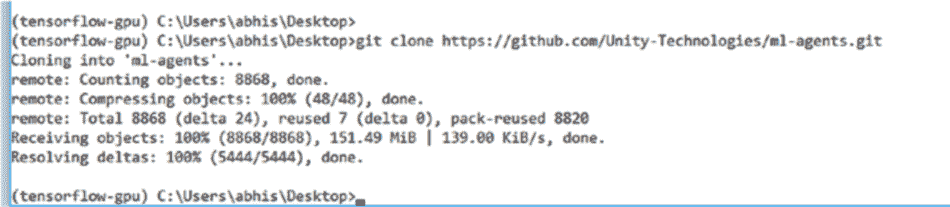

## GPU 加速的 TensorFlow

深度学习训练需要大量时间。当我们实现 GPU 版本的 TensorFlow 时，训练速度提高了 50%。

现在，使用 GPU 版本，你可以在数小时内而不是数天内训练模型。因此，使用 GPU 版本可以大大加快机器学习过程的训练速度，并获得更准确的结果。让我们使用 GPU 版本的 TensorFlow 克隆仓库。

我们将使用 Anaconda，首先必须激活环境。

`(C:\Users\abhis\Anaconda3) C:\Users\abhis>activate tensorflow-gpu`

激活后，它将启用该环境。

`(tensorflow-gpu) C:\Users\abhis>`

现在我们将克隆仓库（图 2-3）。假设我们在桌面上进行此操作。

`(tensorflow-gpu) C:\Users\abhis\Desktop>git clone https://github.com/Unity-Technologies/ml-agents.git`

如果我们不熟悉 git，可以直接下载并将文件保存为 zip 文件，解压到一个文件夹中，然后开始使用它。

***图 2-3.** 克隆 GitHub 仓库*

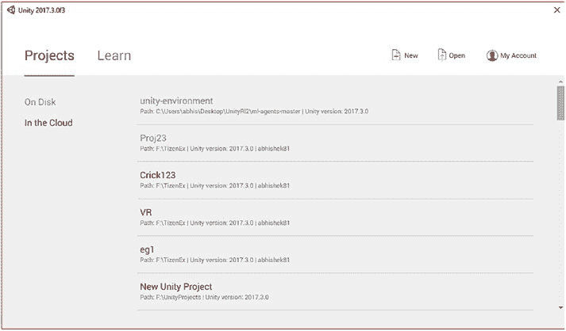

1.  让我们打开 Unity。当你打开 Unity 时，它看起来如图 2-4 所示。

***图 2-4.** 在 Unity IDE 中打开项目文件*

2.  现在我们必须打开克隆的项目。在右上角有一个名为“打开”的选项；我们需要点击它。我们必须进入仓库内部，然后选择 `unity-environment` 文件夹（图 2-5）。

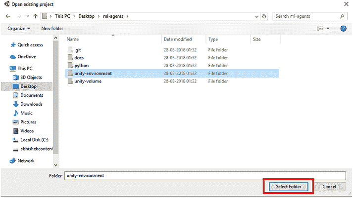

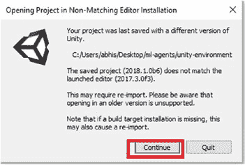

***图 2-5.** 选择适当的文件夹*

选择 `unity-environment` 后，游戏引擎将打开。

3.  如果我们使用的是旧版本的 Unity，我们需要接受详细信息（图 2-6）。

***图 2-6.** 我们接受以继续*

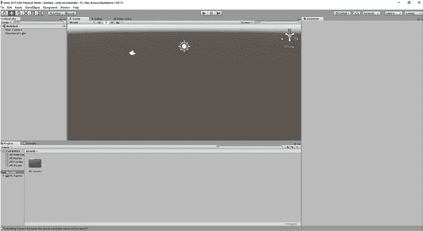

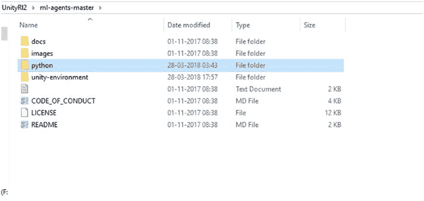

4.  一切完成后，Unity IDE 将打开（图 2-7）。

***图 2-7.** Unity IDE*

让我们浏览一下 GitHub ML-Agents 仓库的文件结构（图 2-8）。

***图 2-8.** ml-agents 文件夹*

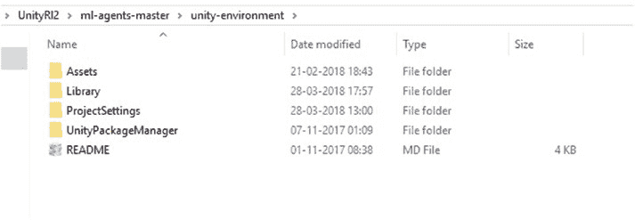

*层次结构中重要的文件是 Python 文件夹和 `unity-environment`。*

*在 Unity 环境中，我们有 Assets 文件夹，其中包含运行场景所需的所有对象以及用于启用对象移动的 C# 脚本。*

*在 Python 文件夹中，我们有用于训练编译项目后生成的 exe 文件的脚本。*

Unity 环境包含以下重要的 Unity Assets 文件（图 2-9）。

***图 2-9.** unity-environments 文件夹*

Python 文件夹很重要，因为我们必须将构建文件保存在此文件夹中。

我们需要将文件保存在 Python 子文件夹中，因为训练我们生成的 exe 所需的必要文件位于此文件夹中。训练代码也存在于那里。

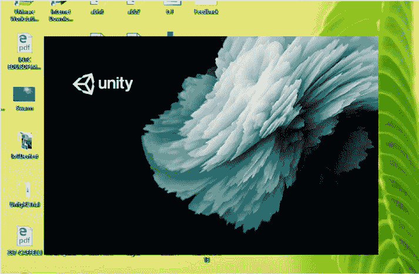

## 在 Unity 中构建项目

现在让我们开始处理项目。

1.  我们打开 Unity，如果尚未打开的话（图 2-10）。

***图 2-10.** Unity 引擎打开*

2.  我们必须打开克隆的项目。我们在此处引用的是从网站下载的 Unity ML-Agents 文件中的同一个项目。我们需要在 Unity 中打开它以进行编译并更改项目的详细信息。

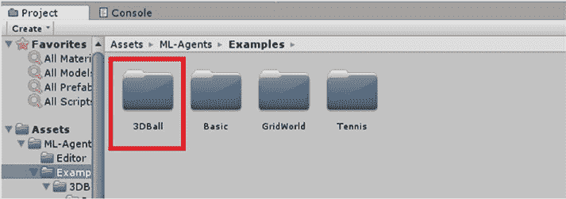

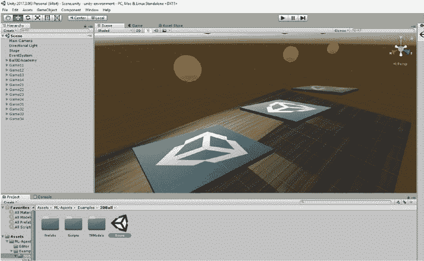

仓库中有很多示例；我们将从 3D Ball 开始（图 2-11）。

***图 2-11.** 我们将要处理的示例*

3.  我们将打开场景文件（图 2-12）。

***图 2-12.** 场景文件*

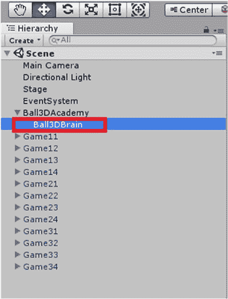

4.  需要进行的更改可以在层级选项卡中找到，其中最重要的是 `Ball3DAcademy`（图 2-13）。

***图 2-13.** Ball3dBrain*

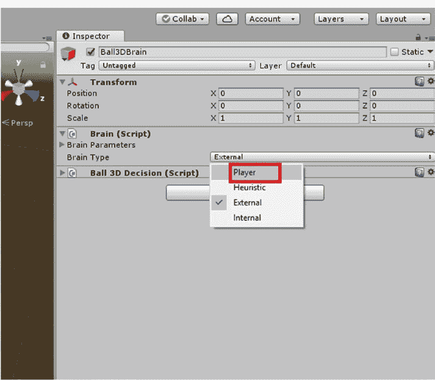

5.  要尝试模拟如何在玩家设置下工作，我们必须进入检查器窗口。我们将把大脑类型更改为玩家（图 2-14）。

***图 2-14.** 将玩家类型更改为外部*

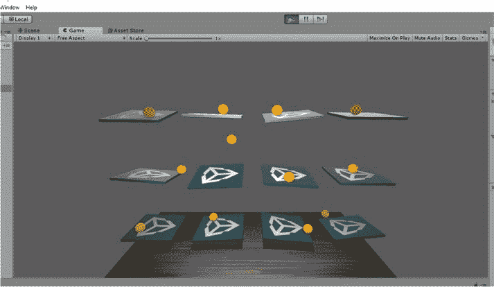

6.  如果我们现在运行应用程序，我们将能够看到它在未添加 ML-Agents 的玩家模式下如何工作（图 2-15）。

***图 2-15.** 运行模拟*

当我们停止应用程序时，我们将转向 ML-Agents 的工作原理。

## 机器学习的内部操作

首先，在检查器窗口中，我们将把大脑类型更改为外部。

我们必须在 Unity IDE 的编辑选项卡中进行一些更改。

1.  我们将进入 编辑 ➤ 项目设置 ➤ 播放器，如图 2-16 所示。

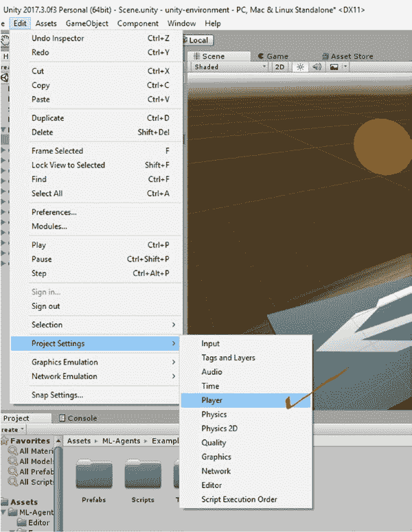

***图 2-16.** 进入播放器选项*

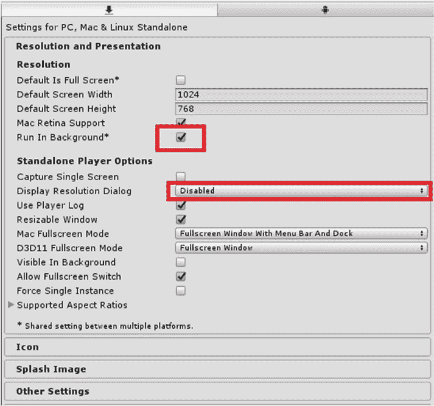

2.  在检查器窗口中（图 2-17），我们将必须检查在分辨率和呈现选项卡中：

    -   后台运行已勾选。

    -   显示分辨率对话框已禁用。

***图 2-17.** 检查器窗口*

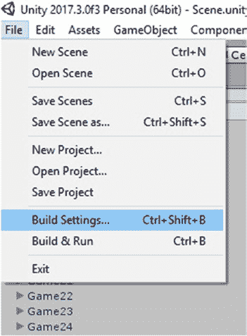

3.  我们将进入文件并保存场景。

4.  再次回到文件选项卡，进入构建设置（图 2-18）。

***图 2-18.** 构建 exe 文件*

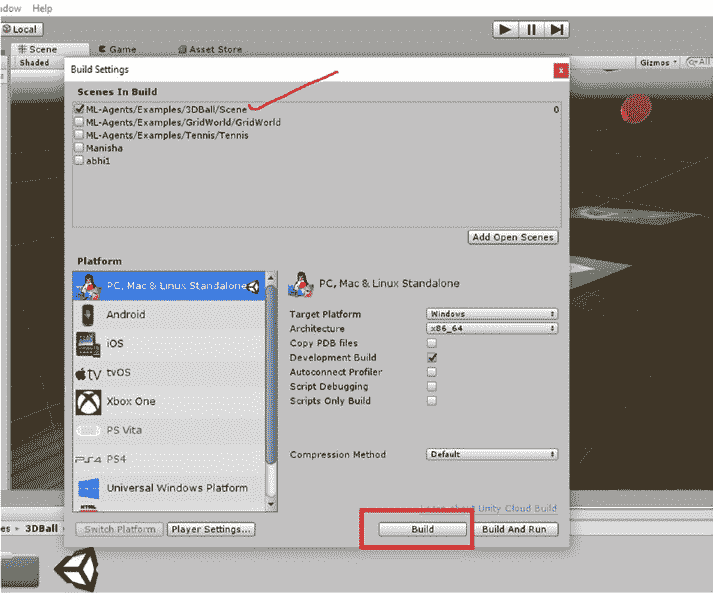

5.  我们必须添加场景并选择它，然后点击构建（图 2-19）。我们需要勾选开发构建选项，以便在运行项目 exe 时跟踪任何错误。启用开发构建后，我们可以在 exe 文件运行时看到更改。

***图 2-19.** 选择场景并构建它*

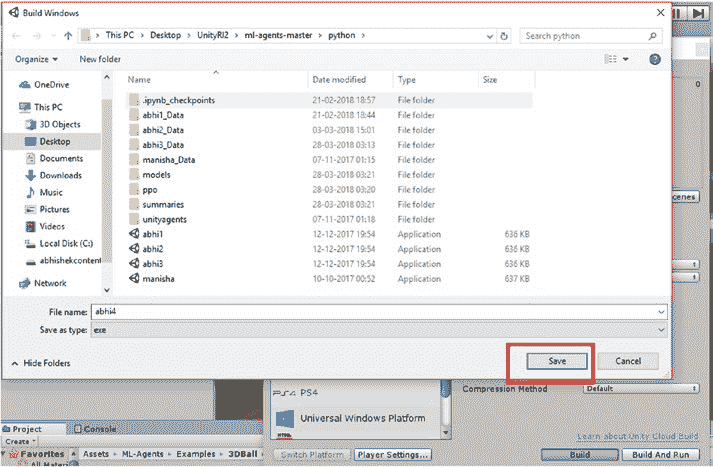

6.  当我们点击构建时，它会要求我们保存文件（图 2-20）。我们也要给文件命名。

***图 2-20.** 保存 exe 文件*

7.  我们将文件保存在项目的 Python 子目录中。

## 在 Python 模式下训练 Anaconda

现在我们必须启动 Anaconda，因为我们将在 Python 模式下进行训练。

我们将激活环境。

首先，我们必须打开命令提示符；当命令提示符出现时，我们需要激活我们为 `tensorflow-gpu` 创建的 Anaconda 环境。

我们必须编写以下命令。

`Activate tensorflow-gpu`

`(C:\Users\abhis\Anaconda3) C:\Users\abhis>activate tensorflow-gpu`

`(tensorflow-gpu) C:\Users\abhis>`

首先，有我们下载或作为 git 添加的 Unity ML-Agents 文件。我们需要进入该文件，其中包含 Python 子目录，因为我们在其中构建了 Unity 游戏 exe 文件。

现在我们将前往文件被克隆且 exe 文件生成的位置。

# 第 2 章 Unity ML-Agents

`(tensorflow-gpu) C:\Users\abhis\Desktop\UnityRl2\ml-agents-master>dir`

我们将进入 Python 子文件夹，从中启动 Jupyter Notebook。

驱动器 C 中的卷没有标签。

卷序列号为 1E9F-654C。

`C:\Users\abhis\Desktop\UnityRl2\ml-agents-master` 的目录

```
01-11-2017 08:38 <DIR> .
01-11-2017 08:38 <DIR> ..
01-11-2017 08:38 1,108 .gitignore
01-11-2017 08:38 3,191 CODE_OF_CONDUCT.md
01-11-2017 08:38 <DIR> docs
01-11-2017 08:38 <DIR> images
01-11-2017 08:38 11,348 LICENSE
29-03-2018 00:16 <DIR> python
01-11-2017 08:38 1,490 README.md
28-03-2018 21:48 <DIR> unity-environment
4 File(s) 17,137 bytes
6 Dir(s) 29,652,058,112 bytes free
```

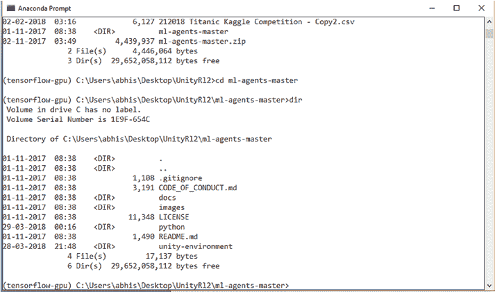

**图 2-21.** 分析 `ml-agents-master` 文件

我们将进入 Python 文件夹。

我们必须启动 Jupyter Notebook。

### 使用 Jupyter Notebook

什么是 Jupyter Notebook？

Jupyter Notebook 是一个基于客户端服务器的应用程序，允许我们在 Web 浏览器模式下在线编写 Python 笔记本。

要启用 Jupyter Notebook，我们必须输入此命令。

`(tensorflow-gpu) C:\Users\abhis\Desktop\UnityRl2\ml-agents-master\python>jupyter notebook`

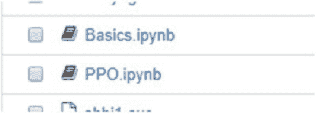

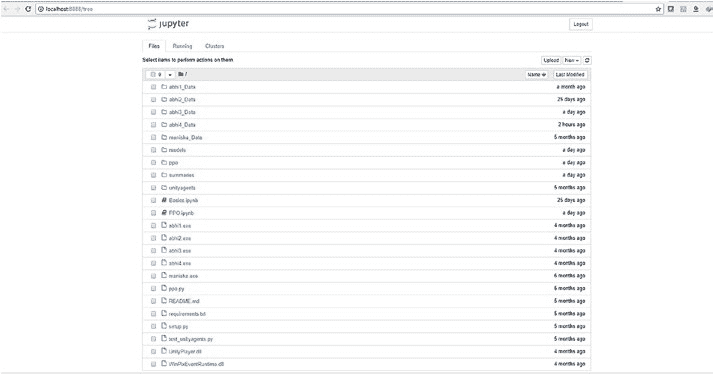

它会在 Web 浏览器中打开，并显示相应的文件。如图 2-22 所示。

**图 2-22.** 打开 Jupyter Notebook

我们需要的两个重要文件如图 2-23 所示。

**图 2-23.** 重要的 IPython 文件

我们将首先打开 `Basics.ipynb`。

我们将学习 Jupyter Notebook 的基础知识。

首先，我们必须加载依赖项。

必要的文件都结构在我们下载的 ML-Agents 附带的 Jupyter Notebook 中。

如果某些库（如 NumPy 和 matplotlib）未安装，我们必须从 Anaconda 安装它们。

`conda install -c anaconda numpy`

对于 matplotlib，我们使用以下命令。

`conda install -c conda-forge matplotlib`

我们将导入必要的文件来训练我们的 ML-Agents。

```python
import matplotlib.pyplot as plt
import numpy as np
from unityagents import UnityEnvironment
%matplotlib inline
```

之后，我们必须命名我们在 Unity 中创建的 exe 文件，以便我们可以训练模型。我们将在训练模式下运行环境。

```python
env_name = "abhi4" # 要启动的 Unity 环境二进制文件的名称
train_mode = True # 是否在训练或推理模式下运行环境
```

现在我们将启动环境，以便 Unity 和创建的环境之间的通信开始。

在 Unity 脚本中，我们有一个控制智能体并负责智能体行为的大脑。

```python
env = UnityEnvironment(file_name=env_name)
```

#### 检查环境参数

`print(str(env))`

#### 设置默认工作大脑

`default_brain = env.brain_names[0]`

`brain = env.brains[default_brain]`

在下一节中，我们将观察它们当前所处的状态。

#### 重置环境

`env_info = env.reset(train_mode=train_mode)[default_brain]`

#### 检查默认大脑的状态空间

`print("Agent state looks like: \n{}".format(env_info.states[0]))`

#### 检查默认大脑的观测空间

```python
for observation in env_info.observations:
    print("Agent observations look like:")
    if observation.shape[3] == 3:
        plt.imshow(observation[0,:,:,:])
    else:
        plt.imshow(observation[0,:,:,0])
```

在下一节中，我们将根据默认大脑的 `action_space_type` 来选择动作。

```python
for episode in range(10):
    env_info = env.reset(train_mode=train_mode)[default_brain]
    done = False
    episode_rewards = 0
    while not done:
        if brain.action_space_type == 'continuous':
            env_info = env.step(np.random.randn(len(env_info.agents), brain.action_space_size))[default_brain]
        else:
            env_info = env.step(np.random.randint(0, brain.action_space_size, size=(len(env_info.agents))))[default_brain]
        episode_rewards += env_info.rewards[0]
        done = env_info.local_done[0]
    print("Total reward this episode: {}".format(episode_rewards))
```

之后，我们关闭环境。

`env.close()`

当我们启动环境时，它会启动可执行文件。我们需要点击“允许”（图 2-24）。

**图 2-24.** 允许访问 Unity 文件

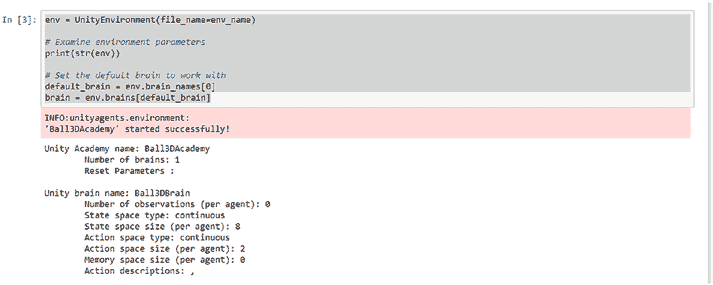

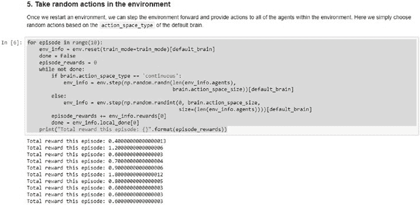

智能体将如图 2-25 所示启动。

**图 2-25.** 变量和参数

之后，我们会看到奖励（图 2-26）。

**图 2-26.** 了解奖励

然后我们关闭环境。

#### 近端策略优化

接下来，我们将使用 Jupyter Notebook 来实现近端策略优化。**PPO** 是一种专门用于应用强化学习方法的近端技术。我们将执行相同的操作。

首先，我们导入重要文件。这里我们需要 TensorFlow 来训练智能体。

```python
import numpy as np
import os
import tensorflow as tf
from ppo.history import *
from ppo.models import *
from ppo.trainer import Trainer
from unityagents import *
```

然后，我们声明超参数。

##### 通用参数

```python
max_steps = 50000          # 设置环境运行的最大步数。
run_path = "ppo"           # 模型和摘要统计信息的子目录名称
load_model = False         # 是否加载已保存的模型。
train_model = True         # 是否训练模型。
summary_freq = 10000       # 保存训练统计信息的频率。
save_freq = 50000          # 保存模型的频率。
env_name = "abhi4"         # 训练环境文件的名称。
```

##### 用于调优的算法特定参数

```python
gamma = 0.99               # 奖励折扣率。
lambd = 0.95               # GAE 的 Lambda 参数。
time_horizon = 2048        # 在添加到缓冲区之前，每个智能体收集的步数。
beta = 1e-3                # 熵正则化的强度
num_epoch = 5              # 每批经验执行的梯度下降步数。
epsilon = 0.2              # 新旧策略概率比率的可接受阈值。
buffer_size = 5000         # 梯度下降前经验缓冲区的大小。
learning_rate = 3e-4       # 模型学习率。
hidden_units = 64          # 隐藏层单元数。
batch_size = 512           # 每次梯度下降更新步使用的经验数量。
```

之后，我们加载环境。

```python
env = UnityEnvironment(file_name=env_name)
print(str(env))
brain_name = env.brain_names[0]
```

然后，我们使用 TensorFlow 框架训练环境并创建模型图。

```python
tf.reset_default_graph()

#### 创建 Tensorflow 模型图
ppo_model = create_agent_model(env, lr=learning_rate, h_size=hidden_units, epsilon=epsilon, beta=beta, max_step=max_steps)

is_continuous = (env.brains[brain_name].action_space_type == "continuous")
use_observations = (env.brains[brain_name].number_observations > 0)
use_states = (env.brains[brain_name].state_space_size > 0)

model_path = './models/{}'.format(run_path)
summary_path = './summaries/{}'.format(run_path)

if not os.path.exists(model_path):
    os.makedirs(model_path)
if not os.path.exists(summary_path):
    os.makedirs(summary_path)

init = tf.global_variables_initializer()
saver = tf.train.Saver()

with tf.Session() as sess:
    # 实例化模型参数
    if load_model:
        print('Loading Model...')
        ckpt = tf.train.get_checkpoint_state(model_path)
        saver.restore(sess, ckpt.model_checkpoint_path)
    else:
        sess.run(init)

    steps = sess.run(ppo_model.global_step)
    summary_writer = tf.summary.FileWriter(summary_path)
    info = env.reset(train_mode=train_model)[brain_name]
    trainer = Trainer(ppo_model, sess, info, is_continuous, use_observations, use_states)

    while steps <= max_steps:
        if env.global_done:
            info = env.reset(train_mode=train_model)[brain_name]

        # 决定并执行一个动作
        new_info = trainer.take_action(info, env, brain_name)
        info = new_info
        trainer.process_experiences(info, time_horizon, gamma, lambd)

        if len(trainer.training_buffer['actions']) > buffer_size and train_model:
            # 使用经验缓冲区执行梯度下降
            trainer.update_model(batch_size, num_epoch)

        if steps % summary_freq == 0 and steps != 0 and train_model:
            # 将训练统计信息写入 TensorBoard。
            trainer.write_summary(summary_writer, steps)

        if steps % save_freq == 0 and steps != 0 and train_model:
            # 保存 Tensorflow 模型
            save_model(sess, model_path=model_path, steps=steps, saver=saver)

        steps += 1
        sess.run(ppo_model.increment_step)
```

#### 最终保存 TensorFlow 模型

```python
if steps != 0 and train_model:
    save_model(sess, model_path=model_path, steps=steps, saver=saver)
    env.close()
    export_graph(model_path, env_name)
```

现在我们将导出 TensorFlow 计算图，生成的字节文件将被放入 Unity 中，以便我们观察 ML-Agents 的运行效果。

`export_graph(model_path, env_name)`

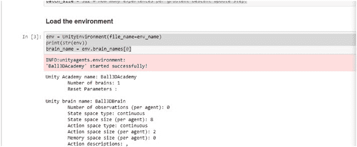

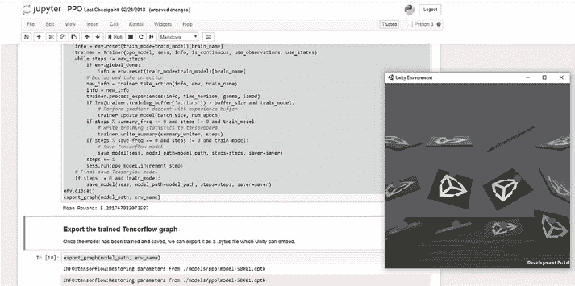

在创建环境的过程中，首先会创建以下内容，如图 2-27 所示。

**图 2-27.** 创建特征

之后，我们开始训练模型（图 2-28）。

**图 2-28.** 训练已开始

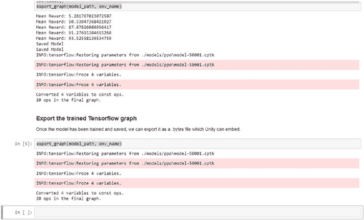

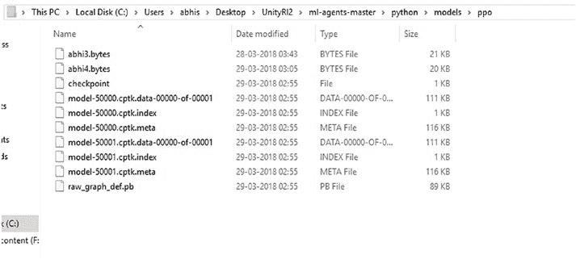

然后我们导出 TensorFlow 计算图（图 2-29）。

**图 2-29.** 导出 TensorFlow 计算图

让我们检查文件夹中是否已生成字节文件（图 2-30）。

**图 2-30.** 需要复制生成的字节文件

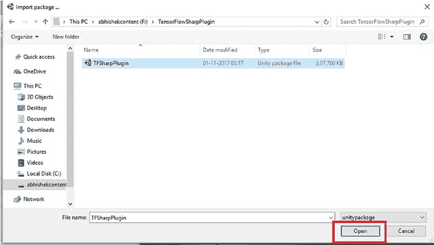

我们需要将 `abhi4.bytes` 文件复制到 Unity 文件夹中，但在此之前，需要先下载 TensorFlowSharp 插件（图 2-31）。该插件可通过以下链接获取：

[`github.com/Unity-Technologies/ml-agents/blob/master/docs/Using-TensorFlow-Sharp-in-Unity.md`](https://github.com/Unity-Technologies/ml-agents/blob/master/docs/Using-TensorFlow-Sharp-in-Unity.md)

TensorFlowSharp 用于在 Unity 游戏中运行预训练的 TensorFlow 计算图。我们首先在 Unity 中导入该插件。

**图 2-31.** 打开 TensorFlowSharp 插件

在编辑项目设置，然后进入播放器设置，我们将目标对准检查器窗口，并检查配置选项，确保脚本运行时版本为“实验性（.NET 4.6 等效）”。

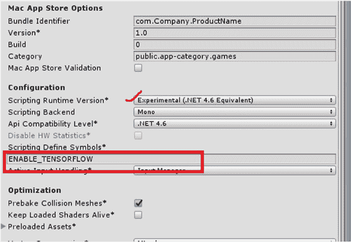

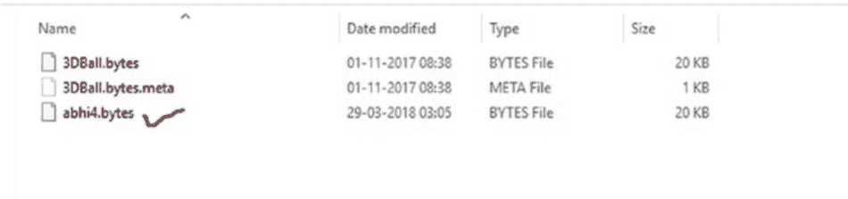

在脚本定义符号中，我们需要启用 TensorFlow（图 2-32）。

**图 2-32.** 启用 TensorFlow 模式

现在，我们将生成的字节文件复制到 `tfmodels` 文件夹中（图 2-33）。

**图 2-33.** 将字节文件复制到 `tfmodels` 文件夹

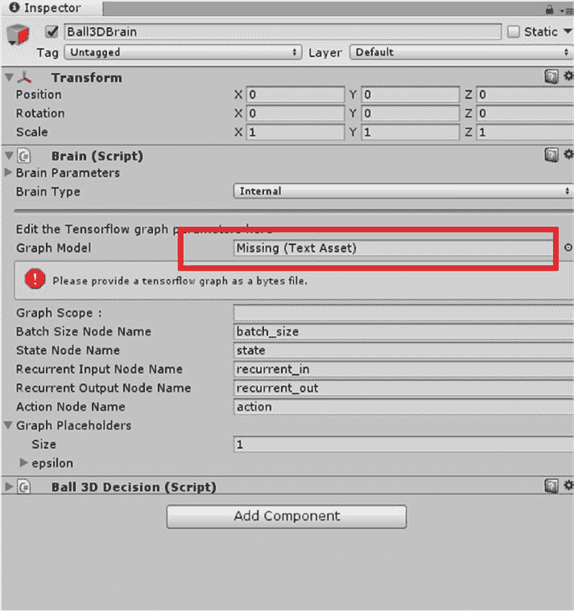

## 第 2 章 Unity ML-Agents

在脑部脚本中，我们将球体类型从外部更改为内部。当我们更改为内部类型时，系统会提示缺少文本资源（图 2-34）。这里我们需要拖放字节文件。

**图 2-34.** 需要添加缺失的文本资源

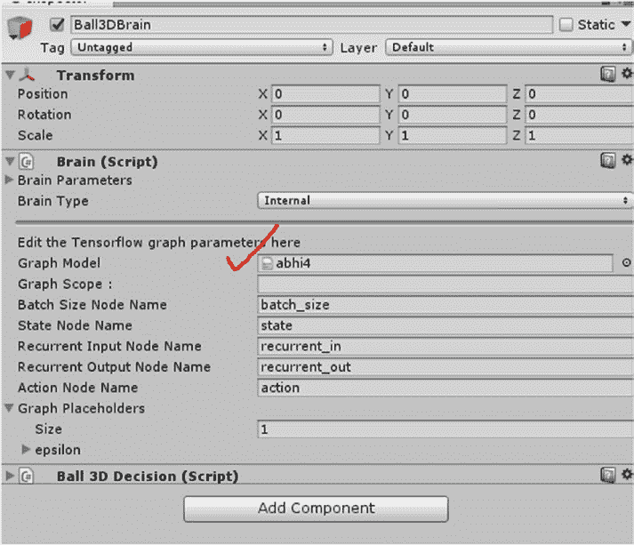

## 第 2 章 Unity ML-Agents

添加字节文件后，我们点击运行（图 2-35）。

**图 2-35.** 已添加文本资源

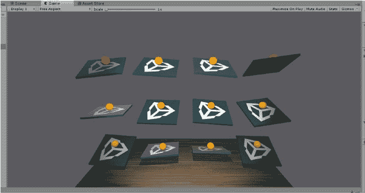

## 第 2 章 Unity ML-Agents

现在您将看到经过训练的 ML-Agents 版本正在运行（图 2-36）。

**图 2-36.** 应用机器学习后的结果

### 本章小结

本章我们介绍了 Unity ML-Agents 功能。这是 Unity 为研究目的而启用的重要功能之一。它使我们能够针对各种场景进行大量模拟。

在本章中，我们介绍了如何下载 Unity ML-Agents 并在 Unity 中进行设置。然后我们在 Jupyter Notebook 中训练模型。最后，使用 PPO 算法，我们训练了克隆仓库中已有的一个示例。

在下一章中，我们将进一步探索，并在 Unity 中使用神经网络。