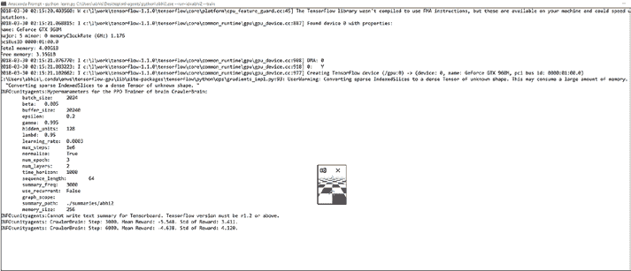
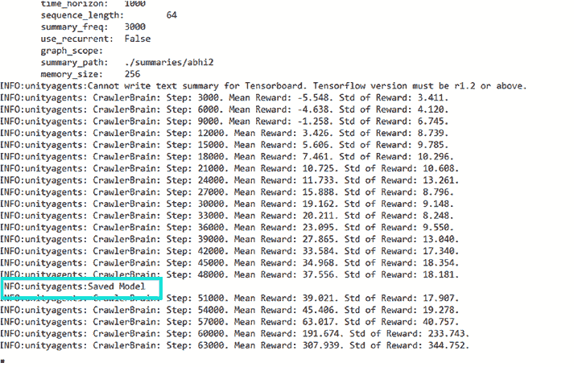
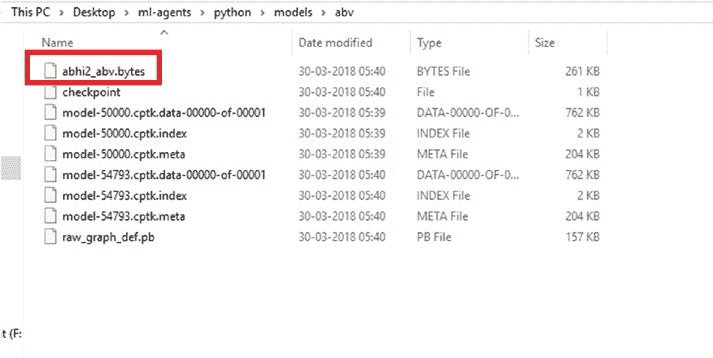
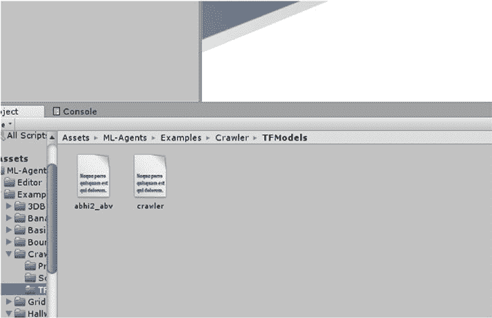
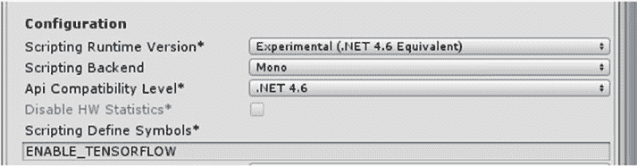
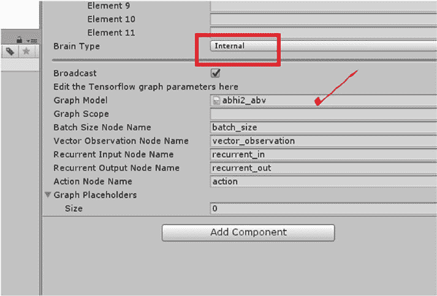
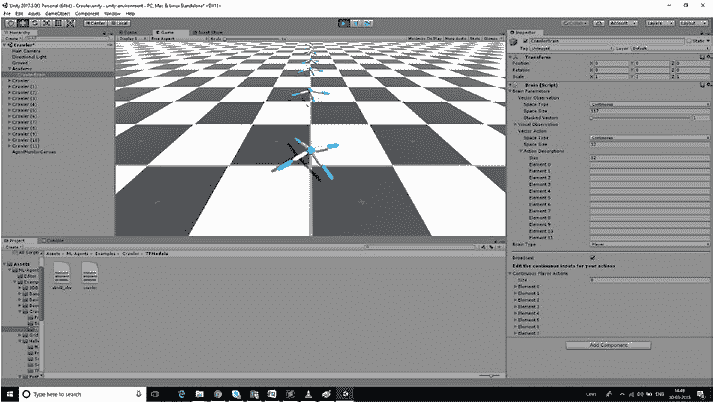

# 第 3 章 Unity 中的机器学习代理与神经网络

在本章中，我们将通过一个示例介绍 Unity 中扩展的机器学习代理 v 0.3，然后继续在 Unity 中创建神经网络并为其添加不同的资源。

首先，我们介绍 Unity 中的机器学习代理。然后，我们将


## 第 3 章：Unity 中的机器学习代理与神经网络

### 通过更多示例扩展 Unity ML-Agents

在上一章中，我们重点介绍了 ML-Agents 的 0.2 版本，但本章将探讨 ML-Agents 的进阶版本 0.3。现在让我们下载 0.3 版本（图 3-1）。

**图 3-1.** 打开项目

需要先打开 Unity 环境，以便我们获取示例项目。

跟随 Unity 中的爬行器示例进行操作，应用强化学习，并比较训练前的输出（作为玩家输出）与机器学习代理的内部输出。

我们将继续在 Unity 中创建前馈神经网络，并通过 Unity 输出了解其工作原理。

最后，我们将为其添加蜘蛛动画资源，并相应扩展示例。

© Abhishek Nandy, Manisha Biswas 2018  
A. Nandy 与 M. Biswas 合著，《Unity 中的神经网络》，  
[`doi.org/10.1007/978-1-4842-3673-4_3`](https://doi.org/10.1007/978-1-4842-3673-4_3)

### 爬行器项目

我们将以爬行器示例为基础进行开发（图 3-2）。

打开资源文件夹后，ML-Agents 目录下会有一个爬行器子文件夹，需要在 Unity 游戏引擎中将其打开。

**图 3-2.** 爬行器示例

出于模拟目的，我们将爬行器视为一个拥有四条手臂和四个前臂的生物。

目标：模拟的目的是让该生物沿 x 轴移动而不跌落地面。

现在我们将保存场景并构建项目（图 3-3）。

**图 3-3.** 构建项目

我们将立即保存构建文件。

需要将构建文件保存在 Python 子文件夹中，因为该文件夹包含运行机器学习代理训练所需的重要文件和库（图 3-4）。

**图 3-4.** 保存场景并创建可执行文件

现在让我们打开 Anaconda 并启用 Tensorflow。

打开命令提示符，在其中输入以下命令。

```
(C:\Users\abhis\Anaconda3) C:\Users\abhis>activate tensorflow-gpu
```

激活 tensorflow-gpu

```
Directory of C:\Users\abhis\Desktop\ml-agents

28-03-2018  01:32    <DIR>          .
28-03-2018  01:32    <DIR>          ..
28-03-2018  01:32                64 .gitattributes
28-03-2018  01:32             1,365 .gitignore
28-03-2018  01:32             3,264 CODE_OF_CONDUCT.md
28-03-2018  01:32             2,519 CONTRIBUTING.md
28-03-2018  01:32               312 Dockerfile
28-03-2018  01:32    <DIR>          docs
28-03-2018  01:32            11,549 LICENSE
30-03-2018  02:07    <DIR>          python
28-03-2018  01:32             4,352 README.md
30-03-2018  01:45    <DIR>          unity-environment
28-03-2018  01:32    <DIR>          unity-volume
               7 File(s)         23,425 bytes
               6 Dir(s)  30,530,846,720 bytes free

(tensorflow-gpu) C:\Users\abhis\Desktop\ml-agents>cd python

(tensorflow-gpu) C:\Users\abhis\Desktop\ml-agents\python>
```

让我们为其创建一个专用环境。

我们将使用 Python 和 Tensorflow 搭建一个环境（图 3-5）。

**图 3-5.** 在 Anaconda 中创建环境

之后，系统开始安装 Tensorflow（图 3-6）。

**图 3-6.** 安装 Tensorflow

我们使用以下命令开始训练之前创建的可执行文件。

```
python learn.py C:\Users\abhis\Desktop\ml-agents\python\abhi2.exe --run-id=abhi2 --train
```

训练过程中会生成日志文件。

```
INFO:unityagents:{'--curriculum': 'None',
'--docker-target-name': 'Empty',
'--help': False,
'--keep-checkpoints': '5',
'--lesson': '0',
'--load': False,
'--run-id': 'abhi2',
'--save-freq': '50000',
'--seed': '-1',
'--slow': False,
'--train': True,
```


`'--worker-id': '0'`,

`'<env>': 'C:\\Users\\abhis\\Desktop\\ml-agents\\python\\abhi2.exe'`

`INFO:unityagents:`

`'Academy'` 已成功启动！

Unity Academy 名称: Academy

大脑数量: 1

外部大脑数量: 1

课程编号: 0

重置参数:

Unity 大脑名称: CrawlerBrain

每个智能体的视觉观察数量: 0

向量观察空间类型: 连续

每个智能体的向量观察空间大小: 117

堆叠的向量观察数量: 1

向量动作空间类型: 连续

每个智能体的向量动作空间大小: 12

向量动作描述: , , , , , , , , , , ,

```
2018-03-30 02:15:20.293743: W c:\l\work\tensorflow-1.1.0\
tensorflow\core\platform\cpu_feature_guard.cc:45] The
TensorFlow library wasn't compiled to use SSE instructions,
but these are available on your machine and could speed up CPU
computations.
```

```
2018-03-30 02:15:21.068815: I c:\l\work\tensorflow-1.1.0\
tensorflow\core\common_runtime\gpu\gpu_device.cc:887] Found
device 0 with properties:
name: GeForce GTX 960M
major: 5 minor: 0 memoryClockRate (GHz) 1.176
pciBusID 0000:01:00.0
Total memory: 4.00GiB
Free memory: 3.35GiB
```

```
2018-03-30 02:15:21.076770: I c:\l\work\tensorflow-1.1.0\
tensorflow\core\common_runtime\gpu\gpu_device.cc:908] DMA: 0
```

```
2018-03-30 02:15:21.083223: I c:\l\work\tensorflow-1.1.0\
tensorflow\core\common_runtime\gpu\gpu_device.cc:918] 0: Y
```

```
2018-03-30 02:15:21.102662: I c:\l\work\tensorflow-1.1.0\
tensorflow\core\common_runtime\gpu\gpu_device.cc:977] Creating
TensorFlow device (/gpu:0) -> (device: 0, name: GeForce GTX
960M, pci bus id: 0000:01:00.0)
```

```
C:\Users\abhis\.conda\envs\tensorflow-gpu\lib\site-packages\
tensorflow\python\ops\gradients_impl.py:93: UserWarning:
Converting sparse IndexedSlices to a dense Tensor of unknown
shape. This may consume a large amount of memory.
"Converting sparse IndexedSlices to a dense Tensor of unknown
shape. "
```

`INFO:unityagents:` 大脑 `CrawlerBrain` 的 PPO 训练器超参数:

```
batch_size: 2024
beta: 0.005
buffer_size: 20240
```



```
epsilon: 0.2
gamma: 0.995
hidden_units: 128
lambd: 0.95
learning_rate: 0.0003
max_steps: 1e6
normalize: True
num_epoch: 3
num_layers: 2
time_horizon: 1000
sequence_length: 64
summary_freq: 3000
use_recurrent: False
graph_scope:
summary_path: ./summaries/abhi2
memory_size: 256
```

随着我们获取训练细节，我们也得到了奖励（图 3-7）。

***图 3-7.** 爬行器模型开始训练*



我们需要等待训练完成。

当我们看到保存的模型被显示出来时，就知道已经生成了一个文件（图 3-8）。

***图 3-8.** 状态保存时*



随着模型生成，我们现在得到了生成的字节文件（图 3-9）。

***图 3-9.** 字节文件已创建*



现在，我们将把字节文件复制到我们已下载并在 Unity IDE 中打开的 GitHub 文件夹中，这样它就是我们正在处理的同一个项目。在 assets 文件夹内会有一个 `TFModels` 文件夹。我们将把它复制到那里（图 3-10）。

***图 3-10.** 将字节文件复制到 TFModels 中*





字节文件复制完成后，现在我们需要在检查器窗口中更改大脑类型，将模式设置为内部，并将生成的字节文件作为文本资源添加到 Graph Model 中。

***图 3-11.** 将大脑类型更改为内部*

现在，让我们像上一章所做的那样，更改某些因素。我们需要在检查器窗口中检查


#### 配置选项

配置选项：`Scripting Runtime Version` 设置为 `Experimental .NET 4.6`，并且 `Scripting Define Symbols` 设置为 `ENABLE_TENSORFLOW`（如图 3-12 所示）。

***图 3-12.** 更新配置详情*



