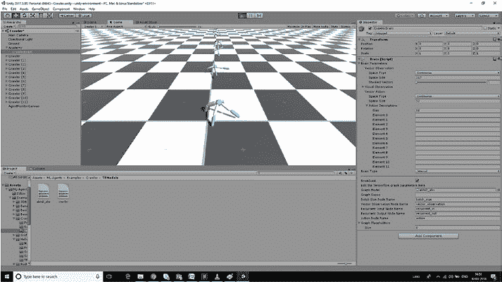
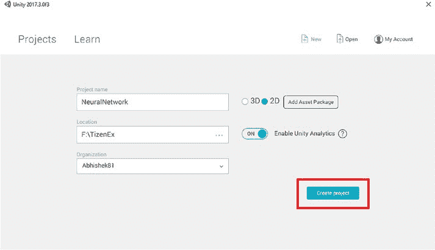
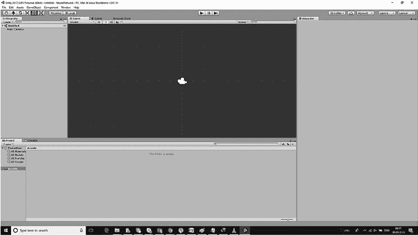
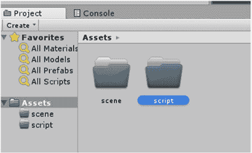
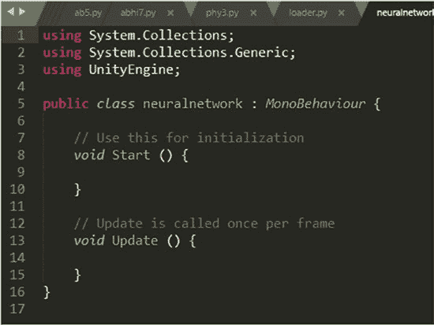

# 第 3 章：Unity 中的机器学习智能体与神经网络

### 测试模拟

让我们先在玩家模式下测试模拟，然后使用内部模式进行机器学习模式测试。

当大脑类型为玩家时，我们看到输出并不完美（如图 3-13 所示）。

***图 3-13.** 大脑类型为玩家时的训练输出*



当大脑类型为内部时，我们可以看到改进（如图 3-14 所示）。

***图 3-14.** 大脑类型为内部时的训练输出*



### 使用 Unity C# 实现神经网络

我们尝试创建的项目将使用 2D 功能，因此我们从 3D 切换到 2D。我们将项目命名为 `NeuralNetwork`（如图 3-15 所示）。

***图 3-15.** 创建新项目*





项目将打开（如图 3-16 所示）。

***图 3-16.** 项目窗口已打开*

现在我们将创建两个文件夹，一个命名为 `scene`，另一个命名为 `script`（如图 3-17 所示）。

***图 3-17.** 创建文件夹*



现在我们将场景保存在 `scene` 文件夹中。在文件选项卡中，我们将点击保存场景并将其命名为 `neural`。

在 `script` 文件夹中（右键单击并创建一个新的 C# 文件），我们将创建一个 C# 文件并将其命名为 `neural network`。

C# 文件看起来像这样（如图 3-18 所示）。

***图 3-18.** 生成的 C# 脚本文件*

我们将删除所有内容，骨架代码将如下所示：

```
public class neuralnetwork {

}
```

现在我们将创建一个构造函数并将其命名为 `neural network`。

首先，我们需要一些层数组，以便存储信息。

```
private int[] layers;
```

### 创建数据结构

在本节中，我们将致力于创建神经元及其相关权重的基本数据结构。

现在我们将有两个数据结构：权重和神经元。

我们将初始化层。

```
public neuralnetwork(int[] layers)
{
    this.layers = new int[layers.length];
    for(int i=0; i<layers.length; i++)
    {
        this.layers[i] = layers[i];
    }
    InitNeurons();
    InitWeights();
}
```

我们还将初始化两个方法：`InitNeurons` 和 `InitWeights`。

```
private void InitNeurons()
{
}

private void InitWeights()
{
}
```

现在我们将创建一个列表并将其转换为锯齿数组。

我们需要神经网络中的锯齿数组，因为神经网络结构在一个节点和另一个节点中有不同的流程。

```
List<float> neuronsList = new List<float>();
for (int i = 0; i < layers.length; i++)
{
    neuronsList.Add(new float[layers[i]]);
}
neurons = neuronsList.ToArray();
```

上述代码为我们生成了神经元矩阵。

现在我们将创建权重的代码。

```
List<float[][]> weightsList = new List<float>([][]);
```

现在我们必须遍历每一个具有权重连接的神经元。

每个层都需要其神经元的权重矩阵，因此我们创建一个包含每个神经元实际权重的列表。

```
List<float[][]> weightsList = new List<float>([][]);
for (int i = 1; i < layers.Length; i++)
{
    List<float[]> layerWeightList = new List<float[]>();
}
```

现在我们将有一个变量 `neuronsInPreviousLayer`，它给出前一层中有多少个神经元。

```
int neuronsInPreviousLayer = layers[i - 1];
```

现在我们将遍历当前层中的所有神经元。


