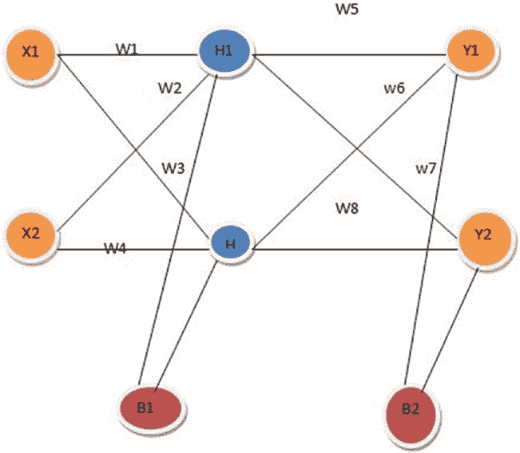

# 第 3 章：Unity 中的机器学习智能体与神经网络

我们遍历所有神经元，因为如果遗漏任何一个神经元，也会导致整个神经网络结构的输出出错。

```
for (int j = 0; j < neurons[i].Length; j++)
{

}
```

我们将创建一个`neuronWeights`，它代表我们目标中所有神经元的连接，同时我们还会为其附加一个随机权重。

```
for (int j = 0; j < neurons[i].Length; j++)
{
    float[] neuronWeights = new float[neuronsInPreviousLayer];
    for (int k = 0; k < neuronsInPreviousLayer; k++)
    {

    }
    layerWeightList.Add(neuronWeights);
}
```

添加随机权重后的更新代码如下所示。

```
using System.Collections.Generic;
using System;

public class NeuralNetwork
{
    private int[] layers;
    private float[][] neurons;
    private float[][][] weights;
    private Random random;

    public NeuralNetwork(int[] layers)
    {
        this.layers = new int[layers.Length];
        for(int i = 0; i < layers.Length; i++)
        {
            this.layers[i] = layers[i];
        }
        random = new Random(System.DateTime.Today.Millisecond);
        InitNeurons();
        InitWeights();
    }

    private void InitNeurons()
    {
        List<float[]> neuronsList = new List<float[]>();
        for (int i = 0; i < layers.Length; i++)
        {
            neuronsList.Add(new float[layers[i]]);
        }
        neurons = neuronsList.ToArray();
    }

    private void InitWeights()
    {
        List<float[][]> weightsList = new List<float[][]>();
        for (int i = 1; i < layers.Length; i++)
        {
            List<float[]> layerWeightList = new List<float[]>();
            int neuronsInPreviousLayer = layers[i - 1];
            for (int j = 0; j < neurons[i].Length; j++)
            {
                float[] neuronWeights = new float[neuronsInPreviousLayer];
                for (int k = 0; k < neuronsInPreviousLayer; k++)
                {
                    neuronWeights[k] = (float)random.NextDouble() - 0.5f;
                }
                layerWeightList.Add(neuronWeights);
            }
        }
    }
}
```

现在我们将`layerWeights`转换为二维交错数组，并将其添加到我们的权重列表中。

```
weightsList.Add(layerWeightList.ToArray());
```

我们将再次转换为三维权重数组。

```
weight = weightsList.ToArray();
```

### 前馈网络

在本节中，我们将了解如何应用前馈网络。

现在我们将为神经网络编写一个前馈方法。我们将遍历输入，并将输入的内容添加到网络的第一层。

```
for (int i = 0; i < inputs.Length; i++)
{
    neurons[0][i] = inputs[i];
}
```

现在我们从第二层开始，遍历每一层。接着我们将遍历这一层中的每一个神经元。

```
for (int i = 1; i < layers.Length; i++)
{
    for (int j = 0; j < neurons[i].Length; j++)
    {

    }
}
```

我们赋予一个值为`0.25f`的常量偏置；该值需要根据我们将要遍历的神经元值计算得出。

```
float value = 0.25f;
```

当我们计算权重值时，它比当前层少一个维度，即`weights[i-1][j][k]`（第`i-1`层第`j`个神经元的第`k`个权重），并与前一层神经元的值相乘。

```
value += weights[i-1][j][k] * neurons[i-1][k];
```

在对其应用激活函数后，我们需要将值传回。

```
neurons[i][j] = (float)Math.Tanh(value);
```

现在返回激活后的结果。

```
return neurons[neurons.Length - 1];
```

我们将添加一个`Mutate`方法，该方法会遍历权重矩阵中的所有值，并根据概率对其进行变异。

```
float randomNumber = (float)random.NextDouble() * 1000f;
```

我们将根据概率对权重应用四种不同类型的变异。

```
if (randomNumber <= 2f)
{
    weight *= -1f;
}
else if (randomNumber <= 4f)
{
    weight = UnityEngine.Random.Range(-0.5f, 0.5f);
}
else if (randomNumber <= 6f)
{
    float factor = UnityEngine.Random.Range(0f, 1f) + 1f;
}
else if (randomNumber <= 8f)
{
    float factor = UnityEngine.Random.Range(0f, 1f);
    weight *= factor;
}
```

`Mutate`方法如下所示。

```
public void Mutate()
{
    for (int i = 0; i < weights.Length; i++)
    {
        for (int j = 0; j < weights[i].Length; j++)
        {
            float weight = weights[i][j][k];
            float randomNumber = (float)random.NextDouble() * 1000f;
        }
    }
}
```


```csharp
if (randomNumber <= 2f)
{
    weight *= -1f;
}
else if (randomNumber <= 4f)
{
    weight = UnityEngine.Random.Range(-0.5f, 0.5f);
}
else if (randomNumber <= 6f)
{
    float factor = UnityEngine.Random.Range(0f, 1f) + 1f;
}
else if (randomNumber <= 8f)
{
    float factor = UnityEngine.Range(0f, 1f);
    weight *= factor;
}
weights[i][j][k] = weight;
```

现在我们将对网络进行深拷贝。

```csharp
public NeuralNetwork(NeuralNetwork copyNetwork)
{
    this.layers = new int[copyNetwork.layers.Length];
    for (int i = 0; i < copyNetwork.layers.Length; i++)
    {
        this.layers[i] = copyNetwork.layers[i];
    }
    InitNeurons();
    InitWeights();
    CopyWeights(copyNetwork.layers);
}
```

我们将添加一个名为 `CopyWeights` 的方法。

```csharp
private void CopyWeights(float[][][] CopyWeights)
{
    for (int i = 0; i < weights.Length; i++)
    {
        for (int j = 0; j < weights[i].Length; j++)
        {
            for (int k = 0; k < weights[i][j].Length; k++)
            {
                weights[i][j][k] = CopyWeights[i][j][k];
            }
        }
    }
}
```

以下是完整代码。

```csharp
using System.Collections.Generic;
using System;

/// <summary>
/// 神经网络 C#（无监督）
/// </summary>
public class NeuralNetwork : IComparable<NeuralNetwork>
{
    private int[] layers; //层
    private float[][] neurons; //神经元矩阵
    private float[][][] weights; //权重矩阵
    private float fitness; //网络的适应度

    /// <summary>
    /// 使用随机权重初始化神经网络
    /// </summary>
    /// <param name="layers">神经网络的各层</param>
    public NeuralNetwork(int[] layers)
    {
        //深拷贝此网络的各层
        this.layers = new int[layers.Length];
        for (int i = 0; i < layers.Length; i++)
        {
            this.layers[i] = layers[i];
        }
        //生成矩阵
        InitNeurons();
        InitWeights();
    }

    /// <summary>
    /// 深拷贝构造函数
    /// </summary>
    /// <param name="copyNetwork">要深拷贝的网络</param>
    public NeuralNetwork(NeuralNetwork copyNetwork)
    {
        this.layers = new int[copyNetwork.layers.Length];
        for (int i = 0; i < copyNetwork.layers.Length; i++)
        {
            this.layers[i] = copyNetwork.layers[i];
        }
        InitNeurons();
        InitWeights();
        CopyWeights(copyNetwork.weights);
    }

    private void CopyWeights(float[][][] copyWeights)
    {
        for (int i = 0; i < weights.Length; i++)
        {
            for (int j = 0; j < weights[i].Length; j++)
            {
                for (int k = 0; k < weights[i][j].Length; k++)
                {
                    weights[i][j][k] = copyWeights[i][j][k];
                }
            }
        }
    }

    /// <summary>
    /// 创建神经元矩阵
    /// </summary>
    private void InitNeurons()
    {
        //神经元初始化
        List<float[]> neuronsList = new List<float[]>();
        for (int i = 0; i < layers.Length; i++) //遍历所有层
        {
            neuronsList.Add(new float[layers[i]]); //将层添加到神经元列表
        }
        neurons = neuronsList.ToArray(); //将列表转换为数组
    }

    /// <summary>
    /// 创建权重矩阵。
    /// </summary>
    private void InitWeights()
    {
        List<float[][]> weightsList = new List<float[][]>(); //权重列表，稍后将转换为三维权重数组

        //遍历所有具有权重连接的神经元
        for (int i = 1; i < layers.Length; i++)
        {
            List<float[]> layerWeightsList = new List<float[]>(); //当前层的层权重列表（将转换为二维数组）
            int neuronsInPreviousLayer = layers[i - 1];

            //遍历当前层的所有神经元
            for (int j = 0; j < neurons[i].Length; j++)
            {
                float[] neuronWeights = new float[neuronsInPreviousLayer]; //神经元的权重

                //遍历前一层的所有神经元，并将权重随机设置在 0.5f 到 -0.5 之间
                for (int k = 0; k < neuronsInPreviousLayer; k++)
                {
                    //为神经元权重赋予随机值
                    neuronWeights[k] = UnityEngine.Random.Range(-0.5f, 0.5f);
                }
                layerWeightsList.Add(neuronWeights); //将当前层的神经元权重添加到层权重中
            }
            weightsList.Add(layerWeightsList.ToArray());
        }
    }
}
```


```csharp
//将此层权重转换为二维数组
//并添加到权重列表
}
weights = weightsList.ToArray(); //转换为三维数组
}

/// <summary>
/// 使用给定的输入数组对该神经网络进行前馈运算
/// </summary>
/// <param name="inputs">网络的输入</param>
/// <returns></returns>
public float[] FeedForward(float[] inputs)
{
    //将输入添加到神经元矩阵
    for (int i = 0; i < inputs.Length; i++)
    {
        neurons[0][i] = inputs[i];
    }

    //遍历所有神经元并计算前馈值
    for (int i = 1; i < layers.Length; i++)
    {
        for (int j = 0; j < neurons[i].Length; j++)
        {
            float value = 0f;
            for (int k = 0; k < neurons[i-1].Length; k++)
            {
                value += weights[i - 1][j][k] * neurons[i - 1][k]; //累加该神经元所有连接权重与其上一层值的乘积
            }
            neurons[i][j] = (float)Math.Tanh(value); //双曲正切激活函数
        }
    }
    return neurons[neurons.Length-1]; //返回输出层
}

/// <summary>
/// 变异神经网络权重
/// </summary>
public void Mutate()
{
    for (int i = 0; i < weights.Length; i++)
    {
        for (int j = 0; j < weights[i].Length; j++)
        {
            for (int k = 0; k < weights[i][j].Length; k++)
            {
                float weight = weights[i][j][k];
                //变异权重值
                float randomNumber = UnityEngine.Random.Range(0f,100f);
                if (randomNumber <= 2f)
                { //情况 1
                    //翻转权重符号
                    weight *= -1f;
                }
                else if (randomNumber <= 4f)
                { //情况 2
                    //在-1 到 1 之间随机选取权重
                    weight = UnityEngine.Random.Range(-0.5f, 0.5f);
                }
                else if (randomNumber <= 6f)
                { //情况 3
                    //随机增加 0%到 100%
                    float factor = UnityEngine.Random.Range(0f, 1f) + 1f;
                    weight *= factor;
                }
                else if (randomNumber <= 8f)
                { //情况 4
                    //随机减少 0%到 100%
                    float factor = UnityEngine.Random.Range(0f, 1f);
                    weight *= factor;
                }
                weights[i][j][k] = weight;
            }
        }
    }
}

public void AddFitness(float fit)
{
    fitness += fit;
}

public void SetFitness(float fit)
{
    fitness = fit;
}

public float GetFitness()
{
    return fitness;
}

/// <summary>
/// 比较两个神经网络，并根据适应度排序
/// </summary>
/// <param name="other">要与之比较的网络</param>
/// <returns></returns>
public int CompareTo(NeuralNetwork other)
{
    if (other == null) return 1;
    if (fitness > other.fitness)
        return 1;
    else if (fitness < other.fitness)
        return -1;
    else
        return 0;
}
```

让我们运行应用程序（图 3-19）。

**图 3-19.** 应用程序运行中

**使用蜘蛛资源进行实验**

让我们尝试使用不同的资源进行实验；我们将使用蜘蛛资源。

1. 在资源商店中，我们将找到蜘蛛动画资源（图 3-20）。

**图 3-20.** 添加蜘蛛资源

2. 我们需要导入该资源（图 3-21）。

**图 3-21.** 导入蜘蛛资源

3. 我们将蜘蛛资源拖放到场景中（图 3-22）。

**图 3-22.** 添加蜘蛛预制体

4. 我们使用旋转工具旋转蜘蛛（图 3-23）。

**图 3-23.** 旋转蜘蛛资源以匹配

5. 在检查器窗口的管理器中，我们将六边形预制体添加为`spider_myOldOne`。
6. 将`hexagonAnimator`脚本添加到`spider_myOldOne`上，然后点击播放。
7. 我们为蜘蛛添加一个网格渲染器（图 3-24）。

**图 3-24.** 输出结果

**总结**


### 在 Unity C# 中扩展 ML-Agents 与反向传播

在本章中，我们通过一个示例详细介绍了如何在不同的环境中扩展 `ML-Agents`。

接着，我们继续在 Unity 中创建了一个神经网络。利用这个网络，我们进行了一次神经网络模拟，并通过不同的游戏对象观察了行为的变化。

## 第 4 章：Unity C# 中的反向传播

在本章中，我们将讨论如何在 Unity C# 中实现反向传播。

由于我们在第一章已经对反向传播做了简要介绍，本章我们将对其进行更深入的探讨。

我们将使用一个空的 Unity 项目，然后开始编写反向传播的脚本。

### 深入探讨反向传播

反向传播用于优化权重，使神经网络能够学习如何正确地将任意输入映射到输出。

在本节中，我们将通过一个示例来演示反向传播（图 4-1）。

© Abhishek Nandy, Manisha Biswas 2018  
A. Nandy and M. Biswas, *Unity 中的神经网络*,  
<https://doi.org/10.1007/978-1-4842-3673-4_4>



**图 4-1.** 将要进行反向传播的神经网络

输入层的输入传递到隐藏层，然后传递到输出层，从输出层我们得到实际输出。

现在，我们将误差从输出层反向传播到输入层，以便相应地更新权重。

让我们从获取隐藏层所形成的方程开始。

`H1 = X1W1 + X2W2 + b`

我们将应用 sigmoid 激活函数来获取隐藏层和输出层的输出。

`Sigmoid σ(x) = 1/1+ e-x`

`输出 H1 = 1/ 1 + e-x`

让我们分配一些数值。

`X1 = 0.05` `b1 = 0.35`  
`X2 = 0.1` `b2 = 0.60`

初始权重：

`W1 = 0.15` `W5 = 0.40`  
`W2 = 0.20` `W6 = 0.45`  
`W3 = 0.25` `W7 = 0.50`  
`W4 = 0.30` `W8 = 0.35`

目标值（输出）：

`T1` `T2`  
`0.99`

现在我们将计算前向传播。

`H1 = X1W1 + X2W2 + b1`  
`= 0.05*0.15 + 0.10*0.20 + 0.35`  
`= 0.3775`

`Out H1 = 1/1+ e-H1 = 1/ 1+e-0.3775 = 0.593269992`

同理，我们推导出 `Out H2 = 0.596884378`。

现在我们将计算 `Y1`。

`Y1 = outH1 * W5 + outH2 * W6 + b2`  
`= 0.4*0.593269992 + 0.596884378*0.45 + 0.6`  
`= 1.105905967`

`outY1 = 1/1+e-y1 = 1/1+e-1.105905967`  
`= 0.75136507`

同理，我们求出 `Y2`。

`OutY2 = 0.772928465`

计算误差的公式如下。

`Etotal = ∑ ½ (目标值 – 输出值)2`  
`= 1/2(T1 – OutY1)2 + ½(T2 – outY2)2`  
`= ½(0.01 – 0.75136507)2 + ½(0.99 – 0.772)2`  
`= 0.274811083 + 0.023560026`  
`= 0.298371109`

`E1 = ½(T1 – outY1)2`  
`E2 = 1/2(T2 – outY2)2`

为了计算误差，我们进行反向传播，这涉及到链式求导或偏微分。这是为了相应地更新权重所必需的。

考虑更新权重 `W5`。

`W5 处的误差 = ∂Etotal/∂W5`

这是偏微分。在误差表达式中没有 `W5` 的值。我们将使用链式法则进一步拆分以得到所需的值。

`∂Etotal/∂W5 = ∂outY1/∂outY1 * ∂outY1/∂Y1 * ∂Y1/∂W5`

`Etotal = ½(T1 – outY1)2 + ½(T2 – OutY2)2`

`∂Etotal/∂OUTY1 = 2*1/2(T1 – OutY1)2-1 * -1`  
`= -(T1 – OutY1)`  
`= -(0.01 – 0.75136507)`  
`∂Etotal/∂OUTY1 = 0.74136507`

`OutY1 = 1/1+ e-Y1`

`∂outY1/∂Y1 = outy1(1 – OutY1)`  
`= 0.186815602`

`∂Y1/∂W1 = 1* OUTH1 * W5(1-1)`  
`= OutH1`  
`= 0.08216704` → `W5` 的变化量

现在我们将更新 `W5`。我们将使用一个叫做学习率的东西，它决定了神经网络如何舍弃旧值并适应变化，这样我们就能在每个权重层级得到我们寻找的更新后的权重值。

学习率始终介于 0 和 1 之间。

在本例中，分配的学习率 `η` 为 `0.5`。

`W5 = W5 – η * ∂Etotal/∂W5`  
`= 0.4 – 0.5 * 0.082167041`  
`W5 = 0.35891648`

同理，我们计算 `W6`、`W7` 和 `W8`。

现在，在隐藏层，我们将更新 `W1`、`W2`、`W3` 和 `W4` 的值。


`∂Etotal/∂W1 = ∂Etotal/∂OutH1 * ∂outH1/∂H1 * ∂H1/∂W1`

同理，我们将计算总和并得到加权值。


