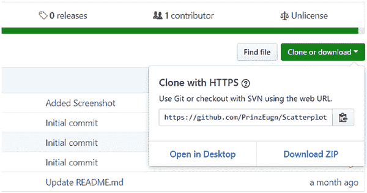

# Unity C# 中的反向传播

我们将在 Unity C# 中应用反向传播。为此，我们需要在 Unity 中打开一个新项目（图 4-2）。

***图 4-2.** 在 Unity 中打开新项目*

我们将项目命名为 `backp`。

### 构建数据结构

在深入探讨之前，我们将构建用于实现反向传播的数据结构。首先，我们将创建一个简单的一维矩阵，用于存储神经网络任意层的输出值。

```
Float[] output = new float[层中神经元数量]
```

接下来，我们需要一个权重矩阵。

```
Float[,] weights = new float[当前层神经元数量, 上一层神经元数量]
```

我们还需要权重的增量值。

```
Float[,] weightsDelta = new float[当前层神经元数量, 上一层神经元数量]
```

我们将对矩阵进行伽马处理。

```
Float[] gamma = new float[当前层神经元数量]
Float[] error = new float[当前层神经元数量]
```

这些数据结构满足了在 C# 中实现反向传播的条件。

现在，我们将在 Unity 中创建一个文件夹，用于存放我们的 C# 脚本（图 4-3）。

***图 4-3.** 创建新的 C# 脚本*

我们将文件夹命名为 `script`（图 4-4）。

***图 4-4.** 创建脚本文件夹*

现在，我们将创建一个新的 C# 脚本，并将其命名为 `NeuralNetwork`（图 4-5）。

***图 4-5.** 创建神经网络脚本*

我们将在某个编辑器中打开它，这里我们使用 Sublime Text（图 4-6）。

***图 4-6.** 在 Sublime Text 中打开文件*

我们将为神经网络创建一个构造函数。

```
public NeuralNetwork {

}

public class Layer {

}
```

神经网络将接收层信息。我们将对层进行深拷贝。

```
public class NeuralNetwork {

    int[] layer;

    public NeuralNetwork(int[] layer)
    {
        this.layer = new int[layer.Length];
        for(int i = 0; i < layer.Length; i++)
            this.layer[i] = layer[i];
    }
```

我们将创建层对象。

```
layers = new Layer[layer.length-1]
```

现在我们来处理层类。我们将声明上一层和当前层的神经元数量。

```
public class Layer {

    int numberOFInputs;
    int numberOfOutputs;

    public Layer(int numberOFInputs, int numberOfOutputs)
    {
        this.numberOFInputs = numberOFInputs;
        this.numberOfOutputs = numberOfOutputs;
    }
}
```

现在，我们将以相同的方式声明数据结构。

```
float[] outputs;
float[] inputs;
float[,] weights;
float[,] weightsDelta;
float[] gamma;
float[] error;
```

我们将声明输出和输入的大小。

```
outputs = new float[numberOfOutputs];
inputs = new float[numberOFInputs];
weights = new float[numberOfOutputs, numberOFInputs];
weightsDelta = new float[numberOfOutputs, numberOFInputs];
gamma = new float[numberOfOutputs];
error = new float[numberOfOutputs];
```

### 前向传播与权重初始化

现在我们将进行前向传播。它将接收输入并向前传播。我们需要获取最后一层的输出值。我们必须将输入传递到第一层。

```
public float[] FeedForward(float[] inputs)
{
    layers[0].FeedForward(inputs);
    for (int i = 1; i < layers.Length; i++)
    {
        layers[i].FeedForward(layers[i-1].outputs);
    }
    return layers[layers.Length - 1].outputs;
}
```

我们需要初始化一个随机数，以便初始化权重。


`public static Random random = new Random();`

现在我们将编写一个函数来初始化权重。

```
public void InitilizeWeights()
{
    for (int i = 0; i < numberOfOutputs; i++)
    {
        for (int j = 0; j < numberOfInputs; j++)
        {
            weights[i, j] = (float)random.NextDouble() - 0.5f;
        }
    }
}
```

接下来，我们将编写一个函数来为我们更新权重。

```
public void UpdateWeights()
{
    for (int i = 0; i < numberOfOuputs; i++)
    {
        for (int j = 0; j < numberOfInputs; j++)
        {
            weights[i, j] -= weightsDelta[i, j] * 0.033f;
        }
    }
}
```

## 第 4 章 Unity C#中的反向传播

我们从 `weightsDelta` 中减去乘以某个学习率的值。

`weights[i, j] -= weightsDelta[i, j] * 0.033f;`

我们需要添加两个函数：一个是输出层的反向传播，另一个是隐藏层的反向传播。我们需要计算误差的导数。我们将不得不编写一个函数来计算 `tanh` 函数的导数。

更新后，整个代码如下所示。

```
using System;

/// <summary>
/// 简单的多层感知机神经网络
/// </summary>
public class NeuralNetwork
{
    int[] layer; //层信息
    Layer[] layers; //网络中的各层

    /// <summary>
    /// 构造函数，设置各层
    /// </summary>
    /// <param name="layer">此网络的各层</param>
    public NeuralNetwork(int[] layer)
    {
        //深拷贝各层
        this.layer = new int[layer.Length];
        for (int i = 0; i < layer.Length; i++)
            this.layer[i] = layer[i];

        //创建神经层
        layers = new Layer[layer.Length - 1];
        for (int i = 0; i < layers.Length; i++)
        {
            layers[i] = new Layer(layer[i], layer[i + 1]);
        }
    }

    /// <summary>
    /// 此网络的高级前馈传播
    /// </summary>
    /// <param name="inputs">要进行前馈传播的输入</param>
    /// <returns></returns>
    public float[] FeedForward(float[] inputs)
    {
        //前馈传播
        layers[0].FeedForward(inputs);
        for (int i = 1; i < layers.Length; i++)
        {
            layers[i].FeedForward(layers[i - 1].outputs);
        }
        return layers[layers.Length - 1].outputs;
        //返回最后一层的输出
    }

    /// <summary>
    /// 高级反向传播
    /// 注意：在执行此反向传播之前，应已完成一次前馈传播。
    /// </summary>
    /// <param name="expected">上一次前馈传播的预期输出</param>
    public void BackProp(float[] expected)
    {
        // 反向遍历所有层
        for (int i = layers.Length - 1; i >= 0; i--)
        {
            if (i == layers.Length - 1)
            {
                layers[i].BackPropOutput(expected);
                //输出层反向传播
            }
            else
            {
                layers[i].BackPropHidden(layers[i + 1].gamma, layers[i + 1].weights); //隐藏层反向传播
            }
        }

        //更新权重
        for (int i = 0; i < layers.Length; i++)
        {
            layers[i].UpdateWeights();
        }
    }

    /// <summary>
    /// 多层感知机中的每个独立层
    /// </summary>
    public class Layer
    {
        int numberOfInputs; //上一层中的神经元数量
        int numberOfOuputs; //当前层中的神经元数量
        public float[] outputs; //此层的输出
        public float[] inputs; //此层的输入
        public float[,] weights; //此层的权重
        public float[,] weightsDelta; //此层的增量
        public float[] gamma; //此层的 gamma 值
        public float[] error; //输出层的误差
        public static Random random = new Random(); //静态随机类变量

        /// <summary>
        /// 构造函数，初始化各种数据结构
        /// </summary>
        /// <param name="numberOfInputs">上一层中的神经元数量</param>
        /// <param name="numberOfOuputs">当前层中的神经元数量</param>
        public Layer(int numberOfInputs, int numberOfOuputs)
        {
            this.numberOfInputs = numberOfInputs;
            this.numberOfOuputs = numberOfOuputs;

            //初始化数据结构
            outputs = new float[numberOfOuputs];
            inputs = new float[numberOfInputs];
            weights = new float[numberOfOuputs, numberOfInputs];
            weightsDelta = new float[numberOfOuputs, numberOfInputs];
            gamma = new float[numberOfOuputs];
            error = new float[numberOfOuputs];

            InitilizeWeights(); //初始化权重
        }

        /// <summary>
        /// 在 -0.5 和 0.5 之间初始化权重
        /// </summary>
        public void InitilizeWeights()
        {
            for (int i = 0; i < numberOfOuputs; i++)
            {
```


```csharp
for (int j = 0; j < numberOfInputs; j++)
{
    weights[i, j] = (float)random.NextDouble() - 0.5f;
}
```

```csharp
/// <summary>
/// 使用给定输入对该层进行前馈
/// </summary>
/// <param name="inputs">上一层的输出值</param>
/// <returns></returns>
public float[] FeedForward(float[] inputs)
{
    this.inputs = inputs; // 保留浅拷贝，可用于反向传播

    // 前馈
    for (int i = 0; i < numberOfOuputs; i++)
    {
        outputs[i] = 0;
        for (int j = 0; j < numberOfInputs; j++)
        {
            outputs[i] += inputs[j] * weights[i, j];
        }
        outputs[i] = (float)Math.Tanh(outputs[i]);
    }
    return outputs;
}
```

```csharp
/// <summary>
/// TanH 导数
/// </summary>
/// <param name="value">一个已计算出的 TanH 值</param>
/// <returns></returns>
public float TanHDer(float value)
{
    return 1 - (value * value);
}
```

```csharp
/// <summary>
/// 输出层的反向传播
/// </summary>
/// <param name="expected">期望的输出</param>
public void BackPropOutput(float[] expected)
{
    // 成本函数的误差导数
    for (int i = 0; i < numberOfOuputs; i++)
        error[i] = outputs[i] - expected[i];

    // Gamma 计算
    for (int i = 0; i < numberOfOuputs; i++)
        gamma[i] = error[i] * TanHDer(outputs[i]);

    // 计算权重增量
    for (int i = 0; i < numberOfOuputs; i++)
    {
        for (int j = 0; j < numberOfInputs; j++)
        {
            weightsDelta[i, j] = gamma[i] * inputs[j];
        }
    }
}
```

```csharp
/// <summary>
/// 隐藏层的反向传播
/// </summary>
/// <param name="gammaForward">前向层的 gamma 值</param>
/// <param name="weightsFoward">前向层的权重</param>
public void BackPropHidden(float[] gammaForward, float[,] weightsFoward)
{
    // 使用前向层的 gamma 总和计算新的 gamma
    for (int i = 0; i < numberOfOuputs; i++)
    {
        gamma[i] = 0;
        for (int j = 0; j < gammaForward.Length; j++)
        {
            gamma[i] += gammaForward[j] * weightsFoward[j, i];
        }
        gamma[i] *= TanHDer(outputs[i]);
    }

    // 计算权重增量
    for (int i = 0; i < numberOfOuputs; i++)
    {
        for (int j = 0; j < numberOfInputs; j++)
        {
            weightsDelta[i, j] = gamma[i] * inputs[j];
        }
    }
}
```

```csharp
/// <summary>
/// 更新权重
/// </summary>
public void UpdateWeights()
{
    for (int i = 0; i < numberOfOuputs; i++)
    {
        for (int j = 0; j < numberOfInputs; j++)
        {
            weights[i, j] -= weightsDelta[i, j] * 0.033f;
        }
    }
}
```

### 测试反向传播神经网络

为了测试反向传播神经网络，我们需要创建一个测试器，它将是一个经过 5000 次训练的 XOR 门（图 4-7）。

**图 4-7.** 创建测试器脚本

我们将其命名为 `tester`。XOR 将有三个值。我们有输入层、隐藏层和输出层。它将迭代超过 5000 次。

```csharp
using System.Collections;
using System.Collections.Generic;
using UnityEngine;

public class Tester : MonoBehaviour {

    void Start () {
        // 0 0 0 => 0
        // 0 0 1 => 1
        // 0 1 0 => 1
        // 0 1 1 => 0
        // 1 0 0 => 1
        // 1 0 1 => 0
        // 1 1 0 => 0
        // 1 1 1 => 1

        NeuralNetwork net = new NeuralNetwork(new int[] { 3, 25, 25, 1 }); // 初始化网络

        // 迭代 5000 次并训练每种可能的输出
        // 5000 * 8 = 40000 次训练操作
        for (int i = 0; i < 5000; i++)
        {
            net.FeedForward(new float[] { 0, 0, 0 });
            net.BackProp(new float[] { 0 });

            net.FeedForward(new float[] { 0, 0, 1 });
            net.BackProp(new float[] { 1 });

            net.FeedForward(new float[] { 0, 1, 0 });
            net.BackProp(new float[] { 1 });

            net.FeedForward(new float[] { 0, 1, 1 });
            net.BackProp(new float[] { 0 });

            net.FeedForward(new float[] { 1, 0, 0 });
            net.BackProp(new float[] { 1 });

            net.FeedForward(new float[] { 1, 0, 1 });
            net.BackProp(new float[] { 0 });

            net.FeedForward(new float[] { 1, 1, 0 });
            net.BackProp(new float[] { 0 });

            net.FeedForward(new float[] { 1, 1, 1 });
            net.BackProp(new float[] { 1 });
        }

        // 输出以查看网络是否已学习
        // 它确实学会了!!!!!
        UnityEngine.Debug.Log(net.FeedForward(new float[] { 0, 0, 0 })[0]);
    }
}
```


```csharp
UnityEngine.Debug.Log(net.FeedForward(new float[]
{ 0, 0, 1 })[0]);

UnityEngine.Debug.Log(net.FeedForward(new float[]
{ 0, 1, 0 })[0]);

UnityEngine.Debug.Log(net.FeedForward(new float[]
{ 0, 1, 1 })[0]);

UnityEngine.Debug.Log(net.FeedForward(new float[]
{ 1, 0, 0 })[0]);

UnityEngine.Debug.Log(net.FeedForward(new float[]
{ 1, 0, 1 })[0]);

UnityEngine.Debug.Log(net.FeedForward(new float[]
{ 1, 1, 0 })[0]);

UnityEngine.Debug.Log(net.FeedForward(new float[]
{ 1, 1, 1 })[0]);
}

// 每帧调用一次 Update
void Update () {
}
```

我们将把它添加到主摄像头上，然后查看输出。

## 第 4 章 Unity C# 中的反向传播

**总结**

我们已经介绍了使用 Unity C# 进行反向传播。我们讲解了相关概念，并引入了创建神经网络反向传播所需的重要数据结构。

在第 5 章中，我们将学习在 Unity 中可视化数据集的概念。我们将以示例数据集为例，尝试在 Unity 的 3D 投影中对其进行可视化。

## 第 5 章 Unity 中的数据可视化

在最后一章中，我们将探讨如何在 Unity 中实现数据可视化。本书将通过可视化 CSV（逗号分隔值）数据来收尾，以获得良好的视觉效果。

在本章中，我们将从数据可视化及其在 Unity 中的实现方式开始。由于 Unity 拥有强大的 GUI 选项，我们可以处理非常丰富的数据用于可视化。我们首先从 GitHub 下载一个开源项目，并进行相应的修改。然后在 Unity 中打开该项目，并开始探索其中的选项。最后，我们根据 CSV 文件创建可视化效果。

### Unity 中的机器学习数据可视化

在本节中，我们将学习如何在 Unity 中进行数据可视化。机器学习数据集的数据可视化非常有趣，我们将重点强调这一点。

© Abhishek Nandy, Manisha Biswas 2018  
A. Nandy and M. Biswas, *Unity 中的神经网络*,  
<https://doi.org/10.1007/978-1-4842-3673-4_5>

  


### 第 5 章 Unity 中的数据可视化

我们将从一个 GitHub 开源项目（图 5-1）开始，并对其进行相应的修改。

让我们开始吧。

<https://github.com/PrinzEugn/Scatterplot_Standalone>

**图 5-1.** 开源项目

现在我们需要下载它（图 5-2）。

**图 5-2.** 下载文件

### 数据解析

在本节中，我们将探讨数据解析。这里我们将了解如何从 CSV 文件中读取数据，并利用 Unity 的图形能力来可视化数据集。

在进一步深入之前，我们先了解一下将要解析的数据是什么。我们将解析 CSV 文件。

现在，最重要的部分是解析过程。我们使用一个免费的脚本，该脚本通过正则表达式读取 CSV 文件，并最终将其转换为字典 `<list>` 以供后续使用。代码如下。

在第一部分中，我们导入项目所需的库。

```csharp
using UnityEngine;
using System;
using System.Collections;
using System.Collections.Generic;
using System.Text.RegularExpressions;
```

// 代码来源：<https://bravenewmethod.com/2014/09/13/lightweight-csv-reader-for-unity/>

在这一部分中，我们声明了一个类，该类初始化 CSV 读取器，并使用正则表达式遍历数据集并进行相应的解析。

```csharp
// 注释
// 代码解析 CSV 文件，尽可能将值转换为 int 或 float 类型，并返回 List<Dictionary<string, object>>。

public class CSVReader
{
    static string SPLIT_RE = @",(?=(?:[^""]*""[^""]*"")*(?![^""]*""))"; // 定义分隔符，正则表达式的疯狂用法
    static string LINE_SPLIT_RE = @"\r\n|\n\r|\n|\r"; // 定义行分隔符，正则表达式的疯狂用法
    static char[] TRIM_CHARS = { '\"' };

    public static List<Dictionary<string, object>> Read(string file) // 声明方法
    {
```


```csharp
//Debug.Log("CSVReader is reading " + file);
// 打印文件名，确保解析正确

var list = new List<Dictionary<string, object>>();
//声明字典列表

TextAsset data = Resources.Load(file) as TextAsset;
//加载函数参数 file 所指定的文本资源
// Debug.Log("Data loaded:" + data);
// 打印原始数据，确保解析正确

var lines = Regex.Split(data.text, LINE_SPLIT_RE);
//使用 LINE_SPLIT_RE 字符将 data.text 分割成多行

if (lines.Length <= 1) return list;
//检查是否不止一行
```

