# 第 5 章 Unity 中的数据可视化

```csharp
var header = Regex.Split(lines[0], SPLIT_RE);
//分割表头（第 0 行）

// 遍历各行
for (var i = 1; i < lines.Length; i++)
{
    var values = Regex.Split(lines[i], SPLIT_RE);
    //根据 SPLIT_RE 分割行，存储到变量中（通常是字符串数组）
    if (values.Length == 0 || values[0] == "") continue;
    // 如果值为 0，则跳过本次循环（continue）
```

在本节中，我们将声明字典对象并修剪 CSV 文件中的字符。

```csharp
    长度或第一个值为空
    var entry = new Dictionary<string, object>();
    // 创建字典对象

    // 遍历每个值
    for (var j = 0; j < header.Length && j < values.Length; j++)
    {
        string value = values[j]; // 设置局部变量 value
        value = value.TrimStart(TRIM_CHARS).TrimEnd(TRIM_CHARS).Replace("\\", "");
        // 修剪字符
        object finalvalue = value;
        //设置最终值
```

```csharp
        int n; // 创建 int 变量，用于存储整数值
        float f; // 创建 float 变量，用于存储浮点值

        // 使用 if-else 尝试将 value 解析为 int 或 float
        if (int.TryParse(value, out n))
        {
            finalvalue = n;
        }
        else if (float.TryParse(value, out f))
        {
            finalvalue = f;
        }
        entry[header[j]] = finalvalue;
    }
    list.Add(entry); // 将字典（"entry" 变量）添加到列表
}
return list; //返回列表
}
```


让我们打开下载好的项目（图 5-3）。

***图 5-3.** 在 Unity 中打开项目*

项目打开后的界面如图 5-4 所示。

***图 5-4.** 项目窗口*

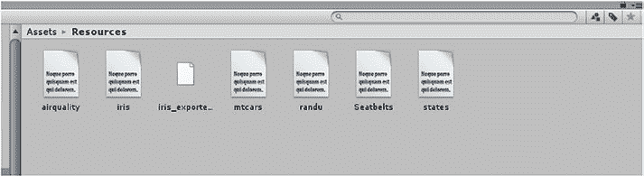

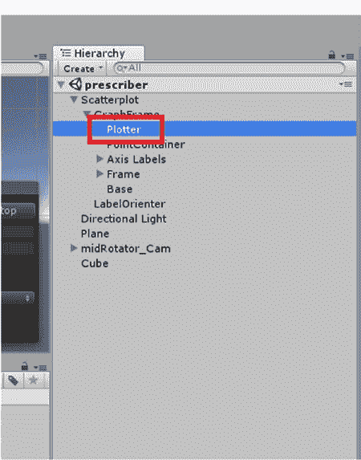

资源文件夹将包含所有 CSV 文件（图 5-5）；你也可以添加自己的文件。

***图 5-5.** CSV 文件*

如果进入层级选项卡，我们会看到散点图的一个子对象，名为 `Plotter`（图 5-6）。

***图 5-6.** 绘图器子对象*


现在，在检查器窗口中，我们可以看到点渲染器脚本。其中一个可用选项是 `Inputfile`，我们可以在其中命名 CSV 文件（图 5-7）。

***图 5-7.** 选择输入文件*

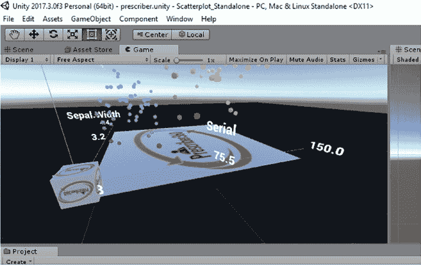

我们在这里使用的是鸢尾花数据集（图 5-8）。让我们点击播放按钮来检查可视化效果。

***图 5-8.** 可视化鸢尾花数据*

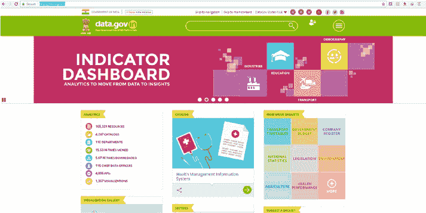

### 使用数据集

让我们尝试一些其他数据集。

我们打开 datagov.in 的以下地址（图 5-9）。

[`data.gov.in/`](https://data.gov.in/)

***图 5-9.** 探索 data.gov.in*

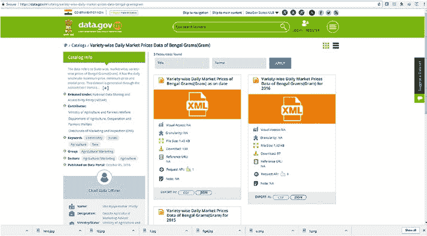

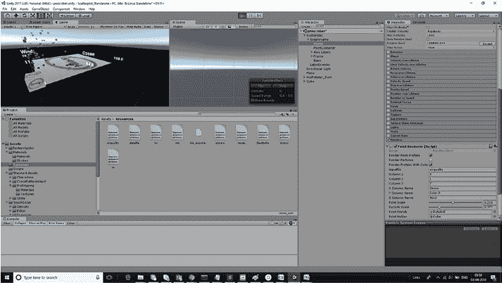

我们将处理农业数据并将其导出为 CSV 文件（图 5-10）。

***图 5-10.** 从网站保存 datagov.in 数据*

我们使用空气质量数据并保存它（图 5-11）。然后运行它。

***图 5-11.** 可视化空气质量数据*

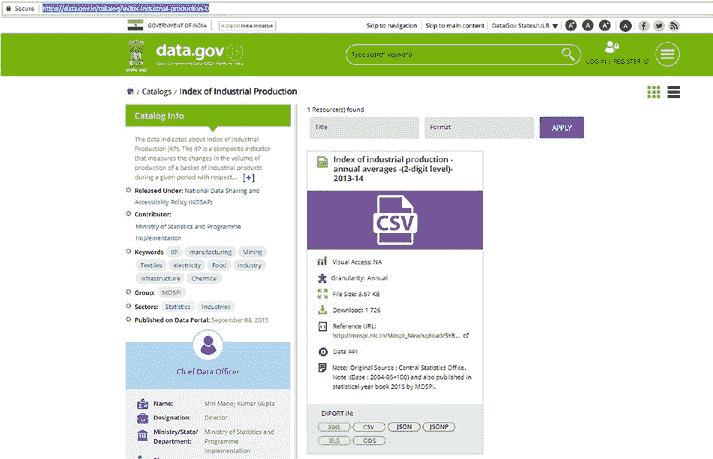

数据集点上的颜色效果是由脚本的这一部分添加的。

```csharp
dataPoint.GetComponent<Renderer>().material.color = new Color(x,y,z, 1.0f);
```

### 另一个示例

在本节中，我们将处理另一个数据集。让我们使用它。

我们将使用一个工业生产数据集（图 5-12）。

[`data.gov.in/catalog/index-industrial-production-0`](https://data.gov.in/catalog/index-industrial-production-0)

**图 5-12.** 托管在 datagov.in 上的 CSV 文件

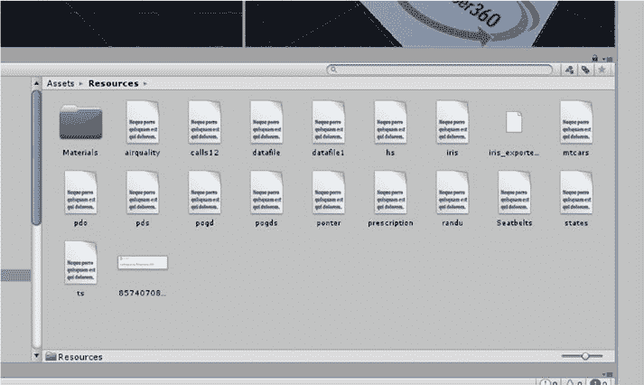

## 第 5 章 Unity 中的数据可视化

我们已将文件保存为 CSV 格式，以便 CSV 解析器能够解析其中的信息。让我们将文件复制到 `resources` 文件夹中。

复制到 `resources` 文件夹后的文件如图 5-13 所示。

**图 5-13.** `Assets` 文件夹中的 `resources` 子文件夹

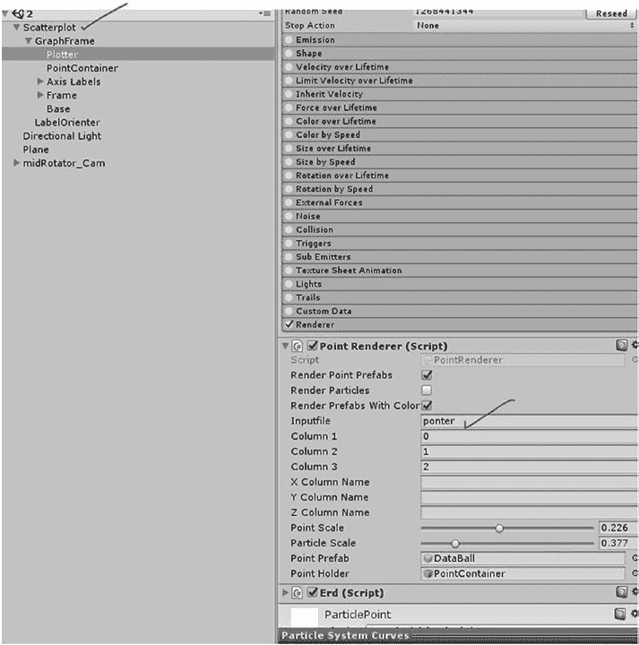

现在，我们将在检视面板中处理这个 CSV 文件。

在层级面板中，我们看到绘图仪是主要字段，它包含了 CSV 输入（图 5-14）。

**图 5-14.** 更新输入 CSV 文件的位置

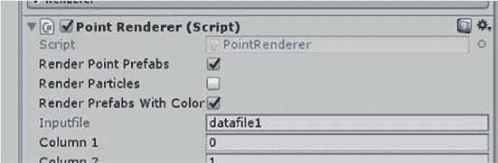

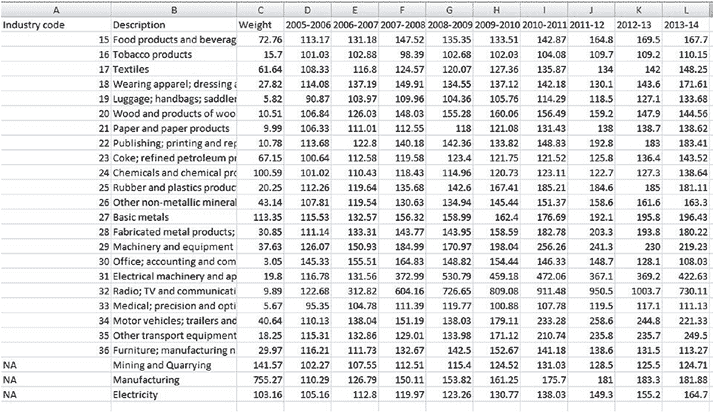

我们将更改输入文件，以读取刚从 datagov 网站下载的 CSV 文件。从检视面板中选择该过程，如图 5-15 所示。

**图 5-15.** 我们使用下载的 CSV 文件名更改了输入文件

让我们看一下 CSV 文件的快照，其中包含与工业生产指数相关的数据，如图 5-16 所示。

**图 5-16.** CSV 数据集的快照

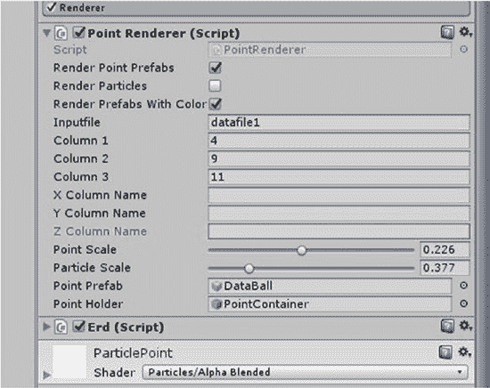

在 `x`、`y` 和 `z` 之间的投影列中，我们可以选择年份。因此，我们选择 `2006-2007`、`2011-12` 和 `2013-14`。

列的选择将从 `0` 到 `11` 进行编号。

我们选择第一列为 `4`。

第二列为 `9`。

最后一列为 `11`。

检视视图如图 5-17 所示。

**图 5-17.** 选择列

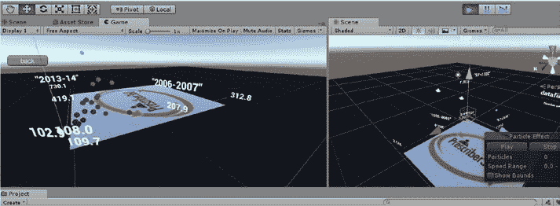

现在让我们运行应用程序并查看输出。

得到的输出如图 5-18 所示。

**图 5-18.** 显示数据集的输出

### 总结

至此，我们通过融入 Unity 数据可视化的精髓，结束了本书。

我们介绍了如何使用 CSV 在 Unity 中解析数据，以涵盖 3D 数据可视化的基本概念。

## 索引

### A

大脑类型，82

字节文件，80

`Anaconda`, 30–34

命令提示符, 74

Python 模式，49–51

配置，82

`Arctan` 函数，10

数据结构，88

人工神经网络, 2

`exe` 创建，73

### B

日志，76

场景与构建，72

反向传播, 22, 26

模拟测试，83

输入层, 114

蜘蛛资源, 107

神经网络, 113–114

`Tensorflow` 安装，75

`Sigmoid` 激活函数，114

`TFModels`, 81

测试, 133

训练细节，78

`Unity C#`

训练输出，83

构造函数，121

`Unity C#`

数据结构，118

文件夹创建，86

前馈与权重

项目创建，85

初始化, 123

脚本文件，87

神经网络脚本，120

新项目, 117

## 索引

### A

- `script 文件夹`，119

### B

- **D、E、F**

- `Sublime Text`，121

- `数据可视化`，*参见* `可视化`

- `二进制阶跃函数`，8

### C

- **C**

- `爬虫项目`

### G、H

- `assets 文件夹`，71

- `梯度下降`，22

© Abhishek Nandy, Manisha Biswas 2018  

A. Nandy 与 M. Biswas 合著，*Unity 中的神经网络*，  

[`doi.org/10.1007/978-1-4842-3673-4`](https://doi.org/10.1007/978-1-4842-3673-4)

### I

- **I**

- **L**

- `恒等函数`，7

- `Leaky ReLU`，12

- `InitNeurons` 和 `InitWeights`

- `Logistic/Sigmoid`，8

- 方法，88

- `内部操作`

### M

- **M**

- `ML-Agents`，44

- `exe 文件`，47，49

- `机器学习代理`

- `检查器窗口`，46

- (`ML-Agents`)，27

- `Jupyter Notebook` (*参见* `Jupyter Notebook`)

- `Anaconda`，30–34

- `爬虫项目` (*参见* `爬虫项目`)

- `ml-agents-master 文件`，51

- `玩家选项`，45

- `GitHub 仓库`，29

- `Python 模式`，49–51

- `GPU 加速的 TensorFlow`

- `场景与构建`

- `合适的文件夹`，37

- `选择`，48

- `详细信息`，37

- `环境`，35

- `GitHub 仓库`，35

### J、K

- **J、K**

- `Jupyter Notebook`

- `action_space_type`，54

- `浏览器模式`，51

- `IPython 文件`，52

- `matplotlib 命令`，53

- `近端策略`

- `优化`，57

- `奖励`，56

- `强化`，28

- `训练模式`，53

- `步骤`，28

- `Unity 文件`，55

- `Tensorflow`，30

- `Unity 脚本`，53

- `unity 环境`，70

- `变量与参数`，56

- `Unity 项目`

- `Ball3dBrain`，42

- `网页浏览器与相应文件`，52

- `引擎启动`，40

- `外部类型`，43

- `场景文件`，41

- `模拟`，44

- `工作流程`，41

- `网站链接`，28

- `数学方法`，3–4

- `偏置与权重`

- `应用偏置`，16

- `偏置作用`，17

- `创建`，13

- `作用`，15

- `求和规则`，14

- `列表`，5

- `近端策略优化 (PPO)`

- `bytes 文件`，62

- `启用模式`，64

- `环境`，58

- `特性`，61

- `超参数`，57

- `链接`，63

- `缺失文本资源`，65

- `模型图`，58

- `结果`，67

- `源代码`，57

- `TensorFlow 图`，62

- `TensorFlowSharp`

- `插件`，63

- `文本资源`，66

- `tfmodels 文件夹`，64

- `训练模型`，61

### N、O

- **N、O**

- `NVIDIA CUDA 工具包`，34

### P、Q

- **P、Q**

- `解析`

- `CSV 文件`，144

- `下载的项目`，143

- `输入文件`，145

- `鸢尾花数据`，146

- `库`，139

- `绘图子组件`，144

- `项目`，143

- `窗口`，143

- `感知机`

- `激活函数`，5

- `反正切函数`，10

- `二进制阶跃函数`，8

- `不同类型`，6

- `恒等函数`，7

- `输入`，6

- `Leaky ReLU`，12

- `Logistic/Sigmoid`，8

- `ReLU 函数`，11

- `Softmax 函数`，12

- `强化学习`，28

### R

- **R**

- `修正线性单元 (ReLU)`，11

### S

- **S**

- `Scratch`，17

- `创建`，18

- `误差`，25

- `梯度下降`，22

- `输入神经元`，20

- `NumPy`，19

- `概率`，20

- `修正`，25

- `源代码`，22

- `步骤`，19

- `后续层`，21

- `突触`，20

- `训练模块`，21

- `Sigmoid 函数`，8

- `Softmax 函数`，12

- `突触`，20

### T、U

- **T、U**

- `Tan H 函数`，9

- `Tensorflow`，30

### V、W、X、Y、Z

- **V、W、X、Y、Z**

- `可视化`

- `空气质量数据`，148

- `assets 文件夹`，150

- `列选择`，153

- `CSV 文件`，149

- `数据集`，147

- `文件下载`，138

- `输入 CSV 文件`，151

- `检查器窗口`，152

- `开源项目`，138

- `输出`，154

- `解析`

- `CSV 文件`，144

- `下载的项目`，143

- `输入文件`，145

- `鸢尾花数据`，146

- `库`，139

- `绘图子组件`，144

- `项目`，143

- `窗口`，143

- `快照`，152