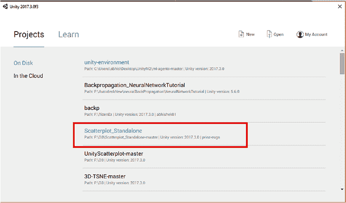
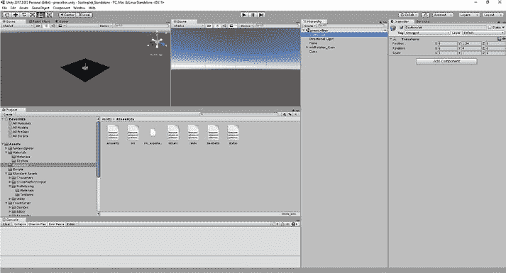

# 第 5 章 Unity 中的数据可视化

```csharp
        int n; // 创建 int 变量，用于存储整数值
        float f; // 创建 float 变量，用于存储浮点值

        // 使用 if-else 尝试将 value 解析为 int 或 float
        if (int.TryParse(value, out n))
        {
            finalvalue = n;
        }
        else if (float.TryParse(value, out f))
        {
            finalvalue = f;
        }
        entry[header[j]] = finalvalue;
    }
    list.Add(entry); // 将字典（"entry" 变量）添加到列表
}
return list; //返回列表
}
```





