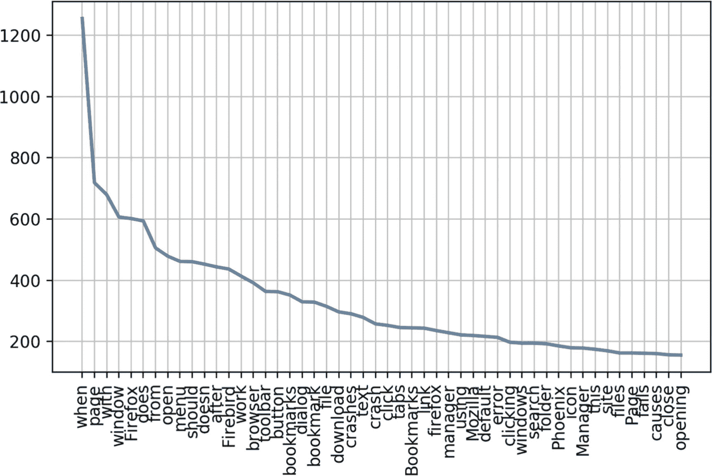
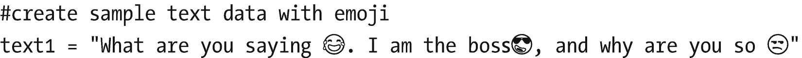
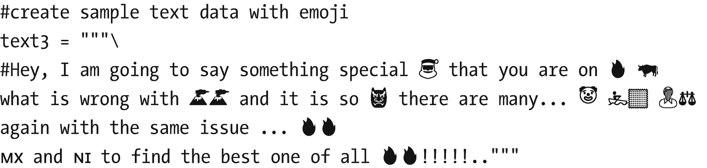
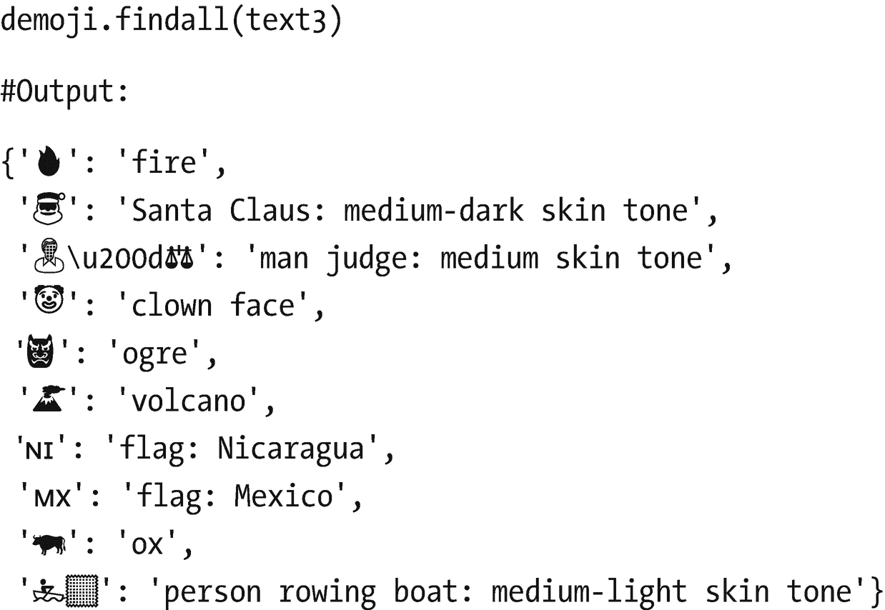

# 二、探索和处理文本数据

本章讨论预处理文本数据和探索性数据分析的各种方法和技术。它涵盖了以下食谱。

*   食谱 1。用小写字体书写

*   食谱 2。删除标点符号

*   食谱三。停止单词删除

*   食谱 4。文本标准化

*   食谱 5。拼写纠正

*   食谱 6。标记化

*   食谱 7。堵塞物

*   食谱 8。词汇化

*   食谱 9。探索性数据分析

*   食谱 10。处理表情符号和表情符号

*   食谱 11。端到端处理流水线

在直接进入食谱之前，让我们先了解一下预处理文本数据的必要性。众所周知，世界上大约 90%的数据是非结构化的，可能以图像、文本、音频和视频的形式存在。文本可以有多种形式，从单个单词的列表到句子，再到包含特殊字符的多个段落(如 tweets 和其他标点符号)。它也可能以 web、HTML、文档等形式出现。而且这些数据从来都不是干净的，包含了大量的噪音。需要对其进行处理，然后执行一些预处理功能，以确保为特征工程和模型构建提供正确的输入数据。如果不对数据进行预处理，任何建立在这些数据之上的算法都不会给企业带来任何价值。这让我们想起了数据科学中非常流行的一句话:“垃圾进，垃圾出。”

预处理包括将原始文本数据转换成可理解的格式。真实世界的数据通常是不完整的、不一致的、充满了大量噪声，并且很可能包含许多错误。预处理是解决这类问题的一种行之有效的方法。数据预处理为进一步处理准备原始文本数据。

## 食谱 2-1。将文本数据转换为小写

这个菜谱讨论了如何将文本数据小写，以使所有数据具有统一的格式，并确保“nlp”和“NLP”被同等对待。

### 问题

你想要小写的文本数据。

### 解决办法

最简单的方法是使用 Python 中默认的`lower()`函数。

`lower()`方法将字符串中的所有大写字符转换成小写字符并返回它们。

### 它是如何工作的

按照本节中的步骤对给定的文本或文档进行小写。这里用的是 Python。

#### 步骤 1-1。读取/创建文本数据

让我们创建一个字符串列表，并将其赋给一个变量。

```py
text=['This is introduction to NLP','It is likely to be useful, to people ','Machine learning is the new electrcity','There would be less hype around AI and more action going forward','python is the best tool!','R is good langauage','I like this book','I want more books like this']
#convert list to data frame
import pandas as pd
df = pd.DataFrame({'tweet':text})
print(df)
#output
                                               tweet
0                        This is introduction to NLP
1               It is likely to be useful, to people
2             Machine learning is the new electrcity
3  There would be less hype around AI and more ac...
4                           python is the best tool!
5                                R is good langauage
6                                   I like this book
7                        I want more books like this

```

#### 步骤 1-2。对文本数据执行 lower()函数

当只有一个字符串时，直接应用`lower()`函数如下。

```py
x = 'Testing'
x2 = x.lower()
print(x2)
#output

'testing'

```

当您想要对数据框执行小写操作时，请按如下方式使用应用函数。

```py
df['tweet'] = df['tweet'].apply(lambda x: " ".join(x.lower() for x in x.split()))
df['tweet']
#output
0                          this is introduction to nlp
1                 it is likely to be useful, to people
2               machine learning is the new electrcity
3    there would be less hype around ai and more ac...
4                             python is the best tool!
5                                  r is good langauage
6                                     i like this book
7                          i want more books like this

```

或者，您可以使用以下代码:

```py
df['tweet'] = df['tweet'].str.lower()

```

仅此而已。整个 tweet 列被转换成小写。让我们看看在接下来的食谱中你还能做些什么。

## 食谱 2-2。删除标点符号

这个食谱讨论了如何从文本数据中删除标点符号。这一步非常重要，因为标点符号不会增加任何额外的信息或价值。因此，删除所有这样的实例减少了数据的大小并提高了计算效率。

### 问题

您希望从文本数据中删除标点符号。

### 解决办法

最简单的方法是使用 Python 中的 regex 和`replace()`函数。

### 它是如何工作的

按照本节中的步骤删除文本数据中的标点符号。

#### 步骤 2-1。读取/创建文本数据

让我们创建一个字符串列表，并将其赋给一个变量。

```py
text=['This is introduction to NLP','It is likely to be useful, to people ','Machine learning is the new electrcity','There would be less hype around AI and more action going forward','python is the best tool!','R is good langauage','I like this book','I want more books like this']
#convert list to dataframe
import pandas as pd
df = pd.DataFrame({'tweet':text})
print(df)
#output
 tweet
0 This is introduction to NLP
1 It is likely to be useful, to people
2 Machine learning is the new electrcity
3 There would be less hype around AI and more ac...
4 python is the best tool!
5 R is good langauage
6 I like this book
7 I want more books like this

```

#### 第 2-2 步。对文本数据执行 replace()函数

使用 regex 和`replace()`函数，您可以删除标点符号，如下所示。

```py
import re
s = "I. like. This book!"
s1 = re.sub(r'[^\w\s]',",s)
s1
#output

'I like This book'

```

或者:

```py
df['tweet'] = df['tweet'].str.replace('[^\w\s]',")
df['tweet']
#output
0                          this is introduction to nlp
1                  it is likely to be useful to people
2               machine learning is the new electrcity
3    there would be less hype around ai and more ac...
4                              python is the best tool
5                                  r is good langauage
6                                     i like this book
7                          i want more books like this

```

或者:

```py
import string
s = "I. like. This book!"
for c in string.punctuation:
      s= s.replace(c,"")
s
#output

'I like This book'

```

## 食谱 2-3。删除停用词

这个食谱讨论了如何删除停用词。停用词是非常常见的词，与其他关键字相比没有意义或意义较小。如果去掉不常用的词，就可以把重点放在重要的关键词上。例如，在一个搜索引擎中，如果您的搜索查询是“如何使用 Python 开发聊天机器人”，如果搜索引擎试图查找包含单词 *how* 、 *to* 、 *develop* 、 *chatbot* 、 *using* 和 *python* 的网页，搜索引擎找到的包含 *how* 和 *to* 的网页要比包含关于开发聊天机器人的信息的网页多得多因此，如果你删除这些词，搜索引擎可以专注于检索包含关键字*开发*、*聊天机器人*和 *python* 的页面，这将更接近真正感兴趣的页面。同样，你也可以去掉其他常用词和生僻字。

### 问题

你想删除停用词。

### 解决办法

最简单的方法是使用 NLTK 库或构建自己的停用词文件。

### 它是如何工作的

按照本节中的步骤从文本数据中删除停用词。

#### 步骤 3-1。读取/创建文本数据

让我们创建一个字符串列表，并将其赋给一个变量。

```py
text=['This is introduction to NLP','It is likely to be useful, to people ','Machine learning is the new electrcity','There would be less hype around AI and more action going forward','python is the best tool!','R is good langauage','I like this book','I want more books like this']
#convert list to data frame
import pandas as pd
df = pd.DataFrame({'tweet':text})
print(df)
#output
 tweet
0 This is introduction to NLP
1 It is likely to be useful, to people
2 Machine learning is the new electrcity
3 There would be less hype around AI and more ac...
4 python is the best tool!
5 R is good langauage

6 I like this book
7 I want more books like this

```

#### 第 3-2 步。从文本数据中删除标点符号

使用 NLTK 库，您可以删除标点符号，如下所示。

```py
#install and import libraries
!pip install nltk
import nltk
nltk.download()
from nltk.corpus import stopwords
#remove stop words
stop = stopwords.words('english')
df['tweet'] = df['tweet'].apply(lambda x: " ".join(x for x in x.split() if x not in stop))
df['tweet']
#output
0                                  introduction nlp
1                              likely useful people
2                   machine learning new electrcity
3    would less hype around ai action going forward
4                                  python best tool
5                                  r good langauage

6                                         like book
7                                   want books like

```

现在没有停止词了。这一步什么都去掉了。

## 食谱 2-4。标准化文本

这个食谱讨论了如何标准化文本。但在此之前，我们先讨论一下文本标准化以及为什么需要它。大多数文本数据存在于客户评论、博客或推文中，在这些地方，人们很有可能使用短词和缩写来表示相同的意思。这可以帮助下游过程容易地理解和解决文本的语义。

### 问题

你想要标准化文本。

### 解决办法

您可以编写自己的自定义词典来查找短单词和缩写。首先，您需要查看数据中是否存在任何短词和缩写。这可以通过查看我们文档中单词的频率分布或在创建自定义词典之前通过单词云可视化来实现。

### 它是如何工作的

按照本节中的步骤执行文本标准化。

#### 步骤 4-1。创建自定义查找字典

该词典用于根据您的数据进行文本标准化。

```py
lookup_dict = {'nlp':'natural language processing', 'ur':'your', "wbu" : "what about you"}
import re

```

#### 第 4-2 步。为文本标准化创建自定义函数

代码如下:

```py
def text_std(input_text):
 words = input_text.split()
 new_words = []
 for word in words:
     word = re.sub(r'[^\w\s]',",word)
     if word.lower() in lookup_dict:
         word = lookup_dict[word.lower()]
         new_words.append(word)
         new_text = " ".join(new_words)
 return new_text

```

#### 第 4-3 步。运行文本 _ 标准函数

输出也需要检查。

```py
text_std("I like nlp it's ur choice")
#output

'natural language processing your'
Here, nlp has standardized to 'natural language processing' and ur to 'your'.

```

## 食谱 2-5。纠正拼写

这个食谱讨论了如何进行拼写纠正。但在此之前，我们先来看看为什么这个拼写纠正很重要。大多数文本数据存在于客户评论、博客或推文中，在这些地方，人们很有可能使用短词并犯打字错误。这样就减少了代表同一个意思的单词的多个副本。例如,“processing”和“processing”被视为不同的词，即使在相同的意义上使用。

请注意，缩写应该在这一步之前处理，否则校正器有时会失败。比如说，“ur”(实际上是“你的”)会被更正为“or”

### 问题

你想做拼写纠正。

### 解决办法

最简单的方法是使用 TextBlob 库。

### 它是如何工作的

按照本节中的步骤进行拼写更正。

#### 步骤 5-1。读取/创建文本数据

让我们创建一个字符串列表，并将其赋给一个变量。

```py
text=['Introduction to NLP','It is likely to be useful, to people ','Machine learning is the new electrcity', 'R is good langauage','I like this book','I want more books like this']
#convert list to dataframe
import pandas as pd
df = pd.DataFrame({'tweet':text})
print(df)
#output
                                    tweet
0                     Introduction to NLP
1    It is likely to be useful, to people
2  Machine learning is the new electrcity
3                     R is good langauage
4                        I like this book
5             I want more books like this

```

#### 第 5-2 步。对文本数据执行拼写纠正

使用 TextBlob，您可以进行拼写，如下所示。

```py
#Install textblob library
!pip install textblob

#import libraries and use 'correct' function
from textblob import TextBlob
df['tweet'].apply(lambda x: str(TextBlob(x).correct()))
#output
0                        Introduction to NLP
1       It is likely to be useful, to people
2    Machine learning is the new electricity
3                         R is good language
4                           I like this book
5                I want more books like this

```

请注意，`electricity`的拼写和语言已被更正。

```py
#You can also use autocorrect library as shown below
#install autocorrect
!pip install autocorrect
from autocorrect import spell
print(spell(u'mussage'))
print(spell(u'sirvice'))

#output
'message'
'service'

```

## 配方 2-6。标记文本

这个食谱着眼于标记化的方法。标记化是指将文本分割成最小的有意义的单元。有一个句子分词器和一个单词分词器。你在这个食谱中看到一个单词分词器。对于任何类型的分析，这都是文本预处理中必不可少的步骤。有许多库可以执行标记化，如 NLTK、spaCy 和 TextBlob。这里有几种方法可以实现。

### 问题

你想做记号化。

### 解决办法

最简单的方法是使用 TextBlob 库。

### 它是如何工作的

按照本节中的步骤执行标记化。

#### 步骤 6-1。读取/创建文本数据

让我们创建一个字符串列表，并将其赋给一个变量。

```py
text=['This is introduction to NLP','It is likely to be useful, to people ','Machine learning is the new electrcity','There would be less hype around AI and more action going forward','python is the best tool!','R is good langauage','I like this book','I want more books like this']
#convert list to dataframe
import pandas as pd
df = pd.DataFrame({'tweet':text})
print(df)
#output
 tweet
0 This is introduction to NLP

1 It is likely to be useful, to people
2 Machine learning is the new electrcity
3 There would be less hype around AI and more ac...
4 python is the best tool!
5 R is good langauage
6 I like this book
7 I want more books like this

```

#### 第 6-2 步。将文本数据标记化

标记化的结果是一个标记列表。

```py
#Using textblob
from textblob import TextBlob
TextBlob(df['tweet'][3]).words

#output
WordList(['would', 'less', 'hype', 'around', 'ai', 'action', 'going', 'forward'])
#using NLTK
import nltk
#create data
mystring = "My favorite animal is cat"
nltk.word_tokenize(mystring)
#output

['My', 'favorite', 'animal', 'is', 'cat']
#using split function from python
mystring.split()
#output
['My', 'favorite', 'animal', 'is', 'cat']

```

## 食谱 2-7。堵塞物

这个食谱讨论词干。词干提取是提取词根的过程。比如*鱼*、*鱼*、*鱼*被词干化为*鱼*。

### 问题

你想做词干分析。

### 解决办法

最简单的方法是使用 NLTK 或 TextBlob 库。

### 它是如何工作的

按照本节中的步骤执行词干分析。

#### 步骤 7-1。读取文本数据

让我们创建一个字符串列表，并将其赋给一个变量。

```py
text=['I like fishing','I eat fish','There are many fishes in pound']
#convert list to dataframe
import pandas as pd
df = pd.DataFrame({'tweet':text})
print(df)
#output
                            tweet
0                  I like fishing
1                      I eat fish
2  There are many fishes in pound

```

#### 第 7-2 步。阻止文本

对文本数据执行以下代码。

```py
#Import library

from nltk.stem import PorterStemmer
st = PorterStemmer()
df['tweet'][:5].apply(lambda x: " ".join([st.stem(word) for word in x.split()]))
#output
0                     I like fish
1                      I eat fish
2    there are mani fish in pound

```

注意，fish、fishing 和 fish 都被词干化为 fish。

## 食谱 2-8。词汇化

这个食谱讨论了词汇化，即通过考虑词汇表提取词根的过程。比如*好的*、*更好的*，或者*最好的*被词条化为*好的*。

词的词性是在词条化中确定的。它返回单词的字典形式，该形式必须有效。而词干提取只是提取词根。

*   简化处理匹配*车*到*车*以及匹配*车*到*车*。

*   炮泥手柄将*车*与*车*匹配。

引理化可以得到更好的结果。

*   *叶*的词干形式为*叶*。

*   *叶*的词干形式是*叶*。

*   *叶*的词汇化形式为*叶*。

*   *叶*的词汇化形式为*叶*。

### 问题

你想进行词汇化。

### 解决办法

最简单的方法是使用 NLTK 或 TextBlob 库。

### 它是如何工作的

按照本节中的步骤执行术语化。

#### 步骤 8-1。读取文本数据

让我们创建一个字符串列表，并将其赋给一个变量。

```py
text=['I like fishing','I eat fish','There are many fishes in pound', 'leaves and leaf']
#convert list to dataframe
import pandas as pd
df = pd.DataFrame({'tweet':text})
print(df)
                                tweet
0                      I like fishing
1                          I eat fish
2  There are multiple fishes in pound
3                     leaves and leaf

```

#### 步骤 8-2。将数据符号化

对文本数据执行以下代码。

```py
#Import library
from textblob import Word
#Code for lemmatize
df['tweet'] = df['tweet'].apply(lambda x: " ".join([Word(word).lemmatize() for word in x.split()]))
df['tweet']
#output

0                      I like fishing
1                          I eat fish
2    There are multiple fish in pound
3                       leaf and leaf

```

你可以观察到，鱼和鱼都被旅鼠化为鱼，叶子和叶子都被旅鼠化为叶子。

## 食谱 2-9。浏览文本数据

到目前为止，您应该已经熟悉了数据收集和文本预处理。让我们进行一些探索性的数据分析。

### 问题

你想要探索和理解文本数据。

### 解决办法

最简单的方法是使用 NLTK 或 TextBlob 库。

### 它是如何工作的

遵循此过程中的步骤。

#### 步骤 9-1。读取文本数据

如果您还没有下载数据集，请执行以下代码下载数据集。

```py
nltk.download().
#Importing data
import nltk
from nltk.corpus import webtext
nltk.download('webtext')
wt_sentences = webtext.sents('firefox.txt')
wt_words = webtext.words('firefox.txt')

```

#### 步骤 9-2。导入必要的库

用于计算频率的导入库:

```py
from nltk.probability import FreqDist
from nltk.corpus import stopwords
import string

```

#### 步骤 9-3 检查数据中的字数

数数单词的数量:

```py
len(wt_sentences)
#output
1142
len(wt_words)
#output
102457

```

#### 步骤 9-4。计算评论中所有单词的频率

为所有单词生成频率:

```py
frequency_dist = nltk.FreqDist(wt_words)
frequency_dist
#showing only top few results
FreqDist({'slowing': 1,
          'warnings': 6,
          'rule': 1,
          'Top': 2,
          'XBL': 12,
          'installation': 44,
          'Networking': 1,
          'inccorrect': 1,
          'killed': 3,
          ']"': 1,
          'LOCKS': 1,
          'limited': 2,
          'cookies': 57,
          'method': 12,
          'arbitrary': 2,
          'b': 3,
          'titlebar': 6,
sorted_frequency_dist =sorted(frequency_dist,key=frequency_dist.__getitem__, reverse=True)
sorted_frequency_dist

['.',
 'in',
 'to',
 '"',
 'the',
 "'",
 'not',
 '-',
 'when',
 'on',
 'a',
 'is',
 't',

 'and',
 'of',

```

#### 第 9-5 步。考虑长度大于 3 的单词并绘图

我们只考虑频率大于三的词。

```py
large_words = dict([(k,v) for k,v in frequency_dist.items() if len(k)>3])
frequency_dist = nltk.FreqDist(large_words)
frequency_dist.plot(50,cumulative=False)
#output

```



#### 第 9-6 步。构建单词云

单词云是最频繁重复的单词的图形表示。

```py
#install library

!pip install wordcloud
#build wordcloud
from wordcloud import WordCloud
wcloud = WordCloud().generate_from_frequencies(frequency_dist)
#plotting the wordcloud
import matplotlib.pyplot as plt
plt.imshow(wcloud, interpolation="bilinear")
plt.axis("off")
(-0.5, 399.5, 199.5, -0.5)
plt.show()
#output

```


接下来，让我们删除停用词，然后建立词云。输出应该类似于下一个菜谱中显示的内容。


## 配方 2-10。处理表情符号和表情符号

什么是表情符号？*表情符号*这个词本质上是“形象人物”的意思(来源于日语 *e* 意为“形象:*莫吉*意为“字母人物”)。什么是表情？:):-]表情符号代表一个人的面部表情，只使用键盘字符，如字母、数字和标点符号。

在今天的网络世界中，表情符号和表情符号是主要的语言，当我们需要快速准确地与全球任何人交流时，它们可以让我们与他们交流。表情符号和表情符号在文本分析中都起着重要的作用。它们最常用于社交媒体、电子邮件和短信，尽管它们可以在任何类型的电子通信中找到。在情感没有用的情况下，你可能需要把它们从你的文本分析中去除。另一方面，您应该保留它们，因为它们提供了有价值的信息，尤其是在情感分析中，删除它们可能不是一个合适的解决方案；例如，如果一家公司想知道人们对社交媒体上的新产品、新活动或品牌的感受。

表情符号通过想象用户的情绪、态度和观点，帮助识别消费者参与度需要提高的地方。这提供了重要的信息，对于任何企业来说，更好地理解客户的感受都是至关重要的。表情符号和表情符号数据的收集和分析为公司提供了有用的信息。它们可以转换成 word 格式，用于建模过程。在这本书里，你看到了如何用 Python 保存 word 格式的表情符号和表情符号。

这本书用了一个叫 emot 的库。

### 问题

你想用一个相关的、有意义的词来代替表情符号。

### 解决办法

最简单的方法就是使用 emot 库。

### 它是如何工作的

遵循以下步骤。

#### 步骤 10-A1。读取文本数据


#### 步骤 10-A2。安装并导入必要的库

```py
#Installing emot library

!pip install emot

#Importing libraries
import re
from emot.emo_unicode import UNICODE_EMO, EMOTICONS

```

#### 步骤 10-A3。写一个把表情符号转换成单词的函数

```py
# Function for converting emojis into word

def converting_emojis(text):
    for emot in UNICODE_EMO:
        text = text.replace(emot, "_".join(UNICODE_EMO[emot].replace(",","").replace(":","").split()))
    return text

```

#### 步骤 10-A4。将带有表情符号的文本传递给函数

```py
converting_emojis(text1) 

#output
What are you saying face_with_tears_of_joy. I am the boss smiling_face_with_sunglasses, and why are you so unamused_face

```

### 问题

你想移除表情符号

### 解决办法

最简单的方法是使用 Unicode。

### 它是如何工作的

遵循以下步骤。

#### 步骤 10-B1。读取文本数据



#### 第十步-B2。安装并导入必要的库

```py
#Importing libraries
import re

from emot.emo_unicode import UNICODE_EMO, EMOTICONS

```

#### 第十步-B3。写一个移除表情符号的函数

```py
def emoji_removal(string)

:
    emoji_unicodes = re.compile("["
                               u"\U0001F600-\U0001F64F"  # emoticons
                               u"\U0001F300-\U0001F5FF"  # symbols
                               u"\U0001F680-\U0001F6FF"  # transport
                               u"\U0001F1E0-\U0001F1FF"  # flags (iOS)
                               u"\U00002500-\U00002BEF"
                               u"\U00002702-\U000027B0"
                               u"\U000024C2-\U0001F251"
                               u"\U0001f926-\U0001f937"
                               u"\U00010000-\U0010ffff"
                               u"\u2640-\u2642"
                               u"\u2600-\u2B55"
                               u"\u200d"
                               u"\u23cf"
                               u"\u23e9"
                               u"\u231a"
                               u"\ufe0f"
                               u"\u3030"
                               "]+", flags=re.UNICODE)
    return emoji_unicodes.sub(r'', string)

```

#### 步骤 10-B4。将带有表情符号的文本传递给函数

```py
emoji_removal(text1)

#output

What are you saying. I am the boss, and why are you so emoji_removal

```

### 问题

你想用相关的，有意义的单词替换表情符号。

### 解决办法

最简单的方法就是使用 emot 库。

### 它是如何工作的

遵循以下步骤。

#### 第十步-C1。读取文本数据

```py
#create sample text data with emoticons

text2 = "Hey, how are you :-) how was your day, what are you doing?:-)"

```

#### 第十步-C2。安装并导入必要的库

```py
#Installing emot library

!pip install emot
#Importing libraries
import re
from emot.emo_unicode import UNICODE_EMO, EMOTICONS

```

#### 第十步-C3。编写将表情符号转换为文字的功能

```py
# Function to convert emoticons into word

def converting_emoticons(text):
    for emot in EMOTICONS:
        text = re.sub(u'('+emot+')', "_".join(EMOTICONS[emot].replace(",","").split()), text)
    return text

```

#### 第十步-C4。将带有表情符号的文本传递给函数

```py
converting_emoticons(text2)

#output

Hey, how are you Happy_face_smiley how was your day, what are you doing? Happy_face_smiley"

```

### 问题

您想删除表情图标吗

### 解决办法

最简单的方法是使用 Unicode。移除表情符号和表情符号的代码保持不变；但是，您需要添加各自的 Unicode。

### 它是如何工作的

遵循以下步骤。

#### 步骤 10-D1 读取文本数据

```py
#create sample text data with emoticons

text2 = "Hey, how are you :-) how was your day, what are you doing?:-)"

```

#### 第十步-D2。安装并导入必要的库

```py
#Importing libraries
import re
from emot.emo_unicode import UNICODE_EMO, EMOTICONS

```

#### 步骤 10-D3。写函数去掉表情

```py
def removing_emoticons(string)

:
    emot_unicodes = re.compile("["
                               u"\U0001F600-\U0001F64F"  # emoticons
                               u"\U0001F300-\U0001F5FF"  # symbols
                               u"\U0001F680-\U0001F6FF"  # transport
                               u"\U0001F1E0-\U0001F1FF"  # flags (iOS)
                               u"\U00002500-\U00002BEF"
                               u"\U00002702-\U000027B0"
                               u"\U000024C2-\U0001F251"
                               u"\U0001f926-\U0001f937"
                               u"\U00010000-\U0010ffff"
                               u"\u2640-\u2642"
                               u"\u2600-\u2B55"
                               u"\u200d"
                               u"\u23cf"
                               u"\u23e9"
                               u"\u231a"
                               u"\ufe0f"
                               u"\u3030"
                               "]+", flags=re.UNICODE)

    return emot_unicodes.sub(r'', string)

```

#### 第十步-D4。将带有表情符号的文本传递给函数

```py
removing_emoticons(text2)

#output

Hey, how are you how was your day, what are you doing?"

```

### 问题

找到检测表情符号并确定其含义的库。

### 解决办法

你可以使用 demoji 库。

### 它是如何工作的

遵循以下步骤。

#### 第十步-E1。读取文本数据



#### 步骤 10-E2。安装并导入必要的库

```py
#Installing & Importing libraries
!pip install demoji
import demoji
demoji.download_codes()

```

#### 第十步-E3。找到所有表情符号并确定它们的含义



## 食谱 2-11。构建文本预处理管道

到目前为止，您已经完成了大部分的文本操作和处理技术和方法。让我们在这个食谱中做一些有趣的事情。

### 问题

您希望构建一个端到端的文本预处理管道。每当您想要对任何 NLP 应用程序进行预处理时，您可以直接将数据插入这个管道函数，并获得所需的干净文本数据作为输出。

### 解决办法

最简单的方法是使用您到目前为止学到的所有技术创建一个自定义函数。

### 它是如何工作的

它的工作原理是将所有可能的处理技术放入一个包装器函数中，并通过它传递数据。

#### 步骤 11-1。读取/创建文本数据

让我们创建一个字符串列表，并将其赋给一个变量——也许是一条样本 tweet。

```py
tweet_sample= "How to take control of your #debt https://personal.vanguard.com/us/insights/saving-investing/debt-management.#Best advice for #family #financial #success (@PrepareToWin)"

```

你也可以使用你在第 [1](1.html) 章中提取的 Twitter 数据。

#### 步骤 11-2。处理文本

执行下面的函数来处理 tweet。

```py
def processRow(row):
    import re

    import nltk
    from textblob import TextBlob
    from nltk.corpus import stopwords
    from nltk.stem import PorterStemmer
    from textblob import Word
    from nltk.util import ngrams
    import re
    from wordcloud import WordCloud, STOPWORDS
    from nltk.tokenize import word_tokenize
    tweet = row
    #Lower case
    tweet.lower()
    #Removes unicode strings like "\u002c" and "x96"
    tweet = re.sub(r'(\\u[0-9A-Fa-f]+)', "r", tweet)
    tweet = re.sub(r'[^\x00-\x7f]', "r",tweet)
    #convert any url to URL
    tweet = re.sub('((www\.[^\s]+)|(https?://[^\s]+))','URL',tweet)
    #Convert any @Username to "AT_USER"
    tweet = re.sub('@[^\s]+','AT_USER',tweet)
    #Remove additional white spaces
    tweet = re.sub('[\s]+', ' ', tweet)
    tweet = re.sub('[\n]+', ' ', tweet)
    #Remove not alphanumeric symbols white spaces
    tweet = re.sub(r'[^\w]', ' ', tweet)
    #Removes hastag in front of a word """
    tweet = re.sub(r'#([^\s]+)', r'\1', tweet)
    #Replace #word with word
    tweet = re.sub(r'#([^\s]+)', r'\1', tweet)
    #Remove :( or :)

    tweet = tweet.replace(':)',")
    tweet = tweet.replace(':(',")
    #remove numbers
    tweet = ".join([i for i in tweet if not i.isdigit()])
    #remove multiple exclamation
    tweet = re.sub(r"(\!)\1+", ' ', tweet)
    #remove multiple question marks
    tweet = re.sub(r"(\?)\1+", ' ', tweet)
    #remove multistop

    tweet = re.sub(r"(\.)\1+", ' ', tweet)
    #lemma
    from textblob import Word
    tweet =" ".join([Word(word).lemmatize() for word in tweet.split()])
    #stemmer

    #st = PorterStemmer()
    #tweet=" ".join([st.stem(word) for word in tweet.split()])
    #Removes emoticons from text
    tweet = re.sub(':\)|;\)|:-\)|\(-:|:-D|=D|:P|xD|X-p|\^\^|:-*|\^\.\^|\^\-\^|\^\_\^|\,-\)|\)-:|:\'\(|:\(|:-\(|:\S|T\.T|\.\_\.|:<|:-\S|:-<|\*\-\*|:O|=O|=\-O|O\.o|XO|O\_O|:-\@|=/|:/|X\-\(|>\.<|>=\(|D:', ", tweet)
    #trim
    tweet = tweet.strip('\'"')
    row = tweet
    return row
#call the function with your data
processRow(tweet_sample)

#output
'How to take control of your debt URL Best advice for family financial success AT_USER'

```

到目前为止，您已经学习了如何读取文本数据，然后处理和清理它。下一章着眼于将文本转换成构建 NLP 应用程序的有意义的特征。