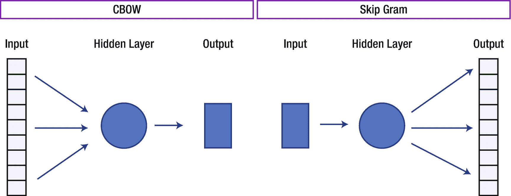
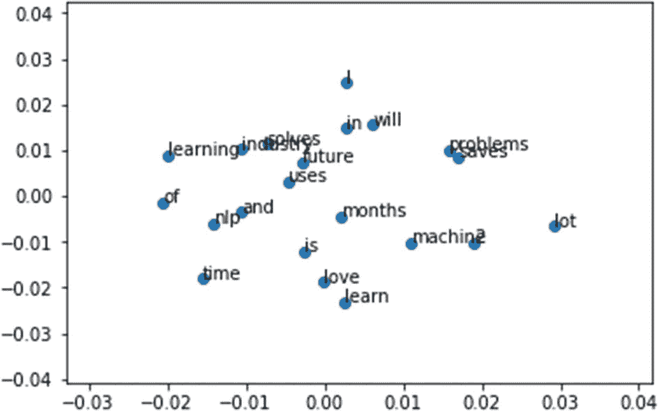
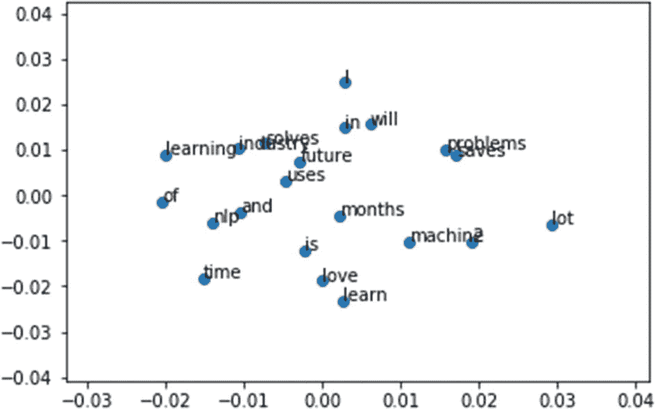
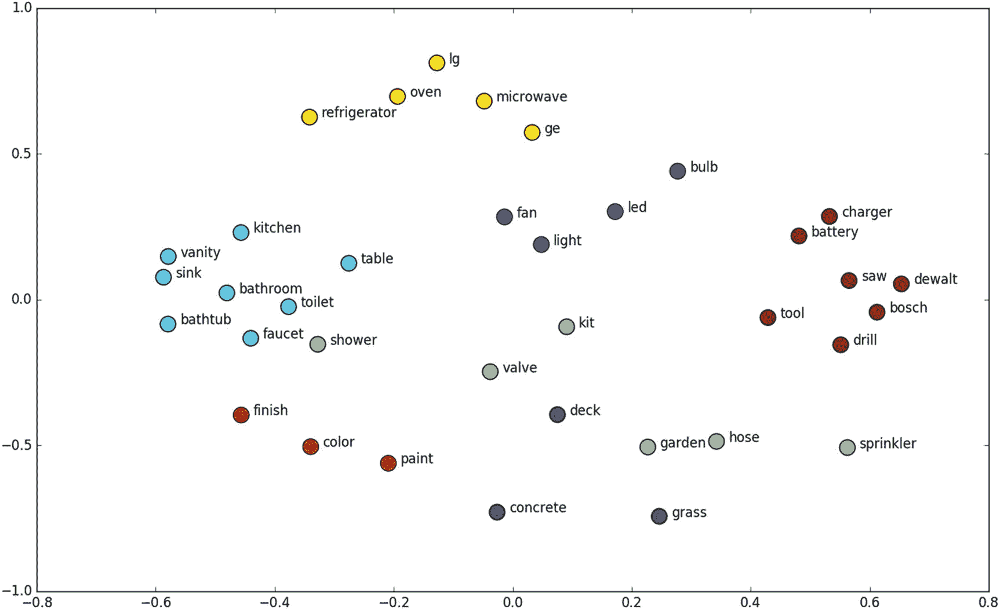
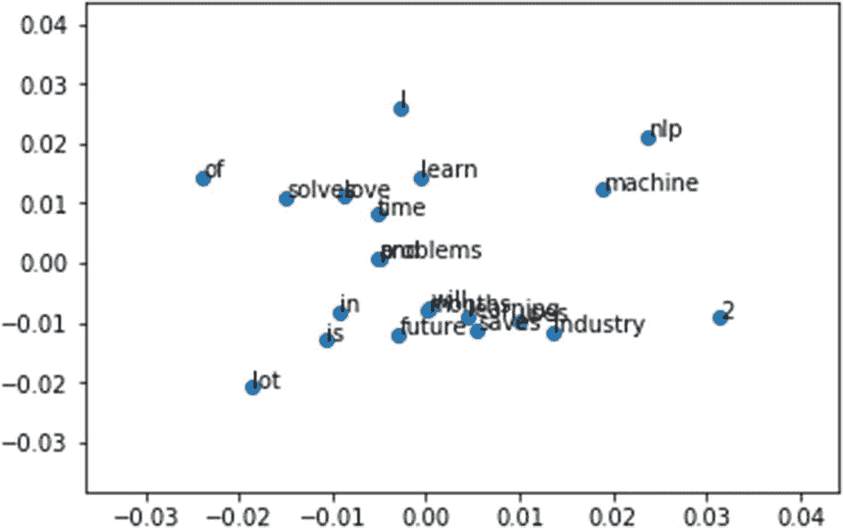
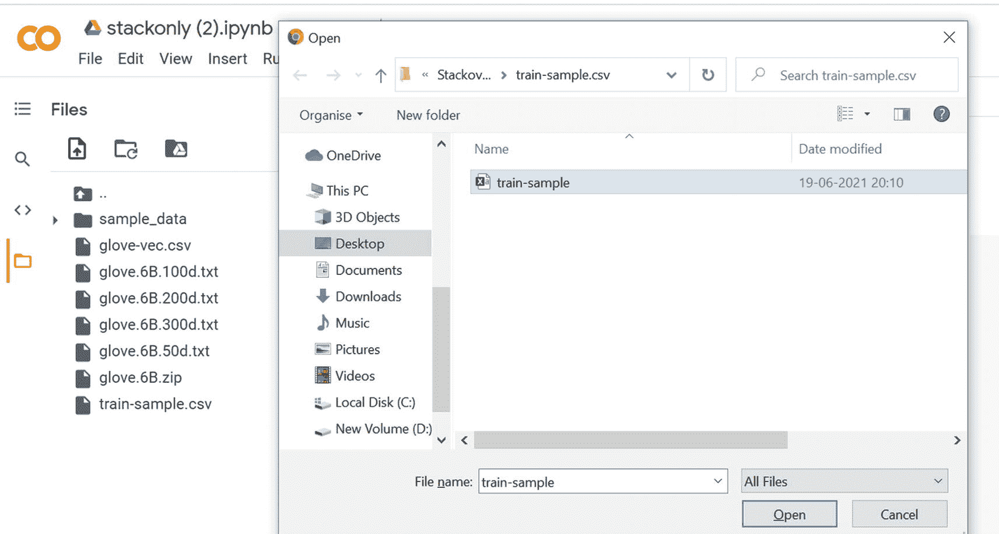

# 三、将文本转换为特征

本章涵盖了从基础到高级特征工程(文本到特征)的方法。到本章结束时，你会对下面的食谱感到舒适。

*   食谱 1。一键编码

*   食谱 2。计数矢量器

*   食谱三。n-grams

*   食谱 4。共生矩阵

*   食谱 5。哈希矢量化

*   食谱 6。术语频率-逆文档频率(TF-IDF)

*   食谱 7。单词嵌入

*   食谱 8。实现快速文本

*   食谱 9。使用最先进的嵌入技术将文本转换为特征

既然已经讨论了所有的文本预处理步骤，让我们来探索特征工程，它是自然语言处理的基础。如你所知，机器或算法无法理解字符、单词或句子。他们只能接受数字作为输入，包括二进制。但是文本数据的固有性质是非结构化和嘈杂的，这使得它无法与机器进行交互。

将原始文本转换成机器可理解的格式(数字)的过程称为特征工程。机器学习和深度学习算法的性能和准确性从根本上取决于特征工程技术。

本章讨论不同的特征工程方法和技术；它们的功能、优点和缺点；和示例来帮助您认识到特征工程的重要性。

## 配方 3-1。使用一键编码将文本转换为特征

*一键编码*是特征工程中使用的传统方法。任何了解机器学习基础的人都遇到过 one-hot 编码。它是将分类变量转换为特征或列，并为该特定类别编码 1 或 0 的过程。这里使用相同的逻辑，特征的数量是语料库中存在的总标记的数量。

### 问题

您希望使用一键编码将文本转换为特征。

### 解决办法

一键编码将字符或单词转换成二进制数，如下所示。

<colgroup><col class="tcol1 align-left"> <col class="tcol2 align-left"> <col class="tcol3 align-left"> <col class="tcol4 align-left"> <col class="tcol5 align-left"> <col class="tcol6 align-left"></colgroup> 
|   | 

我

 | 

爱

 | 

自然语言处理

 | 

存在

 | 

将来的

 |
| --- | --- | --- | --- | --- | --- |
| 我爱 NLP | one | one | one | Zero | Zero |
| NLP 是未来 | Zero | Zero | one | one | one |

### 它是如何工作的

有许多函数可以生成一键编码特征。我们拿一个函数来深入讨论一下。

#### 步骤 1-1。将文本存储在变量中

下面显示了一行。

```py
Text = "I am learning NLP"

```

#### 步骤 1-2。对文本数据执行函数

以下是来自`pandas`库中的一个将文本转换成特征的函数。

```py
# Importing the library
import pandas as pd
# Generating the features
pd.get_dummies(Text.split())
Result :
   I  NLP  am  learning
0  1    0   0         0
1  0    0   1         0
2  0    0   0         1
3  0    1   0         0

```

输出有四个特征，因为输入中出现的不同单词的数量是 4。

## 食谱 3-2。使用计数矢量器将文本转换为特征

配方 3-1 中使用的方法有一个缺点。它不考虑单词的频率。如果某个特定的单词出现多次，那么如果不将其包括在分析中，就有可能丢失信息。一个*计数矢量器*解决了这个问题。这个食谱介绍了另一种将文本转换为特征的方法:计数矢量器。

### 问题

如何使用计数矢量器将文本转换为特征？

### 解决办法

计数矢量器类似于一键编码，但它不是检查特定的单词是否存在，而是对文档中存在的单词进行计数。

在下面的示例中，单词 I 和 NLP 在第一个文档中出现了两次。

<colgroup><col class="tcol1 align-left"> <col class="tcol2 align-left"> <col class="tcol3 align-left"> <col class="tcol4 align-left"> <col class="tcol5 align-left"> <col class="tcol6 align-left"> <col class="tcol7 align-left"> <col class="tcol8 align-left"> <col class="tcol9 align-left"> <col class="tcol10 align-left"></colgroup> 
|   | 

我

 | 

爱

 | 

自然语言处理

 | 

存在

 | 

将来的

 | 

将

 | 

学习

 | 

在…里

 | 

2 个月

 |
| --- | --- | --- | --- | --- | --- | --- | --- | --- | --- |
| 我喜欢自然语言处理，我将在两个月后学习自然语言处理 | Two | one | Two | Zero | Zero | one | one | one | one |
| NLP 是未来 | Zero | Zero | one | one | one | Zero | Zero | Zero | Zero |

### 它是如何工作的

sklearn 具有从文本中提取特征的特征提取功能。让我们看看如何执行它。下面从 sklearn 导入`CountVectorizer`函数。

```py
#importing the function
from sklearn.feature_extraction.text import CountVectorizer
# Text
text = ["I love NLP and I will learn NLP in 2month "]
# create the transform

vectorizer = CountVectorizer()
# tokenizing
vectorizer.fit(text)
# encode document
vector = vectorizer.transform(text)
# summarize & generating output
print(vectorizer.vocabulary_)
print(vector.toarray())
Result:

{'love': 4, 'nlp': 5, 'and': 1, 'will': 6, 'learn': 3, 'in': 2, '2month': 0}
[[1 1 1 1 1 2 1]]

```

第五个标记 nlp 在文档中出现了两次。

## 食谱 3-3。生成 n 元语法

在前面的方法中，每个单词都被视为一个特征。这种方法有一个缺点。它不考虑前面的单词和后面的单词来判断它是否给出正确和完整的意思。例如，考虑短语“不错”。如果它被分割成单个的单词，它就失去了传达好的意思，这就是这个短语的意思。

正如你所看到的，你可能会失去潜在的信息或见解，因为许多单词一旦放在一起就有意义了。n-grams 可以解决这个问题。

*n* -grams 是多个字母或多个单词的融合。它们以这样的方式形成，甚至上一个和下一个单词也被捕获。

*   单字是一个句子中唯一的单词。

*   二元结构是两个词的组合。

*   三元模型是三个词的组合。诸如此类。

比如看句子，“我在学 NLP。”

*   单字:“我”，“我”，“学习”，“自然语言处理”

*   二元模型:“我是”，“正在学习”，“学习 NLP”

*   三元模型:“我正在学习”，“我正在学习 NLP”

### 问题

为给定的句子生成 n 元语法。

### 解决办法

有很多生成 n 元语法的包。TextBlob 是最常用的。

### 它是如何工作的

按照本节中的步骤操作。

#### 步骤 3-1。使用 TextBlob 生成 n 元语法

让我们看看如何使用 TextBlob 生成 n-grams。

```py
Text = "I am learning NLP"

```

使用下面的`TextBlob`函数创建 n 元语法。使用已定义的文本，并根据要求陈述 n。

```py
#Import textblob
from textblob import TextBlob
#For unigram : Use n = 1
TextBlob(Text).ngrams(1)

```

这是输出。

```py
[WordList(['I']), WordList(['am']), WordList(['learning']), WordList(['NLP'])]
#For Bigram : For bigrams, use n = 2
TextBlob(Text).ngrams(2)
[WordList(['I', 'am']),
 WordList(['am', 'learning']),
 WordList(['learning', 'NLP'])]

```

一个实例中有三个包含两个单词的列表。

#### 第 3-2 步。为文档生成基于二元模型的特征

就像上一个方法一样，计数矢量器生成特征。使用相同的函数，让我们生成 bigram 特性，看看输出是什么样子。

```py
#importing the function
from sklearn.feature_extraction.text import CountVectorizer
# Text
text = ["I love NLP and I will learn NLP in 2month "]
# create the transform
vectorizer = CountVectorizer(ngram_range=(2,2))
# tokenizing
vectorizer.fit(text)
# encode document
vector = vectorizer.transform(text)
# summarize & generating output
print(vectorizer.vocabulary_)
print(vector.toarray())

```

这就是结果。

```py
{'love nlp': 3, 'nlp and': 4, 'and will': 0, 'will learn': 6, 'learn nlp': 2, 'nlp in': 5, 'in 2month': 1}
[[1 1 1 1 1 1 1]]

```

输出中的特征包含二元模型；在本例中，所有令牌的计数都是 1。你同样可以使用三元模型。

## 配方 3-4。生成共生矩阵

让我们讨论一种称为共生矩阵的特征工程方法。

### 问题

你想要理解并生成一个共现矩阵。

### 解决办法

共生矩阵类似于计数矢量器；它计算一组单词的出现次数，而不是单个单词的出现次数。

### 它是如何工作的

让我们看看如何使用 NLTK `, bigrams,`和一些基本的 Python 编码技巧来生成这种矩阵。

#### 步骤 4-1。导入必要的库

这是代码。

```py
import numpy as np

import nltk
from nltk import bigrams
import itertools

```

#### 第 4-2 步。为共生矩阵创建函数

下面是`co_occurrence_matrix`函数。

```py
def co_occurrence_matrix(corpus):
    vocab = set(corpus)
    vocab = list(vocab)
    vocab_to_index = { word:i for i, word in enumerate(vocab) }
    # Create bigrams from all words in corpus
    bi_grams = list(bigrams(corpus))
    # Frequency distribution of bigrams ((word1, word2), num_occurrences)
    bigram_freq = nltk.FreqDist(bi_grams).most_common(len(bi_grams))
    # Initialise co-occurrence matrix
    # co_occurrence_matrix[current][previous]
    co_occurrence_matrix = np.zeros((len(vocab), len(vocab)))
    # Loop through the bigrams taking the current and previous word,
    # and the number of occurrences of the bigram.
    for bigram in bigram_freq:
        current = bigram[0][1]
        previous = bigram[0][0]
        count = bigram[1]

        pos_current = vocab_to_index[current]
        pos_previous = vocab_to_index[previous]
        co_occurrence_matrix[pos_current][pos_previous] = count
    co_occurrence_matrix = np.matrix(co_occurrence_matrix)
    # return the matrix and the index
    return co_occurrence_matrix,vocab_to_index

```

#### 第 4-3 步。生成共生矩阵

下面是测试用的句子。

```py
sentences = [['I', 'love', 'nlp'],
                   ['I', 'love','to' 'learn'],
                   ['nlp', 'is', 'future'],
                   ['nlp', 'is', 'cool']]
# create one list using many lists
merged = list(itertools.chain.from_iterable(sentences))
matrix = co_occurrence_matrix(merged)
# generate the matrix
CoMatrixFinal = pd.DataFrame(matrix[0], index=vocab_to_index, columns=vocab_to_index)
print(CoMatrixFinal)

           I   is  love  future  tolearn  cool  nlp
I        0.0  0.0   0.0     0.0      0.0   0.0  1.0
is       0.0  0.0   0.0     0.0      0.0   0.0  2.0
love     2.0  0.0   0.0     0.0      0.0   0.0  0.0
future   0.0  1.0   0.0     0.0      0.0   0.0  0.0
tolearn  0.0  0.0   1.0     0.0      0.0   0.0  0.0
cool     0.0  1.0   0.0     0.0      0.0   0.0  0.0
nlp      0.0  0.0   1.0     1.0      1.0   0.0  0.0

```

*我，爱*，*是*， *nlp* 一起出现了两次，其他几个词只出现了一次。

## 配方 3-5。哈希矢量化

计数矢量器和共生矩阵都有一个限制:词汇表会变得非常大，导致内存/计算问题。

一个*散列矢量器*是解决这个问题的一种方法。

### 问题

你想要理解并生成一个散列矢量器。

### 解决办法

哈希矢量器是内存高效的，矢量器不是将令牌存储为字符串，而是应用[哈希技巧](https://en.wikipedia.org/wiki/Feature_hashing)将它们编码为数字索引。缺点是它是单向的，一旦矢量化，就无法检索特征。

### 它是如何工作的

让我们看一个使用`sklearn.`的例子

#### 步骤 5-1。导入必要的库并创建文档

这是代码。

```py
from sklearn.feature_extraction.text import HashingVectorizer
# list of text documents
text = ["The quick brown fox jumped over the lazy dog."]

```

#### 第 5-2 步。生成哈希矢量矩阵

让我们创建一个矢量大小为 10 的散列矢量矩阵(`HashingVectorizer`)。

```py
# transform
vectorizer = HashingVectorizer(n_features=10)
# create the hashing vector
vector = vectorizer.transform(text)
# summarize the vector
print(vector.shape)
print(vector.toarray())
(1, 10)
[[ 0\.           0.57735027  0\.       0\.       0\.      0\.     0.
  -0.57735027  -0.57735027  0\.       ]]

```

它创建了一个大小为 10 的向量，现在它可以用于任何有人监督/无人监督的任务。

## 配方 3-6。使用 TF-IDF 将文本转换为特征

上述文本到特征的方法有一些缺点，因此引入了 TF-IDF。以下是一些缺点。

*   假设一个特定的单词出现在所有的语料库文档中。它在我们以前的方法中获得了更高的重要性，但这可能与你的情况无关。

*   TF-IDF 反映了一个单词对集合中的一个文档有多重要，因此对频繁出现在所有文档中的单词进行了规范化。

### 问题

您希望使用 TF-IDF 将文本转换为特征。

### 解决办法

**词频(TF)** 是一个句子中出现的特定单词的计数与同一个句子中单词总数的比值。TF 捕捉单词的重要性，而不考虑文档的长度。例如，在 10 个单词的句子中，频率为 3 的单词与句子的单词长度为 100 个单词时不同。它应该在第一个场景中更重要，这就是 TF 所做的。 **TF** (t) =(术语 t 在文档中出现的次数)/(文档中的总术语数)。

**逆文档频率(IDF)** 是总行数与出现单词的特定文档中的行数之比的对数。IDF = log(N/n)，其中 N 是总行数，N 是单词所在的行数。

IDF 衡量一个术语的稀有程度。像 *a* 和 *the* 这样的词出现在所有的语料库文档中，但是稀有词并不在所有的文档中。因此，如果一个单词出现在几乎所有的文档中，这个单词就没有用了，因为它对分类或信息检索没有帮助。以色列国防军解决了这个问题。

TF-IDF 是 TF 和 IDF 的简单产品，解决了两个缺点，使预测和信息检索相关。

TF-IDF = TF * IDF

### 它是如何工作的

按照本节中的步骤操作。

#### 步骤 6-1。读取文本数据

以下是大家熟悉的一句话。

```py
Text = ["The quick brown fox jumped over the lazy dog.",
"The dog.",
"The fox"]

```

#### 第 6-2 步。创建特征

对文本数据执行以下代码。

```py
#Import TfidfVectorizer
from sklearn.feature_extraction.text import TfidfVectorizer
#Create the transform
vectorizer = TfidfVectorizer()
#Tokenize and build vocab
vectorizer.fit(Text)
#Summarize
print(vectorizer.vocabulary_)
print(vectorizer.idf_)

```

这就是结果。

```py
Text = ["The quick brown fox jumped over the lazy dog.",
"The dog.",
"The fox"]
{'the': 7, 'quick': 6, 'brown': 0, 'fox': 2, 'jumped': 3, 'over': 5, 'lazy': 4, 'dog': 1}
[ 1.69314718  1.28768207  1.28768207  1.69314718   1.69314718  1.69314718  1.69314718  1\.   ]

```

注意，在所有三个文档中都出现了，因此它没有增加多少价值。向量值为 1，小于所有其他标记。

到目前为止，您看到的所有方法或技术都是基于频率的。它们被称为基于频率的嵌入或特征。下一个方法着眼于基于预测的嵌入，通常称为单词嵌入。

## 食谱 3-7。实现单词嵌入

这个方法假设你对神经网络的工作原理和神经网络中的权值更新机制有一定的了解。如果你是神经网络的新手，我们建议你浏览第 [6](http://dx.doi.org/10.1007/978-1-4842-4267-4_6) 章，对神经网络如何工作有一个基本的了解。

即使所有以前的方法解决了大多数问题，一旦你进入更复杂的问题，你想要捕捉单词之间的语义关系(上下文)，这些方法就不能执行了。

下面解释了到目前为止讨论的方法所面临的挑战。

*   这些技术没有抓住单词的上下文和含义。它们取决于单词的出现或频率。您需要知道如何捕捉上下文或语义关系。
    1.  我正在吃一个苹果。

    2.  我正在用一个苹果手机。

在例子中，*苹果*与不同(邻近)的相邻词*吃*和*用*连用，意思就不一样了。

*   对于像文档分类(图书馆的图书分类)这样的问题，一个文档很庞大，会产生很多令牌。在这些场景中，您的特性数量可能会失去控制(其中)，从而妨碍准确性和性能。

一个机器/算法可以匹配两个文档/文本，并说出它们是否相同。当你搜索 Dhoni 女士时，我们如何让机器谈论板球或 Virat Kohli？你怎么让机器明白“苹果是好吃的水果”中的*苹果*这个词是可以吃的水果而不是公司？

这些问题的答案在于为单词创建一种表示法，以捕捉它们的含义、语义关系以及它们在不同类型的上下文中的用法。

单词嵌入解决了这些挑战。单词嵌入是一种特征学习技术，其中词汇被映射到实数向量，捕捉上下文层次。

在下表中，每个单词都由四个数字表示，称为矢量。使用单词嵌入技术，我们导出了每个单词的那些向量，以便在将来的分析和构建应用中使用它们。在本例中，维度是 4，但您通常使用大于 100 的维度。

<colgroup><col class="tcol1 align-left"> <col class="tcol2 align-left"> <col class="tcol3 align-left"> <col class="tcol4 align-left"> <col class="tcol5 align-left"></colgroup> 
| 

话

 | 

向量

 |
| --- | --- |
| 文本 | Zero point three six | Zero point three six | -0.43 | Zero point three six |
| 想法 | -0.56 | -0.56 | Zero point seven two | -0.56 |
| 单词 | Zero point three five | -0.43 | Zero point one two | Zero point seven two |
| 编码 | Zero point one nine | Zero point one nine | Zero point one nine | Zero point four three |
| 文件 | -0.43 | Zero point one nine | -0.43 | Zero point four three |
| 克 | Zero point seven two | -0.43 | Zero point seven two | Zero point one two |
| 过程 | Zero point four three | Zero point seven two | Zero point four three | Zero point four three |
| 特征 | Zero point one two | Zero point four five | Zero point one two | Zero point eight seven |

### 问题

你想实现单词嵌入。

### 解决办法

单词嵌入是基于预测的，它们使用浅层神经网络来训练模型，该模型导致学习权重并将它们用作向量表示。

word2vec 是深度学习 Google 框架，用于训练单词嵌入。它使用整个语料库的所有单词并预测附近的单词。它为语料库中存在的所有单词创建一个向量，以便捕获上下文。在单词相似性和单词类比方面，它也优于任何其他方法。

word2vec 主要有两种。

*   船克

*   连续单词包(CBOW)



### 它是如何工作的

上图显示了用于构建单词嵌入的 CBOW 和 skip-gram 算法的架构。让我们看看这些模型是如何工作的。

#### 船克

跳格模型 <sup>1</sup> 在给定一个或多个单词的上下文的情况下，预测该单词的概率。

我们来取一个小句子，了解一下它的工作原理。每个句子生成一个目标单词和上下文，即附近的单词。目标变量周围要考虑的单词数称为窗口大小。下表显示了窗口大小为 2 的所有可能的目标和上下文变量。窗口大小需要根据数据和您可支配的资源来选择。窗口越大，计算能力越高。

Text = "我喜欢 NLP，我将在两个月后学习 NLP "

<colgroup><col class="tcol1 align-left"> <col class="tcol2 align-left"> <col class="tcol3 align-left"></colgroup> 
|   | 

目标字

 | 

语境

 |
| --- | --- | --- |
| 我爱 NLP | 我 | 爱你的，NLP |
| 我喜欢 NLP 和 | 爱 | 爱情，自然语言处理，和 |
| 我喜欢 NLP，我会学习的 | 自然语言处理 | 我，爱，还有，我 |
| … | … | … |
| 两个月后 | 月 | 在，2 |

因为它需要大量的文本和计算能力，所以让我们使用样本数据来构建一个跳格模型。

导入文本语料库并将其分解成句子。执行一些清理和预处理，如删除标点符号和数字，并将句子拆分为单词或标记。

```py
#Example sentences
sentences = [['I', 'love', 'nlp'],
                  ['I', 'will', 'learn', 'nlp', 'in', '2','months'],
                  ['nlp', 'is', 'future'],
                  ['nlp', 'saves', 'time', 'and', 'solves', 'lot', 'of', 'industry', 'problems'],
                  ['nlp', 'uses', 'machine', 'learning']]
#import library
!pip install gensim
import gensim
from gensim.models import Word2Vec
from sklearn.decomposition import PCA
from matplotlib import pyplot
# training the model
skipgram = Word2Vec(sentences, size =50, window = 3, min_count=1,sg = 1)
print(skipgram)
# access vector for one word
print(skipgram['nlp'])
[ 0.00552227 -0.00723104  0.00857073  0.00368054 -0.00071274  0.00837146
  0.00179965 -0.0049786  -0.00448666 -0.00182289  0.00857488 -0.00499459
  0.00188365 -0.0093498   0.00174774 -0.00609793 -0.00533857 -0.007905
 -0.00176814 -0.00024082 -0.00181886 -0.00093836 -0.00382601 -0.00986026

  0.00312014 -0.00821249  0.00787507 -0.00864689 -0.00686584 -0.00370761
  0.0056183   0.00859488 -0.00163146  0.00928791  0.00904601  0.00443816
 -0.00192308  0.00941    -0.00202355 -0.00756564 -0.00105471  0.00170084
  0.00606918 -0.00848301 -0.00543473  0.00747958  0.0003408   0.00512787
 -0.00909613  0.00683905]

```

因为我们的向量大小参数是 50，所以模型为每个单词提供了一个大小为 50 的向量。

```py
# access vector for another one word
print(skipgram['deep'])
KeyError: "word 'deep' not in vocabulary"

```

我们得到一个错误，说这个单词不存在，因为这个单词不在我们的输入训练数据中。我们需要在尽可能大的数据集上训练算法，这样我们就不会漏掉单词。

还有一种方法可以解决这个问题。阅读食谱 3-6 寻找答案。

```py
# save model
skipgram.save('skipgram.bin')
# load model
skipgram = Word2Vec.load('skipgram.bin')

```

t-SNE 图是评估单词嵌入的方法之一。让我们生成它，看看它是什么样子。

```py
# T – SNE plot
X = skipgram[skipgram.wv.vocab]
pca = PCA(n_components=2)
result = pca.fit_transform(X)
# create a scatter plot of the projection
pyplot.scatter(result[:, 0], result[:, 1])
words = list(skipgram.wv.vocab)
for i, word in enumerate(words):
       pyplot.annotate(word, xy=(result[i, 0], result[i, 1]))
pyplot.show()

```



#### 连续单词包(CBOW)

现在让我们看看如何构建 CBOW 模型。

```py
#import library
from gensim.models import Word2Vec
from sklearn.decomposition import PCA
from matplotlib import pyplot
#Example sentences
sentences = [['I', 'love', 'nlp'],
                   ['I', 'will', 'learn', 'nlp', 'in', '2','months'],
                   ['nlp', 'is', 'future'],
                   ['nlp', 'saves', 'time', 'and', 'solves', 'lot', 'of', 'industry', 'problems'],
                   ['nlp', 'uses', 'machine', 'learning']]
# training the model
cbow = Word2Vec(sentences, size =50, window = 3, min_count=1,sg = 1)
print(cbow)
# access vector for one word
print(cbow['nlp'])
# save model

cbow.save('cbow.bin')
# load model
cbow = Word2Vec.load('cbow.bin')
# T – SNE plot
X = cbow[cbow.wv.vocab]
pca = PCA(n_components=2)
result = pca.fit_transform(X)
# create a scatter plot of the projection

pyplot.scatter(result[:, 0], result[:, 1])
words = list(cbow.wv.vocab)
for i, word in enumerate(words):
       pyplot.annotate(word, xy=(result[i, 0], result[i, 1]))
pyplot.show()

```



训练这些模型需要巨大的计算能力。我们用 Google 的预训练模型，已经训练了 1000 多亿字。

从 [`https://drive.google.com/file/d/0B7XkCwpI5KDYNlNUTTlSS21pQmM/edit`](https://drive.google.com/file/d/0B7XkCwpI5KDYNlNUTTlSS21pQmM/edit) 下载模型并保存在您的本地存储器中。

[`https://drive.google.com/file/d/0B7XkCwpI5KDYNlNUTTlSS21pQmM/edit`](https://drive.google.com/file/d/0B7XkCwpI5KDYNlNUTTlSS21pQmM/edit)

导入`gensim`包，按照步骤学习 Google 的 word2vec。

```py
# import gensim package
import gensim
# load the saved model
model = gensim.models.Word2Vec.load_word2vec_format('C:\\Users\\GoogleNews-vectors-negative300.bin', binary=True)
#Checking how similarity works.
print (model.similarity('this', 'is'))
Output:
0.407970363878
#Lets check one more.
print (model.similarity('post', 'book'))
Output:
0.0572043891977

```

这和 is 有很大的相似性，但是单词 post 和 book 之间的相似性很差。对于任何给定的单词集，它使用两个单词的向量，并计算它们之间的相似度。

```py
# Finding the odd one out.
model.doesnt_match('breakfast cereal dinner lunch';.split())

```

输出是

```py
'cereal'

```

在*早餐*、*麦片*、*晚餐*和*午餐*中，麦片这个词与其他三个词的关联最少。

```py
# It is also finding the relations between words.
word_vectors.most_similar(positive=['woman', 'king'], negative=['man'])

```

这是输出。

```py
queen: 0.7699

```

如果加上*女人*和*国王*减去男人，它以 77%的置信度预测女王为输出。这不是很神奇吗？


让我们来看几个有趣的例子，使用 t-SNE 图进行单词嵌入，比如室内和室外。比如所有和电器配件有关的词都是近在咫尺的；同样，与浴室配件相关的词语也是彼此靠近，等等。这就是单词嵌入的美妙之处。



## 食谱 3-8。实现快速文本

fastText 是脸书开发的另一个深度学习框架，用于捕捉上下文并生成特征向量。

### 问题

您想学习如何用 Python 实现 fastText。

### 解决办法

fastText 是 word2vec 的临时版本，它考虑用单词来构建表示。但是 fastText 在计算一个单词的表示时会取每个字符。

### 它是如何工作的

让我们看看如何构建一个 fastText 单词嵌入。

```py
# Import FastText
from gensim.models import FastText
from sklearn.decomposition import PCA
from matplotlib import pyplot
#Example sentences
sentences = [['I', 'love', 'nlp'],
                   ['I', 'will', 'learn', 'nlp', 'in', '2','months'],
                   ['nlp', 'is', 'future'],
                   ['nlp', 'saves', 'time', 'and', 'solves', 'lot', 'of', 'industry', 'problems'],
                   ['nlp', 'uses', 'machine', 'learning']]
fast = FastText(sentences,size=20, window=1, min_count=1, workers=5, min_n=1, max_n=2)

# vector for word nlp
print(fast['nlp'])
[-0.00459182  0.00607472 -0.01119007  0.00555629 -0.00781679  -0.01376211
  0.00675235 -0.00840158 -0.00319737  0.00924599  0.00214165  -0.01063819
  0.01226836  0.00852781  0.01361119 -0.00257012  0.00819397  -0.00410289
 -0.0053979  -0.01360016]
# vector for word deep
print(fast['deep'])
[ 0.00271002 -0.00242539 -0.00771885 -0.00396854  0.0114902   -0.00640606
  0.00637542 -0.01248098 -0.01207364  0.01400793 -0.00476079  -0.00230879
  0.02009759 -0.01952532  0.01558956 -0.01581665  0.00510567  -0.00957186
 -0.00963234 -0.02059373]

```

这就是使用 fastText 的好处。单词 deep 在训练单词 2vec 中不存在，并且我们没有获得该单词的向量。但是由于 fastText 正在建立字符级别，它提供了结果——甚至是训练中没有的单词。你可以看到单词 deep 的向量。

```py
# load model
fast = Word2Vec.load('fast.bin')
# visualize
X = fast[fast.wv.vocab]
pca = PCA(n_components=2)
result = pca.fit_transform(X)
# create a scatter plot of the projection
pyplot.scatter(result[:, 0], result[:, 1])
words = list(fast.wv.vocab)
for i, word in enumerate(words):
      pyplot.annotate(word, xy=(result[i, 0], result[i, 1]))
pyplot.show()

```



上图显示了 fastText 的嵌入表示。如果你仔细观察，单词“爱”和“解决”在 fastText 中离得很近，但在 skip-gram 和 CBOW 中,“爱”和“学习”离得很近。这是因为字符级嵌入。

## 食谱 3-9。使用最先进的嵌入技术将文本转换为特征

让我们讨论并实现一些高级的基于上下文的特征工程方法。

### 问题

您希望使用最先进的嵌入技术将文本转换为特征。

### 解决办法

下面我们来讨论一下这七种方法。

*   手套嵌入

*   工程与后勤管理局

*   句子编码器
    *   doc2vec

    *   句子-伯特

    *   通用编码器

    *   InferSent

*   开放 AI GPT

GloVe 是一种替代的单词嵌入方法，用于创建单词的向量子空间。手套模型对单词的共现计数进行训练，并通过最小化最小平方误差来产生向量空间。

在 GloVe 中，首先构建共现:每行是一个单词，每列是上下文。这个矩阵通过上下文计算单词的频率。由于上下文维度非常大，所以你想减少上下文，学习单词嵌入的低维表示。这个过程可以看作是共生矩阵的重构问题，即重构损失。GloVe 的动机是基于共生矩阵显式地强制模型学习这样的关系。

word2vec、skip-gram 和 CBOW 是预测性的，忽略了一些上下文单词比其他单词出现得更频繁的事实。它们只考虑了当地的情况，因此没有抓住全球的情况。

虽然 word2vec 预测给定单词的上下文，但 GloVe 通过构建共现矩阵来学习。

word2vec 没有嵌入全局信息，而 GloVe 创建了一个全局共现矩阵，对每个单词的上下文频率进行计数。全球信息的出现让 GloVe 变得更好。

GloVe 不会像 word2vec 那样通过神经网络进行学习。相反，它具有单词嵌入的乘积和同现概率的对数之间的差的简单损失函数。

研究论文在 [`https://nlp.stanford.edu/pubs/glove.pdf`](https://nlp.stanford.edu/pubs/glove.pdf) 。

### 工程与后勤管理局

ELMo 向量是作为给定句子的函数的向量。这种方法的主要优点是在不同的上下文中可以有不同的词向量。

ELMo 是一个深度上下文化的单词表示模型。它着眼于单词的复杂特征(例如，句法和语义)，并研究它们如何在语言环境中变化(例如，模拟一词多义)。

词向量是深度双向语言模型(biLM)的内部状态的学习函数，该模型在大型文本语料库上预先训练。

不同句子中语境不同的词称为多义词。ELMo 可以成功地处理这种性质的单词，而 GloVe 和 fastText 无法捕捉到这些单词。

研究论文在 [`www.aclweb.org/anthology/N18-1202.pdf`](http://www.aclweb.org/anthology/N18-1202.pdf) 。

研究论文链接: [`https://www.aclweb.org/anthology/N18-1202.pdf`](https://www.aclweb.org/anthology/N18-1202.pdf)

### 句子编码器

为什么要学习句子嵌入？传统技术使用单词嵌入的平均值来形成句子嵌入。但是这种方法也有缺点，比如没有考虑单词的顺序，如果单词在句子中互换，通过平均单词向量获得的相似性是相同的。

#### doc2vec

doc2vec 基于 word2vec。单词保持一个语法结构，但是文档没有任何语法结构。为了解决这个问题，在 word2vec 模型中添加了另一个向量(段落 ID)。这是 word2vec 和 doc2vec 唯一的区别。

word2vec 计算单词表示的所有向量的均值，而 doc2vec 直接将一个句子表示为向量。与 word2vec 一样，有两种 doc2vec 型号可供选择。

*   段落向量的分布式记忆模型

*   段落向量分布式单词包版本(PV-DBOW)

分布式内存(DM)模型类似于 CBOW 模型。CBOW 在给定上下文作为输入的情况下预测目标单词，而在 doc2vec 中，添加一个段落 ID。

分布式单词包(DBOW)模型类似于 word2vec 中的 skip-gram 模型，它从目标单词预测上下文单词。该模型仅将段落 ID 作为输入，并从词汇表中预测上下文。

研究论文在 [`https://cs.stanford.edu/~quocle/paragraph_vector.pdf`](https://cs.stanford.edu/%257Equocle/paragraph_vector.pdf) 。

#### 句子-伯特

句子-BERT (SBERT)是预训练的 BERT 网络的修改，其使用连体和三元组网络结构来导出语义上有意义的句子嵌入，其可以使用余弦相似性来比较。这将寻找最相似对的工作从使用 BERT/RoBERTa 的 65 小时减少到使用 SBERT 的大约 5 秒，同时保持了 BERT 的准确性。

其中的领导者 Sentence-BERT 于 2018 年推出，并立即占据了句子嵌入的领先地位。这个基于 BERT 的模型的核心有四个关键概念。

*   注意力

*   变形金刚(电影名)

*   伯特

*   暹罗网络

句子被传递到 BERT 模型和池层以生成它们的嵌入。

研究论文在 [`www.aclweb.org/anthology/D19-1410.pdf`](http://www.aclweb.org/anthology/D19-1410.pdf) 。

#### 通用编码器

通用句子编码器模型专门针对 NLP 任务的迁移学习，并生成嵌入。

它在各种数据源上接受训练，以学习各种各样的任务。来源包括维基百科、网络新闻、网络问答页面和论坛。输入是可变长度的英文文本，输出是一个 512 维的向量。

通过平均句子中单词的所有嵌入来计算句子嵌入；然而，仅仅相加或平均有局限性，并且不适合推导句子的真实语义。通用句子编码器使得获得句子级嵌入变得容易。

TensorFlow 模型的两个变体允许在精确度和计算资源之间进行权衡。

*   变形金刚(电影名)

*   深度平均网络

研究论文在 [`https://arxiv.org/pdf/1803.11175v2.pdf`](https://arxiv.org/pdf/1803.11175v2.pdf) 。

#### InferSent

2017 年，脸书引入了 InferSent，作为使用斯坦福自然语言推理数据集(SNLI)训练的句子表示模型。SNLI 是一个由 570，000 个英语句子组成的数据集，每个句子都是一个由前提、假设组成的句子对，这些句子被分为以下几类:蕴涵、矛盾或中性。

研究论文在 [`https://arxiv.org/pdf/1705.02364.pdf`](https://arxiv.org/pdf/1705.02364.pdf) 。

### 开放 AI GPT

GPT(生成预训练变换器)架构实现了深度神经网络，特别是变换器模型，其使用注意力来代替先前的基于递归和基于卷积的架构。注意机制允许模型有选择地关注它预测为最相关的输入文本片段。

由于训练数据集的广度和方法的广度，GPT 能够执行多种多样的任务，而不仅仅是简单的文本生成:回答问题、总结，甚至在各种特定领域的语言之间进行翻译。

研究论文在 [`https://cdn.openai.com/better-language-models/language_models_are_unsupervised_multitask_learners.pdf`](https://cdn.openai.com/better-language-models/language_models_are_unsupervised_multitask_learners.pdf) 。

### 它是如何工作的

从 [`www.kaggle.com/rounakbanik/ted-talks`](http://www.kaggle.com/rounakbanik/ted-talks) 下载数据集，并保存在您的本地文件夹中。然后按照本节中的步骤操作。

数据集链接: [`https://www.kaggle.com/rounakbanik/ted-talks`](https://www.kaggle.com/rounakbanik/ted-talks)

#### 步骤 9-1。将笔记本和数据导入 Google Colab

Google Colab 用于解决这个项目，因为 BERT 模型非常庞大，在 Colab 中构建它更容易、更快。

前往 [`https://colab.research.google.com/notebooks/intro.ipynb`](https://colab.research.google.com/notebooks/intro.ipynb) 的谷歌实验室。

[`https://colab.research.google.com/notebooks/intro.ipynb`](https://colab.research.google.com/notebooks/intro.ipynb)

转到“文件”并打开一个新笔记本，或者通过选择“上载笔记本”从本地上载笔记本。


要导入数据，请转到文件，单击上传到会话存储选项，然后导入 csv 文件。



#### 步骤 9-2。安装和导入库

```py
#If any of these libraries

are not installed, please install them using pip before importing.

import pandas as pd
import numpy as np
import scipy
import os

import nltk
nltk.download('stopwords')
nltk.download('punkt')
ltk.download('wordnet')
import string
import csv
from nltk.tokenize import word_tokenize
from nltk.corpus import stopwords
from nltk.stem import WordNetLemmatizer # used for preprocessing
import warnings
warnings.filterwarnings('ignore')

from sklearn import preprocessing
import spacy
from tqdm import tqdm
import re
import matplotlib.pyplot as plt # our main display package
import plotly.graph_objects as go

import tensorflow_hub as hub

import tensorflow as tf
print(tf.__version__)

```

#### 第 9-3 步。读取文本数据

```py
df = pd.read_csv('Ted talks.csv')

df_sample=df.iloc[0:100,:]

```

#### 步骤 9-4。处理文本数据

让我们实现您在第二章中学到的预处理步骤。

```py
# remove urls, handles, and the hashtag from hashtags
def remove_urls(text):
    new_text = ' '.join(re.sub("(@[A-Za-z0-9]+)|([⁰-9A-Za-z \t])|(\w+:\/\/\S+)"," ",text).split())
    return new_text
# make all text lowercase
def text_lowercase(text):
    return text.lower()
# remove numbers
def remove_numbers(text):
    result = re.sub(r'\d+', '', text)
    return result
# remove punctuation
def remove_punctuation(text):
    translator = str.maketrans('', '', string.punctuation)
    return text.translate(translator)
# tokenize
def tokenize(text):
    text = word_tokenize(text)
    return text
# remove stopwords
stop_words = set(stopwords.words('english'))
def remove_stopwords(text):
    text = [i for i in text if not i in stop_words]
    return text
# lemmatize
lemmatizer = WordNetLemmatizer()
def lemmatize(text):
    text = [lemmatizer.lemmatize(token) for token in text]
    return text

def preprocessing(text):

    text = text_lowercase(text)
    text = remove_urls(text)
    text = remove_numbers(text)
    text = remove_punctuation(text)
    text = tokenize(text)
    text = remove_stopwords(text)
    text = lemmatize(text)
    text = ' '.join(text)
    return text

#preprocessing input
for i in range(df_sample.shape[0]):
    df_sample['description'][i]=preprocessing(str(df_sample['description'][i]))
#in case if description has next line character
for text in df_sample.description:
    text=text.replace('\n',' ')

```

#### 第 9-5 步。生成特征向量

```py
#Implementations of above methods

#GloVe:
#loading pre-trained glove model
#downloading and unzipping all word embeddings
!wget http://nlp.stanford.edu/data/glove.6B.zip
!unzip glove*.zip
!ls
!pwd

#importing 100-d glove model
glove_model_100vec = pd.read_table("glove.6B.100d.txt", sep=" ", index_col=0, header=None, quoting=csv.QUOTE_NONE)

# getting mean vector for each sentence

def get_mean_vector(glove_model, words):
    # remove out-of-vocabulary words
    #assuming 100-d vector
    words = [word for word in word_tokenize(words) if word in list(glove_model_100vec.index)] #if word is in vocab
    if len(words) >= 1:
        return np.mean(glove_model_100vec.loc[words].values, axis=0)
    else:
        return np.array([0]*100)

#creating empty list and appending all mean arrays for comparing cosine similarities
glove_vec=[]
for i in df_sample.description:
    glove_vec.append(list(get_mean_vector(glove_model_100vec, i)))

glove_vec=np.asarray(glove_vec)
glove_vec

```

#输出

```py
array([[-0.11690753,  0.17445151,  0.04606778, ..., -0.48718723,
         0.28744267,  0.16625453],
       [-0.12658561,  0.17125735,  0.44709804, ..., -0.18936391,
         0.51547109,  0.2958283 ],
       [-0.06018609,  0.12372995,  0.27105957, ..., -0.38565426,
         0.39135596,  0.2519755 ],
       ...,
       [-0.12469988,  0.11091088,  0.16328073, ..., -0.08730062,
         0.25822592,  0.12540627],
       [ 0.09014104,  0.09796044,  0.13403036, ..., -0.371885  ,
         0.19138244,  0.05781978],
       [ 0.00891036,  0.09064478,  0.22670132, ..., -0.26099886,
         0.47415786,  0.30951336]])

```

埃尔莫:

```py
# Due to some open issue with TensorFlow Hub on latest version (2.x), we are degrading to tensorflow 1.x version
#!pip uninstall tensorflow
!pip install tensorflow==1.15

import tensorflow as tf
import tensorflow_hub as hub
print(tf.__version__)

#Load pre-trained model
embed_ = hub.Module("https://tfhub.dev/google/elmo/3")

#function to average word vectors of each sentence

def elmo_vectors_sentence(x):
  sentence_embeddings = embed_(x.tolist(), signature="default", as_dict=True)["elmo"]

  with tf.Session() as sess:
    sess.run(tf.global_variables_initializer())
    sess.run(tf.tables_initializer())
    # Average of each vector
    return sess.run(tf.reduce_mean(sentence_embeddings,1))

#if your data set is large , make a batch of 100 samples. Just remove comment and run the code given below. As we have just 100 samples, we are not doing this
 #samples= [df[i:i+100] for i in range(0,df.shape[0],100)]
 # elmo_vec = [elmo_vectors_sentence(x['description']) for x in samples]
 #elmo_vec_full= np.concatenate(elmo_vec, axis = 0)

#embeddings on our dataset
elmo_vec = elmo_vectors_sentence(df_sample['description'])

elmo_vec

```

#输出

```py
array([[ 0.0109894 , -0.16668989, -0.06553215, ...,  0.07014981,
         0.09196191,  0.04669906],
       [ 0.15317157, -0.19256656,  0.01390844, ...,  0.03459582,
         0.28029835,  0.11106762],
       [ 0.20210212, -0.13186318, -0.20647219, ..., -0.15281932,
         0.12729007,  0.17192583],
       ...,
       [ 0.29017407, -0.45098212,  0.0250571 , ..., -0.12281103,
         0.23303834,  0.15486737],
       [ 0.22871418,  0.12254314, -0.22637479, ...,  0.04150296,
         0.31900924,  0.28121516],
       [ 0.05940952,  0.01366339, -0.17502695, ...,  0.20946877,
         0.0020928 ,  0.1114894 ]], dtype=float32)

```

Doc2Vec：

```py
#importing doc2vec and tagged document

from gensim.models.doc2vec import Doc2Vec, TaggedDocument

#tokenizing data
tokenized_data=[word_tokenize(word) for word in df_sample.description]

train_data=[TaggedDocument(d, [i]) for i, d in enumerate(tokenized_data)]   #adding paragraph id as mentioned in explanation for training
train_data

```

#输出

```py
[TaggedDocument(words=['sir', 'ken', 'robinson', 'make', 'entertaining', 'profoundly', 'moving', 'case', 'creating', 'education', 'system', 'nurture', 'rather', 'undermines', 'creativity'], tags=[0]),
 TaggedDocument(words=['humor', 'humanity', 'exuded', 'inconvenient', 'truth', 'al', 'gore', 'spell', 'way', 'individual', 'address', 'climate', 'change', 'immediately', 'buying', 'hybrid', 'inventing', 'new', 'hotter', 'brand', 'name', 'global', 'warming'], tags=[1]),
 TaggedDocument(words=['new', 'york', 'time', 'columnist', 'david', 'pogue', 'take', 'aim', 'technology', 'worst', 'interface', 'design', 'offender', 'provides', 'encouraging', 'example', 'product', 'get', 'right', 'funny', 'thing', 'burst', 'song'], tags=[2]),
 TaggedDocument(words=['emotionally', 'charged', 'talk', 'macarthur', 'winning', 'activist', 'majora', 'carter', 'detail', 'fight', 'environmental', 'justice', 'south', 'bronx', 'show', 'minority', 'neighborhood', 'suffer', 'flawed', 'urban', 'policy'], tags=[3]),
 TaggedDocument(words=['never', 'seen', 'data', 'presented', 'like', 'drama', 'urgency', 'sportscaster', 'statistic', 'guru', 'han', 'rosling', 'debunks', 'myth', 'called', 'developing', 'world'], tags=[4])

```

……….

```py
## Train doc2vec model
model = Doc2Vec(train_data, vector_size = 100, window = 2, min_count = 1, epochs = 100)

def get_vectors(model,words):
  words = [word for word in word_tokenize(words) if word in list(model.wv.vocab)]
  #words = [word for word in word_tokenize(words) if word in list(model.wv.index_to_key)] #if gensim version is >4.0.0 ,use this line
  if len(words)>=1:
    return model.infer_vector(words)
  else:
    return np.array([0]*100)

#defining empty list
doc2vec_vec=[]
for i in df_sample.description:
    doc2vec_vec.append(list(get_vectors(model, i)))

doc2vec_vec=np.asarray(doc2vec_vec)

doc2vec_vec

```

#输出

```py
array([[ 0.00505156, -0.582084  , -0.33430266, ...,  0.29665616,
        -0.5472022 ,  0.48537165],
       [ 0.05787622, -0.6559785 , -0.41140306, ...,  0.24132295,
        -0.73182726,  0.6089837 ],
       [ 0.02416484, -0.48238695, -0.29850838, ...,  0.2710957 ,
        -0.51971895,  0.4405582 ],
       ...,
       [ 0.0511999 , -0.5991625 , -0.34839907, ...,  0.29519215,
        -0.68761116,  0.4545323 ],
       [ 0.0180944 , -0.8318272 , -0.3488748 , ...,  0.30490136,
        -0.7558393 ,  0.56117946],
       [-0.04790357, -0.66188   , -0.3797214 , ...,  0.34476635,
        -0.7202311 ,  0.5834031 ]], dtype=float32)

```

#### 句子-伯特

```py
#BERT sentence transformer for sentence encoding
!pip install sentence-transformers

#importing bert-base model

from sentence_transformers import SentenceTransformer
sbert_model = SentenceTransformer('bert-base-nli-mean-tokens')

#one more model to try
#model = SentenceTransformer('paraphrase-MiniLM-L12-v2')

#embeding on description column
sentence_embeddings_BERT = sbert_model.encode(df_sample['description'])
print('Sample BERT embedding vector - length', len(sentence_embeddings_BERT[0]))

```

#输出

```py
Sample BERT embedding vector - length 768

sentence_embeddings_BERT
array([[-0.31804532,  0.6571422 ,  0.5327481 , ..., -0.76469   ,
        -0.4919126 ,  0.1543465 ],
       [-0.08962823,  1.0855986 ,  0.37181526, ..., -0.84685326,
         0.5427714 ,  0.32389015],
       [-0.13385592,  0.8280815 ,  0.76139224, ..., -0.33403403,
         0.2664094 , -0.05493931],
       ...,
       [ 0.05133615,  1.1150284 ,  0.75921553, ...,  0.5516633 ,
         0.46614835,  0.28827885],
       [-1.3568689 ,  0.2995725 ,  0.99510914, ...,  0.26881158,
        -0.1879525 ,  0.18646894],
       [-0.20679009,  0.8725009 ,  1.2933054 , ..., -0.44921246,
         0.14516312, -0.2050481 ]], dtype=float32)

sentence_embeddings_BERT.shape

```

#输出

```py
(100, 768)

```

#### 通用编码器

#加载预训练模型

```py
module_url = "https://tfhub.dev/google/universal-sentence-encoder/4"
model_USE = hub.load(module_url)

embeddings_USE = model_USE(df_sample['description'])

embeddings_USE = tf.reshape(embeddings_USE,[100,512])

embeddings_USE.shape

```

#输出

```py
TensorShape([Dimension(100), Dimension(512)])

#output is tensor

```

#### Infersent

InferSent 有两个版本。版本 1 使用 GloVe，而版本 2 使用 fastText 向量。你可以选择和任何模型一起工作。我们使用的是版本 2，所以我们下载了推断模型和预先训练的单词向量。

```py
! mkdir encoder
! curl -Lo encoder/infersent2.pkl https://dl.fbaipublicfiles.com/infersent/infersent2.pkl

! mkdir GloVe
! curl -Lo GloVe/glove.840B.300d.zip http://nlp.stanford.edu/data/glove.840B.300d.zip
! unzip GloVe/glove.840B.300d.zip -d GloVe/

! unzip GloVe/glove.840B.300d.zip -d GloVe/

from models import InferSent
import torch

V = 2
MODEL_PATH = '/content/drive/MyDrive/yolov3/encoder/infersent%s.pkl' % V
params_model = {'bsize': 64, 'word_emb_dim': 300, 'enc_lstm_dim': 2048,
                'pool_type': 'max', 'dpout_model': 0.0, 'version': V}
model_infer = InferSent(params_model)
model_infer.load_state_dict(torch.load(MODEL_PATH))

W2V_PATH = '/content/drive/MyDrive/yolov3/GloVe/glove.840B.300d.txt'
model_infer.set_w2v_path(W2V_PATH)

#building vocabulary
model_infer.build_vocab(df_sample.description, tokenize=True)

```

#输出

```py
Found 1266(/1294) words with w2v vectors
Vocab size : 1266

#encoding sample dataset

infersent_embed = model_infer.encode(df_sample.description,tokenize=True)

#shape of our vector

infersent_embed.shape

```

#输出

```py
(100, 4096)

get_embed(df_sample,'infersent')

```

#输出

```py
array([[ 0.00320979,  0.0560745 ,  0.11894835, ...,  0.04763867,
         0.02359796,  0.09751415],
       [ 0.00983471,  0.11757359,  0.12201475, ...,  0.06545023,
         0.04181211,  0.07941461],
       [-0.02874381,  0.18418473,  0.12211668, ...,  0.07526097,
         0.06728931,  0.1058861 ],
       ...,
       [ 0.00766308,  0.10781102,  0.13686652, ...,  0.08371441,
         0.01190174,  0.12111058],
       [-0.02874381,  0.20537955,  0.11543981, ...,  0.08811261,
         0.03787484,  0.08826952],
       [ 0.12408942,  0.30591702,  0.23708522, ...,  0.1063919 ,
         0.0908693 ,  0.14098585]], dtype=float32)

```

#### 开放 AI GPT

```py
#installing necessary model

!pip install pytorch_pretrained_bert

import torch
from pytorch_pretrained_bert import OpenAIGPTTokenizer, OpenAIGPTModel

tokenizer_openai = OpenAIGPTTokenizer.from_pretrained('openai-gpt')  #Construct a GPT Tokenizer. Based on Byte-Pair-Encoding with the following peculiarities:

model_openai = OpenAIGPTModel.from_pretrained('openai-gpt')
model_openai.eval()
print('Model Loaded')

#function to get embedding of each token
def Embedding_openai(Sentence):
  tokens = word_tokenize(Sentence)
  vectors = np.zeros((1,768))
  for word in tokens:
      subwords = tokenizer_openai.tokenize(word)
      indexed_tokens = tokenizer_openai.convert_tokens_to_ids(subwords)
      tokens_tensor = torch.tensor([indexed_tokens])
      with torch.no_grad():
          try:
            vectors += np.array(torch.mean(model_openai(tokens_tensor),1))
          except Exception as ex:
            continue
  vectors /= len(tokens)
  return vectors

# Initialize Matrix with dimension of numberof rows*vector dimension
open_ai_vec = np.zeros((df_sample.shape[0], 768))

# generating sentence embedding for each row
for iter in range(df_sample.shape[0]):
    text = df_sample.loc[iter,'description']
    open_ai_vec[iter] = Embedding_openai(text)

open_ai_vec

```

#输出

```py
array([[ 0.16126736,  0.14900037,  0.10306535, ...,  0.22078205,
        -0.38590393, -0.09898915],
       [ 0.17074709,  0.20849738,  0.14996684, ...,  0.21315758,
        -0.46983403,  0.02419061],
       [ 0.25158801,  0.12217634,  0.09847356, ...,  0.25541687,
        -0.44979091, -0.0174561 ],
       ...,
       [ 0.26624974,  0.15842849,  0.10565209, ...,  0.23473342,
        -0.40087843, -0.07652373],
       [ 0.22917288,  0.22115094,  0.09217898, ...,  0.18310198,
        -0.33768173, -0.16026535],
       [ 0.21503123,  0.21615047,  0.04715349, ...,  0.25044506,
        -0.42287723, -0.01473052]])

```

#### 第 9-6 步。使用选择的嵌入方法自动生成特征向量函数

```py
#takes input as dataframe and embedding model name as mentioned in function

def get_embed(df,model):

  if model=='Glove':
    return glove_vec
  if model=='ELMO':
    return elmo_vec
  if model=='doc2vec':
    return doc2vec_vec
  if model=='sentenceBERT':
    return sentence_embeddings_BERT
  if model=='USE':
    return embeddings_USE
  if model=='infersent':
    return infersent_embed
  if model=='Open-ai':
    return open_ai_vec

get_embed(df_sample,'ELMO')

#output
array([[ 0.0109894 , -0.16668989, -0.06553215, ...,  0.07014981,
         0.09196191,  0.04669906],
       [ 0.15317157, -0.19256656,  0.01390844, ...,  0.03459582,
         0.28029835,  0.11106762],
       [ 0.20210212, -0.13186318, -0.20647219, ..., -0.15281932,
         0.12729007,  0.17192583],
       ...,
       [ 0.29017407, -0.45098212,  0.0250571 , ..., -0.12281103,
         0.23303834,  0.15486737],
       [ 0.22871418,  0.12254314, -0.22637479, ...,  0.04150296,
         0.31900924,  0.28121516],
       [ 0.05940952,  0.01366339, -0.17502695, ...,  0.20946877,
         0.0020928 ,  0.1114894 ]], dtype=float32)

```

我们希望您现在已经熟悉了自然语言处理。既然已经清理和处理了数据，并且创建了特性，那么让我们开始构建解决业务问题的应用程序。

<aside aria-label="Footnotes" class="FootnoteSection" epub:type="footnotes">Footnotes 1

[`https://arxiv.org/abs/1310.4546`](https://arxiv.org/abs/1310.4546)

 </aside>