# 第二版前言

自 1998 年本书第一版以来，神经网络领域发生了显著变化。其中一些变化受到外部因素的推动，例如可用数据和计算能力的增加。互联网提供了大量标记和未标记的数据。用户生成和感知数据的不断增加通过数据库和网络爬虫变得易于获取。如今，任何有互联网连接的人都可以解析维基百科上超过 400 万个可用文章，并从中构建数据集。任何人都可以捕获网络电视流并获得数天的视频内容来测试他们的学习算法。

另一个发展是可用计算能力的持续增长，这得益于硬件设计和工程的进步。尽管由于物理限制，处理器的每秒周期数已经达到了阈值，但这一减缓被处理并行性的出现所抵消，最典型的例子就是大规模并行图形处理单元（GPU）。如今，每个人都可以购买一块 GPU 板（通常在消费级笔记本电脑中已有），安装免费的 GPU 软件，以低成本运行计算密集型仿真。

这些发展引发了以下问题：我们能否利用这种巨大的计算能力来理解这些日益复杂的数据集？神经网络是一种有前途的方法，因为它们具有内在的建模能力和灵活性来表示解决方案。它们内在的分布特性允许利用大规模并行计算资源。

在过去的二十年中，神经网络研究的重点和神经网络训练的实践经历了重要变化。深度学习在某种程度上取代了曾经更为普遍的正则化问题，或者更确切地说，改变了正则化神经网络的实践。通过无监督的逐层预训练或深度无监督嵌入使用未标记数据，现在通常更受欢迎，而不是传统的正则化方案，如权重衰减或限制连接。这一新范式已经开始在图像识别、语音识别、自然语言处理、复杂系统、神经科学和计算物理等多个应用中传播。

这本书的第二版在第一版的基础上*重新加载*了更多技巧。

这些技巧源于世界上一些最著名的神经网络研究者在 1998 年至 2012 年间的 14 年理论和实验。

这些技巧在将算法应用于实际问题时，可以在速度、实现难度和准确性方面带来显著差异。技巧不一定有坚实的理论基础或正式验证。正如 Yoshua Bengio 在第十九章所述：“这里提炼的智慧应被视为指导方针，应尝试和挑战，而不是固定不变的实践”[1]。

新版的第二部分开始于更快地优化神经网络的技巧，并更有效地利用呈现给它们的潜在无限数据流。第十八章[2]显示，简单的随机梯度下降（一次学习一个示例）适合训练大多数神经网络。第十九章[1]介绍了大量技巧和建议，用于训练前馈神经网络并选择多个超参数。

当神经网络构建的表示对小参数变化非常敏感时，例如在递归神经网络中，基于小批量的二阶方法（如第二十章中提出的方法）[9]可能是更好的选择。这些章节中提出的看似简单的优化过程需要相应的技巧以实现最佳效果。第二十一章介绍的软件 Torch7[5]提供了这些神经网络的快速和模块化实现。

本卷新颖的第二部分继续介绍将不变性纳入模型的技巧。在图像识别的背景下，第二十二章[4]显示，通过学习图像块的 k 均值表示并对 k 均值激活进行空间池化，可以实现平移不变性。第二十三章[3]展示了不变性可以通过弹性扭曲直接注入输入空间。无标签数据无处不在，利用它们捕捉数据中的规律是许多学习算法的重要组成部分。例如，我们可以学习数据的无监督模型作为第一步，如第二十四章[7]和第二十五章[10]中讨论的那样，然后将无监督表示输入到监督分类器中。第二十六章[12]展示了通过在神经网络的深层学习无监督嵌入，可以获得类似的改进，并增加灵活性。

这本书以神经网络在时间序列和最优控制系统建模的应用结束。时间序列建模可以使用第二十七章讨论的一种非常简单的技术[8]，该技术包括在“水库”上拟合一个线性模型，水库实现了一组丰富的时间序列原语。第二十八章。

[13] 通过直接识别生成时间序列数据的潜在动态系统，提供了一种替代于之前方法的方式。第二十九章[6]展示了如何利用这些系统识别技术从控制系统的观察中识别马尔可夫决策过程（在强化学习术语中为状态和动作的序列）。第三十章[11]通过展示如何通过拟合神经网络动态改善控制系统，从而结束控制系统对状态和动作空间的探索。

本书旨在提供关于实用技巧、理论和算法的及时快照。我们希望新第二版的一些章节在进行实验工作时能成为我们的伙伴——最终成为经典，正如第一版的一些论文所成为的那样。几年后，可能会再次产生重载的冲动...

2012 年 9 月 Grégoire Klaus 致谢。本工作得到了韩国教育部、科学技术部资助的国家研究基金会通过世界一流大学项目的支持，资助编号为 R31-10008。编辑们还感谢 DFG（MU 987/17-1）的部分支持。

[1] Bengio, Y.: 基于梯度的深度架构训练的实用建议。在：Montavon, G., Orr, G.B., Müller, K.-R.（编）NN: 交易技巧，第二版。LNCS，卷 7700，第 437–478 页。施普林格，海德堡（2012）

[2] Bottou, L.: 随机梯度下降技巧。在：Montavon, G., Orr, G.B.,

Müller, K.-R.（编）NN: 交易技巧，第二版。LNCS，卷 7700，第 421–436 页。施普林格，海德堡（2012）

[3] Ciresan, D.C., Meier, U., Gambardella, L.M., Schmidhuber, J.: 用于数字识别的深度大多层感知机。在：Montavon, G., Orr, G.B., Müller, K.-R.（编）NN: 交易技巧，第二版。LNCS，卷 7700，第 581–598 页。

施普林格，海德堡（2012）

[4] Coates, A., Ng, A.Y.: 使用 k 均值学习特征表示。在：Montavon, G., Orr, G.B., Müller, K.-R.（编）NN: 交易技巧，第二版。LNCS，

卷 7700，第 561–580 页。施普林格，海德堡（2012）

[5] Collobert, R., Kavukcuoglu, K., Farabet, C.: 高效实现神经网络。在：Montavon, G., Orr, G.B., Müller, K.-R.（编）NN: 交易技巧，第二版。LNCS，卷 7700，第 537–557 页。施普林格，海德堡（2012）

[6] Duell, S., Udluft, S., Sterzing, V.: 使用递归神经网络解决部分可观测的强化学习问题。在：Montavon, G., Orr, G.B., Müller, K.-R.（编）NN: 交易技巧，第二版。LNCS，卷 7700，第 687–707 页。施普林格，海德堡（2012）

[7] Hinton, G.E.: 训练限制玻尔兹曼机的实用指南。在：

Montavon, G., Orr, G.B., Müller, K.-R.（编）NN: 交易技巧，第二版。LNCS，卷 7700，第 621–637 页。施普林格，海德堡（2012）

[8] Lukoševičius, M.: 实用的回声状态网络应用指南。在：Montavon, G.，Orr, G.B.，Müller, K.-R.（编辑）NN：行业技巧，第 2 版。LNCS，

第 7700 卷，第 659–686 页。施普林格，海德堡（2012 年）

[9] Martens, J.，Sutskever, I.: 使用海森优化训练深度和递归网络。在：Montavon, G.，Orr, G.B.，Müller, K.-R.（编辑）NN：行业技巧，第 2 版。LNCS，第 7700 卷，第 479–535 页。施普林格，海德堡（2012 年）

[10] Montavon, G.，Müller, K.-R.: 深度玻尔兹曼机与中心技巧。

在：Montavon, G.，Orr, G.B.，Müller, K.-R.（编辑）NN：行业技巧，第 2 版。LNCS，第 7700 卷，第 621–637 页。施普林格，海德堡（2012 年）

[11] Riedmiller, M.: 设置神经强化控制器的 10 个步骤和一些技巧。在：Montavon, G.，Orr, G.B.，Müller, K.-R.（编辑）NN：行业技巧，第 2 版。LNCS，第 7700 卷，第 735–757 页。施普林格，海德堡（2012 年）

[12] Weston, J.，Ratle, F.，Collobert, R.: 通过半监督嵌入进行深度学习。在：Montavon, G.，Orr, G.B.，Müller, K.-R.（编辑）NN：行业技巧，第 2 版。LNCS，第 7700 卷，第 639–655 页。施普林格，海德堡（2012 年）

[13] Zimmermann, H.-G.，Tietz, C.，Grothmann, R.: 使用递归神经网络进行预测：12 个技巧。在：NN：行业技巧，第 2 版。LNCS，第 7700 卷，第 687–707 页。施普林格，海德堡（2012 年）

# 目录

引言*......................................................* 1 加速学习 序言 *..........................................................* 7 1. 高效反向传播 *..............................................* 9 Yann LeCun, Leon Bottou, Genevieve B. Orr, 和 Klaus-Robert Müller 正则化技术以改善泛化 序言 *..........................................................* 49 2. 提前停止 - 但何时？ *....................................* 53 Lutz Prechelt 3. 估计权重衰减参数的简单技巧 *..........* 69 Thorsteinn S. Rögnvaldsson 4. 在 MacKay 的贝叶斯神经网络框架中控制超参数搜索 *.............................................* 91 Tony Plate 5. 神经网络建模中的自适应正则化 *...............* 111 Jan Larsen, Claus Svarer, Lars Nonboe Andersen, 和 Lars Kai Hansen 6. 大型集成平均 *.......................................* 131 David Horn, Ury Naftaly, 和 Nathan Intrator 改进网络模型和算法技巧 序言 *..........................................................* 139 7. 方形单元增强、径向扩展的多层感知器 . . 143 Gary William Flake 8. 多任务学习的十二个技巧 *...........................* 163 Rich Caruana 9. 解决神经网络学习中的病态条件 *.............* 191 Patrick van der Smagt 和 Gerd Hirzinger 10. 中心化神经网络梯度因子 *.......................* 205 Nicol N. Schraudolph 11. 避免反向传播导数中的舍入误差*............* 225 Tony Plate 在神经网络训练中表示和纳入先验知识 序言 *..........................................................* 231 12. 模式识别中的变换不变性 - 切线距离和切线传播 *...............................* 235 Patrice Y. Simard, Yann A. LeCun, John S. Denker, 和 Bernard Victorri 13. 结合神经网络和上下文驱动搜索实现在线印刷手写识别 *...........* 271 Larry S. Yaeger, Brandyn J. Webb, 和 Richard F. Lyon 14. 神经网络分类与先验类别概率 *.........* 295 Steve Lawrence, Ian Burns, Andrew Back, Ah Chung Tsoi, 和 C. Lee Giles 15. 将分而治之应用于大规模模式识别任务 *........................................................* 311 Jürgen Fritsch 和 Michael Finke 时间序列技巧 序言 *..........................................................* 339 16. 用神经网络预测经济：挑战与解决方案综述 *.......................................* 343 John Moody 17. 如何训练神经网络 *..................................* 369 Ralph Neuneier 和 Hans Georg Zimmermann 深度神经网络中的大规模学习 18. 随机梯度下降技巧*...............................* 421 Léon Bottou 19. 深度架构基于梯度的训练实用建议 *..........................................* 437 Yoshua Bengio 20. 使用海森优化训练深度和递归网络 *..................................................* 479 James Martens 和 Ilya Sutskever 21. 高效实现神经网络*.........................* 537 Ronan Collobert, Koray Kavukcuoglu, 和 Clément Farabet 序言 *..........................................................* 419 更好的表示：不变、解耦和可重用 序言 *..........................................................* 559 22. 使用 K 均值学习特征表示 *...................* 561 Adam Coates 和 Andrew Y. Ng 23. 深度大型多层感知器用于数字识别 *.............* 581 Dan Claudiu Cireşan, Ueli Meier, Luca Maria Gambardella, 和 Jürgen Schmidhuber 24. 限制玻尔兹曼机训练的实用指南 *......* 599 Geoffrey E. Hinton 25. 深度玻尔兹曼机与中心化技巧 *................* 621 Grégoire Montavon 和 Klaus-Robert Müller 26. 通过半监督嵌入进行深度学习 *....................* 639 Jason Weston, Frédéric Ratle, 和 Ronan Collobert 识别动态系统用于预测和控制 27. 应用回声状态网络的实用指南 *...............* 659 Mantas Lukoševičius 28. 使用递归神经网络进行预测：12 个技巧 *.............* 687 Hans-Georg Zimmermann, Christoph Tietz, 和 Ralph Grothmann 29. 用递归神经网络解决部分可观察的强化学习问题 *.................................* 709 Siegmund Duell, Steffen Udluft, 和 Volkmar Sterzing 30. 设置神经强化控制器的 10 个步骤和一些技巧*....................................................* 735 Martin Riedmiller 序言 *..........................................................* 657 作者索引 *................................................* 759 主题索引 *................................................* 761

# 引言-

我们相信，研究人员和实践者通过经验和口耳相传，获得了一些技巧和启发式方法，帮助他们成功地将神经网络应用于复杂的现实问题。这些“技巧”往往在理论上有很好的动机，有时则是试错的结果。然而，它们最常见的联系在于，通常隐藏在人们的脑海中或在空间有限的会议论文的后页。因此，初学者在这一领域常常浪费大量时间思考为什么他们的网络训练如此缓慢且表现不佳。

本书源于 1996 年名为*行业技巧*的 NIPS 研讨会，旨在开始收集和记录这些技巧的过程。研讨会引发的兴趣促使我们扩大我们的收集，并编纂成这本书。尽管我们毫不怀疑还有许多技巧被我们遗漏，但我们希望所包含的内容对那些相对新手的读者能有所帮助。每一章包含由特定作者（或作者们）呈现的一项或多项技巧。我们试图将相关章节分组为几个部分，尽管我们意识到不同部分之间并非完全不相干。有些章节（例如 1、13、17）包含的技巧系统远比它们所在的类别要更为一般化。

在每个部分之前，我们为读者提供包含的技巧摘要，以便快速概览和参考。然而，我们不建议在阅读相关章节之前应用技巧。每个技巧可能只在特定的上下文中有效，而该上下文在摘要中并未完全解释。这一点在呈现需要组合应用的技巧系统的章节中特别明显。

以下是各个章节内容的粗略路线图。

## 加速学习

本书以基于 Leon Bottou 和 Yann LeCun 的高效反向传播热门研讨会的一章开篇，他们在其中提出了加速最小化过程的技巧系统。包括一些非常简单的实施技巧以及更复杂的技巧，例如基于二阶方法的技巧。尽管许多读者可能会认出其中的一些技巧，但我们相信本章提供了对其理论基础的透彻解释，以及对它们之间微妙相互作用的理解。

本章为读者提供了理想的入门介绍。它首先讨论了与输入表示、初始化、目标等相关的基本技巧。

- 以前发表在：Orr, G.B. 和 Müller, K.-R.（编）：LNCS 1524，ISBN

978-3-540-65311-0（1998 年）。

G. Montavon 等（编）：NN: 行业技巧，第二版，LNCS 7700，第 1–5 页，2012 年。

-c Springer-Verlag Berlin Heidelberg 2012

值、学习率选择、非线性选择等。随后，作者详细介绍了在神经网络中估计和近似 Hessian 的技巧。这为讨论二阶算法、快速训练方法（如随机 Levenberg-Marquardt 算法）以及学习率适应技巧奠定了基础。

## 改善泛化能力的正则化技术

快速最小化很重要，但前提是我们也能确保良好的泛化能力。因此，接下来我们包括了一系列章节，包含提高泛化能力的各种方法。正如人们所期待的那样，并没有适用于所有情况的绝佳技巧。然而，包含了许多示例和讨论，以帮助读者决定哪种方法最适合他们自己的问题。

第二章讨论了最常用的技术之一：

早停法。在这里，Lutz Prechelt 讨论了这一看似简单技术的陷阱。他量化了各种停止标准下泛化能力与训练时间之间的权衡，这导致了一种选择适当标准的技巧。

在成本函数中使用权重衰减惩罚项是改善泛化能力的另一种常见方法。然而，困难在于找到权重衰减参数的良好估计。在第三章中，Thorsteinn Rögnvaldsson 介绍了一种通过使用在早停点测量的信息，快速找到良好估计的技术，令人惊讶的是，实验结果在多个应用中证明了其有效性。

Tony Plate 在第四章中沿用 MacKay 的思路处理惩罚项，即将其视为通过迭代搜索找到的超参数。他展示并比较了加速和简化分类网络中超参数搜索的技巧。他成功的关键在于控制超参数更新的频率，以及在 Hessian 变得超出界限时采用更好的策略。

在第五章中，Jan Larsen 等人展示了一种通过在验证误差上使用简单的梯度下降（针对正则化参数）来调整正则化参数的技巧。该技巧在分类和回归问题中进行了测试。

对多个预测器进行平均是一种众所周知的提高泛化能力的方法。出现的两个问题是“足够”的预测器有多少，以及预测器的数量如何影响早停法的停止标准。在本节的最后一章中，David Horn 等人通过提供一种估计无限数量预测器误差的方法，来解决这些问题。他们随后在一个预测任务中展示了这一技巧。

## 改进网络模型和算法技巧

在本节中，我们研究了一些帮助改善网络模型的技巧。尽管标准的多层感知器（MLPs）在理论上是通用逼近器，但其他架构可能更自然地适应某个问题。

更好的拟合意味着训练更快，并且找到良好且稳定解决方案的可能性更大。例如，径向基函数（RBFs）。

更适用于在有限区域内表现出局部特征的问题。当然，选择哪种架构并不总是显而易见的。

在第七章中，Gary Flake 展示了一种技巧，使得多层感知器（MLPs）同时具备 MLP 和 RBF 的能力，因此不需要在两者之间做出选择。这一技巧仅仅是添加额外的输入，其值为常规输入的平方。提供了理论和直观解释，并附有多个仿真示例。

Rich Caruana 在第八章中展示，通过向网络添加额外的输出以预测相关任务，可以提高主要任务的表现。这种被称为多任务学习（MTL）的技术，允许这些额外输出与主要任务并行训练。本章提供了多个可能用作这些额外输出的例子，以及有效实施 MTL 的技术。实证例子包括肺炎的死亡率排名和一个学习驾驶车辆的网络中的道路跟随。

在第九章中，Patrick van der Smagt 和 Gerd Hirzinger 考虑了神经网络训练中 Hessian 矩阵的病态条件，并提出使用他们称之为线性增强前馈网络的方法，采用共享输入/隐藏权重的输入/输出捷径连接。这有助于改善学习问题的条件，从而加速学习，正如在一个使用机器人手臂数据的仿真示例中所示。

在第十章中，Nicol Schraudolph 进一步扩展了输入的缩放和中心化的理念，提出将神经网络梯度中的所有因子中心化：输入、活动、误差信号和隐藏单元的斜率。他提供了这一技巧的实验证据。

在第十一章中，Tony Plate 的短文报告了一种数值技巧，可以在仅有少量内存开销的情况下，更准确地计算导数。

## 表示法和在神经网络训练中融入先验知识。

之前的章节（例如第一章）介绍了一些非常一般的技巧，用于转换输入以改善学习：问题的先验知识没有被明确考虑（当然，正则化，如第 2-5 章讨论的，隐含地假设了一个先验，但在权重分布上）。然而，对于复杂和困难的问题，仅仅采用黑箱方法是不够的，无论这个黑箱多么优秀。本节探讨了如何利用问题的先验知识来大幅改善学习。所提的问题包括如何最好地表示数据，如何利用这种表示进行训练，以及如何利用存在的不变性。这些问题对于神经网络的正确训练至关重要。它们也是 Patrice Simard 等人在本节第一章中指出的技巧的核心。在这里，作者呈现了一种特别有趣的视角，探讨如何将先验知识融入数据中。他们还首次回顾了切线距离分类方法及其相关技术，如切线传播。这些方法被应用于光学字符识别（OCR）的困难任务。

在第十三章中，Larry Yaeger 等人概述了最终在苹果公司的 Newton MessagePad -Rand eMate-R 中使用的在线手写字符识别的技巧和技术。任何使用过这些系统的人都知道，它们的手写识别能力非常出色。尽管本章讨论的许多问题与 OCR 中的问题重叠，包括表示和先验知识，但解决方案是互补的。本章还很好地概述了哪些设计选择被证明是有效的，以及不同技巧（如学习率选择、更难模式的过度表示、负训练、错误强调等）如何协同工作。

无论是手写字符识别、语音识别还是医疗应用，遇到的一个特别困难的问题是类先验概率不平衡，例如，当某些书写风格和子音素类别不常见或某些疾病发生频率较低时。

第十三章简要讨论了手写识别中的这个问题，并提出了一种启发式方法，用于控制样本选择用于训练的频率。

在第十四章中，Steve Lawrence 等人更深入地讨论了类先验概率不平衡的问题。他们提出并比较了几种不同的启发式方法（先验缩放、概率采样、后期缩放和类成员资格均衡），其中一种与第十三章中的方法相似。他们展示了这些技巧在解决心电图分类问题中的应用，并提供了一些理论解释。

许多训练技术在小到中等规模的网络中表现良好。然而，当问题包含成千上万的类别和数百万的示例时，这在语音识别等应用中并不罕见，许多这些技术就会失效。尤尔根·弗里奇和迈克尔·芬克的这一章专注于大规模分类问题和表示设计的一般问题。这里也解决了类先验概率不平衡的问题。

虽然弗里奇和芬克特别例证了他们在构建大型词汇语音识别器问题上的设计方法，但显然这些技术也适用于构建适当的层次决策树。本文的一个特别有趣的结果是，结合人类语音专家的先验知识进行的结构设计被他们使用聚合聚类算法选择决策树结构的机器学习技术所超越。

## 时间序列的技巧

我们以两篇关于时间序列和经济预测的论文结束本书。在第一章中，约翰·穆迪对宏观经济预测的挑战以及多种神经网络解决方案进行了出色的综述。该综述后面跟随的是对平滑正则化器、模型选择方法（如 AIC、有效参数数量、非线性交叉验证）以及基于灵敏度的输入修剪的更详细描述。模型解释和可视化也有讨论。

在最后一章，拉尔夫·诺伊内尔和汉斯·乔治·齐默尔曼展示了一个令人印象深刻的集成系统，用于时间序列和经济预测的神经网络训练。讨论了系统的每个方面，包括输入预处理、成本函数、异常值处理、架构、正则化技术，以及解决底重网络问题的方案，即输入维度很大而输出维度非常小。还有一个发人深省的讨论，涉及观察者-观察者困境：我们希望在观察数据的基础上创建模型，同时又利用该模型来判断新进数据的正确性。即使是那些对经济预测不感兴趣的人，也鼓励阅读这个如何将先验（系统）知识纳入训练的非常有用的例子。

## 最后备注

最后需要指出的是，章节中某些观点存在矛盾，例如一些作者偏爱某种正则化方法，而其他作者则做出完全相反的声明。一方面，可以通过说明该领域仍然非常活跃来解释这些差异，因此对立观点不可避免地会存在，直到更多被理解。另一方面，可能两种（矛盾的）观点在不同的数据集和应用中都是正确的，例如，一个考虑噪声时间序列的方法需要与光学字符识别设置中完全不同的算法鲁棒性。从这个意义上讲，本书反映了一个活跃的领域和多样化的应用。

1998 年 8 月，珍妮和克劳斯致谢。我们要感谢所有作者的合作。

特别感谢史蒂文·莱姆在排版方面提供的巨大帮助。K.-R.M. 感谢 DFG（资助 JA 379/51 和 JA 379/7）和欧盟 ESPRIT（资助 25387-STORM）的部分经济支持。

# 加速学习-

## 前言

有人认为开发快速算法已不再必要，因为计算机变得如此快速。然而，我们相信算法的复杂性和问题的规模将始终扩大以占用所有可用的周期，无论我们机器的速度如何。因此，计算效率永远不会被忽视。此外，在寻找更快解决方案的过程中，我们往往也会发现更好、更稳定的解决方案。

本节专注于使反向传播（BP）学习过程更快更高效的技术。它包含一章基于 Leon Bottou 和 Yann LeCun 的研讨会。尽管自 BP 首次引入以来出现了许多替代学习系统，但 BP 仍然是使用最广泛的学习算法。原因在于其简单性、高效性以及在广泛问题上的一般有效性。即便如此，在应用它时仍有许多陷阱，这正是这些技巧的用武之地。

第一章温和地开始，向我们介绍了一些非常简单易行的实用技巧。每个技巧都附有易于理解的定性解释。讨论了随机（在线）学习与批处理模式学习的优缺点，明确指出随机学习通常更受欢迎（第 13 页）。有一个技巧旨在通过知道如何最好地打乱示例，最大化每次迭代提供给网络的信息（第 15 页）。接下来是一整套必须协调以实现最大效果的技巧。这些包括：

- 如何对输入进行归一化、去相关和缩放（第 16 页） - 如何选择 sigmoid（第 17 页） - 如何设置目标值（分类）（第 19 页） - 如何初始化权重（第 20 页） - 如何选择学习率（第 20 页）。

讨论的其他问题包括动量的有效性以及在径向基单元和 sigmoid 单元之间的选择（第 21 页）。

第一章介绍了一些理论，提供了对前述技巧的更深入理解。其中包括学习率对学习速度的影响以及 Hessian 矩阵、误差面和学习率之间的关系讨论。提供了简单的线性和多层网络示例，以说明理论结果。

本章接下来进入更困难的领域，概述二阶方法（第 31 页）。快速总结如下：

- 先前发布于：Orr, G.B. 和 Müller, K.-R.（编）：LNCS 1524，ISBN

978-3-540-65311-0（1998 年）。

G. Montavon 等（编）：《神经网络：实用技巧》，第 2 版，LNCS 7700，第 7–8 页，2012 年。

-c Springer-Verlag Berlin Heidelberg 2012

牛顿法：通常不切实际，因为它需要反转完整的 Hessian，并且仅在批处理模式下有效。

共轭梯度法：一个 O(N) 算法，不使用 Hessian，但需要线性搜索，因此仅在批处理模式下有效。

准牛顿法，Broyden-Fletcher-Goldfarb-Shanno（BFGS）方法：

一个 O(N²) 算法，用于计算逆 Hessian 的估计。它需要线性搜索，且仅在批处理模式下有效。

高斯-牛顿法：一个 O(N³) 算法，使用 Hessian 的平方雅可比近似。主要用于批处理，仅适用于均方误差损失函数。

莱文伯格-马夸特法：扩展了高斯-牛顿法，加入了稳定性正则化参数。

二阶方法可以在每次迭代中大大加快学习速度，但通常会产生过高的计算成本。然而，通过用完整或部分 Hessian 的近似替代精确 Hessian，仍然可以在不产生如此高的计算成本的情况下获得二阶信息的好处。

估计完整 Hessian 的第一种也是最直接的方法是有限差分，这只需要进行两次反向传播来计算 Hessian 的每一行（第 35 页）。另一种方法是使用平方雅可比近似，这保证了一个正半定矩阵，这可能有助于提高稳定性。如果需要更简单的计算，可以只计算 Hessian 的对角元素。这里提到的所有方法都可以通过 BP 轻松实现。

不幸的是，对于非常大的网络，许多经典的二阶方法效果不佳，因为存储海森矩阵的成本太高，而且大多数方法要求的批处理模式速度太慢。相反，需要*在线*的二阶方法。这里提出的一种技术是随机对角 Levenberg-Marquardt 方法（第 40 页）。

如果所需的仅仅是海森矩阵与任意向量的乘积，而不是海森矩阵本身，那么可以使用一种只需一个反向传播步骤即可直接计算整个乘积的方法，从而节省大量时间（第 37 页）。这种技术可以用于计算海森矩阵的最大特征值及其相关特征向量。最大特征值的倒数可以用来获得良好的学习率估计。

最后，介绍了三种有用的技巧，用于计算主特征值和特征向量，而无需计算海森矩阵：幂法、泰勒展开和一种在线方法（第 42 页）。

Jenny & Klaus

# 1 高效反向传播-

Yann A. LeCun1, Léon Bottou1, Genevieve B. Orr2 和 Klaus-Robert Müller3 1 AT&T 实验室图像处理研究部，100 Schulz Drive，Red Bank，NJ 07701-7033，美国 2 威拉米特大学，900 State Street，Salem，OR 97301，美国

3 GMD FIRST，Rudower Chaussee 5，12489 柏林，德国

{yann,leonb}@research.att.com, gorr@willamette.edu, klaus@first.gmd.de 摘要。分析了反向传播学习的收敛性，以解释从业者观察到的常见现象。通过一些很少在严肃技术出版物中披露的技巧，可以避免许多反向传播的不良行为。本文给出了一些这些技巧，并解释了它们为何有效。

许多作者建议二阶优化方法在神经网络训练中是有优势的。研究表明，大多数“经典”二阶方法对于大型神经网络来说并不实用。提出了一些没有这些限制的方法。

## 1.1 引言

反向传播是一种非常流行的神经网络学习算法，因为它在概念上简单，计算上高效，并且通常能有效工作。然而，要让它运作良好，有时似乎更多是一种艺术而非科学。使用反向传播设计和训练网络需要做出许多看似任意的选择，比如节点和层的数量与类型、学习率、训练集和测试集等等。这些选择可能至关重要，但由于它们在很大程度上依赖于问题和数据，因此没有万无一失的决策方法。然而，有一些启发式方法和基本理论可以帮助从业者做出更好的选择。

在下面的第一部分中，我们介绍标准的反向传播，并讨论一些简单的启发式方法或技巧，以提高其性能。接下来，我们讨论收敛性问题。然后，我们描述一些“经典”的二阶非线性优化技术，并表明尽管文献中有许多相反的说法，但其在神经网络训练中的应用非常有限。最后，我们介绍一些在某些情况下确实加速学习的二阶方法。

- 以前出版于：Orr, G.B. 和 Müller, K.-R. (Eds.): LNCS 1524, ISBN

978-3-540-65311-0 (1998)。

G. Montavon 等（Eds.）：NN: Tricks of the Trade, 第 2 版，LNCS 7700，第 9–48 页，2012。

-c Springer-Verlag Berlin Heidelberg 2012

## 1.2 学习与泛化

自动机器学习有多种方法，但许多成功的方法可以归类为*基于梯度的学习方法*。如图 1.1 所示，学习机器计算一个函数 M(Zp, W)，其中 Zp 是第 p 个输入模式，W 表示系统中可调参数的集合。成本函数 Ep = C(Dp, M(Zp, W))，衡量 Dp（模式 Zp 的“正确”或期望输出）与系统产生的输出之间的差异。平均成本函数 E*train*(W) 是一组称为训练集的输入/输出对中错误 Ep 的平均值。

{(Z1, D1), ....(ZP , DP )}。在最简单的情况下，学习问题在于找到 W 的值，使 E*train*(W) 最小。在实践中，系统在训练集上的性能并不重要。更相关的指标是系统在实际应用中的错误率。这种性能通过测量在与训练集不重合的一组样本上的准确性来估计，该组样本称为测试集。最常用的成本函数是均方误差：

Ep = 12

Ep

图 1.1. 基于梯度的学习机器

本章专注于改进成本函数最小化过程的策略。然而，这些策略必须与最大化网络*泛化*能力的方法结合使用，即预测学习系统之前未见过的模式的正确目标（例如。

请参见第 2、3、4、5 章以获取更多细节）。

为了理解泛化，我们来考虑反向传播是如何工作的。我们从一组样本开始，每个样本都是要学习的函数的输入/输出对。由于测量过程通常是嘈杂的，样本中可能存在错误。我们可以想象，如果我们收集多个*样本集*，那么每个样本集由于噪声和不同的采样点而看起来会稍有不同。每个数据集也将导致具有轻微不同的最小值的网络，并且与真实函数有所不同。在本章中，我们专注于改善找到特定示例集的最小值的过程。泛化技术试图纠正由于选择数据集而引入到网络中的错误。这两者都是重要的。

一些理论努力分析了通过最小化训练集上的错误来学习的过程（有时称为经验风险最小化）[40, 41]。

一些理论分析基于将泛化误差分解为两个部分：偏差和方差（参见例如[12]）。偏差是一个度量，表示网络输出在所有可能的数据集上平均值与期望函数之间的差异。方差是一个度量，表示网络输出在不同数据集之间的变化程度。在训练初期，偏差较大，因为网络输出远离期望函数。方差非常小，因为数据对网络的影响还不大。在训练后期，偏差较小，因为网络已经学习了基本函数。然而，如果训练时间过长，网络也会学习到该数据集特有的噪声。这被称为过拟合。在这种情况下，方差会很大，因为噪声在不同数据集之间变化。可以证明，当偏差和方差的总和最小化时，最小总误差将会出现。

在使用反向传播时，有许多技术（例如提前停止、正则化）可以最大化网络的泛化能力。这些技术的许多内容将在后面的第 2、3、5、4 章中描述。

因此，本章的思想是提出最小化策略（给定一个成本函数）以及与提高最小化速度和质量相关的技巧。然而，很明显，模型的选择（模型选择）、架构和成本函数对于获得一个能够良好泛化的网络至关重要。因此，请记住，如果使用了错误的模型类且没有进行适当的模型选择，即使是卓越的最小化也显然不会有太大帮助。实际上，过拟合的存在使得一些作者建议，不准确的最小化算法可能比好的算法更有效。

## 1.3 标准反向传播

尽管本文中的技巧和分析主要是在“经典”多层前馈神经网络的背景下提出的，但其中许多也适用于大多数其他基于梯度的学习方法。

基于梯度学习训练的最简单形式的多层学习机器仅仅是一个模块堆栈，每个模块实现一个函数 Xn =

Fn(Wn, Xn−1)，其中 Xn 是表示模块输出的向量，Wn 是模块中可调参数的向量（W 的一个子集），而 Xn−1 是模块的输入向量（以及前一个模块的输出向量）。输入 X0 到第一个模块是输入模式 Zp。如果可以计算相对于

如果 Ep 关于 Xn 已知，那么 Ep 关于

Wn 和 Xn−1 的偏导数，则可以使用向后递归计算

$$\frac{\partial E^{p}}{\partial W_{n}}=\frac{\partial F}{\partial W}(W_{n},X_{n-1})\frac{\partial E^{p}}{\partial X_{n}}$$ $$\frac{\partial E^{p}}{\partial X_{n-1}}=\frac{\partial F}{\partial X}(W_{n},X_{n-1})\frac{\partial E^{p}}{\partial X_{n}}\tag{1.1}$$

其中 ∂F

∂W (Wn, Xn−1) 是在点 (Wn, Xn−1) 处评估的 F 关于 W 的雅可比矩阵，且 ∂F

∂X (Wn, Xn−1) 是 F 关于 X 的雅可比矩阵。

向量函数的雅可比矩阵是一个包含所有输出相对于所有输入的偏导数的矩阵。当上述方程以反向顺序应用于模块时，从层 N 到层 1，可以计算成本函数相对于所有参数的所有偏导数。计算梯度的方法称为反向传播。

传统的多层神经网络是上述系统的一种特殊情况，其中模块是交替的矩阵乘法层（权重）

以及分量-wise 的 sigmoid 函数（单位）：

$Y_{n}=W_{n}X_{n-1}$  $X_{n}=F(Y_{n})$

$$\begin{array}{l}{(1.2)}\\ {(1.3)}\end{array}$$

其中 Wn 是一个矩阵，其列数是 Xn−1 的维度，行数是 Xn 的维度。F 是一个向量函数，对输入的每个分量应用一个 sigmoid 函数。Yn 是层 n 的加权和向量，或称为 *总输入*。

对上述方程应用链式法则，可以得到经典的反向传播方程：

$$(1.4)$$

$$\begin{array}{l}{{{\frac{\partial E^{p}}{\partial y_{n}^{i}}}=f^{\prime}(y_{n}^{i}){\frac{\partial E^{p}}{\partial x_{n}^{i}}}}}\\ {{{\frac{\partial E^{p}}{\partial w_{n}^{i j}}}=x_{n-1}^{j}{\frac{\partial E^{p}}{\partial y_{n}^{i}}}}}\\ {{{\frac{\partial E^{p}}{\partial x_{n-1}^{k}}}=\sum_{i}w_{n}^{i k}{\frac{\partial E^{p}}{\partial y_{n}^{i}}}.}}\end{array}$$

$$\quad(1.5)$$  $$\quad(1.6)$$

上述方程也可以用矩阵形式表示：

$$(1.7)$$  $$(1.8)$$

$\begin{array}{l}\dfrac{\partial E^p}{\partial Y_n}=F'(Y_n)\dfrac{\partial E^p}{\partial X_n}\\ \dfrac{\partial E^p}{\partial W_n}=X_{n-1}\dfrac{\partial E^p}{\partial Y_n}\\ \dfrac{\partial E^p}{\partial X_{n-1}}=W_n^T\dfrac{\partial E^p}{\partial Y_n}.\\ \end{array}$ 在这种情况下，我们引入了初始状态。

$$(1.9)$$

$$(1.10)$$

在这种情况下，最简单的学习（最小化）过程是梯度下降算法，其中 W 按如下方式迭代调整：

$$W(t)=W(t-1)-\eta{\frac{\partial E}{\partial W}}.$$

在最简单的情况下，η是一个标量常数。更复杂的程序使用可变η。在其他方法中，η的形式为对角矩阵，或是成本函数的逆海森矩阵（第二导数矩阵）的估计，如本章后面所述的牛顿和拟牛顿方法。η的适当选择很重要，后面将详细讨论。

## 1.4 一些实用技巧

反向传播在多层网络中特别慢，因为成本表面通常是非二次的、非凸的，并且维度高，存在许多局部最小值和/或平坦区域。没有公式可以保证（1）网络将收敛到良好的解决方案，（2）收敛速度快，或（3）收敛实际上发生。然而，在本节中，我们讨论了一些技巧，可以大大提高找到良好解决方案的机会，同时通常可以按数量级减少收敛时间。更详细的理论依据将在后面的部分中给出。

## 1.4.1 随机学习与批量学习

在每次迭代中，公式（1.10）需要对整个数据集进行完整遍历，以计算*平均*或真实梯度。这被称为批量学习，因为在更新权重之前必须考虑整个“批次”的数据。或者，可以使用随机（在线）学习，其中在每次迭代 t 中从训练集中选择单个示例{Zt, Dt}（例如随机选择）。然后基于该示例的误差 Et 计算真实梯度的*估计*，并更新权重：

$$W(t+1)=W(t)-\eta{\frac{\partial E^{t}}{\partial W}}.$$

由于这个梯度估计是嘈杂的，权重在每次迭代中可能不会精确沿梯度移动。正如我们将看到的，每次迭代中的“噪声”可能是有利的。随机学习通常是基本反向传播的首选方法，原因有三：

$$(1.11)$$

随机学习的优势 1. 随机学习通常比批量学习*快得多*。 2. 随机学习通常还会产生更好的解决方案。 3. 随机学习可用于跟踪变化。

随机学习通常比批量学习*快得多*，尤其是在大型冗余数据集上。这一点很简单。考虑一个大小为 1000 的训练集，它意外地由 10 个相同的 100 样本集合组成。对所有 1000 个模式的梯度进行平均，得到的结果与仅基于前 100 个计算的梯度完全相同。因此，批量梯度下降是浪费的，因为它在每次参数更新前会重复计算同一数量 10 次。另一方面，随机梯度会将一个完整的周期视为对一个 100 长的训练集进行 10 次迭代。在实践中，示例很少在数据集中出现超过一次，但通常会有非常相似的模式簇。例如，在音素分类中，音素/æ/的所有模式将（希望）包含大部分相同的信息。正是这种冗余使得批量学习的速度远不如在线学习。

随机学习通常因为更新中的噪声而导致更好的解决方案。非线性网络通常有多个不同深度的局部最小值。训练的目标是找到这些最小值之一。批量学习将发现权重最初放置的盆地的最小值。在随机学习中，更新中存在的噪声可能导致权重跳入另一个可能更深的局部最小值的盆地。这在某些简化情况下已被证明[15, 30]。

当被建模的函数随时间变化时，随机学习也很有用，这在工业应用中是相当常见的场景，因为数据分布会随着时间逐渐变化（例如，由于机器的磨损）。如果学习机器无法检测和跟随这些变化，就无法正确学习数据，结果会产生较大的泛化误差。批量学习会让变化未被检测到，从而得到相当糟糕的结果，因为我们可能会对多条规则进行平均，而在线学习如果正确操作（见下文 1.4.7 节）会跟踪变化并产生良好的近似结果。

尽管随机学习有诸多优势，但仍有理由考虑使用批量学习：

批量学习的优势

1. 收敛条件理解得很好。

2. 许多加速技术（例如共轭梯度法）仅在批量学习中操作。

3. 权重动态和收敛速度的理论分析更简单。

这些优势源于同样的噪声，使得随机学习

这种噪声在寻找更好的局部最小值时至关重要，但也阻止了完全收敛到最小值。不是收敛到

在精确最小值处，收敛因权重波动而停滞。波动的大小取决于随机更新的噪声程度。局部最小值附近波动的方差与学习率η成正比[28, 27, 6]。因此，为了减少波动，我们可以选择

降低（退火）学习率或使用自适应批量大小。从理论上讲

[13, 30, 36, 35]显示学习率的最佳退火计划是以下形式

$$\eta\sim{\frac{c}{t}},$$

, (1.12)

$\left(1.12\right)^{2}$

其中 t 是呈现的模式数量，c 是一个常数。在实践中，这可能过快（见第十三章）。

另一种去除噪声的方法是使用“迷你批量”，即从小批量开始，随着训练的进行逐步增加批量大小。Møller 讨论了一种方法[25]，Orr [31]则讨论了线性问题的这种方法。

然而，决定批量大小的增加速率以及在小批量中包含哪些输入与确定适当的学习率一样困难。有效地说，随机学习中的学习率大小对应于小批量的相应大小。

还要注意，去除数据中的噪声的问题可能没有想象中那么关键，因为泛化的存在。在噪声阶段达到之前，过拟合可能早已发生。

批量训练的另一个优势是可以使用二阶方法加速学习过程。二阶方法通过估计不仅是梯度还有成本曲面的曲率来加速学习。考虑到曲率，可以估计实际最小值的近似位置。

尽管批量更新有其优势，随机学习仍然是更受欢迎的方法，尤其是在处理非常大的数据集时，因为它简单得多。

## 1.4.2 打乱示例

网络从最意外的样本中学习得最快。因此，建议在每次迭代中选择一个对系统最不熟悉的样本。请注意，这仅适用于随机学习，因为输入呈现的顺序对批量学习 1 并不重要。当然，没有简单的方法可以知道哪些输入信息丰富，然而，一个非常简单的技巧是简单地选择来自*不同*类别的连续示例，因为属于同一类别的训练示例最有可能包含相似的信息。

评估训练示例包含多少新信息的另一个启发式方法是检查当输入被呈现时网络输出与目标值之间的误差。较大的误差表明网络尚未学习该输入，因此包含很多新信息。因此，更频繁地呈现此输入是有意义的。当然，所说的“较大”是相对于所有其他训练示例而言。随着网络训练，这些相对误差会变化，因此特定输入模式的呈现频率也应变化。修改每个模式出现概率的方法称为*强调方案*。

1 在批处理中梯度求和的顺序可能会受到舍入误差的影响，如果梯度值的范围显著。

选择信息含量最大的示例

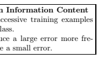

1. 洗牌训练集，以确保连续的训练示例很少（几乎不）属于同一类。

2. 比较频繁地呈现产生较大误差的输入示例，而不是产生较小误差的示例。

然而，在扰动输入示例的正常频率时必须小心，因为这会改变网络对不同示例的相对重视程度。这可能是可取的，也可能不可取。例如，将此技术应用于包含异常值的数据可能是灾难性的，因为异常值可能产生较大的误差，但不应频繁呈现。另一方面，这项技术对于提升不常出现输入的性能，特别有利，例如在音素识别中/z/（见第十三章、第十四章）。

## 1.4.3 标准化输入

如果训练集上每个输入变量的平均值接近零，收敛通常会更快。为此，考虑一个极端情况，所有输入都是正数。第一权重层中特定节点的权重按与δx 成比例的量更新，其中δ是该节点的（标量）误差，x 是输入向量（见方程（1.5）和（1.10））。当输入向量的所有分量都是正数时，输入到某个节点的所有权重更新将具有相同的符号（即 sign(δ)）。因此，对于给定的输入模式，这些权重只能全部同时减少或增加。这样，如果权重向量必须改变方向，它只能通过锯齿形变化，这效率低下，因此非常缓慢。

在上述示例中，所有输入都是正值。然而，通常，任何将平均输入偏离零的平移都会使更新在特定方向上产生偏差，从而减缓学习。因此，最好将输入平移，使得训练集的平均值接近零。这个启发式方法应适用于所有层，这意味着我们希望一个节点的*输出*的平均值接近零，因为这些输出是下一层的输入[19]，第十章。这个问题可以通过协调输入的转换方式与 sigmoid 激活函数的选择来解决。这里我们讨论输入转换，sigmoid 的讨论随后进行。

如果按照上述方式平移输入，同时缩放使得所有输入的协方差大致相同，Ci，收敛速度会更快，其中

$$C_{i}={\frac{1}{P}}\sum_{p=1}^{P}(z_{i}^{p})^{2}.$$

$$(1.13)$$

2. (1.13)

这里，P 是训练示例的数量，Ci 是第 i 个输入变量的协方差，zpi 是第 p 个训练示例的第 i 个分量。缩放加速学习，因为它有助于平衡连接到输入节点的权重学习的速率。协方差的值应与所使用的 sigmoid 匹配。对于下面给出的 sigmoid，协方差为 1 是一个不错的选择。

对所有协方差进行统一缩放的例外情况是当已知某些输入的重要性低于其他输入时。在这种情况下，将不太重要的输入缩小以使其对学习过程“更不明显”可能是有益的。

转换输入 1. 每个输入变量在训练集上的平均值应接近零。

2. 缩放输入变量，使其协方差大致相同。

3. 输入变量应尽可能不相关。

上述输入的平移和缩放两个技巧相当简单易行。另一个相当有效但更难实施的技巧是去相关输入。考虑图 1.2 中的简单网络。如果输入不相关，则可以求解使误差最小化的 w1 的值，而不必考虑 w2，反之亦然。换句话说，这两个变量是独立的（方程组是对角的）。对于相关输入，必须同时求解两者，这将是一个更困难的问题。主成分分析（也称为 Karhunen-Loeve 展开）。

可以用来消除输入中的*线性*相关性[10]。

线性相关的输入（相关性的极端情况）也可能产生简并，进而减缓学习。考虑一个输入始终是另一个输入的两倍的情况（z2 = 2z1）。网络输出沿着 W2 = v − (1/2)W1 的线是常数，其中 v 是一个常数。因此，在这些方向上的梯度为零（见图 1.2）。沿着这些线移动对学习绝对没有影响。我们在二维中试图解决实际上只有一维的问题。理想情况下，我们希望移除一个输入，从而减少网络的规模。

图 1.3 显示了转换输入的整个过程。步骤为

(1) 平移输入使得均值为零，(2) 去相关输入，以及 (3) 使协方差相等。

图 1.2. 线性相关的输入

## 1.4.4 Sigmoid 函数

非线性激活函数赋予神经网络非线性能力。最常见的激活函数形式之一是 sigmoid，它是一个单调递增的函数，在 ±∞ 接近时渐近于某个有限值。最常见的例子是标准逻辑函数 f(x)=1/(1 + e−x) 和双曲正切 f(x) = tanh(x)，如图 1.4 所示。关于原点对称的 sigmoid 函数（例如，见图 1.4b）更受欢迎，原因与输入应标准化相同，即，

图 1.3. 输入的转换

因为它们更可能产生平均接近零的输出（这些输出是下一个层的*输入*）。这与逻辑函数形成对比，因为逻辑函数的输出总是正值，因此其均值必须为正。

图 1.4. (a) 不推荐：标准逻辑函数，f(x)=1/(1 + e−x)。

(b) 双曲正切，f(x)=1.7159 tanh - 23 x

.

## Sigmoid 函数

1. 对称的 sigmoid 函数，如双曲正切，通常比标准逻辑函数收敛更快。

2. 推荐的 sigmoid [19] 是：f(x)=1.7159 tanh  23x。由于 tanh 函数有时计算成本较高，因此可以使用多项式比率的近似来替代。

3. 有时添加一个小的线性项是有帮助的，例如 f(x) = tanh(x)+

ax，以避免平坦区域。

上述推荐的 sigmoid 函数中的常数已被选择，使得*在使用转换后的输入时*（见前面的讨论），输出的方差也接近 1，因为 sigmoid 的有效增益在其有效范围内大约为 1。特别是，这个 sigmoid 具有以下特性

(a) f(±1) = ±1，(b) 在 x = 1 时二阶导数达到最大，(c) 有效增益接近 1。

使用对称 sigmoid 的一个潜在问题是误差面在原点附近可能*非常*平坦。因此，最好避免以非常小的权重进行初始化。由于 sigmoid 的饱和，误差面在远离原点的地方也会很平坦。向 sigmoid 添加一个小的线性项有时可以帮助避免平坦区域（见第九章）。

## 1.4.5 选择目标值

在分类问题中，目标值通常是二进制的（例如{-1,+1}）。常识似乎暗示目标值应设置在 sigmoid 的渐近值上。然而，这有几个缺点。

首先，可能会导致不稳定。训练过程会尽量将输出驱动到尽可能接近目标值，而这只能渐近实现。因此，权重（输出甚至隐藏）被驱动到越来越大的值，此时 sigmoid 的导数接近于零。然而，非常大的权重会增加梯度，但这些梯度随后会被一个指数级小的 sigmoid 导数乘以（除非向 sigmoid 添加了扭曲项），产生接近于零的权重更新。因此，权重可能会陷入停滞。

其次，当输出饱和时，网络不会给出置信水平的指示。当输入模式接近决策边界时，输出类别是不确定的。理想情况下，这应该通过一个介于两个可能目标值之间的输出值在网络中反映出来，即不接近任何渐近线。然而，大权重往往会将所有输出强制到 sigmoid 的尾部，而不考虑不确定性。因此，网络可能会预测错误的类别，而没有表明其对结果的低置信度。使节点饱和的大权重使得无法区分典型和非典型示例。

解决这些问题的一种方法是将目标值设置在 sigmoid 的范围内，而不是在渐近值处。然而，必须小心，以确保节点不仅限于 sigmoid 的线性部分。在 sigmoid 的最大二阶导数点上设置目标值是充分利用非线性而不饱和 sigmoid 的最佳方式。这也是图 1.4b 中 sigmoid 是良好选择的另一个原因。

在±1 处具有最大二阶导数，这对应于分类问题中的二进制目标值。

目标选择在 sigmoid 的最大二阶导数点上设置目标值，以避免输出单元饱和。

2 扭曲项是添加到节点输出的小线性项，例如：

f(x) = tanh(x) + ax。

## 1.4.6 初始化权重

权重的初始值对训练过程有显著影响。权重应该随机选择，但方式应该使得 sigmoid 主要在其线性区域内被激活。如果权重都非常大，sigmoid 会饱和，导致小梯度，从而使学习变慢。如果权重非常小，梯度也会非常小。在 sigmoids 的线性区域内范围的中间权重有两个优点：（1）梯度足够大，可以继续学习；（2）网络将在更困难的非线性部分之前学习映射的线性部分。

实现这一目标需要训练集归一化、选择 sigmoid 函数和权重初始化之间的协调。我们首先要求每个节点输出的分布具有标准差

（σ）约为 1。这通过如前所述对训练集进行归一化在输入层实现。为了在第一个隐藏层的输出处获得接近 1 的标准差，我们只需使用上述推荐的 sigmoid，并要求输入到 sigmoid 的标准差也为 σy = 1。假设单元的输入 yi 与方差为 1 的无关，单元加权和的标准差将为

$$\sigma_{y_{i}}=$$

$$\left(\sum_{j}w_{i j}^{2}\right)^{1/2}\;.$$

$$(1.14)$$

$$(1.15)$$

. (1.14)

因此，为了确保 σyi 约为 1，权重应该从均值为零且标准差为

$$\sigma_{w}=m^{-1/2}$$

σw = m−1/2 (1.15)

其中 m 是输入单元的数量。

权重初始化

1. 训练集已经归一化，并且

 2. 使用了图 1.4b 中的 sigmoid 函数

然后权重应该从一种分布（例如均匀分布）中随机抽取。

$\Pi$ Ironfi a 0  1  随机抽取。

$$\sigma_{w}=m^{-1/2}$$

$\left(1.16\right)^{2}$

σw = m−1/2 (1.16)

其中 m 是输入节点的连接数（即馈送到节点的连接数量）。

## 1.4.7 选择学习率

至少有一种合理的方法（在 1.9.2 节中描述）可以估计理想的学习率 η。文献中提出了许多其他方案（大多数相当经验性）来自动调整学习率。这些方案中的大多数在权重向量

“振荡”，当权重向量沿相对稳定的方向移动时增加它。这些方法的主要问题是它们不适用于随机梯度或在线学习，因为权重向量总是在波动。

除了选择一个单一的全局学习率外，显然为每个权重选择不同的学习率ηi 可以改善收敛性。一种基于计算二阶导数的良好方法在第 1.9.1 节中进行了描述。其主要理念是确保网络中的所有权重大致以相同的速度收敛。

根据误差面的曲率，有些权重可能需要小学习率以避免发散，而其他权重可能需要大学习率以合理速度收敛。因此，较低层的学习率通常应该大于较高层的学习率（见图 1.21）。这纠正了在大多数神经网络架构中，较低层的代价函数对权重的二阶导数通常小于较高层的事实。上述启发式规则的依据将在后续章节中更详细地讨论，并提供选择不同权重学习率实际值的建议（见第 1.9.1 节）。

如果使用共享权重，例如在时延神经网络(TDNN)中[42]，

或卷积网络[20]，学习率应与共享该权重的连接数的平方根成正比，因为我们知道梯度是更多或较少独立项的总和。

其他提高收敛性的技巧包括：

动量。动量

$$\Delta w(t+1)=\eta{\frac{\partial E_{t+1}}{\partial w}}+\mu\Delta w(t)，$$

当代价面高度非球形时，可以加快速度，因为它减小了沿高曲率方向的步长，从而在低曲率方向上产生更大的有效学习率[43]（μ表示动量项的强度）。有人声称，在批处理模式下动量通常比在随机模式下更有效，但作者并不知道对此进行系统研究的情况。

自适应学习率。许多作者，包括 Sompolinsky 等人[37]，

Darken & Moody [9]、Sutton [38]、Murata 等人[28]提出了自动调整学习率的规则（参见[16]）。这些规则通过根据误差增加或减少学习率来控制收敛速度。

我们假设学习率自适应算法的以下事实：（1）Hessian 的最小特征值（见方程(1.27)）显著小于第二小特征值；（2）因此，在经过大量迭代后，参数向量 w(t)将从 Hessian 的最小特征向量方向接近最小值（见方程(1.27)，图 1.5）。在这些条件下，估计参数的演变可以被视为一维过程，最小特征向量 v 可以通过以下方式进行近似（经过大量迭代后：见图 1.5）：

$$\mathbf{v}=\langle{\frac{\partial E}{\partial w}}\rangle/\|\langle{\frac{\partial E}{\partial w}}\rangle\|,$$

其中   表示 L2 范数。因此我们可以采用投影

$$\xi=\langle\mathbf{v}^{T}{\frac{\partial E}{\partial w}}\rangle=\|\langle{\frac{\partial E}{\partial w}}\rangle\|$$

以近似的最小特征向量 v 作为距离最小值的一维度量。该距离可用于控制学习率（详细信息见[28]）。

$$w(t+1)=w(t+1)-\eta t\frac{\partial E_{t}}{\partial w},\tag{1.17}$$ $$\mathbf{r}(t+1)=(1-\delta)\mathbf{r}(t)+\delta\frac{\partial E_{t}}{\partial w},\quad(0<\delta<1)$$ (1.18) $$\eta(t+1)=\eta(t)+\alpha\eta(t)\left(\beta\|\mathbf{r}(t+1)\|-\eta(t)\right),\tag{1.19}$$

其中δ控制平均值的泄漏大小，*α, β*为常数，r 作为辅助变量用于计算梯度∂E 的泄漏平均值。

∂w .

请注意，这组规则易于计算并且实现简单。我们只需在公式(1.18)中跟踪一个额外的向量：平均梯度 r。该向量的范数控制学习率的大小（见公式(1.19)）。该算法遵循简单的直觉：远离最小值时（大距离ξ）采取大步前进，而靠近最小值时则降低学习率（有关理论细节见[28]）。

## 1.4.8 径向基函数与 sigmoid 单元

虽然大多数系统使用基于点积和 sigmoid 的节点，但可以使用许多其他类型的单元（或层）。一种常见的替代方案是径向基函数（RBF）网络（见[7, 26, 5, 32]）。在 RBF 网络中，权重和输入向量的点积被欧几里得距离所替代。

图 1.5. 收敛的流动。在学习的最后阶段，平均流动大约是一维的，朝向最小值 w∗，并且这是 Hessian 的最小特征值方向的良好近似。

在输入和权重之间，sigmoid 被指数所替代。

输出活动的计算，例如，对于一个输出，可以表示为

$$g(x)=\sum_{i=1}^{N}w_{i}\exp\left(-\frac{1}{2\sigma_{i}^{2}}\|x-\nu_{i}\|^{2}\right),$$

其中νi（σi）是第 i 个高斯的均值（标准差）。这些单元可以替代或与标准单元共存，通常通过梯度下降（用于输出单元）和无监督聚类来确定 RBF 单元的均值和宽度进行训练。

与能够覆盖整个空间的 sigmoid 单元不同，单个 RBF 单元仅覆盖输入空间的小局部区域。这可以是一个优势，因为学习速度可能更快。RBF 单元也可能形成比 sigmoid 单元更好的基函数集来建模输入空间，尽管这高度依赖于具体问题（见第七章）。另一方面，RBF 的局部特性在高维空间中可能是一个劣势，因为需要很多单元来覆盖这些空间。RBF 更适合在（低维）上层，而 sigmoid 更适合在（高维）下层。

## 1.5 梯度下降的收敛 1.5.1 一点理论

在本节中，我们将研究之前展示的技巧背后的理论。我们从一维开始，其中梯度下降的更新方程可以写成

$$W(t+1)=W(t)-\eta{\frac{d E(W)}{d W}}.$$

$$(1.20)$$

dW . (1.20)

我们希望了解 η 的值如何影响收敛和学习速度。图 1.6 展示了当权重 W 在局部最小值附近开始时，几种不同 η 大小时的学习行为。在一维中，容易定义最优学习率 ηopt，作为在精确一步内将权重移动到最小值 Wmin 的学习率（见图 1.6(i)b）。如果 η 小于 ηopt，则步长会更小，收敛将需要多个时间步。如果 η 在 ηopt 和 2ηopt 之间，则权重将在 Wmin 附近振荡，但最终会收敛（图 1.6(i)c）。

如果 η 超过 ηopt 的两倍（图 1.6(i)d），那么步长太大，导致权重最终比之前更远离 Wmin，结果出现发散。

图 1.6. 不同学习率下的梯度下降

学习率 ηopt 的最优值是多少？我们首先考虑一维的情况。假设 E 可以用二次函数近似，则 ηopt 可以通过首先围绕当前权重 Wc 对 E 进行泰勒级数展开来推导：

$$E(W)=E(W_{c})+(W-W_{c})\frac{dE(W_{c})}{dW}+\frac{1}{2}(W-W_{c})^{2}\frac{d^{2}E(W_{c})}{dW^{2}}+\ldots,\tag{1.21}$$

其中我们使用了简写 dE(Wc)

dW ≡ dE

dW

W=Wc

。如果 E 是二次的，则二阶导数是常数，高阶项消失。然后对 W 两边求导，得到

$$\frac{dE(W)}{dW}=\frac{dE(W_{c})}{dW}+(W-W_{c})\frac{d^{2}E(W_{c})}{dW^{2}}.\tag{1.22}$$

我们可以在一步内达到最小值。设 W = Wmin，并注意到 dE(Wmin)/dW = 0，经过重新排列后我们得到

$\mathbb{E}(W_{n+1})/\epsilon$

$$W_{m i n}=W_{c}-\left(\frac{d^{2}E(W_{c})}{d W^{2}}\right)^{-1}\frac{d E(W_{c})}{d W}.$$

$$(1.23)$$

$$(1.24)$$

将此与更新方程 (1.20) 相比较，我们发现如果

$$\eta_{o p t}=\left(\frac{d^{2}E(W_{c})}{d W^{2}}\right)^{-1}$$

$$(1.25)$$

也许更简单的方法如图 1.6(ii)所示。底部图表将 E 的梯度绘制为 W 的函数。由于 E 是二次的，梯度简单地是一条直线，在最小值处值为零，∂E(Wc)

当前权重 Wc 的∂W。∂2E/∂2W 只是这条线的斜率，使用标准斜率公式计算。

$$\partial^{2}E/\partial^{2}W={\frac{\partial E(W_{c})/\partial W-0}{W_{c}-W_{m i n}}}.$$

. (1.25)

解 Wmin 后得到方程(1.23)。

虽然给出最快收敛的学习率是ηopt，但可以使用而不导致发散的最大学习率是（另见图 1.6(i)d）

$$(1.26)$$

$$\eta_{m a x}=2\eta_{o p t}.$$

ηmax = 2ηopt. (1.26)

如果 E 不是完全二次的，则方程(1.21)中的高阶项不精确为零，(1.23)仅是一个近似值。在这种情况下，即使使用ηopt，也可能需要多次迭代才能找到最小值，但收敛仍然可以非常快。

在多维情况下，确定ηopt 稍微困难，因为(1.24)的右侧是矩阵 H−1，其中 H 称为 Hessian，其组件由下式给出：

$$H_{i j}\equiv{\frac{\partial^{2}E}{\partial W_{i}\partial W_{j}}}$$

$$(1.27)$$

其中 1 ≤ *i, j* ≤ N，N 为权重总数。

H 是 E 的曲率度量。在二维中，二次成本的常量 E 线呈椭圆形，如图 1.7 所示。H 的特征向量指向主要和次要轴的方向。特征值度量 E 沿相应特征方向的陡峭程度。例子。在最小均方(LMS)算法中，我们有一个单层线性网络，误差函数为

$$E(W)={\frac{1}{2P}}\sum_{p=1}^{P}|d^{p}-\sum_{i}w_{i}x_{i}^{p}|^{2}$$

$$(1.28)$$

其中 P 是训练向量的数量。在这种情况下，Hessian 恰好等于输入的协方差矩阵，

$$H={\frac{1}{P}}\sum_{p}x^{p}x^{p\,T}\,.$$

$$(1.29)$$

xpxpT . (1.29)

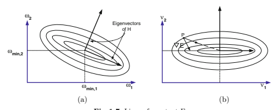

图 1.7. 常量 E 的线

$$(1.30)$$

图 1.8. 对于 LMS 算法，H 的特征向量和特征值度量输入空间中的输入分散

因此，H 的每个特征值也是沿相应特征方向输入协方差或分散程度的度量，如图 1.8 所示。

在多维中使用标量学习率是有问题的。我们希望η较大，以便在 E 的平坦方向（H 的小特征值）快速收敛，但如果η过大，权重将在陡峭方向（H 的大特征值）发散。为更具体地观察这一点，我们再次展开 E，但这次围绕最小值。

$$E(W)\approx E(W_{m i n})+\frac{1}{2}(W-W_{m i n})^{T}H_{(W_{m i n})}(W-W_{m i n}).$$

对(1.30)进行微分，并在更新方程(1.20)中使用该结果得到

$$W(t+1)=W(t)-\eta\frac{\partial E(t)}{\partial W}$$ $$=W(t)-\eta H_{(W_{min})}(W(t)-W_{min}).$$

$$(1.31)$$ $$(1.32)$$

从两边减去 Wmin 得到

$$(W(t+1)-W_{min})=(I-\eta H(W_{min}))(W(t)-W_{min}).\tag{1.33}$$

如果前因子 (I − ηH(Wmin)) 是一个始终缩小向量的矩阵变换（即其特征值的绝对值均小于 1），则更新方程将收敛。

这对选择学习率有什么帮助？理想情况下，我们希望沿不同的特征方向使用不同的学习率。如果特征方向与权重的坐标轴对齐，这很简单。在这种情况下，权重是解耦的，我们可以根据相应的特征值为每个权重分配其自己的学习率。然而，如果权重是耦合的，那么我们必须先旋转 H 使得 H 是对角矩阵，即坐标轴与特征方向对齐（见图 1.7b）。这正是之前讨论的对 Hessian 进行对角化的目的。

设 Θ 为旋转矩阵，使得

$$A=\Theta H\Theta^{T}$$

$$(1.34)$$

Λ = ΘHΘT (1.34)

其中 Λ 是对角矩阵，ΘT Θ = I。成本函数可以写成

E(W) ≈ E(Wmin) + 12 (W − Wmin) T ΘT   ΘH(Wmin)ΘT [Θ(W − Wmin)] . (1.35) 将坐标变换为 ν = Θ(W − Wmin) 将上述方程简化为

$$E(\nu)\approx E(0)+{\frac{1}{2}}\nu^{T}\Lambda\nu$$

$$(1.36)$$

变换后的更新方程变为

$$\nu(t+1)=(I-\eta\Lambda)\nu(t).$$

ν(t + 1) = (I − ηΛ)ν(t). (1.37)

注意 I − ηΛ 是对角矩阵，对角元素为 1 − ηλi。此方程将收敛当 |1 − ηλi| < 1，即 η < 2λi 对所有 i 都成立。如果限制为所有权重都有一个*单一*标量学习率，则必须要求

$$(1.37)$$

$$\eta<\frac{2}{\lambda_{m a x}}$$

$$(1.38)$$

为了避免发散，其中 λmax 是 H 的最大特征值。为了实现最快收敛，我们有

$$\eta_{o p t}={\frac{1}{\lambda_{m a x}}}.$$

$$(1.39)$$

. (1.39)

如果 λmin 远小于 λmax，那么沿着 λmin 方向的收敛将非常缓慢。实际上，收敛时间与条件数 κ ≡ λmax/λmin 成正比，因此希望特征值的差异尽可能小。

然而，由于我们已经将 H 旋转为与坐标轴对齐，

(1.37) 实际上由 N 个独立的 1 维方程组成。因此，我们可以为每个权重选择独立于其他权重的学习率。我们看到第 i 个权重 νi 的最优学习率为 ηopt,i = 1λi。

## 1.5.2 示例

线性网络。图 1.10 显示了一组来自两个高斯分布类的 100 个样本，中心分别为 (-0.4,-0.8) 和 (0.4,0.8)。协方差矩阵的特征值为 0.84 和 0.036。我们使用 LMS 算法以批量模式训练一个具有 2 个输入、1 个输出、2 个权重和 1 个偏置的单层线性网络（见图 1.9）。图 1.11 显示了使用学习率 η = 1.5 和 2.5 进行学习时的权重轨迹和误差。请注意，学习率（见公式 1.38）ηmax = 2/λmax = 2/.84 = 2.38 会导致发散，显然在 η = 2.5 时就是如此。

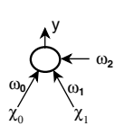

图 1.9. 简单线性网络 图 1.10. 从高斯分布中提取的以 (-0.4,-0.8) 和 (0.4,0.8) 为中心的两个类

图 1.12 显示了使用随机学习而不是批量学习的相同示例。在这里，使用的学习率为 η = 0.2。可以看到，轨迹比批量模式下要嘈杂得多，因为在每次迭代中仅使用梯度的估计。成本作为一个周期的函数绘制。在这里，一个周期简单定义为 100 次输入展示，对于随机学习，这对应于 100 次权重更新。在批量模式下，一个周期对应于一次权重更新。多层网络。图 1.14 显示了一个非常简单的多层网络的架构。它有 1 个输入、1 个隐藏和 1 个输出节点。共有 2 个权重和 2 个偏置。激活函数为 f(x)=1.71 tanh((2/3)x)。训练集包含来自 2 个类别的 10 个示例。这两个类别均为标准差 0.4 的高斯分布。类别 1 的均值为 -1，类别 2 的均值为 +1。类别 1 的目标值为 -1，类别 2 的目标值为 +1。图 1.13 显示了该示例的随机轨迹。

图 1.11. （a）η = 1.5 和（b）学习过程中的权重轨迹和误差曲线

η = 2.5

图 1.12. 使用随机学习时的权重轨迹和误差曲线，η = 

0.2

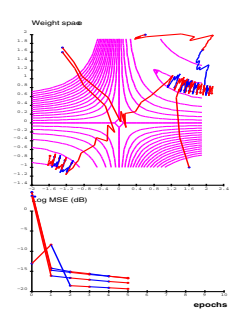

图 1.13. 使用随机学习训练的 1-1-1 网络的权重轨迹和误差

图 1.14. 最小多层网络

## 1.5.3 输入变换与误差面变换回顾

我们可以利用上一节的结果来证明之前讨论的几个技巧。

## 从输入变量中减去均值

上述技巧的原因是输入变量的非零均值会产生一个*非常大的*特征值。这意味着条件数将很大，即成本面在某些方向上将陡峭，在其他方向上则较平缓，因此收敛会非常缓慢。解决方案是通过减去均值简单预处理输入。

对于单个线性神经元，海森矩阵（减去均值后）的特征向量沿训练向量云的主轴指向（回想图 1.8）。在输入空间不同方向上有大变异的输入将具有大的条件数和缓慢学习。因此，我们建议：

## 标准化输入变量的方差。

如果输入变量是相关的，这不会使误差表面呈球形，但可能会减少其偏心率。

相关的输入变量通常会导致 H 的特征向量偏离坐标轴（图 1.7a 与 1.7b），因此权重更新并未解耦。解耦的权重使得“每个权重一个学习率”方法最优，因此，我们有以下技巧：

## 解耦输入变量。

现在假设一个神经元的输入变量已经解耦，则该神经元的海森矩阵为对角形式，其特征值沿坐标轴指向。在这种情况下，梯度并不是最佳下降方向，如图 1.7b 所示。在点 P，箭头显示梯度并不指向最小值。然而，如果我们为每个权重分配自己的学习率（等于相应特征值的倒数），那么下降方向将指向另一个箭头，直接指向最小值：

为每个权重使用单独的学习率。

## 1.6 经典二阶优化方法

在接下来的部分，我们将简要介绍牛顿、共轭梯度、高斯-牛顿、列文伯格-马夸特和拟牛顿（BFGS）方法（另见

[11, 34, 3, 5]）。

$$(1.40)$$

图 1.15. 牛顿算法的白化特性示意图

## 1.6.1 牛顿算法

为了理解牛顿方法，让我们回顾一下 1.5.1 节的结果。假设一个二次损失函数 E（见公式（1.21）），如图 1.6（ii）所示，我们可以沿着公式（1.21）-（1.23）计算权重更新。

$$\Delta w=\eta\left({\frac{\partial^{2}E}{\partial w^{2}}}\right)^{-1}{\frac{\partial E}{\partial w}}=\eta H(w)^{-1}{\frac{\partial E}{\partial w}},$$

∂w , (1.40)

其中η必须在 0 <η< 1 范围内选择，因为 E 在实际中并不是完全二次的。在这个方程中考虑了海森矩阵 H 的信息。如果误差函数是二次的，一步就足够收敛。

通常，最小值周围的能量表面相当椭球，或者在极端情况下像玉米饼，这取决于海森矩阵的条件。一个众所周知的白化变换[29]可以通过 u = ΘΛ1/2w 将这种椭球形状转换为球形（见图 1.15 和

图 1.16. 2D 误差表面中共轭梯度方向的示意图

Eq.(1.34)). 因此，Eq.(1.40) 中的逆海森矩阵基本上局部地平滑了误差面。以下两种方法可以证明是等效的：（a）在未变换的权重空间中使用牛顿算法，以及（b）在白化坐标系统中进行常规梯度下降（见图 1.15）[19]。

总结来说，当误差函数为二次时，牛顿算法在一步内收敛，并且（与梯度下降不同）对输入向量的线性变换是不变的。这意味着收敛时间不受输入向量的平移、缩放和旋转的影响。然而，主要缺点之一是必须存储和求逆一个 N × N 的海森矩阵，这在每次迭代中需要 O(N³) 的时间，因此对于多个变量来说是不切实际的。由于误差函数通常不是二次的，因此没有收敛的保证。如果海森矩阵不是正定的（如果它有一些零或甚至负特征值，使得误差面是平坦的或某些方向向下弯曲），那么牛顿算法将会发散，因此海森矩阵必须是正定的。当然，多层网络的海森矩阵通常在所有地方都不是正定的。因此，牛顿算法在其原始形式下不适用于一般的神经网络学习。

然而，这为开发更复杂的算法提供了良好的洞见，如下文所述。

## 1.6.2 共轭梯度

共轭梯度优化有几个重要特性：（1）它是一个 O(N) 方法，（2）它不显式使用海森矩阵，（3）它试图找到下降方向，以尽量减少对先前迭代结果的干扰，（4）它使用线搜索，最重要的是，（5）它仅适用于批量学习。

$$(1.41)$$

$$(1.42)$$

第三个特性在图 1.16 中显示。假设我们选择一个下降方向，例如梯度，然后在该方向上沿一条线进行最小化（线搜索）。随后，我们应该尝试找到一个方向，在这个方向上梯度不会改变其方向，只是改变其长度（共轭方向），

因为沿这个方向移动不会破坏前一次迭代的结果。迭代 k 时下降方向 ρk 的演变给出为 ρk = −∇E(wk) + βkρk−1, (1.41)

其中 βk 的选择可以根据 Fletcher 和 Reeves [34] 来进行。

$$\beta_{k}={\frac{\nabla E(w_{k})^{T}\nabla E(w_{k})}{\nabla E(w_{k-1})^{T}\nabla E(w_{k-1})}}$$

$\text{或}$ Polak 和 Ribiere。

$$\rho_{k}=-\nabla E(w_{k})+\beta_{k}\rho_{k-1},$$

$$\beta_{k}=\frac{(\nabla E(w_{k})-\nabla E(w_{k-1}))^{T}\nabla E(w_{k})}{\nabla E(w_{k-1})^{T}\nabla E(w_{k-1})}.$$ 两个方向 $\rho_{k}$ 和 $\rho_{k-1}$ 被定义为共轭的，如果

∇E(wk−1)T ∇E(wk−1) . (1.43)

$$(1.43)$$

$$\rho_{k}^{T}H\rho_{k-1}=0,$$

即共轭方向是在单位 Hessian 矩阵空间中的正交方向（参见图 1.17）。在这两种选择中，良好的线搜索过程对于收敛非常重要。对于具有 N 个变量的完全二次函数，可以证明在 N 步内收敛。对于非二次函数，Polak 和 Ribiere 的选择似乎更为稳健。共轭梯度 (1.41) 也可以被视为在神经网络训练中选择动量项的聪明选择。它在解决适中规模且数据冗余较低的问题的多层网络训练中取得了巨大成功。典型应用范围包括函数逼近、机器人控制

[39]、时间序列预测和其他需要高精度的实值问题。显然，对于大型冗余（分类）问题，随机反向传播速度更快。尽管已尝试定义小批量 [25]，但共轭梯度方法的主要缺点仍然是它是一种批处理方法（部分由于在线搜索过程中对精度的要求）。

图 1.17. 共轭梯度方向在 2D 误差面上的示意图

## 1.6.3 准牛顿 (BFGS)

准牛顿 (BFGS) 方法（1）迭代计算逆 Hessian 的估计，（2）是 O(N²) 算法，（3）需要线搜索，并且（4）仅适用于批量学习。

逆 Hessian 的正定估计是直接完成的，无需矩阵求逆，仅使用梯度信息。从算法上讲，这可以描述为：（1）首先选择一个正定矩阵 M，例如 M = I，（2）然后设置搜索方向为

$$\rho(t)=M(t)\nabla E(w(t)),$$

(3) 沿着 ρ 进行线搜索，以获得时间 t 的参数更新

$$w(t)=w(t-1)-\eta(t)\rho(t).$$

最后（4）更新逆 Hessian 的估计。与牛顿算法相比，准牛顿方法仅需要梯度信息。

最成功的准牛顿算法是 Broyden-Fletcher-Goldfarb-Shanno (BFGS) 方法。逆 Hessian 的估计更新规则为

$$M(t)=M(t-1)\left(1+\frac{\phi^{T}M\phi}{\delta^{T}\phi}\right)\frac{\delta\delta^{T}}{\delta^{T}\phi}-\left(\frac{\delta\phi^{T}M+M\phi\delta^{T}}{\delta^{T}\phi}\right),$$

$$(1.44)$$

$$(1.45)$$

, (1.44)

这里使用了一些缩写，表示以下 N × 1 向量

$$\begin{array}{l}{{\phi=\nabla E(w(t))-\nabla E(w(t-1))}}\\ {{\delta=w(t)-w(t-1).}}\end{array}$$

尽管如上所述，复杂度仅为 O(N²)，但我们仍然需要存储一个 N × N 的矩阵，因此该算法仅适用于具有非冗余训练集的小型网络。最近一些变体旨在减少存储需求（参见例如[3]）。

## 1.6.4 高斯-牛顿法和勒文贝格-马夸尔特法

高斯-牛顿和列文伯格-马夸特算法 (1) 使用平方雅可比近似，(2) 主要设计用于批量学习，(3) 复杂度为 O(N3)，(4) 最重要的是，它们仅适用于均方误差损失函数。高斯-牛顿算法类似于牛顿算法，然而海森矩阵是通过雅可比的平方来近似的（见 1.7.2 节以获取进一步讨论）。

$$\Lambda w=\left(\sum_{p}\frac{\partial f(w,x_{p})}{\partial w}^{T}\frac{\partial f(w,x_{p})}{\partial w}\right)^{-1}\nabla E(w).\tag{1.46}$$

列文伯格-马夸特方法类似于上述高斯-牛顿方法，但它具有一个正则化参数 μ，可以防止在某些特征值较小时出现爆炸。

T ∂f(w, xp) ∂w + μI−1∇E(w), (1.47) Δw = - ∂f(w, xp) ∂w p

其中 I 表示单位矩阵。高斯-牛顿方法适用于二次成本函数，但类似的程序在使用 Kullback-Leibler 成本时也有效，称为自然梯度（见 e.g. [1, 44, 2]）。

## 1.7 在多层网络中计算海森矩阵信息的技巧

现在我们将讨论几种旨在通过 (a) 有限差分法，(b) 平方雅可比近似（用于高斯-牛顿和列文伯格-马夸特算法），(c) 计算海森矩阵的对角线以及 (d) 在不计算海森矩阵的情况下获得海森矩阵与向量的乘积的技术。其他允许计算完整海森矩阵的半解析技术被省略，因为它们相当复杂，并且还需要许多前向/反向传播步骤 [5, 8]。

## 1.7.1 有限差分法

我们可以写出海森矩阵的第 k 行

$$H^{(k)}=\frac{\partial(\nabla E(w))}{\partial w_{k}}\sim\frac{\nabla E(w+\delta\phi_{k})-\nabla E(w)}{\delta},$$

其中 φk = (0, 0, 0,..., 1*,...,* 0) 是一个零向量，只有在第 k 个位置有一个 1。可以用一个简单的步骤实现：（1）通过多次前向和反向传播计算总梯度；（2）在第 k 个参数上添加 δ 并再次计算梯度；最后（3）相减两者结果并除以 δ。由于该计算方案中的数值误差，得到的海森矩阵可能不完全对称。在这种情况下，应按照下面描述的方式进行对称化。

## 1.7.2 高斯-牛顿与列文伯格-马夸特算法的平方雅可比近似

假设一个均方成本函数

$$E(w)={\frac{1}{2}}\sum_{p}(d_{p}-f(w,x_{p}))^{T}(d_{p}-f(w,x_{p}))$$

那么梯度为

$${\frac{\partial E(w)}{\partial w}}=-\sum_{p}(d_{p}-f(w,x_{p}))^{T}{\frac{\partial f(w,x_{p})}{\partial w}}$$

$$(1.48)$$

$$(1.49)$$

海森矩阵如下

$$H(w)=\sum_{p}\frac{\partial f(w,x_{p})}{\partial w}^{T}\frac{\partial f(w,x_{p})}{\partial w}+\sum_{p}(d_{p}-f(w,x_{p}))^{T}\frac{\partial^{2}f(w,x_{p})}{\partial w\partial w}.$$

∂w∂w . (1.50)

Hessian 的简化近似是 Jacobian 的平方，它是一个维度为 N × O 的半正定矩阵。

$$(1.50)$$

$$H(w)\sim\sum_{p}{\frac{\partial f(w,x_{p})}{\partial w}}^{T}{\frac{\partial f(w,x_{p})}{\partial w}},$$

$$(1.51)$$

其中 Eq.(1.50)中的第二项被去掉。这相当于假设网络是参数 w 的线性函数。同样，这可以轻松实现 Jacobian 的第 k 列：对于所有训练样本，（1）我们向前传播，然后（2）将输出单元的活动设置为 0，仅将第 k 个输出设置为 1，（3）进行一次反向传播步骤并累积梯度。

## 1.7.3 反向传播二阶导数

让我们考虑一个具有 Ni 输入的一些功能模块的多层系统，

没有输出，N 个参数的形式为 O = F(*W, X*)。现在假设我们知道

∂2*E/∂O*2，这是一个 No × No 矩阵。然后可以直接计算

这个矩阵$$\frac{\partial^{2}E}{\partial W^{2}}=\frac{\partial O}{\partial W}^{T}\frac{\partial^{2}E}{\partial O^{2}}\frac{\partial O}{\partial W}+\frac{\partial E}{\partial O}\frac{\partial^{2}O}{\partial W^{2}}.\tag{1.52}$$我们可以去掉 Eq.(1.52)中的第二项，得到的估计

Hessian 是半正定的。如果忽略所有的

但∂2E 的对角项

∂O2 :

$$(1.52)$$

$${\frac{\partial^{2}E}{\partial w_{i}^{2}}}=\sum_{k}{\frac{\partial^{2}E}{\partial o_{k}^{2}}}\left({\frac{\partial o_{k}}{\partial w_{i}}}\right)^{2}.$$

$$(1.53)$$

类似的推导可以得到 Ni 次的 Ni 矩阵∂2*E/∂x*2。

## 1.7.4 在神经网络中反向传播对角 Hessian

计算对角 Hessian 的反向传播过程是众所周知的[18, 4, 19]。假设网络中的每一层具有功能形式 oi = f(yi) = f(j wijxj)(见图 1.18 中的 sigmoidal 网络)。使用高斯-牛顿近似（去掉包含 f(y)的项），我们得到：∂2E

**引理（去掉包含$f^{\prime}(x)$的项）** $$\frac{\partial^{2}E}{\partial y_{k}^{2}}=\frac{\partial^{2}E}{\partial o_{k}^{2}}\left(f^{\prime}(y_{k})\right)^{2},$$ $$\frac{\partial^{2}E}{\partial w_{ki}^{2}}=\frac{\partial^{2}E}{\partial y_{k}^{2}}x_{i}^{2}$$

$$(1.54)$$

$$(1.55)$$

$$(1.56)$$

$$(1.57)$$

和∂2E

$${\frac{\partial^{2}E}{\partial x_{i}^{2}}}\sum_{k}{\frac{\partial^{2}E}{\partial y_{k}^{2}}}w_{k i}^{2}.$$

设$f$为高斯非线性，如图 1.18 中 RBF 网络所示，我们得到$$\frac{\partial²E}{\partial w_{ki}²}=\frac{\partial²E}{\partial y_k²}(x_i-w_{ki})²\eqno(1.57)$$  1.

和∂2E

$${\frac{\partial^{2}E}{\partial x_{i}^{2}}}=\sum_{k}{\frac{\partial^{2}E}{\partial y_{k}^{2}}}(x_{i}-w_{k i})^{2}.$$

$$(1.58)$$

通过从最后一层到第一层运行这些方程来计算对角二阶导数的成本基本上与用于梯度的常规反向传播过程相同，只是加权和中使用了权重的平方。这项技术应用于“最佳大脑损伤”修剪程序（见 [21]）。

$$(1.59)$$

图 1.18. 反向传播对角 Hessian：sigmoid（左）和 RBF（右）

## 1.7.5 计算 Hessian 和向量的乘积

在许多利用 Hessian 的方法中，Hessian 专门用于与向量的乘积。有趣的是，有一种方法可以在不计算 Hessian 本身的情况下计算这些乘积。有限差分法可以为任意向量 Ψ 完成此任务。

$$H\Psi\sim\frac{1}{\alpha}\left(\frac{\partial E}{\partial w}(w+\alpha\Psi)-\frac{\partial E}{\partial w}(w)\right),$$

仅使用两个梯度计算（在点 w 和 w + αΨ）。

可以通过反向传播轻松计算（α 是一个小常数）。

该方法可通过幂法计算 H 的主特征向量和特征值。通过迭代并设置

$$\Psi(t+1)={\frac{H\Psi(t)}{\|\Psi(t)\|}},$$

$$(1.60)$$

向量 Ψ(t) 将收敛到 H 的最大特征向量，Ψ(t) 将收敛到对应的特征值 [23, 14, 10]。有关不使用有限差分且复杂度相似的更精确方法，请参见 [33]。

## 1.8 多层网络中 Hessian 的分析

了解之前展示的一些技巧如何影响 Hessian 是很有趣的，即 Hessian 如何随着架构和实现细节而变化。通常，Hessian 的特征值分布看起来像图 1.20 中的草图：一些小特征值，许多中等特征值和少量非常大的特征值。我们现在将论证 *大特征值* 会在训练过程中造成问题，因为 [23, 22]

- 非零均值输入或神经元状态 [22]（另见第十章） - 从层到层的二阶导数有广泛变化 - 状态变量之间的相关性。

为了说明这一点，我们在图 1.20 中展示了在 OCR 数据上训练的网络的特征值分布。显然，特征值的分布很广泛（见图 1.19），我们观察到例如第一和第十一特征值之间的比例约为 8。特征值分布的长尾（见图 1.20）相当痛苦，因为最大和最小特征值之间的比例给出了学习问题的条件数。较大的比例对应于椭圆形误差函数的轴之间的巨大差异：

比例越大，我们越能发现塔可壳形状的极小值，这些极小值在短轴方向上非常陡峭，在长轴方向上则非常平坦。

图 1.19. 四层共享权重网络的特征值谱（256×128×64×10）

在 320 个手写数字上进行训练

图 1.20. 四层共享权重网络的特征值谱（256×128×64×10）

在 320 个手写数字上进行训练 图 1.21. 多层架构：在下层的二阶导数通常较小

在多层网络中，Hessian 的另一个普遍特征是层间的差异。在图 1.21 中，我们大致描绘了 Hessian 的形状如何从第一层的相对平坦逐渐变为最后一层的陡峭。这影响了学习速度，并可以提供解释下层学习缓慢和最后一层学习快速（有时震荡）的一个因素。补偿这种不同学习规模的一个技巧是使用逆对角 Hessian 来控制学习速率（另见第 1.6 节，第十七章）。

## 1.9 将二阶方法应用于多层网络

在我们本节集中讨论如何为大规模网络定制二阶技术之前，让我们先重复一些关于应用经典二阶方法的相当悲观的事实。使用完整 Hessian 信息的技术（高斯-牛顿法、勒温伯格-马夸特法和 BFGS）仅能应用于以批量模式训练的非常小的网络，而这些小网络恰恰不是最需要加速的。大多数二阶方法（共轭梯度、BFGS 等）需要线搜索，因此无法在随机模式下使用。许多之前讨论的技巧仅适用于批量学习。根据我们的经验，我们知道仔细调优的随机梯度下降在大型分类问题上很难被击败。对于需要准确实值输出的小问题，如函数逼近或控制问题，我们发现共轭梯度（结合 Polak-Ribiere 公式(1.43)）提供了速度、可靠性和简单性的最佳组合。最近对在大规模冗余问题上应用共轭梯度的“迷你批量”方法进行了几次尝试[17, 25, 31]。一种共轭梯度优化的变体（称为缩放 CG）似乎很有趣：在这里，线搜索程序被 1D 勒温伯格-马夸特法算法替代[24]。

## 1.9.1 随机对角勒温伯格-马夸特法

为了获得勒温伯格-马夸特法的随机版本，理念是通过对每个参数的二阶导数进行动态估计来计算对角 Hessian。瞬时二阶导数可以通过反向传播获得，如第 1.7 节的公式所示。一旦我们得到了这些动态估计，就可以用它们为每个参数计算个别学习速率。

$$\eta_{k i}=\frac{\epsilon}{\langle\frac{\partial^{2}E}{\partial w_{k i}^{2}}\rangle+\mu},$$

$$(1.61)$$

, (1.61)

其中  表示全局学习速率，和  ∂2E

∂w2ki 是关于 wki 的对角二阶导数的运行估计。μ是一个参数，用于防止在二阶导数较小时（即优化在误差函数的平坦部分移动时）ηki 爆炸。运行估计的计算为

$$\langle\frac{\partial^{2}E}{\partial w_{ki}^{2}}\rangle_{new}=(1-\gamma)\langle\frac{\partial^{2}E}{\partial w_{ki}^{2}}\rangle_{old}+\gamma\frac{\partial^{2}E^{p}}{\partial w_{ki}^{2}},\tag{1.62}$$

其中γ是一个小常数，用于确定使用的记忆量。二阶导数可以在训练之前计算，例如在训练集的一个子集上。由于它们变化非常缓慢，因此只需每几个周期重新估计一次。请注意，常规反向传播的额外成本微不足道，收敛速度——作为经验法则——约比精心调整的随机梯度算法快三倍。

在图 1.22 和 1.23 中，我们看到随机对角 Levenberg-Marquardt 方法（1.61）在两个不同学习率的玩具示例中的收敛情况。显然，图 1.22 中的实验波动比图 1.23 要小，这是由于学习率较小。

图 1.22. 随机对角 Levenberg-Marquardt 算法。数据集来自 2 个高斯分布，包含 100 个示例。网络有一个线性单元，2 个输入和 1 个输出，即

三个参数（2 个权重，1 个偏置）。

图 1.23. 随机对角 Levenberg-Marquardt 算法。数据集来自 2 个高斯分布，包含 100 个示例。网络有一个线性单元，2 个输入和 1 个输出，即

三个参数（2 个权重，1 个偏置）。

## 1.9.2 计算海森矩阵的主特征值/特征向量

接下来我们给出计算海森矩阵的主特征值/特征向量的三个技巧，而无需计算海森矩阵本身。请记住，在第 1.4.7 节中，我们还介绍了一种通过平均来近似海森矩阵最小特征向量的方法（另见[28]）。幂法。我们重申在第 1.7.5 节中的讨论结果：从一个随机初始向量Ψ开始，迭代

$$\Psi_{n e w}=H\frac{\Psi_{o l d}}{\|\Psi_{o l d}\|},$$

最终将收敛到主特征向量（或主特征空间中的一个向量），而Ψold 将收敛到相应的特征值[14, 10]。

图 1.24. 特征值随样本展示次数变化的演变，对于一个具有 5 层、64638 个连接和 1278 个自由参数的共享权重网络。训练集包含 1000 个手写数字。

泰勒展开。另一种方法利用了梯度的小扰动也会导致 H 的主特征向量的事实。

$$\Psi_{new}=\frac{1}{\alpha}\left(\frac{\partial E}{\partial w}(w+\alpha\frac{\Psi_{old}}{\|\Psi_{old}\|})-\frac{\partial E}{\partial w}(w)\right),\tag{1.63}$$

其中α是一个小常数。该程序的一次迭代需要对训练集中每个模式进行两次正向和两次反向传播步骤。

Ψ的在线计算。以下规则利用运行平均值快速获取平均 Hessian 的最大特征值

$$\Psi_{new}=(1-\gamma)\Psi+\frac{1}{\alpha}\left(\frac{\partial E^{p}}{\partial w}(w+\alpha\frac{\Psi_{old}}{\|\Psi_{old}\|})-\frac{\partial E}{\partial w}(w)\right).\tag{1.64}$$

## 学习率 预测的最优学习率

图 1.25. 平方误差作为学习率与预测最优学习率比值的函数，用于一个完全连接的网络（784 × 30 × 10）。训练集包含 300 个手写数字。

总结特征值/特征向量计算：

1. 随机选择一个向量用于Ψ的初始化，

2. 提供一个输入模式和期望输出，执行正向和反向传播步骤，并存储梯度 G(w)，3. α Ψold Ψold 被添加到当前权重向量 w，4. 使用扰动的权重向量执行正向和反向传播步骤，并存储梯度 G(w)，5. 计算差值 1/α(G(w) − G(w))并更新特征向量的运行平均值，6. 从(2)-(6)循环，直到获得Ψ的合理稳定结果，

7. 最优学习率被定义为

$\mathbf{a}$

$||\psi|$.

学习率

预测的最优学习率

图 1.26. 平方误差作为共享权重网络中学习率与预测最优学习率比值的函数，具有 5 层（1024 ×

1568 × 392 × 400 × 100 × 10)，64638（局部）连接和 1278 个自由参数

（共享权重）。训练集包含 1000 个手写数字。

在图 1.24 中，我们看到特征值随模式呈现次数的变化，用于手写字符识别任务的神经网络。实际上，我们调整运行平均值的泄漏大小以减少波动（如图中所示）。图中显示，在少于 100 次模式呈现后，特征值的正确量级即学习率达成。从实验中我们还观察到，训练过程中平均 Hessian 的波动很小。

在图 1.25 和 1.26 中，我们从相同的初始条件开始，并进行固定数量的训练周期，学习率通过将预测学习率与预定义常数相乘来计算。选择常数 1（即使用预测的最优率）总是会产生与最佳常数选择下的残差误差非常接近的结果。换句话说，“预测的最优率”是足够最优的。

## 1.10 讨论与结论

根据上述建议，面临多层神经网络训练问题的从业者将经历以下步骤：

- 随机打乱示例 - 通过减去均值来中心化输入变量 - 将输入变量标准化到标准差为 1 - 如果可能，去相关输入变量。 - 选择图 1.4 中所示的 sigmoid 函数的网络 - 将目标值设定在 sigmoid 的范围内，通常为+1 和-1。 - 将权重初始化为 1.16 所规定的随机值。

选择训练网络的首选方法如下：

- 如果训练集很大（超过几百个样本）且冗余，并且如果任务是分类，使用经过仔细调整的随机梯度，或使用随机对角 Levenberg-Marquardt 方法。

- 如果训练集不是太大，或者任务是回归，使用共轭梯度法。

经典的二阶方法在几乎所有有用的情况下都是不切实际的。

多层神经网络中随机梯度下降的非线性动态，特别是其与泛化的关系，仍然远未被充分理解。需要更多的理论研究和系统的实验工作。致谢。Y.L.、L.B.和 K.-R. M.感激 DAAD 和 NSF 的互换资助。

[1] Amari, S.: 结构参数空间中的神经学习——自然黎曼梯度。在：Mozer, M.C., Jordan, M.I., Petsche, T.（编）神经信息处理系统进展，第 9 卷，p. 127. MIT 出版社（1997）

[2] Amari, S.: 自然梯度在学习中高效工作。神经计算 10(2)，251–276（1998）

[3] Battiti, R.: 学习的第一和第二阶方法：在最陡下降与牛顿方法之间。神经计算 4，141–166（1992）

[4] Becker, S., LeCun, Y.: 通过二阶方法改善反向传播学习的收敛性。在：Touretzky, D., Hinton, G., Sejnowski, T.（编）1988 年连接主义模型暑期学校论文集，pp. 29–37. Lawrence Erlbaum Associates（1989）

[5] Bishop, C.M.: 模式识别的神经网络。Clarendon 出版社，牛津

(1995)

[6] Bottou, L.: 在线算法和随机近似。在：Saad, D.（编）

在线学习中的神经网络（1997 年牛顿研究所研讨会）。牛顿研究所系列。剑桥大学出版社，剑桥（1998）

[7] Broomhead, D.S., Lowe, D.: 多变量函数插值和自适应网络。复杂系统 2, 321–355（1988）

[8] Buntine, W.L., Weigend, A.S.: 在前馈网络中计算二阶导数：综述。IEEE 神经网络学报（1993）（待发表）

[9] Darken, C., Moody, J.E.: 关于随机优化的学习速率调度的说明。在：Lippmann, R.P., Moody, J.E., Touretzky, D.S.（编）神经信息处理系统进展，第 3 卷，页 832–838。摩根·考夫曼，旧金山（1991）

[10] Diamantaras, K.I., Kung, S.Y.: 主成分神经网络。威利，纽约（1996）

[11] Fletcher, R.: 优化的实用方法，第 8.7 章：多项式时间算法，第 2 版，页 183–188。约翰·威利父子公司，纽约（1987）

[12] Geman, S., Bienenstock, E., Doursat, R.: 神经网络与偏差/方差困境。神经计算 4(1), 1–58（1992）

[13] Goldstein, L.: 连续时间 Robbins Monro 程序中的均方最优性。技术报告 DRB-306，南加州大学数学系，洛杉矶（1987）

[14] Golub, G.H., Van Loan, C.F.: 矩阵计算，第 2 版。约翰·霍普金斯大学出版社，巴尔的摩（1989）

[15] Heskes, T.M., Kappen, B.: 人工神经网络中的在线学习过程。

在：Tayler, J.G.（编）神经网络的数学方法，第 51 卷，页 199–233。爱思唯尔，阿姆斯特丹（1993）

[16] Jacobs, R.A.: 通过学习速率调整提高收敛速率。

神经网络 1, 295–307（1988）

[17] Kramer, A.H., Sangiovanni-Vincentelli, A.: 用于神经网络的高效并行学习算法。在：Touretsky, D.S.（编）1988 年神经信息处理系统进展会议论文集，页 40–48。摩根·考夫曼，旧金山（1989）

[18] LeCun, Y.: 连接主义学习模型。博士论文，巴黎六大 P. et M. Curie 大学（1987）

[19] LeCun, Y.: 泛化与网络设计策略。在：Pfeifer, R., Schreter, Z., Fogelman, F., Steels, L.（编）国际会议“连接主义视角”论文集，苏黎世大学，10 月 10-13 日。爱思唯尔，阿姆斯特丹（1988）

[20] LeCun, Y., Boser, B., Denker, J.S., Henderson, D., Howard, R.E., Hubbard, W.,

Jackel, L.D.: 使用反向传播网络进行手写数字识别。在：

Touretsky, D.S.（编）神经信息处理系统进展，第 2 卷。摩根·考夫曼，旧金山（1990）

[21] LeCun, Y., Denker, J.S., Solla, S.A.: 最优脑损伤。在：Touretsky, D.S.

（编）神经信息处理系统进展，第 2 卷，页 598–605

（1990）

[22] LeCun, Y., Kanter, I., Solla, S.A.: 错误曲面的二阶特性。在：

神经信息处理系统进展，第 3 卷。摩根·考夫曼，旧金山（1991）

[23] LeCun, Y., Simard, P.Y., Pearlmutter, B.: 通过在线估计海森矩阵的特征向量自动最大化学习率。编者: Giles, Hanson, Cowan《神经信息处理系统进展》，第 5 卷。摩根·考夫曼出版社，圣马特奥 (1993)

[24] Møller, M.: 一种用于快速监督学习的缩放共轭梯度算法。

神经网络 6, 525–533 (1993)

[25] Møller, M.: 在大型冗余训练集上进行监督学习。国际神经系统期刊 4(1), 15–25 (1993)

[26] Moody, J.E., Darken, C.J.: 快速学习局部调谐处理单元网络。神经计算 1, 281–294 (1989)

[27] Murata, N.: 博士论文，东京大学 (1992) (日语) [28] Murata, N., Müller, K.-R., Ziehe, A., Amari, S.: 在变化环境中的自适应在线学习。编者: Mozer, M.C., Jordan, M.I., Petsche, T.《神经信息处理系统进展》，第 9 卷, 第 599 页。麻省理工学院出版社 (1997)

[29] Oppenheim, A.V., Schafer, R.W.: 数字信号处理。普伦蒂斯霍尔，恩格尔伍德悬崖 (1975)

[30] Orr, G.B.: 随机学习的动态与算法。博士论文，俄勒冈州研究所 (1995)

[31] Orr, G.B.: 使用自适应批量大小在线搜索去噪。编者: Mozer, M.C., Jordan, M.I., Petsche, T.《神经信息处理系统进展》，第 9 卷, 第 232 页。麻省理工学院出版社 (1997)

[32] Orr, M.J.L.: 在选择径向基函数中心时的正则化。神经计算 7(3), 606–623 (1995)

[33] Pearlmutter, B.A.: 通过海森矩阵进行快速精确乘法。神经计算 6, 147–160 (1994)

[34] Press, W.H., Flannery, B.P., Teukolsky, S.A., Vetterling, W.T.: C 语言数值计算：科学编程的艺术。剑桥大学出版社，剑桥 (1988)

[35] Saad, D. (编者): 神经网络中的在线学习（1997 年牛顿研究所研讨会）。牛顿研究所系列。剑桥大学出版社，剑桥 (1998)

[36] Saad, D., Solla, S.A.: 多层神经网络在线学习的精确解。物理评论快报 74, 4337–4340 (1995) [37] Sompolinsky, H., Barkai, N., Seung, H.S.: 二分法的在线学习：算法与学习曲线。编者: Oh, J.-H., Kwon, C., Cho, S.《神经网络：统计力学视角》，第 105–130 页。世界科学出版社，新加坡 (1995)

[38] Sutton, R.S.: 通过梯度下降调整偏差：一种增量版本的 deltabar-delta。编者: Swartout, W.《第十届全国人工智能会议论文集》，第 171–176 页。麻省理工学院出版社，圣荷西 (1992 年 7 月)

[39] van der Smagt, P.: 训练前馈网络的最小化方法。神经网络 7(1), 1–11 (1994)

[40] Vapnik, V.: 统计学习理论的本质。施普林格出版社，纽约 (1995)

[41] Vapnik, V.: 统计学习理论。威利出版社，纽约 (1998)

[42] Waibel, A., Hanazawa, T., Hinton, G., Shikano, K., Lang, K.J.: 使用时延神经网络的音素识别。IEEE 声学、语音和信号处理交易 ASSP-37, 328–339 (1989)

[43] Wiegerinck, W., Komoda, A., Heskes, T.: 使用动量的学习随机动力学在神经网络中。物理学 A 杂志 27, 4425–4437 (1994)

[44] Yang, H.H., Amari, S.: 自然梯度下降学习规则的效率和鲁棒性。在：Jordan, M.I., Kearns, M.J., Solla, S.A.（编辑）《神经信息处理系统进展》，第 10 卷。麻省理工学院出版社（1998）

# 改善泛化的正则化技术-

## 前言

对于提高神经网络的泛化能力，良好的正则化技巧是极其重要的。第一个也是最常用的技巧是早期停止，这最初在[11]中描述。在其最简单的版本中，技巧如下：

取一个独立的验证集，例如从训练集中取出一部分，并在训练期间监控该集的错误。训练集上的错误会减少，而验证集上的错误会先减少后增加。早期停止点发生在验证集的错误最低处。在这里，网络权重提供最佳泛化。

正如 Lutz Prechelt 在第二章指出的，上述图像是高度理想化的。实际上，验证集上的错误曲线形状更可能非常不规则，具有多个极小值。选择“最佳”早期停止点涉及（1）泛化改进与（2）学习速度之间的权衡。如果速度不是问题，那么显然，最安全的策略是训练直到找到训练集上的最小错误，同时监控验证集上最低错误率的位置。当然，这可能需要大量的计算时间。本章提出了一些成本较低的策略，采用多种不同的停止标准，例如当*泛化损失*与*进展*的比率超过给定阈值时（见第 57 页）。使用各种基准问题的大规模模拟研究用于讨论和分析这些提议的停止标准之间的差异（例如鲁棒性、有效性、训练时间等）（见第 60 页及后）。到目前为止，理论研究[12, 1, 6]尚未研究这种权衡。

权重衰减也是一种常用的控制神经网络能力的技术。早期停止被认为是快速的，但定义不够明确。

（请记住第二章提到的陷阱）。另一方面，权重衰减正则化器[5, 2]被很好地理解，但找到合适的参数λ来控制权重衰减项的强度可能非常耗时。

Thorsteinn Rögnvaldsson 提出了一种简单的技巧，通过利用*两全其美*（见第 75 页）来估计λ：简单地计算早期停止解 Wes 的梯度并将其除以 Wes 的范数，λˆ = ∇E(Wes)/2Wes。

其他惩罚也可能存在。这个技巧快速有效，因为我们既不需要进行完整的训练，也不需要扫描整个λ参数空间，而且从一些有趣的模拟结果来看，确定的λˆ的准确性良好。

- 先前发表在：Orr, G.B. 和 Müller, K.-R.（编）：LNCS 1524，ISBN

978-3-540-65311-0 (1998)。

G. Montavon 等人（编）：NN: Tricks of the Trade, 第 2 版，LNCS 7700，页 49–51，2012 年。

-c Springer-Verlag Berlin Heidelberg 2012

Tony Plate 在第四章中沿着 MacKay [8]和 Neal [9]的贝叶斯框架处理权重的惩罚因子（超参数）。寻找最佳网络有两个层次。内部循环是固定超参数的情况下最小化训练误差，而外部循环则搜索超参数空间，以最大化生成数据的证据。整个过程相对缓慢且计算开销大，因为理论上，内部搜索在每个外部循环搜索步骤中都需要收敛（到局部最小值）。当应用于使用交叉熵误差函数的分类网络时，外部循环搜索可能不稳定，超参数值可能剧烈波动或达到不当的极端。为了使这个贝叶斯框架在实践中更好地运作，Tony Plate 提出了一些加速和简化超参数搜索策略的技巧（见第 96 页）。特别是，他的搜索策略围绕以下问题展开：(1) 超参数应该多频繁（何时）更新（见第 96 页）和(2) 如果 Hessian 超出界限该怎么办（见第 97 页及后续）。为讨论在(1)和(2)中所作选择的影响，Tony Plate 使用基于人工示例的模拟，并总结出一套简明的规则，以便使超参数框架更好地工作。

在第五章中，Jan Larsen 等人制定了一个迭代梯度下降方案，用于调整他们的正则化参数（注意，不同的正则化器可以用于输入/隐藏和隐藏/输出权重）。这个技巧很简单：

在验证集误差上执行梯度下降，以调整正则化参数，并迭代地使用结果更新正则化参数的估计（参见第 116 页）。此方法适用于多种惩罚项（例如权重衰减）。计算梯度的计算开销可以忽略不计，但必须估计逆海森矩阵。如果使用二阶方法进行训练，则逆海森矩阵可能已经可用，因此额外的工作量很少。否则，获取完整的海森信息相当繁琐，限制了该方法在较小应用中的使用（参见第一章的讨论）。尽管如此，海森的近似值（例如。

对角线）也可以用来限制计算时间。Jan Larsen 等人展示了他们的技巧在分类（元音数据）和回归（时间序列预测）问题上的适用性。

对多个预测器进行平均是一种众所周知的提高泛化能力的方法（参见例如[10, 3, 7, 13]）。David Horn 等人在集成训练中提出了两个问题：（1）多少个预测器是“足够的”，以及（2）预测器的数量如何影响早停的停止标准（参见第 134 页）。他们通过提供一种估计无限多个预测器误差的方法，提出了回答这些问题的解决方案，并展示了他们的技巧在太阳黑子预测任务中的实用性。还给出了额外的理论推理，以解释他们在集成中通过最小化方差而取得的成功。

珍妮与克劳斯

[1] Amari, S., Murata, N., Müller, K.-R., Finke, M., Yang, H.H.：过拟合与交叉验证的渐近统计理论。IEEE 神经网络交易 8(5), 985–996 (1997)

[2] Bishop, C.M.：模式识别的神经网络。牛津大学出版社

（1995）

[3] Breiman, L.：袋装预测器。机器学习 26(2), 123–140 (1996) [4] Cowan, J.D., Tesauro, G., Alspector, J.（主编）：神经信息处理系统进展 6，圣马特奥，加利福尼亚。摩根·考夫曼出版社（1994）

[5] Girosi, F., Jones, M., Poggio, T.：正则化理论与神经网络架构。神经计算 7(2), 219–269 (1995)

[6] Kearns, M.：使用近似和估计速率的交叉验证误差界限，以及对训练测试划分的影响。神经计算 9(5), 1143–1161 (1997)

[7] Lincoln, W.P., Skrzypek, J.：多重反向传播网络的聚类协同。在：Touretzky, D.S.（编）神经信息处理系统进展 2，圣马特奥，加利福尼亚，第 650–657 页。摩根·考夫曼（1990）

[8] McKay, D.J.C.：一种实用的贝叶斯框架用于反向传播网络。

神经计算 4, 448–472 (1992)

[9] Neal, R.M.：神经网络的贝叶斯学习。统计学讲义，卷 118。施普林格出版社，纽约（1996）

[10] Perrone, M.P.：改善回归估计：用于方差减少的平均方法及其在一般凸度量优化中的扩展。博士论文，布朗大学（1993 年 5 月）

[11] Plaut, D.C., Nowlan, S.J., Hinton, G.E.：反向传播学习的实验。技术报告，计算机科学系，技术报告，匹兹堡，PA（1986 年）

[12] Wang, C., Venkatesh, S.S., Judd, J.S.：学习中的最优停止和有效机器复杂性。在：[4]（1994 年）

[13] Wolpert, D.H.：堆叠泛化。神经网络 5(2)，241–259（1992 年）

# 2 提前停止 - 但何时？∗

Lutz Prechelt，卡尔斯鲁厄大学计算机科学系，德国卡尔斯鲁厄 D-76128 prechelt@ira.uka.de http://www.ipd.ira.uka.de/˜prechelt/

摘要。验证可以用来检测在监督训练神经网络时何时开始过拟合；然后在收敛之前停止训练，以避免过拟合（“提前停止”）。然而，基于验证的提前停止所使用的确切标准通常是以临时方式选择的，或者训练是交互式停止的。这一技巧描述了如何以系统的方式选择停止标准；这是一种加速学习过程或改善泛化的技巧，具体情况取决于哪种更为重要。对多层感知器的实证研究表明，训练时间和泛化之间存在权衡：从 1296 次训练运行的给定组合中，使用不同的 12 个问题和 24 种不同的网络架构，我得出结论，较慢的停止标准允许泛化有小幅改进（此处：平均约 4%），但需要花费更多的训练时间（此处：平均大约长 4 倍）。

## 2.1 提前停止并不那么简单 2.1.1 为什么提前停止？

在训练神经网络时，通常希望获得具有最佳泛化性能的网络。然而，所有标准的神经网络架构，如全连接的多层感知器，都容易过拟合[10]：虽然网络*看起来*越来越好，即训练集上的误差减少，但在训练的某个时刻，它实际上又开始变差，即在未见示例上的误差增加。理想的期望是，在训练过程中，网络的泛化误差如图 2.1 所示演变。通常，通过验证误差来估计泛化误差，即在*验证集*上的平均误差，该集是一个固定的示例集合，不来自训练集。

基本上有两种方法来对抗过拟合：减少参数空间的维度数量或减少每个维度的有效大小。

- 先前发表在：Orr, G.B. 和 Müller, K.-R. (编)：LNCS 1524，ISBN

978-3-540-65311-0（1998 年）。

G. Montavon 等（编）：NN：行业技巧，第二版，LNCS 7700，第 53–67 页，2012 年。

-c Springer-Verlag 柏林海德堡 2012 年

减少参数数量的技术包括贪婪构造学习[7]、剪枝[5, 12, 14]或权重共享[18]。减少每个参数维度大小的技术是正则化，例如权重衰减[13]。

以及其他[25]，或早停[17]。另见[8, 20]以获取概述，和[9]以获取实验比较。

早停法被广泛使用，因为它简单易懂且易于实现，并且在许多情况下被报告优于正则化方法，例如在[9]中。

## 2.1.2 基本早停技术

在大多数关于监督神经网络训练的入门论文中，可以找到类似于图 2.1 所示的图表。它声称展示了训练集和未用于训练的验证集的每个样本错误随时间的演变（*训练错误曲线*和*验证错误曲线*）。鉴于这种行为，很明显如何使用验证进行早停：

图 2.1 理想化的训练和验证错误曲线。垂直：错误；水平：

时间。

1. 将训练数据分成训练集和验证集，例如以 2 比 1 的比例。

2. 仅在训练集上训练，并偶尔评估验证集上的每个样本错误，例如每五个周期后。

3. 一旦验证集上的错误高于上次检查时的错误，立即停止训练。

4. 将网络在上一步中的权重作为训练运行的结果。

该方法使用验证集来预测实际使用（或测试集）中的行为，假设两者的错误相似：验证错误被用作泛化错误的估计。

## 2.1.3 现实的丑陋

然而，对于真实的神经网络训练，验证集错误并不会像图 2.1 所示那样平滑演变，而更像图 2.2 所示。有关这种行为的粗略解释请见第 2.4 节。如我们所见，验证错误在开始增加后仍然可能进一步降低——而且在现实环境中，我们永远无法知道确切的泛化错误，而是通过验证集错误来估计。没有明显的规则可以决定何时达到泛化错误的最小值。真实的验证错误曲线几乎总是有多个局部最小值。上述曲线在大约第 400 个周期开始严重过拟合之前展现了多达 16 个局部最小值。在这些局部最小值中，有 4 个是它们出现时的全局最小值。在这个例子中，最佳的停止点是第 205 个周期。请注意，与在第 45 个周期的第一个“深”局部最小值后不久停止相比，在第 400 个周期停止将学习时间增加约七倍，以换取验证集错误改善 1.1%（通过在第 205 个周期找到最小值）。如果使用代表性数据，验证错误是对实际网络性能的无偏估计；因此，我们期望在这种情况下泛化错误减少 1.1%。然而，过拟合有时可能会被忽视，因为验证集是有限的，因此并不完美代表问题。

不幸的是，上述或任何其他验证错误曲线并不是在所有曲线具有相同定性行为的意义上*典型*。其他曲线可能永远无法达到比第一条更好的最小值，或者说第三条的最小值；曲线中的山脉和谷底可能具有非常不同的宽度、高度和形状。所有曲线似乎唯一共同点是，第一局部最小值和后续局部最小值之间的差异并不大。

如我们所见，选择停止准则主要涉及训练时间和泛化错误之间的权衡。然而，一些停止准则通常可能找到比其他准则更好的权衡。这就引出了一个问题：

图 2.2. 一个真实的验证错误曲线。纵轴：验证集错误；横轴：时间（以训练周期计）。

应该使用哪种准则进行交叉验证，以决定何时停止训练。

这就是我们需要当前技巧的原因：告诉我们如何*真正*进行提前停止。

## 2.2 如何最好地进行提前停止

我们需要的是一个谓词，告诉我们何时停止训练。我们称这种谓词为*停止准则*。在所有可能的停止准则中，我们寻找那些能产生最低泛化错误的准则，同时也寻找那些具有最佳“性价比”的准则，即，对于给定的泛化错误，所需的训练最少，或者在某一训练时间内（平均）导致最低的泛化错误。

## 2.2.1 一些停止准则的类别

有多种合理的停止标准，本研究考虑了三类标准。要正式描述这些标准，我们首先需要一些定义。设 E 为训练算法的目标函数（误差函数），例如平方误差。然后，Etr(t)为训练集误差（简称：训练误差），是经过第 t 个周期后训练集上每个样本的平均误差。Eva(t)为验证误差，是验证集上的对应误差，并由停止标准使用。Ete(t)为测试误差，是测试集上的对应误差；它对训练算法是未知的，但可用于估计泛化误差，从而基准评估训练后网络的质量。在现实中，泛化误差通常是未知的，只有验证误差可以用来估计。

值 Eopt(t)被定义为在周期 t 之前获得的最低验证集误差：

$$E_{o p t}(t):=\operatorname*{min}_{t^{\prime}\leq t}E_{v a}(t^{\prime})$$

现在我们定义第 t 个周期的*泛化*为验证误差相对于迄今为止的最小值的相对增加（以百分比表示）：

$$G L(t)=100\cdot\left({\frac{E_{v a}(t)}{E_{o p t}(t)}}-1\right)$$

高泛化损失是停止训练的一个明显候选原因，因为它直接指示过拟合。这引导我们到第一类停止标准：一旦泛化损失超过某个阈值就停止。我们将类 GLα定义为 GLα：在第一个周期 t 后停止，满足 GL(t) > α。然而，如果训练仍然快速进展，我们可能想抑制停止。这一方法背后的推理是，当训练误差仍然迅速下降时，泛化损失有更高的机会被“修复”；我们假设，通常在误差仅缓慢下降之前，过拟合并不会开始。为正式化这一概念，我们定义*长度为 k 的训练阶段*为一系列 k 个周期，编号为 n + 1 *...n* + k，其中 n 可被 k 整除。此类训练*进展*（以千分之一计）在这样的训练阶段后测量为：

$$P_{k}(t):=1000\cdot\left({\frac{\sum_{t^{\prime}=t-k+1}^{t}E_{t r}(t^{\prime})}{k\cdot\operatorname*{min}_{t^{\prime}=t-k+1}^{t}E_{t r}(t^{\prime})}}-1\right)$$

也就是说，“在该阶段，平均训练误差比最低训练误差高了多少？”注意，这一进展度量在训练不稳定的阶段较高，此时训练集误差上升而非下降。这是有意为之，因为许多训练算法有时会因在权重空间中采取不适当的大步而产生这种“颤动”。然而，这一进展度量在长远来看会趋近于零，除非训练是全局不稳定的（例如振荡）。

现在我们可以定义第二类停止标准：使用泛化损失和进展的比值。

在下面的内容中，我们将始终假设条带长度为 5，并且只在每个条带的末尾测量验证误差。

$$\mathrm{h}\ \frac{G L(t)}{P_{k}(t)}>\alpha$$

$PQ_{\alpha}$：在第一个结束条带的时期$t$后停止。

完全不同类型的停止准则仅依赖于

一般化误差的变化。我们定义第三类停止准则：在连续的 s 个条带中，当一般化误差增加时停止。

UPs：当 UPs−1 在时期 t − k 后停止，并且 Eva(t) > Eva(t − k)时在时期 t 后停止。

UP1：在第一个结束条带的时期 t 后停止，条件为 Eva(t) > Eva(t − k)

这个定义背后的想法是，当验证误差不仅一次而是在 s 个连续条带中增加时，我们假设这种增加表示最终过拟合的开始，无论实际增加有多大。UP 准则的优点在于能够局部测量变化，因此可以在修剪算法的背景下使用，在这种情况下，误差必须允许在长时间训练期间保持高于先前的最低值。

这些准则单独不能保证终止。因此，我们通过规则来补充，当进展下降到 0.1 以下或在最多 3000 个时期后停止训练。

所有停止准则的使用方式相同：它们在训练期间的某个时间 t 决定停止，训练结果是显示出最低验证误差 Eopt(t)的权重集。注意，为了实现这个方案，只需要一个重复的权重集。

## 2.2.2 这个技巧：准则选择规则

这三类停止准则 GL、UP 和 P Q 在第 2.3 节中描述的多种学习问题上进行了评估。结果表明，通常停止较晚的“较慢”准则平均上导致比“较快”准则更好的泛化。然而，为了获得这种改进，平均所需的训练时间相当大，并且在使用慢准则时变化也很剧烈。不同准则*类别*之间的系统性差异很小。

对于类似于本工作中使用的训练设置，可以使用以下规则选择停止准则：

1. 使用快速停止准则，除非网络性能的小幅提升

（例如 4%）值得大幅增加训练时间（例如增加 4 倍）。

2. 为了最大化找到“良好”解决方案的概率（与最大化解决方案的平均质量相对），使用 GL 准则。

3. 为了最大化解决方案的平均质量，如果网络过拟合仅很少，使用 P Q 准则，否则使用 UP 准则。

## 2.3 这个技巧在哪些地方和怎样有效？

由于目前无法对停止准则的性质进行数学分析（参见第 2.4 节的最新进展），我们依靠实验评估。

我们想了解哪些标准在多大程度上实现了泛化，使用了多长训练时间以及在什么样的问题上。为了实现广泛覆盖，我们使用 12 种不同的网络拓扑、12 种不同的学习任务和 14 种不同的停止标准。为了使实验可行，仅使用一种训练算法。

## 2.3.1 具体问题

为了推导和评估上述停止标准选择规则，我们需要回答以下问题：

1. *训练时间：* 使用每个标准训练需要多长时间，即它们有多*快*或*慢*？

2. *效率：* 这段训练时间中有多少是冗余的，即在选择的验证误差最小值出现后，还会发生多少？

3. *有效性：* 结果网络性能会有多好？ 4. *鲁棒性：* 上述标准的质量对学习问题、网络拓扑或初始条件的变化有多敏感？

5. *权衡：* 哪些标准提供最佳的时间-性能权衡？ 6. *量化：* 如何量化这一权衡？

答案将直接导致第 2.2.2 节中已提出的规则。为了解答这些问题，我们记录大量运行中每个标准会在何时停止，以及相关的网络性能。

## 2.3.2 实验设置

方法。为了测量网络性能，我们将每个数据集分为两个不相交的部分：*训练数据*和*测试数据*。训练数据进一步细分为*训练集*（用于调整网络权重的示例）和*验证集*（用于根据停止标准在训练期间估计网络性能的示例）。验证集从不用于权重调整。这个决定是为了获得纯粹的停止标准结果。相比之下，在实际应用中，计算出合理的停止时间后，会将验证集示例包含在训练集中并从头开始重新训练。

停止标准。检查的停止标准包括 GL1、GL2、GL3、GL5、P Q0.5、P Q0.75、P Q1、P Q2、P Q3、UP2、UP3、UP4、UP6 和 UP8。所有标准同时评估，即每次训练运行为每个标准返回一个结果。这种方法减少了估计的方差。

学习任务。使用了十二个不同的问题，均来自 Proben1 NN 基准集 [19]。所有问题均为来自真实应用领域的真实数据集；它们形成了一个广泛类别的样本，但没有一个展现出极端非线性。这些问题的输入数量在 8 到 120 之间，输出数量在 1 到 19 之间，样本数量在 214 到 7200 之间。所有输入和输出都归一化到范围 0...1。九个问题是使用 1-of-n 输出编码的分类任务（癌症、信用卡、糖尿病、基因、玻璃、心脏、马、大豆和 *甲状腺*），三个是近似任务（*建筑、耀斑* 和心脏病）。数据集和网络架构。每个问题的示例被划分为训练集（50%）、验证集（25%）和测试集（25% 的示例）。

以三种不同的随机方式进行划分，生成 36 个数据集。每个数据集均使用 12 种不同的前馈网络拓扑进行训练：一个隐藏层网络，具有 2、4、8、16、24 或 32 个隐藏节点，以及两个隐藏层网络，第一和第二隐藏层分别具有 2+2、4+2、4+4、8+4、8+8 或 16+8 个隐藏节点；所有这些网络均为完全连接，包括所有可能的快捷连接。对于每种网络拓扑和每个数据集，分别进行了两次线性输出单元的运行和一次使用激活函数 f(x) = x/(1 + |x|) 的 sigmoid 输出单元的运行。

训练算法。所有运行均使用 RPROP 训练算法进行。

[21] 使用平方误差函数和参数 η+ = 1.1, η− = 0.5, Δ0 ∈ 0.05 ... 0.2 随机生成每个权重，Δmax = 50, Δmin = 0, 初始权重。

−0.5 ... 0.5 随机生成。RPROP 是一种快速的反向传播变体，其速度与 quickprop [6] 相当，但在不调整参数的情况下更为稳定。RPROP 需要以轮次为单位进行学习，即权重仅在每个轮次中更新一次。因此，对于小型训练集，该算法快速且不需要参数调整，但对于大型训练集则不推荐。缺乏参数调整有助于避免使用测试误差调节参数的常见方法论错误。

## 2.3.3 实验结果 2.3.4 讨论：问题的答案

| 训练时间       | 效率和有效性                 |          |       |        |          |       |
| --- | --- | --- | --- | --- | --- | --- |
| C               | Scˆ(C)                         | SGL2 (C) | r(C)  | Bcˆ(C) | BGL2 (C) | Pg(C) |
| UP2             | 0.792                          | 0.766    | 0.277 | 1.055  | 1.024    | 0.587 |
| GL1             | 0.956                          | 0.823    | 0.308 | 1.044  | 1.010    | 0.680       |
| UP3             | 1.010                          | 1.264    | 0.419 | 1.026        | 1.003    | 0.631 |
| GL2             | 1.237                          | 1.000    | 0.514 | 1.034  | 1.000    | 0.723       |
| UP4             | 1.243                          | 1.566    | 0.599 | 1.020        | 0.997    | 0.666 |
| P Q0.5          | 1.253                          | 1.334    | 0.663 | 1.027  | 1.002    | 0.658 |
| P Q0.75         | 1.466                          | 1.614    | 0.863 | 1.021  | 0.998    | 0.682 |
| GL3             | 1.550                          | 1.450    | 0.712       | 1.025  | 0.994    | 0.748       |
| P Q1            | 1.635                          | 1.796    | 1.038 | 1.018  | 0.994    | 0.704 |
| UP6             | 1.786                          | 2.381    | 1.125 | 1.012        | 0.990    | 0.737 |
| GL5             | 2.014                          | 2.013    | 1.162 | 1.021  | 0.991    | 0.772       |
| P Q2            | 2.184                          | 2.510    | 1.636 | 1.012  | 0.990    | 0.768 |
| UP8             | 2.485                          | 3.259    | 1.823 | 1.010        | 0.988    | 0.759 |
| P Q3            | 2.614                          | 3.095    | 2.140 | 1.009  | 0.988    | 0.800 |

总共进行了 1296 次训练以进行比较，产生了 14 个标准的 18144 条停止标准性能记录。这些记录中有 270 条（或 1.5%）来自 125 次不同的运行，达到了 3000 epoch 限制，而不是使用停止标准本身。

每个停止标准在所有 1296 次运行中的结果平均值显示在表 2.1 中。图 2.3 描述了表中给出的均值所包含的方差。我将现在解释并解释表格和图形中的条目。请注意，讨论受到所选标准特定集合的影响。

定义。对于每次运行，我们定义 Eva(C) 为在标准 C 指示停止之前找到的最小验证误差；这是在 epoch 数 tm(C) 之后的误差（读作：“最小时间”）。Ete(C) 是相应的测试误差，表征网络性能。停止发生在 epoch ts(C) 之后（读作：

“停止时间”。一个 *最佳* 标准 Cˆ 的特定运行是指在所有这些（在检查中）中具有最小 ts 的标准，且具有最小 Eva，即找到最佳验证误差最快的标准。可能有多个最佳，因为多个标准可能在同一 epoch 停止。请注意，没有单一的标准 Cˆ，因为 Cˆ 在不同运行中变化。标准 C 在特定运行中被称为 *良好*，如果 Eva(C) = Eva(Cˆ)，即如果它是找到最低验证集误差的标准之一，无论速度快慢。

我们现在讨论第 2.3.1 节提出的问题。

表 2.1. 停止标准的行为。SGL2 是标准化训练时间，BGL2 是标准化测试误差（均相对于 GL2）。r 是训练时间冗余，Pg 是找到良好解决方案的概率。有关进一步描述，请参阅文本。

BCˆ (C) (底部) 每对学习问题和停止标准。每一列中的点表示从 108 次运行计算的均值：学习问题和停止标准是固定的，而三个其他参数是可变的（12 种拓扑

× 3 次运行 × 3 个数据集变体)。该线的长度是这 108 个值的标准差的两倍。在每个点线图块内，图形按顺序代表问题构建、癌症、卡片、糖尿病、火焰、基因、玻璃、心脏、心脏 a、马、大豆、甲状腺。水平线标记了均值的中位数。注意：

在比较标准组时，请记住总体上所选的 PQ 标准比其他标准更慢。例如，将 PQ0.5 与 GL1 和 UP2 进行比较是不公平的。

1. *训练时间：* 标准 C 在一次运行中的*缓慢性*相对于另一个标准 x 定义为 Sx(C) := ts(C)/ts(x)，即相对总训练时间。从 SGL2 (C)列中可以看出，相对于固定标准的时间变化超过 4 倍。因此，特定停止标准的选择显著影响训练时间，即使仅考虑这里使用的标准范围。相比之下，即使是最慢的标准，相对于找到相同结果的每次运行中最快标准的训练时间也仅为约 2.5 倍，如 SCˆ(C)列所示。这表明即使是较慢的标准，训练时间也并非完全不合理，确实在某种程度上是有回报的。

2. *效率：* 标准的*冗余*可以定义为 r(C) := 

(ts(C)/tm(C)) − 1。它描述了在看到最终解决方案后训练持续的时间。r(C)=0 是完美的，r(C)=1 意味着该标准的训练时间是必要时间的两倍。低值表示高效标准。正如我们所见，标准越慢，效率往往越低。即使是最快的标准“浪费”了大约五分之一的整体训练时间。较慢的标准训练时间是必要的两倍以找到相同的解决方案。

3. *有效性：* 我们将运行中标准 C 相对于另一个标准 x 的*坏度*定义为 Bx(C) := Ete(C)/Ete(x)，即其在测试集上的相对误差。Pg(C)是 1296 次运行中 C 是良好标准的比例。

这是对 C 在一次运行中良好的概率的估计。从 Pg 列中可以看出，即使是最快的标准也相当有效。它们在约 60%的情况下取得的结果与最佳（相同运行中的）一样好。另一方面，即使是最慢的标准也并非毫无错误；它们的成功率约为 80%。

然而，Pg 并没有说明非良好运行距离最佳的远近。BCˆ(C)和 BGL2 (C)列表明这些差异通常相当小：BGL2 (C)列显示，即使是误差最低的标准，其平均误差也仅比相对快速的 GL2 标准低约 1%。在 BCˆ(C)列中，我们看到几个仅略微缓慢的标准其平均误差比同一运行的最佳标准高出约 2%。为了获得最低的可能泛化误差，无论训练时间如何，似乎必须使用极端标准，例如 GL50，甚至结合所有三个标准类的高参数值。

4. *稳健性：* 我们称标准为*稳健*，在于其性能独立于学习问题和学习环境（网络拓扑、初始条件等）。最佳稳健性意味着在图 2.3 中，所有点在一个块内的高度相同（问题独立性）。

所有行的长度为零（环境独立性）。请注意，缓慢和不良是相对于同一程序运行的最佳标准进行测量的。

我们观察到以下几点：

关于缓慢和冗余，较慢的标准比较快的标准稳健性差得多。特别是，P Q 标准对学习问题非常敏感，在这种实验设置中，卡片和马匹问题是最糟的。

关于不良情况，情况完全不同：较慢的标准往往比较快的标准稍微*更*稳健。P Q 标准比其他标准稍微稳健，而 GL 标准则显著不稳健。

所有标准在建筑、癌症和甲状腺问题上或多或少都不稳定。特别是，所有 GL 标准在建筑问题上有巨大的问题，数据集 1 是唯一一个非随机划分的；它使用了示例的时间顺序，见[19]。在这种情况下，其他标准类型的较慢变体则表现得非常稳健。

当单独分析大型或小型网络拓扑的影响时，类似的陈述适用（未在任何图表中显示）。一个显著的例外是，对于具有极少隐藏节点的网络，P Q 标准在最小化 BCˆ(C)方面比 GL 和 UP 标准更具成本效益。解释可能是这些小型网络并没有严重过拟合；在这种情况下，将训练进展作为额外因素来决定何时停止训练是有利的。

总体而言，快速标准提高了训练时间的可预测性，而缓慢标准提高了解决方案质量的可预测性。

5. *最佳权衡:* 尽管总体趋势相似，但一些标准可能比其他标准更具成本效益，即在训练时间和网络性能之间提供更好的权衡。表格中的列 Bcˆ建议，如果想要最小化单次运行的预期网络性能，测试误差与训练时间之间的最佳权衡依次为 UP3、UP4 和 UP6。这些标准也很稳健。另一方面，如果想进行多次运行并选择似乎表现最佳的网络（基于其验证误差），Pg 是相关的指标，GL 标准更可取。最佳权衡在表中用星号标记。图 2.4 说明了这些结果。上曲线对应于表格的列 BCˆ（绘制对列 SCˆ）；局部最小值指示

图 2.4. 标准的坏度 BCˆ (C)和 Pg 与缓慢性 SCˆ(C)的关系

具有最佳权衡的标准。下曲线对应于列 Pg；局部最大值指示具有最佳权衡的标准。所有测量均按 1000 进行缩放。

6. *量化:* 从列 SGL2(C)和 BGL2(C)我们可以量化选择停止标准所涉及的权衡如下：在检查的标准范围内，我们大致可以以 4%的测试误差减少（从 1.024 减少到 0.988）换取训练时间的大约四倍增加（从 0.766 增加到 3.095）。

在这个范围内，一些标准比其他标准稍微好一些，但没有灵丹妙药。

## 2.3.5 这些结果的概括

难以说这些结果是否以及如何适用于与上述评估不同的上下文。然而推测，我会期待停止标准的行为

- 对于其他学习规则是相似的，除非它们在参数空间中频繁做出相当极端的步伐，

- 对于其他错误函数是相似的，除非它们是间断的，- 对于其他学习任务也是相似的，只要它们在非线性、输入和输出数量以及可用训练数据量方面大致相同。

然而请注意，至少在学习任务方面会出现偏差（见图 2.3）。需要更多研究来描述学习任务的哪些属性导致停止标准行为的哪些差异—

或更一般地说：为了理解哪些任务特征影响学习方法。

## 2.4 为什么这是有效的

对于最有趣的案例，如在适量样本上训练的 sigmoid 多层感知器，目前尚不能进行详细的理论分析；今天的分析仅限于受限场景 [1, 2, 3, 24]，通常也不旨在以与本文相当的方式找到最佳停止标准。然而，Wang 等人 [24] 进行的分析的简化，或 Geman 等人 [10] 描述的偏差/方差分解引发的替代视角，可以为为何提前停止以这样的方式运行提供一些见解。

在训练开始时（第一阶段），误差主要受到 Wang 等人所称的 *近似误差* 的主导——网络几乎没有学习任何东西，仍然非常偏见。在训练过程中，这部分误差会不断减少。然而，与此同时，误差的另一个组成部分却在增加：*复杂性误差*，这是由网络模型的方差随着权重的可能大小和多样性增加而引起的。如果我们训练足够长的时间，误差将主要受到复杂性误差的影响。

（第三阶段）。因此，在训练期间，有一个阶段，近似和复杂性（或：偏差和方差）误差的组成部分相互竞争，但没有任何一个占主导地位（第二阶段）。有关训练过程的另一种观点，请参见 Amari 等人的研究 [1, 2]，他们使用几何解释。本文所描述的提前停止的任务是检测第二阶段何时结束，以及方差部分的主导地位何时开始。

已发表的关于提前停止的理论结果似乎提供了一些适用于实际应用的良好技术：Wang 等人 [24] 提供了一种基于复杂性考虑计算停止点的方法——完全不使用单独的验证集。这可以节省宝贵的训练样本。Amari 等人 [1, 2] 计算训练数据分割为训练集和验证集的最佳比例。

另一方面，不幸的是，这些理论分析的实际适用性受到严重限制。Wang 等人的分析适用于仅训练输出权重的网络；没有捕捉到隐藏层的训练。目前尚不清楚结果在这里考虑的多层网络中的适用程度。Amari 等人的分析适用于大量训练样本的渐近情况。该分析并未提供停止标准的建议；它表明，当有大量样本可用时，提前停止并没有用，但并未涵盖训练样本稀缺的更常见情况。

有几篇关于早期停止的理论工作，但没有一篇能解答我们的实际问题。因此，鉴于这些理论结果，仍需为只有少量训练样本且面临复杂的验证集误差演变的多层网络的实际案例做出良好的停止决策，正如图 2.2 所示。这就是进行本次实证研究的必要原因。

在阶段 II 中，验证误差曲线的锯齿形状出现是因为偏差和方差都没有单调变化，更不用说平滑变化。偏差误差成分可能会突然变化，因为训练算法从未执行梯度下降，而是在参数空间中采取有限步骤，有时会导致严重后果。观察到的方差误差成分可能会突然变化，因为首先，验证集误差仅是实际泛化误差的估计，其次，参数变化的影响在参数空间的不同部分可能截然不同。

从定量上看，阶段 II 中发生的不同误差最小值在大小上相当接近，但在训练周期方面可能相差较远。当只给出误差曲线的短左侧时，确切的验证误差行为似乎相当不可预测。不同的训练情况其行为也大相径庭。

出于这些原因，没有一种停止准则在（这里考虑的各种情况的平均）上有显著优势，但将相同的准则调整得更慢往往会略微提高泛化能力。

[1] Amari, S., Murata, N., Müller, K.-R., Finke, M., Yang, H.：过拟合的统计理论——交叉验证有效吗。在：[23]，第 176–182 页（1996）

[2] Amari, S., Murata, N., Müller, K.-R., Finke, M., Yang, H.：过拟合和交叉验证的渐近统计理论。IEEE 神经网络学报 8(5)，

985–996（1997）

[3] Baldi, P., Chauvin, Y.：线性网络学习过程中泛化的时间演变。神经计算 3，589–603（1991）

[4] Cowan, J.D., Tesauro, G., Alspector, J.（编）：神经信息处理系统进展 6。摩根·考夫曼出版公司，加州圣马特奥（1994）

[5] Le Cun, Y., Denker, J.S., Solla, S.A.：最佳脑损伤。在：[22]，第 598–605 页

（1990）

[6] Fahlman, S.E.：反向传播网络学习速度的实证研究。

技术报告 CMU-CS-88-162，卡内基梅隆大学计算机科学学院，匹兹堡，PA（1988 年 9 月）

[7] Fahlman, S.E., Lebiere, C.：级联-相关学习架构。在：

[22]，第 524–532 页（1990）

[8] Fiesler, E.：发育神经网络的比较书目（1994）（已提交出版）

[9] Finnoff, W., Hergert, F., Zimmermann, H.G.：通过非收敛方法改善模型选择。神经网络 6，771–783（1993）

[10] Geman, S., Bienenstock, E., Doursat, R.：神经网络与偏差/方差困境。神经计算 4，1–58（1992）

[11] Hanson, S.J., Cowan, J.D., Giles, C.L.（编辑）：神经信息处理系统的进展 5。摩根·考夫曼出版社，加州圣马特奥（1993）

[12] Hassibi, B., Stork, D.G.：网络剪枝的二阶导数：最佳大脑外科医生。在：[11]，第 164–171 页（1993）

[13] Krogh, A., Hertz, J.A.：简单的权重衰减可以改善泛化。在：[16]，

第 950–957 页（1992）

[14] Levin, A.U., Leen, T.K., Moody, J.E.：使用主成分的快速剪枝。

在：[4]（1994）

[15] Lippmann, R.P., Moody, J.E., Touretzky, D.S.（编辑）：神经信息处理系统的进展 3。摩根·考夫曼出版社，加州圣马特奥（1991）

[16] Moody, J.E., Hanson, S.J., Lippmann, R.P.（编辑）：神经信息处理系统的进展 4。摩根·考夫曼出版社，加州圣马特奥（1992）

[17] Morgan, N., Bourlard, H.：前馈网络中的泛化与参数估计：一些实验。在：[22]，第 630–637 页（1990）

[18] Nowlan, S.J., Hinton, G.E.：通过软权重共享简化神经网络。

神经计算 4(4)，473–493（1992）

[19] Prechelt, L.：PROBEN1 - 一套神经网络训练算法的基准和基准规则。技术报告 21/94，卡尔斯鲁厄大学计算机系，德国，匿名，ftp://pub/papers/techreports/1994/1994-21.ps.gz，ftp.ira.uka.de（1994 年 9 月）

[20] Reed, R.：剪枝算法 - 一项调查。IEEE 神经网络汇刊 4(5)，740–746（1993）

[21] Riedmiller, M., Braun, H.：一种直接自适应方法用于更快的反向传播学习：RPROP 算法。在：IEEE 国际神经网络会议论文集，加州旧金山，第 586–591 页（1993 年 4 月）

[22] Touretzky, D.S.（编辑）：神经信息处理系统的进展 2。摩根·考夫曼出版社，加州圣马特奥（1990）

[23] Touretzky, D.S., Mozer, M.C., Hasselmo, M.E.（编辑）：神经信息处理系统的进展 8。麻省理工学院出版社，剑桥（1996）

[24] Wang, C., Venkatesh, S.S., Judd, J.S.：学习中的最优停止和有效机器复杂度。在：[4]（1994）

[25] Weigend, A.S., Rumelhart, D.E., Huberman, B.A.：通过权重消除进行泛化及其在预测中的应用。在：[15]，第 875–882 页（1991）

# 3 一个简单的技巧来估计权重衰减参数-

Thorsteinn S. Rögnvaldsson 计算机架构中心（CCA），哈姆斯塔大学，邮政信箱 823，S-301 18 哈姆斯塔，瑞典 denni@cca.hh.se http://www.hh.se/staff/denni/

摘要。我们提出了一种简单的技巧来近似估计权重衰减参数 λ。该方法结合了早停和权重衰减，得到估计 λˆ = ∇E(Wes)-/-2W es-，

其中 Wes 是早停点的权重集合，E(W)

是训练数据的拟合误差。

该估计通过与标准交叉验证程序进行比较，展示了在一个合成数据集和四个真实数据集上进行λ选择的结果。结果显示，λˆ作为最佳权重衰减参数值的估计器，与标准搜索估计同样有效，但计算速度快了几个数量级。

结果还表明，权重衰减可以产生显著优于使用早停法训练的网络组合的解决方案。

## 3.1 引言

一个不对模型施加约束的回归问题被认为是不适定的[21]，因为存在无限多的函数可以完美拟合有限的训练数据。此外，真实数据集往往具有噪声输入和/或输出，这就是为什么完美拟合数据的模型在样本外性能上往往较差。由于建模者的任务是为潜在函数找到一个模型，同时避免对噪声的过拟合，模型必须基于除了与训练数据的拟合度之外的其他标准。

在神经网络领域，避免过拟合的两种最常见的方法是*早停法*和*权重衰减*[17]。早停法的优点是速度快，因为它缩短了训练时间，但缺点是

- 先前发表在：Orr, G.B. 和 Müller, K.-R. (编)：LNCS 1524，ISBN

978-3-540-65311-0（1998 年）。

G. Montavon 等（编）：NN：行业技巧，第 2 版，LNCS 7700，第 69–89 页，2012 年。

-c Springer-Verlag Berlin Heidelberg 2012

由于定义不清，未能充分利用可用数据。另一方面，权重衰减的优点在于定义明确，但缺点是相当耗时。这是因为在选择合适的权重衰减参数值（λ）时，需要花费大量时间，需通过搜索多个λ值并使用例如交叉验证来估计样本外性能[25]。

在本文中，我们提出了一种非常简单的估计权重衰减参数的方法，适用于标准的权重衰减情况。该方法将早停法与权重衰减结合，从而将早停法的快速性与定义更明确的权重衰减方法融合，提供了一个在实证测试中与标准搜索方法估计几乎一样有效的权重衰减参数。

我们还在本文中演示了，与简单方法（例如，将网络组合成委员会[16]）相比，选择λ的艰巨过程是值得的。

本文的组织结构如下：在第二部分中，我们介绍了为何以及如何使用权重衰减或早停法的背景。在第三部分中，我们回顾了选择λ的标准方法，并介绍了我们的新估计方法。在第四部分中，我们提供了该方法有效性的实证证据，第五部分中我们总结了我们的结论。

## 3.2 不适定问题、正则化及相关事宜……3.2.1 不适定问题

$$y(n)=\phi[\mathbf{x}(n)]+\varepsilon(n)$$

在接下来的内容中，我们用 x(n)表示输入数据，用 y(n)表示目标数据，用 f(W, x(n))表示模型（神经网络）输出，其中 W 表示

模型的参数（权重）。我们假设目标数据生成过程的形式为

y(n) = φ[x(n)] + ε(n) (3.1)

其中φ是*基础函数*，ε(n)来自具有方差σ²的平稳无关（IID）零均值噪声过程。我们选择模型 f

从模型家族 F 中，例如多层感知机，学习对基础函数φ的近似，基于训练数据。也就是说，我们正在寻找

对于

$$f^{*}\equiv f(W^{*})\in F{\mathrm{~such~that~}}E(f^{*},\phi)\leq E(f,\phi)\ \forall\ f\in F,$$

其中 E(f,φ)是模型 f 与真实模型之间的“距离”度量

模型φ。由于我们只能访问目标值 y，而无法访问基础值

函数φ，E(f,φ)通常被视为均方误差

$$E(f,\phi)\to E(f,y)=E(W)={\frac{1}{2N}}\sum_{n=1}^{N}[y(n)-f(W,x(n))]^{2}.$$

$$(3.1)$$

$$(3.2)$$

$$(3.3)$$

不幸的是，最小化（3.3）通常是一个病态问题。也就是说，它不满足以下三个要求[21]：

- 模型（例如神经网络）可以学习函数训练数据，即

存在一个解 f ∗ ∈ F。

- 解是*唯一*的。 - 解在训练数据集的小变化下是*稳定*的。例如，使用从同一过程采样的两个略有不同的训练数据集进行训练，必须导致类似的解（在例如测试数据上评估时相似）。

这两个要求中的第一个和第二个通常不会被视为严重问题。使用许多内部单元，始终可以找到一个完美学习训练数据的多层感知机，因为任何连续函数都可以用具有 sigmoid 单元的单隐藏层网络构造（见例如[6]），我们可能会对任何解感到满意，并忽略唯一性的问题。然而，完美学习训练数据的网络对训练数据的变化将非常敏感。因此，满足第一个要求通常与满足第三个要求相冲突，而第三个要求实际上是非常重要的。对略有不同的训练集显著变化的解将具有非常差的泛化特性。

## 3.2.2 正则化

引入所谓的正则化项是很常见的，以使学习任务良好提出（或至少减少病态）。也就是说，我们不仅仅是最小化拟合误差度量如（3.3），而是用正则化项λR(W)来增强它。

这表达了我们对解的先验信念。

然后误差泛函的形式为

$$E(\mathbf{W})=\frac{1}{2N}\sum_{n=1}^{N}[y(n)-f(\mathbf{W},\mathbf{x}(n))]^{2}+\lambda R(\mathbf{W})=E_{0}(\mathbf{W})+\lambda R(\mathbf{W}),\tag{3.4}$$

其中λ是*正则化参数*，它权衡 R(W)相对于拟合误差 E0(W)的重要性。

正则化项的作用是缩小模型家族 F，或使某些模型比其他模型更可能。因此，解决方案对训练数据的小扰动变得更加稳定。

“正则化”一词涵盖了所有利用添加到误差度量的惩罚项以避免过拟合的技术。这包括例如权重衰减[17]、权重消除[26]、软权重共享[15]、拉普拉斯权重衰减[12][27]和光滑正则化[2][9][14]。某些形式的“提示”[1]也可以称为正则化。

## 3.2.3 偏差与方差

正则化的好处通常在*模型偏差*和模型方差的背景下进行描述。这源于将期望的泛化误差 Egen 分成三个部分[8]。

1 被 Tikhonov 称为“稳定器”[21]。

$$\left\langle E_{gen}\right\rangle=\left\langle\int\left[y(\mathbf{x})-f(\mathbf{x})\right]^{2}p(\mathbf{x})d\mathbf{x}\right\rangle\tag{1}$$ $$=\int\left[\phi(\mathbf{x})-\left\langle f(\mathbf{x})\right\rangle\right]^{2}p(\mathbf{x})d\mathbf{x}+\left\langle\int\left[f(\mathbf{x})-\left\langle f(\mathbf{x})\right\rangle\right]^{2}p(\mathbf{x})d\mathbf{x}\right\rangle+$$ $$\left\langle\int\left[y(\mathbf{x})-\phi(\mathbf{x})\right]^{2}p(\mathbf{x})d\mathbf{x}\right\rangle$$ $$=\text{Bias}^{2}+\text{Variance}+\sigma^{2},$$

$$(3.5)$$

其中表示对训练集集合取期望。这里 p(x)表示输入数据的概率密度。

对训练数据噪声的高敏感性对应于大的模型方差。大的偏差项意味着φ ∈/ F，或者φ在 F 中相对于其他模型被降低权重。因此，我们在模型偏差和模型方差之间有一个权衡，这对应于良好提出问题的第一和第三要求之间的权衡。

模型偏差与模型方差的权衡通过选择 R(W)的参数形式和正则化参数λ的最佳值来实现。

许多神经网络实践者忽略第一部分，默认选择权重衰减，这对应于 W 的高斯参数形式。然而，权重衰减并不总是最佳选择（实际上，对于所有问题，它绝对不是最佳选择）。例如，权重衰减并未考虑网络产生的函数，它仅对参数施加约束。另一个或许更正确的选择是约束网络函数的高阶导数（在统计学中是常见的），例如[14]。

## 3.2.4 贝叶斯框架

从贝叶斯和最大似然的角度来看，关于模型 (f) 的 *先验* 信息与训练数据 (D) 的 *似然* 通过贝叶斯定理进行权衡（有关讨论，请参见 [4]）。观察数据集 D 的概率用 p(D) 表示，模型 f 的先验分布用 p(f) 表示，如果 f 是正确模型，则观察数据 D 的似然用 p(D|f) 表示。我们可以得到给定观察数据 D 的模型 f 的后验概率 p(f|D)。

$$p(f|D)=\frac{p(D|f)p(f)}{p(D)}\Rightarrow$$ $$-\ln p(f|D)=-\log p(D|f)-\ln p(f)+\ln p(D)\Rightarrow$$ $$-\ln p(f|D)=\sum_{n=1}^{N}[y(n)-f(\mathbf{W},\mathbf{x}(n))]^{2}-\ln p(f)+\mbox{constant},\tag{3.6}$$

在最后一步假设高斯噪声 ε。如果我们将 2NλR(W) 识别为模型先验的负对数，− ln p(f)，那么最大化 p(f|D) 等价于最小化表达式 (3.4)。

2 最优性通常通过交叉验证或其他类似方法来衡量。

从这个角度来看，选择 R(W) 相当于为模型的先验 p(f) 选择参数化形式，而选择 λ 的值对应于估计先验的参数。

## 3.2.5 权重衰减

权重衰减 [17] 是神经网络的岭回归 [11] 等价物。

方法。在这种情况下 R(W) = W2 = k w2k，误差泛函为

$$E(\mathbf{W})=E_{0}(\mathbf{W})+\lambda R(\mathbf{W})=\frac{1}{2N}\sum_{n=1}^{N}[y(n)-f(\mathbf{W},\mathbf{x}(n))]^{2}+\lambda\|\mathbf{W}\|^{2},\tag{3.7}$$

而 λ 通常被称为 *权重衰减参数*。在贝叶斯框架中，权重衰减意味着隐含地施加模型先验。

$$p[f(\mathbf{W})]=\sqrt{\frac{\lambda}{2\pi\sigma^{2}}}\exp\left(\frac{-\lambda\|\mathbf{W}\|^{2}}{2\sigma^{2}}\right)\tag{3.8}$$

其中 σ2 是数据中噪声的方差。

权重衰减通常会改善神经网络模型的泛化特性，原因如上所述。

## 3.2.6 提前停止

毫无疑问，避免过拟合最简单和最广泛使用的方法是，在训练集被完全学习之前停止训练。通过保留一部分训练数据来估计样本外性能来实现。这部分数据称为验证数据集。当验证集上的误差开始增加时，训练将停止。提前停止通常显著缩短训练时间，但由于没有明确定义的停止点而导致定义不明确，同时由于一部分数据被保留而造成数据浪费。

如果学习从小权重开始，则提前停止和权重衰减之间存在联系，因为权重衰减施加了一个势能，使所有权重趋向于零。例如，Sjöberg 和 Ljung [20] 表示，如果使用恒定学习率 η，则停止训练的迭代次数 n 与权重衰减参数 λ 大致相关。

$$\lambda\sim{\frac{1}{2m}}.$$

$$(3.9)$$

2ηn. (3.9)

然而，这并不意味着在实践中使用早停等同于使用权重衰减。表达式(3.9)基于一个恒定的学习率，围绕最优停止点的局部扩展，忽略局部极小值，并假设输入噪声水平较小，这可能无法反映过拟合严重时的情况。学习算法的选择也可能影响早停点，因此不能期望(3.9)在实际案例中完全成立。

受到早停和权重衰减之间联系的启发，我们在下一部分使用早停来估计权重衰减参数λ。

3.3 从纯贝叶斯的角度来看，先验是我们事先知道/假设的东西，而不使用训练数据来选择（参见例如[5]）。因此，在纯贝叶斯模型选择方案中没有“λ选择”这一说法。如果先验是正确的，这当然是完全可以接受的。然而，如果我们怀疑选择的先验不够完美，那么采取“经验贝叶斯”方法，通过λ使用数据来调整先验将更为有效。

关于选择λ，有几种方案被提出。Weigend 等人[26]为稍微不同的权重成本项提供了一套启发式规则，用于在训练过程中改变λ。尽管 Weigend 等人在几个时间序列问题上展示了这些启发式的使用，但我们无法让这些规则始终如愿地发挥作用。更为原则的方法是尝试多个λ值，并估计样本外误差，方法是用某些因子或项来修正训练误差，或通过交叉验证来实现。前者在例如[10]、[23]和[24]中进行了，后者由例如[25]完成。

使用验证数据来估计样本外误差的方法稳健但速度较慢，因为它需要训练多个模型。我们在此使用交叉验证，因为它的可靠性。

## 3.3.1 搜索估计

寻找最优λ需要使用搜索算法，该算法必须稳健，因为验证误差可能非常嘈杂。一种简单直接的方法是从某个大的λ开始，由于模型偏差大，验证误差也大，并逐步向较低的值移动，直到样本外误差因模型方差大而再次增大。在我们的经验中，通常在对数λ中进行搜索（即以对数λ的均匀间隔进行增量）是有意义的。

此类搜索的结果是一组 K 值{λk}，对应于验证误差的平均 n 折交叉验证误差{log E*nCV,k*}和标准差{σ*nCV,k*}。这些定义为

$$\log E_{n C V,k}={\frac{1}{n}}\sum_{j=1}^{n}\log E_{j,k}$$ $$\sigma_{n C V,k}^{2}={\frac{1}{n-1}}\sum_{j=1}^{n}\left(\log E_{j,k}-\log E_{n C V,k}\right)^{2}$$

$$(3.10)$$

$$(3.11)$$

2 (3.11)

当λ = λk 时，验证数据集的数量为 n，Ej,k 表示当λ = λk 时使用验证集 j 的验证误差。取对数的动机是我们观察到验证误差分布大致呈对数正态分布，我们在下面选择最佳λ值时利用了这一点。

一旦搜索完成，就选择最佳λ。这并不一定简单，因为大量值看起来可能同样不错，或者某个值的平均交叉验证误差较小而该误差的变化较大，而另一个值的平均交叉验证误差稍高但变化较小。最简单的方法是查看验证误差与λ的图形，并判断最佳λ的位置，但这会在选择中增加不必要的主观性。另一种方法是对不同的λ值进行加权平均，这正是我们在这里使用的方法（参见 Ripley [19]关于λ选择方法变体的讨论）。

我们对最佳λ的估计值是

$$\hat{\lambda}_{o p t}=\frac{\sum_{k=1}^{K}n_{k}\lambda_{k}}{\sum_{k=1}^{K}n_{k}}\,$$

$\text{q.(3.4)}$ 被最小化时。

$$(3.13)$$

$$(3.14)$$

$$(3.12)$$

其中 nk 是当我们从 K 个对数正态分布中抽样验证误差时，λk 对应于最小验证误差的次数，假设验证误差是独立的。这个过程在图 3.1 中的假设示例中进行了说明。

选择(3.12)是在确认它通常与我们对λ的主观选择一致后做出的。我们在下面称之为“蒙特卡洛估计”的λ。

#### 3.3.2 Twe

## 3.3.2 两个早期停止估计

$$\nabla E(\mathbf{W}^{*})=\nabla E_{0}(\mathbf{W}^{*})+\lambda\nabla R(\mathbf{W}^{*})=0,$$

如果 W∗是在方程(3.4)中 E(W)被最小化时的权重集合，那么

∇E(W∗) = ∇E0(W∗) + λ∇R(W∗)=0, (3.13)

这意味着

$$\mathrm{h\impl}$$

$$\lambda=\frac{\|\nabla E_{0}(W^{*})\|}{\|\nabla R(W^{*})\|}$$

∇R(W∗) (3.14)

对于正则化参数λ。因此，如果我们对 W∗或∇E0(W∗)和∇R(W∗)有一个合理的估计，那么我们可以用它来估计λ。一个简单而有效的 W∗估计方法是使用早期停止，因为它与权重衰减有联系。

将早期停止点的权重集合表示为 Wes，我们有

$$\hat{\lambda}_{1}=\frac{\|\nabla E_{0}(\mathbf{W}_{es})\|}{\|\nabla R(\mathbf{W}_{es})\|},\tag{3.15}$$  $\hat{\lambda}_{1}=\frac{\|\nabla E_{0}(\mathbf{W}_{es})\|}{\|\nabla R(\mathbf{W}_{es})\|},$ (3.15)  $\hat{\lambda}_{1}=\frac{\|\nabla E_{0}(\mathbf{W}_{es})\|}{\|\nabla R(\mathbf{W}_{es})\|},$ (3.15)  $\hat{\lambda}_{1}=\frac{\|\nabla E_{0}(\mathbf{W}_{es})\|}{\|\nabla R(\mathbf{W}_{es})\|},$ (3.15)

作为λ的一个简单估计。第二种可能性是考虑由(3.13)定义的整个线性方程组，并最小化平方误差

$$\|\nabla E_{0}(\mathbf{W}_{es})+\lambda\nabla R(\mathbf{W}_{es})\|^{2}=$$ $$\|\nabla E_{0}(\mathbf{W}_{es})\|^{2}+2\lambda\nabla E_{0}(\mathbf{W}_{es})\cdot\nabla R(\mathbf{W}_{es})+\lambda^{2}\|\nabla R(\mathbf{W}_{es})\|^{2}\tag{3.16}$$

图 3.1。假设例子中估计λˆopt 过程的说明。

从搜索中，我们得到一组 K 个对数正态分布，其均值为 log E*nCV,k*，方差为σ2*nCV,k*，如顶部图板所示。从这些 K 个分布中，我们抽取 K 个误差值，并选择对应于最小误差值的λ作为“赢家”。这重复多次（图中为 100 次，但文本中的实验为 10,000 次），收集不同λ值成为赢家的统计数据，并计算平均 log λ。这在底部图板中有所示，显示了从 100 次采样得到的直方图。从中我们得到 log λˆopt = −2.48±1.15，这给我们训练“最佳”网络的λ = 10−2.48 = 0.003。

关于λ。也就是说，解方程

$$\frac{\partial}{\partial\lambda}\left\{\|\nabla E_{0}(\mathbf{W}_{es})+\lambda\nabla R(\mathbf{W}_{es})\|^{2}\right\}=0\tag{3.17}$$

这给出$\theta$

$$\hat{\lambda}_{2}=\max\left[0,\frac{-\nabla E_{0}(\mathbf{W}_{es})\cdot\nabla R(\mathbf{W}_{es})}{\|\nabla R(\mathbf{W}_{es})\|^{2}}\right].\tag{3.18}$$

$$(3.19)$$

$$(3.20)$$

该估计是有下限的，因为λ必须为正。

第二个估计，λˆ2，对应于没有截距项的线性回归，数据点集为{∂iE0(Wes), ∂iR(Wes)}，而第一个估计，λˆ1，则更接近于比率 max[|∂iE0(Wes)|]/ max[|∂iR(Wes)|]。根据柯西-施瓦茨不等式可得

$${\hat{\lambda}}_{1}\geq{\hat{\lambda}}_{2}.$$

λˆ1 ≥ λˆ2. (3.19)

对于权重衰减的特定情况，其中 R(W) = W2，表达式(3.15)

和(3.18)变为

$$\hat{\lambda}_{1}=\frac{\|\nabla E_{0}(W_{e s})\|}{2\|W_{e s}\|},$$

2Wes , (3.20)

$$\hat{\lambda}_{2}=\operatorname*{max}\left[0,\frac{-\nabla E_{0}(W_{e s})\cdot W_{e s}}{2\|W_{e s}\|^{2}}\right].$$

$$(3.21)$$

. (3.21)

这些估计对使用的训练和验证数据集的特性非常敏感，可能还与训练算法有关。因此，必须在不同的验证和训练集上对其进行平均。然而，这比进行搜索要快，因为提前停止训练通常比完全最小化(3.7)快几个数量级。

查看估计值 (3.15) 和 (3.18) 的一种方式是将其视为对应于早期停止点的权重衰减参数。然而，我们在这里的目标并不是通过权重衰减模仿早期停止，而是使用早期停止来估计权重衰减参数 λ。我们希望使用这个 λ 值的权重衰减实际上会导致比进行早期停止所得到的更好的样本外表现（如果不是这样，这整个过程就变得相当没有意义）。

作为附带说明，我们想象 (3.15) 和 (3.18) 也可以用于估计在不同层的权重使用不同权重衰减时的权重衰减参数。这将通过考虑不同权重组的这些估计来实现。

## 3.4 实验 3.4.1 数据集

在这里，我们演示了算法在一组五个回归问题上的性能。对于每个问题，我们变化输入数量、隐藏单元数量或训练数据量，以研究参数数量与训练数据点数量之间的关系。这五个问题是：

$$(3.22)$$

$$\phi(x_{1},x_{2})=x_{1}x_{2}.$$

合成双线性问题。任务是建模形式为 φ(x1, x2) = x1x2 的双线性函数。(3.22)

我们使用三种不同大小的训练数据集，M ∈ {20, 40, 100}，但验证集的大小始终为 10 个模式。验证模式是额外的，除了 M 个训练模式。测试误差或泛化误差是通过对二维晶格 (x1, x2) ∈ [−1, 1]2 上的 201 × 201 个数据点进行数值积分计算得出的。目标值（但不是输入）被三种不同水平的标准差 σ ∈ {0.1, 0.2, 0.5} 的高斯噪声污染。这在这个特定问题上给出了总共 3 × 3=9 个不同的实验，我们在下面称之为设置 A1, A2, ..., 和 A9。

这允许对噪声水平和训练集大小进行受控研究，同时保持网络架构不变（2 个输入、8 个 tanh 隐藏单元和一个线性输出）。预测次日早上 7 点到 8 点的普吉特海湾电力公司电力负荷。该数据集来自普吉特海湾电力公司的电力预测比赛[3]。该比赛的获胜者使用了一组线性模型，每个小时一个。我们选择了预测在提前 24 小时的早上 7 点到 8 点之间负荷的子问题。这个小时显示了电力负荷最大的变化。训练集包含 1985 年 1 月至 1990 年 9 月之间的 844 个工作日。其中 150 天被随机选择用于验证。我们使用 115 个冬季工作日，时间在 1990 年 11 月至 1992 年 3 月之间，进行样本外测试。

输入包括当前负载、过去 24 小时的平均负载、过去一周的平均负载、年度时间等，共计 15 个输入。在这个任务上尝试三种不同数量的内部单元：15、10 和 5，我们将这些实验称为 B1、B2 和 B3。

预测两条冰岛河流的日流量。这个问题在 [22] 中进行了表格化，任务是根据今天和前几天的水流、温度和降水量，模型化明天一条冰岛河流的平均水流。训练集包含 731 个数据点，对应于 1972 和 1973 年，其中我们随机抽取 150 个数据点进行验证。测试集有 365 个数据点（1974 年）。我们使用两种不同的滞后长度，向后 8 或 4 天，分别对应 24 或 12 个输入，同时保持内部单元数量恒定为 12。这些实验被称为 C1、C2、C3 和 C4。

预测狼日斑时间序列。这个时间序列在展示新正则化技术的上下文中已经被多次使用，例如 [15] 和 [26]。我们在这个问题上尝试三种不同的网络架构，总是保持 12 个输入单元，但在网络中使用 4、8 或 12 个内部单元。

这些实验被称为设置 D1、D2 和 D3。训练集大小保持恒定为 M = 221（年份 1700-1920），其中我们随机选择 22 个模式进行验证。我们在四种不同条件下测试我们的模型：在“测试集 1”上进行单步预测，包含 35 个数据点（年份 1921-1955），在“测试集 1”上进行 4 步迭代预测，在所有 74 个可用测试年份（1921-1994）上进行 8 步迭代预测，以及在所有可用测试年份上进行 11 步迭代预测。这些测试条件被编码为 s1、m4、m8 和 m11。

估计 combustion engine 中的峰值压力位置。这个数据集有 4 个输入变量（点火时间、发动机负载、发动机转速和空气/燃料比），只有 49 个训练数据点，其中我们随机选择 9 个模式进行验证。测试集包含 35 个数据点，这些数据点是在与训练数据稍有不同的条件下测量的。我们在这个任务上尝试四种不同数量的内部单元：2、4、8 或 12，并将这些实验称为 E1、E2、E3 和 E4。

## 3.4.2 实验程序

实验程序对所有问题都是相同的：我们首先以“传统”的方式估计 λ，通过在区域 log λ ∈ [−6.5, 1.0] 中以 Δ log λ = 0.5 的步长进行搜索。对于每个 λ 值，我们使用 Rprop 训练算法训练 10 个网络 [18]。每个网络的训练直到总误差 (3.7) 最小化为止，测量方法为

$$\log\left[{\frac{1}{100}}\sum_{i=1}^{100}{\frac{|\Delta E_{i}|}{\|\Delta W_{i}\|}}\right]<-5,$$

$$(3.23)$$

< −5, (3.23)

其中和是最近 100 个纪元的总和，或者直到经过 105 个纪元，以先到者为准。收敛标准（3.23）通常在 105 个纪元内满足。每个网络的 10 个新验证和训练集是随机抽样的，但不同的验证集可以重叠。误差的均值和标准偏差，log E*nCV,k*和σ*nCV,k*，是从这 10 次网络运行中估计的，假设验证误差服从对数正态分布。图 3.2 展示了使用具有 12 个输入、8 个内部单元和 1 个线性输出的神经网络进行 Wolf 太阳黑子问题的搜索示例。

图 3.2. 左侧面板：在 Wolf 太阳黑子时间序列上，设置 D2 的训练和验证误差，按权重衰减参数λ绘制。每个点对应于 10 次不同验证和训练集的平均值。误差条标记了假设误差为对数正态分布时平均验证和训练误差的 95%置信限。客观蒙特卡罗方法给出的 log λˆopt = −2.00 ± 0.31。右侧面板：在太阳黑子“测试集 1”上的测试误差的相应图。

使用上述客观蒙特卡罗方法，我们从此次搜索中估计出最佳的λˆopt 值。该值随后用于训练 10 个新的网络。

初步测试表明，Rprop 算法在最小化误差方面显著比例如反向传播或共轭梯度法更有效和稳健。然而，我们没有尝试真正的二阶算法，如 Levenberg-Marquardt 或 QuasiNewton。

图 3.3. 左侧面板：显示 100 个不同训练运行的估计值λˆ1 的直方图，每次使用不同的训练和验证集。右侧面板：λˆ2 的类似直方图。问题（D2）与图 3.2 中所示的相同。

使用所有训练数据（没有验证集）的网络。这些网络的测试误差随后使用保留的测试集进行计算。

因此，总共进行了 16 × 10 = 160 次网络运行，以为每个实验选择λˆopt。这相当于几天或一周的工作，具体取决于可用的硬件和问题的规模。尽管这超过了实际应用中真正需要的数量（在实际应用中，约一半的运行次数就足够了），但所花的时间仍然令人沮丧。本文中描述的搜索所需时间从 10 到 400 cpu 小时不等，具体取决于问题和计算机 4。作为对比，下面描述的早期停止实验所需时间介于 10 cpu 分钟和 14 cpu 小时之间。搜索所需的时间与早期停止估计所需时间之间通常存在 40 倍的比率。

然后我们通过训练 100 个带有早期停止的网络来估计λˆ1 和λˆ2。这里的一个问题是停止点定义不明确，即在验证错误中观察到的第一个最小值不一定是应该停止的最小值。

验证错误在这一点之后往往会再次下降。为了避免这种问题，我们记录与最新最小验证错误对应的权重，并在该点之后继续训练。当经过的轮数与找到验证错误最小值所需的轮数相同且没有遇到新最小值时，训练将停止。最后验证错误最小值对应的权重将作为早期停止权重使用。例如，如果验证错误在 250 轮时达到最小值，我们将等待总共 500 轮结束后再决定这一特定的停止点。从 100 个网络中，我们获得了 100 个对λˆ1 和λˆ2 的估计。我们取这些值的对数并计算均值 log λˆ1 和 log λˆ2，以及相应的标准偏差。

4 在模拟中使用了多种计算机，包括 NeXT、Sun Sparc、DEC Alpha 和运行 Solaris 的 Pentium 计算机。

结果的算术平均值被作为λ的估计值，标准偏差则用作估计误差的度量。然后使用这些算术平均值训练 10 个使用所有训练数据的网络。图 3.3 显示了与图 3.2 中呈现的问题对应的直方图。

在比较不同方法得到的测试错误时，我们使用 Wilcoxon 秩检验[13]，也称为 Mann-Whitney 检验，并报告 95%置信水平下的差异。

3.4.3 λ估计的质量 作为对λˆ1 和λˆ2 估计质量的第一次测试，我们检查它们与λˆopt 估计的符合程度，这可以视为一种“真值”。所有问题设置的估计值在表 3.1 中列出，并在图 3.4 中绘制。

表 3.1. 针对 23 种不同问题设置的λ估计。代码 A 对应于合成问题，代码 B 对应于电力预测，代码 C 对应于河流流量预测，代码 D 对应于太阳黑子系列，代码 E 对应于最大压力位置问题。对于 log λˆopt 列，误差是 Monte Carlo 估计的标准偏差。对于早期停止估计，误差是估计的标准偏差。

| 问题                                                                                                                                                                                                                                                                                                                                                                                                                                                                                                                                                                                                                                                                                                                        | log λˆopt                              | log λˆ1   | log λˆ2   |
| --- | --- | --- | --- |
| A1 (M = 20, σ = 0.1)                                                                                                                                                                                                                                                                                                                                                                                                                                                                                                                                                                                                                                                                                                           | -2.82 ± 0.04 -2.71 ± 0.66 -3.44 ± 1.14 |           |           |
| A2 (M = 20, σ = 0.2)                                                                                                                                                                                                                                                                                                                                                                                                                                                                                                                                                                                                                                                                                                           | -2.67 ± 0.42 -2.32 ± 0.58 -3.20 ± 0.96 |           |           |
| A3 (M = 20, σ = 0.5)                                                                                                                                                                                                                                                                                                                                                                                                                                                                                                                                                                                                                                                                                                           | -0.49 ± 1.01 -1.93 ± 0.78 -3.14 ± 1.15 |           |           |
| A4 (M = 40, σ = 0.1)                                                                                                                                                                                                                                                                                                                                                                                                                                                                                                                                                                                                                                                                                                           | -2.93 ± 0.49 -2.85 ± 0.73 -3.56 ± 0.87 |           |           |
| A5 (M = 40, σ = 0.2)                                                                                                                                                                                                                                                                                                                                                                                                                                                                                                                                                                                                                                                                                                           | -2.53 ± 0.34 -2.41 ± 0.64 -2.91 ± 0.68 |           |           |
| A6 (M = 40, σ = 0.5)                                                                                                                                                                                                                                                                                                                                                                                                                                                                                                                                                                                                                                                                                                           | -2.43 ± 0.44 -2.13 ± 0.74 -2.85 ± 0.77 |           |           |
| A7 (M = 100, σ = 0.1)                                                                                                                                                                                                                                                                                                                                                                                                                                                                                                                                                                                                                                                                                                          | -3.45 ± 0.78 -3.01 ± 0.86 -3.74 ± 0.93 |           |           |
| A8 (M = 100, σ = 0.2)                                                                                                                                                                                                                                                                                                                                                                                                                                                                                                                                                                                                                                                                                                          | -3.34 ± 0.71 -2.70 ± 0.73 -3.33 ± 0.92 |           |           |
| A9（M = 100, σ = 0.5）                                                                                                                                                                                                                                                                                                                                                                                                                                                                                                                                                                                                                                                                                                          | -3.31 ± 0.82 -2.34 ± 0.63 -3.13 ± 1.06 |           |           |
| B1（功率，15 个隐藏层）                                                                                                                                                                                                                                                                                                                                                                                                                                                                                                                                                                                                                                                                                                          | -3.05 ± 0.21 -3.82 ± 0.42 -5.20 ± 0.70 |           |           |
| B2（功率，10 个隐藏层）                                                                                                                                                                                                                                                                                                                                                                                                                                                                                                                                                                                                                                                                                                          | -3.57 ± 0.35 -3.75 ± 0.45 -4.93 ± 0.50 |           |           |
| B3 (功率, 5 隐藏)                                                                                                                                                                                                                                                                                                                                                                                                                                                                                                                                                                                                                                                                                                           | -4.35 ± 0.66 -3.78 ± 0.52 -5.03 ± 0.74 |           |           |
| C1 (约库尔萨·埃斯特拉, 8 滞后) -2.50 ± 0.10 -3.10 ± 0.33 -4.57 ± 0.59 C2 (约库尔萨·埃斯特拉, 4 滞后) -2.53 ± 0.12 -3.15 ± 0.40 -4.20 ± 0.59 C3 (瓦茨达尔萨, 8 滞后) -2.48 ± 0.11 -2.65 ± 0.40 -3.92 ± 0.56 C4 (瓦茨达尔萨, 4 滞后) -2.39 ± 0.55 -2.67 ± 0.45 -3.70 ± 0.62 D1 (太阳黑子, 12 隐藏) -2.48 ± 0.12 -2.48 ± 0.50 -3.70 ± 0.42 D2 (太阳黑子, 8 隐藏) -2.00 ± 0.31 -2.43 ± 0.45 -3.66 ± 0.60 D3 (太阳黑子, 4 隐藏) -2.51 ± 0.44 -2.39 ± 0.48 -3.54 ± 0.65 E1 (压力, 12 隐藏) -3.13 ± 0.43 -3.03 ± 0.70 -4.69 ± 0.91 E2 (压力, 8 隐藏) -3.01 ± 0.52 -3.02 ± 0.64 -4.72 ± 0.82 E3 (压力, 4 隐藏) -3.83 ± 0.80 -3.07 ± 0.71 -4.50 ± 1.24 E4 (压力, 2 隐藏) -4.65 ± 0.78 -3.46 ± 1.34 -4.21 ± 1.40 |                                        |           |           |

log λˆ1 和 log λˆopt 之间的线性相关性为 0.71，超过了 23 个随机点之间期望相关性的三个标准差。此外，带有截距的线性回归结果为

$$\hat{\lambda}_{o p t}=0.30+1.13\hat{\lambda}_{1}.$$

$$(3.24)$$

λˆopt = 0.30 + 1.13λˆ1. (3.24)

因此，λˆ1 是 λˆopt 的一个相当好的估计量。

λˆ2 和 λˆopt 之间的线性相关性为 0.48，超过了与随机相关性的两个标准差。线性回归得出

$$\hat{\lambda}_{o p t}=-0.66+0.57\hat{\lambda}_{2},$$

λˆopt = −0.66 + 0.57λˆ2, (3.25)

而第二个估计量 λˆ2 显然是 λˆopt 的一个不太好的估计量。

$$(3.25)$$

图 3.4. 表 3.1 中结果的绘图。左图：λˆ1 估计值与 λˆopt 的绘制。log λˆ1 和 log λˆopt 之间的线性相关性为 0.71。右图：λˆ2 与 λˆopt 的绘制。log λˆ2 和 log λˆopt 之间的线性相关性为 0.48。交叉的大小对应于表 3.1 中的误差条。

接下来，我们比较这些不同 λ 估计的样本外性能，这对从业者来说才是真正重要的。表 3.2 列出了使用早停估计或搜索估计时的样本外性能差异。“+”表示使用早停估计导致的测试误差显著（95% 显著性水平）低于使用 λˆopt 的情况。类似地，“–”表示搜索估计的测试误差显著低于早停估计。“0”表示没有显著差异。

从表 3.2 的结论是，λˆ2 显著劣于 λˆopt，但 λˆ1 和 λˆopt 之间没有一致的差异。这两个估计在测试误差方面基本相等。在某些情况下，比如功率预测问题，围绕早停估计进行小范围搜索将是有益的，以检查是否存在更好的值。

由于测试集与训练集差异太大，导致不能提供相关结果，燃烧发动机（设置 E）的测试误差未包含在表 3.2（和 3.3）中。实际上，在这个问题上，没有正则化网络显著优于无正则化网络。

表 3.2. 使用估计 λˆ1 和 λˆ2 训练的单个网络相对性能，针对权重衰减参数，以及使用搜索估计 λˆopt 训练的单个网络的性能。相对性能报告为：“+” 表示使用 λˆi 的测试误差显著低于搜索估计 λˆopt 的结果，“0” 表示性能相当，“–” 表示使用 λˆopt 的测试误差低于使用 λˆi 的情况。所有结果都是在 95% 的置信水平下使用 Wilcoxon 测试报告的。有关 E 的具体信息，请参阅文本。

结果被省略。

| 问题设置                | λˆ1 与 λˆopt λˆ2 与 λˆopt   |    |
| --- | --- | --- |
| A1 (M = 20, σ = 0.1)         | 0                             | 0  |
| A2 (M = 20, σ = 0.2)         | 0                             | -  |
| A3 (M = 20, σ = 0.5)         | 0                             | 0  |
| A4 (M = 40, σ = 0.1)         | 0                             | 0  |
| A5 (M = 40, σ = 0.2)         | 0                             | -  |
| A6 (M = 40, σ = 0.5)         | 0                             | 0  |
| A7 (M = 100, σ = 0.1)        | -                             | 0  |
| A8 (M = 100, σ = 0.2)        | 0                             | 0  |
| A9 (M = 100, σ = 0.5)        | +                             | 0  |
| B1 (功率, 15 个隐藏层)        | -                             | -  |
| B2 (功率, 10 个隐藏层)        | -                             | -  |
| B3 (功率, 5 个隐藏层)         | +                             | -  |
| C1 (Jökulsá Eystra, 8 延迟)  | -                             | -  |
| C2 (Jökulsá Eystra, 4 延迟)  | 0                             | -  |
| C3 (Vatnsdalsá, 8 延迟)      | -                             | -  |
| C4 (Vatnsdalsá, 4 个滞后)      | 0                             | -  |
| D1.s1 (太阳黑子, 12 个隐藏)  | 0                             | -  |
| D2.s1 (太阳黑子, 8 个隐藏)   | +                             | -  |
| D3.s1 (太阳黑子, 4 个隐藏)   | 0                             | -  |
| D1.m4 (太阳黑子, 12 个隐藏)  | 0                             | -  |
| D2.m4 (太阳黑子, 8 个隐藏)   | +                             | -  |
| D3.m4 (太阳黑子, 4 个隐藏)   | +                             | -  |
| D1.m8 (太阳黑子, 12 个隐藏)  | 0                             | -  |
| D2.m8 (太阳黑子, 8 个隐藏)   | -                             | -  |
| D3.m8 (太阳黑子, 4 个隐藏)   | +                             | -  |
| D1.m11 (太阳黑子, 12 个隐藏) | 0                             | 0  |
| D2.m11 (太阳黑子, 8 个隐藏)  | +                             | -  |
| D3.m11 (太阳黑子, 4 个隐藏)  | 0                             | -  |

## 3.4.4 权重衰减与早停委员会

在训练所有这些早停网络后，合理的问题是使用它们来估计 λ 以用于权重衰减网络是否是这些网络的**最佳**用途？另一种可能的用途是，例如，从它们构建一个委员会 [16]。

为了测试这一点，我们将我们正则化网络的测试误差与使用经过早停训练的 10 个网络的委员会的测试误差进行比较。结果列在表 3.3 中。

从表 3.3 中的一些观察，考虑到问题集较小，有：当问题非常嘈杂时（设置 A3、A6 和 A9），早停委员会似乎是更好的选择；而当网络自由度不高时（设置 B3、C4 和 D3）。另一方面，权重衰减网络在自由度较高的问题（设置 B1 和 C3）、低噪声水平且数据较多的问题（设置 A7），以及预测通过网络迭代的问题（m4、m8 和 m11 设置）上表现更好。然而，我们强调，这些结论是基于有限的问题集得出的，所有问题都有其独特的特征。

我们还检查了哪个模型在每个问题上表现最佳。在电力预测中，最佳整体模型是一个大型网络（B1），经过权重衰减训练。在河流预测问题中，最佳模型是小型网络（C2 和 C4），经过权重衰减（Jökulsá Eystra）或早停训练并组合成委员会（Vatnsdalsá）。在太阳黑子问题中，最佳整体模型是经过权重衰减训练的大型网络（D1）。

这些网络与在相同数据集上之前的结果具有竞争力。

使用 λˆopt 的 B1 权重衰减网络在性能上显著优于人类专家的表现，也显著优于普吉特海湾电力和光明公司获胜者的结果。

功率负荷竞赛 [7]，尽管差异较小。测试结果在图 3.5 中总结。太阳黑子 D1 权重衰减网络的性能与 Weigend 等人的网络相当，列在 [26] 中。图 3.6 显示了使用权重衰减训练的 D1 网络的性能，λ =

λˆ1，并将其与 Weigend 等人的结果进行比较 [26]。权重衰减网络使用比 [26] 中展示的简单得多的 λ 选择方法和正则化成本产生这些结果。

从这些轶事结果来看，可以大胆地说权重衰减相比早停委员会略有优势。然而，公平地说，在构建预测模型时，同时尝试这两种委员会和权重衰减是个好主意。

强调这些结果来自一小组问题，但这些问题（也许合成数据除外）在数据集较小且嘈杂的意义上都是现实的。

表 3.3. 使用权重衰减和 10 个成员的早停委员会训练的单网络的相对性能。权重衰减的相对性能

(WD) 和 10 个成员的早停委员会的报告如下：“+”表示权重衰减显著优于委员会，“0”表示权重衰减与委员会等效，而“–”表示委员会优于权重衰减。所有结果均以 95% 的置信水平通过 Wilcoxon 检验报告。请参阅文本了解为何 E 结果被省略。

| 问题设置                     | WD(λˆopt) vs. Comm. WD(λˆ1) vs. Comm.   |    |
| --- | --- | --- |
| A1 (M = 20, σ = 0.1)         | 0                                       | +  |
| A2 (M = 20, σ = 0.2)         | 0                                       | 0  |
| A3 (M = 20, σ = 0.5)         | -                                       | -  |
| A4 (M = 40, σ = 0.1)         | 0                                       | 0  |
| A5 (M = 40, σ = 0.2)         | +                                       | +  |
| A6 (M = 40, σ = 0.5)         | -                                       | -  |
| A7 (M = 100, σ = 0.1)        | +                                       | +  |
| A8 (M = 100, σ = 0.2)        | 0                                       | 0  |
| A9 (M = 100, σ = 0.5)        | -                                       | 0  |
| B1 (功率, 15 个隐藏层)        | +                                       | -  |
| B2 (功率, 10 个隐藏层)        | 0                                       | -  |
| B3 (功率, 5 个隐藏层)         | -                                       | -  |
| C1 (Jökulsá Eystra, 8 个滞后)  | +                                       | 0  |
| C2 (Jökulsá Eystra, 4 个滞后)  | +                                       | 0  |
| C3 (Vatnsdalsá, 8 个滞后)      | +                                       | +  |
| C4 (Vatnsdalsá, 4 个滞后)      | -                                       | -  |
| D1.s1 (太阳黑子, 12 个隐藏层) | 0                                       | 0  |
| D2.s1 (太阳黑子，8 个隐藏层)   | -                                       | 0  |
| D3.s1 (太阳黑子，4 个隐藏层)   | -                                       | -  |
| D1.m4 (太阳黑子，12 个隐藏层)  | +                                       | +  |
| D2.m4 (太阳黑子，8 个隐藏层)   | +                                       | +  |
| D3.m4 (太阳黑子，4 个隐藏层)   | 0                                       | +  |
| D1.m8 (太阳黑子，12 个隐藏层)  | +                                       | +  |
| D2.m8 (太阳黑子，8 个隐藏层)   | +                                       | 0  |
| D3.m8 (太阳黑子，4 个隐藏层)   | 0                                       | 0  |
| D1.m11 (太阳黑子，12 个隐藏层) | +                                       | +  |
| D2.m11 (太阳黑子，8 个隐藏层)  | 0                                       | +  |
| D3.m11 (太阳黑子，4 个隐藏层)  | +                                       | +  |

图 3.5. 使用λ = λˆopt 进行权重衰减训练的 10 个神经网络在电力预测问题上的表现，输入 15，隐藏单元 15，输出单元 1。“人类专家”指的是普吉特海湾电力与光照公司的专家预测结果，而“竞赛获胜者”指的是在普吉特海湾电力与光照公司的电力预测竞赛中获胜模型的结果。

图 3.6. 使用λ = λˆ1 进行权重衰减训练的一个神经网络在太阳黑子问题上的迭代预测表现，输入 12，隐藏单元 12，输出单元 1。误差条表示 10 个训练网络的一个标准差。虚线显示使用[26]中列出的网络时的结果。请注意，这些结果是通过简单的权重衰减成本和非常简单的λ选择方法实现的，而[26]使用了权重消除和复杂的启发式方案来设置λ。

## 3.5 结论

早停法与权重衰减正则化之间建立的联系自然引出了使用早停法来估计权重衰减参数的想法。本文展示了如何实现这一点，并且得出的λ值在测试误差上与标准交叉验证方法相当，尽管这在不同问题间有所不同。在实际应用中，这意味着将可能需要几天或几周的搜索替换为通常只需几分钟或几小时的计算。这个值也可以用作更广泛交叉验证搜索的起点。

我们还展示了使用多个早停网络来估计λ可能比将网络组合成委员会更为聪明。由此得出的结论是，尽管在渐近条件下早停法与权重衰减之间存在对应关系，但这并不意味着早停法和权重衰减在实际情况下给出等效的结果。

不幸的是，该方法仅适用于与提前停止相关的正则化项，例如二次权重衰减或“权重衰减类”正则化器，其中权重在权重空间中向原点受限（但使用例如拉普拉斯先验而不是通常的高斯先验）。该方法不适用于与提前停止无关的正则化器（例如，Tikhonov 平滑正则化器）。

致谢。感谢 David B. Rosen 在 1996 年“学习机器”研讨会期间在犹他州 Snowbird 的激励性晚餐谈话。感谢 Puget Sound Power and Light Co.的 Milan Casey Brace 提供电力负荷数据。特别感谢 NSF（拨款 CDA-9503968）、Olle 和 Edla Ericsson 基金会、瑞典研究所以及瑞典工程科学研究委员会（拨款 TFR-282-95-847）的财政支持。

[1] Abu-Mustafa, Y.S.：提示。《神经计算》7，639–671 (1995) [2] Bishop, C.M.：曲率驱动的平滑：前馈网络的学习算法。《IEEE 神经网络交易》4(5)，882–884 (1993)

[3] Brace, M.C., Schmidt, J., Hadlin, M.：神经网络与其他已建立技术的预测准确性比较。在：第一次国际神经网络在电力系统应用论坛论文集，西雅图，华盛顿州，第 31–35 页 (1991)

[4] Buntine, W.L., Weigend, A.S.：贝叶斯反向传播。《复杂系统》5，603–643 (1991)

[5] Cheeseman, P.：关于贝叶斯模型选择。在：《推广数学 - SFI/CNLS 监督学习形式方法研讨会论文集》，第 315–330 页。阿迪森-韦斯利，雷丁 (1995)

[6] Cybenko, G.：通过 sigmoidal 函数的叠加进行逼近。《控制、信号和系统数学》2，304–314 (1989)

[7] Engle, R., Clive, F., Granger, W.J., Ramanathan, R., Vahid, F., Werner, M.：

皮吉特海峡预测模型的构建。EPRI 项目 \# RP2919，定量经济研究所，圣地亚哥，加利福尼亚州 (1991)

[8] Geman, S., Bienenstock, E., Doursat, R.：神经网络与偏差/方差困境。《神经计算》4(1)，1–58 (1992)

[9] Girosi, F., Jones, M., Poggio, T.：正则化理论和神经网络架构。《神经计算》7，219–269 (1995)

[10] Hansen, L.K., Rasmussen, C.E., Svarer, C., Larsen, J.：自适应正则化。在：

Vlontzos, J., Hwang, J.-N., Wilson, E. (编辑)。《IEEE 信号处理神经网络研讨会论文集 IV》，第 78–87 页。IEEE 出版社，Piscataway (1994)

[11] Hoerl, A.E., Kennard, R.W.：岭回归：非正交问题的偏估计。《技术计量学》12，55–67 (1970)

[12] Ishikawa, M.：一种具有链接权重遗忘的结构学习算法。技术报告 TR-90-7，电气实验室，信息科学部，1-1-4 Umezono，筑波，茨城县 305，日本 (1990)

[13] Kendall, M.G., Stuart, A.: 高级统计理论，第 3 版。哈夫纳出版社，纽约（1972）

[14] Moody, J.E., Rögnvaldsson, T.S.: 投影基函数网络的平滑正则化器。在：《神经信息处理系统进展 9》。MIT

剑桥出版社（1997）

[15] Nowlan, S., Hinton, G.: 通过软权重共享简化神经网络。《神经计算》4，473–493（1992）

[16] Perrone, M.P., Cooper, L.C.: 当网络意见不一致时：混合神经网络的集成方法。在：《用于语音和视觉的人工神经网络》，页。

126–142. 查普曼与霍尔出版社，伦敦（1993）

[17] Plaut, D., Nowlan, S., Hinton, G.: 反向传播学习实验。技术报告 CMU-CS-86-126，卡内基梅隆大学，匹兹堡，宾夕法尼亚（1986）

[18] Riedmiller, M., Braun, H.: 一种更快的反向传播学习的直接自适应方法：RPROP 算法。在：Ruspini, H.（编）《IEEE 国际神经网络会议论文集》，旧金山，加利福尼亚，页 586–591（1993）

[19] Ripley, B.D.: 模式识别与神经网络。剑桥大学出版社，剑桥（1996）

[20] Sjöberg, J., Ljung, L.: 过拟合、正则化与最小值搜索及其在神经网络中的应用。《控制国际期刊》62(6)，1391–1407（1995）

[21] Tikhonov, A.N., Arsenin, V.Y.: 解决不适定问题。V. H. Winston &

维尔逊，华盛顿特区（1977）

[22] Tong, H.: 非线性时间序列：一种动力系统方法。克拉伦登出版社，牛津（1990）

[23] Utans, J., Moody, J.E.: 通过预测风险选择神经网络架构：应用于公司债券评级预测。在：第一届华尔街人工智能应用国际会议论文集。IEEE 计算机学会出版社，洛杉矶（1991）

[24] Wahba, G., Gu, C., Wang, Y., Chappell, R.: 软分类，亦即风险估计，通过惩罚对数似然与平滑样条方差分析。 在：

泛化的数学 - SFI/CNLS 关于监督学习正式方法研讨会论文集，页 331–359。阿迪森-韦斯利，雷丁（1995）

[25] Wahba, G., Wold, S.: 一种完全自动的法式曲线。统计理论与方法通讯 4，1–17（1975）

[26] Weigend, A., Rumelhart, D., Hubermann, B.: 反向传播、权重消除与时间序列预测。在：Sejnowski, T., Hinton, G., Touretzky, D.（编）《连接主义模型夏季学校论文集》。摩根·考夫曼出版社，圣马特奥（1990）

[27] Williams, P.M.: 使用拉普拉斯先验的贝叶斯正则化与剪枝。《神经计算》7，117–143（1995）

# 4 控制麦凯贝叶斯神经网络框架中的超参数搜索-

托尼·普莱特 数学与计算科学学院，维多利亚大学，惠灵顿，新西兰 tap@mcs.vuw.ac.nz http://www.mcs.vuw.ac.nz/˜tap/

摘要。为了实现神经网络的良好泛化，必须控制过拟合。权重惩罚因子是提供这种控制的一种常见方法。然而，使用权重惩罚会产生寻找最优惩罚因子的额外搜索问题。

MacKay [5] 提出了一个用于训练神经网络的近似贝叶斯框架，其中惩罚因子被视为超参数并在迭代搜索中找到。然而，对于使用交叉熵误差训练的分类网络，这种搜索过程缓慢且不稳定，且如何改善这一点并不明显。本文描述并比较了几种控制该搜索的策略。其中一些策略极大提高了搜索的速度和稳定性。描述了在一系列任务上的测试运行。

## 4.1 引言

神经网络可以为非线性回归和分类提供有用的灵活统计模型。然而，正如所有此类模型一样，必须控制灵活性以避免过拟合。在神经网络中做到这一点的一种方法是使用权重惩罚因子（正则化参数）。这就产生了寻找惩罚因子的值以最大化新数据性能的问题。正如包括 MacKay [5]、Neal [10] 和 Bishop [1] 在内的各种研究人员指出的那样，通常使用多个惩罚因子是有利的，以便对网络不同层之间的权重进行差别惩罚。然而，这样做使得通过 k 折交叉验证选择最优惩罚因子在计算上变得不可行。

MacKay [5] 描述了一个用于训练神经网络并选择最优惩罚因子的贝叶斯框架（在他的框架中这些是超参数）。在这个框架中，我们选择超参数的点估计以最大化

网络的“证据”。参数（即权重）可以分配到不同的

- 先前发表在：Orr, G.B. 和 Müller, K.-R.（编者）：LNCS 1524, ISBN

978-3-540-65311-0（1998 年）。

G. Montavon 等（编者）：NN: Tricks of the Trade, 第 2 版，LNCS 7700，页 91–110，2012 年。

-c Springer-Verlag Berlin Heidelberg 2012

组，每个组由单独的超参数控制。这允许不同层之间的权重受到不同的惩罚。MacKay [6, 8] 和 Neal [10] 显示，这也提供了一种实现“自动相关检测”（ARD）的方法，其中来自输入层不同单元的连接被分配到不同的正则化组。其思想是，控制无关输入权重的超参数应变得较大，从而将这些权重驱动至零，而相关输入的超参数则稳定在小到中等的值。这有助于泛化，使网络忽略无关输入，同时也使人一目了然哪些输入是重要的。

在这个框架中，寻找最佳网络分为两个层级。内层是标准的权重搜索，旨在最小化训练数据上的误差，超参数固定。外层则是寻找最大化证据的超参数。为了使贝叶斯理论适用，内层搜索应允许在外层搜索的每一步收敛到局部最小值。然而，这可能成本高昂且缓慢。与交叉熵误差训练的分类网络相比，搜索的速度和稳定性问题似乎尤其严重。

本文描述了在外层搜索中更新超参数的不同控制策略的实验。这些实验表明，简单的“让它收敛后再更新”策略往往效果不佳，而其他策略通常表现更好。在之前的工作中，当前作者成功地在神经网络应用于流行病学数据分析中采用了这些策略之一 [11]。这里报告的实验确认了更新策略的必要性，并展示了尽管在某些情况下前述工作的策略是合理有效的，但存在更简单且在更广泛情况下有效的策略。这些实验还提供了证据与泛化误差之间关系的数据。这些数据确认了关于何时证据应该或不应该是泛化误差良好指示的理论预期。

本章第二节给出了超参数的更新公式。网络传播和权重更新公式未给出，因为它们众所周知且可以在其他地方找到，例如 Bishop [1]。第三节描述了外层超参数搜索的不同控制策略。第四节描述了模拟实验，第五节报告了结果。第六节报告了证据与泛化误差之间的实验关系。

## 4.2 超参数更新

外层搜索中超参数（权重惩罚因子）的更新公式相当简单。在描述它们之前，我们需要一些术语。有关推导和背景理论，请参见 Bishop [1]、MacKay [5, 7] 或 Thodberg [13]。

- n 是网络中的权重总数。

- wi 是第 i 个权重的值。

- K 是超参数的数量。

- Ic 是第 c 个超参数组中权重的索引集合。- αc 是控制第 c 个超参数组的超参数值；它指定该组权重的先验分布。α[i] 表示控制权重 i 所属组的超参数值。

- nc 是第 c 个超参数组中的权重数量。

- C 是网络的权重成本（惩罚项）：C = 12 ni=1 α[i]w2i 。

- m 是训练样本的总数。

- yj 和 tj 分别是第 j 个训练样本的网络输出和目标值。

- E 是网络的误差项。对于这里描述的分类网络，使用修改的交叉熵（Bishop [1], p.232）：

$$E=-\sum_{j=1}^{m}\{t^{j}\log{\frac{y^{j}}{t^{j}}}+(1-t^{j})\log{\frac{1-y^{j}}{1-t^{j}}}\}$$。

注意，所有测试集性能的图表和表格使用“偏差”，即误差的两倍。

- H 是网络的海森矩阵（误差和权重成本之和的二阶偏导数）。hij 表示该矩阵的 ij 元素，h−1 ij 表示 H−1 的 ij 元素：

$$h_{i j}={\frac{\partial^{2}(E+C)}{\partial w_{i}\partial w_{j}}}$$。

HE 是仅针对误差的二阶偏导数矩阵，HC 是仅针对权重成本的二阶偏导数矩阵。

- Tr(H−1)是 H 的逆的迹：Tr(H−1) = ni=1 h−1 ii 。

- Trc(H−1)是第 c 个正则化组的逆海森矩阵的迹：Trc(H−1) = i∈Ic h−1 ii 。

- γc 是一个派生参数，可以视为组 c 中确定参数数量的估计，即由数据而非先验确定的参数数量。

整个训练过程见图 4.1。

超参数αc 的更新依赖于估计的γc（组 c 中的确定参数数量），其计算方法如下

（在[7]中的方程 27；可从[1]中的方程 10.140 推导）：

$$\gamma_{c}=n_{c}-\alpha_{c}\mathrm{Tr}_{c}(\mathbf{H}^{-1})$$。

$$(4.1)$$

γc = nc − αcTrc(H−1)。 (4.1)

如果高斯分布是对后验权重分布的合理近似，则γc 应介于 0 和 nc 之间。此外，我们期望组 c 中的每个参数对γc 的贡献介于 0 和 1 之间。因此，我们期望 h−1 ii 始终在范围[0, 1/α[i]]内。

设置αc 为初始值，设置 wi 为初始随机值，重复进行优化步骤以最小化 E + C

直到完成权重优化，重新估计αc，直到完成最大训练数据遍历次数，见图 4.1。训练过程中的αc 更新如下（在[7]中的方程 22；在[1]中的方程 10.74）：

$$\mathbf{0}$$

⎥⎥⎦

$$\alpha_{c}^{\prime}=\frac{\gamma_{c}}{\sum_{i\in\mathcal{I}_{c}}w_{i}^{2}}$$

|；[1]中的方程 10.74）。

$$(4.2)$$

MacKay [7]指出，这个公式可以看作是将先验与数据相匹配：1/αc 是对组 c 中权重方差的估计，考虑到该组中有效确定参数的有效自由度。

## 4.2.1 使用更新公式的困难

使用这些更新公式的困难在于假设误差加成本曲面是一个二次碗的前提是错误的。这个假设可能以两种方式失败：误差加成本曲面可能不是二次的，或者它可能不是一个碗（即，海森矩阵不是正定的）。在这两种情况下，γc 可能超出范围 [0, nc]。为了说明这一点，考虑海森矩阵的一个对角元素，当非对角元素为零时：

$$\mathbf{H}=\mathbf{\mu}$$

$$\left[\begin{array}{c c c}{{\ddots}}&{{}}&{{0}}\\ {{}}&{{}}&{{}}\\ {{h_{i i}}}&{{}}\\ {{}}&{{}}&{{}}\\ {{0}}&{{}}\end{array}\right]=\left[\begin{array}{c c c}{{\ddots}}&{{}}&{{}}&{{0}}\\ {{}}&{{}}&{{h_{i i}^{E}+\alpha_{[i]}}}\\ {{}}&{{}}&{{}}\\ {{0}}&{{}}&{{}}\end{array}\right]$$

由于非对角元素为零，逆海森矩阵简单易写：

$$\mathbf{H}^{-1}={\left[\begin{array}{l l}{\cdot\cdot}\\ {}&{}\\ {}&{{}{\frac{1}{h_{i i}^{E}+\alpha_{[i]}}}}\end{array}\right]}$$

$$\bot\,\,\,0$$

0 ...

⎤

假设 i 参数独自在 cth 正则化组中。那么该组中的良好确定参数的数量为：

$$\gamma_{[i]}=1-\alpha_{[i]}h_{i i}^{-1}=1-\frac{\alpha_{[i]}}{h_{i i}^{E}+\alpha_{[i]}}=\frac{h_{i i}^{E}}{h_{i i}^{E}+\alpha_{[i]}}$$

$$(4.3)$$

如果 hEii 为正，γ[i] 将在 0 和 1 之间。如果 hEii 相对于 α[i] 很大，γ[i] 将会很大，这意味着 wi 由数据良好确定，即，wi 的小变化会对 E 产生很大的影响。如果 hEii 相对于 α[i] 很小，γ[i] 将会很小，这意味着 wi 由数据确定得不好。

即使模型处于 E + C 的局部极小值，h−1 ii 在范围 [0, 1/αc] 内的期望（因此在 γ[i] 上贡献一个介于 0 和 1 之间的良好确定参数）也可能失败。处于 E + C 的局部极小值并不保证 hEii 为正：超参数可能会将权重值“固定”在非二次 E 曲面的凸部分。考虑海森矩阵是对角且正定的情况，但 hEii 为负。从公式 4.3，我们可以看到 h−1 ii 可以对 γc 产生负贡献 1，这在“良好确定参数的数量”方面没有意义。这种情况 2 在图 4.2 中得到说明：在 E + C 函数的最小值处，E 函数是凸的（ d2E

dw2 为负）。在此，负的自由度将根据（不正确的）假设误差加成本是二次的进行计算。

这对神经网络很重要，因为即使使用平方误差，sigmoid 中的非线性也可能导致误差加成本函数不是权重的二次函数。

图 4.2。在最小化 E + C 时，权重成本函数 C 可以将权重值固定在误差面 E 的凸部分。左侧的图显示了表面，右侧的图显示了在最小值区域的导数。

如果模型不在 E + C 的局部最小值，所有的猜测都将失效。H 可能不是

甚至可能是正定的（即，一个二次碗的海森矩阵），如果是这种情况，几乎可以肯定某些 h−1 ii 将超出范围 [0, 1/α[i]]。即使是一般矩阵也有可能出现 h−1 ii < −α[i]，在这种情况下，贡献将是一个无界正数。

在图 4.2 中，E = w(w − 1)(w + 1)² + 1，C = 4w²，d(E+C)

dw 0.152645≈ 0，和 d²E

dw² 0.152645

≈ −0.8036。

如果 H 是正定的，并且 HE 也是正定的，仍然可能存在一些 h−1 ii 超出范围，因此每个“确定参数”的贡献可能小于零或大于一。

这些困难使我们面临两个问题：

1. 何时应该更新超参数？

2. 当 h−1 ii 不在 [0, 1/α[i]] 中时（即，处于“超出范围”状态）应该怎么做。

Bishop [1] 建议在每几次权重更新后更新超参数。

Thodberg [13] 建议在每次权重更新后更新 αc，但仅偶尔重新计算 γc（在整个过程中均匀分布的五个间隔）。虽然在使用共轭梯度或其他二阶训练方法时，在每次权重更新后更新超参数并不现实，但常见做法似乎或多或少与 Thodberg 的建议一致：在每次超参数更新之前，将网络训练到收敛。然而，这种策略可能导致整体搜索速度极慢。

此外，训练到收敛并不能消除超出范围的 h−1 ii 值的问题。本章其余部分将描述并比较各种选择何时更新超参数以及处理超出范围的 h−1 ii 值的策略。

## 4.3 控制策略

此处测试的策略分为三类：何时更新超参数的策略、处理超出范围的 h−1 ii 值的策略，以及处理特殊情况的特殊策略。对于每个任务，运行了固定数量的最小化步骤，结合不同的控制策略。内层最小化循环的每一步都是共轭梯度方法的一步，并可能涉及对训练数据的多次遍历，尽管平均次数仅稍超过两次。

## 4.3.1 选择何时更新超参数

采用了四种不同的策略来选择何时跳出内循环并更新超参数：

rare: 每 10 个均匀间隔进行一次更新。medium: 每 30 个均匀间隔进行一次更新。often: 每 100 个均匀间隔进行一次更新。patience: 当最后 n 步的改进小于自内循环开始以来改进的 1% 时更新，或当最后 n 步的改进小于 0.01% 的零误差（可以通过恒定输出值达到的最小误差）时更新。至少进行 n 步的内循环。

使用多种不同的数据集和网络时，收敛性测试较为困难。检测收敛的一种标准方法是测试比率 |g¯|/|w¯| 是否小于某个阈值（|g¯| 是权重导数向量的欧几里得长度，|w¯| 是权重向量的欧几里得长度）。

然而，适当的阈值在不同任务之间差异很大。在任何情况下，使用所有策略时，如果满足收敛测试（|g¯|/|w¯| < 10−6），内循环将终止，并更新超参数。这在此处描述的实验中并不常见。

“patience”策略旨在作为收敛的替代：当最后 n 步的改进微不足道时，内循环会失去耐心。使用“patience”，如果误差下限有界，则内循环保证终止。在实践中，内循环很快就会失去耐心：更新速率介于“rare”和“medium”之间，具体取决于优化问题的难度。

## 4.3.2 处理已确定参数数量的越界估计

在每个实验中，使用以下策略之一来处理越界的 h−1 ii 值。在描述这些策略时，h−1ii 或 γc 用于表示用来代替原始计算值的值。

none: 该策略允许 γc 取非常大的值，但不允许为负值（h−1 ii 值不被检查）：

$$\gamma_{c}^{\prime}=\left\{\begin{array}{l l}{{0}}&{{\mathrm{如果~}\gamma_{c}<0}}\\ {{\gamma_{c}\ \mathrm{其他情况}}}\end{array}\right.$$

group: 该策略强制正则化组中的已确定参数总数保持合理：

$$\gamma_{c}^{\prime}=\left\{\begin{array}{l l}{{0}}&{{\mathrm{如果~}\gamma_{c}<0}}\\ {{n_{c}\mathrm{~如果~}\gamma_{c}>n_{c}}}\\ {{\gamma_{c}\mathrm{~其他情况}}}\end{array}\right.$$

trim: 该策略强制每个 h−1 ii 的贡献保持合理。如果 h−1 ii 超出范围，则假设其代表零个已确定参数：

$h_{ii}^{-1'}=\begin{cases}1/\alpha_{[i]}\text{如果}h_{ii}^{-1}\text{不在}[0,1/\alpha_{[i]}]\\ h_{ii}^{-1}\text{其他情况}\end{cases}$。

snip: 该策略强制每个 h−1 ii 的贡献保持合理。如果 h−1 ii 超出范围，则假设其代表一个已确定的参数：

$h_{ii}^{-1'}=\begin{cases}0&\text{如果}h_{ii}^{-1}\text{不在}[0,1/\alpha_{[i]}]\\ h_{ii}^{-1}&\text{其他情况}\end{cases}$。

useold：此策略强制每个 h−1 ii 的贡献合理。如果 h−1 ii 超出范围，则使用参数 i 的最后一个良好估计的确定性：

$$\gamma_{c}^{\prime}=\sum_{i=1}^{n_{c}}\left\{\begin{array}{l l}{{1-\alpha_{c}^{*}h_{i i}^{-1^{*}}\mathrm{~如果~}h_{i i}^{-1}\mathrm{~不在~}[0,1/\alpha_{[i]}]}}\\ {{1-\alpha_{c}h_{i i}^{-1}}}&{{\mathrm{~否则}}}\end{array}\right.$$

其中 α∗c 和 h−1∗

ii 是最近的值，使得 h−1 ii 在 [0, 1/α[i]] 中，或者如果没有这样的值，h−1∗

ii = 0。

cond：此策略仅更新 αc，使用 γc 或 γc 的简化版本，在以下条件下：（a）H 的所有特征值都是正的，并且

（b）对于所有 i ∈ Ic，h−1 ii 在 [0, 1/α[i]] 中，或者 γc 的简化版本将导致 αc 在最后一次变化时的方向变化，当 H 的所有特征值为正且组 c 中所有 h−1 ii 在范围内时，并且自从组 c 的所有 h−1 ii 一直在范围内以来没有超过五次这样的变化。

便宜：这是 Mackay 的 [7] “便宜而愉快”的方法，其中所有参数都假定为确定，即，

$\gamma_c'=n_{c\cdots}$

该方法的优点是无需计算 Hessian。Mackay 指出，当有大量参数不确定时，该方法的表现可能不佳。

## 4.3.3 进一步通用的策略

还使用了几种可以与之前提到的任何策略结合的进一步策略：nza：（不接受零阿尔法）不接受更新的阿尔法值为零（保留旧值）。

limit：限制阿尔法值的变化幅度不超过 10，即将 αc 四舍五入为在 [0.1αc, 10αc] 区间内。

omit：如果有任何 h−1 ii 不在 [0, 1/α[i]] 中，则从 H 中省略相应的行和列，以得到更小的矩阵 H，并使用 H−1 的对角元素作为 h−1 ii。其思想是省略模型中麻烦的组成部分，以免干扰良好参数的确定性估计。前一部分的策略用于为在 H−1 或 H−1 中超出范围的 h−1 ii 值的参数分配确定性值。

## 4.4 实验设置

此处报告的实验使用了七个不同的测试函数，基于 Hwang 等人 [4] 和 Roosen 与 Hastie [12] 使用的五个二维函数：

$$1-0.5)^{2}$$

$${\mathfrak{h}})$$

$1\ \mathbb{F}^{\dagger}$

线性函数：

f0(x1, x2) = (2x1 + x2)/0.6585 简单交互：

f1(x1, x2) = 10.391((x1 − 0.4)(x2 − 0.6) + 0.36)

径向函数：

f2(x1, x2) = 24.234((x1 − 0.5)2 + (x2 − 0.5)2)(0.75 − ((x1 − 0.5)2

+(x2 − 0.5)2))

调和函数：

f3(x1, x2) = 42.659(0.1+(x1 − 0.5)(0.05 − 10(x1 − 0.5)2(x2 − 0.5)2

+(x1 − 0.5)4 + 5(x2 − 0.5)4))

加法函数：

f4(x1, x2)=1.3356(1.5(1 − x1) + e(2x1−1) sin(3π(x1 − 0.6)2)

+e3(x2−0.5) sin(4π(x2 − 0.9)2))

复杂交互：

f5(x1, x2)=1.9(1.35 + ex1 sin(13(x1 − 0.6)2)e−x2 sin(7x2))

交互作用加线性：

f6(x1, x2)=0.83045(f0(x1, x2) + f1(x1, x2))

二进制分类任务的训练数据是通过从[0, 1]均匀分布中选择 250 个 xj1 和 xj2 点生成的。另有 250 个 sj 点从均匀的[0, 1]分布中选择，以确定目标应为 0 还是 1。针对函数 i 的案例 j 的{0, 1}目标 t j i 依赖于计算得到的 1 的概率 pji，该概率为函数值的 sigmoid（减去函数均值）：

$$p_{i}^{j}={\frac{1}{1+e^{-\left(f_{i}(x_{1}^{j},x_{2}^{j})-\mu_{i}\right)}}}$$

$$t_{i}^{j}={\left\{\begin{array}{l l}{0}&{{\mathrm{~如果~}}p_{i}^{j}<s^{j}}\\ {1}&{{\mathrm{~否则~}}}\end{array}\right.}$$

其中 μi 是每个函数在单位正方形上的均值（μ0 = 2.28, μ1 =

3.6, μ2 = 2.3, μ3 = 4.4, μ4 = 2.15, μ5 = 2.7, μ6 = 4.92).

进一步选择的 5 个随机干扰点来自均匀[0, 1]分布，并与每个 (xj1, xj2) 对连接，以形成一个 7 维函数逼近任务。这些额外点的添加是为了使神经网络能够很好地进行泛化，因此需要自动相关性决定将来自无关输入的权重设为零（通过将这些权重的α值驱动到高值）。

在测试中，使用概率作为目标，而不是随机二进制值。这是为了减少测量测试误差时的噪声。测试集输入包含来自[0, 1]均匀网格的 400 个(x1, x2)点，

以及从[0, 1]均匀分布中选择的 400 个干扰向量。为了使测试误差和训练误差可比，测试误差被计算为在测试点上的期望误差，假设实际目标是随机选择的，具有给定的目标概率。一个测试案例的期望误差计算如下：

$$E_{i}^{j}=-\left(p_{i}^{j}\log y_{i}^{j}+(1-p_{i}^{j})\log(1-y_{i}^{j})\right)$$

其中 yji 是网络对测试案例 j 的预测。

七个学习任务被称为 I0 到 I6（“I”在 Roosen 和 Hastie 的术语中代表“杂质”[12]）。值得注意的是，这些学习任务比 Hwang 等人使用的任务要难得多，因为二项输出使得训练数据更加嘈杂，并且存在无关输入。

## 4.4.1 "良好"表现的目标

采用了多种简单建模策略对数据进行处理，以表明可以实现的测试误差性能水平，并展示忽略干扰输入的重要性。尝试了三种不同的模型：线性和二次逻辑模型，以及广义加法模型（GAMs）[3]，每种模型都有和没有干扰输入。没有尝试防止过拟合，因为这些模型的意图是展示如果忽略干扰输入会发生多少过拟合。

null: 不使用任何输入。预测输出是目标的平均值（1 个参数）。

true: 实际函数值。包含此项是为了指示数据中的噪声水平。

lin: 一个仅使用 x1 和 x2 作为输入的逻辑（线性）模型（3 个参数）。

lin.D: 一个使用所有输入，包括干扰项的逻辑（线性）模型（8 个参数）。

quad: 一个仅使用 x1 和 x2 作为输入的逻辑模型（带有二次项）。

（6 个参数）。

quad.D: 一个使用所有输入，包括干扰项的逻辑模型（36 个参数）。

gam: 一个仅使用 x1 和 x2 作为输入的广义加性模型，每个维度有三个自由度（大约 7 个参数）。

gam.D: 一个使用所有输入的广义加性模型，每个维度有三个自由度（大约 22 个参数）。

T: "好" 网络性能的目标。各种模型和任务的测试集偏差在表 4.1 中显示，按每个任务的错误排序。有些任务很简单，而另一些任务则非常困难。

（寻找任务 I3 的好解决方案似乎极其困难，正如 Roosen 和 Hastie [12] 也发现的那样。）"好" 神经网络性能的目标是根据任何模型所达到的错误得出的。目标选择为神经网络模型可实现的，同时低于上述所有简单模型在使用所有输入（除了 I3，神经网络对此非常困难）时所达到的测试集偏差。

表 4.1. 各种模型的测试集偏差（误差的两倍）。

是使用干扰项和相关输入的模型的结果。括号中的数字代表在训练结束时达到这一"好"网络性能目标（T）的网络数量（共 540 个）。

| I0                                                                   | I1                                                                  | I2                                                         | I3                                                                                  | I4                                                                   | I5                                                                  | I6                                                                  |
| --- | --- | --- | --- | --- | --- | --- |
| true 478 lin 487                                                     |                                                                     |                                                            |                                                                                     |                                                                      |                                                                     |                                                                     |
| T (165) 493 lin.D 498 quad 501 gam 502 gam.D 519 null 555 quad.D 556 | true 488 quad 495                                                   |                                                            |                                                                                     |                                                                      |                                                                     |                                                                     |
|                                                                      | T (258) 520 lin 545 gam 548 null 556 lin.D 558 quad.D 595 gam.D 608 | true 475 quad 494 gam 507                                  |                                                                                     |                                                                      |                                                                     |                                                                     |
|                                                                      |                                                                     | T (44) 530 gam.D 551 null 555 lin 561 quad.D 575 lin.D 577 | true 495 gam 546 T (7) 555 lin 556 lin.D 557 null 558 quad 566 gam.D 574 quad.D 669 | true 480 gam 498                                                     |                                                                     |                                                                     |
|                                                                      |                                                                     |                                                            |                                                                                     | T (114) 530 quad 533 gam.D 537 lin 554 null 556 lin.D 558 quad.D 597 | true 491 gam 539                                                    |                                                                     |
|                                                                      |                                                                     |                                                            |                                                                                     |                                                                      | T (58) 545 quad 547 lin 547 lin.D 555 null 555 gam.D 572 quad.D 620 | true 478 quad 485                                                   |
|                                                                      |                                                                     |                                                            |                                                                                     |                                                                      |                                                                     | T (233) 500 lin 517 lin.D 523 gam 529 quad.D 540 gam.D 550 null 557 |

## 4.4.2 网络架构与训练

标准前馈网络被使用，具体如下。所有网络都有 3 到 15 个隐藏单元，这些单元计算 tanh 函数（对称 sigmoid）。输入范围为 0 到 1。输出单元计算其总输入的 logistic 函数。权重初始化为从方差为 0.5 的高斯分布中抽取的随机值。

网络有九个超参数（权重惩罚）：一个用于每个输入的权重，一个用于隐藏单元的偏置，一个用于隐藏到输出的权重。输出偏置没有惩罚。所有超参数初始化为 0.5。超参数允许增加到最大值 10,000。

网络使用共轭算法进行训练，步骤数量如表 4.2 所示。这些步骤数量的选择给予合理方法充分的时间去收敛到某个解（更困难的问题需要更多步骤）。每一步共轭梯度算法涉及一次或多次通过训练集（平均超过两次）。如果通过训练集的总次数超过 2.3 倍的共轭梯度步骤的最大允许次数，则训练将终止。

Hessian 是使用 Buntine 和 Weigend [2] 中描述的精确分析方法计算的。这需要对训练数据进行 h + 1 次遍历，其中 h 是隐藏单元的数量。这通常比有限差分法快得多，后者对于前向差分法需要 n + 1 次，而更准确的中心差分法需要 2n + 1 次遍历。Hessian 的精确计算所涉及的浮点运算总数主要由 Hessian 矩阵的更新主导（见 [2] 中的公式 15c）。对于一个有一个输出单元的网络，大约需要 3.5(h + 1)Nn²（每个 Hessian 元素更新中有 7 次运算，但只需计算一半的元素，因为矩阵是对称的）。Hessian 的特征分解和求逆大约需要 4/3n³ 次运算，但这通常相比于计算 Hessian 矩阵而言较小。只要超参数更新不太频繁，Hessian 评估和求逆所花费的时间通常不会超过标准权重训练过程所需的时间。例如，在较简单的任务 (I0, I1, 和 I6) 中，Hessian 计算最频繁（“经常”更新：100 次），大约三分之一的计算时间用于 Hessian 计算。在较困难的任务中，由于训练时间较长，相对花费在 Hessian 计算上的时间较少。

测试了第 4.3 节讨论的三十六种不同的超参数更新策略组合。每个问题的训练重复了五次，使用了不同的初始权重。每种策略都使用相同的五组随机初始权重。这意味着每个问题的每个规模网络总共进行了 160 次训练尝试。

表 4.2. 不同任务中不同规模网络允许的共轭梯度步数

| 隐藏单元数               |      |            |       |    |
| --- | --- | --- | --- | --- |
| 任务                     | 3    | 5          | 10    | 15 |
| I0, I1, I6 1800 3000       | 6000 | -          |       |    |
| I2, I3, I4 3000 6000 12000 | -    |            |       |    |
| I5                         | -    | 6000 12000 | 30000 |    |

## 4.5 控制策略的有效性

各种控制策略组合的有效性通过训练结束时的测试误差是否可接受来判断（使用表 4.1 中的偏差目标）。在未将超参数设置在适当范围内的情况下，任何任务的良好表现都是不可能的：来自 x1 和 x2 输入的权重需要低值，而来自干扰输入的权重需要高值。图 4.3 显示了训练于任务 I6 的网络的超参数值与测试偏差的示例图（添加了抖动以使密集的点云可见）。任务 I6 是一个相对简单的任务：几乎所有网络的相关输入超参数均以适当的低值结束。找到干扰超参数的适当高值更为困难，未能找到的网络表现不佳。所有此类图的趋势与图 4.3 中的相同：只有相关输入超参数低值且干扰超参数高值的网络才能实现低测试集偏差。其他一些任务则更为困难，例如 I5，糟糕的搜索策略会将相关输入超参数设置为高值，从而导致忽视相关输入而表现不佳。

图 4.3. 训练于任务 I6 的 5 个隐藏单元网络的最终超参数值与测试集偏差的关系

每个任务的 36 种（组合）策略的成功次数如表 4.3 所示。每个星号代表一次成功，即网络在测试集上的表现低于良好表现的目标（表 4.1）。任何单元格的最大成功次数为 15，因为每个大小不同的网络进行了 5 次随机启动。行总计为 105，列总计为 540。总成功次数（987 次）来自 3780。

最佳的整体策略是“剪切+频繁”。特别策略“nza”和“limit”似乎有一点帮助。通过检查训练过程中测试偏差的演变图，这些结论得到了加强。图 4.4 和 4.5 展示了在任务 I6 上具有 5 个隐藏单元的网络以及在任务 I4 上具有 10 个隐藏单元的网络的测试偏差图。每个图中有五条线，因为每个网络使用了五次随机启动。理想网络的测试偏差迅速下降，然后保持在目标性能（虚线）以下——这表明策略迅速找到了超参数的良好值（这些任务设置使得在没有适当的超参数值时无法实现低测试偏差）。在大约 557 处平坦的线条是超参数都设置为高值的网络，因此网络忽略所有输入，其性能与零模型相同（见表 4.1）。由于许多这些网络没有超参数或权重变化，搜索提前终止。注意，尽管具有 5 个隐藏单元的网络表现得更好，但很少有 10 个隐藏单元的网络在任务 I4 上达到了良好性能的目标。这表明这些网络中的冗余无法有效控制。

|                            | total          | I0                         | I1              | I2 I3       | I4                              | I5         | I6       |       |
| --- | --- | --- | --- | --- | --- | --- | --- | --- |
| cheap+often                | 4              | ****                       |                 |             |                                 |            |          |       |
| group+medium               | 10             | ***                        | ***             | *           | ***                             |            |          |       |
| group+patience             | 10             | *                          | ***             | *           | *****                           |            |          |       |
| none+patience              | 10             | ****                       | *               | *****       |                                 |            |          |       |
| none+rare                  | 11             | ***                        | **              | ******      |                                 |            |          |       |
| group+rare                 | 12             | ***                        | ***             | ******      |                                 |            |          |       |
| snip+rare                  | 14             | **                         | **              | ****        | ******                          |            |          |       |
| 修剪+偶尔                   | 16             | *****                      | ****            | ****        | ***                             |            |          |       |
| 修剪+耐心                   | 17             | ***                        | ******          | *           | *                               | *          | *****    |       |
| 无+中等                     | 18             | ****                       | ******          | *           | *                               | **         | ****     |       |
| 省略+剪切+耐心              | 18             | *******                    | ******          | *****       |                                 |            |          |       |
| 省略+剪切+耐心+限制        | 18             | *******                    | ******          | *****       |                                 |            |          |       |
| 修剪+中等                   | 20             | *****                      | ******          | ***         | ***                             | ***        |          |       |
| 修剪+稀有                   | 20             | **                         | ******          | ***         | ****                            | *****      |          |       |
| 使用旧版+耐心              | 20             | ****                       | ******          | *           | *                               | **         | *        | ***** |
| 省略+使用旧版+耐心         | 21             | ****                       | *******         | ***         | **                              | *****      |          |       |
| 省略+使用旧版+耐心+限制    | 22             | ****                       | ******          | ****        | ***                             | *****      |          |       |
| 便宜+中等                   | 22             | *****                      | *****           | ***         | *                               | ********   |          |       |
| 便宜+耐心                   | 23             | *****                      | *****           | *           | **                              | ********** |          |       |
| 无+经常                     | 26             | ********                   | *********       | *           | ***                             | **         | ***      |       |
| 剪切+中等                   | 26             | ******                     | *********       | *****       | **                              | ****       |          |       |
| 剪切+耐心                   | 26             | ******                     | *****           | *           | *****                           | ****       | *****    |       |
| 省略+修剪+耐心             | 27             | **********                 | ******          | **          | **                              | **         | *****    |       |
| 剪切+耐心+nza+限制         | 27             | *****                      | *******         | *           | *****                           | ****       | *****    |       |
| omit+useold+often          | 28             | *********                  | ********        | ***         | **                              | ******     |          |       |
| omit+useold+often+limit    | 29             | *********                  | ********        | **          | ***                             | *******    |          |       |
| snip+patience+nza          | 29             | *******                    | *******         | *           | *****                           | ****       | *****    |       |
| group+often                | 31             | ********                   | ***********     | *           | *                               | **         | ******** |       |
| cond+often+limit+nza       | 32             | *************              | **********      | *********   |                                 |            |          |       |
| omit+snip+often+limit      | 32             | ************               | *********       | *********** |                                 |            |          |       |
| useold+often               | 32 *********** | ********                   | ****            | **          | *******                         |            |          |       |
| cheap+rare                 | 34             | *********                  | ********* ***** | **          | *********                       |            |          |       |
| omit+snip+often            | 36             | **                         | *************   | ********    | *************                   |            |          |       |
| snip+often                 | 50             | ******** ***************   | ** **           | ****        | ***** **************            |            |          |       |
| snip+often+nza             | 54             | ********** *************** | ** **           | *****       | ****** **************           |            |          |       |
| snip+often+nza+limit       | 54             | **********                 | **************  | *           | ******* ******** ************** |            |          |       |
|                            | 987            | 165                        | 258             | 44          | 7                               | 114        | 58       | 233   |

表 4.3. 各策略在每个任务上的成功次数

除“snip”外的更新策略往往非常不稳定。频繁的更新似乎对于在合理的时间内实现良好的最终性能至关重要。获取或保留良好的γ估计的更复杂策略，如 omit 和 useold，似乎没有太大好处。

寻找良好的超参数值是困难的。如果更新过于频繁，α可能会失控或变得不稳定。如果更新过于不频繁，搜索就太慢。当网络尚未开始使用所需权重且这些权重较小时，可能会发生α的失控上升。在这些情况下，α被高估，这迫使权重在失控的反馈过程中变得更小。由于γ和α之间的反馈，导致不稳定：γ的变化导致α同方向变化，α的变化则导致γ反方向变化。因此，如果γ被高估，这将导致α的高估，进一步导致γ的低估，这反过来又可能导致α的低估。虽然这个过程有时会导致稳定的自我修正行为，但其他时候则会导致失控的振荡（这正是“无+经常”策略发生的情况：见图 4.4 和 4.5 的第二行第三列）。一般来说，从过低的值提高α是缓慢的，而从过高的值降低α则更加困难（因为权重会立即被迫降为零）。各种策略的不同表现的原因如下：

无，组：经常给出超出范围或非常糟糕的γ估计，并导致搜索的不稳定。

调整：导致相当稳定的行为，但通常无法找到所有α的最优值，因为它停止了对它们的更新。

便宜：高估了γ，并过快地消耗权重。修剪：有时低估了γ，因为它假设在 Hessian 中的γ估计超出范围时自由度为零，从而降低了本应较大的α值，导致不稳定。

修剪：有时高估γ，因为它假设某个参数的自由度为一，而其 Hessian 中γ的估计超出范围。然而，这使得α值保持较高，而不会过多提升：高估γ似乎远比低估更不具害。

更新频率也很重要。通过良好的α计算策略，频繁更新（即“经常”）能最快收敛到良好的α值，并获得最佳整体表现。在更新α值之前，等待共轭梯度搜索中的某种收敛程度（即“耐心”）根本没有任何好处。

## 4.6 测试集错误与证据的关系

如果我们训练了多个网络，我们通常想知道哪个网络的泛化误差最低。为每个网络计算的“证据”值可用于选择表现良好的网络。证据是给定超参数值的数据的对数似然，基于权重值的假设集成在权重的后验高斯分布下。使用交叉熵误差评估的网络的证据如下（见[1]中的公式 10.67；[7]中的公式 30）：

$$\ln p(D|\alpha)=-\frac{1}{2}\sum_{i=1}^{n}\alpha_{[i]}w_{i}^{2}-E-\frac{1}{2}|H|+\sum_{c}\frac{n_{c}}{2}\ln\alpha_{c}-\frac{N}{2}\ln(2\Pi)\tag{4.4}$$

证据是否是判断哪些网络表现良好的好指南是有问题的，因为证据计算所基于的各种假设在特定网络中常常被违反。所进行的模拟提供了一个良好的机会来检查高证据如何准确地指示良好的测试集性能。

证据对网络 Hessian 中的低特征值特别敏感。在 Hessian 具有低或负特征值的情况下，证据值的有效性值得怀疑。Bishop [1] 建议在计算证据时省略低于某个阈值的特征值。

图 4.6 显示了通过根据证据值选择二十个网络而获得的测试偏差的图。使用了两种不同的方法来计算证据：(a) 忽略 Hessian 的负特征值，和

(b) 如果特征值低于最小的非零αc，则用该αc 替代它。

(“剪裁证据”). 由于证据对低特征值敏感，四种不同的过滤器被应用于网络：(a) 使用所有网络；(b) 丢弃网络

I6. 横轴是通过训练集的次数。虚线是良好性能的目标。引用的最小值是在训练的任何时刻的最小偏差。

I4. 横轴是通过训练集的次数。虚线是良好性能的目标。引用的最小值是在训练的任何时刻的最小偏差。

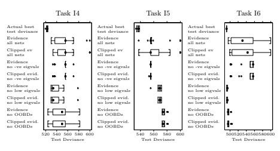

图 4.6. 根据证据和网络诊断选出的 20 个“最佳”网络的测试误差分布

带有负特征值；(c) 丢弃特征值低于最小的αc 的网络；(d) 丢弃具有超出界限的 h−1 ii 值的网络。

图 4.6 中每个图的第一行显示了实际最佳的 20 个测试偏差的分布（这通常是无法计算的，但我们在这里可以计算，因为我们有人工任务）。如果证据是测试集性能的完美预测器，那么证据最高的 20 个网络将是同样的 20 个网络，但事实并非如此，剩余的图示明了这一点。其余八行显示了证据最高的网络的测试误差分布，证据是按照上述两种方法计算的。较低的行对更多网络进行排除，基于 Hessian 和逆 Hessian 的诊断。

这两种计算证据的方法没有明显的差异。箱线图以实心圆表示中位数。箱体显示上四分位数和下四分位数（即，50%的数据点位于箱体内）。

胡须表示四分位数范围（箱子的长度）内 1.5 倍的最远点。胡须之外的点用空心圆单独绘制。

证据与测试偏差的图表显示出强烈的相关性，这在没有低特征值的网络中似乎最强且最可靠。然而，图 4.6 中的图表显示，使用证据选择网络并不总是可靠。具有高证据但条件不良的海森矩阵的网络，其测试误差范围很广，但一些测试误差最低的网络则具有条件不良的海森矩阵。这意味着允许具有条件不良海森矩阵的网络导致选择过多的高测试误差网络，而拒绝条件不良海森矩阵的网络则拒绝了过多的低测试误差网络。这在更困难的任务中似乎更成问题。在较简单的任务（例如，I6）中，具有高证据且没有低特征值的网络具有非常低的测试偏差。

## 4.7 结论

对于分类网络，优化超参数的搜索可能缓慢且不稳定。然而，通过使用下面总结的策略，可以改善搜索。类似的回归网络实验（具有线性输出单元和平方和误差，处理具有连续目标和高斯噪声的任务）表明，在这些任务中，超参数搜索通常比分类任务更快且更稳定。只有当任务在训练案例中噪声非常高（方差为 4 或更大）时，超参数搜索才会变得困难。在这些条件下，尝试的策略没有明显的优越性。

超参数搜索不稳定的主要原因之一是海森矩阵中的低特征值。反过来，这主要是由网络中的冗余引起的。可以轻易验证，具有冗余的网络的海森矩阵可能具有零或接近零的特征值——防止特征值为零的唯一因素是非零的超参数。在神经网络中，既可以发生加法（并行）冗余，也可以发生乘法（串行）冗余。

较大的网络更可能存在冗余。因此，我们可以预期较小网络的搜索会更稳定，而这也是观察到的结果（当然，一些小网络表现不佳，因为它们没有足够的能力来建模任务）。

初始超参数和权重值很重要。如果初始超参数过高，可能会在网络有机会学习之前就迫使所有权重变为零。如果初始超参数过低，网络可能会陷入过拟合模式。Thodberg [13] 合理建议初始超参数应设置为权重成本在训练开始时占误差的 10%。

本章所述的结果导致以下超参数更新建议：

- 频繁更新超参数

- 如果任何 h−1 ii 值超出范围，在计算 γ[i] 时将其替换为零（以使每个超出范围的 h−1 ii 贡献一个确定的参数）

- 忽略建议零值的 αc 更新 - 将 αc 的变化限制在最大幅度为 10。

- 在证据的计算中忽略负特征值 - 对于特征值低于最低 αc 的网络，将证据值视为不可靠。对贝叶斯神经网络建模感兴趣的人还应考虑 Neal 的 [9] 马尔可夫链蒙特卡洛方法。尽管这些蒙特卡洛方法有时需要比基于 MacKay 的近似贝叶斯框架的方法更长的计算时间，但它们具有一些理论优势，并且也需要更少的调整。

[1] Bishop, C.：模式识别的神经网络。牛津大学出版社

（1995）

[2] Buntine, W.L., Weigend, A.S.：前馈网络中的二阶导数计算：综述。IEEE 神经网络学报 5(3), 480–488（1994）

[3] Hastie, T.J., Tibshirani, R.J.：广义加法模型。查普曼与霍尔，伦敦（1990）

[4] Hwang, J.N., Lay, S.-R., Maechler, M., Martin, R.D., Schimert, J.：反向传播和投影追踪学习中的回归建模。IEEE 神经网络学报 5(3), 342–353（1994）

[5] MacKay, D.J.C.：一个实用的贝叶斯框架用于反向传播网络。

神经计算 4(3), 448–472（1992）

[6] MacKay, D.J.C.：反向传播网络的贝叶斯方法。在：Domany, E., van Hemmen, J.L., Schulten, K.（编）《神经网络模型 III》，第六章，施普林格，纽约（1994）

[7] MacKay, D.J.C.：可能网络与可信预测 - 关于监督神经网络的实用贝叶斯方法的综述。网络：神经系统中的计算 6, 469–505（1995）

[8] MacKay, D.J.C.：1993 年能源预测竞赛的贝叶斯非线性建模。在：Heidbreder, G.（编）《最大熵与贝叶斯方法》，圣巴巴拉 1993，第 221–234 页。克鲁维尔，朵德雷赫特（1996）

[9] Neal, R.M.：用于贝叶斯回归和分类的高斯过程模型的蒙特卡洛实现。技术报告 TR9702，多伦多大学统计系（1997），软件，http://www.cs.utoronto.ca/~radford/

[10] Neal, R.M.：神经网络的贝叶斯学习。施普林格，纽约（1996）

[11] Plate, T., Bert, J., Grace, J., Band, P.：神经网络与其他统计技术在建模烟草、酒精与癌症关系方面的比较。在：Mozer, M.C., Jordan, M.I., Petsche, T.（编）《神经信息处理的进展 9》（NIPS 1996）。MIT 出版社（1997）

[12] Roosen, C., Hastie, T.：逻辑响应投影追踪。技术报告，AT&T 贝尔实验室（1993）

[13] Thodberg, H.H.: 关于贝叶斯神经网络的综述及其在近红外光谱中的应用。IEEE 神经网络交易 7(1), 56–72 (1996)

# 5 自适应正则化在神经网络建模中的应用-

Jan Larsen1, Claus Svarer2, Lars Nonboe Andersen1，以及 Lars Kai Hansen1 1 丹麦技术大学数学建模系，321 号楼 DK-2800 Lyngby, 丹麦 2 哥本哈根大学医院神经病学系神经生物学研究单位，9201 号楼 Blegdamsvej 9 DK-2100 哥本哈根, 丹麦

{jl,lna,lkhansen}@imm.dtu.dk, csvarer@pet.rh.dk http://eivind.imm.dtu.dk, http://neuro.pet.rh.dk 摘要。本论文探讨了神经网络建模中优化正则化参数的重要问题。建议的优化方案是最近提出的算法[25]的扩展版本。其思路是最小化关于正则化参数的泛化误差的经验估计——例如交叉验证估计。通过使用几乎不增加额外编程开销的简单迭代梯度下降方案来实现。对于时间序列预测和分类任务的前馈神经网络模型的实验表明了该算法的可行性和鲁棒性。此外，我们提供了一些简单的理论例子，以说明所提出的正则化框架的潜力和局限性。

## 5.1 引言

神经网络是处理时间序列和模式识别的灵活工具。通过增加 2 层架构中的隐藏神经元数量，任何相关的目标函数都可以任意接近地进行逼近[19]。在神经网络设计中，过拟合噪声数据的相关风险是一个主要关注点，这在无处不在的偏差-方差困境中得到了体现，参见例如[9]。

正则化的需求有两个方面：首先，它通过平滑成本函数和在成本函数的低（可能为零）曲率区域引入曲率来解决训练过程中的数值问题。其次，正则化是一种通过引入额外偏差来减少方差的工具。总体上

- 先前发表在：Orr, G.B. 和 Müller, K.-R. (主编)：LNCS 1524，ISBN

978-3-540-65311-0 (1998)。

G. Montavon 等（主编）：NN: Tricks of the Trade, 第 2 版，LNCS 7700，第 111–130 页，2012 年。

-c 施普林格-维尔拉赫 柏林 海德堡 2012 年

架构优化的目标是最小化泛化误差。

架构可以通过逐步选择程序（包括剪枝技术）*直接*优化，或者通过正则化*间接*优化。一般来说，人们会倾向于使用混合方案；然而，非常灵活的正则化可能会替代选择程序的需要。我们考虑的数值实验主要是混合剪枝/自适应正则化方案。

本通讯中提出的技巧解决了适应正则化参数的问题。

这个技巧在于制定一个简单的迭代梯度下降方案，以适应正则化参数，旨在最小化泛化误差。

我们建议使用泛化误差的经验估计，即 K 折交叉验证 [8]，[39]。在 [25] 和 [3] 中，所提出的方案使用了保持验证估计器进行研究。

除了对泛化误差的经验估计，近年来还开发了一些代数估计量，如 FPE [1]、FPER [23]、GEN [21]、GPE [31] 和 NIC [33]。然而，这些估计依赖于一些统计假设，这些假设可能很难得到证明。特别地，它们是 o(1/Nt) 估计量，其中 Nt 是训练示例的数量。

然而，对于许多实际建模设置，满足大训练集假设是困难的。

在 [14] 中，研究了自适应正则化在使用代数估计的随机变量均值估计中的简单案例的属性，[15] 提出了基于代数估计的神经网络自适应正则化方案。然而，实验表明，该方案在鲁棒性方面存在缺陷。此外，可能无法满足大训练集的要求。

自适应正则化参数的贝叶斯方法是最小化所谓的证据 [5, Ch. 10]，[30]。然而，证据并不简单地与我们主要关注的泛化误差相关。

此外，[2] 和 [38] 考虑使用验证集来调整正则化量，特别是在使用早停技术时。

第 5.2 节考虑了训练和经验泛化评估。在第 5.3 节中，提出了正则化参数优化的框架。

实验部分 5.4 处理用于分类和时间序列预测的前馈神经网络模型示例。此外，为了研究所提出框架的理论潜力/限制，我们包括了一些关于简单玩具问题的模拟。

## 5.2 训练与泛化

假设神经网络由向量函数 f(x; w) 描述，其中 x 是输入向量，w 是网络权重和阈值的向量。有关经验泛化评估的进一步讨论，请参见，例如，[24]。2 针对不同训练集的平均值。

维度为 m。目标是使用网络模型来逼近真实的条件输入-输出分布 p(y|x)，或其某些矩。对于回归和信号处理问题，我们通常建模条件期望 E{y|x}。

假设我们有一个数据集 D = {x(k); y(k)}Nk=1，共有 N 个输入输出示例。为了训练并经验性地估计泛化性能，我们遵循 K 折交叉验证 [8], [39] 的思路，将数据集随机分割成 K 个大致相等大小的互不重叠的集合，即 D = ∪Kj=1Vj 且 ∀ i = j : Vi ∩ Vj = ∅。训练和验证重复 K 次，在第 j 次运行中，训练在集合 Tj = D\Vj 上进行，验证在 Vj 上进行。

网络在 Tj 上训练的成本函数 CTj 被认为是损失函数（或训练误差）STj (w) 和由一组正则化参数 κ 参数化的正则化项 R(w, κ) 的总和，即，

$$C_{{\mathcal{T}}_{j}}(\mathbf{w})=S_{{\mathcal{T}}_{j}}(\mathbf{w})+R(\mathbf{w},\mathbf{\kappa})={\frac{1}{N_{t j}}}\sum_{k=1}^{N_{t j}}\ell\left(\mathbf{y}(k),{\widehat{\mathbf{y}}}(k);\mathbf{w}\right)+R(\mathbf{w},\mathbf{\kappa})$$

$$(5.1)$$

其中 (·) 衡量输出 y(k) 和网络预测 y%(k) = f(x(k); w) 之间的距离。在第 5.4 节中，我们将考虑对数似然和平方误差损失函数 = |y − y%| ²。Ntj *≡ |T*j | 定义了 Tj 中的训练样本数量，k 用于索引第 k 个示例 [x(k), y(k)]。训练提供了估计的权重向量 w% j = arg minw CTj (w)。

第 j 个验证集 Vj 包含 Nvj = N − Ntj 个示例，训练网络的验证误差 3 表示为

$$S_{\mathcal{V}_{j}}(\widehat{\mathbf{w}}_{j})=\frac{1}{N_{v j}}\sum_{k=1}^{N_{v j}}\ell\left(\mathbf{y}(k),\widehat{\mathbf{y}}(k);\widehat{\mathbf{w}}_{j}\right)\tag{1}$$

$$(5.2)$$

其中求和是在 Nvj 验证示例上进行的。因此，SVj (w% j ) 是对泛化误差的估计，定义为期望损失，

$$G(\widehat{\mathbf{w}}_{j})=E_{\mathbf{x},\mathbf{y}}\{\ell(\mathbf{y},\widehat{\mathbf{y}};\widehat{\mathbf{w}}_{j})\}=\int\ell(\mathbf{y},\widehat{\mathbf{y}};\widehat{\mathbf{w}}_{j})\cdot p(\mathbf{x},\mathbf{y})\,d\mathbf{x}d\mathbf{y}\tag{5.3}$$

其中 p(x, y) 是未知的联合输入输出概率密度。一般来说，SVj (w% j ) = G(w% j ) + O(1/&Nvj )，其中 O(·) 是兰道阶函数 4。因此，我们需要较大的 Nvj 来实现对泛化误差的准确估计。另一方面，这仅为训练留下了少量数据，因此真实的泛化 G(w% j ) 会增加。因此，在这两个相互矛盾的目标之间存在权衡，这需要寻找一个最佳的分割比例。最佳分割比例 5 是一个有趣且困难的问题，因为它依赖于验证误差进入的总算法。此外，它还依赖于学习曲线 6 [17]。

3 也就是说，验证集上的损失函数。

如果 h(x) = O(g(x))，那么 |h(x)|/|*g(x)*| < ∞ 当 x → 0。关于数据分割的更多详细信息，请参见例如 [2], [20], [24] 和 [26]。

6 定义为泛化误差与训练示例数量的函数关系。

最终的 K 折交叉验证估计由平均验证误差估计给出，

$${\hat{\Gamma}}={\frac{1}{K}}\sum_{j=1}^{K}S_{\mathcal{V}_{j}}({\hat{\mathbf{w}}}_{j}).$$

$$(5.4)$$

$$(5.5)$$

$$\Gamma=E_{\mathcal{T}}\{G({\hat{\mathbf{w}}}_{j})\}.$$

SVj (w% j )。(5.4)

Γ%是所有可能训练集大小 Ntj 的*平均*泛化误差的估计，Γ = ET {G(w% j )}。(5.5)

如果 D 的数据是独立分布的，则Γ%是Γ的无偏估计，见例如[16]。

现在的想法是通过最小化Γ来优化正则化的数量。

关于正则化参数κ。为此目的的算法在第 5.3 节中描述。此外，我们可能会考虑使用对应于 K = 1 的保留验证估计来优化正则化。在这种情况下，必须选择一个分割比例。言归正传，我们将推荐 50/50 的分割。

假设我们通过交叉验证估计找到了最佳κ。

训练的重复导致 K 个不同的权重估计 w% j，这可以视为一个网络的集成。在[16]中，我们在某些温和条件下证明，当考虑 o(1/N)近似时，集成网络 fens(x) = Kj=1 βj · f(x, w% j )的平均泛化误差等于在 D 中对所有示例进行训练的网络的平均泛化误差，其中βj 权重来自第 j 个网络的贡献，并且 j βj = 1。如果 K 是 N 的约数，则∀*j, β*j = 1/K，

否则βj = (N − Nvj )/N(K − 1)。因此，可以使用集成网络来弥补仅在 Ntj = N − Nvj 数据上训练所导致的泛化误差增加。或者，也可以使用最佳κ在完整数据集 D 上重新训练。我们在实验部分采用后者的方法。

对于一种在训练集上估计网络参数并从交叉验证集中优化正则化数量的过程，最小必要要求是：正则化网络的泛化误差应小于在完整数据集 D 上训练的未正则化网络的泛化误差。然而，这并不总是如此，这正是各种“没有免费午餐”定理的精髓[12]、[44]、[46]：

- 如果正则化器使用许多参数κ进行参数化，则在交叉验证数据上存在过拟合的潜在风险。避免这种情况的一种自然方法是限制正则化参数的数量。

另一种方法是对κ施加约束（超常规化）。

- 正则化器的特定选择形式对网络要实现的函数施加了先验约束。如果先验信息与实际问题不匹配，可能更好的是不使用正则化。

上述去偏置程序对于仅在 Ntj < N 的样本上进行训练的情况可能无法产生更好的性能。也就是说，对于所有 k1 ≠ k2，[x(k1), y(k1)] 与 [x(k2), y(k2)] 是独立的。功能约束是通过对权重施加的惩罚实现的。

权重现在使用所有数据进行优化，包括那些专门用于优化正则化参数而被排除的数据。

- 训练/验证数据的划分，因此折数 K，可能没有被适当选择。

这些问题在第 5.4.1 节中进一步讨论。

## 5.3 调整正则化参数

选择正则化器的动机可能来自于

- 最小化成本函数通常是一个不适定的问题。正则化平滑了成本函数，从而促进了训练。权重衰减正则化，最初由 Hinton 在神经网络文献中提出，是实现此任务的一种简单方法，参见例如 [35]。

- 对权重的先验知识，例如，以先验分布的形式（使用贝叶斯方法时）。在这种情况下，正则化项通常充当对数先验分布的角色。权重衰减正则化可以被视为高斯先验，参见例如 [2]。其他类型的先验，例如拉普拉斯 [13]、[43] 和软权重共享 [34] 也已被考虑。此外，为了限制权重的数量（剪枝），已经开发了先验，例如所谓的权重消除 [42]。

- 这是网络执行的功能映射的一个期望特征。

通常，更偏爱平滑映射。文献 [4]、[7]、[32]、[45]、[10] 中提出了惩罚映射曲率的正则化器。

在实验部分，我们考虑权重衰减正则化及其一些一般化。不用多说，权重衰减正则化在许多神经网络应用中证明是有用的。

正则化参数的估计标准方法是系统地搜索和评估交叉验证误差。然而，对于多个正则化参数，这并不可行。另一方面，正如将要演示的，可以基于梯度下降推导出一种优化算法。

考虑一个正则化项 R(w, κ)，它依赖于包含在向量 κ 中的 q 个正则化参数。由于估计的权重 w% j = arg minw CTj (w) 受正则化项控制，我们实际上可以将交叉验证误差 (5.4) 视为正则化参数的*隐式函数*，即，

$${\widehat{\Gamma}}(\kappa)={\frac{1}{K}}\sum_{j=1}^{K}S\nu_{j}\left({\widehat{\mathbf{w}}}_{j}(\kappa)\right)$$

$$(5.6)$$

SVj (w% j (κ)) (5.6)

9 也称为岭回归。

其中 w% j (κ) 是从训练集 Tj 中估计的依赖于 κ 的权重向量。可以通过使用梯度下降法来找到最佳正则化，

$$\kappa_{(n+1)}=\kappa_{(n)}-\eta\frac{\partial\widehat{T}}{\partial\kappa}(\widehat{w}(\kappa_{(n)}))$$

∂κ(w% (κ(n))) (5.7)

其中 η > 0 是步长（学习率），κ(n) 是迭代 n 中正则化参数的估计值。

假设正则化项在正则化参数上是线性的，

$$(5.7)$$

$$R(\mathbf{w},\mathbf{\kappa})=\mathbf{\kappa}^{\top}\mathbf{r}(\mathbf{w})=\sum_{i=1}^{q}\kappa_{i}r_{i}(\mathbf{w})$$

$$(5.8)$$

其中 κi 是正则化参数，ri(w) 是相关的正则化函数。许多建议的正则化器在正则化参数上是线性的，这包括流行的权重衰减正则化以及施加平滑函数的正则化器，如 Tikhonov 正则化器 [4]、[2] 和神经网络的平滑正则化器 [32]、[45]。然而，也存在例外，例如权重消除 [42] 和软权重共享 [34]。在这种情况下，所提出的方法需要一些修改。

使用附录中的结果，交叉验证误差的梯度等于

$$\frac{\partial\widehat{T}}{\partial\mathbf{\kappa}}(\mathbf{\kappa})=\frac{1}{K}\sum_{j=1}^{K}\frac{\partial S\nu_{j}}{\partial\mathbf{\kappa}}(\widehat{\mathbf{w}}_{j}),\tag{5.9}$$ $$\frac{\partial S\nu_{j}}{\partial\mathbf{\kappa}}(\widehat{\mathbf{w}}_{j})=-\frac{\partial\mathbf{r}}{\partial\mathbf{w}^{\top}}(\widehat{\mathbf{w}}_{j})\cdot\mathbf{J}_{j}^{-1}(\widehat{\mathbf{w}}_{j})\cdot\frac{\partial S\nu_{j}}{\partial\mathbf{w}}(\widehat{\mathbf{w}}_{j}).\tag{5.10}$$，其中 $\mathbf{J}_{j}=\partial^{2}C_{T_{j}}/\partial\mathbf{w}\partial\mathbf{w}^{\top}$ 是成本函数的 Hessian 矩阵。作为一个例子，

$$(5.10)$$

$$(5.12)$$

其中 Jj = ∂2CTj /∂w∂w 是成本函数的 Hessian 矩阵。作为一个例子，

考虑使用单独权重衰减的权重衰减正则化的情况

两组权重，例如，从输入到隐层的权重和从隐层到输出的权重，

即，$$R(\mathbf{w},\mathbf{\kappa})=\kappa^{I}\cdot|\mathbf{w}^{I}|^{2}+\kappa^{H}\cdot|\mathbf{w}^{H}|^{2}\tag{5.11}$$，其中 $\mathbf{\kappa}=[\kappa^{I},\kappa^{H}]$，$\mathbf{w}=[\mathbf{w}^{I},\mathbf{w}^{H}]$，$\mathbf{w}^{I}$ 和 $\mathbf{w}^{H}$ 表示从输入到隐层的权重

其中 κ = [κI , κH], w = [wI , wH]，wI , wH 分别表示从输入到隐层的权重和从隐层到输出的权重。验证误差的梯度为，

$$\frac{\partial S_{\mathcal{V}_{j}}}{\partial\kappa^{I}}(\hat{\mathbf{w}}_{j})=-2(\hat{\mathbf{w}}_{j}^{I})^{\top}\cdot\mathbf{g}_{j}^{I},\;\;\frac{\partial S_{\mathcal{V}_{j}}}{\partial\kappa^{H}}(\hat{\mathbf{w}}_{j})=-2(\hat{\mathbf{w}}_{j}^{H})^{\top}\cdot\mathbf{g}_{j}^{H}$$，我们得到

· gHj (5.12)

其中 gj 是向量

$$\mathbf{g}_{j}=[\mathbf{g}_{j}^{I},\mathbf{g}_{j}^{H}]=\mathbf{J}_{j}^{-1}({\hat{\mathbf{w}}}_{j})\cdot{\frac{\partial S_{\mathcal{V}_{j}}}{\partial\mathbf{w}}}({\hat{\mathbf{w}}}_{j}).$$

$$(5.13)$$

∂w (w% j ). (5.13)

总结，自适应正则化参数的算法包括以下 8 个步骤：

10 我们最近通过共轭梯度技术 [11] 扩展了该算法，纳入了二阶信息。

1. 选择拆分比率，因此，折叠数 K。

2. 初始化 κ 和网络的权重 11。

3. 使用固定的 κ 在 Tj 上训练 K 个网络，以达到 w% j (κ)，j = 1, 2, ··· , K。

计算验证误差 SVj 和交叉验证估计 Γ%。

4. 计算梯度 ∂SVj /∂κ 和 *∂Γ /∂* % κ，参考 (5.9) 和 (5.10)。初始化步长 η。

5. 使用 (5.7) 更新 κ。

6. 从之前的权重估计中重训练 K 个网络，并重新计算交叉验证误差 Γ%。

7. 如果交叉验证误差没有下降，则对 η 进行二分并回到第 5 步；否则，继续。

8. 重复步骤 4–7，直到交叉验证误差的相对变化低于一个小百分比，或者，例如，梯度 *∂Γ /∂* % κ 的 2-范数低于一个小数字。

与标准神经网络训练相比，上述算法通常不会导致严重的计算开销。首先，通过或多或少的系统搜索来调节正则化参数的标准方法需要大量的训练会话。自适应算法中需要计算的附加项是：1) 正则化函数相对于权重的导数 ∂r/∂w，2) 验证误差的梯度 ∂SVj /∂w，以及 3) 逆海森矩阵 J−1 j。第一个项通常是权重的简单函数，计算上开销不大。在前馈神经网络的情况下，第二个项通过标准反向传播算法对验证样本进行一次传递来计算。第三个项的计算成本较高。然而，如果网络使用二阶方案进行训练，这需要计算逆海森矩阵，则没有计算开销。

自适应算法需要大约 K·itr κ·itr η 次权重重训练。

此处 itrκ 是 κ 的梯度下降方案中的迭代次数，itr η 是算法第 7 步中 η 的平均二分次数。在进行的实验中，重训练的次数大约是 100–300 倍 K。

请注意，由于我们持续从当前权重估计中进行重训练，训练周期的数量通常较小。

权重重训练的次数略高于使用像基于验证集的最佳脑损伤 (vOBD) [25]，[27] 这样的修剪技术优化网络时涉及的次数。基于 K 折交叉验证的 vOBD 需要大约 K ·m 次重训练，其中 m = dim(w)。自适应正则化算法易于与修剪算法结合，正如实验部分所示。

11 在第 5.4.1 节中描述了一种 κ 的实用初始化程序。12 对于权重衰减，它为 2w。13 通常通过使用 Hessians 近似减少计算，例如，

高斯-牛顿近似。许多研究报告了通过使用二阶方法显著加快训练速度，参见例如 [22], [35]。

## 5.4 数值实验 5.4.1 方法的潜力和局限性

本节的目的是展示建议的自适应正则化框架的潜力和局限性。我们考虑简单的线性数据生成 *系统*，即估计高斯变量的均值，

$$y(k)=w^{\circ}+\varepsilon(k)$$

$$(5.14)$$

y(k) = w◦ + ε(k) (5.14)

其中 w◦ 是真实均值，噪声 ε(k) ∼ N (0, σ2ε)。

我们采用 2 倍交叉验证，即 D = T1 ∪ T2，其中 Tj，j = 1, 2 表示验证过程中包含大约一半示例的两个训练集 14。线性 *模型* y(k) = w + e(k) 使用均方成本函数进行训练，并通过简单的权重衰减进行增强，如下所示

$$C_{\mathcal{T}_{j}}(w)={\frac{1}{N_{t j}}}\sum_{k=1}^{N_{t j}}(y(k)-w)^{2}+\kappa\cdot w^{2}$$

其中 k 遍历相关数据集的示例。估计的权重为 w%j = ¯yj/(1 + κ)，其中 y¯j = N −1 tjNtj k=1 y(k) 是估计的均值。对于这个简单情况，交叉验证误差的最小化由以下给出，

$$\widehat{\Gamma}(\kappa)=\frac{1}{2}\sum_{j=1}^{2}S_{\mathcal{V}_{j}}(\widehat{\mathbf{w}}_{j}(\kappa)),\ \ \ \ S_{\mathcal{V}_{j}}(\widehat{\mathbf{w}}_{j}(\kappa))=\frac{1}{N_{v j}}\sum_{k=1}^{N_{v j}}(y(k)-\widehat{w}_{j})^{2},$$

$$(5.15)$$

$$(5.16)$$

$$(5.17)$$

$$(5.18)$$

2, (5.16)

可以精确计算。最优的 κ 由以下给出

$$\kappa_{\mathrm{opt}}={\frac{{\bar{y}}_{1}^{2}+{\bar{y}}_{2}^{2}}{2{\bar{y}}_{1}{\bar{y}}_{2}}}-1.$$

假设 N 为偶数，估计权重的集合平均 15，w%j (κopt)，导致最终估计

$$\widehat w_{\mathrm{reg}}=\frac{1}{2}\left(\widehat w_{1}(\kappa_{\mathrm{opt}})+\widehat w_{2}(\kappa_{\mathrm{opt}})\right)=\frac{\bar{y}_{1}\bar{y}_{2}(\bar{y}_{1}+\bar{y}_{2})}{\bar{y}_{1}^{2}+\bar{y}_{2}^{2}}.$$

. (5.18)

注意两个特性：首先，估计是自洽的，因为 limN→∞ w%reg =

limN→∞ w%D = w◦，其中 w%D = N −1 Nk=1 y(k) = (¯y1 + ¯y2)/2 是基于所有数据的未正则化估计。其次，容易验证 y¯j ∼ N (w◦, 2σ2ε /N)。也就是说，如果 *标准化真实权重* θ ≡ w◦/A，其中 A = &2/N · σε 较大，则 y¯j ≈ w◦，这意味着 w%reg ≈ w%D。

14 即，Nt1 = N/2 和 Nt2 = N − Nt1。注意，这些训练集也是两个验证集，V1 = T2，反之亦然。15 集合平均对应于使用 κopt 在所有数据上重新训练。两个估计的加权仅在 N 为偶数时有效（参见第 5.2 节的一般情况）。

目标现在是测试使用 w%reg 是否能比采用未正则化估计 w%D 产生更低的泛化误差。与使用权重 w 相关的泛化误差由以下公式给出：

$$G(w)=\sigma_{\varepsilon}^{2}+(w-w^{\circ})^{2}.$$

$$(5.19)$$

$$(5.20)$$

2. (5.19)

进一步定义泛化误差的改进：

$$Z=G({\hat{w}}_{\mathcal{D}})-G({\hat{w}}_{\mathrm{reg}})=({\hat{w}}_{\mathcal{D}}-w^{\circ})^{2}-({\hat{w}}_{\mathrm{reg}}-w^{\circ})^{2}.$$

2. (5.20)

注意 Z 只是随机变量 y¯1、y¯2 和真实权重 w◦ 的一个函数，即在评估 Z 的性质时，仅需获取 y¯1、y¯2 的样本。定义归一化变量：

$$\widetilde{y}_{j}=\frac{\widetilde{y}_{j}}{A}\sim\mathcal{N}\left(\frac{w^{\circ}}{\sigma_{\varepsilon}}\cdot\sqrt{\frac{N}{2}},1\right)=\mathcal{N}(\theta,1).$$

$$(5.21)$$

显然，归一化的泛化误差改进 Z/A2 是 y'1、y'2 和 θ 的函数；因此，Z/A2 的分布仅由 θ 参数化。

作为一个质量度量，我们考虑 *泛化误差改善的概率*，由 Prob{Z > 0} 给出。注意 Prob{Z > 0} = 1/2 对应于两个估计的相等偏好。改进的概率仅依赖于归一化权重 θ，因为 Prob{Z > 0} = Prob{Z/A2 > 0}。

此外，我们考虑 *相对泛化误差的改进*，定义为：

$$\mathrm{RGI}=100\%\cdot{\frac{Z}{G({\hat{w}}_{\mathcal{D}})}}.$$

$$(5.22)$$

$$(5.23)$$

特别地，我们关注相对改进大于 16 x 的概率，即 Prob(RGI > x)。最佳情况为 Prob(RGI > x)：

应该在 x ≤ 0% 时接近 1，并在 0% < x ≤ 时缓慢趋近于零。

100%。使用符号 w'reg = w%reg/A，w'D = w%D/A，RGI 可以写为：

$$\mathrm{RGI}=100\%\cdot{\frac{({\tilde{w}}_{\mathcal{D}}-\theta)^{2}-({\tilde{w}}_{\mathrm{reg}}-\theta)^{2}}{N/2+({\tilde{w}}_{\mathcal{D}}-\theta)^{2}}}.$$

N/2+(w'D − θ)2 . (5.23)

因此，RGI 的分布由 θ 和 N 参数化。

质量度量是通过生成 Q 个独立的 y'1、y'2 实现的，即 {y'

(i)

1 , y'

(i)

2 }Qi=1. 例如，改善的概率由 Pimp = Q−1 Qi=1 μ(Z(i)) 估计，其中 μ(x)=1 当 x > 0 时，其他情况为零。

比较 w%reg 和未正则化估计 w%D 的数值结果总结在图 5.1 中。

$$0)=\mathrm{Prob}(Z>0).$$

16 注意，Prob(RGI > 0) = Prob(Z > 0)。

图 5.1. 比较高效正则化估计 wreg 和未正则化估计 wD 的结果。结果基于 Q = 105 次独立实现。改善的概率 Pimp，如面板 (a) 所示，当归一化真实权重 θ = N/2 · w◦/σε = 0 时为 1，且对于 θ <∼ 0.8 时大于 0.5。也就是说，当权重衰减正则器的先验信息正确时：

（真实权重接近于零），当 N 较小或σε较大时。随着θ增大，Pimp 趋向于 0.5，因为 w ≈ wD。面板(b)–(d)显示 Prob(RGI > x)

对于θ ∈ {0, 2, 10}。理想的概率曲线在 x < 0 时为 1，而在 x > 0 时缓慢衰减至零。对于小θ和小 N，获得的最大改善效果。面板(c)和(d)表明，小 N 在 x > 0 时提供了最大的概率；然而，在负 x 时则是最小的概率。也就是说，获得良好改善的机会越高，恶化的风险也随之增加。请注意，尽管对于θ = 2, 10 时 Pimp < 0.5，但仍然有合理的概率获得显著改善。

## 5.4.2 分类

我们在一个元音分类问题上测试自适应正则化算法的性能。数据基于彼得森和巴尼数据库

[36]。类别是由前四个共振峰频率特征化的元音。76 人（33 名男性，28 名女性和 15 名儿童）发出了 c = 10 种不同的元音（IY IH EH AE AH AA AO UH UW ER），每种发音两次。这导致总共 1520 个示例的数据集。该数据库是[41]中描述的经过验证的数据库，所有数据都被使用，包括在听力测试中未能一致识别的发声示例（26 名听众）。所有示例都被纳入，以增加任务的难度。

正则化是通过使用保留验证误差估计器进行适配的，因此示例被划分为一个数据集 D，包含 N = 760 个示例

（16 名男性，14 名女性和 8 名儿童）和剩余 760 个示例的独立测试集。正则化通过将数据集 D 均分为一个包含 Nv = 380 个示例的验证集和一个包含 Nt = 380 个示例的训练集（每个集合中 8 名男性，7 名女性和 4 名儿童）进行适配。

我们使用了一个前馈的 2 层神经网络，隐藏层采用双曲正切神经元，输出采用修改后的 SoftMax 规范化输出 y%i，见例如，

[2]，[18]，[3]。因此，输出估计后验类别概率 p(Ci|x)，

其中 Ci 表示第 i 类，i = 1, 2, ··· , c。贝叶斯规则（参见例如[2]）用于将 Ci 分配给输入 x，如果 i = arg maxj p(Cj |x)。假设网络权重由 w = [wI , wIbias, wH, wHbias]给出，其中 wI，wH 分别是输入到隐藏层和隐藏层到输出层的权重，而偏差权重则组合在 wIbias 和 wHbias 中。假设目标 yi(k)=1 如果 x(k) ∈ Ci，否则为零。该网络使用对数似然损失函数进行优化，并通过 4 个正则化参数增强了权重衰减正则化器，

$$C(\mathbf{w})=\frac{1}{N_{t}}\sum_{k=1}^{N_{t}}\sum_{i=1}^{c}y_{i}(k)\log(\hat{y}_{i}(k,\mathbf{w}))\tag{5.24}$$ $$+\kappa^{I}\cdot|\mathbf{w}^{I}|^{2}+\kappa_{\rm bias}^{I}\cdot|\mathbf{w}_{\rm bias}^{I}|^{2}+\kappa^{H}\cdot|\mathbf{w}^{H}|^{2}+\kappa_{\rm bias}^{H}\cdot|\mathbf{w}_{\rm bias}^{H}|^{2}.$$

我们进一步定义未归一化的权重衰减为α ≡ κ · Nt。这个正则化器的动机在于偏差、输入和隐藏层权重扮演着不同的角色，例如，输入、隐藏和偏差信号通常具有不同的尺度（见[2, Ch. 9.2]）。

仿真设置为：

- 网络：4 个输入，5 个隐藏神经元，9 个输出 18。

- 权重在[−0.5, 0.5]范围内均匀初始化，正则化参数初始化为零。执行梯度下降训练算法中的一步（见例如，[29]），并且权重衰减在λmax/102 处重新初始化，其中λmax 是代价函数 Hessian 矩阵的最大特征值。

该初始化方案的动机来自以下观察：

- 权重衰减应足够小，以免显著降低网络的近似能力。

- 它们应足够大，以防止算法陷入局部最优，并消除数值不稳定性。

17 数据库可以从 ftp://eivind.imm.dtu.dk/dist/data/vowel/检索。

PetersonBarney.tar.Z 18 我们只需要 9 个输出，因为第 10 类的后验类概率由 1 − 9j=1 p(Cj |x)给出。

- 训练现在使用高斯-牛顿算法进行（见例如，[29]）。Hessian 使用 Moore-Penrose 伪逆进行反演，确保特征值分布 19 小于 108。

- 正则化步长η初始化为 1。- 当自适应正则化方案终止时，使用基于验证集的 Optimal Brain Damage 修剪 3%的权重。

(vOBD) 配方 [25], [27].

- 修剪与自适应正则化之间的交替持续进行，直到验证误差达到最小值。

- 最后，剩余的权重在所有数据上使用优化的权重衰减参数进行重新训练。

表 5.1. 错误分类概率（pmc）和对数似然代价函数

（无正则项，见(5.24)）用于分类示例。神经网络的均值和标准差是从 10 次运行中计算得出的。在小固定正则化的情况下，权重衰减的初始值设定为λmax/106，其中λmax 是代价函数 Hessian 矩阵的最大特征值。最佳正则化是指优化 4 个权重衰减参数的情况。修剪是指基于验证集的 OBD。KNN 是指 k 近邻分类。

|                                          | NN            | NN            | KNN   |
| --- | --- | --- | --- |
| 小固定正则化 优化正则化+修剪 (k = 9) |               |               |       |
| 训练集                             | 0.075 ±0.026  | 0.107 ± 0.008 | 0.150 |
| 验证集                           | 0.143 ± 0.014 | 0.115 ± 0.004 | 0.158 |
| 测试集                                 | 0.146 ± 0.010 | 0.124 ± 0.006 | 0.199 |
| 测试集（在所有数据上训练）            | 0.126 ± 0.010 | 0.119 ± 0.004 | 0.153 |
|                                                               | NN                              | NN   |
| --- | --- | --- |
| 小固定正则化. 优化正则化 + 修剪                              |                                 |      |
| 训练集                                                      | 0.2002 ± 0.0600 0.2881 ± 0.0134 |      |
| 验证集                                                      | 0.7016 ± 0.2330 0.3810 ± 0.0131 |      |
| 测试集                                                      | 0.6687 ± 0.2030 0.3773 ± 0.0143 |      |
| 测试集 (在所有数据上训练) 0.4426 ± 0.0328 0.3518 ± 0.0096 |                                 |      |
|                                                               |                                 |      |

错误分类概率 (pmc)

对数似然成本函数

表 5.1 报告了使用最优正则化参数的修剪网络在 10 次运行中错误分类概率 (pmc) 和对数似然成本函数的平均值和标准差。请注意重新训练

19 特征值分布不应大于机器精度的平方根

[6].

完整数据集平均略微降低了测试 pmc。事实上，在 10 次运行中，有 9 次观察到改进。表格进一步显示了组合自适应正则化/修剪算法相对于使用小的固定权重衰减的收益。然而，请回顾，第 5.4.1 节提到，实际收益*非常*依赖于噪声水平、数据集大小等。目标并不是展示某个特定问题的高收益，而是展示算法在分类设置中相对稳健的运行。为了比较，我们使用了 k-近邻 (KNN) 分类（参见例如[2]），发现 k = 9 邻居在验证集上最小化 pmc 是最优的。神经网络表现得明显更好。将获得的结果与其他工作进行对比是困难的。在[37]中报告了 Peterson-Barney 元音问题的结果，但他们的数据并不完全相同；仅使用了前 2 个共振峰频率。此外，针对不同方法使用了不同的测试集。

报告的最佳结果[28]是通过使用 KNN 获得的，达到 pmc = 0.186，显著高于我们的结果。

图 5.2 展示了自适应正则化以及修剪算法的演变。

## 5.4.3 时间序列预测

我们测试了自适应正则化方案在 MackeyGlass 混沌时间序列预测问题上的表现，参见例如[22]、[40]。目标是基于之前的观察预测未来 100 步的序列。前馈网络配置为输入延迟空间 x(k)=[x(k), x(k−6), x(k−12), x(k−18)]

输入为 4 个，25 个隐藏的双曲正切神经元，以及一个预测 y(k) = x(k + 100)的线性输出单元 y%(k)。成本函数为平方误差，N −1 t Nt k=1(y(k)−y%(k, w))²，使用 4 个不同的权重衰减的正则化器进行增强，如 5.4.2 节所述。

仿真设置为：

数据集 D 包含 N = 500 个示例，独立测试集有 8500 个示例。

正则化参数使用持出验证误差进行优化，将数据集平均分为训练集和验证集，每个集各有 250 个示例。

权重衰减初始化为零并执行一次高斯-牛顿迭代，然后权重衰减重新初始化为λmax/106，其中λmax 为成本函数 Hessian 矩阵的最大特征值。

网络使用高斯-牛顿训练方案进行训练。Hessian 矩阵通过摩尔-彭若斯伪逆被逆转，确保特征值的分散度小于 108。

正则化步长η初始化为 10−2。

考虑到不同分割的敏感性[25]。

图 5.2. 分类示例。面板(a)、(b)和(c)显示了自适应正则化算法在典型运行中的演变（全连接网络）。权重衰减经过优化，以最小化面板(a)中的验证误差。注意测试误差也在下降。这个趋势在面板(b)中同样明显，尽管注意到小幅增加。在面板(c)中，收敛的非标准化权重衰减α = κ · Nt 被描绘出来。面板(d)和(e)显示了剪枝阶段的误差和 pmc 的演变。最佳网络选择为验证误差最小的网络，如垂直线所示。在此运行中剪枝的效果仅为边际。最后，在面板(f)中，最优（剪枝结束时）的变化。

不同运行中的α值得到了展示，注意到运行之间有明显的相似性。

表 5.2. 时间序列预测示例的标准化平方误差表现。所有数字的单位为 10−3σ²x，平均值和标准差是从 10 次运行中计算得出的。在小的固定正则化情况下，权重衰减的初始值设定为λmax/106，其中λmax 是成本函数的 Hessian 矩阵的最大特征值。最佳正则化是指优化 4 个权重衰减参数的情况。剪枝是指基于验证集的 OBD。

|                                                       | NN          | NN          | NN          |
| --- | --- | --- | --- |
| 小固定正则化  小固定正则化+剪枝  最优正则化+剪枝 |             |             |             |
| 训练集                                            | 0.17 ± 0.07 | 0.12 ± 0.04 | 0.10 ± 0.07 |
| 验证集                                              | 0.53 ± 0.26 | 0.36 ± 0.07 | 0.28 ± 0.14 |
| 测试集                                               | 1.91 ± 0.68 | 1.58 ± 0.21 | 1.29 ± 0.46 |
| 测试集（在所有数据上训练）                          | 1.33 ± 0.43 | 1.34 ± 0.26 | 1.17 ± 0.48 |

- 在调整 4 个权重衰减和验证集基础上的修剪之间进行交替[25]。

修剪后的网络使用优化的权重衰减参数在所有数据上重新训练。

表 5.2 报告了在 10 次运行中，最优正则化参数下归一化平方误差的平均值和标准差（即，归一化的平方误差与 x(k)的估计方差σ%2x）。在完整数据集上重新训练平均会稍微减少测试误差。在 10 次运行中有 10 次观察到了改善。我们测试了 3 种不同的情况：小的固定正则化、小的固定正则化辅以修剪和组合自适应正则化/修剪。结果表明，仅修剪并没有改善性能；然而，辅以自适应正则化则减少了测试误差。

我们进一步尝试了一种灵活的正则化方案，即个别权重衰减，其中 R(w, κ) = mi=1 κiw2i 且κi ≥ 0 被施加。在当前情况下，灵活的正则化器未能超越联合自适应正则化/修剪方案；这可能与训练和验证集的大小有关。

图 5.3 展示了在使用 4 个权重衰减的典型情况下的自适应正则化和修剪。

## 5.5 结论

本文建议通过最小化交叉验证误差或简单的留出验证误差来调整正则化参数。我们推导了一种简单的梯度下降方案来优化正则化参数，与标准训练相比，它具有较小的编程开销和可接受的计算开销。使用玩具线性模型的数值示例展示了自适应正则化方法的局限性和优势。此外，在分类和时间序列预测问题上的数值实验成功演示了算法的功能。正则化参数的调整导致了更低的泛化误差；然而，它应该。

图 5.3. 时间序列预测示例。面板(a)和(b)显示了在使用 4 个权重衰减的自适应正则化算法运行时，误差和未标准化的权重衰减值α的典型演变。标准化验证误差大约下降。

当调整权重衰减时，出现了 2 倍的因素。事实证明，输入到隐藏层和输出偏置权重的一些正则化是必要的，而其他权重基本上不需要正则化 22。在面板(c)和(d)中，证明了修剪稍微减少了测试误差。最佳网络被选择为具有最小验证误差的网络，如垂直线所示。

应强调的是，实际产量在很大程度上依赖于问题和正则化器函数形式的选择。致谢。该研究得到了丹麦自然科学与技术研究委员会通过计算神经网络中心的支持。JL 还感谢无线电零部件基金会的资金支持。Mads Hintz-Madsen 和 Morten With Pedersen 因富有启发性的讨论而被感谢。

22 记住，如果权重衰减κ低于λmax/108，它不会影响海森矩阵的 Moore-Penrose 伪逆。

## 附录

假设正则化项在正则化参数中是线性的，即，

$$R(\mathbf{w},\mathbf{\kappa})=\mathbf{\kappa}^{\top}\mathbf{r}(\mathbf{w})=\sum_{i=1}^{q}\kappa_{i}r_{i}(\mathbf{w})$$

交叉验证误差(5.4)的梯度为

$$\frac{\partial\widehat{\Gamma}}{\partial\mathbf{\kappa}}(\mathbf{\kappa})=\frac{1}{K}\sum_{j=1}^{K}\frac{\partial S_{\mathcal{V}_{j}}}{\partial\mathbf{\kappa}}(\widehat{\mathbf{w}}_{j}(\mathbf{\kappa}))$$

$$(5.25)$$

$$(5.26)$$

$$(5.27)$$

使用链式法则，验证误差 SVj 的梯度向量可以

表示为∂SVj

$$\frac{\partial S_{\mathcal{V}_{j}}}{\partial\mathbf{\kappa}}(\widehat{\mathbf{w}}_{j}(\mathbf{\kappa}))=\frac{\partial\mathbf{w}^{\mathsf{T}}}{\partial\mathbf{\kappa}}(\widehat{\mathbf{w}}_{j}(\mathbf{\kappa}))\cdot\frac{\partial S_{\mathcal{V}_{j}}}{\partial\mathbf{w}}(\widehat{\mathbf{w}}_{j}(\mathbf{\kappa}))$$

∂w (w% j (κ)) (5.27)

其中∂w/∂κ是估计权重的 q × m 导数矩阵。

正则化参数和 m = dim(w)。为了找到这个导数

矩阵，考虑成本函数相对于权重的梯度作为

κ的函数，并使用以下围绕当前估计κ(n)的展开，

$$\frac{\partial C\tau_{\!_{I}}}{\partial\mathbf{w}}(\mathbf{\kappa})=\frac{\partial C\tau_{\!_{I}}}{\partial\mathbf{w}}(\mathbf{\kappa}_{(n)})+\frac{\partial^{2}C\tau_{\!_{I}}}{\partial\mathbf{w}\partial\mathbf{\kappa}^{\top}}(\mathbf{\kappa}_{(n)})\cdot(\mathbf{\kappa}-\mathbf{\kappa}_{(m)})+o(|\mathbf{\kappa}-\mathbf{\kappa}_{(n)}|).\tag{5.28}$$ 要求下一次迭代中的$\widehat{\mathbf{w}}(\mathbf{\kappa}_{(n+1)})$为最优权重向量，即，

要求下一次迭代中的 w% (κ(n+1))为最优权重向量，即，

∂CTj /∂w(κ(n+1)) = 0 意味着

∂w∂κ (w% (κ(n))) = 0。(5.29)

$$\frac{\partial^{2}C_{\mathcal{T}_{j}}}{\partial w\partial\boldsymbol{\kappa}^{\top}}(\hat{\boldsymbol{w}}(\boldsymbol{\kappa}_{(n)}))=\mathbf{0}.\tag{1}$$

记住，由于假设，∂CTj /∂w(κ(n)) = 0。(5.29)可用于确定∂w/∂κ。识别成本函数 CTj (w% (κ)) = STj (w% (κ)) +

R(w% (κ), κ *隐含* (通过 w% (κ)) 和 *显式* 依赖于κ。

使用(5.25)导出以下关系 23：

$$(5.29)$$

$${\frac{\partial\mathbf{w}^{\top}}{\partial\mathbf{\kappa}}}({\hat{\mathbf{w}}}_{j})=-{\frac{\partial\mathbf{r}}{\partial\mathbf{w}^{\top}}}({\hat{\mathbf{w}}}_{j})\cdot\mathbf{J}_{j}^{-1}({\hat{\mathbf{w}}}_{j})$$

$$(5.30)$$

$$(5.31)$$

其中 Jj = ∂2CTj /∂w∂w 是成本函数的海森矩阵，可能使用高斯-牛顿近似进行评估 [29]。最后，将 (5.30) 代入 (5.27) 得到

$$\frac{\partial S_{\mathcal{V}_{j}}}{\partial\mathbf{\kappa}}(\widehat{\mathbf{w}}_{j})=-\frac{\partial\mathbf{r}}{\partial\mathbf{w}^{\intercal}}(\widehat{\mathbf{w}}_{j})\cdot\mathbf{J}_{j}^{-1}(\widehat{\mathbf{w}}_{j})\cdot\frac{\partial S_{\mathcal{V}_{j}}}{\partial\mathbf{w}}(\widehat{\mathbf{w}}_{j})$$

∂w (w% j ) (5.31)

∂SVj /∂w 通过普通反向传播在验证集上找到，而

∂r/∂w 根据对正则化器的具体假设进行计算。

23 为了方便，这里省略了 w 的显式 κ 依赖。

[1] Akaike, H.: 自回归模型的拟合与预测。统计数学研究所年报 21, 243–247 (1969)

[2] Amari, S., Murata, N., Müller, K.R., Finke, M., Yang, H.: 过拟合与交叉验证的渐近统计理论。技术报告 METR 95-06 及《IEEE 神经网络汇刊》8(5)，985–996 (1995)

[3] Nonboe Andersen, L., Larsen, J., Hansen, L.K., Hintz-madsen, M.: 神经分类器的自适应正则化。见：Principe, J. 等（编辑）《IEEE 信号处理神经网络研讨会会议录 VII》，第 24–33 页。IEEE，皮斯卡塔维 (1997)

[4] Bishop, C.M.: 曲率驱动平滑：前馈神经网络的学习算法。《IEEE 神经网络汇刊》4(4)，882–884

(1993)

[5] Bishop, C.M.: 用于模式识别的神经网络。牛津大学出版社，牛津 (1995)

[6] Dennis, J.E., Schnabel, R.B.: 无约束优化与非线性方程的数值方法。普伦蒂斯-霍尔，恩格尔伍德悬崖 (1983)

[7] Drucker, H., Le Cun, Y.: 提高字符识别中的泛化性能。见：Juang, B.H. 等（编辑）《信号处理的神经网络：1991 年 IEEE-SP 研讨会会议录》，第 198–207 页。IEEE，皮斯卡塔维

(1991)

[8] Geisser, S.: 可预测样本重用方法及其应用。《美国统计协会杂志》50, 320–328 (1975)

[9] Geman, S., Bienenstock, E., Doursat, R.: 神经网络与偏差/方差困境。神经计算 4, 1–58 (1992)

[10] Girosi, F., Jones, M., Poggio, T.: 正则化理论与神经网络架构。神经计算 7(2), 219–269 (1995)

[11] Goutte, C., Larsen, J.: 使用共轭梯度的神经网络自适应正则化。见：ICASSP 1998 会议录，西雅图，美国，第 2 卷，第 1201–

1204 (1998)

[12] Goutte, C.: 关于免费午餐与交叉验证的说明。神经计算 9(6),

1211–1215 (1997)

[13] Goutte, C.: 带有修剪先验的正则化。神经网络 (1997)（待发表）

[14] Hansen, L.K., Rasmussen, C.E.: 从自适应正则化中剪枝。神经计算 6, 1223–1232 (1994)

[15] Hansen, L.K., Rasmussen, C.E., Svarer, C., Larsen, J.: 自适应正则化。

在：Vlontzos, J., Hwang, J.-N., Wilson, E.（编）《IEEE 信号处理神经网络研讨会 IV 的会议论文集》，第 78–87 页。IEEE, Piscataway

（1994）

[16] Hansen, L.K., Larsen, J.: 跨验证的线性非学习。计算数学进展 5, 269–280 (1996)

[17] Hertz, J., Krogh, A., Palmer, R.G.: 神经计算理论导论。 Addison-Wesley 出版社，Redwood City (1991) [18] Hintz-Madsen, M., 与 Pedersen, M., Hansen, L.K., Larsen, J.: 神经分类器的设计与评估。在：Usui, S., Tohkura, Y., Katagiri, S., Wilson, E.

（编）《IEEE 信号处理神经网络研讨会 VI 的会议论文集》，第 223–232 页。IEEE, Piscataway (1996)

[19] Hornik, K.: 多层前馈网络的逼近能力。神经网络 4, 251–257 (1991)

[20] Kearns, M.: 使用近似和估计速率的交叉验证误差界限，以及对训练-测试分割的影响。神经计算 9(5), 1143–1161 (1997)

[21] Larsen, J.: 非线性系统的泛化误差估计。在：Kung, S.Y.,

等（编）《1992 年 IEEE-SP 信号处理神经网络研讨会的会议论文集》，第 2 卷，第 29–38 页。IEEE, Piscataway (1992)

[22] Larsen, J.: 神经网络滤波器的设计，博士论文，丹麦技术大学电子学院 (1993)

ftp://eivind.imm.dtu.dk/dist/PhD_thesis/jlarsen.thesis.ps.Z

[23] Larsen, J., Hansen, L.K.: 正则化神经网络模型的泛化性能。在：Vlontzos, J. 等（编）《IEEE 信号处理神经网络研讨会 IV 的会议论文集》，第 42–51 页。IEEE, Piscataway (1994)

[24] Larsen, J., Hansen, L.K.: 神经网络模型的实证泛化评估。在：Girosi, F. 等（编）《IEEE 信号处理神经网络研讨会 V 的会议论文集》，第 30–39 页。IEEE, Piscataway (1995)

[25] Larsen, J., Hansen, L.K., Svarer, C., Ohlsson, M.: 神经网络的设计与正则化：验证集的最佳使用。在：Usui, S., Tohkura, Y., Katagiri, S., Wilson, E.（编）《IEEE 信号处理神经网络研讨会 VI 的会议论文集》，第 62–71 页。IEEE, Piscataway (1996)

[26] Larsen, J., 等：实证泛化误差估计的最佳数据集分割比（准备中）

[27] Le Cun, Y., Denker, J.S., Solla, S.A.: 最优脑损伤。在：Touretzky, D.S.（编）《1989 年神经信息处理系统进展会议的论文集》，第 2 卷，第 598–605 页。Morgan Kaufmann 出版社，San Mateo (1990)

[28] Lowe, D.: 自适应径向基函数非线性及泛化问题。在：IEE 会议论文集，人工神经网络，第 171–175 页 (1989)

[29] Ljung, L.: 系统识别：用户的理论. 普伦蒂斯-霍尔, 英格尔伍德悬崖 (1987)

[30] MacKay, D.J.C.: 实用贝叶斯框架用于反向传播网络. 神经计算 4(3), 448–472 (1992)

[31] Moody, J.: 神经网络的预测风险与架构选择. 在：

Cherkassky, V., 等编 (eds.) 从统计到神经网络：理论与模式识别应用, 第 136 卷. 斯普林格-费尔拉格系列 F, 柏林 (1994)

[32] Moody, J., Rögnvaldsson, T.: 投影基函数网络的平滑正则化器. 在：1996 年神经信息处理系统进展会议论文集, 第 9 卷. MIT 出版社, 剑桥 (1997)

[33] Murata, N., Yoshizawa, S., Amari, S.: 网络信息标准 - 确定人工神经网络模型的隐藏单元数量. IEEE

神经网络学报 5(6), 865–872 (1994)

[34] Nowlan, S., Hinton, G.: 通过软权重共享简化神经网络.

神经计算 4(4), 473–493 (1992)

[35] 与 Pedersen, M.: 训练递归网络. 在：IEEE 会议论文集

神经网络信号处理研讨会 VII. IEEE, 皮斯卡特维 (1997)

[36] Peterson, G.E., Barney, H.L.: 在元音研究中使用的控制方法.

JASA 24, 175–184 (1952)

[37] Shadafan, R.S., Niranjan, M.: 通过对输入空间的顺序划分构建动态神经网络架构. 神经计算 6(6), 1202–1222

(1994)

[38] Sjöberg, J.: 用神经网络进行非线性系统识别, 博士学位论文编号 381, 瑞典林雪平大学电气工程系

(1995)

[39] Stone, M.: 交叉验证的选择与统计预测因子的评估. 皇家统计学会 B 期刊 36(2), 111–147 (1974)

[40] Svarer, C., Hansen, L.K., Larsen, J., Rasmussen, C.E.: 时间序列处理的设计网络. 在：Kamm, C.A., 等编 (eds.) IEEE 神经网络信号处理研讨会论文集, 第 3 卷, 第 78–87 页. IEEE, 皮斯卡特维 (1993)

[41] Watrous, R.L.: PetersonBarney 元音共振峰数据的当前状态. JASA 89, 2459–2460 (1991)

[42] Weigend, A.S., Huberman, B.A., Rumelhart, D.E.: 预测未来：一种连接主义方法. 国际神经系统期刊 1(3), 193–209 (1990) [43] Williams, P.M.: 使用拉普拉斯先验的贝叶斯正则化与剪枝. 神经计算 7(1), 117–143 (1995)

[44] Wolpert, D.H., Macready, W.G.: 搜索的数学. 技术报告 SFI-TR-95-02-010, 圣塔菲研究所 (1995)

[45] Wu, L., Moody, J.: 用于前馈与递归神经网络的平滑正则化器. 神经计算 8(3) (1996)

[46] Zhu, H., Rohwer, R.: 交叉验证无免费午餐. 神经计算 8(7), 1421–1426 (1996)

# 6 大型集成平均-

David Horn1，Ury Naftaly1 和 Nathan Intrator2 1 物理与天文学系 2 数学科学系 雷蒙德与贝弗利·萨克勒精确科学学院 特拉维夫大学，以色列特拉维夫 69978 horn@neuron.tau.ac.il http://neuron.tau.ac.il/~horn/

摘要。对多个预测器进行平均可减少误差的方差部分。我们提出了一种方法，从有限（小规模）集合信息中评估无限集合预测器的均方误差。我们在不同初始选择的突触权重的网络集合上演示了该方法。我们发现，对于大集合，最佳停止标准出现在训练时间晚于单个网络的情况。我们在太阳黑子数据集上测试了我们的方法，并获得了优秀的结果。

## 6.1 引言

文献中提出了集合平均作为改善神经网络预测器泛化特性的手段[3, 11, 7]。我们遵循这一思路，考虑对一组仅因其突触权重的初始值不同的网络进行平均。

我们引入了一种从有限规模集合的性能中提取大集合性能的方法。下一节将对此进行解释，并在太阳黑子数据集上进行演示。对神经网络初始条件的集合平均导致较低的预测误差，且在训练时间上晚于单个网络的预期。我们的方法在太阳黑子问题上超越了已发布的最佳结果[6]。

该方法的理论背景由偏差/方差分解提供。在这个框架内，我们定义了一个特定的偏差/方差分解，适用于仅因初始条件不同的网络。虽然不同初始条件的网络集的偏差保持不变，但方差误差显著减少。

## 6.2 外推到大集合平均

神经网络的训练过程始于某些连接权重初始值的选择。我们考虑的是相互之间仅因初始值不同的网络集合。

- 先前发表于：Orr, G.B. 和 Müller, K.-R.（编）：LNCS 1524，ISBN

978-3-540-65311-0（1998）。

G. Montavon 等（编）：NN: Tricks of the Trade，第 2 版，LNCS 7700，第 131–137 页，2012。

-c Springer-Verlag Berlin Heidelberg 2012

仅通过其初始值彼此不同并对其进行平均。由于初始条件的空间非常大，我们开发了一种技术，可以近似地对整个空间进行平均。

我们的技术包括构建固定数量的网络组 Q。所有网络通过随机选择其初始权重而彼此不同。对于每个组，我们将预测器定义为所有 Q 个网络输出的平均值。选择多个相同大小 Q 的不同组，并对它们在测试集上的预测取平均值，定义了图 1 中显示的有限大小平均值。然后我们进行 Q → ∞的参数估计。通过 1/Q 的简单回归即可获得在太阳黑子问题中的极限，如图 2 所示。通常可能会遇到更复杂的反幂行为，表明不同初始权重的网络之间存在相关性。

图 6.1。测试集的 ARV 预测误差（ARV）相对于训练时间（千次纪元 KE）绘制的曲线。曲线对应于不同的组大小选择：从上到下，Q = 1, 2, 4, 5, 10, 20。最低曲线是对 Q → ∞的外推。

## 6.2.1 对太阳黑子问题的应用

自 1700 年以来，已收集了每年的太阳黑子统计数据。这些数据经过广泛研究，并作为统计文献中的基准[9, 10, 4]。遵循之前的出版物[10, 6, 8]，我们选择训练集来

图 6.2。用于提取 Q → ∞预测的外推法。不同集合大小 Q 在两个不同训练期 t = 70KE（点）和 140KE（圈）下的结果作为 1/Q 的函数呈直线分布。每条曲线从右边开始的前三个点分别代表集合大小为 1、2 和 4。虽然 140KE 的三个点都高于 70KE 的相应点，但对更大集合大小的外推表明，整体性能会更好，如线性拟合所示。

包含 1701 年至 1920 年间的时期，测试集包含 1921 年至 1955 年。遵循[10]，我们根据数据集 S 的平均相对方差（ARV）计算预测误差：

$$\text{ARV}=\frac{\sum_{k\in S}\left(y_{k}-f(\mathbf{x}_{k})\right)^{2}}{\sum_{k\in S}\left(y_{k}-E\left[y_{k}\right]\right)^{2}}\tag{6.1}$$

yk(xk)是数据值，f(xk)是预测器。在我们的时间序列问题中，对于任何给定的时间点 t = k，输入向量 xk 的分量值取自 t − 1、t − 2、···、t − 12（如[10]所示）。公式 1 中的分母σ2 = 1535 用于训练集。相同的值也用于测试集。

我们使用具有 12 个输入的神经网络，一个由 4 个单元组成的 sigmoidal 隐藏层，以及一个线性输出。然后将其扩大以形成递归网络（SRN）[1]，其中输入层通过添加时间序列中前一个点的隐藏层而增加。学习算法包括对训练集的均方误差（MSE）应用反向传播。

验证集包含 35 个随机选择的点，在训练期间被留出以进行性能验证。

图 6.1 显示了我们在测试集上的结果，作为训练轮次的函数。我们观察到 Q = 1、2、4、5、10、20 的降序，然后是对 Q → ∞ 的外推。这些曲线都对应于大小为 Q 的组的平均值，计算方式是运行 60 个网络。为了展示外推是如何进行的，我们在图 6.2 中显示了 t = 70 和 t = 140 KE 对 1/Q 的点。很明显，线性外推非常令人满意。此外，Q = 20 的结果与外推的 Q → ∞ 结果相差不远。请注意，Q → ∞ 的最小值

图 1 中的曲线在训练时间上显著高于 Q = 1 单网络曲线。这在图 2 中 t = 70 和 t = 140 的 KE 线交叉中也很明显。一个重要的结论是，集成训练的停止标准（当然要应用于组中的每个网络）与单网络训练的标准非常不同。

## 6.2.2 最佳结果

图 1 中所示的曲线是通过学习率为 0.003 获得的。较低的学习率会导致较低的误差。在这种情况下，集成平均的效果并没有那么显著。我们通过将输入向量更改为 Pi & Peterson 的六维选择 [8] 来获得最佳结果，该选择由 xt−1、xt−2、xt−3、xt−4、xt−9 和 xt−10 组成。在上述保持不变的 SRN 上使用学习率 0.0005，我们的预测误差最小值为 0.0674，这优于任何先前报告的结果。

## 6.3 理论分析

方法的理论背景由偏差/方差分解提供。在这个框架内，我们定义了一种特定的偏差/方差分解，适用于仅因初始条件不同而异的网络。这是所有方差来源的一种特别有用的子集。

估计量的性能通常通过均方误差（MSE）来评估，其定义为

$$\operatorname{MSE}(f)\equiv E\left[(y-f(\mathbf{x}))^{2}\right]$$

$$(6.2)$$

其中平均值是针对预测器 f 的测试集，y 是数据 x 的目标值。假设期望 E 是相对于 x 和 y 的真实概率进行的，MSE 可以分解为

$$E\left[\left(y-f(\mathbf{x})\right)^{2}\right]=E\left[\left(y-E[y|\mathbf{x}]\right)^{2}\right]+E\left[\left(f(\mathbf{x})-E[y|\mathbf{x}]\right)^{2}\right].\tag{6.3}$$

第一项 RHS 表示数据中的变异性或噪声，且与估计量 f 无关。因此，只需集中于第二项

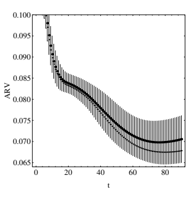

$$(6.4)$$

$$(6.5)$$

$$(6.6)$$

$$(6.7)$$

图 6.3. 我们在日斑问题测试集上的最佳结果。这里绘制的是 Q = 1 对于各种初始条件选择的结果，以它们的平均值表示，并用误差条扩展至一个标准偏差，以及 Q = 20 的结果（较细的点），作为训练时间（K-epochs）的函数。网络基于 Pi & Peterson 变量，学习率为 0.0005。

项。任何给定的预测器 f(x) 自然受到其训练数据集的限制。考虑一个典型误差，可以对所有数据空间 [2] 进行平均，并将该误差分解为偏差和方差组成部分：

$$E_{\mathcal{D}}\left[\left(f(\mathbf{x})-E[y|\mathbf{x}]\right)^{2}\right]=B_{\mathcal{D}}+V_{\mathcal{D}}$$

其中

BD(f(x)) = (ED [f(x)] − E[y|x])² (6.5)

$$B_{\mathcal{D}}(f(\mathbf{x}))=\left(E_{\mathcal{D}}\left[f(\mathbf{x})\right]-E[y|\mathbf{x}]\right)^{2}$$

$$V_{\mathcal{D}}(f(\mathbf{x}))=E_{\mathcal{D}}\left[\left(f(\mathbf{x})-E_{\mathcal{D}}\left[f(\mathbf{x})\right]\right)^{2}\right].$$

在我们的应用中，我们将 EI [f(x)] 作为我们的预测器，其中下标 I 表示作为 f(x) 的神经网络的初始权重空间。为了理解对初始权重进行平均的影响，让我们通过 D 和 I 的直接积构造一个空间 R。然后可以证明

$$B_{\mathcal{R}}(f(\mathbf{x}))=B_{\mathcal{D}}(E_{\mathcal{I}}\left[f(\mathbf{x})\right])$$，

$$V_{\mathcal{R}}(f(\mathbf{x}))\geq V_{\mathcal{D}}(E_{\mathcal{I}}\left[f(\mathbf{x})\right])$$。

$$(6.8)$$

BR(f(x)) = BD(EI [f(x)])， (6.7)

和

VR(f(x)) ≥ VD(EI [f(x)])。 (6.8)

这意味着使用 EI [f(x)] 作为预测器时，特征误差的方差降低，但偏差不变。

偏差项也可以表示为 BR = ED [BI]，其中

$$B_{\mathcal{I}}(f(\mathbf{x}))=\left(E_{\mathcal{I}}\left[f(\mathbf{x})\right]-E[y|\mathbf{x}]\right)^{2}.$$

BI(f(x)) = (EI [f(x)] − E[y|x])²。 (6.9)

当 f(x) 被其平均值替代时，BI 不受影响。类似定义的方差项 VI 通过这种平均被消除。换句话说，通过对所有 I 进行平均，我们消除了因初始权重选择而导致的所有方差。

图 1 中 Q = 1 和 Q → ∞ 曲线之间的差异代表了方差的减少。

要理解图 2 中的 Q 依赖性，可以考虑一个由 ¯f(x) 定义的平均值，该平均值代表独立同分布的随机变量。然后可以证明

$$(6.9)$$

$$B(\bar{f})=\overline{{{B(f)}}}\qquad V(\bar{f})=\overline{{{V(f)}}}/Q.$$

$$(6.10)$$

B( ¯f) = B(f) V ( ¯f) = V (f)/Q。 (6.10)

因此，我们可以将图 2 中显示的 1/Q 行为解释为在该分析中初始条件的选择作为有效随机噪声的示范。一般来说，这并不一定成立，因为具有不同初始条件的网络可能存在非平凡的相关性。有关这一点及其他问题的更全面讨论见 [5]。

总之，我们看到，在不同初始权重的网络上进行平均有助于减少预测误差，消除由初始条件引起的方差。在有限大小 Q 的组上进行这种平均，可以通过 Q 依赖性判断初始条件引起的误差是否相关。此外，可以估计消除此方差源所需的 Q。

[1] Elman, J.L., Zipser, D.: 学习语音的隐含结构。声学学会杂志。

美国 83, 1615–1626 (1988)

[2] Geman, S., Bienenstock, E., Doursat, R.: 神经网络与偏差/方差困境。神经计算 4(1), 1–58 (1992)

[3] Lincoln, W.P., Skrzypek, J.: 多个反向传播网络的协同作用。见：Touretzky, D.S.（主编）《神经信息处理系统的进展》，第 2 卷，第 650–657 页。摩根·考夫曼，圣马特奥 (1990)

[4] Morris, J.: 预测太阳黑子周期。皇家统计学会系列 A 140, 437–447

(1977)

[5] Naftaly, U., Intrator, N., Horn, D.: 神经网络的最优集成平均。网络，计算神经系统 8, 283–296 (1997)

[6] Nowlan, S.J., Hinton, G.E.: 通过软权重共享简化神经网络。

神经计算 4, 473–493 (1992)

[7] Perrone, P.M.: 改进回归估计：用于方差减少的平均方法及其在一般凸测度优化中的扩展。博士论文，布朗大学，大脑与神经系统研究所 (1993)

[8] Pi, H., Peterson, C.: 在时间序列中寻找嵌入维度和变量依赖性。神经计算 6, 509–520 (1994)

[9] Priestley, M.B.: 频谱分析与时间序列。学术出版社 (1981)

[10] Weigend, A.S., Huberman, B.A., Rumelhart, D.: 预测未来：一种连接主义方法。国际神经系统期刊 1, 193–209 (1990)

[11] Wolpert, D.H.: 堆叠泛化。神经网络 5, 241–259 (1992)

# 改进网络模型和算法技巧-

## 前言

本节包含 5 章，展示了易于实现的技巧，这些技巧修改了架构和/或学习算法，以增强网络的建模能力。更好的建模意味着更快的解决方案。

在第七章中，Gary Flake 提出了一种技巧，使 MLP 具备 RBF 的额外能力。实现简单，只需添加额外输入，其值为原始输入的平方（第 144 页）。虽然将高阶项作为输入并不是一个新主意，但本章通过提供（1）对以前工作的良好总结，（2）简单明了的示例说明这个技巧，（3）理论上的证明，显示只需添加高阶平方项，以及（4）与众多其他网络模型的全面比较，贡献了新的见解。*仅*需要平方项的意义在于，这意味着我们在不让输入数量过于庞大的情况下获得了额外的能力。我们指出，这一思路可以通过包括除了平方输入以外的相关特征进一步扩展，例如通过使用核主成分分析（PCA）[2]来获得非线性特征。

Rich Caruana 在第八章中介绍了多任务学习（MTL）（第 163 页）。

在这里，额外的输出被添加到网络中，以预测与主要任务分开但相关的任务。为了引入这个技巧，本章以一个简单的二元输入布尔函数的示例和详细讨论开始。作者随后展示了一些在实践中可能使用的额外输出。这些包括： (1) 只有在做出预测后才能获得的特征，但在*训练*时是可用的（第 170 页）， (2) 但使用不同度量的相同任务（第 175 页），以及 (3) 使用不同输出表示的相同任务（第 176 页）。提供了(1)肺炎的死亡率排名的实证结果，其中额外输出是患者首次进入医院时不可用的测试结果，但在训练数据的补充后可用，以及(2)一个车辆转向任务，其中其他输出包括中心线和道路边缘的位置等。本章的最后部分专门讨论有效实施 MTL 的主题，例如隐藏层的大小（第 181 页）、提前停止（第 181 页）和学习率（第 185 页）。

由 Patrick van der Smagt 和 Gerd Hirzinger 撰写的下一章介绍了一种减少 Hessian 病态问题的技巧。如果一个单元的外部权重非常小，则该单元的输入权重的影响将大大减弱（有关 Hessian 病态的其他来源，请参见第一章）。这导致误差表面出现平坦区域，进而转化为

- 先前发表在：Orr, G.B.和 Müller, K.-R.（编）：LNCS 1524，ISBN

978-3-540-65311-0（1998 年）。

G. Montavon 等人（编）：神经网络：行业技巧，第 2 版，LNCS 7700，第 139-141 页，2012 年。

-c Springer-Verlag Berlin Heidelberg 2012

慢速训练（另见[1]）。这个技巧是增加线性快捷连接（第页）。

从输入节点到输出节点创建作者所称的线性增强前馈网络。这些连接与输入到隐藏层的连接共享权重，因此没有添加新的权重参数。这个技巧提高了网络对这些输入权重的敏感性，从而消除或减少误差表面上的平坦区域。误差表面质量的改善在一个玩具示例中得到了说明。

还展示了使用机器人手臂数据的模拟。

Nicol Schraudolph 在第十章中讨论的技巧是对神经网络梯度的各种因素进行中心化（第 208 页）：输入和隐藏单元的活动（见第一章）、误差信号以及隐藏单元非线性激活函数的斜率（第 208 页）。举个例子：*活动中心化*

（第 207 页）通过简单地将组件 xi 的值转换为

$$\tilde{x}_{i}\,=\,x_{i}-\langle x_{i}\rangle\,,$$

其中·表示对训练样本的平均。所有不同的中心化策略都可以高效实现于随机、批处理或小批量学习场景（第 209 页）。他还使用了快捷连接（第 208 页），但与前一章的使用方式有所不同：这些快捷连接包含新的权重。

（不共享）通过传递信号的线性分量来补充斜率中心化，使网络的其余部分能够集中于问题的非线性分量。因此，就快捷连接而言，第九章和第十章中的方法似乎是互补的。中心化提供了良好的加速，对泛化误差几乎没有伤害，正如在玩具和元音数据上的模拟所示（第 211 页）。

在第十一章中，Tony Plate 提出了一种只需极少内存开销的技巧，减少反向传播网络中的数值舍入误差。

在计算逻辑函数的导数的标准方法中可能会出现舍入误差，因为它需要计算乘积。

## Y(1 − Y)

其中 y 是隐藏单元或输出单元的输出。当 y 的值接近 1 时，单精度甚至双精度浮点数的有限精度可能导致乘积为零。这对于在线学习可能不是一个严重的问题，但对于使用批处理模式的网络，尤其是在使用二阶方法时，可能会造成显著问题。其他类型的单元也可能出现这种舍入误差。本章提供了减少计算中这种舍入误差的公式。

- 逻辑单元或 tanh 单元的误差导数（第 226 和 229 页） - 在一个使用交叉熵误差和 softmax 的 k 类分类问题中的导数（第 228 页）

- 使用单个逻辑输出单元和交叉熵误差及 0/1 目标的二类分类问题中的导数和误差（第 228 页）。

[1] Hochreiter, S., Schmidhuber, J.: 平坦极小值。神经计算 9(1), 1–42

(1997)

[2] Schölkopf, B., Smola, A., Müller, K.-R.：非线性成分分析作为核特征值问题。《神经计算》10，1299–1319 (1998)

# 7 平方单元增强、径向扩展的多层感知器-

Gary William Flake 西门子企业研究公司

755 College Road East Princeton, NJ 08540 flake@scr.siemens.com http://mitpress.mit.edu/books/FLAOH/cbnhtml/author.html 摘要。考虑一个具有 d 个输入、一个隐藏的 sigmoid 层和一个线性输出的多层感知器（MLP）。通过向网络添加额外的 d 个输入，其值设为前 d 个输入的平方，架构中添加了类似于高阶神经网络和径向基函数网络（RBFN）的特性，而在权重需求上几乎没有额外开销。特别有趣的是，这种架构能够在 d 维空间中形成局部特征，尽管只有一个隐藏节点，但也可以跨越输入空间的大体积；因此，该架构具有 RBFN 的局部特性。

但不太受维数诅咒的困扰。我将这种类型的网络称为 SQuare Unit Augmented, Radially Extended, MultiLayer Perceptron（SQUARE-MLP 或 SMLP）。

## 7.1 引言与动机

当面临一个新的挑战性问题时，神经网络研究者必须做出的最关键决定是选择追求的模型类别。在大多数模型构建工具箱中，常见几种不同类型的神经架构，其中两种较为熟悉的是径向基函数网络（RBFNs）[15, 16, 13, 1, 17]和多层感知器（MLPs）[25, 20]，

例证了全局模型和局部模型类型之间的差异。具体而言，MLP 是构建整个输入输出响应特征近似的全局模型的一个例子，而 RBFN 是使用有限输入空间区域内特征的局部模型。这两种模型类型之间的这一单一差异对许多架构和算法问题具有重要意义。虽然 MLP 的学习速度较慢，记忆保留率低，通常使用同质学习规则，且相对不那么受维数诅咒的困扰，但 RBFN 几乎在各个方面都是相反的：

- 以前发表在：Orr, G.B.和 Müller, K.-R.（编）：LNCS 1524，ISBN

978-3-540-65311-0 (1998)

G. Montavon 等（编）：NN：行业诀窍，第 2 版，LNCS 7700，第 143–161 页，2012。

-c Springer-Verlag Berlin Heidelberg 2012

它们是快速学习者，具有高记忆保留率，通常使用异质学习规则，并且受到维数诅咒的严重困扰。

由于这些差异，往往会诱使人们使用一个或多个启发式方法来做出选择，例如，低（高）维问题使用 RBFN（MLP），或连续函数逼近（模式分类）问题使用 RBFN（MLP）。虽然这些经验法则通常足以应对简单问题，但也有许多例外情况违反了这些规则（例如，参见 [12]）。此外，来自工业环境的更具挑战性的问题往往具有局部良好的高维输入空间，可能并不明确被定义为函数逼近或模式分类问题。这意味着，为特定问题选择最佳架构本身可能是一个非平凡的问题。

具有讽刺意味的是，这一困境的良好折衷方案已经被知道了一段时间，但直到最近，人们才真正欣赏到这一技巧的优雅。多年来，研究人员通常通过将输入的平方作为辅助输入来使用增强的多层感知机（MLP）。这一做法的合理性一直比较随意，通常归结为使用这个技巧不可能造成伤害。但事实证明，以这种方式增强的具有 n 个隐藏节点的 MLP 几乎可以完美地逼近具有 n 个基函数的径向基函数网络（RBFN）。这个“几乎”源于增强 MLP 中的径向基函数不是高斯型而是准高斯型（这确实是一个未定义的术语，我用它只是为了表示“接近高斯，以至于实际上无关紧要”）。这意味着，使用输入平方增强的 MLP 可以轻松形成局部特征，即使只有一个隐藏节点，但也可以覆盖输入空间的广阔区域，从而在需要时有效地忽略输入。因此，通过使用这一惊人的简单技巧，结合了两种架构方法的最佳之处。

本章的其余部分分为五个部分。第 7.2 节描述了这一技巧，并简要比较了所提架构与其他知名模型类别的异同。在第 7.3 节中，使用函数逼近问题和模式分类问题作为示例来演示这一技巧的有效性。随后，对一个著名且具有挑战性的元音分类问题进行了更详细的研究。第 7.4 节通过展示结果架构与 RBFN 的等价性来理论上证明这一技巧，而第 7.5 节则通过说明使用辅助平方输入的单个节点可以形成的表面和边界类型，给出这一技巧的更直观的解释。最后，在第 7.6 节中，我给出我的结论。

## 7.2 这个技巧：平方-多层感知机

所提出的技巧仅涉及对标准 MLP 架构的简单修改：MLP 的输入层通过与原始输入的平方相联系的额外输入集进行增强。这个技巧可以以至少两种不同的方式实现。第一种技术是简单地用额外的输入增强数据集。因此，如果一个数据集中的每个输入模式有 d 个组件，则可以从原始数据集中创建一个新的数据集，该数据集有 2d 个输入，额外的 d 个输入设置为原始输入的平方。以这种方式实现技巧从内存角度来看是昂贵的，但有一个优点，就是不需要编写任何新源代码来尝试。此外，这使得即使在没有源代码访问权限的商业模拟器上也可以尝试该技巧。

实现该技巧的第二种方式是将实际变化显式编码到架构中：

$$y=\sum_{i}w_{i}g\left(\sum_{j}u_{ij}x_{j}+\sum_{k}v_{ik}x_{k}^{2}+a_{i}\right)+b,\tag{7.1}$$

设 g(x) = tanh(x) 或 1/(1+exp(−x))。我称这种网络为**平方单元增强、径向扩展、多层感知器**（SQUARE-MLP 或 SMLP）。

“平方单元增强”部分的名称来源于新添加的 vikx2k 项。名称中“径向扩展”部分的原因将在第 7.4 和 7.5 节中阐明。第 7.3 节中的所有实验都使用方程 7.1 描述的架构。这个技巧的历史相当难以追踪，主要是因为它实在是一个微不足道的技巧；然而，下面列出了一些相关想法的简要清单。

工程与统计。早期相关的想法在统计学界以多项式回归和在工程界的 Volterra 滤波器的形式得到了追求 [24, 22]。然而，在这两种相关方法中，模型输出始终在线性多项式项中，这与 SMLP 架构或下面讨论的其他神经架构不同。

Sigma-Pi 网络。一些比方程 7.1 更复杂的神经网络架构将 SMLP 视为特例。也许神经网络文献中最早提及类似想法的可以追溯到 Sigma-Pi 网络 [20]，它通过对乘积的求和 i wji *k xik 扩展了 MLP 的线性网络输入函数。人们可以想象一个多层 Sigma-Pi 网络，它在将 xik 传递到 Sigmoid 激活函数之前计算 xik 项的平方。虽然这是一种计算输入平方的相当笨拙的方法，但无论如何，仍然可以实现。

高阶网络。或许最接近的例子是由 Lee *等* [14] 提出的高阶网络，它类似于方程 7.1，但使用完整的二次网络输入函数：

$$y=\sum_{i}w_{i}g\left(\sum_{j}u_{ij}x_{j}+\sum_{k}\sum_{l}v_{ikl}x_{k}x_{l}+a_{i}\right)+b.\tag{7.2}$$

当 k = l 时，vikl 设置为零，恢复了 SMLP。因此，SMLP 实际上是具有对角二次项的高阶网络。高阶网络已被证明是 MLP 的强大扩展。它们能够形成局部和全局特征，但代价是每个隐藏节点的权重数量需要平方。尤其在对诸如牛顿法或拟牛顿法等架构应用更复杂的优化例程时，内存需求变得更加突出，这些方法需要的内存与网络中权重数量的平方成正比。功能连接网络。另一个相关架构是功能连接网络 [18]，它类似于标准 MLP，但明确通过对输入应用标量函数的结果来增强网络。例如，在某些应用中，可能事先知道网络的期望输出是一个或多个输入的正弦和余弦的函数（例如，输入可能对应于机器人手臂的角度）。在这种情况下，显式将这些值作为输入纳入网络会更有利，而不是强迫网络学习一个潜在难以建模的概念。功能连接网络可以使用任何标量函数，最终本质上对数据进行某种预处理。通常，专家知识用于确定应纳入网络的额外标量函数；也就是说，没有通用技术来事先选择最佳预处理函数。然而，给定输入数据上的一组非线性变换，可以对非线性特征空间进行主成分分析（PCA），以选择携带最多方差的子集。在 [23] 中提出了一种计算上可行的该技术版本，他们称之为核 PCA。无论如何，通过使用平方函数来增强功能连接网络，再次恢复了 SMLP。

尽管我尽力给予适当的引用，但一般认为将输入的平方添加到模型中的基本思想至少与“预处理是关键”这一明智建议同样古老。

## 7.3 示例应用

以下三个示例展示了 SMLP 可在其中超越 MLP 或 RBFN 的问题领域。

所有示例都是著名的基准。在每种情况下，模型的输出响应必须形成局部特征，同时覆盖输入空间的大区域。

一般而言，MLP 在形成局部特征方面会遇到困难，而 RBFN 在涵盖输入空间的平坦区域时会遇到问题。

## 7.3.1 山丘-高原函数近似

第一个问题是一个承认的矫揉造作的例子，选择它的原因正是因为它对 MLP 和 RBFN 都很困难。图 7.1 中展示的“山丘-高原”表面[21]，有一个单一的局部凸起，位于一个 S 形的山脊上。这个问题的训练数据由图中所示区域的 21×21 网格上的二维均匀采样组成，而测试数据来自一个更细的 41×41 网格。

图 7.1. 山丘-高原示例展示了局部和全局架构之间的差异。MLP 可以轻松形成高原，但在山丘上遇到困难，而 RBFN 则轻松形成山丘，但在高原上遇到麻烦。

| 模型   | 节点数量 权重数量 测试 RMSE   |    |          |
| --- | --- | --- | --- |
| RBFN    | 2                                   | 9  | 0.333406 |
|         | 3                                   | 13 | 0.071413 |
|         | 4                                   | 17 | 0.042067 |
|         | 5                                   | 21 | 0.002409 |
| MLP     | 2                                   | 9  | 0.304800 |
|         | 3                                   | 13 | 0.015820 |
|         | 4                                   | 17 | 0.001201 |
| SMLP    | 2                                   | 13 | 0.000025 |

表 7.1. 山丘-高原表面的二十次运行的最佳结果

除了标准 MLP 外，还使用了一个归一化的 RBFN（NRBFN）来解决这个问题，具体由以下两个方程描述：

$$y=\frac{\sum_{i}w_{i}r_{i}({\bf x})}{\sum_{j}r_{j}({\bf x})}+a\quad\mbox{和}\tag{7.3}$$  $r_{i}({\bf x})=\exp(-||{\bf x}-{\bf c}_{i}||^{2}/\sigma_{i}^{2})$, (7.4)

其中 ci 和σi 分别为第 i 个基中心和宽度。为了训练 NRBFNs，首先使用 k 均值聚类算法在训练模式的输入空间中对中心进行了聚类。每个基函数的宽度与最近邻的距离成比例设置。随后，线性项 wi 和 a 的最小均方解被求解

图 7.2. 两螺旋问题的数据

确切使用奇异值分解计算伪逆。所有这些形成了拟牛顿法（BFGS）优化例程的初始权重集，该例程用于所有权重同时训练，最多 200 个周期。

对于 MLP，使用了单一隐藏层，激活函数为 tanh(x)，线性输出。所有权重最初设置为-0.1 到 0.1 范围内的均匀随机值。然后，所有权重通过拟牛顿法（BFGS）进行训练，最多 200 个周期。SMLP 的设置和训练与 MLP 完全相同。

表 7.1 显示了所有三种架构的结果。如可以看到，RBFNs 和 MLPs 在此任务上都有相当大的困难，即使训练数据是无噪声的，训练过程也相当复杂。与此相反，SMLP 仅用两个隐层节点就能成功解决问题。此外，测试误差比其他两种架构的最佳结果好几个数量级。

## 7.3.2 双螺旋分类

双螺旋分类问题是一个著名的基准，对所有神经网络架构来说都极具挑战性；此外，几乎没有关于 RBFNs 的结果报告，因为这个问题使得局部模型必须使用很多基函数（> 100）来记忆训练数据，以便接近解决。因此，这是一个 RBFNs 根本无法胜任的问题，这也是它们不再进一步考虑的原因。图 7.2 显示了双螺旋问题的数据，包含 194 个点位于 x-y 平面，属于两个螺旋之一，每个螺旋绕原点旋转三次。

其他研究者对这个问题的先前结果主要集中在传统 MLP 和带快捷连接的 MLP 上。100%分类准确率的最佳报告结果总结如下：

- (Lang & Witbrock [9]): 具有快捷连接和 138 个总权重的 2-5-5-5-1 MLP。平均收敛时间为 20,000 个批量反向传播周期。

- (Lang & Witbrock [9]): 具有快捷连接、138 个总权重和交叉熵误差函数的 2-5-5-5-1 MLP。平均收敛时间为 12,000 个批量反向传播周期。

- (Lang & Witbrock [9]): 具有快捷连接和 138 个总权重的 2-5-5-5-1 MLP。平均为 7,900 个 quickprop [3]周期。

- (Frostrom [未发表]): 具有 281 个权重且没有快捷连接的 2-20-10-1 MLP。需要 13,900 个带动量的批量反向传播周期。

- (Fahlman 和 Lebiere [4]): 使用 12 到 19 个隐层单元（平均 15）的级联相关 MLP，平均 1700 个 quickprop 周期。由于级联相关拓扑，这些网络使用了 117 到 250 个权重。

如这些结果所示，双螺旋问题极其困难，需要复杂的网络拓扑和较长的训练时间。

与上述结果相比，SMLP 架构似乎非常适合这个问题。一个具有 15 个隐藏双曲正切单元的 SMLP（总共只有 91 个权重）通过共轭梯度优化例程进行了训练。在十次实验中，SMLP 平均用了 2500 个训练周期解决了双螺旋问题（最少仅需 800 个）。注意，SMLP 的架构在拓扑上和权重数量上都比在 MLP 研究中使用的架构简单得多。因此，优化算法的效率可以大大提高。这是架构的表示能力简化学习的一个案例，从而使权重优化过程更快。

尽管并不总是能够一致地训练一个更简单的 SMLP

为了解决这个问题，一个具有 10 个隐藏节点（仅 61 个权重）的 SMLP 在三次独立试验中成功，平均使用了 1500 个周期。该 SMLP 的输出响应面如图 7.3 所示。在第 7.5 节中，我们将考察由单个 SMLP 隐藏节点形成的不同类型的表面。我们将看到，SMLP 轻松形成局部和全局特征的能力对于其快速解决双螺旋问题至关重要。

图 7.3. SMLP 仅使用十个隐藏节点重建的双螺旋表面

## 7.3.3 元音分类

Deterding 元音识别数据集[2]是另一个被广泛研究的基准，其难度远高于前两个问题，更能体现神经网络从业者可能面临的问题类型。该数据集包含由英国英语发音者发出的稳态元音的听觉特征。共有 528 个训练模式和 462 个测试模式，每个模式由 10 个特征组成，并且属于恰好一个对应于所发元音的 11 个类别中的一个。发音者包括男女，使得这个问题非常有趣。

本节的所有结果使用的是一个具有 10 个输入、不同数量的隐藏单元和 11 个输出的架构。以前研究的一些结果在表 7.2 中进行了汇总。一些早期研究在某种程度上是轶事性的，因为它们仅使用了单个实验或仅几个实验，但它们提供了有价值的信息，展示了复杂神经网络从业者在广泛架构下可以在这个问题上实现的期望结果。

有趣的是，Robinson 的结果表明，对于这个问题，最近邻分类器非常难以被超越。其正确分类率为 56%，最近邻分类器的表现优于 Robinson 的所有神经网络解决方案。然而，最近邻方法需要存储大量数据作为查找表，因此这并不是一个特别令人鼓舞的结果。

Hastie 和 Tibshirani [7]报告的最佳得分由一个判别自适应最近邻（DANN）分类器实现。61.7%的得分来自多次模拟研究中找到的最佳分类器；因此，该得分代表了专家尝试多种解决方案所找到的最佳已知结果。

表 7.3 列出了专门为本研究进行的实验结果。

表中显示了五种不同的模型/优化组合，表中的每一行对应于以不同随机初始条件开始的五十次独立实验。对于标记为“训练”的主要条目，模型的权重是通过共轭梯度法确定的，适用于权重超过 1,000 的模型，而对于权重少于 1,000 的模型则使用拟牛顿法。

优化程序被设置为最小化形式为 E = e2+λ||w||2 的误差函数，其中 e 是实际输出与期望输出之间的差异，λ是惩罚大权重的权重衰减项。所有实验中λ设置为 10−4。λ值为 10−3 和 10−5 的结果在所有架构中一致较差，因此 10−4 是一个合理的折中。

架构使用了 tanh(x)激活函数，而 RBFN 与第 7.3.1 节中描述的一样，但未归一化（归一化的 RBFN consistently 给出的结果较差）。优化程序通常允许运行至收敛（误差度量变化小于 10−20），除非另有说明。

RBFN 和 NRBFN 模型中的权重通过三步过程“求解”：1）将中心设置为由 k 均值聚类算法生成的聚类中心，应用于训练数据的输入向量；2）将宽度设为与每个中心的最近邻的距离成比例；3）将剩余的线性权重作为带矩阵伪逆的最小均方问题求解。

SMLP 架构可以通过类似于 RBFN 和 NRBFN 网络的方式来求解。该过程的细节在第 7.4 节中进行了说明，但此时可以说，该过程几乎完全相同，唯一的例外是与中心和宽度对应的权重必须稍作变换。

有趣的是，SMLP 可以使用此“求解”过程计算 SMLP 的初始权重集，然后通过基于梯度的方法进行训练。这会使 SMLP 倾向于一个非常好的初始解，之后可以通过基于梯度的优化程序进行精细调整。表 7.3 中带有“混合”标签的行对应于以这种方式训练的 SMLP。

表 7.3 中的三列显示了测量各种模型成功的三种不同方式，唯一具有统计显著性的度量是标记为“% 正确（平均）”的列，代表在优化程序停止训练数据后获得的平均测试集分数。列标题“% 正确（最佳）”下报告的分数对应于最佳

1 注意，由于 SMLP 有额外的一组权重，因此必须小心控制容量，避免过拟合数据。

表 7.2. 关于元音数据的先前结果总结见于[19]，[12]，[5]，[8]，[6]，

和[7]。所有条目要么是确定性技术，要么是报告的最佳分数，除非分数后面带有“，”的情况下，该分数表示多次运行的平均值。

| 多次运行。                  | 模型   | 运行次数   | 数据数量   | 百分比   |
| --- | --- | --- | --- | --- |
| 隐藏                          | 权重 | 正确率     |             |           |
| 单层感知器         | -       | 11          | 33          |           |
| 多层感知器 [19]      | 11      | 253         | 44          |           |
| 22                              | 495     | 45          |             |           |
| 88                              | 1,947   | 51          |             |           |
| 多层感知器 [12]      | 5       | 121         | 50.1             |           |
| （带重正化）          | 10      | 231         | 57.5             |           |
| 20                              | 451     | 50.6             |             |           |
| 随机网络 [5]          | 8       | 297         | 54             |           |
| （FF-R 分类器）               | 16      | 473         | 56             |           |
| 32                              | 825     | 57.9             |             |           |
| 径向基函数           | 88      | 1,936       | 48          |           |
| 528                             | 11,616  | 53          |             |           |
| 高斯节点网络           | 11      | 253         | 47          |           |
| 22                              | 495     | 54          |             |           |
| 88                              | 1,947   | 53          |             |           |
| 528                             | 11,627  | 55          |             |           |
| 方形节点网络             | 11      | 253         | 50          |           |
| （不是 SMLP）                   | 22      | 495         | 51          |           |
| 88                              | 1,947   | 55          |             |           |
| 修改的卡内瓦模型          | 88      | 968         | 43          |           |
| 528                             | 5808    | 50          |             |           |
| 局部近似             | 2       | 5808        | 50.0        |           |
|                                 | 3       | 5808        | 52.8        |           |
|                                 | 5       | 5808        | 53.0        |           |
| 10                              | 5808    | 48.3        |             |           |
| 20                              | 5808    | 45.0        |             |           |
| 最近邻居                        | -       | (5,808)     | 56          |           |
| 线性判别分析    | -       | 715         | 44          |           |
| Softmax                         | -       | -?-         | 33          |           |
| 二次判别分析 | -       | -?-         | 47          |           |
| CART                            | -       | -?-         | 44          |           |
| CART（线性组合划分）            | -       | -?-         | 46          |           |
| FDA / BRUTO                     | -       | -?-         | 56          |           |
| Softmax / BRUTO                 | -       | -?-         | 50          |           |
| FDA / MARS（1 级）               | -       | -?-         | 55          |           |
| FDA / MARS（2 级）               | -       | -?-         | 58          |           |
| Softmax / MARS（1 级）           | -       | -?-         | 52          |           |
| Softmax / MARS（2 级）           | -       | -?-         | 50          |           |
| LOCOCODE / 反向传播             | 11      | 473         | 58             |           |
| （30 个输入） DANN              | -       | -?-         | 61.7        |           |

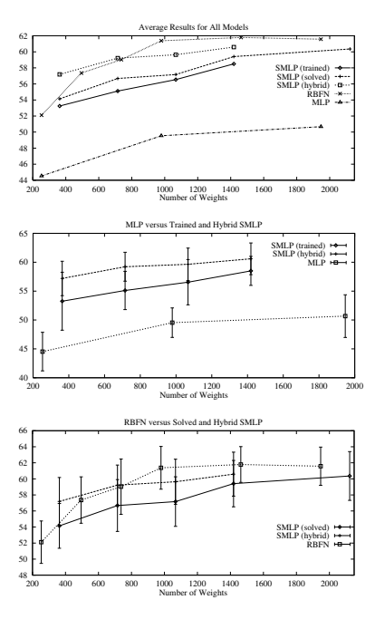

图 7.4. 表 7.3 的结果以图形格式显示：（a）所有模型类型的平均结果；（b）SMLP 和 MLP 模型的平均值，并显示误差条；（c）SMLP 和 RBFN 模型的平均值，并显示误差条。

| 模型          | # of       | # of   | % 正确 % 正确 % 正确）       | 标准   |       |      |
| --- | --- | --- | --- | --- | --- | --- |
| 隐藏权重 | （作弊） | （最佳） | （平均）                        | 偏差  |       |      |
| MLP            | 11         | 253    | 53.24                            | 51.08      | 44.53 | 3.34 |
| （训练过的）      | 44         | 979    | 58.00                            | 54.76      | 49.54 | 2.55 |
| 88             | 1947       | 57.57  | 57.14                            | 50.67      | 3.69  |      |
| SMLP           | 11         | 363    | 63.63                            | 60.82      | 53.25 | 5.02 |
| （训练过的）      | 22         | 715    | 64.93                            | 63.63      | 55.11 | 3.31 |
| 33             | 1067       | 65.15  | 65.15                            | 56.54      | 3.92  |      |
| 44             | 1419       | 66.66  | 65.15                            | 58.50      | 2.51  |      |
| RBFN           | 11         | 253    | ——                               | 56.92      | 52.11 | 2.64 |
| (solved)       | 22         | 495    | ——                               | 63.20      | 57.36 | 2.89 |
| 33             | 737        | ——     | 66.88                            | 59.03      | 3.45  |      |
| 44             | 979        | ——     | 67.53                            | 61.38      | 2.66  |      |
| 66             | 1463       | ——     | 65.80                            | 61.79      | 2.23  |      |
| 88             | 1947       | ——     | 67.09                            | 61.58      | 2.38  |      |
| SMLP           | 11         | 363    | ——                               | 58.87      | 54.14 | 2.79 |
| (solved)       | 22         | 715    | ——                               | 63.63      | 56.68 | 3.23 |
| 33             | 1067       | ——     | 63.85                            | 57.17      | 3.09  |      |
| 44             | 1419       | ——     | 67.31                            | 59.41      | 2.89  |      |
| 66             | 2123       | ——     | 68.39                            | 60.36      | 3.04  |      |
| 88             | 2827       | ——     | 67.09                            | 60.30      | 2.57  |      |
| SMLP           | 11         | 363    | 66.66                            | 63.85      | 57.19 | 2.98 |
| (hybrid)       | 22         | 715    | 66.88                            | 63.41      | 59.22 | 2.50 |
| 33             | 1067       | 66.45  | 64.71                            | 59.64      | 2.81  |      |
| 44             | 1419       | 68.18  | 66.88                            | 60.59      | 2.74  |      |

表 7.3. 本研究结果：所有平均值是从 50 次试验中计算的，任何结果低于 33%（感知器的分数）均被丢弃，视为不收敛。有关术语“作弊”、“最佳”和“平均”的解释，请参见正文。

从 50 次运行中获得的最终测试分数，而“% 正确（作弊）”是任何模型在五十次运行中训练期间任何时候获得的最佳测试分数。由于“已解决”模型的权重是在一步中计算的，因此“作弊”分数仅对迭代技术有意义。“作弊”分数的一种解释是，如果有一个完美的交叉验证集可用于提前停止，那么可以达到的最佳分数。

表 7.3 中的一些信息在图 7.3.3 中以图形方式进行了总结，因此更容易理解。在每种情况下，SMLP 和 RBFN 的表现均显著优于 MLP。然而，SMLP 和 RBFN 之间的差异要小得多，RBFN 和混合 SMLP 在性能上几乎相同。同时请注意，混合训练方案似乎在训练和已解决的 SMLP 上都有所改进。

图 7.5. 一个“准高斯”激活函数，作为仿射变换的 sigmoidal

## 7.4 理论依据

鉴于上一节的数值实验背景，我们现在准备看看 SMLP 如何被视为 MLP 的“径向扩展”版本。在本节中，我将把方程 7.1 重写为与 RBFN 等价的形式；因此，我们将看到 SMLP 如何几乎完美地逼近 RBFN。

第一步是更仔细地检查 sigmoid 激活函数。

设 sigmoid(x)=1/(1 + exp(−x)) 且 gauss(x) = exp(−x2)。我们可以定义一个准高斯函数为：

$$\mathrm{q}(x)=2-2/(\operatorname{gauss}(x)+1)=2-2\operatorname{sigmoid}(x^{2}).$$

$$(7.5)$$

这意味着可以通过对平方输入的 sigmoid 进行仿射变换来形成局部核函数。

图 7.5 显示了准高斯函数与真实高斯函数之间的关系。两者都是单峰的，并且在两个方向上都呈指数衰减。此外，可以对双曲正切函数应用类似的变换；因此，使用这两种常见的 sigmoid 函数中的任何一种都没有关系，因为它们都可以转化为基函数。

由于基函数具有中心和宽度，我们希望能够在任意位置形成任意大小的局部特征。通常，这意味着基函数包含诸如欧几里得距离等距离度量。

以中心 ci 和与 σ 成比例的宽度，我们可以将归一化的欧几里得距离函数重写如下：

1 σ2i ||x − ci||2 = 1σ2i (x · x − 2ci · x + ci · ci) = 	− 2σ2i ci · x + 	 1 σ2i x · x + 	 1 σ2i ci · ci  	− 2σ2i cijxj +- k 	 1 σ2i x2k + 	 1 σ2i ci · ci (7.6) = - j

因此，该方程

$$2-2\,{\rm sigmoid}\left(\sum_{j}u_{ij}x_{j}+\sum_{k}v_{ik}x_{k}^{2}+a_{i},\right)\tag{7.7}$$

看起来很像一个径向基函数。通过将方程 7.6 与方程 7.7 进行比较，可以轻松地设置 uij、vij 和 ai 项，以便在特定位置放置特定宽度的局部“隆起”。这意味着 SMLP 网络中的一个隐藏节点可以在任意维度的输入中形成局部特征。

相比之下，Lapedes 和 Farber [10, 11] 也同样使用标准 MLP 构建了局部特征。然而，在 d 维输入空间中，需要一个具有两个隐藏层的 MLP，第一隐藏层中有 2d 个隐藏节点，以及第二隐藏层中的另一个隐藏节点，仅用于形成单个局部“隆起”。

这个简单的分析表明，局部特征在 SMLP 中异常容易形成，但在 MLP 中可能非常困难。如第 7.3.3 节所述，可以利用 SMLP 和 RBFN 之间的相似性，通过非迭代程序“解决”SMLP 中的权重。第一步是选择一组基中心，这可以通过对训练数据输入空间的子采样或聚类来确定。在选择中心后，可以计算每个中心相对于其他中心的最近邻。可以将这些距离用作基中心的宽度。接下来，可以将中心 ci 和宽度σi 代入方程 7.6，以确定 uij、vik 和 ai 权重的值。最后，可以通过使用矩阵伪逆程序精确解决 SMLP 中的线性权重 wi 和方程 7.1 中的 b。

因此，可以像训练 MLP 一样训练 SMLP，或者像解决 RBFN 一样解决 SMLP。也可以结合这两种方法，让解决后的权重成为训练程序的初始权重。使用该程序解决权重有时可以大幅度减少计算权重的计算开销，与典型的训练方法相比。此外，如第 7.3.3 节中的数值实验所发现，使用这种混合方案找到的解决方案的质量可能轻松超越传统方法。

图 7.6. 可以由单个 SMLP 节点形成的几种不同类型的表面和决策边界

图 7.7. 解决两螺旋问题的 SMLP 网络中 10 个隐藏节点的输出响应表面

## 7.5 直观和拓扑证明

尽管之前的分析表明，SMLP 可以有效地近似 RBFN，但将 SMLP 转换为 RBFN 仅检查了 SMLP 节点可以形成的特征类型的一个特殊案例。事实上，单个 SMLP 节点可以形成许多其他类型的特征，除了超 sigmoid 和局部波动。为了证明这一点，只需将二维对角二次方程组合成 sigmoid 函数，以查看可能的表面类型。

图 7.6 展示了一些可以通过单个 SMLP 节点形成的熟悉表面和决策边界。如预期，超 sigmoid 和波动可以形成。然而有趣的是，还有许多类型的 SMLP 特征既不是局部也不是全局。例如，脊、楔或鞍在投影到一个较低维度时可能看起来像局部或全局特征；然而，这种投影是否局部或全局取决于投影形成的子空间。

对于一个架构能够形成这些特征的重要性有多大？这些类型的边界和表面都有名称，说明它们的重要性足以需要一种能有效形成它们的模型。然而，如果我们重新审视第 7.3.2 节的双螺旋问题，可以对 SMLP 形成的决策边界（见图 7.3）进行剖析，以了解表面的形成过程。真正有趣的是，径向边界、楔形和 S 形曲线对于形成整个决策表面都是至关重要的。如果 SMLP 缺乏形成这些特征的能力，那么隐藏节点的需求可能会急剧增加。

然而，单个 SMLP 节点可以形成的特征种类多样，但有一个注意事项。图 7.6 中显示的楔形、脊、椭圆和鞍形结构必须始终与输入轴之一对齐。换句话说，不可能形成与 x = y 定义的直线平行的脊。我们可以通过注意到(x−y)²在展开中有项−2xy 来证明这一点，这意味着二次形式是非对角的。一般来说，要能够旋转图 7.6 中的所有特征，需要完整的二次形式，因此需要比 SMLP 更高阶的网络。因此，虽然在高阶网络中消除非对角项可以节省大量权重，但在可形成特征的类型上会有所损失。

## 7.6 结论

我们看到，有些问题的解决方案需要局部和全局特征。MLP 在形成全局特征方面表现出色，但在形成局部特征时困难重重。RBFN 则正好相反。SMLP 架构能够高效地形成这两种特征，同时权重的增加很小。然而，权重数量的增加被网络在形成特征能力上的提升所补偿。这通常导致更简单的网络，权重更少，学习速度更快，近似更准确。

对于本研究中的两个主要数值研究，发现 SMLP

架构在解决双螺旋问题和德特丁元音识别数据方面的表现与最佳已知技术相当或更好。此外，SMLP 的平均表现通常优于其他技术的最佳已知结果，这一点进一步加强了这些结果。

还发现，SMLP 的双重性质可以以混合算法的形式加以利用。SMLP 可以像 RBFN 一样“求解”，像 MLP 一样训练，或两者皆可。同样值得注意的是，SMLP 中的非线性权重仅是“适度”非线性。例如，基于梯度的学习算法可以应用于 RBFN，但已知与中心和宽度对应的权重中的高度非线性常常会使得在包含非线性权重时 RBFN 的梯度训练非常缓慢。类似地，由于 MLP 需要两个隐藏层的节点以有效形成局部特征，MLP 中的第一层权重极为非线性，因为它们最终会经过两个非线性节点层。与此相反，SMLP 中的非线性节点仅经过一层非线性节点。虽然目前尚未证明，但可以合理推测，SMLP 网络在局部“波动”的基于梯度的学习方面可能内在地比具有两个隐藏层的 MLP 更具条件优越性。致谢。我感谢 Frans Coetzee、Chris Darken、Lee Giles、Jenny Orr、Ray Watrous 及匿名审稿人提供的许多有益意见和讨论。

[1] Casdagli, M.: 混沌时间序列的非线性预测。物理学 D 35，335–356

(1989)

[2] Deterding, D.H.: 自动语音识别的说话者标准化。博士学位

论文，剑桥大学 (1989)

[3] Fahlman, S.E.: 关于反向传播的快速学习变体：一项实证研究。在：1988 年连接主义模型暑期学校会议录。摩根·考夫曼 (1988)

[4] Fahlman, S.E., Lebiere, C.: 级联相关学习架构。在：

Touretzky, S. (编) 《神经信息处理系统进展》，第 2 卷。摩根·考夫曼 (1990)

[5] Finke, M., Müller, K.-R.: 使用随机网络模型估计后验概率。在：Mozer, M., Smolensky, P., Touretzky, D.S., Elman, J.L., Weigend, A.S. (编) 《1993 年连接主义模型暑期学校会议录》，第 324–331 页。Erlenbaum Associates, Hillsdale (1994)

[6] Hastie, T., Tibshirani, R.: 通过最佳评分进行灵活的判别分析。技术报告，AT&T 贝尔实验室，穆雷山，新泽西 (1993)

[7] Hastie, T., Tibshirani, R.: 判别自适应最近邻分类。 

IEEE 模式分析与机器智能杂志 18(6)，607–616 (1996)

[8] Hochreiter, S., Schmidhuber, J.: Lococode. 技术报告 FKI-222-97，慕尼黑工业大学计算机系 (1997)

[9] Lang, K.J., Witbrock, M.J.: 学习区分两个螺旋。在：1988 年连接主义模型暑期学校会议录。摩根·考夫曼，旧金山 (1988)

[10] Lapedes, A., Farber, R.: 使用神经网络的非线性信号处理：预测和系统建模。技术报告 LA-UR-87-2662，洛斯阿拉莫斯国家实验室，洛斯阿拉莫斯，NM (1987)

[11] Lapedes, A., Farber, R.: 神经网络是如何工作的。在：Anderson, D.Z. (编.) 神经信息处理系统，第 442–456 页。美国物理学会，纽约 (1988)

[12] Lawrence, S., Tsoi, A.C., Back, A.D.: 使用神经网络和局部方法的函数逼近：偏差、方差和平滑性。在：Bartlett, P., Burkitt, A., Williamson, R. (编.) 澳大利亚神经网络会议，第 16–21 页。

澳大利亚国立大学 (1996)

[13] Lee, S., Kil, R.M.: 多层前馈潜能函数网络。在：IEEE

国际神经网络会议，第 1:161–1:171 页。SOS Printing, 圣地亚哥 (1988)

[14] Lee, Y.C., Doolen, G., Chen, H.H., Sun, G.Z., Maxwell, T., Lee, H.Y., Giles, C.L.: 使用高阶相关网络的机器学习。物理学 D 22-D，

276–306 (1986)

[15] Moody, J., Darken, C.: 使用局部感受野的学习。见：Touretsky, D.,

Hinton, G., Sejnowski, T. (编.) 1988 年连接主义模型暑期学校论文集，摩根·考夫曼（1988 年）

[16] Moody, J., Darken, C.: 在局部调谐处理单元网络中的快速学习。

神经计算 1, 281–294 (1989)

[17] Niranjan, M., Fallside, F.: 在分类静态语音模式中使用神经网络和径向基函数。计算机语音与语言 4, 275–289 (1990)

[18] Pao, Y.H.: 自适应模式识别与神经网络。阿迪生-韦斯利出版社，阅读 (1989)

[19] Robinson, A.J.: 动态误差传播网络。博士论文，剑桥大学 (1989)

[20] Rumelhart, D.E., McClelland, J.L.: PDP 研究组。在：并行分布处理：认知微观结构的探索，第 2 卷。麻省理工学院

Press (1986)

[21] Sarle, W.: comp.ai.neural-nets 常见问题解答列表 (1997)

[22] Schetzen, M.: 非线性系统的沃尔特拉和维纳理论。约翰·威利与儿子，纽约 (1980)

[23] Schölkopf, B., Smola, A., Müller, K.-R.: 非线性成分分析作为一个核特征值问题。技术报告，马克斯·普朗克生物控制研究所，1996 年。神经计算 10(5), 1299–1319 (1998)

[24] Volterra, V.: 泛函与积分微分方程的理论。多佛

(1959)

[25] Werbos, P.: 超越回归：行为科学预测与分析的新工具。博士论文，哈佛大学 (1974)

# 8 种多任务学习的技巧-

Rich Caruana 仅研究与卡内基梅隆大学，4616 Henry Street, Pittsburgh, PA 15213 caruana@cs.cmu.edu http://www.cs.cmu.edu/~caruana/

摘要。多任务学习是一种归纳迁移方法，通过利用其他*相关*任务的训练信号中的信息，提升主要任务的泛化准确性。它通过与主要任务并行学习额外任务，同时使用共享表示；为每个任务所学到的知识可以帮助其他任务更好地学习。本章描述了在实际问题中应用多任务学习的十几个机会。在本章末尾，我们还提出了一些建议，以帮助你在现实问题中充分利用多任务学习。

在解决实际问题时，常常会遇到难以纳入学习过程的有价值信息。本章展示了十几种利用这些常被忽视的信息的方法。基本技巧是创建额外任务，与主要任务在同一网络上进行训练。这种多任务学习是一种归纳迁移的形式，通过利用其他*相关*任务的训练信号中的信息来提高主要任务的性能。它通过与额外任务并行学习主要任务，同时使用共享表示；为每个任务所学到的知识可以帮助其他任务更好地学习。

我们使用“任务”一词来指代将从训练集学习的功能。我们称希望更好学习的重要任务为主要任务。那些其训练信号将被多任务学习用来更好学习主要任务的其他任务称为额外任务。通常，我们不关心额外任务的学习效果。它们的唯一目的是帮助主要任务更好地学习。我们称主要任务和额外任务的集合为领域。这里我们限制在任务定义在共同输入特征集上的领域，尽管一些额外任务可能仅是这些输入特征子集的函数。

本章表明，大多数现实领域都存在许多多任务学习（MTL）的机会。因为这些机会并不

- 先前发表在：Orr, G.B. 和 Müller, K.-R.（主编）：LNCS 1524, ISBN

978-3-540-65311-0 (1998). 1 归纳迁移是将为一个问题学习到的知识转移到帮助学习其他相关问题的过程。

G. Montavon 等（主编）：神经网络：行业技巧，第 2 版，LNCS 7700，第 163–189 页，2012。

-c 施普林格-弗朗克 柏林 海德堡 2012

并非总是显而易见，本章大部分内容致力于展示在实际问题中如何出现有用的额外任务。我们使用真实数据演示了其中几个机会。本章最后提供了一些建议，帮助你充分利用多任务学习。这些建议中有些非常重要，如果不遵循，它们可能会对主要任务的性能造成伤害，而不是帮助。

## 8.1 多任务学习导论 在反向传播网络中

考虑以下在八个位 B1 ··· B8 上定义的布尔函数：

T ask1 = B1 ∨ P arity(B2 ··· B6)

T ask2 = ¬B1 ∨ P arity(B2 ··· B6) T ask3 = B1 ∧ P arity(B2 ··· B6) T ask4 = ¬B1 ∧ P arity(B2 ··· B6)

其中 "Bi" 代表第 i 位，"¬" 是逻辑非，"∨" 是析取，"∧" 是合取，"P arity(B2 ··· B6)" 是第 2 到第 6 位的奇偶性。位 B7 和 B8 不被这些函数使用。这四个任务在多个方面相关：

- 它们都在相同的输入位 B1 ··· B8 上定义；

- 它们都忽略相同的输入位，B7 和 B8；

- 每个任务都使用一个共同计算的子特征，P arity(B2 ··· B6)；

- 当 B1 = 0 时，任务 1 需要 P arity(B2 ··· B6)，而任务 2 不需要，反之亦然；

- 与任务 1 和 2 一样，当任务 3 需要 P arity(B2 ··· B6) 时，任务 4 不需要，反之亦然。

我们可以使用反向传播在这些任务上训练人工神经网络。位 B1 ··· B8 是网络的输入。由四个函数计算的任务值是目标输出。我们通过列举八个位的所有 256 种组合，创建一个数据集，并根据上述定义为每种位设置计算任务 1、2、3 和 4 的信号。这产生了 256 个不同的案例，每个案例有四个不同的训练信号。

## 8.1.1 任务 1 的单任务与多任务学习

将任务 1 视为主要任务。任务 2、3 和 4 是额外任务。也就是说，我们只关心提高为任务 1 训练的模型的准确性。我们进行了一个实验，训练任务 1 使用图 8.1 中显示的三个网络。所有网络都是完全连接的前馈网络，具有 8 个输入、100 个隐藏单元和 1–4 个输出。在多个输出的情况下，每个输出都完全连接到隐藏单元。网络采用批处理模式训练，使用 MITRE 的 Aspirin/MIGRAINES 6.0，学习率 = 0.1，动量 = 0.9。

任务 1 在图 8.1 左侧的网络上单独训练。这是一个在单一任务上训练的反向传播网络。我们称之为单任务学习（STL）或单任务反向传播（STL-backprop）。图 8.1 中间的网络在一个同时训练任务 2 的网络上训练任务 1。这个网络的隐藏层由任务 1 和 2 共享。这是具有两个任务的多任务反向传播（MTL-backprop）。图 8.1 右侧的网络在任务 2、3 和 4 的情况下训练任务 1。这个网络的隐藏层由所有四个任务共享。这是具有四个任务的 MTL-backprop。任务 1 会在不同的网络上学习得多好吗？

图 8.1. 学习任务 1 的三种神经网络架构

我们通过从 256 个案例中重新抽样训练集和测试集进行了 25 次独立试验。从 256 个案例中，我们随机抽取 128 个案例作为训练集，剩余 128 个案例作为测试集。（目前我们忽略早停的复杂性，这在多任务学习网络中可能很棘手。有关多任务学习网络中早停的详细讨论，请参见第 8.3.2 节。）

对于每次试验，我们训练了三种网络：一个用于任务 1 的 STL 网络，一个用于任务 1 和 2 的 MTL 网络，以及一个用于任务 1–4 的 MTL 网络。我们仅测量任务 1 的输出表现。当存在任务 2 或任务 2–4 的额外输出时，这些输出使用反向传播进行训练，但在评估网络时被忽略。额外输出的唯一目的是影响这些输出与任务 1 共享的隐藏层中的学习内容。

## 8.1.2 结果

每 5000 个周期，我们评估了网络在测试集上的表现。我们测量了输出相对于目标值的均方根误差，反向传播优化的标准就是这个。我们还测量了输出在预测布尔函数值上的准确性。如果网络输出小于 0.5，则视为预测为 0，否则视为预测为 1。

图 8.2 显示了在训练期间任务 1 在测试集上的均方根误差。这三条曲线是 25 次试验的平均值。2 当任务 1 在一个同时训练其他相关任务的网络上进行训练时，主要任务（任务 1）的均方根误差会减少。当任务 1 与额外的任务 2 一起训练时，均方根误差会减少，当再增加额外的任务 3 和 4 时，均方根误差进一步降低。*在一个网络上同时训练多个*任务并不会增加网络看到的训练模式数量。每个网络看到的训练案例完全相同。MTL 网络并没有看到更多的训练案例；它们在每个案例中接收更多的训练信号。

图 8.2. 三种不同网络在任务 1 上的均方根误差测试集表现

图 8.3 显示了在三种不同网络的 25 次试验中，任务 1 的平均测试集准确性。任务 1 的布尔值在大约 75%的时间内为 1。一个学习者如果总是预测为 1，则在任务 1 上的准确率应达到约 75%。当单独训练时（STL），任务 1 的表现约为 80%。当任务 1 与任务 2 一起训练时，表现提高至约 88%。当任务 1 与任务 2、3 和 4 一起训练时，表现进一步提高至约 90%。表 8.1 总结了每次试验训练曲线的结果。

平均训练曲线可能具有误导性，尤其是在训练曲线不是单调的情况下。例如，方法 A 可能总是比方法 B 取得更好的误差，但方法 A 的平均值却在所有地方都比方法 B 的平均值差，因为方法 A 表现最佳的区域不重合，而方法 B 的区域则重合。在呈现平均训练曲线之前，我们始终检查各个曲线，以确保平均曲线不具误导性。

图 8.3. 三种不同网络在任务 1 上的测试集正确率 表 8.1. STL 任务 1、MTL 任务 1 和 2 以及 MTL 任务 1、2、3 和 4 的测试集表现。***表示在.001 或更好情况下，表现统计上优于 STL。

| 网络                     | STL: 1   | MTL: 1+2   | MTL: 1+2+3+4   |
| --- | --- | --- | --- |
| 均方根误差              | 0.211    | 0.134 ***  | 0.122 ***      |
| 正确率                   | 79.7%    | 87.5% ***  | 88.9% ***      |

## 8.1.3 讨论

为什么在同时训练其他相关任务的网络上，主要任务的学习效果更好？我们进行了多项实验，以验证 MTL 带来的性能提升是由于任务之间的相关性，而不仅仅是训练多个输出的副作用。

向神经网络添加噪声有时会提高其泛化性能[22]。在 MTL 任务*不相关*的情况下，它们对聚合梯度的贡献可能会对其他任务显得像噪声，这可能会改善泛化。为了查看这是否解释了我们从 MTL 中看到的好处，在一个实验中，我们在一个具有三个*随机*任务的网络上训练任务 1。

另一个需要关注的影响是，增加任务往往会提高输入到隐含层权重的有效学习速率，因为多个输出的梯度在隐含层叠加，这可能有利于具有多个输出的网络。为了测试这一点，我们训练了一个 MTL 网络，其中包含四个任务 1 的副本。四个输出接收完全相同的训练信号。这是一种退化形式的 MTL，其中额外任务没有向网络提供额外的信息。

需要排除的第三个影响是网络容量。对于这些任务，100 个隐含单元已经很多。MTL 网络是否因为每个任务拥有较少的隐含单元而在四个任务中共享这 100 个隐含单元时更具泛化能力？为了测试这一点，我们在具有 200 个隐含单元和 25 个隐含单元的 STL 网络上训练任务 1。这将告诉我们，更多或更少的容量是否会带来更好的泛化能力。

最后，我们进行了第四个实验，基于[37]中使用的启发式方法。我们在对四个任务训练 MTL 网络之前，先对任务 2、3 和 4 的训练信号（目标输出值）进行了随机打乱。打乱将目标值重新分配给任务 2、3 和 4 的输入向量。主要任务任务 1 不受影响。任务 2-4 的训练信号分布没有变化，但训练信号与任务 1 不再相关。这是一个强有力的测试，有可能排除许多不依赖于任务间关系的机制。

我们使用与前一部分相同的数据集进行了 25 次实验。图 8.4 显示了四个实验中任务 1 的泛化性能。为进行比较，前一部分中 STL、MTL（任务 1 和 2）及 MTL（任务 1-4）的性能也进行了展示。

当任务 1 与随机额外任务一起训练时，任务 1 的性能低于在 STL 网络上单独训练时的性能。我们得出结论，任务 1-4 的 MTL 可能并没有通过增加额外输出中的噪音来更好地学习任务 1。

当任务 1 与三个额外的任务 1 副本一起训练时，性能与任务 1 在 STL 中单独训练时相当。我们得出结论，MTL 之所以没有更好地学习任务 1，仅仅是因为反向传播在多个输出上效果更好。

当任务 1 在具有 25 个隐藏单元的 STL 网络上训练时，性能与在 100 个隐藏单元时的性能相当。此外，当任务 1 在具有 200 个隐藏单元的 STL 网络上训练时，表现略好。（25、100 和 200 个隐藏单元的 STL 之间的差异在统计上并不显著。）我们得出结论，任务 1 的性能对 25 到 200 个隐藏单元的网络大小相对不敏感，如果说有任何影响，任务 1 会从更大容量的网络中受益，而不是更小容量的网络。因此，任务 1-4 的 MTL 更好地执行任务 1 的可能性不大，因为任务 2-4 正在占用多余的容量，从而对任务 1 造成伤害。

我们有时观察到在一个网络上训练多个任务副本确实会提高性能。当我们观察到这一点时，收益从未足够大以解释 MTL 的收益。但这是有趣且令人惊讶的，因为这种改进是在没有额外信息提供给网络的情况下获得的。最可能的解释是多个与隐藏层的连接允许不同的隐藏层预测被平均，从而起到弱增强机制的作用。

图 8.4. 任务 1 在以下情况下的 RMSE 测试集性能：与三个随机任务的多任务学习（MTL）；与三个额外的任务 1 副本的 MTL；任务 2-4 的训练信号经过洗牌的 MTL；在具有 25 或 200 个隐藏单元的网络上的单任务学习（STL）。

当任务 1 与经过洗牌的任务 2-4 的训练信号一起训练时，MTL 的性能低于在 STL 网络上单独训练的任务 1 的性能。显然，我们在这些问题上看到的 MTL 的益处并不是由于额外输出的分布造成的某种意外。额外输出必须与主要任务*相关*，才能对其有所帮助。

这些实验排除了大多数关于为什么 MTL 优于 STL 的解释。

在任务 1 中，不需要任务 2-4 与任务 1 相关。那么为什么当任务 1 与任务 2-4 并行训练时，主要任务的学习效果更好呢？

一个原因是任务 1 需要学习子特征 P 归一化(B2 ··· B6)。

它与任务 2–4 共享的信息。任务 2–4 提供了有关这个子特征的网络信息，而这些信息在单独的任务 1 中无法获得。例如，当 B1 = 1 时，任务 1 的训练信号不包含关于 P arity(B2 ··· B6)的信息。当 B1 = 1 时，我们说 B1 屏蔽了 P arity(B2 ··· B6)。但是，任务 2 的训练信号在任务 1 被屏蔽的情况下，正好提供了关于 Parity 子特征的信息。因此，在同时训练任务 1 和任务 2 的网络中的隐藏层，获得的关于 Parity 子特征的信息是仅训练这两个任务之一的网络的两倍，尽管它们看到的训练案例完全相同。MTL 网络在每个训练案例中获得更多信息。

MTL 有助于任务 1 的另一个原因是所有任务都是相同输入（位 B1 ··· B6）的函数，并忽略相同的输入 B7 和 B8。由于任务在使用和不使用的特征上存在重叠，MTL 网络更能选择哪些输入特征来使用。

MTL 有助于任务 1 的第三个原因是不同任务使用输入的方式之间存在关系，这促进了良好的内部表示的学习。例如，所有任务在逻辑上将输入 B1 与输入 B2 ··· B6 的函数结合在一起。这种相似性往往防止网络学习直接将位 B1 和 B2 结合的内部表示。一个同时训练所有任务的网络会倾向于学习更模块化的、在这种情况下更正确的内部表示，以支持多个任务。这种对模块化内部表示的偏向减少了网络学习任何有限训练样本中出现的虚假相关性的倾向：例如，在这个训练集中的位 B3 与任务 1 的输出之间可能存在一种看似相当强的随机相关性，但如果这种虚假相关性没有帮助其他任务，它被学习的可能性就会降低。

## 8.2 在现实世界中使用多任务学习的技巧

前一部分介绍了在反向传播网络中使用的多任务学习（MTL），采用四个精心设计的任务，使得并行学习比孤立学习效果更好。现实问题中多任务学习能提高主要任务性能的额外任务出现的频率有多高？

本节展示了许多现实世界的问题提供了多任务学习的机会。我们呈现了十多个典型的现实世界应用，其中相关额外任务的训练信号可用，并且可以被利用。我们相信大多数现实世界的问题都属于这些典型类别中的一个或多个。这个说法可能让人感到惊讶，因为传统上用于机器学习的测试问题中很少是多任务问题。我们认为迄今为止用于机器学习的大多数问题都经过了大量预处理，以适应单一任务学习的模型。这些问题中 MTL 的机会在定义问题时就被消除了。

## 8.2.1 使用未来预测现在

有价值的特征往往在必须做出预测之后才会变得可用。如果离线学习，这些特征可以收集到训练集中并用于学习。这些特征不能作为输入使用，因为在对未来测试案例做出预测时，它们不会可用。然而，它们可以作为多任务学习的额外输出。学习者为这些额外任务所做的预测在系统用于主要任务的预测时将被忽略。它们的唯一功能是在训练期间为学习者提供额外信息，从而使其能够更好地学习主要任务。

从未来学习的应用来源之一是医学中的顺序决策。根据初始症状，决定进行哪些检测和开始何种治疗。当检测完成并且患者对治疗做出反应（或未反应）时，会有新的信息可用。从这些新信息中，做出新的决策。是否需要进行更多检测？治疗是否需要更改？患者的病情是否有所变化？该患者现在是高风险还是低风险？患者需要住院吗？等等。

当机器学习应用于决策过程的早期阶段时，通常仅使用在这一阶段对患者可用的输入特征。这很不幸。在历史数据库中，所有患者可能已经完成了全面的医学检测和治疗，其最终结果可能是已知的。我们是否必须忽视实验室检测结果和数据库中其他有价值的特征，仅仅因为这些特征在我们希望学习模型的医学决策阶段对患者不可用？肺炎风险预测问题。考虑肺炎。在美国，每年有 3,000,000 例肺炎，其中 900,000 例住院。大多数肺炎患者在适当治疗下能够康复，许多患者在不住院的情况下也能有效治疗。尽管如此，肺炎是严重的：100,000 例因肺炎住院的患者死于此病，还有更多人如果不住院则面临更高的风险。

考虑在患者住院之前预测其肺炎风险的问题。（问题不是诊断患者是否患有肺炎，而是确定肺炎对患者构成的风险程度。）

医学决策的主要目标是准确、迅速和经济地识别高风险患者，以便他们能够住院接受积极的检测和治疗；低风险患者则可以在家中更舒适、安全和经济地治疗。

一些评估风险最有用的特征是只有在患者住院后才能进行的实验室测试。我们使用的*额外*实验室测试是在患者入院后进行的，作为 MTL 的额外任务；因为在做出住院决定时，这些测试对于大多数未来患者将不可用。这个问题最有用的决策辅助工具是预测哪些患者会生存或死亡。这太困难了。实际上，最好的做法是从观察到的症状中估计死亡概率（POD）。事实上，仅需学习根据 POD 对患者进行排序，以便能够将低风险患者与高风险患者区分开；然后可以考虑将最低风险的患者进行门诊治疗。

其他研究者在处理这个问题时忽略了实验室测试，因为他们知道这些测试在运行时不会可用，并且未能看到除作为输入之外的其他使用方式。

其他在该数据库上工作的人使用的性能标准是能够准确选择预先指定的生存患者比例。例如，给定一个 10,000 名患者的人群，找到 20%。

这个人群的*最低*风险。为此，我们学习一个风险模型，以及这个风险模型的阈值，使得 20%的人口（2000 名患者）低于该阈值。如果这 2000 名低于阈值的患者中有 30 人死亡，错误率为 30/2000 = 0.015。我们说 FOP 0.20 的错误率为 0.015（FOP 代表“人群比例”）。在这里，我们考虑 FOP 0.1、0.2、0.3、0.4 和 0.5。我们的目标是学习模型和阈值，使每个 FOP 的错误率最小化。

多任务学习与肺炎风险预测。解决这个问题的直接方法是使用反向传播训练一个 STL 网络，学习预测哪些患者生存或死亡，然后利用该网络的实值预测按风险对患者进行排序。该 STL 网络有 30 个输入，用于 30 个基本的入院前测量，包含一个隐藏层，输出一个目标为 0=生存，1=死亡的单一输出。给定一个大的训练集，这种训练方式的网络应该能够预测每个患者的死亡概率，而不是哪些患者生存或死亡。如果训练样本较小，网络会过拟合，学习一个非常非线性的函数，对训练集中的案例输出接近 0 或 1 的值，但无法很好地进行泛化。关键是要使用早停法，在发生这种情况之前停止训练。

我们为这个领域开发了一种名为*Rankprop*的方法。Rankprop 学习如何对患者进行排名，而无需学习预测死亡率（0=存活，1=死亡）。图 8.5 比较了在该问题上平方误差的 0/1 目标与 rankprop 的表现。根据用于比较的 FOP，Rankprop 在本领域上超越了传统的平方误差反向传播，提升幅度在 10%-40%之间。有关 rankprop 的详细信息，请参见[9]。我们使用 35 个未来实验室值作为额外的反向传播*输出*，如图 8.6 所示。期望这些额外的输出将使共享的隐藏层倾向于更好地捕捉每个患者病情的重要特征，从而在主要任务输出中实现更准确的患者风险预测。

STL 网络有 30 个输入、8 个隐藏单元和一个用于通过 rankprop 预测风险的输出。MTL 网络有相同的 30 个输入、64 个隐藏单元、一个用于 rankprop 的输出和 35 个使用平方误差训练的额外输出。（初步实验表明，STL 的最佳隐藏单元数为 8-32，而 MTL 在隐藏单元数达到 512 时表现最佳。我们使用 8 个和 64 个隐藏单元，以便能够进行更多实验。）额外的 35 个输出

我们尝试了平方误差和交叉熵。两者之间的差异很小。平方误差的表现略好一些。我们在该领域的其他实验中使用 rankprop，因为这是我们所知道的在此问题上表现最佳的方法。我们希望查看 MTL 是否能使最佳方法更进一步。

图 8.5。SSE（0/1 目标）和 rankprop 在肺炎领域的 5 个 FOP 上的表现。较低的错误表示更好的性能。

MTL 网络（见图 8.6）与用于预测风险的网络同时训练。

我们使用包含从数据库中随机抽取的 1000 名患者的训练和验证集来训练网络。当在主要的 rankprop 风险任务上观察到过拟合时，STL 和 MTL 网络的训练将会停止。在 MTL 网络中，额外任务的表现不用于早停判断。决定停止训练时，仅考虑主要任务的输出表现。（关于 MTL 网络的早停更多讨论见第 8.3.2 节。）一旦训练停止，网络将在数据库中剩余未使用的患者上进行测试。

结果。表 8.2 显示了使用 STL 和 MTL 的 rankprop 十次运行的平均性能。底行显示通过使用未来实验室测量作为额外 MTL 所获得的性能提升百分比。

输出。负百分比表示 MTL 降低了错误。尽管与 STL 相比，MTL 在每个 FOP 上的错误都降低了，但只有在使用标准 t 检验的十次试验中，FOP 0.3、0.4 和 0.5 的差异是统计显著的。

MTL 带来的改进为 5–10%。这一改进在医学领域可能具有重要意义。为了验证 MTL 带来的好处是否源于未来实验室学习内容与主要任务之间的关系，我们进行了洗牌测试（见第 8.1.3 节）。在用 MTL 训练网络之前，我们对训练集中的额外任务的训练信号进行了洗牌。

图 8.6. 使用未来实验室结果作为额外输出，以便对主要风险预测任务进行学习偏向。如果实验室测试能够作为输入使用，将会有很大帮助，但在必须进行风险预测时，实验室测试尚未被测量，因此我们将它们作为 MTL 的额外输出。

表 8.2. 使用 Rankprop 的 STL 和使用 Rankprop 的 MTL 在预测为低风险（FOP）的人群比例（介于 0.0 和 0.5 之间）上的错误率（死亡比例）。MTL 的错误率比 STL 少 5–10%。

| FOP          | 0.1    | 0.2    | 0.3     | 0.4     | 0.5     |
| --- | --- | --- | --- | --- | --- |
| STL Rankprop | .0083  | .0144  | .0210   | .0289   | .0386   |
| MTL Rankprop | .0074  | .0127  | .0197   | .0269   | .0364   |
| % 变化       | -10.8% | -11.8% | -6.2% * | -6.9% * | -5.7% * |

图 8.7 显示了带有洗牌训练信号的 MTL 的结果。也展示了 STL 和未洗牌额外任务的 MTL 结果。对额外任务的训练信号进行洗牌使得 MTL 的性能低于 STL。我们得出的结论是，主要任务与额外任务之间的关系使得 MTL 在主要任务上表现更好；当这些关系通过洗牌额外任务信号被打破时，益处消失。

我们还进行了实验，使用未来的实验室测试作为输入，训练一个预测风险的网络，并在未来的测试案例中缺失时对实验室测试的值进行插补。对实验室测试缺失值的插补未能在这个问题上达到与 MTL 相当的性能。与特征网络的类似实验[17]也未能获得与 MTL 相当的改进。

图 8.7. STL、MTL 以及带有洗牌额外任务信号的 MTL 在五个 FOP 下的肺炎风险预测性能

未来测量在许多*离线*学习问题中是可用的。作为一个非常不同的例子，机器人或自主车辆如果在未来接近物体时，可以更准确地测量物体的大小、位置和身份。例如，当车辆经过时，路面标线和路边缘可以被可靠地检测，但在车辆前方远处检测它们是困难的。由于驾驶将未来的道路带得离车更近，车辆经过时可以准确测量标线和路边。死算允许将这些未来测量添加到训练集中。它们不能作为*输入*使用；在驾驶时不会及时可用。但可以用来增强训练集。我们怀疑使用未来测量作为额外输出将在实际问题中频繁成为额外任务的来源。

## 8.2.2 多种度量

有时很难在一个错误度量中捕捉到所有重要内容。当不同的替代度量捕捉到问题的不同但有用的方面时，MTL

可以利用多种度量来获益。一个例子是上一节提到的肺炎问题。在这个问题上，Rankprop 在使用传统平方误差时表现优于反向传播，但在处理几乎所有患者都生存的低风险病例时却难以学习排序，因为这些病例提供的信息很少。有趣的是，当病例具有高纯度时，例如在大多数病例风险较低的特征空间区域，平方误差表现最佳。*平方误差在 Rankprop 最弱的地方表现最佳。* 将一个使用平方误差训练的额外输出添加到学习使用 Rankprop 预测肺炎风险的网络中，可以将最低风险病例的 Rankprop 输出的准确度提高额外的 5-10%。我们所知的使用多种输出表示的最早例子是[38]，它为同一任务使用了 SSE 和交叉熵输出。

## 8.2.3 多种输出表示

有时不明显什么样的输出编码最适合某个问题。分布式输出表示通常有助于*部分*问题的良好学习，因为这些部分具有独立的误差梯度。但非分布式输出表示有时更为准确。考虑学习将面孔分类为二十张面孔之一的问题。一种输出表示是为每张面孔设定一个输出码。另一种表示是对足以区分面孔的特征进行编码，如胡须/无胡须、眼镜/无眼镜、长发/短发、眼睛颜色（蓝色、棕色）、男性/女性。

然而，正确的分类可能要求每个特性都被正确预测。对每个个体使用一个输出的非分布式输出编码可能更可靠。但训练网络以识别特定特征也应该有帮助。MTL 是一种通过使用两种输出表示来将这些相互冲突的需求合并到一个网络中的方法，即使只有一种表示会用于预测。

一种与多输出编码相关的方法是纠错编码。

[18]。在这里，为输出设计了多个编码，以便组合预测对某些输出中偶发错误的敏感度较低。尚不清楚 ECOC 在多任务学习（MTL）机制下能受益多少。实际上，ECOC 可能会受益于在单任务学习（STL）网络上进行训练（而不是 MTL 网络），以便不同的输出不共享同一隐藏层，从而减少相关性。但请参见[27]以了解如何使用 MTL 来*去相关*多个输出中的错误，以提升委员会机器的性能。

## 8.2.4 时间序列预测

使用 MTL 进行时间序列预测的最简单方法是使用一个具有多个输出的单一网络，每个输出对应于在不同时间的相同任务。这个网络对同一任务在不同时间进行预测。我们在一个机器人领域进行了测试，目标是预测机器人在向前移动时 1、2、4 和 8 米后的感知。将这四个距离在一个 MTL 网络上进行训练，使得长距离预测的准确性提高了约 10%（参见第十七章，其中 MTL 用于时间序列应用）。

## 8.2.5 使用非操作性特征

一些特性在运行时使用起来不够实用，要么是因为计算成本太高，要么是因为需要人类专业知识，而这些知识在运行时无法获得。然而，我们通常有更多时间来准备训练集。

当在运行时动态计算某些特性不切实际，但为训练集计算这些特性是可行时，可以将这些特性作为额外的输出用于帮助学习。模式识别就是一个很好的例子。我们在一个门识别问题上测试了 MTL，目标是识别门和门把手。额外的任务包括门边缘和门口中心的位置，这些特性需要繁琐的人工标记，而这些标记不会应用于测试集。经过训练以预测这些额外手工标记特性的 MTL 网络在定位门和门把手方面的准确性提高了 25%。其他可以通过这种方式使用手工标记来增强训练集的领域包括文本领域、医学领域、声学领域和语音领域。

## 8.2.6 使用额外任务来集中注意力

学习通常使用输入中的大而普遍的模式，同时忽略可能也有用的小或不常见的输入。MTL 可以被用来强制学习者关注它本来会忽略的输入模式。这是通过强迫它学习支持这些模式相关任务的内部表征来实现的。

一个好的例子是道路跟随。在这里，STL 网络在学习转向时往往忽略车道标记，因为车道标记通常是图像中的小部分，持续变化，并且通常难以识别（即使是人类也如此）。

如果一个学习转向的网络还需要学习识别道路条纹，那么该网络将学会关注图像中出现条纹的部分。在条纹任务可以学习的程度上，网络将发展出支持这些任务的内部表征。由于网络也在使用相同的隐藏层学习转向，因此转向任务可以利用对转向有用的条纹隐藏表征部分。

我们使用 Pomerleau 开发的道路图像模拟器测试了这个想法，以快速测试道路跟随领域的学习方法[28]。

图 8.8 展示了几张二维道路图像。

主要任务是预测转向方向。在 MTL 实验中，我们使用了八个附加任务：

- 道路是单车道还是双车道 - 中线的位置（如果有） - 道路左边缘的位置 - 道路右边缘的位置

- 道路中心的位置 - 道路表面的强度 - 边缘区域的强度 - 中线的强度（如果有）

这些附加任务都可以从模拟器的内部变量计算得出。表 8.3 显示了在每个任务上进行单任务和多任务学习的十次运行的平均性能。MTL 网络有 32 个输入，16 个隐藏单元和 9 个输出。36 个 STL 网络各有 32 个输入，2、4、8 或 16 个隐藏单元，每个网络有 1 个输出。

最后两列比较了 STL 和 MTL。第一列是 MTL 相对于最佳 STL 运行的误差百分比减少。负百分比表示 MTL

图 8.8. 使用 Pomerleau 的道路模拟器生成的单车道和双车道的样本图像。

表现更好。最后一列是 MTL 相对于平均 STL 性能的百分比改善。在重要的转向任务上，MTL 的表现优于 STL，提升幅度为 15%至 30%。

我们进行了后续实验，以测试中心条纹对 STL 和 MTL 网络的重要性。我们从测试集中去除了图像中的条纹。如果 MTL 对中心条纹的学习超过了 STL，并且利用所学的中心条纹来完成主要的转向任务，那么当我们从图像中去除中心条纹时，我们预计 MTL 的转向性能会比 STL 更差。MTL 网络的误差增加幅度大于 STL 网络，这表明 MTL 网络在图像中更充分地利用了条纹。

表 8.3. STL 和 MTL 在道路跟踪领域的表现。STL 列中带下划线的条目是表现最佳的 STL 运行。差异在统计上显著的在 0.05 或更好水平上标记为*。

| 测试集上的均方根误差                  |                            |      |            |            |             |             |          |
| --- | --- | --- | --- | --- | --- | --- | --- |
| 任务                                 | 单任务反向传播（STL）      | MTL  | 改变 MTL   | 改变 MTL   |             |             |          |
| 2HU                                   | 4HU                        | 8HU  | 16HU       | 16HU       | 到最佳 STL  | 到均值 STL  |          |
| 1 或 2 车道                             | .201                       | .209 | .207       | .178       | .156        | -12.4% *   | -21.5% * |
| 左边缘                               | .069                       | .071 | .073       | .073       | .062        | -10.1% *   | -13.3% * |
| 右边缘                               | .076                       | .062 | .058       | .056       | .051        | -8.9% *    | -19.0% * |
| 行中心                               | .153                       | .152 | .152       | .152       | .151        | -0.7%       | -0.8%    |
| 道路中心                             | .038                       | .037 | .039       | .042       | .034        | -8.1% *    | -12.8% * |
| 道路灰度级                           | .054                       | .055 | .055       | .054       | .038        | -29.6% *   | -30.3% * |
| 边缘灰度级                           | .037                       | .038 | .039       | .038       | .038        | 2.7%        | 0.0%     |
| 行灰度级                             | .054                       | .054 | .054       | .054       | .054        | 0.0%        | 0.0%     |
| 转向                                 | .093                       | .069 | .087       | .072       | .058        | -15.9% *   | -27.7% * |

## 8.2.7 提示：由领域专家手工制作的任务

额外输出可以用来*注入规则提示*到网络中，指引它们应该学习什么[32, 33]。这是 MTL，其中额外任务经过精心设计，以强迫网络学习特定的内部表示。提示也可以通过在主任务输出的误差信号中反向传播的额外项提供给反向传播网络[1, 2]。额外的误差项限制了所学内容，以满足主任务所需的性质，例如单调性[31]、对称性或与某些输入集的传递性。MTL 如果不在任务输出上使用额外的误差项，可以与这些技术配合使用。

## 8.2.8 分类中的其他类别处理

在数字识别的实际应用中，提供给分类器的某些图像可能是字母字符或标点符号，而不是数字。防止意外将“t”分类为一或七的一种方法是创建一个“其他”类别，以便正确分类非数字图像。映射到这个“其他”类别的大量字符使得学习这个类别变得非常困难。MTL 建议一种替代方法。将“其他”类别分为针对个别字符的单独类别，并与主要数字任务并行训练。“其他”类别的单一输出编码也可以使用。将“其他”类别分解为多个任务，为这些情况提供了更多可学习的错误信号[26]。

## 8.2.9 顺序迁移

MTL 是并行迁移。通常任务是顺序产生的，我们无法等到所有任务开始学习。在这些情况下，我们可以使用并行迁移来执行顺序迁移。如果可以存储训练数据，则在开始学习时使用可用任务进行 MTL，并在出现新任务或新数据时重新训练。如果无法存储训练数据，或者我们已经有模型而数据不可用，我们仍然可以使用 MTL。利用模型生成合成数据，然后将其作为额外的训练信号。这个顺序迁移的方法避免了灾难性干扰（在学习新任务时忘记旧任务）。此外，这适用于某些顺序迁移方法[29, 34]所需的评估领域理论的分析方法不可用的情况。例如，领域理论不必是可微的，只需能够做出预测。在从先前模型合成数据时出现的一个问题是要从哪个分布中采样。有关合成采样的讨论，请参见[16]。

## 8.2.10 不同数据分布下的相似任务

有时同一个问题会有多个实例，但每个实例的样本分布却不同。例如，大多数医院诊断和治疗相同的疾病，但每个医院服务的患者人群特征不同。佛罗里达的医院接诊年长患者，城市医院则接诊经济条件较差的患者等。为每个医院单独训练的模型效果最佳，但往往缺乏足够的数据为每个医院训练单独的模型。然而，汇总数据可能不会产生对每个医院准确的模型。MTL 提供了一个解决方案。使用一个网络对每个医院进行预测，为每个医院使用不同的输出。因为每位患者仅是一个医院的训练案例，错误只能通过具有每个输入向量目标值的那一个输出进行反向传播。

## 8.2.11 使用层次数据学习

在许多领域，数据处于类的层次结构中。大多数将机器学习应用于层次数据的应用很少利用层次结构。MTL 提供了一种利用层次信息的方法。当训练一个模型来对层次结构中的某一层次数据进行分类时，将当前分类任务的祖先、后代和兄弟的分类任务作为额外任务包含在内。实现这一点的最简单方法是训练一个 MTL 网络，同时预测层次结构中的所有类别区分。

## 8.2.12 一些输入作为输出效果更佳

在反向传播网络中，常见的做法是将所有可用于测试案例的特征作为输入，仅对需要预测的任务生成输出。然而，在实际问题中，给定经过精心选择的特征子集作为输入时，学习效果通常更好[7, 23, 24]。从未用作输入的特征中获益的一种方法是将其作为 MTL 的额外输出。我们在合成和真实问题上进行了实验，发现将一些特征从网络的输入侧移至输出侧可以提高主要任务的性能。我们使用特征选择来选择应作为输入的特征，然后将一些剩余特征视为额外任务。

图 8.9 显示了肺炎问题的 ROC 面积，随着反向传播网络输入特征数量的变化而变化。ROC 面积越接近 1，性能越好。大多数患者有 192 个特征可用。将所有 192 个特征作为输入（Net1）并不是最优的。通过使用前 50 个通过特征选择选出的特征（Net2）可以获得更好的性能。图表顶部的水平线（Net3）显示了使用前 50 个特征作为输入，以及*接下来的*100 个特征作为额外的*输出*所获得的 ROC 面积。将这 150 个特征全部作为输入（Net4）会导致性能下降。8

7 这与 8.2.1 节中使用的肺炎问题不同。8 尽管 Net2 和 Net3 的 95%置信区间在十次试验中重叠，但配对 t 检验显示结果在.01 水平上显著。

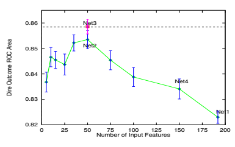

图 8.9。肺炎风险预测任务的 ROC 面积与反向传播网络使用的输入特征数量的关系

## 8.3 最大限度地利用 MTL

在神经网络中进行多任务学习的基本机制在反向传播中是存在的。然而，反向传播并不是为了很好地执行 MTL 而设计的。本章提供了如何使反向传播网络中的 MTL 更有效的建议。其中一些建议可能违反直觉，但如果不使用，可能会导致 MTL 对主要任务的泛化造成伤害，而不是帮助它。

## 8.3.1 使用大隐藏层

MTL 在反向传播网络中的基本理念是，隐藏层中为一个任务学习到的知识对其他任务也有用。当任务共享隐藏单元时，MTL 有效。有人可能认为小的隐藏层通过促进任务间的共享将有助于 MTL。

对于我们在这里研究的这类问题，这通常是无效的。

通常，任务之间的差异足够大，以至于每个任务需要学习的许多内容不会转移到其他（或任何）任务。使用大隐藏层可以确保有足够的隐藏单元，让任务在需要时学习独立的隐藏层表示。共享仍然可以发生，但只有当不同任务的隐藏层表示之间的重叠非常强时。在许多实际问题中，因强制任务共享而保持隐藏层较小所导致的准确性损失，往往大于由共享带来的收益。通常，在 MTL 中使用大型隐藏层非常重要。

## 8.3.2 对每个任务单独进行早停

经典的 NETtalk 应用[30]在一个反向传播网络上训练了音素和重音。NETtalk 是多任务学习（MTL）的早期示例。但其构建者

图 8.10. 在 NETtalk 中，重音任务训练得非常快，并且在音素任务达到峰值性能之前就已经过拟合。

NETtalk 的构建者将多个输出视为单个问题的编码，而不是作为通过共同训练相互受益的独立任务。

图 8.10 展示了音素和重音子任务的学习曲线。很明显，重音任务在音素任务达到峰值性能之前就开始出现过拟合。通过对重音和音素任务分别进行早停，或者通过平衡它们的学习率，使它们同时达到峰值性能，可以获得更好的性能。

早停通过在错误驱动程序（如反向传播）达到训练集的最小误差之前停止训练，从而防止过拟合。

（见第二章）。回想 8.2.6 节的转向预测问题。我们通过在主要转向任务之外训练一个网络来解决八个额外的任务，应用了 MTL。图 8.11 显示了九条学习曲线，每条曲线对应于这个 MTL 网络的一个任务。每个图表显示了训练期间验证集的误差。

表 8.4 显示了每个任务停止的最佳时机。没有一个周期可以停止训练，以便在所有任务上实现最大性能。如果所有任务都很重要，并且使用一个网络来预测所有任务，那么在所有输出的误差总和最小化的位置停止训练是你能做的最佳选择。图 8.12 显示了九个任务的综合均方根误差（RMS 误差）。最佳平均 RMSE 出现在 75,000 次反向传播传递时。

图 8.11. 在九个任务上训练的 MTL 网络的测试集性能

但是，使用一个网络对所有任务进行预测并不是最佳选择。通过使用验证集对每个输出进行单独的提前停止，可以获得更好的性能。诀窍是在每个任务表现最佳的时期复制网络，并使用这个副本对该任务进行预测。在制作每个副本后，继续训练网络，直到其他任务达到最佳性能。有时，最好继续训练所有输出，包括那些已经开始过拟合的输出。有时，对于那些已经开始过拟合的输出，停止训练（或使用较低的学习率）会更好。请记住，一旦某个输出开始过拟合，我们就不再关心网络在该任务上的表现，因为我们有一个早期时期的网络副本，当时该任务的表现最佳。继续训练该任务的唯一原因是它可能有利于尚未达到最佳性能的其他任务。

图 8.12. 所有九个任务的组合测试集性能 表 8.4. 在每个任务单独停止训练时，与通过所有任务的合并误差停止训练 MTL 的九个任务的性能对比。

| 任务              | 单独停止             | 合并停止         | 差异         |             |       |
| --- | --- | --- | --- | --- | --- |
|                   | BP 通过               | 性能             | BP 通过      | 性能       |       |
| 1: 1 或 2 车道      | 100000                | 0.444             | 75000        | 0.456       | 2.7%  |
| 2: 左边缘        | 100000                | 0.309             | 75000        | 0.321       | 3.9%  |
| 3: 右边缘         | 100000                | 0.376             | 75000        | 0.381       | 1.3%  |
| 4: 中心线        | 75000                 | 0.486             | 75000        | 0.486       | 0.0%  |
| 5: 道路中心      | 200000                | 0.208             | 75000        | 0.239       | 14.9% |
| 6: 道路灰度级    | 750000                | 0.552             | 75000        | 0.680       | 23.2% |
| 7: 边缘灰度级    | 375000                | 0.518             | 75000        | 0.597       | 15.3% |
| 8: 线条灰度级    | 1                     | 1.010             | 75000        | 1.158       | 14.7% |
| 9: 转向          | 125000                | 0.276             | 75000        | 0.292       | 5.8%  |

表 8.4 比较了按任务进行的提前停止性能与通过使用合并误差在一个地方停止整个 MTL 网络训练时获得的性能。平均而言，单独对任务进行的提前停止减少了 9.0%的误差。这是一个很大的差异。对于某些任务，如果 MTL 网络在该任务上没有单独停止，其性能可能不如 STL 在该任务上的表现。

在离开这个话题之前，需要提到的是，MTL 网络上各个输出的训练曲线不一定是单调的。虽然 STL 网络的测试集误差出现多模态并不罕见，但 STL 网络的训练集误差应该是单调下降或变平。这对于 MTL 网络上各个输出的误差并不成立。所有输出的训练集误差总和不应增加，但任何一个输出可能会表现出更复杂的行为。图 6 显示了 road_greylevel 的情况。

图 8.11 展示了一个多模态测试集曲线。该输出的训练集曲线类似。这使得在 MTL 网络中判断何时停止训练变得更加困难。因此，我们总是在 MTL 网络上进行提前停止，通过训练超过每个任务表现最佳的时代，并在第一次运行中小心保留足够的副本，或者再次以相同的随机种子重新训练网络，以获取副本。

## 8.3.3 为不同任务使用不同的学习率

是否有可能控制不同任务的训练速度，使它们同时达到最佳表现？如果每个任务同时达到峰值表现，是否能够实现最佳表现？如果不能，对于额外任务来说，学习速度比主任务慢或快更好？

使用普通反向传播时，不同任务的学习速度很少是 MTL 的最佳选择。训练速度慢于主任务的任务在主任务训练停止时不会学到足够的知识来帮助主任务。训练速度快于主任务的任务可能在主任务学习良好之前过拟合，导致它们学到的东西对主任务不再有用，或者可能使主任务提前过拟合。

控制不同任务学习速度的最直接方法是为每个任务使用不同的学习率，即为每个输出设置学习率。我们尝试使用梯度下降为每个额外输出寻找学习率，以最大化主任务的泛化性能。表 8.5 显示了优化其他八个额外任务的学习率前后主转向任务的性能。为额外的 MTL 任务优化学习率使主任务的性能额外提高了 11.5%。这个提升是 MTL 相较于 STL 的原始提升 15%-25%之上的。

随着学习率优化，检查所有任务的训练曲线显示额外任务的学习率变化对额外任务学习速度有显著影响。有趣的是，这也对主任务的学习速度有显著影响。

表 8.5。MTL 在主转向方向任务上优化其他八个额外任务的学习率前后的性能。

| 试验   | 优化前   | 优化后   | 差异   |
| --- | --- | --- | --- |
| 试验 1 | 0.227                 | 0.213                | -6.2%        |
| 试验 2 | 0.276                 | 0.241                | -12.7%       |
| 试验 3 | 0.249                 | 0.236                | -5.2%        |
| 试验 4 | 0.276                 | 0.231                | -16.3%       |
| 试验 5 | 0.276                 | 0.234                | -15.2%       |
| 平均 | 0.261                 | 0.231                | -11.5% *     |

这令人惊讶，因为我们在优化过程中保持主任务的学习率不变。更有趣的是，优化学习率以最大化主任务的泛化准确性，也几乎同样改善了额外任务的泛化。这对鹅有益的，似乎对雁也有益。

## 8.3.4 为主任务使用私有隐藏层

有时每个输出的最佳隐藏单元数为 100 个或更多。如果有数百个额外任务，这将转化为数千个隐藏单元。这不仅会造成计算困难，还会降低主任务的性能，因为大部分隐藏层表示是为其他任务构建的。主任务的输出单元在试图仅使用对其有用的少数隐藏单元时面临巨大的隐藏单元选择问题。

图 8.13. 为主任务和额外任务使用私有隐藏层的 MTL 架构，以及主任务和额外任务共享的隐藏层

图 8.13 展示了解决此问题的网络架构。与一个共享所有任务的隐藏层不同，这里有两个不相交的隐藏层。隐藏层 1 是仅用于主任务的私有隐藏层。隐藏层 2 则被主任务和额外任务共享。这是支持 MTL 转移的隐藏层。由于主任务可以看到并影响共享的隐藏层，而额外任务不影响保留给主任务的隐藏层，因此隐藏层 2 可以保持较小而不影响主任务。

## 8.4 章节总结

我们通常认为反向传播网络的输入是信息传递给网络的地方，而输出是网络输出预测的地方。然而，在训练过程中，反向传播通过*输出*将信息推入网络。通过输出输入到网络的信息与通过输入输入到网络的信息同样重要。

多任务学习是一种在训练过程中使用反向传播网络的输出将额外信息推入网络的方法。如果网络架构允许不同输出之间共享所学内容，这些额外信息可以帮助主任务得到更好的学习。（有关多任务学习的更多讨论，请参见[5, 6, 4, 8, 3, 9, 11, 10, 20, 35, 36, 12, 21, 13, 14]。）

MTL 并行训练多个任务并不是因为这种方法更高效，而是因为额外任务的训练信号中的信息可以帮助主要任务更好地学习。有时主要任务的最佳方案并不适用于额外任务。优化技术以确保主要任务的性能最佳是重要的，即使这可能会影响额外任务的性能。如果额外任务同样重要，最好为每个重要的额外任务重新运行学习，且为每个任务单独优化技术。

本章介绍了利用额外输出来利用实际领域中可用信息的多种机会。这些应用中的关键是将网络的输出视为仅在学习过程中使用的输入。任何在网络训练时可用的信息，但在网络用于预测时不可用的信息，都可以作为额外输出。许多领域将有有用的额外任务。本章提供的原型领域列表并不完整，未来将识别出更多种类的额外任务。致谢。R. Caruana 获得了 ARPA 资助 F33615-931-1330，NSF 资助 BES-9315428，以及医疗政策机构资助 HS06468。寻找在作为额外输出时表现更好的输入特征的工作与 Virginia de Sa 共同完成，她获得了斯隆基金会的博士后奖学金。我们感谢多伦多大学提供的 Xerion 模拟器，以及 D. Koller 和 M. Sahami 提供的特征选择器的使用。

[从神经网络中的提示学习](https://example.org)，作者为 Y.S. Abu-Mostafa，发表在《复杂性杂志》6(2)，页码 192–198（1990）。

[提示](https://example.org)，作者为 Y.S. Abu-Mostafa，发表在《神经计算》7，页码 639–671（1995）；[学习内部表示](https://example.org)，作者为 J. Baxter，收录于 COLT 1995，位于加利福尼亚州圣克鲁斯。

(1995)

[学习内部表示](https://example.org)，作者为 J. Baxter，博士论文，南澳大利亚弗林德斯大学（1994 年 12 月）。

[多任务学习：基于知识的归纳偏置来源](https://example.org)，作者为 R. Caruana。

收录于第十届国际机器学习会议，ML。

1993，马萨诸塞大学，阿默斯特，页码 41–48（1993）。

[多任务连接主义学习](https://example.org)，作者为 R. Caruana，收录于 1993 年连接主义模型暑期学校的论文集中，页码 372–379（1994）。

[贪婪属性选择](https://example.org)的作者为 R. Caruana 和 D. Freitag，收录于 ICML 1994，位于新泽西州的拉德格斯大学，页码 28–36（1994）。

[同时学习许多相关任务的反向传播](https://example.org)，作者为 R. Caruana，收录于 NIPS 1994，页码 656–664（1995）。

[利用未来“理清”现在](https://example.org)，作者为 R. Caruana、S. Baluja 和 T. Mitchell。

医疗风险预测的 Rankprop 和多任务学习，收录于 NIPS 1995 的神经信息处理系统进展论文集，页码 959–965。

(1996)

[10] Caruana, R., de Sa, V.R.: 促进劣特征给监督者：某些输入作为输出更有效。收录于：NIPS 1996 (1997)

[11] Caruana, R.: 多任务学习。机器学习 28, 41–75 (1997)

[12] Caruana, R.: 多任务学习。博士论文，卡内基梅隆大学，CMUCS-97-203 (1997)

[13] Caruana, R., O'Sullivan, J.: 自主机器人多任务模式识别。收录于：IEEE 智能机器人与系统会议论文集 (IROS 1998)，维多利亚 (1998)（待发表）

[14] Caruana, R., de Sa, V.R.: 使用特征选择寻找更有效的输入作为输出。收录于：国际神经网络会议论文集

（ICANN 1998），瑞典 (1998)（待发表）

[15] Cooper, G.F., Aliferis, C.F., Ambrosino, R., Aronis, J., Buchanan, B.G., Caruana, R., Fine, M.J., Glymour, C., Gordon, G., Hanusa, B.H., Janosky, J.E., Meek, C., Mitchell, T., Richardson, T., Spirtes, P.: 评估用于预测肺炎死亡率的机器学习方法。医学人工智能 9, 107–138 (1997)

[16] Craven, M., Shavlik, J.: 使用采样和查询从训练的神经网络中提取规则。收录于：第 11 届国际机器学习会议论文集，ML 1994，罗格斯大学，新泽西州，页码 37–45 (1994)

[17] Davis, I., Stentz, A.: 使用神经网络进行自主户外导航的传感器融合。收录于：IEEE 智能机器人与系统会议论文集 (1995)

[18] Dietterich, T.G., Bakiri, G.: 通过错误纠正输出编码解决多类学习问题。人工智能研究杂志 2, 263–286

（1995）

[19] Fine, M.J., Singer, D., Hanusa, B.H., Lave, J., Kapoor, W.: 使用 MedisGroups 比较医院数据库验证肺炎预后指数。

美国医学杂志 (1993)

[20] Ghosn, J., Bengio, Y.: 股票选择的多任务学习。收录于：NIPS 1996

（1997）

[21] Heskes, T.: 解决大量相似任务：多任务学习与层次贝叶斯方法的结合。收录于：第 15 届国际机器学习会议论文集，麦迪逊，威斯康星州，页码 233–241

（1998）

[22] Holmstrom, L., Koistinen, P.: 在反向传播训练中使用附加噪声。

IEEE 神经网络学报 3(1), 24–38 (1992)

[23] John, G., Kohavi, R., Pfleger, K.: 无关特征与子集选择问题。收录于：ICML 1994，罗格斯大学，新泽西州，页码 121–129 (1994)

[24] Koller, D., Sahami, M.: 朝着最优特征选择迈进。收录于：ICML 1996，巴里，意大利，页码 284–292 (1996)

[25] Le Cun, Y., Boser, B., Denker, J.S., Henderson, D., Howard, R.E., Hubbard, W., Jackal, L.D.: 反向传播应用于手写邮政编码识别。神经计算 1, 541–551 (1989)

[26] Le Cun, Y.: 私人通信 (1997)

[27] Munro, P.W., Parmanto, B.: 网络之间的竞争改善委员会绩效。收录于：神经信息处理系统进展论文集，NIPS 1996，第 9 卷 (1997)（待发表）

[28] Pomerleau, D.A.：《移动机器人引导的神经网络感知》。博士论文，卡内基梅隆大学：CMU-CS-92-115（1992）

[29] Pratt, L.Y., Mostow, J., Kamm, C.A.：《神经网络之间学习信息的直接转移》。载于《AAAI 1991 会议论文集》（1991）

[30] Sejnowski, T.J., Rosenberg, C.R.：《NETtalk：一个学习朗读的并行网络》。约翰·霍普金斯大学：JHU/EECS-86/01（1986）

[31] Sill, J., Abu-Mostafa, Y.：《单调性提示》。载于《神经信息处理系统会议论文集》，NIPS 1996，第 9 卷（1997）（待刊）

[32] Suddarth, S.C., Holden, A.D.C.：《符号-神经系统及其在开发复杂系统中的提示使用》。国际人机研究杂志 35(3)，291–311（1991）

[33] Suddarth, S.C., Kergosien, Y.L.：《规则注入提示作为提高网络性能和学习时间的手段》。载于《EURASIP 神经网络研讨会论文集》，第 120-129 页（1990）

[34] Thrun, S.：《基于解释的神经网络学习：一种终身学习方法》。Kluwer 学术出版社（1996）

[35] Thrun, S., Pratt, L.（主编）：机器学习。第二期关于归纳转移的特刊（1997）

[36] Thrun, S., Pratt, L.（主编）：学习如何学习。Kluwer（1997）

[37] Valdes-Perez, R., Simon, H.A.：《发现复杂模式行为的强大启发式方法》。载于第 11 届国际机器学习会议论文集，ML 1994，新泽西州罗格斯大学，第 326-334 页（1994）

[38] Weigend, A., Rumelhart, D., Huberman, B.：《通过权重消除实现泛化及其在预测中的应用》。载于《神经信息处理系统进展论文集》，NIPS 1990，第 3 卷，第 875-882 页（1991）

# 9 解决神经网络学习中的不适定性

Patrick van der Smagt 和 Gerd Hirzinger 德国航空航天研究院，机器人与系统动力学研究所，邮政信箱 1116，D–82230 Wessling，德国 smagt@dlr.de http://www.robotic.dlr.de/Smagt/

摘要。本文研究了前馈学习问题。大多数前馈学习问题中存在的众所周知的不适定性被证明是网络结构造成的。同时，网络中“高层”之间的权重必须在“低层”权重收敛之前稳定的著名问题也得到了讨论。我们通过增加共享权重的线性连接来修改网络结构，从而提出了解决这些问题的方法。我们将这种新的网络结构称为线性增强前馈网络，并证明通用逼近定理仍然有效。仿真实验表明了新方法的有效性，并展示了新网络对局部最小值的敏感性较低，学习速度比原始网络快。

## 9.1 引言

前馈网络学习的主要问题之一仍然是学习算法的准确性和速度。由于学习问题是一个复杂且高度非线性的难题[12, 4]，必须使用迭代学习过程来解决优化问题[2, 14]。对改进学习算法行为的持续渴望导致了许多优秀的优化算法，这些算法特别适用于前馈网络学习。

然而，一个重要问题是表示学习问题的误差函数的特定形式。早已注意到[10, 16]，误差函数的导数通常条件不好。这种条件不良反映在包含许多鞍点和平坦区域的误差景观中。

尽管可以通过使用随机学习方法解决这个问题

（例如，[9, 1, 13]），这些方法需要许多学习迭代才能找到最佳解，因此不适合快速学习为要求的问题。因此，我们仍然专注于基于梯度的学习方法。

- 之前发表于：Orr, G.B. 和 Müller, K.-R.（编辑）：LNCS 1524，ISBN

978-3-540-65311-0（1998 年）。

G. Montavon 等（编辑）：NN：行业技巧，第 2 版，LNCS 7700，第 191–203 页，2012 年。

-c 施普林格-维尔海德 2012 年

存在一些算法试图寻找良好行为的最小值[7]，然而学习问题的一个重要因素仍然是前馈网络的结构。

本章提供了对条件不良学习问题的解释，并提出了解决此问题的方案。第 9.2 节正式介绍学习问题，并描述学习矩阵中的奇点问题。在第 9.3 节中分析了奇点的原因，并介绍了一种适应性学习规则，以减轻此问题。第 9.4 节讨论了一些应用。

## 9.2 学习过程

使用神经网络 N : N × n → M，我们创建对一组 p 个学习样本 {(x1, y1), (x2, y2)*, ...,* (xp, yp)} 的近似，其中 xi ∈ N 和 yi ∈ M，对于所有 1 ≤ i ≤ p : F(xi) = yi。函数 F : N → M 被称为模型函数。

设 n 为网络的自由参数 W 的数量。在这种情况下，我们感兴趣的是近似学习样本，而不是潜在的函数 F，或者假设 p 个学习样本是 F 的代表。

神经网络表示的函数的输出可以写作

$${\cal N}(\mathbf{x},W)_{o}=\sum_{h}w_{ho}s\left(\sum_{i}w_{ih}x_{i}+\theta_{h}\right)+\theta_{o}\tag{9.1}$$

$$(9.2)$$

其中 s(x) 为传输函数，o 表示输出单元，h 为隐藏单元，i 为输入单元。符号表示与从隐藏单元 h 到输出单元 o 的连接相对应的 W 的元素；wih 类似用于从输入单元 i 到隐藏单元 h 的连接。最后，θ 是偏置权重，因此也是 W 的一个元素。图 9.1 展示了一个示例前馈网络，具有一个输入和输出单元以及两个隐藏单元。

学习任务包括最小化近似误差，通常定义为

$$E_{\mathcal{N}}(W)=\sum_{i=1}^{p}\|{\mathcal{N}}(\mathbf{x}_{i},W)-\mathbf{y}_{i}\|$$

$$(9.3)$$

对于·我们更倾向于使用 L2 范数。当没有混淆时，我们将省略下标 N。E(W) 在 W 中是（高度）非线性的，因此需要迭代搜索技术来找到 E(W) 足够小的 W。

最后，我们定义残差模式误差

$$e_{M(i-1)+j}=\|{\mathcal{N}}(\mathbf{x}_{i},W)_{j}-\mathbf{y}_{i j}\|,$$

即，第 i 个学习样本的 j'th 输出值的误差。

图 9.1. 一个示例前馈神经网络。圆圈代表神经元；黑色实心圆为偏置单元，始终携带激活值“1”。

## 9.2.1 学习方法论

基于梯度的学习方法的特点是考虑泰勒展开中低阶项对近似误差的影响，

$$E(W+W_{0})=E(W_{0})+\left.\nabla E\right|_{W_{0}}W+W^{T}\left.\nabla^{2}E\right|_{W_{0}}W+\ldots\tag{9.4}$$

在大多数情况下，忽略高于二阶的项。我们定义

$$N{\mathrm{e~define}}$$

$$\tilde{E}_{1}(W+W_{0})=E(W_{0})+\left.\nabla E\right|_{W_{0}}W$$

$$(9.5)$$

$$(9.6)$$

E˜1(W + W0) = E(W0) + ∇E|W0 W (9.5)

和

$$\tilde{E}_{2}(W+W_{0})=\tilde{E}_{1}(W)+W^{T}\left.\nabla^{2}E\right|_{W_{0}}W$$

W0 W (9.6)

分别是 E 的一阶和二阶近似。

通过局部考虑近似误差作为 W 的一阶或二阶函数，我们可以使用几种现有的近似方法来最小化

E。当根据局部二阶近似信息最小化 E 时，局部信息被更新，并进行第二次最小化步骤。

完成。该过程重复进行，直到找到一个最小值。

众所周知的最小化方法包括最速下降法（其变体是

被称为误差反向传播）、共轭梯度优化、Levenberg-Marquardt 优化、变量度量方法和（拟）牛顿方法。这些方法各有优缺点，

在其他地方讨论过 [14]。

优化方法的原则如下。通过考虑

E 的二阶近似，如果 ∇E

而 ∇2E 是已知的。在找到最优点后，使用局部信息重新计算 ∇E 和 ∇2E，并重新定位最小值。该过程重复进行，直到找到一个最小值。

自然，这种方法的成功取决于误差函数的形式。如果误差函数不太复杂且光滑，并且可以合理地用二次函数近似，则所讨论的优化方法是寻找极小值的可靠和快速的方法。然而，在前馈网络训练中，误差函数似乎存在许多平坦区域，使得最小化任务因浮点精度有限而变得困难。

## 9.2.2 学习问题的条件

误差函数的平坦区域可以形式化如下。我们定义

(M p) × n 雅可比矩阵为

$$J\equiv$$

⎛

$$\mathbf{\tau}_{i}^{\mu}\left(\begin{array}{c}{{\nabla e_{1}^{i}}}\\ {{\nabla e_{2}^{T}}}\\ {{\vdots}}\\ {{\vdots}}\\ {{\nabla e_{M p}^{T}}}\end{array}\right)$$

⎞

其中 $\nabla\mathbf{e}_{k}\equiv\left(\begin{array}{c}\frac{\partial e_{k}}{\partial w_{1}}\\ \frac{\partial e_{k}}{\partial w_{2}}\\ \vdots\\ \frac{\partial e_{k}}{\partial w_{n}}\end{array}\right)$

⎞

$$(9.7)$$

⎟⎟⎟⎟⎠(9.7)

使得我们可以将 J 写为

$$J\equiv1$$

$$(9.8)$$

⎟⎟⎟⎟⎠ . (9.8)

在学习过程中，我们遇到 ∇E = 2JT e。

我们进一步定义 Hessian H = ∇2E，它是 E 的二阶导数矩阵。我们对 H 的特征值和特征向量感兴趣。由于 H 是一个接近局部最小值的正半定对称矩阵，其特征值均为正实数。当一个特征值非常小的时候，沿着对应特征向量的移动对近似误差的影响非常小。这意味着，在该方向上，误差函数是（几乎）奇异的。误差函数的奇异性可以通过 H 的条件表示，该条件定义为其最大特征值与最小特征值的比值。

如上所述，H 的不良状态可能发生在误差函数 E(W) 的极小值或平坦点。前馈学习任务通常具有奇异或接近奇异的 Hessian 矩阵。虽然上述学习方法在数学上不受不良条件 Hessian 的影响，但由于数字计算机的浮点精度有限，它确实会导致不准确性。

## 9.2.3 奇异性的原因

参考文献 [10] 列出了一些 Hessian 可能变为奇异或接近奇异的情况。列出的原因与 sigmoid 转移函数的不良特性有关。该函数的典型特征是 limx→∞ s(x) = c+ 和 limx→−∞ s(x) = c−。此外，不良条件也可能是由于数据未中心化所导致的，并且可以得到缓解 [11]。

假设某个神经元在所有学习模式中处于这种“饱和”状态，其输入权重的增量将等于 0（根据反向传播规则），使得这些权重永远不会改变。对于该神经元的每个输入权重，这导致 H 中的 0 行，从而形成奇异性。

然而，还有另一个重要的奇异性原因，这种情况可能特别发生在网络初始化后。当一个多层前馈网络从隐藏单元发出的权重很小（例如，小于 0.1）时，*流入该隐藏单元的权重*的影响显著减小。因此，*∂e/∂w*k 将接近于 0，导致 J 中接近于零的行以及接近奇异的 H。

我们观察到，这种奇异性非常普遍，并触及前馈网络学习中的一个特征问题：下层权重的梯度受到上层权重的影响。相关的问题是隐藏单元和输出单元之间权重变化对输入权重变化的影响；当它们快速且频繁地变化时，就像学习初始阶段的情况一样，较低的权重会出现无意义的重复扰动。

## 9.2.4 最小值的定义

当误差函数的导数为零时，称为达到最小值，即*∂E/∂w*1≤k≤n = 0。由于误差函数的梯度等于雅可比矩阵的列和，因此当达到最小值时

$\forall1\leq k\leq n:\sum_{i=1}^{Mp}\frac{\partial e_{i}}{\partial w_{k}}=0,$  $\forall1\leq k\leq n:\sum_{i=1}^{Mp}\frac{\partial e_{i}}{\partial w_{k}}=0,$

$$(9.9)$$

即，当每一列的和为 0 时。公式(9.9)定义了批量学习系统的最小值：对所有学习样本求和时，梯度应为 0。然而，这也意味着，某些列的和可能相互抵消，即使雅可比矩阵的所有元素并不全为 0。换句话说，某些模式的梯度可能非零，而梯度的总和却为零。

当雅可比矩阵的所有元素均为 0 时，达到最佳情况。这当然意味着每个模式的残差误差为 0。

## 9.3 局部最小值由反向传播造成

在本节中，我们提出了一种新的神经网络结构，以缓解上述问题。在标准反向传播学习程序中，关于权重的误差函数梯度通过对每个学习模式计算以下步骤来确定：

1. 对于每个输出单元 o，当呈现学习样本时，计算增量δo = yo − ao，其中 ao 是该单元的激活值。

2. 计算从隐藏单元到输出单元的权重导数：

$$\Delta w_{h o}=\delta_{o}a_{h}$$

其中 ah 是隐藏单元的激活值。

3. 计算隐藏单元的增量：

$$\delta_{h}=\sum_{o}\delta_{o}w_{h o}s^{\prime}(a_{h}).$$

$$(9.10)$$

4. 计算从输入到隐藏层的权重 wih 的权重导数

单元：

$$\Delta w_{i h}=\delta_{h}a_{i}=\sum_{o}\delta_{o}w_{h o}s^{\prime}(a_{h})a_{i}.$$

然后，梯度作为Δw 的总和计算。

从（9.10）我们可以看到，当输入到隐藏单元的权重的梯度微不足道时，会出现四种情况，以至于 Hessian 的对应行和列接近零：

- 当δo 很小。这是正确的，因为该情况意味着网络的输出接近其期望输出。

- 当谁很小。这是一种不理想的情况：隐藏层到输出单元的小权重使输入到隐藏单元的权重瘫痪。这一点尤为重要，因为权重可能需要在后续改变其值。

- 当 s(ah)很小；这发生在权重 wih 很大时。这种饱和类型的瘫痪是不希望的。

- 最后，当 ai 很小。这是期望的：当输入值微不足道时，它不应对输出产生影响。

## 9.3.1 一种新的神经网络结构

为了缓解这些问题，我们建议对（9.10）的学习系统进行如下更改：

$$\Delta w_{i h}=\sum_{o}\delta_{o}(w_{h o}s^{\prime}[a_{h}]+c)a_{i}=\delta_{h}a_{i}+c\sum_{o}\delta_{o}a_{i}.$$

通过在中间项添加一个常数 c，我们可以解决这两个瘫痪问题。实际上，从每个输入单元到每个输出单元创建了一个额外的连接，其权重值与从输入到隐藏单元的权重相耦合。

图 9.2. 一种示例适应的前馈神经网络

虽然 c 可以作为可学习参数，但在后续内容中我们将假设 c = 1。神经网络的第 o 个输出现在计算为

$${\cal M}(\mathbf{x},W)_{o}=\sum_{h}\left(w_{ho}s\left[\sum_{i}w_{ih}x_{i}+\theta_{h}\right]+\sum_{i}w_{ih}x_{i}\right)+\theta_{o}.\tag{9.11}$$

我们称新的网络为线性增强前馈网络。该网络的结构如图 9.2 所示。注意 N 和 M 的等价性，即，

$${\mathcal{M}}(\mathbf{x},W)_{o}\equiv{\mathcal{N}}(\mathbf{x},W)_{o}+\sum_{h}\sum_{i}w_{i h}x_{i}.$$

$$(9.12)$$

9.3.2 对近似误差 E 的影响

虽然最优 W 在网络 N 和 M 中会有所不同，但我们仍然可以比较误差函数 EN 与 EM 的形式。使用（9.2）和（9.11）

我们可以计算单个学习样本（x, y）的近似误差

有 N 个输入，κ个隐藏单元和一个输出：

$$E_{\mathcal{M}}(W)^{2}=\left(\mathcal{M}[\mathbf{x},W]-y\right)^{2}$$

$${}^{2}=({\cal M}[\mathbf{x},W]-y)^{2}\tag{9.13}$$ $$=\left({\cal N}(\mathbf{x},W)-y+\sum_{i}\sum_{h}w_{ih}x_{i}\right)^{2}$$ $$=E_{\cal N}(W)^{2}+2\sum_{i}\sum_{h}w_{ih}x_{i}({\cal N}[\mathbf{x},W]-y)+\left(\sum_{i}\sum_{h}w_{ih}x_{i}\right)^{2}.$$

网络 M 的误差与网络 N 的误差在两个项上有所不同。当我们在 EN 最小的那些 W 值下考虑 EM 时，可以看出 EN 和 EM 之间的差异由一个归一化项 h wTh x 组成；wh 是连接输入与隐藏单元 h 的权重向量。只有当向量 wT1 x, wT2 x, ..., wTκ x 对于每个训练集中的输入向量 x 相互抵消时，这个非负项才会为零。换句话说：EM(W)²对隐藏单元执行相同操作施加了惩罚，从而使网络更加高效地使用其资源。

## 9.3.3 M 与通用逼近定理

在各种出版物中已显示[3, 6, 8]，普通前馈神经网络 N 可以用具有 sigmoid 或高斯激活函数的单层隐藏单元表示任何 Borel 可测函数。

定理 1. 网络 M*可以用*具有 sigmoid 或高斯激活函数的单层隐藏单元表示任何 Borel 可测函数。

证明。我们展示任何网络 N 可以写成网络 M；因此，网络 M 的类别*是通用逼近器*。

通过使用(9.1)和(9.11)，

$$\mathcal{N}(\mathbf{x},W)_{o}=\sum_{h=1}^{\kappa}w_{ho}s\left(\sum_{i}w_{ih}x_{i}+\theta_{h}\right)+\theta_{o}$$ $$=\sum_{h=1}^{\kappa}\left(w_{ho}s\left[\sum_{i}w_{ih}x_{i}+\theta_{h}\right]+\sum_{i}w_{ih}x_{i}\right)+\theta_{o}-\sum_{h=1}^{\kappa}\sum_{i}w_{ih}x_{i}$$ $$=\mathcal{M}(\mathbf{x},W)_{o}+\sum_{l=\kappa+1}^{2\kappa}\left(0\left[\sum_{i}-w_{i,l-\kappa}x_{i}+0\right]+\sum_{i}-w_{i,l-\kappa}x_{i}\right)+0$$ $$=\mathcal{M}(\mathbf{x},W)_{o}+\mathcal{M}(\mathbf{x},V)_{o}$$

其中 V 是一个权重矩阵，使得 V 中与从隐藏单元到输出单元的权重相对应的元素为 0，其他权重等于其 W 对应项的负值。此外，偏置权重设置为 0。

和 M(x, W)o + M(x, V)o 表示两个 M 网络，也可以写成一个具有双倍隐藏单元的单个 M(x, W)-网络，其中 W = [W V]。

利用[3, 6, 8]中的定理，证明已完成。

请注意，也可以通过将隐藏单元的数量加倍并使用从输入单元到这些隐藏单元的无穷小权重，以及从这些隐藏单元到输出单元的权重的乘法逆数，将每个 M 网络写为 N 网络。

图 9.3 展示了在两个隐藏单元情况下 N 网络和 M 网络的等价性。

图 9.3. N 网络（左）和 M 网络（右）的等价性。为清晰起见，偏置单元未列出。

## 9.3.4 示例

作为一个例子，我们训练一个具有单个隐藏单元且没有偏置连接的网络，以表示学习样本(1, 1)和(2, 2)。隐藏单元采用 sigmoid 激活函数。因此，网络计算的函数为 N (*x, W*) = w2s(w1x)（原始神经网络），而适应后的神经网络为 M(*x, W*) = w2s(w1x) + w1x。我们使用 sigmoid 函数 s(x)=1/(1 + e−x)作为激活函数，其具有以下众所周知的性质：limx→∞ s(x)=1，limx→−∞ s(x)=0，以及 limx→±∞ s(x)=0。

图 9.4 显示了该神经网络的误差函数及其导数。

在该图的顶行中，我们看到了原始神经网络。注意在中间上方的图中，描述*∂E/∂w*1 时，*∂E/∂w*1 对于小值的 w2 近似为 0。换句话说，当 w2 较小时，w1 几乎不会改变其值。类似地，当 w1 较大时，*∂E/∂w*1 也会很小，因为传递函数的导数几乎为 0。在底行中，展示了修改后的神经网络。左侧再次是误差函数。中间的图清楚地显示，导数不再有零或非常小的区域。右侧的图仍然表明，如果 w1 有一个大的负值，*∂E/∂w*2 是可以忽略的：

毕竟，隐藏单元的激活值接近于零。

## 9.4 应用

我们将新的学习方案应用于多个逼近问题。在所有问题中，每个网络都以不同的初始随机权重值运行了 3000 次。为了训练网络，我们使用了 Polak-Ribière 共轭梯度优化技术，并进行了 Powell 重启[14]。

使用真实数据的应用（问题 3 和 4）使用两个独立的数据集：学习集和交叉验证集。在所有情况下，网络被

w 1 图 9.4。使用原始和适应学习规则的误差函数和导数。顶行显示了原始学习规则的误差函数（左），以及其导数*∂E/∂w*1（中）和*∂E/∂w*2（右）。底行显示了适应学习规则的相同图形。等高线的距离为 0.5（左图）和 0.2（中间和右图）。

训练直到交叉验证集上的误差最小（即，达到但不超过网络开始过拟合的点）。报告的逼近误差是使用交叉验证集中的样本计算得出的。

问题 1：（合成数据）异或问题。众所周知的异或问题由四个学习样本组成：[(0, 0), 0]，[(0, 1), 1]，[(1, 0), 1]，和[(1, 1), 0]。该网络有两个输入，两个隐藏单元和一个输出。

已经注意到[5]，异或问题在神经网络学习中是非常不典型的，因为它会因为泛化而受到惩罚。尽管如此，异或问题通常被视为一个小型标准学习基准问题。

而网络 N 在 22.4%的运行中达到局部最小值，线性增强网络 M 始终达到了全局最小值。对于 N，获得 0.0 的近似误差（在计算机的 32 位浮点精度范围内）所需的平均步数为 189.1；对于 M，则需要 98.3 步。

当使用普通的误差反向传播学习规则时（即，没有共轭梯度学习），据报道 XOR 学习问题导致 8.7%的局部最小值[14]。

问题 2：（合成数据）逼近 tan(x)。作为第二个测试，网络用于函数 F(x) = tan(x)的逼近。

该函数在区间[0, π]中均匀采样，总共使用了 20 个学习样本。为了进行逼近，我们使用了一个输入、一个隐藏层中有五个隐藏单元和一个输出的网络。

在网络 N 中，14.6%的运行导致局部最小值。线性增强神经网络并不完美；在 6.2%的情况下，它陷入了局部最小值。

在所有其他情况下，发现了非常接近 0.0 的全局最小值。问题 3：（真实数据）逼近机器人手臂的逆运动学。第三，我们逼近了描述手眼协调学习问题的数据，使用了 Manutec R2 机器人手臂。

数据组织如下。有五个输入变量，描述机器人手臂在关节角度θ2、θ3 处的当前位置，以及相对于手持摄像头的物体在像素坐标 x、y、z 中的视觉位置。数据的输出部分由所需的关节旋转Δθ1、Δθ2 和Δθ3 组成，以到达目标。有关手眼协调问题的进一步描述，请参见[15]。在这个特定问题中，使用了 1103 个学习样本；1103 个样本用于交叉验证。使用单层中六个隐藏单元的最优[15]。仅使用交叉验证数据来评估网络。

在正常网络 N 中，2.3%的情况下，网络陷入了一个不可接受的高误差的局部最小值，学习集和测试集都如此。在使用线性增强网络的 3,000 次试验中，从未发生过这种情况。经过 10,000 个学习步骤后，网络 N 的交叉验证近似误差为 4.20 · 10−4，网络 M 为 4.04 · 10−4（这两个值是每个学习样本的平均值）。新方法在这里显示出轻微的改进。问题 4：（真实数据）齿轮箱变形数据。最后的测试由以下问题组成，该问题出现在控制新开发的轻量机器人手臂时。一个齿轮箱将直流电机与机器人手臂段连接起来。为了将机器人手臂段定位到所需的关节角度θa，直流电机必须施加一个力τ。然而，在正常设置中，关节角度解码器仅在直流电机一侧可用，用于测量角度θm。

通过在实验室设置中在臂段上安装额外的解码器，我们可以测量 θa。实际关节角度 θa 与 θm 稍有不同，因为齿轮箱的弹性。我们尝试从 (θm, ˙θm, τ) 中学习 θa。

为了学习这些数据，我们使用一个具有 3 个输入、1 层 6 个隐藏单元和 1 个输出的网络。数据包括 4,000 个学习样本和 4,000 个用于交叉验证的样本。在每次运行中，最多进行 10,000 次学习迭代，但不超过过拟合的点。

网络 N 和 M 都没有在学习集和测试集中陷入不可接受高误差的局部最小值。然而，在经过 10,000 次学习步骤后计算的交叉验证近似误差中遇到了一些意外。对于网络 N，这个误差每个学习样本等于 2.85 · 10−4；对于 M，

然而，这个误差每个样本低至 1.87 · 10−6。进一步的数据分析显示，数据具有强线性成分，这解释了近似误差低两个数量级的事实。

结果总结在表 9.1 中。

表 9.1. 普通前馈网络 N 和线性增强前馈网络 M 在四个问题上的结果

|                         |                | N                       | M    |
| --- | --- | --- | --- |
| XOR                     | % 局部最小值 | 22.4                    | 0.0  |
| 平均步骤              | 189.1          |                         | 98.3 |
| tan                     | % 局部最小值 | 14.6                    | 6.2  |
| 机器人                   | % 局部最小值 | 2.3                     | 0.0  |
| 3D 数据                 | 平均误差     | 4.20 · 10−4 4.04 · 10−4 |      |
| 齿轮箱 % 局部最小值 |                | 0.0                     | 0.0  |
| 数据                    | 平均误差     | 2.85 · 10−4 1.87 · 10−6 |      |

## 9.5 结论

已证明，普通反向传播学习规则在前馈神经网络学习中导致了误差函数的二阶导数矩阵的条件不良。这又导致误差空间中的局部最小值和鞍点。为了缓解这个问题，我们引入了对反向传播规则的适应，这可以实现为一种适应的前馈神经网络结构。我们称这个网络为 *线性增强前馈神经网络*。这种适应导致了一种学习规则，使连接输入单元和隐藏单元的权重获得稳定值，即使从隐藏单元到输出单元的权重发生变化。

数学分析表明该方法的有效性；特别是，普遍逼近定理在新的神经网络结构下仍然有效。将新方法应用于两组合成数据和两组真实数据表明，新方法对局部极小值的敏感性大大降低，并且在更少的迭代中达到最优。致谢。作者感谢 Alin Albu-Schäffer 在提供齿轮箱数据方面的帮助。

[1] Aarts, E., Korst, J.：模拟退火与玻尔兹曼机。约翰·威利

& Sons（1989 年）

[2] Battiti, R.：学习的第一阶和第二阶方法：在最陡下降法和牛顿法之间。神经计算 4，141–166（1992 年）

[3] Cybenko, G.：通过 sigmoid 函数的叠加进行逼近。控制、信号与系统的数学 2(4)，303–314（1989 年）

[4] DasGupta, B., Siegelmann, H.T., Sontag, E.D.：关于训练具有连续激活函数的神经网络的复杂性。IEEE 神经网络汇刊 6(6)，1490–1504（1995 年）

[5] Fahlman, S.E.：对反向传播网络学习速度的实证研究。技术报告 CMU–CS–88-0-162，卡内基梅隆大学（1988 年 9 月）

[6] Funahashi, K.-I.：关于神经网络对连续映射的近似实现。神经网络 2(3)，183–192（1989 年）

[7] Hochreiter, S., Schmidhuber, J.：平坦极小值。神经计算 9(1)，1–42

（1997 年）

[8] Hornik, K., Stinchcombe, M., White, H.：多层前馈网络是通用逼近器。神经网络 2(5)，359–366（1989 年）

[9] Robbins, H., Monro, S.：一种随机逼近方法。数学统计年鉴 22(1)，400–407（1951 年）

[10] Saarinen, S., Bramley, R., Cybenko, G.：神经网络训练问题中的病态条件。SIAM 科学计算杂志 14(3)，693–714（1993 年）

[11] Schraudolph, N.N.：关于中心化神经网络权重更新。技术报告 IDSIA-19-97，IDSIA（1997 年 4 月）

[12] Sontag, E.D., Sussmann, H.J.：反向传播即使在没有隐层的网络中也会产生虚假的局部极小值。复杂系统 3(1)，91–106（1989 年）

[13] Unnikrishnan, K.P., Venugopal, K.P.：Alopex：一种基于相关性的前馈和递归神经网络学习算法。神经计算 6，469–490（1994 年）

[14] van der Smagt, P.：训练前馈网络的最小化方法。神经网络 7(1)，1–11（1994 年）

[15] van der Smagt, P.：使用神经网络的视觉机器人手臂引导。博士论文

论文，阿姆斯特丹大学计算机系统系（1995 年 3 月）

[16] Zhang, Q.J., Zhang, Y.J., Ye, W.：局部稀疏连接多层网络。

在：IEEE 神经网络会议论文集，第 1254–1257 页。IEEE（1995 年）

# 10 中心化神经网络梯度因子-

Nicol N. Schraudolph IDSIA，科尔索·埃尔维齐亚 36 号，6900 卢加诺，瑞士 nic@idsia.ch http://www.idsia.ch/

摘要。早已知道，当神经网络的输入和隐层单元活动以零为中心时，学习速度可以加快；最近，我们扩展了这一方法，也涵盖了误差信号的中心化[15]。在这里，我们将这一概念推广到网络梯度中涉及的所有因素，提出隐层单元激活函数的斜率也应进行中心化。斜率中心化消除了反向传播误差的线性成分；这改善了具有快捷连接的网络中的信用分配。基准结果表明，这可以显著加快学习，而不会对训练后的网络的泛化能力产生不利影响。

## 10.1 引言

中心化是一种通用的方法论，用于加速自适应系统的学习，这类系统以神经网络为例——即通常是非线性、连续且冗余的系统；通过某种形式的梯度下降，从实例中逐步学习。其基本原则是：

进入神经网络权重更新方程的所有与模式相关的因素都应该进行中心化，即*应减去其在模式上的平均值*。

先前的工作。众所周知，LMS 自适应滤波器的输入应该进行中心化，以便快速而稳定地适应[22]，并且有论据表明

[12]同样适用于多层网络中的输入和隐层单元活动。尽管 Sejnowski [16]提出了一种 Hebbian 学习的变体，其中权重更新的前后突触因素均被中心化，但当反向传播变得流行时，这一思想并未被采纳。因此，多层网络中误差信号中心化的好处直到最近才被报道[15]；在这里，我们最终建议中心化作为一种通用的方法论，并提出所有因素均被中心化的反向传播方程。

- 先前发表在：Orr, G.B. 和 Müller, K.-R.（编）：LNCS 1524，ISBN

978-3-540-65311-0（1998）。

G. Montavon 等（编）：NN: Tricks of the Trade, 第二版，LNCS 7700，第 205–223 页，2012 年。

-c Springer-Verlag Berlin Heidelberg 2012

架构的独立性。尽管这里在具有 sigmoid 激活函数的前馈网络的背景下引入了中心化方法，但其本身的适用范围更广。实现细节可能有所不同，但从本质上讲，中心化并不依赖于任何特定架构：其原则同样适用于前馈和递归网络，使用 sigmoid、径向或其他基函数，无论是否具备拓扑结构、时间延迟、乘法门等——简而言之，神经网络设计中使用的各种架构元素。学习算法的独立性。同样，中心化也不依赖于任何特定的学习算法。它可以应用于确定性（批量）或随机（在线）梯度下降；更重要的是，它可以自由与更复杂的优化技术结合，如期望最大化、共轭梯度和准牛顿法。此外，它还保留了许多常用于随机梯度下降的实用技巧，例如动量、学习率调整、梯度归一化等等。由于这种灵活性，中心化有潜力进一步加速这些方法中最快的。

概述。第 10.2 节介绍了中心化方法对普通反向传播学习所要求的修改。我们随后在第 10.3 节讨论实现细节，然后在第 10.4 节展示基准结果。第 10.5 节以简要分析中心化如何促进更快学习结束我们的论文。

## 10.2 中心化反向传播

反向传播学习算法的特点在于三个方程，分别描述活动的前向传播、误差的反向传播和权重的修改。以下是关于这三个方程中心化的含义：

## 10.2.1 活动传播

常规。考虑一个神经网络，节点 j 的激活由下式给出：

$$x_{j}\,=\,f_{j}(y_{j})\,,\quad y_{j}\,=\,\sum_{i\in A_{j}}w_{i j}\,\tilde{x}_{i}\,.$$

$$(10.1)$$

其中 fj 是一个非线性（通常是 sigmoid）激活函数，wij 是突触权重，Aj 表示将其活动 xˇi 输入节点 j 的*前置*节点集合。通常，前置节点的输出直接向前馈入，即，

(∀i) ˇxi ≡ xi。我们意味着节点通过方程 10.1 以适当的顺序（前馈）激活，并且一些节点的值被固定，以表示网络的外部输入。特别地，我们假设偏置输入 x0 ≡1，并要求所有节点与之相连：（∀j >0）0 ∈Aj。

$$(10.2)$$

中心化。正如 LeCun 等人所建议的[12]，网络输入和隐含单元的活动应中心化，以允许更快的学习（见第一章）。我们通过设置实现这一点。

$$(\forall i>0)\;\;\;\check{x}_{i}\;=\;x_{i}-\langle x_{i}\rangle\,,\tag{1}$$

其中·表示对训练样本的平均（有关实现此操作符的方法，请参见第 10.3 节）。请注意，偏置输入必须不被中心化——因为 x0 = x0 = 1，否则它将变得无效。

## 10.2.2 权重修改

常规。公式 10.1 中给出的网络权重 wij 通常通过梯度下降在某个目标函数 E 中进行优化。对于每个权重的局部步长η ij，这导致了权重更新方程

$$\Delta w_{i j}\,=\,\eta_{\,i j}\,\delta_{j}\,\dot{x}_{i}\,,\;\;\mathrm{其中}\;\;\delta_{j}\,=\,-\partial E/\partial y_{j}\,.$$

$$(10.3)$$

中心化。我们最近提出[15]误差信号δj 也应该被中心化，以实现更快的收敛。这是通过更新所有非偏置权重来完成的：

($\forall i>0$) $\Delta w_{ij}=\eta_{\,ij}\,\delta_{j}\,\tilde{x}_{i}\,,$ 其中 $\delta_{j}=\delta_{j}-\langle\delta_{j}\rangle\,.$ (10.4)

和以前一样，这种中心更新不能用于偏置权重，否则它们将永远停留在当前值（除了随机波动）：

$\mathbf{M}$

* Δw0j  ∝ -ˇδj

$$\langle\Delta w_{0j}\rangle\,\propto\,\langle\check{\delta}_{j}\rangle\,=\,\langle\delta_{j}\rangle-\langle\delta_{j}\rangle\,=\,0\,.$$

相反，偏置权重按照常规进行更新（公式 10.3）。由于这意味着平均误差δj 专门给偏置权重 w0j，因此我们之前称这种技术为*d.c.误差分流*[15]。

## 10.2.3 误差反向传播

常规。对于输出单元，误差δj 可以直接计算：

目标函数；对于隐藏单元，必须通过误差反向传播来推导：

$$\delta_{j}\,=\,f_{j}^{\prime}(y_{j})\,\gamma_{j}\,,\quad\gamma_{j}\,=\,\sum_{k\in P_{j}}w_{j k}\,\delta_{k}\,,$$

$$(10.5)$$

$$(10.6)$$

其中 Pj 表示来自节点 j 的*后验*节点集合，fj(yj)是节点当前的*斜率*——其非线性 fj 在当前激活水平的导数。中心化。通过将公式 10.6 插入公式 10.4，我们可以将隐藏单元的权重更新表示为其活动、反向传播误差和斜率的三重乘积：

$$\Delta w_{i j}\,\propto\,f_{j}^{\prime}(y_{j})\,\dot{\gamma}_{j}\,\ddot{x}_{i}\,,\tag{1}$$

其中γˇj 表示反向传播的*中心*误差。显式中心化γˇj 并不是必要的，因为

$$\langle\tilde{\gamma}_{j}\rangle\,=\,\left\langle\sum_{k\in P_{j}}w_{jk}\,\tilde{\delta}_{k}\right\rangle\,=\,\sum_{k\in P_{j}}w_{jk}\,\langle\tilde{\delta}_{k}\rangle\,=\,0\,.\tag{10.8}$$

$$(10.7)$$

通过中心化活动和误差信号，我们至今已经解决了公式 10.7 中的三个因素中的两个，剩下的第三个因素——节点的斜率——待处理。这是通过修改误差反向传播的非线性部分（公式 10.6）来实现的：

$$\delta_{j}\,=\,\tilde{f}^{\prime}_{j}(y_{j})\,\dot{\gamma}_{j}\,,\,\,\,\,\,\mbox{其中}\,\,\,\,\,\tilde{f}^{\prime}_{j}(y_{j})\,=\,f^{\prime}_{j}(y_{j})-\left\langle f^{\prime}_{j}(y_{j})\right\rangle.\tag{10.9}$$

线性误差的削减。注意，对于一个*线性*节点 n，我们有 fn(yn)≡ 1，方程 10.9 将始终导致δn ≡ 0。换句话说，斜率中心化（对于任何节点）阻止了误差信号的*线性成分*的反向传播——同一位置的线性节点将接收的那个成分。

从误差削减的角度来看，我们已迈出了超越误差中心化的逻辑下一步，后者去除了误差信号的 d.c.（常数）成分。

捷径。因此，重要的是有一个参数——偏置权重——来接收和修正即将被消除的 d.c.误差成分。同样，我们现在需要额外的权重来实现从前节点到后节点的线性映射，而相关单元自己已经无法实现。正式地，我们要求对于每个使用方程 10.9 的节点 j，我们有

$$(\forall i\in A_{j})\ \ P_{j}\subseteq P_{i}\,.$$

$$(10.10)$$

(∀i ∈ Aj ) Pj ⊆ Pi . (10.10)

我们将以这种方式绕过节点（或层）的连接称为*捷径*。之前已经指出，神经网络学习在增加捷径权重时有时会改善。然而，在我们自己的实验中（见第 10.4 节），我们发现是斜率中心化使捷径权重真正有用。

一种互补的方法？在第九章中，van der Smagt 和 Hirzinger 也主张使用捷径来加速神经网络学习。然而，请注意，他们对捷径的使用与我们的不同：为了改善神经网络的条件，他们添加了权重与*现有*权重耦合（共享）的捷径连接。因此，他们适当地修改了网络的拓扑，而没有增加新的权重参数，也没有偏离严格的基于梯度的优化框架。相反，我们故意削弱隐藏单元的梯度线性成分，以便让它们专注于非线性任务。然后，我们使用带有*附加*权重参数的捷径来处理隐藏单元现在忽略的线性映射。

虽然这两种方法都使用捷径来实现目标，但从另一个角度看，它们几乎是互补的：我们从梯度中消除了线性成分，而 van der Smagt 和 Hirzinger 实际上在他们的梯度中增加了这样的成分。甚至可能将这两种方法有益地结合在一个单一的——诚然相当复杂的——神经网络架构中。

## 10.3 实施技术

我们可以根据平均运算符·的实现方式，区分多种中心化变量的方法。在具体上，平均可以精确或近似地进行，并在学习过程中以先验或自适应的方式应用于批量（确定性）或在线（随机）设置：

| 中心化方法：   | 近似     | 精确          |                       |
| --- | --- | --- | --- |
| 先验            | 设计       | 外在      |                       |
| 在线              | 滚动平均 | -              |                       |
| 自适应                      | 批量           | 上一批次 | 两遍，单遍 |

## 10.3.1 先验方法

通过设计。某些中心化的好处可以在不修改学习算法的情况下获得，仅需适当设置系统即可。

例如，具有对称范围-1 到 1 的双曲正切（tanh）函数，通常会产生比常用的逻辑 sigmoid f(y)=1/(1 + e−y)（范围为 0 到 1）更好中心化的输出，因此它是隐藏单元的首选激活函数[12]。类似地，输入表示可以（并且应该）选择使输入大致中心化。

使用捷径时，甚至可以选择*先验*从隐藏单元的斜率中减去一个常数（例如，最大值的一半），以改善其中心化。

我们将这些近似方法称为*设计中心化*。尽管不精确，它们提供了方便且易于实现的技巧，以加速神经网络的学习。无论是否需要进一步的加速技术，通常在为神经网络设置学习任务时，将中心化作为设计原则是个好主意。外在。对网络而言外在的量 - *即*，不受其权重变化影响的量 - 通常可以在学习前准确中心化。特别是，对于任何给定的训练集，网络的输入可以以这种方式进行中心化。即使在训练集未知的在线设置中，有时也可以基于对训练数据的先验知识进行这种*外在*中心化：例如，不是将时间序列 x(t)作为输入，可能会将时间差信号 x(t) − x(t−1)呈现给网络，如果 x(t)是平稳的，这将被中心化。

## 10.3.2 自适应方法

在线。当进行在线学习时，由于其他权重的同时适应，单层网络中单个权重的即时环境是高度非平稳的，甚至由于学习任务本身也是如此。因此，某些信号 x(t)的唯一定义的平均值在在线情况下是不可用的，我们必须依靠*滚动平均* - 信号本身的平滑版本。一个流行的平滑器是*指数平滑*

$${\bar{\mathbf{x}}}(t\!+\!1)\,=\,\alpha\,{\bar{\mathbf{x}}}(t)\,+\,(1\!-\!\alpha)\,\mathbf{x}(t)\,,$$ 

$$(10.11)$$ 

x¯(t+1) = α x¯(t) + (1−α) x(t), (10.11) 

该方法的优点是*无历史*和因果性，*即*，当前更新不需要 x 的过去或未来值。自由参数 α（0 ≤ α ≤ 1）决定了平均的时间尺度。选择并不简单：如果太小，x¯ 会太嘈杂；如果太大，平均值会滞后于（漂移）信号。 

请注意，通过这种方法进行中心化的计算成本与网络中的节点数量成正比。在密集连接的网络中，这一成本被权重数量所掩盖，因此通过这些权重传播活动和误差信号的计算占主导地位。因此，在线中心化的成本只会在小型或稀疏连接的网络中显现。 

双次批次。在批量学习上下文中实现精确中心化的简单方法是对每次权重更新进行两次传递：第一次计算所需的平均值，第二次计算结果权重变化。这显然可能会将网络训练的计算成本增加近一倍。对于相对较小的网络和训练集，可以在第一次传递中存储每个节点和模式的活动和误差信号，因此第二次传递仅由权重更新组成。

（方程 10.4）。在无法实现这一点的情况下，仅进行前馈的第一次传递（方程 10.1）即可计算平均活动和斜率；然后可以通过这里描述的其他方法之一实现误差中心化。之前的批次。为了避免两次传递方法的计算开销，可以在计算当前批次的权重变化时使用收集到的*之前*批次的平均值。这个近似假设所涉及的平均值在批次之间变化不大；这可能会导致在非常高的学习率下出现稳定性问题。从计算上讲，这种方法相当吸引人，因为它比上述在线技术更便宜。当使用小批次进行训练时，可以通过对小批次平均值进行指数平滑来有利地结合这两种方法。单次批次。只需在训练模式的批次中进行一次*单次*传递就可以实现精确的中心化。这是通过扩展完全中心化批量权重更新的三重乘积来完成的（参见方程 10.7）。使用 fj 作为 fj(yj) 的简写，我们有 

Δwij ∝ (xi − xi)(γj − γj)(fj − fj) = xiγj fj − xi γj fj − xi γj fj − xiγj fj + xi γj fj + xi γj fj + xi γj fj − xi γj fj = xiγj fj − xi γj fj − γj xi fj − xiγj fj + 2 xi γj fj (10.12) 

除了普通的（非中心化）批量权重更新项 -xiγjfj 

。 

以及各个平均值 xi、γj 和 -fj 

., 单次中心更新 (10.12) 因此也需要收集子产品 xiγj ,-xifj。

., 和

-γjfj

.. 由于涉及额外的计算，单次批处理更新并不一定比两次方法更高效。然而，当并非所有因素都涉及时，它会大大简化——例如，当活动已经*先验*中心化，使得 xi ≈ 0 时。

请注意，这里展示的扩展技术可用于推导任何涉及从整个训练模式计算某个数量的确切单次批处理方法。这包括如 BCM 学习[4, 10]和二元信息增益优化[14]等算法。

## 10.4 实证结果

尽管活动中心化长期以来是反向传播知识的一部分，且之前已有关于误差中心化的实证结果[15]，但坡度中心化在这里首次被提出。因此，现在评估其普遍适用性或效用还为时尚早；在此我们展示了一些旨在表明中心化对速度和收敛的可靠性及在通过加速反向传播方法训练的前馈神经网络中的泛化性能的典型影响的实验。

下一部分描述了我们所有实验中使用的一般设置和加速技术。随后的部分将呈现我们在两个著名基准测试中的各自结果：二元模式中的对称检测玩具问题和一个困难的元音识别任务。

## 10.4.1 实验设置

基准设计。对于每个基准任务，我们进行了多项实验，以比较有无各种中心化形式的性能。每个实验由 100 次*运行*组成，起始权重不同，但在其他方面完全相同。每次运行中，网络使用来自零均值高斯分布的随机权重初始化，标准差为 0.3。所有实验都使用相同的随机数序列进行 100 次权重初始化；该序列的种子在基准设计最终确定后才选定。

训练模式。为了使结果尽可能直接评估中心化，训练采用批处理模式，以避免在线方法所需的额外自由参数（*例如*，平滑时间常数）。

如果没有*先验*完成，则使用确切的两次批处理方法来实现中心化。此外，我们总是在反向传播误差之前更新网络的隐层到输出层的权重。这被认为有时可以改善收敛行为[17]，我们发现这可以在我们期望的大步长下提高稳定性。

竞争控制。普通的反向传播（简单的梯度下降）算法有许多已知缺陷，提出了大量加速技术。我们非正式地测试了多种技术，然后选择了实现最快可靠收敛的组合。这种组合——*vario-*η和*bold driver*——被用于这里报告的所有实验。因此，之后报告的居中性能优势是在一种先进的加速梯度方法之上实现的。

Vario-η [23, page 48]。这种有趣的技术——在第十七章中也有描述——将每个权重的局部学习率设置为与其随机梯度的标准差成反比。因此，权重变化变为

$$\Delta w_{ij}\,=\,\frac{-\eta\,g_{ij}}{\varrho+\sigma(g_{ij})}\,,\,\,\,\mbox{where}\,\,\,\,g_{ij}\,\equiv\,\frac{\partial E}{\partial w_{ij}}\,\,\,\,\,\mbox{and}\,\,\,\,\sigma(u)\,\equiv\,\sqrt{\left\langle u^{2}\right\rangle-\left\langle u\right\rangle^{2}}\,,\tag{10}$$

$$(10.13)$$

通过小的正常数防止接近零值的除法。Vario-η可以在批处理和在线模式中使用，并且非常有效，它不仅执行梯度归一化，还根据局部梯度信号中的噪声水平调整步长。

我们在这里报告的所有实验中使用了 vario-η，= 0.1。在批处理实现中，这仅留下一个待确定的自由参数：全局学习率η。Bold Driver [11, 21, 2, 3]。该算法用于调整全局学习率η，简单而有效，但仅适用于批学习。从某个初始值开始，η在每个误差没有超过非常小的常数ε（为数值稳定性所需）的批次后增加一定因子。然而，若误差超过ε，则撤销上一次权重变化，并迅速降低η。

这里报告的所有实验均使用带有 2%学习率增量、50%减量和ε= 10−10 的 bold driver 进行。这些值被发现能够在所有实验中提供快速、可靠的收敛。由于它们所需的重新计算量，我们在性能数据中计算“失败”的纪元（其权重变化随后被撤销）。

## 10.4.2 对称检测问题

在我们的第一次基准测试中，一个完全连接的前馈网络有 8 个输入、8 个隐藏单元和一个输出，旨在学习对称检测任务：给定输入的 8 位二进制模式，输出信号指示模式是否在其中轴对称（目标 = 1）或不对称（目标 = 0）。这虽然是一个玩具问题，但并非简单。

由于目标是二元的，我们使用了逻辑输出单元和交叉熵损失函数。每次运行时，网络在所有 256 种可能的模式上进行训练，直到其批次输出的均方根误差降到 0.01 以下。我们记录了达到此标准所需的纪元数，但没有测试该任务的泛化能力。错误和活动居中。在我们的第一组实验中，我们考察了居中网络活动和/或错误信号的单独和组合效果。为了方便，活动居中通过将-1 和 1 作为输入水平，并使用双曲正切（tanh）作为隐藏单元的激活函数进行*a priori*处理。偏离中心的对照实验则使用 0 和 1 作为输入水平，以及逻辑激活函数 f(y)=1/(1 + e−y)。请注意，通过 vario-η算法消除了 tanh 和逻辑非线性之间的所有差异，*除了*各自输出的离心率。

结果。表 10.1 显示，居中活动或错误信号均能将收敛速度提高约 7 倍。在任何情况下，使用一种（或两种）居中方法的运行速度都没有慢于不进行居中的对应对照组。速度提升的相似幅度表明，这可能是由于居中错误或活动所改善的 Hessian 条件（见第 10.5 节）。然而，请注意，在直接比较中，活动居中几乎在 2/3 的时间里优于错误居中。另一方面，错误居中似乎提高了收敛的*可靠性*：它将收敛时间的变异系数（标准差与均值的比率，以下称为 c.v.）减半，而活动居中则未能做到这一点。表 10.1。居中活动和/或错误信号对对称性检测任务的影响，没有捷径。报告的是达到标准所需的纪元数的经验均值、标准差，以及第 25/50/75 百分位（四舍五入到三个有效数字）。还显示了对具有相同随机种子的运行进行直接比较的结果。由于并列情况，每次比较中的运行次数可能总和小于 100。

| 错误信号：   | 常规              | 居中            |           |          |    |             |
| --- | --- | --- | --- | --- | --- | --- |
| 均值 ± 标准差     | 直接比较：      | 均值 ± 标准差     |           |          |    |             |
| 活动：         | 四分位数          | 更快运行的次数   | 四分位数 |          |    |             |
| 669 ± 308        | 0 - 100            | 97.5 ± 21.8      |           |          |    |             |
| 偏离中心 (0/1) | 453/580/852        | 0                | 0         | 35       | 7  | 82/95.5/109 |
|                  | |                  |                  |           |          |    |             |
|                  | |                  | 63 × 100         | 93        |          |    |             |
| 93.1 ± 46.7      | 100                | 65.4 ± 15.9      |           |          |    |             |
| 中心化 (-1/1)  | 67.5/79.5/94       | 14 -             | 84        | 57/62/70 |    |             |

保持不变。我们推测这可能是中心化对*反向传播*误差的有益影响，而这种影响在活动中心化时并不存在。

最后，当活动和误差信号都被中心化时，进一步加速了 50%（同时保持较低的变异系数）。这可能归因于我们设计上对隐藏单元活动的中心化（参见第 10.3 节）只是近似的。为了评估这些效应的显著性，请注意，由于数据是在 100 次运行中收集的，因此报告的收敛时间的标准误差为 1/

√100 = 1/10 其报告的标准差。

短路径和斜率中心化。在第二组实验中，我们保持活动和误差信号均衡，并研究了添加短路径和/或斜率中心化的单独及组合效果。请注意，由于对称比特模式的补集也是对称的，因此对称性检测任务根本没有线性成分——因此我们预期短路径在这里的好处最小。

结果。表 10.2 显示，单独添加短路径并没有带来好处——实际上在超过 80%的情况下，它减慢了收敛速度，并显著增加了变异系数。然而，后续添加的斜率中心化几乎使学习速度提高了 3 倍，并恢复了大约 1/4 的原始变异系数。当同时使用时，斜率中心化和短路径从未增加收敛时间，平均缩短了一半。相比之下，没有短路径的斜率中心化在大约 1/3 的时间里完全没有收敛。这可能令人惊讶，因为所给的任务没有线性成分。然而，请考虑以下几点：

表 10.2。斜率中心化和/或添加短路径对对称性检测任务的影响，其中活动和误差信号被中心化。结果以与表 10.1 相同的方式显示。

| 斜率：       | 常规               | 中心化           |            |      |             |    |           |
| --- | --- | --- | --- | --- | --- | --- | --- |
| 平均 ± 标准差 | 直接比较：         | 平均 ± 标准差   |            |      |             |    |           |
| 拓扑：       | 四分位数           | 更快运行的数量   | 四分位数    |      |             |    |           |
| 65.4 ± 15.9  | 52                 | -                | 48         | *    | 51.6 ± 16.2 |    |           |
| 短的         | 无                  | 57/62/70         | 81         | 0    | 61          | 4  | 43/64.5/∞ |
|              | |                  | 39 ×             | 99         | 95 | |             |    |           |
| 切分？       | 90.4 ± 31.1        | 17               | 33.1 ± 8.6 |      |             |    |           |
| 是           | 69.5/80/102        | 0 - 100          | 28/31/35   |      |             |    |           |

* 均值和标准差不包括 34 次未收敛的运行。

对捷径的需求。由于其非线性传递函数的单调性，隐藏单元总是携带一定的线性动量，即它们的净输入与输出之间存在正相关。在没有捷径的情况下，隐藏单元必须排列自身，使得它们的线性动量整体上与任务的线性分量（此处为零）相匹配。这个适应过程通常由误差的线性分量驱动，而坡度中心化则消除了这一点。

剩余的非线性误差信号仍然可以促使隐藏单元达到整体解决方案，但这种间接过程必然不可靠：因为它从误差面上字面上移除了坡度，坡度中心化会产生大量局部极小值。捷径权重通过对缺失的（线性）梯度分量建模，将这些局部极小值转变为全局极小值，从而解放了隐藏单元的责任。

总之，虽然没有捷径的网络经过坡度中心化训练后可能收敛到一个解决方案，但添加捷径权重是必要的，以确保坡度中心化不会对学习过程产生不利影响。相反，坡度中心化可以防止捷径充当冗余的“干扰者”，阻碍学习而不是促进学习。因此，这两种技术应始终结合使用。

## 10.4.3 元音识别问题

我们在对称检测任务中的积极经验立即引发了两个进一步的问题：1）这些结果能否转移到更具挑战性的现实问题上，2）学习速度的提升——如常发生的那样——是否以泛化能力为代价？为了回答这些问题，我们进行了进一步的实验，使用了 Deterding 提供的说话者独立元音识别数据[5]，这是一个较为流行的基准，其良好的泛化性能相当难以实现。任务。网络的任务是以说话者独立的方式识别英国英语的十一种稳态元音，给定语音信号的 10 个谱特征（具体为：LPC 导出的对数面积比）。数据由 990 个模式组成：每个发言者说的 11 个元音各有 6 个实例，发言者共有 15 位。我们遵循将数据划分为训练集和测试集的惯例，训练集中包含前 8 位（4 位男性，4 位女性）发言者的数据，测试集中包含其余 7 位（4 位男性，3 位女性）的数据。请注意，没有单独的验证集可用。

先前工作。Robinson [13] 首先使用 Deterding 的数据作为基准，通过比较多种神经网络架构在其上的表现。有趣的是，他的方法没有一个能够超越原始的单一最近邻方法（其误分类率为 44%），这对模式识别社区提出了挑战。在上述任务的训练中，传统的反向传播网络实际上在错误率约为 42%[6, 9] 时似乎达到了极限，而自适应最近邻技术可以达到 38%[7]。在第七章中，Flake 报告了 RBF 网络以及他自己混合架构的比较有利的结果。使用说话者性别/身份信息[19, 20]，可以获得更好的性能。

或通过为每个元音训练一个单独的模型[8]。通过结合这两种方法，测试集错误率达到了 23%[18]，这是我们目前所知的最低值。训练和测试。我们通过最小化交叉熵损失，训练了一个具有 10 个输入、22 个隐藏单元和 11 个逻辑输出单元的全连接前馈网络。正确元音对应的输出目标为 1，其他所有输出目标为 0。活动中心化是通过显式中心化输入（分别针对训练和测试集）以及使用 tanh 非线性函数进行的。未中心化的对照实验使用原始输入数据和逻辑激活函数。

我们网络的相对较小的规模使我们能够将所有实验运行到 2000 个训练周期。每个周期后，网络的泛化能力通过其在测试集上的误分类率进行测量。为了测试，采用了最大似然的方法：网络对给定测试模式的最高输出被视为其对该模式的分类。

首次结果。图 10.1 显示了在我们为该基准测试进行的 8 次实验中，平均测试集错误率（经过 100 次运行）在训练期间的演变。所有曲线的误差条的大小至多为曲线上所示标记的大小，因此为了清晰起见已省略。根据我们在对称检测任务中的经验，快捷方式和斜率中心化始终是结合使用的，而活动和错误中心化则是独立进行的。可以辨别出以下效果：

图 10.1. 在学习元音识别任务时，平均测试集错误率的演变，采用活动中心化（三角标记）、错误中心化（填充标记）和/或带有快捷权重的斜率中心化（实线），与未中心化的对照组相比。实验标记为 a)–h)，如表 10.3 所示。

1. 所有采用活动中心化的实验（三角标记）在平均收敛速度和最小平均测试集错误率上明显优于所有不采用活动中心化的实验（圆形标记）。

所有带有快捷方式和斜率中心化（实线）的实验均优于没有这些方法的对应实验（虚线）。

除了一个显著的例外（实验 d），误差中心化（填充标记）

显著加快了收敛速度。在没有活动中心化的实验中，其效果最为显著。

在收敛速度和最小平均测试集误差方面，表现最佳的实验是 e)，完全中心化的实验；表现最差的是 a)，完全传统的实验。

显现出的定性图景是，中心化显著加快了收敛速度，而不对训练网络的泛化能力产生不利影响。我们现在将尝试量化这一发现。

量化效果。由于图 10.1 中的曲线实际上是 100 条非线性曲线的叠加，它们不适合进行定量分析：

最小平均测试集误差的值和位置并不能告诉我们关于这些最小值在各个运行中的分布的信息——甚至连它们的平均值或位置也无法得知。为了获得这样的定量结果，我们需要为每次运行确定一个合适的测试集误差最小值。这将使我们能够在实验中直接比较具有相同初始权重的运行，并通过汇总统计（*例如*，均值、标准差、四分位数）来表征每个实验内最小值的分布，包括最小测试集误差和达到该误差所需的时间。

设计一个合理且一致的策略来识别适合我们想要的定量比较的最小值并非易事。单个运行可能在测试集误差中有多个最小值，或者根本没有。如果我们仅使用运行期间的全局最小值（2000 个周期），那么我们将无法区分一个在运行后期对一个早已找到的最小值进行微小改善的快速方法与一个花费较长时间达到其第一个最小值的慢速方法。鉴于我们关心的是泛化性能的质量以及实现的速度，因此选择合适最小值的贪婪策略是有必要的。

最小值的识别。我们跟踪每次运行过程中测试集误差的演变，记录我们遇到的新最小值。如果迄今为止找到的最佳值在一定时间内没有得到改善，我们将其选为该运行的最小值，以便进行定量分析。放弃进一步改进前的适当等待时间是一个棘手的问题——有关讨论见第二章。为了公平比较快速和慢速优化方法，这个时间应该与达到相关最小值所需的时间成正比：慢速运行因此有更多时间改善其解决方案。

不幸的是，如果在训练的最初几个轮次内出现最小测试集错误，该方法会失败：等待时间可能过短，导致我们过早放弃。另一方面，我们无法等待超过整体运行的持续时间。因此，我们在达到 min(2 000, 2+100)轮次后停止寻找进一步的改进，此时记录网络首次达到的当前最低测试集错误。这里报告的 800 次运行中，只有 9 次达到了 2 000 轮次的上限，因此我们相信这一限制并没有显著扭曲我们的结果。

使用测试集作为验证集。请注意，由于我们使用测试集来确定何时比较性能，因此实际上将其视为验证集。以下报告的最小测试集错误因此并不是网络对新说话者泛化能力的无偏估计，且不应与这种能力的正确测量进行比较（测试集在任何情况下都不得影响训练过程）。尽管如此，我们不应忘记，最低测试集错误确实以一致的方式衡量了网络的泛化能力：尽管这些分数都倾向于 favor 特定的新说话者集合（测试集），但这绝不会使它们之间的比较显得*微不足道*。结果概述。表 10.3 总结了针对元音识别问题以这种方式获得的定量结果。为了评估其重要性，请回顾表 10.3。元音识别任务的最小测试集错误（错误分类率 %）以及达到该错误所需的轮次。除不同的布局外，结果的报告方式与表 10.1 和 10.2 相同。由于空间限制，仅直接比较了选定的实验对。

| 特征：      | 性能                  | 测量：          |                  |                |                |                  |             |                  |              |    |    |    |
| --- | --- | --- | --- | --- | --- | --- | --- | --- | --- | --- | --- | --- |
| 居中        | 最小测试集错误         | 所需轮次        |                  |                |                |                  |             |                  |              |    |    |    |
| 实验        | 激活                   | 错误            | 斜率            | 简化           | 四分位数       | 更好运行的数量    | 四分位数     | 更快运行的数量    |              |    |    |    |
| 平均 ± 标准差 | 方向比较：           | 平均 ± 标准差   | 方向比较：       |                |                |                  |             |                  |              |    |    |    |
| 48.0 ± 3.6   | 554 ± 321              |                 |                  |                |                |                  |             |                  |              |    |    |    |
| a)           | 45.7/47.3/50.0         | 67              | 17               | 13             | 19             | 37               | 365/486/691 | 3                | 10           | 4  | 1  | 14 |
|              | |                      |                 |                  |                |                |                  |             |                  |              |    |    |    |
| 49.1 ± 2.9   | 31 |                   | 125 ± 82        | 97               |                |                |                  |             |                  |              |    |    |    |
| b)           | √                      | 47.0/49.6/50.9  | 10               | 67.5/104/163   | 51             |                  |             |                  |              |    |    |    |
| 43.9 ± 2.5   | 82                     | 156 ± 110       | 90               |                |                |                  |             |                  |              |    |    |    |
| c)           | √                      | 42.3/43.9/46.0  | 51               | 75/137/215     | 47             |                  |             |                  |              |    |    |    |
| |            | |                      |                 |                  |                |                |                  |             |                  |              |    |    |    |
| 44.3 ± 2.3   | 89                     | 46              | 84               | 158 ± 141      | 48             | 52               | 96          |                  |              |    |    |    |
| d)           | √                      | √               | 42.9/44.2/45.9   | 49             | 65             | 72/124/186       | 21          | 85               |              |    |    |    |
| |            | |                      |                 |                  |                |                |                  |             |                  |              |    |    |    |
| 44.2 ± 2.5   | 49                     | 80              | 72.4 ± 55.5      | 78             | 99             |                  |             |                  |              |    |    |    |
| e)           | √                      | √               | √                | √              | 42.3/44.4/46.3 | 70               | 47          | 68               | 37.5/51.5/81 | 76 | 75 | 92 |
| |            | 113 ± 64               | 24 |            |                  |                |                |                  |             |                  |              |    |    |    |
| 44.2 ± 2.8   | 51                     |                 |                  |                |                |                  |             |                  |              |    |    |    |
| f)           | √                      | √               | √                | 42.3/44.4/46.1 | 68             | 69.5/97.5/148    | 88          |                  |              |    |    |    |
| 46.8 ± 3.7   | 27                     | 126 ± 139       | 22               |                |                |                  |             |                  |              |    |    |    |
| g)           | √                      | √               | √                | 44.0/47.0/48.9 | 43             | 64/94/138        | 84          |                  |              |    |    |    |
| |            | |                      |                 |                  |                |                |                  |             |                  |              |    |    |    |
| 46.5 ± 3.1   | 56                     | 31              | 29               | 30             | 61             | 270 ± 164        | 15          | 12               | 15           | 8  | 86 |    |
| h)           | √                      | √               | 44.5/46.8/48.5   | 162/235/316    |                |                  |             |                  |              |    |    |    |

这里报告的性能指标的均值标准误差为 1/

√100 = 报告的标准偏差的 1/10。图 10.2 以累积直方图的形式图示了相同数据（除了直接比较），展示了最小测试集错误及达到该错误所需的训练轮数。

结果一般确认了图 10.1 中观察到的趋势。完全中心化实验 e) 中的运行明显收敛得更快——并且测试集错误在最佳之列。与常规设置 a) 相比，完全中心化平均收敛速度快了近 8 倍，同时在 80% 的情况下泛化效果更佳。

泛化性能。测试集上的平均误分类率范围从 44% 到 49%，考虑到我们相对较小的网络，这被视为公平结果。它们聚集为三组：以活动为中心的网络

图 10.2。最小测试集错误的累积直方图（左）和达到该错误所需的训练轮数（右），用于元音识别任务。曲线的标记与图 10.1 相同，每 10 个百分位标记一次。

达到约 44%，另外两个使用快捷方式和斜率中心的结果低于 47%，而其余两个仅达到 48-49%。累积直方图（图 10.2，左）显示所有以活动为中心的网络具有几乎相同的最小测试集错误分布。

请注意，居中输入会改变任务，添加快捷方式会改变网络拓扑。可能正是这个 - 而不是居中 *本身* - 导致了它们对泛化的有益效果。在我们的实验中，错误居中是唯一一个仅改变学习动态的特征。它的添加似乎稍微*恶化*了泛化，特别是在缺乏其他形式的居中时。这可能是由于居中导致有效参数数量减少（因为模型本身已经相当小）。这种影响不应过于担忧：可以通过稍微增加中心网络的隐藏单元数量轻松弥补失去的自由度。收敛速度。这里考察的所有三种居中形式明显加快了收敛，无论是单独还是结合使用。从实验 c)到 d)时，添加错误居中出现了轻微的异常。

对所需的平均周期数没有显著影响。累积直方图（图 10.2，右侧）显示，尽管实验 d)在 20 到 80 百分位之间领先，但 c)的异常慢运行次数少于 d)，而且有几次异常快的运行。

在其他形式的居中存在的情况下，添加错误居中无疑是有益的：平均收敛时间从 f)的 113 个周期减少到 e)的 72.4 个周期。直方图显示，完全居中的 e)在几乎整个百分位范围内远远领先于竞争对手。

最后，值得注意的是，添加快捷方式和斜率居中，无论是单独使用还是与活动和错误居中结合使用，都大约将收敛速度翻倍 - 这种效应的大小与对称检测任务中的观察结果相同。

## 10.5 讨论

前面的章节已显示，居中确实对神经网络的学习速度和泛化能力有益。那么这是为什么呢？接下来，我们将从三个（部分重叠的）角度进行解释，依次考虑居中对 Hessian 条件数的影响、局部梯度中的噪声水平，以及网络不同部分之间的信用分配。

对 Hessian 进行条件处理。众所周知，基于二次误差曲面的首次梯度下降的最小收敛时间与 Hessian 矩阵的条件数成反比，*即*，其最大特征值与最小特征值之间的比率。因此，加速梯度下降的常见策略是寻求改善 Hessian 的条件数。

对于单个线性节点 y = wTx 和平方损失函数，Hessian 矩阵简单地是输入的协方差矩阵：H =-x xT .. 它的最大特征值通常是由 x 的直流成分引起的 [12]。中心化输入去除了该特征值，从而对 Hessian 进行了条件化，并允许更大的步长（参见第一章）。对于批量学习，误差中心化对局部权重更新的影响完全相同：

$$\Delta\mathbf{w}\,\propto\,\langle\left(\delta-\langle\delta\rangle\right)\mathbf{x}\rangle\,=\,\langle\delta\,\mathbf{x}\rangle-\langle\delta\rangle\,\langle\mathbf{x}\rangle\,=\,\langle\delta\left(\mathbf{x}-\langle\mathbf{x}\rangle\right)\rangle\tag{10.14}$$

然而，误差中心化比活动中心化更进一步，因为它还影响反向传播到前节点的误差。此外，公式 10.14 对于在线学习不成立，因为梯度是噪声的。

噪声减少。可以证明，中心化提高了局部梯度的信噪比。为了简化，忽略斜率因子，考虑噪声权重更新

$$\Delta w_{ij}\,\propto\,(\delta_{j}+\phi)(x_{i}+\xi)\,=\,\delta_{j}x_{i}+\xi\delta_{j}+\phi x_{i}+\phi\xi\tag{10.15}$$

其中 φ 和 ξ 是噪声项，假定为零均值，并且相互独立于活动、误差和彼此。在右侧展开中，第一个项是期望的（无噪声）权重更新，而其他项代表污染它的噪声。虽然最后一个（纯噪声）项无法避免，但我们可以通过中心化 δj 和 xi 来减少这两个混合项的方差，以最小化 -δ 2j。

. 和 -x2i

., 分别。

当然，有人可能会争辩说，这样做也缩小了信号 δjxi，因此就信噪比而言，我们并没有更好——实际上，甚至更糟。这直接切入了问题的核心，因为中心化基于这样一种观念：与非偏置、非捷径权重相关的误差信号是完全中心化的权重更新，δjxi 中的任何直流成分因此也应被视为一种噪声。这一假设当然只有在我们确实有偏置和捷径权重来处理中心化所去除的误差成分时才能维持。从具有这些额外参数的网络的角度来看，中心化是一种改善网络误差责任分配的方法：恒定误差被转移到偏置权重，线性误差转移到捷径权重，网络的其余部分仅处理那些实际需要非线性的误差信号部分。因此，中心化将隐藏单元视为稀缺资源，只有在必要时才调用。鉴于在训练非线性节点时出现的计算复杂性，我们认为这是一个合适且富有成效的观点。

未来工作。尽管此处报告的结果非常有前景，但仍需更多实验以评估中心化的普遍适用性和有效性。对于前馈网络，我们希望探索在多个隐藏层、随机（在线）梯度下降和函数近似（而非分类）问题中使用中心化的方法。然而，中心化方法*本身*实际上更为一般，因此我们预期它将应用于更复杂的网络架构、学习算法和问题领域。致谢。我要感谢本书的编辑以及我的同事 Jürgen Schmidhuber、Marco Wiering 和 Rafał Sałustowicz 的宝贵意见。此项工作得到了瑞士国家科学基金会的资助，资助编号为 2100–045700.95/1 和 2000–052678.97/1。

[1] Anderson, J., Rosenfeld, E.（主编）：神经计算：研究基础。

麻省理工学院出版社，剑桥（1988）

[2] Battiti, R.：加速反向传播学习：两种优化方法。

复杂系统 3, 331–342 (1989)

[3] Battiti, R.：学习的一阶和二阶方法：介于最陡下降法和牛顿法之间。神经计算 4(2), 141–166 (1992)

[4] Bienenstock, E., Cooper, L., Munro, P.：神经元选择性的发展的理论：视觉皮层中的方向特异性和双眼交互。神经科学杂志 2（1982）；重印于[1]

[5] Deterding, D.H.：自动语音识别中的发言者归一化。博士学位论文

论文，剑桥大学（1989）

[6] Finke, M., Müller, K.-R.：使用随机网络模型估计后验概率。在：Mozer, M.C., Smolensky, P., Touretzky, D.S., Elman, J.L.,

Weigend, A.S.（主编）1993 年联结模型夏季学校会议记录，博尔德，科罗拉多州。劳伦斯·厄尔鲍姆协会，希尔斯代尔（1994）

[7] Hastie, T.J., Tibshirani, R.J.：判别自适应最近邻分类。IEEE 模式分析与机器智能交易 18(6)，

607–616 (1996)

[8] Herrmann, M.：神经地图中地形的优点。在：Kohonen, T.

（主编）自组织地图研讨会记录，页 112–117。赫尔辛基理工大学（1997）

[9] Hochreiter, S., Schmidhuber, J.：通过 lococode 进行特征提取。神经计算（1998）（待发表）

[10] Intrator, N.：使用无监督神经网络进行特征提取。神经计算 4(1), 98–107 (1992)

[11] Lapedes, A., Farber, R.：一种自优化的非对称神经网络，用于内容寻址存储器和模式识别。物理学 D 22, 247–259 (1986)

[12] LeCun, Y., Kanter, I., Solla, S.A.：协方差矩阵的特征值：应用于神经网络学习。物理评论快报 66(18), 2396–2399 (1991)

[13] Robinson, A.J.：动态误差传播网络。博士学位论文，剑桥大学（1989）

[14] Schraudolph, N.N., Sejnowski, T.J.: 通过优化二元信息增益对聚类数据进行无监督区分。在：Hanson, S.J., Cowan, J.D., Giles, C.L.（编）《神经信息处理系统进展》，卷 5, pp. 499–506. Morgan Kaufmann, 圣马特奥 (1993)

[15] Schraudolph, N.N., Sejnowski, T.J.: 调整反向传播网络：不是所有权重都是相同的。在：Touretzky, D.S., Mozer, M.C., Hasselmo, M.E.（编）《神经信息处理系统进展》，卷 8, pp. 563–569.

MIT 出版社，剑桥 (1996)

[16] Sejnowski, T.J.: 用非线性交互神经元存储协方差。《数学生物学杂志》4, 303–321 (1977)

[17] Shah, S., Palmieri, F., Datum, M.: 用于前馈神经网络快速学习的最优滤波算法。《神经网络》5, 779–787 (1992)

[18] Tenenbaum, J.B., Freeman, W.T.: 风格与内容的分离。在：Mozer, M.C.,

Jordan, M.I., Petsche, T.（编）《神经信息处理系统进展》，卷 9, pp. 662–668. MIT 出版社，剑桥 (1997)

[19] Turney, P.D.: 在分类学习中利用上下文。在：Brazdil, P.B.

（编）ECML 1993. LNCS, 卷 667, pp. 402–407. Springer, 海德堡 (1993)

[20] Turney, P.D.: 具有上下文敏感特征的鲁棒分类。在：第六届国际人工智能及专家系统工业与工程应用会议论文集，pp. 268–276 (1993)

[21] Vogl, T.P., Mangis, J.K., Rigler, A.K., Zink, W.T., Alkon, D.L.: 加速反向传播方法的收敛。《生物网络》59, 257–263

（1988）

[22] Widrow, B., McCool, J.M., Larimore, M.G., Johnson Jr., C.R.: LMS 自适应滤波器的静态和非静态学习特性。《IEEE 会议录》64(8), 1151–1162 (1976)

[23] Zimmermann, H.G.: 神经网络作为决策计算。在：Rehkugler, H.,

Zimmermann, H.G.（编）《经济中的神经网络：基础与金融应用》，pp. 1–87. Vahlen Verlag, 慕尼黑 (1994)

# 11 避免反向传播导数中的舍入误差

Tony Plate，维多利亚大学数学与计算科学学院，新西兰惠灵顿，tap@mcs.vuw.ac.nz http://www.mcs.vuw.ac.nz/~tap/

摘要：反向传播网络中的一个显著的舍入误差来源是计算单元输出相对于其总输入的导数。舍入误差可能导致导数的相对误差很高，尤其是当导数实际为小但非零时被计算为零。通过一个简单的编程技巧可以轻松避免这种舍入误差，该技巧的内存开销很小（每个单元一个或两个额外的浮点数）且计算开销微不足道。

## 11.1 引言

反向传播导数是训练多层网络的一个重要部分。这些导数的准确性对许多训练方法至关重要，尤其是使用二阶信息的方法，如共轭梯度法。反向传播误差导数的标准公式（例如，见于 Ripley [3]，

Bishop [1] 和 Rumelhart, Hinton, 和 Williams [4]以浮点算术的方式进行计算，可能导致显著的舍入误差。尤其是，小导数被舍入为零。这些误差可能导致二阶方法出现混乱（由于梯度不准确），也可能导致权重搜索停止或变得非常缓慢，因为某些导数被计算为零，而实际上它们是小但非零的。 本章解释了如何简单而廉价地避免这种特定的舍入误差来源。该方法适用于逻辑单元和 tanh 单元，以及平方和和交叉熵误差函数。

在本章中，符号“=”用于表示数学等式，符号“←”用于表示赋值给某个浮点变量。

浮点值用星号表示，例如，x∗i 是 xi 的浮点版本。

- 之前发布于：Orr, G.B. 和 Müller, K.-R.（编）：LNCS 1524, ISBN

978-3-540-65311-0（1998）。

G. Montavon 等（编）：NN: Tricks of the Trade, 第 2 版，LNCS 7700，第 225–230 页，2012 年。

-c Springer-Verlag Berlin Heidelberg 2012

## 11.2 Sigmoid 单元的舍入误差

考虑一个非输入单元，其输出 yi 被计算为其总输入 xi 的逻辑函数：

$$y_{i}=\frac{1}{1+\exp(-x_{i})}\qquad\quad\mathrm{and}\qquad\quad y_{i}^{*}\leftarrow\frac{1}{1+\exp(-x_{i}^{*})}.$$

在训练的反向传播阶段，我们需要计算误差相对于总输入的偏导数。这是通过链式法则完成的：

$${\frac{\partial E}{\partial x_{i}}}={\frac{\partial E}{\partial y_{i}}}{\frac{\partial y_{i}}{\partial x_{i}}}.$$

计算∂yi 的标准方法

∂xi 是使用与 yi 相关的公式，对于逻辑函数为

$$\left({\frac{\partial y_{i}}{\partial x_{i}}}\right)^{*}\gets y_{i}^{*}(1-y_{i}^{*}).$$

这个计算是潜在的舍入误差来源：如果 yi 的实际值接近于一，以至于 y∗i 恰好为一，那么（∂yi

∂xi

）*将等于零。

图 11.1 显示了在单精度和双精度浮点算术中计算该表达式的值。在单精度中，当 xi 大于约 17.33 时，y∗i (1 − y∗i)的计算结果为零。对于略低于 17.33 的 xi 值，存在显著的量化。在双精度中，当 xi 大于约 36.74 时，y∗i (1 − y∗i)的计算结果为零。

图 11.1. 单位导数（∂y）计算值的量化

∂x）对于逻辑单元，使用公式 y∗(1 − y∗) 计算，其中 y∗ ← 1/(1 + exp(−x∗))。舍入误差导致每个图的右侧发生量化。

请注意，在图 11.1 中，由于计算 1 − y∗ 而产生的舍入误差

仅在正 x 的情况下发生。对于负 x，y∗ 接近零并被准确表示，而在 1−y∗ 中的相对舍入误差则微不足道。这提供了一个线索，说明如何避免正 x 的舍入误差：不要计算 1 − y∗

当 y∗ 接近 1 时，确实，可以通过为每个单元存储一个额外的值完全避免这些舍入误差，该值为 zi = 1 − yi，按以下方式准确计算：

$$y_{i}^{*}\leftarrow\frac{1}{1+\exp(-x_{i}^{*})}\qquad\mathrm{and}\qquad z_{i}^{*}\leftarrow\frac{\exp(-x_{i}^{*})}{1+\exp(-x_{i}^{*})}.$$

这两个浮点数共同准确表示单元输出的极值：当输出接近零时，y∗i 是一个准确的表示，而当输出接近一时，z∗i 是输出的 1 减去值的准确表示。有了它们，∂yi

∂xi 可以简单而准确地计算如下：

$$\left({\frac{\partial y_{i}}{\partial x_{i}}}\right)^{*}\gets y_{i}^{*}z_{i}^{*}.$$

实施这些计算需要为每个单元存储一个额外的浮点数（即 z∗i），并且每个单元计算一个额外的除法。这个额外的资源使用是微不足道的，因为前向和反向传播的总资源需求与网络中权重的数量成正比，通常是单位数量的平方级别。

值 yi 还用于计算从单元 i 发出的连接的权重的偏导数。然而，接近 1 的 yi 值的表示中的误差并不会导致这些权重导数中的高相对误差（除非在不同示例的导数互相抵消的特殊情况下，但在这些少见情况下没有简单的补救办法）。因此，通常可以安全地仅使用 y∗i 进行这些计算。

## 11.2.1 平方和误差计算

舍入误差也可能发生在错误及其导数的计算中。如果目标是实际目标的四舍五入版本，则这不太可能重要，例如，像 0.3129871 或 0.9817523 的目标，因为这样的目标具有与单元输出值相同的舍入误差。

然而，如果使用平方和误差，并且目标值都是 0 或 1 且是准确的（即 1 不是 0.99999999 或 1.00000001 的四舍五入版本），且单元 i 计算其总输入的逻辑函数，则可以使用以下公式（其中 ti 是单元 i 的目标，E = 12 (ti − yi)²，zi = 1 − yi，按之前的方式计算）：

$$\begin{array}{c}{{E^{*}\leftarrow\left\{\begin{array}{l l}{{\frac{1}{2}(t_{i}^{*}-y_{i}^{*})^{2}}}\\ {{\frac{1}{2}((t_{i}^{*}-1)+z_{i}^{*})^{2}}}\end{array}\right.}}\\ {{\left({\frac{\partial E}{\partial y_{i}}}\right)^{*}\leftarrow\left\{\begin{array}{l l}{{y_{i}^{*}-t_{i}^{*}}}\\ {{(1-t_{i}^{*})-z_{i}^{*}}}\end{array}\right.}}\end{array}$$

$\text{如果}y_i^*\leq0.5$  $\text{如果}y_i^*>0.5$  $\text{如果}y_i^*\leq0.5$  $\text{如果}y_i^*>0.5$  ...

2 (t∗i − y∗i )2 如果 y∗i ≤ 0.5

∗i − 1) + z∗i )2 如果 y∗i > 0.5

∗i 如果 y∗i ≤ 0.5

∗i ) − z∗i 如果 y∗i > 0.5

如果 ti 始终为 0 或 1，则这些公式可以拆分为更多更简单的情况，但就目前而言，它们对一般的 ti 值是正确的，并且当 ti 为 0 或 1 时是准确的。

## 11.2.2 单逻辑输出交叉熵计算

如果网络有一个输出单元（单元 i），它代表一个二分类问题中的概率，那么一个示例的交叉熵误差函数 [1] 如下所示：

$$E=t_{i}\mathrm{log}y_{i}+(1-t_{i})\mathrm{log}(1-y_{i}).$$

该误差函数最适合与输出单元上的逻辑函数一起使用。在这种情况下，可以根据以下公式计算误差和偏导数，并且当 ti = 0 或 1 时计算将是准确的（其中 zi = 1 − yi，按之前计算）。为了获得准确的结果，有必要使用函数 1 log1p(x)，该函数可以准确计算 log(1 + x) 对于微小的 x。

$$\begin{aligned} E^{*}&\leftarrow\left\{\begin{aligned} &t_{i}^{*}\text{log}y_{i}^{*}+(1-t_{i}^{*})\text{log}1\text{p}(-y_{i}^{*})&\text{如果}y_{i}^{*}\leq 0.5\\ &t_{i}^{*}\text{log}1\text{p}(-z_{i}^{*})+(1-t_{i}^{*})\text{log}z_{i}^{*}&\text{如果}y_{i}^{*}>0.5\\ \end{aligned}\right.\\ \left(\frac{\partial E}{\partial x_{i}}\right)^{*}&\leftarrow\left\{\begin{aligned} &y_{i}^{*}-t_{i}^{*}&\text{如果}y_{i}^{*}\leq 0.5\\ &1-t_{i}^{*}-z_{i}^{*}&\text{如果}y_{i}^{*}>0.5\\ \end{aligned}\right.\\ \end{aligned}$$

## 11.2.3 避免逻辑函数零导数的其他方法

Fahlman [2] 建议向 ∂yi 添加 0.1。

∂xi 以通过消除训练表面中的平坦点（即，具有小导数的点）来减少学习时间，并且还避免由于舍入而导致的零导数。在 Fahlman 的实验中，这种技术改善了学习时间。然而，它也使导数相对于误差函数不正确。在实际输出数值除了“高”或“低”之外并没有太大意义的网络中，这可能无关紧要。

“低”。然而，在准确估计目标非常重要的网络中，例如，当目标是概率，或目标在建模任务中是连续值时，这种技术是不可取的，因为它导致梯度搜索未能最小化误差，而是最小化其他量。

有时与神经网络一起使用的另一种技术是将目标值从范围 [0, 1] 转换为 [0.1, 0.9]。再次，次要动机是避免零导数，而再次，这种技术不应在实际输出值具有比“高”或“低”更重要的意义时使用。

## 11.3 softmax 和交叉熵计算

在必须将实例分类为 k 个相互排斥类别之一的网络中，交叉熵通常用作误差度量，结合 softmax 输出函数。softmax 输出函数允许 k 个输出单元的输出被解释为概率：它强制每个输出在零与一之间，`log1p(x)` 在 Unix 数学库中可用。

并且一，并强制它们的总和为一。假设输出单元编号为 1 到 k，softmax 和交叉熵（对于一个示例）的方程如下：

$$y_{i}={\frac{\exp(x_{i})}{\sum_{j=1}^{k}\exp(x_{j})}}\qquad{\mathrm{~and~}}\qquad E=\sum_{j=1}^{k}t_{j}{\mathrm{log}}y_{j}.$$

关于 x 的误差导数具有非常简单的形式：

$${\frac{\partial E}{\partial x_{i}}}=y_{i}-t_{i}.$$

当 ti 正好为一且 yi 接近一时，该方程受舍入引起的相对误差影响很大。这在训练神经网络时经常发生，并可能导致导数被计算为零，而实际上它们只是很小。

通过使用以下计算，可以避免这种舍入误差以及在计算 yi 时可能的溢出，这些计算使用额外的浮点变量来存储值 zi = 1 − yi 和 xi = xi − maxj xj：

z∗i ← 21 − y∗i 如果 y∗i ≤ 0.5 1 Q∗ j=i exp(xj ∗) 如果 y∗i > 0.5 m∗ ← max j x∗j xi ∗ ← x∗i − m∗ Q∗ ← - j exp(xj ∗) 	 ∂E ∂xi ∗← 2y∗i − t∗i 如果 y∗i ≤ 0.5 (1 − t ∗i ) − z∗i 如果 y∗i > 0.5 y∗i ← 1 Q∗ exp(xi ∗) 2t∗j log(y∗j ) 如果 y∗i ≤ 0.5 t ∗j log1p(−z∗j ) 如果 y∗i > 0.5 E∗ ← - j

空间开销很低：每个输出单元最多两个额外的浮点变量，具体取决于实现。时间开销也很低。

唯一的冗长附加计算是 z∗i 的第二种替代方案，最多只能为一个 i 执行，因为不可能有多个 yi 大于 0.5。

## 11.4 tanh 单元中的舍入误差

相同的思想适用于 tanh 单元中导数的计算，这些单元由以下方程描述：

$$y_{i}={\frac{1-\exp(-2x_{i})}{1+\exp(-2x_{i})}}\qquad{\mathrm{and}}\qquad{\frac{\partial y_{i}}{\partial x_{i}}}=(1-y_{i})(1+y_{i}).$$

对于 tanh 单元，输出 yi 可以取 -1 到 1 之间的值。因此，为了准确表示极值输出，我们需要两个额外的浮点数来存储值 zi = 1 − yi 和 ui = 1 + yi。然后，以下在浮点算术中计算的表达式将避免不必要的舍入误差：

$$\begin{array}{l}{{v_{i}^{*}\leftarrow\exp(-2x_{i}^{*})}}\\ {{u_{i}^{*}\gets\frac{2}{1+v_{i}^{*}}}}\\ {{z_{i}^{*}\gets v_{i}^{*}u_{i}^{*}}}\end{array}$$

$$\begin{array}{c}{{y_{i}^{*}\gets u_{i}^{*}-1}}\\ {{\left(\frac{\partial y_{i}}{\partial x_{i}}\right)^{*}\gets z_{i}^{*}u_{i}^{*}}}\end{array}$$

tanh 函数在输出单元上不常使用，但如果需要，当目标始终为 1 或-1 时，计算误差和导数的公式可以轻松推导。

## 11.5 为什么要费心？

由于受舍入误差影响的导数非常小，提议准确计算它们可能会引发“何必呢？”的反应。对于在线学习方法（随机梯度），可能没有意义，因为高精度计算小梯度不太可能带来任何改变。然而，对于使用共轭梯度等二阶方法在批处理模式下训练的网络，小导数可能非常重要，原因如下：

1. 误差或导数的量化可能会混淆线搜索例程，因此避免量化是明智之举。

2. 许多小导数可能会累加。

3. 计算小但非零的导数允许训练方法继续进行，而不是因零导数而停止。一些训练方法可以在小导数下取得显著进展，因此权重可能会从误差函数的平坦区域移动。

确实，没有理由不准确计算这些值，因为额外的存储和计算量微不足道。

[1] Bishop, C.: 用于模式识别的神经网络。牛津大学出版社

（1995）

[2] Fahlman, S.E.: 关于反向传播的快速学习变体：一项实证研究。

在：Touretzky, D., Hinton, G., Sejnowski, T.（编）1988 年连接主义模型夏季学校论文集，pp. 38–51。摩根·考夫曼，圣马特奥（1989）

[3] Ripley, B.D.: 模式识别与神经网络。剑桥大学出版社（1995）

[4] Rumelhart, D.E., Hinton, G.E., Williams, R.J.: 通过误差传播学习内部表示。在：并行分布处理：对认知微观结构的探索，第一卷，pp. 318–362。MIT 出版社，剑桥（1986）

# 在神经网络训练中表示和融入先前知识-

## 前言

本节重点关注学习中的四个重要方面的技巧：（1）先前知识的融入，（2）学习任务的表示选择，（3）不平等的类先验分布，最后（4）大型网络训练。

Patrice Simard 等人回顾了著名的切线距离和切线传播算法。包括了一些加速和提高稳定性的技巧，这些在之前的工作中没有发表。获取良好性能的一个重要技巧是对输入数据进行平滑处理（见第 249 页），这在二维手写字符识别图像中得到了说明。为了获得切线，我们必须计算导数，但显然这对于离散图像是无法计算的。要计算切线向量，必须能够在图像的像素值（或图像的特征）之间进行插值。由于可能的插值方法很多，因此使用了一种“平滑”正则化器，因为它还具有对变换不变性的局部性施加控制的额外好处。然而，必须小心不要过度平滑（否则有用特征会被抹去）。另一个技巧是使用所谓的弹性切线距离（见第 249 页），它消除了当两个模式之间的距离为零时，或当它们的切线向量平行时出现的奇异系统问题。最后，通过非常精细的分辨率和准确性层次（见第 251 页），切线距离算法的速度可以比简单实现提高两个或三个数量级。

Tangentprop 进一步推动了不变性理念，使得可以将局部或全局不变性和先验知识直接纳入反向传播的损失函数中，并高效地反向传播切线（见第 259 页）。

本章以对数学背景（李群）及其成功（创纪录 OCR）算法理论所带来的简化的题外话作为结束。

在下一章中，Larry Yaeger 等人展示了一整套针对在线手写字符识别的应用技巧，这一应用也具有强大的商业兴趣。这些技巧被作者用于开发苹果电脑的 Newton MessagePad-R 和 eMate-R 产品中的识别器。

他们的识别器由三个主要组件组成：一个分割器、一个分类器和一个上下文驱动搜索组件。特别值得关注的是对笔画信息的复杂表示（见第 274 页），作为分类器的输入。先验知识促使作者包括特定的笔画

- 之前发表在：Orr, G.B. 和 Müller, K.-R.（编）：LNCS 1524，ISBN

978-3-540-65311-0（1998）。

G. Montavon 等人（编）：《神经网络：行业窍门》，第 2 版，LNCS 7700，第 231–233 页，2012。

-c Springer-Verlag Berlin Heidelberg 2012

特征、灰度字符图像和粗略字符属性（笔画数和字符纵横比），所有这些都结合成一个网络集成。

然后，集成决策通过对字典的假设空间和字典组合进行算法搜索，结合了广泛覆盖的、应用较弱的语言模型。

还讨论了一套广泛的训练网络技巧，包括：

归一化输出错误：帮助次要选择的输出活动具有非零值（*NormOutErr*）。这增强了后续集成搜索过程的鲁棒性，因为搜索现在也可以考虑前 n 个最佳选择（第 p. 276）。

负训练：减少无效字符分割的影响（第 p.）。

278).

笔画扭曲：生成随机扭曲的模式版本，以增加泛化能力（第 p. 279）。

频率平衡：使用简单的技巧，通过更频繁地重复低频类别来减少不平衡类别先验的问题，以强迫网络为这些情况分配更多资源（第 p. 280）。

错误强调：通过更频繁地呈现困难或不寻常的模式来考虑不同和不常见的写作*风格*（第 p. 281）。

量化权重：使神经网络分类器仅使用一字节权重运行，并以临时额外的两个字节进行训练（第 p. 282）。

在第十四章中，史蒂夫·劳伦斯等人讨论了几种缓解不平衡类别先验概率问题的不同技巧。还提供了一些理论解释。在第一个技巧中，先验缩放（第 p. 296），权重更新被缩放，使得每个类别的总期望更新相等。第二个技巧，概率采样（第 p. 298），稍微修改了第十三章中的频率平衡。这里，首先选择一个类别，然后从该类别中抽取样本。下一个技巧称为后缩放（第 p. 298）。网络如常训练，但训练后对网络输出进行重新缩放。这种方法还可以用于优化与网络训练时使用的损失函数不同的其他标准。最后，作者建议通过对高频类别进行子采样或从低频类别中复制模式来平衡类别成员资格（然而他们报告说这个技巧的效率最低）。这些技巧在心电图分类问题中的有效性得到了检验和比较。

拥有成千上万类别和数百万示例的训练问题，如语音和手写字符识别问题，带来了重大挑战。虽然到目前为止讨论的许多训练技术对于中等规模的网络效果良好，但在这些极大的问题上它们可能会失败。在第十五章中，Jürgen Fritsch 和 Michael Finke 为此类大规模学习问题设计了一种表示和架构，并像前两章一样，他们还解决了不平衡类别先验的问题（因为并非所有的 24k 亚音素都是同样可能的）。他们通过构建一个大型词汇语音识别器来举例说明他们的方法。在第一步中，他们将任务分解为可控规模的小决策问题的层次结构（分而治之，p. 313），并使用神经网络估计决策树每个节点的条件概率。网络训练使用小批量和个体自适应学习率，当在权重空间取得进展时增加，当权重空间的波动过高时减少（p. 332）。这些估计的概率——由每个神经网络节点建模——结合起来给出类别决策概率的总体估计。

作者要么手动确定决策树结构，要么通过他们的 ACID 聚类算法进行估计（p. 324）。有趣的是，手动结构设计的效果不如所提出的聚合聚类方案。毫无疑问，先验知识有助于获得更好的分类结果。然而，这一惊人的结果表明，尽管人类的先验知识在一般情况下是有益的，但对于构建如此庞大的任务而言是次优的，特别是因为自动聚类允许对分类任务进行细粒度细分，并旨在实现先验的均匀性。这个理想目标通过手动构建分类层次结构几乎无法实现。此外，人类的先验知识也并不是机器学习算法最佳学习的基础，这一事实在其他应用中也值得记住。

Jenny & Klaus

# 12 转换不变性在模式识别中的应用 - 切线距离和切线传播-

Patrice Y. Simard1, Yann A. LeCun1, John S. Denker1 和 Bernard Victorri2 1 图像处理服务研究实验室，AT&T 实验室 - 研究，100 Schulz Drive, Red Bank, NJ 07701-7033, 美国

patrice@research.att.com http://www.research.att.com/info/patrice 2 CNRS, ELSAP, ENS, 1 rue Maurice Arnoux, F-92120 MONTROUGE, 法国 摘要。在模式识别、统计建模或回归中，数据量是影响性能的关键因素。如果数据量和计算资源是无限的，即使是微不足道的算法也会收敛到最优解。然而，在实际情况下，考虑到有限的数据和其他资源，令人满意的性能需要复杂的方法，通过引入*先验*知识来正则化问题。输出相对于输入某些变换的不变性是这种*先验*知识的典型例子。在本章中，我们引入切向量的概念，它紧凑地表示这些变换不变性的本质，以及两类算法：“切向距离”和“切向传播”，它们利用这些不变性来提高性能。

## 12.1 引言

模式识别是生物信息处理系统的主要任务之一，也是计算机科学的一大挑战。模式识别的问题在于将对象分类，考虑到同一类别中的对象可能具有广泛不同的特征，而不同类别中的对象可能具有相似的特征。一个典型的例子是手写数字识别。字符通常表示为固定大小的图像（例如 16 x 16 像素），

必须使用*分类函数*将其分类为 10 个类别之一。构建这样的分类函数是一个重大的技术挑战，因为同一类别对象之间的不相关变异必须被消除，而不同类别对象之间的有意义差异必须被识别。大多数真实模式识别任务的这些分类函数过于复杂，无法仅凭人类对任务的了解“手动”合成。

相反，我们使用复杂的技术，将人类的*先验*知识与从一组标记示例中自动提取的信息相结合。

- 先前发表在：Orr, G.B. 和 Müller, K.-R.（编）：LNCS 1524，ISBN

978-3-540-65311-0（1998）。

G. Montavon 等（编）：NN: 行业技巧，第 2 版，LNCS 7700，第 235-269 页，2012 年。

-c Springer-Verlag Berlin Heidelberg 2012

（训练集）。这些技术可以根据所需参数的数量分为两个阵营：“基于记忆”的算法，它实际上存储了整个训练集的一个相当大的子集，以及“学习函数”技术，它通过调整相对少量的参数进行学习。这个区分是任意的，因为基于记忆的算法存储的模式可以视为非常复杂的学习函数的参数。

然而，在本研究中，这一区分是有用的，因为基于记忆的算法通常依赖于可以修改的度量，以纳入变换不变性，而学习函数算法则由选择分类函数组成，其导数可以被约束以反映相同的变换不变性。这两种纳入不变性的方法足够不同，因此有必要划分为两个独立的部分。

## 12.1.1 基于记忆的算法

为了计算分类函数，许多实际的模式识别系统和若干生物模型，简单地将所有示例及其标签存储在内存中。每个输入模式随后可以与所有存储的原型进行比较，与输入最佳匹配的原型关联的标签确定输出。上述方法是*基于记忆*模型的最简单例子。基于记忆的模型需要三样东西：一个距离度量，用于将输入与原型进行比较，一个*输出函数*，通过组合原型的标签生成输出，以及一个*存储方案*，用于构建原型集。

这三个方面在文献中已经得到了充分的探讨。输出函数范围从简单投票与 k 个最近原型相关联的标签（K-最近邻），到计算每个类别的得分，作为与所有原型的距离的线性组合，使用固定的[21]或学习得到的[5]。

系数。存储方案从存储整个训练集到选择合适的子集（见[8]，第六章的综述），再到学习函数，例如学习向量量化（LVQ）[17]和梯度下降。距离度量可以简单到欧几里得距离，假设模式和原型表示为向量，或者复杂到广义二次度量[10]或弹性匹配方法[15]。

被分类 **原型 A 原型 B**

图 12.1。根据欧几里得距离，被分类的模式与原型 B 更为相似。一个更好的距离度量方法会发现原型 A 更近，因为它主要通过旋转和厚度变换来区分，这两种变换应该保持分类不变。

一种简单但低效的模式识别方法是使用简单的距离度量，比如表示原始输入的向量之间的欧几里得距离，结合一个非常大的原型集。这种方法效率低下，因为几乎所有可能类别的实例必须存在于原型集中。在手写数字识别的情况下，这意味着必须存储每个类别在所有可能位置、大小、角度、书写风格、线条粗细、倾斜等的数字。在实际情况下，这种方法会导致原型集过于庞大，或者识别准确率平庸，如图 12.1 所示。一个厚实、倾斜的“9”的无标签图像必须通过找到最接近的原型图像来分类，而这两个原型图像分别代表一个细长、直立的“9”和一个厚实、倾斜的“4”。根据欧几里得距离（像素间差异的平方和），"4"更接近。结果是错误分类。处理这个问题的传统方法是使用所谓的特征提取器，其目的是计算一个模式的表示，这种表示最小限度地受那些不改变其类别的模式变换的影响。对于字符识别，表示应对位置、大小变化、轻微旋转、扭曲或线条粗细变化保持不变。特征提取器的设计和实现是构建模式识别系统的主要瓶颈。例如，图 12.1 中说明的问题可以通过去斜和细化图像来解决。

这种替代方案是使用一种不变的*距离度量*，以确保原型和模式之间的距离不受模式或原型的无关变换影响。使用不变的距离度量，每个原型可以匹配多种可能的模式实例，从而大大减少所需的原型数量。

自然的做法是使用“可变形”原型。在匹配过程中，每个原型都会变形，以最佳地适应传入模式。拟合的质量，可能结合变形程度的量度，随后被用作距离度量[15]。以图 12.1 为例，“9”原型将被旋转并加粗，以最佳匹配传入的“9”。这种方法有两个缺点。首先，必须根据*先验*知识设计一组允许的变形。幸运的是，这对于许多任务，包括字符识别，是可行的。其次，寻找最佳匹配变形的过程通常代价昂贵，和/或不可靠。考虑可以用向量表示的模式的情况。例如，一个 16 乘 16 像素的字符图像的像素值可以视为一个 256 维向量的分量。一个模式或一个原型，是这个 256 维空间中的一个点。假设允许的变换集合是连续的，通过使用一个或多个允许的变换变换一个原型所能获得的所有模式的集合是在 256 维像素空间中的一个表面。更确切地说，当一个模式 P 被变换时（例如，

根据一个依赖于单个参数α（例如旋转角度）的变换 s(*P, α*)进行旋转，所有变换后的模式集

$$\mathbf{\partial}(\mathbf{k})\}$$

SP = {x | ∃α使得 x = s(*P, α*)} (12.1)

是输入向量空间中的一维曲线。在其余部分

在本章中，我们将始终假设选择 s 对 P 和α都是可微分的，并且满足 s(P, 0) = P。

当变换集合由 n 个参数αi（旋转、平移、缩放等）进行参数化时，流形 SP 的内在维度是

最多为 n。例如，如果字符图像的允许变换

是水平和垂直位移、旋转和缩放，表面将是一个

4 维流形。

通常，流形不会是线性的。即使是简单的图像平移

对应于高维像素空间中的高度非线性变换。例如，如果一个"8"的图像向上平移，一些像素

在白色和黑色之间反复振荡。匹配一个可变形的

将原型与传入模式匹配现在相当于找到表面上与代表传入模式的点的最小距离的点。这种非线性使得匹配变得更加昂贵和不可靠。像梯度下降（或共轭

梯度）可以用来找到最小距离点，然而，这些方法只会收敛到*局部*最小值。此外，运行这样的迭代

对每个原型的程序通常是代价高昂的。

如果变换集合在像素空间中恰好是线性的，那么

流形是线性子空间（超平面）。匹配过程随后为

简化为寻找一个点（向量）与一个超平面之间的最短距离，这是一个易于解决的二次最小化问题。这种特殊的

此案例已在统计文献中研究，有时被称为 Procrustes 分析[24]。它已应用于签名验证[12]和

在线字符识别[26]。

本章考虑非线性变换的更一般情况。

例如灰度图像的几何变换。请记住，即使是简单的图像平移也对应于高度非线性的变换。

高维像素空间。本章的主要思想是通过在某一点的切平面来近似模式可能变换的表面。

模式，从而将匹配简化为寻找两个平面之间的最短距离。这个距离被称为*tangent distance*。该结果的

近似在图 12.2 中展示，针对手写数字的旋转情况。图的顶部是像素空间中的理论曲线，表示方程(12.1)，以及其线性近似。变换曲线的点在下方展示，对于不同的旋转量（每个角度对应一个α值）。图 12.2 的底部描绘了线性

由围绕 s 的泰勒展开给出的曲线 s(*P, α*)的近似。

α = 0：

$$s(P,\alpha)=s(P,0)+\alpha{\frac{\partial s(P,\alpha)}{\partial\alpha}}+O(\alpha^{2})\approx P+\alpha T.$$

$$(12.2)^{\frac{1}{2}}$$

该线性近似完全由点 P 和

切向量 T = ∂s(P,α)

∂α。切向量，也称为 Lie 导数

图 12.2。顶部：像素空间中旋转的效果的表示。中间：原始数字化图像“2”的小角度旋转，对于不同的角度值α。底部：通过添加各种量（α）的切向量 T，沿变换曲线的切线移动得到的图像。

变换 s，将在 12.4 节中讨论。从图 12.2 可以看出，对于合理小的角度（α < 1），近似非常好。

图 12.3 说明了欧几里得距离、全不变距离（流形之间的最小距离）和切向距离之间的区别。在图中，原型和模式都是可变形的（双向距离），但出于简化或效率的原因，也可以仅变形原型或仅变形未知模式（单向距离）。

尽管接下来我们将集中使用切向距离来识别图像，但该方法也可以应用于许多不同类型的信号：时间信号、语音、传感器数据等。

图 12.3. 欧几里得距离和 P 之间的切向距离的示意图

和 E。曲线 Sp 和 Se 代表通过对 P 和 E 应用所选变换（例如平移和旋转）获得的点集。通过 P 和 E 的直线代表这些曲线的切线。假设工作空间的维度大于所选变换的数量（在图中，假设在三维空间中有一个变换），切空间不相交，切向距离是唯一定义的。

## 12.1.2 学习函数算法

与其试图保持训练集的表示，还可以通过学习一组参数来选择分类函数。这是神经网络、曲线拟合、回归等所采取的方法。

我们假设所有数据独立于给定的统计分布 P 提取，我们的学习机器由它可以实现的函数集合 Gw(x) 表征，该集合由参数向量 w 索引。我们写 F(x)

表示点 x 的“正确”或“期望”标记。任务是找到一个 w 的值，使得 Gw 最好地逼近 F。我们可以使用有限的训练数据来帮助找到这个向量。我们假设正确的标记为 F(x)

在训练集中的所有点都是已知的。例如，Gw 可能是一个具有权重 w 的神经网络计算的函数，或者 Gw 可能是具有系数 w 的多项式。如果没有额外信息，寻找 w 的值是一个不适定的问题，除非参数的数量很小和/或训练集的大小很大。这是因为训练集提供的信息不足以区分所有候选 w 中的最佳解决方案。这个问题在图 12.4（左）中得到了说明。期望函数 F（实线）需要通过四个例子 {(xi, F(xi))}i=1,2,3,4 来逼近函数 Gw（虚线）。如图所示，拟合函数 Gw 在示例之间与期望函数 F 大相径庭，但仅凭训练集无法推断这一点。许多 w 的值可以生成许多不同的函数 Gw，其中一些可能是 F 的糟糕近似，即使它们与训练集完全一致。因此，通常会添加“正则化器”或附加约束，以限制可接受 w 的搜索。例如，我们可能要求函数 Gw 是“光滑的”，通过增加 w2 应该被最小化的约束。正则化器反映了 F 的特性，因此正则化器依赖于对要建模的函数的 *a priori* 知识。

图 12.4. 从有限的例子集（x1 到 x4）学习给定函数（实线）。拟合曲线由虚线表示。左侧：唯一的约束是拟合曲线通过这些例子。右侧：拟合曲线不仅通过每个例子，而且在例子处的导数也与给定函数的导数一致。

选择一个好的函数族 G = {Gw, w ∈ q} 是一项困难的任务，有时被称为“模型选择”[16, 14]。如果 G 包含一个大规模的函数族，它更有可能包含 F（我们试图逼近的函数）的良好近似，但也更可能导致所选候选函数（使用训练集）泛化效果差，因为 G 中的许多函数会与训练数据一致，并在训练样本之间取非常大的值。另一方面，如果 G 包含一个小规模的函数族，那么适合数据的函数 Gw 更有可能是 F 的良好近似。函数族 G 的容量通常被称为 VC 维度[28, 27]。如果可用数据量很大，G 应该包含一个大规模的函数族（高 VC 维度），以便能够逼近更多的函数，特别是 F。如果数据稀缺，G

应该限制在一个小规模的函数族（低 VC 维度）中，以控制（较远）样本之间的值 1。VC 维度也可以

1 请注意，这种观点也适用于基于记忆的系统。然而，在所有训练数据都可以保存在内存中的情况下，VC 维度是无限的，形式化是没有意义的。VC 维度是一种学习范式，除非涉及学习，否则没有用。

通过调节某些正则化器的效果强度来进行控制。

例如，可以通过添加“权重衰减”作为正则化器来控制神经网络的容量。权重衰减是一种启发式方法，它通过降低 w² 来偏好平滑的分类函数，通常以稍微增加训练集上的错误为代价。由于最优分类函数在决策边界处不一定平滑，因此权重衰减正则化器可能会产生不利影响。

如前所述，正则化器应反映要学习的函数的有趣属性（先验知识）。如果假设函数 F 和 Gw 可微分，这通常是情况，那么通过要求 Gw 在点 {xi} 处的导数，可以大大改善对 Gw 的搜索。

在某种程度上，这与同一点处 F 的导数（图 12.4 右侧）是相等的（这就是正则化器的调节旋钮）。这个结果可以扩展到多维输入。在这种情况下，我们可以在*某些方向*上施加 F 和 Gw 导数的相等性，而不必在输入空间的所有方向上。这样的约束在传统模式识别问题中有着直接的应用。通常情况下，*先验*知识可以用来了解所需函数相对于输入某些变换的变化方式。推导出拟合函数 Gw 在这些变换方向上的方向导数的相应约束是非常简单的（先前称之为切向量）。在模式识别中，典型的例子是所需的分类函数已知对某些输入变换（如平移、旋转、缩放等）是保持不变的；换句话说，这些变换方向上的分类函数的方向导数为零。

这在图 12.4 中得到了说明。图的右侧部分显示了对 Gw 施加额外约束如何通过限制训练集之外 Gw 的值来帮助泛化。对于每个已知对分类函数有影响的变换，可以以对 Gw 的切向量方向导数的约束形式添加正则化器（如图 12.2 所示的那种），该导数是从变换曲线计算得出的。

下一节将详细分析如何在基于记忆的算法中使用基于切向量的距离。后续部分将讨论切向量在神经网络中的应用，特别是切向传播算法。最后一节将比较计算切向量的不同算法。

## 12.2 切向距离

两个模式 P 和 E 之间的欧几里得距离通常不适用，因为它对 P 和 E 的无关变换非常敏感。相反，转化后的距离 D(E,P)被定义为两个流形 SP 和 SE 之间的最小距离，因此对于生成 SP 和 SE 所使用的变换是保持不变的（见图 12.3）。不幸的是，这些流形通常没有解析表达式，找到它们之间的距离是一个具有多个局部最小值的困难优化问题。

此外，真正的不变性并不一定是可取的，因为将“6”旋转为“9”并没有保持正确的分类。

我们的方法包括计算最佳近似非线性流形 SP 和 SE 的线性表面之间的最小距离。这同时解决了三个问题：1）线性流形具有简单的解析表达式，易于计算和存储，2）寻找线性流形之间的最小距离是一个简单的最小二乘问题，可以高效求解，3）该距离在局部是不变的，但在全局上是不变的。因此，"6" 和稍微旋转的 "6" 之间的距离较小，但 "6" 和 "9" 之间的距离较大。P 和 E 之间的不同距离在图 12.3 中以示意图表示。

图中表示了三维空间中的两个模式 P 和 E。由 s 生成的流形由经过 E 的一维曲线表示。

和 P 分别。流形的线性近似由在 E 和 P 处切于曲线的切线表示。这些切线在三维空间中不相交，它们之间的最短距离（唯一定义）为 D(E,P)。

两个非线性变换曲线 D(E,P) 之间的距离也在图中显示。

下节将给出切线距离 D(E,P) 的有效实现，使用图像识别作为示例。然后，我们将我们的方法与已知的最佳竞争方法进行比较。最后，我们将讨论切线距离的可能变体，以及如何将其推广到模式识别以外的问题。

## 12.2.1 实现

在本节中，我们正式描述切线距离的计算。设函数 s 根据参数 α 将图像 P 转换为 s(*P, α*)。我们要求 s 对 α 和 P 可微，并要求 s(P, 0) = P。如果 P 是一个二维图像，则 s(*P, α*) 可以是 P 旋转角度 α。如果我们对所有保留距离的图像变换（等距变换）感兴趣，则 s(*P, α*) 将是对 P 旋转 αθ 后再平移 αx, αy。在这种情况下，α = (αθ, αx, αy) 是一个三维参数向量。一般而言，α = (α1*,...,α*m) 的维度为 m。

由于 s 可微，集合 SP = {x | ∃α 使得 x = s(*P, α*)} 是一个可微流形，可以通过超平面 TP 一阶近似。该超平面在 P 处与 SP 切于，并由矩阵的列生成。

$$L_{P}=\left.{\frac{\partial s(P,\alpha)}{\partial\alpha}}\right|_{\alpha={\bf0}}=\left[{\frac{\partial s(P,\alpha)}{\partial\alpha_{1}}},\ldots,{\frac{\partial s(P,\alpha)}{\partial\alpha_{m}}}\right]_{\alpha={\bf0}}$$

$$(12.3)$$

这些是与流形切的向量。如果 E 和 P 是要比较的两个模式，则各自的切平面 TE 和 TP 可以用来定义这两个模式之间的新距离 D。E 和 P 之间的切线距离 D(E,P) 定义为

$$D(E,P)=\operatorname*{min}_{x\in T_{E},y\in T_{P}}\|x-y\|^{2}.$$

x − y². (12.4)

切平面 TE 和 TP 的方程为：

$$\begin{array}{l l}{{E^{\prime}(\alpha_{E})\;=\;E+L_{E}\alpha_{E}}}\\ {{P^{\prime}(\alpha_{P})\;=\;P+L_{P}\alpha_{P}}}\end{array}$$

其中 LE 和 LP 是包含切向量的矩阵（见方程（12.3）），向量αE 和αP 是 E 和 P 在相应切平面中的坐标（使用基 LE 和 LP）。注意 E, E, LE

αE 表示线性方程（12.5）中的向量和矩阵。例如，如果像素空间的维度为 5，并且有两个切向量，我们可以将方程（12.5）重写为

$\begin{bmatrix}E'_1\\ E'_2\\ E'_3\\ E'_4\\ E'_5\end{bmatrix}\;=\;\begin{bmatrix}E_1\\ E_2\\ E_3\\ E_4\\ E_5\end{bmatrix}\;+\;\begin{bmatrix}\\ \\ \\ \end{bmatrix}$  且$L_P$是属性。

$\begin{array}{l}\begin{array}{*{20}{c}}{L_{11}}&{L_{12}}\end{array}\\ {L_{21}}&{L_{22}}\end{array}\\ {L_{31}}&{L_{32}}\\ {L_{41}}&{L_{42}}\end{array}\left[\begin{array}{l}{\alpha_1}\\ {\alpha_2}\end{array}\right].\\ {L_{51}}&{L_{52}}\end{array}$  的模式，因此在许多情况下。

$$(12.4)$$

$$(12.5)$$ $$(12.6)$$

$$(12.7)$$

$$(12.8)$$

$$(12.9)$$

$$(12.10)$$

. (12.7)

量 LE 和 LP 是模式的属性，因此在许多情况下它们可以预先计算并存储。

计算切向距离

D(E,P) = min αE,αP E(αE) − P(αP )² (12.8)

这相当于解决一个线性最小二乘问题。最优性条件是 D(E,P)关于αP 和αE 的偏导数应为零：

$$\frac{\partial D(E,P)}{\partial\alpha_{E}}=2(E^{\prime}(\alpha_{E})-P^{\prime}(\alpha_{P}))^{\top}L_{E}=0$$ $$\frac{\partial D(E,P)}{\partial\alpha_{P}}=2(P^{\prime}(\alpha_{P})-E^{\prime}(\alpha_{E}))^{\top}L_{P}=0.\tag{1}$$

用 E 和 P 的表达式替换得到以下线性方程组，我们必须为αP 和αE 求解：

$$\begin{array}{l}{{L_{P}^{\top}(E-P-L_{P}\alpha_{P}+L_{E}\alpha_{E})=0}}\\ {{L_{E}^{\top}(E-P-L_{P}\alpha_{P}+L_{E}\alpha_{E})=0.}}\end{array}$$

$$(12.11)$$ $$(12.12)$$

$$(12.13)$$ $$(12.14)$$

该系统的解为

$$(L_{PE}L_{EE}^{-1}L_{E}^{\top}-L_{P}^{\top})(E-P)=(L_{PE}L_{EE}^{-1}L_{EP}-L_{PP})\alpha_{P}\tag{12.13}$$ $$(L_{EP}L_{PP}^{-1}L_{P}^{\top}-L_{E}^{\top})(E-P)=(L_{EE}-L_{EP}L_{PP}^{-1}L_{PP})\alpha_{E}\tag{12.14}$$ 其中$L_{EE}=L_{E}^{\top}L_{E}$，$L_{PE}=L_{P}^{\top}L_{E}$，$L_{EP}=L_{E}^{\top}L_{P}$和$L_{PP}=L_{P}^{\top}L_{P}$。LU

LEE 和 LPP 的分解可以预先计算。最耗时的部分

在解决这个系统时，评估 LEP 是最耗时的（LP E 可以通过转置 LEP 获得）。这需要 mE × mP 的点积，其中 mE 是 E 的切向量数量，mP 是 P 的切向量数量。一旦计算出 LEP，αP 和αE 可以通过解决两个（小）线性方程组分别计算 mE 和 mP 个方程。切向距离通过使用方程（12.5）中的αP 和αE 值计算 E(αE)−P(αP )获得。

(12.6)。如果 n 是输入空间的维度（即向量 E 和 P 的长度），

上述算法大约需要 n(mE +1)(mP +1)+3(m3E +m3P )

乘法-加法。不过，可以更有效地计算切向距离的近似值。

## 12.2.2 一些说明性结果

局部不变性。切向距离的“局部不变性”可以通过以不同量变换参考图像并测量其与一组原型的距离来说明。

图 12.5 的底部显示了 10 个典型的手写数字图像。其中一个——数字“3”——被选择作为参考。参考图像水平平移，平移量在横坐标中指示。对于欧几里得距离有十条曲线，对于切向距离也有十条曲线，测量平移参考与 10 个数字之一之间的距离。

由于参考是从 10 个数字中选择的，因此当参考未被平移（0 像素平移）时，数字“3”对应的曲线下降到 0 并不令人惊讶。从图中可以清楚地看出，如果参考（图像“3”）平移超过 2 个像素，欧几里得距离会将其与其他数字混淆，即“8”或“5”。相反，使用切向距离时没有可能的混淆。事实上，在这个例子中，切向距离在平移达到 5 个像素时仍然正确识别参考！所有其他变换（旋转、缩放等）也获得了类似的曲线。

切向距离对于小变换的“局部”不变性通常意味着对于更大变换的更准确分类。这是切向距离最重要的特性。

不变性的局部性还有另一个重要好处：可以用*很少的*切向向量来强制执行局部不变性。原因在于，对于无穷小（局部）变换，切向平面上的切向量与各种变换组合之间存在直接对应关系 3。例如，X 方向平移、Y 方向平移的三个切向量以及

2 局部不变性是指对小变换的不变性（即非常小角度的旋转）。相对而言，全局不变性是指对任意大变换的不变性（即 180 度的旋转）。在数字识别中，全局不变性并不是理想的，因为我们需要区分

从“9”得出“6”。3 实际上是一个同构，参见“李代数”在[6]中。

图 12.5。手写数字的 10 个典型图像与数字“3”的平移图像之间的欧几里得距离和切向距离。横坐标表示水平平移的量（以像素为单位）。

围绕原点的旋转生成了一个切平面，对应于所有可能的水平平移、垂直平移和旋转的组合。结果的切距在局部上对所有的平移和旋转（围绕任何中心）都是不变的。图 12.6 进一步通过显示仅由 5 个切向量生成的切平面中的点来说明这一现象。每个图像看起来似乎是通过应用各种缩放、旋转、水平和垂直倾斜及加粗的组合获得的。然而，这些点与原始图像之间的切距为 0。

手写数字识别。进行实验以评估切距在手写数字识别中的表现。数字图像的一个有趣特征是，我们可以很容易地识别出一组不会影响字符身份的局部变换，同时覆盖字符所有可能的*实例*的大部分。这些图像变换包括：X 和 Y 平移、旋转、缩放、两个双曲变换（可以生成剪切和挤压），以及线条加粗或细化。前六个变换被选为覆盖图像平面中所有可能的线性坐标变换集合。（然而，它们对应于像素空间中的高度非线性变换。）额外

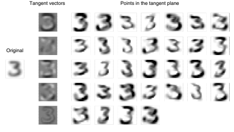

图 12.6。左：原始图像。中：分别对应于 5 个变换的 5 个切向量：缩放、旋转、在压缩 Y 轴的同时扩展 X 轴、在压缩第二对角线的同时扩展第一对角线和加粗。右：通过加或减去每个切向量生成的切空间中的 32 个点。

变换的尝试效果较差。我们使用了三个数据库来测试我们的算法：

美国邮政服务数据库：该数据库包含来自美国邮件信封的 16 × 16 像素大小标准化的手写数字图像。训练集和测试集分别有 9709 和 2007 个样本。NIST1 数据库：第二个实验是由国家标准与技术研究所（NIST）于 1992 年春季组织的比赛。比赛的目标是根据 223,000 个模式的训练集对 59,000 个手写数字的测试集进行分类。NIST2 数据库：第三个实验是在由 NIST 提供的训练和测试数据库（见上文）上进行的。NIST

将数据分为两个集合，但不幸的是它们的分布不同。训练集（223,000 个模式）比测试集（59,000 个模式）更简单。在实验中，我们将这两个集合以 50/50 的比例结合，形成了一个 60,000 个模式的训练集和各 10,000 个模式的测试/验证集，所有集合均具有相同特征。

对于这三个数据库，我们尝试评估人类表现以基准数据库的难度。对于 USPS，我们组的两名成员通过了测试集，并均获得了 2.5%的原始错误表现。NIST1 的人类表现由国家标准与技术研究所提供。NIST2 的人类表现是在数据库的小子样本上测量的，因此需要谨慎对待。

多个领先算法在这些数据库上进行了测试。

第一个实验使用了 K-近邻算法，采用普通的欧几里得距离。原型集由所有可用的训练样本组成。1-近邻规则在 USPS 中表现最佳，而 3-近邻规则在 NIST2 中表现更好。

第二个实验与第一个实验相似，但距离函数改为切线距离并进行了 7 次变换。对于 USPS 和 NIST2 数据库，原型集与之前构建相同，但对于 NIST1，则通过循环训练集构建。任何被误分类的模式都被添加到原型集中。经过几轮后，不再添加更多原型（训练误差为 0）。最终得到了 10,000 个原型。3-近邻规则在这个集合上表现最佳。

其他算法如神经网络 [18, 20]、最优边际分类器 [7]、

局部学习 [3] 和提升 [9] 也用于这些数据库。案例研究可以在 [20] 中找到。

表 12.1。结果：人类、K-近邻、切线距离、Lenet1（简单神经网络）、Lenet4（大型神经网络）、最优边际分类器（OMC）、局部学习（LL）和提升（Boost）各自的错误率表现（%）

| 人类   | K-NN   | 切线距离   | Lenet1   | Lenet4   | OMC   | LL   | 提升   |     |
| --- | --- | --- | --- | --- | --- | --- | --- | --- |
| USPS    | 2.5    | 5.7    | 2.5      | 4.2      | 4.3   | 3.3  | 2.6     |     |
| NIST1   | 1.6    | 3.2    | 3.7      | 4.1      |       |      |         |     |
| NIST2   | 0.2    | 2.4    | 1.1      | 1.7      | 1.1   | 1.1  | 1.1     | 0.7 |

结果总结在表 12.1 中。如表中所示，切线距离算法在所有测试的算法中在所有情况下（除了一个例外）都相当或超越了其他算法：在 NIST2 数据库上，Boosted LeNet 4 获胜。这并不令人惊讶。K 近邻算法（无预处理）与局部学习、最优边际分类器和提升相比，显得非常简单。切线距离的优势在于距离中嵌入的*先验*变换不变性知识。当训练数据足够大时，正如 NIST2 所示，这些知识可以被更复杂的算法从数据中获取。换句话说，*先验*知识的价值随着训练集规模的增加而减少。

## 12.2.3 如何使切线距离工作

本节专门讨论使切线距离能够与各种应用一起工作的技术“诀窍”。此类“技巧”通常由于各种原因未被公布（它们并不总是理论上合理，页面空间过于珍贵，技巧特定于某一特定应用，商业竞争考虑不鼓励告诉所有人如何重现结果等），但它们往往是使技术成功的决定性因素之一。这里将讨论其中的几种技术。

平滑输入空间：这是获得切线距离良好性能的最重要因素。根据定义，切线向量是变换函数 s(*P, α*)相对于α的李导数。它们可以写成：

$$L_{P}=\left.{\frac{\partial s(P,\alpha)}{\partial\alpha}}\right|=\operatorname*{lim}_{\epsilon\rightarrow0}{\frac{s(P,\epsilon)-s(P,0)}{\epsilon}}.$$

$$(12.15)$$

因此，s 相对于α必须是可微的（且表现良好）是非常重要的。特别地，从方程(12.15)可以清楚看出，s(P, )必须在任意小的情况下计算。幸运的是，即使 P 只能取离散值，仍然可以轻松使 s 可微。诀窍是使用平滑插值函数 Cσ作为 P 的预处理，使得 s(Cσ(P), α)在 Cσ(P)和α方面是可微的，而不是相对于 P。举例来说，如果 P 的输入空间是二值图像，Cσ(P)可以是 P 与标准偏差为σ的高斯函数的卷积。如果 s(Cσ(P), α)是平移α个像素，则可以很容易计算 s(Cσ(P), α)的导数，因为 s(Cσ(P), )。

可以通过平移高斯函数获得。该预处理将在 12.4 节中详细讨论。

平滑因子σ控制不变性的局部性。由 s 定义的变换曲线越平滑，线性近似有效的时间就越长。一般而言，最佳平滑是最大平滑，但不会模糊特征。例如，在 16x16 像素图像的手写字符识别中，标准偏差为 1 像素的高斯函数得到了最佳效果。增加平滑导致了混淆（例如，"5"被误认为"6"，因为下环已被平滑关闭）。

而减少平滑并未充分利用不变性特性。

如果可用的计算时间允许，最佳策略是先提取特征，毫不犹豫地平滑，然后在平滑特征上计算切线距离。

受控变形：方程 (12.8) 中给出的线性系统是奇异的，如果 E 或 P 的一些切向量是平行的。尽管在从实值连续分布中提取数据时，这种情况发生的概率为零（如手写字符识别中的情况），但模式可能在训练集和测试集中重复，导致除零错误。解决方法相当简单而优雅。方程 (12.8) 可以被替换为方程：

$$D(E,P)=\min_{\alpha_{E},\alpha_{P}}\|E+L_{E}\alpha_{E}-P-L_{P}\alpha_{P}\|^{2}+k\|L_{E}\alpha_{E}\|^{2}+k\|L_{P}\alpha_{P}\|^{2}.\tag{12.16}$$

此方程的物理解释如图 12.7 所示，点 E(αE)与弹簧常数为 k 的弹簧连接在切向平面 TE 上，并与弹簧常数为 1 的 P(αP)（在切向平面 TP 上）连接，P(αP)也通过弹簧常数为 k 与 P 相连。（所有三根弹簧

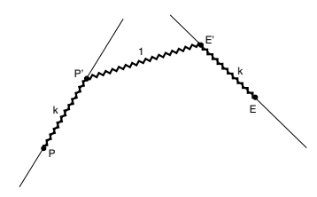

$\left(12.17\right)$  $\left(12.18\right)$ 。

图 12.7。E 和 P 之间的切向距离是连接 P、P、E 和 E 的三根弹簧储存的弹性能。P 和 E 可以在切向平面上无摩擦移动。弹簧常数在图中标出。

有零自然长度。）新的切向距离是所有三根弹簧在平衡时储存的总潜在弹性能。至于标准切向距离，解可以通过对方程 (12.16) 求导轻松获得。

关于αE 和αP。求导结果为：

$$\begin{array}{l}{{L_{P}^{\top}(E-P-L_{P}(1+k)\alpha_{P}+L_{E}\alpha_{E})=0}}\\ {{L_{E}^{\top}(E-P-L_{P}\alpha_{P}+L_{E}(1+k)\alpha_{E})=0.}}\end{array}$$

该系统的解是

$$(L_{PE}L_{EE}^{-1}L_{E}^{\top}-(1+k)L_{P}^{\top})(E-P)=(L_{PE}L_{EE}^{-1}L_{EP}-(1+k)^{2}L_{PP})\alpha_{P}\tag{12.19}$$ $$(L_{EP}L_{PP}^{-1}L_{P}^{\top}-(1+k)L_{E}^{\top})(E-P)=((1+k)^{2}L_{EE}-L_{EP}L_{PP}^{-1}L_{PE})\alpha_{E}\tag{12.20}$$

其中 LEE = LELE，LP E = LP LE，LEP = LELP，LP P = LP LP。该系统的复杂性与普通切向距离相同，唯一不同的是，它总是对 k ≥ 0 有解，并且数值稳定性更高。注意，对于 k = 0，它相当于标准切向距离，而对于 k = ∞，

我们有欧几里得距离。当切向量的数量大于或等于空间的维度时，这种方法也非常有用。标准的切向距离在切向空间相交时最有可能为零，但“弹簧”切向距离仍然表达了关于不变性的重要信息。

如果输入空间的维度与切向量的数量相比很大，保持 k 尽可能小是更好的，因为这不会干扰在切向平面上的“滑动”（E 和 P 的约束较少）。

与直觉相反，在高维空间中滑动得过远是没有危险的，因为切线向量总是大致正交，只有在它们平行时才可能滑动得过远。

距离层次：如果使用多个不变性，仅使用切线距离进行分类会非常昂贵。幸运的是，如果使用典型的基于记忆的算法，例如 K 最近邻，则完全没有必要计算未分类模式与所有标记样本之间的完整切线距离。特别是，如果粗略估计的切线距离以足够的置信度表明某个样本远离要分类的模式，则无需更多计算即可知道该样本不是 K 最近邻之一。基于这一观察，可以建立一个距离层次，极大地减少每次分类的计算。假设我们有 m 个切线距离的近似值 Di，按顺序排列，使得 D1 是切线距离的最粗略近似，而 Dm 则是准确的切线距离（例如，D1 到 D5 可能是具有递增分辨率的欧几里得距离，D6 到 D10 则每个都在全分辨率下添加一个切线向量）。

基本思想是保持一个包含所有原型的池，这些原型可能是未分类模式的 K 最近邻。最初，池中包含所有样本。每个距离 Di 对应于分类过程的一个阶段。分类算法在每个阶段有 3 个步骤，并从阶段 1 进行到阶段 m，或者直到分类完成：步骤 1：计算池中所有样本与未分类模式之间的距离 Di。

步骤 2：使用这些距离计算分类和置信度评分。

如果置信度足够好，假设好于 Ci（例如，如果池中剩下的所有样本都在同一类中），则分类完成；否则，继续进行步骤 3。步骤 3：根据距离 Di 保留 Ki 个最近的样本在池中，而丢弃剩余样本。

找到 Ki 个最近的样本可以在 O(p) 的时间内完成（其中 p 是池中样本的数量），因为这些元素不需要排序 [22, 2]。然后将缩减后的池传递到阶段 i + 1。

两个常数 Ci 和 Ki 必须使用验证集提前确定。这可以通过在每个阶段绘制 Ki 和 Ci 的误差作为函数的图形轻松完成（从所有 Ki 等于标记样本的数量和 Ci = 1 开始）。在每个阶段都有一个最小的 Ki 和最小的 Ci，它们能在验证集上提供最佳性能。通过取更大的值，我们可以减少在测试集上出错的概率。使用距离层次的略微较差的性能通常是值得的，因为它加快了速度。模式分类的计算成本等于：

$${\mathrm{计算~成本}}\approx\sum_{i}$$

$$(12.21)$$

| 数字数量   | 距离   | 概率   |
| --- | --- | --- |
| 原型      | 复杂度 | 达成      |
| ×           | ×          |               |
| 在阶段 i  | 在阶段 i | 阶段 i       |

所有这些通过图 12.8 中的示例更好地说明。该系统用于前面章节描述的 USPS 实验。在分类中

图 12.8. 使用距离层次进行模式识别。过滤器从左侧（从整个数据库开始）移动到右侧（仅剩少数原型）。在每个阶段，计算和排序原型与未知模式之间的距离；然后选择最佳候选原型进行下一阶段。随着距离复杂性的增加，原型数量减少，从而使计算变得可行。在每个阶段尝试分类并计算置信分数。如果置信分数足够高，则跳过剩余阶段。

手写数字（16x16 像素图像）的 D1、D2 和 D3，分别是在 2 × 2、4 × 4 和 8 × 8 分辨率下的欧几里得距离。D4 是在 8×8 分辨率下，样本侧唯一的切线距离，带有 X 平移。

D5 是在 16×16 分辨率下带有 X 平移的双侧切线距离。

后续的每个距离在每一侧添加了一个切线向量（Y 平移、缩放、旋转、双曲变形 1、双曲变形 2 和厚度），直到计算出完整的切线距离（D11）。

表 12.2 显示了各个阶段的预期乘加次数。

应注意，完整的切线距离仅需对 20 个未知模式中的 1 个（概率 0.05）进行计算，且只需从原始的 10,000 个样本中选取 5 个。与对每个未知模式和每个样本计算完整切线距离相比，净加速约为 500（这比以全分辨率计算欧几里得距离快 6 倍）。多次迭代：切线距离可以视为一种牛顿类型算法的单次迭代，该算法在真实变换流形上找到最小距离的点。向量 αE 和 αP 是各自切空间中两个最近点的坐标，但它们也可以被解释为真实（非线性）变换的值。换句话说，我们可以使用 αE 和 αP 计算点 s(E,αE) 和 s(*P, α*P )，即 E 和 P 的真实非线性变换。从这些新点，我们可以重新计算切线向量、切线距离并重新迭代该过程。如果满足适当条件，该过程可以收敛到 P 和 E 的两个变换流形之间的局部最小值。

这个过程没有改善手写字符识别，但在面部识别中产生了令人印象深刻的结果[29]。在这种情况下，每次迭代都是以更高的分辨率进行的（因此结合了分层距离和多次迭代），使整个过程在计算上更为高效。

表 12.2. 对 1 个模式的分类的汇总计算：第一列是距离索引，第二列表示切线向量的数量（欧几里得距离为 0），第三列表示以像素为单位的分辨率，第四列是 Ki 或必须计算的距离 Di 的原型数量，第五列表示为评估距离 Di 而必须计算的附加点积的数量，第六列表示在使用置信度评分后不跳过该阶段的概率，最后一列表示在每个阶段必须执行的总平均乘法加法数量（第 3 到 6 列的乘积）。

| i   | 电视数量   | 分辨率   | 原型数量 (Ki)   | 产品数量   | 概率   | 乘法/加法数量   |
| --- | --- | --- | --- | --- | --- | --- |
| 1   | 0           | 4      | 9709              | 1           | 1.00     | 40,000         |
| 2   | 0           | 16     | 3500              | 1           | 1.00     | 56,000         |
| 3   | 0           | 64     | 500               | 1           | 1.00     | 32,000         |
| 4   | 1           | 64     | 125               | 2           | 0.90     | 14,000         |
| 4   | 2           | 256    | 50                | 5           | 0.60     | 40,000         |
| 6   | 4           | 256    | 45                | 7           | 0.40     | 32,000         |
| 7   | 6           | 256    | 25                | 9           | 0.20     | 11,000         |
| 8   | 8           | 256    | 15                | 11          | 0.10     | 4,000          |
| 9   | 10          | 256    | 10                | 13          | 0.10     | 3,000          |
| 10  | 12          | 256    | 5                 | 15          | 0.05     | 1,000          |
| 11  | 14          | 256    | 5                 | 17          | 0.05     | 1,000          |

## 12.3 切线传播

前一节讨论了基于记忆的技术。我们现在将切线距离原则应用于学习函数技术。

关键思想是将不变性直接纳入学习到的分类函数。在本节中，我们提出了一种算法，称为“切线传播”，在该算法中，使用梯度下降来传播关于训练数据不变性的信息。这个过程是广泛使用的“反向传播”方法的推广，后者传播的是关于训练数据本身的信息。

我们再次假设所有数据独立地从给定的统计分布 P 中抽取，我们的学习机器由可以实现的函数集 Gw(x) 特征化，参数向量 w 索引。理想情况下，我们希望找到能够最小化能量函数 w

$${\mathcal{E}}=\int\|G_{w}(x)-F(x)\|^{2}d{\mathcal{P}}(x)$$

$$(12.22)$$

其中 F(x) 代表点 x 的“正确”或“期望”标签。在现实世界中，我们必须仅使用从分布 P 中抽取的有限训练点 B 来估计这个积分。也就是说，我们尝试最小化

$$E_{p}=\sum_{i=1}^{p}\|G_{w}(x_{i})-F(x_{i})\|$$

其中和在训练集 B 上进行。可以通过遵循使用权重更新规则的梯度下降来计算 w 的估计：

$$\Delta w=-\eta{\frac{\partial E_{p}}{\partial w}}.$$

让我们考虑一个由参数 α 控制的输入变换 s(*x, α*)。和往常一样，我们要求 s 是可微的，并且 s(x, 0) = x。现在，除了已知的训练数据标签外，我们假设 ∂F (s(xi,α))

对于训练集中的每个点 x，∂α 在 α = 0 时已知。为了将不变性属性纳入 Gw(x)，我们增加以下关于导数的约束：

$$E_{r}=\sum_{i=1}^{p}\left|\frac{\partial G_{w}(s(x_{i},\alpha))}{\partial\alpha}-\frac{\partial F(s(x_{i},\alpha))}{\partial\alpha}\right|_{\alpha=0}^{2}\tag{1}$$

$$(12.23)$$

$$(12.24)$$

$$(12.25)$$

应该在 α = 0 时很小。在许多模式分类问题中，我们对 F(x) 的局部分类不变性属性感兴趣，关于变换 s（当输入稍微变化时分类不变），因此我们可以将方程（12.25）简化为：

$$E_{r}=\sum_{i=1}^{p}\left|{\frac{\partial G_{w}(s(x_{i},\alpha))}{\partial\alpha}}\right|_{\alpha=0}^{2}$$

$$(12.27)$$

$$(12.26)$$

因为 ∂F (s(xi,α))

∂α = 0。为了最小化这个项，我们可以修改梯度下降规则，以使用能量函数

$$E=\eta E_{p}+\mu E_{r}$$

E = ηEp + μEr (12.27)

与权重更新规则：

$$\Delta w=-{\frac{\partial E}{\partial w}}.$$

学习率（或正则化参数）η和μ非常重要，因为它们决定了学习不变性之间的权衡

（基于所选择的方向导数）而不是直接学习标签本身（即

在训练集的每个点处的零阶导数。

分类函数的局部变化，出现在方程（12.26）中，可以写成：

在（12.26）中可以写为： $\left.\dfrac{\partial G_w(s(x,\alpha))}{\partial\alpha}\right|_{\alpha=0}=\left.\dfrac{\partial G_w(s(x,\alpha))}{\partial s(x,\alpha)}\dfrac{\partial s(x,\alpha)}{\partial\alpha}\right|_{\alpha=0}=\nabla_xG_w(x).$ $\left.\dfrac{\partial s(x,\alpha)}{\partial\alpha}\right|_{\alpha=0}=\left.\dfrac{\partial}{\partial\alpha}\right|_{\alpha=0}=0$ (12.29)

$$(12.28)$$

因为 s(*x, α*) = x 当 α = 0，且 ∇xGw(x) 是 Gw(x) 对模式 x 的雅可比矩阵，而 ∂s(α, x)/∂α 是与前一节所述变换 s 相关的 *切向量*。将切向量乘以雅可比矩阵涉及通过网络的“线性化”版本进行一次正向传播。如果 α 是多维的，则必须为每个切向量重复正向传播。

李代数的理论 [11] 确保了局部（小）组合的构成。

变换对应于相应切向量的线性组合（这一结果将在第 12.4 节进一步讨论）。因此，如果 Er(x)=0 得到验证，则网络在切向量的线性组合方向上的导数等于所需导数的相同线性组合。换句话说，如果网络成功训练为在水平平移和垂直平移方面局部不变，它将对这些变换的组合保持不变。

可以设计出一个高效的算法“切线传播”，用于执行权重更新（方程（12.28））。它类似于普通的反向传播，但除了传播神经元激活外，还传播切向量。这些方程可以很容易地从图 12.9 中推导出来。

图 12.9. 正向传播变量 (*a, x, γ, ξ*) 和反向传播变量 (*b, y, β, ψ*) 在常规网络（罗马符号）和雅可比（线性化）中。

网络（希腊符号）。收敛分叉（信号传播的方向）是求和，发散分叉则只复制值。

## 12.3.1 局部规则

正向传播方程为：

$$a_{i}^{l}=\sum_{j}w_{i j}^{l}x_{j}^{l-1}\qquad x_{i}^{l}=\sigma(a_{i}^{l})$$

其中 σ 是一个非线性可微函数（通常是 sigmoid）。正向传播从第一层（l = 1）开始，以 x0 为输入层，结束于输出层（l = L）。同样，切线正向传播（切线传播）由以下公式定义：

$$\gamma_{i}^{l}=\sum_{j}w_{i j}^{l}\xi_{j}^{l-1}\qquad\quad\xi_{i}^{l}=\sigma^{\prime}(a_{i}^{l})\gamma_{i}^{l}.$$

j

切线正向传播从第一层（l = 1）开始，以 ξ0 为切向量 ∂s(x,α)。

∂α，结束于输出层（l = L）。切线梯度反向传播可以使用链式法则计算：

$$\begin{array}{l l l}{{\partial E}}&{{}}&{{}}\\ {{\frac{\partial E}{\partial\xi_{i}^{l}}=\sum_{k}\frac{\partial E}{\partial\gamma_{k}^{l+1}}\frac{\partial\gamma_{k}^{l+1}}{\partial\xi_{i}^{l}}}}&{{}}&{{\frac{\partial E}{\partial\gamma_{i}^{l}}=\frac{\partial E}{\partial\xi_{i}^{l}}\frac{\partial\xi_{i}^{l}}{\partial\gamma_{i}^{l}}}}\\ {{}}&{{}}&{{}}\\ {{\beta_{i}^{l}=\sum_{k}\psi_{k}^{l+1}w_{k i}^{l+1}}}&{{}}&{{\psi_{i}^{l}=\beta_{i}^{l}\sigma^{\prime}(a_{i}^{l}).}}\end{array}$$

$$(12.30)$$

$$(12.31)$$

$$(12.33)$$

$$(12.32)$$

切线反向传播从输出层（l = L）开始，ξL

网络变化为∂Gw(s(x,α))

∂α，结束于输入层。类似地，梯度反向传播方程为：

∂al+1 k ∂xli ∂E ∂ali = ∂E ∂xli ∂xli ∂ali + ∂E ∂ξli ∂ξli ∂ali ∂E ∂xli = - k ∂E ∂al+1 k bli = - k yl+1 k wl+1 ki yli = bliσ(ali) + βiσ(ali)γli . (12.35)

$$(12.34)$$

标准反向传播从输出层（l = L）开始，xL = Gw(x0)为网络输出，并结束于输入层。最后，权重更新为：

$$\Delta w_{i j}^{l}=-\frac{\partial E}{\partial a_{i}^{l}}\frac{\partial a_{i}^{l}}{\partial w_{i j}^{l}}-\frac{\partial E}{\partial\gamma_{i}^{l}}\frac{\partial\gamma_{i}^{l}}{\partial w_{i j}^{l}}$$

$$(12.35)$$

$$(12.37)$$

$$(12.36)$$

$$\Delta w_{i j}^{l}=-y_{i}^{l}x_{j}^{l-1}-\psi_{i}^{l}\xi_{j}^{l-1}.$$

j . (12.37)

计算在训练期间每个样本和每个切线向量需要一次前向传播和一次后向传播。网络训练完成后，对于所选择的变换，它在局部上是近似不变的。训练后，学习到的函数的评估在各方面上与未针对不变性训练的网络相同（除了权重的值不同）。

图 12.10。切线传播和反向传播算法训练集大小与泛化性能曲线的关系

## 12.3.2 结果

两个实验说明了切线传播的优势。第一个实验是一个分类任务，使用 480 个手写数字的二进制图像的小（线性可分）集合。训练集包含 10、20、40、80、160 或 320 个样本，测试集包含 160 个样本。这些样本使用标准差为半个像素的高斯核进行平滑。对于每个训练集样本，计算水平和垂直平移的切线向量。网络有两个隐藏层，具有局部连接共享权重，以及一个包含 10 个单元的输出层（5194 个连接，1060 个自由参数）[19]。图 12.10 比较了传统反向传播和切线传播的泛化性能与训练集大小的关系。我们还进行了额外的实验，实现了不仅是平移，还有旋转、扩展和双曲变形。这组 6 个生成器是二维图像坐标所有线性变换的基础。实现其他生成器非常简单，包括灰度级偏移、“平滑”分割、本地连续坐标变换和独立图像段变换。

下一个实验旨在表明，在数据高度相关的应用中，切线传播提供了巨大的速度优势。由于失真模型意味着添加大量高度相关的数据，切线传播相对于失真模型的优势变得显而易见。

任务是逼近一个在三个位置有平台的函数。我们希望在每个训练点附近强制局部不变性（图 12.11，底部）。该网络有一个输入单元、20 个隐藏单元和一个输出单元。

图 12.11。失真模型（左列）与切线传播（右列）的比较。顶部行给出了学习曲线（误差与训练集遍历次数的关系）。底部行给出了网络的最终输入-输出函数；虚线是未修饰反向传播的结果。

有两种策略：要么生成一个小的训练点集，覆盖每个平台（图 12.11 底部的开放方块），要么为每个平台生成一个训练点（闭合方块），并在它们周围强制局部不变性（通过将所需导数设为 0）。前一种方法的训练集用作两种方法的性能衡量。所有参数都调整为在所有情况下接近最佳性能。两个模型的学习曲线如图 12.11（顶部）所示。切线传播每次通过训练集的速度稍快，因为仅需 6 次正向传播，而失真模型则需 9 次。可以看出，切线传播在 1300 次遍历后实现了稳定的性能，而失真模型则需 8000 次。因此，整体加速大约为 10。

此例中的切线传播可以利用一个非常大的正则化项。失真模型处于不利地位，因为唯一有效控制正则化量的参数是失真的幅度，而这不能增加到大值，因为正确答案仅在*小*失真的情况下不变。

## 12.3.3 如何使切线传播有效

大网络容量：切线传播的实验相对较少，但很明显，不变性约束可以极其有益。如果网络容量不足，则无法从不变性引入的额外知识中受益。

切线向量的交替：由于切线向量在训练集中引入了更多的相关性，通过交替常规的正向和反向传播与切线正向和反向传播可以获得显著的速度提升（即使有多个切线向量，在每个模式下只使用一个）。例如，如果有 3 个切线向量，则训练序列可以是：

$$x_{1},t_{1}(x_{1}),x_{2},t_{2}(x_{2}),x_{3},t_{3}(x_{3}),x_{4},t_{1}(x_{4}),x_{5},t_{2}(x_{5}),\ldots\tag{12.38}$$

其中 xi 表示模式 i 的正向和反向传播，以及 tj（xi）

代表模式 i 的切向量 j 的切线前向和后向传播。通过这样的交错，学习比将所有切向量聚集在一起收敛得更快。当然，这只有在在线更新而非批量更新时才有意义。

## 12.4 切向量

在本节中，我们考虑变换不变性和在前两节中使用的切向量的一般范例。

在我们介绍每个变换及其相应的切向量之前，简要解释一下背后的理论。这个问题有两个方面。首先，可以在输入空间的变换群（例如 2 的平移、旋转等）与该空间函数（例如将 2 映射到，可能代表图像的连续形式）之间建立正式联系。李群和李代数的理论[6]使我们能够做到这一点。第二个问题与编码有关。计算机图像是有限的离散变量向量。如何将为可微函数开发的理论应用于这些向量？我们首先简要说明适用于模式识别的李群和李代数定理。接下来，我们探索编码问题的解决方案。最后，针对特定应用给出一些变换和编码的例子。

## 12.4.1 李群与李代数

考虑一个输入空间 I（例如平面 2）和一个可微函数 f，它将 I 的点映射到。

$$f:X\in I\longmapsto f(X)\in{\mathfrak{R}}.$$

$\left(12.39\right)^{\frac{1}{2}}$

f : X ∈ I −→ f(X) ∈ . (12.39)

函数 f(X) = f(*x, y*)可以被解释为离散计算机图像 P[*i, j*]的连续（在 2 的所有点上定义的）等价物。

接下来，考虑一系列由α参数化的变换 tα，它将输入空间 I 中的点双射地映射到 I 中的点。

$$t_{\alpha}:X\in{\mathcal{I}}\longmapsto t_{\alpha}(X)\in{\mathcal{I}}.$$

$$(12.40)$$

我们假设 tα相对于α和 X 是可微的，并且 t0 是单位元。例如，tα可以是 2 的仿射变换群：

$$t_{\alpha}:\left(\begin{matrix}x\\ y\end{matrix}\right)\longmapsto\left(\begin{matrix}x+\alpha_{1}x+\alpha_{2}y+\alpha_{5}\\ \alpha_{3}x+y+\alpha_{4}y+\alpha_{6}\end{matrix}\right)\quad\text{且}\quad\left|\begin{matrix}1+\alpha_{1}&\alpha_{2}\\ \alpha_{3}&1+\alpha_{4}\end{matrix}\right|\neq0.\tag{12.41}$$

这是一个具有 6 个参数的李群。另一个例子是直接等距群：

$$t_{\alpha}:{\binom{x}{y}}\longmapsto{\binom{x\cos\theta-y\sin\theta+a}{x\sin\theta+y\cos\theta+b}}$$

$$(12.42)$$

这是一个具有 3 个参数的李群。

我们现在考虑由以下定义的函数 s(f,α)：

$$s(f,\alpha)=f\circ t_{\alpha}^{-1}.$$

α . (12.43)

这个函数 s，以另一个函数 f 作为参数，应该让读者想起图 12.2，其中 P 是 f 的离散等价物，是 s 的参数。

与 tα 对 f 的作用相关的李代数是由 f 的 m 个局部变换 Lαi 生成的空间，定义为：

$$(12.43)$$

$$L_{a_{i}}(f)=\left.\frac{\partial s(f,\alpha)}{\partial\alpha_{i}}\right|_{\alpha=0}.$$

$$(12.44)$$

$$(12.47)$$

现在我们可以写出 s 的局部近似为：

s(f,α) = f + α1Lα1 (f) + α2Lα2 (f) + ··· + αmLαm(f) + o(α2)(f)。 (12.45)

这个方程是引言中使用的方程 (12.2) 的连续等价物。

以下例子说明如何从 tα 计算 Lαi。让我们考虑方程 (12.42) 中定义的直接等距群（参数 α = (*θ, a, b*），与之前相同，X = (*x, y*)）。

$$((x-6))$$

s(f,α)(X) = f((x−a) cos θ + (y −b) sin θ, −(x−a) sin θ + (y −b) cos θ)。 (12.46)

如果我们在 α = (0, 0, 0) 附近对 θ 进行微分，我们得到

$${\frac{\partial s(f,\alpha)}{\partial\theta}}(X)=y{\frac{\partial f}{\partial x}}(x,y)+(-x){\frac{\partial f}{\partial y}}(x,y)$$

∂y (*x, y*) (12.47)

4 李群是一个也是可微流形的群，且可微结构与群结构兼容。

也就是说

$$L_{\theta}=y{\frac{\partial}{\partial x}}+(-x){\frac{\partial}{\partial y}}.$$

$$(12.48)$$

变换 La = − ∂∂x 和 Lb = − ∂∂y 可以以类似的方式获得。群的所有局部变换可以写成

在。一个群的局部变换可以写成 $$s(f,\alpha)=f+\theta(y\frac{\partial f}{\partial x}+(-x)\frac{\partial f}{\partial y})-a\frac{\partial f}{\partial x}-b\frac{\partial f}{\partial y}+o(\|\alpha\|^{2})(f)\tag{12.49}$$  $\alpha$ 是一个常数，$\alpha$ 是一个常数，$\alpha$ 是一个常数。

这对应于 3 个基本算子 Lθ、La 和 Lb 的线性组合。对我们来说最重要的特性是这 3 个算子生成了局部变换的整个空间。将算子应用于一个函数 f 的结果，例如一个 2D 图像，是我们在前几节中所称的“切向量”的集合。切空间中的每个点对应于一个唯一的变换，反之，李群的任何变换（在这个例子中是任意角度和中心的所有旋转以及所有平移）对应于切平面中的一个点。

## 12.4.2 切向量

最后一个需要解决的问题是编码问题。例如，计算机图像被编码为有限的一组离散（甚至是二进制）值。

这些几乎不是我们在上一小节假设的从 I 到 的可微映射。

为了解决这个问题，我们引入一个光滑的插值函数 C，它将离散向量映射到 I 的连续映射。例如，如果 P

是一个 n 像素的图像，它可以通过与标准差为 σ 的二维高斯函数 gσ 进行卷积，映射为一个连续值的函数 f。这是因为 gσ 是从 2 到 的可微映射，而 P

可以被解释为脉冲函数的和。在二维情况下，我们可以将 P 的新解释写为：

$$P^{\prime}(x,y)=\sum_{i,j}P[i][j]\delta(x-i)\delta(y-j)$$

$$(12.50)$$

其中 P[i][j] 表示计算机中存储的离散值的有限向量。卷积的结果当然是可微的，因为它是高斯函数的和。高斯映射由以下给出：

$$C_{\sigma}:P\longmapsto f=P^{\prime}*g_{\sigma}.$$

Cσ : P −→ f = P ∗ gσ. (12.51)

在二维情况下，函数 f 可以写为：

在这种情况下，函数 ƒ 可以写为： $ f(x,y)=\sum_{i,j}P[i][j]g_\sigma(x-i,y-j)$。

$$(12.51)$$

$$(12.52)$$

这些算子被称为生成一个李代数，因为在加法和标量乘法之上，还有一种称为“李括号”的特殊乘法，定义为 [L1, L2] = L1 ◦L2 − L2 ◦L1。在上面的例子中，我们有 [Lθ, La] = Lb，

[La, Lb]=0，且 [Lb, Lθ] = La。

图 12.12。图形示例展示了从二值图像 I 计算 f 和两个切向量的过程，分别对应于 Lx = *∂/∂x*（X 方向平移）和 Lx = *∂/∂y*（Y 方向平移）。高斯函数 *g(x, y)* = exp(−x²+y² 2σ²) 在这个例子中标准差 σ = 0.9，尽管它的图形表示（右侧的小图像）

已经为了清晰度进行了重新缩放。

还可以使用其他编码函数 C，例如立方样条或双线性插值。像素之间的双线性插值产生的函数 f 在几乎所有地方都是可微的。由于导数在整数位置有两个值（因为双线性插值在每个像素的两侧不同），在实践中这并不是问题——只需选择两个值中的一个即可。

高斯映射被优先选择有两个原因：首先，平滑参数 σ 可用于控制不变性的局部性。这是因为当 f 更平滑时，方程 (12.45) 的局部近似在更大变换下有效。其次，当与变换算子 L 结合时，导数可以在高斯函数的封闭形式上应用。

例如，如果将 X 平移算子 L = ∂/∂x 应用于 f = P ∗ gσ，则实际计算变为：

$$L_{X}(f)=\frac{\partial}{\partial x}(P^{\prime}*g_{\sigma})=P^{\prime}*\frac{\partial g_{\sigma}}{\partial x}.\tag{12.53}$$

由于当支撑是紧致时卷积的微分性质。这可以通过将原始图像与高斯函数 gσ 的 X 导数进行卷积来轻松实现。此操作在图 12.12 中有所示例。类似地，缩放的切向量可以通过计算得出。

$$L_{S}(f)=\left(x\frac{\partial}{\partial x}+y\frac{\partial}{\partial y}\right)(I*g_{\sigma})=x(I*\frac{\partial g_{\sigma}}{\partial x})+y(I*\frac{\partial g_{\sigma}}{\partial y}).\tag{12.54}$$

此操作在图 12.13 中进行了说明。

图 12.13。切向量 Tu = DxSx+ 的计算图示

DySy（底部图像）。在这个例子中，每个像素的位移与该像素到图像中心的距离成正比（Dx(*x, y*) = x−x0 和 Dy(*x, y*) =

y −y0）。这两次乘法（横线）以及加法（垂直右列）是逐像素完成的。

## 12.4.3 图像处理中的重要变换

本节总结了如何计算图像处理（在二维中）的切向量。每个离散图像 Ii 与标准差为 gσ 的高斯进行卷积，以根据公式获得连续图像 fi 的表示：

fi = Ii ∗ gσ. (12.55)

结果图像 fi 将用于所有需要 Ii 的计算（除计算切向量外）。对于每个图像 Ii，切向量通过将相应于感兴趣变换的算子应用于表达式 Ii ∗ gσ 来计算。结果可以预计算，是一个切向量图像。以下列表包含一些最有用的切向量：X-平移：当分类函数已知对输入变换不变时，此变换非常有用：

$$f_{i}=I_{i}*g_{\sigma}.$$

$$t_{\alpha}:{\binom{x}{y}}\longmapsto{\binom{x+\alpha}{y}}\,.$$

$\left(12.55\right)$ 。

$$(12.56)$$

. (12.56)

Lie 算子定义为：

$$L_{X}={\frac{\partial}{\partial x}}.$$

$$(12.57)$$

LX = ∂∂x. (12.57)

Y-平移：当分类函数已知对输入变换不变时，此变换非常有用：

$$t_{\alpha}:{\binom{x}{y}}\longmapsto{\binom{x}{y+\alpha}}\,.$$

. (12.58)

Lie 算子定义为：

$$(12.58)$$

$$L_{Y}={\frac{\partial}{\partial y}}.$$

$$(12.59)$$

$$(12.60)$$

LY = ∂∂y . (12.59)

旋转：当分类函数已知对输入变换不变时，此变换非常有用：

$$t_{\alpha}:{\binom{x}{y}}\longmapsto{\binom{x\cos\alpha-y\sin\alpha}{x\sin\alpha+y\cos\alpha}}\,.$$

. (12.60)

Lie 算子定义为：

$$L_{R}=y{\frac{\partial}{\partial x}}+(-x){\frac{\partial}{\partial y}}.$$

$$(12.61)$$

缩放：当分类函数已知对输入变换不变时，此变换非常有用：

$$t_{\alpha}:{\binom{x}{y}}\longmapsto{\binom{x+\alpha x}{y+\alpha y}}.$$

y + αy . (12.62)

Lie 算子定义为：

$$(12.62)$$

$$L_{S}=x{\frac{\partial}{\partial x}}+y{\frac{\partial}{\partial y}}.$$

$$(12.63)$$

∂y . (12.63)

平行双曲变换：当分类函数已知对输入变换不变时，这种变换非常有用：

$$t_{\alpha}:{\binom{x}{y}}\longmapsto{\binom{x+\alpha x}{y-\alpha y}}.$$

y − αy . (12.64)

李算子定义为：

$$(12.64)$$

$$L_{S}=x{\frac{\partial}{\partial x}}-y{\frac{\partial}{\partial y}}.$$

$$(12.65)$$

∂y . (12.65)

对角双曲变换：当分类函数已知对输入变换不变时，这种变换非常有用：

$$t_{\alpha}:\left(\begin{matrix}x\\ y\end{matrix}\right)\longmapsto\left(\begin{matrix}x+\alpha y\\ y+\alpha x\end{matrix}\right).\tag{12.66}$$

李算子定义为：

$L_{S}=y\frac{\partial}{\partial x}+x\frac{\partial}{\partial y}$. (12.67)

结果切向量是图像的梯度的范数，这个计算非常简单。

加厚：当分类函数已知对厚度变化不变时，这种变换非常有用。在形态学中，这被称为膨胀及其逆过程，腐蚀。在某些领域（如手写字符识别）非常有用，因为加厚和减薄是自然变化，对应于施加在笔上的压力，或墨水在纸上的不同吸收特性。膨胀（或腐蚀）可以定义为替换每个值 f(x,y) 的操作。

通过在以 (*x, y*) 为中心的某种形状的邻域内找到 f(x, y) 的最大（或最小）值。这个区域称为结构元素。我们将假设结构元素是半径为 α 的球体。我们将加厚变换定义为将函数 f 转换为函数 fα 的函数，其定义为：

$$f_{\alpha}^{\prime}(X)=\operatorname*{max}_{\|r\|\leq\alpha}f(X+r)\quad{\mathrm{for~}}\alpha\geq0$$

$$(12.68)$$

$$(12.69)$$

$$f_{\alpha}^{\prime}(X)=\operatorname*{min}_{\|r\|\leq-\alpha}f(X+r)\quad{\mathrm{for~}}\alpha\leq0.$$

$$(12.70)$$

当 α ≥ 0 时，加厚的导数可以写为：

$$\operatorname*{lim}_{\alpha\longrightarrow0}{\frac{f^{\prime}(X)-f(X)}{\alpha}}=\operatorname*{lim}_{\alpha\longrightarrow0}{\frac{\operatorname*{max}_{\|r\|\leq\alpha}f(X+r)-f(X)}{\alpha}}.$$

α . (12.70)

f(X) 可以放入最大值表达式中，因为它不依赖于 r。由于 α 趋向于 0，我们可以写：

$$f(X+r)-f(X)=r\cdot\nabla f(X)+O(\|r\|^{2})\approx r\cdot\nabla f(X).$$

最大值为

$$\operatorname*{max}_{\|r\|\leq\alpha}f(X+r)-f(X)=\operatorname*{max}_{\|r\|\leq\alpha}r\cdot\nabla f(X)$$

r · ∇f(X) (12.72)

当 r 和 ∇f(X) 处于共线时，即当

$$(12.71)$$

$$(12.72)$$

$$r=\alpha{\frac{\nabla f(X)}{\|\nabla f(X)\|}}$$

$$(12.73)$$

∇f(X) (12.73)

假设 α ≥ 0。可以很容易地证明，当 α 为负时该方程仍然成立，因为我们试图最小化方程 (12.69)。因此，我们有：

$$\operatorname*{lim}_{\alpha\longrightarrow0}{\frac{f_{\alpha}^{\prime}(X)-f(X)}{\alpha}}=\|\nabla f(X)\|$$

这是我们关注的切向量。请注意，对于 α 无论是正还是负，这都是成立的。相同的切向量描述了加厚和变薄。或者，我们可以利用对位移 r 的计算，并定义输入的以下变换：

$$(12.74)$$

$$t_{\alpha}(f):{\binom{x}{y}}\longmapsto{\binom{x+\alpha r_{x}}{y+\alpha r_{y}}}$$

$$(12.75)$$

其中

$$(r_{x},r_{y})=r=\alpha{\frac{\nabla f(X)}{\|\nabla f(X)\|}}.$$

. (12.76)

输入空间的这种变换对每个模式 f 都不同（我们没有一个变换的李群，但由（伪李）算子生成的场结构仍然是有用的。用于寻找切向量的算子定义为：

$$(12.76)$$

$$L_{T}=\|\nabla\|$$

$$(12.77)$$

LT = ∇ (12.77)

图 12.14. 5 个切向量的示意图（顶部），以及对应的位移

（中部）和变换效果（底部）。位移 Dx 和 Dy 以向量场的形式表示。可以注意到，厚度变形的切向量（右列）对应于灰度图像的梯度的范数。

这意味着切向量图像是通过在每个点计算图像的归一化灰度梯度获得的（每个点的梯度都是归一化的）。

最后 5 个变换在图 12.14 中与切向量一起展示。

最后的算子对应于图像的加厚或变薄。这种不寻常的变换在手写字符识别中非常有用。

## 12.5 结论

基本的切线距离算法相当容易理解和实现。

尽管几乎不需要任何预处理或学习，但性能令人惊讶地好，且与最佳竞争算法相比表现良好。我们认为，这一成功的主要原因在于其将 *a priori* 知识纳入距离测量的能力。在三个数据库中，唯一比切线距离表现更好的算法是提升算法，该算法内置了类似的 *a priori* 变换知识。

当然，许多改进是可能的。例如，智能预处理可以让我们在更合适的“特征”空间中测量切线距离，而不是在原始像素空间中。在图像分类中，例如，特征可以是水平和垂直边缘。这很可能进一步提高性能。唯一的要求是预处理必须是可微的，以便切向量可以计算（传播）到特征空间中。

修改更复杂的算法，例如 LVQ 也很简单。

（学习向量量化）使用切向距离。在这种情况下，即使是切向量也可以进行训练。已为切向量的批量训练[13]和在线训练[23]完成了推导。当进行这种训练时，*先验*知识来自对切向量施加的其他约束（例如，允许多少个切向量，它们表示哪些变换类别等）。

最后，许多在基于距离的算法中常用的优化也可以同样成功地用于切向距离，以加快计算速度。多分辨率方法已经成功尝试过[25]。其他方法如“多编辑凝缩”[1, 30]和 K-d 树[4]也是可行的。

切向距离的主要优势在于它是对标准距离度量的修改，允许其纳入特定于手头问题的*先验*知识。任何基于通用距离度量的算法（在分类、向量量化、预测等情况下通常如此）都可能受益于更具问题特异性的距离。这些“基于距离”的算法中的许多不需要任何学习，这意味着它们可以通过仅在数据库中添加新模式来立即适应。这些添加得益于放入切向距离的*先验*知识。

如果特征空间非常复杂，计算特征空间中的切向量可能会产生额外的成本。

切向距离的两个缺点是其内存和计算需求。计算和内存效率最高的算法通常涉及学习[20]。幸运的是，切向量的概念也可以用于学习。这是切向传播算法的基础。这个概念相当简单：与其从其值的示例中学习分类函数，不如使用其导数的信息。这些信息由切向量提供。不幸的是，在这个方向上进行的实验不多。切向传播的两个主要问题是学习机器的容量必须调整以纳入与切向量相关的附加信息，且训练时间必须增加。训练后，分类时间和复杂性保持不变，但分类器的性能得到了提高。

初步估计，使用切线距离或切线传播就像拥有一个更大的数据库。如果数据库一开始就很大，切线距离或切线传播并不会提高性能。更好的估计是，切线向量就像使用失真模型来放大训练集的大小。在许多情况下，使用切线向量比收集（和标记！）大量训练数据更可取，尤其对于基于记忆的分类器来说，也比处理失真模型生成的所有数据更可取。切线向量提供了一种紧凑而强大的表示，能够轻松整合到最流行的算法中，*先验*知识。

致谢。P.S.和 Y.L.衷心感谢 NSF 资助号 INT9726745。

[1] Devijver, P.A.，Kittler, J.：模式识别，统计方法。普伦蒂斯霍尔，恩格尔伍德悬崖（1982 年）

[2] Aho, A.V.，Hopcroft, J.E.，Ullman, J.D.：数据结构与算法。阿迪森-韦斯利（1983 年）

[3] Bottou, L.，Vapnik, V.N.：局部学习算法。《神经计算》4(6)，

888–900（1992 年）

[4] Broder, A.J.：高效增量最近邻搜索策略。《模式识别》23，171–178（1990 年）

[5] Broomhead, D.S.，Lowe, D.：多变量函数插值和自适应网络。《复杂系统》2，321–355（1988 年）

[6] Choquet-Bruhat, Y.，DeWitt-Morette, C.，Dillard-Bleick, M.：分析、流形与物理学。北荷兰出版社，阿姆斯特丹（1982 年）

[7] Cortes, C.，Vapnik, V.：支持向量网络。《机器学习》20，273–297

（1995 年）

[8] Dasarathy, B.V.：最近邻（NN）规范：NN 模式分类技术。IEEE 计算机学会出版社，洛斯阿拉米托斯（1991 年）

[9] Drucker, H.，Schapire, R.，Simard, P.Y.：神经网络性能提升。

《国际模式识别与人工智能杂志》7(4)，705–719（1993 年）

[10] Fukunaga, K.，Flick, T.E.：最佳全局最近邻度量。《IEEE 模式分析与机器智能交易》6(3)，314–318（1984 年）

[11] Gilmore, R.：李群、李代数及其一些应用。威立出版社，纽约（1974 年）

[12] Hastie, T.，Kishon, E.，Clark, M.，Fan, J.：签名验证模型。

技术报告 11214-910715-07TM，AT&T 贝尔实验室（1991 年 7 月）

[13] Hastie, T.，Simard, P.Y.：手写字符识别的度量和模型。《统计科学》13（1998 年）

[14] Hastie, T.J.，Tibshirani, R.J.：广义线性模型。查普曼与霍尔，伦敦（1990 年）

[15] Hinton, G.E.，Williams, C.K.I.，Revow, M.D.：手写字符识别的自适应弹性模型。见：神经信息处理系统进展，页 512–519。摩根·考夫曼出版社（1992 年）

[16] Hoerl, A.E.，Kennard, R.W.：岭回归：非正交问题的偏差估计。《技术统计》12，55–67（1970 年）

[17] Kohonen, T.: 自组织与联想记忆。信息科学系列，卷 8。Springer (1984)

[18] Le Cun, Y., Boser, B., Denker, J.S., Henderson, D., Howard, R.E., Hubbard, W.,

Jackel, L.D.: 使用反向传播网络进行手写数字识别。在：Touretzky, D. (编) 神经信息处理系统进展，卷 2，Morgan Kaufmann，丹佛 (1989)

[19] LeCun, Y.: 泛化和网络设计策略。在：Pfeifer, R., Schreter, Z., Fogelman, F., Steels, L. (编) 连接主义的视角，瑞士苏黎世 (1989)；Elsevier，扩展版作为多伦多大学的技术报告发布

[20] LeCun, Y., Jackel, L.D., Bottou, L., Cortes, C., Denker, J.S., Drucker, H., Guyon, I., Muller, U.A., Sackinger, E., Simard, P., Vapnik, V.: 分类的学习算法：关于手写数字识别的比较。在：Oh, J.H., Kwon, C., Cho, S. (编) 神经网络：统计力学视角，第

261–276。世界科学出版社 (1995)

[21] Parzen, E.: 概率密度函数和模式的估计。数学年鉴。

Stat. 33, 1065–1076 (1962)

[22] Press, W.H., Flannery, B.P., Teukolsky, S.A., Vetterling, W.T.: 数值食谱。

剑桥大学出版社，剑桥 (1988)

[23] Schwenk, H.: diabolo 分类器。神经计算 (1998)（待出版）

[24] Sibson, R.: 多维标度稳健性研究：Procrustes 统计。J. R. Statist. Soc. 40, 234–238 (1978)

[25] Simard, P.Y.: 使用层次过滤有效计算复杂距离度量。在：神经信息处理系统进展。Morgan Kaufmann Publishers (1994)

[26] Sinden, F., Wilfong, G.: 在线手写符号识别。技术报告 11228-910930-02IM，AT&T 贝尔实验室（1992 年 6 月）

[27] Vapnik, V.N.: 基于经验数据的依赖性估计。Springer (1982)

[28] Vapnik, V.N., Chervonenkis, A.Y.: 事件相对频率均匀收敛于其概率的研究。概率理论及其应用 17(2),

264–280 (1971)

[29] Vasconcelos, N., Lippman, A.: 用于仿射不变分类的多分辨率切线距离。在：神经信息处理系统进展，卷 10，第 843–849 页。Morgan Kaufmann Publishers (1998)

[30] Voisin, J., Devijver, P.: 多编辑凝聚技术在打印识别系统中的参考选择问题的应用。模式识别 20(5), 465–474 (1987)

# 13 将神经网络与上下文驱动搜索相结合，用于在线打印手写识别在牛顿-

Larry S. Yaeger1, Brandyn J. Webb2, 和 Richard F. Lyon3 1 苹果公司 5540 Bittersweet Rd. Beanblossom, IN 46160 2 未来公司 4578 Fieldgate Rd. Oceanside, CA 92056 3 Foveonics, Inc. 10131-B Bubb Rd. Cupertino, CA 95014 larryy@pobox.com http://www.beanblossom.in.us/larryy/

摘要：虽然在线手写识别是一个长期存在且持续研究的领域，但便携式笔记本电脑的近期出现使得对可用、实用解决方案的关注变得紧迫。我们讨论了一种经典方法的组合与改进，以实现对手写英文文本的稳健识别，适用于即将发布的新款苹果计算机的 Newton MessagePadRand eMateR。结合人工神经网络

（ANN），作为字符分类器，通过对分割和单词识别假设进行上下文驱动的搜索，提供了一种有效的识别系统。然而，相对于训练、泛化、分割、上下文模型、概率形式等的长期问题，需要解决，以获得卓越的性能。我们介绍了一些近期在应用 ANN 作为单词识别字符分类器方面的创新，包括集成多种表示、标准化输出误差、负训练、笔画扭曲、频率平衡、误差强调和量化权重。用户适应和扩展到草书识别仍然是持续的挑战。

## 13.1 引言

基于笔的手持电脑在很大程度上依赖于快速且准确的手写识别，因为笔是输入数据到这些设备的主要手段。一些早期的手写识别尝试利用强大且有限的语言模型来最大化准确性。然而，这种方法在现实应用中被证明是不可接受的，产生了令人不安且似乎随机的单词替代现象——在苹果和 Newton 内部被称为“杜恩斯伯里效应”，因加里·特鲁多对第一代 Newton 识别性能的讽刺描述。然而，Newton 中的原始手写识别技术，以及当前大大改进的

- 先前发表于：Orr, G.B. 和 Müller, K.-R.（编）：LNCS 1524，ISBN

978-3-540-65311-0 (1998)。

G. Montavon 等（编）：NN：行业诀窍，第 2 版，LNCS 7700，第 271-293 页，2012。

-c Springer-Verlag Berlin Heidelberg 2012

“草书识别器”技术，这两者均已从 ParaGraph International, Inc.获得许可，但并非本文讨论的主题。

在苹果的先进技术组（又名苹果研究实验室），我们采用了不同的方法，使用基于可训练人工神经网络（ANN）的自下而上的分类技术，结合全面但应用较弱的语言模型。为了将我们的工作集中在一个可行的子问题上，以便在合理的时间内产生可用的产品，我们最初将领域限制在手写打印，从而使笔画通过笔抬起清晰划分。通过同时提供准确的字符级识别、具有广泛语言覆盖的字典，以及完全超出这些字典的书写能力，我们生产了一种被称为“首个可用”的手写识别系统的手写打印识别器。ANN 字符分类器需要一些创新的训练技术来有效地完成其任务。字典需要大量的单词列表、一个正则表达式语法（以描述日期、时间、电话号码等特殊结构），以及将所有这些字典结合成一个全面的语言模型的方法。并且需要为字典内和字典外书写确定平衡的先验概率。结合最大似然搜索引擎，这些元素构成了所谓的“打印识别器”的基础，该识别器于 1995 年 12 月首次在 Newton OS 2.0 基础的 MessagePad 120 设备中发布，并在所有后续的 Newton 设备中使用。在 MessagePad 2000 和 2100 中，尽管保留了“打印识别器”的标签，但它已经扩展以处理连接字符（以及完整的西欧字符集）。

在结合低级分类器与动态时间扭曲、隐马尔可夫模型、维特比算法及其他搜索策略以提供集成的书写[15]和语音分割与识别方面，有大量的前期工作。

[11]。使用人工神经网络（ANN）作为分类器的背景非常丰富，包括它们作为高级单词识别系统中的低级字符分类器的应用[2]。但是这些方法仍然存在许多未解的问题，关于如何达到可接受的（对真实用户）性能水平。在本文中，我们回顾了探索这些技术的改进与完善的一些经验。

## 13.2 系统概述

苹果的打印识别器（APR）由三个概念阶段组成——暂定分割、分类和上下文驱动搜索——如图 13.1 所示。我们操作的主要数据是简单的(x,y)序列。

坐标对，加上笔抬起/放下的信息，从而定义了笔画原语。

分割阶段决定将哪些笔画组合以生成*片段*——这些将被视为可能字符的笔画暂定分组，并生成这些片段的序列以及它们之间的合法转换。此过程构建了一个隐式图，然后在分类阶段进行标记，并在搜索阶段进行最大似然解释。分类阶段使用 ANN 分类器评估每个片段，并生成作为字母类别概率的输出激活向量。搜索阶段随后使用这些类别概率以及词汇和几何上下文模型，找到 N 个最可能的单词或句子假设。

图 13.1 我们手写识别器的简化框图

## 13.3 暂定分割

字符分割——决定哪些笔画组成哪些字符的过程——本质上是模糊的。最终必须做出这个决定，但除了用方框写，无法做到这一点（任何准确性）。

预先，在识别过程之外。因此，APR 的初始分割阶段产生多个暂定的笔画分组，并推迟最终的分割决定，直到搜索阶段，从而将这些分割决定与整体识别过程整合。

APR 使用潜在的详尽、顺序枚举笔画组合，以生成一系列可行的字符分割假设。这些片段受到一些明显的约束（例如“所有笔画必须使用”和“没有笔画可以重复使用”），以及一些不那么明显的过滤器（以排除“不可行”的分割以提高效率）。生成的算法产生将作为可能字符处理的实际片段，以及这些片段之间的合法转换。

合法的转换由*前向*和*反向延迟*定义。前向延迟表示序列中下一个可能的片段（尽管后来的片段也可能是合法的），指向与当前片段共享尾部笔画的最后一个片段之后。反向延迟表示当前片段组的起始点，所有这些片段共享相同的前导笔画。由于枚举方案，片段的反向延迟与其笔画数减一相同，除非前面的片段（共享相同的前导笔画）被之前提到的过滤器消除。这两个简单的延迟参数

（每个片段）足以定义一个所有合法片段转换的隐式图。为了使从片段编号 i 到片段编号 j 的转换合法，片段 i 的前向延迟与片段 j 的反向延迟之和必须等于 j - i。图 13.2 提供了一些模糊墨迹及其笔画可能生成的片段的示例，支持“狗”、“堵塞”、“cbg”或甚至“%g”的解释。

| 段落     | 笔画     | 正向 反向       |       |       |       |
| --- | --- | --- | --- | --- | --- |
| 墨水      | 数量    | 段落             | 计数 | 延迟 | 延迟 |
| 1         | 1        | 3                 | 0     |       |       |
| 2         | 2        | 4                 | 1     |       |       |
| 3         | 3        | 4                 | 2     |       |       |
| 4         | 1        | 2                 | 0     |       |       |
| 5         | 2        | 2                 | 1     |       |       |
| 6         | 1        | 1                 | 0     |       |       |
| 7         | 1        | 0                 | 0     |       |       |

图 13.2. 笔画分段为临时字符或段落

## 13.4 字符分类

分段阶段的输出是一串段落，随后将其传递给人工神经网络（ANN）进行字符分类。除了下面详细描述的架构和训练细节之外，一个经过错误反向传播（BP）训练的相当标准的多层感知器提供了 APR 核心的 ANN 字符分类器。已有大量先前研究表明，ANN 技术作为分类器的通用适用性，能够为每个类别在给定输入下提供良好的后验概率估计（[5, 12, 11]及本文引用的其他文献）。已有强有力的论据指出，在概率识别公式中，提供后验概率的 ANN 应该优于其他识别方法[8]，而且 ANN 在语音识别系统中表现良好[10]。

## 13.4.1 表示

在 ANN 研究中，一个反复出现的主题是输入网络的数据表示的重要性。我们实验了多种输入表示，包括抗锯齿的笔画特征（灰度）和非抗锯齿的（二进制），以及抗锯齿的和非抗锯齿的图像，并尝试了各种在图像输入窗口内定位和缩放墨水的方案。

在每种情况下，抗锯齿都是一个显著的优势。这与其他研究的发现一致，即当提供平滑变化的分布式输入时，人工神经网络的表现优于提供二元化、局部化输入时。几乎最简单的图像表示方式，即不保留纵横比的扩展填充窗口图像（仅受最大缩放因子的限制，以避免将点放大到全窗口大小），结合一个单元或温度计编码（按顺序开启的若干单元以表示更大的值）作为纵横比，证明是最有效的单分类器解决方案。然而，最佳的整体分类器准确率最终是通过将多个不同的表示组合成几乎独立的并行分类器，并在最终输出层连接而获得的。因此，表示证明不仅与架构同样重要，而且最终有助于定义我们网络的架构。对于我们最终的手动优化系统，我们使用四个不同的输入，如图 13.3 所示。笔划计数表示被抖动（以小概率随机改变），以扩展有效的训练集，防止网络专注于这个简单输入，从而提高网络的泛化能力。各种输入表示的示意图可以在下一节图 13.4 的架构图中看到。

输入特征 分辨率 描述

| 输入特征    | 分辨率      | 描述                                                                             |
| --- | --- | --- |
| 图像        | 14x14        | 抗锯齿，缩放至窗口，缩放限制                                                      |
| 笔划        | 20x9         | 抗锯齿，限制分辨率的切线斜率，重新采样为固定数量的点                          |
| 纵横比      | 1x1          | 标准化并限制在[0,1]                                                               |
| 笔划计数    | 5x1          | 抖动的温度计编码                                                                  |

图 13.3. APR 中使用的输入表示

## 13.4.2 架构

与表示方法一样，我们尝试了多种架构，包括简单的全连接层、感受野、共享权重、多隐藏层，最终选择了多个几乎独立的分类器连接到一个共同的输出层。最终选择的架构包括多个输入表示、一个第一个隐藏层（针对每个输入表示分开）使用感受野、全连接的第二个隐藏层（同样对每个表示独立），以及一个最终的、共享的全连接输出层。简单的标量特征——纵横比和笔划计数——同时连接到这两个第二隐藏层。我们原始英语系统的最终网络架构如图 13.4 所示。

层完全连接，除了图像侧第一个隐藏层的输入。图像侧的第一个隐藏层由 8 个独立的网格组成，每个网格接受来自图像输入网格的输入，具有自己接收域的大小和步幅，在图 13.4 中以括号形式显示为（x-size x y-size; xstride, y-stride）。步幅是在给定方向上，输入图像空间中接收域的顺序位置之间的单位（像素）数量。7x2 和 2x7 的侧面面板（环绕中心 7x7 网格）特别关注图像的边缘。9x1 和 1x9 的侧面面板分别专门检查全尺寸的垂直和水平特征。5x5 网格以不同的空间尺度观察特征，与 7x7 网格不同。

在输出层结合这两个分类器，而不是例如平均完全独立分类器的输出，使得通用 BP 能够学习最佳的组合方式，这既方便又强大。但我们的*综合多重表示*架构在概念上与先前的结合网络实验相关，并受到其启发，例如史蒂夫·诺兰的“专家组合”[7]。

图 13.4. 最终的英文网络架构。（有关符号的解释，请参见文本。）

## 13.4.3 输出误差归一化

分析一类涉及由于可能的单个错误分类字符而导致词语被错误识别的错误时，我们意识到网络在表示第二和第三选择概率方面表现不佳。实际上，由于均方误差最小化在 BP 中的性质，网络被迫尝试对本质上模糊的模式进行明确分类，

与典型训练向量相结合，该向量由除目标的单个 1 以外的所有 0 组成。由于缺乏任何可行的方法将合法的概率模糊编码到训练向量中，我们决定尝试“归一化”该

在训练过程中，由输出误差引入的“向 0 的压力”与“向 1 的压力”。我们将此技术称为*NormOutErr*，因为它对目标与非目标输出误差的归一化效果。

我们通过一个因子来减少相对于目标类的非目标类的 BP 误差，该因子归一化了在给定输出单元上看到的总非目标误差相对于在该单元上看到的总目标误差。假设训练集具有类的均等表示，那么这个归一化应该基于典型训练向量中的非目标类与目标类的数量，或者，简单地说，就是输出单元的数量（减去一）。因此，对于非目标输出单元，我们以一个常数缩放每个单元的误差：

## E = Ae

图 13.5. 经过 A = 0.11（d = 0.1）训练的网络的经验 p 与 y 直方图，以及相应的理论曲线

其中 e 是输出单元的误差，A 被定义为：

$$A={\frac{1}{d(N_{o u t p u t s}-1)}}$$

其中 N*outputs*是输出单元的数量，d 是我们的调节参数，通常范围在 0.1 到 0.2 之间。目标输出单元的误差保持不变。

总体而言，这提高了输出单元的激活值，因减少了对零的压力，特别是对于低概率样本。因此，学习算法不再收敛于最小均方误差（LMSE）。

对 p(class|*input*)的估计，但对于依赖于我们减少误差压力向零的因子 A 的非线性函数 f(p(class|input), A)的 LMSE 估计。

使用技术[3]的简单版本，我们推导出了结果非线性函数是什么。网络将尝试收敛以最小化修改后的二次误差函数。

$$\langle{\hat{E}}^{2}\rangle=p(1-y)^{2}+A(1-p)y^{2}$$

通过为特定类设置其输出 y 为

$$y={\frac{p}{A-A p+p}}$$

其中 p = p(class|*input*)，A 如上所述。对于小值的 p，激活 y 相对于传统情况 y = p 增加了近 1/A 的因子，而对于高值的 p，激活接近于 1，几乎是 A 的因子。反函数有助于转换回概率，表达为

$$p={\frac{y A}{y A+1-y}}$$

图 13.6。两种不同值的*NormOutErr(d)*的字符和单词错误率。

值为 0.0 将禁用*NormOutErr*，产生正常的 BP。异常高的值 0.8（A = 0.013）使得对 0 和 1 的压力几乎相等。

我们通过查看字符级的经验正确率与 y 的直方图，验证了该函数的拟合，如图 13.5 所示。

即使对于这种适度的输出误差归一化，显然低概率样本的输出激活相对于 A = 1 所产生的 45°线显著提高。

这种技术带来的主要好处是网络在表示第二和第三选择概率以及低概率方面表现更好。尽管使用*NormOutErr*时最高选择字符的准确率略有下降，但通过该技术我们获得了显著的单词准确率提升。图 13.6 显示了这种效果的夸张例子，针对一个非典型的大值 d（0.8），过度惩罚字符准确率；然而，单词错误率减少 30%对于该技术来说是正常的。（注意：这些数据来自数年前的实验，不一定代表当前的性能水平。）

## 13.4.4 负训练

前面讨论的字符分割固有模糊性必然导致生成和测试大量无效片段。

在识别过程中，网络必须像处理任何有效段一样对待这些无效段，而不需要知道哪些是有效的，哪些是无效的。通过对这些无效段进行负训练，显著提高了词级识别的准确性。这包括在训练过程中向网络展示无效段，并使用全零目标向量。我们通过两种方式控制负训练的程度。首先是一个*负训练*因子（范围从 0.2 到 0.5），它调节这些负模式的学习速率（等效于调节输出层的误差）。这减少了负训练对正训练的影响，从而调节了对特别类似于多笔画字符元素的字符的影响（例如，I、1、l、o、O、0）。其次，我们控制一个*负训练概率*

（范围在 0.05 到 0.3 之间），这决定了特定负样本在给定展示下实际被训练的概率。这不仅减少了负训练的整体影响，还显著减少了训练时间，因为无效段的数量远多于有效段。

与*NormOutErr*一样，这一修改稍微影响了字符级的准确性，但大大提高了词级的准确性。

## 13.4.5 笔划变形

在训练过程中（而不是在识别过程中），我们会产生笔划数据的随机变异，包含偏斜、旋转以及 x 和 y 线性和二次缩放的小变化。这产生了与作家之间及作家内部的风格变异一致的替代字符形式，并在标准反向传播框架内引入了显式的长宽比和旋转不变性。每种扭曲的应用量是通过交叉验证实验选择的，以获得最佳的泛化效果。（*交叉验证*是一种用于 ANN 的*提前停止*的标准技术）

训练，以防止对训练集的过度学习，从而在新的数据上降低准确性，该数据超出了训练集。该技术包括保留可用数据的某个子集，即交叉验证集，并在某个间隔进行测试，但从不对其进行训练，然后在这个交叉验证集上的准确性不再改善时停止训练，尽管在训练集上的准确性可能继续改善。我们通过测试在交叉验证集上获得最佳最终收敛准确性的相对变换量，来选择各种变换的相对数量。然后，我们增加对训练集应用的所有笔划变形的数量，直到训练集上的准确性不再与交叉验证集上的准确性偏离。

我们还通过目测检查了一些这样的样本，以验证它们代表了自然的变异范围。图 13.7 中显示了一小部分这样的变异。

图 13.7。同一原始“m”数据的几个随机笔划变换

我们的笔划变形方案在某种程度上与切线距离和切线传播的思想[14, 13]（见第十二章）相关，涉及使用预定的变换系列，但我们认为实现起来要容易得多。它还在应用于原始坐标数据的变换方面有些不同，而不是使用图像的失真。文献[4]中的语音变换方案也相关，但他们通过少量变换使用静态复制训练集，而不是动态随机变换本质上无限种类的样本。

## 13.4.6 频率平衡

来自自然英语单词和短语的训练数据在各种字符类别上表现出非常不均匀的先验，而人工神经网络可以轻松建模这些先验。然而，与*NormOutErr*一样，我们发现以受控方式减少这些先验对网络的影响，从而迫使网络将更多资源分配给低频、低概率类别，对整体词识别过程有显著益处。为此，我们在训练过程中明确（部分）平衡类别的频率。我们通过基于预计算的重复因子以概率方式跳过和重复模式来实现这一点。每次展示的重复模式都是“独特变形”的，如前所述。

要计算类别 i 的重复因子，我们首先计算该类别的归一化频率：

$$F_{i}={\frac{S_{i}}{S}}$$

其中 Si 是类别 i 中的样本数，S¯是所有类别样本的平均数量，以明显的方式计算：

$${\bar{S}}={\frac{1}{C}}\sum_{i=1}^{C}S_{i}$$

其中 C 是类别的数量。我们的重复因子定义为：

$$R_{i}=\left({\frac{a}{F_{i}}}\right)^{b}$$

其中 a 和 b 分别是对跳过与重复的数量以及先验归一化程度的可调控制。a 的典型值范围从 0.2 到 0.8，而 b 的范围从 0.5 到 0.9。因子 a < 1 让我们做更多的跳过而不是重复；例如，对于 a = 0.5，相对频率等于平均值一半的类别既不会跳过也不会重复；频率更高的类别将被跳过，而频率较低的类别将被重复。b 的值为 0.0 将不会起作用，所有类别的 Ri = 1.0，而 b 的值为 1.0 将提供“完全”归一化。

b 的值稍低于 1 似乎是最佳选择，让网络保持对具有更高先验概率类别的一些偏见。

这种显式的先验偏差减少在概念上与 Lippmann 的[8]有关。

Morgan 和 Bourlard 推荐的方法是将网络对后验概率 p(class|*input*)的估计转换为 HMM 或 Viterbi 搜索中所需的值 p(input|*class*)，方法是除以 p(*class*)的先验值。然而，使用该技术会由于低频类的除法而产生噪声较大的估计，导致一组估计在 LMSE 意义上并未真正优化（就像网络输出那样）。此外，由于 sigmoid 的作用，输出激活自然限制在 0 和 1 之间，可能转换为非常大的概率估计，需要重新归一化步骤。我们在训练期间的频率平衡方法消除了这两个问题。或许更重要的是，频率平衡还允许标准 BP 训练过程将更多网络资源专用于低频类的分类，尽管我们目前没有方法来表征或量化这种好处。

## 13.4.7 错误强调

虽然频率平衡纠正了不足表示的类别，但它无法解决不足表示的书写风格。我们利用一个概念上相关的模式概率跳过方法，但这次仅针对网络在其前向/识别传递中正确分类的那些模式，作为一种“错误强调”的形式，以解决此问题。我们定义了一个*正确训练概率*（范围从 0.1 到 1.0），用于作为偏置硬币决定某个已正确分类的模式是否也会用于反向/训练传递。这仅适用于正确分割的或“正面”模式，而错误分类的模式从不被跳过。

尤其在训练的早期阶段，我们将此参数设置得相对较低。

（约 0.1），因此将大部分训练时间和网络的学习能力集中在更难以正确分类的模式上。这是我们能够让网络学习正确分类不寻常字符变体（例如，仅由一个训练作者书写的 3 笔“5”）的唯一方法。

该方案的变体是可能的，其中错误分类的模式会被重复，或者不同的学习率适用于正确和错误分类的模式。这也与使用训练子集的技术有关，从中容易分类的模式被从完整训练集中随机选择的模式替换。

## 13.4.8 退火

尽管关于反向传播的一些讨论主张使用显式公式来调节学习率，但许多人似乎假设使用单一的固定学习率。我们将随机反向传播过程视为一种模拟退火，其中学习率开始时非常高，仅缓慢下降到一个非常低的值。但与其使用任何预先指定的公式来减缓学习，我们决定学习率下降的速度由学习过程本身的动态决定。我们通常从接近 1.0 的速率开始，并以 0.9 的乘法*衰减因子*逐步降低，直到降到大约 0.001。学习率衰减因子在任何一个迭代中应用，其中训练集上的总平方误差相较于前一个迭代有所增加。这个“总平方误差”是针对所有输出单元和一个完整迭代中的所有模式求和的，并根据这些计数进行标准化。因此，即使我们使用“在线”或随机梯度下降，我们也有一个可以用来指导学习率“退火”的整体迭代性能衡量。反复测试表明，这种方法产生的结果优于较低（甚至适度）的初始学习率，我们推测这与更好地逃避局部极小值的能力有关。

此外，我们发现，当我们允许一些训练参数在训练过程中变化时，整体结果最佳。特别是，正确的训练概率需要开始时非常低，以便给网络一个机会去学习不寻常的字符风格，但它应该在接近 1.0 时结束，以避免引入有利于包含大量模糊示例类别的一般后验概率偏差。我们通常根据图 13.8 中的参数，在四个“阶段”中训练网络。

|        |              | 负训练概率          |      |      |
| --- | --- | --- | --- | --- |
| 迭代次数 |          | 正确训练概率       |      |      |
| 阶段  | 学习率      |                       |      |      |
| 1      | 25           | 1.0 - 0.5             | 0.1  | 0.05 |
| 2      | 25           | 0.5 - 0.1             | 0.25 | 0.1  |
| 3      | 50           | 0.1 - 0.01            | 0.5  | 0.18 |
| 4      | 30           | 0.01 - 0.001          | 1.0  | 0.3  |

图 13.8. 训练字符分类网络的学习率及其他参数的典型多阶段时间表

## 13.4.9 量化权重

Asanovic 和 Morgan 的研究[1]表明，两个字节（16 位）的权重是训练大型人工神经网络时可以容忍的最小值。但是在小设备中，内存是昂贵的，而 RISC 处理器（例如在首次部署此技术的设备中使用的 ARM-610）在进行单字节加载和乘法时要比进行双字节加载和乘法高效得多，因此我们有动力使单字节权重有效。

运行网络进行识别所需的精度显著低于训练网络所需的精度。结果表明，如果权重经过适当训练，单字节权重可以提供足够的识别精度。具体来说，动态范围应该是固定的，并且在训练过程中权重必须限制在该合法范围内，训练后再四舍五入到所需的精度。例如，我们发现从（几乎）-8 到+8，以 1/16 为步长的权重值范围效果很好。图 13.9 显示了权重值的典型分布。如果在高精度训练期间强制执行权重限制，网络的资源将会适应以弥补限制。然而，由于偏置权重数量较少且非常重要，我们允许它们使用两个字节，范围几乎没有限制。使用低精度的单字节权重（±3.4 的定点表示）进行前向/识别传递时，相对于使用这种方案的浮点数、四字节或两字节权重，我们没有发现明显的性能下降。

图 13.9. 使用单字节权重的网络中权重值的分布，采用对数计数比例。绝对值大于 4 的权重很稀疏，但很重要。

我们还开发了一种使用增强单字节权重进行训练的方案。它临时增强权重值，添加两个低位字节以实现训练中的精度，但在前向传递中仅使用单字节的高位部分。因此，在前向传递中，单字节四舍五入权重的任何累积效应都可以通过进一步的训练来补偿。小的权重变化累积在低位字节中，只有偶尔会影响网络使用的单字节权重。在个人产品中，该方案可以用于用户的适应，之后低位残余可以被丢弃并回收临时内存。

## 13.5 上下文驱动搜索

ANN 分类器的输出是一个概率向量流，每个分段假设一个向量，每个向量中潜在非零概率元素的数量与系统能够识别的字符数量相同。实际上，为了提高效率，我们通常仅将每个分段的前十个（或更少）得分的字符类别假设传递给搜索引擎。搜索引擎然后在这个向量流中寻找最低成本路径，遵循前面讨论的初步分段步骤中定义的合法段间转换。这个最低成本路径是 APR 系统对用户输入的墨水的最佳解释，并作为用户输入的完整单词或句子的识别结果返回到嵌入 APR 的系统中。

搜索由一种有点*临时*的生成语言模型驱动，该模型由一组并行搜索的图组成。我们在负对数概率（或*惩罚*）空间中使用简单的束搜索来获取最佳 N 个假设。束基于固定的最大假设数量，而不是特定值。由其中一个图发出的每个可能的转换标记（字符）不仅由 ANN 评分，还由语言模型本身、简单的字母大小写模型以及下面讨论的几何上下文模型评分。

完全集成的搜索过程发生在字符和词分割假设以及字符类假设的空间中。

## 13.5.1 词汇上下文

上下文对于准确识别至关重要，即使该上下文以非常广泛的语言模型形式存在。人类在我们数据库中对孤立字符的准确率仅为 90%。在缺乏任何上下文的情况下，这将转化为不超过 60%的词准确率（0.95），假设平均单词长度为 5 个字符。显然，我们需要做得更好，甚至在孤立字符的准确率更低的情况下，我们通过应用我们的上下文模型来实现这一点。

一个简单的字母大小写和邻接模型——惩罚大小写转换，除了在第一个和第二个字符之间，惩罚字母到数字的转换，等等——结合后面讨论的几何上下文模型，足以将词级准确率提升至约 77%。

准确率的下一次大幅提升需要一个真正的语言模型。我们通过字典图和将这些图组合成我们称之为*双语法*的集合提供该模型。双语法本质上是字典的评分列表，以及这些字典之间指定的合法（评分）转换。该方案使我们能够使用词列表、前缀和后缀列表以及标点模型，并在它们之间进行适当的转换。一些字典图是从正则表达式语法派生的，这使我们能够轻松地建模电话号码、日期、时间等，如图 13.10 所示。

dig = [0123456789] digm01 = [23456789] acodenums = (digm01 [01] dig) acode = { ("1-"? acodenums "-"):40 , ("1"? "(" acodenums ")"):60 } phone = (acode? digm01 dig dig "-" dig dig dig dig)

图 13.10. 用于定义简单电话号码语法的正则表达式语言示例。符号由等号运算符定义；方括号括起来多个可选字符；圆括号括起来符号序列；大括号括起来多个可选符号；附加的冒号后跟数字表示该选项的先验概率；附加的问号表示“零或一次出现”；最终的符号定义表示由此字典表达的图形或语法。

所有这些字典可以通过将它们组合成适合大多数应用的通用双语法来并行搜索。也可以将这些字典的子集或特殊用途字典组合成针对更有限上下文的特殊双语法。一种非常简单的

## 双语法电话

[电话.lang 1. 1. 1.]

图 13.11. 描述仅限于电话的上下文的简单双语法示例。

双语法首先被命名为（电话），然后指定为字典列表

（电话.lang），连同以该字典开始、结束以及在该字典内循环的概率（这三个数值）。

双语法相当通用

(.6

[单词列表.dict .5 .8 1. 结束标点.lang .2]

[用户.dict .5 .8 1. 结束标点.lang .2]

)

(.4

[电话.lang .5 .8 1. 结束标点.lang .2]

[日期.lang .5 .8 1. 结束标点.lang .2] ) 

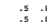

开放标点.lang 1. 0. .5

(.6

![281_image_7.png )

(.4 日期.lang .5

)

]

)

[结束标点.lang 0. .9 .5 结束标点.lang .1]

图 13.12. 描述相当通用上下文的稍微复杂一些的双语法示例。双语法首先被命名为（FairlyGeneral），然后指定为字典列表（*.dict 和*.lang 条目），连同以该字典开始、结束以及在该字典内循环的概率（每个字典名称后面的前三个数值），加上该字典可以合法过渡到的任何字典，以及进行该过渡的概率。括号便于为其中包含的所有字典指定乘法先验概率。请注意，在这个简单的例子中，无法以结束标点（end punctuation）开始字符串（起始概率= 0）。

字典，就像以开放标点字典结束字符串也是不可能的。

用于指定只接受电话号码的领域上下文的双语法，如图 13.11 所示。更复杂的双语法

(尽管仍然远未达到我们最终通用输入上下文的复杂性)如图 13.12 所示。

我们将我们的语言模型称为“弱应用”，因为在所有基于词表的字典和正则表达式语法的并行搜索中，我们同时搜索字母字符语法（“类似单词”）和完全通用的任意字符任意位置语法（“符号”）。这些更灵活的模型虽然具有相对较低的*a priori* 概率，但允许用户编写他们可能希望的任何不寻常字符字符串。当各种字典的先验概率得到合理平衡时，识别器能够从语言模型中受益，并为常见的字典内单词（以及特殊构造，如电话号码等）提供所需的准确性，同时也能够识别任意的非字典字符字符串，尤其是当它们写得足够整齐以使字符分类器对其分类有信心时。

我们还实验了二元组、三元组、N-元组，并继续进行其他更数据驱动的语言模型的实验；然而，到目前为止，我们的生成方法已经产生了最佳结果。

## 13.5.2 几何上下文

我们从未找到一种方法来可靠地估计字符的基线或顶线，独立于在单词中对这些字符的分类。基于严格几何特征的非识别集成这些行位置的估计，具有太多病态故障模式，从而产生不稳定的识别失败。然而，字符的几何定位无疑承载着对识别过程重要的信息。我们的系统通过让人工神经网络（ANN）分类独立于基线和大小的表示来分解问题，然后使用独立模块为单个字符的绝对大小以及相邻字符的相对大小和位置打分。

基于绝对大小的评分来自一组简单的高斯模型，描述个别字符高度，相对于在学习和识别过程中计算的一些运行规模参数。这个*CharHeight*评分直接乘以 ANN 分类器发出的评分，并在情况消歧中提供了显著帮助。

我们还使用一个*GeoContext*模块，根据相邻字符的分类假设及其相对大小和位置，对相邻字符进行评分。GeoContext 根据当前搜索假设中每个临时字符的类别及其前一个字母的类别来评分。字符类别用于在标准化空间中查找预期的字符大小和位置（基线=0.0，顶线=1.0）。被评估的墨水提供了实际大小和位置，可以直接与预期值进行比较，仅受缩放因子和偏移量的影响，这些因子和偏移量的选择旨在最小化数据与模型之间的拟合误差。这个同样的二次误差项是从这些大小和位置的全多变量高斯模型的逆协方差矩阵计算而来的，直接用作 GeoContext 的得分（或惩罚，因为它在搜索引擎的 -log 概率空间中应用）。图 13.13 说明了用户墨水与基于表格的模型之间的边界框，以及我们 GeoContext 模块的相关误差度量。

图 13.13. 贡献于 GeoContext 误差向量的八个测量及每对字母的相应得分

GeoContext 的多变量高斯模型直接从数据中学习。这样做的问题是如何在没有标记基线或其他绝对参照点的数据中，找到一种良好的方法来训练每个字符的顶部、底部、宽度、间距等参数。在拥有从参数表中生成误差向量的技术后，我们决定使用反向传播变体来训练参数表，以最小化给定所有相邻字符对和训练集中的正确类别标签的误差向量中的平方误差项。

GeoContext 在正确识别标点符号、消歧义大小写及一般识别中发挥着重要作用。Lyon 和 Yaeger [9] 对 GeoContext 提供了更为详细的讨论。

## 13.5.3 与单词分割的整合

正如将字符分割与识别通过搜索过程整合在一起是必要的，整合单词分割与识别和搜索也是至关重要的，以获得准确的单词边界估计，并减少与错误分割单词相关的大量错误类。为了进行这种整合，我们首先需要一种方法来估计每对临时字符之间的单词断裂概率。我们使用一个简单的统计模型来计算这个概率（*spaceProb*），该模型基于从大量训练语料库中计算的均值和标准差的高斯密度分布，以及先验概率缩放因子，提供单词间隙和笔画间隙（非单词间隙）的基础。

模型，如图 13.14 所示。由于任何给定的间隙，根据定义要么是单词间隙，要么是非单词间隙，因此图 13.14 中定义的简单比率提供了单词间隙概率的方便自归一化估计。在实践中，该方程进一步简化为简单的 sigmoid 形式，从而使我们能够利用为 ANN 使用的查找表生成的 sigmoid。在一个阈值化的非集成单词分割模型中，当 spaceProb 超过 0.5 时，会引入单词断裂；即，当特定间隙更可能是单词间隙而不是非单词间隙时。在我们的集成系统中，在每个段落转换处生成单词断裂和非单词断裂假设，并分别按 spaceProb 和(1-spaceProb)加权。搜索过程随后在这个更大的假设空间中进行，以生成整个短语或句子的最佳估计，从而实现单词分割和字符分割的集成。

图 13.14. 高斯密度分布产生了单词断裂概率的简单统计模型，应用于 StrokeGap 和 WordGap 分布的峰值之间的区域。哈希区域指示清晰决策的区域，其中 P*WordBreak*被设置为 0.0 或 1.0，以避免处理这些简单分布尾部的问题。

## 13.6 讨论

前面章节中描述的元素组合产生了一种强大的、综合的方法，用于字符分割、单词分割和识别。用户对 APR 的体验几乎都是积极的，这与以前的手写识别系统的体验形成鲜明对比。在字典内的书写非常准确，但人们在字典外书写的轻松程度使许多人误以为这是牛顿的。

“打印识别器”不使用字典。如前所述，我们的识别器确实使用字典。实际上，广覆盖语言模型虽然应用较弱，但对高准确率识别至关重要。有趣的是，字典的*困惑度*似乎几乎没有问题 - 使用非常大、非常复杂的语言模型几乎没有困难。我们将这种幸运的表现归因于系统核心的神经网络字符分类器的优秀性能。语言模型应用较弱的一个副作用是，即使在识别失败并产生错误结果时，返回给用户的答案通常是用户可以理解的 - 可能只涉及一个字符的替换。由此产生两个有用的现象。首先，用户学习什么有效、什么无效，尤其是当她回顾导致误识别的墨水时，因此系统随着时间的推移优雅地训练用户。其次，意义并没有像整体单词替换时那样容易丢失 - 这种现象在第一代强语言模型识别器中被称为“Doonesbury 效应”。

虽然我们为某些算法的比较测试提供了合法的准确性统计，但我们故意避免在一般情况下声称具体的准确性水平。熟悉系统的熟练用户如果小心谨慎，可以实现 100%的准确率。在完全新手的数据上进行测试，这些新手第一次使用金属笔在玻璃表面上书写，没有来自识别系统的反馈，且对于用“断开字符”书写的模糊指示（意图是指打印，但通常被解释为用连笔书写但之间留有大间隔，以一种完全不自然的风格书写），可能导致单词级别的准确率低至 80%。当然，整个有趣的识别准确率范围介于这两个极端之间。也许稍微更有意义的统计数据来自于 usenet 新闻组的常见报告和一些个人测试，这些测试表明在正常使用中的准确率为 97%到 98%。但对于科学目的而言，这些数字并没有任何实际意义，因为我们的测试数据集是专有的，而不同识别器之间唯一有效的测试必须基于处理相同位数据所获得的结果，或通过分析在现场使用系统的大量经验用户进行 - 这是一个尚未开展的艰巨项目。

APR 成功的关键原因之一是创新神经网络训练技术的套件，这些技术帮助网络更好地编码类概率，特别是针对欠代表类和写作风格。这些技术中的许多——笔画计数抖动、输出错误标准化、频率平衡、错误强调——都共享一个统一主题：减少训练数据中的*先验*偏见对网络学习的影响显著提高了网络在集成识别系统中的表现，尽管这对单个字符的网络准确性有适度的降低。输出错误的标准化防止过度代表的非目标类对欠代表目标类造成偏见。频率平衡防止过度代表的类对欠代表的类造成偏见。

笔画计数抖动和错误强调防止过度代表的写作风格对网络造成对欠代表写作风格的偏见。甚至可以说，负训练消除了对适当分段字符的绝对偏见，而笔画变形则减少了对训练数据中那些写作风格的偏见，尽管这些技术也为系统提供了全新的信息。

尽管我们已提供论据说明这些技术各自如何帮助整体识别过程，但尚不清楚为什么*先验*偏见减少在一般情况下如此一致地有价值。其一般效果可能与消除先验的技术有关，这在将 p(class|input)转换为 p(input|*class*)时有时会使用。但我们也相信，在学习过程中强迫网络分配资源以表示较少频繁的样本类型可能是直接有益的。无论如何，关注这些偏见并采取措施调节它们显然是作为最大似然识别系统分类器的神经网络有效训练的重要组成部分。

本文大部分内容描述了系统及其架构的快照，特别是在其首次商业发布时，那时它确实只是一个“打印识别器”。字母必须完全“断开”；即在每对字符之间必须抬起笔。字符可以在一定程度上重叠，但墨水不能连续。连接字符被证明是我们大多数用户剩余的最大错误类别，因为即使是通常打印的人（而不是书写草体）也会遇到这个问题。

有时可能会连接一对字符——比如“t”的横杠与“the”中的“h”，“ion”结尾的任何单词中的“o”和“n”，等等。为了解决这个问题，我们对我们的识别器进行了相当简单的修改，涉及将用户笔画*分解*为多个系统笔画或*碎片*。一旦表示连接字符的墨水被分解成碎片，我们就允许标准的集成分段和识别过程将它们重新缝合成最可能的字符和单词假设，始终如此。该技术已被证明效果良好，而 MessagePad 2000 和 2100 中的“打印识别器”版本支持对连接字符的打印进行识别。这项功能的增加并未对本论文中提出的主要识别算法进行重大修改。由于当前软件版本中的某些假设和限制，APR 尚未成为完整的草书识别器，尽管这是显而易见的下一个研究方向。

第 13.4.2 节讨论的网络架构以及图 13.4 中所示的网络也对应于真正的仅打印识别器。最终输出层有 95 个元素，分别对应于完整的可打印 ASCII 字符集及英镑符号。最初针对德国市场，现在甚至在英制单位中，我们已经扩展 APR 以处理变音符号和大多数欧洲语言所需的特殊符号（尽管在英制单位的字典中对外语的覆盖非常有限）。使这一扩展字符集得以实现的主要创新是对任何复合字符的显式处理，将其视为*基本*字符加上*重音*。这样，神经网络输出层只需添加少数节点，表示基本字符和重音，而不是所有可能的组合和排列。而所有共享共同基本字符或共同重音的复合字符的训练数据有助于网络学习该基本字符或重音，而不是仅仅贡献于显式的基本+重音组合。然而，这里根本的识别技术与本论文中提出的内容没有显著变化。

## 13.7 未来扩展

我们乐观地认为，我们的算法在处理连接字符和不连接字符时表现基本相同，因此可能会优雅地扩展到完整的草书书写。

在更具推测性的层面上，我们相信该技术可能很好地扩展到表意文字，使用部首替代字符，使用表意字符替代单词。

最后，关于学习和用户适应的一点说明：对于像人工神经网络这样的学习技术，用户适应显然是一个自然的契合，并且从一开始就被纳入系统的设计中。然而，由于初始发布产品时内存的限制，以及后续对欧洲字符集和连接字符的优先考虑，我们尚未部署学习系统。不过，我们确实进行了用户适应的一些测试，并相信它具有相当的价值。图 13.15 显示了在一个针对 45 位作者训练的旧用户独立网络上的平均表现，与三位个体使用的（A）用户独立网络的表现的比较。

(B) 一个仅针对该个体数据训练的网络，以及 (C) 一个通过一些增量训练适应特定用户的用户独立网络的副本。（注意：这些数据来自多年前的实验，并不一定能代表当前任何绝对标准上的表现水平。）

图 13.15。三位不同作者在各自不同网络上的用户适应测试结果，以及在一个针对所有 45 位作者训练的用户独立网络上的 45 位作者的总体结果。

这里做了一个重要的区分，即“用户适应”和

“用户特定”网络是基于来自特定用户的相对大量的数据训练而成的。“用户适应”网络则基于用户独立网络，使用有限的来自该用户的数据进行了额外训练。所有测试均是在所有训练集中保留的数据上进行的。

一个显而易见的事实是，无论是用户特定网络还是用户适应网络，错误率都减少了 2 倍到 5 倍。

另一个同样重要的事情是，用户适应网络的表现基本上与用户特定网络一样——实际上，对于三位作者中的两位，表现稍微*更好*。考虑到人工神经网络对局部最小值的偏好，我们曾担心情况可能并非如此。但看起来，在用户独立网络训练期间学习到的特征为用户适应网络提供了良好的支持。我们相信，从个体获取的非常少量的训练数据将使我们能够将用户独立网络适应于该用户，并显著提高该用户的整体准确性，尤其是对于那些书写风格更具个性化或在我们的用户独立训练语料库中表现不足的个体。即使是对于书写风格普通和/或整洁的作者，单个作者的风格本质上也比一个尽力代表所有可能书写风格的数据语料库要少一些模糊性。

这些结果可能由于在进行测试时用户独立训练语料库的数据有限（仅有 45 位写作者）而被夸大，且至少三位写作者中的两位有特别问题的写作风格。自这些测试进行以来，我们在用户独立识别准确性方面也取得了显著进展。尽管如此，我们相信这些结果暗示了用户适应的重要价值，即使优先考虑用户特定的解决方案。致谢。本工作与比尔·斯塔福德（Apple Computer）和莱斯·沃戈尔（Angel Island Technologies）合作完成。我们还要感谢迈克尔·卡普兰、拉斯·马克汉、卡拉·海耶斯、基恩·西卡雷利和斯图尔特·克劳福德的贡献。我们还得到了牛顿识别、软件测试和硬件支持团队的支持与帮助。多年来，我们也要感谢连接主义社区中的许多同事的建议、帮助和鼓励，以及苹果公司许多同事在项目整个生命周期中的支持。

本文中描述的一些技术正是美国待审的主题。

以及外国专利申请。

[1] Asanovic, K., Morgan, N.: 人工神经网络反向传播训练精度要求的实验性确定。技术报告 TR91-036，加州伯克利国际计算机科学研究所（1991 年 6 月）

[2] Bengio, Y., LeCun, Y., Nohl, C., Burges, C.: LeRec：一种用于在线手写识别的 NN/HMM 混合。神经计算 7(6)，1289–1303（1995 年）

[3] Bourlard, H., Wellekens, C.J.: 马尔可夫模型与多层感知器之间的联系。IEEE 模式分析与机器智能交易 PAMI12(12)，1167–1178（1990 年）

[4] Chang, E.I., Lippmann, R.P.: 使用语音变换创造额外的训练说话者以进行词检测。收录于：Tesauro, G., Touretzky, D., Leen, T.（编）

神经信息处理系统的进展，第 7 卷，pp. 875–882。麻省理工学院出版社（1995 年）

[5] Gish, H.: 理解和训练神经网络分类器的概率方法。收录于：IEEE 声学、语音与信号处理会议论文集，pp. 1361–1364。IEEE 出版社（1990 年）

[6] Guyon, I., Henderson, D., Albrecht, P., LeCun, Y., Denker, P.: 用于在线字符识别的写作者独立和适应性神经网络。收录于：Impedovo, S.（编），从像素到特征 III，pp. 493–506。爱思唯尔，阿姆斯特丹（1992 年）

[7] Jacobs, R.A., Jordan, M.I., Nowlan, S.J., Hinton, G.E.: 自适应局部专家混合。神经计算 3(1)，79–87（1991 年）

[8] Lippmann, R.P.: 神经网络、贝叶斯后验概率和模式分类。收录于：Cherkassky, V., Friedman, J.H., Wechsler, H.（编），从统计学到神经网络——理论与模式识别应用，pp. 83–104。施普林格出版社，柏林（1994 年）

[9] Lyon, R., Yaeger, L.: 使用神经网络的在线手写识别。在：

第五届国际微电子神经网络与模糊系统会议，瑞士洛桑。IEEE 计算机学会出版社 (1996)

[10] Morgan, N., Bourlard, H.: 连续语音识别——混合 HMM/连接主义方法的介绍。IEEE 信号处理杂志 13(3), 24–42 (1995)

[11] Renals, S., Morgan, N., Cohen, M., Franco, H.: 在解码语音识别系统中的连接主义概率估计。在：IEEE 会议论文集

国际声学、语音与信号处理会议，卷 I，第 601–604 页 (1992)

[12] Richard, M.D., Lippmann, R.P.: 神经网络分类器估计贝叶斯后验概率。神经计算 3(4), 461–483 (1991)

[13] Simard, P., LeCun, Y., Denker, J.: 使用新变换距离的高效模式识别。在：Hanson, S.J., Cowan, J.D., Giles, C.L. (编辑)《1992 年神经信息处理系统进展会议论文集》，第 5 卷，第 50–58 页。摩根考夫曼，旧金山 (1992)

[14] Simard, P., Victorri, B., LeCun, Y., Denker, J.: 切线传播——一种在自适应网络中指定选择不变性的形式。收录于：Moody, J.E., Hanson, S.J., Lippmann, R.P. (编辑)《神经信息处理系统进展》，第 4 卷，第 895–903 页。摩根考夫曼出版社 (1992)

[15] Tappert, C.C., Suen, C.Y., Wakahara, T.: 在线手写识别的最新进展。IEEE 模式分析与机器智能交易 PAMI-12(8), 787–808 (1990)

# 14 神经网络分类和先验类概率-

Steve Lawrence1, Ian Burns2, Andrew Back3, Ah Chung Tsoi4, 和 C. Lee Giles1，

1 NEC 研究所，4 Independence Way, Princeton, NJ 08540 http://www.neci.nj.nec.com 2 Open Access Pty Ltd, Level 2, 7–9 Albany St, St. Leonards, NSW 2065, Australia 3 RIKEN 脑科学研究所，2-1 Hirosawa, Wako-shi, Saitama, 351-0198, Japan 4 悉尼大学信息学院，Northfields Ave, Wollongong, NSW 2522, Australia

{lawrence,giles}@research.nj.nec.com, ian.burns@oa.com.au, back@brain.riken.go.jp, Ah_Chung_Tsoi@uow.edu.au http://www.neci.nj.nec.com/homepages/lawrence/

摘要。在多层感知器（MLP）分类问题中，常见的问题与各个类别的先验概率有关——如果对应每个类别的训练样本数量在类别之间显著不同，那么网络在某些情况下可能更难学习稀有类别。这种实际经验与理论结果不符，后者显示 MLPs 可以逼近贝叶斯*a posteriori*概率（与先验类别概率无关）。我们对该问题的研究表明，理论与实际结果之间的差异在于理论中做出的假设（准确估计贝叶斯*a posteriori*概率需要网络足够大，训练收敛到全局最小值，无限的训练数据，以及测试集的*a priori*类概率在训练集中得到正确表示）。具体来说，问题往往可以追溯到高效的 MLP 训练机制导致大多数实际问题的次优解。在本章中，我们展示了这个问题，讨论了缓解方法，并介绍了在样本 ECG 分类问题上表现良好的新启发式方法。这些启发式方法也可以作为调整不等误分类成本的简单手段。

- 之前出版于：Orr, G.B. 和 Müller, K.-R. (编)：LNCS 1524，ISBN

978-3-540-65311-0 (1998)。 - Lee Giles 也在马里兰大学学院公园的高级计算机研究所工作，邮政编码 20742。

G. Montavon 等（编）：NN: Tricks of the Trade，第二版，LNCS 7700，第 295–309 页，2012 年。

-c Springer-Verlag Berlin Heidelberg 2012

## 14.1 引言

理论上已经证明，当所需网络输出为*1 of M*且使用平方误差或交叉熵成本函数时，MLPs 可以逼近贝叶斯*a posteriori*概率[6, 11, 12, 15, 23, 25, 26, 28, 29, 32]。这一结果依赖于准确估计所需的多个假设：网络必须足够大，训练必须找到全局最小值，需要无限的训练数据，测试集的*a priori*类概率必须在训练集中得到正确表示。

实际上，MLP 在某些实验中也被证明能够准确估计贝叶斯后验概率。然而，MLP 分类中常见的问题与训练集中类别频率显著变化的情况有关。如果每个类别的训练样本数量在类别之间差异显著，则可能会偏向于预测更常见的类别，从而导致较少类别的分类性能更差。在一项研究中观察到，在语音应用中，具有低*先验*概率的类别被“忽略”（训练后没有样本被分类为这些类别）。这些问题表明，贝叶斯*后验*概率的估计要么不准确，要么不需要这种估计（例如，由于误分类成本的变化，这在 14.4 节中进一步解释）。Bourlard 和 Morgan 已经证明了在语音识别中贝叶斯*后验*概率的估计不准确。本章讨论了问题可能发生的方式以及解决该问题的方法。

## 14.2 诀窍

本节描述了缓解上述问题的技巧。它们使用的动机和实验结果将在接下来的章节中提供。所有方法都考虑某种按类别缩放的方式。

## 14.2.1 先验缩放

本节提出了一种根据先验类别概率按类别缩放权重更新的方法。考虑每个模式的梯度下降权重更新：wlki(new) = wlki(old) + Δwlki(p)，其中Δwlki(p) =

−η

∂E(p)

∂wlki

, p 是模式索引，wki 是层 l 中神经元 k 与层 l − 1 中神经元 i 之间的权重。按模式进行权重更新的缩放

1 一般数据。其他人考虑了训练集和测试集之间不同类别概率的情况，例如[23]。2 Anand 等人还提出了一种与不平等先验类别概率相关的算法。然而，他们的算法仅旨在提高收敛速度。

此外，他们的算法仅适用于二类问题和批量更新。

采用这样的基础，以使属于每个类别的模式的总期望更新相等（即与类别中的模式数量无关）：

$$\left\langle\sum_{p=1}^{N_{p}}|s_{x}\Delta w_{k i}^{l}(p)|_{p_{c}=x}\right\rangle=c_{1},\,\forall x\in X$$

$$(14.1)$$

其中 pc 是模式 p 的目标分类，c1 是常数，sx 是缩放因子，x 遍历所有类别 X，<> 表示期望，pc = x 下标表示求和仅限于特定类 x 中的模式。这有效地缩放了较低频率类别的更新，以便它们更高——目的是考虑到较低频率类别在某些情况下往往会被“忽视”。我们假设每个类别中单个模式的期望权重更新是相等的：

$$\left\langle|\Delta w_{k i}^{l}(p)|_{p_{c}=x}\right\rangle=c_{2},\,\forall x\in X$$

.= c2, ∀x ∈ X (14.2)

其中 c2 是与 c1 无关的常数。因此，所需的缩放因子为：

$$(14.2)$$

$$s_{x}={\frac{1}{p_{x}N_{c}}}$$

$$(14.3)$$

其中 sx 是与属于类 x 的模式相关的所有权重更新的缩放因子，Nc 是类别的数量，px 是类 x 的先验概率。

如上所定义的缩放使得贝叶斯 *后验* 概率证明失效。

（例如，缩放一个类别为两倍可以与在该类别的数据中复制每个模式进行比较——导致概率分布的变化），即没有理由期待缩放策略是最优的。这一点，加上缩放可能提高性能的经验结果，导致假设在没有先验缩放和上述定义的先验缩放之间可能存在一个点，其性能优于两个极端。以下缩放规则可用于在两个极端之间选择缩放程度：

$$s_{x}^{\prime}=1-c_{s}+{\frac{c_{s}}{p_{x}N_{c}}}$$

$$(14.4)$$

其中 0 ≤ cs ≤ 1 是一个常数，指定要使用的先验缩放量。cs = 0 表示不根据先验概率进行缩放，cs = 1 表示如上所述进行缩放。这种形式的先验缩放可以用以下替代成本函数进行训练表示 3。

3 一种具有类似动机的成本函数，哈姆郊和怀贝尔提出的“分类质量指标”（CFM）[13]，在先验类概率变化时被建议作为一种可能的改进[3]。在[13]中，CFM 成本函数导致的网络与用 MSE 标准训练的网络产生不同的错误，因此可以通过结合用 CFM 和 MSE 训练的分类器来提高性能。然而，在[13]报告的实验中，用 CFM 标准训练的网络并未比用 MSE 标准训练的网络产生更高的分类性能。

定义 1

$$E={\frac{1}{2}}\sum_{k=1}^{N_{p}}\sum_{j=1}^{N_{c}}s_{x}^{\prime}(d_{k j}-y_{k j})^{2}$$

$$(14.5)$$

2 (14.5)

其中网络为每个 Nc 类具有一个输出，Np 是模式的数量，d 是期望或目标输出，y *是预测输出，* x 是模式 k 的类别。

当使用本节定义的先前缩放时，低先前概率类别的个体 sx 值可能很大。这可能导致需要降低学习率，以防止相对较大的权重更新干扰梯度下降过程。比较使用先前缩放和不使用先前缩放就变得复杂，因为每种情况的最优学习率不同。另一种选择是对 sx 值进行归一化，使最大值为 1。另一种可能性是重复呈现模式给网络，而不是缩放权重更新，即对于缩放因子为 2 的类别，每个模式将被呈现两次。这将有助于减少权重更新在幅度上的范围，例如，幅度为 x 的更新可能重复两次，而不是使用幅度为 2x 的单次更新。这可能允许使用更高的学习率，从而减少所需的训练周期数量。然而，重复模式的一个缺点是有效训练集会更大，从而导致在相同训练周期下的训练时间更长。这种技术可以以概率方式进行，这也是下一个技术的主题。

## 14.2.2 概率采样

Yaeger 等人 [33]（第十三章）提出了一种称为*频率平衡*的方法，类似于上述的先前缩放方法。在频率平衡中，Yaeger 等人以随机顺序使用所有训练样本进行每个训练周期，并允许每个样本以随机次数呈现给网络，这个次数可以是零次或多次，且是概率计算得出的。包含一个平衡因子，类似于上述的缩放因子 (cs)。

我们在这里引入一种非常相似的方法，称为*概率采样*，其方式如下：类别是随机选择的，每个类别 x 的选择概率为 (1 − cs)px + csNc。

然后从所选类别的所有训练样本中随机选择一个训练样本。

## 14.2.3 后缩放

不必缩放权重更新或改变有效类别频率，可以像往常一样训练网络，然后在训练后缩放网络的输出。例如，网络可以像往常一样训练，然后根据先前概率以类似于先前缩放方法的方式缩放输出（使用方程 14.3 或 14.4）。单独使用这种技术的实验表明，它并不总是像权重更新的先前缩放那样成功。这可能是因为低频类别的估计不如高频类别的估计准确 [24]（网络输出与真实值之间的偏差在数据点较多的区域对平方误差成本函数的影响大于在数据点较少的区域的偏差 [23]）。

这里介绍的后处理缩放技术也可以用来优化给定的标准，例如，输出可以缩放，以使每个类别的预测概率尽可能接近训练集中的先验概率。结果部分展示了最小化不同标准的后处理缩放。对于本章中的结果，最小化使用简单的爬山算法进行，该算法调整与网络每个输出相关的缩放因子。

## 14.2.4 类别成员资格平衡

一种简单的方法来缓解不平等先验类别概率的问题是调整（例如，平衡）每个类别中的模式数量，方法是子采样[24]（从高频类别中移除模式）或通过重复。

（低频类别中的模式）4。对于子采样，可以随机移除模式，或者可以使用启发式方法在低歧义区域移除模式。子采样涉及信息损失，可能会造成不利影响。重复涉及更大的数据集以及相同训练周期数量的更长训练时间（收敛时间可能更长或更短）。

## 14.3 实验结果

本节报告了在讨论替代性能度量的使用后，关于 ECG 分类问题的结果。解释部分还包括一个简单人工问题的结果。

## 14.3.1 性能度量

当类别之间的先验概率差异显著时，整体分类错误可能不是最合适的性能标准。例如，模型可能始终预测最常见的类别，仍然提供相对较高的性能。灵敏度、正预测率和假阳性率等统计数据可以提供更有意义的结果[1]。

这些是逐类定义的，如下所示：

一个类别的**灵敏度**是被标记为该类别的事件中正确检测到的比例。对于表 14.1 中显示的两个类别混淆矩阵，类别 1 的灵敏度为 c11 c11+c12。

在训练期间添加噪声的启发式方法[22]在这里可能会有用，就像本章的其他技术一样。

一个类别的**正预测率**是被预测为该类别并被标记为该类别的事件的比例。对于表 14.1 中显示的两个类别混淆矩阵，类别 1 的正预测率为 c11 c11+c21。

一个类别的**假阳性率**是所有被错误分类为该类别的其他类别模式的比例。对于表 14.1 中显示的两个类别混淆矩阵，类别 1 的假阳性率为 c21 c11+c21。

表 14.1. 一个示例混淆矩阵，用于说明灵敏度、正预测率和假阳性率。行对应于期望类别，列对应于预测类别。

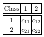

没有单一的性能标准可以被标记为比较算法或模型的最佳标准，因为使用的最佳标准依赖于问题。

在这里，我们采用上述定义的敏感性，并创建一个单一性能度量——均方敏感性误差 (MSSE)。我们将 MSSE 定义如下：定义 2

$$M S S E={\frac{1}{N_{c}}}\sum_{i=1}^{N_{c}}(1-S_{i})^{2}$$

$$(14.6)$$

其中 Nc = 类别数，Si = 之前定义的类别 i 的敏感性。敏感性范围从 0（没有正确分类的类别示例）到 1（所有示例均正确分类）。因此，较低的 MSSE 对应于更好的性能。我们选择这个标准是因为每个类别都被赋予了同等重要性，平方使得较低的个体敏感性受到更大惩罚（例如，对于二分类问题，类别敏感性为 100% 和 0% 的 MSSE 高于 50% 和 50% 的敏感性）。请注意，这只是一个可能的标准，还可以使用其他标准以反映不同的需求，例如每个类别的特定错误分类成本。后缩放启发式方法可以与任何标准一起使用（这样做可能比重新制定神经网络训练算法以适应新标准更简单）。

## 14.3.2 ECG 分类问题

本节展示了使用上述技术在 ECG 分类问题上的结果。所用数据库为 MIT-BIH 心律失常数据库 [21]——一个常见的公开 ECG 数据库，包含大量经过专家仔细注释的 ECG 记录。考虑检测以下四种心跳类型：正常 (N)、早期室性收缩 (PVC)、上心室收缩 (S) 和融合 (F) [21]，即有四个输出类别。这四个类别分别表示为 1 (N)、2 (PVC)、3 (S)。

和 4 (F)。为每个心跳的 R 波峰计算一个窗口为 200 个样本的自回归模型。输入为 z 平面中每个极点的极坐标，即频率变化反映在极点的角度变化中，阻尼则反映在幅度变化中。模型的阶数为四，对应于八个输入变量。类别的先验概率（根据训练数据）为 (0.737, 0.191, 0.0529, 0.0196)，对应于心跳类型 (N, PVC, S, F)。

使用 20 个隐藏单元的多层感知器通过随机反向传播进行训练

（在每个模式后更新）使用初始学习率 0.02，该学习率在 500,000 次更新的训练期间线性减小至零。我们在训练、验证和测试集各使用 5,000 个点。验证集用于提前停止。使用了以下算法 - a) 先前缩放，缩放程度 cs 从 0 到 1 变化，b) 概率采样，缩放程度 cs 从 0 到 1 变化，c) 根据 a) 和 b) 加入后期缩放，以及 d) 通过移除更常见类别中的案例来均衡每个类别中的案例数量。后期缩放试图最小化训练集上的 MSSE5。每种情况进行了 10 次试验。

d) 的中位测试集 MSSE 为 0.195。概率采样和概率采样加后期缩放的结果以箱线图 6 展示在图 14.1 中。对于概率采样，最佳缩放结果对应于没有缩放和根据先前概率缩放之间的缩放程度（cs ≈ 0.8）。当 cs 较大时，类别 1 的敏感性显著下降，导致其他类别的假阳性率增加。当 cs 较小时，类别 3 和 4 的敏感性显著下降。可以看出，增加后期缩放几乎总是能改善该问题的性能。最佳缩放程度 cs ≈ 0.8 很难*事先*确定。然而，可以看出，增加后期缩放使得选择 cs 的重要性大大降低（cs = 0.3 到 cs = 1.0 的表现相似）。图 14.2 显示了混淆矩阵（图形形式）。没有

采用 5400 步用于爬山算法，每一步对应于将单个输出缩放因子乘以或除以一个常数，该常数随着时间线性减少，从 1.5 减少到 1。与整体训练时间相比，所用时间较短。6 结果的分布通常不是高斯分布，除了均值和标准差外，其他呈现结果的方法可能更具信息性。箱线图显示了以箱子表示的四分位数范围（IQR），以及作为箱子中横杆的中位数。触须从箱子两端延伸到最小值和最大值。中位数和 IQR 是简单的统计量，对异常值的敏感度不如均值和标准差[31]。中位数是按从小到大排列分布时中间的值。如果数据被分为两个关于中位数的相等组，则 IQR 是这两个组中位数之间的差异。IQR 包含 50% 的点。

在缩放（cs = 0）时，可以看出类别 3 和 4 的敏感性较低。使用 cs = 1 的缩放时，所有类别均被识别，但类别 1 的敏感性更差，类别 3 和 4 的假阳性率显著更差。

先验缩放和先验缩放结合后缩放的结果非常相似，但略逊于概率性取样的结果。为了使图形更易于理解，先验缩放的结果没有被绘制，但定性结果如下：在低 cs 的情况下，先验缩放和概率性取样的表现非常相似。然而，在高 cs 的情况下，概率性取样在此问题上有明显优势。这或许是意料之中的——先验类别概率的相对高变异性导致在使用高 cs 时，各类别的权重更新幅度具有较高的变异性。所有方法的结果见表 14.2。

表 14.2. 各种方法的结果。我们展示了最佳 cs 选择的平均结果，以及所有 cs 选择的平均结果。请注意，当使用后缩放与先验缩放或概率性取样方法结合时，选择最佳 cs 值的重要性降低。

| 方法          | 先验        | 先验缩放 + 概率性取样                        | 平均化       |            |       |
| --- | --- | --- | --- | --- | --- |
| 缩放          | 后缩放      | 取样                                        | 取样 +       | 归属      |       |
|               | 后缩放      |                                               |              |            |       |
| 平均 MSSE     | 0.10         | 0.096                                         | 0.099        | 0.089      | 0.195 |
| (最佳 cs)     | (cs = 0.8)   | (cs = 0.6)                                    | (cs = 0.8)   | (cs = 0.3) |       |
| 平均 MSSE     | 0.19         | 0.10                                          | 0.18         | 0.099      | 0.195 |
| (针对所有 cs) |              |                                               |              |            |       |

## 14.4 说明

本节讨论了所提出的技术为何有用、这些技术的局限性，以及它们与 MLP 在某些条件下近似贝叶斯 *后验* 概率的理论结果之间的关系。

## 14.4.1 收敛性和表示问题

我们首先列出四种可能的情况：

1. 关于贝叶斯 *后验* 概率估计的证明假设网络具有无限数量的隐藏节点，以便获得准确的近似。对于给定的问题，可以看出，过小的网络将无法由于资源有限而准确估计概率。

图 14.1。箱线图（每种情况下左侧）以及通常的均值加减一个标准差图（每种情况下右侧），显示了概率采样和概率采样加后期缩放的测试集 MSSE。每个结果来自 10 次不同起始条件的试验。概率采样加后期缩放的情况偏移 0.03 以便观察。可以看出，使用概率采样和后期缩放组合时，选择最佳性能的缩放程度并不是那么关键。

训练一个多层感知器（MLP）在一般情况下是 NP 完全的，众所周知，实际用于 MLP 的训练算法往往会导致次优解。

（例如，由于局部极小值）。获得次优解的结果往往是网络资源没有得到有效利用。对受控任务的实验表明，次优解的平均权重往往较小[17]。

权重衰减[16]或权重消除[30]常用于 MLP 训练，旨在最小化惩罚大权重的成本函数。这些技术往往导致权重较小的网络。

一个常见的建议技术是将 MLP 分类的训练目标设置在激活函数的边界之外（例如，tanh 激活函数的范围为 (-0.8, 0.8) 而不是 (-1, 1)）[14]。

图 14.2。测试集的混淆矩阵，当先前缩放的程度 cs 从 0（左侧）变化到 1（右侧）。列对应于预测类别，行对应于期望类别。类别为（从左到右，从上到下）N、PVC、S、F。对于每个期望类别，预测类别的阴影深度与标记为期望类别的示例数量成比例。白色表示没有预测。可以观察到一个一般趋势，当 cs = 0 时，类别 S 和 F 被识别为正常，随着 cs 接近 1，越来越多的正常类别示例被识别为类别 PVC、S 和 F。

这四种情况都可能导致对较小权重的偏倚，或者

“更平滑”的模型。这种偏倚的可能性没有被后验概率的证明所考虑，即理论与实践之间的差异在某种程度上可能是由于违反了获得足够收敛的假设。

当网络偏向于“更平滑”的解，并且无法准确拟合最优函数时，结果可能倾向于“忽略”低频类别，例如，如果网络必须选择拟合高频类别或低频类别，那么通过拟合高频类别可以提供更低的 MSE。我们通过示例进行演示。

我们使用以下分布生成了人工训练数据：类别 1：

N(−5, 1, 2)+N(0, 1, 2)+N(5, 1, 2)，类别 2: N(−2.5, 0.25, 0.5)+N(2.5, 0.25, 0.5)，

其中 N(*μ, σ, x*) 是均值为 μ、标准差为 σ 的正态分布，并且截断在 (μ − *x, μ* + x) 之间。我们从这些分布中生成了 500 个训练和测试样本，选择类别 (1,2) 的概率为 (0.9,0.1)，即训练集和测试集的类别 1 的样本数量是类别 2 的九倍。注意，两个类别之间没有重叠。图 14.3 显示了训练具有 10 个隐含节点的 MLP 的典型输出概率图，分别采用了和未采用概率抽样的情况。每种情况进行了 10 次试验，结果非常相似（见表 14.3）。可以看出，网络在不使用概率抽样的情况下“忽略”了类别二。

值得注意的是，对于这个简单问题，使用共轭梯度训练可以在标准训练下对两个类别进行相对准确的估计（使用反向传播的交替参数也可能成功）。

在这里，我们并不是在争论反向传播或共轭梯度（这两种训练算法一般来说都不期望总是找到全局最小值），

我们只是指出我们的经验以及其他人的经验 [7, 18, 19, 27]

表明对于许多问题，共轭梯度并不优越——也就是说，反向传播在某类问题上效果更好，而共轭梯度在另一类问题上效果更好。在对 ECG 问题进行测试时，共轭梯度的性能显著较差。值得注意的是，

7 一般而言，较小的权重对应于较平滑的函数，但这并不总是成立。例如，当拟合函数 *sech(x*) 时就不是这样。

使用两个 tanh sigmoid [8]（因为 *sech(x*) = limd→0(tanh(x + d) − tanh(x))/d，即随着近似的改善，权重变得无限大）。8 关于表示能力（网络的大小），Barnard 和 Botha

[3] 观察到，当网络过小而无法合理近似决策边界时，MLP 网络倾向于猜测更高概率的类别。9 Lyon 和 Yaeger [20] 发现他们的频率平衡技术减少了先前类别概率对网络的影响，并有效地迫使网络将更多资源分配给低频类别。10 进行了 500,000 次带反向传播的随机训练更新，初始学习率为 0.02，线性减至零。

在实现共轭梯度训练算法时有许多选项，而较差的性能可能归因于所使用的实现。我们使用了来自 Fletcher [9] 的算法修改实现。

图 14.3. 人工问题的网络输出，下面是使用（上面是未使用）的情况。

概率采样。可以看出，网络在没有使用概率采样的情况下“忽略”了低频类别。请注意，输入已被归一化。表 14.3。使用和不使用概率采样的人工问题分类错误的均值和标准差

| 分类错误                   | 平均标准差               |       |
| --- | --- | --- |
| 标准训练                   | 11.4                      | 0.02  |
| 使用概率采样                | 0.8                       | 0.004 |

## 14.4.2 重叠分布

考虑图 14.4。如果类别 1 和类别 2 的分布仅通过平移（c1 和 c2）不同，则这两个类别之间的决策阈值应选择在 x1 处。这两个类别的相等比例将被分类为另一个类别。现在，如果类别 2 的分布如图所示（c2），则这两个类别之间的决策阈值应选择在 x2 处。在这种情况下，类别 2 被分类为类别 1 的比例将高于反向。如果希望最大化逐类敏感性，则可能需要缩放使得 c2 的有效分布为 c2。类似地，类别 3（c3）在没有任何缩放的情况下将被“忽略”。

按类别缩放可能是必要的，当 i) 训练集中的样本分布与真实分布不匹配时（例如，它可能是

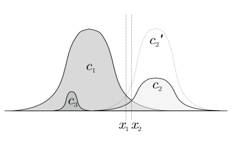

收集特定类别样本的成本更高）11，或 ii) 类别的分布并不代表它们的相对重要性，例如在医疗分类问题中，将患病案例误分类为正常的成本可能远高于将正常案例误分类为（可能）患病案例的成本[24]。每个类别的重要性可能与类别的先验概率无关。请注意，缩放使得低频类别被人为地赋予更高重要性在考虑更高级问题时可能是有用的。例如，自然英语单词和短语的训练数据对于不同字符表现出非常不均匀的先验。Yaeger 等人[33]发现，通过使用频率平衡减少这些先验对网络的影响，可以提高更高级别的单词识别训练的性能。

观察。a) 如果分布不重叠，则没有内在问题。b) 当分布重叠时，预处理数据以减少重叠是可取的。然而，通常无法获得零重叠（例如，由于噪声）。

图 14.4。重叠分布

## 14.4.3 限制

我们注意到此处考虑的启发式方法存在几个限制：

1. *局部问题.* 所提出的启发式方法抵消了网络、训练算法和/或训练数据中的偏差。这些偏差在输入空间中并不一定是恒定的，例如，在某一区域缩放可能是有帮助的，但在另一区域可能是有害的。

11 使用没有输入信息的类别标签数据可能能够获得更准确的类别概率估计。例如，文本数据库可以获得单词频率信息，各种疾病的频率可以从健康统计数据中获得[23]。

2. *非线性校准.* 这里使用的线性缩放启发式方法并不一定是最佳的（在于它们能够最佳地抵消偏差的意义上）。

## 14.4.4 后验证明

理论上，可以证明缩放技术使后验证明失效——在逐类进行缩放时，用于确定获胜类别的决策阈值应相应改变。这表明，当上述条件不存在时，先前缩放和概率抽样技术可能的另一种用途。这种用途与低频类别可能比高频类别估计得不够准确的问题有关（见第 14.2.3 节）——可以对经过启发式改变的问题进行训练（例如，使类别频率有效相等），并相应改变输出或决策阈值。

## 14.5 结论

实际上，训练问题或特定分类问题的特征可能意味着缩放预测类别概率可能在整体分类错误和/或替代标准方面提高性能。

我们引入了算法，a) 根据先前的类别概率按类别缩放权重更新，b) 以概率方式改变类别频率（非常类似于 Yaeger 等人[33]的频率平衡技术），

c) 在训练后缩放输出，以最大化给定的性能标准。对于心电图（ECG）分类问题，我们发现先前缩放、概率抽样和后缩放技术在性能方面优于 a) 没有启发式方法和 b) 为了平衡每个类别的案例数量而进行的子抽样。先前缩放和概率抽样的最佳性能是在无缩放和根据先前概率进行缩放之间的缩放程度获得的。最佳程度很难*事先*确定。然而，发现将先前缩放或概率抽样与后缩放结合使用，使得选择最佳程度变得不那么关键。

[1] AAMI. 心室心律失常检测算法的测试和报告性能结果。载于：医学仪器协会，ECAR 1987，弗吉尼亚州阿灵顿（1987）

[2] Anand, R., Mehrotra, K.G., Mohan, C.K., Ranka, S.: 一种改进的算法用于神经网络对不平衡训练集的分类。《IEEE 神经网络交易》4(6), 962–969 (1993)

[3] Barnard, E., Botha, E.C.: 反向传播有效地利用先验信息。

《IEEE 神经网络交易》4(5), 794–802 (1993)

[4] Barnard, E., Casasent, D.: 线性分类器的标准函数比较及其在神经网络中的应用。《IEEE 系统、人与网络》19(5), 1030–1041 (1989)

[5] Barnard, E., Cole, R.A., Hou, L.: 使用专家知识和神经网络分类器进行爆破辅音的定位与分类。《美国声学学会杂志》84(补充 1), S60 (1988)

[6] Bourlard, H.A., Morgan, N.: 马尔可夫模型与多层感知器之间的联系。在：Touretzky, D.S. (编) 《神经信息处理系统进展》，第 1 卷，pp. 502–510。摩根·考夫曼出版社，圣马特奥 (1989)

[7] Bourlard, H.A., Morgan, N.: 连接主义语音识别：一种混合方法。克鲁维尔学术出版社，波士顿 (1994)

[8] Scott Cardell, N., Joerding, W., Li, Y.: 为什么一些前馈网络无法学习某些多项式。《神经计算》6(4), 761–766 (1994)

[9] Fletcher, R.: 《实用优化方法》，第二版，2nd edn. 约翰·威利与儿子公司 (1987)

[10] Geman, S., Bienenstock, E., Doursat, R.: 神经网络与偏差/方差困境。《神经计算》4(1), 1–58 (1992)

[11] Gish, H.: 一种概率方法理解和训练神经网络分类器。在：IEEE 声学、语音与信号处理会议论文集，pp. 1361–1364。IEEE 出版社 (1990)

[12] Hampshire, J.B., Pearlmutter, B.: 多层感知器分类器与贝叶斯判别函数的等价性证明。在：Touretzky, D.S., Elman, J.L., Sejnowski, T.J., Hinton, G.E. (编) 1990 年连接主义模型暑期学校论文集，摩根·考夫曼出版社，圣马特奥 (1990)

[13] Hampshire, J.B., Waibel, A.H.: 一种新颖的目标函数用于改进时间延迟神经网络的音素识别。在：国际神经网络联合会议，华盛顿特区，pp. 235–241 (1989 年 6 月)

[14] Haykin, S.: 《神经网络：全面基础》。麦克米兰出版社，纽约

(1994)

[15] Kanaya, F., Miyake, S.: 贝叶斯统计行为与模式分类神经网络的有效泛化。《IEEE 神经网络交易》2(1), 471

(1991)

[16] Krogh, A., Hertz, J.A.: 一种简单的权重衰减可以改善泛化。在：

Moody, J.E., Hanson, S.J., Lippmann, R.P. (编) 《神经信息处理系统进展》，第 4 卷，pp. 950–957。摩根·考夫曼出版社，圣马特奥 (1992)

[17] Lawrence, S., Lee Giles, C., Tsoi, A.C.: 神经网络训练中的教训：过拟合比预期更难。 在：第十四届人工智能全国会议论文集，AAAI 1997，pp. 540–545。AAAI 出版社，门洛公园 (1997)

[18] LeCun, Y.: 高效学习与二阶方法。见：在神经信息处理系统中的教程，第 5 卷 (1993)

[19] LeCun, Y., Bengio, Y.: 模式识别。见：Arbib, M.A.（编）《脑理论与神经网络手册》，第 711–715 页。MIT 出版社 (1995)

[20] Lyon, R., Yaeger, L.: 在线手写识别与神经网络。见：

第五届微电子神经网络与模糊系统国际会议，瑞士洛桑。IEEE 计算机学会出版社 (1996)

[21] MIT-BIH. MIT-BIH 心律不齐数据库目录。技术报告 BMEC

TR010（修订版），麻省理工学院与贝斯以色列医院 (1988)

[22] Murray, A.F., Edwards, P.J.: 在训练过程中，由于突触权重噪声导致的增强型多层感知器性能和容错能力。IEEE 神经网络交易 5(5), 792–802 (1994)

[23] Richard, M.D., Lippmann, R.P.: 神经网络分类器估计贝叶斯后验概率。神经计算 3(4), 461–483 (1991)

[24] Ripley, B.D.: 《模式识别与神经网络》。剑桥大学出版社, 剑桥 (1996)

[25] Rojas, R.: 分类器神经网络后验概率属性的简短证明。神经计算 8, 41–43 (1996)

[26] Ruck, D.W., Rogers, S.K., Kabrisky, K., Oxley, M.E., Suter, B.W.: 多层感知器作为最佳贝叶斯估计器的近似。IEEE 神经网络交易 1(4), 296–298 (1990)

[27] Schiffman, W., Joost, M., Werner, R.: 多层感知器训练的反向传播算法优化。技术报告，科布伦茨大学

(1994)

[28] Shoemaker, P.A.: 关于最小二乘学习程序和神经网络模型分类的注释。IEEE 神经网络交易 2(1), 158–160 (1991)

[29] Wan, E.: 神经网络分类：贝叶斯解释。IEEE 神经网络交易 1(4), 303–305 (1990) [30] Weigend, A.S., Rumelhart, D.E., Huberman, B.A.: 通过权重消除进行泛化并应用于预测。见：Lippmann, R.P., Moody, J.E.,

Touretzky, D.S.（编）《神经信息处理系统进展》，第 3 卷，第 875–882 页。Morgan Kaufmann, San Mateo (1991)

[31] Weiss, N.A., Hassett, M.J.: 《初级统计学》，第 2 版。Addison-Wesley, Reading (1987)

[32] White, H.: 在人工神经网络中的学习：统计视角。神经计算 1(4), 425–464 (1989)

[33] Yaeger, L., Lyon, R., Webb, B.: 有效训练神经网络字符分类器以实现单词识别。见：Mozer, M.C., Jordan, M.I., Petsche, T.（编）《神经信息处理系统进展》，第 9 卷。MIT 出版社, 剑桥

(1997)

# 15 将分治法应用于大规模模式识别任务-

Jürgen Fritsch1 和 Michael Finke2 1 卡尔斯鲁厄大学交互系统实验室 Am Fasanengarten 5 76128 Karlsruhe, Germany fritsch@ira.uka.de 2 卡内基梅隆大学交互系统实验室 5000 Forbes Avenue Pittsburgh, PA 15213, USA

finkem@cs.cmu.edu http://www.cs.cmu.edu/˜finkem/

摘要。与其呈现特定的技巧，本文旨在提供一种针对大规模、现实世界分类任务的方法论，这些任务涉及数千个类别和数百万个训练模式。这类问题出现在语音识别、手写识别以及说话者或写作者识别等领域，仅举几例。考虑到通常需要区分的类别数量非常庞大，许多方法侧重于参数方法，以独立估计类别条件概率。

相比之下，我们展示了如何将模块化和层次结构的原则应用于在连接主义框架中直接估计后验类别概率。除了提供更好的区分能力外，我们认为层次分类方案在解决上述提到的问题时至关重要。此外，我们讨论了当可用训练数据几乎无限时需要解决的训练问题。

## 15.1 引言

神经计算领域的大多数贡献处理相对较小的数据集，并且在分类任务中区分的类别数量相对较少。这类问题的代表包括 UCI 机器学习数据库[16]和 Proben[20]学习算法基准集。研究集中于缺失数据、模型选择、正则化、过拟合与泛化以及偏差/方差权衡等方面。多年来，已经开发出许多方法和“技巧”，以便在数据量有限时进行最佳学习和泛化。

- 先前发表于：Orr, G.B. 和 Müller, K.-R. (编)：LNCS 1524，ISBN

978-3-540-65311-0 (1998)。

G. Montavon 等（编）：NN：行业技巧，第 2 版，LNCS 7700，第 311–338 页，2012。

-c 施普林格出版社 柏林 海德堡 2012

另一方面，人机交互（HCI）中的许多问题，如语音和手写识别、唇读以及说话者和写作者识别，需要相对较大的训练数据库，并且通常还需要区分大量类别，例如（上下文依赖）音素、字母以及个别说话者或写作者。例如，在最先进的大词汇量连续语音识别中，我们通常面临数千个基本声学单元的库存和包含数百万个预处理语音模式的训练数据库。关于这些任务和数据集的学习机器和训练算法选择的某些问题，现有文献相对较少。

本文正是针对后者的学习任务，提供了一种针对大规模分类问题的原则性方法，并在连接主义语音识别问题上进行了实例说明。我们的方法基于强大的*分而治之*范式，这一范式传统上一直应用于相对较大规模的问题。我们认为，模块化分类任务的层次化方法对于应用统计估计器（如人工神经网络）至关重要。在这方面，本文不仅提出了一种单一的“行业诀窍”，而是为大规模分类任务提供了一种方法论。这类任务传统上是通过构建生成模型来解决的，而不是专注于在对输入分布没有强假设的情况下预测后验。

本文的其余部分组织如下：第二部分介绍软层次分类的一般方法。第三部分讨论设计层次分类器拓扑的方法——这一任务在处理大量类别时越来越重要。最后，第四部分详细演示了层次分类在连接主义统计语音识别中的应用。第五部分总结了本文内容。

## 15.2 层次分类

考虑将模式 x 分类为 N 类 ωk 的任务。

考虑到我们可以获取类条件概率密度 p(x|ωk)，

贝叶斯理论指出，最佳决策应基于后验概率。

$$p(\omega_{k}|\mathbf{x})={\frac{p(\mathbf{x}|\omega_{k})p(\omega_{k})}{\sum_{i}p(\mathbf{x}|\omega_{i})p(\omega_{i})}}$$

.

考虑到所有可能的错误分类都关联着相同的风险，最佳决策是选择给定特定模式 x 的最大后验概率类。在将贝叶斯理论应用于一般未知分布的示例学习任务时，必须考虑两种不同的方法。在第一种方法中，试图从标记数据集中估计类条件似然 p(x|ωk) 和先验概率 p(ωk)，然后根据贝叶斯规则计算后验概率。从原则上讲，该方法可以应用于任意大量类别的任务，因为类条件似然可以独立估计。然而，这种方法主要关注类条件密度的建模。对于分类准确性而言，更重要的是建模类边界。

第二种方法通过直接从数据集中估计后验类概率来适应这一观点。研究表明（例如 [6]），多层感知器和递归神经网络等大量人工神经网络可以训练以近似后验类概率。

然而，近似的准确度依赖于许多因素，其中包括网络的可塑性。比较这两种方法，直接估计后验概率的方法的判别能力通常更高，导致更好的分类准确度，尤其是在类别条件分布非常复杂时。这一事实（以及其他因素）解释了神经网络分类器在许多示例学习任务中的成功和受欢迎程度。

然而，当需要区分的类别数量增加到数千时，神经网络后验概率的估计通常无法提供良好的近似，这主要有两个原因：首先，涉及如此大量类别的真实世界问题通常表现出极不均匀的先验分布，见第十四章。许多神经网络学习算法（特别是随机在线梯度下降）在处理非均匀分布的类别时存在困难。特别是，稀有类别的后验分布往往被近似得很差。第二，更重要的是，训练神经网络以估计后验的一个先决条件是 1-out-of-N 编码的训练目标，这意味着输出神经元的数量必须与类别数量匹配。训练一个具有数千个输出神经元的神经网络是不可行的。此外，随着类别数量的增加，最佳判别函数的复杂性也增加，类别间冲突的潜力也随之增加。因此，从我们的角度来看，典型的单一神经网络分类器由于其对相对少数类别任务的限制而不适用。

## 15.2.1 后验概率的分解

应用*分而治之*的原则，我们可以将区分成千上万类别的任务分解为多个受控规模的小分类任务的层次结构。这一思想是决策树架构方法的基础[5, 21, 23]。决策树通过在每个内部节点提出分类问题来对输入模式进行分类。根据这些问题的答案，沿着一条路径走向子节点，并重复该过程，直到达到叶节点并输出一个（胜者）类别标签。因此，决策树分类器只能为我们提供明确的决策。

关于特定输入模式的混淆性没有提供给我们任何信息。相反，我们通常对后验类别概率感兴趣，因为我们希望有一个决策模糊度的度量。此外，有时我们需要为所有类别提供一个成员资格程度的度量。

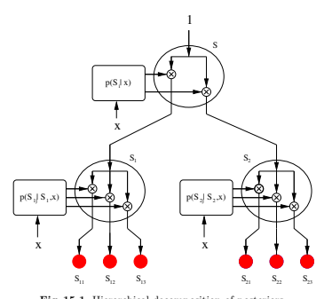

图 15.1. 后验的层次分解

潜在类别进入一个更优的决策过程。正如我们将在第四部分中看到的，统计语音识别是后一种情况的典型例子。

遵循*分治*方法，但对决策树框架进行泛化，统计后验概率分解的方法可以用于设计*软*分类树 [24, 25]。目前，我们假设可以获得最佳后验概率。设 S 为一组（可能很大）的待区分类别 ωk。假设我们有一种方法，可以将 S 划分为 M 个不相交且非空的子集 Si，使得 Si 的成员几乎从不与 Sj 的成员混淆（∀j = i）。特定类别 ωk 现在将是 S 的一个成员，并且正好属于一个子集 Si。因此，我们可以将类别 ωk 的后验概率重写为类别与相应子集 Si 的联合概率，并根据以下公式进行分解：

$p(\omega_{k}|\mathbf{x})=p(\omega_{k},S_{i}|\mathbf{x})$，其中 $\omega_{k}\in S_{i}$，$=p(S_{i}|\mathbf{x})\ p(\omega_{k}|S_{i},\mathbf{x})$。

因此，在 S 中区分所有类别的全球任务已被转换为（1）区分子集 Si 和（2）独立区分每个子集 Si 中剩余的类别 ωk。

递归地重复这个过程会产生一个层次树状结构（图 15.1）。

请注意，每个节点的子类 Si 的数量不需要在整个分类器树中保持不变，可能会在树设计阶段进行优化。为了计算特定类别的后验概率，我们必须沿着从根节点到与所询问类别相对应的叶子的路径，逐步相乘所有的条件后验概率。树结构的设计（*分治*）以及每个节点条件后验概率的估计和相乘（*征服*）都是该架构中重要的方面，必须彻底考虑，因为在实践中，只有条件后验的近似值可用。

## 15.2.2 层次解释

所呈现的架构可以解释为一种概率质量分配设备。在根节点，初始概率质量 1 被输入到架构中。在每个节点，传入的概率质量会乘以相应的条件后验概率，并传递到子节点。最终，概率质量在所有叶子（类别）之间分配，从而呈现它们的后验概率。相比之下，分类器树通常用作硬切换设备，从根节点到其中一个叶子只有一条路径。

通过软分类树对后验概率进行的分层分解提供了几种优势。如果树中的一个节点，例如根节点，无法提供良好的条件后验估计，硬决策树将产生许多分类错误。在软分类树中，这种缺陷对决策过程的影响较小。此外，通常可以通过更优的决策过程来恢复错误。

软分类树的另一个可以用于多种目的的方面是，在树的任何层次上观察到的和为一性质。树可以在某一层次上被截断，仍然可以作为软分类树使用，以计算后验类概率。这相当于通过根据树的拓扑聚类和合并原始类来创建一个新的（较小的）类集合。一般来说，结果分类任务将比原始任务更容易解决。

与交叉截面的和为一性质相关的是，从根节点到叶子的部分后验概率是单调递减的。这反过来允许在达到合适的阈值时关闭路径，从而修剪掉会得到低于阈值的后验概率的整个子树。这个性质使得可以在分类准确性与计算复杂性之间平滑地权衡。在极限情况下，当仅遵循一条具有最高条件后验概率的路径时，软分类树转变为硬决策树。

## 15.2.3 条件节点后验的估计

给定后验类概率的分层分解，接下来需要用所需条件后验的估计器来实例化树节点。

对于类的子集 Si 进行后验条件化可以通过将相应学习设备的训练集限制为具有 Si 中类标签的模式来实现。根据这种设置，每个节点中可用的训练数据根据类划分分布在所有子节点之间。

虽然根节点接收所有可用的训练数据，但树下方的节点接收的数据少于它们的前辈。另一方面，从根节点到叶子的专业化程度在增加。这一事实对在训练整个层次结构时的学习速度和模型选择有重要影响。

在后验概率的分层分解中，一个重要问题是每个树节点中必须提供的条件后验的实际估计器不可避免的误差。神经网络只能被训练来*近似*后验类别概率的真实分布，准确度的高低依赖于训练集所给出的任务固有难度、网络结构以及所采用的训练方案。对后验真实分布的不准确近似在分类树的上层影响最大——这一点必须在树设计过程中考虑，我们将在接下来讨论。

## 15.3 分类器树设计

在设计软分类树时，或等同于设计类别后验的分层分解时，算法的选择主要取决于初始类别的数量。我们将首先讨论最佳树结构，然后再转向在处理我们必须面对的大量类别时所需的启发式设计算法。

## 15.3.1 最优性

针对给定任务和条件节点后验的给定类型和结构的最佳软分类树是能够在贝叶斯设置中最小化分类错误的那一棵树。如果所有节点分类器都能够计算真实的条件后验，树的结构将不会影响分类器的性能，因为任何类型的因子化（通过任何树结构）都会导致类别后验的*精确*分解。然而，实际上，节点分类器的近似误差使得树结构的选择成为一个重要问题。对于少量类别，理论上可以通过彻底训练和测试某一特定节点（从根节点开始）所有可能的划分，找到最佳树，并选择能够提供最高识别准确度的那一个。然而，即使限制树结构为二叉分支节点和均衡划分，必须在根节点检查的划分数量 K

$$K={\frac{N!}{({\frac{N!}{2}}!)^{2}}}$$

很快就会使该算法达到极限，即使对于适度数量的类别 N。因此，我们必须考虑启发式方法来推导近似最佳的树结构。例如，一种有效的可能性是假设可实现的后验真实近似的准确性与对应类别集合的可分离性相关。

## 15.3.2 先验知识

根据上述指导原则，关于特定任务的先验知识通常可以应用于将全局类别集合分层划分为合理的子集。目标是以直观地最大化子集的分离性为方式来划分剩余的类别集合。例如，在语音识别器中，给定一组音素，合理的第一次划分将是构建由有声和无声音素组成的子集。在较大的语音识别系统中，我们必须区分多状态上下文相关音素时，诸如状态和上下文身份的先验知识可以作为划分标准。在说话者或书写者识别等任务中，性别或年龄等特征是潜在的划分标准候选者。

这种知识驱动的分解的优点在于快速的树设计阶段，这是处理大量类别时该方法的明显优势。然而，这种设计层次分类器的方法是主观且容易出错的。两个特定领域的专家可能在什么构成合理层次上有强烈的分歧。此外，并非总是合理的划分会带来良好的子集分离性。专家知识可能具有误导性。

## 15.3.3 混淆矩阵

如果类别数量足够小，允许训练一个单一的分类器，则软分类器树的设计可以基于训练好的单体分类器的混淆矩阵。混淆矩阵指示每对类别的混淆性，提供了相对良好的类别对分离性的度量。这些信息可以被利用来使用聚类算法设计树结构。例如，我们可以定义以下内容。

（对称）距离度量在两个不相交的类别集合 Sk 和 Sl 之间。

$d(S_{k},S_{l})=-\sum_{\omega_{i}\in S_{k}}\sum_{\omega_{j}\in S_{l}}C(\omega_{i},\omega_{j}|T)+C(\omega_{j},\omega_{i}|T)$。

C(ωi, ωj|T )表示在一组标记模式 T 上，类别ωi 与类别ωj 混淆的次数。距离 d(Sk, Sl)现在可以用作标准自底向上的聚类算法中的通常欧几里得距离度量的替代。不幸的是，一旦类别数量增加到几千，训练一个单体分类器变得越来越困难。

## 15.3.4 聚合聚类

假设类别的可分性与后验类别概率估计的近似精度相关，我们可以进一步假设类别的可分性可以通过特征空间中类别条件分布之间的适当距离来衡量。我们已经介绍了这种距离度量，作为类别混淆矩阵的元素。其他计算上更便宜的距离度量可以是类别均值之间的欧几里得距离或类别二阶统计量之间的马氏距离。不论选择哪种距离度量，目标始终是以最大化组间距离和最小化组内距离的方式对类别集合进行分组。对此问题的解决方案被称为聚合聚类算法，文献中提供了大量基本算法的变种 [7]。

## 15.4 应用于语音识别。

在本节中，我们将展示层次分类器方法在大词汇量连续语音识别 (LVCSR) 任务中的主要思想和优势。更具体地，我们将重点关注使用隐马尔可夫模型 (HMM) 的统计语音识别的声学建模 [27]。为了给出此类任务复杂性的印象：训练数据库通常由数千万个语音模式组成，所区分的声学类别数量从大约 50 个（单音节）到超过 20000 个（上下文相关多音节）不等。

## 15.4.1 统计语音识别。

HMM 基于语音识别的基本统计实体是给定声学观察序列 \(X_{1}^*,...,X_{M}^*\) 和一组模型参数 \(\Theta\) 的词序列 \(W_{1}^*,...,W_{N}^*\) 的后验概率。

\(P(W_{1},\ldots,W_{N}|\bf{X_{1}},\ldots,\bf{X_{M}},\bf{\Theta})\)

在训练过程中，我们寻找能够在训练数据上最大化此概率的参数 \(\Theta\)。

$${\hat{\mathbf{\Theta}}}=\operatorname{arg\,max}_{\mathbf{\Theta}}\prod_{t=1}^{T}P(W_{1},\ldots,W_{N(t)}|\mathbf{X_{1}},\ldots,\mathbf{X_{M(t)}},\mathbf{\Theta})$$

在识别过程中，我们希望找到最大化给定声学观察和固定模型参数 \(\Theta\) 的概率的词序列。

\(\hat{W}_{1},\ldots,\hat{W}_{N}=\arg\max_{W_{1},\ldots,W_{N}}P(W_{1},\ldots,W_{N}|\mathbf{X_{1}},\ldots,\mathbf{X_{M}},\mathbf{\Theta})\)，\(\mathbf{\Theta}\) 是线性微分算子，其中 \(\mathbf{\Theta}\) 是向量值的加性。

为了简化最大化词序列后验概率的过程，通常应用贝叶斯规则。

\(P(W_{1},\ldots,W_{N}|\mathbf{X_{1}},\ldots,\mathbf{X_{M}})=\frac{P(\mathbf{X_{1}},\ldots,\mathbf{X_{M}}|W_{1},\ldots,W_{N})\;P(W_{1},\ldots,W_{N})}{P(\mathbf{X_{1}},\ldots,\mathbf{X_{M}})}\)。

这个规则将估计过程分为所谓的 *声学模型 (AM)*。

由依赖于声学观察 X1*,...,*XM 的项和仅依赖于单词序列 W1*,...,W*N 的*语言模型（LM）*组成。在本文中，我们将重点关注使用连接主义估计器的声学建模，作为涉及成千上万类的任务的典型示例。有关 LVCSR 其他重要方面的综述

例如发音建模、语言建模和解码算法，读者可参见[27]。

声学建模的任务（忽略分母）是估计参数ΘAM，以最大化

$$P(\mathbf{X_{1}},\ldots,\mathbf{X_{M}}|W_{1},\ldots,W_{N},\mathbf{\Theta^{A M}})$$。

单词 Wi 被建模为音素模型的序列（或图）。单词到音素模型的映射通常通过发音词典完成。音素模型通常被建模为 m 状态的从左到右的隐马尔可夫模型（HMM），以捕捉语音信号的时间和声学变异性。下图显示了将单词序列转换为（1）发音图（可能包含发音变体）的过程。

以及（2）HMM 状态图。

图 15.2. 语音识别中的典型隐马尔可夫模型

在这个框架中，单词序列被表示为 HMM 状态的有向无环图，声学观察的似然可以重写为

$P(\mathbf{X_{1}},\ldots,\mathbf{X_{M}}|W_{1},\ldots,W_{N})=\sum_{s_{1},\ldots,s_{M}}P(\mathbf{X_{1}},\ldots,\mathbf{X_{M}}|s_{1},\ldots,s_{M})\ p(s_{1},\ldots,s_{M})$。

其中，求和扩展到 HMM 模型中单词序列 W1*,...,W*N 的所有可能状态序列 s1*,...,s*M。在维特比近似中，上述似然通过最可能状态序列的概率进行近似。

$P(\mathbf{X_{1}},\ldots,\mathbf{X_{M}}|W_{1},\ldots,W_{N})\approx\max_{s_{1},\ldots,s_{M}}P(\mathbf{X_{1}},\ldots,\mathbf{X_{M}}|s_{1},\ldots,s_{M})\ p(s_{1},\ldots,s_{M})$。

给定一个特定的状态序列，给定该序列的声学观察的似然可以因式分解如下。

$$P(\mathbf{X_{1}},\ldots,\mathbf{X_{M}}|s_{1},\ldots,s_{M})\approx\prod_{i=1}^{M}p(\mathbf{X_{i}}|X_{1},\ldots,X_{i-1},s_{1},\ldots,s_{M})\ p(s_{1},\ldots,s_{M})$$。

在将一阶隐马尔可夫模型应用于此类似然估计时，通常会做出两个简化假设：

- 观察独立性：

$P(\mathbf{X_{1}},\ldots,\mathbf{X_{M}}|s_{1},\ldots,s_{M})\approx\prod_{i=1}^{M}p(\mathbf{X_{i}}|s_{1},\ldots,s_{M})\ p(s_{1},\ldots,s_{M})$。

- 一阶假设：

$P(\mathbf{X_{1}},\ldots,\mathbf{X_{M}}|s_{1},\ldots,s_{M})\approx\prod_{i=1}^{M}p(\mathbf{X_{i}}|s_{i})\ p(s_{i}|s_{i-1})$。

## 15.4.2 发射和转移建模

主流 LVCSR 系统遵循上述方法，通过分别和独立建模发射概率分布 p(Xi|si)和转换概率 p(si|si−1)。发射概率分布通常使用来自指数族的混合密度建模，例如高斯混合。

$$p(\mathbf{X_{i}}|s_{i})=\sum_{k=1}^{n}\gamma_{k}N_{k}(\mathbf{X_{i}}|s_{i})$$

其中，γk 表示*混合系数*，Nk 表示*混合成分密度*（此处为：正态分布）。另一方面，转换概率则通过简单的多项式概率建模，因为它们仅依赖于离散变量（而非输入向量）。

这种方法的优点在于解耦的估计过程，分离了时间和声学建模。因此，它允许轻松变更 HMM。

训练后需要修改时间行为的状态拓扑。例如，状态复制是一种流行技术，用于增加电话模型中的最小持续时间约束。状态复制通过在多个状态之间共享声学模型并调整转换概率来实现，其包含了分离的发射和转换概率估计。

然而，上述方法的缺点是发射和转换概率的动态范围不匹配。原因在于转换概率作为多项式概率被单独建模，并受到总和为一的约束。这导致发射概率占主导地位，转换概率几乎不影响整体系统性能。

## 15.4.3 音位上下文建模

到目前为止，我们假设每个建模的单音位只需要一个 HMM。

（见图 15.2）。由于英语可以通过大约 45 个单音位建模，人们可能会有这样的印象：只需训练该数量的 HMM 模型。然而，在实践中，人们观察到一种称为共发音的效应，这会导致特定单音位实际发音的巨大变化，具体取决于其音位上下文。

通常，音位在音位上下文中的显式建模会带来识别准确性的巨大提升。然而，如何实现稳健的上下文依赖建模并不立即清晰。例如，考虑所谓的*三音位*模型。

三音位本质上代表特定单音位在特定上下文中的实现，跨越一个左侧和右侧的音位。假设有 45 个单音位，(理论上)可能的三音位数量为 453 = 91125。

由于语言中的语言学约束，许多三音位在实际语音中出现得很少或根本不出现。因此，使用三音位会导致系统参数过多，难以训练。为避免这个问题，必须引入跨不同三音位模型共享参数的机制。

通常，采用类似 CART 的决策树，根据三音素的先验概率和声学相似性将其聚类为*广义三音素*。这种自上而下的聚类需要指定可行属性，以作为音素上下文问题来拆分树节点。

通常使用的语言类别包括元音、辅音、摩擦音、爆破音等。此外，可以通过允许依赖于更广泛的上下文（而不仅仅是紧邻的左右音素）将三音素推广为*多音素*。图 15.3 显示了特定单音素状态的多音变体聚类的典型决策树。

给定系统中每个单音素状态的决策树的所有叶节点集合代表了一组强大而通用的上下文相关亚音素单元。由于这些单元中的每一个都对应几个三音素 HMM。

图 15.3. 使用决策树的音素上下文建模。显示的是单音素 /AX/ 的中间状态（3 状态 HMM）的音素上下文决策树。

状态，通常称为*关联状态*。典型的大词汇量连续语音识别器模型介于 3000 到 24000 个这样的关联状态之间。主流 LVCSR 系统可以扩展到任意数量的上下文相关建模单元，因为每个关联状态的发射和转移模型是独立估计的。

## 15.4.4 连接主义声学建模

局部判别连接主义声学建模是将神经网络整合到 HMM 框架中的最流行方法 [3, 4, 18]。它基于使用贝叶斯法则将局部后验类别概率的估计转换为缩放的似然值。这些缩放的似然值随后可以作为标准 HMM 中的观测概率估计。对于适中的小数量 N 的 HMM 状态，可以训练一个神经网络共同估计每个状态 si 在给定输入向量 Xi 的情况下的后验概率 p(si|Xi)。贝叶斯法则得到相应的缩放 1 类条件似然。

$${\hat{p}}(\mathbf{X_{i}}|s_{i})={\frac{p(s_{i}|\mathbf{X_{i}})}{p(s_{i})}},$$

1 缺失的额外项由输入向量的概率 p(Xi) 组成。

通常被省略，因为它与类别/状态身份无关，因此不会影响 Viterbi 风格搜索最可能的状态序列。

图 15.4. 用于估计上下文相关后验的神经网络（HNN）层次结构拓扑，基于先验音素知识进行因子分解。

在使用神经网络估计 p(si|Xi)时，先验概率 p(si)可以通过训练数据中观察到的相对频率进行估计。一些研究者（例如[3, 14]）报告称，当发射概率估计技术是唯一的不同之处时，连接主义声学建模有所改善。由于主流的语音识别 HMM 大多是在最大似然框架下使用期望最大化（EM）算法进行训练，因此通常观察到，结合专注于建模类别边界而非类别分布的判别训练神经网络是有益的。此外，与高斯混合声学模型相比，连接主义声学模型通常在参数更少的情况下实现相同的准确性。

然而，当 HMM 状态的数量增加以建模上下文相关的多音素（三音素、五音素）时，单一神经网络无法再用于估计后验概率。这就需要对后验状态概率进行分解[17]，并模块化估计这些后验的过程。在大多数方法中，后验是在音素上下文或单音素身份上进行分解的（例如[4, 9, 15]）。将分解视为后验的层次分解，我们通过引入神经网络的树状结构层次（HNN）[12, 13]，将这些方法推广到上下文相关的连接主义声学建模，基于先验知识（例如广泛的声音类别（静音、噪音、音素）、音素上下文和 HMM 状态身份）对后验进行多层次分解。图 15.4 显示了这种结构的拓扑。

在这个层次的顶端，我们通过两个网络（SIL-Net，SPEECH-Net）区分静音、噪音和语音声音。这种特定划分的动机来自于观察到这三类声音在声学上易于区分。树状结构的其余部分对语音的后验进行分解，条件为单音素、上下文和状态身份，因为这些是任何基于音素的 HMM 语音识别器建模的方便声音类别。图 15.4 的层次结构甚至可以进一步分解，例如，通过基于语言特征（例如浊音/清音、元音/辅音、摩擦音等）对条件单音素后验（由 MONO-Net 估计）进行分解。这样的分解背后的动机有两个方面。首先，它减少了每个节点中的局部类别数量，提高了近似精度；其次，它产生了一组解耦和专门的专家网络，能够处理更少的音素变异。

然而，如第三部分所述，使用先验知识来设计神经网络层次结构并未考虑特征空间中观察类别的相似性。因此，我们开发了一种聚合聚类算法，自动设计这样的层次结构，以估计大量类别的后验。我们将这一框架称为 ACID/HNN [11]。

## 15.4.5 酸聚类

ACID（基于信息散度的聚类）是一种自下而上的聚类算法，用于设计树状软分类器，例如神经网络（HNN）的层次结构[10, 11]。虽然该算法是为了连接主义声学建模而开发的，但原则上可以用于任何类型的分类任务。从一个通常非常大的初始类别集合开始，例如语音识别器中的决策树聚类 HMM 状态集合 2，ACID 算法构建一个二叉层次结构。结果树中的节点随后用相应条件后验概率的估计量进行实例化，例如以 HNN 的形式。ACID 算法中的聚类度量是对称信息散度[26]。

$$d(s_{i},s_{j})=\int_{\mathbf{x}}\left(p\left(\mathbf{x}|s_{i}\right)-p\left(\mathbf{x}|s_{j}\right)\right)\log{\frac{p(\mathbf{x}|s_{i})}{p\left(\mathbf{x}|s_{j}\right)}}\ d\mathbf{x}$$

聚类的类条件密度。与大多数通过均值表示聚类并采用欧几里得距离度量的标准聚合聚类算法相比，我们选择在 ACID 算法中通过参数混合密度（高斯混合）来表示聚类。

2 在我们的实验中，我们尝试了多达 24000 个初始类别。

使用混合密度建模聚类比仅使用均值要合适得多，并且仍然可以在合理的时间内聚类大量类别。对称信息散度（也称为 Kullback-Leibler 距离）衡量两个分布的相似性，因此被选择为聚类度量。通常，每个初始类别（状态）使用单个完全协方差的多变量高斯密度建模。

$$p(\mathbf{x}|s_{i})={\frac{1}{\sqrt{(2\pi)^{n}|\Sigma_{i}|}}}\exp\{-{\frac{1}{2}}(\mathbf{x}-\mu_{i})^{t}\Sigma_{i}^{-1}(\mathbf{x}-\mu_{i})\}$$

具有均值向量μi 和协方差矩阵Σi。聚类然后不断合并初始类别，这对应于基于高斯分布构建混合密度。具有高斯分布的两个状态 si 和 sj 之间的对称信息散度为

$$\begin{array}{l}{{d(s_{i},s_{j})=\frac{1}{2}t r\{(\mathbf{\Sigma}_{i}-\mathbf{\Sigma}_{j})(\mathbf{\Sigma}_{j}^{-1}-\mathbf{\Sigma}_{i}^{-1})\}}}\\ {{\qquad\qquad+\frac{1}{2}t r\{(\mathbf{\Sigma}_{i}^{-1}+\mathbf{\Sigma}_{j}^{-1})(\mu_{i}-\mu_{j})(\mu_{i}-\mu_{j})^{t}\}}}\end{array}$$

计算该距离度量需要 O(n²)次乘法和加法（假设预先计算了逆协方差矩阵），其中 n 是输入特征空间的维度。为了降低 ACID 聚类算法的计算负担，可以仅用对角协方差矩阵来建模类别条件似然。主成分分析和线性判别分析等特征空间变换可以用来近似这样的分布。当使用对角协方差高斯时，对称信息散度简化为...

$$d(s_{i},s_{j})=\frac{1}{2}\sum_{k=1}^{n}\frac{(\sigma_{j k}^{2}-\sigma_{i k}^{2})^{2}+(\sigma_{i k}^{2}+\sigma_{j k}^{2})(\mu_{i k}-\mu_{j k})^{2}}{\sigma_{i k}^{2}\sigma_{j k}^{2}}$$

其中σ²ik 和μik 分别表示状态 si 的方差和均值向量的第 k 个系数。后者距离度量的评估仅需 O(n)次乘法和加法。

在简化假设信息散度线性的情况下，我们可以定义以下高斯群集 Sk 和 Sl 之间的距离度量。

$$D(S_{k},S_{l})=\sum_{s_{i}\in S_{k}}p(s_{i}|S_{k})\sum_{s_{j}\in S_{l}}p(s_{j}|S_{l})d(s_{i},s_{j})$$

此距离度量在 ACID 聚类算法中使用：

1. 用 N 个簇 Si 初始化算法，每个簇包含...

ACID 初始化。初始化需要估计识别器建模的所有（绑定的）状态的类别条件似然。初始类别的数量 N...

因此，类别的数量由语音识别器的其他部分确定，即通常应用于聚类音素上下文的语音决策树，或等效地绑定 HMM 状态[27]。这些类别的初始类别条件密度可以通过使用维特比算法或前向-后向算法在训练数据和相应 HMM 上进行状态对齐计算。

从训练转录生成的状态图。因此，ACID 算法的初始参数模型的估计只需对训练数据进行一次遍历。在初始模型估计后，实际的 ACID...

聚类不需要对训练数据进行任何进一步的遍历。此外，请注意，该算法在没有语音身份知识的情况下，仅基于声学差异对 HMM 状态进行聚类。

ACID 树状图。为了说明，图 15.5 显示了在相对较小的仅 56 个初始类别（对应于上下文独立语音识别器中的单状态单音 HMM 集合）上进行的典型 ACID 聚类运行的树状图。类别集合由 44 个标准英语音素和 7 个噪声音（用加号标记）、4 个模拟感叹词的音素（用&符号标记）以及静音（SIL）组成。

顶层划分几乎完美地区分了沉默、呼吸和噪音（下层子树）与语音声音（上层子树）。此外，在 ACID 树中可以观察到声学上相似的音素聚类，例如

- IX, IH, IY, Y - JH, CH, SH, ZH - Z, S, F - ER, AXR, R

图 15.5. ACID 聚类的典型树状图

发现 ACID 聚类在将分类任务层次分解为逐渐增加难度的子任务方面非常有效（当从根节点遍历到叶子节点时）。在连接主义声学建模的语音识别中，我们观察到 ACID 聚类的 HNN 树上层节点区分广泛的语音类别，而树下层节点则开始区分特定音素。因此，ACID 聚类构成了一种有效的算法，用于发现固有的层次结构并利用其进行模块化分类。

模型选择。模型大小和拓扑的选择在将层次软分类器应用于连接主义语音识别等任务时变得非常重要。尽管全局树的拓扑由 ACID 聚类的结果（或任何其他树设计过程）决定，但仍需决定局部（节点内部）分类器的拓扑。局部分类器的任务是根据可用的训练数据估计条件后验概率。由于特定的局部估计量以树中所有前驱节点为条件，因此它只能接收来自可以从相应节点到达的所有类别（叶子）的训练数据。这意味着从根节点到树中更深的节点，训练集逐渐减少。图 15.6 展示了这一 HNN 特性，绘制了可用训练模式数量与节点深度之间的关系，对于具有 6000 个叶子的二叉层级，请注意纵轴的对数刻度。

图 15.6. HNN 树中不同深度的可用训练数据

在决定局部模型复杂性时，我们将树节点视为在以下两个极端之间的连续体：

## 层级顶部

- 大量的训练数据可用

- 允许大型节点分类器 - 相对简单的通用分类任务 层级底部

- 仅有少量可用的训练数据 - 需要相对较小的节点分类器 - 相对困难的分类任务

- 高度专业化 理想情况下，局部节点分类器的复杂度应选择以最大化完整层次结构的泛化能力。另一方面，泛化受到三个因素的影响：（1）训练集的大小和分布，（2）模型复杂度，以及（3）特定任务的分类复杂度。显然，我们无法改变后者的因素。此外，在我们架构的背景下，我们假设每个节点的训练集大小由树拓扑结构固定，一旦层次结构设计完成。

因此，我们必须根据可用的训练数据和分类任务的难度选择模型复杂度。

在我们的连接主义声学建模实验中，我们通常使用具有单个隐藏层的多层感知机（MLP）节点，并通过改变隐藏单元的数量来控制模型复杂度。我们使用标准的投影核，隐藏单元采用 tanh 激活，输出单元使用与任务相关的非线性（对二分类使用 sigmoid，对多分类使用 softmax）。该网络的整体权重数量线性依赖于隐藏单元的数量。根据[1]和一些近似法，经验法则是选择隐藏单元 M，使其满足

$$N>{\frac{M}{\epsilon}}$$

其中 N 是训练集的大小， 是测试集上的预期错误率。在我们的案例中，不同节点中训练模式数量的变化主导了上述公式。因此，我们将隐藏单元的数量设为与 b−n 成比例，其中 b 是分类树的分支因子，n 是节点深度。只要树在子节点的先验分布方面大致平衡，这一策略就会导致隐藏层的大小与可用训练模式的数量成比例。希望对模型复杂度的更基础的处理使用多个训练运行和交叉验证。然而，在大型应用如语音识别的情况下，由于来自非常大的训练数据库的高计算成本，这一策略是不可实现的。仍需探索选择模型复杂度的更少启发式的方法。

## 15.4.6 在大型数据集上训练神经网络的层次结构

为了演示在典型数据集上训练大型和复杂结构（如神经网络层次结构）的各种方面，我们报告了在 Switchboard [19]语音识别数据库上的实验。Switchboard 是一个大型的美国英语对话语料库，在全美国以电话质量录制。它包含大约 170 小时的语音，通常对应约 6000 万个训练样本。该语料库目前作为最先进语音识别系统的官方评估基准。Switchboard 是一个相对困难的任务，目前最佳系统的词错误率在 30-40%的范围内。图 15.7 显示了基于 HNN 的连接主义声学模型的结构，适用于基于 HMM 的识别器，在我们的案例中是 Janus 识别工具包（JanusRTk）[8]。

图 15.7. 用于连接主义声学建模的神经网络层次结构：上半部分显示了经过节点合并的 ACID 聚类 HNN。这种架构计算一组广义多音素的后验概率。为了便于集成到 HMM 框架中，这些后验概率被转换为缩放似然度。与实际 HMM 状态的对应是通过音素决策树实现的。

由于任务固有的可变性和复杂性以及大量的训练数据，典型的语音识别系统将几千个不同的子音素单元（HMM 状态）建模为基本类别。这需要训练一个估计器，以根据数百万个训练样本估算数千个不同声学类别的后验概率，以便充分利用语音识别器的建模粒度。

接下来，我们将讨论在大型数据集（如 Switchboard）上训练层次软分类器的几个方面。由于分类器的模块化结构、模型库存和训练数据库的大小，以下讨论导致了一些独特的问题和解决方案。然而，重要的是要强调，这些属性源于分类器的结构和任务的规模——而不是特定的语音识别声学建模任务。因此，它们可以转移到相应的大型任务，例如手写、说话人或面部识别。分类器树拓扑。根据要建模的类别数量，需要选择树设计算法、分支因子以及局部节点分类器的大小和结构。对于 Switchboard，我们实验了由 6000、10000 和 24000 个不同类别组成的三个系统。我们使用 ACID 聚类算法从 6k 和 24k 系统的基础类别集中设计了初始树结构。作为树设计阶段的第二步，我们在 ACID 聚类层次上应用了贪婪节点合并算法。节点合并减少了内部节点的数量，同时增加了树的平均分支因子（元数）。训练这样的层次结构比训练原始的二叉树结构问题更少，因为节点之间的差异（就可用训练模式的数量而言）有所减弱，网络的总数量减少。然而，局部分类任务从 2 向（二项式）变为更复杂的多向（多项式）问题，这可能会影响条件后验估计的准确性。因此，我们限制节点合并算法生成最大分支因子为 8-12 的节点。这个值被发现能够提高训练速度，同时不影响整体分类器的准确性。在我们的案例中，明显更大的分支因子是不合理的，因为我们将逐渐失去层次结构的优势，导致树的扁平化。

对于 10k 系统，我们使用的是图 15.4 的架构，该架构是基于先前的知识设计的，并未考虑任何类别相似性的度量。该结构表现出更大的平均分支因子和比 ACID 聚类树更少的深度。虽然我们可以通过引入如前所述的语言类别来降低 MONO 节点的分支因子，但上下文节点的分支因子仍然很大，仅凭先前的知识很难解决。

结果树节点由不同大小的单层隐藏层的 MLP 实例化。局部 MLP 的输出层使用 softmax 非线性参数化，原因有两个。首先，它符合建模概率分布的属性，总和为 1；其次，softmax 函数实现了多项式概率密度的期望值。

图 15.8 概述了 ACID/HNN 系统的结构。树的压缩将 24k 系统的内部节点数量从 24k 减少到约 4k，平均局部类别数（平均分支因子）从 2 增加到约 8。尤其是在处理大量类别时，我们发现适度的树压缩提高了分类器性能。

| level   | # nodes =                | # hidden   |
| --- | --- | --- |
|         | # networks units/network |            |
| 1       | 1                        | 128        |
| 2       | 10                       | 128        |
| 3       | 77                       | 64         |
| 4       | 524                      | 32         |
| 5       | 3434                     | 16         |
| total   | 4046                     |            |
| level                    | # nodes =   | # hidden   |
| --- | --- | --- |
| # networks units/network |             |            |
| 1                        | 1           | 256        |
| 2                        | 1           | 256        |
| 3                        | 1           | 256        |
| 4                        | 3           | 192        |
| 5                        | 19          | 128        |
| 6                        | 121         | 64         |
| 7                        | 816         | 32         |
| total                    | 962         |            |

图 15.8. ACID 集群 HNNs 的概述，左侧为 6k 类，右侧为 24k 类

因素)从 2 到约 8。尤其是在处理大量类别时，我们发现适度的树压缩提高了分类器性能。

树分类器的整体参数数量为 6k 系统的 2M，10k 系统的 2.4M 和 24k 系统的 3.1M。训练算法和参数。在不同训练数据量上训练分布式、分层组织的神经网络集合是一项具有挑战性的任务。我们的训练标准是最大似然，假设所有基本类的多项式概率模型（1-out-of-N）。每个训练样本都有一个目标类标签，指示正确的基本类。沿着从根节点到当前目标类叶子的路径上的所有节点网络都接收当前样本进行训练。由于训练数据量大，我们使用在线（随机）梯度上升法，采用小批量（10-100 个样本）训练各个网络。在我们的场景中，应用二阶方法优化目标函数的更复杂训练算法成本过高——单个训练周期处理训练数据库中所有 6000 万样本需要在 Sparc Ultra 工作站上花费 3-5 天。因此，实用的训练算法必须在 1-4 个周期内收敛。此外，由于需要训练的大量网络，潜在的训练算法不能占用大量内存——这可能是二阶方法的情况。当然，单个节点分类器的训练是独立的，因此可以轻松并行化以适应共享内存的多处理器，从而减轻了后者的要求。

由于我们在训练方法中依赖于*随机*梯度上升，因此我们还使用一个简单的动量项来平滑梯度。此外，我们为每个网络使用局部学习率，初始时使用全局学习率，并根据具体学习任务进行单独调整。全局学习率采用指数衰减方案：

$$\eta_{G}^{n+1}=\eta_{G}^{n}*\gamma_{G}.$$

通常，我们使用初始全局学习率ηG 在 0.001 到 0.01 之间，动量常数为 0.5，全局退火因子γG 在每次批量更新后为 0.999 ... 0.9999。

为了适应由于可用训练数据量不同而导致的节点分类器的不同学习速度，我们使用以下连续梯度向量 gn−1 和 gn 之间的相关性度量来控制各自的学习率：

$$\alpha_{n}=\operatorname{arccos}\left({\frac{g_{n}^{t}g_{n-1}}{||g_{n}||||g_{n-1}||}}\right)$$

αn 测量梯度 gn−1 和 gn 之间的角度。小角度表示高度相关，因此在权重空间中稳定移动。因此，每当 αn < 90◦ 并持续几个批次更新 M 时，我们会将学习速率线性提高到当前最大值（由初始学习速率、退火因子和执行的更新次数决定）。另一方面，大角度表示权重空间中的随机跳跃。因此，每当 αn > 90◦ 并持续几个批次更新 M 时，我们会指数级降低学习速率。

总结而言，我们得到网络 i 的局部学习速率 ηi 的以下更新规则：

$$\eta_{i}^{n+1}=\operatorname*{min}\left\{\eta_{G}^{n+1},\left\{\begin{array}{l}{{\eta_{i}^{n}+\delta}}\\ {{\eta_{i}^{n}*\gamma}}\\ {{\eta_{i}^{n}}}\end{array}\right\}\right\}\quad\quad\mathrm{if}\quad\left\{\begin{array}{l l}{{{\frac{1}{M}\left(\sum_{k=0}^{M}\alpha_{n-k}\right)<90^{\circ}-\epsilon}}}\\ {{{\frac{1}{M}\left(\sum_{k=0}^{M}\alpha_{n-k}\right)>90^{\circ}+\epsilon}}}\\ {{\mathrm{else}}}\end{array}\right\}.$$

线性增加 δ = 0.001 ... 0.01 和指数退火因子 γ = 0.5 ... 0.9。批次更新次数 M 控制 α 的平滑程度，而 控制全局学习速率的影响。对于 → 90◦，局部学习速率被迫跟随全局学习速率，而低值 允许局部学习速率独立发展。在我们的实验中使用的典型值为 M = 10 和 = 20◦。

适应个体学习速率以应对训练速度是分层分类器中的一个关键问题。树顶的网络需要在非常大量的训练数据上进行训练。因此，必须允许学习速率相对较小，以便充分利用所有数据，避免过早达到饱和点。另一方面，树底的网络需要在相对较小的数据量上进行训练。为了在整个数据上以相同的少量轮次训练这些网络，我们必须施加相对较大的学习速率，以尽快达到局部似然的最大值。然而，不受限制的学习速率适应与激进的学习速度优化可能导致无法收敛。在我们对所有网络使用相同最大学习速率的全局初始化实验中，最大学习速率的全局退火和局部学习速率的适应（被限制为绝不超过全局学习速率）取得了最佳结果。

泛化/过拟合。简单来说，我们在实验中没有观察到任何过拟合。查看大型层次结构在独立交叉验证集上的表现（图 15.9），我们可以看到该数据的似然性趋于平稳，但从未再次下降，这在较小任务中常常会观察到。在图 15.9 的图表中，垂直线表示通过训练数据（包含 87000 个语句）的多个历时（遍数）。显然，大量可用的训练数据允许出色的泛化，早期停止并不是必要的。这种行为初看令人惊讶，因为我们没有对局部 MLPs 使用任何形式的显式正则化。然而，仔细观察后，我们可以确定 HNNs 在此任务上良好泛化的几个原因：

- 在我们的案例中，训练数据可以被视为非常嘈杂，因为样本来自不同说话者和录音条件的多种来源。使用嘈杂数据进行训练类似于正则化，因此可以改善泛化[2]。

- 考虑 6k 类系统的层次结构（图 15.8）。树底部的 816 个网络可能没有见过足够的训练模式，无法很好地泛化到新数据。尽管这些网络总共构成了 85% 的网络总数，但它们在任何特定后验概率中只贡献 7 个网络之一。层次结构上部的网络对后验概率的评估有最大的影响。对于这些网络，现有的训练数据量可以被视为非常丰富，以至于测试集误差接近训练集误差率。换句话说，可以实现**最佳泛化**。

结果。我们将提出的层次分类器作为连接主义声学模型评估在语音识别系统中的表现。语音识别器的性能通常通过在一个合理大的测试语句集上的字错误率来衡量。在我们的案例中，我们在官方 1996 Switchboard 评估测试集的每位说话者前 30 秒中测试不同的声学分类器，该测试集包含 366 个不在训练集中的语句。

| 声学分类器         | 类别数量 参数数量 字错误率             |       |        |
| --- | --- | --- | --- |
| HNN                   | 10000                                    | 2.0 M | 37.3 % |
| ACID/HNN              | 6000                                     | 2.4 M | 36.7 % |
| ACID/HNN              | 24000                                    | 3.1 M | 33.3 % |

图 15.9. 24k ACID/HNN 架构训练中的交叉验证

上述结果与最先进系统的结果具有竞争力，并表明 ACID 聚类相较于预定层次分类器具有明显优势。我们怀疑，自动聚类的神经网络层次结构性能更佳的原因在于树的拓扑结构差异。自动聚类的 HNN（如所展示的 ACID/HNN 树）表现出小而相对均匀的平均分支因子，这使得能够稳健地训练条件后验概率的估计器。相比之下，手工设计的层次结构如 10k HNN 树包含分支因子相对较大的节点。图 15.10 显示了 10k 树结构中所有网络的分支因子。

图 15.10. 10k HNN 中各个节点的分支因子

在这棵树中观察到的最大分支因子为 276。这需要对多达 276 个类别的条件后验概率进行联合估计，这可能导致对树中某些网络的真实后验概率的相当糟糕的逼近。

此外，ACID/HNN 分类器相较于手工设计的 10k 树的优越性能，证明了层次方法的完全可扩展性，并为参数数量的增加提供了正当理由。早期尝试为 24k 类别训练手工设计的层次结构未能提供可用作语音识别器声学模型的分类器。对真实后验概率的粗略逼近导致在此情况下解码时因除以先验而产生不稳定性。除此之外，我们不知道其他任何非参数方法能够直接和有区分地估计如此大量类别的后验概率。

## 15.5 结论

我们提出并讨论了一种利用层次连接主义框架对大量类别的后验概率进行估计的方法论。本文的目的是展示层次方法在大型应用领域（如语音识别）中对分类任务进行模块化的必要性，在这些领域中必须考虑成千上万的类别，并且有数百万的训练样本可用。*分而治之*的方法被证明是一种灵活的工具，可以将原始问题的复杂性分解为许多较小的任务。此外，聚合聚类技术可以自动对给定类别集施加合适的层次结构，即使该类别集包含数万个类别。在处理大规模概率估计问题时，与相对较小的标准学习机器基准相比，训练方法的选择、模型选择和泛化能力等方面显得格外重要。

[1] Baum, E.B., Haussler, D.: 多大规模的网络能提供有效的泛化？神经计算 1, 151–160 (1989)

[2] Bishop Training, C.M.: 带噪声相当于 Tikhonov 正则化。神经计算 7(1)，108–116（1995 年）

[3] Bourlard, H., Morgan, N.: 连接主义语音识别 - 一种混合方法。Kluwer 学术出版社（1994 年）

[4] Bourlard, H., Morgan, N.: 一种用于连续语音识别的上下文依赖神经网络。在：IEEE 国际声学、语音和信号处理会议，旧金山，加州，卷 2，页 349–352（1992 年）

[5] Breiman, L., Friedman, J.H., Olshen, R.A., Stone, C.J.: 分类与回归树。Wadsworth 国际集团，贝尔蒙特（1984 年）

[6] Bridle, J.: 前馈分类网络输出的概率解释及其与统计模式识别的关系。在：Fogelman-Soulie, F., Hérault, J.（主编）神经计算：算法、架构和应用。施普林格出版社，纽约（1990 年）

[7] Duda, R., Hart, P.: 模式分类与场景分析。约翰·威利与儿子公司（1973 年）

[8] Finke, M., Fritsch, J., Geutner, P., Ries, K., Zeppenfeld, T.: JanusRTk Switchboard/Callhome 1997 评估系统。在：LVCSR Hub5e 研讨会论文集，巴尔的摩，马里兰，5 月 13-15 日（1997 年）

[9] Franco, H., Cohen, M., Morgan, N., Rumelhart, D., Abrash, V.: 在混合隐马尔可夫模型-神经网络语音识别系统中的上下文依赖连接主义概率估计。计算机语音与语言 8(3)，211–222（1994 年）

[10] Fritsch, J., Finke, M.: ACID/HNN：用于上下文依赖连接主义声学建模的神经网络聚类层次。在：国际声学、语音和信号处理会议论文集，西雅图，华盛顿（1998 年 5 月）

[11] Fritsch, J.: ACID/HNN：分层连接主义声学建模框架。在：IEEE 自动语音识别与理解研讨会论文集，圣巴巴拉，加州（1997 年 12 月）

[12] Fritsch, J., Finke, M., Waibel, A.: 使用多音聚类决策树的上下文依赖混合 HME/HMM 语音识别。在：国际声学、语音和信号处理会议，慕尼黑，德国，卷 3，页 1759（1997 年）

[13] Fritsch, J.: 用于语音识别的模块化神经网络，技术报告 CMUCS-96-203，卡内基梅隆大学，匹兹堡，PA（1996 年）

[14] Hochberg, M.M., Cook, G.D., Renals, S.J., Robinson, A.J., Schechtman, R.S.: 1994 年 ABBOT 混合连接主义-HMM 大词汇识别系统。

在：口语语言系统技术研讨会，页 170–176。ARPA（1995 年 1 月）

[15] Kershaw, D.J., Hochberg, M.M., Robinson, A.J.: 在混合递归网络-HMM 语音识别系统中的上下文依赖类，技术报告。

CUED/F-INFENG/TR217，剑桥大学工程系，剑桥，英格兰（1995 年）

[16] Merz, C.J., Murphy, P.M.: 加州大学 UCI 机器学习数据库存储库，信息与计算机科学系（1996 年）

http://www.ics.uci.edu/~mlearn/MLRepository.html

[17] 摩根，N.，布尔拉德，H.：通过统计方法分解网络。神经计算 4(6)，835–838（1992）

[18] 摩根，N.，布尔拉德，H.：混合 HMM/连接主义连续语音识别的介绍 信号处理杂志，25–42（1995 年 5 月） [19] NIST，对话语音识别研讨会，DARPA Hub-5E 评估，1997 年 5 月 13-15 日，马里兰州巴尔的摩

[20] 普雷切尔，L.：Proben1 - 一组神经网络基准问题和基准规则。技术报告 21/94，卡尔斯鲁厄大学，德国（1994）

[21] 奎因兰，J.R.：决策树的归纳。机器学习 1, 81–106（1986） [22] 拉比纳，L.R.：隐马尔可夫模型及其在语音识别中的应用教程。IEEE 会议论文 77, 257–285（1989）

[23] 萨法维安，S.R.，兰德格雷贝，D.：决策树分类器方法的调查。

IEEE 系统、人和控制论交易 21(3)，660–674（1991）

[24] 舒尔曼，J.，多斯特，W.：一种基于决策的分层分类器设计方法。模式识别 17(3)，359–369（1984）

[25] 舒尔曼，J.：模式分类：统计和神经方法的统一视角。约翰·威利父子公司，纽约（1996）

[26] 图，J.T.，冈萨雷斯，R.C.：模式识别原理。阿迪森-韦斯利，阅读（1974）

[27] 杨，S.：大词汇连续语音识别：回顾。剑桥大学工程系

技术报告，剑桥大学（1996）

# 时间序列技巧-

## 前言

在最后一部分，我们专注于与时间序列分析和经济预测相关的技巧。在第十六章，约翰·穆迪首先调查宏观经济预测的挑战，包括噪声、非平稳性、非线性以及缺乏良好的*a priori*模型等问题。为了避免让人气馁，接下来介绍了许多可能的神经网络解决方案，包括超参数选择（例如用于正则化、训练窗口长度）。

输入变量选择、模型选择（网络的规模和拓扑）、更好的正则化器、委员会预测和模型可视化。

调查之后是对平滑正则化器、模型选择方法（例如预测风险、非线性交叉验证（NCV）（第 357 页））和基于灵敏度的剪枝（SBP）（第 359 页）的更详细描述。

用于输入选择。使用正则化器的目标是向模型引入偏差。但什么是“正确的偏差”？权重衰减可能过于*临时性*，因为它并未考虑被学习函数的性质。作为替代，作者提出几种新的平滑正则化器，适用于前馈和递归网络，实证结果显示效果更佳。

在模型选择中，预测风险作为确定“最佳拟合”的标准。讨论并比较了几种估计预测风险的方法：广义交叉验证（GCV）、赤池信息量准则（FPE）、预测平方误差（PSE）和广义预测误差（GPE）。

可以用有效参数数量来表达。

在交叉验证中，对数据的不同子集训练独立的网络以获得预测风险的估计。然而，使用非线性损失函数时，每个网络可能会收敛到不同的局部最小值，使得比较变得困难。NCV 通过将每个将在 CV 子集上训练的网络初始化到相同的最小值 w0（在完整训练集上获得）来缓解这个问题。这样，在不同子集上计算的 CV 误差估计围绕这个最小值 w0 的预测风险，而不是使用一些远程局部最小值。SBP 用于选择要使用的“最佳子集”输入变量。在这里，使用一种敏感性度量（例如，delta 误差、平均梯度、平均绝对梯度、RMS 梯度）（第 360 页）来测量如果去除给定输入将导致的训练误差变化。输入变量根据重要性排名，从最不重要的开始，逐个剪除，并在每次剪除之间进行重新训练。最后，John Moody 展示了如何通过视觉手段随时间检查敏感性度量，以更好地理解每个输入的作用（第 361 页）。在整个过程中，提供了美国工业生产指数预测的实证结果。

- 之前发表在：Orr, G.B. 和 Müller, K.-R.（编辑）：LNCS 1524，ISBN

978-3-540-65311-0（1998 年）。

G. Montavon 等（编辑）：NN：实用技巧，第二版，LNCS 7700，第 339–341 页，2012 年。

-c Springer-Verlag Berlin Heidelberg 2012

在第十七章中，Ralph Neuneier 和 Hans Georg Zimmermann 详细描述了他们在经济预测背景下用于神经网络训练的令人印象深刻的综合系统——包括许多不同的技巧。作者讨论了他们系统的所有设计步骤，例如输入预处理、成本函数、异常值处理、架构、正则化技术、学习技术、稳健估计、误差条估计和剪枝技术。与第一章一样，这里的技巧也是高度交错的，即如果单独使用而不是整体使用，许多技巧将无法保持其全部效率。让我们从预处理开始，作者使用：平方输入（见第七章）、缩放相对差异、以缩放曲率或均值回归形式的缩放力，这可以表征时间序列的转折点（第 370 页）。为了限制异常值的影响，前面提到的输入被转换为

## X = Tanh(Wx)，

其中参数 w 作为训练过程中的一层被学习（第 371 页）。随后，一个瓶颈网络将输入数量减少到相关的部分（第 372 页）。由于时间序列预测的网络通常是底重的，即输入维度大而输出维度非常小，因此增加输出目标的数量非常重要，以便更多有用的误差信号能够进行反向传播（另见[3, 2]）。为此，作者引入了两个输出层：（1）点预测层，不仅使用待预测的值，即 yt+n，还使用一系列时间上的邻近值；（2）交互层，其中使用这些值之间的差异，即 yt+n+1 − yt+n，来对应曲率（第 375 页）。

在这个有趣的技巧之后，将多个点预测进行平均，以减少预测的方差，类似于集成方法[1]（第 377 页）。这一整体设计催生了一个 11 层的神经网络架构，其中编码了来自金融预测的可用先验知识。

为了训练这种大型但相对受限的架构，定义了成本函数（第 383 页），并提出了一种基于 CDEN 方法（第 384 页）的估计预测误差条的方法。

为了训练网络，引入了所谓的变η学习规则，这本质上是具有每个权重个体学习率的准牛顿算法的随机近似（第 392 页）。作者讨论了简单的逐模式规则如何对结构产生影响，从而改善泛化行为；换句话说，学习的随机性隐含地对不可靠的网络部分施加了曲率惩罚。

然后，作者提出了观察者-观察者困境的挑衅性问题：在基于观察数据创建模型的同时，使用该模型来判断新进入数据的正确性（第 391 页）。这导致了（1）清理和（2）对输入数据进行噪声训练。清理的基本原理是，一个非常嘈杂的环境，例如金融数据，如果数据过于严肃地被看待，会破坏良好的预测。也就是说，我们被允许在输入空间中稍微移动数据点，以便获得更平滑的预测（第 395 页）。类似地，通过算法为每个输入选择不同的附加噪声水平，以便将噪声水平适应于（估计的）输入重要性：对完美描述或不重要的输入使用较小的噪声水平，而对描述不佳（可能受到噪声干扰）的输入则应选择较大的噪声水平（第 397 页）。

在下一步中，描述了优化架构的剪枝方法。它们包括：（1）节点剪枝（第 401 页）和（2）几种类型的权重剪枝：（a）随机剪枝（第 401 页）、（b）早期脑损伤剪枝。

（第 402 页）、（c）反峰度剪枝（第 403 页）以及（d）不稳定剪枝

（第 405 页）。作者在他们的应用中使用了不稳定剪枝和早期脑损伤的组合；前者提供稳定模型，后者生成非常稀疏的网络。

最后，整个技巧组合成一个综合的训练过程，并在验证集上进行监控：早停/晚停、剪枝和权重衰减正则化交替进行（第 414 页），以获得 1994 年 6 月至 1996 年 5 月德国债券利率的优秀估计（第 415 页）。

珍妮与克劳斯

[1] Breiman, L.: 装袋预测器。机器学习 26(2), 123–140 (1996) [2] Caruana, R., de Sa, V.R.: 将不良特征提升为监督特征：某些输入作为输出效果更佳。在：Mozer, M.C., Jordan, M.I., Petsche, T. (编)。《神经信息处理系统进展》，第 9 卷，第 389 页。麻省理工学院出版社 (1997)

[3] Caruana, R., Pratt, L., Thrun, S.: 多任务学习。机器学习 28, 41

(1997)

# 16 使用神经网络预测经济：挑战与解决方案的综述-

约翰·穆迪 计算机科学与工程系 俄勒冈州立科技研究所 邮政信箱 91000，波特兰，俄勒冈州 97291，美国

moody@cse.ogi.edu http://www.cse.ogi.edu/~moody/

摘要。宏观经济预测是一项非常困难的任务，因为缺乏准确且令人信服的经济模型。用于经济预测的最准确模型，“黑箱”时间序列模型，对经济结构假设很少。构建可靠的时间序列模型面临挑战，因为数据序列短、噪声水平高、非平稳性和非线性效应。本章描述了这些挑战，并提出了一些神经网络解决方案。重要问题包括平衡*偏差/方差权衡*和噪声/非平稳性权衡。方法的简要调查包括超参数选择（正则化参数和训练窗口长度）、输入变量选择与剪枝、网络结构选择与剪枝、新平滑正则化器、委员会预测和模型可视化。单独的部分对平滑正则化器、通过*广义*预测误差（GPE）进行的结构选择、*非线性交叉验证（NCV）*、通过*基于敏感度的剪枝（SBP）*进行的输入选择，以及模型解释和可视化进行了更深入的描述。整个过程中，提供了预测美国工业生产指数的实证结果。这些结果表明，相较于传统的线性时间序列和回归方法，使用最先进的神经网络模型可以获得更优的表现。

## 16.1 宏观经济预测的挑战

对经济预测者而言，预测“商业周期”是极为重要的，

或整体经济活动水平。经济周期通过经济数量的波动影响整个社会，例如失业率（痛苦指数）、企业利润（影响股市价格）、对制造商品和新住房单位的需求、破产率、研发投资、资本设备投资、储蓄。

- 以前出版于：Orr, G.B.和 Müller, K.-R.（编）：LNCS 1524，ISBN

978-3-540-65311-0（1998）。

G. Montavon 等（编）：NN：行业诀窍，第 2 版，LNCS 7700，第 343-367 页，2012 年。

-c Springer-Verlag Berlin Heidelberg 2012

经济周期还会影响重要的社会政治因素，例如民众的整体情绪和选举结果。

经济学家用来追踪商业周期的经济活动标准测量包括国内生产总值（GDP）和工业生产指数（IP）。GDP 是比 IP 更广泛的经济活动衡量标准。然而，GDP 仅由美国商务部每季度计算，而工业生产则更及时，因为它是每月计算和发布的。IP 的周期波动比 GDP 更强，因此在预测时更有趣且具有挑战性。（见图 16.1。）在本章中，所有呈现的经验结果都是针对美国工业生产指数的预测。

图 16.1。1967 年至 1993 年期间美国工业生产指数（IP）。阴影区域表示官方经济衰退，而非阴影区域表示官方扩张。衰退和扩张的边界由国家经济研究局根据几个宏观经济系列确定。显然，对于 IP，

商业周期在幅度、持续时间和结构上都是不规则的。

宏观经济建模和预测面临多个挑战：

非实验科学：像进化生物学和宇宙学一样，宏观经济学在很大程度上是一门非实验科学。世界经济只有一个实例，每个国家的经济并不是一个封闭系统。整体观察经济状态是困难的，通常无法进行控制实验。

无*先验*模型：由于经济系统的复杂性、对经济进行控制实验的不可能性，以及影响经济活动的无法量化的因素（如大众心理和社会学），尚未出现令人信服和准确的商业周期动态科学模型。经济学家们主要使用两种方法来建模宏观经济，一种是计量经济模型，另一种是线性时间序列模型：

计量经济模型：这些模型试图以相对精细的尺度建模宏观经济，通常包含数百或数千个方程和变量。模型结构是手动选择的，但模型参数是从数据中估计的。虽然计量经济模型在定性理解经济运行方面有一定的用途，但它们在进行定量预测方面却 notoriously 不佳。

线性时间序列模型：鉴于计量经济模型的预测性能较差，许多经济学家开始使用标准线性时间序列分析的经验“黑箱”技术来分析和预测经济活动。这类时间序列模型通常有大约六到十二个输入序列。在过去十年中，最可靠和受欢迎的模型是贝叶斯向量自回归（BVAR）模型[22]。然而，正如我们在自己的研究中发现的，神经网络往往能够超越标准线性时间序列模型。缺乏经济的*先验*模型使得输入变量选择、滞后结构选择和网络模型选择成为关键问题。

噪声：宏观经济时间序列本质上非常嘈杂，通常信噪比低。（见图 16.2 和 16.3。）噪声源于经济中许多未观察到的变量以及用于收集已测量变量数据的调查技术。噪声分布通常是重尾的，并包含异常值。短数据序列与显著噪声水平的结合，使得控制模型方差、模型复杂性和*偏差/方差权衡*成为重要问题[9]。非线性模型的复杂性度量之一是 Peff，*有效参数数量*[24, 25]。通过使用正则化和模型选择技术，可以控制 Peff 以平衡偏差和方差。非平稳性：由于世界经济随着时间的发展而演变，宏观经济系列本质上是非平稳的。更复杂的是，许多宏观经济系列的定义会定期更改，测量它们的技术也在变化。此外，关键系列的估计会定期向后修订，随着更好数据的收集或定义的更改而进行调整。经济的基本动态随着时间变化，而测量系列的噪声分布也随之变化。在许多情况下，这种非平稳性缩短了数据系列的可用长度，因为在较旧数据上训练会引入预测偏差。噪声与非平稳性的结合导致了*噪声/非平稳权衡*[23]，在短训练窗口下，由于有限训练数据中的噪声，模型方差或估计误差过大，而在长训练窗口下，则由于非平稳性导致模型偏差或*近似误差*过大。非线性：传统的宏观经济时间序列模型是线性的[12, 14]。然而，最近几位研究者的工作表明，在某些情况下，非线性可以改善宏观经济预测模型[13, 27, 39, 35, 40]。

图 16.2。美国工业生产指数和五个收益序列（变化率以对数差异测量），时间尺度为 1、3、6、9 和 12 个月。这些收益序列作为 1979 年 12 月/1980 年 1 月到 1990 年 1 月基准结果的预测目标，详见[27]。预测任务的难度通过目标序列的信噪比差和不稳定行为得以体现。对于一个月的收益，表 1 中我们神经网络预测器的表现表明，信噪比约为 0.2。所有收益序列中，存在显著的非平稳性和噪声分布的偏离正态性。

（参见表 16.1 和图 16.2 及 16.3。）根据我们的经验，神经网络模型对宏观经济系列捕获的非线性程度往往较轻[27, 20, 38, 42, 28, 45]。由于高噪声水平和有限数据，更简单的模型更受青睐。这使得可靠估计非线性变得更加困难。

## 16.2 神经网络解决方案调查

我们一直在研究多种神经网络模型选择算法，超越*香草*神经网络方法。1 本研究的目标是

我们将*香草*神经网络定义为一个完全连接的、两层的 sigmoid 网络，具有完整的输入变量集和固定数量的隐藏单元，使用固定长度的数据窗口进行训练，通过反向传播和早停法结合验证集进行训练。没有使用变量选择、剪枝、正则化或委员会技术。

图 16.3. 美国领先指标（DLEAD）及其当前定义的 11 个组成系列。领先指数是预测商业周期的关键工具。IP 预测模型的输入变量包括 DLEAD 及其几个组成部分的变换版本[27]。由于 DLEAD 及其组成部分的高噪声水平和不规则行为，宏观经济预测的困难再次显现。（注意，DLEAD 中包含的组成系列在过去 47 年中发生了几次变化。各系列的标签是 Citibase 中定义的：HSBP 表示新屋开工，FM2D82 是 M2 货币供应量，FSPCOM 是标准普尔 500 股票指数，等等。）

工作的目的是构建具有最小预测风险（预期测试集误差）的模型。我们正在开发和测试的技术如下所述。

鉴于本调查的简要性质，我没有尝试提供文献中众多相关参考文献的详尽列表。

超参数选择：超参数是在训练目标函数中出现的参数，但不在网络本身中。示例包括正则化参数、训练窗口长度和稳健尺度参数。对于 12 个月的 IP 预测模型，图 16.4 和 16.5 展示了变化正则化参数和训练窗口长度的示例。变化正则化参数权衡了偏差和方差，而变化训练窗口长度则权衡了噪声和非平稳性。

表 16.1. 工业生产的收益率归一化预测误差比较总结，涵盖 1980 年 1 月至 1990 年 1 月的期间，如[27]所示。四种模型类型使用 1950 年 1 月至 1979 年 12 月的数据进行训练。神经网络模型显著优于简单预测器和线性模型。对于每个预测水平，归一化因子是训练期间目标变量的方差。IP 系列中的非平稳性使得简单预测器的测试误差大于 1.0。在后续工作中，我们在 IP 问题上获得了显著更好的结果 [20, 38, 42, 28, 45]。

| 预测        | 简单                                    | 单变量      | 多变量 Sigmoidal 网络        |               |
| --- | --- | --- | --- | --- |
| 水平        | （平均值                                  | AR(14)模型  | 线性回归                     | 带 PC 剪枝    |
| （月份）     | 训练集）迭代预测 直接预测          |              |                               | 直接预测    |
| 1            | 1.04                                      | 0.90         | 0.87                          | 0.81          |
| 2            | 1.07                                      | 0.97         | 0.85                          | 0.77          |
| 3            | 1.09                                      | 1.07         | 0.96                          | 0.75          |
| 6            | 1.10                                      | 1.07         | 1.38                          | 0.73          |
| 9            | 1.10                                      | 0.96         | 1.38                          | 0.67          |
| 12           | 1.12                                      | 1.23         | 1.20                          | 0.64          |

输入变量选择与剪枝：选择一个信息丰富的输入变量集以及适当的表示（“特征”）对于任何预测问题的解决至关重要。变量选择和表示问题是整体模型选择问题的一部分。变量选择程序可以是模型无关或模型相关的。Delta 测试，一种模型无关的程序，是一种非参数统计算法，通过直接检查数据集选择有意义的预测变量 [36]。其他模型无关的技术利用互信息。

[4, 5, 46] 或联合互信息 [46]。基于敏感度的剪枝（SBP）技术是依赖模型的算法，它们从训练过的网络中剪去不必要或有害的输入变量 [33, 30, 25, 42, 21]。基于敏感度的剪枝方法在 16.4.6 节中有更详细的描述。

模型选择与剪枝：控制噪声问题的偏差/方差权衡的关键技术是选择网络的大小和架构。对于两层网络，这包括选择内部单元的数量、选择连接结构，以及剪枝不需要的节点、权重或权重矩阵特征节点。选择内部单元数量的一种构造算法是顺序网络构建（SNC）[2, 30, 25]。剪枝权重和内部节点的技术包括基于敏感度的剪枝方法，如最佳大脑损伤（OBD）[19]和最佳大脑外科医生（OBS）[15]。我们最近提出的监督主成分剪枝（PCP）方法[20]剪枝权重矩阵特征节点，而不是权重。由于 PCP 不需要训练到局部最小值，它可以与提前停止一起使用。它在计算上优于 OBS，并且在输入变量或隐藏节点活动嘈杂且相关时，可以超越 OBD。图 16.6 显示了预测的减少。

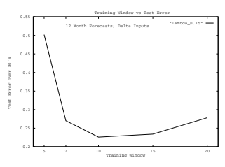

图 16.4。*噪声/非平稳权衡*的示例及最佳训练窗口的选择，在这种情况下为 10 年[38, 28]。由于非平稳性引起的模型偏差，15 年和 20 年的较长训练窗口导致更高的测试集错误。5 年和 7 年的较短训练窗口由于数据序列中的噪声和较小的数据集导致显著更高的错误。测试错误对应于在图 16.5 中指示的最佳正则化参数 0.15 下训练的模型。

使用 PCP 在一组 IP 预测模型上获得的错误。第 16.4 节详细描述了模型选择问题以及使用*非线性交叉验证*（NCV）等预测风险估计来指导选择过程。

更好的正则化器：通过正则化或剪枝在模型中引入偏差可减少模型方差，从而降低预测风险。通过选择适当的偏差可以最好地最小化预测风险。其中一组偏差是平滑约束。我们为前馈和递归网络提出了新的平滑正则化器类[29, 45]，其性能通常优于标准的权重衰减方法。这些在第 16.3 节中有更详细的描述。委员会预测：由于经济时间序列的极高噪声特性，控制预测方差是一个关键问题。减少预测方差的一种方法是对多个模型的预测进行平均。

经济学研究人员长期以来一直研究并使用组合估计量，并普遍发现它们的表现优于各个组件估计量，而且在各种加权方法中，无权平均往往优于加权平均[12, 44, 6]。不同 IP 预测模型的无权委员会平均所获得的预测误差方差降低情况如图 16.7 所示。模型解释与可视化：不仅能够做出准确的预测很重要，还要理解哪些因素影响了所做的预测。这可以通过第 16.4.6 和 16.4.8 节中描述的敏感性分析以及第 16.4.8 节中介绍的可视化工具来实现。

图 16.5. 正则化（权重衰减）参数对测试误差的影响示例[38, 28]。五条曲线代表长度为 5、7、10、15 和 20 年的训练窗口。所有曲线中都明显体现了 *偏差/方差权衡*；最小的测试集误差发生在权重衰减参数约为 0.1 时。偏差导致的较大误差出现在较大的权重衰减系数下，而模型方差导致的较大误差则出现在较小的系数值下。

## 16.3 平滑正则化器以获得更好的泛化能力

通过正则化或剪枝在模型中引入偏差可以减少模型方差，从而降低预测风险（另见第 2-6 章）。选择适当的偏差可以最佳化预测风险。二次权重衰减 [37, 18, 17]，

在神经网络社区中使用的标准正则化方法是网络权重的临时函数。权重衰减是 *临时的*，因为它对权重施加直接约束，而不考虑正在学习的函数的性质或网络模型的参数化。更有原则的方法是要求网络学习的函数 f(W, x) 是光滑的。

这可以通过惩罚 f(W, x) 的 m 次导数的曲率来实现。正则化或惩罚泛函就是平滑积分。

$$S(W,m)=\int d^{d}\mathbf{x}\Omega(\mathbf{x})\left\|\frac{d^{m}f(W,\mathbf{x})}{d\mathbf{x}^{m}}\right\|^{2}\,\tag{16.1}$$

其中 Ω(x) 是一个加权函数，表示欧几里得张量范数。由于 (16.1) 的数值计算通常需要昂贵的蒙特卡洛积分，因此在训练过程中不切实际，我们推导出了对 S(*W, m*) 的代数简单近似和界限，用于前馈网络。

这种类型的平滑泛函与径向基函数的关系已被研究[10]。然而，该研究中开发的方法并未扩展到标准的前馈 sigmoid 网络，这是一种投影基函数网络 (PBF) 的特例。

图 16.6. 对于 IP 的 12 个月收益，两组神经网络模型的预测误差，带（虚线）和不带（实线）监督主成分修剪（PCP）[20]。每个数据点是 11 个网络的平均误差，而误差条代表一个标准差。通过使用 PCP 算法来降低网络复杂性，在 6、9 和 12 个月的预测期内获得了统计显著的预测性能改善。尽管像最优脑损伤和最优脑外科医生这样的技术从网络中修剪权重，PCP 通过修剪权重矩阵的特征节点来降低网络复杂性，从而减少模型方差。与无监督使用主成分不同，PCP 去除了那些能最大限度减少估计预测误差的特征节点。

可以在每个训练步骤中轻松评估的网络[29]。对于这些新的代数上简单的 m 阶平滑正则化器，适用于投影基函数（PBF's）f(W, x) = Nj=1 ujg

xT vj + vj0

+ u0，W = (*u, v*)，具有一般传递函数 g[·]，正则化器为：

$$R_{G}(W,m)=\sum_{j=1}^{N}u_{j}^{2}\|\mathbf{v}_{j}\|^{2m-1}\quad\quad\mathrm{Global\Form}$$ $$R_{L}(W,m)=\sum_{j=1}^{N}u_{j}^{2}\|\mathbf{v}_{j}\|^{2m}\quad\quad\quad\mathrm{Local\ Form}.$$

我们的实证经验表明，这些新的平滑正则化器通常比标准的权重衰减产生更好的预测精度。

在相关工作中，我们为递归网络推导出了一种代数上简单的正则化器[45]。这个正则化器可以视为对动态模型的一阶 Tikhonov 稳定器（上面的 m = 1*局部形式*）的推广。对于描述为

$$Y(t)=\mathbf{g}\left(A Y(t-\tau)+V X(t)\right)\;,\;\hat{Z}(t)=U Y(t)\;,$$

图 16.7. 使用组合预测（或委员会）对美国工业生产指数预测的误差方差减少[38, 28]。横坐标点是不同的预测期和测试期的组合。例如，“m12.80”表示在 1979 年前十年训练以进行 12 个月预测的网络，并通过对 1980 年的真实*事先*预测进行测试。性能指标是特定年份的归一化均方误差（NMSE）。所有训练集的长度为 10 年。对于每个点，条形显示 1000 个单独模型或 100 个由 10 个模型组成的委员会的值范围。每个单独网络通常有三个 sigmoidal 内部单元，一个线性输出，以及通过δ测试从 48 个候选变量的初始集合中选择的十几个输入变量。

训练标准的正则化器是

$${\mathcal{E}}={\frac{1}{N}}\sum_{t=1}^{N}||Z(t)-{\hat{Z}}(W,I(t))||^{2}+\lambda{\rho_{\tau}}^{2}(W)\;,$$

其中 W = {*U, V, A*}是网络参数集，Z(t)是目标，I(t) = {X(s), s = 1, 2, ··· , t}表示当前和所有历史输入信息，N 是训练数据集的大小，ρτ 2(W)是正则化器，λ是正则化参数。时滞递归网络的正则化器的闭式表达为：

$$\rho_{\tau}(W)=\frac{\gamma||U||||V||}{1-\gamma||A||}\left[1-e^{\frac{\gamma||A||-1}{\tau}}\right].$$

其中*|| ||*是欧几里得矩阵范数，γ是一个因子，依赖于内部单元激活 g( )的首导数的最大值。对于同时递归网络（τ → 0）、两层前馈网络和一层线性网络，可以得到正则化器的简化形式。我们有

图 16.8. 正则化参数与预测美国工业生产指数一个月变化率的标准化预测误差的关系[45]。给出的例子是使用标准权重衰减（左）或新递归平滑正则化器（右）训练的递归网络。对于标准权重衰减，最优正则化参数为 0.03，对应测试误差为 0.734。对于新的平滑正则化器，最优正则化参数为 0.8，对应测试误差为 0.646。因此，新递归正则化器相对于使用二次权重衰减获得的测试误差减少了 12%。

在若干案例研究中成功测试了该正则化器，并发现其性能优于标准的二次权重衰减。图 16.8 展示了这种递归正则化器与二次权重衰减在预测工业生产的 1 个月预测中的比较。

## 16.4 模型选择与解释

在本节中，我们将深入讨论神经网络模型选择的几个问题和技术，包括选择输入的问题。我们描述了通过预测风险的估计选择架构的技术，特别是*广义预测误差（GPE）*和*非线性*交叉验证（NCV）。我们介绍了*基于敏感度的剪枝（SBP）*方法来选择输入变量，并展示了这些方法在预测美国工业生产指数中的应用。最后，我们讨论了一些模型解释和可视化的方法，以便理解经济关系。

## 16.4.1 通过架构和输入选择改善预测

在本文中关于架构选择的讨论中，我们重点关注最广泛使用的神经网络架构——两层*感知器*（或*反向传播*）网络。对于具有 Iλ输入变量、Hλ内部（隐藏）神经元和单个输出的架构λ，这种网络的响应函数为：

$$\hat{\mu}_{\lambda}(\mathbf{x})=h(\,u_{0}+\sum_{j=1}^{H_{\lambda}}u_{j}\,g(v_{j0}+\sum_{i=1}^{I_{\lambda}}v_{j i}\,x_{i}))\ .$$

$$(16.2)$$

在这里，h 和 g 通常是 sigmoid 非线性函数，vji 和 vj0 是输入权重和阈值，uj 和 u0 是输出权重和阈值，而索引λ是特定双层感知器网络架构的抽象标签。虽然我们在本节中考虑的是这一限制的感知器网络类，但我们的方法可以轻松推广到具有多个输出和多层的网络。

对于双层感知器，*架构选择问题*是找到一个好的、近似最优的架构λ，以建模给定的数据集。架构λ的特征包括隐藏单元数 Hλ、输入变量子集 Iλ以及非零权重 uj 和 vji 的子集。如果所有的 uj 和 vji 都是非零的，则网络被称为*全连接*。由于对所有可能架构空间进行穷举搜索是不可能的，因此选择此架构的过程需要启发式搜索。有关启发式搜索策略的示例，请参见图 16.9，并查阅[25]和[30]以获得更多讨论。

图 16.9. 启发式搜索策略：在选择隐藏单元数量 Hλ后，可以并行（A）或顺序（B）进行输入移除和权重消除。在（B）中，隐藏单元数量的选择和输入移除可能会迭代进行（虚线）。

在本节中，我们专注于选择用于预测美国工业生产指数的“最佳子集”输入变量。为了避免在考虑所有可能输入组合时对指数级大的架构空间进行穷举搜索，我们采用了一种基于灵敏度的输入剪枝（SBP）算法的定向搜索策略（见第 16.4.6 节）。

## 16.4.2 通过预测风险选择架构

“最佳拟合”的概念可以通过一个客观标准来捕捉，例如*最大*后验*概率（MAP）*、最小贝叶斯信息准则（BIC）。

（BIC）、*最小描述长度（MDL）*或*泛化能力*。泛化能力可以精确定义为*预测风险* Pλ，即估计器在预测新观察值时的预期表现。在本节中，我们使用预测风险作为我们的选择标准有两个原因。首先，计算起来简单；其次，它提供比 MAP、BIC 或 MDL 更多的信息，因为它告诉我们对最佳模型产生的预测应该有多大的信心。

考虑一组观察值 D = {(xj , tj); j = 1 *...N*}，假设生成方式为 tj = μ(xj ) + j，其中μ(x)是一个未知函数，输入 xj 是独立抽取的，具有未知的平稳概率密度函数 p(x)，j 是均值为零的独立随机变量（¯ = 0）。

以及方差 σ2 ，tj 是观察到的目标值。学习或回归问题是要找到一个关于数据集 D 的 μˆλ(x; D) 的估计，该数据集来自按 λ 索引的一类预测器或模型 μλ(x)。一般来说，λ ∈ Λ =

(*S, A, W*), 其中 S ⊂ X 表示所选的可用输入变量 X 的子集，A 是所选的模型架构类 A 中的一个架构，

W 是架构 A 的可调参数（权重）。

上述定义的 *预测风险* Pλ 可以通过有限测试集的预期性能进行近似。Pλ 可以为多种损失函数定义。

对于平方误差的特殊情况，它是：

$$P_{\lambda}=\int dx\ p(\mathbf{x})[\mu(\mathbf{x})-\hat{\mu}(\mathbf{x})]^{2}+\sigma_{\epsilon}^{2}\tag{16.3}$$ $$\approx\ E\{\frac{1}{N}\sum_{j=1}^{N}(t_{j}^{*}-\hat{\mu}_{\lambda}(\mathbf{x}_{j}^{*}))^{2}\}\tag{16.4}$$

其中 (x∗j , t∗j ) 是未用于构建 μˆλ(x) 的新观察值。

接下来，我们将使用 Pλ 作为模型泛化能力的度量。我们的策略是选择模型空间 Λ 中的架构 λ，以最小化预测风险 Pλ 的估计。

## 16.4.3 预测风险估计

由于仅根据有限样本数据无法准确计算预测风险 Pλ，因此我们必须对其进行估计。有限数据的限制使模型选择和预测风险估计问题更为复杂。这是经济预测中的典型情况，时间序列较短。

有限的训练集导致更严重的偏差/方差（或欠拟合与过拟合）权衡（参见 e.g. [9]），因此模型选择问题既更具挑战性又更为关键。尤其是，过拟合小型训练集的风险更高，因此必须谨慎选择一个不太大的模型。此外，如果没有足够的数据来保留足够大的独立测试样本，有限的数据集会使预测风险估计更加困难。在这种情况下，必须使用替代方法，通过训练数据估计预测风险，例如数据重采样和代数估计技术。数据重采样方法包括 ν– 的非线性细化。

交叉验证（NCV）和 *自助估计*，而代数估计（在回归上下文中）包括赤池信息量准则的 *最终预测误差 (FPE)* [1]，用于线性模型，以及最近提出的非线性模型的 *广义预测误差 (GPE)* [31, 24, 25]，其与独立推导的网络信息准则相同 [34]。有关预测风险估计的全面讨论，请参见 [8, 16, 43, 25]。

## 16.4.4 预测风险的代数估计

线性模型的预测平方误差。对于平方误差损失函数的线性回归模型，已推导出一些有用的预测风险代数估计。这些包括著名的*广义*交叉验证（GCV）[7, 11]和赤池的*最终预测误差（FPE）*[1]

公式：

$$G C V_{\lambda}=A S E_{\lambda}{\frac{1}{\left(1-{\frac{Q_{\lambda}}{N}}\right)^{2}}}\qquad\qquad F P E_{\lambda}=A S E_{\lambda}\left({\frac{1+{\frac{Q_{\lambda}}{N}}}{1-{\frac{Q_{\lambda}}{N}}}}\right)\ .$$

. (16.5)

Qλ表示模型λ的权重数量（ASEλ表示平均平方误差）。注意，尽管对于小样本大小，GCV 和 FPE 略有不同，但在大 N 下它们是渐近等价的：

$$(16.5)$$

$$G C V_{\lambda}\approx F P E_{\lambda}\approx A S E_{\lambda}\left(1+2{\frac{Q_{\lambda}}{N}}\right)$$

(16.6)

更一般的*预测平方误差 (PSE)* 表达式为：

$$(16.6)$$

$$P S E_{\lambda}=A S E_{\lambda}+2\hat{\sigma}^{2}\frac{Q_{\lambda}}{N},$$

$$(16.7)$$

其中σ%2 是数据中噪声方差的估计值。对

(16.7)及其统计特性的估计策略已被分析[3]。通过设置σ%2 ≡ ASEλ/(N − Qλ)，可以将 FPE 作为 PSE 的特例获得。有关教程处理，请参见[8, 16, 43]。

应该注意的是，在特定条件下，PSE、FPE 和 GCV 是所考虑神经网络模型的预测风险的渐近无偏估计。这些条件为：(1) 观察目标 tj 中的噪声 j 是独立同分布的，(2) 所得模型是无偏的，(3)

不使用权重衰减，且(4)模型中的非线性可以忽略。

对于 PSE，我们进一步要求使用渐近无偏的σ%2 估计。然而，实际上，几乎所有神经网络对数据的拟合都是有偏的和/或具有显著的非线性。

尽管 PSE、FPE 和 GCV 仅在上述假设下是渐近无偏的，但它们的计算成本远低于 NCV，因为不需要重新训练。

非线性模型的广义预测误差（GPE）。预测平方误差 PSE，因此最终预测误差 FPE，是*广义预测误差 GPE*的特例[31, 24, 25]。我们在此提供简要描述。

GP E 估计了可能使用一般损失函数和包含正则化项（如权重衰减）的有偏非线性模型的预测风险。其代数形式为

$$G P E_{\lambda}\equiv{\mathcal E}_{\lambda\mathrm{train}}+{\frac{2}{N}}\,\mathrm{tr}\,{\hat{V}}{\hat{G}}_{\lambda}\;\;,$$

其中 Eλtrain 是训练集误差（训练集上损失函数的平均值），V%是观察目标的*噪声协方差矩阵*的非线性推广，G%λ是估计的*广义影响矩阵*，它是标准影响矩阵或帽矩阵的非线性类似物。

GPE 可以用等效形式表示为：

$$(16.8)$$

$$GPE_{\lambda}={\cal E}_{\lambda{\rm train}}+2\;\widehat{\sigma}_{\it eff}^{2}\;\frac{\widehat{Q}_{\lambda{\it eff}}}{N},\tag{16.9}$$

其中 Q%eff ≡ tr G% 是模型参数的估计 *有效* 数量，σ%2eff ≡ (tr V%G%)/(tr G%) 是数据中噪声方差的估计有效值。对于非线性和/或正则化模型，Q%*λeff* 通常不等于权重数量 Qλ。

当假定目标变量中的噪声是独立的且具有均匀方差，并且使用平方误差损失函数时，(16.9) 简化为：

$$G P E_{\lambda}=A S E_{\lambda}+2\hat{\sigma}^{2}\frac{\hat{Q}_{\lambda e f f}}{N}\;\;.$$

$$(16.10)$$

注意，使用 Qλ 替代 Q%*λeff* 可以得到 PSE 的表达式。其他作者已推导出 (16.8) 和 (16.10) 的各种特殊情况，详见 [8, 16, 43]。*GP E* 由 [34] 独立推导，并称其为网络信息准则（NIC）。

## 16.4.5 Ncv：非线性模型的交叉验证

交叉验证（CV）是一种样本重用方法，用于估计预测风险；它最大限度地有效利用可用数据。对非线性模型的 CV 进行微扰性细化称为 *非线性交叉验证（NCV）* [25, 30]。

图 16.10。非线性模型的误差函数可能具有许多局部最小值。每个局部最小值 wi、wj 和 wk（实线）对应一组不同的参数，从而对应不同的模型。在不同的有限数据样本上训练或在子样本上重新训练（如非线性交叉验证中）会导致稍有不同的误差曲线（虚线）和扰动的最小值 wi、wj 和 wk。误差曲线及其最小值的采样变异被称为 *模型方差*。

设数据 D 被分成 ν 个随机选择的大小大致相等的互斥子集 Dj：∪νj=1Dj = D 且 ∀i = *j, D*i ∩ Dj = ∅。设 Nj 表示子集 Dj 中观测值的数量。设 μˆλ(Dj )(x) 为在除 (x, t) ∈ Dj 外的所有数据上训练的估计器。那么，子集 j 的交叉验证平均平方误差定义为

$$CV_{D_{j}}(\lambda)=\frac{1}{N_{j}}\sum_{(\mathbf{x}_{k},t_{k})\in D_{j}}\left(t_{k}-\hat{\mu}_{\lambda(D_{j})}(\mathbf{x}_{k})\right)^{2}.\tag{16.11}$$

这些平均化处理后，得到 ν 折交叉验证的预测风险估计：

$$C V(\lambda)=\frac{1}{\nu}\sum_{j}C V_{D_{j}}(\lambda)\;\;.$$

$$(16.12)$$

ν 的典型选择为 5 和 10。留一交叉验证在 ν = N 的极限下得到。CV 是一种非参数的预测风险估计，仅依赖于可用数据。

非线性模型中经常出现多个最小值（见图 16.10），每个最小值代表一个不同的预测因子，这要求对交叉验证过程进行细化。这种细化称为非线性交叉验证。

(NCV) 在图 16.11 中对 ν = 5 进行了说明。

网络在整个数据集 D 上进行训练，以获得具有权重 W0 的模型 μˆλ(x)。这些权重作为 ν 折交叉验证的起点使用。

验证程序。每个子集 Dj 依次从训练数据中移除。网络使用剩余数据重新训练，从 W0 开始（而不是使用随机初始权重）。在假设从训练数据中删除子集不会导致局部最优权重的较大差异的前提下，从 W0 进行重新训练“扰动”权重以获得 Wi，i = 1 *...ν*。为“扰动模型”μˆλ(Dj )(x)计算的交叉验证误差因此估计了具有局部最优权重 W0 的模型的预测风险，而不是其他局部最小值处其他预测器的表现。

图 16.11。5 折非线性交叉验证计算的示意图

(NCV)。首先，网络在所有数据上进行训练，以获得权重 w0，作为交叉验证的起点。每个数据子集 Di，i = 1 ... 5 依次从训练数据 D 中移除。网络从 W0 开始，使用剩余数据进行训练。这“扰动”权重以获得 wi。“扰动模型”wi 的测试误差在保留样本 Di 上计算。这些误差的平均值是具有权重 w0 的模型的 5 折交叉验证预测风险的估计。

如果网络对每个子集从随机初始权重进行训练，它可能会收敛到一个与 W0 不同的 Wi 对应的不同最小值。这将对应于不同的模型。因此，从 W0 开始确保交叉验证估计特定模型的预测风险，该模型对应于 W ≈ W0。

## 16.4.6 通过定向搜索和敏感性分析修剪输入

选择“最佳子集”输入变量是预测模型选择的关键部分。当可用输入序列数量较大时，尤其如此，通过所有变量组合进行穷举搜索在计算上不可行。纳入无关变量不仅无助于预测，还可能通过增加噪声或系统性偏差来降低预测准确性。基于模型的输入变量选择方法是 *基于敏感性* 的修剪 (SBP) [41, 32, 30, 25]。该方法的扩展在 [21] 中提出。使用该算法，通过评估从完全连接的网络中移除输入变量的影响来构建候选架构。这些架构按训练误差递增的顺序进行排序。然后，按照“最佳优先”策略移除输入，即选择移除后训练误差增加最小的输入。

SBP 算法计算 *敏感性度量* Si，以评估如果从网络中移除输入 xi 会导致的训练误差变化。

一种这样的敏感性度量是 *增量误差*，定义为：

Delta Error (DE) $S_{i}=\frac{1}{N}\sum_{j=1}^{N}S_{ij}$ (16.13)

$$(16.14)$$

其中 Sij 是为样本 xj 计算的敏感度。由于通常输入的数量远少于权重，因此直接评估 Si 是可行的：

Sij = SE(xi, wλ) − SE(xij , wλ) (16.14)

$$S_{i j}=S E(\overline{{{x}}}_{i},w_{\lambda})-S E(x_{i j},w_{\lambda})$$ $$\overline{{{x}}}_{i}=\frac{1}{N}\sum_{j=1}^{N}x_{i j}$$

Si 衡量将第 i 个输入 xi 替换为所有样本的平均值 xi 对训练平方误差(SE)的影响（将变量替换为其平均值会消除其对网络输出的影响）。

请注意，在计算 Si 时，不会在评估 SE(xi, wλ) 时进行重新训练。

还请注意，仅将 xij = 0 ∀ j 设置为零是不够的，因为每个隐藏单元的偏置值是在训练期间确定的，随意将输入设置为零无法正确抵消。当然，如果输入在训练前被归一化为零均值，那么将输入变量设置为零等同于用其均值替换它。

如果 Si 较大，则用其均值替换第 i 个输入变量会显著增加网络误差。如果 Si 较小，我们需要其他度量的帮助来决定第 i 个输入变量是否有用。可以根据扰动一个输入或隐藏变量并监测网络输出变化计算三种额外的敏感度度量 [21]：

$$\text{平均梯度(AG)}\;S_i=\frac{1}{N}\sum_{j=1}^N\frac{\partial f^{(j)}}{\partial x_i}\;,$$ $$\text{平均绝对梯度(AAG)}\;S_i=\frac{1}{N}\sum_{j=1}^N|\frac{\partial f^{(j)}}{\partial x_i}|\;,$$ $$\text{均方根梯度(RMSG)}\;S_i=\sqrt{\frac{1}{N}\sum_{j=1}^N\left[\frac{\partial f^{(j)}}{\partial x_i}\right]²}\;,$$

为了方便记法，我们定义 f(x) ≡ μˆλ(x) 和 f(j) ≡ f(x1j , ... , xij *, ... , x*dj )

是给定第 j 个输入数据模式的网络输出。

这三种敏感度度量一起提供有用的信息。如果 SAG

i 为正且较大时，网络输出 f 的平均变化方向与第 i 个输入变量相同。如果 SAG

i 为负且具有大幅度时，f 的平均变化方向与第 i 个输入变量相反。当 SAG

i 接近于零，我们无法从该度量中获得太多信息。如果 SAAG

i 较大时，输出 f 对第 i 个输入变量敏感；如果 SAAG

i 很小，f 对第 i 个输入变量不敏感。

如果 SRMSG

i 与 SAAG 有很大不同

i，第 i 个输入序列可能非常嘈杂，并且有很多异常值。

## 16.4.7 实证示例

如 [42] 所述，我们构建神经网络模型以预测美国工业生产指数(IP)的变化率。这里呈现的 IP 预测范围为 12 个月。根据之前的工作 [27, 20]，这里报告的结果使用了三个 sigmoid 单元和一个线性输出单元的网络。

数据集由 1950 年 1 月至 1989 年 12 月的工业生产（IP）及其他宏观经济和金融系列的每月观察数据组成。该数据集总共有 480 个样本。输入系列来自大约十个原始时间序列，包括 IP、领先指标指数、标准普尔 500 指数等。

考虑将“未过滤”系列和各种“过滤”版本纳入模型，共有 48 个可能的输入变量。目标系列和所有 48 个候选输入系列都被归一化为零均值和单位标准差。图 16.12 和 16.13 展示了训练集由从 40 年期间随机选择的 360 个样本组成时的敏感度分析结果；剩余的 120 个每月观察值构成测试集。

在 FPE 曲线上，输入数量的局部最优解为 15，在 NCV 曲线上为 13。由于 FPE 和 NCV 估计值的变动性（在图 16.13 中对于 NCV 很明显），我们更倾向于选择这些曲线的第一个良好的局部最小值，而不是稍微更好的全局最小值。

这个 NCV 的局部最小值对应于测试误差的全局最小值。选择它导致输入系列数量从 48 减少到 13，网络权重从 151 减少到 46。虽然添加更多输入变量会降低训练误差，但并未改善测试集性能。

这个实证例子展示了*基于敏感度*的修剪（SBP）算法在选择大量可用输入变量中的小子集时的有效性，该算法由预测风险的估计引导，例如非线性交叉验证（NCV）算法。所得到的网络模型在预测性能上表现更好，无论是通过预测风险的估计还是在实际测试集上的误差，相比之下，使用所有 48 个输入系列的模型效果较差。

## 16.4.8 通过模型可视化获得经济理解

尽管本章专注于用于经济预测的数据驱动时间序列模型，但从这些模型中提取信息是可能的。

图 16.12. 用于选择神经网络预测模型输入变量子集的敏感度基于修剪（SBP）方法[42]。原始网络使用所有 48 个输入变量进行训练，以预测工业生产的 12 个月百分比变化。

（IP）。这些变量根据敏感性测量按重要性降序排列。输入变量一个一个地从网络中修剪；在每个阶段，网络会重新训练。图中显示了四条曲线：训练误差、赤池最终预测误差（FPE）、*非线性交叉验证误差（NCV）* [30, 25]，以及实际测试误差。NCV 作为选择标准，表明只有 13 个变量应被包括在内。与 FPE 相比，NCV 对实际测试误差的预测相当准确。

经济结构。上面在 16.4.6 节中提出的敏感性分析提供了关于哪些输入对预测感兴趣的数量（如商业周期）重要的整体理解。然而，通过检查敏感性随时间的演变，可以获得进一步的信息[21]。

对单个样本进行的敏感性分析提供了关于哪些输入特征在产生当前预测中起重要作用的信息。单个样本的两个敏感性测量可以定义为：

#### Delta 输出（DO）  $\begin{array}{ll}S_{i}=\Delta f_{i}^{(j)}\\ &\\ \equiv f(x_{1j},\ \dots\ ,x_{ij},\ \dots\ ,x_{dj})\\ &-f(x_{1j},\ \dots\ ,\overline{x_{i}},\ \dots\ ,x_{dj})\ ,\\ \text{输出梯度（OG）}&S_{i}=\dfrac{\partial f^{(j)}}{\partial x_{i j}}\ ,\end{array}$

如上所述，我们定义 f(j) ≡ f(x1j , ... , xij *, ... , x*dj )。如果 SDO

i 或 SOG

i 很大时，第 i 个变量在当前预测中起重要作用，

图 16.13。IP 的敏感性输入修剪（12 个月预测视角）。该图说明了用于计算 NCV 的 10 个子集的测试集误差的分布。

（用圆圈表示）。NCV 误差是这些测试集误差的平均值。

稍微改变变量的值可能会导致网络输出的巨大变化。图 16.14 给出了单个样本敏感性的图形显示示例。

使用这种图形显示，我们可以观察到哪些输入变量在产生当前预测中起着重要作用，或者哪些输入变量在改变时会显著增加或减少预测误差。我们还可以观察到不同输入变量的作用如何随时间变化。例如，在图 16.14 中，对于索引从 56 到 60 的样本，第三个输入变量具有较大的负敏感度测量。从第 65 个样本开始，第六个输入变量开始发挥重要作用，这种情况持续到第 71 个样本。这种显示方式提供了对经济动态的洞察，正如经过训练的神经网络模型从数据中学习的那样。

## 16.5 讨论

在总结这一简要的算法调查以提高神经网络预测准确性时，重要的是要注意，许多其他潜在有用的技术已被提出（另见第十七章）。此外，本章呈现的经验结果旨在为说明性，而非决定性。

对算法和预测模型的进一步研究可能会带来额外的改进。最后，我想强调的是，鉴于宏观经济预测的困难，单一的降低预测风险的技术不足以获得*最佳表现*。相反，需要结合多种技术。

图 16.14。预测美国工业生产指数的 10 输入模型的个体示例的敏感性分析结果[21]。黑色和灰色分别表示负和正。矩形的大小表示值的大小。每月时间索引沿水平方向变化。输入变量的索引垂直绘制。此类型的图表显示了在不同时间点进行预测时哪些输入变量重要。这有助于理解经济关系。

致谢。作者感谢 Todd Leen、Asriel Levin、Yuansong Liao、Hong Pi、Steve Rehfuss、Thorsteinn Rögnvaldsson、Matthew Saffell、Joachim Utans、Lizhong Wu 和 Howard Yang 对本研究的诸多贡献。本章是[26]的扩展版本。本工作得到了 OGI 的 ONR/ARPA 资助，编号 N00014-92-J-4062 和 N00014-94-10071，以及 NSF 资助 CDA-9309728 和 CDA-9503968，非线性预测系统的 DARPA 合同 DAAH01-92-CR361 和 DAAH01-96-CR026 的支持。

[1] Akaike, H.: 统计预测器识别。统计数学研究所年刊 22, 203–

217 (1970)

[2] Ash, T.: 反向传播神经网络中的动态节点创建。连接科学 1(4), 365–375 (1989)

[3] Barron, A.: 预测平方误差：自动模型选择的标准。见：

Farlow, S. (编) 自组织方法在建模中的应用。Marcel Dekker, 纽约 (1984)

[4] Battiti, R.: 使用互信息选择监督神经网络学习中的特征。IEEE 神经网络杂志 5(4), 537–550 (1994)

[5] Bonnlander, B.: 连接主义学习的输入变量的非参数选择。技术报告，博士论文。科罗拉多大学计算机科学系 (1996)

[6] Clemen, R.T.: 组合预测：综述与注释书目。国际预测杂志 (5), 559–583 (1989)

[7] Craven, P., Wahba, G.: 用样条函数平滑噪声数据：通过广义交叉验证方法估计正确的平滑程度。数值数学 31, 377–403 (1979)

[8] Eubank, R.L.: 样条平滑和非参数回归。Marcel Dekker, Inc. (1988)

[9] Geman, S., Bienenstock, E., Doursat, R.: 神经网络与偏差/方差困境。神经计算 4(1), 1–58 (1992)

[10] Girosi, F., Jones, M., Poggio, T.: 正则化理论与神经网络架构。神经计算 7, 219–269 (1995)

[11] Golub, G., Heath, H., Wahba, G.: 广义交叉验证作为选择良好岭参数的一种方法。技术计量学 21, 215–224 (1979)

[12] Granger, C.W.J., Newbold, P.: 经济时间序列预测, 第 2 版。学术出版社, 圣地亚哥 (1986)

[13] Granger, C.W.J., Terasvirta, T.: 建模非线性经济关系。

牛津大学出版社 (1993)

[14] Hamilton, J.D.: 时间序列分析。普林斯顿大学出版社 (1994)

[15] Hassibi, B., Stork, D.G.: 网络剪枝的二阶导数：最优脑外科医生。 In: Hanson, S.J., Cowan, J.D., Giles, C.L. (eds.) 神经信息处理系统进展, 第 5 卷, 第 164–171 页。摩根·考夫曼出版社, 圣马特奥 (1993)

[16] Hastie, T.J., Tibshirani, R.J.: *广义加法模型*。统计与应用概率专著, 第 43 卷。查普曼与霍尔 (1990)

[17] Hoerl, A.E., Kennard, R.W.: 岭回归：非正交问题的应用。技术计量学 12, 69–82 (1970)

[18] Hoerl, A.E., Kennard, R.W.: 岭回归：非正交问题的偏倚估计。技术计量学 12, 55–67 (1970)

[19] LeCun, Y., Denker, J.S., Solla, S.A.: 最优脑损伤。 In: Touretzky, D.S.

(ed.) 神经信息处理系统进展, 第 2 卷。摩根·考夫曼出版社 (1990)

[20] Levin, A.U., Leen, T.K., Moody, J.E.: 使用主成分进行快速剪枝。

In: Cowan, J., Tesauro, G., Alspector, J. (eds.) 神经信息处理系统进展, 第 6 卷。摩根·考夫曼出版社, 旧金山 (1994)

[21] Liao, Y., Moody, J.E.: 一个神经网络可视化与灵敏度分析工具包。 In: Amari, S.I., Xu, L., Chan, L.-W., King, I., Leung, K.-S. (eds.) 国际神经信息处理会议论文集，第。

1069–1074。施普林格-维尔哈吉新加坡私人有限公司 (1996)

[22] Litterman, R.B.: 使用贝叶斯向量自回归进行预测 - 五年的经验。商业与经济统计杂志 4(1), 25–38 (1986)

[23] Moody, J.: 经济预测的挑战：噪声、非平稳性和非线性。受邀演讲，机器学习会议，犹他州斯诺伯德 (1994 年 4 月)

[24] Moody, J.: 有效参数数量：非线性学习系统中泛化与正则化的分析。 In: Moody, J.E., Hanson, S.J., Lippmann, R.P. (eds.) 神经信息处理系统进展, 第 4 卷，第。

847–854。摩根·考夫曼出版社, 圣马特奥 (1992)

[25] Moody, J.: 预测风险与神经网络架构选择。 In:

Cherkassky, V., Friedman, J.H., Wechsler, H. (eds.) 从统计到神经网络：理论与模式识别应用。施普林格 (1994)

[26] Moody, J.：宏观经济预测：挑战与神经网络解决方案。

见于：国际人工神经网络研讨会，台湾新竹（1995）（受邀主题演讲）

[27] Moody, J., Levin, A., Rehfuss, S.：预测美国工业生产指数。神经网络世界 3(6)，791–794（1993）；特刊：1993 年统计与经济学平行应用会议的论文集

[28] Moody, J., Rehfuss, S., Saffell, M.：使用神经网络进行宏观经济预测（1999）（手稿准备中）

[29] Moody, J., Rögnvaldsson, T.：投影基函数网络的平滑正则化器。见于：1996 年神经信息处理系统进展会议，NIPS 1996，第 9 卷。麻省理工学院出版社，剑桥（1997）

[30] Moody, J., Utans, J.：神经网络的架构选择策略：应用于企业债券评级预测。见于：Refenes, A.N.（编）《资本市场中的神经网络》。约翰·威利父子公司（1994）

[31] Moody, J.E.：关于非线性学习系统中的泛化、正则化和架构选择的说明。见于：Juang, B.H., Kung, S.Y., Kamm, C.A.（编）《信号处理的神经网络》，第 1–10 页。IEEE 信号处理学会

（1991）

[32] Moody, J.E., Utans, J.：神经网络的原则性架构选择：应用于企业债券评级预测。见于：Moody, J.E., Hanson, S.J., Lippmann, R.P.（编）《神经信息处理系统进展》，第 4 卷，第

683–690。摩根考夫曼出版社，圣马特奥（1992）

[33] Mozer, M.C., Smolensky, P.：骨架化：一种通过相关性评估修剪网络冗余的技术。见于：Touretzky, D.S.（编）《神经信息处理系统进展》，第 1 卷。摩根考夫曼出版社，圣马特奥（1990）

[34] Murata, N., Yoshizawa, S., Amari, S.：网络信息准则 - 确定人工神经网络模型的隐藏单元数量。IEEE 神经网络汇刊 5(6)，865–872（1994）

[35] Natter, M., Haefke, C., Soni, T., Otruba, H.：使用神经网络进行宏观经济预测。见于：1994 年资本市场中的神经网络（1994）

[36] Pi, H., Peterson, C.：寻找时间序列中的嵌入维数和变量依赖关系。神经计算，509–520（1994）

[37] Plaut, D., Nowlan, S., Hinton, G.：通过反向传播学习的实验。

技术报告 CMU-CS-86-126，卡内基梅隆大学计算机科学系，宾夕法尼亚州匹兹堡（1986）

[38] Rehfuss, S.：使用神经网络进行宏观经济预测（1994）（未发表的模拟）

[39] Rehkugler, H., Zimmermann, H.G.（编）：经济中的神经网络。Vahlen 出版社（1994）

[40] Swanson, N.R., White, H.：一种使用线性模型和人工神经网络的实时宏观经济预测的模型选择方法。讨论论文，宾夕法尼亚州立大学经济系（1995）

[41] Utans, J., Moody, J.: 通过预测风险选择神经网络架构：应用于公司债券评级预测。载于：第一届华尔街人工智能应用国际会议论文集。IEEE 计算机学会出版社，洛杉矶（1991）

[42] Utans, J., Moody, J., Rehfuss, S.: 通过灵敏度分析选择输入变量：

应用于预测美国商业周期。载于：金融工程中的计算智能会议论文集。IEEE 出版社（1995）

[43] Wahba, G.: 观测数据的样条模型。CBMS-NSF 区域会议系列应用数学（1990）

[44] Winkler, R.L., Makridakis, S.: 预测的组合。皇家统计学会杂志（146）（1983）

[45] Wu, L., Moody, J.: 用于前馈和递归网络的平滑正则化器。神经计算 8(2)（1996）

[46] Yang, H., Moody, J.: 基于联合互信息的输入变量选择。

技术报告，计算机科学系，俄勒冈研究院（1998）

# 17 如何训练神经网络-

Ralph Neuneier 和 Hans Georg Zimmermann 西门子公司，企业技术，D-81730 慕尼黑，德国

{Ralph.Neuneier,Georg.Zimmermann}@mchp.siemens.de http://w2.siemens.de/zfe_nn/homepage.html 摘要。本论文旨在为神经网络建模提供指导。从数据预处理开始，我们讨论不同类型的网络架构，并展示如何有效地组合这些架构。我们分析了几种成本函数，以避免由于异常值和异方差性导致的不稳定学习。通过强迫网络构建平滑的逼近函数，解决观察者-观察困境。此外，我们提出了一些剪枝算法以优化网络架构。所有这些特性和技术都与一个完整且一致的训练过程相结合（见图 17.25 以获取概述），从而最大化方法的协同效应。

## 17.1 引言

在系统识别或回归任务中使用神经网络，通常是因为理论结果表明，原则上一个三层网络可以逼近数据集中包含的任何结构[14]。因此，可用数据的特性决定了所得到模型的质量。作者认为，这是一种误导性的观点，尤其是在可从数据中提取的信息量较小时。这种情况通常出现在信噪比低且可用训练数据集相对较小的问题中。神经网络是一类丰富的函数，因此优化过程的控制，即学习算法、剪枝、架构、成本函数等，是建模过程的核心部分。

“神经网络解决方案不比[任何经典]方法更好”的说法被过于频繁地用来描述神经网络建模的结果。无论如何，对这种评估的判断预设了对所实现的神经网络解决方案中涉及的过程的精确了解。这是因为在过程的不同阶段可以应用多种附加特性和技术，以防止所有已知问题，如过拟合和对异常值的敏感性。由于缺乏通用的配方，人们常常会找到一种声明

- 之前发表在：Orr, G.B. 和 Müller, K.-R.（编）：LNCS 1524，ISBN

978-3-540-65311-0（1998 年）。

G. Montavon 等（编）：NN：行业技巧，第二版，LNCS 7700，第 369–418 页，2012 年。

-c Springer-Verlag Berlin Heidelberg 2012

声明神经网络模型的质量强烈依赖于生成模型的人，这通常被视为负面。相反，我们认为附加特性是神经网络相较于经典方法的一个显著优势，后者通常不允许如此复杂的优化控制。我们文章的目的是提供一套技术，以有效利用神经网络的能力。更重要的是，这些特性将以一种方式组合，以最大化其应用的协同效应。

首先，我们从数据预处理开始，并定义网络架构。然后，我们分析数据与架构之间的交互。

（观察者 - 观察困境），并讨论几种修剪技术以优化网络拓扑。最后，我们通过将所提特性整合成一个统一的训练程序来得出结论（见第 17.8 节中的图 17.25）。

本文大部分内容与非线性回归相关。某些考虑集中在时间序列建模和预测上。所有提出的方法都在我们为客户解决的多样任务上进行了测试，例如金融市场预测。典型问题可以通过相对较小的非常嘈杂的数据集和一个高维输入向量来表征，以涵盖基础动态系统的复杂性。本文概述了我们开发的统一训练程序，以解决此类问题。

## 17.2 数据预处理

除了明显的数据缩放（在下文中缩写为 scale(·)），

一些作者提出了复杂的预处理函数，这些函数将不同的时间序列转换为每个序列的均值为零，统计方差为一。在金融预测领域，这些函数通常源于技术分析，以捕捉金融市场的一些基础动态（见[37]和[25]的例子）。

经过多次真实数据实验后，我们确定了以下简单的转换。如果选定的原始时间序列相对于预测视野变化非常缓慢，即没有明显可识别的均值回归均衡，则动量的指示器和驱动力的信息被证明非常有用。动量可以通过动量（相对变化，公式 17.1）来描述，而力量可以通过时间序列的加速度（归一化曲率，公式 17.2）来描述。如果我们有 n 步未来的预测视野，则原始时间序列 xt 以以下方式进行转换：

动量：$\tilde{x}_{t}=\mbox{scale}\left(\frac{x_{t}-x_{t-n}}{x_{t-n}}\right)$, (17.1)

$$\mathrm{force:}\qquad{\hat{x}}_{t}=\mathrm{scale}\left({\frac{x_{t}-2x_{t-n}+x_{t-2n}}{x_{t-n}}}\right)\,.$$

$$(17.2)$$

. (17.2)

在公式 17.1 中，计算相对差异以消除指数趋势，例如，这可能是由通货膨胀影响造成的。仅使用公式 17.1 的预处理函数通常会导致仅跟随明显趋势的糟糕模型。力量，即公式 17.2 所描述的转换，对于表征时间序列的转折点非常重要。

一旦有新信息进入市场，时间序列可能会快速恢复到其均衡状态，正如大多数商品价格和股票利率的情况一样。在这种情况下，我们用描述驱动价格回到估计均衡的力量来替代公式 17.2。估计潜在价格均衡的一个简单方法是对时间序列的某些过去值进行平均。

我们不使用估计值和当前值之间的相对差异，而是关注均衡值与位于平均窗口中间的过去值之间的差异。在我们的示例中，这被表述为

$$\hat{x}_{t}=\text{scale}\left(\frac{x_{t-n}-\frac{1}{2n+1}\sum_{\tau=0}^{2n}x_{t-\tau}}{x_{t-n}}\right)\,.\tag{17.3}$$

注意，在公式 17.3 中，我们使用 xt−n 而不是当前值 xt，从而导致围绕 xt−n 的均衡估计。实际上，我们关注的是测量价格水平与潜在市场均衡之间的紧张关系，这一估计在忽略最新可能的信息点的情况下提供了更合适的描述。这个概念在经济学中被称为均值回归动态，类似于物理学中摆的行为。

## 17.3 架构

我们将展示几个独立的架构构建模块（图 17.1 至 17.7），这些模块最终将组合成一个统一的时间序列分析神经网络架构（图 17.8）。大多数结构元素可以用于一般回归。

## 17.3.1 通过对角连接器进行净内部预处理

为了使潜在上非常不同的输入在可比较的尺度上，我们将输入数据标准化为零均值和单位方差。这种常见方法的问题是，输入中的异常值可能会产生重大影响。

对于包含大冲击的数据，如金融和经济学，这尤为严重。为避免此问题，我们提出通过根据比例缩放输入进行额外的*净内部*（*网络内部*的缩写）预处理。

$$x^{\prime}=\operatorname{tanh}(w x)\,.$$

$$(17.4)$$

x = tanh(wx). (17.4)

此预处理层的实现如图 17.1 所示。该层的隐藏单元数与输入层相同，并使用标准的 tanh 压缩函数。输入层与预处理层之间的特定权重矩阵仅为方形对角矩阵。

对于短期预测（例如建模股市每日收益），我们通常将权重初始化为 0.1，以确保 tanh 处于其线性范围，从而确保外部输入基本上不变。如果关注长期模型（例如六个月预测期），我们更倾向于从初始值 1 开始。原因是，月度数据通常受到“非经济”效应如政治冲击的更大污染。较大的初始权重值从一开始就消除了这些异常值。

对角连接器中的权重被限制为正值，以避免训练期间 x 的符号波动。该约束使得公式 17.4 保持单调变换，并具有限制异常值的能力。预处理层不应使用偏置，以防止数值模糊。我们发现这些额外的约束改善了预处理层的训练稳定性。

这些权重将在训练过程中以与网络中所有其他权重相同的方式进行调整。在实践中，我们观察到权重值有增长和缩小。增长的值导致输入范围的更大比例被 tanh 的压缩函数压缩。对角元素的非常小的值表明可以修剪相应的输入。

图 17.1. 净内部预处理，以限制异常值的影响并消除不重要的输入

## 17.3.2 通过瓶颈网络的净内部预处理

使用瓶颈网络来缩小输入向量的维度是一个古老的想法。这种技术不仅用于构建编码器[1]，还用于进行主成分分析[26]。在更大网络中将瓶颈作为内部预处理构建模块，提供了压缩输入信息的机会。此外，瓶颈层的 tanh 压缩函数作为数据中异常值的限制器。

在第一次尝试中，可以将瓶颈架构实现为输入-隐藏-输出层的子网络，同时将输入作为输出层的目标。隐藏层的额外连接器与网络的其余部分相连。此设计允许对输入信号进行压缩，但暗含两个主要缺点。如果对原始输入进行输入剪枝，解压缩将变得无序。此外，向输入中添加噪声变得更加复杂，因为扰动的输入也必须作为输出层的目标使用。

图 17.2 指出了一种避免这些困难的瓶颈子网络的独特方法。在图 17.2 的左侧，我们有典型的压缩-解压缩网络。额外的连接是一个冻结的单位矩阵，它将输入层复制到输出层。由于该层的目标被设置为零，压缩-解压缩网络的输出将采用输入的负值，以补偿输入的相同副本。尽管输入信号的符号被反转，但这一情况对信息通过瓶颈层的流动没有任何影响。该架构允许适当消除输入以及通过人工噪声干扰输入信号。

图 17.2. 使用瓶颈的网络内部预处理集群

在我们的实验中，我们观察到可以与网络的其余部分并行训练瓶颈。因此，只要训练集上的误差保持在与没有压缩时相同的水平，瓶颈就可以缩小。如在 17.6 节中将描述的那样，在学习过程中使用动态控制的输入噪声作为正则化方法是很重要的。图 17.2 的架构允许通过数据压缩将噪声和网络内部预处理结合起来。

## 17.3.3 平方输入

根据 G. Flake 在[10]中的建议，我们还向网络提供输入的平方值，这导致全球和局部决策的整合。通过 tanh 激活函数处理原始输入和平方输入，使得网络能够作为使用 sigmoid 激活函数（MLP）和径向基函数网络（RBF）广为人知的神经网络的组合。典型的三层 MLP 的输出为

是

$$y=\sum_{j}v_{j}\operatorname{tanh}\left(\sum_{i}w_{j i}x_{i}-\theta_{j}\right)\ ,$$

而 RBF 的输出计算为

$$(17.5)$$

$$y=\sum_{j}v_{j}\ e^{-\frac{1}{2}\sum_{i}\left(\frac{x_{i}-\mu_{j i}}{\sigma_{j i}}\right)^{2}}\ .$$

$$(17.6)$$

一些研究论文通常比较这两种基函数，而 Flake 提出了以下结合方法。

$$y=\sum_{j}v_{j}\tanh\left(\sum_{i}w_{ji}x_{i}+u_{ji}x_{i}^{2}-\theta_{j}\right)\,\tag{17.7}$$

它涵盖了方程 17.5 的 MLP，同时将 RBF 输出方程 17.6 近似到足够的水平。

尽管如此，我们通过取内部预处理输入的平方而不是单独提供平方原始输入，建议对 Flake 的方法做一些小修改。这样，我们利用了预处理集群，因为它限制了异常值。此外，修剪输入会同时消除其线性和平方变换。一个可能的实现示意图见图 17.3。连接器 ID 是一个固定的单位矩阵。

该连接器上方的集群使用平方作为非线性激活函数。下一个隐藏集群能够使用其 tanh 压缩函数创建 MLP 和 RBF 结构。

有人可能会认为，在平方和隐藏层之间添加一个新连接器及其所有额外权重会增加过拟合。我们的经验恰恰相反。此外，在优化普通 MLP 时，

通常在训练集上的误差变得过小时（提前停止）之前停止训练，以提高在测试集上获得好结果的概率。我们观察到，训练集上的误差可以非常小，同时获得良好的测试结果，即使不使用权重修剪。我们的经验可以在该架构的局部建模特征的基础上理解。也就是说，输入空间中的局部伪影可以被封装，因此它们不再对全局产生影响，可能导致糟糕的泛化性能。这对于高维输入空间尤其真实。

图 17.3. 网络内部预处理集群和平方集群，产生后续集群的输入信号。请注意，偏置到“隐藏”的连接器是必需的，但为了视觉清晰被抑制。

## 17.3.4 交互层

本节总结了 Weigend 和 Zimmermann 在[36, 32]的文章。

在金融工程中，神经网络的大多数应用中，输入数量庞大（约为一百），但仅使用单个输出。这种情况可以视为一个大型的“倒漏斗”；棘手的问题在于，学习中唯一可用的信息就是单个输出。这是单输出神经网络“数据饥渴”的原因之一，即通常需要大量的训练数据以区分非线性与噪声。反过来说，小数据集需要正则化，因此只能识别简单模型，这意味着对线性模型的偏向。这种情况不应与由于某些避免过拟合的技术（如提前停止或权重衰减）而导致的线性模型偏向混淆。

增加输出侧到输入侧的信息流的一种方法是增加输出单元的数量。在最简单的情况下，可以使用两个输出单元，一个预测收益，另一个预测收益的符号[34]。

由于我们必须建模动态系统，我们希望提供足够的信息来表征输出侧动态的自主部分状态，类似于输入侧状态的塔肯斯定理[11]。多个输出单元的想法最近在连接主义社区中被卡鲁阿纳[6]在非时间序列上下文中普及。

本文关注时间序列，因此输出的嵌入可以类比于“延迟”线的输入侧，图 17.4 中标记为*点预测层*。

图 17.4. 点预测后接交互层

对于我们感兴趣的预测 yt+n，即变量 y 的 n 步预测。此外，我们还希望预测 yt+n−1 和 yt+n+1。然而，在实验这种架构后，我们认为对我们的目标并没有太大好处，因为输出行为之间似乎只有很小的交互，这通过共享隐藏单元的隐式传递反映出来。

这促使我们引入一个显式的第二输出层，即*交互层*。额外的层计算下一邻居的导数(yt+n −

(yt+n−1)和(yt+n+1 −yt+n)，以及曲率(yt+n+1 −2yt+n +yt+n−1)。

邻居之间的差异被编码为点预测和交互层之间的固定权重，因此它们不会增加待估计的参数数量。整体成本函数是所有六个贡献的总和，所有单独的贡献被均匀加权。如果目标值未正确缩放，给误差相同的贡献并通过该输出单元的平均误差缩放每个误差输出可能是有用的。

如果点预测完美，交互层将完全没有效果。为了解释非零误差的影响，请参考图 17.5。三点的两个预测在每个相邻点的点状误差是相同的。然而，模型 1 的斜率和曲率是正确的（它们没有增加额外误差），但会对模型 2.1 的误差产生影响。

图 17.5. 交互层对成本函数影响的几何解释。给出三条连接时间上三个相邻步骤的曲线。

虽然模型 1（由虚线连接）和模型 2（由点线连接）对观察值（由实线连接）的点状误差是相同的，但考虑导数和曲率更有利于模型 1。

交互层的原理也可以用来建模输出端的进一步关系。让我们以多个汇率的预测模型为例。在所有这些预测之间，我们应该保证在预测期内资产之间没有套利。换句话说，在 yt+n 处，无法以闭环的方式换钱并获得正收益。这些跨市场关系可以通过交互层实现。

一般来说，控制跨市场关系变得更加重要，如果我们从预测模型转向投资组合分析模型。在后者中，资产间关系的正确预测比某个标题上的完美结果更为重要。

## 17.3.5 平均

假设我们有 m 个子网络用于相同的学习任务。子网络的不同解决方案可能是由于学习的不稳定性或子网络设计的不同。众所周知的原则是，平均多个网络的输出可能会给我们更好、更稳定的结果[24, 4]。

如果我们定义平均误差函数，这些优势就会显而易见。

$$E{\mathrm{average}}={\frac{1}{T}}\sum_{t=1}^{T}\left[\left({\frac{1}{m}}\sum_{i=1}^{m}y_{i,t+n}\right)-y_{t+n}^{d}\right]^{2}$$

$$(17.8)$$

1 注意，在二次误差函数的情况下，交互层可以用单个输出层的点预测替代，结合正定非对角的二次形式作为目标函数。

图 17.6. 同一预测期的多个点预测的平均

以 ydt+n 作为目标模式，yi,t+n 作为子网络 i 的输出，m 为子网络的数量，T 为训练模式的数量。假设子网络的误差是无关的，

$$\frac{1}{T}\sum_{t=1}^{T}(y_{i,t+n}-y_{t+n}^{d})(y_{j,t+n}-y_{t+n}^{d})=0\;,\;\;\forall\;i\neq j\tag{17.9}$$

导致

$$E_{\rm average}=\frac{1}{m}\left(\frac{1}{m}\sum_{i=1}^{m}\left(\frac{1}{T}\sum_{t=1}^{T}(y_{i,t+n}-y_{t+n}^{d})^{2}\right)\right)\tag{17.10}$$

$=\frac{1}{m}$ 平均 ($E_{\mbox{sub-networks}}$). (17.11)

根据这个论点，训练的不确定性造成的误差可以减少。最后需要指出的是，平均化并没有为我们网络的具体应用添加额外的信息。

## 17.3.6 随机目标的正则化

在神经网络领域，增加随机目标可以改善学习行为 2。这个想法的架构实现如图 17.7 所示。

在经济应用中，我们通常使用大输入向量以捕捉所有可能相关的指标。连接输入层到合适大小的隐藏层所产生的大量参数是来源。

2 作者将感谢任何有用的引用。

图 17.7. 使用原始目标（左上分支）和用于正则化的随机目标（右上分支）的简单架构

过拟合的部分。为部分缓解这一影响，可以用额外但随机的目标扩展神经网络。由于仅通过记忆这些随机事件才能实现这些输出的误差下降，这一技术吸收了网络的部分过参数化。它不应与输出端的人工噪声混淆，因为额外模式是在训练前根据概率分布随机选择的，并在学习过程中保持不变。

是否提供了足够或过多的随机目标的问题可以通过观察学习行为来回答。在训练过程中，相对于这些随机目标的误差在收敛之前稳步下降。如果额外目标的数量太少，可能会观察到过拟合效应。

（例如，在收敛后对真实目标使用验证集）。另一方面，如果额外目标的数量过多，学习会减缓。

人们可能会怀疑专注于随机目标的参数对泛化集可能产生不可预测的影响，但我们并未观察到这种行为。如果使用平方输入（见第 17.3.3 节），它们的局部学习可能性通过封装局部伪影来支持这一点。

## 17.3.7 针对预测问题的综合网络架构

作为我们调查的下一步，我们假设我们的任务是一个经济预测模型。在接下来的部分中，我们将上述讨论的建筑模块整合成一个专门为实现我们目的而设计的十一层网络（见图 17.8）。如第 17.2 节所示，网络外部预处理至少包含每个原始时间序列两个输入：动量以相对差异的形式（方程 17.1）和以曲率或均值回复描述的形式的力指示器（方程 17.2）。

网络的最底部通过对角连接显示了网络内部预处理。我们也可以使用瓶颈网络。通过平方层，我们允许网络覆盖 MLP 和 RBF 网络的差异和相似性分析。来自内部预处理输入及其平方值的信号作为输入使用，并通过相关参数加权，输入到隐藏的嵌入层和隐藏的力层（见图 17.8）。

与典型的神经网络相比，网络的上半部分以一种新的方式组织。基础动态系统应通过对预测视野周围不同特征的估计来表征。我们通过两个特定特征区分这些指标，即嵌入和力。

为了避免在训练过程中干扰，这些不同特征的预测已被分为网络的两个分支。我们没有直接预测形式如下的最终目标：

$${\frac{y_{t+n}-y_{t}}{y_{t}}}\,,$$

我们在这两个输出层中使用以下指标作为目标：

嵌入：

$$u_{i}=\frac{y_{t+n+i}+y_{t+n}+y_{t+n-i}}{3y_{t}}-1\;i=1,\ldots m$$  $$v_{i}=\frac{\frac{1}{2i+1}\sum_{j=-i}^{i}y_{t+n+j}-y_{t}}{y_{t}}\qquad i=1,\ldots m$$

$$(17.12)$$

$$(17.13)$$

力：

$r_{i}=\frac{-y_{t+n+i}+2y_{t+n}-y_{t+n-i}}{3y_{t}}\quad i=1,\ldots m$  $s_{i}=\frac{y_{t+n}-\frac{1}{2i+1}\sum_{j=-i}^{i}y_{t+n+j}}{y_{t}}\quad i=1,\ldots m$

目标 ui 描述了相对于我们的预测范围 t + n 的标准化 3 点嵌入，而 vi 则表示 t + n 与当前时间的完整平均值。力 ri 和 si 被公式化为曲率或均值回归（另见第 17.2 节）。与嵌入相似，它们描述了一个宽度不断增加的动态系统特征。这些不同的宽度反过来允许对时间序列进行完整特征描述，类似于通过 Takens 定理[29]进行的点特征描述。

该设计的动机包含在从嵌入和力输出层到多重预测输出层的步骤中。我们有

$\begin{array}{c}\underline{y_{t+n}-y_{t}}\\ \underline{y_{t}}\\ \underline{y_{t+n}-y_{t}}\\ \underline{y_{t}}\end{array}=u_{i}+r_{i}\ i=1,\ldots m$。

$$(17.14)$$

这意味着，我们通过简单地将嵌入及其相关力成对相加，获得了我们的最终目标的 2m 个估计。在网络中，这可以通过两个恒等连接器轻松实现。在多重预测层之后，我们可以添加一个平均连接器以获得最终输出。这种平均可以通过固定权重 1/2m 或在完成下层网络训练后进行学习。

控制嵌入和控制力集群的动机源于以下观察。在嵌入/力输出层，网络必须根据宽度参数仅估计略有不同的特征。

神经网络倾向于对这些特征进行过于相似的估计。为了解决这种行为，我们必须增加两个附加集群，以控制嵌入和力集群内部各个输出之间的差异。因此，网络不仅需要在嵌入输出层学习 ui 和 ui+1，还需要在控制嵌入层学习差异 ui − ui+1。vi、ri 和 si 同样适用。

从形式观点来看，多重预测集群、控制嵌入集群和控制力集群是支持识别底层动态系统（以嵌入和力的形式）的交互层。请记住，尽管整个网络看起来相对复杂，但在训练期间大多数连接是固定的。那些仅用于产生适当的信息流，其设计才是本节的真正重点。

我们提出的网络设计允许直观评估目标指标的 *嵌入* 和 *力* 的维度：如何在方程 17.13 中选择 \(m\)？

从相对较大的 \(m\) 开始，并训练网络以在训练集上达到最小误差，如第 17.8 节所述。然后仅训练集群多重预测与平均预测之间的固定连接的权重（图 17.8）。如果维度 \(m\) 选择得过大，训练可能导致压制长范围嵌入和力的权重。因此，可能实现嵌入和力的最佳维度 \(m\)。在六个月的预测范围内，我们成功地使用了 \(m = 6\) 的值。

十一层网络自动集成了关于随机目标的第 17.3.6 节的各个方面。如果选择的维度 \(m\) 过大，则极端目标指标表现为随机目标。另一方面，如果预测问题在短期内特征噪声较高，则较小 \(m\) 值的指标会生成随机目标。因此，选择过大的 \(m\) 不会损害我们的网络设计，如第 17.3.6 节所述，但可以通过部分吸收网络的过参数化来提高泛化能力。

图 17.8。集成的十一层架构

图 17.8 中的多重预测集群的不同预测 \(o_i\) 可用于通过

\(s=\frac{1}{2}\)

\(s = -\)

$$\sum_{i=1}^{2m}|o_{i}-\overline{o}|\quad\mbox{其中}\quad\overline{o}=\frac{1}{2m}\sum_{i=1}^{2m}o_{i}.\tag{17.15}$$

使用该网络的后续决策支持系统可以将测量值 \(s\) 解读为对模型可信度的指标。请注意，这些不确定性值不能与第 17.5 节中描述的误差条识别，因为 \(s\) 仅量化学习的不稳定性。

## 17.4 成本函数

典型的误差函数可以写成所有 \(T\) 个训练模式的个体项之和，

$$E={\frac{1}{T}}\sum_{t=1}^{T}E_{t}\,，$$

$$(17.16)$$

$$(17.17)$$

个体误差 \(E_t\) 依赖于网络输出 \(y(x_t, w)\) 和给定的目标数据 \(y_d^t\)。常用的平方误差，

$$E_{t}=\frac{1}{2}\left(y(x_{t},w)-y_{t}^{d}\right)^{2}\,，$$

2，(17.17)

可以通过最大似然原理和高斯噪声模型推导而得。公式 17.17 在某些分布假设下产生相对简单的误差导数，并在渐近上得到最佳估计器，即同方差性。然而，在实际应用中，这些假设常常被违反，这可能显著降低神经网络的预测可靠性。这种违反带来的一个问题是，目标数据中的异常值对学习的巨大影响，这也是将原始时间序列缩放到零均值和单位方差的结果。对于包含大冲击的金融和经济数据，这种影响尤为严重。金融时间序列分析中的另一个困难来源是异方差性，即目标变量的方差随时间变化的情况。我们将特别考虑方差依赖于输入的情况：σ2t = σ2(xt)。

我们提出两种方法来减少由于异常值和异方差性造成的问题。

## 17.4.1 使用 Lncosh 的鲁棒估计

异常值在金融时间序列中很常见，通常是由于“信息冲击”引起的，比如政府数据公告或公司派发的股息，这些通常与市场预期不符。这些冲击在受影响资产的轨迹中表现为不连续性。为了对这些冲击具有鲁棒性，典型的成本函数如

$$E_{t}=\left|y(x_{t},w)-y_{t}^{d}\right|\tag{1}$$

(17.18)

被使用，不会对大误差给予过重的权重。一个更平滑的版本由

$$(17.18)$$

$E_{t}=\frac{1}{a}\log\cosh\left(a\left(y(x_{t},w)-y_{t}^{d}\right)\right)$，$\frac{1}{a}$。我们通常使用$a\in[3,4]$。这个函数应用

$$(17.19)$$

, (17.19)

参数 a > 1。我们通常使用 a ∈ [3, 4]。这个函数对小差异的平方误差的抛物线进行近似（高斯噪声模型），并且对于较大差异的绝对值成比例（拉普拉斯噪声模型）。假设的噪声模型、成本函数 17.19 及其在 a = 5 时的导数如图 17.9 所示。该函数

图 17.9。左侧是类拉普拉斯噪声模型，中间是对数 cosh 误差函数 17.19，右侧是其相应的导数

log cosh 的动机在于观察到|x|的导数是 sign(x)。

tanh(ax)是该阶跃函数的光滑近似，其积分为

= tanh(az)dz = 1a log cosh (az)。

## 17.4.2 使用 Cden 的鲁棒估计

本节描述了一种更通用的鲁棒估计框架，该框架基于密度估计理论。其优势有二。首先，成本函数的任何参数（例如公式 17.19 中的 a）都可以通过学习来确定，避免了通过将这些参数设置为预定义值而产生的人工偏差。其次，所提出的方法允许建模方差随时间变化的异方差时间序列。

概率密度估计神经网络最近在神经网络领域引起了重大关注，因为它比常见的前馈网络更适合描述概率关系（见[35]、[22]和[20]）。因此，兴趣集中在利用条件密度固有的额外信息上，例如条件方差作为预测可靠性的度量[28]，以多模态密度的形式表示多值映射来处理逆问题[3]，或使用条件密度进行最优投资组合构建[18]。在本文中，我们将使用*条件密度估计网络（CDEN）*，这是在[22]和[20]中广泛讨论的多种密度估计方法之一。

CDEN 的可能架构如图 17.10 所示。假设 p(y|x)是要识别的条件密度，可以表示为参数密度 p(y|φ(x))。关于 x 的条件由参数向量φ实现，该向量确定概率分布 p(y|φ(x))的形式。φ(x)和 p(y|·)均可以实现为神经网络，第一个的输出决定了后者的权重。将参数预测网络φ(x)中包含的权重表示为 w，我们可以写成 p(y|*x, w*) = p(y|φw(x))。

假设独立性，使得 p(y1, ··· , yT |·) = p(y1|·)··· p(yT |·)，我们最小化负对数似然误差函数。

$$E=-\mathrm{log}p(y_{1},\cdots,y_{T}|\cdot)$$

$$=-\log\prod_{t=1}^{T}p(y_{t}|x_{t},w)$$

$$(17.20)\,$$。

$$=-\sum_{t=1}^{T}\log p(y_{t}|x_{t},w)$$

logp(yt|xt, w) (17.20)

通过使用常见反向传播算法的变体进行梯度下降，我们为参数预测网络中的权重提供了最大似然估计[22, 20]。

图 17.10. 条件密度估计网络，CDEN

具体问题通过确定适当的密度族 p(y|φ(x))来首先解决。一个强有力的选择是高斯混合模型。

$$p(y|\phi(x))=\sum_{i=1}^{n}P_{i}(x)\ p(y|\mu_{i}(x),\sigma_{i}(x)),\quad P_{i}(x)\geq0,\ \sum_{i}^{n}P_{i}(x)=1\,,\tag{17.21}$$

因为它们覆盖了广泛的概率模型。对于单变量情况

（一个输出），p(y|μi(x), σi(x))是正态密度函数：

$$p(y|\mu_{i}(x),\sigma_{i}(x))=\frac{1}{\sqrt{2\pi}\sigma_{i}(x)}e^{-\frac{1}{2}\left(\frac{y-\mu_{i}(x)}{\sigma_{i}(x)}\right)^{2}}.\tag{17.22}$$

确定包含在(Pi, μi, σi)ni=1 中的各个密度参数有几种方法。它们要么作为参数预测网络的输出设置，要么作为与 x 无关的可适应权重训练密度网络，或者其中一些可能由先验知识（例如聚类、神经模糊）给出。

基于图 17.11 中的 CDEN 架构的概率模型 p(y|·)，能够识别异常值的存在，从而导致鲁棒估计器，在图 17.12 的左侧部分进行了说明。CDEN 由两个高斯分布组成，它们的均值μ(x)估计是相同的。其狭窄的高斯分布代表了数据中非异常值部分的分布，而较宽的高斯分布则表示某些数据位于预测值的更大距离处。

异常值基本上是例外，这一事实可以通过适当选择混合权重 Pi 来反映，Pi 可以视为每个高斯分布的先验概率。使用该概率模型可以得出最大似然最小化的以下范数：

图 17.11。限制异常值影响的 CDEN

在一维情况下，Et 的定性行为在图 17.12 的中间和左侧部分得到了说明（也可比较图 17.9）。可以清楚地看到，混合如何限制异常值的影响。具有影响限制特性的范数在回归中被称为 M 估计器[5]。

使用 M 估计器的困难在于，它们通常具有一组需要适当确定的参数。在我们的案例中，参数是 P1、P2、σ1 和σ2。在 CDEN 架构的框架下，它们被视为密度网络的可适应权重。其优点是，与经典 M 估计器不同，这些参数是在训练过程中由数据确定的，因此不会偏倚解。已证明在回归中成功的方法是将方程 17.23 替换为二次误差函数和绝对误差的线性函数的混合，以限制异常值的影响。通过在方程 17.21 中替换高斯分布和拉普拉斯分布的混合，这种误差测度的自适应版本可以很容易地在 CDEN 框架中实现。其他限制误差函数也可以类似构建。

图 17.12。左侧为高斯混合噪声模型，中间为误差函数 17.23，右侧为其对应的导数

异方差可能由于与投资相关的风险变化而产生。例如，在股票市场中，股票收益的方差通常与公司的债务股权比相关，这源于众所周知的杠杆效应，即收入的变化对其股本回报的影响。异方差在时间序列分析中得到了广泛研究，通常采用(G)ARCH 方法进行处理。后者基于过去的残差解释条件方差，而 CDEN 特别考虑了方差对过去观察值的非线性依赖。

如果我们假设噪声模型服从正态分布，均值为零，方差为σ²，那么一个合适的表示是具有可变尺度和位置参数的单一高斯分布。在 CDEN 中的实现是直接的。我们使用一个具有两个输出的参数预测网络，一个用于条件期望，另一个用于条件方差。Nix 和 Weigend [21] 也对 CDEN 的这个特例进行了广泛研究。在网络训练期间，权重是针对

$$E_{t}=\left[\log\sqrt{2\pi}\sigma_{t}(x_{t},w)+\frac{1}{2\sigma_{t}(x_{t},w)^{2}}\left(y(x_{t},w)-y_{t}^{d}\right)^{2}\right]\,.\tag{17.24}$$

根据公式 17.17 和公式 17.24 的最小化显然只是在于 CDEN 中个体误差(y(xt, w) − ydt)被逆方差估计值 1/σ²t (xt, w)加权。因此，训练 CDEN 相当于推导一个*广义最小二乘估计器（GLSE）*，除了我们使用一个估计σˆt(xt, w)而不是未知的σt。

3

3 GLSE 的定义和性质在[5]中有广泛讨论。在优化过程中使用σ的估计通常称为*两阶段*估计。

## 17.5 使用 CDEN 的误差条估计

除了更稳健的学习外，CDEN 方法还可以用来估计与期望值 yt+n := y(xt, w)的预测相关的不确定性。在这里，我们假设误差服从正态分布，并需要优化如下形式的似然函数

$$E=\frac{1}{T}\sum_{t=1}^{T}\left[\log\left(\sqrt{2\pi}\sigma(x_{t},w_{\sigma})\right)+\frac{(y(x_{t},w)-y_{t}^{d})^{2}}{2\sigma^{2}(x_{t},w_{\sigma})}\right]\,.$$

$$(17.25)$$

. (17.25)

如果我们假设拉普拉斯噪声模型，代价函数为

$$E=\frac{1}{T}\sum_{t=1}^{T}\left[\log\left(2\sigma(x_{t},w_{\sigma})\right)+\frac{|y(x_{t},w)-y_{t}^{d}|}{\sigma(x_{t},w_{\sigma})}\right]\,.$$

$$(17.26)$$

. (17.26)

拉普拉斯模型的对数 cosh 近似形式为

$$E=\frac{1}{T}\sum_{t=1}^{T}\left[\log\left(\pi\sigma(x_{t},w_{\sigma})\right)+\log\cosh\left(\frac{y(x_{t},w)-y_{t}^{d}}{\sigma(x_{t},w_{\sigma})}\right)\right]\,.\tag{17.27}$$

在图 17.13 中，我们展示了一个网络架构，我们发现这种架构对应用误差条估计非常有用。该架构将网络内部预处理与平方输入方法结合，并在两个分支中估计期望值 y(xt, w)和标准差σ(xt, wσ)。CDEN 集群结合这些信息并计算误差流。

我们发现，如图 17.13 所示，局部与全局分析的混合与解决包括误差条的预测问题的目标相得益彰。为确保σ(x)的正值，使用合适的激活函数 e(·)

在σ集群中使用。通过使用正偏移（偏差），可以避免由于非常小的σ(x)而导致的似然目标函数中的奇点。

在图 17.14 中，具有一个高斯函数的 CDEN 与第 17.3.7 节的架构相结合。我们假设估计的“力量”包含了近似我们平均强度预报的不确定性所需的信息：

$$\sigma^{2}(y_{t+n}|x_{t})=\sigma^{2}(y_{t+n}|\mathrm{forces}(x_{t}))$$

或者更具体地说，使用图 17.14 中的加速度和均值回归力：

$$\sigma^{2}(y_{t+n}|x_{t})=\sum_{i=1}^{2m}w_{i}\cdot\mbox{force}_{i}^{2}(x_{t}).\tag{17.29}$$

$$(17.28)$$

图 17.13. 使用 CDEN 进行误差条估计

通过对力量的平方值进行线性组合，该架构学习输入相关的方差σ(yt+n|xt)（见图 17.14 和方程 17.13 描述力量）。因此，我们能够实现预测以及误差条。 

这个组合中有趣的一点不仅在于使用一般框架来识别动态系统的可能性。

在这个环境中，我们甚至可以分析力量的责任，无论是长程还是短程，针对预测的不确定性。在几个月的预测模型中，我们发现短程力量到长程力量的重要性单调增加。

误差条和方差估计是投资组合管理中通常使用的均值-方差方法的基本信息[7]。目标是

图 17.14. 使用第 17.3 节架构的 CDEN 进行误差条估计。控制嵌入和控制力集群因视觉清晰度而被抑制。

以计算高效投资组合，将投资者的资本分配到多个资产中，以最大化某一风险水平下的投资回报。方差通常通过线性模型进行估计，或者由专家提前给出。相比之下，CDEN 将σ(yt+n|xt)近似为金融市场当前状态和神经网络预测的函数。

协方差也可以使用 CDEN 通过方程 17.22 中的多元高斯进行估计。实现细节可以在[17, 19]中找到。如果将条件密度 p(y|φ(x))用多个高斯进行近似，则可以使用典型的矩生成变换[23, 19]计算估计的期望均值、方差和协方差。

## 17.6 数据与结构 17.6.1 观察者-观察困境

人类相信他们能够解决观察者-观察对象悖论的心理版本。一方面，他们利用观察形成对世界法则的理解，另一方面，他们利用这种理解来评估传入信息的正确性。当然，正如众所周知，人类在这个心理悖论中并非没有犯错。当我们试图使用数据建立数学模型时，也会遇到类似的情况。从数据中学习关系仅是模型构建过程的一部分。过分重视这一部分常常导致在许多应用中出现过拟合现象（尤其是在经济预测中）。在实践中，数据的评估通常通过外部知识进行，即通过在平滑性和正则化的约束下优化模型[16]。如果我们假设我们的模型总结了要识别系统的最佳知识，为什么我们不利用模型本身来评估数据的正确性呢？一种实现这一点的方法称为 Clearning [33]。在本文中，我们提出了数据与神经网络之间交互的统一方法（另见 [38]）。它包括对优化算法的新对称视角，这里学习和清理，并通过参数和数据噪声进行控制。

## 17.6.2 学习回顾

我们尤其感兴趣的是在给定输入模式 x 和权重向量 w 的情况下，使用神经网络的输出 y(*x, w*) 作为金融时间序列的预测。在神经网络的背景下，学习通常意味着通过改变权重向量 w 来最小化误差函数 E，以达到良好的泛化性能。再次假设误差函数可以写成对所有 T 个训练模式的各个项的总和，E = 1T

Tt=1 Et。常用的平方和误差可以从最大似然原则和高斯噪声模型推导而来：

$$E_{t}=\frac{1}{2}\left(y(x,w)-y_{t}^{d}\right)^{2},\tag{17.30}$$

其中 ydt 是给定的目标模式。如果误差函数是参数的非线性函数，学习必须通过在权重空间中搜索来迭代进行，根据以下公式将权重从步骤 τ 变更到 τ + 1：

$$w^{(\tau+1)}=w^{(\tau)}+\Delta w^{(\tau)}.$$

$$(17.31)$$

w(τ+1) = w(τ) + Δw(τ)。 (17.31)

选择权重增量 Δw(τ) 有几种算法，其中最简单的是 *梯度下降*。在每次输入模式呈现后，误差函数相对于权重的梯度 gt := ∇Et|w 被计算出来。在梯度下降的批处理版本中，增量基于所有训练模式

$$\Delta w^{(\tau)}=-\eta g=-\eta\frac{1}{T}\sum_{t=1}^{T}g_{t},$$

$$(17.32)$$

$$(17.33)$$

而逐个模式版本在每次呈现模式 xt 后改变权重（通常是从训练集中随机选择）：

$$\Delta w^{(\tau)}=-\eta g_{t}.$$

Δw(τ) = −ηgt. (17.33)

学习率η通常保持恒定或在训练期间遵循退火过程以确保收敛。

我们的实验表明，小批次是最有用的，特别是与 Vario-Eta 结合使用时，Vario-Eta 是一种类牛顿方法的随机近似[9]：

$$\Delta w^{(\tau)}=-\frac{\eta}{\sqrt{\frac{1}{T}\sum(g_{t}-g)^{2}}}\cdot\frac{1}{N}\sum_{t=1}^{N}g_{t},$$

T

$$(17.34)$$

gt, (17.34)

其中 N ≤ 20。

让我们假设，特定问题的误差函数在一个窄谷中的最小值特征，其边界与权重空间的轴平行。二维情况下，如图 17.15 所示。

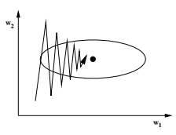

图 17.15。Vario-Eta，类牛顿方法的随机近似

梯度方法将遵循“之字形”的轨迹，且会非常缓慢地逼近最小值。使用 Vario-Eta，沿 w2 的之字形运动被减弱，沿 w1 的漂移被加速。这种行为类似于经典牛顿方法在这种情况下所显示的权重轨迹。实际实施使用随机近似来计算标准差。

在 Vario-Eta 中使用标准差而不是方差意味着在训练大型网络时的额外优势。在神经网络中经过一系列层时，误差信号包含的信息越来越少。

等式 17.34 中的归一化为每个权重重新缩放学习信息。如果将 Vario-Eta 设计得尽可能接近二阶方法，则在分母中使用方差而不是标准差是合适的，但那样我们也会失去缩放属性。在 17.6.3 节中，我们将提供使用标准差的进一步优势。

按模式或使用小批次进行学习可以被视为一种随机搜索过程，因为我们可以将权重增量写为：

$$\Delta w^{(\tau)}=-\eta\left[g+\left(\frac{1}{N}\sum_{t=1}^{N}g_{t}-g\right)\right].\tag{17.35}$$

这些增量由朝向局部最小值的 g 项和噪声项(1N)组成。

Nt=1 gt − g) 扰动这个漂移。

17.6.3 参数噪声作为隐式惩罚函数考虑在权重空间中某点 w 周围的 E(w)的泰勒展开。

$$E(w+\Delta w)=E(w)+\sum_{i}\frac{\partial E}{\partial w_{i}}\Delta w_{i}+\frac{1}{2}\sum_{i,j}\frac{\partial^{2}E}{\partial w_{i}\partial w_{j}}\Delta w_{i}\Delta w_{j}+\ldots.\tag{17.36}$$

假设给定一个 T 个扰动向量Δwt 的序列，其元素在 t 上不相关，均值为零，方差为（行）向量 var(Δwi)。那么，期望值 E(w)可以近似为

$$\langle E(w)\rangle\approx{\frac{1}{T}}\sum_{t}E(w+\Delta w_{t})=E(w)+{\frac{1}{2}}\sum_{i}\operatorname{var}(\Delta w_{i}){\frac{\partial^{2}E}{\partial w_{i}^{2}}}$$

$$(17.37)$$

假设在接近局部最小值时，E 的一阶和二阶导数是稳定的。在公式 17.37 中，权重上的噪声隐含地作为误差函数的惩罚项，由二阶导数∂2E 给出。

∂w2i

. 噪声方差 var(Δwi)作为惩罚参数操作。因此，平坦的最小值解可能对实现良好的泛化性能至关重要。[13]

逐样本学习自动引入了训练过程中的这种噪声，即Δwt = −η · gt。接近收敛时，我们可以假设 gt 是独立同分布的，均值为零，方差向量 var(gi)，以便期望值可以近似为

$$\langle E(w)\rangle\approx E(w)+\frac{\eta^{2}}{2}\sum_{i}\mathrm{var}(g_{i})\frac{\partial^{2}E}{\partial w_{i}^{2}}\;.$$

$$(17.38)$$

. (17.38)

这种学习类型引入了一个局部惩罚参数 var(gi)，特征化权重 w = [wi]i=1*,...,k*的稳定性。在局部最小值，权重 wi 的梯度总和为 git = 0，而方差 var(gi)可能很大。在这种情况下，解对数据的重采样非常敏感，因此不稳定。为了提高泛化能力，应该对具有高方差的权重周围的误差函数的曲率进行强惩罚。

这由逐样本学习自动完成。

由于 Vario-Eta 学习引起的噪声Δwt(i) = −√

η σ2i

· gti 导致一个期望值

$$\langle E(w)\rangle\approx E(w)+\frac{\eta^{2}}{2}\sum_{i}\frac{\partial^{2}E}{\partial w_{i}^{2}}\;.$$

$$(17.39)$$

. (17.39)

通过在公式 17.38 中消去项 var(gi)，Vario-Eta 实现了一个简化的均匀惩罚参数，仅依赖于学习率η。虽然逐样本学习是一个慢算法，具有局部调整的惩罚控制，但 Vario-Eta 在简化的均匀惩罚项的代价下却速度较快。

| 局部   | 学习率（Vario-Eta）          | →   | 全局   | 惩罚   |
| --- | --- | --- | --- | --- |
| 全局  | 学习率（逐样本） | →   | 局部    | 惩罚   |

根据这些思路，我们将展示典型的牛顿方法不应在随机学习中使用。假设我们接近局部最小值，并且误差函数的海森矩阵 H 不再显著变化。在这个假设下，隐含的噪声将是Δwt = ηH−1gt。由于海森矩阵的稳定性，噪声的均值为零，因此期望的误差函数变为

$$\langle E(w)\rangle\approx E(w)+\frac{\eta^{2}}{2}\sum_{i}\mbox{var}(g_{i})\left(\frac{\partial^{2}E}{\partial w_{i}^{2}}\right)^{-1}.\tag{17.40}$$

在这种情况下，我们再次通过梯度的方差 var(gi) 来局部控制惩罚参数，就像模式逐个学习一样。但现在，我们在权重空间中，惩罚曲率的逆值较大的权重点。这意味着我们惩罚平坦的极小值解，这与我们寻找稳定解的目标相悖。

通常，牛顿方法被用作累积学习方法，因此之前的论点不适用。因此，我们得出结论，二阶方法不应在随机搜索算法中使用。以支持全局

| 学习           | 结构   | 速度   |
| --- | --- | --- |
| 模式逐个 | +           | −       |
| VarioEta           | −           | +       |

表 17.1 结构-速度-困境

为了利用这些算法对平坦极小值解的偏置，我们在接下来只使用逐个模式学习或 Vario-Eta。

我们通过提供一些如何实现平坦极小值解的建议来总结本节（另见表 17.1）：

- 使用 Vario-Eta 将网络训练到最小训练误差解，Vario-Eta 是牛顿方法的随机近似，因此速度较快。

- 添加一个最终的逐个模式学习阶段，使用均匀的学习率，通过局部惩罚参数来微调局部曲率结构。

(eq. 17.38)。对于具有多个层的网络，此步骤应被省略，因为由于信号流长，梯度会消失。只有 Vario-Eta 及其缩放能力能够恰当地解决此类优化问题。

- 使用尽可能高的学习率 η 来保持惩罚的有效性。训练误差可能会有所变化，但隐含惩罚的包含更为重要。

我们想指出，选择使用哪种学习算法不仅影响学习的速度和全局行为，而且对于固定学习率会导致不同的结构解。在分析和比较随机学习算法时，也必须考虑这一结构后果。

## 17.6.4 清理回顾

在训练神经网络时，通常假设输入数据是无噪声的，并且强制网络精确拟合数据。即使是为了最小化过拟合影响的控制程序（即剪枝）也将输入视为精确值。然而，这一假设往往被违反，尤其是在金融分析领域，我们通过过拟合现象学到不能完全依赖数据。清洗，作为清理和学习的结合，已在[33]中引入。接下来，我们将重点放在清理方面。其动机是通过考虑输入数据被噪声污染来最小化过拟合影响，而噪声的分布也需要学习。

$$(17.41)$$

图 17.16。如果模型函数的斜率很大，则输入数据的小变化会显著减少输出误差。

模式 t 的清理误差函数由两项的和给出，假设输入和输出具有相同的方差水平。

$$E_{t}^{y,x}={\frac{1}{2}}\left[\left(y_{t}-y_{t}^{d}\right)^{2}+\left(x_{t}-x_{t}^{d}\right)^{2}\right]=E_{t}^{y}+E_{t}^{x}$$

2)= Eyt + Ext (17.41)

使用 xdt , ydt 作为观察数据点。在逐模式学习中，网络输出 y(xt, w) 确定权重的适应性，和往常一样，

$$w^{(\tau+1)}=w^{(\tau)}-\eta{\frac{\partial E^{y}}{\partial w}}\ .$$

∂w . (17.42)

我们还必须记住训练集所有输入数据的修正向量 Δxt，以便将清理后的输入 xt 提供给网络，

$$(17.42)$$

$$x_{t}=x_{t}^{d}+\Delta x_{t}\ .$$

$$(17.43)$$

$$(17.44)$$

xt = xdt + Δxt . (17.43)

修正的更新规则，以 Δx(0) 初始化

t = 0 可以从典型的适应序列 x(τ+1) 推导出来。

t = x(τ)

t − η ∂Ey,x

∂x 导致

$$\Delta x_{t}^{(\tau+1)}=(1-\eta)\Delta x_{t}^{(\tau)}-\eta(y_{t}-y_{t}^{d})\frac{\partial y}{\partial x}\ .$$

∂x . (17.44)

这是统计学中误差变量概念的非线性版本 [27]（有关二维情况，请参见图 17.16）。

所有必要的量，即 (yt − ydt ) ∂y(x,w)

∂x 无论如何都是通过典型的反向传播算法计算的。我们发现，如果对权重和清理更新都使用相同的学习率 η，算法的效果会很好。对于回归，清理强制接受 x 中的小误差，这反过来可以显著减少 y 的误差，尤其是在存在离群值的情况下。成功的清理应用在 [33] 和 [30] 中有报告。

虽然网络可能会为清理后的输入数据学习一个最佳模型，但在测试集上处理清理数据并不容易，因为对于这些数据，我们不知道输出目标差异以计算方程 17.44。因此，模型在具有不同噪声特征的测试集上进行评估，而与训练集不同。我们稍后将提出结合噪声学习和清理的方法，以解决这一严重缺陷。

## 17.6.5 数据噪声回顾

在训练过程中，输入数据上常常使用人工噪声，因为它创建了无限数量的训练示例，并将数据扩展到输入空间的空白部分。因此，由于产生了更平滑的回归函数，死记硬背的学习倾向可能会受到限制。

现在，我们再次考虑泰勒展开，这次应用于输入空间中某个点 x 周围的 E(x)。期望值 E(x) 近似为

$$\langle E(x)\rangle\approx{\frac{1}{T}}\sum_{t}E(x+\Delta x_{t})=E(x)+{\frac{1}{2}}\sum_{j}\operatorname{var}(\Delta x_{j}){\frac{\partial^{2}E}{\partial x_{j}^{2}}}$$

$$(17.45)$$

其中 ∂2E

∂x2j 是误差函数相对于输入 x 的 Hessian Hxx 的对角元素。同样，在公式 17.45 中，输入上的噪声隐含地作为误差函数的惩罚项与噪声方差 var(Δxj ) 一起作用。

作为惩罚参数（比较公式 17.37）。输入上的噪声通过偏向光滑模型改善泛化行为 [3]。

噪声水平可以设置为一个常数值，例如，由先验知识给出，或者如现在所描述的那样自适应。我们将集中于均匀或正态噪声分布。然后，自适应噪声水平 ξj 将针对每个输入 j 单独估计。抑制模式索引后，我们定义平均残差误差 ξj 和 ξ2j 如下：

$$\mathrm{均匀~残差~误差}\colon\xi_{j}={\frac{1}{T}}\sum_{t}\left|{\frac{\partial E^{y}}{\partial x_{j}}}\right|\,,$$

$$(17.46)$$

, (17.46)

$$\mathrm{高斯~残差~误差}\colon\xi_{j}^{2}={\frac{1}{T}}\sum_{t}\left({\frac{\partial E^{y}}{\partial x_{j}}}\right)^{2}\,.$$

$$(17.47)$$

2. (17.47)

实际实现使用随机逼近，例如，用于均匀残差误差

$$\xi_{j}^{(\tau+1)}=(1-\frac{1}{T})\xi_{j}^{(\tau)}+\frac{1}{T}\left|\frac{\partial E^{y}}{\partial x_{j}}\right|\,.$$

$$(17.48)$$

. (17.48)

不同的残差误差水平可以如下解释（表 17.2）：

较小的 ξj 可能表明输入 j 不重要或与

网络对该输入 j 的影响。在这两种情况下，较小的噪声水平都是合适的。

另一方面，输入 j 的高值 ξj 表示一个重要但

不完全适配的输入。在这种情况下，建议使用高噪声水平。高值的

ξj 会导致更僵硬的回归模型，因此可能会提高泛化能力。

网络性能的完美拟合。因此，我们使用 ξj 或 ξ2j 作为控制

输入 j 的噪声水平。

表 17.2. 残差误差 ξ 不同水平的解释

| 观察         | 的                              | 建议         | 对   | 该   |
| --- | --- | --- | --- | --- |
| 预测的      | 残差                        | 噪声控制  |       |       |
| 误差         | 解释 完美拟合      |                |       |       |
| ξ 小       | 或                              | 使用低噪声  |       |       |
|               | 不重要输入 不完美拟合 |                |       |       |
| ξ 大       | 但                             | 使用高噪声 |       |       |
|               | 重要输入                 |                |       |       |

## 17.6.6 使用噪声清理

通常，带噪声输入的训练涉及获取一个数据点并添加一个从固定或自适应分布中抽取的随机变量。这个新的数据点 xt 用作网络的输入。如果我们假设数据被离群值和其他影响所污染，最好将噪声项添加到清理后的输入中。对于高斯噪声的情况，结果新输入为：

$$x_{t}=x_{t}^{d}+\Delta x_{t}+\xi\phi,$$

$$(17.49)$$

xt = xdt + Δxt + ξφ, (17.49)

其中 φ 取自正态分布。数据的清洗导致数据的均值被修正，从而使噪声分布更加对称，同时也覆盖了观察到的数据 xt。

我们提出了一种变体，允许更复杂且依赖于问题的噪声分布：

xt = xdt + Δxt − Δxk, (17.50)

其中 k 是从记忆的修正向量 [Δxt]t=1*,...,T* 的索引中抽取的随机数。通过这一方式，我们利用修正向量的分布特性生成可能不对称和/或依赖的噪声分布，这样当 k = t 时仍然覆盖 xt = xdt。

人们可能会想，为什么我们要用额外的噪声项 Δxk 来干扰清洗后的输入 xdt + Δxt。原因在于我们希望将整个输入分布呈现给网络，而不仅仅使用某一特定的实现。这种方法为在训练集与测试集之间切换时的清洗问题提供了解决方案，如第 17.6.4 节所述。

## 17.6.7 统一方法：结构与噪声的分离

在前面的章节中，我们解释了数据如何被分离为清洗部分和无法解释的噪声部分。类似地，神经网络被描述为一种时间不变的结构（否则无法进行预测）和一个噪声部分。

数据 → 清洗数据 + 时间不变数据噪声 神经网络 → 时间不变参数 + 参数噪声 我们建议使用清洗和自适应噪声来分离数据，并使用学习和随机搜索来分离神经网络的结构。

数据 ← 清洗（神经网络） + 自适应噪声（神经网络）

神经网络 ← 学习（数据） + 随机搜索（数据）

分析数据的算法直接依赖于网络，而寻找结构的方法则直接与数据相关。应该明确的是，模型构建过程应以交替或同时的方式结合这两个方面。我们通常同时使用学习和清洗。数据分析与网络结构算法的相互作用直接体现了观察者-观察对象困境的概念。

统一方法的目标可以描述为，在这里假设一个高斯噪声模型，即最小化由于结构和数据引起的误差：

$$\frac{1}{2T}\sum_{t=1}^{T}\left[\left(y_{t}-y_{t}^{d}\right)^{2}+\left(x_{t}-x_{t}^{d}\right)^{2}\right]\rightarrow\min_{x_{t},w}\tag{17.51}$$

结合算法并使用指数平滑法近似累计梯度 g 为 g˜，我们得到

$$\mathrm{data}$$

$$\begin{array}{r l}{{\frac{d a t a}{d x_{t}^{(\tau+1)}}=(1-\eta)\Delta x_{t}^{(\tau)}-\eta(y_{t}-y_{t}^{d}){\frac{\partial y}{\partial x}}}}\\ {{x_{t}=x_{t}^{d}+\underbrace{\Delta x_{t}^{(\tau)}}_{\mathrm{cleaning}}-\underbrace{\Delta x_{k}^{(\tau)}}_{\mathrm{noise}}}}\end{array}$$

$$(17.52)$$

结构

$$\begin{array}{r l}{{}}&{{}{\tilde{g}^{(\tau+1)}=(1-\alpha)\tilde{g}^{(\tau)}+\alpha(y_{t}-y_{t}^{d})\frac{\partial y}{\partial w}}}\\ {{}}&{{}}\\ {{w^{(\tau+1)}=w^{(\tau)}-\underbrace{\eta\tilde{g}^{(\tau)}}_{\mathrm{learning}}-\underbrace{\eta(g_{t}-\tilde{g}^{(\tau)})}_{\mathrm{noise}}}}\end{array}$$

网络对数据的清理为每个训练模式计算了一个单独的修正项。根据公式 17.50 的自适应噪声过程生成了一个潜在的不对称和相关的噪声分布，同时也涵盖了观察到的数据。隐含的曲率惩罚，其强度依赖于输入变量的个体负担，可以提高神经网络的泛化性能。

结构的学习涉及对特征为 1T 的时间不变参数的搜索。

gt = 0。参数噪声支持这种探索，作为一种随机搜索，以寻找更好的“全局”极小值。此外，隐含的曲率惩罚可能会进一步改善泛化性能，具体取决于参数的局部负担。请注意，尽管权重更新的描述简化为公式 17.33 的简单形式，我们更倾向于使用上述公式，以强调处理数据和结构之间机制的类比。

在寻找数据和参数的最佳组合时，我们需要对两者进行建模。这并不是我们未能构建完美模型的表现，而是控制数据与结构相互作用的重要元素。

## 17.7 架构优化

初始网络只能是对合适最终架构的猜测。应对这种不足的一种方法是使用生长网络。相反的可能性是，可以应用剪枝来缩小网络。从我们的经验来看，生长网络的快速学习优势被大型架构的更好学习特性所抵消。至少在最初的学习步骤中，大型网络不会那么快被困在局部极小值中。根据*晚停止*概念应用剪枝方法时，该方法训练网络的权重，直到误差函数收敛（见第 17.8.1 节），学习过程有足够的适应步骤来调整广泛的网络结构。剪枝技术的另一个优势是更大灵活性，以生成稀疏和可能不规则的网络架构。

## 17.7.1 节点剪枝

我们通过使用测试值来评估输入节点或隐藏节点的重要性。

$${\rm test}_{i}=E(x_{1},\ldots,x_{i}=\mu(x_{i}),\ldots,x_{n})-E(x_{1},\ldots,x_{n})\,,\tag{17.53}$$

以μ(xi)描述训练集中第 i 个输入在时间序列中的平均值。这个测试值是一个度量，如果我们省略其中一个输入序列，误差的增加情况。

在网络内部预处理中的瓶颈结构的创建

（第 17.2 节）最好通过对训练集中的瓶颈隐藏神经元应用此测试来执行。这样，学习的干扰减少到最低。在训练过程的一个步骤中（第 17.8 节），我们将展示输入神经元的剪枝应该在验证集上进行，以改善预测的时间稳定性。

除了删除节点，输入的排名可以使我们深入了解任务（哪些输入是最相关的，等等）。

## 17.7.2 权重剪枝

神经网络拓扑仅代表真实基础函数类别的假设。由于可能的错误规格，我们可能会出现参数噪声分布的缺陷。剪枝算法不仅限制了网络的记忆，还在不同方式上对纠正噪声分布显得有用。

## 随机剪枝

随机剪枝 [8] 基本上是对权重 w 的 t 检验，

$$\mathrm{test}_{w}={\frac{|w+g|}{\sqrt{{\frac{1}{T}}\sum(g_{t}-g)^{2}}}},$$

$$(17.54)$$

, (17.54)

g = 1T

t gt。测试值低的权重构成剪枝的候选者。从我们的方法角度来看，这种剪枝算法等同于根据权重的大小除以其波动的标准差来取消低*责任*的权重。通过这样，我们可以实现对训练数据重采样的学习稳定化。

这种易于计算的方法在早期停止概念的结合下效果良好，而在晚期停止概念下则效果不足。

对于早期停止，随机剪枝类似于 t 检验，而对于晚期停止，较大权重的梯度波动不足，无法提供有用的测试值。因此，剪枝过程包括对非线性模型的人工偏差。此外，随机剪枝也能够恢复已经剪枝的权重。

## 早期脑损伤

另一种权重剪枝方法是 EBD，*早期脑损伤* [31]，它基于经常引用的 OBD 剪枝方法 [15]。与 OBD 相比，EBD 允许在训练达到局部最小值之前应用。

对于每个权重，EBD 计算作为测试值的误差函数在 w = 0 与该权重可能拥有的最佳情况的误差函数之间的差值的近似值

$$\mathrm{test}_{w}=E(0)-E(w_{\mathrm{min}})=-g w+\frac{1}{2}w^{\prime}H w+\frac{1}{2}g H^{-1}g^{\prime}~.$$

上述近似是由误差函数的泰勒展开所激励的。从

$$E(\bar{w})=E(w)+g(\bar{w}-w)+\frac{1}{2}(\bar{w}-w)^{\prime}H(\bar{w}-w)$$

$${\mathrm{we~get}}$$

$$(17.55)$$

$$(17.56)$$

$$E(0)=E(w)-g w+{\frac{1}{2}}w^{\prime}H w$$

$$(17.57)$$

作为最小化问题的解 E( ˜w) → min，我们有

$$w_{\rm min}=w-H^{-1}g^{\prime}\ {\rm together\ with}\ \ \ E(w_{\rm min})=E(w)-\frac{1}{2}gH^{-1}g^{\prime}\,.\tag{17.58}$$

这两个误差值的差异是提出的 EBD 测试。在这种方法中，Hessian H 的计算方式与原始 OBD 计算相同。

[15].

EBD 相较于 OBD 的一个优势是可以在离局部最小值稍远的情况下进行测试。在我们的训练过程中，我们建议在学习的最后阶段使用噪声，这样我们仅接近局部最小值。此外，EBD 还能够复活已经剪枝的权重。

类似于随机剪枝，EBD 更倾向于低波动率的权重。如果一个权重受到高噪声的影响，则隐式曲率

图 17.17. EBD 与 ODB 权重剪枝

罚项将偏向于围绕该权重的平坦最小值，从而导致其被 EBD 消除。

我们的实践经验表明，EBD 剪枝允许创建极为稀疏的网络。我们有例子显示，可以将初始拥有 3000 个权重的网络剪枝到大约 50 个权重的结构。EBD 剪枝的初始迭代通常不会改善泛化能力。这是因为 EBD 测试权重在误差函数中的重要性，即与反向传播算法使用的信息相同。换句话说：EBD 仅消除那些不干扰学习的权重。训练过程的最后，网络才需要放弃部分编码结构，从而改善泛化能力。

## 逆峭度

我们想讨论的第三种剪枝方法是我们称之为 *逆峭度* 的方法。其动机来源于对图 17.18 中强迫一个权重的梯度脉冲的可能分布的分析。

如果网络训练到局部最小值，则所有梯度的均值根据定义等于零。然而，梯度的分布可能会有所不同。

现在我们必须分析峰态或非常宽广的分布与正态分布之间的差异。我们理解峰态分布表明权重仅对少量训练模式做出反应。

另一方面，更广泛的分布则表明许多训练模式。

图 17.18. 如果权重固定，梯度 gt 的可能分布

重点优化该权重。换句话说，具有尖峰分布的权重已经记住了时间序列中特殊事件，但没有建模数据的一般潜在结构。因此，反峰度剪枝与我们的网络架构很好地协调，该架构可以通过其平方层封装局部结构。此外，梯度分布非常广泛的权重会因随机事件而被推来推去，因为它几乎以相似的强度对每个模式做出反应。区分上述分布的一种简单方法是基于峰度来测量与正态分布的差异：

$${\rm distance}_{w}=\left(\frac{\frac{1}{T}\sum_{t=1}^{T}(g_{t}-g)^{4}}{\left(\frac{1}{T}\sum_{t=1}^{T}(g_{t}-g)^{2}\right)^{2}}-3\right)^{2}.\tag{17.59}$$

为了根据与正态分布的差异对网络权重的重要性进行排序，我们定义测试值为

$\text{test}_{w}=\frac{1}{\varepsilon+|\text{distance}_{w}|}$, (17.60)

使用小项ε ≈ 0.001 以避免数值问题。

类似于之前提到的剪枝技术，我们现在对不想消除的权重有了较大的测试值。请注意，在此测试中，我们忽略了梯度的大小，仅考虑了分布的形式。权重本身并不是评估的一部分，我们没有观察到该方法对学习得到的权重大小分布有很大影响。相反，随机剪枝和 EBD 倾向于剪除小权重，因为它们明确提到了权重的大小。基本上，反峰度计算出低测试值。

（即可能的剪枝候选）针对仅封装数据中局部伪影或随机事件的权重，而不是建模一般结构。

根据我们的经验，我们发现这种技术可以在剪枝的前几次迭代中显著提高泛化能力。

## 不稳定性剪枝

我们学习到最小训练误差的局部结果是每个权重的累积梯度 g 在训练集上为零，

$$g={\frac{1}{T}}\sum_{t\in T}g_{t}=0\,.$$

$$(17.61)$$

如果该条件在验证集上成立，我们的模型将是完美稳定的：

$$g_{V}=\frac{1}{V}\sum_{t\in V}g_{t}=0\,.$$

$$(17.62)$$

$$(17.63)$$

由于 gV 通常与零不同，我们必须检查测量的差异是否足够显著以指示不稳定性。在统计学的语言中，这是两个分布均值相等的两样本检验。以下测试值（Welch 检验）测量此差异：

$$\mathrm{distance}_{w}={\frac{g v-g}{\sqrt{{\frac{\sigma_{V}^{2}}{V}}+{\frac{\sigma_{T}^{2}}{T}}}}},$$

, (17.63)

该值大致呈正态分布，均值为零，方差为一。作为剪枝测试值，我们定义

$$\mathrm{test}_{w}={\frac{1}{\varepsilon+|\mathrm{distance}_{w}|}}\,.$$

$$(17.64)$$

. (17.64)

该测试值可用于构建权重排名，方法如下：训练网络直到权重接近局部最优，然后计算测试值。接着，按照该测试标准去除 5%最不稳定的权重，并重新进行学习步骤。去除超过 5%的权重是不推荐的，因为不稳定剪枝并不参考用于学习的成本函数，因此可能对误差产生重大影响。

这种稳定性测试允许定义一个有趣的标准，决定何时停止模型构建过程。在剪除权重直到达到给定稳定性水平后，我们可以检查模型是否仍然足够接近正确。这个最终停止标准得益于测试的渐近正态分布。例如，如果我们定义|distancew| < 1 的权重为稳定，则我们剪除测试值 testw < 1 的权重。

有人可能会争辩说，这种方法中验证集的使用是一种隐式建模，因此验证集不允许对泛化集进行误差估计。另一方面，验证集的典型需求是估计剪枝过程中的最终停止点。我们尝试了一种替代方法：在比较中，不使用验证集的 gV 和σ2V，而是对训练集进行加权测量，使得最新数据被赋予更大的重要性：

$$\tilde{g}=\frac{2}{T(T+1)}\sum_{t\in T}t g_{t}\,,$$

$$(17.65)$$

$$\tilde{\sigma}^{2}=\frac{2}{T(T+1)}\sum_{t\in T}t(g_{t}-\tilde{g})^{2}\,.\tag{17.66}$$

通过在方程 17.63 中用等式 17.65 和 17.66 替代 gv 和σ2V 来检查训练集的稳定性，避免了使用验证集。在我们的第一次经验中，我们观察到这种版本的效果与之前的版本一样，尽管评估仍需更多测试。

与仅消除对误差函数影响较小的权重的 EBD 相比，不稳定剪枝在模型构建过程中引入了一个新特征：时间上的稳定性。关于何时选择哪种剪枝方法的更多信息将在后面的第 17.8.4 节中提供。

## 17.8 训练过程

作者认为，复杂的现实问题应该通过多种方法的结合来解决，以应对在优化神经网络过程中可能出现的不同类型的困难。因此，本节的目的是将所有之前描述的特征与完整且一致的训练过程联系起来。

## 17.8.1 训练范式：提前停止与延迟停止

解决过拟合问题最著名的技术之一是早期停止程序。在这个程序中，我们用小权重初始化的网络开始学习。在最简单的版本中，使用验证集来估计过拟合的开始，此时停止网络学习。该程序的更复杂变体是学习到过拟合开始，然后修剪网络结构的一部分，例如权重的 10%。然后，重新启动较小的网络并重复这些步骤。这个序列如图 17.19 所示，必须迭代，直到达到没有过拟合迹象的稳定结构。

原则上，这个过程可能有效，并会生成具有良好泛化性能的模型，但在许多情况下，它会失败，正如我们在过去几年的实验中观察到的。早期停止的困难在于，停止点在经过几次学习周期后出现。作者们在一些例子中研究了这一点。

w1 图 17.19。早期停止：在小权重初始化后，网络被训练直到验证集上的误差开始增加（搜索路径 1 到停止点 1）。然后，一些权重被修剪，剩余的权重被重新初始化，训练再次开始直到停止点 2。该过程必须迭代，直到达到没有过拟合迹象的稳定结构。

停止点出现在学习的第二个周期之后。在这种情况下，解决方案被限制为线性模型，因为网络没有机会从数据中学习复杂的非线性。降低学习率并不意味着减少这种偏见，因为它只是减缓了远离线性模型的过程。使用较大值的初始权重也存在两个问题。随机的初始（可能不正确）网络规格可能导致误差曲线下降，但过一段时间后，过拟合可能会再次开始。对这种初始化的另一个重要批评是解决方案对起始点的内在依赖性。

对于某些正则化网络的惩罚项方法，同样的论点也适用。例如，权重衰减是一个偏向线性模型的正则化器。大多数其他惩罚函数（如与数据无关的平滑性）为模型构建过程设置了额外约束。这些限制并不一定与待解决的任务相关（请参见[16]，了解在隐藏层使用 sigmoid 激活函数的神经网络的平滑正则化器）。

根据这些思考，在本节中，我们提出一系列遵循延迟停止概念的步骤。我们从小权重开始，以降低随机初始化的影响。然后，我们学习直到在训练数据上达到最小误差。通常，此时网络会明显过拟合，但我们可以确定所选网络可以表示的最大非线性已从数据中学习到。此时，我们必须描述回归到具有良好泛化性能的解决方案的方式，如图 17.20 所示。

w1

图 17.20. 延迟停止：在以小权重初始化后，网络训练直到最小训练误差。随后通过修剪优化网络结构，提高泛化性能。然后，网络再次训练直到最小训练误差。

基本上，训练的两个部分，即学习到最小训练误差和提取合适的泛化模型，可以理解为生成一个结构假设，然后对生成的结构进行伪造。这些步骤将在接下来的段落中详细解释。

## 17.8.2 设置步骤

在开始学习过程之前，我们必须指定网络架构。假设我们的目标是识别一个动态系统。那么，我们建议使用第 17.3 节中的网络架构（图 17.8），可能结合第 17.5 节中的 CDEN 扩展（图 17.14），以额外估计误差条。

进一步的设置决策是将数据集分为训练集、验证集和泛化集。可能的分离如图 17.21 所示。

考虑时间序列的预测模型（至少在经济应用中），集合应该按图 17.21.1 中所示的顺序明确分开。否则，就没有机会测试模型随时间的稳定性。如果我们随机抽取训练集中的验证集（图 17.21.2），就没有机会测试这种稳定性，因为验证模式总是嵌入在训练模式中。

在提议的序列中，我们不在学习中使用测试集之前的最新数据。因此，人们可能倾向于从最旧部分选择验证模式，同时在训练集中使用最新数据（图 17.21.3）。这为通过学习生成我们的结构假设提供了更好的基础。基本上，修剪方法是对生成结构的伪造。使用图 17.21.3 中的分离和验证集

图 17.21. 数据分离

包括最旧数据可能会使这种伪造误导。在快速变化的世界中，模型随时间的稳定性是一个良好网络模型的重要性能特征。因此，我们更倾向于图 17.21.1 中的分离。

作为输入的多个预处理时间序列必须检查相关性，因为高度相关的输入只会增加模型中的数值不稳定性。为避免这一点，我们可以引入瓶颈子结构来执行主成分分析。对于我们的典型应用，约有 50 个输入，我们使用对角矩阵的净内部预处理。对于具有大量输入（数百个）的模型，

瓶颈方法可能是更优的选择。

如果使用对角矩阵的净内部预处理，则有必要检查输入的成对相关性。根据金融建模中使用大量图表指标的常见指导原则，这些指标中的许多通常具有高相关性。将它们保留在训练集中会导致不同优化运行的解决方案在输入因子重要性上给出不同的答案。

由于我们通常从相对于训练模式数量较大的权重开始，我们还建议在学习过程中使用小的权重衰减。惩罚参数应在学习率的 10%范围内，因为我们不想减少有效参数的数量。使用这个小的衰减参数值，只有那些根本没有学习的权重才会被拉至零。通过这样，我们仍然实现了最小的训练误差，但消除了所有对测试集有不可预测影响的不必要权重。

## 17.8.3 学习：生成结构假设

如果面对一个大型数据集，例如预测每日收益的任务，我们建议使用 VarioEta 适应算法训练权重。作为牛顿方法的随机近似，这是一种快速学习技术。

遵循第 17.6 节关于隐式惩罚的论点，我们应该让 VarioEta 训练后进行简单的逐模式学习，保持恒定的学习率，以实现结构上正确的学习。如前所述，保持尽可能高的学习率是有价值的，以利用隐含的惩罚项。然而，如果对月度预测模型感兴趣，可以仅使用逐模式学习，因为由于数据集小，学习速度并不相关。另一方面，隐含的曲率惩罚对于生成良好模型更为重要（见第 17.6 节）。

我们建议从头开始进行第 17.6 节的清理及清理噪声程序。这样，可以观察到随机学习与改善学习行为的清理噪声之间的有趣关系和相互作用。由于初始噪声方差设为零，输入变量的噪声将以低水平开始，并在前几个学习时期迅速增加。在经过几个时期后，当网络捕获到数据中的一些结构时，噪声与网络的残余输入误差并行衰减。因此，在训练开始时，网络只能学习数据中的全局结构。随着训练过程的推进，越来越多的数据细节被提取，导致清理噪声水平同时降低。

（图 17.22）。清理 4 通过将数据结构从全局序列化为越来越专业化的特征来改善学习过程。此外，噪声改善了权重空间中的随机搜索，从而减少了局部最小值的问题。

图 17.22。由于训练阶段开始时的噪声水平较大，网络首先学习全局特征。在后续训练步骤中，它能够提取越来越多的细节。

根据问题的不同，我们观察到隐式控制的噪声水平可以降到接近零，也可以收敛到中间水平。当我们观察到稳定时，我们结束学习步骤以达到最小训练误差。

4 即使在早期停止概念中，清理也可能改善学习。

错误函数在训练集和验证集上的行为，同时与训练集上所有输入的平均噪声水平的稳定行为一致。本步骤的最终模型是关于我们分析的动态系统的结构假设。

## 17.8.4 剪枝：生成结构的伪造

接下来，我们必须测试模型随时间的稳定性。特别是在经济建模中，从七十年代或八十年代提取的资本市场结构在现在是否仍然有效并不明显。我们可以通过在时间轴上跟随训练集的验证集上测试网络行为来检查这种稳定性。

通过在验证集上进行输入修剪（见第 17.7 节），我们能够识别在训练集中可能高度相关但在验证数据上可能没有或甚至产生相反效果的输入序列。请注意，在达到最小训练误差之前，无法修剪不相关的时间序列，因为在此之前输入与目标变量之间并不存在明确的关系。另一方面，针对验证集的不重要或不一致的输入不应在后期被消除，以便通过后续学习促进具有高泛化性能的模型构建。

检查模型稳定性的另一种方法是使用不稳定修剪算法对验证集进行权重修剪。如果数据集非常庞大，权重修剪具有显著优势，因为只需对数据集进行一次遍历，而不是进行 n 次遍历来获得输入修剪的排名，其中 n 为输入数量。这在数据挖掘领域尤为重要，因为我们需要处理数百或数千兆字节的训练数据。

每次进行权重或输入的修剪后，网络都会重新训练，以实现训练/验证集（图 17.24）上误差曲线和噪声水平（图 17.23）的稳定表现。这里，我们所说的误差曲线的稳定表现是指没有显著的下降趋势（即模型改进）或上升趋势（即模型重构）。在图 17.25 中，这些停止条件用（∗）标记。

为了在这一阶段消除网络结构中的局部伪影，我们可以包括一些逆峰度修剪的迭代和随后的再训练。如果*剧烈*下降，即 5%这个标准不再可观察，那么迭代修剪和训练的过程结束。

在几次训练和修剪迭代后，这一策略导致验证集上的误差迅速下降。

由于网络参数数量的减少导致梯度增加，使用恒定学习率的逐模式学习最为有效，因为隐式局部曲率惩罚变得愈加重要。

有人可能会批评所提议的修剪策略，因为它确实是在验证集上的一种优化。因此，验证集上的误差不再很好地代表泛化误差的估计。我们认为，没有办法省略这一步修剪，因为测试时间稳定性对于获得具有高泛化性能的模型至关重要。

在网络学习的后续部分，我们利用基于训练集上计算的测试值进行权重剪枝的“奥卡姆剃刀”。这可能是 EBD 或不稳定剪枝（见第 17.7.2 节）。基于数百次实验，两种方法的性能是可比的。在剪枝约 10%或 5%的活动权重后，我们再次训练，直到获得稳定的误差曲线和噪声水平。

可以通过首先消除不稳定剪枝下的权重，然后使用 EBD 生成非常稀疏的网络来组合这些剪枝方法。不稳定剪枝在时间上更偏向于模型稳定性，而 EBD 则允许稀疏模型仍能很好地逼近。

如果使用图 17.8 的十一层架构，权重剪枝应仅应用于连接预处理层或平方层与隐藏层的权重，原因有二。首先，这些连接器代表了神经网络中大多数权重。其次，重要的是仅对与输出神经元距离相同的权重应用剪枝技术。因此，基于梯度的剪枝算法的测试值是可比较的，这导致权重的可靠排名。

图 17.23 剪枝与自适应噪声水平之间的交互

如果选择不使用十一层架构，而是扩展随机目标的典型神经网络，则必须考虑输入和权重剪枝的以下后果。测试值必须仅针对正确的目标进行计算。这样，建模随机目标的权重将失去其重要性。EBD 剪枝在识别此类平坦极小值权重方面表现良好（第 17.7.2 节），因此，这是我们喜欢的剪枝方法。

剪枝与自适应噪声过程之间存在有趣的相互作用（见图 17.23）。在每个剪枝步骤中，我们会消除一些已经记住数据结构的参数。因此，残余输入误差将增加，从而导致输入上的噪声水平升高。因此，在每次剪枝后，学习必须关注数据的更全球结构。由于剪枝后网络记忆逐渐减少，网络无法依赖数据的特定特征，而是被迫越来越多地集中于一般的潜在结构。有趣的是，这部分过程可以被视为与学习直到最小训练误差的相反。在那里，网络被清洗噪声迫使先学习全球结构，然后再试图提取数据的具体特征。

## 17.8.5 训练的最终停止标准

我们需要回答的最后一个问题是最终停止点的定义。

显然，在多次权重剪枝和训练迭代后，训练集和验证集的错误会增加。因此，验证集上的最小错误应给我们一个停止优化的估计。在实践中，学习过程中的错误曲线并不是平滑且单调的曲线，只有一个最小值。最简单的建议是剪枝直到所有权重都被消除，同时保持一个痕迹以存储验证集上的最佳中间解。图 17.24 显示了在训练过程中不同阶段的错误行为，假设从早期停止方法的角度来看，验证集上的错误立即增加是最糟糕的情况。

不稳定剪枝提供了最终停止点的另一种定义。如果我们用这种剪枝方法替代 EBD 以应用奥卡姆剃刀，

图 17.24. 训练过程中的错误行为。区域（1）描述通往最小训练误差的路径，（2）是验证集上输入剪枝的典型行为，（3）展示了以剪枝形式体现的奥卡姆剃刀的后果。

剪枝/重训练迭代将提高模型的稳定性，因为不稳定剪枝删除不稳定权重（见第 17.7.2 节）。

## 17.8.6 训练过程的示意图

图 17.25 中的下图展示了合并成统一训练过程的训练步骤。

在验证集上激活权重的痕迹。

8.4 7.1, 7.2 通过输入剪枝（每个时间步一个输入）或在每次剪枝后使用模式逐一学习进行重训练来伪造模型的时间稳定性*。

只要验证集错误至少下降 5%，就进行不稳定剪枝（占权重的 5%）。

通过逆峭度剪枝删除网络结构中的封装伪影。

在每次剪枝后使用模式逐一学习进行重训练，以满足停止条件*。

每次迭代消除 10%（5%）的有效权重。

奥卡姆剃刀：通过在训练集上进行权重剪枝 EBD（或不稳定剪枝）来减少内存。

7.2 8.4 8.5 将验证集上的最佳中间解（存储在痕迹中）定义为结果模型。

图 17.25. 训练过程的示意图。标记（∗）表示停止点（第 17.8.3 节和 17.8.4 节）。框号对应于各个节。

## 17.9 实验

在欧洲共同体赞助的研究项目中，我们使用所提议的方法估计 G7 各国 3 个金融市场的回报[12]。这些估计随后将用于资产配置方案，以创建马科维茨最优投资组合。在本文中，我们仅报告德国债券利率的估计结果，这是由于德国和东德的统一而较为困难的任务。在这里，我们必须预测债券利率提前 6 个月的回报。输入包括通过预处理 16 个相关金融时间序列获得的 39 个变量。训练集覆盖的时间为 1974 年 4 月至 1991 年 12 月，验证集为 1992 年 1 月至 1994 年 5 月。结果使用从 1994 年 6 月到 1996 年 5 月的样本外数据收集。为了展示算法的表现，我们将我们的方法与一个具有一个隐藏层（20 个神经元，tanh 传递函数）和一个线性输出（方程 17.30 作为误差函数）的标准神经网络进行比较。首先，我们使用小批量 20 个模式的逐模式学习训练神经网络，直到收敛。我们将这个网络称为经典方法。然后，我们训练 11 层网络。

（图 17.8）使用第 4.1 节中描述的统一方法。由于数据集较小，我们采用无 VarioEta 的逐模式学习。数据通过方程 17.50 的清洗和噪声方法进行处理。我们基于三项性能指标（见表 17.3）比较网络的预测结果。首先，命中率计算债券收益的符号被正确预测的次数。至于其他指标，预测模型到交易系统的步骤在这里保持非常简单。如果输出为正，我们购买债券的股份，否则我们卖出。实现的潜力是训练（测试）集上收益与最大可能收益的比率。年化回报是交易系统的平均年利润。我们的方法结果优越。例如，我们几乎将测试集的年化回报从 4.5%翻倍至 8.5%。在图 17.26 中，我们比较了两种方法在测试集上的累计回报。统一方法不仅显示出更高的盈利能力，而且最大回撤远低于其他方法。

表 17.3. 两个网络在训练（测试）数据上的命中率、实现潜力和年化回报的比较

| 网络              | 命中率    | 实现潜力          | 年化回报         |
| --- | --- | --- | --- |
| 我们的方法       | 96% (81%)  | 100% (75%)        | 11.22% (8.5%)    |
| 经典方法        | 93% (66%)  | 96% (44%)         | 10.08% (4.5%)    |

6 目前，我们不允许对我们使用的实际数据进行更具体的说明。

图 17.26. 两种方法的累计盈亏曲线比较

## 17.10 结论

典型的神经网络回归分析始于声明：“原则上，神经网络可以建模一切”。如果由于噪声或缺失因素数据不太可靠，学习仅是模型构建过程的一部分。通常，任务无关的正则化被用作减少数据引入的不确定性的手段。更一般地说，模型构建过程需要更多关于特定任务的信息（先验知识）。

我们已经展示了有大量技术可以包含依赖于问题的额外约束。因此，得到的模型不仅基于训练数据，还基于额外约束以及训练程序的确切步骤。从贝叶斯的角度来看，这可以描述为在模型构建过程中对先验的整合。因此，本文也可以解读为对有价值的先验进行讨论，以及如何组合它们以实现最大的协同效应。

作者认为，额外特性是神经网络的显著优势，并将导致更鲁棒和成功的模型。本文概述了我们在应用中认为有用的一些特性。

最后，统一的训练程序是通过相对简单的步骤序列构建神经网络模型的一个配方。本文的重要方面是研究不同技术之间的相互作用。所描述的算法集成在*神经网络模拟环境*（SENN）中，这是西门子公司的产品。更多信息可以在网页 http://www.senn.sni.de 找到。

[1] 阿克利, D.H., 希顿, G.E., 塞尔诺夫斯基, T.J.: 一种用于玻尔兹曼机的学习算法。认知科学 9, 147–169 (1985); 重新印刷于 [2]

[2] 安德森, J.A., 罗斯菲尔德, E. (主编): 神经计算：研究基础。

麻省理工学院出版社，剑桥 (1988)

[3] 毕肖普, C.M.: 用于模式识别的神经网络。克拉伦登出版社，牛津

(1995)

[4] 布雷曼, L.: 装袋预测器。技术报告 TR No. 421，加州大学统计系 (1994)

[5] 本克, H., 本克, O.: 非线性回归、泛函分析与鲁棒方法，第 2 卷。约翰·威利与儿子公司 (1989)

[6] 卡鲁阿纳, R.: 多任务学习。机器学习 28, 41 (1997) [7] 埃尔顿, E.J., 格鲁伯, M.J.: 现代投资组合理论与投资分析。

约翰·威利与儿子公司 (1995)

[8] 菲诺夫, W., 赫尔盖特, F., 齐默尔曼, H.G.: 通过非收敛模型选择方法提高泛化性能。见：亚历山大, I., 泰勒, J.

(主编) 人工神经网络国际会议论文集，ICANN 1992，第 2 卷，第 233–236 页 (1992)

[9] 菲诺夫, W., 赫尔盖特, F., 齐默尔曼, H.G.: 具有可变步长的神经学习方法，技术报告，西门子公司 (1993)

[10] Flake, G.W.: 方形单元增强的径向扩展多层感知器。在：Orr, G.B., Müller, K.-R. (编辑) 神经网络：行业技巧，第 1 版。LNCS，

卷 7700，第 143–161 页。施普林格出版社，海德堡（2012）

[11] Gershenfeld, N.A.: 实验者对动态系统观察的介绍。在：Hao, B.L. (编辑) 混沌方向，卷 2，第 310–384 页。世界科学出版社，新加坡（1989）

[12] Herve, P., Naim, P., Zimmermann, H.G.: 资产配置的高级自适应架构：一个试验应用。在：金融市场预测（1996）

[13] Hochreiter, S., Schmidhuber, J.: 平坦极小值。神经计算 9(1)，1–42

(1997)

[14] Hornik, K.: 多层前馈网络的逼近能力。神经网络 4，251–257（1991）

[15] le Cun, Y., Denker, J.S., Solla, S.A.: 最优脑损伤。在：Touretzky, D.S.

(编辑) 神经信息处理系统进展，NIPS 1989，卷 2，第 598–605 页。摩根·考夫曼，圣马特奥（1990）

[16] Moody, J.E., Rögnvaldsson, T.S.: 投影基函数网络的平滑正则化器。在：Mozer, M.C., Jordan, M.I., Petsche, T. (编辑) 神经信息处理系统进展，卷 9，第 585 页。麻省理工学院出版社（1997）

[17] Williams, P.M.: 使用神经网络建模条件多元密度。技术报告 CSRP 371，萨塞克斯大学认知与计算科学学院（1995 年 2 月）

[18] Neuneier, R.: 使用自适应动态编程的最佳资产配置。在：

神经信息处理系统进展，卷 8。麻省理工学院出版社（1996）

[19] Neuneier, R.: 使用神经网络的最佳投资决策。博士

论文，凯瑟尔劳滕大学，计算机科学研究所（1998）

[20] Neuneier, R., Finnoff, W., Hergert, F., Ormoneit, D.: 条件密度的估计：神经网络方法的比较。在：国际人工神经网络会议，ICANN，卷 1，第 689–692 页。施普林格出版社（1994）

[21] Nix, D.A., Weigend, A.S.: 估计目标概率分布的均值和方差。在：神经网络世界大会。劳伦斯·厄尔鲍姆协会（1994）

[22] Ormoneit, D.: 使用神经网络估计概率密度。硕士论文，慕尼黑工业大学计算机科学系（1993）

[23] Papoulis, A.: 概率、随机变量和随机过程，第 3 版。

麦 Graw Hill, Inc.（1991）

[24] Perrone, M.P.: 改进回归估计：方差减少的平均方法及其在一般凸度量优化中的扩展。博士论文，布朗大学（1993）

[25] Refenes, A.P. (编辑): 资本市场中的神经网络。威利父子公司（1994）

[26] Sanger, T.D.: 单层线性前馈网络中的最佳无监督学习。神经网络 2，459–473（1989）

[27] Seber, G.A.F., Wild, C.J.: 非线性回归。约翰·威利父子公司，纽约

(1989)

[28] Srivastava, A.N., Weigend, A.S.: 计算连接主义回归中的概率密度。在：Marinaro, M., Morasso, P.G. (编辑) 《国际人工神经网络会议论文集》，意大利索伦托（ICANN 1994），

第 685–688 页。施普林格（1994）；亦见于第 IEEE 国际神经网络会议论文集，佛罗里达州奥兰多（IEEE–ICNN 1994），第 3786–3789 页。

IEEE 出版社（1994）

[29] Takens, F.: 在湍流中检测奇异吸引子。在：Rand, D.A., Young, L.S.（编辑）《动力系统与湍流》。数学讲义，卷 898，第 366–381 页。施普林格（1981）

[30] Tang, B., Hsieh, W., Tangang, F.: 使用连续性约束的神经网络清理以预测噪声时间序列。在：神经信息处理进展（ICONIP 1996），第 722–725 页。施普林格，柏林（1996）

[31] Tresp, V., Neuneier, R., Zimmermann, H.G.: 早期脑损伤。在《神经信息处理系统进展》，第 9 卷。MIT 出版社（1997）

[32] Weigend, A.S., Zimmermann, H.G.: 利用局部关系作为软约束来改善预测。计算智能在金融中的应用 6(1) (1998 年 1 月)

[33] Weigend, A.S., Zimmermann, H.G., Neuneier, R.: 神经预测中的观察者-观察问题：通过清理从不可靠数据中获得可靠模型。在：Freedman, R.（编辑）《华尔街的人工智能应用》，第 308–317 页。软件工程出版社，纽约（1995）

[34] Weigend, A.S., Rumelhart, D.E., Huberman, B.A.: 通过权重消除实现泛化并应用于预测。在：Lippmann, R.P., Moody, J.E.,

Touretzky, D.S.（编辑）《神经信息处理系统进展》，第 3 卷，第 875–882 页。摩根·考夫曼，旧金山（1991）

[35] White, H.: 使用人工神经网络的参数统计估计。

技术报告，加州大学圣地亚哥分校（1991）

[36] Zimmermann, H.G., Weigend, A.S.: 在前馈网络中表示动态系统：一种六层架构。在：Weigend, A.S., Abu-Mostafa, Y.,

Refenes, A.-P.N.（编辑）《金融工程决策技术：第四届国际神经网络资本市场会议论文集（NNCM 1996）》。世界科学，新加坡（1997）

[37] Zimmermann, H.G.: 作为决策计算的神经网络。在：Rehkugler, H.,

Zimmermann, H.G.（编辑）《经济学中的神经网络》。弗朗茨·瓦伦出版社

(1994)

[38] Zimmermann, H.G., Neuneier, R.: 神经预测中的观察者-观察问题。在《神经信息处理系统进展》，第 10 卷。MIT

出版社（1998）

# 大学习与深度神经网络

## 序言

更多的数据和计算资源为“规模学习”开辟了道路，即将机器学习扩展到大型数据集和复杂问题。为了解决这些新问题，我们需要识别输入和输出之间复杂的依赖关系[1]。实现这一目标需要在表示能力和从大量数据流中吸收和提炼信息的能力方面都强大的算法。越来越明显的是，神经网络提供了一个出色的工具集来扩展学习。这对于简单的线性系统以及当今的重大挑战都适用，这些挑战的基础应用问题要求高非线性和复杂的结构化表示。

接下来的四章介绍了解决这些复杂学习问题的基本工具箱。它们包括一阶和二阶优化方法、训练神经网络的最佳实践以及 Torch7 的介绍，这是一个用于实现大规模学习问题的神经网络库。

第一个挑战是为模型提供足够的数据，以便正确识别丰富的依赖关系集合。第十八章[2]介绍了随机梯度下降算法（一次学习一个例子），表明在某些条件下它可以以渐近最优的速度最小化目标函数。

神经网络是执行此类优化的有效框架。

在第二十八章[7]中详细介绍的*神经网络的对应原理*指出，我们可以将一个方程或优化问题与一种神经网络架构相关联，该架构将学习问题简化为网络中相邻单元之间局部信号的交换。因此，优化问题的可处理性在很大程度上依赖于神经网络架构及其多个超参数[3]。这些超参数及其选择方法在第十九章[5]中进行了剖析。

在某些情况下，神经网络的多个超参数不足以产生良好条件的优化问题。困难的优化问题包括，例如，递归神经网络或深度神经网络，它们都涉及长范围的依赖关系。利用二阶信息（即目标函数的二阶导数）可以实现更快的收敛。与一阶方法相比，二阶方法对噪声更加敏感，并且需要仔细调整的优化参数以实现良好的速度与稳定性的权衡。第二十章[6]中深入讨论了深度和递归神经网络的二阶方法。

G. Montavon 等人（主编）：NN: Tricks of the Trade, 2nd edn., LNCS 7700, pp. 419–420, 2012。

-c Springer-Verlag Berlin Heidelberg 2012

最后，算法必须被翻译成可以由机器运行的代码。第二十一章[4]介绍了*Torch7*，一种高效且易于使用的构建和训练神经网络的软件。该软件提供大量神经网络原语，具有高度模块化，适用于计算机视觉、自然语言处理、语音识别等广泛问题。

格雷戈尔与克劳斯

[1] Bengio, Y., LeCun, Y.: 将学习算法扩展到人工智能。在：大型规模核机器（2007）

[2] Bottou, L.: 随机梯度下降技巧。在：Montavon, G., Orr, G.B.,

Müller, K.-R.（主编）《神经网络：行业窍门》，第 2 版。LNCS，第 7700 卷，第 421–436 页。施普林格，海德堡（2012）

[3] LeCun, Y., Bottou, L., Orr, G.B., Müller, K.-R.: 高效反向传播。在：Orr, G.B.,

Müller, K.-R.（主编）《NIPS-WS 1996》。LNCS，第 1524 卷，第 9–50 页。施普林格，海德堡（1998）

[4] Collobert, R., Kavukcuoglu, K., Farabet, C.: 高效实现神经网络。在：Montavon, G., Orr, G.B., Müller, K.-R.（主编）《神经网络：行业窍门》，第 2 版。LNCS，第 7700 卷，第 537–557 页。施普林格，海德堡（2012）

[5] Bengio, Y.: 深度架构基于梯度的训练的实用建议。在：Montavon, G., Orr, G.B., Müller, K.-R.（主编）《神经网络：行业窍门》，第 2 版。LNCS，第 7700 卷，第 437–478 页。施普林格，海德堡（2012）

[6] Martens, J., Sutskever, I.: 无海森优化训练深度和递归网络。在：Montavon, G., Orr, G.B., Müller, K.-R.（主编）《神经网络：行业窍门》，第 2 版。LNCS，第 7700 卷，第 479–535 页。施普林格，海德堡（2012）

[7] Zimmermann, H.-G., Tietz, C., Grothmann, R.: 使用递归神经网络的预测：12 个技巧。在：Montavon, G., Orr, G.B., Müller, K.-R.（主编）《神经网络：行业窍门》，第 2 版。LNCS，第 7700 卷，第 687–707 页。施普林格，海德堡（2012）

# 18 随机梯度下降技巧

莱昂·博图，微软研究院，雷德蒙德，华盛顿州

leon@bottou.org http://leon.bottou.org 摘要：第一章强烈倡导使用*随机反向传播*方法训练神经网络。这实际上是更通用技术*随机梯度下降*（SGD）的一个实例。本章提供背景材料，解释了为什么 SGD 在训练集较大时是一个好的学习算法，并提供有用的建议。

## 18.1 引言

第一章强烈倡导使用*随机反向传播*方法训练神经网络。这实际上是更通用技术随机梯度下降（SGD）的一个实例。本章提供背景材料，解释了为什么 SGD 在训练集较大时是一个好的学习算法，并提供有用的建议。

## 18.2 什么是随机梯度下降？

让我们首先考虑一个简单的监督学习设置。每个示例 z 是一对 (*x, y*)，由任意输入 x 和标量输出 y 组成。我们考虑一个 *损失* 函数 (ˆ*y, y*)，它衡量当实际答案为 y 时预测 yˆ 的代价，我们选择一个由权重向量 w 参数化的函数族 F。我们寻找函数 f ∈ F，使损失 Q(z,w) = (fw(x), y) 最小化。

在这些示例上进行平均。尽管我们希望对体现自然法则的未知分布 dP(z) 进行平均，但我们通常不得不满足于在样本 z1 *...z*n 上计算平均。

$$E(f)=\int\ell(f(x),y)\,dP(z)\qquad E_{n}(f)=\frac{1}{n}\sum_{i=1}^{n}\ell(f(x_{i}),y_{i})\tag{18.1}$$

*经验风险* En(f) 衡量训练集的表现。*期望*风险 E(f) 衡量泛化性能，即对未来示例的期望表现。统计学习理论[25]证明，当所选的函数族 F 足够限制时，最小化经验风险而不是期望风险是合理的。

G. Montavon 等 (Eds.): NN: Tricks of the Trade, 第 2 版, LNCS 7700, pp. 421–436, 2012。

-c Springer-Verlag Berlin Heidelberg 2012

## 18.2.1 梯度下降

通常建议（例如，[18]）最小化经验风险 En(fw)

使用 *梯度下降* (GD)。每次迭代根据 En(fw) 的梯度更新权重 w，

$$w_{t+1}=w_{t}-\gamma\frac{1}{n}\sum_{i=1}^{n}\nabla_{w}\,Q(z_{i},w_{t})\,,\tag{18.2}$$

其中 γ 是适当选择的学习率。在足够的正则性假设下，当初始估计 w0 足够接近最优解时，以及学习率 γ 足够小时，该算法实现了 *线性* 收敛 [6]，即 − log ρ ∼ t，其中 ρ 代表残差误差。1 通过用接近于成本在最优点的 Hessian 的逆的正定矩阵 Γt 替代标量学习率 γ，可以设计出更好的优化算法：

$$w_{t+1}\ =\ w_{t}-\Gamma_{t}\frac{1}{n}\sum_{i=1}^{n}\nabla_{w}\,Q(z_{i},w_{t})\,.$$

$$(18.3)$$

这种 *二阶梯度下降* (2GD) 是著名的牛顿算法的一种变体。在足够乐观的正则性假设下，且在 w0 足够接近最优解的情况下，二阶梯度下降实现了 *二次收敛*。当代价是二次的且缩放矩阵 Γ 是精确的时，该算法在一次迭代后达到最优解。

否则，假设有足够的平滑性，我们有 − log log ρ ∼ t。

## 18.2.2 随机梯度下降

*随机梯度下降* (SGD) 算法是一个极大的简化。

每次迭代不精确计算 En(fw) 的梯度，而是基于单个随机选取的示例 zt 来估计该梯度：

$$w_{t+1}\ =\ w_{t}-\gamma_{t}\nabla_{w}\,Q(z_{t},w_{t})\,.$$

$$(18.4)$$

随机过程 {wt, t= 1*,...* } 依赖于每次迭代随机挑选的示例。希望 (18.4) 的表现类似于它的期望 (18.2)

尽管这一简化过程引入了噪声。

由于随机算法不需要记住上一次迭代中访问过的示例，因此它可以在部署的系统中即时处理示例。在这种情况下，随机梯度下降直接优化期望风险，因为示例是从真实分布中随机抽取的。

1 出于历史原因，*线性收敛*意味着残差误差呈指数级渐近减小，而*二次收敛*则表示更快的渐近收敛。这两种收敛速度均显著快于第 18.2.3 节讨论的 SGD 收敛速度。

| 表 18.1.               | 各种学习系统的随机梯度算法                                                 |               |            |
| --- | --- | --- | --- |
| 损失                      | 随机梯度算法                                                                               |               |            |
| Adaline [26]              |  yt − wΦ(xt)  Φ(xt)                                                                                                             |               |            |
| Qadaline = 1 2  y − wΦ(x) 2                           | w ← w + γt                                                                                                  |               |            |
| 特征 Φ(x) ∈ Rd,       | 类别 y = ±1                                                                                              |               |            |
| 感知机 [17]           | yt Φ(xt) 如果 yt wΦ(xt) ≤ 0                                                                                                             |               |            |
|                           | w ← w + γt                                                                                                  |               |            |
| Qperceptron = max{0, −y wΦ(x)}                           | 0                                                                                                           | 否则     |            |
| 特征 Φ(x) ∈ Rd,       | 类别 y = ±1                                                                                              |               |            |
| K-Means [12] 1            | 2                                                                                                           |               |            |
| Qkmeans = mink 2 (z − wk) | 2                                                                                                           |               |            |
|                           | k∗ = arg mink(zt − wk) nk∗ ← nk∗ + 1 wk∗ ← wk∗ + 1 nk∗ (zt − wk∗ ) (计数提供最佳学习率！) |               |            |
| 数据 z ∈ Rd 中心 w1 ...wk ∈ Rd 计数 n1 ...nk ∈ N，初始为 0 SVM [5] Qsvm = λw2 + max{0, 1 − y wΦ(x)} 特征 Φ(x) ∈ Rd，类别 y = ±1 超参数 λ > 0                           | λw                                                                                                          | 如果 yt wΦ(xt) > 1，               |            |
|                           | w ← w − γt                                                                                                  | λw − yt Φ(xt) | 否则。 |
| Lasso [23]                | ui ←  ui − γt  λ − (yt − wΦ(xt))Φi(xt)  + vi ←  vi − γt  λ + (yt − wΦ(xt))Φi(xt)  + 记法 [x]+ = max{0, x}。                                                                                                             |               |            |
| Qlasso = λ | w | 1 + 1 2  y − wΦ(x) 2 w = (u1 − v1,...,ud − vd) 特征 Φ(x) ∈ Rd，类别 y = ±1 超参数 λ > 0                           |                                                                                                             |               |            |

表 18.1 展示了多种经典机器学习方案的随机梯度下降算法。感知器、Adaline 和 k-Means 的随机梯度下降与原始论文中提出的算法相匹配。支持向量机 (SVM) 和 Lasso 最初是通过传统优化技术描述的。Qsvm 和 Qlasso 都包含一个由超参数 λ 控制的正则化项。由于 Qkmeans 是非凸的，K-means 算法收敛到一个局部最小值。另一方面，所提出的更新规则使用二阶学习率，以确保快速收敛。所提出的 Lasso 算法将每个权重表示为两个正变量的差。将随机梯度规则应用于这些变量并强制其为正，导致更稀疏的解。

## 18.2.3 随机梯度下降的收敛性

随机梯度下降的收敛性在随机逼近文献中得到了广泛研究。收敛结果通常需要满足条件 t γ2t < ∞ 和 t γt = ∞ 的递减学习率。

Robbins-Siegmund 定理 [16] 提供了在令人惊讶的温和条件下建立几乎必然收敛的方法 [3]，包括损失函数非光滑的情况。

随机梯度下降的收敛速度实际上受到真实梯度的噪声近似的限制。当学习率下降得太慢时，参数估计 wt 的方差也会同样缓慢地下降。

当学习率下降得太快时，参数估计 wt 的期望需要很长时间才能接近最优值。

- 当成本函数在最优点的 Hessian 矩阵严格正定时，最佳收敛速度通过学习率γt ∼ t 实现。

−1（例如，[14]）。此时残差误差的期望以类似速度下降，即 E(ρ) ∼ t−1。这些理论收敛速度在实践中经常观察到。

- 当我们放宽这些正则性假设时，理论表明渐近收敛速度通常更慢，如 E(ρ) ∼ t

−1/2（例如，[28]）。实际上，收敛速度仅在优化过程的最后阶段减缓。在实践中，这可能无关紧要，因为人们往往在达到此阶段之前就停止优化（见 18.3.1 节）。

二阶随机梯度下降（2SGD）将梯度乘以一个正定矩阵Γt，接近于 Hessian 的逆：

$$w_{t+1}~=~w_{t}-\gamma_{t}\Gamma_{t}\nabla_{w}\,Q(z_{t},w_{t})\,.$$

$$(18.5)$$

wt+1 = wt − γtΓt∇w Q(zt, wt). (18.5)

不幸的是，这一修改并不能减少随机噪声，因此并没有显著改善 wt 的方差。尽管常数有所改善，残差误差的期望仍然像 t 一样下降。

−1，也就是说，E(ρ) ∼ t

−1 为最佳，（例如，[1]，附录）。

因此，作为一种优化算法，随机梯度下降在渐近上*要比*典型的批量算法慢得多。然而，这并不是全部故事……

## 18.3 什么时候使用随机梯度下降？

在过去十年中，数据规模增长的速度超过了处理器的速度。在这种情况下，统计机器学习方法的能力受限于计算时间而不是样本大小。本节中呈现的分析表明，在这种情况下，随机梯度下降表现非常出色。

使用随机梯度下降

当训练时间成为瓶颈时。

## 18.3.1 大规模学习的权衡

设 f ∗ = arg minf E(f)为最佳预测函数。由于我们希望从参数化的函数族 F 中寻找预测函数，设 f ∗F = arg minf∈F E(f)为该族中最佳的函数。由于我们优化的是经验风险而不是期望风险，设 fn = arg minf∈F En(f)

为经验最优。由于这一优化可能代价高昂，当算法达到以预定义精度 En( ˜fn) < En(fn) + ρ的目标函数最小化解˜fn 时，让我们停止算法。此时过剩误差 E = E( ˜fn) − E(f ∗)可以被分解为三项[2]：

$${\cal E}\ =\ \underbrace{\mathbb{E}\big{[}E(f_{\cal F}^{*})-E(f^{*})\big{]}}_{{\cal E}_{\rm NP}}\ \ +\ \underbrace{\mathbb{E}\big{[}E(f_{n})-E(f_{\cal F}^{*})\big{]}}_{{\cal E}_{\rm out}}\ \ +\ \underbrace{\mathbb{E}\big{[}E(\bar{f}_{n})-E(f_{n})\big{]}}_{{\cal E}_{\rm opt}}.\tag{18.6}$$

- 近似误差 Eapp = E(f ∗F ) − E(f ∗)衡量的是 F 中的函数与最优解 f ∗的接近程度。通过选择更大的函数族，可以减少近似误差。

- 估计误差 Eest = E

E(fn) − E(f ∗F )

衡量的是最小化经验风险 En(f)而不是期望风险 E(f)的影响。通过选择更小的函数族或增加训练集的大小，可以减少估计误差。

- 优化误差 Eopt = E( ˜fn) − E(fn)衡量的是近似优化对期望风险的影响。通过更长时间运行优化器可以减少优化误差。当然，额外的计算时间依赖于函数族和训练集的大小。

在最大计算时间 Tmax 和最大训练集大小 nmax 的约束下，这一分解概述了涉及函数族 F 的大小、优化精度ρ和优化算法有效处理的样本数 n 之间的权衡。

$$\min_{\mathcal{F},\rho,n}\ \ \mathcal{E}=\mathcal{E}_{\rm app}+\mathcal{E}_{\rm est}+\mathcal{E}_{\rm opt}\ \ \ \ \text{subject to}\ \left\{\begin{matrix}n\leq n_{\max}\\ T(\mathcal{F},\rho,n)\leq T_{\max}\end{matrix}\right.\tag{18.7}$$

应该区分两种情况：

- *小规模学习问题*首先受到最大样本数的限制。由于计算时间不是问题，我们可以通过选择ρ为任意小值来将优化误差 Eopt 减少到微不足道的水平，并通过选择 n = nmax 来最小化估计误差 Eest。我们因此恢复了在统计学和学习理论中广泛研究的近似-估计权衡。

- *大规模学习问题*受到最大计算时间的限制，通常是因为训练样本的供应非常庞大。近似优化可以实现更好的期望风险，因为可以在允许的时间内处理更多的训练样本。具体情况依赖于所选择的优化算法的计算属性。

## 18.3.2 大规模案例的渐进分析

在渐进条件下求解(18.7)等同于确保分解(18.6)的各项以相似的速率下降。由于过剩误差(18.6)的渐进收敛速率是其最慢项的收敛速率，因此使某一项更快下降所需的计算努力将会浪费。

为简化起见，我们在本节中假设函数族 F 的 Vapnik-Chervonenkis 维数由一个共同常数界定。我们还假设优化算法满足实现第 18.2 节中讨论的收敛速率所需的所有假设。针对特定算法在较弱假设下也可以进行类似分析（例如[22]）。

[25]的均匀收敛结果的一个简单应用则给出了上界。

$${\mathcal{E}}\ =\ {\mathcal{E}}_{\mathrm{app}}+{\mathcal{E}}_{\mathrm{est}}+{\mathcal{E}}_{\mathrm{opt}}\ =\ {\mathcal{E}}_{\mathrm{app}}\ +\ {\mathcal{O}}\left({\sqrt{\frac{\log n}{n}}}\ +\rho\right).$$

不幸的是，这个界限的收敛速率过于悲观。当损失函数具有强凸性属性时 [9]，或者当数据分布满足某些假设时 [24]，会发生更快的收敛。

$${\cal E}\ =\ {\cal E}_{\rm app}+{\cal E}_{\rm est}+{\cal E}_{\rm opt}\ \sim\ {\cal E}_{\rm app}+\left(\frac{\log n}{n}\right)^{\alpha}+\rho\,,\quad\mbox{对于某些}\alpha\in\left[\frac{1}{2},1\right]\,,\tag{18.8}$$

提供了关于超额错误渐近行为的更现实的观点（例如 [13, 4]）。由于超额错误的三个分量应该以相同的速率减少，因此权衡问题的解（18.7）必须遵循多个渐近等价关系。

$${\cal E}\ \sim\ {\cal E}_{\rm app}\ \sim\ {\cal E}_{\rm est}\ \sim\ {\cal E}_{\rm opt}\ \sim\ \left(\frac{\log n}{n}\right)^{\alpha}\ \sim\ \rho.\tag{18.9}$$

表 18.2 总结了第 18.2 节中描述的四种梯度算法的渐近行为。前三行列出了每次迭代的计算成本、达到优化精度 ρ 所需的迭代次数以及相应的计算成本。最后一行提供了一个对于大规模机器学习目的更有趣的度量。假设我们在近似-估计-优化权衡的最优点（18.7）进行操作，这一行表示达到预定义的超额错误值及其期望风险所需的计算成本。这是通过应用等式 (18.9) 消去第三行结果中的变量 n 和 ρ 计算得出的。虽然随机梯度算法 SGD 和 2SGD 显然是最差的优化算法（第三行），但它们所需的时间少于

注意到 ε1/α ∼ log(n)/n 意味着 α−1 log ε ∼ log log(n) − log(n) ∼ − log(n)

且 n ∼ ε−1/α log n。将后者中的 log(n) 替换为 n ∼ ε−1/α log(1/ε)。

表 18.2 各种优化算法的渐近等价：梯度下降 (GD, eq. 18.2)、二阶梯度下降 (2GD, eq. 18.3)、随机梯度下降 (SGD, eq. 18.4) 和二阶随机梯度下降 (2SGD, eq. 18.5)。尽管它们是最差的优化算法，SGD 和 2SGD 在期望风险上实现了最快的收敛速度。它们之间的差异仅在于未在此表中显示的常数因子，例如条件数和权重向量维度。

| GD                         | 2GD       | SGD           | 2SGD        |     |     |
| --- | --- | --- | --- | --- | --- |
| 每次迭代的时间 :       | n         | n             | 1           | 1   |     |
| 达到精度 ρ 的迭代次数 : | log 1 ρ   | log log 1 ρ   | 1/ρ         | 1/ρ |     |
| 准确度 ρ 的时间：       | n log 1 ρ | n log log 1 ρ | 1/ρ         | 1/ρ |     |
| 过量误差 E 的时间：      | 1         |               |             |     |     |
| E1/α                       | log2 1 E  | 1             |             |     |     |
|                            | E1/α      | log 1 E       | log log 1 E | 1/E | 1/E |

其他算法达到预定义的期望风险（第四行）。因此，在大规模设置中，也就是说，当限制因素是计算时间而不是示例数量时，随机学习算法的表现渐近优越！ 

## 18.4 一般建议

本文的其余部分提供了一系列使用随机梯度算法的建议。尽管其中一些建议似乎微不足道，但经验一再表明它们很容易被忽视。

## 18.4.1 准备数据 随机打乱训练示例。

虽然理论上要求随机选择示例，但通常顺序遍历训练集会更快。不过，如果示例按类别分组或按特定顺序出现，这种方法就不适用了。随机打乱示例可以消除这一问题。第 1.4.2 节提供了更多讨论。

## 使用预处理技术。

随机梯度下降是一种一阶算法，因此在达到海森矩阵条件不良的区域时会遭受重大损失。幸运的是，许多简单的预处理技术可以大大改善这种情况。第 1.4.3 节和第 1.5.3 节提供了许多有用的建议。

监控训练成本和验证误差。

由于随机梯度下降在训练时间为主要关注点时非常有用，我们可以保留一些训练示例以建立一个合理的验证集。在训练过程中定期评估验证误差很重要，因为我们可以在观察到验证误差长时间没有改善时停止训练。

定期计算训练成本也很重要，因为随机梯度下降是一种迭代优化算法。由于训练成本正是算法寻求优化的目标，因此训练成本应该普遍下降。

一种好的方法是重复以下操作：

1. 在打乱后的训练集上循环一次，并执行随机梯度下降更新（18.4）。

2. 通过对训练集的额外循环，计算训练成本。

此处的训练成本指的是算法寻求优化的标准。你可以利用这个循环计算其他指标，但训练成本是需要关注的重点。3. 通过对验证集的额外循环，计算验证集误差。此处的误差指的是关注的性能指标，例如分类误差。你也可以利用这个循环便宜地计算其他指标。

计算训练成本和验证误差需要大量的计算，因为这需要对训练和验证数据进行额外的遍历。但这总比盲目运行要好。

## 使用有限差分检查梯度。

当梯度的计算稍有不准确时，随机梯度下降通常表现缓慢且不稳定。这使得许多人认为缓慢和不稳定是该算法的正常操作。

在过去的二十年里，我经常被咨询有关某些叛逆的随机梯度下降程序的学习率 γt 的设定建议。

我的建议是忘记学习率，检查梯度是否计算正确。这个回答有偏见，因为那些正确计算梯度的人很快会发现设置足够小的学习率是容易的。询问的人通常梯度计算不正确。仔细检查梯度计算代码的每一行是检查梯度的错误方式。使用有限差分：

1. 选择一个示例 z。

2. 计算当前 w 的损失 Q(z,w)。

3. 计算梯度 g = ∇w Q(z,w)。

4. 应用轻微的扰动 w = w + δ。例如，通过一个小增量改变单个权重，或者使用 δ = −γg，且 γ 足够小。

5. 计算新的损失 Q(z,w)，并验证 Q(z,w) ≈ Q(z,w) + δg。

这个过程可以自动化，并且应该在许多示例 z、许多扰动 δ 和许多初始权重 w 上重复进行。梯度计算中的缺陷往往只在特定条件下出现。在已经安静使用了多年的 SGD 代码中发现此类错误并不罕见。

使用小样本的训练集来实验学习率 γt。

随机梯度下降的数学原理与训练集大小惊人地独立。特别是，渐近的 SGD 收敛速率与样本大小无关。因此，假设梯度是正确的，确定正确学习率的最佳方法是使用一个小而具有代表性的训练集样本进行实验。由于样本较小，因此也可以在同一数据集上运行传统优化算法，以获得参考点并设定训练成本目标。

当算法在小数据集的训练成本上表现良好时，保持相同的学习率，并让其在完整训练集上继续进行。预计验证性能将在经过的 epochs 数量上达到一个平稳状态，这个数量大致与在小训练集上达到该点所需的 epochs 数量相当。

18.5 具有 L2 正则化的线性模型 本节为训练大型线性模型提供了具体建议，这些模型具有 L2 正则化。此类模型的训练目标具有以下形式

$$E_{n}(w)\ =\ {\frac{\lambda}{2}}\|w\|^{2}+{\frac{1}{n}}\sum_{i=1}^{n}\ell(y_{t}w x_{t})$$

$$(18.10)$$

$$(18.11)$$

(ytwxt) (18.10)

其中 yt = ±1，并且函数 (m) 是凸的。相应的随机梯度更新是通过将和的导数近似为关于单个示例的损失的导数而获得的。

$$w_{t+1}=(1-\gamma_{t}\lambda)w_{t}-\gamma_{t}y_{t}x_{t}\ell^{\prime}(y_{t}w_{t}x_{t})$$

wt+1 = (1 − γtλ)wt − γtytxt(ytwtxt) (18.11)

示例：

- 支持向量机 (SVM) 使用不可微的 *铰链损失* [5]：

$$\ell(m)=\operatorname*{max}\{0,1-m\}\,.$$

- 在线性情况下，使用 *对数损失* 通常更方便：

$$\ell(m)=\log(1+e^{-m})\,.$$

可微的对数损失更适合于这里讨论的梯度算法。这一选择导致了一个逻辑回归算法：概率估计可以通过逻辑函数得出：

$$P(y=+1|x)\approx{\frac{1}{1+e^{-w x}}}$$

- 所有具有线性参数化的统计模型实际上都适合使用随机梯度下降，使用模型的对数似然作为损失函数 Q(z,w)。例如，条件随机场 (CRF) [8] 的结果在第 18.5.4 节中报告。

## 18.5.1 稀疏性

利用训练样本 {xt} 的稀疏性。

将 wt 表示为 stWt 的乘积，其中 st ∈ IR。

训练样本通常是高维向量，只有少数非零系数。随机梯度更新 (18.11)

$$w_{t+1}=(1-\gamma_{t}\lambda)w_{t}-\gamma_{t}y_{t}x_{t}\ell^{\prime}(y_{t}w_{t}x_{t})$$

这在最初缩放向量 w 的所有系数时是不方便的。

(1−γtλ)。相反，更新的其余部分仅涉及模式 xt 中对应于非零系数的权重系数。

将向量 wt 表示为乘积 stWt，其中 s 是标量，提供了一个解决方案 [21]。随机梯度更新 (18.11) 可以分解为复杂度与 xt 中非零项数量相关的操作：

$$\begin{array}{c}{{g_{t}=\ell^{\prime}(y_{t}s_{t}W_{t}x_{t})\,,}}\\ {{s_{t+1}=(1-\gamma_{t}\lambda)s_{t}\,,}}\\ {{W_{t+1}=W_{t}-\gamma_{t}y_{t}g_{t}x_{t}/s_{t+1}\,.}}\end{array}$$

## 18.5.2 学习率

使用形式为 γt = γ0 **(1 +** γ0λt)−1 的学习率。

- 使用小的训练数据样本确定最佳的 γ0。

当成本函数的海森矩阵在最优点处严格正定时，使用形式为 (λmint)−1 的学习率可以实现最佳收敛速度，其中 λmin 是海森矩阵的最小特征值[14]。理论分析还表明，超过两倍的 λmin 估计会导致非常缓慢的收敛。尽管我们不知道 λmin 的确切值，但训练目标函数中的 L2 正则化项意味着 λmin ≥ λ。

因此，我们可以安全地使用渐近下降的学习率。

(λt)−1。

不幸的是，简单使用γt = (λt)−1 会导致优化开始时学习率非常大。可以使用额外的投影步骤 [21] 来抑制损害，直到学习率达到合理值。

然而，从合理的学习率开始更为简单。公式γt = γ0(1 + γ0λt)−1 确保学习率γt 从预定义值γ0 开始，并渐近减少如(λt)−1。

最稳健的方法是如前所述，使用小样本的训练集来确定最佳γ0。这是合理的，因为渐近 SGD 的收敛速度 [14] 与样本大小无关。为了使方法更稳健，我通常使用略小于在小训练样本上观察到的最佳值的γ0。

这种学习率在远超出本分析范围的情况下被发现是有效的。例如，它们在非可微损失函数（如铰链损失 [21]）中表现良好。当向模型添加未正则化的偏差项时，它们也能很好地工作。然而，此时对于偏差项本身使用较小的学习率是明智的。

## 18.5.3 平均随机梯度下降

*随机梯度下降！平均 SGD*（ASGD）算法 [19] 执行正常的随机梯度更新（18.4）并计算平均值。

$$\bar{w}_{t}=\frac{1}{t-t_{0}}\ \sum_{i=t_{0}+1}^{t}w_{t}\,.$$

这个平均值可以通过递归公式高效计算。例如，在 L2 正则化训练目标（18.10）的情况下，以下权重更新实现了 ASGD 算法：

$$\begin{array}{l}{{w_{t+1}=(1-\gamma_{t}\lambda)w_{t}-\gamma_{t}y_{t}x_{t}\ell^{\prime}(y_{t}w_{t}x_{t})}}\\ {{\bar{w}_{t+1}=\bar{w}_{t}+\mu_{t}(w_{t+1}-\bar{w}_{t})}}\end{array}$$

通过平均速率

$$\mu_{t}=1/\mathrm{max}\{1,t-t_{0}\}\,.$$

当使用学习率γt 时，如果其降低速度慢于 t

−1，ASGD 的理论分析显示训练误差 En( ¯wt)减少速度与 t 成正比。

−1 与*最优常数* [15]相当。这与二阶随机梯度下降（2SGD）的效果相当，计算成本却仅为（18.5）的一个小部分。

不幸的是，ASGD 通常启动时比简单的 SGD 更慢，并且可能需要很长时间才能达到最佳渐近收敛速度。尽管适当选择学习率有所帮助 [27]，但当输入 xt 的维度 d 增加时，问题会加重。不幸的是，关于选择时间 t0 以确定何时启动平均过程没有明确的指导方针。

与第 18.5.1 节中解释的技巧类似，有一种有效的方法可以对稀疏训练数据实施平均随机梯度下降。这个思路是将变量 wt 和 w¯t 表示为

$$\begin{array}{l}{{w_{t}=s_{t}W_{t}}}\\ {{\bar{w}_{t}=(A_{t}+\alpha_{t}W_{t})/\beta_{t}}}\end{array}$$

其中ηt, αt 和βt 是标量。平均随机梯度更新方程可以重新写成只涉及标量或稀疏操作的形式[27]：

$$g_{t}=\ell^{\prime}(y_{t}s_{t}W_{t}x_{t})\,,$$

st+1 = (1 − γtλ)st Wt+1 = Wt − γtytxtgt/st+1 At+1 = At + γtαtytxtgt/st+1 βt+1 = βt/(1 − μt)

αt+1 = αt + μtβt+1st+1

## 18.5.4 实验

本节简要报告了 SGD 和 ASGD 在各种线性系统上的实际性能实验结果。源代码可在 http://leon.bottou.org/projects/sgd 获取。所有学习率均按照 18.5.2 节中解释的方式确定。

图 18.1 报告了使用 SGD 的结果，该线性 SVM 用于识别 RCV1 数据集中 CCAT 类别[10]，同时使用铰链损失和对数损失。训练集包含 781,265 份文档，表示为 47,152 个相对稀疏的 TF/IDF 特征。SGD 运行速度显著快于标准 SVM 求解器 SVMLight 和 SVMPerf[7]，或超线性优化算法 TRON[11]。

图 18.2 报告了在 ALPHA 任务上训练的线性模型的结果。

2008 年 Pascal 大规模学习挑战赛的任务使用了平方铰链损失。

| 算法                     | 时间      | 测试误差   |
| --- | --- | --- |
| 铰链损失 SVM, λ = 10−4. |           |              |
| SVMLight                | 23,642 s. | 6.02 %       |
| SVMPerf                 | 66 s.     | 6.03 %       |
| SGD                     | 1.4 s.    | 6.02 %       |
| 对数损失 SVM, λ = 10−5. |           |              |
| TRON (-e0.01)           | 30 s.     | 5.68 %       |
| TRON (-e0.001)          | 44 s.     | 5.70 %       |
| SGD                     | 2.3 s.    | 5.66 %       |

图 18.1. 使用铰链损失和对数损失在 RCV1 任务上训练的 L2 正则化线性模型所取得的结果。图的下半部分显示了 SGD 和 TRON 达到预定准确度ρ所需的时间。上半部分显示预期风险在超线性优化算法 TRON 克服 SGD 之前就停止改善。

图 18.2. 在 2008 年 Pascal 大规模学习挑战赛的 ALPHA 任务上，比较 SGD、SGDQ 和 ASGD 的测试集性能。ASGD 在单次遍历后几乎达到了最优预期风险。

损失(m) = max{0, 1 − m}²。作为参考，我们还提供了 SGDQ 算法[1]的结果，该算法是本次比赛的获胜者之一，通过为每个权重适配单独的学习率来工作。训练集包含 100,000 个样本，由 500 个中心化和标准化的变量表示。

在单独测试集上测量的性能与训练集的遍历次数进行对比。ASGD 在仅一个周期后便达到了近乎最优的结果。

图 18.3 报告了使用 SGD、SGDQN 和 ASGD 在 CONLL 2000 Chunking 任务 [20] 上训练的 CRF [8] 所取得的结果。训练集包含 8936 个句子，参数空间维度为 1.68 × 10⁶。

在单独的测试集上测量的性能与训练集的遍历次数绘制成图。SGDQN 看起来更具吸引力，因为 ASGD

图 18.3. 在 CONLL Chunking 任务上，对 L2 正则化的 CRF 进行 SGD、SGDQN 和 ASGD 的测试集性能比较。在该任务中，SGDQN 看起来更具吸引力，因为 ASGD 并未完全达到其渐近性能。

并未达到其渐近性能。这三种算法在几分钟内达到了最佳测试集性能。标准的 CRF L-BFGS 优化器需要 72 分钟计算出等效解。

## 18.6 结论

随机梯度下降及其变体是经过验证的灵活技术，作为大型数据集的学习算法非常宝贵。成功应用这些技术的最佳建议是 (i) 对训练数据的子集进行小规模实验，以及 (ii) 严格关注梯度计算的正确性。

[1] Bordes, A., Bottou, L., Gallinari, P.: SGD-QN: 小心的拟牛顿随机梯度下降。机器学习研究杂志 10, 1737–1754 (2009);

带勘误，JMLR 11, 2229–2240 (2010)

[2] Bottou, L., Bousquet, O.: 大规模学习的权衡。在：Platt, J., Koller, D., Singer, Y., Roweis, S. (主编) 神经信息处理系统的进展，第 20 卷，第 161–168 页。NIPS 基金会 (2008), http://books.nips.cc

[3] Bottou, L.: 在线算法与随机逼近。在：Saad, D. (主编)

在线学习与神经网络。剑桥大学出版社，剑桥 (1998)

[4] Bousquet, O.: 集中不等式和应用于学习算法分析的经验过程理论。博士论文，法国帕莱索学院 (2002)

[5] Cortes, C., Vapnik, V.: 支持向量网络。机器学习 20(3), 273–297

(1995)

[6] Dennis, J., Schnabel, R.B.: 无约束优化和非线性方程的数值方法。普伦蒂斯-霍尔公司，英格尔伍德悬崖 (1983)

[7] Joachims, T.: 以线性时间训练线性 SVM。在：第十二届 ACM SIGKDD 国际会议论文集，纽约 (2006)

[8] Lafferty, J.D., McCallum, A., Pereira, F.C.N.: 条件随机场：用于分割和标记序列数据的概率模型。在：Brodley, C.E.,

Danyluk, A.P. (主编) 第十八届国际机器学习会议（ICML）论文集，第 282–289 页。摩根·考夫曼出版社，威廉姆斯学院

(2001)

[9] Lee, W.S., Bartlett, P.L., Williamson, R.C.: 凸性在平方损失学习中的重要性。IEEE 信息理论学报 44(5), 1974–1980

(1998)

[10] Lewis, D.D., Yang, Y., Rose, T.G., Li, F.: RCV1：文本分类研究的新基准集合。机器学习研究杂志 5, 361–397（2004）

[11] Lin, C.J., Weng, R.C., Keerthi, S.S.: 大规模逻辑回归的信任区域牛顿方法。在：Ghahramani, Z.（编辑）第 24 届国际机器学习会议（ICML）会议记录，561–568 页。ACM（2007）

[12] MacQueen, J.: 一些多元观察分类与分析的方法。在：LeCam, L.M., Neyman, J.（编辑）第五届伯克利数学、统计和概率研讨会论文集，第 1 卷，281–297 页。

加州大学出版社，伯克利（1967）

[13] Massart, P.: 集中不等式在统计学中的一些应用。图卢兹科学学院年报系列 6 9(2), 245–303（2000）

[14] Murata, N.: 在线学习的统计研究。在：Saad, D.（编辑）在线学习与神经网络。剑桥大学出版社，剑桥（1998）

[15] Polyak, B.T., Juditsky, A.B.: 通过平均加速随机逼近。SIAM 控制优化杂志 30(4), 838–855（1992）

[16] Robbins, H., Siegmund, D.: 非负几乎超马丁戈尔的收敛定理及其应用。在：Rustagi, J.S.（编辑）统计优化方法。学术出版社（1971）

[17] Rosenblatt, F.: 感知器：一个感知和识别的自动机。技术。

报告 85-460-1，PARA 项目，康奈尔航空实验室（1957）

[18] Rumelhart, D.E., Hinton, G.E., Williams, R.J.: 通过误差传播学习内部表征。在：并行分布处理：认知微结构探索，第 I 卷，318–362 页。Bradford Books，剑桥（1986）

[19] Ruppert, D.: 来自缓慢收敛的 Robbins-Monro 过程的高效估计。技术报告 781，康奈尔大学运筹学与工业工程（1988）

[20] Sang, E.F.T.K., Buchholz, S.: CoNLL-2000 共享任务简介：

分块。在：Cardie, C., Daelemans, W., Nedellec, C., Tjong Kim Sang, E.F.

（编辑）CoNLL 2000 和 LLL 2000 会议论文集，葡萄牙里斯本，127–132 页（2000）

[21] Shalev-Shwartz, S., Singer, Y., Srebro, N.: Pegasos：SVM 的原始估计子梯度求解器。在：第 24 届国际机器学习会议（ICML 2007）会议记录，页码。

807–814。ACM（2007）

[22] Shalev-Shwartz, S., Srebro, N.: SVM 优化：对训练集大小的逆依赖。在：第 25 届国际机器学习会议论文集

（ICML 2008），928–935 页。ACM（2008）

[23] Tibshirani, R.: 通过 lasso 进行回归收缩和选择。皇家统计学会杂志（B 系列）58, 267–288（1996）

[24] Tsybakov, A.B.: 在统计学习中分类器的最优聚合。统计年鉴 32(1)（2004）

[25] Vapnik, V.N., Chervonenkis, A.Y.: 关于事件相对频率对其概率的均匀收敛。概率论及其应用 16(2), 264–280（1971）

[26] Widrow, B., Hoff, M.E.: 自适应开关电路。在：IRE WESCON 大会。

记录，第四部分，第 96–104 页（1960）

[27] Xu, W.: 朝着最佳一次性大规模学习，采用平均随机梯度下降法（2011），http://arxiv.org/abs/1107.2490

[28] Zinkevich, M.: 在线凸编程与广义无穷小梯度上升。在：第二十届国际机器学习会议论文集（2003）

# 19 条针对基于梯度的深度架构训练的实用建议

Yoshua Bengio 蒙特利尔大学 摘要。与人工神经网络相关的学习算法，尤其是深度学习，似乎涉及许多复杂的元素，称为超参数。本章旨在作为一个实用指南，提供一些最常用超参数的建议，特别是在基于反向传播梯度和基于梯度优化的学习算法上下文中。它还讨论了如何应对允许调整多个超参数时可能获得更有趣结果的事实。总体而言，它描述了成功和高效训练及调试大规模且通常是深层多层神经网络的实践元素。最后提出了关于深层架构训练难点的开放性问题。

## 19.1 引言

在经历了十年的低活动期后，人工神经网络的研究在 2006 年的突破后复苏，基于贪婪的逐层无监督预训练方法，使得*深度学习*领域得以发展。详见[7]的综述。许多为本书之前版本提供依据的实用建议依然有效，新的元素也被添加，而某些建议因其提供的实用优势而得以延续。本章展示的全景图涉及这些持续存在或新出现的实践元素，重点讨论旨在训练深度神经网络的学习算法，而将与玻尔兹曼机家族相关的大部分材料留给另一章[60]。

尽管这些建议源自于多年的实验和在某种程度上的数学验证所形成的活跃实践，但它们应当受到挑战。它们构成了实验者和学习算法用户的良好起点，但往往没有经过正式验证，留下了许多可以通过理论分析或扎实的比较实验工作（理想情况下两者结合）来解答的问题。

这种验证需求的良好迹象是，不同研究人员和研究小组在神经网络训练的实践上并不总是一致。

G. Montavon 等（编）：神经网络：实用技巧，第 2 版，LNCS 7700，第 437–478 页，2012 年。

-c 施普林格-瓦尔拉赫 柏林 海德堡 2012 年

此处提出的若干建议可以在*深度学习教程*1 和相关的*Pylearn2*库 2 中找到实现，所有这些都基于用*Python*编程语言编写的 Theano 库（见下文）。

2006 年深度学习的突破[61, 14, 95]集中在利用无监督表示学习来帮助学习*内部表示*3，通过在特征层次的每个级别提供*局部训练信号*4。

无监督表示学习算法可以多次应用，以学习深度模型的不同层。自那时以来，提出了几种无监督表示学习算法。本章涵盖的算法（如自编码器变体）保留了人工多层神经网络的许多特性，依赖反向传播算法来估计随机梯度。基于玻尔兹曼机和自编码器或稀疏编码变体的深度学习算法通常包括一个监督微调阶段。这个监督微调以及与自编码器变体一起进行的梯度下降也涉及反向传播算法，就像训练确定性前馈或递归人工神经网络时一样。因此，本章还包括关于训练普通监督确定性神经网络或更一般而言，大多数依赖于对带参数学习者进行迭代基于梯度优化的机器学习算法的建议。

本章假设读者已经了解用于训练监督多层神经网络的标准算法，损失梯度是通过反向传播算法计算的[103]。本章首先解释深度学习背后的基本概念和贪婪逐层预训练策略（第 19.1.1 节），以及与标准多层神经网络训练方式密切相关的最近无监督预训练算法（去噪和收缩自编码器）（第 19.1.2 节）。然后在第 19.2 节回顾迭代基于梯度的优化中的基本概念，特别是随机梯度法、流图的梯度计算和自动微分。本章的主要部分是第 19.3 节，解释了一般的超参数及其优化，特别涵盖神经网络的主要超参数。第 19.4 节简要描述了调试和可视化神经网络的简单想法和方法，而第 19.5 节涉及并行性、稀疏高维输入和符号输入。

1 http://deeplearning.net/tutorial/ 2 http://deeplearning.net/software/pylearn2 3 神经网络计算一系列数据转换，每一步将原始输入编码为中间或内部表示，原则上旨在简化所关注的预测或建模任务。4 在标准的多层神经网络中，使用反向传播梯度训练，驱动参数更新的唯一信号是在网络的输出处提供的（然后向后传播）。一些无监督学习算法为每层的参数更新提供局部指导，仅基于该层的输入和输出。

以及嵌入和多关系学习。本章结束于（第 19.6 节）

关于训练深度架构的难度和改善神经网络优化方法的问题依然存在开放性。

## 19.1.1 深度学习与贪婪的逐层预训练

*重用*的概念解释了分布式表示的力量[7]，这也是*深度学习*背后理论优势的核心。电路的复杂性理论，例如[54, 55]（其中包括神经网络作为特殊情况），早于最近的深度学习研究。电路的深度是从电路的输入节点到输出节点的最长路径的长度。形式上，可以通过改变每个节点的计算定义来改变给定电路的深度，但仅限于一个常数因子[7]。我们在每个节点中允许的典型计算包括：加权和、乘积、人工神经元模型（例如在仿射变换之上的单调非线性）、核计算或逻辑门。理论结果[54, 55, 13, 10, 9]清晰地识别出深层表示在效率上可以比不够深的表示高出指数倍的函数族。如果同一组函数可以通过与较小 VC 维度（例如较少的隐含单元 5）相关的架构家族表示，学习理论将表明，它可以用更少的示例进行学习，从而提高*计算*效率和*统计*效率。

另一个重要的特征学习和深度学习动机是它们可以使用*未标记的示例*进行，只要与我们稍后要问的问题（例如要预测的类别）相关的因素（未观察到的随机变量）在输入分布中以某种方式显著。这在*流形假设*下是成立的，该假设指出，自然类别和人类感兴趣的其他高层次概念与输入空间中的低维区域（流形）相关联，在这些区域附近分布集中，并且不同的类别流形被非常低密度的区域很好地分隔。这意味着对特定示例的小语义变化可以通过仅改变高层次抽象表示空间中的几个数字来捕获。因此，特征学习和深度学习与*无监督学习*的原则密切相关，并且它们可以在*半监督设置*（仅有少量示例被标记）中工作，也可以在*迁移学习*和*多任务*设置中工作（我们旨在推广到新的类别或任务）。其基本假设是，许多潜在因素在类别或任务之间是*共享的*。由于表示学习旨在提取和隔离这些因素，表示可以在类别和任务之间*共享*。

训练深度神经网络最常用的方法之一是基于*贪婪分层预训练* [14]。这个想法最早由 Hinton *等* [61]提出，即一次训练深度架构的一层。

注意，在我们的实验中，深度架构即使在参数数量相当大的情况下也往往能够很好地推广。

无监督表示学习。每一层以前一层学习到的表示为输入，并学习一个新的表示。学习到的表示可以用作预测感兴趣变量的输入，例如对物体进行分类。在无监督预训练之后，还可以对整个系统进行监督微调 6，即，不仅优化分类器，还优化特征层次的较低层次，以符合某个感兴趣的目标。结合无监督预训练和监督微调通常比从完全随机初始化的纯监督学习具有更好的泛化能力。2006 年提出的用于预训练的无监督表示学习算法包括限制玻尔兹曼机（RBM）[61]、自编码器[14]以及类似稀疏编码的稀疏自编码器形式[95]。

## 19.1.2 去噪和收缩自编码器

自编码器有两个部分：一个编码函数 f，将输入 x 映射到表示 h = f(x)，以及一个解码函数 g，将 h 映射回 x 的空间，以重建 x。在常规自编码器中，重建函数 r(·) = g(f(·))被训练以最小化训练样本上的重建损失的平均值。请注意，对于大多数其他输入配置，重建损失应该是高的 7。正则化机制确保重建无法在每个地方都是完美的，而在训练样本上最小化重建损失会在重建误差中挖一个坑，训练样本的密度很大。重建损失函数的例子包括||x − r(x)||2

（对于实值输入）和−i xi log ri(x) + (1 − xi) log(1 − ri(x))（当将 xi 解释为二进制事件的位或概率时）。自编码器通过学习*更好地重建更可能的输入*配置来捕捉输入分布。重建向量与输入向量之间的差异可以显示为与学习者估计的对数密度梯度相关[114, 16]，重建相对于输入的雅可比矩阵提供关于密度的二阶导数的信息，即在高密度流形上，密度保持高的方向[99, 16]。在去噪自编码器（DAE）和收缩自编码器（CAE）中，训练过程还分别引入了*鲁棒性*（对小变化的不敏感性），无论是在重建 r(x)还是在表示 f(x)中。在 DAE [115, 116]中，这是通过训练具有随机损坏输入来实现的，但尝试重建未损坏的输入。在 CAE [99]中，这是通过在训练标准中添加一个显式的正则化项来实现的，该项与编码器的雅可比范数成正比，|| ∂f(x)

∂x ||2。但 CAE 和 DAE 是非常相关的[16]：当 6 整个系统由表示的计算与预测器输出的计算组成。

7 提出了不同的正则化机制，以在低密度区域推高重建误差：去噪标准、收缩标准和代码稀疏性。有观点认为，这些约束在作用上类似于玻尔兹曼机的分区函数[96]。

噪声是高斯且较小，DAE 所最小化的去噪误差等同于最小化重构函数 r(·) = g(f(·))的雅可比矩阵的范数，而 CAE 最小化的是编码器 f(·)的雅可比矩阵的范数。除了高斯噪声外，另一种有趣的损坏形式在 DAE 中取得了很大成功：它被称为*掩蔽损坏*，其内容是随机将大部分输入（例如 20%甚至 50%）置为零，其中被置为零的子集是针对每个示例随机选择的。除了收缩效应外，它还迫使学习的编码器能够仅依赖于输入特征的任意子集。

防止自编码器在每个地方完美重建的另一种方法是对 h 引入稀疏惩罚，具体内容在下文（第 19.3.1 节）讨论。

## 19.1.3 在线学习与泛化误差的优化

学习的目标并不是最小化训练误差或甚至训练标准。后者是泛化误差的替代，即在新的（样本外）示例上的表现，并没有严格保证最小化训练标准会产生良好的泛化误差：这取决于参数化和训练标准（以及它们所暗示的相应先验）对当前任务的适用性。

许多感兴趣的学习任务将需要大量的数据（其中大部分将是未标记的），随着示例数量的增加，只要容量有限（参数的数量相对于示例的数量较小），训练误差和泛化误差会相互接近。在如此大数据集的情况下，我们可以认为学习者看到的是一个不断涌现的示例流（例如，想象一个从网络收集文本和图像并将其输入机器学习算法的过程）。在这种情况下，最有效的做法是简单地在每个示例或少量示例到达后更新模型的参数。这是理想的*在线学习*场景，在一个简化的环境中，我们甚至可以认为每个新的示例 z 都是从未知生成分布中以独立同分布的方式采样，具有概率密度 p(z)。更现实的是，在线学习中的示例并不是独立同分布到达的，而是来自一个未知的随机过程，该过程表现出序列相关性和其他时间依赖性。许多学习算法依赖于基于梯度的数值优化训练标准。设 L(z,θ)为参数向量取值为θ时示例 z 所产生的损失。与单个示例相关的损失的梯度向量为∂L(z,θ)。

∂θ。

如果我们考虑独立同分布数据的简化情况，有一个有趣的观察：*在线学习者正在对其泛化误差执行随机梯度下降*。实际上，具有参数θ和损失函数 L 的学习者的泛化误差 C 是

$$C=E[L(z,\theta)]=\int p(z)L(z,\theta)d z$$

而从样本 z 得到的随机梯度是。

$$\hat{g}=\frac{\partial L(z,\theta)}{\partial\theta}$$

其中 z 是从 p 中采样的随机变量。泛化误差的梯度。

是 ∂C。

$ \frac{\partial C}{\partial\theta}=\frac{\partial}{\partial\theta}\int p(z)L(z,\theta)dz=\int p(z)\frac{\partial L(z,\theta)}{\partial\theta}dz=E[\hat{g}]$，半径等于 $\hat{g}$，等于 $\theta$ 的距离。

## 显示在线梯度 Gˆ 是泛化的无偏估计量。

误差梯度 ∂C。

∂Θ。这意味着在线学习者在接收到一系列非重复的训练数据时，确实在优化（也许不是以最优方式，即使用）。

一阶梯度技术）我们真正关心的：泛化误差。19.2 梯度 19.2.1 梯度下降与学习率。

梯度或梯度的估计量作为基于梯度的数值优化算法中参数更新计算的核心部分。

例如，简单的在线（或随机）梯度下降[102，28]在每次看到示例后更新参数，按照。

$$\theta^{(t)}\leftarrow\theta^{(t-1)}-\epsilon_{t}\frac{\partial L(z_{t},\theta)}{\partial\theta}$$

其中 zt 是在迭代 t 时采样的一个示例，而 t 是一个称为*学习率*的*超参数*，其选择至关重要。如果学习率过大，平均损失将增加。最佳学习率通常接近（以 2 倍的因子）不导致训练标准发散的最大学习率，这一观察可以指导设置学习率的启发式方法[8]，例如，从较大的学习率开始，如果训练标准发散，则尝试 3 倍较小的学习率，等等，直到没有观察到发散。

请参见[26]，以深入探讨随机梯度下降，包括设置学习率计划的建议和通过平均提高渐近收敛性。

在实践中，我们使用基于每个 B 示例块内梯度的*平均*的*迷你批*更新：

$$\theta^{(t)}\leftarrow\theta^{(t-1)}-\epsilon_{t}\frac{1}{B}\sum_{t^{\prime}=B t+1}^{B(t+1)}\frac{\partial L(z_{t^{\prime}},\theta)}{\partial\theta}.$$

$$(19.1)$$

8 超过约为平均损失 Hessian 矩阵最大特征值 2 倍的值。9 与总和相比，平均值使得 B 的小变化对最佳学习率仅有小影响，通常 B 的增加会允许学习率的轻微增加，因为梯度的方差降低。

当 B = 1 时，我们回到了普通的在线梯度下降，而当 B 等于训练集大小时，这就是标准的（也称为“批量”）梯度下降。对于中间值 B，通常会有一个最佳点。当 B 增加时，我们可以通过利用并行性或高效的矩阵乘法（而不是单独的矩阵向量乘法）每秒获得更多的乘加操作，通常在整体训练时间上实际获得约 2 倍的收益。另一方面，随着 B 的增加，每次计算的更新次数减少，这会减慢收敛速度（以误差与所执行的乘加操作数量为准），因为在相同的计算时间内可以进行的更新次数减少。结合这两种对立效应，通常会出现一个典型的 U 型曲线，其中在 B 的中间值处有一个最佳点。

请记住，即使是真实的梯度方向（对整个训练集进行平均）也只是局部的最陡下降方向，但在考虑更大步伐时可能并不指向正确的方向。特别是因为训练标准在参数中不是二次的，随着在参数空间中的移动，最佳下降方向会不断变化。由于梯度方向并不是准确的下降方向，因此在梯度下降中花费大量计算来精确估计它是没有意义的。相反，更频繁地进行更多更新有助于更快更广泛地探索，特别是在学习率较大时。此外，较小的 B 值可能由于梯度估计中注入的“噪声”，受益于参数空间的更多探索和一种正则化形式，这可能解释了有时较小 B 值带来的更好测试结果。

当训练集是有限时，训练通过称为*周期*的训练集遍历进行，完整训练通常需要多个周期（对训练集的迭代）。注意，随机梯度（一次一个示例或小批量）与普通的*梯度下降*不同，有时称为“批量梯度下降”，它对应于 B 等于训练集大小的情况，即每个周期更新一个参数）。随机梯度下降及其他在线或小批量更新方法的最大优势在于，它们的收敛不依赖于训练集的大小，仅依赖于更新次数和训练分布的丰富性。在大或无限训练集的极限情况下，批量方法（在看到所有示例后才更新）是无望的。事实上，即使对于数万或数十万示例（或更多！）的普通数据集，随机梯度下降的收敛速度也远快于普通（批量）梯度下降，并且在某些数据集大小之后，速度提升几乎是线性的（即，大小翻倍几乎将收益翻倍）。使用随机版本以获得合理的时钟时间收敛速度是非常重要的。

至于任何随机梯度下降方法（包括小批量情况），

对估计器的效率而言，每个示例或小批量被近似独立地抽样是很重要的。因为随机访问内存（或更糟的是，访问磁盘）是昂贵的，所以一种称为增量的良好近似方法是必需的。

另一方面，批量方法可以轻松并行化，这在当前可用的计算能力中成为一个重要优势。

梯度[21]是以固定顺序访问示例（或小批量），对应于它们在内存或磁盘中的顺序（如果我们不是在纯在线情况下，即每个示例只访问一次，则在第二个周期重复以相同顺序访问示例）。在这种情况下，首先将示例或小批量随机排列更为安全（为了确保这一点，首先打乱示例可能很有用）。观察到，如果在每个周期中更改小批量访问的顺序，收敛速度会更快，如果训练集能够保存在计算机内存中，这样做是相当高效的。

## 19.2.2 梯度计算与自动微分

梯度可以手动计算或通过自动微分计算。无论哪种方式，将此计算结构化为*流图*都有助于防止数学错误，并确保实现计算上高效。损失 L(z,θ)作为θ的函数，其计算在一个图中展开，该图的节点对应于基本操作，如加法、乘法，以及非线性操作，如神经网络激活函数（例如，sigmoid 或双曲正切），可能在向量、矩阵或张量的层面上。流图是有向无环的，并具有三种类型的节点：输入节点、内部节点和输出节点。每个节点都与一个数值输出相关联，该输出是该计算应用的结果（在输入节点的情况下没有输出），以有向无环图中前一节点的输出作为输入。示例 z 和参数向量θ（或其元素）是图的输入节点（即，它们没有输入），而 L(z,θ)是图的标量输出。请注意，在监督情况下，z 可以包括输入部分 x（例如，一张图像）和目标部分 y（例如，与图像中对象相关的目标类）。在无监督情况下，z = x。在半监督情况下，存在标签和未标签示例的混合，z 在有标签示例中包括 y，但在无标签示例中不包括。

除了将数值输出 oa 与流图的每个节点 a 相关联外，我们还可以将梯度 ga = ∂L(z,θ)相关联

∂oa。梯度将在图中递归定义和计算，方向与节点输出的计算相反，即，虽然 oa 是通过*前驱*节点 p 的输出 op 计算的，ga 将通过*a*的*后继*节点 s 的梯度 gs 计算。更准确地说，链式法则规定

$$g_{a}=\sum_{s}g_{s}{\frac{\partial o_{s}}{\partial o_{a}}}$$

其中求和是针对 a 的直接后继节点。只有输出节点没有后继，特别是对于计算 L 的输出节点，梯度设置为 1，因为∂L

∂L = 1，从而初始化递归。手动或自动微分则只需定义与图中任何节点执行的每种操作相关的偏导数。当使用手动微分实现梯度下降算法时，结果往往是冗长、脆弱的代码，缺乏模块性——在软件工程方面都是坏事。一个更好的方法是将流程图表示为模块化如何从输入计算输出以及如何计算梯度下降所需的偏导数的对象。可以预定义这些对象的操作（在“前向传播”或 fprop 方法中）及其偏导数（在“后向传播”或 bprop 方法中），并将这些计算封装在一个对象中，该对象知道如何根据其输入计算输出，以及如何在给定相对于其输出的梯度的情况下计算相对于其输入的梯度。这是 Theano 库采用的策略，使用其 Op 对象，以及在 Torch 和 Lush 等库中。

与 Torch 和 Lush 相比，Theano 添加了一个有趣的成分，使其成为一个功能齐全的自动微分工具：符号计算。流程图本身（不带数值）可以被视为数值计算的符号表示（在数据结构中）。在 Theano 中，梯度计算首先是以符号方式进行的，即每个 Op 对象知道如何创建与该 Op 相关的偏导数计算的其他 Ops。因此，对于流程图的输出相对于其任何或所有输入节点的*符号微分*在大多数情况下可以轻松执行，生成另一个流程图，该图指定如何在给定原始图输入的情况下计算这些梯度。由于梯度图通常将原始图（将参数映射到损失）作为子图，因此为了提高计算效率，自动化（如 Theano 中所做的）一些*简化*是重要的，这些简化是保持输出语义的图变换（给定输入），但生成更小（或数值上更稳定或计算效率更高）的图（例如，  

去除冗余计算）。为了利用计算损失梯度的事实，首先需要计算损失本身，最好将代码结构化，使得损失及其梯度一次性计算，使用一个具有多个输出的单一图形。以符号方式执行梯度计算的优点是多方面的。首先，可以方便地计算梯度的梯度，即二阶导数，这对某些学习算法非常有用。其次，可以定义涉及梯度本身的算法或训练标准，例如在收缩自编码器中（该算法在其训练标准中使用雅可比矩阵的范数，即真正需要二阶导数，而在这里计算成本很低）。第三，这使得实现其他有用的图形转换变得容易，例如图形简化或数值优化和转换，这有助于使数值结果更健壮和高效（例如，在概率的对数域中工作，而不是直接在概率域中）。其他潜在的有益应用包括并行化和额外的微分运算符。

（例如，最近在 Theano 中实现的 R 算子，非常有用）

11 http://deeplearning.net/software/theano/ 12 http://www.torch.ch 13 http://lush.sourceforge.net

计算雅可比矩阵的乘积 ∂f(x)

∂x 或海森矩阵 ∂2L(x,θ)

∂θ2 与一个向量结合，而不必实际计算和存储矩阵本身[90]。

## 19.3 超参数

纯学习算法可以视为一个函数，它以训练数据为输入，输出一个函数（例如，一个预测器）或模型（即一组函数）。然而，在实践中，许多学习算法涉及超参数，即需要调整的烦人旋钮。在许多算法中，例如深度学习算法，超参数的数量（十个或更多！）使得调整所有参数的想法变得不吸引人。此外，已经证明使用计算机集群进行超参数选择对结果有重要影响[91]。选择超参数值在形式上等同于*模型选择*的问题，即在给定一组学习算法的情况下，如何从中选择最合适的一个？我们将学习算法 A 的超参数定义为在实际应用 A 于数据之前需要设置的变量，而这个变量并不是由学习算法本身直接选择的。它基本上是一个外部控制旋钮。它可以是离散的（如模型选择中）或连续的（例如，上述讨论的学习率）。

当然，可以通过将另一个学习算法（例如 B）包装在 A 周围来隐藏这些超参数，从而选择 A 的超参数（例如，最小化验证集误差）。我们可以称 B 为超学习者，如果 B 本身没有超参数，那么 B 与 A 的组合可以是一个“纯”学习算法，没有超参数。最终，要将学习算法应用于训练数据，必须有一个纯学习算法。超参数可以手动固定或通过算法调整，但其值必须被选定。某些超参数的值可以根据 A 在其训练数据上的表现来选择，但大多数不能。对于任何影响学习者有效容量的超参数，基于样本外数据（训练集外）选择其值更为合理，例如基于验证集表现、在线错误或交叉验证误差。请注意，一些学习算法（尤其是无监督学习算法，例如通过近似最大似然训练 RBM 的算法）在这方面是有问题的，因为我们无法直接测量要优化的量（例如似然性），因为它是不可解的。另一方面，预期去噪重建误差是容易估计的（只需对验证集上的去噪误差进行平均）。

一旦一些样本外数据被用于选择超参数值，就不能再用于获得无偏的泛化性能估计，因此通常使用测试集（或双重交叉验证 14，）。

14 双重交叉验证递归应用交叉验证的思想，使用外层循环交叉验证来评估泛化误差，然后在每个外层循环分割的训练子集内部应用内层循环交叉验证（即再次将其拆分为训练和验证折）以选择该分割的超参数。

（小数据集的情况）来估计纯学习算法的泛化误差（将超参数选择隐藏在内部）。

## 19.3.1 神经网络超参数

不同的学习算法涉及不同的超参数集，了解从业者在选择其值时所需做出的选择是有益的。我们主要关注与神经网络和深度学习算法相关的那些超参数。近似优化的超参数。首先，几种学习算法可以视为两个元素的组合：一方面是训练标准和模型（例如，一组函数，一个参数化），另一方面是近似优化该标准的特定程序。因此，应区分与优化器相关的超参数与与模型本身相关的超参数，即，通常是函数类、正则化器和损失函数。我们在上文中已经提到了一些与基于梯度的优化相关的超参数。这里是一个更全面的描述列表，重点关注那些在随机（小批量）梯度下降中使用的超参数（尽管训练迭代次数适用于所有迭代优化算法）。

- 初始学习率（下文为 0，公式(19.2)）。这通常是最重要的超参数之一，应该始终确保它已被调整（大约调整到 2 倍）。对于标准化输入的神经网络（或映射到(0,1)的输入），典型值为

间隔) 小于 1 且大于 10−6，但这些不应被视为严格范围，且极大依赖于模型的参数化。对于标准的多层神经网络，默认值 0.01 通常有效，但仅依赖于此默认值是愚蠢的。如果只有时间来优化一个超参数，并且使用随机梯度下降，那么这个超参数值得调整。

- 选择降低或调整学习率调度的策略（带有超参数，例如公式(19.2)中的时间常数τ）。

默认值τ → ∞意味着学习率在训练迭代中是恒定的。在许多情况下，选择其他非默认值的好处很小。Bergstra 和 Bengio [17]中使用的 O(1/t)学习率调度的一个例子是

$$\epsilon_{t}={\frac{\epsilon_{0}\tau}{\operatorname*{max}(t,\tau)}}$$

$$(19.2)$$

max(*t, τ*) (19.2)

该方法在前τ步保持学习率恒定，然后以 O(1/tα)降低，传统建议（基于凸情况下的渐近分析）建议α = 1。有关α ≤ 1 的一般情况的收敛速度的最近分析，请参见 Bach 和 Moulines [2]，该分析建议在非凸情况下使用较小的α值，尤其是在使用梯度平均或动量技术时（见下文）。自动设置上述τ的自适应和启发式方法是，在训练标准显著不再减少（超过某个相对改进阈值）之前保持 t 不变。这一阈值是一个不如τ敏感的超参数。与上述公式中的几个（全局）自由超参数的固定计划相比，使用*自适应*学习率启发式，例如在[26]中提出的简单过程：在训练期间定期使用固定的小训练集子集（重要的是使用的样本数量，而不是它占整个训练集的比例），继续进行 N 种不同学习率选择（全部并行），

并保持提供最佳结果的值，直到下次重新评估最佳学习率。下文讨论了其他自适应学习率策略的例子（见第 19.6.2 节）。

- 小批量大小（在公式(19.1)中为 B）通常选择在 1 到几百之间，例如 B = 32 是一个良好的默认值，超过 10 的值可以利用矩阵乘法相对于矩阵-向量乘法的加速。B 的影响主要是计算上的，即较大的 B 可以加快计算（在适当的实现下），但需要访问更多样本以达到相同的错误，因为每个 epoch 的更新较少。从理论上讲，这个超参数应该影响*训练时间*，而不太影响*测试性能*，因此可以在选择其他超参数后，通过比较训练曲线（训练和验证误差与训练时间）来单独优化。B 和 0 可能与其他超参数略有交互，因此两者在最后应重新优化。一旦选择了 B，它通常可以固定，而其他超参数可以进一步优化（如果使用动量超参数，则除外）。

训练迭代次数 T（以小批量更新为单位）。这个超参数的特殊之处在于，可以几乎免费地使用*早停*原则进行优化：通过在训练过程中（每 N 次更新）跟踪样本外误差（例如在验证集上估计），可以决定在所有其他超参数的设置下训练多长时间。早停是一种廉价的方式，可以避免强烈的过拟合，即使其他超参数会导致过拟合，早停也会显著减少否则可能出现的过拟合损害。这也意味着它掩盖了其他超参数的过拟合效应，可能会模糊在尝试弄清楚单个超参数的影响时所需的分析，即它倾向于平衡许多其他过拟合超参数配置所获得的性能，通过用较小的训练时间补偿过大的容量。因此，在分析单个超参数的影响时，关闭早停可能会很有用。现在让我们转向实施细节。实际上，需要继续训练超过所选的训练迭代次数 Tˆ（应为训练运行中最低验证误差的点），以确保验证误差不太可能低于所选点。

在*深度学习教程*中引入的启发式方法基于*耐心*的概念（在 MLP 教程中初始设置为 10000 个样本），这是在决定停止训练之前（即在接受该候选作为最终答案之前）需要查看的最小训练样本数，时间点 Tˆ 选定后。如果在训练过程中观察到新的候选时间点 Tˆ（验证误差的新最小值），则耐心参数会增加，无论是乘法还是加法叠加在最后找到的 Tˆ 上。

因此，如果我们在 t 时找到新的最小值，我们保存当前最佳模型，更新 Tˆ ← t，并将我们的耐心增加到 t+常数或 t×常数。

注意，验证误差不应在每次训练更新后进行估计。

（这会非常浪费），但在每 N 个样本后，其中 N 至少与验证集一样大（理想情况下大几倍，以保持早停开销较小）。

- 动量 β。长期以来，人们一直主张[56, 59]在随机梯度下降过程中对获得的随机梯度样本进行时间平滑。例如，可以计算过去梯度的移动平均：g¯ ← (1 − β)¯g + βg，其中 g 是瞬时梯度。

∂L(zt,θ)

∂θ或小批量平均，β是一个控制旧示例在移动平均中降低权重速度的小正系数。最简单的动量技巧是使更新与这个平滑的梯度估计 g¯成比例，而不是瞬时梯度 g。这个想法是去除一些随机梯度下降所带来的噪声和振荡，特别是在损失函数的高曲率方向上 18。默认值β = 1（无动量）在许多情况下效果很好，但在某些情况下，动量似乎带来了积极的效果。Polyak 平均[93]是一种相关的参数平均形式，具有理论优势，已被提倡并在某些无监督学习程序（如 RBM）中证明能带来改进[110]。最近，提出了几种数学动机的算法[88, 75]，它们结合某种形式的动量，并且确保比随机梯度下降更快的收敛（线性而非子线性）。

15 [`deeplearning.net/tutorial/`](http://deeplearning.net/tutorial/) 16 理想情况下，我们应该使用显著性统计检验并接受新的最小值

（在更长的训练期间）仅当改善在统计上显著时，基于可以为验证集计算的大小和方差估计。17 当同一机器上的额外处理器可用时，可以通过与执行训练更新不同的处理器方便地重新计算验证误差，从而允许更频繁地计算验证误差。18 想象一个球在谷底下落。由于它并未从谷底开始，它将在两侧之间振荡，随着它的深入，迫使学习率保持小以避免大振荡将其踢出谷底。在这个过程中平均局部梯度将抵消来自谷底两侧的相反力量。19 Polyak 平均利用随机梯度下降轨迹中找到的参数的移动平均进行预测。

下降，至少对于凸优化问题而言。有关成功经验加速的平均 SGD 示例，请参见[26]。

然而，请注意，在纯在线情况下（示例流）并在某些假设下，随机梯度下降的子线性收敛速度，以 O(1/t)的学习率减少，是一种**最优速率**，至少对于凸问题而言[87]。这表明，对于非常大的训练集，可能无法获得比普通随机梯度下降更好的速率，尽管前面的常数（依赖于 Hessian 的条件数）仍然可以通过使用在线的二阶信息大大减少[28, 27]。

- 层特定的优化超参数：尽管很少这样做，但在多层网络的不同层上使用不同的优化超参数（例如学习率）是可能的。这在层级无监督预训练的上下文中尤其合适（且更容易实现），因为每一层是单独训练的（同时保持下面的层固定）。当每层的单元数量差异较大时，这将特别有用。请参见下文标题为“超参数的层级优化”（第 19.3.3 节）。一些研究人员还主张对模型中不同类型的参数（如标准多层网络中的偏置和权重）使用不同的学习率，但当像精度或方差这样的参数包含在内时，这个问题就显得更为重要。

到目前为止，我们仅讨论了在通过随机梯度下降训练神经网络时的超参数。在其他优化算法中，一些超参数通常会有所不同。例如，共轭梯度（CG）算法通常有多个线搜索步骤（这是一个超参数）和停止每次线搜索的容忍度（另一个超参数）。

像 L-BFGS（有限记忆 Broyden-Fletcher-Goldfarb-Shanno）这样的优化算法也有一个控制算法内存使用的超参数，即在内存中保持的海森矩阵近似的秩，这也会影响每一步的效率。

CG 和 L-BFGS 都是迭代算法（例如，每次迭代进行一次线搜索），迭代次数可以如上所述通过随机梯度下降进行优化，并且可使用提前停止。

## 19.3.2 模型和训练标准的超参数

现在让我们转向神经网络中通常发现的“模型”和“标准”超参数，特别是深度神经网络。

- 隐藏单元的数量 nh。多层神经网络中的每一层通常有一个可以自由设置的大小，这个大小控制着容量。由于提前停止和可能的其他正则化方法（例如，权重衰减，下文讨论），选择足够大的 nh 是非常重要的。通常，过大的值对泛化性能影响不大，但当然会需要成比例更多的计算（在完全连接的架构中，如果同时扩展所有层，复杂度为 O(n²h)）。与许多其他超参数一样，深层架构中的每个隐藏层也可以允许不同的 nh 值。请参见下文标题为“超参数的层级优化”（第 19.3.3 节）。在一项大型比较研究中，我们发现为所有层使用相同的大小通常效果更好或与使用递减大小相同。

（金字塔状）或增大的大小（倒金字塔），但当然这可能依赖于数据。对于我们处理的大多数任务，我们发现过完备的第一隐藏层效果优于欠完备的层。

另一个更常验证的经验观察是，在监督神经网络中使用无监督预训练时，最佳的 nh 要大得多，例如，从数百个单元增加到数千个单元。一个合理的解释是，在无监督预训练后，许多隐藏单元携带的信息与特定的监督任务无关。为了确保捕捉到与任务相关的信息，因此在使用无监督预训练时需要更大的隐藏层。

- 权重衰减正则化系数λ。减少过拟合的一种方法是向训练标准添加一个*正则化项*，限制学习者的能力。机器学习模型的参数可以通过将它们推向一个先验值（通常为 0）来进行正则化。

L2 正则化在训练标准中添加一个项λi θ2i，而 L1 正则化添加一个项λi |θi|。这两种类型的项都可以包含。

这种正则化项有一个干净的贝叶斯理由：它是对参数θ的负对数先验− log P(θ)。训练标准对应于数据和参数的负联合似然。

− log P(*data, θ*) = − log P(*data*|θ) − log P(θ)，损失函数为 L(z,θ)。

被解释为− log P(z|θ)和− log P(*data*|θ) = −Tt=1 L(zt, θ)，如果*data*包含 T 个独立同分布的示例 zt。这个细节很重要，因为在进行随机梯度学习时，使用总训练标准的无偏估计器是合理的。

（包括总损失和正则化器），但一次只考虑单个小批量或示例。如何在这个总和中对正则化器进行加权，这与所有示例的正则化器和总损失之和不同？在每次小批量更新中，正则化惩罚的梯度应不仅乘以λ，还应乘以 BT。

即，每次更新所需的次数。当训练集大小不是 B 的倍数时，最后一个小批量的大小将是 B < B，因此正则化器对小批量梯度的贡献应相应调整（即按 B-B 缩放）。

与其他小批量相比。在纯在线设置中（没有固定的提前训练集大小，也不再对示例进行迭代），那么

隐藏层是既不是输入层也不是输出层的一组单元。比输入向量更大。

在示例 t 上使用 Bt 是有意义的，或者是迄今为止更新次数的倒数。L2 正则化对大值的惩罚更强，并对应于高斯先验 ∝ exp(−12 ||θ||2 σ2 )，其中先验方差 σ2 = 1/(2λ)。注意，早停（见上文，选择训练迭代次数）与 L2 正则化之间存在联系 [34]，两者基本上扮演着相同的角色（但早停允许更有效地选择超参数值，这表明在使用早停时可以完全放弃 L2 正则化）。然而，L1 正则化表现不同，有时是有用的，充当特征选择的一种形式。L1 正则化确保那些并不真正有用的参数被压缩为零（即，鼓励参数值的稀疏性），并对应于拉普拉斯密度先验 ∝ e− |θ| s，其中尺度参数 s = 1λ。L1 正则化通常有助于使输入过滤器更干净（空间上更局部）且更易于解释。随机梯度下降不会产生真正的零，而是值在零附近波动。如果同时使用 L1 和 L2 正则化，则每个正则化应考虑不同的系数（即不同的超参数），也可以对不同层使用不同的系数。特别是，输入权重和输出权重可以有不同的处理方式。

将输出权重处理得不同的一个原因（即，不仅仅依赖于早停法）是因为我们知道，仅对输出权重进行正则化就足以约束容量：在隐含单元数趋于无穷大的极限情况下，L2 正则化对应于支持向量机（SVM），而 L1 正则化对应于提升 [12]。另一个将输入和输出与隐含单元区分对待的原因是它们可能是稀疏的。例如，一些输入特征在大多数时间可能为 0，而其他特征则经常非零。在这种情况下，提供有关该稀疏输入特征的信息的示例较少，相应的参数（从对应输入单元发出的权重）应该比与经常观察到的输入相关的参数更受到正则化。稀疏的目标变量也可能出现类似情况（例如，试图预测罕见事件）。在这两种情况下，这些参数所看到的有效有意义的更新次数少于实际的更新次数。这表明应通过参数所见的有效更新次数的倒数来缩放这些参数的正则化系数。在应用于稀疏输入的贝叶斯 probit 回归中出现了一个相关公式 [53]。一些从业者还选择仅惩罚权重 w，而不惩罚与隐含单元激活 wz+b 相关的偏置 b，这对于以值向量 z 为输入的单元是有效的。这确保了即使在强正则化下，预测器也会收敛到最佳常量预测器，而不是对应于 0 激活的预测器。例如，在均方损失和交叉熵损失下，最佳常量预测器是输出平均值。

22 第一层神经元的输入权重通常被称为“滤波器”，因为它们与信号处理技术（例如卷积）有类比关系。

激活稀疏性正则化系数α。在深度学习文献中，一种常见做法是向训练标准中添加惩罚项，鼓励隐藏单元稀疏，即值接近或等于 0。虽然 L1 惩罚（在权重案例中讨论过）也可以应用于隐藏单元的激活，但这在数学上与参数上的 L1 正则化项非常不同。后者对应于参数的先验，而前者则不，因为它涉及训练分布（因为我们正在查看与数据相关的隐藏单元输出）。尽管我们在这里不会多加讨论，深度学习中稀疏表示的灵感来源于早期的*稀疏编码*研究。如 Goodfellow *et al.* [51]所述，稀疏表示可能是有利的，因为它们鼓励表示*解耦*底层表示因素。引入稀疏性的惩罚也是一种正则化方式（在减少学习者记忆示例的数量的意义上）[97]，这意味着稀疏系数可能与许多影响能力的其他超参数相互作用。一般来说，增加的稀疏性可以通过增加隐藏单元的数量来补偿。

已提出几种方法来诱导稀疏表示（或激活更接近 0 的更多隐藏单元）。一种方法[97, 72, 120]是简单地惩罚表示的 L1 范数或隐藏单元激活的其他函数（如学生-t 对数先验）。这通常对具有饱和输出的非线性（如 sigmoid）有意义，但对双曲正切非线性（其饱和接近-1 和 1 的边界而不是接近原点）则不然。另一种选择是惩罚隐藏单元的偏置，使其更负[95, 81, 51, 69]。请注意，惩罚偏置的危险在于权重可能会补偿偏置，这可能会损害参数的数值优化。当直接惩罚隐藏单元输出时，文献中可以找到几种变体，但没有明确的比较分析来评估哪种效果更好。虽然 L1 惩罚（即在 sigmoid 非线性的情况下，简单地为α乘以输出元素 hj 的总和）似乎最为自然（因为它在稀疏编码中的使用），但在涉及稀疏自编码器的论文中使用得并不多。L1 惩罚的近亲是学生-t 惩罚（log(1 + h²j)），最初是为稀疏编码提出的[89]。一些研究者惩罚*平均*输出 h¯j（例如，跨小批量），而不是将其推向 0，而是鼓励它接近一个固定目标ρ。这可以通过均方误差惩罚来实现，例如 j (ρ − h¯j)²，或者可能更合理（因为 hj 表现得像概率），与概率为ρ的二项分布的 Kullback-Leibler 散度，−ρ log h¯j − (1 − ρ) log(1 − ¯hj)+常数，例如ρ = 0.05，如[59]所示。除了正则化惩罚本身，激活函数的选择

由于层的输入通常具有非零平均值，当乘以权重时，它的作用类似于偏置。

这对获得的稀疏性可能有很大影响。特别是，整流非线性（例如 max(0, x)，而不是 sigmoid）在多个实例中非常成功[64, 86, 49, 84, 50]。整流器也与硬 tanh 相关[35]，其导数也是 0 或 1。在稀疏编码和稀疏预测编码[65]中，激活直接被优化，实际的零是优化的预期结果。在这种情况下，普通的随机梯度不一定能找到这些零（它会在周围振荡），而其他方法如近端梯度更为合适[21]。

神经元非线性。典型的神经元输出为 s(a) = s(wx + b)，

其中 x 是输入到神经元的向量，w 是权重向量，b 是偏移或偏置参数，而 s 是一个标量非线性函数。已提出几种非线性，某些非线性的选择已被证明更成功[64, 48, 49]。作者最常用的非线性，对于隐藏单元，分别是 sigmoid 1/(1 + e−a)、双曲正切 ea−e−a ea+e−a、修正线性 max(0, a)和硬 tanh [35]。注意，sigmoid 在作为深度监督网络的顶层隐藏层时，未经过无监督预训练会导致严重的优化困难[48]，但在自编码器变体中表现良好 24。对于输出（或重构）单元，硬神经元非线性如修正线性没有意义，因为当单元饱和（例如，对于修正线性 a < 0）并与损失相关时，网络内部不传播梯度，即没有机会修正错误 25。在隐藏层的情况下，梯度能够通过一部分隐藏单元，即使其他单元饱和。对于输出单元，一个好的技巧是通过考虑相关的负对数似然并选择适当的（条件）输出概率模型，通常在指数族中，来获取输出非线性和损失。例如，通常可以将平方误差和线性输出对应于高斯输出模型，将交叉熵和 sigmoid 对应于二项输出模型，和

− 对应于多项式输出变量的 softmax 输出，记录输出[target class]。尚未阐明的原因是，输出（重构）单元上的 sigmoid 非线性（以及目标输入在(0,1)区间内的归一化）在训练收缩自编码器时似乎是有帮助的。

- 权重初始化缩放系数。偏差通常可以初始化为零，但权重需要谨慎初始化以打破

24 作者假设这种差异是由于自编码器的权重矩阵 W 的形式为 r(x) = WT sigmoid(W x)，因为 W 被拉向正交规范化，这会使自编码器更接近于恒等函数，因为当 W 是正交规范化时，WTW x ≈ x，并且 x 位于 W 的行的跨度内。25 输出单元的硬非线性与损失函数中的硬非线性（如铰链损失）非常不同。在后者情况下，只有在没有错误时导数才为 0。

同一层隐藏单元之间存在对称性。这种对称性破裂问题并不影响输出权重（进入输出单元），因此输出权重也可以设为零。虽然已经提出了几种初始化隐藏层权重的技巧（即超参数是它们之间的离散选择），Bergstra 和 Bengio 还额外插入了初始化范围的缩放系数作为超参数。

这些技巧基于这样的观点：输入更多的单元（单元的*fan-in*）应具有更小的权重。LeCun *等人*和 Glorot 与 Bengio 推荐按*fan-in*的平方根的倒数进行缩放，尽管 Glorot 和 Bengio 以及深度学习教程使用了*fan-in*和*fan-out*的组合，例如，对于双曲正切单元，样本为 Uniform(−*r, r*)，其中 r = 6/(fan-in + fan-out)，对于 sigmoid 单元，r = 4*6/(fan-in + fan-out)。我们发现使用这些公式可以避免与初始化相关的任何超参数（Glorot 和 Bengio 的推导可用于推导其他设置的公式）。然而，请注意，在 RBM 的情况下，均值为零的小标准差高斯分布（约为 0.1 或 0.01）非常有效地初始化权重，而可见偏差通常设置为其最佳值，如果权重为 0，即当对应的二元输入特征在训练集中的经验均值为 x¯ 时，使用 log(¯x/(1 − x¯))。

一个重要的选择是是否使用*无监督预训练*。

（以及使用哪种无监督特征学习算法）以初始化参数。在大多数情况下，我们发现无监督预训练有助于学习，很少会产生负面影响，但当然这意味着额外的训练时间和额外的超参数。

- 随机种子。神经网络和深度学习中的训练通常有多个随机性来源（例如随机初始化、示例采样、随机模型中的隐藏单元采样，如 RBMs，或去噪自编码器中的噪声采样）。因此，某些随机种子可能会比其他种子产生更好的结果。由于神经网络的训练标准存在局部最小值（除了线性情况或固定下层），参数初始化至关重要。有关不同随机种子的测试误差直方图的示例，请参见 Erhan *et al.* [44]。通常，随机种子的选择对结果的影响较小，通常可以忽略，或在大多数超参数搜索过程中也可以忽略。如果有计算能力，那么对少量最佳超参数值的最终作业集使用不同的随机种子（5 到 10）可以进一步提升性能。另一种利用计算能力提高性能的方法是模型平均，如 Bagging [29]和贝叶斯方法。在训练它们之后，

通过对称性，如果同一层的隐藏单元共享相同的输入和输出权重，它们将计算相同的输出并接收相同的梯度，从而执行相同的更新并保持相同，从而浪费了容量。

不同网络的输出（或一般的不同学习算法）

可以进行平均。例如，平均成一个委员会的神经网络之间的差异可能来自于用于参数初始化的不同种子，或使用不同的输入变量子集，或不同的训练示例子集（后者称为 Bagging）。

- 预处理。许多预处理步骤被提出，以将原始数据转化为神经网络的适当输入，模型选择也必须在其中进行选择。除了逐元素标准化（减去均值并除以标准差），主成分分析（PCA）常被推荐 [79, 17]，并允许进行降维，但代价是增加了一个超参数（保留的主成分数量或解释的方差比例）。

方便的非线性预处理是每个特征的*均匀化* [84]。

（其估计累积分布 Fi，然后通过其分位数 F −1 i (xi)转化每个特征 xi，即返回值 xi 的近似归一化等级或分位数）。一种更简单的计算变换，可能有助于减少输入特征的尾部，是使用对数或平方根等非线性，以使其更接近高斯分布。

除了上述一些通用选择外，随着不同架构和学习算法的出现，还会产生更多选择。例如，去噪自编码器有一个超参数来调整输入损坏的程度，而收缩自编码器则有一个超参数来缩放编码器雅可比矩阵的范数，即控制收缩惩罚的重要性。后者似乎是一个相当敏感的超参数，必须仔细调整。收缩自编码器的成功似乎也对在许多自编码器架构中使用的权重绑定约束敏感：解码器的权重矩阵等于编码器的权重矩阵的转置。在收缩自编码器中使用的具体架构（具有绑定权重、隐藏和重建单元上的 sigmoid 非线性，以及平方损失或交叉熵损失）表现相当良好，但其他相关变体并不总是能很好地训练，原因仍有待理解。

在卷积架构（例如用于建模图像、时间序列或声音）中，也存在许多相关的架构选择[78, 80, 71]，其中隐藏单元具有局部感受野。

## 19.3.3 手动搜索和网格搜索

上述许多超参数或模型选择可以通过选择这里或其他论文中建议的标准技巧来忽略。然而，仍然需要做出相当数量的选择，这可能给人一种神经网络训练是一门艺术的印象。借助基于大型计算集群的现代计算设施，可以使超参数的优化过程变得更加可重复和自动化，采用网格搜索、随机搜索或更先进的超参数优化等技术，下面将讨论这些技术。

超参数探索的一般指导。首先，让我们考虑有关探索超参数设置的建议，无论是手动搜索、自动化程序，还是两者的结合。我们将*数值超参数*定义为涉及选择一个实数或整数（顺序很重要）的超参数，而不是从无序集合中进行离散符号选择。数值超参数的例子包括正则化系数、隐藏单元数量、训练迭代次数等。我们必须将超参数选择视为*一种困难的学习形式*：它既有优化问题（寻找导致低验证错误的超参数配置），也有泛化问题：优化验证性能后，关于预期泛化存在不确定性，并且在比较多个超参数配置时，可能会对验证错误过拟合，从而得到性能的乐观偏倚估计。此学习的训练标准通常是验证集错误，它是泛化错误的代理。不幸的是，超参数与验证错误之间的关系可能很复杂。

尽管在初步近似中我们期望得到一种 U 形曲线（在只考虑单个超参数的情况下，其余参数保持固定），但由于使用有限数据集，这条曲线也可能会有噪声变化。

- 边界上的最佳值。当考虑不同数值超参数值所获得的验证错误时，应该注意找到的最佳值是否接近所调查区间的边界。如果它接近边界，那么这表明可以通过超出边界的值找到更好的值：在这种情况下，建议进一步探索超出该边界。由于超参数与验证错误之间的关系可能会有噪声，通常仅尝试很少的值是不够的。例如，仅尝试 3 个数值超参数的值是不够的，即使找到的最佳值是中间那个。

- 考虑的值的范围。探索数值超参数的值需要选择一个*起始区间*进行搜索，这实际上是一种超超参数。通过选择足够大的区间，但基于之前对该超参数的经验，我们确保不会得到完全错误的结果。现在，与其在所选区间内*线性*选择中间值，考虑在*对数域*（超参数的对数空间）中进行线性或均匀采样通常更有意义。例如，学习率为 0.01 时获得的结果可能与 0.011 的结果非常相似，而 0.001 的结果与 0.002 的结果可能会有很大不同，即使在两种情况下绝对差异是相同的。不同值之间的*比例*往往更好地指示变化的预期影响。这就是为什么在正值数值超参数的*对数*空间中均匀或定间隔探索值通常更受青睐。

- 计算考虑。验证误差实际上并不是选择超参数时唯一需要考虑的指标。通常，还需要考虑训练或预测的计算成本。训练和预测的计算资源是有限的，通常会影响所考虑值的区间选择：例如，增加隐藏单元数量或训练迭代次数也会增加计算量。

一个有趣的想法是使用*计算便宜的估计器*来选择一些超参数。例如，Saxe *等* [105] 证明了卷积网络的架构超参数可以使用网络低层的*随机权重*进行选择（卷积的滤波器）。虽然这会产生一个嘈杂且偏倚（悲观）的验证误差估计器，该估计器与完整训练获得的验证误差不同，但这个便宜的估计器似乎与昂贵的验证误差相关。因此，这个便宜的估计器足以用于选择一些超参数（或仅在考虑进一步更昂贵的评估时保留找到的少数最佳选择）。即使没有通用化误差的便宜估计器，高吞吐量计算（例如，在集群、GPU 或 GPU 集群上）可以被利用来运行不仅是数百而是成千上万的训练作业，这在几年前是不可想象的，每个作业对较大数据集的耗时在几个小时到几天之间。使用计算便宜的替代品，一些研究人员进行了数万次试验，我们可以期待未来在并行计算能力上的进步将提升这些数字。

坐标下降法和多分辨率搜索。当进行手动搜索且仅能使用一台计算机时，一个合理的策略是*坐标下降法*：一次只更改一个超参数，总是从迄今找到的最佳超参数配置开始更改。与标准的坐标下降法（系统性地循环遍历所有待优化变量）不同，可以确保定期微调最敏感的变量，如学习率。

另一个重要的观点是，在找到一个或多个合理的好设置之前，探索微小变化的效果没有意义。*多分辨率搜索*的理念是开始搜索时仅考虑少量数值超参数的值（覆盖大范围），或者每次尝试新值时考虑大的变化。然后，可以从找到的一个或几个最佳配置开始，并围绕这些值以较小的变化进行更局部的探索。

自动化和半自动化网格搜索。一旦为每个超参数选择了一些区间或值集合（从而定义了搜索空间），一种利用并行计算的简单策略是网格搜索。首先，需要将数值区间转换为值列表（例如，在超参数的对数域中均匀分布的 K 个值）。网格搜索就是通过这些值的所有组合进行穷举搜索。这些列表的笛卡尔积包含的元素数量在超参数的数量上是指数级的（例如，若有 5 个超参数，每个允许 6 个不同的值，则得到 65 = 7776 种配置）。在下面的 19.3.4 节中，我们考虑一种在超参数数量超过 2 或 3 时比网格搜索更高效的方法。

与许多其他优化策略（如坐标下降法）相比，网格搜索的优势在于它是完全可并行化的。如果有一个大型计算机集群可用，选择一种能够利用并行化的模型选择策略是很诱人的。网格搜索的一个实际缺点（尤其是与随机搜索相比，见第 19.3.4 节）是，如果集群上的工作中只有一个失败，则必须重新发起另一轮工作以完成网格（如果其中任何一个失败，则还需第三轮，依此类推），从而增加整体计算时间。

通常，单次网格搜索是不够的，实践者往往会进行一系列的网格搜索，每次根据之前的结果调整考虑的值范围。虽然这可以手动完成，但也可以通过考虑多分辨率搜索的理念来自动化这一外部循环。在之前找到的最佳解决方案附近可以启动不同的、更局部的网格搜索。此外，还可以引入坐标下降的概念，使每次网格搜索仅关注少数几个超参数。例如，通常的做法是首先探索初始学习率，同时保持固定

一旦选择了计划的形状，可能会进一步细化学习率，但仅限于围绕找到的最佳值的小范围内。

人类在执行超参数搜索方面可以变得非常优秀，而且将人类纳入过程中的优势在于可以帮助检测学习算法的错误或不希望的行为。然而，为了可重复性，机器学习研究人员应努力使用不涉及人类决策的程序，仅在一开始时涉及（例如，

设置超参数范围，这些范围可以在描述实验的论文中指定。

层级优化超参数。在无监督预训练的深度学习中，有机会结合坐标下降和与某些超参数选择相关的低成本相对验证集性能评估。这个想法由 Mesnil 等人描述。

[84]，Bengio [8]的观点是，在训练更高层之前，对与底层（接近输入）相关的超参数进行贪婪选择。首先使用不同的超参数值训练（无监督）第一层，并以某种方式估计如果最终网络只有这一层作为内部表示，所获得的相对验证误差。在最终任务为监督的常见情况下，这意味着在（初始时为常数的）学习率下降计划上训练一个简单的监督预测器（例如线性分类器）。

出于各种硬件和软件原因，作业失败是非常常见的。

学习表示的顶部。在线性预测器（例如回归或逻辑回归）的情况下，这甚至可以在无监督训练表示进展的同时动态进行（即也可以用于早期停止），如文献[70]所示。一旦找到一组明显良好的（根据这种贪婪评估）超参数值（或可能仅使用找到的最佳值），这些良好的值可以作为起点，以同样的方式训练（和超优化）第二层，等等。完全贪婪的方法是仅保留到目前为止的最佳配置（对于较低层），但整体上仅保留 K 个最佳配置只是将超参数选择的计算成本乘以 K，针对第一层之后的层，因为我们仍然只会保留来自所有第一层和第二层超参数的最佳 K 个配置作为探索第三层超参数的起点，等等。该过程在下面的算法 19.1 中进行了形式化。由于贪婪的逐层预训练在预训练上层时不会修改下层，因此在计算上也非常高效。该过程允许设置与无监督预训练阶段相关的超参数，然后如果需要，还剩下需要为有监督微调阶段选择的超参数。强烈建议进行最终的有监督微调阶段，特别是在有许多标记示例的情况下[67]。

## 19.3.4 超参数的随机采样

使用网格搜索方法寻找良好超参数配置的一个严重问题是，随着考虑的超参数数量的增加，其扩展性呈指数级恶化。在上述部分中，我们讨论了众多超参数，如果所有超参数同时进行探索，仅使用网格搜索是不可能的。

人们可能会认为没有其他选择，仅仅因为这是维度诅咒的一个实例。但正如我们在深度学习的研究中发现的那样 [7]，如果目标函数中存在某种结构，那么就有机会在不支付指数代价的情况下找到好的解决方案。实际上，在我们遇到的许多实际案例中，存在一种 *随机采样* 可以利用的结构 [17]。随机采样的想法是用随机（通常是均匀的）采样替代常规网格。每个测试的超参数配置都是通过从先验分布中独立抽样每个超参数选择的（通常在对数域中是均匀的，在感兴趣的区间内）。对于离散超参数，可以根据我们对可能好值的先验信念定义多项分布。在最坏情况下，即没有任何先验偏好时，这将是允许值之间的均匀分布。实际上，我们可以利用先前知识使这一先验分布相当复杂。例如，我们可以直接包括一些超参数的某些值仅在其他特定超参数值的上下文中才有意义的知识。当考虑层特定超参数时，层数本身是一个超参数时，这是一个实际考虑。

19. 对深度架构的训练建议 461 算法 19.1 贪心层级超参数优化。

输入 K：在每个层级保留的最佳配置数量。输入 *NLEV ELS*：深度架构的层数输入 *LEV ELSET T INGS*：待考虑用于无监督预训练的超参数设置列表输入 *SF T SET T INGS*：待考虑用于监督微调的超参数设置列表 初始化最佳配置集合 S = ∅

对于 L = 1 到 *NLEV ELS*，对 *LEV ELSET T INGS* 中的 C 进行迭代，对 (S 或 {∅}) 中的 H 进行迭代。

* 使用超参数设置 C 预训练层级 L，并使用设置 H 获得的参数进行下层级的训练。

* 使用此深度 L 预训练架构评估目标任务性能 L（例如，在这些层上训练线性分类器并估算验证误差）。

* 如果 (C∪H,L) 在 S 的 K 个表现最佳中，则将该对推入 S。

结束循环 结束循环 结束循环 对于 *SF T SET T INGS* 中的 C，针对 S 中的 H 进行迭代。

* 监督性微调与 H 相关的预训练架构，使用监督性微调超参数设置 C。

* 评估该微调预测器的目标任务性能 L（例如。

验证误差）。

* 如果 (C ∪ H,L) 在 S 的 K 个表现最佳中，则将该对推入 S。

结束循环 结束循环 输出 S 为 K 个表现最佳的模型及其设置和验证性能的集合。

进行的实验[17]表明，当超参数数量超过 SVM 和普通神经网络通常看到的 2 或 3 时，随机采样的效率可能是网格搜索的多倍。

更快收敛的主要原因是，它允许探索每个超参数的更多值，而在网格搜索中，同一个超参数的值在所有其他超参数的指数配置中重复。特别是，如果只有少量超参数真正重要，那么可以证明该过程在效率上是指数级的。我们的发现是，对于不同的数据集和架构，最重要的超参数子集是不同的，但通常情况下，少数超参数会带来很大差异（学习率总是其中之一！）。在对验证性能进行边际化（通过平均或最小化）以可视化一两个超参数的效果时，使用随机搜索得到的结果相较于网格搜索会更嘈杂，因为其他超参数的随机变动，但分辨率更高，因为考虑了更多不同的值。实际上，可以绘制最佳验证误差曲线，随着随机试验数量的增加（通过考虑每次试验数量的所有可能相同大小的试验子集，得到均值和标准差），这条曲线告诉我们是否接近一个平台，即它告诉我们继续发起作业是否值得，即我们可以在超参数的外部优化中进行某种早期停止。

请注意，应区分“前 N 次试验中最佳试验”的曲线与“大小为 N 的子集中的最佳均值（和标准差）”的曲线。后者是对我们在增加试验数量时应期望的改进的更好统计代表。即使前者已经达到平台，后者可能仍在上升，这表明需要更多的超参数配置样本，即更多的试验[17]。将这些曲线与从网格搜索获得的等效曲线进行比较，我们看到随机搜索的收敛更快。另一方面，请注意，与随机采样相比，网格搜索的一个优势是结果的定性分析更容易，因为可以考虑单个超参数的变化，同时其他超参数保持固定。在随机搜索找到的最佳解决方案附近进行小范围网格搜索，考虑仅与重要超参数或相关科学问题有关的超参数，仍然可能是一个有效的选择 29。

随机搜索保持了网格搜索所提供的易于并行化的优势，并在此基础上加以改进。实际上，随机搜索相比网格搜索的一个实际优势是，如果其中一个作业失败，则无需重新启动该作业。这也意味着，如果启动了 100 次随机搜索

每次随机试验对应于具有特定超参数值选择的训练作业。这在机器学习研究中通常是如此，例如，架构的深度是否重要？那么我们需要准确控制深度的影响，同时为每个深度值优化所有其他超参数。

作业，发现收敛曲线仍然具有有趣的斜率，可以在不浪费前 100 次的情况下，再启动另外 50 或 100 次。将两个网格搜索的结果结合起来并不简单，因为它们并不总是兼容。

（即，一个并不是另一个的子集）。

最后，尽管随机搜索是实践者工具箱中有用的补充，半自动探索仍然是有帮助的，通常会在启动新一轮作业和分析上一个轮次获得的结果之间反复进行，以指导模型设计和研究。我们需要的是更高效的超参数优化自动化。在这方面有一些有趣的进展[62, 19, 63, 109]，但还有很多工作要做。

## 19.4 调试与分析 19.4.1 梯度检查与控制过拟合

一个非常有用的调试步骤是验证梯度∂L 的实现。

∂θ与 L 作为θ的函数的计算是兼容的。如果解析计算的梯度与通过有限差分近似获得的梯度不匹配，这就表明可能存在某个地方的 bug。

首先，查看对于哪个 i，∂L 之间的重要相对变化

通过∂θi 及其有限差分近似，我们可以获得问题可能出现的线索。当然，符号上的错误尤其令人困扰。接下来的一个好步骤是以同样的方式验证中间梯度∂L。

∂a 与一些依赖于故障θ的量有关，例如中介神经元激活。

正如许多研究人员所知，梯度可以通过对标量函数 f 相对于标量变量 x 的一阶泰勒展开进行有限差分近似：

$${\frac{\partial f(x)}{\partial x}}={\frac{f(x+\varepsilon)-f(x)}{\varepsilon}}+o(\varepsilon)$$

但一个较不为人知的事实是，可以通过考虑以下替代公式来实现二阶近似：

$${\frac{\partial f(x)}{\partial x}}\approx{\frac{f(x+\varepsilon)-f(x-\varepsilon)}{2\varepsilon}}+o(\varepsilon^{2})$$。

泰勒展开中 f(x + ε)和 f(x − ε)的二阶项相互抵消，因为它们是偶数项，仅留下三阶或更高阶项，即，

o(ε2)误差在用ε划分差异后。因此，这个公式的成本是两倍（在调试时并不算大事），但提供了二次更多的精度。

请注意，由于计算中的有限精度，解析（即使正确的）和有限差分梯度之间会存在差异。与天真的期望相反，相对差异可能会*增加*，如果我们选择的ε过小，即，误差应该在ε减小时先减少，然后可能因数值精度的影响而恶化，因非线性效应。我们在神经网络中常常使用ε = 10−4 的值，这个值足够小以检测大多数错误。

一旦梯度被正确计算，另一个合理的检查是，梯度下降（或任何其他基于梯度的优化）应该能够在小训练集上过拟合。特别地，为了排除 SGD 超参数的影响，代码（及其他超参数）的一个良好合理性检查。

验证是否可以使用强大的二阶方法如 L-BFGS 在小训练集上过拟合。尽管对于任何优化器，随着示例数量的增加，训练误差的恶化应该是渐进的，而验证误差应该改善。而且通常会看到 SGD 的优势。

随着训练集大小的增加，批量二阶方法如 L-BFGS 的优势也随之增强。盈亏平衡点可能取决于任务、并行化（多核或 GPU，见下文 Sec.19.5）以及架构（每个示例中计算次数与参数数量的比较）。

当然，学习的真正目标是实现良好的泛化误差，而后者可以通过在独立测试集上的性能测量来估计。当测试误差被认为过高时，首先要问的问题是：这是否由于优化训练标准的困难，还是由于过拟合。比较训练误差和测试误差（以及当我们更改影响容量的超参数时它们的变化，如训练迭代次数）有助于回答这个问题。根据答案，当然，改善测试误差的适当方法是不同的。优化困难可以通过查找训练代码中的错误、不适当的优化超参数值，或简单地容量不足来解决（例如。

自由度不足、隐藏单元、嵌入大小等）。过拟合问题可以通过收集更多训练数据、引入更多或更好的正则化项、多任务训练、无监督预训练、训练标准中的无监督项或考虑不同的函数族（或神经网络架构）来解决。在多层神经网络中，这两种问题可能会同时存在。例如，如 Bengio 等人 [14]、Bengio [7] 所讨论的，存在一种可能性，即通过一个较大的顶层隐藏层实现零训练误差，从而使输出层过拟合，而下层则未能很好地提取有用特征，因为它们没有得到适当优化。

除非使用像 Theano 这样的框架，它自动处理中间结果的高效缓冲分配，否则在代码设计中注意这些缓冲区是很重要的。首要目标是在训练循环中避免内存分配，即所有内存缓冲区应一次性分配完成。粗心的重用相同的内存

从原则上讲，糟糕的局部极小值可能会阻止这一点，但在过拟合状态下，例如，当隐藏单元数量超过样本数量时，训练误差的全局最小值通常几乎可以从随机初始化中几乎肯定地达到，这可能是因为训练标准在足以将训练误差降至零的参数中变得凸性 [12]，即神经网络的输出权重。

然而，不同用途的缓冲区重用可能导致错误，这可以在调试阶段通过将缓冲区初始化为 NaN（非数字）值进行检查，该值会传播到下游计算中（使得容易检测未初始化的值被使用）31。

## 19.4.2 可视化与统计

在训练过程中应测量的最基本统计数据是误差统计。训练集和验证集上的*平均损失*及其在训练过程中的演变对于监测进展以及区分过拟合与优化不良非常有用。为了便于比较，比较神经网络在训练过程中的“年龄”（已进行的更新次数乘以小批量大小 B，即访问的样本数量）可能比根据轮数（这对训练集大小非常敏感）进行比较更有用。

当使用无监督训练学习深度架构的前几层时，一种非常常见的调试和分析工具是滤波器的可视化，即与各个隐藏单元关联的权重向量的可视化。这在第一层且输入为图像（或图像块）、时间序列或声谱图（这些都是可视化可解释的）时最为简单。已经提出了几种方案，将这一理念扩展到可视化第一层之后层中隐藏单元的优选输入[81, 43]。在第一层的情况下，由于通常获得 Gabor 滤波器，因此可以对这些滤波器与权重向量进行参数拟合，从而可视化学习到的滤波器的方向、位置和尺度的分布。可视化第一层权重的一个有趣特殊情况是使用降维技术（如 t-SNE）可视化*词嵌入*（见下文第 19.5.3 节）。

可视化滤波器（可以应用于非线性或更深特征）这一理念的延伸是可视化局部（围绕给定测试点）主切向量，即输入空间中表示（在给定层次）对其最敏感的主要方向[100]。

在输入不是图像或不易可视化的情况下，或者为了感知不同隐藏单元中的权重值，Hinton 图[58]也非常有用，它使用小方块，其颜色（黑色或白色）表示权重的符号，面积表示其大小。

另一种可视化无监督（或联合标签-输入）模型学习结果的方法是查看模型的样本。采样程序在 RBM、深度信念网络和深度玻尔兹曼机等模型中已被定义，例如基于吉布斯采样。当权重变得更大时，吉布斯采样中模式之间的混合可能会变得非常缓慢。一个有趣的替代方案是 rates-FPCD[112, 30]，它似乎对这个问题更具鲁棒性，通常混合得更快，但以失去理论保证为代价。

31 来自大卫·沃德-法利的个人通信，他从萨姆·罗维斯那里学到了这个技巧。

对于自编码器变体，直到最近才明确它们是否真的捕捉到了基础密度（因为它们并未根据最大似然原则或其近似进行优化）。因此，更不清楚是否存在适用于自编码器的适当采样算法，但最近提出的一种从收缩自编码器进行采样的方案似乎效果很好[101]，基于关于编码器一阶导数的几何解释[16]，显示去噪和收缩自编码器捕捉到了训练密度的局部矩（第一和第二）。

为了了解单个隐藏单元所代表的内容，还建议仅改变一个单元，同时保持其他单元不变，例如，将其固定为与特定输入示例关联的隐藏单元表示所获得的值。

另一个有趣的技术是*在*函数空间中可视化学习轨迹[44]。这个想法是将神经网络计算的函数（与仅仅是参数相对）与低维（2D 或 3D）表示关联，例如，使用 t-SNE[113]或 Isomap[111]算法，然后绘制该函数在训练过程中的演变，或不同初始化下的轨迹群体。这提供了有效局部最小值的可视化，并显示出没有两个不同的随机初始化最终落在同一个有效局部最小值上。

最后，另一种有用的可视化类型是通过组（例如不同层、偏置与权重）以及跨训练迭代显示激活（每层非线性输入和输出）、激活梯度、参数和参数梯度的统计数据（例如直方图、均值和标准差）。有关实际示例，请参见 Glorot 和 Bengio [48]。一个特别有趣的监测量是各层学习的表示的判别能力，如[85]中讨论的，最终导致对不同层捕捉的解缠因子的分析，尤其是在考虑更深的架构时。

## 19.5 其他建议 19.5.1 多核机器、BLAS 与 GPU

矩阵运算在许多机器学习算法的高效实现中是最耗时的，尤其是在神经网络和深度架构中。基本操作是矩阵-向量乘法。

（前向传播和反向传播）以及向量与向量外积（产生权重梯度的矩阵）。矩阵-矩阵乘法可以比相应的矩阵-向量乘法序列更快地完成，原因有两个：通过智能缓存机制，例如在 BLAS 库中实现的（该库被许多更高级别的环境调用）。

32 确定它是否是真正的局部最小值还是因为优化算法停滞而看起来像一个局部最小值是很困难的。

python 的 numpy 和 Theano、Matlab、Torch 或 Lush）以及得益于并行性。

适当版本的 BLAS 可以利用多核机器将这些计算分布到多核机器上。然而，由于通信开销以及并非所有计算都是并行化的，因此加速通常只是总加速的一部分（例如，在 4 核机器上为 4 倍）。当这些矩阵的大小增加时，平行计算变得更有效，这就是为什么小批量更新在计算上具有优势，尤其是在有更多核心时。

极端的多核机器是 GPU（图形处理单元），

拥有数百个核心。不幸的是，它们也伴随着限制和专用编译器，使得充分利用其潜力变得更加困难。在 512 核机器上，我们通常能够获得 4 倍的加速。

对于大型神经网络，可以达到 40 倍的加速。为了使 GPU 的使用变得实用，利用现有库来高效实现 GPU 上的计算确实非常有帮助。请参见 Bergstra *et al.* [18]，了解 Theano 库的比较研究。

（它编译适用于 GPU 的类似 numpy 的代码）。一个实际问题是，通常只有 GPU 编译的操作会在 GPU 上执行，而 GPU 和 CPU 之间的传输会显著降低速度。使用分析工具来了解在 GPU 上完成了什么以及这些操作的效率是很重要的，以便快速将时间投资到使实现高效的 GPU，并保持大多数操作在 GPU 卡上。

## 19.5.2 稀疏高维输入

传统的监督神经网络可以通过使用稀疏矩阵乘法有效处理稀疏高维输入。通常，输入是一个稀疏向量，而权重则是在一个稠密矩阵中，应该使用专为此情况制作的高效实现，以最优利用稀疏性。仍然会有大约 2 倍的开销。

相比于稠密实现的矩阵-向量乘积，在乘法-加法操作上可以获得 4 倍或更多的加速。

对于许多无监督学习算法，不幸的是存在一个困难。

这些学习算法的计算通常涉及某种形式的输入重构（例如所有自编码器变体，以及 RBM 和稀疏编码变体），就好像输入处于学习者的输出空间一样。对此问题的两个例外是半监督嵌入 [117] 和慢特征分析 [119, 20]。前者将相近示例的表示拉近，而将不相似的点推远，同时为监督学习任务调整表示。后者最大化所学特征的方差，同时最小化其协方差，并最大化其时间自相关。

对于确实需要某种输入重建形式的算法，已提出一种基于*采样重建*的方法[39]，并成功实施和评估了自编码器和去噪自编码器的案例。第一个想法是在每个示例（或小批量）中，从重建向量的元素中采样一个子集，以及相关的重建损失。只需计算这些采样元素（或特征）的重建及其相关损失，以及反向传播操作到隐藏单元和重建权重。单凭这一点就能按稀疏程度乘法减少计算成本，但如果采样分布选择不均匀，则会使梯度噪声更大，可能还会有偏差。为了降低该估计器的方差，思路是猜测哪些特征的重建损失会更大，并以更高的概率对这些特征（及其损失）进行采样。特别是，作者总是对输入中非零的特征（或去噪情况下的损坏输入）进行采样，同时均匀采样相同数量的零特征和损坏输入特征。要使估计器无偏，现在需要对与每个采样特征相关的重建损失引入一个权重，该权重与采样概率成反比，即这是一种重要性采样方案。实验表明，加速随着稀疏程度的增加线性增长，同时平均损失也得到了优化，类似于确定性全计算情况。

## 19.5.3 符号变量、嵌入、多任务学习和多关系学习

参数共享[68, 77, 68, 31, 4, 5]是一种古老的神经网络技术，用于提高统计能力：如果一个参数在 N 倍更多的上下文中使用（不同的任务、输入的不同部分等），那么就好像我们有 N 倍更多的训练示例来调整其值。更多示例用于估计参数可以减少其方差（相对于训练示例的抽样），这直接影响到泛化误差：例如，泛化均方误差可以分解为偏差项和方差项的总和[46]。重用的思想最初是通过将相同的参数应用于输入的不同部分来利用的，如同卷积神经网络[68, 77]。重用也通过在多个与网络不同输出相关的任务中共享网络的低层（及其捕获的输入表示）来实现[31, 4, 5]。这个思想也是深度学习背后的关键动机之一[7]，因为人们可以将更高（更深）层中计算的中间特征视为可以共享低层（靠近输入）计算的子特征的不同任务。这种非常基本的重用概念对于在许多场景中提高泛化能力至关重要，并指导了实际应用中神经网络架构的设计。

这些思想的一个有趣特殊案例是在使用符号数据学习的背景下。如果某些输入变量是符号性的，取值于有限字母表，它们可以通过输入向量的一个热编码子向量表示为神经网络输入（在除了与特定符号关联的位置外，其他位置均为 0）。现在，有时不同的输入变量指代同一种*类型*的符号。一个明显的例子是神经语言模型[11, 6]，其输入是一系列单词。在这些模型中，相同的输入层权重被重复用于输入序列中不同位置的单词（如同卷积网络）。一个热编码子向量与该共享权重矩阵的乘积是一个通常较为稠密的向量，这将字母表中的每个符号与一个向量空间中的点关联起来，这个点我们称之为它的*嵌入*。用于单词和符号的向量空间表示的思想较早[40]，并且是*分布式表示*[57, 58]这一与连接主义方法密切相关的概念的特定案例。符号（或其他对象）的学习嵌入可以方便地使用降维算法如 t-SNE[113]进行可视化。

除了在输入句子的词汇位置之间共享嵌入参数，Collobert *等人* [36] 还在自然语言处理任务中共享这些参数，例如词性标注、分块和语义角色标注。参数共享是卷积网络、递归神经网络和动态贝叶斯网络背后的关键思想，其中相同的参数用于数据的不同时间或空间切片。这个理念已经从序列和二维图像推广到任意图形，使用递归神经网络或递归图模型 [92, 45, 25, 108]，以及马尔可夫逻辑网络 [98]。

关系学习和关系数据库可以视为一组对象。

（或类型值）和它们之间的关系，形式为（对象 1，关系类型，对象 2）。可以共享同一组全局参数来表征这种关系，跨越关系（可以视为任务）和对象。对象特定参数是指定特定离散对象嵌入的参数。可以将每个嵌入向量的元素视为*隐式学习属性*。不同的任务可能要求不同的属性，因此共享某些基本特征和行为的对象最终应在某些属性上具有相似的值。例如，出现在语义和句法相似上下文中的单词最终会获得非常接近的嵌入 [36]。如果相同的属性对多个任务有用，则通过参数共享获得统计效力，任务之间的信息传递可以发生，使得某个任务的数据对在另一个任务上的正确泛化具有信息价值。

Bordes *等人* [23, 24] 提出的理念是学习一种能量函数，对于训练集中存在的正（有效）关系，其能量值较低，并分为两个部分：一方面是符号嵌入，另一方面是将它们映射为标量能量的神经网络。此外，通过将关系类型本身视为特定的符号对象，模型能够推理关系本身并在关系类型之间建立联系。例如，“存在”可以作为一种关系类型（在主语-属性关系中），但在“‘存在’是一个动词”的陈述中，它既作为一种关系类型又作为关系的对象出现。

这种多关系学习为神经网络的应用打开了新的大门，超越了基于单一同质数据源的传统应用，通常被视为每个示例一行、每个随机变量一列（或一组列）的矩阵。相反，通常存在多个异构数据源（通常提供的示例是

矩阵乘法的结果，等于矩阵的其中一列。

作为一组值的元组，每个元组涉及不同的随机变量。只要这些不同的来源*共享一些变量*，那么上述多关系多任务学习方法就可以应用。每个变量可以与其嵌入函数相关联（该函数将变量的值映射到一个有效的通用表示空间，该空间在*任务和数据源之间有效*）。这个框架不仅可以应用于符号数据，也可以应用于混合符号/数值数据，如果从对象到嵌入的映射从表查找推广到从原始属性（例如，图像特征）到嵌入的参数化函数（最简单的是线性映射）。这一点已成功用于设计图像搜索系统，其中图像和查询被映射到同一语义空间 [118]。

## 19.6 未解的问题 19.6.1 关于训练更深架构的额外难度

有实验结果提供了一些证据，表明至少在某些情况下，深层神经网络比浅层神经网络更难训练，因为随机初始化时更有可能错过更好的最小值。所有实验都表明，某些初始化方案可以显著提高性能。在深度学习文献中，这通过使用无监督预训练（无论是有监督还是无监督）得到验证，应用于有监督任务——训练用于分类的神经网络 [61, 14, 95]——以及无监督任务——训练深度玻尔兹曼机以建模数据分布 [104]。

Erhan *et al.* [44]的学习轨迹可视化表明，即使从函数空间中的相邻配置开始，不同的初始化似乎总是落入不同的有效局部最小值。此外，同一研究显示，使用无监督预训练时找到的最小值在函数空间中远离随机初始化找到的最小值，并且提供了更好的泛化误差。这两个发现都突显了初始化的重要性，从而强调了局部最小值效应在深度网络中的重要性。

最后，已经显示，当考虑更深的架构时，这些影响会增加 [44]。

还有研究结果表明，特定的初始分布设置和样本排序方式（“课程学习”）可以产生更好的解决方案 [42, 15, 66]。这也表明，初始化参数的特定方式，与均匀采样有很大不同，可能对梯度下降找到的解决方案有强烈影响。[15]中提出的假设是，课程学习可以类似于*延续方法*，即从更简单的优化任务（例如凸优化）开始，并随着学习任务逐渐变得更加困难，更接近实际感兴趣的任务时，跟踪局部最小值。

为什么训练更深的网络会更困难？这个问题显然仍然没有答案。一个合理的部分答案是，更深的网络也更具非线性（因为每一层在前一层之上叠加了更多的非线性），使得基于梯度的方法效率降低。随着深度增加，局部最小值的数量和结构可能会在质量上发生变化。理论论证支持更深架构在表达能力上的潜在指数增长[7, 9]，并且可以合理地认为，随着来自组合重用子函数的表达能力的增加，局部最小值的数量（和可能的质量）也会相应增加。但最好的局部最小值可能也更难找到。

从实践角度来看，一些实验结果指出可能有助于训练深度架构的因素：

- 本地训练信号。许多成功的深度网络训练程序的共同点在于，它们涉及一个本地训练信号，帮助每一层决定该做什么，而不需要通过许多非线性层进行梯度反向传播。当然，这也包括多种贪婪层次的预训练变体，以及不那么知名的半监督嵌入算法[117]。

- 在合适范围内初始化。基于激活和梯度应能在深度架构中良好流动而不会显著降低方差的理念，Glorot 和 Bengio[48]提出设置初始权重，使得每一层的雅可比矩阵的奇异值接近 1（或在两个方向上保持方差）。在他们的实验中，这显著帮助减少了纯监督和预训练深度网络之间的差距。

- 非线性的选择。在同一研究[48]及后续研究[49]中

研究表明，隐藏层非线性的选择与深度有关。特别是，如果没有无监督的预训练，具有 sigmoid 激活函数的深度神经网络在顶部隐藏层会长时间陷入平稳状态，并且通常产生较差的结果，这与 0 的特殊角色以及输出单元的初始梯度有关。对称非线性如双曲正切没有遇到这个问题，而较软的非线性（没有指数尾部）如*softsign*函数 s(a) = a / (1 + |a|) 的效果甚至更好。在 Glorot *等* [49] 的研究中表明，像 ReLU（s(a) = max(0, a)，另见 [86]）这样的不对称但硬限制的非线性实际上表现得很好（但不应用于输出单元），尽管之前认为隐藏单元饱和时，梯度无法良好传播到下层。实际上，梯度在选定路径上流动非常好，这可能使得信用分配（哪些参数应更改以处理当前错误）更为明确，并改善 Hessian 条件数。最近与神经网络非线性传播困难相关的启发式方法是“中心化”非线性操作的想法，使每个隐藏单元的平均输出和平均斜率均为零 [107, 94]。

## 19.6.2 自适应学习率与二阶方法

为了改善收敛性并将学习率从超参数列表中移除，许多作者提倡探索自适应学习率方法，无论是全局学习率 [32]、层级学习率、神经元级学习率，还是参数级学习率 [22]（这开始看起来像是对角牛顿方法）。LeCun [76]，LeCun *等* [79]

倡导使用二阶对角牛顿（始终为正）近似，每个参数使用一个学习率（与相对于参数的损失的近似逆二阶导数相关）。Hinton [59] 提出了调整学习率的方案，以便平均权重更新约为权重大小的 1/1000。LeCun *等* [79] 还提出了一种简单的幂法，以估计 Hessian 矩阵的最大特征值（这将是最佳学习率）。牛顿方法的变种有一个有趣的替代方案，即*自然梯度*方法 [1]，但与基本牛顿方法一样，它的计算成本过高，需要对过大的方阵（参数数目乘以参数数目）进行操作。自然梯度的对角和低秩在线近似 [73, 74]

已提出并显示在某些情况下可以加速训练。最近提出了几种自适应学习率程序，在神经网络的背景下值得更多关注和评估，如*adagrad* [41]和 Schaul *et al.* [106]提出的自适应学习率方法，声称完全消除了对学习率超参数的需求。

尽管随机梯度下降最初收敛非常快，但在最终收敛时通常比二阶方法慢，这在某些应用中可能很重要。因此，批量训练算法（在看到整个训练集后仅进行一次更新），如共轭梯度法（二阶方法），在不太大的数据集（例如，少于几千或几万个样本）中主导了随机梯度下降。此外，最近提出并成功应用于使用二阶方法处理*大小批量* [72, 83]。

其想法是在每个小批量上仅进行少量的二阶方法迭代，然后转到下一个小批量，从找到的最佳前一点开始。一个有用的变化是用一个或多个 SGD 的周期开始训练。

因为 SGD 在训练早期仍然是最快的优化器。

然而，目前尽管二阶和自然梯度方法在概念上令人信服，并在研究案例中有明显的帮助，并且最终可能被证明非常重要，但它们尚未成为神经网络优化的标准，仍需其他研究人员进行验证和改进，才能取代简单的（小批量）随机梯度下降变体。

## 19.7 结论

尽管在人工神经网络方面经过数十年的实验和理论工作，并且自本书第一版以来，尤其是在深度学习领域取得了令人印象深刻的进展，但在更好地训练神经网络和理解导致训练任务困难的潜在问题上，仍有许多工作要做。如引言中所述，这里提炼的智慧应被视为指导方针，值得尝试和挑战，而非刻在石头上的实践。这里总结的实践，加上可用计算能力的增加，现在允许研究人员以远超本书第一版时可能的规模训练神经网络，帮助我们更接近人工智能。致谢。作者感谢 Nicolas Le Roux、Ian Goodfellow、James Bergstra、Guillaume Desjardins、Razvan Pascanu、David Warde-Farley、Eric Larsen、Frederic Bastien 和 Sina Honari 提供的评论和反馈，以及 NSERC、FQRNT、CIFAR 和加拿大研究主席的财政支持。

[1] Amari, S.：自然梯度在学习中高效工作。神经计算 10(2)，251–276（1998） [2] Bach, F., Moulines, E.：随机近似算法的非渐近分析。在：NIPS 2011（2011）

[3] Bagnell, J.A., Bradley, D.M.：可微分稀疏编码。在：NIPS 2009，第

113–120（2009）

[4] Baxter, J.：学习内部表示。在：COLT 1995，第 311–320 页（1995）

[5] Baxter, J.：通过多任务采样的贝叶斯/信息理论学习模型。机器学习 28，7–40（1997）

[6] Bengio, Y.：神经网络语言模型。Scholarpedia 3(1)，3881（2008）

[7] Bengio, Y.：为人工智能学习深度架构。Now Publishers（2009）

[8] Bengio, Y.：无监督和迁移学习的深度表示学习。在：JMLR W&CP：无监督和迁移学习会议论文集（2011）

[9] Bengio, Y., Delalleau, O.：关于深度架构的表达能力。在：

Kivinen, J., Szepesvári, C., Ukkonen, E., Zeugmann, T.（编辑）ALT 2011。LNCS，

卷 6925，第 18–36 页。施普林格，海德堡（2011）

[10] Bengio, Y., LeCun, Y.：将学习算法扩展至人工智能。在：大规模核机器（2007）

[11] Bengio, Y., Ducharme, R., Vincent, P., Jauvin, C.：一个神经概率语言模型。JMLR 3，1137–1155（2003）

[12] Bengio, Y., Le Roux, N., Vincent, P., Delalleau, O., Marcotte, P.：凸神经网络。在：NIPS 2005，第 123–130 页（2006a）

[13] Bengio, Y., Delalleau, O., Le Roux, N.：高变函数对局部核机器的诅咒。在：NIPS 2005，第 107–114 页（2006b）

[14] Bengio, Y., Lamblin, P., Popovici, D., Larochelle, H.：贪婪层次训练深度网络。在：NIPS 2006（2007）

[15] Bengio, Y., Louradour, J., Collobert, R., Weston, J.：课程学习。在：

ICML 2009（2009）

[16] Bengio, Y., Alain, G., Rifai, S.：通过局部矩匹配进行隐式密度估计以从自编码器采样。技术报告，arXiv:1207.0057（2012）

[17] Bergstra, J., Bengio, Y.：超参数优化的随机搜索。J.

机器学习研究。13，281–305（2012）

[18] Bergstra, J., Breuleux, O., Bastien, F., Lamblin, P., Pascanu, R., Desjardins, G., Turian, J., Warde-Farley, D., Bengio, Y.：Theano：一个 CPU 和 GPU 数学表达编译器。在：Proc. Python for Scientific Comp. Conf. (SciPy)（2010）

[19] Bergstra, J., Bardenet, R., Bengio, Y., Kégl, B.：超参数优化算法。在：NIPS 2011（2011）

[20] Berkes, P., Wiskott, L.：将慢特征分析应用于图像序列产生丰富的复杂细胞特性。在：Dorronsoro, J.R.（编辑）

ICANN 2002。LNCS，卷 2415，第 81–86 页。施普林格，海德堡（2002）

[21] Bertsekas, D.P.：用于凸优化的增量梯度、次梯度和近端方法：一项综述。技术报告 2848，LIDS（2010）

[22] Bordes, A., Bottou, L., Gallinari, P.：Sgd-qn：仔细的拟牛顿随机梯度下降。机器学习研究杂志 10，1737–1754（2009）

[23] Bordes, A., Weston, J., Collobert, R., Bengio, Y. (2011)。学习知识库的结构嵌入。发表于：AAAI (2011)

[24] Bordes, A., Glorot, X., Weston, J., Bengio, Y.：联合学习单词和语义表示以进行开放文本语义解析。发表于：AISTATS 2012 (2012)

[25] Bottou, L.：从机器学习到机器推理。技术报告，arXiv.1102 (2011)

[26] Bottou, L.：随机梯度下降技巧。发表于：Montavon, G., Orr, G.B.,

Müller, K.-R. (eds.) NN：交易技巧，第 2 版。LNCS，第 7700 卷，pp. 421–436。斯普林格，海德堡 (2012)

[27] Bottou, L., Bousquet, O.：大规模学习的权衡。发表于：NIPS 2008

(2008)

[28] Bottou, L., LeCun, Y.：大规模在线学习。发表于：NIPS 2003 (2004)

[29] Breiman, L.：自助法预测器。机器学习 24(2), 123–140 (1994)

[30] Breuleux, O., Bengio, Y., Vincent, P.：快速生成代表性样本来自 RBM 派生过程。神经计算 23(8), 2053–2073 (2011)

[31] Caruana, R.：多任务连接主义学习。发表于：1993 年连接主义模型夏季学校会议，pp. 372–379 (1993)

[32] Cho, K., Raiko, T., Ilin, A.：用于训练限制玻尔兹曼机的增强梯度和自适应学习率。发表于：ICML 2011，pp. 105–112 (2011)

[33] Coates, A., Ng, A.Y.：编码与稀疏编码和向量量化训练的重要性。发表于：ICML 2011 (2011)

[34] Collobert, R., Bengio, S.：感知器、MLP 和 SVM 之间的联系。发表于：ICML

2004 (2004a)

[35] Collobert, R., Bengio, S.：感知器、MLP 和 SVM 之间的联系。发表于：国际机器学习会议，ICML (2004b)

[36] Collobert, R., Weston, J., Bottou, L., Karlen, M., Kavukcuoglu, K., Kuksa, P.：

准备几乎完全从头开始的自然语言处理。机器学习研究杂志 12, 2493–2537 (2011a)

[37] Collobert, R., Kavukcuoglu, K., Farabet, C.：Torch7：一个类似于 Matlab 的机器学习环境。发表于：BigLearn，NIPS 研讨会 (2011b)

[38] Courville, A., Bergstra, J., Bengio, Y.：通过脉冲和板 RBM 的无监督图像模型。发表于：ICML 2011 (2011)

[39] Dauphin, Y., Glorot, X., Bengio, Y.：用于大规模嵌入学习的采样重建。发表于：Proc. ICML 2011 (2011)

[40] Deerwester, S., Dumais, S.T., Furnas, G.W., Landauer, T.K., Harshman, R.：

通过潜在语义分析进行索引。美国信息科学学会杂志 41(6)，

391–407 (1990)

[41] Duchi, J., Hazan, E., Singer, Y.：用于在线学习和随机优化的自适应子梯度方法。机器学习研究杂志 (2011)

[42] Elman, J.L.：神经网络中的学习与发展：从小开始的重要性。认知 48, 781–799 (1993)

[43] Erhan, D., Courville, A., Bengio, Y.：理解深度架构中学习到的表示。技术报告 1355，蒙特利尔大学/DIRO (2010a)

[44] Erhan, D., Bengio, Y., Courville, A., Manzagol, P.-A., Vincent, P., Bengio, S.：

为什么无监督预训练有助于深度学习？《机器学习研究》11，页 625–660（2010b）

[45] Frasconi, P., Gori, M., Sperduti, A.: 自适应处理数据结构的一般框架。《IEEE 神经网络学报》9(5)，页 768–786（1998）

[46] Geman, S., Bienenstock, E., Doursat, R.: 神经网络与偏差/方差困境。《神经计算》4(1)，页 1–58（1992）

[47] Getoor, L., Taskar, B.: 统计关系学习导论。麻省理工学院出版社

（2006）

[48] Glorot, X., Bengio, Y.: 理解训练深度前馈神经网络的难度。见：AISTATS 2010，页 249–256（2010）

[49] Glorot, X., Bordes, A., Bengio, Y. (2011a). 深度稀疏整流神经网络。

见：AISTATS 2011（2011）

[50] Glorot, X., Bordes, A., Bengio, Y.: 大规模情感分类的领域适应：一种深度学习方法。在：ICML 2011（2011b）

[51] Goodfellow, I., Le, Q., Saxe, A., Ng, A.: 测量深度网络中的不变性。

见：NIPS 2009，页 646–654（2009）

[52] Goodfellow, I., Courville, A., Bengio, Y.: 用于无监督特征发现的尖峰-板条稀疏编码。见：NIPS 关于学习层次模型的挑战研讨会（2011）

[53] Graepel, T., Candela, J.Q., Borchert, T., Herbrich, R.: 面向微软必应搜索引擎的网络规模贝叶斯点击率预测。在：ICML（2010）

[54] Håstad, J.: 小深度电路的几乎最优下界。在：STOC 1986，页 6–20（1986）

[55] Håstad, J., Goldmann, M.: 小深度阈值电路的能力。《计算复杂性》1，页 113–129（1991）

[56] Hinton, G.E.: 松弛及其在视觉中的作用。博士论文，爱丁堡大学（1978）

[57] Hinton, G.E.: 学习概念的分布式表示。见：第 8 届认知科学协会年会论文集，页 1–12（1986）

[58] Hinton, G.E.: 连接主义学习程序。《人工智能》40，185–

234（1989）

[59] Hinton, G.E.: 限制玻尔兹曼机训练的实用指南。技术报告 UTML TR 2010-003，多伦多大学计算机科学系（2010）

[60] Hinton, G.E.: 限制玻尔兹曼机训练的实用指南。见：

Montavon, G., Orr, G.B., Müller, K.-R. (编辑)《神经网络：行业技巧》，第二版。

LNCS，第 7700 卷，页 599–619。施普林格，海德堡（2012）

[61] Hinton, G.E., Osindero, S., Teh, Y.-W.: 深度信念网络的快速学习算法。《神经计算》18，页 1527–1554（2006）

[62] Hutter, F.: 针对难解计算问题的算法自动配置。博士论文，不列颠哥伦比亚大学（2009）

[63] Hutter, F., Hoos, H.H., Leyton-Brown, K.: 用于一般算法配置的基于模型的序列优化。见：Coello Coello, C.A.（编）《LION 5》。LNCS，

第 6683 卷，页 507–523。施普林格，海德堡（2011）

[64] Jarrett, K., Kavukcuoglu, K., Ranzato, M., LeCun, Y.: 什么是目标识别的最佳多阶段架构？见：ICCV（2009）

[65] Kavukcuoglu, K., Ranzato, M.-A., Fergus, R., LeCun, Y.: 通过地形滤波器图学习不变特征. 在：CVPR 2009 (2009)

[66] Krueger, K.A., Dayan, P.: 灵活塑造：如何通过小步学习帮助.

Cognition 110, 380–394 (2009)

[67] Lamblin, P., Bengio, Y.: 通过监督微调深度架构在大型标记集上的重要收益. 在：NIPS 2010 深度学习与无监督特征学习研讨会 (2010)

[68] Lang, K.J., Hinton, G.E.: 时延神经网络架构的发展用于语音识别. 技术报告 CMU-CS-88-152, 卡内基梅隆大学 (1988)

[69] Larochelle, H., Bengio, Y.: 使用判别限制玻尔兹曼机进行分类. 在：ICML 2008 (2008)

[70] Larochelle, H., Bengio, Y., Louradour, J., Lamblin, P.: 探索训练深度神经网络的策略. J. Machine Learning Res. 10, 1–40 (2009)

[71] Le, Q., Ngiam, J., Chen, Z., Hao Chia, D.J., Koh, P.W., Ng, A.: 瓦片卷积神经网络. 在：NIPS 2010 (2010)

[72] Le, Q., Ngiam, J., Coates, A., Lahiri, A., Prochnow, B., Ng, A.: 关于深度学习的优化方法. 在：ICML 2011 (2011)

[73] Le Roux, N., Manzagol, P.-A., Bengio, Y.: Topmoumoute 在线自然梯度算法. 在：NIPS 2007 (2008)

[74] Le Roux, N., Bengio, Y., Fitzgibbon, A.: 通过建模不确定性改善一阶和二阶方法. 在：机器学习优化. MIT 出版社

(2011)

[75] Le Roux, N., Schmidt, M., Bach, F.: 一种具有指数收敛率的随机梯度方法，用于有限训练集的强凸优化. 技术报告, arXiv:1202.6258 (2012)

[76] LeCun, Y.: 连接主义学习模型. 博士论文, 巴黎六大学 (1987)

[77] LeCun, Y.: 泛化和网络设计策略. 技术报告 CRGTR-89-4, 多伦多大学 (1989)

[78] LeCun, Y., Boser, B., Denker, J.S., Henderson, D., Howard, R.E., Hubbard, W., Jackel, L.D.: 反向传播应用于手写邮政编码识别.

神经计算 1(4), 541–551 (1989)

[79] LeCun, Y.A., Bottou, L., Orr, G.B., Müller, K.-R.: 高效反向传播. 在：Orr, G.B., Müller, K.-R. (编辑) NIPS-WS 1996. LNCS, vol. 1524, pp. 9–50. Springer, Heidelberg (1998a)

[80] LeCun, Y., Bottou, L., Bengio, Y., Haffner, P.: 基于梯度的学习应用于文档识别. IEEE 86(11), 2278–2324 (1998b)

[81] Lee, H., Ekanadham, C., Ng, A. (2008). 稀疏深度信念网络模型用于视觉区域 V2. 在：NIPS 2007 (2007)

[82] Lee, H., Grosse, R., Ranganath, R., Ng, A.Y.: 卷积深度信念网络用于可扩展的无监督学习层次表示. 在：ICML 2009

(2009)

[83] Martens, J.: 通过无海森优化进行深度学习. 在：ICML 2010, pp.

735–742 (2010)

[84] Mesnil, G., Dauphin, Y., Glorot, X., Rifai, S., Bengio, Y., Goodfellow, I., Lavoie, E., Muller, X., Desjardins, G., Warde-Farley, D., Vincent, P., Courville, A.,

Bergstra, J.: 无监督与迁移学习挑战：一种深度学习方法。在：无监督与迁移学习会议论文集，JMLR W&CP，第 7 卷

(2011)

[85] Montavon, G., Braun, M.L., Müller, K.-R.: 深度玻尔兹曼机作为前馈层次结构。在：AISTATS 2012 (2012) [86] Nair, V., Hinton, G.E.: 经过修正的线性单元改善限制玻尔兹曼机。在：ICML 2010 (2010) [87] Nemirovski, A., Yudin, D.: 优化中的问题复杂性与方法效率。Wiley (1983)

[88] Nesterov, Y.: 针对凸问题的原始-对偶次梯度方法。数学规划 120(1), 221–259 (2009)

[89] Olshausen, B.A., Field, D.J.: 用过完备基集进行稀疏编码：V1 采用的策略？视觉研究 37, 3311–3325 (1997)

[90] Pearlmutter, B.: 通过海森矩阵进行快速精确的乘法。神经计算 6(1), 147–160 (1994)

[91] Pinto, N., Doukhan, D., DiCarlo, J.J., Cox, D.D.: 一种高通量筛选方法，以发现良好的生物启发式视觉表示形式。

PLoS Comput. Biol. 5(11), e1000579 (2009)

[92] Pollack, J.B.: 递归分布式表示。人工智能 46(1),

77–105 (1990)

[93] Polyak, B., Juditsky, A.: 通过平均加速随机近似。

SIAM J. 控制与优化 30(4), 838–855 (1992)

[94] Raiko, T., Valpola, H., LeCun, Y. (2012). 通过感知机中的线性变换简化深度学习。在：AISTATS 2012 (2012)

[95] Ranzato, M., Poultney, C., Chopra, S., LeCun, Y.: 使用基于能量的模型有效学习稀疏表示。在：NIPS 2006 (2007)

[96] Ranzato, M., Boureau, Y.-L., LeCun, Y.: 深度信念网络的稀疏特征学习。在：Platt, J., Koller, D., Singer, Y., Roweis, S. (编辑) 《神经信息处理系统进展》（NIPS 2007），第 20 卷，1185–1192 页。麻省理工学院出版社，剑桥 (2008a)

[97] Ranzato, M., Boureau, Y., LeCun, Y.: 深度信念网络的稀疏特征学习。在：NIPS 2007 (2008b)

[98] Richardson, M., Domingos, P.: 马尔可夫逻辑网络。机器学习 62, 107–136 (2006)

[99] Rifai, S., Vincent, P., Muller, X., Glorot, X., Bengio, Y.: 收缩自编码器：特征提取过程中的显式不变性。在：ICML 2011 (2011a)

[100] Rifai, S., Dauphin, Y., Vincent, P., Bengio, Y., Muller, X.: 流形切线分类器。在：NIPS 2011 (2011b)

[101] Rifai, S., Bengio, Y., Dauphin, Y., Vincent, P.: 用于采样收缩自编码器的生成过程。在：ICML 2012 (2012)

[102] Robbins, H., Monro, S.: 一种随机近似方法。数学统计年鉴 22, 400–407 (1951) [103] Rumelhart, D.E., Hinton, G.E., Williams, R.J.: 通过反向传播学习表示。自然 323, 533–536 (1986)

[104] Salakhutdinov, R., Hinton, G.: 深度玻尔兹曼机。在：AISTATS 2009

(2009)

[105] Saxe, A.M., Koh, P.W., Chen, Z., Bhand, M., Suresh, B., Ng, A.: 关于随机权重和无监督特征学习。在：ICML 2011 (2011)

[106] Schaul, T., Zhang, S., LeCun, Y.: 不再烦恼学习率。技术报告（2012）

[107] Schraudolph, N.N.: 中心化神经网络梯度因子。在：Orr, G.B.，

Müller, K.-R. (编) NIPS-WS 1996。LNCS，第 1524 卷，第 207–548 页。施普林格，海德堡（1998）

[108] Socher, R., Manning, C., Ng, A.Y.: 使用递归神经网络解析自然场景和自然语言。在：ICML 2011（2011）

[109] Srinivasan, A., Ramakrishnan, G.: ILP 的参数筛选和优化

使用设计实验。机器学习研究期刊 12, 627–662

(2011)

[110] Swersky, K., Chen, B., Marlin, B., de Freitas, N.: 受限玻尔兹曼机和深度信念网络训练的随机逼近算法教程。在：信息理论与应用研讨会（2010）

[111] Tenenbaum, J., de Silva, V., Langford, J.C.: 非线性维度约简的全局几何框架。科学 290(5500), 2319–2323（2000）

[112] Tieleman, T., Hinton, G.: 使用快速权重改善持续对比散度。在：ICML 2009（2009）

[113] van der Maaten, L., Hinton, G.E.: 使用 t-SNE 可视化数据。机器学习研究期刊 9（2008）

[114] Vincent, P.: 得分匹配与去噪自编码器之间的联系。

神经计算 23(7)（2011）

[115] Vincent, P., Larochelle, H., Bengio, Y., Manzagol, P.-A.: 使用去噪自编码器提取和组合鲁棒特征。在：ICML 2008（2008）

[116] Vincent, P., Larochelle, H., Lajoie, I., Bengio, Y., Manzagol, P.-A.: 堆叠去噪自编码器：在具有局部去噪标准的深度网络中学习有用表示。机器学习研究期刊 11（2010）

[117] Weston, J., Ratle, F., Collobert, R.: 通过半监督嵌入进行深度学习。在：ICML 2008（2008）

[118] Weston, J., Bengio, S., Usunier, N.: Wsabie：扩展到大型词汇图像注释。在：国际人工智能联合会议论文集，IJCAI（2011）

[119] Wiskott, L., Sejnowski, T.J.: 慢特征分析：无监督学习不变性。神经计算 14(4), 715–770（2002）

[120] Zou, W.Y., Ng, A.Y., Yu, K.: 具有时间一致性的视觉不变性无监督学习。在：NIPS 2011 深度学习与无监督特征学习研讨会（2011）

# 20 使用无海森优化训练深度和递归网络

James Martens 和 Ilya Sutskever 多伦多大学计算机科学系

{jmartens,ilya}@cs.utoronto.ca 摘要。本章我们将首先描述基本的 HF 方法，然后考察一些著名的性能提升技术，例如我们发现对神经网络训练有益的预处理技术，以及其他一些更具启发性的技术，虽然这些技术更难以证明，但我们发现它们在实践中效果良好。我们还将提供创建高效且无错误实现的实用技巧，并讨论在特定应用中设计和使用 HF 类型方法时可能出现的各种陷阱。

## 20.1 引言

无赫斯优化（HF）是一种用于无约束最小化实值平滑目标函数的方法。与标准牛顿法类似，它使用局部二次近似生成更新建议。它属于广泛的近似牛顿方法类，这些方法适用于非常高维的问题，例如大规模神经网络的训练目标。不同的算法虽然使用了许多相同的关键原则，但在不同的社区文献中以不同的名称出现，如牛顿-CG、CG-Steihaug、牛顿-Lanczos 和截断牛顿[27, 28]，但在机器学习，尤其是神经网络方面的应用直到最近一直有限或不存在。随着 Martens[22]及后来的 Martens 和 Sutskever[23]的研究，已证明如果仔细设计和实现，这种方法可以非常有效地优化非凸函数，如深度神经网络和递归神经网络（RNN）的训练目标，前提是合理的随机初始化。这一点非常重要，因为在这些问题上，观察到梯度下降方法非常缓慢，有时完全无效[17, 4, 18]，除非使用特殊的非随机初始化方案，如层次预训练[17, 16, 3]。HF 是一种通用的基于优化的方法，可以与现有的预训练方法结合使用或作为替代，因其对网络特定结构的假设更少而更具广泛适用性。

在本报告中，我们将首先描述基本的 HF 方法，然后考察一些著名的通用性能提升技术以及其他技术。

G. Montavon 等（编辑）：NN: 贸易技巧，第二版，LNCS 7700，第 479–535 页，2012 年。

-c Springer-Verlag Berlin Heidelberg 2012

这些陷阱是特定于 HF（与其他截断牛顿方法相比）或神经网络的。我们还将提供创建高效且正确实现的实用技巧，并讨论在特定应用中设计和使用基于 HF 的方法时可能出现的陷阱。

表 20.1. 使用的符号摘要。请注意，我们将偶尔使用这些符号来描述某些局部概念。下标 "k" 和 "k−1" 将通常被省略以提高简洁性，只要它们在上下文中隐含即可。

| 上下文中的符号。 符号 描述 [x]i 向量 x 的第 i 项 [A]i,j 矩阵 A 的 (i, j) 项 1m 长度为 m 的向量，其元素均为 1 sq(·) 向量或矩阵的逐元素平方 vec(A) 矩阵 A 的向量化 f 目标函数 fi 案例 i 上的目标函数 k HF 的当前迭代 θk 第 k 次 HF 迭代时的参数设置 n θ 的维度 δk 在第 k 次 HF 迭代中被 CG 优化的变量 Mk−1 在 θk−1 处的 f 的局部二次近似 Mˆ k−1 上述的“阻尼”版本 Bk−1 Mk−1 的曲率矩阵 Bˆ k−1 Mˆk−1 的曲率矩阵 h , ∇h 标量函数 h 的梯度 h, ∇2h 标量函数 h 的 Hessian L(·) 损失函数 ρ 减少比率 f(θk) − f(θk−1) Mk−1(δk) F(θ) 一个将参数映射到所有训练案例预测的函数   |                          | s   |
| --- | --- | --- |
| D | 一个阻尼矩阵         |     |
| P | 一个预处理矩阵 |     |
| Ki(A, r0) 子空间 span{r0, Ar0,...,Ai−1r0}  前馈网络的层数 z 网络的输出 m z 的维度 T RNN 的时间步数 λ 惩罚衰减项的强度常数 λj j-th 曲率矩阵的特征值 diag(A) 一个由矩阵 A 的对角线元素组成的向量 diag(v) 一个对角矩阵 A，满足 [A]i,i = [v]i   |                          |     |

## 20.2 前馈神经网络

现在我们将形式化前馈神经网络（FNN）。给定输入 x 和确定权重矩阵和偏置的参数 θ 的设置。

(W1*,...,W*−1, b1*,...,b*−1)，FNN 通过以下递归计算其输出 y：

yi+1 = si(Wiyi + bi)

其中 y1 = x。向量 yi 是神经网络的激活，激活函数 si(·) 是某些非线性函数，通常是 sigmoid 或 tanh 函数，逐坐标应用。

给定匹配的目标 t，FNN 在单个案例上的训练目标 f(θ; (*x, t*)) 为：

$$f(\theta;(x,t))=L(y_{\ell};t)$$

其中 L(z;t) 是一个损失函数，用于量化 z 在预测目标 t 时的表现有多糟。注意，L 可能不会直接将 z 与 t 进行比较，而是可能会先将其转换为某个预测向量 p。

最后，训练误差是学习的主要目标，通过对一组输入-输出对（即训练案例）上的损失 f(θ; (*x, t*)) 进行平均来获得：

$$f(\theta)={\frac{1}{|S|}}\sum_{(x,t)\in S}f(\theta;(x,t))$$

算法 20.1 . 计算前馈神经网络梯度的算法，输入：y0; θ 映射到 (W1,...,W−1, b1*,...,b*−1)。

对于所有 i 从 1 到 − 1，执行 xi+1 ← Wiyi + bi，yi+1 ← si+1(xi+1)

结束循环 dy ← ∂L(y;t)/∂y（t 是目标）

对于所有的 i 从 −1 倒数到 1，执行 dxi+1 ← dyi+1si+1(xi+1) dWi ← dxi+1yi dbi ← dxi+1 dyi ← Wi dxi+1，结束循环，输出：∇f(θ) 映射自 (dW1, . . . , dW−1, db1*, . . . , db*−1)。

## 20.3 循环神经网络

循环神经网络（RNN）是前馈神经网络的时间序列类比。RNN 建模从输入序列到输出序列的映射，并在其隐藏单元中具有反馈连接，使它们能够利用过去输入的信息来指导未来输出的预测。

它们也可以视为一种特殊的前馈网络，每个时间步都有一个“层”。但与每层都有其自身参数的前馈网络不同，RNN 的“层”共享其参数。

它们的高维隐藏状态和非线性动态使 RNN 能够学习非常一般和多样化的表示，并表达高度复杂的序列关系。这种表示能力使得 RNN 原则上能够学习非常困难的序列建模和标记任务的紧凑解决方案。但尽管它们的优点，RNN 在最初被发现后并没有广泛采用，因为人们普遍认为它们难以正确训练。消失梯度问题 [4, 18] 被认为是造成这种困难的主要原因之一，在时间反向传播过程中，导数项可能会指数衰减到零或爆炸。在衰减的情况下，来自未来时间步的输出的重要反向传播误差信号可能在反向传播到足够远以到达相关输入之前几乎衰减到零。这使得如果 RNN 要学习利用某些数据集中的长范围输入输出依赖关系，未修改的梯度是一个很差的方向。

Martens 和 Sutskever 的最新研究 [23] 表明，HF 是一种可行的方法，用于在存在病态长范围依赖的数据集上优化 RNN，这些数据集被认为难以或不可能用梯度下降法学习。这些问题最初由 Hochreiter 和 Schmidhuber [19] 进行研究，提出的解决方案是用特殊的记忆单元修改 RNN 架构。

基本 RNN 由三个矩阵和一个特殊的初始隐藏状态向量参数化，因此 θ ≡ (Wxh, Whh, Wzh, h0)，其中 Wxh 是输入到隐藏单元的连接，Whh 是递归连接，Wzh 是隐藏到输出的连接。给定一个向量值输入序列 x = (x1*,...,x*T) 和向量值目标输出 t = (t1*,...,t*T)，RNN 根据以下公式计算一系列隐藏状态和预测：

$$\begin{array}{l}{{h_{\tau}=s(W_{x h}x_{\tau}+W_{h h}h_{\tau-1})}}\\ {{z_{\tau}=W_{z h}h_{\tau}}}\end{array}$$

其中 h0 是初始状态的特殊参数向量，s(·) 是非线性激活函数（通常按坐标逐一计算）。

RNN 学习目标针对单个输入-输出对序列(*x, t*)。

给出为：

$$f(\theta;(x,t))=L(z;t)\equiv\sum_{\tau=1}^{T}L_{\tau}(z_{\tau};t_{\tau})$$

其中 Lτ是前一节中的损失函数。与 FNN 相同，目标函数通过对训练案例的损失进行平均获得：

$$f(\theta)={\frac{1}{|S|}}\sum_{(x,t)\in S}f(\theta;(x,t))$$

## 20.4 无 Hessian 优化基础

我们考虑无约束最小化的设置，目标函数为二次可微的 f : Rn → R，关于实值参数向量θ ∈ Rn。二阶优化器如 HF 来源于经典的牛顿法（也称牛顿-拉夫森法），这种方法基于迭代优化目标函数的局部二次模型/近似序列的思想，以生成对θ的更新。在最简单的情况下，给定参数θk−1 的先前设置，迭代 k 通过最小化局部二次模型 Mk−1(δ)生成新的迭代θk，该模型是使用与θk−1 相关的梯度和曲率信息形成的。更精确地说，我们定义

$$M_{k-1}(\delta)=f(\theta_{k-1})+\nabla f(\theta_{k-1})^{\top}\delta+\frac{1}{2}\delta^{\top}{\rm B}_{k-1}\delta\tag{20.1}$$

其中 Bk−1 是“曲率矩阵”，在标准牛顿法的情况下选择为 f 在θk−1 处的 Hessian H(θk−1)。新迭代θk 的计算为θk−1 + αkδk，其中δ∗k 是 20.1 的最小化器，αk ∈ [0, 1]。

通常通过线搜索选择，并偏好αk = 1。

在 20.8.8 节中将简要讨论执行此类线搜索的标准高效方法。δk 乘以αk 可以视为一种称为“更新阻尼”的一般技术的粗略实例，我们将在接下来的部分介绍，并在 20.8 节中深入讨论。

当 Bk−1 为正定（PD）时，M(δk)将有下界，因此其最小化器将存在，且给出为δ∗k = xk − B−1 k−1∇f(θk−1)，这就是标准的牛顿步。然而，对于许多良好的 Bk−1 选择，例如在θk−1 处的 Hessian，甚至计算整个 n×n 曲率矩阵 Bk−1，更不用说反转它/求解系统 Bk−1δk = −f(θk−1)（代价为 O(n3)），

对于除非常小的神经网络之外，这将是不切实际的。

截断牛顿方法如 HF 的主要思想是通过使用线性共轭梯度算法（CG）部分优化二次函数 M，以避免这一高成本的逆运算[15]，并利用得到的近似最小化器δk 来更新θ。CG 是专门为形式为 q(x) = 12 xAx−bx 的二次目标创建的优化器，其中 A ∈ Rn×n 是正半定（PSD），b ∈ Rn。CG 通过构造一个具有“A-共轭”属性的向量序列来进行更新，因此可以独立顺序优化。要将 CG 应用于方程 20.1，我们取 x = δ，A = Bk−1 和 b = ∇f(θk−1)，注意常数项 f(θk−1)。

可以忽略。

注意：从此时起，我们将 Mk−1 简写为 M。

当上下文暗示时，Bk−1 用 B 表示。

CG 具有一个优点，即它只需要访问与曲率矩阵 B 的矩阵-向量乘积（在许多情况下，这比计算整个矩阵*要*高效得多，正如我们将在 20.5 节中讨论的），并且它的存储开销固定为几个 n 维向量。此外，CG 是一个非常强大的算法，在 i 次迭代后，将找到任何凸二次函数 q(x)在 Krylov 子空间 Ki(*A, r*0) ≡ span{r0, Ar0, A2r0*, ..., A*i−1r0}中的可证明最优解，其中 r0 = Ax0 − b，x0 是初始解[32]。任何其他直接应用于类似 M 的二次函数的基于梯度的方法，即使是像 Nesterov 加速梯度下降[29]这样非常强大的方法，也可以证明其解位于 Krylov 子空间内，因此在相同迭代次数下，CG 将始终优于它们。

幸运的是，除了这些强大的最优性特性外，CG 在实践中也表现极佳，通常在迭代次数 n 内收敛，具体取决于 B 的结构。但即使不收敛，它也倾向于取得很好的部分进展。

预处理 CG 算法在算法 20.2 中给出。注意，Api 只需要在主循环的每次迭代中计算一次，二次目标 q(xi)可以便宜地计算为 q(xi) = 12。

（ri − b）

xi。还需注意，任何符号如αi 或 yi 不应与本报告中其他地方出现的这些符号混淆。预处理矩阵 P 使得 CG 可以在变换坐标系中操作，P 的良好选择可以显著加速该方法。尽管之前声称 CG 的最优性，但这是可能的，因为 P 引入了一个变换的 Krylov 子空间。预处理、实现它的方法、它在 HF 中的作用及其与 HF 方法其他部分的微妙交互将在 20.11 节中讨论。

考虑到实际应用，可以根据各种标准终止 CG，在解决方案的质量与获得所需迭代次数（即矩阵向量乘法的次数——该方法的主要计算开销）之间进行平衡。Martens [22]采用的方法是根据优化 M 的相对进展度量来终止 CG，该度量计算为：

$$s_{j}={\frac{M(x_{j})-M(x_{j-k})}{M(x_{j})}}$$

1 话虽如此，确实可以构造二次优化问题，使得 CG 的性能基本不比加速梯度下降好。尽管也可以构造出 CG 在仅几次迭代中收敛，而加速梯度下降则需要更长时间的情况。

算法 20.2. 预条件共轭梯度算法（PCG）

输入：b, A, x0, P r0 ← Ax0 − b y0 ← P y = r0 的解 p0 ← −y0 i ← 0 当终止条件不适用时 do αi ←

ri yi pi Api xi+1 ← xi + αipi ri+1 ← ri + αiApi yi+1 ← P y = ri+1 的解 βi+1 ←

ri+1yi+1 ri yi pi+1 ← −yi+1 + βi+1pi i ← i + 1 结束当输出：xi，其中 xj 是 CG 的第 j 次迭代，k 是计算平均值的窗口大小，应随 j 增加而增加。实践中有效的合理选择是 k = max(10*, j/*10)。当 sj < 0.0001 时，可以在迭代 j 时终止 CG（20.2）。

或其他类似常数。根据具体情况，早期截断可能更为合理，以便在相对进展和计算之间找到更经济的权衡。

然而，决定何时终止 CG 实际上是一个比上述讨论所暗示的更复杂、更微妙的问题，在本文的 20.8.7 节中，我们将讨论与 M 值无直接关系的额外终止 CG 的理由。特别是，早期的截断有时可能具有有益的阻尼效果，产生的更新在 f 上比完全收敛的解（或等效的，由曲率矩阵精确反演产生的解）更能带来改善。

当 f 是非凸时（如神经网络情况），B 有时会是不定的，因此 M 的最小化器可能不存在。尤其是，逐渐增大的 δ 可能会产生任意低的 M 值，导致不合理或未定义的更新。这个问题可以看作是二次模型 M 仅是 f 的粗略局部近似的极端例子，因此其最小化器（假设它存在）可能位于 Rn 的一个区域，那里近似可能会崩溃，有时甚至是灾难性的。尽管上述线搜索可以在某种程度上缓解这一问题，但这是二阶优化中的一个普遍问题，必须谨慎处理。解决这个问题的方法有时被称为“阻尼方法”，我们将在这里使用这个术语，包括将 M(·) 的优化限制在“信任域”内，以及通过惩罚项增强 M 的技术，这些技术旨在鼓励 M 的最小化器位于 Rn 中的某个地方。

仍然是 f 的良好近似。这些方法必须谨慎使用，因为对 M 的优化限制/惩罚过多会导致非常可靠的更新，但由于“太小”而变得无用。在第 20.8 节中，我们将讨论第二阶优化中的各种一般阻尼方法，以及一些更特定于 HF 的方法。

虽然上述提到的阻尼方法允许在 B 不定的情况下优化 M，但还有另一种直接处理不定性问题的方法。经典的高斯-牛顿算法用于非线性最小二乘法，采用正半定的曲率矩阵，视为海森矩阵的近似，Schraudolph [11] 能够将这一思路推广到涵盖大多数神经网络训练目标的更大类目标函数。这种“广义高斯-牛顿矩阵”（GGN）也被保证为正半定，并且在实践中优化非凸目标时，作为曲率矩阵的效果往往优于海森矩阵。尽管使用 GGN 矩阵并不能消除对阻尼的需求，Martens [22] 发现其使用起来仍然比海森矩阵更容易，能产生更好的更新并减少阻尼需求。GGN 矩阵及其在 HF 中的使用的计算和理论方面将在第 20.6 节中详细讨论。

在机器学习中出现的目标函数 f(θ) 几乎总是定义为训练集 S 的算术平均，因此梯度和曲率矩阵向量积也是如此：

$$f(\theta)={\frac{1}{|S|}}\sum_{(x,t)\in S}f(\theta;(x,t))$$ $$\nabla f(\theta)={\frac{1}{|S|}}\sum_{(x,t)\in S}\nabla f(\theta;(x,t))$$ $$\mathrm{B}(\theta)v={\frac{1}{|S|}}\sum_{(x,t)\in S}\mathrm{B}(\theta;(x,t))v$$

其中 f(θ; (*x, t*)) 是目标函数，而 B(θ; (*x, t*)) 是与训练对 (*x, t*) 相关的曲率矩阵。

为了使 HF 在大数据集上实用，有必要使用称为“迷你批次”的训练数据子集来估计梯度和曲率矩阵-向量乘积。虽然在算法 20.2 的每次迭代中使用新采样的迷你批次来计算 CG 所需的矩阵-向量乘积似乎很自然，但不幸的是，CG 并不是为处理这种“随机性”而设计的，其理论在很大程度上依赖于 B 的稳定定义，以使 B-共轭等概念有意义。在实践中，我们发现这种方法似乎效果不佳，并且在某些情况下导致 CG 本身发散。Martens [22] 和 Byrd 等人 [8] 独立提出的解决方案是固定用于定义 B 的迷你批次，以供整个 CG 运行期间使用。使用迷你批次时出现的实际问题将在第 20.12 节中更深入地讨论。

| 算法 20.3 . 基本无赫斯特方法的高级概述。各个细节故意未予说明，某些方面将在本报告中有所变化。 输入：θ0, λ 设置 δ0 ← 0 k ← 1 当解不满意时 do 选择一组点 S 以获得梯度 sec. 20.12 b ← −∇f(θk−1) 在 S sec. 20.2 选择一组点 S 以获得曲率 sec. 20.12 在 θk 计算预条件器 P sec. 20.11 计算阻尼矩阵 Dk sec. 20.8 定义 A(v) ≡ G(θk−1)v + λDkv 在 S sec. 20.6 选择衰减常数 ζ ∈ [0, 1] sec. 20.10 δk ← PCG(b, A, ζδk−1, P) 算法 20.2 用 Levenberg-Marquardt 方法更新 λ sec. 20.8.5 选择/计算步长 α sec. 20.8.8 θk ← θk−1 + αδk k ← k + 1 结束 while   |
| --- |

## 20.5 通过 Hessian 进行精确乘法

为了在 HF 中将 f 的 Hessian H 用作曲率矩阵 B，我们需要一个算法来有效计算与任意向量 v ∈ Rn 的矩阵-向量乘积。注意到 Hessian 是梯度的雅可比，我们有 Hessian-向量乘积 H(θ)v 是梯度的方向导数。

在方向 v 上计算∇f(θ)，因此根据方向导数的定义，

$$H(\theta)v=\operatorname*{lim}_{\varepsilon\to0}{\frac{\nabla f(\theta+\varepsilon v)-\nabla f(\theta)}{\varepsilon}}$$

该方程暗示了一种有限差分算法，通过单次额外的梯度评估来计算 Hv。但在实践中，尤其是在处理高度非线性的函数，如神经网络训练目标时，使用有限差分的方法会遭遇显著的数值问题，这使得它们在一般情况下不太理想，甚至在某些情况下不可用。

幸运的是，有一种方法可以以数值稳定的方式计算所需的方向导数，而不依赖于有限差分。在优化理论文献中，这种方法被称为“前向微分”[34, 30]，尽管我们遵循 Pearlmutter [31] 的阐述，

谁为神经网络和其他相关模型重新发现了它。这个想法是反复使用链式法则，就像在反向传播算法中一样，以区分计算图中每个节点的值。我们通过引入 Rv 符号形式化这一概念。设 RvX

表示 X 在方向 v 上的方向导数：

$$\mathrm{R}_{v}X=\operatorname*{lim}_{\varepsilon\to0}{\frac{X(\theta+\varepsilon v)-X(\theta)}{\varepsilon}}={\frac{\partial X}{\partial\theta}}v$$

$$(20.3)$$

$\left(20.4\right)^{2}$

作为导数，Rv(·)算子遵循常规的微分规则：

$$\begin{array}{r}{\operatorname{R}_{v}(X+Y)=\operatorname{R}_{v}X+\operatorname{R}_{v}Y}\\ {\quad\operatorname{R}_{v}(X Y)=(\operatorname{R}_{v}X)Y+X\operatorname{R}_{v}Y}\\ {\quad\operatorname{R}_{v}(h(X))=(\operatorname{R}_{v}X)h^{\prime}(X)}\end{array}$$

Rv(X + Y )=RvX + RvY 线性法则 (20.4)

Rv(XY ) = (RvX)Y + XRvY 乘积法则 (20.5)

Rv(h(X)) = (RvX)h(X) 链式法则 (20.6)

其中 h 表示 h 的雅可比矩阵。从此时起我们将简化 Rv 为"R"，以保持符号简洁。

注意到 Hv = R{∇f(θ)}，计算 Hessian-向量积相当于通过递归地将这些规则应用于∇f(θ)的计算图来计算 R{∇f(θ)}，这类似于反向传播（但向前操作而不是向后）。

为了精确化这一点，我们将为任意向量值函数 h(θ)形式化计算图的概念，可以认为它是一种特殊类型的图，通过将给定函数分解为一系列简单的操作（由 M 个节点表示），并通过有向边表示节点之间的各种输入输出依赖关系。计算图的节点是向量值的，每个节点 i 计算其输入 zi 的任意可微函数 ai = γi(zi)。每个输入向量 zi 正式上是其所有父节点的输出 aj ∈ Pi 的串联。输入θ分布在输入节点 I⊂{1*, ..., M*}上。

输出在输出节点 O⊂{1*, ..., M*}处计算。

总之，函数 h(θ)是根据以下步骤计算的：

1. 对于每个 i ∈ I，根据θ的条目设置 ai 2. 对于 i 从 1 到 M，使得 i ∈ I：

$$z_{i}={\mathrm{concat}}_{j\in P_{i}}a_{j}$$ $$a_{i}=\gamma_{i}(z_{i})$$

3. 根据{ai}i∈O 中的值输出 h(θ)

其中 Pi 是节点 i 的父节点集合。

计算图形式的优势在于它允许以一种防错和机械的方式进行 R 算子的应用，这可以被自动化。特别是，我们的函数 R(h(θ))可以如下计算：

1. 对于每个 i ∈ I，根据 v 的条目设置 Rai

（与θ的条目对应）

2. 对于 i 从 1 到 M，使得 i ∈ I：

$$\begin{array}{l}{{\mathrm{R}z_{i}=\mathrm{concat}_{j\in P_{i}}\mathrm{R}a_{j}}}\\ {{\mathrm{R}a_{i}=\gamma_{i}^{\prime}(z_{i})\mathrm{R}z_{i}}}\end{array}$$

3. 根据中的值设置输出 R(h(θ))

{Rzi}i∈O

其中 γi(zi) 是 γi 的雅可比矩阵。

一般来说，计算 γi(zi)（或者更简单地与一个向量相乘）是简单的，并且与计算 γi(zi) 的成本相当，这使得使用这种方法计算 Hessian-向量积的成本大致与梯度的成本相当。然而，请注意，我们需要有每个 zi 才能评估 γi(zi)，因此所有的 zi（或者等效地所有的 ai）必须与 Rai 和 Rzi 一起计算（使得 Hessian-向量积的成本大致相当于两次梯度评估的成本），或者预计算并缓存（例如在梯度的初始计算过程中）。

当使用像 CG 这样的迭代算法时，它需要对相同的 θ 进行多次 Hessian-向量积，缓存可以节省相当的计算，但如第 20.7 节所述，在对大小批量计算矩阵-向量积时可能需要大量额外存储。

算法 20.5 提供了计算与第 20.2 节定义的前馈神经网络相关的 Hessian-向量积的伪代码。参数向量 θ 定义了权重矩阵和偏置（W1,...,W−1, b1*,...,b*−1），而 v 类似地映射到 (RW1,..., RW−1, Rb1*,...,* Rb−1)。该算法通过将规则 20.4–20.6 应用于算法 20.2 的每一行而得出，其中各种所需量如 yi 假定可以使用，原因是它们被缓存，或者通过同时运行算法 20.2 的相应行。

$$(20.7)$$

$$(20.8)^{\frac{1}{2}}$$

图 20.1。神经网络目标损失的计算图示例。这里权重被视为输入。

## 20.6 广义高斯-牛顿矩阵

Hessian 的不确定性对非凸函数的二阶优化是一个问题，因为不确定的曲率矩阵 B 可能导致 2 如果不是这种情况，则节点 i 应该被拆分成几个更简单的操作。

算法 20.4。用于在前馈神经网络中计算 H(θ)v 的算法。

输入：v 映射到 (RW1,..., RW−1, Rb1*,...,* Rb−1)

Ry0 ← 0（因为 y0 不是参数的函数）

对于所有 i 从 1 到 − 1 执行 Rxi+1 ← RWiyi + WiRyi + Rbi（乘积法则）

Ryi+1 ← Rxi+1si+1(xi+1)（链式法则）

结束 Rdy ← R

    ∂L(y;t)

∂y

= ∂{∂L(y;t)/∂y}

∂y Ry = ∂2L(y;t)

∂y2 Ry 对于所有 i 从 − 1 到 1 执行 Rdxi+1 ← Rdyi+1si+1(xi+1) + dyi+1R si+1(xi+1)（乘积法则）

= dyi+1si+1(xi+1)Rxi+1（链式法则）

RdWi ← Rdxi+1yi + dxi+1Ryi（乘积法则）

Rdbi ← Rdyi Rdyi ← RWi dxi+1 + Wi Rdxi+1（乘积法则）

结束输出：H(θ)v 作为从 (RdW1,..., RdW−1, Rdb1*, . . . , Rdb*−1) 映射得到。

二次 M 是不下界的，因此没有可以用作更新 δ 的最小化器。可以通过多种方式解决这个问题。例如，施加信任域（见 20.8.6 节）将限制优化，或者基于惩罚的阻尼方法（见 20.8.1 节）将有效地为 B 添加一个正半定（PSD）贡献，这可能使其变为正定（PD）。

针对截断牛顿方法的另一种特定解决方案是，尽快在生成具有负曲率的共轭方向时截断 CG（即，当 pi Api < 0 时，在算法 20.2 中），这种解决方案在某些应用中可能有用，但我们发现它对于神经网络训练并不是特别有效。

根据我们的经验，解决不定性问题的最佳方案是使用 Schraudolph [11] 提出的广义高斯-牛顿（GGN）矩阵，这是一种可以被视为 Hessian 近似的可证明的正半定曲率矩阵。我们将该矩阵表示为 G。

广义高斯-牛顿矩阵可以通过至少两种方式推导，且两者都要求目标函数 f(θ) 表达为两个函数的组合，即 f(θ) = L(F(θ))，其中 L 是凸的。在神经网络设置中，F 将参数 θ 映射为神经网络输出的 m 维向量 z ≡ F(θ)，而 L(z) 是一个凸的“损失函数”，通常用于衡量网络输出（这些输出可能在 L 内进一步转换为“预测” p）与目标之间的差异。对于 RNN，z 将是所有时间步的输出向量，而 L 计算每一个时间步的损失总和。

一种看待 GGN 矩阵的方法是将其视为 H 的近似，其中我们舍弃与 F 的二阶导数相关的某些项。应用链式法则计算 f 在 θk−1 处的 Hessian，我们得到：

$$f=L(F(\theta))$$ $$\nabla f(\theta)=J^{\top}\nabla L$$

$$\nabla f(\theta)=J^{\top}\nabla L$$ $$f^{\prime\prime}(\theta)=J^{\top}L^{\prime\prime}J+\sum_{i=1}^{m}[\nabla L]_{i}([F]_{i})^{\prime\prime}$$

其中 J 表示 F 的雅可比，∇L 是 L(z) 相对于 z 的梯度，所有一阶和二阶导数都在 θk−1 处评估。第一项 JLJ 是正定矩阵，前提是 L(z) 在 z 中是凸的，并被定义为 GGN。

矩阵。注意，在特殊情况下，当 L(z) = 12 z²（因此 L = I）

我们恢复了通常在非线性最小二乘优化和 Levenberg-Marquardt 算法 [25] 的背景下看到的标准高斯-牛顿矩阵。

Martens 和 Sutskever [23] 表明，GGN 矩阵也可以视为通过用 F 的一阶近似替换 F 而构造的 f 的特定近似的 Hessian。考虑在 θk−1 处获得的对 f 的局部凸近似 ˆf，它是通过取一阶近似 F(θ) ≈ F(θk−1) + Jδ（其中 δ = θ − θk−1）获得的：

$${\hat{f}}(\delta)=L(F(\theta_{k-1})+J\delta)$$

$$(20.9)$$

ˆf(δ) = L(F(θk−1) + Jδ) (20.9)

近似值ˆf 是凸的，因为它是一个凸函数和一个仿射函数的组合。很容易看出，当δ = 0 时，ˆf 和 f 具有相同的导数，因为

∇ ˆf = J∇L = J∇L

这恰好是 f 在θk−1 处的导数。并且当δ = 0 时，ˆf 的海森矩阵恰好是 GGN 矩阵：

$${\hat{\tau}}=J^{\top}\nabla.$$

$${\bar{\iota}}=J$$

$\nabla_{\mathcal{L}}$

$${\hat{f}}^{\prime\prime}=J^{\top}L^{\prime\prime}J=\mathbf{G}$$

注意，可能存在多种不同的形式 L(F(θ))来表示函数 f，每种形式都会产生稍微不同的 GGN 矩阵。对于神经网络，输出向量 z 的自然选择通常只是将其识别为最终层的输出（即 y），然而这不一定总是导致凸 L。作为经验法则，最好以“尽可能多地执行 f 的计算”的方式定义 L 和 F（但由于存在多种不同的操作序列来计算 f，这一概念是有问题的）。对于具有 softmax 输出层和交叉熵误差的神经网络，最好定义 L，使其既执行 softmax，又执行交叉熵，而 F 只计算 softmax 函数的输入。这也是 Schraudolph [11]的建议。之所以选择这样做的一个可能原因是，F

被替换为其一阶近似，且该近似的范围是无界的。

因此，当 L 的输入域是 Rm 时，GGN 矩阵才有意义（与交叉熵误差的[0, 1]m 相对），因为这是 F 的一阶近似的范围。

## 20.6.1 乘以高斯-牛顿矩阵

为了使 GGN 矩阵在 HF 的上下文中有用，我们需要一个有效的算法来计算 Gv 的乘积。文献[30]中对经典高斯-牛顿矩阵的乘法方法是众所周知的，而这些方法被 Schraudolph [11]推广到 GGN 矩阵，使用的方法我们将现在描述。

我们从前一节知道，GGN 矩阵可以表示为三个矩阵的乘积：Gv = JLJv。因此，将向量 v 乘以 GGN 矩阵相当于依次将该向量乘以这三个矩阵。首先，乘积 Jv 是雅可比矩阵乘以向量，因此恰好等于方向导数 Rv{F(θ)}，因此可以使用第 20.5 节中的 R 方法有效计算。接下来，由于损失函数 L 通常很简单，Jv 乘以 L 也很简单。

（第 20.6.2 节）。最后，我们使用反向传播算法将向量 LJv 乘以矩阵 J。注意，反向传播算法以预测的导数（∇L）作为输入，并返回相对于参数的导数，即 J∇L，但我们可以用任何我们想要的向量替换∇L。算法 20.5：用于计算前馈神经网络的 Gv 的算法。

输入：RW1,..., RW−1, Rb1*,...,* Rb−1。

Ry0 ← 0（y0 与参数无关）

对所有 i 从 1 到 − 1，执行 Rxi+1 ← RWiyi + WiRyi + Rbi（乘积法则）

Ryi+1 ← Rxi+1si+1(xi+1)

结束于 Rdy ←

∂2L(y;t)

∂y2 Ry 对所有 i 从 − 1 倒数到 1，执行 Rdxi+1 ← Rdyi+1si+1(xi+1)

RdWi ← Rdxi+1yi Rdbi ← Rdxi+1 Rdyi ← RWi dxi+1 结束于输出：（RdW1,..., RdW−1, Rb1*,...,* Rb−1）。

正如 Martens 和 Sutskever [23] 所观察到的，上一节中 GG  矩阵的第二种解释立即暗示了一种替代的方法来计算 Gv 乘积。特别是，我们可以使用第 20.5 节中的 R 方法高效地乘以 ˆf 的海森矩阵，给定 ∇ ˆf 的计算图。虽然这样做需要将正向传播中与 F 相对应的部分替换为乘以在 θk−1 处评估的类似雅可比矩阵（这可以使用应用于 f 的 R 运算符方法完成），但更简单的方法是修改计算 ∇f 的算法，使所有涉及通过 F 进行反向传播的中间量的导数项被视为“常量”，尽管它们是从 θk−1 计算出来的，但在形式上与 θ 独立。该版本只会在 θ = θk−1 时正确计算 ˆf，但这对我们的目的来说是可以的，因为这是我们希望评估 GGN 矩阵的点。

算法 20.5 针对前馈神经网络的特殊情况乘以 GGN 矩阵，并采用了这种第二种技术。

## 20.6.2 典型损失

本节我们介绍若干典型的损失函数及其海森矩阵

（表 20.2）。函数 p(z) 从网络输出 z 计算预测 p。这些损失是凸的，且乘以其海森矩阵很简单。表 20.2. 典型损失及其导数和海森矩阵。损失 L 和非线性 p(z) 是“匹配”的，这意味着海森矩阵与目标 t 独立，并且是 PSD。

| 名称                          | L(z;t)                                                              | ∇L(z;t)   | L(z;t)   | p     |
| --- | --- | --- | --- | --- |
| 平方误差                     | 1 2 p − t2                                                                     | −(p − t)  | I | p = z |
| 交叉熵误差                     | −tlog p − (1 − t) log(1 − p) −(p − t) diag(p(1 − p)) p = Sigmoid(z) |           |   |       |
| 交叉熵误差（多维）         | − i[t]i log[p]i                                                                     | −(p − t) diag(p) − pp p = Softmax(z)           |   |       |

无需显式构造矩阵，因为它们每个都是对角线的或对角线和秩为 1 的项的和。

在将此公式应用于 FNN 时，请注意，因为它正式包含了从网络输出 z 计算预测 p 的过程（假设位于 Rm 中的任意位置），所以损失函数本身（而不是输出层的激活函数 s）应设为恒等函数。

## 20.6.3 处理非凸损失

我们有时可能想要使用非凸损失函数。在这种情况下，广义高斯-牛顿矩阵构造不会生成正定矩阵，因为 GGN 矩阵 JLJ 通常仅在 L 为 PSD 时才会成立，这个问题可以通过几种方式来解决。例如，如果我们的损失是 L(y;t) = tanh(y) − t²/2，这是非凸的，我们可以正式将 tanh 非线性视为 F 的一部分（用 tanh ◦F 替换 F），并重新定义损失 L 为 y − t²/2。另一个可能有效的技巧是用正定矩阵来近似损失-海森矩阵 L，这可以通过给 L 添加对角线的缩放倍数，或通过进行 L 的特征分解并丢弃具有负特征值的特征向量来完成。

## 20.7 实现细节 20.7.1 通过并行化提高效率

HF 的良好实现可以通过两种方式充分利用并行化。

首先，它可以受益于模型并行性，即能够并行执行与给定层中每个神经元相关的输入和输出计算。尽管模型并行性加速了对神经网络应用的任何优化算法，但当前硬件无法充分利用它，主要是因为权重存储在带宽非常有限的集中式内存中。

其次，HF 的实现可以受益于数据并行性，其中当前小批次中的梯度或曲率矩阵向量积的计算是独立并行地进行的。由于数据并行性只需最小的通信，因此在当前硬件上更容易利用，这与模型并行性形成鲜明对比，后者需要频繁快速地传输单元激活值。数据并行性提供的潜在加速受限于使用更大小批次计算 HF 更新所能获得的收益，以及可用的并行计算能力的总量。

HF 通常受益于使用相对较大的小批次，尤其是与随机梯度下降等一阶方法相比，因此利用数据并行性可能会显著减少计算时间。然而，存在收益递减的临界点，超过此点后，增大小批次对更新提案质量的提高（以减少 f 的程度来衡量）带来的好处有限或没有。

数据并行性通常通过向量化来实现，这是一种指定单个计算过程的方法，该过程在向量的每个元素上独立执行。由于大多数使用向量化的实现

（例如，GPU 代码）在每个案例中变得更加高效，随着小批量大小的增加，使用更大的小批量有明显的好处（直到上述收益递减的点，或者实现的并行计算资源完全利用的点）。

HF 执行的大部分计算由计算 GGN 组成。

向量乘积，并且幸运的是，通过活动缓存，可以在天真的 GGN 向量乘积实现上获得 50% 的加速。回想一下，对 GGN 矩阵的乘法由先乘以 J，然后再乘以 J，这两者都需要神经网络的单元激活（FNN 中的 yi 或 RNN 中的 yτ）。然而，由于网络的激活仅是 θ 的函数，并且 CG 对不同向量乘以相同的 GGN 矩阵（因此它的 θ 设置是固定的），可以缓存网络的激活 yi，并在 CG 整个运行过程中重用它们用于所有 GGN 向量乘积。

当模型非常大时，例如具有大量时间步长 T 的大型 RNN，即使是适度大小的小批量产生的单元激活也可能变得太多而无法在内存中容纳。这对于 GPU 实现尤其是一个问题，因为 GPU 通常可用的内存比 CPU 少得多。这会带来两个不理想的后果。首先，活动缓存变得不可能；其次，它需要将大型小批量分割成许多较小的“计算小批量”（每个小批量处理后将结果相加），这会大大降低向量化的成本效益。

这个问题可以通过至少两种方法解决。一种是将激活缓存到更大但更慢的存储器中（例如 CPU 内存），并根据需要检索它们。这通常比使用多个较小的小批量更快。

另一种方法是以执行某些状态的重新计算为代价，减少存储需求。特别地，我们在每个 √T 的时间步长处存储隐藏状态（从而将存储需求降低 √T 倍），并在需要时重新计算这些“检查点”之间的 √T 序列，使用后立即丢弃。由于计算梯度和矩阵向量乘积的前向和反向传播以线性顺序遍历时间步长，梯度情况下每个时间步的状态最多需要重新计算一次，而矩阵向量乘积情况下需要重新计算两次。

图 20.2. 一种节省 RNN 内存的方法的示意图。每个

列表示 RNN 的一个隐藏状态，且在任何给定时间仅高亮的列驻留在内存中。

## 20.7.2 验证 G 产品的正确性

神经网络从业者的一个著名陷阱是计算梯度的不正确实现，这在没有正确实现进行比较的情况下很难诊断。通常的程序是使用有限差分重新实现梯度计算，并验证两个实现的一致性，直到某种合理的精度。

为了验证像 HF 这样的截断牛顿优化器的实现正确性，我们还必须验证曲率矩阵向量乘积的正确性。当 B = H 时，有许多著名的黑箱有限差分实现可以用于此目的。因此，我们将专注于如何验证 Gv 乘积的正确性。

给定 G = JLJ，因此 Gv = J(L(Jv))，通过有限差分计算 G 向量乘积就简化为对 Jw、Lw 和 Jw 的处理，适用于任意维度的向量 w（不一定每个相同）。

1. 对于 Jw，我们计算 (F(θ + εw) − F(θ − εw))/(2ε)，其中 ε 很小。

2. 对于 Lw，我们可以简单地使用前面提到的有限差分实现之一来近似 L，这些实现可用于近似 Hessian。

3. 对于 Jw，我们利用 [J]。

j,i = [Jej ]i，其中 ej 是第 j 个标准基向量，并使用第 1 点中的方法来近似 Jej。为了特别彻底，应该测试 Gej 是否与其有限差分版本一致，对每个 j 有效地构造整个矩阵 G。

为了使这种有限差分数值微分具有实用性，重要的是使用小型玩具版本的目标网络，每层中的单元数要少得多，深度或序列长度 T 也要较小（例如 4）。在大多数情况下，ε 的良好值通常约为 10−4，假设有高精度的浮点实现，从有限差分近似中可以实现约 10−6 的相对估计误差。

使用 float64 而不是 float32。

同样重要的是使用合理规模的随机 θ。参数过小会导致无法激发非线性，使其停留在“线性区域”，表现得像线性函数，而参数过大可能导致网络单元“饱和”，使其表现得像阶跃函数（相反的极端）。在任何情况下，某些精确导数计算的提议实现可能与有限差分版本高度匹配，尽管它不正确，因为激活函数的局部导数可能是常数甚至为零。

在实现复杂的梯度/矩阵计算时，另一个可考虑的选项是使用自动微分系统包，例如 Theano。

[5]. 这种方法的优点在于基本上是防错的，可能会以定制性和效率为代价（例如，使用之前讨论的技术可能很难缓存活动）。

## 20.8 阻尼

尽管未经修改的牛顿法可能对某些目标有效，但如果直接应用于高度非线性的目标函数（如训练神经网络时出现的函数），它的效果往往很差。这种失败的原因与二次近似 M 的极小值 δ∗ 在优化的早期和中期阶段可能非常大且“激进”有关，这意味着它通常位于二次近似可信区域之外。

非凸平滑优化问题的收敛理论（包括神经网络训练目标）仅描述当优化过程接近局部最小值时所发生的情况，此时所采取的步骤相较于曲率变化（例如，利用海森矩阵的利普希茨常数来测量）是小的。在这种情况下，二次模型在 δ∗ 处总是非常准确，因此可以完全优化 M 并生成一系列将“二次收敛”到 f 的局部最小值的更新。而对于一些在实践中可能出现的非常简单的优化问题，甚至可以在不考虑接近局部最小值的理论要求的情况下应用未经修改的牛顿法。然而，对于神经网络训练目标，特别是深度前馈网络和递归神经网络，经过基本实验后，这些接近假设的必要性迅速变得明显，因为这种幼稚的二阶优化往往从大多数合理的随机初始化 θ 中快速发散。

对于这个问题，有时提倡的解决方案是使用更稳定可靠的方法，如在优化初期使用梯度下降，然后再切换到二阶方法以实现“精细收敛”。优化理论保证，只要学习率常数足够小，梯度下降将从任何起点收敛。但精确收敛往往不是必要的，甚至是不可取的（由于过拟合问题）。相反，如果我们认为利用曲率信息在“精细收敛”阶段之前构建更新是有益的，那么考虑如何更加谨慎和保守地使用曲率信息，以构建大而合理的更新提案，而不是出于必要而默认使用一阶方法，可能是值得的。

“阻尼”是一个主要在工程文献中使用的术语，我们在这里也将采用它，指的是修改 M 或约束其优化的方法，以使得结果更新δ更可能位于 M 仍然是 f 的合理近似的区域，从而带来实质性的减小。阻尼方法的关键困难在于，如果它们被过度使用或校准不当，所产生的更新将是“可靠的”，但也会过小且微不足道（以 f 的减少量来衡量）。

有效的阻尼方法对二阶方法的性能至关重要，获得最佳结果可能需要使用多种不同的技术，其有效性取决于特定应用和底层二阶方法。在本节中，我们将讨论一些可以在二阶优化器中使用的通用阻尼方法，以及如何在 HF 中应用它们（单独或以某种组合形式），以及针对神经网络和 HF 的特定方法。

阅读本节时要记住的一件事是，虽然阻尼方法的直接目标是通过优化 M 来提高参数更新的质量（以目标函数 f 的直接改进为衡量标准），但阻尼方法在应用于多模态目标函数时，确实会对二阶优化器的全局优化性能产生重要影响，这种影响有时难以预测或解释，并且会因问题而异。例如，我们从经验上观察到，在困难的神经网络训练目标上，倾向于在短期内产生最佳 f 值减小的更新的阻尼方案，可能并不总是能在长期内带来最佳的全局优化性能。

## 20.8.1 提赫诺夫阻尼

“提赫诺夫正则化”或提赫诺夫阻尼可以说是最知名的阻尼方法，其通过在二次模型 M 中引入额外的二次惩罚项来惩罚更新δ的平方大小δ²。因此，我们不再最小化 M，而是最小化一个“阻尼”二次函数。

$$\hat{M}(\delta)\equiv M(\delta)+\frac{\lambda}{2}\delta^{\top}\delta=f(\theta)+\nabla f(\theta)^{\top}\delta+\frac{1}{2}\delta^{\top}\hat{\mathrm{B}}\delta$$

其中 B = B+ ˆ λI，λ ≥ 0 是一个标量参数，决定了阻尼的“强度”。计算 Bˆ与向量的乘积是直接的，因为 Bˆv = (B + λI)v = Bv + λv。

当λ → ∞时，阻尼曲率矩阵 Bˆ趋向于单位矩阵的一个倍数，最小化器δ∗具有δ∗ → ∇f(θ)/λ的特性，这意味着整体优化过程简化为具有特定学习率的梯度下降。

为了更好地理解 Tikhonov 阻尼的影响，注意到将一个标量倍数的单位矩阵添加到 B 中，效果是每个特征值都会恰好增加λ。这可以通过注意到如果 B = VΣV，其中 V = [v1|v2| ... |vn]是 B 的特征向量（由于 B 是对称的，因此是正交归一的），而Σ ≡ diag(λ1, λ2*,...,λ*n)是特征值的对角矩阵，因此 B = ˆ VΣV + λI = VΣV + *λV V* = V (Σ + λI)V。因此，与每个特征向量 vj 相关的曲率在阻尼矩阵中由 vj Bˆvj = λj + λ给出。

曲率的这种调制对 Bˆ的逆有深远的影响，因为 B = ˆ V (Σ + λI)−1V，其中(Σ + λI)−1 =

diag (λ1 + λ)−1,(λ2 + λ)−1*,...,*(λn + λ)−1，这在λj 相对于λ较小时尤为重要，因为在这种情况下，(λj + λ)−1 通常会比λ−1 j 小得多。

3 这是我们将用来避免与学习背景中术语正则化的其他含义混淆的名称。

Mˆ对最小化器δ∗的影响可以通过注意到看出

$$\delta^{*}=-\sum_{j}\frac{v_{j}^{\top}\nabla f(\theta_{k-1})}{\lambda_{j}+\lambda}v_{j}$$

因此，δ∗在方向 vj 上移动的距离 vj δ∗将有效地被λj λj + λ所放大。因此，当二次模型在非常低曲率的方向上最不可靠时，Tikhonov 阻尼应是合适的。

（在没有阻尼的情况下，δ∗将倾向于向远处移动）。

选择一个合适的λ值对 Tikhonov 阻尼方法的成功至关重要。如果λ值过高，更新将类似于具有非常小学习率的梯度下降，第二阶优化的大部分能力将会丧失，尤其是低曲率方向受到的影响较大。相反，如果λ值过小，二次模型 Mˆ将被 CG 过于激进地优化，导致参数更新非常大（特别是在低曲率方向），这可能会导致 f 的增加而不是减少。不幸的是，确定一个合适的λ值是一个复杂的问题，敏感于目标函数的整体规模（即，对于 f 使用λ = 1 与对于 2f 使用λ = 2 将产生相同的更新），以及 f 的其他更微妙的属性，其中许多将在参数空间中变化。实际上，很少有单一的λ值能在所有θ上都适用。

一种在优化过程中动态调整λ的方法，我们发现这种方法在实践中效果相当不错，将在第 20.8.5 节中讨论。请注意，Tikhonov 阻尼是 LeCun 等人使用的方法[21]，其中常数"μ"（未进行调整）充当λ的角色。

值得注意的是，Vinyals 和 Povey [33] 最近开发了一种替代的 Tikhonov 阻尼方法，基于直接优化 f 在由 CG 生成的 K 维 Krylov 基上的思想（或等效的 Lanczos 迭代）。因为使用 B=B+ ˆ λI 生成的 Krylov 子空间不依赖于 λ（假设 CG 初始化为 x0 = 0），该方法在解空间中搜索，包含通过优化某些 λ 的 Tikhonov 阻尼 Mˆ 所能找到的所有解。由于这个原因，它可以找到比 CG 在任何 λ 值下获得的更大减少 f 的解。该方法的缺点是，搜索必须使用通用的二阶优化器，如 BFGS，这将需要额外的梯度和函数评估，并且整个 Krylov 子空间的基必须存储在内存中（当 n 较大时，这可能并不总是实用），最后 CG 初始化不能影响 Krylov 子空间的构建。

## 20.8.2 Tikhonov 阻尼的问题

对于神经网络的标准参数化，其中权重矩阵和偏置向量的条目恰好是 θ 的条目，正则化是标准的球形 L2 惩罚 βθ2，Tikhonov 阻尼似乎是一个自然的选择，并且在实践中效果很好。这是因为对于参数空间中某些表现良好且有用的区域，每个参数操作的有效尺度是（非常）粗略相等的。但想象一下对 FNN 的简单重参数化，以便在某一特定层 j，θ 参数化为 104Wj 而不是 Wj。现在目标函数对与层 j 相关的参数变化的敏感性是之前的 104 倍，并且施加 Tikhonov 阻尼惩罚，由 θ 的所有条目的平方变化的等权重和给出（由 λ/2δ2 = λ/2ni=1 δ2i）。

似乎不再是一个好主意。

对于一个更极端的例子，考虑我们希望约束网络的一些权重为正，并通过简单的重参数化 via exp 函数来实现，因此对于每个分量

[θ]i 对应于这些权重中的一个 w，我们有 w = exp([θ]i)，而不是 w = [θ]i。通过应用链式法则，我们看到在新的参数化中，梯度的第 i 个分量，以及 GGN 的第 i 行和第 i 列

矩阵实际上都被 exp([θ]i) 乘以，从而导致更新 δ∗

在条目 i 中变化的因子为 exp([θ]i)−1。

更正式地说，如果我们定义 C ∈ Rn×n 为函数 φ 的雅可比，它将新参数映射回默认参数，那么在新的参数化中的梯度和 GGN 矩阵可以用原始参数化中的梯度和 GGN 矩阵来表示为 C∇f 和 CGC，分别 4。因此，最优更新变为：

δ∗ = (CBC)

−1C∇f = C−B−1∇f 在我们的特定示例中，C 是一个对角矩阵，满足重新参数化的θ条目中[C]i,i = exp([θ]i)，其余条目中[C]i,i = 1。

假设原始的二阶更新在原参数化中是合理的，在新的参数化中计算的二阶更新也应该是合理的（当在新的参数化中考虑时）。特别地，重新参数化的权重 w（因此是 f）在[θ]i 增大时对[θ]i 的变化变得指数级敏感，而在[θ]i 缩小时则变得指数级不敏感，因此 exp([θ]i)−1 的额外乘法因子很好地补偿了这一点。这与梯度下降形成对比，后者的更新将以完全相反的方式变化（乘以 exp([θ]i)），从而进一步加剧敏感性问题。

不幸的是，如果我们在重新参数化空间中直接使用标准的 Tikhonov 阻尼，所有参数在类似尺度上运行的假设将被严重违反，我们将失去更新的良好自我缩放特性。例如，与[θ]i 相关的曲率等于 w 的曲率乘以 exp([θ]i)²，当[θ]i 小于零时，λ对 G 的对角线的添加可能会完全压倒这部分曲率，从而导致一个更新未能对[θ]i 产生实质性变化。相反，如果[θ]i 很大，

4 注意，这个结果适用于平滑且可逆的φ，只要我们使用 GGN

矩阵。如果我们使用 Hessian，仅在φ是仿射的情况下才成立。

那么 Tikhonov 阻尼贡献将不会正确惩罚对[θ]i 的大幅变化，这可能导致一个非常大且不可靠的更新。

我们可以希望一个合理的λ调整方案通过与 exp([θ]i)成比例地调整λ来进行补偿，但问题在于，θ还有许多其他组件，例如其他 exp 重新参数化的权重，这些权重可能很小或大于[θ]i，从而在完全不同的尺度上运行。实际上，最有可能发生的情况是，任何合理的动态调整λ的方案将导致λ增加，直到其与这些重新参数化权重中的最大值匹配，从而导致的更新几乎不会对网络的其他权重产生影响。

一般来说，Tikhonov 及我们将在接下来的章节中讨论的任何其他基于二次惩罚的阻尼方法，都可以通过选择 λ 变得任意强，从而在一定程度上约束 Mˆ 的优化，以确保更新不会离开 M 是合理近似的区域。区分好的方法和坏的方法在于它们如何相对权衡不同方向。倾向于给与与 M 的近似质量更严重违反相关方向赋予更多权重的方案，可以使用更小的 λ 值，从而使 Mˆ 的子优化约束更少，从而产生更大且更有用的 θ 更新。

## 20.8.3 尺度敏感阻尼

Tikhonov 阻尼的尺度敏感性类似于困扰一阶方法的尺度敏感性，正是我们希望通过转向二阶方法来避免的问题。Tikhonov 阻尼对尺度做出了与一阶方法相同的隐含假设：即 Rn 上的默认范数 · 是测量 θ 变化的合理方式，也是搜索 θ 合适更新时合理的惩罚量。一阶方法甚至可以视为二阶方法的特例，其中曲率项完全由 Tikhonov 类型的阻尼惩罚给出，因此 B =ˆ λI 和 δ∗ = −1/λ∇f(θ)。

解决这个问题的一种方法是仅使用具有大致均匀敏感性特性的参数化，但这有限制，并且可能很难一眼看出这种特性是否适用于特定的网络及其相关参数化。

解决此问题的一种潜在方法是使用依赖于参数空间当前位点 (θk−1) 的二次惩罚函数，并旨在更好地尊重 θk−1 处 f 的局部尺度特性。具体而言，我们可以选择不向 M 添加惩罚项 λ/2δ2，而是添加 λ/2δ2Dk−1 =

λ/2δDk−1δ，其中 Dk−1 是一个依赖于 θk−1 的对称正定 (PD) 矩阵。这样的项可能通过更精确地考虑 f 的敏感性特性，提供对 θ 变化更有意义的度量。我们将矩阵 Dk−1 称为阻尼矩阵，并为了简洁省略下标 k − 1。

尺度敏感阻尼在 HF 中通过使用“阻尼”曲率矩阵 B=B+ ˆ λD 实现，其中所需的矩阵-向量乘积可以使用 Bˆv = Bv + λDv 计算，假设有一个有效的算法来计算与 D 的矩阵-向量乘积。

在前一小节中讨论的表达参数化网络的特定阻尼矩阵可能是 D =

CC（有关 C 的定义，请参见前一小节）。通过这种选择，我们发现，通过完全优化 Mˆ生成的更新δ∗等于 C−1 乘以使用原始参数化和强度为λ的标准 Tikhonov 阻尼所获得的更新。与无阻尼情况类似，这是因为：

$$(C^{\top}\mathrm{B}C+\lambda C^{\top}C)^{-1}C^{\top}g=C^{-1}(\mathrm{B}+\lambda I)^{-1}C^{-\top}C^{\top}g=C^{-1}(\mathrm{B}+\lambda I)^{-1}g$$

还应该注意，这种阻尼矩阵的选择对应于惩罚函数 12 δ2CC，正是λ2 θ†2 = λ2 φ(θ)2 在新参数θ下的高斯-牛顿近似，其中θ† = φ(θ)是默认/原始参数。其解释是，我们对原始参数的变化进行惩罚（假设这些参数具有大致均匀的尺度），尽管是在新参数下进行优化。

尽管我们能够在这个例子中设计出合理的自定义方案，利用神经网络的默认参数化提供的参数在大多数参数空间区域内大致以相似的尺度操作的事实，但在没有这种属性的情况下，拥有更通用和自适应的方法会更好。

一种可能的方法是将 D 设为通过取 B 的对角线形成的对角矩阵（即 D = diag(diag(B)）），这是在经典的 Levenberg-Marquardt 算法中所做的选择。选择此 D 时，通过完全优化阻尼二次 Mˆ生成的更新δ†∗将对θ的对角线性重新参数化不变。

选择 D 的另一个良好特性是，它产生的更新对 f 的重缩放不变（即优化βf 而不是 f，β > 0）。相比之下，纯 Tikhonov 阻尼方案将依赖于λ的精细调整以实现这种不变性。

克服基于对角矩阵的阻尼方法缺陷的一种明显方式是使用非对角矩阵，例如原始曲率矩阵 B 本身。选择 D 的这种方式产生的更新具有与纯无阻尼牛顿方法相关的所有理想不变性特征（假设 Mˆ的完全优化），如对*任意*线性重新参数化和 f 的重缩放不变。这是因为，在这种选择下，阻尼修正的曲率矩阵 Bˆ仅为(1 + λ)B，如果我们假设 Mˆ的完全优化，或者通过从 0 初始化的 CG 运行进行部分优化，这种类型的阻尼的效果只是将更新δ按 1/(1 + δ)的因子重新缩放。在 20.8.8 节中，我们将讨论有效实现同类型重缩放的线搜索方法。

尽管这些选择具有良好的尺度不变性特性，但在实践中有充分理由不使用其中任何一种，或者至少只在某些修改下使用，并与其他方法结合。

虽然 Tikhonov 方法可以说对 f 的局部性质做了过少的假设，但基于 D = B 或其对角线的阻尼方法可能做了过多的假设。特别是，它们与原始未阻尼的二次近似 M 自身做了相同的建模假设。例如，B 可能甚至不是满秩的，在这种情况下，M 可能会预测在 B 的零空间沿某个方向的无界改进，而对于任何值的 λ，使用 D = B 的阻尼将无法处理这个问题，无论 λ 多大。即使 B 是满秩的，也可能存在接近零曲率的方向，这会导致相同问题的较轻版本。由于对角线 B 通常即使在 B 不是满秩时也会是满秩的，或一般来说条件更好，因此使用它可能对这些问题提供有限的免疫，但这远不是理想的解决方案，如图 20.8.3 所示。

图 20.3. 一个二维玩具示例，展示使用 D = diag(B) 会导致更新过于受限。设 u = [−1, 1]，v = [1, 1]，并且设 B 为 uu + avv，其中 a 很大（例如矩阵）。

104，尽管我们为显示目的设 a = 15）。这个矩阵是满秩的，其对角元素为 [a + 1, a + 1]，表示二次形式对两个参数的独立变化高度敏感。小圆形区域是当我们将 λ 设得足够大时，更新将有效限制在此区域内。

为了解释这些简并现象并理解为什么选择 D = B。

虽然可能是有害的，但仔细审视和批判我们最初的选择是有用的。二次近似由于高阶效应而失效（在 GGN 的情况下甚至某些未建模的二阶效应）。

目标是通过阻尼来补偿这个问题。通过取 D = B，我们根据其曲率对方向施加惩罚，因此在某种意义上假设高阶项对 f 的贡献相对强度（以及 M 的不可信度）沿两个不同方向的比率可以被合理预测。虽然对某些目标函数来说，这种假设可能是正确的，但过于强烈地做出这种假设可能是危险的。

不幸的是，在缺乏关于函数 f 半局部行为的其他信息的情况下，可能并不总是清楚我们应回归于什么样的假设。为了朝着 Tikhonov 方法所暗示的均匀尺度假设前进，选择 D 为 B 的对角线和单位矩阵的某种插值（例如，使用 20.11.2 中讨论的方法）似乎是一个任意的选择，因为一般来说，对于我们给定的 f 的默认参数化，可能没有特别特殊或自然的东西。尽管如此，这种策略在某些情况下可以相当有效，并在 Tikhonov 阻尼与 B 的阻尼之间取得合理的折中。

一个可能更好的方法是收集高阶导数的信息，或者利用从优化过程之前的迭代中收集和汇总的信息，建立一个简单的函数 f 粗几何结构模型。或者，也许可以通过检查函数 f 的计算图结构获得一些有用的信息。不幸的是，我们不知道基于这些想法构建 D 的通用方法，因此这仍然是未来研究的方向。

在下一节中，我们讨论了一种称为“结构阻尼”的方法，该方法利用深度和递归神经网络的特定结构构建 D，以构造可能更好地选择性惩罚阻尼方向的阻尼矩阵。

## 20.8.4 结构阻尼

递归神经网络被认为难以通过梯度下降训练，因此可以想象规模和曲率的有问题变化是导致这种情况的原因。实际上，将 Martens [22] 提出的 HF 实现直接应用于 RNNs 可以得到合理的结果，在一类设计用于具有长达 100 时间步的长期时间依赖的合成病态问题上表现良好 [19, 23]。然而，Martens 和 Sutskever [23] 发现，使用一种称为“结构阻尼”的想法可以显著改善性能并提高鲁棒性。

Martens 和 Sutskever [23] 发现基本的 Tikhonov 阻尼方法在训练 RNN 时表现不佳。特别是，为了避免非常大且不可靠的更新提议，他们发现 λ 需要非常高，这反过来会导致优化速度大幅减慢。对大 λ 的需求可以通过 RNN 的长序列隐藏状态对参数变化的极端敏感性来解释，尤其是隐藏动态矩阵 Whh。虽然这些问题在 Hinton 和 Salakhutdinov [17] 以及 Martens [22] 考虑的自编码器等深度前馈神经网络中也存在，但 RNN 的情况更加极端，因为它们具有更多的有效“层”，其参数在每个时间步都反复应用，因此可以对整个隐藏状态序列产生重大影响[4, 18]。由于这种极端且高度非线性的敏感性，局部二次近似在参数空间的某些方向上可能在非常小的距离内也是高度不准确的。Tikhonov 阻尼方法只能通过对所有方向的变化施加严格惩罚来弥补这一点，因为它缺乏更具选择性的机制。

结构阻尼通过对参数变化施加二次惩罚，不仅限于参数的变化，还包括在评估 f 时出现的某些中间量，例如 RNN 的隐藏状态活动。这使我们能够在惩罚参数空间中变化的方向时更具选择性，集中于那些更可能导致隐藏状态序列大变化的方向，这些变化由于其高度非线性，往往对应于二次近似的准确性发生灾难性崩溃。

从推测来看，结构阻尼可能对 RNN 学习有另一个更微妙的好处。已知[20, 23]良好的随机初始化会产生非平凡的隐藏状态动态，即使在没有进行任何学习之前，也能携带有关过去输入的有用信息。因此，如果 RNN 被仔细初始化以包含这种随机动态，结构阻尼的引入可能会促使更新保留这些动态，至少在隐藏到输出的权重有一些时间适应到能够使用隐藏活动中的长程信息来影响未来预测的程度之后。在这样的时刻，像 HF 这样的局部贪婪优化器会更明显地有理由保留这些动态。

为了规范结构阻尼，我们首先将非线性目标 f(θ) 重新表示为函数 L(z(h(θ), θ)) 的组合，其中 h(θ) 计算隐藏状态（我们希望惩罚其变化），z(*h, θ*) 计算输出，而 L(z) 计算损失。

给定当前的参数设置θk−1，局部（无阻尼）二次近似由 M(δ)给出，其曲率为 B。我们通过惩罚 h(θk−1 + δ)与 h(θk−1)之间的距离来防止隐藏状态的大幅变化。

根据惩罚函数 S(δ) = d(h(θk−1 + δ); h(θk−1))

其中 d 是距离函数或损失函数，如平方误差或交叉熵。

理想情况下，我们将定义阻尼局部目标为：

Mˆ †(δ) = M(δ) + μS(δ) + λI

其中μ是一个与λ相似的强度常数。但由于我们无法用 CG 最小化非二次目标，我们必须依赖于使用 S(δ)的局部二次近似。这将由δDk−1δ/2 给出，其中 Dk−1 是在δ = 0 时惩罚函数 S(δ)的高斯-牛顿矩阵。请注意，S(δ)的二次近似没有线性项，因为δ = 0 是 S 的一个极小值。

幸运的是，使用第 20.6 节中概述的技术，将 S 的广义高斯-牛顿矩阵相乘是相对简单的。因此，我们可以计算 5 交叉熵适合于隐藏单元使用逻辑 sigmoid 非线性，乘积 Bv 和μDk−1v 可以通过两个单独的高斯-牛顿矩阵-向量乘积来计算，将结果相加，近似地加倍计算负担。为了避免这种情况，我们可以直接计算(Bk−1+μDk−1)v，利用 S(δ)可以通过重用 h(θk + δ)高效计算的事实，h(θk + δ)作为 f(θk + δ)的中间量被计算。实际上，考虑一个神经网络，其输出单元包括隐藏状态以及预测：

$$c(\theta)\equiv[h(\theta),z(h(\theta),\theta)]$$

其损失函数为 Lμ(*h, y*) = μd(h; h(θk−1) + L(y)，因此我们有 f(θ) + μS(θ) = Lμ(c(θ))。这个“新”神经网络在其损失中包括结构阻尼，任何计算 c 所需的雅可比-向量乘积的自动程序的成本都不会高于原始网络中的类似程序。通过损失的海森矩阵进行乘法

Lμ =

    L(y) 0 0 μd(h; h(θk−1))也很简单，可以分块进行。

## 20.8.5 勒文伯格-马夸特启发式

为了使上述惩罚基阻尼方法有效，λ（也许还有μ，如前一小节中定义的）必须不断适应，以跟上 f 的局部曲率特性的变化。

幸运的是，我们发现著名的勒文伯格-马夸特（LM）方法

启发式，通常用于 LM 方法的上下文中[25]，以便在 HF 中使用截断 CG 运行的背景下有效地以合理的方式调整λ。

LM 启发式背后的关键量是“减少比”，用ρ表示，给出如下

$$\rho\equiv\frac{f(\theta_{k-1}+\delta_{k})-f(\theta_{k-1})}{M_{k-1}(\delta_{k})}$$

$$(20.10)$$

减少比率衡量由更新δk 产生的目标 f(θk−1+ δk) − f(θk−1)的减少量与二次模型预测的减少量之间的比率。当ρ远小于 1 时，二次模型会高估减少量，因此应该增加λ，鼓励未来的更新更加保守，从而使其处于二次模型更准确预测减少的区域。相反，当ρ接近 1 时，二次近似在δ∗附近可能相当准确，因此我们可以降低λ，从而放宽对δk 的约束，允许“更大”和更实质的更新。

Levenberg-Marquardt 启发式如下：

$$\begin{array}{l l}{{1.}}&{{\mathrm{~如果~}\rho>3/4}}\\ {{2.}}&{{\mathrm{~如果~}\rho<1/4}}\end{array}$$

如果$\rho>3/4$，那么$\lambda\gets\lambda2/3$；如果$\rho<1/4$，那么$\lambda\gets\lambda3/2$。

尽管上述 LM 描述中的常数有些任意，但我们在实验中发现它们效果良好。

注意，上述启发式在ρ < 0 的情况下是有效的，这可以通过两种方式产生。第一种方式是 Mk−1 < 0 且 f(θk−1 + δk) − f(θk−1) > 0，这意味着二次近似在δ∗附近非常不准确，甚至无法正确判断变化的符号。另一种可能是 Mk−1 > 0 且 f(θk−1 + δk) − f(θk−1) < 0，这只能在 CG 从非零的前一个解初始化并且从该点未能取得足够进展以获得负值 Mk−1 的情况下发生。在这种情况下，应允许 CG 使用更多迭代，或者可能从 0 初始化下一次 CG 运行（因为这将保证 Mk−1 < 0，因为 Mk−1(0) = 0 且 CG 单调减少 Mk−1）。

尽管方程 20.10 中ρ的定义使用了无阻尼二次方程作为分母，阻尼二次近似 Mˆk−1 也可以使用，并且根据我们的经验，会给出类似的结果，仅略微偏向较低的λ值。

由于 M 在 CG 迭代过程中失去准确性的倾向（见 20.8.7 小节），ρ的值也往往会下降（有时在使用非零初始化时会出现初始的上升，如 20.10 节所述）。如果 CG 运行到收敛，Levenberg-Marquardt 启发式方法的效果与经典 Levenberg-Marquardt 算法相同，也就是说，非常有效，并提供可证明的强局部收敛保证。但当此启发式与由未收敛的 CG 运行产生的更新结合使用时，情况变得更加复杂，因为 LM 启发式试图找到的“最优”λ值将取决于 CG 在优化 M 时的进展程度。

幸运的是，只要 f 的局部特性变化足够缓慢，根据固定的最大步数终止 CG 应该会导致相对稳定且选择良好的λ值。

但不幸的是，善意的方法试图更智能，并基于 f 的值终止 CG，例如，可能会遇到由最优λ依赖于 CG 性能而引发的问题。特别是，何时停止 CG 的这种“聪明”决定将影响ρ，这将通过 LM 启发式影响λ的选择，进而影响阻尼，因此影响 f 的值如何在 CG 迭代中演变（在下一次 HF 迭代时），最终影响何时停止 CG 的决定，形成闭环。正是这种反馈可能导致使用 LM 启发式时出现意外和不良行为，例如λ和 CG 的长度。

在 HF 迭代过程中，两个量均趋近于零，或者两个量逐渐增加到不适当的大值。

## 20.8.6 信任域方法

与基于惩罚项的阻尼方法不同，这些方法旨在根据某种度量促使更新变得“更小”，信任域方法在优化二次模型 M 时施加了明确的约束。它并不是在（可能被阻尼的） 

在二次函数 Mˆ上，执行约束优化。这被称为信任域子问题，定义为：

## Δ∗R = Argminδ:Δ∈Rm(Δ)

其中 R ⊆ Rn 是围绕δ = 0 局部化的某个区域，称为“信任域”。

理想情况下，R 具有这样的特性，即 M 对于任何δ ∈ R 仍然是 f 的合理近似，而不至于过于严格。或者可能更弱（在实际中），即通过解决信任域子问题产生的任何更新δ∗R 将显著减少 f。通常，R 被选择为以 0 为中心，半径为 r 的球体，尽管它同样可以是椭球体或其他更特殊的形状，只要所需的约束优化能够高效地执行。

信任域方法与基于惩罚的阻尼方法（如 Tikhonov 阻尼）之间存在正式的联系，指出当 R 是以 0 为中心，半径为 r 的椭球体时，给定 R = {x : xQ ≤ r}，对于每个二次函数 M(δ)，存在一个λ，使得

$$\operatorname{argmin}_{\delta:\delta\in R}M(\delta)=\operatorname{argmin}_{\delta}M(\delta)+{\frac{\lambda}{2}}\|\delta\|_{Q}^{2}$$

该结果适用于所有二次函数 M，即使 B 是不定的，并且可以使用拉格朗日乘数法证明。信任域方法相对于前面讨论的基于惩罚的阻尼方法具有一定的吸引力，因为在明确的信任域（具有特定半径 r）对更新的影响上，直观推理和数学推导可能更容易。实际上，信任域 R 对目标的尺度变化是不变的，这可能使得手动或通过某种自动方法调整变得更容易。

然而，信任区域优化问题比无约束的 Mˆ二次优化要困难得多。它不能通过 CG 或矩阵求逆直接解决。即使在使用半径为 r 的球形信任区域的情况下，前面讨论的结果也是非构造性的，仅仅保证存在一个合适的λ，使得 Tikhonov 阻尼的 Mˆ的确切最小化器等于信任区域子问题的解。找到这样的λ是一个难题，尽管有一些算法能够做到这一点[26]，但它们涉及昂贵的操作，例如完全分解。

为了完整性，我们在这里给出证明的大纲：考虑拉格朗日函数 L(δ, λ) = M(δ)+(r − 12 δ*Qδ)λ*。已知存在一个λ∗使得信任区域问题的最小化器δ∗满足∂L(δ∗, λ∗)/∂(*δ, λ*)=0。对于 M(δ)=

gδ−δBδ/2，这相当于 g−Bδ∗−λ∗Qδ∗ = 0，因此(B+λ∗Q)δ∗ = g。如果矩阵 B+λ∗Q 是正定的，则δ∗可以表示为 gδ − δ(B + λ∗I)δ/2 的无约束最小化。如果目标乘以 2，则λ也需要乘以 2，以在使用惩罚方法时达到相同效果。相比之下，信任区域 R 不受这种尺度变化的影响。

B 矩阵，或求解多个形式为 Mˆ的 Tikhonov 阻尼二次型的解。当使用 CG 对二次模型进行部分优化时，也有一些基于检查 B 的三对角分解（限制在 Krylov 子空间）的良好近似算法[13]，但这些要么需要存储整个 Krylov 子空间的基（当 n 较大时可能不切实际），要么在通过三对角分解找到λ后需要单独运行 CG，从而有效地使必须计算的矩阵-向量乘积数量加倍。

即使我们能够轻松解决（或部分优化）信任区域子问题，我们仍然面临调整 r 的问题。虽然“最优”r 在参数空间中很可能保持比“最优”λ更稳定，但仍需使用一些启发式方法进行调整。事实上，调整 r 的一个启发式方法[30]正是第 20.8.5 节讨论的 Levenberg-Marquardt 启发式，这已相当有效。

（根据我们的经验）直接调整λ。这让我们产生了一个问题：为什么不直接调整λ，以避免通过 r 计算λ所需的额外工作？

一种有效找到合理 *近似* 解决方案的信任区域子问题的方法，在 R 为半径为 r 的球的情况下，是运行 CG（初始化为零），直到解的范数超过 r（即解离开信任区域），并在该迭代处截断 CG，同时可能需要对最终共轭方向的 α 乘子进行修改，以确保解的范数恰好为 r。这被称为 Steihaug-Toint 方法，并且可以证明 [13]，只要 CG 是从零起始解初始化且不使用预处理，解的范数将单调增加，如果以上述方式截断 CG，得到的解 δ

†

k 将满足 M(δ

†

k) ≤ 12M(δ∗k)，其中 δ∗k 是信任区域子问题的最优解。这似乎是一个不错的折中，而且比试图精确解决信任区域问题的方法更经济。

（或使用更好的近似，如上所讨论）。不幸的是，CG 必须从零初始化的限制无法轻易去除，而根据我们的经验，这种初始化被证明是非常有益的，正如我们将在第 20.10 节中讨论的那样。

另一个反对使用 Steihaug-Toint 方法的理由是，如果在 CG 的几步之后信任区域仍然存在，那么很可能几乎没有低曲率方向收敛到显著程度（见第 20.9 节）。尽管我们知道这对 M 的优化值不会产生超过 2 倍的影响，但它仍将产生一种与使用惩罚方法所产生的更新在质上不同的类型，这可能对整体优化轨迹产生负面影响。

另一个可能反对使用 Steihaug-Toint 方法的理由是它不能与 *预处理* CG 一起使用。然而，只要我们愿意强制执行形如 {x : xP < r} 的椭圆信任区域，其中 P 是预处理矩阵，而不是球形信任区域，该方法仍然有效，其理论保持有效。根据具体情况，这种椭圆信任区域实际上可能是一个非常自然的选择。

## 20.8.7 Cg 截断作为阻尼

在 HF 中，提前终止 CG 而未收敛的主要原因是实用性的：矩阵-向量乘积很昂贵，额外的迭代最终在优化二次模型 M 时将提供递减的收益。但还有另一个更微妙的原因，我们可能希望提前截断：CG 截断可以被视为一种特殊类型的阻尼，可以与本节中讨论的各种其他阻尼方法一起使用（或作为替代）。

随着 CG 迭代，M(δ) 的准确性趋向下降，即使 f(θk−1+δ)

可能仍在改善中。一种解释方式是，假设零初始化，δ 的范数将随着每一步单调增加，因此更有可能离开 δ = 0 附近的隐含区域，在该区域 M 是 f 的合理近似。此外，还有理论表明，CG 会首先沿着大多数高曲率的方向收敛到 δ∗，而仅在之后沿着大多数低曲率的方向收敛（见第 20.9 节）。虽然追求低曲率方向似乎对深度网络和 RNN 的优化很重要，但这也往往与 θ 的大变化相关，可能导致局部二次模型准确性更严重的崩溃。

第 20.8.6 节中描述的 Steihaug-Toint 方法已经利用了这一现象，并完全依赖于提前截断解来强制执行信任区域约束。而且众所周知，截断 CG 有效地限制了 Krylov 子空间的大小，在解决噪声和病态线性方程组的过程中具有一定的正则化特性。

[14].

尽管论文中没有强调这一点，Martens [22] 为基于进展的 CG 终止标准补充了最大限制为 250 步。在实践中，我们发现，当该方法应用于 Hinton 和 Salakhutdinov [17] 的“CURVES”自编码器等问题时，这一最大值在 HF 的前 100 次（左右）迭代后始终会被达到，并且它发挥了重要作用，不仅限于节省计算时间。

相反，我们可以观察到目标函数 f 的改进在 CG 步数上是非单调的，并且可能在满足条件 20.2 之前就达到峰值（见图 20.4）。

Martens [22] 提出了“CG 回溯”作为一种方法，利用早期迭代作为更新的更有利的趋势，通过在一些可管理的子集中选择“最佳”迭代，来衡量与 f 相关的减少量。一种合理有效的方法是，仅在当前小批量或训练集的一个小子集上计算目标 f，并且仅在每 c 步的倍数上，或每 ν 步的幂（四舍五入到最接近的整数）上计算，最后在似乎不再有进一步改进的可能时终止。

图 20.4. 目标函数（实线）与二次近似（虚线）相对于 CG 步数的图示。这被选为 HF 在典型深度自编码器训练任务中执行 CG 的单次运行的典型示例。

需要牢记的一点是，CG 截断的阻尼效应将依赖于 CG 中使用的预处理方案（如第 20.11 节所讨论的），以及 CG 初始化的特定方式。

（在 20.10 节中讨论）。在极端情况下，当 P = B 时，特征值将全部相等，CG 将在一步内收敛，从而使得 CG 截断变得微不足道/无用。而对于让 CG 更快收敛的“更强”预处理器，可以认为在某个特定迭代 i 处的截断效果会比“较弱”预处理器小。但这种看法简化了一个非常复杂的问题。

预处理实际上是对二次优化问题进行重新参数化，这将产生新的特征向量和新的特征值，并改变 Krylov 子空间（在 20.11.1 节中进一步讨论）。这反过来影响 CG 在不同方向上优先收敛的“顺序”（见 20.9 节）。因此，当 CG 在收敛之前很早就终止时，预处理将对隐式阻尼的性质以及更新的质量产生重要影响。

从 Steihaug-Toint 方法和信赖域的角度来看，CG

预处理可以看作是确定通过截断隐式施加的信赖域的形状。特别地，信赖域将由 R = {x : xP ≤ r} 给出，其中 r 为某个值，P 是预处理矩阵。同样，从某个非零点 x0 初始化 CG 可以看作是将该信赖域的中心从 0 移开。在这两种情况下，只要我们适当地修改信赖域的定义，截断 CG 所找到的解至少在 M 的值上也会有一半的质量，这一点是有保证的。

## 20.8.8 线搜索

最基本的阻尼形式几乎出现在每个二阶优化算法中，即对更新提议 δk 应用的标准线搜索。特别地，我们选择一个标量 αk 来乘以更新 δk，然后将其加到 θ 上，使得 θk = θk−1 +αδk。通常，只要某些条件成立（见 Nocedal 等人 [30]），α 会设为 1，只有在必要时才会降低。这样做保证了某些局部收敛定理的适用。

假设 δk 是一个下降方向（δk ∇f(θk−1) < 0），我们知道，对于一个足够小（但非零）的 α 值，我们将有：

$$f(\theta_{k-1})>f(\theta_{k})=f(\theta_{k-1}+\alpha\delta_{k})$$

$$(20.11)$$

f(θk−1) > f(θk) = f(θk−1 + αδk) (20.11)

只要 Bˆk−1 是正定的，δk 将是下降方向，∇f 是在整个训练集上计算的，并且 Mˆ是通过 CG 方法进行优化（前提是我们实现了 M(δ) < 0）。因此，在许多实际场景中，线搜索将确保更新导致 f 的减少，尽管减少的量可能非常小。如果我们满足于仅要求用于估计∇f(θk−1)的 minibatch 对应的 f 项减少，那么我们可以放弃要求∇f 使用整个训练集进行计算。

实现线搜索的一种简单方法是通过回溯方法，该方法从α = 1 开始，并不断将其乘以某个常数β ∈ (0, 1)。

直到“充分减少条件”适用。这由以下给出。

$$f(\theta_{k-1}+\alpha\delta_{k})\leq f(\theta_{k-1})+c\alpha\nabla f(\theta_{k-1})^{\top}\delta_{k}$$

其中 c 是一些小常数，如 10−2。可以证明，以下方法将产生具有强收敛保证的更新。

与一阶方法相比，对于大型神经网络，θ的更新总次数通常在 104 到 106 之间，而强大的近似牛顿方法（如 HF）可能仅需 102 到 103，因此线搜索的成本更容易证明合理。

还要注意，线搜索也可以被视为一种基于惩罚的阻尼方法的特殊类型，我们使用形式为 12α B 的惩罚项。

换句话说，我们只是将曲率矩阵 B 的规模增加 1/α。只要我们精确地解决 Mˆ，或通过 CG 部分解决（前提是初始化为 0），这一解释是有效的。

线搜索最好被视为一种最后的防线，用于弥补其他阻尼方法（如λ或 r）各种非静态参数的偶尔和临时的失调，而不是替代方案。但请注意，选择满足此条件的其他可能方式可能会使α过小。

如果线搜索变得非常活跃（即非常频繁地选择一个严格小于 1 的α），可能有两个原因，应直接解决，而不是依赖线搜索。第一个是设计不良/不适当的阻尼方法和/或调整其非静态元参数的启发式方法不佳。第二个可能原因是用于估计曲率和/或梯度的数据不足，更新实际上“过拟合”了当前的 minibatch。

不依赖于线搜索来解决通过优化 M 产生的更新可能存在的问题的原因在于，它们通过乘法因子 α *同等* 重新缩放更新的每个特征分量（或共轭方向），这是一种非常有限且不灵活的方法。事实证明，在许多实际情况中，像 Tikhonov 阻尼这样的惩罚方法所进行的缩放修改是高度可取的，尤其是在 B 的条件非常差的情况下。在这种情况下，最小化 M 导致的更新提议 δk 在某些可能虚假的低曲率特征方向上缩放过强，可能达到了 103 或更高的因子，而线搜索必须将 *所有分量* 除以这个因子，以使更新可行，这会导致更新极其微小。与此同时，Tikhonov 方法由于通过加性常数 λ 有效地修改曲率（如第 20.8.1 节所讨论）可以轻松抑制这些非常低曲率的方向，同时使高曲率方向相对保持不变，从而使更新变得更大且更有用。

## 20.9 CG 的收敛性

在本节中，我们将考察 CG 的理论收敛性质，并为报告中关于其收敛性的各种陈述提供依据，例如 δ 如何沿着参数空间中的不同“方向”收敛，以及 CG 如何根据它们的“相关曲率”优先考虑这些方向。这一分析对预条件（见第 20.11 节）和 CG 截断阻尼（见第 20.8.7 节）具有特别重要的意义。

在我们开始之前，应该注意到，由于计算机算术的不精确性，实际上该分析的结论（隐含假设精确算术）仅能近似成立。实际上，CG 与许多其他数值算法不同，对数值问题非常敏感，在高精度机器上经过仅 5−10 次迭代后，产生的迭代结果可能与假设的精确实现产生的结果有显著差异。

我们将分析应用于一般二次目标的 CG，形式为 q(x) = 12xAx−bx，其中 A ∈ Rn×n 为对称正定矩阵，b ∈ Rn。

这可以通过取 A = B（或在阻尼二次近似情况下取 A = Bˆ）和 b = −∇f 来与 HF 相关联。

请注意，这里定义的 x 是一个 n 维向量，不应与本章其他地方作为神经元输入的用法混淆。

设 {λj}nj=1 为 A 的特征值，{vj}nj=1 为相应的（单位）

特征向量，x0 为 CG 的初始化，x∗ 为 q 的最小化器。由于 vj 是 Rn 的正交归一基（因为 A 是对称且可逆的），对于任何 x，我们可以用 vj 来表示 x0 − x∗，即 x0 − x∗ = nj=1 ξjvj，其中 ξj = vj (x0 − x∗)。

可以证明 [30, 32]：

$$\|x_{i}-x^{*}\|_{A}^{2}=\operatorname*{min}_{p}\sum_{j=1}^{n}\lambda_{j}p(\lambda_{j})^{2}\xi_{j}^{2}$$

$$(20.12)$$

2ξ2j (20.12)

其中 z2A ≡ 12 zAz，并且最小值是在所有常数项为 1 的 i 次多项式中取的。这个结果可以用来证明 CG 的各种收敛定理 [30]。例如，CG 将始终在小于或等于 A 的不同特征值数量 m 的迭代次数内收敛到 x∗，因为很容易设计出一个常数项为 1 的 m 次多项式，使得 p(λj )=0 对于所有 j 成立。

为了更深入地理解方程 20.12，我们将重新推导并重新表达它，以便为每个项提供直观的解释。容易证明：

$$q(z+x_{0})-q(x_{0})=\frac{1}{2}z^{\top}A z+r_{0}^{\top}z$$

其中 r0 = Ax0 − b（即初始残差）。因此，q(z + x0) − q(x0) 是 z 的二次函数，其常数项为 0，线性项为 r0。

定义 ηj = r0 vj 为特征向量 vj 在方向 r0 = Ax0 − b 上的大小

（这就是初始残差），并观察到 vj Avj = λj vj = λj，我们对于任何 α ∈ R 有：

$$q(\alpha v_{j}+x_{0})-q(x_{0})=\frac{1}{2}\alpha^{2}v_{j}^{\top}A v_{j}+\alpha r_{0}^{\top}v_{j}=\frac{1}{2}\alpha^{2}\lambda_{j}+\alpha\eta_{j}$$

由于 vj 是 Rn 的正交归一基（因为 A 是对称且可逆的），我们可以用 vj 来表示 x − x0（对于任何 x），得到 x =

x0 + j βjvj，其中 βj = vj (x − x0)。注意，vj 之间也是相互共轭的（这是由于它们都是正交归一和特征向量）。

并且由于 q(z + x0) − q(x0) 在 z 中是二次函数，常数项为 0，因此对于任何两个共轭向量 u 和 w：

$$q(u+w+x_{0})-q(x_{0})=(q(u+x_{0})-q(x_{0}))+(q(w+x_{0})-q(x_{0}))$$

这很容易证明。因此我们有：

$$q(x)-q(x_{0})=q((x-x_{0})+x_{0})-q(x_{0})$$ $$=\sum_{j=1}^{n}(q(\beta_{j}v_{j}+x_{0})-q(x_{0}))=\sum_{j=1}^{n}\left(\frac{1}{2}\beta_{j}^{2}\lambda_{j}+\beta_{j}\eta_{j}\right).$$

这意味着，每个特征向量/特征方向对 x 的贡献大小 βj 独立影响 q(x)−q(x0) 的值，因此我们可以有意义地讨论它们在 CG 迭代过程中如何独立地“收敛”。

从某种意义上说，每个 βj 都在通过 CG 进行优化，其最终目标是最小化相应的一维二次函数 q(βjvj + x0) − q(x0)，其最小化值为 β∗j = − ηj λj。

= vj (x∗ − x0)，其相关的最小值为：

$$q(\beta_{j}^{*}v_{j}+x_{0})-q(x_{0})=-\frac{1}{2}\frac{\eta_{j}^{2}}{\lambda_{j}}=-\omega_{j}$$

我们定义 ωj ≡ η2j λj 。当前值 q(βjvj+x0) 与

其最小值有一个特别好的形式：

$$q(\beta_{j}v_{j}+x_{0})-q(\beta_{j}^{*}v_{j}+x_{0})=\frac{1}{2}\beta_{j}^{2}\lambda_{j}+\beta_{j}\eta_{j}+\omega_{j}=\omega_{j}\left(\frac{\lambda_{j}}{\eta_{j}}\beta_{j}+1\right)^{2}$$

现在假设 x − x0 ∈ Ki(*A, r*0)，以便存在某个(i − 1)次多项式 s，使得 x − x0 = s(A)r0，并注意到 s(A)vj = s(λj)vj。那么，

$$\beta_{j}=v_{j}^{\top}(x-x_{0})=v_{j}^{\top}s(A)r_{0}=(s(A)v_{j})^{\top}r_{0}=(s(\lambda_{j})v_{j})^{\top}r_{0}=s(\lambda_{j})\eta_{j}$$

这样：

$$q(\beta_{j}v_{j}+x_{0})-q(\beta_{j}^{*}v_{j}+x_{0})=\omega_{j}\left(\frac{\lambda_{j}}{\eta_{j}}s(\lambda_{j})\eta_{j}+1\right)^{2}$$ $$=\omega_{j}(\lambda_{j}s(\lambda_{j})+1)^{2}=\omega_{j}p(\lambda_{j})^{2}$$

其中我们定义 p(z) = zs(z)+1（这是一个度数为 i 的一般多项式，常数项为 1）。

总结如下：

$$q(x)-q(x^{*})=(q(x)-q(x_{0}))-(q(x^{*})-q(x_{0}))\tag{20.13}$$ $$=\sum_{j=1}^{n}(q(\beta_{j}v_{j}+x_{0})-q(\beta_{j}^{*}v_{j}+x_{0}))=\sum_{j=1}^{n}\omega_{j}p(\lambda_{j})^{2}$$

我们现在将这些结果应用于 CG。我们知道，在经过 i 步之后，CG 应用于 q，初始化为 x0，找到迭代 xi，以最小化 q(xi)，并且限制 xi −x0 ∈ Ki(*A, r*0)。这相当于在所有可能的 p 上进行最小化，并要求 p 的度数为 i，常数项为 1，换句话说：

$$q(x_{i})-q(x^{*})=\min_{p}\sum_{j=1}^{n}\omega_{j}p(\lambda_{j})^{2}\tag{20.14}$$

因此我们看到，CG 实际上是选择一个多项式 p 来最小化在不同特征值处评估的 p² 的加权和。

图 20.5. 该图在几何上演示了在小特征值 λ1 或大特征值 λ2（分别）附近，一个额外根 ν 或 ν 对多项式 p(z) 的贡献如何影响与其他特征值相关的损失项。

特别地，水平轴上方或下方的线的距离等于一个因子，其平方有效地乘以与给定特征值相关的损失项。

如前所述，有各种结果利用类似的表达式来证明关于 A 的特征值分布如何决定 CG 优化 q 的进展速度的结果。一个特别有趣的结果表明，如果特征值聚集成 m 组，那么由于我们可以轻松设计一个在每个聚类附近相对较小的 m 次多项式 p，通过将 p 的根放在每个聚类中心，误差将在第 m 次迭代时非常低 [30]。

然而，公式 20.14 的特定形式及其推导使我们能够对 CG 的操作提供一个更直观的描述。和式 20.13 中的每一项对应于方向限制的目标 q(βjvj + x0) − q(β∗j vj + x0) =

ωjp(λj )2 是 CG 间接优化相对于βj 的。这些“损失”项的大小与 CG 在沿着相应特征方向优化 x 时取得的进展负相关，通过检查这些项的形式，我们可以讨论 CG 如何通过选择一个最佳多项式 p 来“优先考虑”这些不同的项（因此优化其相关的特征方向）。

首先，考虑“权重”ωj = −(q(β∗j vj + x0) − q(x0)) = 12 η2j λj

，这衡量了通过沿着相关方向 vj 完全优化所能获得的 q 的总减少。它们的效果因此是将 CG 的重点转向那些将提供最大减少的特征方向。它们与曲率λj 成反比，与η2j = (vj r0)2 成正比，后者是特征方向在初始残差中的贡献的平方（在 HF 中，当 x0 = 0 时，将是 f 的梯度），这使得ωj 是“尺度不变”的，意味着任何保持 A 的特征向量的线性重参数化，可能会重新缩放特征值，但对ωj 没有影响。

其次，我们注意到λj 的大小，换句话说，与 vj 相关的曲率的影响。如果不是因为 p 必须有一个常数项为 1 的要求，λj 可能不会影响 CG 对方向的优先级（超出它们如何调节权重ωj）。

但请注意，常数项为 1 的一般多项式的形式必须是：

$$p(z)=\prod_{k=1}^{i}\left(1-{\frac{z}{\nu_{k}}}\right)$$

对于νk ∈ C。我们将通过示例论证这一事实意味着 CG

将偏好高曲率方向，其他条件相同。假设 A 的特征值有两个紧密的簇，一个是接近零的小幅度簇，另一个是更远的大幅度簇。假设它们的总损失通过相关的ωjp(λj )2 的总和（对于当前的 p）来衡量是相等的。在大幅度簇附近放置一个额外的根νk 将大大减少该簇中的相关ωjp(λj )2 损失项，实际上是将每个乘以\#1 − λj νk

$2 这将因为νk 与每个λj 的接近而变得很小。与此同时，对于小幅度簇中的λj，相关的损失项将乘以\#1 − λj νk

$2 不会大于 1，因为 0 < λj < νk，这意味着这些损失项不会增加（实际上，它们会非常轻微地减少）。

现在对比一下，如果我们将根νk 放置在小幅度簇附近会发生什么。如前所述，与该簇相关的损失项将大大减少。然而，因为在大幅度簇中的λj ! νk，我们将有\#1 − λj νk

对于这样的 λj，相关的损失项将大幅增加，可能甚至导致 q 的净增加。因此，CG 作为最优方法，在这种情况下会将根放置在大幅度簇附近，而不是小幅度的簇，尽管两者的收敛都能带来 q 的相同改善。

## 20.10 初始化 Cg

如前一节所述，我们将使用通用符号 q(x) = 12xAx − bx 来指代 CG 正在优化的二次目标。

CG 的一个有用特性是能够利用任意初始猜测 x0 进行 x 的优化。这个选择对 CG 的性能可能有很大影响，这并不令人惊讶，因为 xi 很大程度上依赖于 Krylov 子空间 Ki(*A, r*0)（其中 r0 = Ax0 − b），而这又强烈依赖于 x0。从前一节的角度来看，初始 x0 可能在某些特征方向上“更收敛”，而在其他方向上则收敛较少，从而影响相应的权重 ωj，这些权重衡量通过完全优化特征方向 vj 所能获得的总减少量（与保持 x0 不变相比）。由于选择不同的 x0 而导致的权重“重新分配”可能使 CG 的二次优化变得更容易或更困难，这取决于特征值和相关权重的分布。

由于 f 的误差面局部几何（因此局部阻尼二次模型 q = Mˆ ）在更新之间变化相对缓慢（至少沿某些特征方向），这表明可以使用之前的更新 δk−1 作为 CG 的起始解 x0，正如 Martens 所做的 [22]。

实际上，这个选择可能导致初始 q 值高于零，因此看起来比使用满足 q(x0)=0 的 x0 = 0 更糟。x0 甚至可能不是一个下降方向，意味着对于所有 > 0，q(x0) > 0。

但这些反对意见是基于一种幼稚的观点，即 q 的值告诉我们关于潜在初始化质量的所有信息。我们在实践中观察到，尽管使用 x0 = δk−1 初始化的 CG 运行“开始较慢”（以 q(x) 的值来衡量），但它们最终会赶上并超过从 x0 = 0 开始的运行。

为了理解这一发现，我们首先注意到，设计出初始值任意高的初始化是很简单的，但只需一步 CG 就能达到最小值。为此，我们只需取 q 的最小化器并向其添加 A 的一个特征向量的大倍数。这对应于只有一个特征值 λj 具有非零权重 ωj 的情况，因此要使 q(x) − q(x∗)=0，CG 可以简单选择一个在 λj 处有根的一次多项式。

更一般而言，x0 在数量更多或特征值（即曲率）小且分散的特征方向上可能更接近 0，而在数量较少或特征值更大或更紧密聚集的特征方向上则可能不那么接近 0（甚至严重不接近）。如果后者的总权重较大（由上一节定义的ωj 之和给出），这将导致 q(x0) > 0。

但是，由于前者的方向比后者更容易被 CG 优化，这意味着给定的 x0 仍然会是一个高度可取的初始化。

“更安全”的 0 选择，只要 CG 给出足够的迭代来正确优化后者那组初始化不良但“易于修复”的特征方向。

我们推测，选择 x0 = δk−1 符合上述情况，其中后者特征方向对应于缓慢优化的低曲率方向，往往在许多 HF 步骤中保持下降方向。

迭代。与此理论一致的是，我们观察到，从初始化 x0 = δk−1 开始，实现 q(x) < 0 所需的 CG 步骤数量倾向于与上一个 HF 迭代中使用的 CG 步骤数量线性增长。

9 这恰好是为什么在每个 HF 步骤中使用固定的最大 CG 迭代次数是好的一个原因。

类似于在使用动量的梯度下降时，当前更新向量被一个标量常数“衰减”，我们发现轻微衰减初始化是有帮助的，取 x0 = ζδk−1，其中某个常数 0 ≤ ζ ≤ 1，例如 0.95。

精心选择 HF 的衰减因子并不像动量方法那样重要。这是因为动量方法通过单个梯度下降步骤来修改当前的更新向量，而 HF 使用整个 CG 运行，这可以产生更显著的变化。这使得 HF 能够更轻松地沿特征方向缩减 x0，虽然在之前的θ中可能有帮助，但从当前θ出发则不再合适。

特别是，x0 将在高曲率的湍流方向上迅速“纠正”，减少（但并未完全消除）衰减的需要，以帮助“清理”这些方向。

我们的经验表明，适当调整衰减常数变得越来越重要，因为激进的 CG 截断或其他因素（如弱预处理）限制了 CG 修改其初始值 x0 的能力，或在重要的低曲率方向上取得良好进展。前一个问题需要降低ζ，而后一个问题则需要提高它。最佳值可能依赖于截断的程度、预处理的类型以及被优化目标的局部几何形状。ζ = 0.95 似乎是一个不错的默认值，但在使用早期截断 CG 的方法时，可能有助于将其降低。在优化的后期阶段，当 CG 在低曲率方向上优化 q 时，增加ζ也可能是有益的。

## 20.11 预处理

尽管 CG 功能强大，但仍有一些二次优化问题可以使用更直接的方法轻松解决，而 CG 则会遇到困难。例如，如果曲率矩阵是对角的，CG 通常需要 i 次迭代才能收敛（其中 i 是对角线上不同值的数量），总时间为 O(in)。与此同时，我们可以通过对角曲率矩阵的简单求逆在 O(n)时间内轻松解决整个系统。CG 在某种程度上对这种特殊结构并不敏感，也无法利用它。

尽管曲率矩阵通常不会是对角形或具有任何其他使其易于求逆的特殊形式，但仍然可能存在廉价的操作，可以利用关于曲率矩阵结构的信息来优化 q，从而减轻 CG 的负担。

在 HF 的上下文中，预处理指的是根据一些相对容易求逆的线性变换重新参数化 Mˆ 10，目的是使 CG 在新参数化下每次迭代能更快速地取得进展。

我们将使用ˆ.符号表示阻尼二次函数及相关的阻尼曲率矩阵 Bˆ，因为这是 CG 在 HF 中实际优化的内容。

正式地，给定由矩阵 C 定义的一些可逆变换，我们通过坐标变换δ = C−1γ来转换二次目标 Mˆ (δ)，并相对于γ进行优化，而不是δ。

$$\hat{M}(C^{-1}\gamma)=\frac{1}{2}\gamma^{\top}C^{-\top}\hat{B}C^{-1}\gamma+\nabla f^{\top}C^{-1}\gamma$$

将预处理应用于 CG 非常简单，只需在每次迭代中计算变换后的残差向量 yi，通过解 P yi = ri，其中 P = CC。

（见算法 20.2）。这可以通过将 ri 乘以 P −1 来实现，对于许多常见的 P 选择（如 Bˆ的对角近似），这是一项廉价的操作。

预处理也可以应用于其他优化方法，例如梯度下降，在这种情况下，它对应于目标 f 的非静态线性重参数化，通常随着每次迭代而变化，并简单地相当于将梯度更新乘以 P −1。事实上，第二阶优化的一个观点是将其视为梯度下降的一种特定非静态预处理方法，其中 P 由曲率矩阵 B（或其某种近似或 Krylov 子空间限制）给出。

## 20.11.1 预处理的影响

在第 20.9 节中，我们看到曲率矩阵的特征值及其对应的特征方向对初始残差的贡献的大小有效地决定了共轭梯度法的收敛特性，具体体现在特征方向收敛的“顺序”以及速度上。研究发现，每个特征方向都有一个有效的“权重” ωj（对应于通过完全优化它可以获得的 q 的总减少），共轭梯度法优先沿特征方向收敛，这取决于它们的权重和相关的曲率/特征值，偏好更大的值。由于共轭梯度法是最优的，它会在特征值与许多与高权重方向相关的其他特征值接近的方向上更快地取得进展（因为它能够在这些特征值紧密分布时同时在许多这样的方向上取得进展）。

因此，为了理解潜在的预处理方案如何影响共轭梯度法的收敛性，我们可以查看变换后的曲率矩阵 C−BˆC−1 的特征值分布及其相关权重，这些权重依赖于变换后的初始残差 C−(Bˆx0 − ∇f)。选择能够产生紧凑特征值簇的 C（或等价的 P）应能导致整体更快的收敛，至少在包含这些簇的方向上。

但正如在第 20.8.7 节中讨论的，特征向量和相应的特征值分布将影响各种方向收敛的顺序，这将以非平凡的方式与共轭梯度法的截断阻尼相互作用。特别是，某些方向在原始参数化中本不会被共轭梯度法触及，可能是因为它们的特征值远离任何高权重特征值簇，或者因为它们的曲率非常低（即，特征值低），在重参数化过程中可能变成具有相反属性的特征方向，从而即使在积极截断的情况下也能被共轭梯度法部分优化。

这是一个潜在问题，因为我们的经验表明，某些非常低曲率方向在神经网络训练目标上往往不可靠（在默认参数化下）。特别是，它们往往对应于二次模型中的退化现象，例如通过使用不同的数据集来计算梯度和曲率矩阵向量积所引入的（见 20.12.1 节），或者对应于在当前小批量中导致 q 的小幅降低但在其他训练数据上造成大幅增加的方向（这被称为“小批量过拟合”，在 20.12.2 节中讨论）。

## 20.11.2 设计一个好的预条件器

设计一个好的预条件器是一种特定于应用的艺术，尤其是在 HF 中，任何一种预条件方案不太可能在所有情况下都是最佳的。通常，在实现预条件器的计算效率与其有效性之间会存在权衡，包括其对 CG 收敛速度的加速效果，以及可能降低 CG 截断阻尼的有效性。

虽然前一节描述了预条件器如何在理论上提供帮助，但在实践中，直接根据特征方向及其优先级的洞察来设计预条件器并不明显。

一种在 CG 使用的各个领域中广受欢迎且通常非常有效的方法是设计 P，使其成为某种容易逆的曲率矩阵（在我们这个案例中是 Bˆ）的逼近。尽管预条件的最终目的是帮助 CG 更有效地优化，而这可能通过对 P 的非明显选择来实现，但直接逼近 Bˆ可能是一个更容易达到的目标。支持这一观点的是，当 P = Bˆ时，预条件矩阵为 I，因此 CG 将一步收敛。

采用 P 应近似 Bˆ的观点，设计一个好的预条件器的任务变成了在逼近质量与实际问题（如乘以 P −1 的成本）之间取得平衡。

当然，“逼近质量”是一个有问题的概念，因为我们可能希望通过各种矩阵范数等方式来精确定义它，但这些方式可能与 P 作为预条件器的有效性相关性不高。实际上，CG 对预条件器的整体尺度是不变的，因此虽然βBˆ对于任何β > 0 都是一个最佳预条件器，但随着β的增加，它可能被视为对 Bˆ的任意糟糕的逼近，这取决于我们如何衡量这一点。

对角 P 是一个非常方便的选择，因为它们自然具备许多良好的属性，例如满秩、易于反转和易于存储。由于梯度和曲率相对于隐藏活动的规模在层间反向传播时呈指数增长或缩小，它们在优化深度前馈神经网络方面也通常非常有效，且每个参数与单个层相关联。如果不通过对角预条件进行补偿，有效曲率矩阵的特征值可能会“分散”得更广，因此更难以处理。相比之下，正如 Martens 和 Sutskever [23]所报道的，RNN 优化似乎并不太受益于对角预条件，尽管 RNN 可以具有类似于前馈网络中有时看到的逐层规模变化的逐时间步规模变化，但这些不会表现为任何特定参数之间的规模差异（即对角规模差异），因为每个参数在*每个*时间步都被使用。

构建非对角预条件器的许多显而易见的方法最终导致 P 在 n 较大时使用昂贵且繁琐。例如，如果 P 或 P −1 是一个 k 秩矩阵和一个对角矩阵的和，它将需要 O((k + 1)n)的存储，对于非常大的 n 将是一个问题（除非 k 非常小）。

一个设计良好的对角预条件器 P 应该代表每个参数整体规模的保守估计，尽管在许多情况下，曲率矩阵的对角线是一个自然的选择，比如当曲率矩阵是对角主导时，但对于具有强非对角成分的曲率矩阵，这种选择严重缺陷。然而，基于 d = diag(B)（或其近似）构建对角预条件器是一个合理的想法，并且形成了 Martens [22]以及 Chapelle 和 Erhan [10]所采用的方法的基础。然而，正如 Martens [22]发现的那样，可能更有利于不直接使用 d，而是选择 P 介于 diag(d)和单位矩阵的标量倍数之间。这使得它更温和和保守，并且在实践中效果显著更好。实现这一点的一种方法是将 d 的每个条目（或等效地，整个矩阵 P）提升到某个 0 < ξ < 1 的幂，这将使得当ξ接近 0 时，P 趋向于单位矩阵。

在像 Tikhonov 项这样的对角阻尼惩罚项薄弱或缺失的情况下，加入额外的加性常数κ也可能是有益的，这样也会使得 P 趋向于单位矩阵的标量倍数，随着κ的增长，公式为：

P = (diag(d) + κI)

如果有关于参数粗略相对规模的信息，以某个向量 s ∈ Rn 的形式，例如在第 20.8.2 节讨论的重新参数化神经网络示例，使用κdiag(s)可能比κI 更好。

重要的是强调 d 应近似 diag(B) ˆ而不是 diag(B)，因为后者的曲率矩阵在 CG 实际优化的二次方程中使用。当 D 是对角矩阵时，应取

## D = Diag(B) + Λd

后者的贡献可以独立且精确地计算（而不是通过我们接下来将讨论的近似 diag(B)的方法）。同时，如果阻尼矩阵 D 是非对角的，则应取 d = diag(B + λD)

在这里，我们可能实际上会使用上述方法来近似计算 B + λD 的对角线。

到目前为止，讨论忽略了获得曲率矩阵对角线的成本。尽管计算任意函数的 Hessian-向量乘积很容易，但没有有效的精确算法用于计算一般非线性函数的 Hessian 的对角线（Martens 等人 [24，sec. 4]），因此必须使用近似。Lecun 等人[2]报告了一种有效的方法来计算 Gauss-Newton 矩阵的对角线，但仔细检查表明它在数学上是不合理的（尽管它仍然可以被视为启发式近似）。

在 Gauss-Newton 矩阵的情况下，可以通过 k 次反向传播获得确切的对角线，其中 k 是输出单元的数量[6]。这种方法可以以明显的方式推广，以计算广义 Gauss-Newton 矩阵的对角线，并且对于类别数较少的分类问题是可行的，但对于具有高维输出的深度自编码器或 RNN 等问题则不可行。在接下来的部分中，我们将描述两种实用方法，用于近似 GGN 矩阵的对角线，而不考虑输出的维度。

## 20.11.3 经验费舍尔对角线

一种近似 GGN 矩阵 G 的对角线的方法是计算一个相关矩阵的对角线，该矩阵的对角线精确计算更容易。为此，Martens [22]选择了经验费舍尔信息矩阵 F，它是著名的费舍尔信息矩阵[1]的近似（该矩阵与广义 Gauss-Newton 矩阵相关）。经验费舍尔信息矩阵表示为

$$\mathrm{F}\equiv\sum_{i}\nabla f_{i}\nabla f_{i}^{\top}$$

其中∇fi 是案例 i 的梯度。然而，由于其特殊的低秩形式，其对角线可以很容易地计算为：

$$\operatorname{diag}(\mathbf{F})=\sum_{i}\operatorname{sq}(\nabla f_{i})$$

其中 sq(x)表示坐标平方。

由于∇fi 可以通过对小批量的梯度计算∇f = i ∇fi 获得，因此在同一小批量上额外并行计算 diag(F)不会产生额外的成本，除了可能需要存储的

∇fi 的，这对于前馈网络可以避免，但对于 RNN 不可避免。算法 20.11.3 在没有额外存储的情况下计算经验费舍尔信息矩阵的对角线。在算法中，每个 yi 是一个具有 B 列的矩阵，表示一个包含 B 个案例的微型批次的激活，而 sq(·) 是坐标方向上的平方。它与算法 20.2 的不同之处仅在于第 9 和第 10 行。

一般来说，可以在不存储单个梯度平方（这通常成本过高）的情况下并行计算微型批次中梯度的平方和，只要算法 20.6 的计算图可用。一个用于计算前馈神经网络的经验费舍尔信息矩阵的对角线 diag(F) 的算法（包括标准的前向传播）

1: 输入: y0, θ 映射到 (W1,...,W−1, b1*,...,b*−1)

2: 对于所有 i 从 1 到 − 1 循环 3: xi+1 ← Wiyi + bi 4: yi+1 ← si+1(xi+1)

5: 结束循环 6: dy ← ∂L(y;t)/∂y (t 是目标)

7: 从  − 1 循环到 1 进行 8: dxi+1 ← dyi+1si+1(xi+1)

9: 将 diag([F]) 中与 Wi 对应的条目设置为 sq(dxi+1)sq(yi)

10: 将 diag([F]) 中与 bi 对应的条目设置为 sq(dxi+1)1B

11: dyi ← Wi dxi+1 12: 结束循环 13: 输出: diag(F)

梯度对每个参数的贡献在每个案例中恰好是一次加性贡献。在这种情况下，可以添加 [∇fi]

2 j 一旦计算出来，就立即填入 diag(F) 的适当条目，因此我们无需为每个 i 和 j 分配临时存储 [∇fi]j（而只需为每个 j 分配）。

然而，当导数的计算图（对于给定的案例 i）

对每个 [∇fi]j 的多次加性贡献，必须为该数量分配临时存储，因为我们必须在对所有案例求和之前平方其总贡献。有趣的是，对于 RNN 的梯度计算，这个问题并不存在，因为在没有逐个平方的情况下，每个对 [∇fi]j 的贡献可以在所有 i 的单个向量中存储。

## 20.11.4 G 的对角线的无偏估计量

Chapelle 和 Erhan [10] 提供了一种随机算法，用于计算广义高斯-牛顿矩阵的对角线的无偏估计，该算法所需的工作量与计算梯度的工作量相同。就像任何无偏估计一样，这种方法可以反复应用，并对结果取平均，以获得更精确的估计。

Chapelle 和 Erhan 的方法在下面的算法 20.7 中描述：

算法 20.7 . 计算 GGN 矩阵对角线的无偏估计 1: 从满足 E[vv] = I 的分布中抽样 v ∈ Rm

2: 输出 sq \#JL1/2v

$

正如在第 20.6 节中讨论的那样，任意 v ∈ Rm 乘以 F 的雅可比 J 可以通过常规的反向传播算法高效执行。算法 20.7 的正确性很容易证明：

$$\mathbb{E}\left[\operatorname{sq}\left(J^{\top}L^{\prime\,1/2}{}^{\top}v\right)\right]=\mathbb{E}\left[\operatorname{diag}\left((J^{\top}L^{\prime\,1/2}{}^{\top}v)(J^{\top}L^{\prime\,1/2}{}^{\top}v)^{\top}\right)\right]$$ $$=\operatorname{diag}\left(J^{\top}L^{\prime\,1/2}{}^{\top}\mathbb{E}[vv^{\top}]L^{\prime\,1/2}J\right)$$ $$=\operatorname{diag}\left(J^{\top}L^{\prime\,1/2}{}^{\top}L^{\prime\,1/2}J\right)\quad(\operatorname{as}\mathbb{E}[vv^{\top}]=I)$$ $$=\operatorname{diag}(J^{\top}L^{\prime\,\prime}J)$$ $$=\operatorname{diag}(\operatorname{G})$$

在这里我们使用了恒等式 sq(x) = diag(xx)。

Martens 等人 [24] 在 Chapelle 和 Erhan [10] 的工作基础上，引入了一种高效的无偏估计方法，用于估计给定函数的整个 Hessian 或 GGN 矩阵（如果需要，也可以仅估计其对角线），其成本与计算梯度相当。在估计 GGN 矩阵的对角线的特殊情况下，这两种方法是等价的。实际重要的是，Martens 等人 [24] 还证明了从 −1, 1 中均匀采样 v 的分量将产生比从 N(0, 1) 中采样获得的更低方差的估计。

在计算上，Chapelle 和 Erhan 的方法与上一节中描述的计算经验 Fisher 信息对角线的方法非常相似。实际上，后者计算 sq J∇L，

此方法计算 sq \#JL1/2v

$对于随机的 v，因此这两种方法的实现类似。特别是，这两种估计可以在小批量中的案例上并行计算，并且它们共享前一节讨论的临时存储问题，这在前馈网络中可以克服，但在 RNN 中则不能。

根据我们的经验，这两种方法往往产生具有相似特性和性能特征的预条件器，尽管 Chapelle 和 Erhan [10] 发现，在某些情况下，这种无偏估计给出了更好的结果。这种方法的一个明显优势是，它能够正确考虑结构阻尼，而使用经验 Fisher 矩阵则无法做到这一点，因为结构阻尼目标的梯度等于零。这种方法的缺点是，由于曲率估计的随机性质，可能会存在具有非零梯度的参数，其对角线估计可能非常小甚至为零（而 Fisher 矩阵的对角线不会出现这种情况）。Fisher 矩阵的对角线还有一个额外的优势，即几乎没有额外成本的情况下，可以与梯度同时计算。

## 20.12 小批量处理

在现代机器学习应用中，训练集可能非常大，处理训练集中所有示例以计算每个参数更新的学习算法（称为"批处理"）可能非常缓慢，甚至完全不切实际。一些训练数据集甚至可能是无限的，因此讨论一个算法在批处理模式下操作可能毫无意义。

"在线"或"随机"梯度算法如随机梯度下降

（SGD）理论上可以在任意小的训练集子集上使用计算出的梯度信息，称为"小批量"，只要学习率足够小。另一方面，HF 使用小批量来估计曲率矩阵，这在生成大且有时激进的参数更新时非常有效。随着小批量大小的缩小，这些曲率矩阵估计可能变得越来越低秩和退化（假设没有阻尼或权重衰减的贡献），在某些情况下（见第 20.12.1 小节）可能导致不受限和不合理的更新，尽管第 20.8 节讨论的阻尼机制在某种程度上可以对此进行补偿。

但即使没有这些更明显的退化问题，可以说，直观上，矩阵 B 捕捉了关于在某个方向上能走多远的"软约束"，如果与特定训练案例相关的约束在从小批量估计的曲率中没有得到良好近似，优化 M 所获得的更新δ可能会使该目标 f 在这种情况下变得更糟，甚至可能严重恶化。

因此，像 HF 这样的二阶方法只能从当前的小批量估计曲率，可能在非常小的小批量上表现得不那么好。尽管有几种策略来处理"过小"的小批量（如我们将在第 20.12.2 小节讨论），但使用二阶方法如 HF 的好处可能会因其使用而减少。

幸运的是，在神经网络的情况下，有优雅而自然的实现利用数据并行和向量化来高效计算梯度和曲率矩阵-向量乘积，适用于小批量（见第 20.7 节）。对于像 GPU 这样的高度并行架构，这些通常会导致计算成本的增加，但在小批量大小的函数中保持亚线性，直到超过 HF 中有用的小批量大小。

## 20.12.1 更高质量的梯度估计

与像 SGD 这样的 1 阶优化方案不同，接近良好解决方案所需的迭代次数可高达 105 −107，而强大的 2 阶优化器如 HF 所需的迭代次数在我们经验中则低了几个数量级，通常在 102−103 左右。虽然线性项 b = −∇f(θk−1)在每次更新时仅需计算一次，但 CG 可能需要在 102 − 103 的范围内进行矩阵-向量乘法，以生成每次更新。这些矩阵-向量乘法是任何截断牛顿方法中计算成本最高的部分。

因此，在比用于计算矩阵-向量乘法的小批量更大的小批量上计算梯度可能是成本效益高的。Martens [22]建议使用此技术（Byrd 等人 [8] 也建议如此），在我们经验中，如果在正确的上下文中谨慎使用，它往往可以提高优化速度。

尽管如此，有几个理论理由说明，在某些情况下，使用相同的小批量计算梯度和曲率矩阵-向量乘法可能更好。这些已通过我们的实践经验得到证实。

我们将用于计算梯度和曲率矩阵-向量乘法的小批量称为“梯度小批量”和“曲率小批量”。

当梯度和曲率的小批量相等，并且使用 GGN 曲率矩阵时，二次模型 M 保持其作为凸函数局部泰勒级数近似的解释，这将简单地是通过线性化 F（见公式 20.9）获得的 f 的近似，但仅限于当前小批量中的数据。在这种情况下，结合对凸函数 L 的一些额外合理假设（强凸性就足够，但超出了需要），二次模型 M 可以写为：

$$M(\delta)=\frac{1}{2}\delta^{\top}\mathrm{B}\delta+\nabla f_{k-1}^{\top}\delta+f(\theta_{k-1})=\frac{1}{2}\delta^{\top}J^{\top}L^{\prime\prime}J\delta+\delta^{\top}(J^{\top}\nabla L)+f(\theta_{k-1})$$ $$=\frac{1}{2}(J\delta)^{\top}L^{\prime\prime}(J\delta)+(J\delta)^{\top}L^{\prime\prime}L^{\prime\prime-1}\nabla L+\nabla L^{\top}L^{\prime\prime-1}L^{\prime\prime}L^{\prime\prime-1}\nabla L$$ $$-\nabla L^{\top}L^{\prime\prime-1}L^{\prime\prime}L^{\prime\prime-1}\nabla L+f(\theta_{k-1})$$  1.

$$\begin{array}{r l}{{}}&{{}-{\mathrm{~v}}}\\ {}&{{}}\\ {={\frac{1}{2}}{\left(J\delta+\nabla L\right)}^{\top}L^{\prime\prime}{\left(J\delta+\nabla L\right)}^{\top}+c}\\ {}&{{}}\\ {={\frac{1}{2}}{\|J\delta+L^{\prime\prime-1}\nabla L\|}_{L^{\prime\prime}}^{2}+c}\end{array}$$

其中 c = f(θk−1) − ∇LL−1∇L，所有量仅在当前小批量上计算。在这里，我们利用了 L 是可逆的这一事实，这来自于 L 是强凸的事实。

这个结果很有趣，因为它仅在 B 是广义高斯-牛顿矩阵（而不是 Hessian）时适用，并且它为二次模型 M 预测的 f 的最大改进建立了界限：

∇LL−1∇L，这是一个不依赖于网络属性的量，仅依赖于其当前预测和相关的凸损失函数。

这样的有界性结果在使用不同的小批量来估计梯度和曲率时并不存在。在这种情况下，估计的梯度可能很容易落在估计的曲率矩阵的列空间之外，意味着可能存在方向 d，使得 gd < 0，且 d = 1，但 dBd = 0。在这种情况下，可以很容易看出二次模型是无界的，并且 M(αd) → −∞ 当 α → ∞。虽然通过包含阻尼惩罚项可以保证有界性，这确保了阻尼曲率矩阵 Bˆ k 是正定的，而且当曲率矩阵 B 是满秩时也会得到保证，但有可能出现“弱”有界性的情况，即 dBd 可能非零但极其小，导致近乎退化的更新 δ。例如，当使用 Tikhonov 阻尼时，我们知道 dBˆkd ≥ λ，但为了使其在方向 d 上足够限制更新，λ 可能需要大到对所有方向的优化施加不合理的高约束。

更直观地说，梯度代表了在某些方向 d 上移动的线性奖励（其强度由 gd 给出），而曲率矩阵代表了二次惩罚。如果我们在不同时考虑对应的二次惩罚的情况下包含与某些情况相关的线性奖励，那么这可能导致一种退化情况，其中某些方向会有大量奖励（预测的线性减少），而没有任何对应的惩罚（曲率）。这可能导致更新使 f 更糟，即使在包含梯度和曲率小批量的情况下，原因与二次近似 f 的可靠性失效没有直接关系。另一方面，如果曲率和梯度小批量相等，并且对 f 的二次近似在其他方面是可靠的（或适当阻尼），那么使用相等的梯度和曲率小批量提供了一个最低限度的保证，确保在应用提议的更新后 f 会在当前小批量上有所改善。

使用比梯度小的曲率小批量的另一种更微妙的反效果是，除了导致对被排除案例的曲率产生危险的低估外，它还可能导致对实际在曲率小批量中的案例的*过*高估。这是因为在通过平均计算曲率估计时，我们必须除以小批量中的案例数量，而由于这个数字对于曲率估计会比对于梯度小，因此这些案例的梯度贡献与相应的曲率项相比会显得较小。

Byrd 等人[8]表明，如果曲率矩阵的特征值（使用任何方法估计）在下方是均匀有界的，即存在μ > 0，使得对于我们可能产生的所有 Bˆ，Bˆ − μI 是 PSD，那么假设使用基本的线搜索和其他温和条件，像 HF 这样的截断牛顿算法（它在整个训练集上估计梯度）将会收敛，即梯度将趋近于零。但这个结果没有利用 B 的特定形式，因此非常薄弱，并没有说明收敛的速率或更新需要多小。就定理而言，B 可以是任何具有所需有界性的λ相关矩阵，根本不需要与 f 的局部二次模型有关。

尽管存在所有这些反对意见，梯度的高质量估计在某些情况下仍可能提供更优的收敛特性。这些各种因素之间的最佳权衡很可能高度依赖于特定问题、优化的阶段（早期与晚期）以及使用的阻尼机制。我们的经验是，当梯度与曲率估计之间存在显著的定性不匹配时，惩罚和 CG 截断阻尼会变得更加活跃，这种情况在训练数据集或网络对其的响应特别时更容易发生。

“多样化”。

## 20.12.2 小批量过拟合及其对策。

如前一节所述，HF 产生的更新可能有效地“过拟合”当前小批量的训练数据。虽然单次 SGD 更新也存在同样的问题，但由于更新非常便宜且数量众多，因此问题较小。相比之下，HF 执行的 CG 运行有 10 到 300+次迭代，这是一个漫长且昂贵的过程，并且必须使用来自单个小批量的相同固定梯度和曲率估计。理想情况下，我们可以在优化局部二次模型时使用随机算法，这样可以以零额外成本看到更多的数据。不幸的是，我们不知道任何批处理方法在优化二次函数时具有与 CG 相同的强最优性能，同时在随机方法中也表现良好。

处理小批量过拟合问题的最简单解决方案是增加小批量的大小，从而为 CG 提供更准确的梯度和曲率估计。在优化神经网络时，我们观察到小批量过拟合问题在优化进行时逐渐恶化，因此实施此解决方案将需要不断增加小批量的大小，可能没有上限。幸运的是，还有其他处理该问题的方法。

在 20.8 节中讨论的阻尼方法是为了补偿对局部二次逼近 M 的不可靠性而开发的，这种不可靠性源于简单的事实：f 实际上并不是一个凸二次函数，因此 M 在其最小值δ∗处可能无法合理地逼近 f。这些方法通过对更新δ施加各种软约束或硬约束，以便根据某种度量使其“更接近”0（在此处，M 是通过构造而可靠的）。

使用小批量计算梯度和曲率对二次模型施加了另一种不可靠性，源于被逼近的函数实际上并不是真正的目标，而仅仅是对其的无偏样本逼近。尽管这种不可靠性的来源性质不同，但根据我们的经验，之前开发的阻尼方法非常适合补偿这一点。

在这些方法中，减少 CG 步骤的最大数量、使用更大的小批量进行梯度计算，以及根据某种类似 SGD 的计划降低默认学习率（这等同于通过添加 B 的倍数进行阻尼，如 20.8.3 节中讨论的那样）似乎是实践中最有效的方法。如果使用标准的 Tikhonov 阻尼并且其强度λ被增加以补偿小批量过拟合，这将使 HF 表现得渐近于具有动态调整学习率的 SGD。

在用 CG 优化δ时，发生的小批量过拟合与应用于传统学习问题的非线性优化器的一般过拟合之间有着令人信服的类比。这两个问题的一些潜在解决方案也发现是类似的。例如，Tikhonov 阻尼类似于 L2 先验或“权重衰减”惩罚（但以δ = 0 为中心），而 CG 截断则类似于“早停”。

请记住，阻尼方法被证明是一种处理二次逼近误差的有效方法，因为随着更新的“大小”缩小（根据任何合理的度量），它最终将落入一个该误差源必然微不足道的区域。这是因为 f 的泰勒级数展开中的任何超线性项，这些项未被 M 建模，将比更新的大小更快接近于零。重要的是要记住，类似的理由*并不*适用于用更新阻尼方法处理与小批量相关的估计误差。实际上，在给定小批量上计算的负梯度甚至可能不是总目标（如在完整训练集上计算）的下降方向，甚至从给定小批量计算的微不足道的更新可能实际上会使总目标变得更糟。

因此，在调整阻尼机制以处理小批量过拟合时（无论是手动还是动态使用自动启发式方法），不应目标为获得一个固定倍数的总 f 减少，这种减少是由小批量计算的 M 所预测的（如第 20.8.5 节所做），而应简单地获得一个与当前小批量对整个训练数据集的相对贡献成比例的更适度的减少。

还值得注意的是，从 HF 的上一个迭代计算的更新初始化 CG 的做法（如第 20.10 节所讨论）。

似乎使 CG 偏向于找到对当前小批量外的数据更好泛化的解决方案。我们对为什么会发生这种情况并没有很好的理解，但一个可能的解释是，通过将δ带入每次新的 CG 运行，并使用新数据对其进行不完全优化，允许δ沿着低曲率方向缓慢增长（随着 HF 迭代），这些方向必然需要在大量训练数据上进行泛化。推理是，如果这样的缓慢优化方向泛化得不好，那么它们必然会被检测为某个新小批量的高曲率上升方向，并在有机会使δ增大之前被 CG 迅速归零。

最后，Byrd 等人 [9] 开发了一些应对迷你批次过拟合问题的方法，这些方法基于根据梯度和曲率矩阵向量乘积的方差估计来增加迷你批次大小并提前终止 CG 的启发式。虽然这是一种潜在有效的方法（我们没有这方面的经验），但从理论上讲，它存在几个问题。首先，方差是根据高度

11 在第 20.9 节中显示，CG 优化的速度远低于高曲率方向

依赖参数化的指标并不特别有意义。其次，增加迷你批次的大小，这只是处理迷你批次过拟合的一种方法，实际上并不是一个能够长期保持实用的策略。

第三，对于 CG 的激进提前终止启发式方法，类似于这种方法，往往与非零 CG 初始化和其他形式的阻尼相互作用不佳。

最后，还有其他更直接的方法来衡量更新的泛化能力，比如简单地监控某些训练数据上的 f，而这些数据不在当前的迷你批次中。

## 20.13 技巧与配方

在为特定应用设计 HF 风格的优化算法时，有许多事情需要考虑，即使是对这种方法经验丰富的我们来说，这也可能显得有些令人生畏。因此，为了在这方面简化问题，在本节中我们分享一些设计有效方法的经验，并描述几种特别适合某些深度神经网络学习问题的具体设置，假设使用标准参数化。

我们尝试的所有成功方法的共同元素包括：

- 使用 GGN 矩阵而不是海森矩阵

- 第 20.10 节中描述的 CG 初始化技术 - 一个设计良好的预条件器。在使用 Tikhonov 阻尼时，一个合理的选择是 GGN 矩阵对角线的估计，使用第 20.11.2 节中描述的技术进行修改，κ = 0，ψ = 0.75。当使用第 20.8.3 节中描述的尺度敏感方法之一时，可能需要将 κ 增加到大约 10^-2 倍的 D 的对角线条目的均值

- 使用对角阻尼方法之一，可能与某些 RNN 学习问题的结构阻尼结合使用。对于默认参数化下的前馈网络学习问题，Tikhonov 阻尼通常效果良好，通常使用修改过的 GGN 矩阵对角线的估计也同样有效，只要 κ 足够大（如前一点所述）

- 除了一些可能更早终止 CG 的其他条件外，使用第 20.4 节中描述的基于进度的 CG 终止标准，例如固定迭代限制

- 根据 LM 动态调整阻尼常数（例如 λ）

启发式或类似方法来测量的，现在我们描述每种成功方法的具体情况。

首先，有原始算法在 [22] 中描述，它的效果相当不错。在这里，使用 "CG-backtracking" 方法根据目标函数值选择迭代（见第 20.8.7 节），计算梯度。

12 因为 CG 的终止可能在 Mˆ (δ) < 0 达成之前被强制。

在比曲率更大的训练数据子集上，CG 总是在达到固定的最大步数（大约 50 到 250，具体取决于问题）之前终止。

其次，有一种微妙但强大的变体，其与上述方法的不同仅在于 CG 的终止方式、用于更新的迭代 δ 的选择方式，以及 HF 下一次迭代的 CG 初始化方式。具体而言，CG 会在目标函数（在“曲率小批量”数据上评估，见第 20.12.1 节）的值显著低于几步之前的值（例如 10）时立即终止。用于参数更新的迭代 δ 被选为在不包含在曲率小批量中的某些数据上最小化 M（或可能是 f）。最后，CG 在下一次迭代 k + 1 中初始化，而不是从上一次更新 δk，而是从在曲率小批量中给出最高目标函数值的 CG 迭代（该值接近最后一次）。实际上，用于确定何时终止 CG 以及如何选择最佳迭代的量，不需要在 CG 的每一步都计算，也可以在更小（但具有代表性）数据子集上计算。

最后，最近出现的一种方法可能是最有效和有效的，但也最难使用，涉及修改 HF，使其更像传统的动量方法，从而更好地利用 CG 初始化（见第 20.10 节），以更好地分配在许多迭代中优化局部二次函数所涉及的工作。为此，我们使用较小的 CG 最大步数（大约 25 到 50），较小的训练数据小批量，同时我们也更加关注 CG 初始化衰减常数 ζ，这通常意味着在优化结束时增加它。

使用较短的 CG 运行有助于小批量过拟合，使得使用更小的小批量成为可能，并且也可以使用相同数据计算梯度和曲率。正如在 20.12.1 节中讨论的那样，在相同数据上计算梯度与曲率具有众多理论优势，实践中似乎减少了额外阻尼的需求，从而使 λ 在 LM 启发式调整时可靠地收缩至 0。然而，这种方法往往产生“嘈杂”的更新，尽管从全局优化的角度来看是有益的，但在某些问题上却使得获得更细致的收敛变得更加困难。因此，在优化接近尾声时，我们采用 20.12.2 节中描述的一些方法，例如降低学习率、使用更短的 CG 运行、增加小批量大小，和/或切换回使用较大小批量来计算梯度（确保提高阻尼常数 λ 以补偿这一点），以实现细致的收敛。

我们还有一条通用建议是，使用少量的权重衰减正则化从全局优化的角度来看是非常有益的。特别是，为了获得尽可能低的训练误差，我们观察到在优化开始时使用这种正则化有帮助，而在结束时则禁用。此外，良好的初始化在全局优化中极为重要，对于深度网络有效的方法包括 [22] 中提倡的稀疏初始化方案，以及 Glorot 和 Bengio [12] 的方法，当然还有 [17] 中开创的预训练技术。

## 20.14 摘要

我们描述了无 Hessian 优化的各种组成部分，它们如何以非平凡的方式相互作用，以及它们的有效性（或可能的有害性）取决于具体情况。需要记住的要点是：

- 对于非凸优化，通常更倾向于使用保证为 PSD 的广义高斯-牛顿矩阵。

- 更新必须“阻尼”，因为二次模型的不可信性。

- 可以使用多种阻尼技术，它们的有效性高度依赖于 f 及其参数化方式。

- 在收敛之前截断 CG 除了使 HF 实用外，还可以提供有益的阻尼效果。

- 终止 CG 的策略通常是基于进展的启发式和一个介于 10 到 300+ 之间的硬限制的组合（这应被视为一个重要的元参数）。

- 预处理有时可以使 CG 每步取得更快的进展，但前提是正确使用。

- 简单的对角预处理方法在前馈网络中效果较好，但在 RNN 中效果不佳。

- 预处理与某些形式的阻尼（如 CG 截断）以非平凡的方式相互作用，这一点必须牢记。

- 从上一次 CG 运行计算的更新初始化 CG 可以产生有益的“动量型效应”。

- HF 倾向于需要比 SGD 更大的小批量

- 小批量过拟合可能导致 HF 的更新提议在二次模型可靠的情况下表现不佳

- 使用更多数据来计算梯度而非曲率矩阵-向量产品是一种低成本的方法，可能提高更新质量，但有时可能弊大于利

- 小批量过拟合也可以通过一些标准的阻尼方法进行对抗，并简单地增加小批量的大小

- 结构阻尼在训练 RNN 时效果良好，特别是在具有病态长程依赖的问题上

- 利用数据并行性对于产生高效实现非常重要 - 应使用有限差分方法检查曲率矩阵-向量产品的正确性

- 与梯度和曲率矩阵-向量产品的并行计算相关的额外内存成本可以得到缓解。定制 HF 方法以适应特定应用的难度无疑取决于模型和数据集的具体情况。虽然在许多情况下，可以使用通用方法获得良好效果，但一些更复杂的问题，如具有非标准参数化的 RNN 或前馈网络，可能需要额外的关注。即使在“更简单”的问题上，更好设计的方法也可能让人超越以前被误认为是收敛的性能障碍。

本报告描述了许多技巧和思路，以及它们的理论依据，这在这方面可能是有用的。虽然我们可以尝试根据以往经验和/或数学/直观推理预测出最适合特定问题的思路组合，但确保有效的方法只有通过仔细的实验。不幸的是，优化理论在能够预测 HF 等方法在与神经网络相关的高度非凸目标函数的性能之前，还有很长的路要走。

[1] Amari, S.I.: 自然梯度在学习中有效。神经计算 10(2), 251–276（1998）

[2] Becker, S., Le Cun, Y.: 使用二阶方法改善反向传播学习的收敛性。在：1988 年联结主义模型暑期学校会议录，第 29–37 页。摩根·考夫曼，圣马泰奥（1988）

[3] Bengio, Y., Lamblin, P., Popovici, D., Larochelle, H.: 深度网络的贪婪分层训练。在：神经信息处理系统进展，卷 19，页 153（2007）

[4] Bengio, Y., Simard, P., Frasconi, P.: 使用梯度下降学习长期依赖关系是困难的。IEEE 神经网络学报 5(2), 157–166

(1994)

[5] Bergstra, J., Breuleux, O., Bastien, F., Lamblin, P., Pascanu, R., Desjardins, G.,

Turian, J., Warde-Farley, D., Bengio, Y.: Theano：一个 CPU 和 GPU 数学表达编译器。在：科学计算会议的 Python 会议录

(SciPy)，卷 4（2010）

[6] Bishop, C.: 多层感知器的海森矩阵的精确计算。

神经计算 4(4), 494–501 (1992)

[7] Bottou, L., Bousquet, O.: 大规模学习的权衡。在：神经信息处理系统进展，卷 20, pp. 161–168 (2008)

[8] Byrd, R.H., Chin, G.M., Neveitt, W., Nocedal, J.: 在机器学习优化方法中使用随机海森信息。SIAM 优化杂志 21, 977 (2011)

[9] Byrd, R.H., Chin, G.M., Nocedal, J., Wu, Y.: 机器学习优化方法中的样本大小选择。数学规划, 1–29 (2012)

[10] Chapelle, O., Erhan, D.: 改进的海森矩阵自由优化的预条件器。

在：NIPS 深度学习与无监督特征学习研讨会 (2011)

[11] Schraudolph, N.: 二阶梯度下降的快速曲率矩阵-向量乘积。神经计算 14 (2002)

[12] Glorot, X., Bengio, Y.: 理解深度前馈神经网络训练的难度。在：人工智能与统计国际会议论文集 (AISTATS 2010)。人工智能与统计学会 (2010)

[13] Gould, N.I.M., Lucidi, S., Roma, M., Toint, P.L.: 使用 Lanczos 方法求解信任域子问题。SIAM 优化杂志 9(2), 504–525

(1999)

[14] Hansen, P.C., O'Leary, D.P.: 在离散病态问题正则化中使用 l 曲线。SIAM 科学计算杂志 14, 1487 (1993)

[15] Hestenes, M.R., Stiefel, E.: 用于求解线性系统的共轭梯度法 (1952)

[16] Hinton, G.E., Osindero, S., Teh, Y.W.: 一种快速学习深度信念网络的算法。神经计算 18(7), 1527–1554 (2006)

[17] Hinton, G.E., Salakhutdinov, R.R.: 使用神经网络降低数据的维度。科学 313(5786), 504–507 (2006)

[18] Hochreiter, S.: 动态神经网络的研究。学位论文，慕尼黑工业大学信息学研究所，Brauer 教授教席 (1991)

[19] Hochreiter, S., Schmidhuber, J.: 长短期记忆。神经计算 9(8), 1735–1780 (1997)

[20] Jaeger, H., Haas, H.: 利用非线性：预测混沌系统并在无线通信中节能。科学 304(5667), 78–80 (2004)

[21] LeCun, Y., Bottou, L., Orr, G.B., Müller, K.-R.: 高效反向传播。在：Orr, G.B., Müller, K.-R. (编辑) NIPS-WS 1996. LNCS, 卷 1524, pp. 9–50. Springer, Heidelberg (1998)

[22] Martens, J.: 通过无海森优化进行深度学习。在：第 27 届国际机器学习会议（ICML）论文集，卷 951 (2010)

[23] Martens, J., Sutskever, I.: 通过无海森优化学习递归神经网络。在：Proc. ICML (2011)

[24] Martens, J., Sutskever, I., Swersky, K.: 通过反向传播曲率来估计海森矩阵。在：Proc. ICML (2012)

[25] Moré, J.J.: Levenberg-Marquardt 算法：实现与理论。数值分析, 105–116 (1978)

[26] Moré, J.J., Sorensen, D.C.: 计算信任域步长. SIAM 科学与统计计算杂志 4, 553 (1983)

[27] Nash, S.G.: 通过 Lanczos 方法进行牛顿类型最小化. SIAM 数值分析杂志, 770–788 (1984)

[28] Nash, S.G.: 截断牛顿方法的调查. 计算与应用数学杂志 124(1), 45–59 (2000)

[29] Nesterov, Y.: 一种无约束凸最小化问题的收敛率为 o (1/k²) 的方法. 在: Doklady AN SSSR, vol. 269, pp. 543–547 (1983)

[30] Nocedal, J., Wright, S.J.: 数值优化. Springer (1999)

[31] Pearlmutter, B.A.: 通过 Hessian 进行快速精确乘法. 神经计算 6(1), 147–160 (1994)

[32] Shewchuk, J.R.: 没有痛苦的共轭梯度法入门 (1994)

[33] Vinyals, O., Povey, D.: 深度学习的 Krylov 子空间下降. arXiv 预印本 arXiv:1111.4259 (2011)

[34] Wengert, R.E.: 一个简单的自动导数评估程序. ACM 通讯 7(8), 463–464 (1964)

# 21 高效实现神经网络

Ronan Collobert1, Koray Kavukcuoglu2, 和 Clément Farabet3,4 1 Idiap 研究所，瑞士马提尼 2 NEC 实验室，美国新泽西普林斯顿 3 纽约大学数学科学学院，美国纽约 4 巴黎东大学 A3SI 团队 - ESIEE 巴黎，法国 摘要：神经网络和机器学习算法通常需要一个灵活的环境，以便能够尽快设置新的算法原型和实验，同时达到最佳的计算性能。为此，我们提供了一个名为 Torch7 的新框架，特别适合实现这两个相互竞争的目标。

Torch7 是一个多功能数值计算框架和机器学习库，扩展了一个非常轻量且强大的编程语言 Lua。其目标是提供一个灵活的环境来设计、训练和部署学习机器。灵活性通过 Lua 这一极轻量的脚本语言获得。高性能则通过高效的 OpenMP/SSE 和 CUDA 实现的低级数值例程获得。*Torch7* 也可以轻松地与第三方软件接口，得益于 Lua 的轻量 C 接口。

在考虑高效神经网络实现时，运行时效率可能被视为最重要的话题。然而，不应低估在设计适合特定任务的正确神经网络上所花费的时间，甚至在适当喂入数据给神经网络上所投入的工作量。*在短时间内设计*适合特定任务的正确网络需要一个灵活的开发环境和一个合理设计的神经网络工具箱。

有几个针对特定需求的高效（在运行时执行方面）神经网络库可供免费使用。QuickNet1 是语音识别领域的一个好例子：它实现了最常用的算法，即少层的多层感知器。然而，灵活的库非常稀缺。实现一个支持广泛复杂网络的库（如图像、文本或语音的卷积网络……）、各种连接类型（完全连接、共享权重、层次顺序……）或几种训练算法类型（随机梯度、批量、二阶等）并非易事。

G. Montavon 等（编）：NN: Tricks of the Trade, 第 2 版，LNCS 7700，第 537–557 页，2012 年。

-c Springer-Verlag Berlin Heidelberg 2012

找到一个统一的环境以便轻松阅读、准备、正确输入数据到网络或调试架构内部（例如，当网络训练不当时），这甚至更加困难。

在第 21.1 节中，我们将考虑*高效环境*下的神经网络实现。接着，我们将重点关注*运行效率*，并在第 21.2 节分析不同的最先进方法以加速网络的训练和测试阶段。在这项工作中，我们的分析基于我们自己神经网络实现的经验，*Torch*2，尤其是最新版本*Torch7*。

## 21.1 高效环境

实现神经网络的高效环境不应仅限于神经网络本身。它应提供所有必要工具，以便在一般情况下高效开发新的数值算法。通常，在将数据输入神经网络之前，需要各种数值算法来转换数据。不同研究领域的算法差异很大。此外，在过去几年中，神经网络的研究活动开始与许多其他领域交叉，如优化、线性代数、并行处理等。成功的框架应提供必要工具，以应对开发过程中的多样性。只有在这种情况下，框架才能不仅轻松研究新类型模型或新训练算法，还能轻松比较或结合神经网络与其他机器学习算法。

为了使框架提供必要的环境以开发新的数值算法，其*扩展能力*应非常先进。机器学习研究人员面临许多问题，需要使用现有库。正如我们在第 21.2 节中看到的，这包括与高效线性代数库或神经网络实现本身的接口。

将这些现有库接口与尽可能少的运行时和代码开发开销连接起来，对于一个高效的工具箱至关重要。

最后，*神经网络工具箱的实现本身应足够模块化*，以允许创建任何新类型的神经网络模型或在不同数据模态上实现，尽可能将架构的选择留给用户。

在本节中，我们将涵盖以下三个重要点：开发环境的效率、扩展能力和模块化神经网络工具箱。图 21.1 显示了融合了高级和低级库优势的 *Torch7* 模块化结构。

## 21.1.1 脚本语言

脚本（或解释）语言是快速原型设计和新算法开发的最方便解决方案。同时，这也至关重要。

图 21.1. *Torch7* 的模块化结构。低级数值库与 TH 接口，以提供统一的张量库。luaT 为 Lua 中的对象/类操作提供了基本数据结构。核心 Torch 包使用 TH 和 luaT，完全在 Lua 中提供数值计算环境。所有其他包可以使用来自 Lua 脚本环境的 Torch 接口，或可以使用低级 C 接口以增加性能优化。

解释语言应具有轻量级 C API，无论在简单性还是效率上。C API 的简单性鼓励更容易与现有外部库接口，而效率是大规模应用中最重要的标准。

在复杂的开发环境中，脚本语言成为关键。

在异构组件之间的“胶水”：相同概念的不同结构（来自不同库）可以通过高级语言合并，同时保持所有不同库所暴露的功能。

在现有脚本语言中，满足运行时效率的语言大大限制了选择的可能性。在我们的机器学习框架 *Torch7* 中，我们选择了 Lua，这是我们能找到的最快的解释语言（还有最快的即时编译器）。Lua 还有一个优势，即它被设计为能够轻松地嵌入 C 应用程序，并提供基于虚拟堆栈的非常干净的 C API，以传递值并从 C 执行函数评估。这统一了 C/C++ 的接口，并最小化了封装第三方库所需的工作量。

Lua 旨在作为一种强大、轻量级的脚本语言供任何需要的程序使用。它作为库实现，使用纯 C 编写。

在 ANSI C 和 C++的公共子集中。引用 Lua 网页 5，Lua 结合了简单的过程语法与基于关联数组和可扩展语义的强大数据描述构造。Lua 是动态类型的，通过解释字节码在基于寄存器的虚拟机上运行，并具有增量垃圾回收的自动内存管理，使其非常适合配置、脚本和快速原型开发。

Lua 提供良好的支持对象导向编程、函数式编程和数据驱动编程。如图 21.2 所示，它在数值计算方面处理非常高效（与 C 相比）。这对快速实现新的数值算法来说是一个巨大的资产。Lua 的主要类型是表，以非常高效的方式实现关联数组（见图 21.2）。关联数组是可以不仅用数字索引，还可以用字符串或语言中的任何其他值索引的数组。表没有固定大小，可以动态调整大小，并且可以用作另一个表上的“虚拟表”，以模拟各种面向对象的范式。表是 Lua 中唯一的数据结构机制，但它是一个强大的机制。可以使用表以简单、统一和高效的方式表示普通数组、符号表、集合、记录、队列和其他数据结构。Lua 也使用表来表示包。此外，函数是该语言的第一类公民。A

函数，就像任何其他变量一样，可以作为变量传递给或从函数返回。最后但同样重要的是，Lua 支持闭包。结合表，闭包为数据处理和编程复杂算法提供了一种非常强大和高效的语法。

图 21.2. C 语言（使用 gcc 4.4）、Lua 5.1.4 和 Python 2.7 的运行效率比较。Lua 和 Python 的 JIT 实现分别为 LuaJIT 和 PyPy。Mandelbrot 和二叉树基准测试来自《计算机语言基准游戏》。所有基准测试均在高端 12 核 Xeon 服务器的单个 CPU 上运行。Mandelbrot 基准测试重度使用数字，而二叉树基准测试重度使用数据结构（C 中的结构）。

Python 和 Lua 中的表。每种语言的执行时间在对数尺度轴上报告。

为什么不选 Python？谈论一种编程语言时很难不引发争论。虽然 Lua 在游戏编程社区中因其速度优势和出色的嵌入能力而广为人知，但 Python 在更广泛的公众中更受欢迎。毫无疑问，Python 附带了更多的库，人们可以在许多不同的上下文中轻松找到几乎任何问题的支持。然而，Lua 相对于 Python 至少提供了两个重要优势：

- 首先，集成现有 C/C++库的简单性非常重要。许多高效的数值算法在 BLAS、LAPACK、FFTW 等专用包中实现。

轻量级接口对现有代码至关重要，以实现高性能环境。在第 21.2.8 节中，我们展示了 Lua 与 Python 在包装 BLAS 函数调用时的效率定量结果。

- 其次，由于 Lua 可以嵌入 C/C++，任何原型应用都可以以极少的额外努力转变为最终系统/产品。由于 Lua 是用纯 C 编写的，且不依赖任何外部库，它可以轻松用于嵌入式应用，如 Android、iOS 6、FPGA 7 和 DSP。

还有其他替代方案可以在解释语言和 C/C++之间编写自定义接口，如简化包装器和接口生成器（SWIG）8。

尽管这些可能最初提供了简化的接口，但编写一个具有多个线性代数后端的张量库需要非常细致的控制，我们发现管理这个接口比使用原生的 Lua API 更困难。

除了在操作数量上的性能优势（见图 21.2），Lua 还提供其他独特的优势——这些优势在现有编程语言中很少同时存在——适合实施大规模机器学习框架。在接下来的部分中，我们将展示如何将 Lua 的基本数值能力扩展到一个相当完整的框架，以开发复杂的数值算法。

## 21.1.2 多用途高效 N 维张量对象

Torch7 提供了一个通用的张量库（称为 TH），它是用纯 C 编写的。这个库在 Lua 中进行接口，提供新的高效多维数组类型。*Torch7*中的大多数包（或依赖于*Torch7*的第三方包）依赖于这个张量类来表示信号、图像、视频等，从而使 Lua 能够很好地“连接”大多数库。快速原型设计和新包的创建成为可能，因为这个库可以直接从 Lua 和 C 中使用。接口或扩展现有库的效率很高。以下代码展示了几种标准的基于张量的操作，从 Lua 一侧：

6 https://github.com/clementfarabet/torch-ios 7 http://www.neuflow.org 8 www.swig.org

1 -- 创建一个单精度浮点张量 2 t = torch.FloatTensor(100,100)

3 4 -- 随机化：从正态分布中采样 5 l = torch.randn(100,100)

6 7 -- 基本操作符 8 r = t + l/2 9 10 -- 原地操作符 11 r:add(0.5, t) 12 13 -- 常见操作符 14 r = torch.log(torch.exp(-r)+10)

在*Torch7*中，多个类型可以共存，且从一种类型转换为另一种类型非常简单：

1 -- 单精度张量 2 tfloat = torch.FloatTensor(100)

3 4 -- 转换为双精度 5 tdouble = tfloat:double() 6 7 r = torch.FloatTensor(tdouble:size())

8 9 -- 自动从双精度转为浮点 10 r:copy(tdouble)

示例矩阵，矩阵乘法操作如下所示。

1 x = torch.Tensor(1000,5000) 2 y = torch.Tensor(5000,3000) 3 z = torch.mm(x,y)

4 print(z:size())

5 6 1000 7 3000 8 [torch.LongStorage of size 2]

*Torch7* Tensor 库提供了许多经典操作（包括线性代数操作），这些操作在 C 中高效实现，利用 Intel 平台上的 SSE 指令，并可选择将线性代数操作绑定到现有高效的 BLAS/Lapack 实现（如 Intel MKL、OpenBLAS 或 ATLAS）。

正如我们将在下一节中看到的，我们还支持 OpenMP 指令和 CUDA GPU 计算，以针对某些操作的子集提供这些平台独特的性能优势。相关方法。我们的 Tensor 库实现主要受到 SN [3] 和 Lush [5] 工具箱的启发，这些工具箱是最早引入这一概念（在 LISP 语言框架中）的之一。Matlab 也支持 N 维数组（尽管早期版本仅支持 2D 矩阵）。与 Matlab 相比，我们非常重视*内存分配控制*，正如我们将在 21.2.2 节中看到的。Numpy9 是另一个流行的替代方案，但仅适用于 Python 语言。如前所述，Lua 在机器学习框架中具有独特优势，因为其速度和更简单的 C 接口。

## 21.1.3 模块化神经网络

按照[6]，我们将神经网络视为连接在一起的模块集，形成特定图形。在*Torch7*中，“nn”包提供了一组标准神经网络模块，以及一组容器模块，可用于定义任意有向（无环或有环）图形。通过明确描述图的架构，使用可插拔模块，我们避免了图解析器的复杂性或任何其他中间件编译器。在实践中，大多数网络都是顺序的，或具有简单的分支模式和递归。以下示例展示了如何描述多层感知器：

1 mlp = nn.Sequential()

2 mlp:add(nn.Linear(100,1000))

3 mlp:add(nn.Tanh()) 4 mlp:add(nn.Linear(1000,10)) 5 mlp:add(nn.SoftMax())

每个模块（或容器）提供标准函数来计算其输出状态，并将导数反向传播到其输入和内部参数。给定前面的网络，一个输入 X，以及某个误差 E 的梯度

相对于输出 Y —*dE/dY* —这三个函数可以如下调用：

1 -- 计算激活 Y = f(X)

2 Y = mlp:updateOutput(X)

3 4 -- 计算某些损失 E = l(Y,T) 5 E = loss:updateOutput(Y,T)

6 7 -- 计算梯度 dE/dY = dl(Y,T)/dY

8 dE_dY = loss:updateGradInput(Y,T)

9 10 -- 反向传播梯度，直至 dE/dX

11 dE_dX = mlp:updateGradInput(X,dE_dY)

12 13 -- 计算相对于权重的梯度：dE/dW

14 mlp:accGradParameters(X,dE_dY)

*Torch7*中的“nn”包提供约 80 种不同的神经网络模块，使用户能够用纯 Lua 实现大多数现有的神经网络，几乎不费力。

9 http://numpy.scipy.org 利用 TH 库。*Torch7*中的神经网络模块使用 TH 库提供的张量（见第 21.1.2 节）来表示它们自己的输入数据、输出或内部状态。大多数模块简单地用 Lua 编写，使用 Torch 包进行密集的数值运算。只有在需要非常特定的操作时，才会有专门的 C 后端。即使在这种情况下，许多模块也使用来自 C 的 TH 库接口。在任何情况下，张量被用作数据容器，与库的其余部分无缝交互。

训练算法。在*Torch7*中，给定相对于输出的偏导数，每个神经网络模块能够计算相对于其参数和输入的偏导数。因此，任何复杂的网络结构都可以使用基于梯度的优化方法进行训练。支持批量、小批量和随机梯度下降算法。

更先进的算法，如共轭梯度或 LBFGS 等二阶梯度下降算法也是可能的，这要归功于一个名为“optim”的数值包。虽然该优化包设计为独立使用，但在与“nn”包结合使用时，它还为神经网络提供二阶优化能力。

## 21.1.4 附加 Torch7 包

Torch7 附带许多内置和第三方包。为了鼓励机器学习算法的协作与再分配，提供了一个内置的包管理器。当需要时，它可以轻松下载、编译和安装来自任何包库的附加*Torch7*包。目前，与数值计算或数值分析相关的最有趣的包包括：

- torch: *Torch7*的主包：提供张量、简单序列化和其他基本功能。此包提供类似于 Matlab 的函数来创建、转换和使用张量。

- gnuplot: 此包提供使用张量的 Gnuplot 绘图接口。 - image: 一个图像处理包。提供所有标准的图像处理功能，如加载和保存图像、重新缩放、旋转、转换色彩空间、滤波操作，等等。

- optim: 一个紧凑的包，提供最速下降法、共轭梯度法和有限记忆 BFGS 实现。

- qt: Qt 与 Lua10 之间的完整绑定，能够透明地将 Torch7 张量转换为 QImages，非常适合快速开发具有先进 GUI 的交互式演示（在 Linux、Mac 或 Windows 平台上原生运行）。

可用包的列表不断增长，因为 Lua 使得与任何 C 库的接口变得容易。第三方包包括：*unsup*，它包含几种无监督学习算法，如稀疏编码和自编码器。

10 感谢 Léon Bottou 贡献了这项巨大工作。

mattorch，提供了 Matlab 矩阵格式与 Torch 张量之间的双向接口；*parallel*，提供简单的例程来在本地或远程机器上分叉和执行 Lua 代码，并使用 *Torch7* 的序列化机制交换数据；*camera*，是对 Linux 和 MacOSX 上摄像头/网络摄像头驱动程序的简单封装；*imgraph*，一个提供大量例程以在图像上创建边加权图并操作这些图的包。

## 21.2 高效的运行时执行

Torch7 设计时考虑了效率，尽可能利用 SSE，并支持两种并行化方式：OpenMP 和 CUDA。张量库（通过“torch”包与 Lua 进行接口）大量使用这些技术。从用户的角度来看，启用 CUDA 和 OpenMP 可以在任何“Lua”脚本中实现显著的加速，且实现成本为零（因为大多数包依赖于张量库）。其他包（如“nn”包）

还利用 OpenMP 和 CUDA 进行更具体的使用，弥补张量库未覆盖的领域。接下来，我们将解释 *Torch7* 在实现卓越运行时性能方面的具体优势。

## 21.2.1 浮点或双精度表示

现代计算机的主要计算瓶颈之一是其内存带宽。在实现任何数值算法时，应始终尽量减少内存访问的次数。这不仅影响编码风格，也影响我们在实现神经网络时选择的浮点类型。C 的“double”通常占用 8 字节内存，而 C 的“float”只占用 4 字节。考虑到神经网络中高精度的需求很少，使用浮点精度在大多数情况下可能是个不错的选择。

在简单的矩阵-矩阵操作中，使用浮点数而不是双精度数的加速通常达到 ×2。在实际应用中，使用浮点精度的神经网络也观察到了类似的加速。在这方面，在 *Torch7* 中，用户可以轻松选择（在运行时）默认的浮点类型。

## 21.2.2 内存分配控制

使用高级接口（如 Matlab）进行数值编程的主要抱怨之一是对内存分配的控制丧失。高层抽象使研究人员很难知道何时创建张量的副本。虽然对于小规模应用这并不是主要问题，但随着数据大小的增长，重复的复制和内存分配可能变得成问题，甚至成为算法的瓶颈。为避免此类问题，*Torch7* 张量库旨在仅在用户希望使用时支持完全控制新的内存分配。为了更好地说明这一点，我们重复矩阵乘法示例。

1 x = torch.Tensor(1000,5000)

2 y = torch.Tensor(5000,3000)

3 z = torch.mm(x,y) print(z:size()) 4 5 1000 6 3000 7 [torch.LongStorage of size 2]

可以看到，张量 z 在此上下文中是新分配的，之前并不存在。可以想象，这一系列操作是在循环内反复执行的。在这种情况下，*Torch7*允许以下直观的语法。

1 x = torch.Tensor(1000,5000)

2 y = torch.Tensor(5000,3000)

3 z = torch.Tensor(1000,3000) 4 torch.mm(z,x,y)

从示例中可以看出，*torch.mm*函数也可以接受三个参数，在这种情况下，第一个参数成为操作的结果。该语法在张量库中的所有操作中一致地实现，因此对于每个操作，用户可以选择传入目标张量或分配一个新张量，而无需任何额外的开销和复杂的语法。例如，以下逐元素的正弦操作可以用两种不同的方式表示。

1 x = torch.rand(1000)

2 3 -- 新张量被创建 4 tsin = torch.sin(x) 5 6 -- 一个标量被加到张量 x（x 被重用）

7 x:add(1) 8 9 -- tsin 被重用 10 torch.sin(tsin,x)

在这个例子中，对张量 x 进行的标量加法和计算结果张量的正弦并没有分配任何新的内存。在上述例子中，我们还暗示了张量库的另一种用途，即可以在张量对象上进行方法调用，正如在任何面向对象的语言中一样。该语法明确表明操作是直接应用于进行方法调用的对象。

## 21.2.3 Blas/Lapack 接口

成功的数值计算框架的关键在于高效实现线性代数操作。这需要非常复杂的算法和非常精确的实现。为了提供最佳体验，包含在*Torch7*中的 C 张量库（TH）接口了 BLAS 和 LAPACK 库。所有主要的 1、2 和 3 级 BLAS

11 http://www.netlib.org.

操作，如矩阵-向量乘积、矩阵-矩阵乘积以及大多数主要线性代数例程，如奇异值分解、矩阵逆和最小二乘解，分别与 BLAS 和 LAPACK 库进行了接口。这种接口为用户提供了丰富的构建块操作体验，使得高层算法可以轻松实现。

## 21.2.4 Simd 指令

神经网络中的大多数计算涉及对（可能很大的）向量或矩阵应用相同类型的操作。许多 CPU 架构，例如 PowerPC、Intel 或 ARM，支持 SIMD（单指令、多数据）操作，这非常适合这种任务：例如，在 Intel 处理器上，使用 SSE（流式 SIMD 扩展），可以通过单条指令对一个向量进行 4 次加法。调用这些指令而不是常规 CPU 指令可能会导致显著加速。不幸的是，这种类型的优化是 CPU 特定的。幸运的是，在许多情况下，可以依赖于为特定平台优化的 BLAS/LAPACK 实现，这些实现利用了 SIMD 指令。对于其他特定于神经网络的情况，例如卷积，必须为每个选择的架构实现专门的例程。在*Torch7*中，我们尽可能利用 SSE（在 Intel 架构上）和 NEON（在 ARM 架构上）。与非 SSE 实现相比，通常可以获得 1.5 倍的加速，如图 21.3 所示，尤其是在卷积神经网络的情况下。

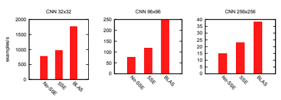

图 21.3。几种卷积神经网络实现的比较（无 SSE、有 SSE 或使用 BLAS）。测试是在 Intel biXeon X5690 服务器上使用一个核心进行的。性能以每秒处理的样本数量表示。

（越高越好）。测试了三种不同的架构，输入图像大小分别为 32x32、96x96 和 256x256。

## 21.2.5 排序内存访问

正如在第 21.2.1 节和第 21.2.2 节中提到的，内存访问是当今计算机的主要瓶颈之一。事实上，不仅访问次数重要，这些访问的*顺序*也很重要。例如，应该始终避免对内存中不连续的张量进行操作（例如，张量的每个元素之间有额外跳转）。在许多情况下，最好先将张量组织在一个连续的内存块中（可能需要付出复制的代价），然后再进行任何密集计算。对于神经网络，一个突出的例子就是卷积。当对图像执行卷积时，会在核和图像的所有可能补丁之间进行连续的点积。可以提前创建所有这些补丁的副本（缺点是对于大卷积或大图像会产生巨大的内存成本），然后应用矩阵-矩阵操作（使用 BLAS）来计算所有点积。内存消耗与卷积核的像素数量成正比。如图 21.3 所示，这导致了无与伦比的运行时性能，尽管初始内存复制相当大。*Torch7*也将此实现作为神经网络包的一部分提供。每当有足够的内存可用时，使用这种利用多核 CPU 架构优势的创新设计的实现是有利的。

## 21.2.6 Openmp 支持

开放多处理（OpenMP）在几乎所有操作系统和编译器工具集上，为 C/C++ 和 Fortran 语言提供共享内存的 CPU 并行化框架。通常只需进行最小修改即可集成到现有项目中。*Torch7* 旨在利用 OpenMP 指令进行其张量库和神经网络包中的各种操作。尽管 OpenMP 规范的细节超出了本工作的范围，下面展示了最常用的 OpenMP 指令之一，即对 for 循环的并行化： 

1 // private 为每个线程创建一个副本 2 \#pragma omp parallel for private(i) 

3 for (i=0; i<N; i++) 4 {

5 a[i] = i*i; 6 }

如果没有在第 2 行使用 omp parallel for 指令，这段代码将使用单线程完成。然而，由于每个循环迭代相互独立，因此这仅需在现有代码中添加一行，即可将计算并行化到多个核心上。 

Torch7 会自动检测编译器是否支持 OpenMP 指令，并编译一个高级包，添加多线程张量操作、卷积和多个神经网络类。从单线程代码切换到多线程代码对用户完全透明，只需将 *-l openmp* 参数传递给 torch 可执行文件。使用此选项时，*Torch7* 默认在可用时使用启用 OpenMP 的函数调用。可以通过设置 

“OMP_NUM_THREADS” 环境变量设置为所需的数量： 

1 bash\# export OMP_NUM_THREADS=4 或在 lua 内部通过 1 torch.setNumThread(4) 

此外，openmp 甚至可以通过以下函数调用暂时启用或禁用。 

1 torch.setNumThreads(1) 2 torch.setNumThreads(N) 

BLAS 操作的多线程依赖于 Torch7 关联的特定 BLAS 库。例如，英特尔的 MKL 库也使用 OpenMP 来并行化 Level 3 BLAS 操作。在神经网络包 nn 中，卷积层、最常见的非线性函数（如 tanh 和 sigmoid）、池化操作（如平均池化、求和池化和最大池化）以及各种其他基本操作（如求和、平方模块）都被并行化。对于应用逐元素操作的所有模型，几乎可以像上面的示例那样轻松并行化。对于更复杂的模块，如具有多个输入输出特征图的卷积层，函数评估通过输出特征图并行化，以便每个输出特征都能并行计算。计算与核的梯度时，操作在核和输入特征图上并行化，以计算与输入的梯度。采用此策略，卷积网络架构几乎可以线性加速。 

## 21.2.7 Cuda 支持

CUDA（统一计算设备架构）是 nVidia 为编程其图形处理器以执行通用计算而提供的框架。

CUDA 暴露了可供图形处理器使用的内存层次结构，主要有外部（大，高延迟）DRAM 和内部共享内存（几千字节，低延迟）。它还暴露了计算核心的层次结构，以及它们如何相互作用，以及与不同类型内存的互动。

与普遍信念相反，我们发现编写 CUDA 代码（内核）可以大大简化。获得不错的性能非常容易，最简单的内核在常规 C 上已经能实现令人满意的加速。需要了解并谨慎处理的三件事是：理解共享内存与线程之间的交互；理解内存合并，以最大化与外部 DRAM 之间的带宽；理解处理单元的层次结构，以高效分配块和线程之间的工作负载。一旦理解了这些概念，我们能够编写自己的 2D 卷积，对于足够大的输入，GTX580 上的计算速度约为 200GFLOP/s。对于较小的输入，我们的 OpenMP+SSE 实现仍然更高效。

值得一提的是，*Torch7*采用了一种高效但通用的方法来实现各种 CUDA 内核。正如接下来的章节所示，这种策略在大多数情况下能够实现最佳性能。然而，通过在特定假设下开发 CUDA 内核，如特定输入或运算符形状和大小，也可以实现更高的性能。尽管有性能优势，但这些情况通常需要大量的开发工作，并生成不能重用的模块，因此不适合通用机器学习库。

一旦用 CUDA 构建，*software!Torch7*提供了一种新的 Tensor 类型：torch。

CudaTensor。具有这种特定类型的张量生活在 GPU 的 DRAM 内存中。所有在标准张量上定义的运算符也在 CudaTensors 上定义，这完全抽象了图形处理器的使用。以下是一个小的示例，展示了接口的简单性：

1 -- 生活在 CPU 的 DRAM 中。

2 tf = torch.FloatTensor(4,100,100) 3 4 -- 生活在 GPU 的 DRAM 中。

5 tc = tf:cuda()

6 7 -- 由 GPU 执行 8 tc:mul(3)

9 10 -- res 生活在 CPU 的 DRAM 中 11 res = tc:float()

除了 Tensors 的主要运算符外，所有基于矩阵的运算符和大多数标准卷积例程也可用。

## 21.2.8 基准测试

在本节中，我们分析了*Torch7*在两种不同设置下的效率：首先在矩阵乘法基准测试框架中，然后在训练各种神经网络时。为此，我们将*Torch7*与*Numpy*和 Theano 进行了比较。我们选择*Numpy*作为参考，因为它是一个广泛使用的 Python 数值库，而 Python 本身也是一种广泛使用的脚本语言。

Theano [1] 是一个最近的数学表达式编译器，基于 Python 和 Numpy，已经被证明在许多神经网络实现中表现优异，这使得它成为一个非常相关的基准。在我们的实验中，我们选择了每个软件的最新版本，即 *Theano* 0.5、*Numpy* 1.6.1 和 Scipy 0.10.1。测量解释性语言的开销。神经网络和许多数值算法的大部分计算都花费在 BLAS 调用上，以执行线性代数运算。为此，我们展示了 *Torch7* 的效率以及底层 C 库 TH 的效率。

*Torch7* 的数值例程遵循简单的设计，包含多个层。

第一层是一个高效的 C 库，提供高级张量包。

（TH）。TH 库提供模板化设计，能够选择不同的精度。可用类型包括，字节（无符号字符）、字符（字符）、短整型。

图 21.4。使用 C、*Torch7* torch 包、*Torch7* 中的 nn 包、Numpy 和 Theano 的矩阵乘法性能基准测试。测试是在一台配备两颗 Intel Xeon X5690 CPU（每个 CPU 有 6 个计算核心）的机器上进行的。超线程功能已禁用。我们考虑使用 1、2、4、8 和 12 个 CPU 核心进行多线程计算。性能以处理所花费的时间（秒）表示，因此时间越小越好。

（16 位整数）、整数（32 位整数）、长整型（64 位整数）、浮点数（32 位浮点）和双精度（64 位浮点精度）。TH 库不依赖于 Lua 或任何其他语言，除了标准 C 库，因此也适合用于依赖高效数值例程的其他项目。选择 C 语言是经过深思熟虑的选择，就像 Lua 一样。由于 TH 仅使用 C，它可以在几乎任何编程环境中编译，如手机、DSP、嵌入式系统等。TH 提供对许多 BLAS 操作的接口，同时还包含所有函数的手工编码操作，以防没有 BLAS 库可用。它还提供了对几个最常用的 LAPACK 例程的线性代数接口。位于 TH 之上的第二层是 torch 包，它将 TH 集成到 Lua 中。所有 TH 数学操作都通过 torch 包中的 Lua 语言接口进行。最后，nn 包使用 *torch* 包提供一个模块化的、高速且高效的神经网络库。

有人可能会认为这样的分层方法会引入相当大的开销。为了量化每一层带来的开销，我们选择了矩阵乘法作为测试案例，因为这是线性代数中最广泛使用的操作之一，并使用不同大小的矩阵和不同层的编程进行了测试。我们使用了 100×100 和 1000×1000 的矩阵，并用一个仅使用 C 语言的程序进行了基准测试，该程序直接使用 TH 库、torch 库以及 Torch7 中的 nn 包的线性层（无偏差）。我们还包括了使用*Numpy*包和最后的*Theano*的测试。我们使用 Intel MKL 库编译了所有包，以便实现最佳性能并最大化 CPU 线程的优势。从图 21.4 给出的结果可以看出，来自 TH、*Torch7*或 nn 库的开销是微不足道的，即使对于小尺寸矩阵。尽管 Python 的开销稍大，但对于较大的矩阵，在所有配置中开销都很小。

比较机器学习包。在最近的一篇论文[1]中，作者介绍了一种基于 Python 和 Numpy 的新数学表达式编译器。至于*Torch7*，Theano（此时）主要用于神经网络框架。Theano 可以在 CPU 或 GPU 上运行。Theano 的作者展示了基准测试（涉及多种神经网络架构的训练），与其他替代实现（在 GPU 上运行 Theano 时）进行比较，包括 Torch5、带有 GPUmat 的 Matlab（在 GPU 上运行）或 EBLearn 12。下面，我们复现了这些精确的基准测试，将自己限制在*Torch7*与 Theano 的比较上，因为 Theano 已显得比任何现有实现更快。

|                 | 32 × 32 96 × 96 256 × 256 # 特征图   |       |       |    |
| --- | --- | --- | --- | --- |
| 1.c 卷积 | 5 × 5                                 | 7 × 7 | 7 × 7 | 6  |
| 1.p 最大池化 | 2 × 2                                 | 3 × 3 | 5 × 5 | 6  |
| 2.c 卷积 | 5 × 5                                 | 7 × 7 | 7 × 7 | 16 |
| 2.p 最大池化 | 2 × 2                                 | 3 × 3 | 4 × 4 | 16 |
| 3.l 线性      | 120 个输出特征                   |       |       |    |
| 4.o 线性      | 10 个输出特征                    |       |       |    |

表 21.1. 基准研究中使用的卷积网络架构

为了公平比较，我们将 Numpy 和 SciPy（Theano 依赖的库）与*Torch7*编译为 MKL Intel 库。Theano 的最新版本也支持对 MKL 的直接链接用于某些操作（无需经过 Numpy），

我们进行了仔细的设置。我们在一个 12 核的 Intel Xeon X5690 上进行了实验。我们可选地使用了 nVidia Tesla M2090 GPU。按照[1]的基准套件，我们考虑了三种多层感知器的训练。1. 784 个输入，10 个类别，交叉熵成本，以及没有隐藏层。

一个隐藏层，大小为 500。三个隐藏层，大小为 1000。我们还考虑了对三种卷积神经网络的训练（如表 21.1 所示），输入图像为 32 × 32、96 × 96 和 256 × 256，完全按照文献 [1] 中给出的架构进行。我们使用的优化算法是纯随机梯度下降 (SGD) 和使用 60 个样本的迷你批次 SGD。我们比较了在单个 CPU 核心、多核心使用 OpenMP 或在 GPU 上运行的所有架构。请注意，Theano 不支持 OpenMP。

然而，在多层感知器基准测试中，它获得了加速，因为 Intel MKL 库（通过 Numpy 调用）支持使用 OpenMP 的多线程。

如图 21.5 所示，*Torch7* 在大多数基准测试中比 Theano 更快。

有趣的是，Theano 在使用纯 SGD 时在小型架构上表现不佳。

训练（如图 21.5 左列所示），这可能是由于前一节提到的 Python 开销。另一个有趣的评论是

12 http://www.eblearn.sf.net

OpenMP 实现的表现与 GPU 相比令人惊讶。

实现。从图表中可以看出，只有最大的网络架构才会受益于使用 GPU。还值得一提的是，对于 CNN

在使用批量训练的 32 × 32 输入下，Theano 的 GPU 实现优于 *Torch 7*。在某些条件下，GPU 优化可能会通过提供显著的加速而获得回报，但它们也需要付出显著的开发努力以覆盖小输入域。对于 CNN 实验，第二个 Torch7 基准 TorchMM 被纳入。在这种情况下，使用了第 21.2.5 节中解释的进行卷积的矩阵乘法操作。可以看到，这种实现显著优于 *Theano* 和 *Torch7* 的其他模型，包括 GPU 实现。

## 21.3 高效优化启发式

正如第十八章所指出的，数据集的大小在过去几年中增长速度快于处理器的速度。在估计神经网络的参数时，使用能够相应扩展的优化过程至关重要。最近，关于神经网络优化方法的研究已成为一个重要话题 [2, 4, 8, 7]。*Torch 7* 提供了一个灵活的框架，专门设计用于简化神经网络上优化算法的开发。

让我们考虑监督学习的情况，当训练集包含 N 个样本 (xn, yn) 时，其中 xn 是观察到的输入向量，yn 是我们希望预测的输出目标向量。我们考虑一个损失函数 l(ˆyn, yn)，它衡量当实际答案为 yn 时预测 yˆn 的代价。我们还考虑一个预测器 fw(xn)，其可训练参数为 w。学习的任务可以定义为寻找向量 w，使其在整个训练集上最小化损失函数 L：

$$L({\bf w})=\frac{1}{N}\sum_{n=1}^{N}l(f_{\bf w}(x_{n}),y_{n}),$$ $${\bf w}^{*}=\mathop{\rm argmin}_{\bf w}L({\bf w}).$$

$$(21.1)$$

$$(21.2)$$

这种损失最小化的一般形式可以通过多种优化方法轻松实现，例如共轭梯度下降(CG)、BFGS 或有限记忆 BFGS、莱文贝格-马夸特方法或简单的 SGD。在 Torch7 中，这些启发式方法和方法可以简单实现，使用一个统一的思想：将函数 f_w 的形式与优化过程解耦。

通过将所有可训练参数组合成一个单一参数向量，并使用相同大小的梯度向量，神经网络的类型和形状完全与开发者抽象分离。结合 Lua 强大的闭包机制，可以开发优化算法。

图 21.5。*Torch7*与 Theano 的基准测试，同时使用 SGD 算法训练各种神经网络架构。测试在一台配备两颗 Intel Xeon X5690 CPU 和 Nvidia M2090 GPU 的机器上进行。我们考虑使用 1 到 12 个 CPU 核心的多线程计算，利用 OpenMP 和 Nvidia CUDA 接口进行 GPU 计算。

性能以每秒处理的示例数量表示（越高越好）。“batch”表示训练时每次喂入 60 个示例。*TorchMM*使用第 21.2.5 节中介绍的卷积神经网络层实现。

对于最复杂的神经网络模型，操作起来和最简单的模型一样简单。以下代码展示了这是如何实现的：

1 -- 创建一个任意模型：2 model = nn.Sequential() 3 model:add( nn.Linear(100,1000) ) 4 model:add( nn.Tanh() ) 5 model:add( nn.Linear(1000,10) )

6 7 -- 和一个损失函数：8 loss = nn.MSECriterion() 9 10 -- 提取参数和梯度持有者 11 w,dloss_dw = model:getParameters()

12 13 -- w 和 dl_dw 是两个相同大小的向量。一旦提取了可训练参数向量，就可以使用任意外部优化程序。*Torch7*提供了一些标准方法。

(LBFGS, CG, SGD, ASGD)只需要： (1)一个计算 Lw 和 dL 的函数

dw 和(2)参数向量 w 和 dL/dw。当然，Lw 可以是真实损失或其任何近似值。定义的函数负责从训练数据集中采样，并估计这些近似值。

考虑到这两个概念，可以轻松定义一个训练数据集的循环，并在每次迭代中定义一个闭包，以计算 Lw 和 dL。

dw .

以下列表展示了这样一个循环的示例，假设一个预洗牌的训练数据集，其中每个条目是一个元组(x_n, y_n)：

1 -- 假设训练数据集为'trainset'，模型为 2 -- 如上定义的'model'、'w'和'dL_dw'：

3 for e = 1,nepochs do 4 for i,sample in ipairs(trainset) do 5 -- 下一个训练对：

6 x_n = sample[1]

7 y_n = sample[2]

8 9 -- 创建闭包来估计 y_n_hat = f_w(x_n)，

10 -- 随机地 11 feval = function() 12 -- 估计损失：

13 y_n_hat = model:forward(x_n) 14 f = loss:forward(y_n_hat, y_n)

15 16 -- 估计梯度：

17 dloss_dw:zero()

18 dloss_dy_n_hat = loss:backward(y_n_hat, y_n)

19 model:backward(x_n, dloss_dy_n_hat)

20 21 -- 返回损失和梯度

22 返回 f,dloss_dw

23 结束

24 25 -- 既然闭包已定义，将其传递给 26 -- 优化算法：

27 w,fs = optim.sgd(feval,w)

28 29 -- + 返回新的 w，但由于计算在 30 -- 原地进行，通常不需要

31 -- 存储它（旧的 w 包含新的值）

32 -- + fs 是在优化过程中完成的所有函数（损失） 33 -- 评估的列表。 34 -- SGD 只返回一个值，因为它不 35 -- 执行任何线搜索。 36 结束

在上述列表中，可以看到损失和梯度估计可以在运行时轻松更改，并且可以在任意批量大小上进行估计。要使用不同于 1 的批量大小（如上所示），只需创建一个训练对的列表，*feval* 函数需要遍历这些训练对来估计近似损失和梯度。

## 21.4 结论

与神经网络训练的早期相比，朝着高效实现的挑战变化不大，但手段稍有不同。早在 80 年代末，SN [3] 工具箱就提供了一种脚本语言（LISP）用于以模块化方式构建神经网络。当时，内存带宽和处理器速度大致处于同一数量级。如今，我们必须更加关注内存访问，计算优化代码的指令数量已不足够。特定的向量化指令可以轻松集成，但不会带来数量级的速度提升。最终，带来最大优势的是并行化。随着计算机越来越多地并行化，正确利用并行化框架变得至关重要，例如 OpenMP。在更极端的情况下，GPU（例如，运行 CUDA）并不像一些人所期待的那样吸引人：GPU 特定实现需要大量额外工作才能获得加速（见图 21.5），这相比于通过 OpenMP 仅增加几行代码所能获得的效果可能令人失望。

致谢。*Torch7* 是 Torch313 和 Torch5.14 的官方继任者。多年来，许多杰出的机器学习研究人员为 *Torch* 做出了贡献，包括 Léon Bottou（我们特别感谢他提供的 Qt 库接口）、Jason Weston、Iain Melvin、Samy Bengio 和 Johnny Mariéthoz。

13 http://www.torch.ch/torch3 14 http://torch5.sourceforge.net/

我们还要感谢 Yann LeCun 和 Léon Bottou 共享他们在 SN、Lush 的工作，并扩展他们的支持和建议。

最后，我们感谢 James Bergstra 提供基准代码。15

[1] Bergstra, J., Breuleux, O., Bastien, F., Lamblin, P., Pascanu, R., Desjardins, G.,

Turian, J., Bengio, Y.: Theano：一个 CPU 和 GPU 数学表达式编译器。在：科学计算 Python 会议，SciPy（2010）

[2] Bottou, L.: 大规模机器学习与随机梯度下降。在：

Lechevallier, Y., Saporta, G.（编辑）第 19 届国际计算统计会议（COMPSTAT 2010）论文集，法国巴黎，第 177–187 页。

施普林格（2010 年 8 月）

[3] Bottou, L., LeCun, Y.: SN：连接主义模型的模拟器。在：1988 年神经网络会议论文集，法国尼姆（1988）

[4] Le, Q.V., Coates, A., Prochnow, B., Ng, A.Y.: 深度学习的优化方法。学习，第 265–272 页（2011）

[5] LeCun, Y., Bottou, L.: Lush 参考手册。技术报告（2002），代码，http://lush.sourceforge.net

[6] LeCun, Y., Bottou, L., Orr, G.B., Müller, K.-R.: 高效反向传播。在：Orr, G.B.,

Müller, K.-R.（编辑）NIPS-WS 1996。LNCS，第 1524 卷，第 9–50 页。施普林格，海德堡（1998）

[7] Martens, J.: 通过无海森优化进行深度学习。在：第 27 届国际机器学习会议（ICML）论文集，第 951 卷（2010）

[8] Vinyals, O., Povey, D.: 用于深度学习的克里洛夫子空间下降。Arxiv 预印本 arXiv:1111.4259（2011）

15 http://www.github.com/jaberg/DeepLearningBenchmarks

# 更好的表征：不变、解耦和可重用

## 前言

在许多情况下，标记数据量有限，无法完全识别需要学习的函数。当标记数据稀缺时，学习算法同时面临欠拟合和过拟合的情况。学习算法开始“发明”不存在的规律（过拟合）。

同时无法建模真实情况（欠拟合）。在极端情况下，这意味着完全记住训练数据，而无法对新数据进行泛化。

接下来的五章展示了各种解决欠拟合/过拟合问题的技巧。这些包括强制模型中的不变性以提高信噪比的方式、解耦变化因素的预训练方法，以及如何利用辅助任务学习共享表征。

在图像识别中，我们先验知道一个好的分类器应该具有平移不变性、旋转不变性、尺度不变性等。卷积神经网络[7]是由*卷积*和*池化*层组成的特殊网络，它们在多个尺度上明确实现了平移不变性。可以使用标准反向传播进行训练。也可以以无监督的方式逐层构建卷积网络[9]。第二十二章[3]显示，在这种情况下，k-means 是一种特别有效的学习卷积滤波器的方法。

另外，可以通过将期望的不变性注入模型中，使用经过翻译、旋转或扭曲的原始样本的人工训练样本。这个想法在第二十三章[2]中提出。一组设计良好的变换可以产生大量的人工样本，并显著提高神经网络的泛化能力。事情可能会变得复杂，因为不变性并非总是绝对的：例如，手写数字“1”只有在特定角度内是旋转不变的，超出此角度可能会与手写数字“7”混淆。

卷积网络和生成人工样本在手写数字识别和小图像分类等问题上都取得了优秀的结果。这两种技术的结合带来了更高的性能。不幸的是，这些方法仅在已知不变性时适用。在最一般的情况下，不变性是未知的，需要其他技巧来改善学习到的表示。

表示可以通过将无监督模型作为第一步进行学习来改善[5]，使用大量未标记数据。无监督预训练旨在构建一个解耦变异因子的网络。作为第二步，监督学习者只需在解耦因子集合中选择那些最好预测感兴趣任务的因子。无监督预训练将复杂的非线性建模的负担转移到通常可用的更大量的未标记数据上。这种两步法已被证明有效。

G. Montavon 等编著：《NN: Tricks of the Trade》，第 2 版，LNCS 7700，第 559-560 页，2012 年。

-c Springer-Verlag Berlin Heidelberg 2012

显著减少欠拟合/过拟合问题[5, 4]并提高手写数字和音素识别性能。

一种成熟的无监督表示学习算法是限制玻尔兹曼机。第二十四章[6]逐步解释了如何成功训练它以及如何选择多个超参数。第二十五章[8]展示了在整个训练过程中保持模型集中如何促进更复杂的深度玻尔兹曼机的学习。

五章系列以使用辅助任务来改善神经网络学习的解决方案的问题结束。如第八章[1]所示，这可以通过在多个相关任务之间共享内部表示（及其相关参数）并用反向传播训练结果多任务网络来实现。第二十六章[10]引入了一种多任务学习的变体，其中辅助任务不是由一组标签定义，而是由样本之间的一组成对相似性定义。这一扩展显著拓宽了多任务学习的适用范围。

Grégoire & Klaus

[1] Caruana, R.：多任务学习的十二个技巧。载于：Orr, G.B., Müller, K.-R.（主编）NIPS-WS 1996。LNCS, 第 1524 卷，163–189 页。施普林格，海德堡（1998 年）

[2] Ciresan, D.C., Meier, U., Gambardella, L.M., Schmidhuber, J.：用于数字识别的深度大规模多层感知机。载于：Montavon, G., Orr, G.B., Müller, K.-R.（主编）NN：行业秘籍，第二版。LNCS, 第 7700 卷，581–598 页。施普林格，海德堡（2012 年）

[3] Coates, A., Ng, A.Y.：使用 K 均值学习特征表示。载于：Montavon, G., Orr, G.B., Müller, K.-R.（主编）NN：行业秘籍，第二版。LNCS，

第 7700 卷，561–580 页。施普林格，海德堡（2012 年）

[4] Erhan, D., Bengio, Y., Courville, A., Manzagol, P.-A., Vincent, P., Bengio, S.：为什么无监督预训练有助于深度学习？机器学习研究杂志 11, 625–660（2010 年）

[5] Hinton, G.E., Osindero, S., Teh, Y.-W.：深度信念网络的快速学习算法。神经计算 18, 1527–1554（2006 年）

[6] Hinton, G.E.：限制玻尔兹曼机训练的实用指南。载于：

Montavon, G., Orr, G.B., Müller, K.-R.（主编）NN：行业秘籍，第二版。LNCS, 第 7700 卷，437–478 页。施普林格，海德堡（2012 年）

[7] LeCun, Y., Bottou, L., Bengio, Y., Haffner, P.：应用于文档识别的基于梯度的学习。IEEE 86(11), 2278–2324（1998 年）

[8] Montavon, G., Müller, K.-R.：深度玻尔兹曼机及其中心化技巧。

载于：Montavon, G., Orr, G.B., Müller, K.-R.（主编）NN：行业秘籍，第二版。LNCS, 第 7700 卷，621–637 页。施普林格，海德堡（2012 年）

[9] Serre, T., Wolf, L., Poggio, T.：受视觉皮层启发的特征进行对象识别。载于：计算机视觉与模式识别会议，994–1000 页。IEEE 出版社（2005 年）

[10] Weston, J., Ratle, F., Collobert, R.：通过半监督嵌入进行深度学习。载于：Montavon, G., Orr, G.B., Müller, K.-R.（主编）NN：行业秘籍，第二版。LNCS, 第 7700 卷，639–655 页。施普林格，海德堡（2012 年）

# 22 使用 K 均值学习特征表示

Adam Coates 和 Andrew Y. Ng 斯坦福大学，斯坦福 CA 94306，美国

摘要。许多算法可以从未标记的数据中学习深层特征层次，尤其是图像。在许多情况下，这些算法涉及多层特征网络（如神经网络），这些网络有时难以训练和调整，并且难以有效地扩展到多个机器上。最近发现，K 均值聚类可以作为一种快速的替代训练方法。这种方法的主要优势在于它非常快速，并且易于在大规模上实施。另一方面，在实践中使用这种方法并非完全简单：K 均值有若干限制，必须小心结合合适的要素以使系统良好运作。本章将总结最近的结果和技术技巧，这些技巧对于有效利用 K 均值聚类学习大规模图像表示是必要的。我们还将把这些结果与其他著名算法联系起来，以明确 K 均值何时最有用，并传达有关其行为的直觉，这对于调试和工程新系统是有用的。

## 22.1 引言

机器学习的一个主要目标是为其他任务学习深层特征层次。例如，给定一组未标记的图像，许多当前算法试图贪婪地学习连续的特征层，以便使后续分类任务（如对象识别）更容易完成。文献中采用的典型方法是使用无监督学习算法来训练未标记数据的模型，然后利用结果从数据中提取有趣的特征[35, 21, 31]。根据所选择的无监督学习方案，有时很难使这些系统良好运作。可能有许多超参数，而对如何调整它们的直觉并不多。最近，我们发现将 K 均值聚类用作这些“特征学习”管道中的无监督学习模块可以带来优异的结果，常常与最先进的系统相媲美[11]。在本章中，我们将回顾这些工作，并附上有助于构建大规模特征学习系统的有用技巧和观察。

K 均值已经被计算机视觉研究人员确定为从图像中学习特征的成功方法。计算机视觉领域流行的“特征袋”模型[13, 28]与我们在本章中使用的管道非常相似，这里得出的许多结论也是相似的。

G. Montavon 等（编）：NN：行业技巧，第 2 版，LNCS 7700，第 561–580 页，2012 年。

-c Springer-Verlag Berlin Heidelberg 2012

由视觉研究者识别 [18, 1]。然而，在本章中，我们将重点关注在类似于其他深度学习和特征学习系统的设置中使 K-means 有效所需的要素：直接从原始输入（像素强度）学习并构建多层次结构，同时将 K-means 与其他知名的特征学习系统连接起来。

经典的 K-means 聚类算法找到的聚类中心使数据点与最近中心之间的距离最小化。K-means 也被称为“向量量化”，可以看作是构建一个包含 k 个向量的字典 D∈Rn×k 的一种方式，使得数据向量 x(i) ∈ Rn, i = 1*,...,m* 可以映射到一个最小化重构误差的代码向量。在这一章中，我们将使用 K-means 的修改版（有时称为“增益形状”向量量化 [41]，或“球形 K-means” [14]），根据以下方式找到 D：

$$\begin{array}{c}{{\operatorname*{最小化}_{\mathcal{D},s}\sum_{i}||\mathcal{D}s^{(i)}-x^{(i)}||_{2}^{2}}}\\ {{\mathrm{满足}~||s^{(i)}||_{0}\leq1,\forall i}}\\ {{\mathrm{~和~}||\mathcal{D}^{(j)}||_{2}=1,\forall j}}\end{array}$$

其中 s(i) 是与输入 x(i) 关联的“代码向量”，D(j) 是字典 D 的第 j 列。这里的目标是找到一个字典 D 和每个示例 x(i) 的新表示 s(i)，以满足几个标准。首先，给定 s(i) 和 D，我们应该能够很好地重构原始 x(i)；特别是，我们的目标是最小化 x(i) 与其对应重构 Ds(i) 之间的平方差。这个目标在两个约束下进行优化。第一个约束 ||s(i)||0 ≤ 1，意味着每个 s(i) 被限制为最多只有一个非零条目。因此，我们不仅在寻找 x(i) 的新表示。

这保留了尽可能多的信息，但也要求有一个非常简单或节约的表示。第二个约束要求每个字典列具有单位长度，防止它们变得过大或过小。否则我们就可以任意缩放 D(j) 和相应的 s。

(i)

j 不产生影响。

该算法在精神上与其他学习高效编码方案的算法非常相似，如稀疏编码 [34, 17]：

$ \underset{\mathcal{D},s}{\text{最小化}}\sum_{i}||\mathcal{D}s^{(i)}-x^{(i)}||_2²+\lambda||s^{(i)}||_1$，并且满足 $||D^{(j)}||_2=1,\forall j$。

稀疏编码优化了相同类型的重构目标，但通过添加惩罚项 λ||s(i)||1 来约束 s(i) 的复杂性，促使 s(i) 变得稀疏。这与 K-means 使用的约束类似 (||s(i)||0 ≤ 1)，但允许每个 s(i) 有多个非零条目，从而能够更准确地表示每个 x(i)，同时仍要求每个 s(i) 简单。

从上述描述来看，K-means 和更复杂的字典学习方案如稀疏编码常常是可以互换的——它们在优化目标上有所不同，但产生的代码向量 s(i)和字典 D 实现了类似的目标。然而，经验表明，稀疏编码在许多应用中似乎表现更佳。例如，将 K-means 替换为稀疏编码的经典特征袋模型已被证明显著改善图像识别结果[39]。尽管其简单性，K-means 仍然是一个非常有用的特征学习算法，因为其速度和可扩展性。相比之下，稀疏编码要求我们在学习过程中对每个 s(i)重复求解一个凸优化问题[36, 15, 32]，因此在大规模部署时非常昂贵。对于 K-means，算法中使用的最优 s(i)仅为：

$$s_{j}^{(i)}=\begin{cases}\mathcal{D}^{(j)\top}x^{(i)}&{\mathrm{~if~}}j==\operatorname*{arg\,max}_{l}|\mathcal{D}^{(l)\top}x^{(i)}|\\ 0&{\mathrm{~otherwise.}}\end{cases}$$

$$(22.1)$$

因为这可以非常快速地完成（给定 s 求解 D 也很简单），我们可以通过交替优化 D 和 s 快速训练非常大的字典。

同时，K-means 除了 k（质心的数量）外，没有其他需要调整的参数，使得其相对容易上手。令人惊讶的是，由 K-means 学习的大型字典在实际应用中通常表现非常好，只要我们混合一些在其他文献中不常见的成分。本章将讨论这些成分是什么，以及它们为何需要、如何影响结果的直觉。对于这项工作的绝大多数部分，我们将使用图像（或图像块）作为算法的输入数据，但基本原理同样适用于其他类型的数据。

## 22.2 数据、预处理和初始化

我们将从一个由小图像块组成的数据集开始。为确保具体性，我们将使用 16×16 像素的灰度图块，表示为一个 256 像素强度的向量（即，x(i) ∈ R256），但也可以类似地使用彩色图块。

这些图像块可以通过随机裁剪 16x16 的块从未标记的图像中收集。为了构建一个“完整”的字典（即至少包含 256 个质心的字典），我们应该确保有足够的图像块，以便每个聚类能够获得合理数量的输入。对于 16x16 的灰度图像块，m = 100,000 个图像块就足够了。实际上，我们通常需要 *更多* 的数据来训练 K-means 字典，而不是其他算法（例如稀疏编码），因为每个数据点最终只贡献给 1 个质心。通常，增加的成本很容易通过训练速度来抵消。为了方便记号，我们将假设我们的数据点被打包到矩阵 X ∈ Rn×m 的列中。（类似地，我们将用 S 表示矩阵，其列是来自公式 (22.1) 的代码向量 s(i)。）

## 22.2.1 预处理

在对输入数据点 x(i) 运行学习算法之前，规范化图像块的亮度和对比度是有益的。也就是说，对于每个 x(i)，我们减去强度的均值并除以标准差。

在除法之前向方差中添加小值，以避免除以零并抑制噪声。对于像素强度范围 [0, 255]，向方差中添加 10 通常是一个不错的起点：

$$x^{(i)}=\frac{\tilde{x}^{(i)}-\operatorname{mean}(\tilde{x}^{(i)})}{\sqrt{\operatorname{var}(\tilde{x}^{(i)})+10}}$$

其中 x˜(i) 是未规范化的图像块，“mean”和“var”分别是 x˜(i) 元素的均值和方差。

图 22.1.（a）从自然图像中通过 K-means 学习到的质心，没有去白化。（b）一个卡通图描绘了去白化对 K-means 解决方案的影响。左侧：

未去白化的数据，其中质心往往受到相关数据的偏见影响。右：去白化的数据，质心更加正交。（c）从去白化图像块中学习到的质心。

在归一化后，我们可以尝试在新的输入补丁上运行 K 均值。得到的质心（即字典 D 的列）在图 22.1a 中以补丁的形式可视化。可以看到，K 均值往往学习到低频边缘状似的质心。这个结果在过去已被多次重复[16, 37, 2]。不幸的是，这些质心在识别任务中表现不佳[11]。对此结果的一个解释是，附近像素之间的相关性（即图像中的低频变化）即使在亮度和对比度归一化后也往往非常强。由于存在这些相关性，K 均值往往生成许多高度相关的质心，而不是将质心分散以更均匀地覆盖数据。图 22.1b 左侧展示了这个问题的卡通图。为了解决这个问题，应使用白化（也称为“球面化”）来重新缩放输入数据，以消除这些相关性[22]。这通常会导致 K 均值在正交方向上分配更多的质心，如图 22.1b 右侧所示。

一个简单的白化变换选择是 ZCA 白化变换。如果 V DV = cov(x)是数据点 x 的协方差的特征值分解，那么白化后的点计算为 V (D+zcaI)−1/2V x，其中 zca 是一个小常数。对于对比度归一化的数据，16×16 像素补丁将 zca 设置为 0.01，或 8×8 像素补丁设置为 0.1 是一个不错的起点。注意，设置这个数值过小可能会导致高频噪声被放大，从而使学习变得更加困难。由于旋转数据不会改变 K 均值的行为，因此也可以使用其他白化变换，例如 PCA 白化（与 ZCA 仅在旋转上有所不同）。

在白化后的图像补丁上运行 K 均值会产生更锐利的边缘特征，类似于稀疏编码、ICA 等方法发现的特征，如图 22.1c 所示。这个归一化、白化和 K 均值聚类的过程是一个有效的“现成”无监督学习模块，可以在许多特征学习角色中发挥作用。从此以后，我们将假设每当我们将 K 均值应用于新数据时，它们都是按此处所述进行归一化和白化的。但请记住，归一化和白化参数的适当选择有时需要针对新数据源进行调整。尽管这些参数最好通过交叉验证来设置，但通常可以通过视觉调优（例如，得到高对比度、不太多噪声、以及不太多低频波动的图像补丁）来进行调整。

## 22.2.2 初始化

通常的 K-means 聚类算法需要进行一些小调整，以避免空簇等常见问题。一个重要的考虑是中心点的初始化。虽然常见的做法是将 K-means 初始化为从数据中随机选择的示例，但这被发现是一个不好的选择。图像可能在某些区域过于密集，因此用随机选择的图像块初始化 K-means 会导致大量中心点聚集在一起。许多这些中心点最终会变成几乎空的簇，因为单个簇会积累位于密集区域内的所有数据点。相反，从正态分布中随机初始化中心点并将其归一化到单位长度会更好。请注意，由于白化阶段，我们预计数据的重要成分已经重新缩放到近乎球形的分布，因此从球面上的随机向量初始化并不是一个糟糕的起点。

改善 K-means 行为的其他知名启发式方法也很有用。例如，重新初始化空簇的启发式在其他实现中被广泛使用。实际上，上述初始化方案对于图像数据的效果相对较好。当空簇确实出现时，通常用随机示例重新初始化中心点就足够了，但这很少是必要的。实际上，对于一个足够可扩展的实现，我们通常可以训练许多中心点，并简单地丢弃数据点过少的簇。

1 通常，大量空簇表明白化或归一化参数调节不当，或者数据的维度过高，导致 K-means 无法成功。

另一个改善行为的小调整是使用阻尼更新中心点。具体来说，在每次迭代中，我们根据以下公式计算新中心点：

$$\begin{array}{r l}{{\mathcal{D}}_{\mathrm{new}}:=\arg\min\vert\vert{\mathcal{D}}S-X\vert\vert_{2}^{2}+\vert\vert{\mathcal{D}}-{\mathcal{D}}_{\mathrm{old}}\vert\vert_{2}^{2}}}\\ {{}}&{{}=(S S^{\top}+I)^{-1}(X S^{\top}+{\mathcal{D}}_{\mathrm{old}})}\\ {{}}&{{}\propto X S^{\top}+{\mathcal{D}}_{\mathrm{old}}}\\ {{\mathcal{D}}_{\mathrm{new}}:=\mathrm{normalize}({\mathcal{D}}_{\mathrm{new}}).}\end{array}$$

请注意，这种阻尼形式对“大的”簇几乎没有影响（XS 的 j 列与 D(j) 相比会很大）。

旧的) 仅用于防止小簇在一次迭代中被拉得太远。

包括初始化和预处理，上述完整的 K-means 训练流程在这里总结：

1. 归一化输入：

$$x^{(i)}:={\frac{x^{(i)}-\operatorname{mean}(x^{(i)})}{\sqrt{\operatorname{var}(x^{(i)})+\epsilon_{\operatorname{norm}}}}},\forall i$$

2. 对输入进行白化：

$$\begin{array}{r l}{{}}&{{}[V,D]:=\mathrm{{eig}}(\mathrm{cov}(x));\ //\ \mathrm{{所以}}\ V D V^{\top}=\mathrm{{cov}}(x)}\\ {}&{{}}\\ {x^{(i)}:=V(D+\epsilon_{\mathrm{{zca}}}I)^{-1/2}V^{\top}x^{(i)},\forall i}\end{array}$$

$\text{3.循环直到收敛（通常 10 次迭代足够）：}$。

$s_{j}^{(i)}:=\begin{cases}\mathcal{D}^{(j)\top}x^{(i)}&\text{如果}j==\operatorname*{arg\,max}_{l}|\mathcal{D}^{(l)\top}x^{(i)}|\\ 0&\text{否则.}\end{cases}\forall j,i,j$  $\mathcal{D}:=XS^{\top}+\mathcal{D}$  $\mathcal{D}^{(j)}:=\mathcal{D}^{(j)}/||D^{(j)}||_{2}\forall j$

## 22.3 与稀疏特征学习的比较

如上所示，当 K-means 应用于自然图像时，学习到的特征类似于 ICA [23]或稀疏编码 [34]所学习到的边缘状特征。一个重要的实际问题是，这是否是偶然的（例如，由于边缘如此普遍，以至于从图像中学习“样本”就足以找到它们）或者这是否暗示 K-means 能够执行类似于 ICA 的稀疏分解。当我们尝试将 K-means 应用于其他类型的数据，例如音频或特征时，

图 22.2. 在从重尾分布中抽样的点上运行球形 K-means 的结果。K-means 的“质心”倾向于指向尾部的方向。

在深度网络的低层计算的情况下，理解该聚类算法在多大程度上模仿了像 ICA 这样知名的投影方法以及其局限性是很重要的。显然，由于每个 s(i)仅允许包含一个非零条目，K-means 试图学习能够单独解释整个输入图像的质心。因此，学习到的质心不一定总会像稀疏编码或 ICA 生成的滤波器那样。这些算法学习到真正的“分布式”表示，其中单个图像可以由字典的多个列共同解释，而不仅仅是由一个。

尽管如此，经验表明，在适当条件下，K-means*确实*倾向于发现数据的稀疏投影。由于这一特性，我们常常可以以类似于其他算法学习到的字典或滤波器的方式使用学习到的字典，这些算法明确寻求稀疏的分布式表示。

为什么这种情况倾向于发生的一个直觉可以在一个简单的低维示例中看到。考虑我们的数据是从两个独立的重尾（稀疏）随机变量中抽样的情况。经过归一化后，数据在坐标轴附近最为密集，而在其间的象限则密度较小。因此，虽然 K-means 在表示许多点时往往表现不佳，但在该分布上训练 2 个质心将倾向于产生指向尾部方向的基向量字典（即，指向稀疏方向）。这一结果在图 22.2 中得到了说明。

如果数据维度不是太高（例如，大约一百），这种“尾部寻求”现象也会出现在更复杂的场景中。图 22.3 展示了从稀疏源生成的三组图像的例子。左侧（顶部）是 16×16 的图像，像素来自独立的拉普拉斯分布（稀疏的像素强度）。中间（顶部）是由稀疏组合的条纹构成的图像，右侧（顶部）是由非正交的 Gabor 滤波器的稀疏组合。底部行显示了从每个分布中提取的 500000 个样本中使用 K 均值学习 256 个中心点的结果。可以看出，K 均值确实大致恢复了稀疏投影。

图 22.3。顶部：三种不同的稀疏图像分布。底部：由 K 均值算法识别的滤波器（中心点），使用了完整的（256 中心点）字典。

会期待。类似的实验出现在[34]中，以展示稀疏编码的源分离能力——然而，K 均值倾向于恢复相同的滤波器，即使这些滤波器显然与单个图像并不特别相似。也就是说，K 均值可能做的远不止从输入分布中恢复“示例”图像。

当应用于自然图像时，很明显学习到的中心点 D(j)（如图 22.1c 所示）是数据的相对稀疏投影。图 22.4a 显示了从随机选择的（去白化）图像补丁投影到 4 个不同滤波器上所得到的响应直方图。使用的 4 个滤波器为：

(i) K 均值学习到的中心点，(ii) 通过稀疏编码训练的基向量，(iii) 随机选择的图像补丁，以及(iv) 随机初始化的滤波器。在图中可以看到，使用 K 均值训练的中心点作为线性滤波器可以提供数据的非常稀疏投影。因此，相较于其他简单选择，K 均值确实倾向于寻找数据的非常稀疏投影，尽管其作为聚类算法的形式并不明确旨在做到这一点。

尽管在经验上与 ICA 和稀疏编码有相似之处，但 K 均值确实有一个主要缺陷：它发现数据中稀疏方向的能力在很大程度上依赖于输入的维度和数据量。特别是，随着维度的增加，我们需要越来越大量的数据来获得干净的结果。例如，为了获得上述结果，我们不得不使用非常大量的例子。我们只需 10000 个例子即可轻松通过稀疏编码获得类似的结果。对于非常大的补丁，我们必须使用更多。图 22.4b 显示了对 500000 个 64x64 补丁运行 K 均值的结果——注意，虽然我们可以捕捉到一些边缘，但大多数簇由数据集中的单个补丁组成。在这个尺度上，空或近空的簇变得更为常见，需要极大的数据量才能使 K 均值有效工作。这个权衡是决定何时以及如何使用 K 均值的主要驱动因素：根据输入的维度，某种量的数据将是必需的（通常远远超过稀疏编码所需的相似结果）。对于适中的维度（例如，

图 22.4。（a）当通过 4 种不同方法获得的滤波器应用于自然图像补丁时，线性滤波器响应的分布比较。K 均值倾向于学习具有非常稀疏响应特征的滤波器，这些特征类似于稀疏编码——比随机选择的补丁或随机初始化的滤波器稀疏得多。（b）从 64x64 像素补丁学习到的“中心点”。在这个尺度上，K 均值的应用变得困难，因为许多簇变得空或仅为单例。

数百个输入），这种权衡可能是有利的，因为额外的数据需求并不会超过通过 K 均值训练所获得的非常大的常数因子加速。然而，对于非常高的维度，可能另一个算法，如稀疏编码，会更好或更快。

## 22.4 应用于图像识别

上述讨论提供了将 K-means 转变为简单特征学习方法所需的基本元素。给定一批无标签数据，我们现在可以学习一个字典 D，其列产生的数据点的稀疏投影。与稀疏编码一样，我们可以使用学习到的字典（中心点）为监督学习任务定义特征 [35]。用于图像识别应用的典型管道（易于使用学习到的特征）基于计算机视觉文献中开发的经典空间金字塔模型 [13, 28, 39, 11]。在许多方面，它与单层卷积神经网络 [29, 30] 相似。该管道的主要组件是：（i）无监督训练算法（在此情况下为 K-means），它生成过滤器 D 的库；（ii）一个函数 f : Rn → Rk，它将输入图像补丁 x ∈ Rn 映射到给定 k 个过滤器字典的特征向量 y ∈ Rk。例如，我们可以选择 f(x; D) = g(Dx)，其中 g(·) 为逐元素非线性函数。

使用学习到的特征提取器 f(x; D)，给定任何 p-by-p 像素图像补丁，我们现在可以计算该补丁的表示 y ∈ Rk。因此，我们可以

图 22.5. 与 K-means 字典学习结合使用的标准图像识别管道

通过将函数 f 应用到许多子补丁，定义整个图像的（单层）表示。具体来说，给定一个 w-by-w 像素的图像，我们定义一个

通过计算输入图像每个 p-by-p "子补丁" 的表示 y，我们得到一个 (w−p+ 1)-by-(w−p+ 1)-by-k 特征数组。为了计算效率，我们也可以以大于 1 的步幅“步进”我们的 p-by-p 特征提取器，这在图 22.5 中有所示。

在分类之前，我们通常通过汇聚来降低图像表示的维度。对于 1 像素的步幅，我们的特征提取器生成一个 (w−p+ 1)-by-(w−p+ 1)-by-k 的表示。我们可以通过求和来减少这一点。

（或对特征响应的局部区域应用其他降维方法，例如最大值）。一旦我们获得了汇聚的响应，我们可以尝试通过再次应用 K-means 来学习更高层次的特征（这是 [1] 中采用的方法），或者直接使用所有特征与标准线性分类算法（例如 SVM）。

## 22.4.1 参数

上述处理流程有大量可调参数，如补丁大小 p、f(x; D)的选择和步长。事实证明，正确设置这些参数对实际应用的性能有重大影响。实际上，这些参数对分类性能的影响通常大于训练算法本身。当我们对性能不满意时，寻找这些参数的更好选择往往比尝试修改我们的学习算法更有益[11, 18]。在这里，我们将简要总结如何选择这些参数的当前建议。

首先，当我们使用 K 均值训练滤波器组 D 时，之前提到输入维度可以显著影响数据需求和训练成功。因此，除了它对分类性能的其他影响外，明智地选择补丁大小 p 是重要的。如果 p 太大（例如，图 22.4b 中的 64 像素），那么 K 均值可能会产生不良结果。虽然在应用于图像数据时，可以通过视觉调试来解决此问题，但当 K 均值应用于其他类型的数据（例如训练多层网络时）时，就很难知道它是否表现良好，因为高层特征很难可视化。因此，建议通过交叉验证选择 p，或者将传递给 K 均值的数据维度保持较小（通常不超过几百，具体取决于使用的数据量）。对于图像补丁，6x6 或 8x8 像素（彩色或灰度）补丁在上述流程中表现 consistently well。

根据选择的池化方法，步长和池化区域可能需要不同的选择。关于这些领域有大量的研究[6, 5, 4, 12, 24, 18]。根据我们的经验，对于单层特征，平均池化几个大小相同的区域（例如 2x2 或 3x3 网格）在实践中效果非常好，是图像识别的一个良好“首次尝试”。

最后，算法学习的特征数量 k 对结果有显著影响。有研究多次观察到[18, 11]，学习大量特征可以显著提高监督分类结果。实际上，通常将 k 设置为尽可能大是最佳选择，考虑到数据需求。尽管当 k 变得非常大时，性能通常会趋于平稳，但增加 k 的大小是一种非常有效的方法，可以从已经构建的系统中挤出额外的性能。这一趋势，再加上 K 均值在构建非常大字典时特别有效，是上述系统的主要优势。

## 22.4.2 编码器

特征“编码”函数 f(x; D) 的选择对识别性能也有重大影响。例如，考虑“硬分配”编码，我们取 f(x; D) = s，s 是在 K-means 训练期间使用的标准“独热”编码（方程（22.1））。众所周知，这种方案的表现与其他选择相比非常糟糕 [18, 1]。因此，一旦我们运行 K-means 训练我们的滤波器，就应该努力选择一个更好的编码器 f。文献中存在许多编码方案 [34, 38, 40, 42, 19, 20, 7]，尽管它们通常包含自己的训练算法，但也可以选择将 K-means 训练的字典与其中许多方案结合使用。

不幸的是，许多为计算机视觉任务提出的编码方案在计算上可能非常昂贵。许多方案要求我们解决一个困难的优化问题以计算 f(x; D) [34, 40, 20, 7]。另一方面，一些编码器是滤波器响应 Dx 的简单非线性函数，可以非常快速地计算。在以前的研究中，稀疏编码等算法通常在基准测试中表现最好 [39, 4]。然而，在某些情况下，我们可以用更简单的编码方案来应对。具体而言，当我们使用上述单层架构时，稀疏编码和更复杂的变体（例如，脉冲-板稀疏编码 [20]）在标记数据非常少的情况下很难超越。但如图 22.6 所示，随着标记数据的增加，稀疏编码与非常简单的非线性之间的性能差距也随之增加。

图 22.6. 两种编码器在 CIFAR10 [25] 基准上性能的比较，作为标记示例数量的函数。当标记数据稀缺时，昂贵的编码器可能是值得的。如果标记数据丰富，像软阈值非线性这样的快速简单编码器就足够了。

编码器的性能显著下降。我们发现，毫不奇怪，随着使用的标记数据量的增加，监督学习阶段占据主导地位，并且与大多数合理的编码器一样有效。

基于这一观察，应用设计者应考虑可用的标记数据量。如果标记数据丰富，快速前馈编码器表现良好（并且在大数据集上使用最为简单）。然而，如果标记数据稀缺，使用更昂贵的编码方案可能会更有价值。在大规模案例中，我们发现软阈值非线性函数

（f(x; D, α) = max{0, Dx − α}，其中 α 是一个可调常数）表现得非常好。

相比之下，sigmoid 非线性（例如，f(x; D, b) = (1 + exp(−Dx + b))−1）

在类似情况下表现显著不佳 [33, 12]。

## 22.5 局部感受野与多层

我们多次提到在高维数据上应用 K 均值所面临的困难。在 22.4.1 节中解释了我们应该仔细选择图像补丁大小 p（“感受野”大小），以避免超过 K 均值的建模能力（如图 22.4b 所示）。如果我们有一张非常大的图像，通常不有效地将 K 均值应用于整个输入。相反，将 K 均值应用于 p-by-p 像素子补丁是一个合理的替代方案，因为我们预计大多数学习到的特征将局部化到一个小区域。这个“技巧”使我们能够将 K 均值的输入大小保持相对较小（例如，

仅使用灰度补丁的 p2 输入维度，但仍然使用得到的滤波器。

注意，对于非常大的输入，执行白化变得不切实际，这需要解决一个非常大的优化问题（例如，特征值分解）。

根据作者的经验，K 均值在达到这个计算瓶颈之前就开始出现不良结果。

在一个更大的图像上，要么为图像的每个 p-by-p 像素子补丁重用滤波器，要么在每个 p-by-p 区域独立重新运行 K 均值（如果出于某种原因，图像其他部分的特征显著不同）。尽管这种方法在计算机视觉应用中广为人知，但同样的技巧在更一般的情况下有效，并且在某些情况下对于构建可用系统是不可或缺的。

图 22.7。(a) 由独立采样的图像补丁对串联组成的数据集。(b) 从图像补丁对训练得到的质心。注意，正如预期的那样，K 均值学习的滤波器每次仅涉及一半输入。由于维度增加，与分别对每张图像训练相比，需要显著更多的数据。(c) 由图像深度对组成的数据集。每个示例的左半部分是经过白化的灰度补丁，右半部分是“深度图像”[27]。

像素强度表示表面与相机的距离。(d) 从图像深度对共同学习的质心仅学习到一些弱特征，这些特征出于与(b)相似的原因同时使用两种模态。

考虑一种情况，我们的输入实际上是两个独立信号的连接。具体来说，让我们从更大的数据集中随机抽取两个图像块，并将它们并排连接，如图 22.7a 所示。当我们在这种类型的数据上运行 K 均值时，我们得到图 22.7b 中的质心，单个质心往往只建模两个独立成分中的一个，这与我们对 ICA 的预期相符。不幸的是，正如前面观察到的，为了实现这一结果，我们实际上需要比分别建模两个块时更多的数据。因此，每当我们可以*事先*判断输入变量可以分成独立块时，我们应该立即尝试将它们拆分，并分别在每个块上运行 K 均值。请注意，这里构造的例子在实际应用中确实存在，例如从 RGB-深度数据中学习特征[27]：图 22.7c 显示了图像强度与深度块连接的示例，图 22.7d 显示了从中学习的质心。由于在这个尺度上，深度与原始像素强度的关系往往很弱，因此在每种数据模态上分别运行 K 均值可能更好。

## 22.5.1 深度网络

在第 22.4 节中，我们介绍了一个简单的管道，使我们能够通过从小块学习到的字典提取图像的单层特征，并利用它提取更大图像的特征（见图 22.5）。然后，我们使用一个池化阶段来减少特征的数量，之后应用监督学习算法。如果我们能通过将结果的单层表示传回特征学习管道来学习更高层次的特征，那就太好了。例如，我们可以尝试通过计算无标签数据集 X 中所有样本的池化特征值来生成一个新的数据集 Z，然后将相同的学习管道应用于 Z 以学习新特征。这种简单的方法已在[1]中应用，但事实证明，这种直接策略可能会遇到一个重大障碍：用于第二层特征的输入 Z 通常会非常高维，如果我们使用非常大的特征字典（例如，k = 10000 或更多），这在常见情况下是这样。

具体而言，让我们考虑一个简单的例子。3 假设我们的目标是为一个 20×20 像素的图像块学习特征。使用第 22.4 节的方法，我们从数据集中裁剪出的 16×16 图像块中训练 k = 10000 个 16×16 像素的滤波器。然后我们取学习到的字典 D，并以步长为 4 像素的方式提取 20×20 像素图像的特征响应 f(x; D)，得到一个 2×2×10000 的图像表示。最后，我们在每个 2×2 区域（即，每个滤波器产生的所有响应）上求和，得到一个 1×1×10000 的“池化表示”，我们将其视为 Z。我们可以认为每个特征值 zj 是与滤波器 D(j)相关的特征检测器的一个稍微平移不变的版本。请注意，Z 中的每个向量现在有 10000 维来表示原始 400 维的图像块。

在这个规模下，从 10000 维输入 Z 学习“完整”表示 10000 个特征变得具有挑战性。遗憾的是，这里没有明显的局部感受野选择：这 10000 个特征是无序的，我们没有办法手动将它们拆分。

解决此问题的一个建议方案是使用简单的成对形式。

“依赖性测试”有助于以自动化的方式识别相关输入变量组。如果我们能做到这一点，就可以将输入向量坐标分解成适合 K 均值算法的小组，而不是手动挑选小组。这个工具在构建多层特征与 K 均值时最为有价值。

作为一个例子，我们可以使用一种称为“能量相关性”的依赖类型。

给定两个经过白化处理的输入（即，没有线性相关性的两个输入 zj 和 zk），它们的能量相关性仅是它们平方的相关性。

3 本例中使用的数字旨在说明问题及其解决方案。有关更详细和现实的设置，请参见[10]。

特别地，如果我们有 E[z]=0 和 E[zz]= I，那么我们将定义输入 zj 和 zk 之间的依赖性为：

$$d[z_{j},z_{k}]=\mathrm{corr}(z_{j}^{2},z_{k}^{2})=\mathbb{E}\left[z_{j}^{2}z_{k}^{2}-1\right]/\sqrt{\mathbb{E}\left[z_{j}^{4}-1\right]\mathbb{E}\left[z_{k}^{4}-1\right]}.$$

这个度量很容易计算，首先用 ZCA 对输入数据 Z 进行白化。

白化[3]，然后计算所有特征之间的成对相似性：

$$d(j,k;Z)\equiv d[z_j,z_k]\equiv\frac{\sum_i z_j^{(i)²}z_k^{(i)²}-1}{\sqrt{\sum_i(z_j^{(i)⁴}-1)\sum_i(z_k^{(i)⁴}-1)}}.$$对于少于 10000 个输入特征，tation 是实用的。

该计算在少于 10000 个输入特征的情况下是实用的。它仍然可以。

 如果需要，可以大约为数十万特征计算[10]。

因此，我们现在有一个函数 d(*j, k*;Z)，它可以提供在给定数据集 Z 中观察到的特征 zj 和 zk 之间的依赖性度量。

图 22.8. 通过自动依赖测试选择的特征组。每组滤波器对应的特征将由 K-means 单独处理，以构建第二层特征。

现在我们想尝试在 Z 表示的基础上学习一些“更高层次”的特征。使用我们的依赖测试，我们可以以相对简单的方式找到合理的感受野选择：我们选择一个特征，比如 z0，然后使用依赖测试找到与 z0 具有最强依赖关系的 R 个特征（即，找到 j 的索引，使得 d(0, j;Z) 较大）。然后我们仅使用这些 R 个特征作为输入运行 K-means。如果我们选择 R 足够小（例如，100 或 200），通常的归一化、白化和 K-means 训练步骤可以轻松应用，并几乎无需调优即可良好运行。由于输入维度较小，我们只需要训练几百个质心，因此我们可以使用比在原始 10000 维数据集上运行 K-means 所需的数据少得多。这个过程可以对许多“种子”特征（上述的 z0）进行重复，直到我们训练出覆盖 z 中所有输入变量的感受野字典。图 22.8 显示了 D 中对应于这些特征组的一层滤波器（即，

这些是根据能量相关性测试，池化响应 zj 具有高度依赖的 D(j)。

表 22.1. CIFAR-10 的结果

(完整)

表 22.2. CIFAR-10 的结果（每类 400 个样本）

|                                 | 架构                                                                     | 准确率 (%)     |
| --- | --- | --- |
|                                 | 1 层                                                                    | 64.6% (±0.8%)  |
|                                 | 1 层（4800 个映射）                                                          | 63.7% (±0.7%)  |
|                                 | 2 层（单一 RF）                                                             | 65.8% (±0.3%)  |
|                                 | 2 层（随机 RF）                                                               | 65.8% (±0.9%)  |
|                                 | 2 层（学习 RF）                                                              | 69.2% (±0.7%)  |
|                                 | 3 层（学习 RF）                                                            | 70.7% (±0.7%)  |
|                                 | 稀疏编码（1 层）[12] 66.4% (±0.8%) VQ（1 层）[12] 64.4% (±1.0%) |                |
| 架构                           | 准确率 (%)                                                                |                |
| 1 层                           | 78.3%                                                                      |                |
| 1 层（4800 个映射）             | 80.6%                                                                      |                |
| 2 层（单一感受野）            | 77.4%                                                                      |                |
| 2 层（随机感受野）              | 77.6%                                                                      |                |
| 2 层（学习的感受野）            | 81.2%                                                                      |                |
| 3 层（学习的感受野）            | 82.0%                                                                      |                |
| VQ（6000 个映射）[12]          | 81.5%                                                                      |                |
| 卷积深度信念网络 [26]           | 78.9%                                                                      |                |
| 深度神经网络 [8]               | 80.49%                                                                     |                |
| 多列深度神经网络 [9] 88.79%    |                                                                            |                |
|                                                                            | 架构         | 准确率 (%)     |
| --- | --- | --- |
| 1 层                                                                       | 54.5% (±0.8%)  |                |
| 1 层（4800 个映射）                                                     | 53.8% (±1.6%)  |                |
| 2 层（单一感受野）                                                      | 55.0% (±0.8%)  |                |
| 2 层（随机感受野）                                                        | 54.4% (±1.2%)  |                |
| 2 层（学习的感受野）                                                  | 58.9% (±1.1%)  |                |
| 3 层（学习的感受野）            | 60.1% (±1.0%)  |                |
| 稀疏编码（1 层）[12] 59.0% (±0.8%) VQ（1 层）[12] 54.9% (±0.4%) |                |                |

表 22.3. STL-10 分类结果

这种结合 K-means 的方法的有效性在之前的工作中已经得到证明[10]。表 22.1 详细列出了在完整 CIFAR 数据集上获得的各种设置和与其他当代方法的比较结果。

首先，我们可以从这些结果中看到，使用简单的感受野选择学习 2 层特征在本质上是无效的：一个包含所有输入的单一感受野，或者连接到随机输入的感受野。实际上，2 层网络的结果是*更差的*（77.4% 和 77.6%）。

使用单层获得的结果（78.3%）相比，使用两层的结果应该是预期的：单一感受野由于高维输入（如图 22.4b）无法构建良好的特征，而使用随机感受野会浪费建模无关输入的表现力（如图 22.7）。相比之下，使用上述感受野学习方案（带有二阶依赖度量）获得的结果显著更好：显著改善了基准单层结果，甚至超越了更大的单层网络。通过 3 层，该系统进一步提高到 82.0%的准确率。实现最佳可能结果（如[9]中报告的）可能需要对整个网络进行监督训练，但这一结果非常清楚地展示了控制特征的*连接性*的重要性，以便 K-means 在深度网络中良好运作（通常我们只使用未标记数据来构建特征）。

在标记训练数据有限的情况下，仅从未标记数据中训练是非常有用的。表 22.2 和 22.3 展示了在 CIFAR-10 数据集上仅使用每类 400 个标记示例进行类似实验时获得的结果，以及 STL-10 [11] 数据集（每类仅提供 100 个标签）。尽管监督较少，结果非常相似：不当的感受野选择几乎完全抵消了训练多个特征层的好处，但使用上述简单的感受野选择技术使我们成功构建了最多 3 层有用的特征与 K-means。

## 22.6 结论

在本章中，我们回顾了许多有助于构建以 K-means 为可扩展无监督学习模块的特征学习系统的结果、观察和技巧。我们总结了实践者在开始新应用之前应该牢记的主要考虑因素：

1. 均值和对比度归一化输入。

2. 使用白化将数据“球化”，注意适当设置参数。如果由于输入维度无法进行白化，应拆分输入变量。

3. 随机从高斯噪声中初始化 K-means 中心点并进行归一化。4. 使用阻尼更新以帮助避免空聚类并提高稳定性。

5. 注意维度和稀疏性对 K-means 的影响。K-means 倾向于通过寻求“重尾”方向找到输入数据的稀疏投影。

然而，当数据没有得到适当的白化、输入维度非常高或数据不足时，K-means 可能表现不佳。

6. 随着维度的增加，K-means 将需要显著增加的数据量，可能会抵消其速度优势。

7. 系统中的外生参数（池化、编码方法等）对最终性能的影响可能超过学习算法本身。

在得出需要更昂贵的学习方案之前，考虑在参数上花费更多的计算资源进行交叉验证。

使用更多的中心点几乎总是有助于本章所描述的图像识别管道，前提是我们有足够的训练数据。实际上，每当可用的计算资源增加时，这都是第一个要尝试的事项。

当标记数据丰富时，寻找一个便宜的编码器，让监督学习系统做大部分工作。如果标记数据有限（例如，每类几百个例子），昂贵的编码器可能效果更好。

在可能的情况下，尽量使用局部感受野。输入数据的维度是 K-means 成功的主要瓶颈，应尽量保持在较低水平。如果无法手动选择局部感受野，可以尝试自动依赖性测试，帮助将数据划分为（重叠的）低维度输入组。这对于深度网络来说可能是必要的！

上述建议基本涵盖了基于 K-means 的最新特征学习结果所依赖的所有工具、技巧和见解。尽管目前尚不清楚 K-means 相比于更具表现力的算法能推得多远，但以上技巧足以帮助判断何时适合使用 K-means，并在许多具有挑战性的场景中使其正常工作。

[1] Agarwal, A., Triggs, B.: 超特征 - 多层局部编码用于视觉识别。在：Leonardis, A., Bischof, H., Pinz, A.（编辑）ECCV 2006, 第 I 部分。LNCS，

vol. 3951, 页码 30–43。施普林格，海德堡 (2006)

[2] Aharon, M., Elad, M., Bruckstein, A.: K-SVD：一种用于设计过完备字典以实现稀疏表示的算法。《IEEE 信号处理学报》54(11), 4311–4322 (2006)

[3] Bell, A., Sejnowski, T.J.: 自然场景的“独立成分”是边缘滤波器。《视觉研究》37(23), 3327–3338 (1997)

[4] Boureau, Y., Bach, F., LeCun, Y., Ponce, J.: 学习中级特征以进行识别。在：第 23 届计算机视觉与模式识别会议，页码。

2559–2566 (2010)

[5] Boureau, Y., Ponce, J., LeCun, Y.: 视觉识别中特征池化的理论分析。在：第 27 届国际机器学习会议，页码 111–118 (2010)

[6] Boureau, Y., Roux, N.L., Bach, F., Ponce, J., LeCun, Y.: 请教本地：图像识别的多路局部池化。在：第 13 届国际计算机视觉会议，页码 2651–2658 (2011)

[7] Bradley, D.M., Bagnell, J.A.: 可微分稀疏编码。在：神经信息处理系统的进展，vol. 22, 页码 113–120 (2008)

[8] Ciresan, D.C., Meier, U., Masci, J., Gambardella, L.M., Schmidhuber, J.: 灵活的高性能卷积神经网络用于图像分类。在：

国际人工智能联合会议，页码 1237–1242 (2011)

[9] Ciresan, D.C., Meier, U., Schmidhuber, J.: 多列深度神经网络用于图像分类。见：计算机视觉与模式识别，页 3642–3649（2012）

[10] Coates, A., Ng, A.Y.: 在深度网络中选择感受野。见：神经信息处理系统进展，第 24 卷，页 2528–2536（2011）

[11] Coates, A., Lee, H., Ng, A.Y.: 对无监督特征学习中的单层网络进行分析。见：第 14 届人工智能与统计国际会议，页 215–223（2011）

[12] Coates, A., Ng, A.Y.: 编码与稀疏编码及向量量化训练的重要性。见：第 28 届机器学习国际会议，页 921–928（2011）

[13] Csurka, G., Dance, C., Fan, L., Willamowski, J., Bray, C.: 通过关键点袋进行视觉分类。见：ECCV 计算机视觉统计学习研讨会，页 59–74（2004）

[14] Dhillon, I.S., Modha, D.M.: 使用聚类对大型稀疏文本数据进行概念分解。《机器学习》42(1)，143–175（2001）

[15] Efron, B., Hastie, T., Johnstone, I., Tibshirani, R.: 最小角回归。《统计年鉴》32(2)，407–499（2004）

[16] Fei-Fei, L., Perona, P.: 用于学习自然场景类别的贝叶斯层次模型。见：计算机视觉与模式识别，第 2 卷，页 524–531（2005）

[17] Garrigues, P., Olshausen, B.: 带有拉普拉斯尺度混合先验的群稀疏编码。见：神经信息处理系统进展，第 23 卷，页 676–684（2010）

[18] van Gemert, J.C., Geusebroek, J.-M., Veenman, C.J., Smeulders, A.W.M.: 用于场景分类的核代码簿。见：Forsyth, D., Torr, P., Zisserman, A.（主编）

ECCV 2008，第三部分。LNCS，第 5304 卷，页 696–709。施普林格，海德堡（2008）

[19] Glorot, X., Bordes, A., Bengio, Y.: 深度稀疏修正神经网络。见：

第 14 届人工智能与统计国际会议，页 315–323（2011）

[20] Goodfellow, I., Courville, A., Bengio, Y.: 用于无监督特征发现的尖峰-平板稀疏编码。见：NIPS 深度学习与无监督特征学习研讨会（2011）

[21] Hinton, G., Osindero, S., Teh, Y.: 一种快速学习深度信念网络的算法。

神经计算 18(7)，1527–1554（2006）

[22] Hyvärinen, A., Hurri, J., Hoyer, P.: 自然图像统计。施普林格（2009）

[23] Hyvärinen, A., Oja, E.: 独立成分分析：算法与应用。《神经网络》13(4-5)，411–430（2000）

[24] Jarrett, K., Kavukcuoglu, K., Ranzato, M., LeCun, Y.: 什么是物体识别的最佳多阶段架构？见：第 12 届国际计算机视觉大会，页 2146–2153（2009）

[25] Krizhevsky, A.: 从 Tiny Images 学习多个特征层。硕士论文，多伦多大学计算机科学系（2009）

[26] Krizhevsky, A.: CIFAR-10 上的卷积深度信念网络（2010）（未出版手稿）

[27] Lai, K., Bo, L., Ren, X., Fox, D.: 大规模层次多视角 RGB-D

对象数据集。在：国际机器人与自动化会议，页码。

1817–1824 (2011)

[28] Lazebnik, S., Schmid, C., Ponce, J.: 超越特征袋：用于识别自然场景类别的空间金字塔匹配。在：计算机视觉与模式识别 (2006)

[29] LeCun, Y., Boser, B., Denker, J.S., Henderson, D., Howard, R.E., Hubbard, W.,

Jackel, L.D.: 反向传播应用于手写邮政编码识别。神经计算 1, 541–551 (1989)

[30] LeCun, Y., Huang, F.J., Bottou, L.: 用于通用物体识别的学习方法，对姿态和光照具有不变性。在：计算机视觉与模式识别，卷 2，页码 97–104 (2004)

[31] Lee, H., Grosse, R., Ranganath, R., Ng, A.Y.: 卷积深度信念网络用于可扩展的无监督学习层次表示。在：第 26 届国际机器学习会议，页码 609–616 (2009)

[32] Mairal, J., Bach, F., Ponce, J., Sapiro, G.: 用于矩阵分解和稀疏编码的在线学习。机器学习研究杂志 11, 19–60 (2010)

[33] Nair, V., Hinton, G.E.: 修正线性单元改善受限玻尔兹曼机。在：第 27 届国际机器学习会议，页码 807–814 (2010)

[34] Olshausen, B.A., Field, D.J.: 通过学习自然图像的稀疏编码而出现的简单细胞感受野特性。自然 381(6583), 607–609 (1996)

[35] Raina, R., Battle, A., Lee, H., Packer, B., Ng, A.: 自学学习：从未标记数据的迁移学习。在：第 24 届国际机器学习会议，页码 759–766 (2007)

[36] Tibshirani, R.: 通过套索进行回归收缩和选择。皇家统计学会杂志，B 系列（方法论），267–288 (1996)

[37] Varma, M., Zisserman, A.: 使用图像补丁示例的材料分类统计方法。模式分析与机器智能交易 31(11), 2032–2047 (2009)

[38] Wang, J., Yang, J., Yu, K., Lv, F., Huang, T., Gong, Y.: 用于图像分类的局部约束线性编码。在：计算机视觉与模式识别，页码 3360–3367 (2010)

[39] Yang, J., Yu, K., Gong, Y., Huang, T.S.: 使用稀疏编码进行图像分类的线性空间金字塔匹配。在：计算机视觉与模式识别，页码 1794–1801 (2009)

[40] Yu, K., Zhang, T., Gong, Y.: 使用局部坐标编码的非线性学习。

在：神经信息处理系统进展，卷 22，页码 2223–2231

(2009)

[41] Zetzsche, C., Krieger, G., Wegmann, B.: 视觉的原子：笛卡尔还是极坐标？

美国光学学会杂志 16(7), 1554–1565 (1999)

[42] Zhou, X., Yu, K., Zhang, T., Huang, T.S.: 使用局部图像描述符的超向量编码进行图像分类。在：Daniilidis, K., Maragos, P., Paragios, N. (主编) ECCV 2010，第五部分。LNCS, 卷 6315，页码 141–154。施普林格，海德堡 (2010)

# 23 深度大多层感知器用于数字识别

Dan Claudiu Cireşan1,2, Ueli Meier1,2, Luca Maria Gambardella1,2, 和 Jürgen Schmidhuber1,2 1 IDSIA, Galleria 2, 6928 Manno-Lugano, Switzerland 2 卢加诺大学与 SUPSI，瑞士 摘要：竞争性的 MNIST 手写数字识别基准自 1998 年以来有着悠久的破纪录历史。其他人的最新进展可追溯到 8 年前（错误率 0.4%）。经典的在线反向传播对于普通多层感知器在 MNIST 手写数字基准上取得了非常低的 0.35%错误率，单个 MLP 为 0.31%，而七个 MLP 的委员会。要在 2011 年之前达到最佳结果，我们只需许多隐藏层、每层许多神经元、大量变形训练图像以避免过拟合，以及图形卡以大大加速学习。

关键词：NN（神经网络）、MLP（多层感知器）、GPU

（图形处理单元）、训练集变形、MNIST1、委员会、BP（反向传播）。

注意：这项工作结合了三篇之前发表的论文[6, 7, 22]。

## 23.1 引言

自动手写识别在学术和商业上都引起了兴趣。当前的算法已经相当擅长学习识别手写数字。邮局使用它们来分类信件；银行用它们来读取个人支票。MNIST[21]是孤立手写数字识别中最广泛使用的基准。十多年前，称为多层感知器或 MLP 的人工神经网络[35, 20, 29]是首次在 MNIST 上测试的分类器之一。大多数在每层中只有少数层或少量人工神经元（单元）[21]，但显然在当时它们是最大的可行 MLP，训练时 CPU 内核的速度至少比今天慢 20 倍。一个较新的单隐层 800 单元的 MLP 达到了 0.70%的错误率[33]。然而，MNIST 网页上列出的更复杂的方法似乎总是超越 MLP，而整体趋势则趋向于越来越复杂的支持向量变体。

1 http://yann.lecun.com/exdb/mnist/

G. Montavon 等（编）：NN：行业技巧，第 2 版，LNCS 7700，第 581–598 页，2012 年。

-c Springer-Verlag Berlin Heidelberg 2012

机器或支持向量机[13]以及神经网络和支持向量机的组合[19]等。卷积神经网络（CNN）达到了创纪录的 0.40%错误率[33]。

使用新颖的弹性训练图像变形。最近的方法以无监督的方式逐层预训练每个隐藏 CNN 层（这对于小型训练集尤其有希望），然后使用监督学习实现 0.39%的错误率[26, 27]。迄今为止最大的 MLP[31]也没有经过监督的预训练，然后将其输出输入到另一个分类器中，以实现 1%的错误率，而不需要领域特定知识。经过无监督预训练初始化的深度 MLP 也成功应用于语音识别[23]。

这些对普通多层感知器（MLP）的复杂化真的有必要吗？难道不能简单地在 MNIST 上训练真正大的普通 MLP 吗？一个原因是，从表面上看，深度 MLP 的表现似乎并不比浅层网络好[1]。训练它们很困难，因为反向传播的梯度在层数增加时会迅速以指数形式消失[16, 18, 15]，就像在最早的递归神经网络中一样[17]。实际上，之前成功使用反向传播（BP）训练的深度网络，要么由于权重共享而只有少量自由参数[21, 33]，要么使用了无监督的逐层预训练[14, 1, 26]。但是，深度 BP-MLP 确实完全无效，还是说它们只是需要更多的训练时间？该如何测试这一点？不幸的是，在大型 MLP 上进行数百或数千个周期的在线 BP 可能需要数周或数月的时间，在标准串行计算机上。然而，难道不能进行并行化吗？在计算机集群上，由于各个计算机之间的通信延迟，这很困难。跨训练案例和小批量的权重更新进行并行化[24]可能缓解这个问题，但仍然需要在线 BP 的完全并行化。只有 GPU 才能实现如此细粒度的并行处理。在多核处理器上进行多线程操作也并不简单。我们可以通过手动或设置适当的编译器标志，利用 SSE（流式单指令多数据扩展）加速 BP。然而，单精度浮点下的最大理论加速比是四倍，这还不够。而 MNIST 数据集很大——其 60,000 张图像几乎占用 50MB，远超过任何当前处理器的 L2/L3 缓存。这就要求不断访问速度较慢的 RAM 数据。总之，目前在 CPU 上训练大型 MLP 几乎是不可能的。

我们展示了如何通过在图形卡上训练大型深度 MLP 来克服所有这些问题[6]，并获得了 0.35% 的错误率。

变形被证明对防止拥有多达 1200 万自由参数的 MLP 过拟合至关重要。为了让变形过程跟上网络训练的速度，我们还必须将其移植到 GPU 上。

在分类器设计过程中的某个阶段，通常会收集一组可能的分类器。通常，其中一个会表现出最佳性能。然而，令人感兴趣的是，不同分类器错误分类的模式集合并不一定重叠。这些信息可以在委员会中加以利用。在手写识别的背景下，已有研究显示[4]，多种分类器的组合训练速度比单一分类器快，同时保持相同的错误率。这里，我们专注于使用 MLP 委员会提高识别率。我们的目标是产生一组分类器，使其在训练集的不同部分的错误尽可能不同（不相关）[2]。

我们展示，对于手写数字识别，可以通过在训练前以不同方式规范化数据来训练相同的分类器来实现。

## 23.2 数据

MNIST 由两个数据集组成，一个用于训练（60,000 张图像）和一个用于测试（10,000 张图像）。许多研究将训练集分为两个集合，分别由 50,000 张图像用于训练，10,000 张图像用于验证。我们的网络在稍微变形的图像上进行训练，这些图像以在线方式持续生成；因此，我们可以将整个未变形的训练集用于验证，而不浪费训练图像。原始灰度图像的像素强度范围从 0（背景）到 255（最大前景强度）。每张图像的 28×28 = 784 个像素被映射到实值*像素强度* 127.5 − 1.0 在[−1.0, 1.0]之间，并输入到神经网络输入层。

## 23.3 架构

我们训练 5 个多层感知机（MLP），具有 2 到 9 个隐藏层和不同数量的隐藏单元。

通常但并非总是，每层的隐藏单元数量向输出层减少（表 23.3）。有 134 万到 1211 万自由参数（或权重，或突触）。

我们使用标准的在线 BP [30]，没有动量，但使用一个在每个周期后以乘法常数缩小的可变学习率，从 10−3 降到 10−6。权重初始化为均匀随机分布在[−0.05, 0.05]之间。每个神经元的激活函数是一个缩放的双曲正切：

y(a) = A tanh Ba，其中 A = 1.7159，B = 0.6666 [21]，并使用 softmax 输出层。权重初始化和退火率不是特别重要，只要做出合理的选择即可。

## 23.4 变形图像以获得更多训练实例

到目前为止，MNIST 上获得的最佳结果是通过变形训练图像得到的[33]，这大大增加了它们的数量。这使得可以在不发生过拟合的情况下训练具有许多权重的网络。我们结合了仿射变换（旋转、缩放和水平剪切）和弹性变形（图 23.1），其特征由以下实值参数定义：

- σ和α：用于模拟手部肌肉不受控制的震动的弹性扭曲[33]；

- β：随机角度从[−β, +β]描述旋转或水平剪切。在剪切的情况下，tan β定义水平位移与图像高度之间的比率；

- γx，γy：用于水平和垂直缩放，随机选择自[1 −

γ/100，1 + γ/100].

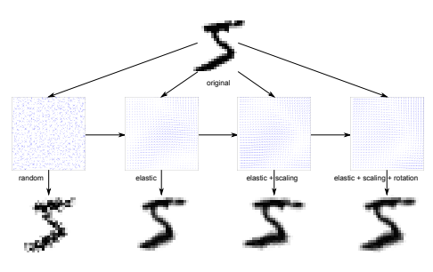

图 23.1. 原始数字（上）和扭曲数字（下）。数字被四个不同的位移场扭曲，显示在中间。

每个仿射变形由从均匀区间随机抽取的对应实值参数完全定义。另一方面，构建弹性变形场由三个部分组成：1）创建初始随机扭曲向量场，2）通过与标准差σ定义的高斯核卷积来平滑随机扭曲场，3）用弹性缩放参数α缩放平滑的变形场。

在每个周期开始时，整个原始 MNIST 训练集会被变形。对小型网络的初步实验建议了以下变形参数：σ = 5.0 − 6.0，α = 36.0 − 38.0，γ = 15 − 20。由于数字 1 和 7 相似，它们的旋转/剪切少于其他数字（β = 7.5◦）。

（β = 15.0◦）。

对 60,000 个 MNIST 训练图像进行变形需要 83 个 CPU 秒，其中大部分（75 秒）用于弹性扭曲。只有后者中最耗时的部分——与高斯核的卷积——被移植到 GPU。MNIST 训练集被分成 600 个连续处理的小批次，每个批次 100 个样本。MNIST 数字从原始的 28×28 像素缩放到 29×29 像素，以获得适当的中心，从而简化卷积。每个批次网格

（10 × 10 图像）具有 290 × 290 个单元，零填充到 310 × 310，从而避免在应用大小为 21 × 21 的高斯卷积核时出现边缘效应。

GPU 程序将许多线程分组到一个块中，在这里它们共享相同的

图 23.2。将卷积的线程网格映射到扭曲场上

高斯核和随机场的部分。所有 29 × 290 的块包含 21（核大小）×10 个线程，每个线程计算卷积的一个垂直条带。

（图 23.2）。生成弹性位移场只需 1.5 秒。

变形整个训练集的速度超过原来的 10 倍，仅需 6.5 秒，而不是 83 秒。通过将所有变形移植到 GPU 上，并利用硬件的插值能力进行最终的双线性插值，可以实现进一步优化。我们省略了这些，因为变形已经相当快速（一个周期中所有图像的变形仅占总计算时间的 3-10％，具体取决于 MLP 大小）。

## 23.5 组建委员会

委员会中单个网络的训练过程如图 23.3 所示。每个网络分别在标准化或原始数据上进行训练。

在训练之前，所有训练集中数字的归一化都已完成。

（归一化阶段）。对于在原始 MNIST 数据上训练的网络，省略了归一化步骤。原始 MNIST 数据的归一化主要是出于实践经验。MNIST 数字已归一化，使得边界框的宽度或高度等于 20 像素。不同数字的宽高比变化较大，我们将边界框的宽度归一化为从 10 到 20 像素，步长为 2 像素，除了一的数字。在原始 MNIST 训练数据归一化后，得到了 6 个归一化训练集。总共我们用七种不同的数据集进行了实验（6 个归一化数据集和原始 MNIST）。

我们进行了六个实验，以分析委员会带来的性能改进。每个委员会由七个随机初始化的单隐层 MLP 组成，具有 800 个隐层单元，使用相同的算法在随机选定的批次上训练。

图 23.3. 训练一个委员会成员。原始 MNIST 训练数据（左侧数字）

在训练之前，数据被归一化（W10）（中间数字）。归一化的数据被扭曲

（D）在每个训练周期使用并作为输入（右侧数字）输入到网络（NN）。每个描绘的数字代表整个训练集。图 23.4. 使用委员会进行测试。如有需要，输入数字被宽度归一化。

（W 块）然后由相应的 MLP 处理。委员会通过平均所有 MLP 的输出形成。

选定的批次。这六个委员会仅在训练前数据的归一化方式（或不归一化）以及训练期间数据的变形方式上有所不同。

委员会是通过简单地平均对应的输出形成的，如图 23.4 所示。

前两个实验是在未变形的原始 MNIST 图像上进行的。我们在原始 MNIST 上训练了七个 MLP 的委员会，同时也形成了一个在归一化数据上训练的 MLP 委员会。在表 23.1 中列出了每个单独网络和委员会的错误率。对于第一个实验，委员会相对于单独网络的改进微乎其微。添加归一化后，单独专家以及第二个实验对应的委员会实现了显著更好的识别率。

为了研究归一化和变形的结合效果，我们在变形的 MNIST 上进行了四个额外的实验（表 23.2）。除非另有说明。

表 23.1. 单个网络和两个结果委员会的错误率。对于实验 1，七个随机初始化的网络在原始 MNIST 上训练，而对于实验 2，七个随机初始化的网络在宽度归一化数据上训练：WN x - 将边界框归一化到 x 像素宽；ORIG - 原始 MNIST。

|          |                          | 错误率 [%]       |        |
| --- | --- | --- | --- |
|          |                          | 实验 1           | 实验 2 |
| 网络 1:   | 初始化 1: 1.79 WN 10: 1.62 |                  |        |
| 网络 2:   | 初始化 2: 1.80 WN 12: 1.37 |                  |        |
| 网络 3:   | 初始化 3: 1.77 WN 14: 1.48 |                  |        |
| 网络 4:   | 初始化 4: 1.72 WN 16: 1.53 |                  |        |
| 网络 5:   | 初始化 5: 1.91 WN 18: 1.56 |                  |        |
| 网络 6:   | 初始化 6: 1.86 WN 20: 1.49 |                  |        |
| 网络 7:   | 初始化 7: 1.75 ORIG:       | 1.79             |        |
| 平均: |                          | 1.70             | 1.31   |

否则，使用默认的弹性变形参数 σ = 6 和 α = 36。

所有使用变形图像的实验都采用独立的水平和垂直缩放，最大 12.5% 和最大旋转 ±12.5◦。实验 3 类似于实验 1，不同之处在于数据持续变形。各个专家的错误率远低于没有变形的情况（表 23.1）。在实验 4 中，我们随机重新选择每个个别专家的训练和验证集，以这种方式模拟引导聚合技术 [3]。结果委员会的表现稍好于实验 3。在实验 5 中，我们对每个个体网络的变形进行变化。

一些网络的错误率大于实验 3 和 4，但最终形成的委员会具有更低的错误率。在最后的实验中，我们在宽度归一化的图像上训练七个 MLP，并且这些图像在训练期间也不断变形。委员会的错误率（0.43%）是迄今为止对于如此简单架构报告的最佳结果。我们得出结论，宽度归一化对于良好的委员会性能至关重要，即仅从不同初始化的训练网络（实验 3）或在原始数据集子集上训练的网络（实验 4）形成委员会是不够的。

## 23.6 使用 GPU 训练深度 MLPs

通过一些简单的技巧，比如在每个时期开始时通过随机扭曲创建几乎无限的训练数据，并形成一个在不同预处理数据上训练的专家委员会，MNIST 上获得了最先进的结果，使用相对较小（800 个隐藏单元）的单隐藏层 MLP。这里我们报告了使用深度 MLP 的结果，最多有 5 个隐藏层和高达 1200 万个自由参数，这在训练上是不可行的。

表 23.2. 各个网络及其结果委员会的错误率。在实验 3 和 4 中，七个随机初始化的网络在变形（σ = 6, α = 36）MNIST 上进行训练，而在实验 4 中，训练和验证集被重新选择。在实验 5 中，七个随机初始化的网络在变形（不同的 σ, α）MNIST 上进行训练，而在实验 6 中，七个随机初始化的网络在宽度归一化、变形（σ = 6, α = 36）MNIST 上进行训练。WN x - 将边界框宽度归一化为 x 像素；ORIG - 原始 MNIST。

|               |         | 错误率 [%]       |        |                                  |      |
| --- | --- | --- | --- | --- | --- |
| 实验 3 实验 4 |         | 实验 5           | 实验 6 |                                  |      |
| 网络 1:        | 初始化 1: | 0.72             | 0.68   | σ = 4.5 α = 36: 0.69 WN 10: 0.64 |      |
| 网络 2:        | 初始化 2: | 0.71             | 0.82   | σ = 4.5 α = 42: 0.94 WN 12: 0.78 |      |
| 网络 3:        | 初始化 3: | 0.72             | 0.73   | σ = 6.0 α = 30: 0.55 WN 14: 0.70 |      |
| 网络 4:        | 初始化 4: | 0.71             | 0.69   | σ = 6.0 α = 36: 0.72 WN 16: 0.60 |      |
| 网络 5:        | 初始化 5: | 0.62             | 0.71   | σ = 6.0 α = 42: 0.60 WN 18: 0.59 |      |
| 网络 6:        | 初始化 6: | 0.65             | 0.70   | σ = 7.5 α = 30: 0.86 WN 20: 0.70 |      |
| 网络 7:        | 初始化 7: | 0.69             | 0.75   | σ = 7.5 α = 36: 0.79 原始:       | 0.71 |
| 平均:          | 0.56    | 0.53             | 0.49   | 0.43                             |      |

当前的 CPU 但可以在几天内成功在 GPU 上训练。所有模拟均在配备 Core i7 920 2.66GHz 处理器、12GB RAM 和 GTX 480 显卡的计算机上进行。GPU 将变形例程的速度提高了 10 倍（仅弹性变形经过 GPU 优化）；

正向传播（FP）和反向传播（BP）例程的速度提高了 50 倍。我们选择验证错误最低的训练 MLP，并在 MNIST 测试集上评估它。

## 23.6.1 单个 Mlp

我们训练了多种 MLP，并在表 23.3 中总结了结果。训练以学习率 10−3 开始，每个纪元后乘以 0.997，直到达到 10−6，因此总共进行了超过 2000 个纪元，即使是最大的网络，也可以在几天内计算完成。最佳网络的错误率仅为 0.35%（10,000 个数字中有 35 个错误分类）。这优于之前发布的最佳结果，即 0.39% [26] 和 0.40% [33]，这两者均通过更复杂的方法获得。35 个错误分类的数字如图 23.5a 所示。其中许多数字模糊和/或不具特征，明显缺少部分或笔画奇怪等。有趣的是，网络对 35 个错误分类数字的第二次猜测中，有 30 个是正确的。该 MLP 的最佳测试错误甚至更低（0.32%），可视为网络的最大容量，即在未获得最低验证集错误结果的情况下它能学到的内容。性能显然从增加隐藏层和每层更多单元中受益，见表 23.3。MNIST 测试集的错误率。架构：841 输入神经元，包含 2500、2000、1500、1000 和 500 个神经元的隐藏层，以及 10 个输出。TEfBV - 最佳验证的测试错误，BTE - 最佳测试错误。

| ID   | 架构                          | TEfBV BTE 模拟   | 权重   | 测试错误 [%]   |                          |      |
| --- | --- | --- | --- | --- | --- | --- |
|      | （每层神经元数量） | [%]                    | [%]       | 时间 [h]         | [百万] 无失真 |      |
| 1    | 1000, 500, 10                     | 0.49                   | 0.44      | 23.4             | 1.34                     | 1.78 |
| 2    | 1500, 1000, 500, 10               | 0.46                   | 0.40      | 44.2             | 3.26                     | 1.85 |
| 3    | 2000, 1500, 1000, 500, 10         | 0.41                   | 0.39      | 66.7             | 6.69                     | 1.73 |
| 4    | 2500, 2000, 1500, 1000, 500, 10   | 0.35                   | 0.32      | 114.5            | 12.11                    | 1.71 |
| 5    | 9 × 1000, 10                      | 0.44                   | 0.43      | 107.7            | 8.86                     | 1.81 |

层。例如，网络 5 的隐藏层数量更多但每层神经元较小，与网络

 4（表 23.3）。

最多拥有 1200 万权重的网络可以通过普通的梯度下降成功训练，以在 20-30 个周期内实现低于 1%的测试错误，训练时间少于 2 小时。如此多参数的网络如何在未见过的测试集上良好泛化？答案是：训练集的持续变形生成了几乎无限的训练示例，网络很少看到任何训练图像两次。没有任何失真时，所有网络的错误率约为 1.7-1.8%（表 23.3 的最后一列）。

(a) (b)

图 23.5. 错误分类的数字，以及两个最可能的预测（底部，从左到右）和根据 MNIST 的正确标签（顶部，右）：(a) 表 23.3 中的最佳网络。(b) 表 23.4 中的委员会。

## 23.6.2 多层感知器委员会

这里我们列出了一个多层感知器（MLP）委员会的结果，该架构在 MNIST 上获得了 0.35%的错误率（输入层有 841 个神经元，五个隐藏层）。表 23.4. 各个网络及其结果委员会的错误率。架构：841 个输入神经元，隐藏层包含 2500、2000、1500、1000 和 500 个神经元，以及 10 个输出。WN x—边界框的宽度归一化到宽度为 x 像素。

| WN                  | 10                            | 12   | 14   | 16   | 18   | 20   | 原始 MNIST   |
| --- | --- | --- | --- | --- | --- | --- | --- |
| 测试错误 [%]      | 0.52 0.45 0.44 0.49 0.36 0.38 | 0.35 |      |      |      |      |                  |
| 委员会错误 [%] | 0.31                          |      |      |      |      |      |                  |

包含 2500、2000、1500、1000 和 500 个神经元，以及 10 个输出）。我们在归一化数据上训练六个具有相同结构的额外网络（在训练前对数字的宽度进行归一化），并通过平均各个网络的预测形成一个委员会（表 23.4）。如 23.5 节所示，宽度归一化对良好的委员会表现至关重要。所有委员会成员在每个训练周期之前都会扭曲其宽度归一化的训练数据集。

有趣的是，极其简单的委员会的错误率（0.31%）低于单个网络的错误率。这是在 MNIST 上报告的最佳结果。

使用 MLP。许多 31 个误分类数字（图 23.5b）都是模糊和/或不典型的，显然缺少部分或有奇怪的笔画等。值得注意的是，委员会的第二次猜测在 31 个中有 29 个是正确的。

## 23.7 讨论

在最近几十年，每欧元的原始计算能力增长了 100-1000 倍。我们的结果表明，这一持续的硬件进步可能比算法和软件的进步更为重要（尽管未来属于将两者最佳结合的方法）。当前的图形处理单元（GPU）在通过古老算法（在线反向传播）训练大型深度神经网络时，速度已经比标准微处理器快 50 倍以上（权重更新速率高达 7.5×10⁹/s，且每个训练的网络超过 10¹⁵）。在竞争激烈的 MNIST 上。

在手写基准测试中，基于单精度浮点的 GPU 神经网络超越了所有之前报告的结果，包括那些涉及专业架构、无监督预训练、机器学习分类器组合等更复杂方法所获得的结果。通过适当地变形图像获得足够大的训练集以避免过拟合。当然，这种方法不仅限于手写，并且显然在许多视觉和其他模式识别问题上具有巨大的潜力。

尽管大型深度多层感知器（MLP）在与合适的扭曲算法结合以增强训练集时是非常强大的通用分类器，但在复杂的图像分类问题上，它们无法与专门的架构（如最大池化卷积神经网络）竞争。对于比手写数字识别更困难的任务，MLP 的竞争力下降，无论是分类性能还是所需的训练时间。我们最近展示了[11]。

大型卷积神经网络与最大池化[32]结合，对众多基准（如拉丁字母[8]、汉字[11]、交通标志[9, 12]、3D 立体投影）提高了 30-80%的最先进水平。

模型[10, 11]，甚至小型自然图像[11]。致谢。此项工作的部分起始于 Dan Cireşan 在“波利特尼卡”大学的博士生涯。他想感谢他的博士导师Ştefan Holban 的指导，以及 Răzvan Moşincat 提供的 MNIST CPU 框架。此项工作部分得到了瑞士技术与创新委员会（CTI）的支持，项目编号 9688.1 IFF：智能表单填写，以及 FP7-ICT-2009-6 欧盟拨款，项目代码 270247：用于认知机器人学的神经动态框架：场景表示、行为序列和学习。

## 附录 - GPU 实现图形处理单元

直到 2007 年，编程 GPU 的唯一方法是将解决问题的算法转换为一组图形操作。尽管编码困难且调试困难，但随着 GPU 比 CPU 更快，开发了几个基于 GPU 的神经网络实现。之前在 GPU 上实现了两层 MLP[34]和 CNN[5]。尽管加速相对温和，但这些研究展示了 GPU 在机器学习中的应用。最近基于 GPU 的 CNN 以批处理模式训练，速度比基于 CPU 的 CNN 快两个数量级[32]。

GPU 代码使用 CUDA（计算统一设备架构）编写，这是一种类似 C 的通用编程语言。GPU 的速度和内存带宽远远优于 CPU，这对快速的 MLP 实现至关重要。要全面理解我们关于 GPU/CUDA 的算法，请访问 NVIDIA 网站[25]。根据 CUDA 术语，CPU 称为*主机*，图形卡设备或 GPU 称为*设备*。

## 变形

仅将后者中最耗时的部分 - 与高斯核的卷积[33] - 移植到 GPU。MNIST 训练集被分成 600 个顺序处理的批次。MNIST 数字从原始的 28×28 像素缩放到 29×29 像素，以获得合适的中心，从而简化卷积。图像网格有 290 × 290 个单元，零填充到 300 × 300，从而避免在应用大小为 21 × 21 的高斯卷积核时出现边缘效应。

我们的 GPU 程序将多个线程分组到一个块中，线程共享相同的高斯核和随机场的部分。每个块包含 21（核大小）×10 个线程，每个线程计算卷积操作的一个垂直条带（见列表 23.1）。

列表 23.1。弹性变形的卷积核 1 __global__ void ConvolveField(float ∗randomfield, int width, int height, float ∗kernel, float ∗outputfield, float elasticScale){

2 float sum=0; 3 const int stride_k=GET_STRIDE(GAUSSIAN_FIELD_SIZE,pitch_x

>>2); *//高斯核的步幅* 4 __shared__ float K[GAUSSIAN_FIELD_SIZE][stride_k]; *//核（21 x* 32 个值)

5 __shared__ float R[GAUSSIAN_FIELD_SIZE+9][

GAUSSIAN_FIELD_SIZE]; *//随机场（30 x 21 个值）*

6 __shared__ float s[10][GAUSSIAN_FIELD_SIZE]; //部分和（10 x 21 个值）

7 int stride_in=GET_STRIDE(width,pitch_x>>2); //随机场步幅为 32 的倍数 8 int stride_out=GET_STRIDE(width−GAUSSIAN_FIELD_SIZE+1, pitch_x>>2); *//输出步幅为 32 的倍数* 9 10 *//将高斯内核加载到 K（21 x 21 值）*

11 K[ 0+threadIdx.y][threadIdx.x] = kernel[( 0+threadIdx.y)∗stride_k +

threadIdx.x];*//行 0..9* 12 K[10+threadIdx.y][threadIdx.x] = kernel[(10+threadIdx.y)∗stride_k +

threadIdx.x];*//行 10..19* 13 if(threadIdx.y==0)

14 K[20+threadIdx.y][threadIdx.x] = kernel[(20+threadIdx.y)∗stride_k +

threadIdx.x];*//行 20* 15 16 *//将随机场加载到 R*

17 *//0..9 x 21 值* 18 R[ 0+threadIdx.y][threadIdx.x] = randomfield[(10∗blockIdx.y+ 0+

threadIdx.y)∗stride_in + blockIdx.x + threadIdx.x];

19 *//10..19 x 21 值* 20 R[10+threadIdx.y][threadIdx.x] = randomfield[(10∗blockIdx.y+10+

threadIdx.y)∗stride_in + blockIdx.x + threadIdx.x];

21 *//20..29 x 21 值* 22 R[20+threadIdx.y][threadIdx.x] = randomfield[(10∗blockIdx.y+20+

threadIdx.y)∗stride_in + blockIdx.x + threadIdx.x];

23 __syncthreads(); *//等待所有内容读取到共享内存中* 24 25 *//计算部分和* 26 \#pragma unroll 21 *//高斯场大小* 27 for(int i=0;i<GAUSSIAN_FIELD_SIZE;i++)

28 sum += R[threadIdx.y + i][threadIdx.x] ∗ K[i][threadIdx.x];

29 s[threadIdx.y][threadIdx.x]=sum; 30 __syncthreads(); 31 32 if(threadIdx.x==0){ *//第一列线程计算卷积的最终值* 33 \#pragma unroll 20*//高斯场大小*−1 34 for(int i=1;i<GAUSSIAN_FIELD_SIZE;i++) sum+=s[threadIdx.y][i

];

35 outputfield[(blockIdx.y∗10+threadIdx.y)∗stride_out + blockIdx.x] =

sum ∗ elasticScale; 36 }

37 }

## 训练算法

我们紧密遵循标准 BP 算法 [30]，只是 BP 的增量和权重更新是分开的并且按顺序执行。这允许每个例程中有更多的并行性。

## 前向传播

算法分为两个内核。权重矩阵 W 被分区

 如图 23.6 所示。

图 23.6. 前向传播：a) 将内核 1 网格映射到填充的权重矩阵；b) 将内核 2 网格映射到部分点积矩阵；c) 前向传播的输出

内核 1。每个块有 256 个线程（图 23.6a），每个线程计算 32 个组件向量的部分点积。点积存储在一个临时矩阵中（图 23.6b）。这个内核具有非常高的吞吐量：平均内存带宽为 115GB/s。这是可能的，因为许多相对较小的块使 GPU 始终处于繁忙状态。每个块使用共享内存存储前一层的激活值，前 32 个线程同时读取这些值，然后由所有 256 个线程使用。在线程同步后，部分点积并行计算（清单 23.2）。通过预计算所有公共索引部分，指令数量保持在最低限度。

核心 2. 线程网格（图 23.6b）只有一行块，由*warp*线程组成，因为每个线程必须计算一个完整的点积（图 23.6c），然后将其输入到激活函数中。这个核心（列表 23.2）

对于每个神经元输入连接少于 1024 的层，这种方式效率低下，特别是对于最后一层，只有十个神经元，每个数字一个。也就是说，它的网格只有一个块，仅占用 GTX 480 GPU 的 6%。

列表 23.2. 前向传播核心 1 __global__ void MLP_FP_reduction_Kernel1(float ∗prevLN, float ∗W,

float ∗partialsum, 无符号整数 neurons, 无符号整数 prevneurons){

2 const int threads=256; 3 const int stride=GET_STRIDE(neurons,pitch_x>>2); //W 矩阵的水平步幅 4 int X=blockIdx.x∗threads + threadIdx.x; *//预计算表达式* 5 int Y=X+stride∗blockIdx.y; 6 int Z=blockIdx.y∗pitch_y∗stride + X;

7 float sum=0.0f; 8 __shared__ float output[pitch_y]; 9 如果(blockIdx.y==0)

10 如果(threadIdx.x==0) output[0]=1.0f; 11 否则如果(threadIdx.x<pitch_y) *//只有 32 个值可以读取和* 128 线程 12 output[threadIdx.x] = threadIdx.x−1<prevneurons ? prevLN[

threadIdx.x−1] : 0.0f; 13 否则; 14 否则如果(threadIdx.x<pitch_y) *//只有 32 个值可以读取和 128 个线程* 15 output[threadIdx.x] = blockIdx.y∗pitch_y+threadIdx.x−1<

prevneurons ?

16 prevLN[blockIdx.y∗pitch_y+threadIdx.x−1] : 0.0f; 17 否则; 18 __syncthreads(); 19 如果(X<neurons){*//计算部分和* 20 *//\#pragma unroll 32* 21 int size=0; 22 如果((blockIdx.y+1)∗pitch_y>=prevneurons+1) 23 size = prevneurons + 1 − blockIdx.y∗pitch_y; 24 否则 size=pitch_y; 25 for (int ic=0; ic<size; ic++){

26 sum += output[ic] ∗ W[Z];

27 Z+=stride; 28 }

29 partialsum[Y]=sum; 30 }

31 } 32 33 __global__ void MLP_FP_reduction_Kernel2(float ∗currLN, float ∗

partialsum, 无符号整数 neurons, 无符号整数 size){

34 float sum=0.0f; 35 int idx = blockIdx.x∗(pitch_x>>2) + threadIdx.x; *//预计算索引* 36 无符号整数 stride = GET_STRIDE(neurons,pitch_x>>2); *//partialsum 矩阵的步幅* 37 38 如果(idx>=neurons)return; *//这个线程在计算真正的神经元吗？*

39 for (int i=0; i<size; i++) sum += partialsum[i∗stride+idx]; *//计算* 最终点积 40 currLN[idx] = SIGMOIDF(sum); *//应用激活* 41 }

## 反向传播

这类似于 FP，但我们需要 WT 以便进行合并访问。不是转置矩阵，而是对从设备内存读取到共享内存的数据块进行计算，类似于优化的矩阵转置算法[28]。共享内存访问速度更快，没有合并限制。由于我们必须处理数千个神经元的层，反向传播的增量使用两种核心实现的减少方法，通过全局内存传递部分结果（列表 23.3）。

## 列表 23.3. 反向传播增量核心

1 2 __global__ void backPropagateDeltasFC_A(float ∗indelta, float ∗weights, unsigned int ncon, unsigned int nrneur, float ∗partial){

3 const int px = pitch_x>>2; 4 unsigned int stride_x = GET_STRIDE(nrneur,px); 5 unsigned int stride_y = GET_STRIDE(ncon,pitch_y); 6 float outd = 0.0; 7 int idx = blockIdx.x∗px+threadIdx.x; 8 int X = blockIdx.y∗pitch_y∗stride_x + idx; 9 int Y = threadIdx.x; 10 __shared__ float w[32∗33]; *//pitch_y 和 px 应该相等！ +1 以* 避免银行冲突！

11 __shared__ float id[px]; *//输入 delta* 12 \#pragma unroll 32 *//在共享内存中读取权重块* 13 for(int i=0;i<pitch_y;i++){w[Y]=weights[X]; X+=stride_x; Y+=33;} 14 *//在共享内存中读取输入 delta 块* 15 if(idx>=nrneur) id[threadIdx.x]=0; //不存在的 indelta 的假输入 delta 16 else id[threadIdx.x]=indelta[idx]; 17 __syncthreads(); *//对于具有 warp 数量线程的块不需要：*

隐式同步 18 \#pragma unroll 32 *//计算部分结果* 19 for(int i=0;i<px;i++) outd+=w[threadIdx.x∗33+i]∗id[i];

20 *//写出部分结果* 21 partial[blockIdx.x∗stride_y + blockIdx.y∗pitch_y + threadIdx.x] = outd; 22 }

23 __global__ void backPropagateDeltasFC_B(float ∗outdelta,float ∗instates, unsigned int ncon, unsigned int nrneur, float ∗partial){

24 int px=pitch_x>>2; 25 unsigned int stride_x = GET_STRIDE(nrneur,px);

26 unsigned int stride_y = GET_STRIDE(ncon,pitch_y); 27 float outd = 0.0; 28 int size=stride_x/px; 29 int idx=blockIdx.x∗pitch_y+threadIdx.x; 30 if(idx==0); *//仅对块和线程 0 为真* 31 else{ 32 for(int i=0;i<size;i++)

33 outd+=partial[i∗stride_y + idx];

34 outdelta[idx−1] = outd ∗ DSIGMOIDF(instates[idx−1]); //−*1 偏置 ...*

35 }

36 }

内核 1。二维网格被划分为 *warp*（32）线程的块。

内核开始时从 W 中读取一个 32 × 32 的值块。共享内存块的步幅为 33 (*warp* + 1)，从而避免所有银行冲突并显著提高速度。接下来，读取 32 个输入 delta 值，所有不对应于真实神经元的内存位置（由于垂直步幅）被填充为零，以避免后续计算中的分支。元素数量固定为 *warp* 大小，计算循环展开以进一步加速。在结束之前，每个线程将自己的部分点积写入全局内存。

内核 2。此内核通过对前一个内核计算的部分 delta 进行求和，完成 delta 的反向传播。它将最终结果乘以应用于当前神经元状态的激活函数的导数，并将新 delta 写入全局内存。

## 权重更新

算法（列表 23.4）开始读取适当的 delta，并预计算所有重复表达式。然后前 16 个线程从全局内存读取状态到共享内存。常量激活为 1.0 的“偏置神经元”通过条件语句处理，可以通过包含条件的表达式避免。一旦线程同步，每个线程在固定展开循环中更新 16 个权重。

列表 23.4。权重调整内核 1 __global__ void adjustWeightsFC(float ∗states,float ∗deltas, float ∗weights, float eta, unsigned int ncon, unsigned int nrneur){

2 const int pitch_y=16; 3 const int threads=256; 4 unsigned int px = pitch_x >> 2; 5 unsigned int stride_x = GET_STRIDE(nrneur,px); 6 float etadeltak = eta∗deltas[blockIdx.x∗threads+threadIdx.x],t; 7 int b=blockIdx.y∗stride_x∗pitch_y + threads∗blockIdx.x + threadIdx.x; 8 __shared__ float st[pitch_y]; *//用于状态* 9 int cond1 = blockIdx.y || threadIdx.x; 10 int cond2 = (blockIdx.y+1)∗pitch_y<=ncon; 11 int size = cond2 ∗ pitch_y + !cond2 ∗ (ncon%pitch_y);

12 if(threadIdx.x<pitch_y) st[threadIdx.x] = cond1 ∗ states[blockIdx.y∗

pitch_y + threadIdx.x − 1] + !cond1; 13 __syncthreads(); 14 15 if (blockIdx.x∗threads + threadIdx.x < nrneur){

16 \#pragma unroll 16 17 for (int j=0; j<16; j++){

18 t=weights[b];

19 t−= etadeltak ∗ st[j];

20 weights[b]=t; 21 b+=stride_x;}} 22 }

[1] Bengio, Y., Lamblin, P., Popovici, D., Larochelle, H.: 贪婪的分层训练深度网络。在：神经信息处理系统 (2006)

[2] Bishop, C.M.: 模式识别与机器学习。施普林格 (2006)

[3] Breiman, L.: 装袋预测器。机器学习 24, 123–140 (1996) [4] Chellapilla, K., Shilman, M., Simard, P.: 组合多个分类器以加快光学字符识别。在：Bunke, H., Spitz, A.L. (eds.) DAS 2006。LNCS, vol. 3872, pp. 358–367。施普林格，海德堡 (2006)

[5] Chellapilla, K., Puri, S., Simard, P.: 用于文档处理的高性能卷积神经网络。在：国际手写识别前沿研讨会 (2006)

[6] Ciresan, D.C., Meier, U., Gambardella, L.M., Schmidhuber, J.: 用于手写数字识别的深度、大型、简单神经网络。神经计算 22(12), 3207–3220 (2010)

[7] Ciresan, D.C., Meier, U., Gambardella, L.M., Schmidhuber, J.: 使用深度神经网络委员会在 GPU 上进行手写数字识别。技术报告 IDSIA-03-11，意大利 Dalle Molle 智能研究所，IDSIA

(2011)

[8] Ciresan, D.C., Meier, U., Gambardella, L.M., Schmidhuber, J.: 用于手写字符识别的卷积神经网络委员会。在：国际文档分析与识别会议，pp. 1135–1139 (2011)

[9] Ciresan, D.C., Meier, U., Masci, J., Schmidhuber, J.: 用于交通标志分类的神经网络委员会。在：国际神经网络联合会议，pp. 1918–1921 (2011)

[10] Ciresan, D.C., Meier, U., Masci, J., Gambardella, L.M., Schmidhuber, J.: 灵活的高性能卷积神经网络用于图像分类。在：

国际人工智能联合会议，第 1237–1242 页（2011）

[11] Ciresan, D.C., Meier, U., Schmidhuber, J.: 用于图像分类的多列深度神经网络。在：计算机视觉与模式识别，第 3642–3649 页（2012）

[12] Ciresan, D.C., Meier, U., Masci, J., Schmidhuber, J.: 用于交通标志分类的多列深度神经网络。神经网络 32，333–338（2012）

[13] Decoste, D., Scholkopf, B.: 训练不变支持向量机。机器学习（46），161–190（2002）

[14] Hinton, G.E., Salakhutdinov, R.R.: 使用神经网络减少数据的维度。科学 313（2006）

[15] Hinton, G.E.: 识别形状，首先学习生成图像。计算神经科学：对大脑功能的理论洞察（2007）

[16] Hochreiter, S.: 动态神经网络的研究。硕士论文，慕尼黑工业大学计算机科学系，Brauer 教授讲座（1991），http://www7.informatik.tu-muenchen.de/~hochreit；导师：J. Schmidhuber

[17] Hochreiter, S., Schmidhuber, J.: 长短期记忆。神经计算 9，1735–1780（1997）

[18] Hochreiter, S., Bengio, Y., Frasconi, P., Schmidhuber, J.: 循环网络中的梯度流：学习长期依赖的难度。在：Kremer, S.C.，

Kolen, J.F.（主编）动态递归神经网络实用指南。IEEE 出版社（2001）

[19] Lauer, F., Suen, C., Bloch, G.: 一种可训练的特征提取器用于手写数字识别。模式识别（40），1816–1824（2007）

[20] LeCun, Y.: 不对称阈值网络的学习程序。在：1985 年巴黎认知会议论文集，第 599–604 页（1985）

[21] LeCun, Y., Bottou, L., Bengio, Y., Haffner, P.: 基于梯度的学习在文档识别中的应用。IEEE 会议录 86(11)，2278–2324（1998）

[22] Meier, U., Ciresan, D.C., Gambardella, L.M., Schmidhuber, J.: 用简单神经网络的委员会实现更好的数字识别。在：ICDAR，第 1135–1139 页（2011）

[23] Mohamed, A., Dahl, G., Hinton, G.E.: 用于语音识别的深度信念网络。

在：NIPS 2009 深度学习研讨会关于语音识别及相关应用的论文集（2009）

[24] Nair, V., Hinton, G.E.: 使用深度信念网络的 3D 物体识别。在：神经信息处理系统进展（2009）

[25] NVIDIA: NVIDIA CUDA。参考手册，第 2.3 卷。NVIDIA（2009） [26] Ranzato, M., Poultney, C., Chopra, S., LeCun, Y.: 使用基于能量模型的稀疏表示高效学习。在：Platt, J. 等（主编）神经信息处理系统进展（NIPS 2006）。MIT 出版社（2006）

[27] Ranzato, M.: Fu Jie Huang, Y.L.B., LeCun, Y.: 无监督学习不变特征层次及其在物体识别中的应用。在：计算机视觉与模式识别会议论文集（2007）

[28] Ruetsch, G., Micikevicius, P.: 在 CUDA 中优化矩阵转置。在：NVIDIA

GPU 计算 SDK，第 1–2 页（2009）

[29] Rumelhart, D.E., Hinton, G.E., Williams, R.J.: 通过误差传播学习内部表示。在：并行分布处理：认知微结构探索，第 1 卷：基础，pp. 318–362。麻省理工学院出版社，剑桥

(1986)

[30] Russell, S., Norvig, P.: 人工智能：现代方法，第 2 版。

Prentice-Hall, Englewood Cliffs（2003）

[31] Salakhutdinov, R., Hinton, G.: 通过保留类别邻域结构学习非线性嵌入。在：国际人工智能与统计会议论文集，第 11 卷（2007）

[32] Scherer, D., Behnke, S.: 使用并行图形多处理器加速大规模卷积神经网络。在：NIPS 2009 大规模机器学习研讨会：并行和海量数据集的论文集（2009）

[33] Simard, P., Steinkraus, D., Platt, J.C.: 应用于视觉文档分析的卷积神经网络最佳实践。在：第七届国际文档分析与识别会议，pp. 958–963（2003）

[34] Steinkraus, D., Simard, P.Y.: 用于机器学习算法的 GPU。在：国际文档分析与识别会议，pp. 1115–1120（2005）

[35] Werbos, P.J.: 超越回归：行为科学中预测和分析的新工具。博士论文，哈佛大学（1974）

# 24 受限玻尔兹曼机训练的实用指南

Geoffrey E. Hinton 多伦多大学，安大略省多伦多 M5S 3G4 计算机科学系 hinton@cs.toronto.edu 摘要。受限玻尔兹曼机（RBMs）已被用作多种不同类型数据的生成模型。RBMs 通常使用对比散度学习程序进行训练。这需要一定的实践经验来决定如何设置数值超参数的值。在过去几年中，多伦多大学的机器学习小组在训练 RBMs 方面积累了相当的专业知识，本指南旨在与其他机器学习研究人员分享这一专业知识。

## 24.1 引言

受限玻尔兹曼机（RBMs）已被用作多种不同类型数据的生成模型，包括标记或未标记的图像 [7]，表示语音的梅尔倒谱系数窗口 [12]，表示文档的词袋 [15]，以及用户对电影的评分 [17]。在其条件形式中，它们可以用于建模高维时间序列，例如视频或动作捕捉数据 [20] 或语音 [11]。它们最重要的用途是作为学习模块，组成深度信念网络 [7]。

限制玻尔兹曼机通常使用对比散度学习过程进行训练。

[5]。这需要一定的实践经验，以决定如何设置数值元参数的值，如学习率、动量、权重成本、稀疏性目标、权重的初始值、隐藏单元的数量以及每个小批量的大小。还需要对使用何种类型的单元、是随机更新它们的状态还是确定性更新、对每个训练样本更新隐藏单元的状态次数，以及是否从数据向量开始每个状态更新序列做出决策。此外，了解如何监控学习进展以及何时终止训练也很有用。

对于任何特定应用，所使用的代码提供了所有这些决策的完整规范，但并没有解释为什么做出这些决策，也没有说明小的变化将如何影响性能。更重要的是，它没有为新手用户提供关于如何为新应用做出良好决策的任何指导。这需要一些合理的启发式方法，以及将学习失败与导致这些失败的决策联系起来的能力。

G. Montavon 等编：NN：行业诀窍，第 2 版，LNCS 7700，第 599–619 页，2012 年。

-c Springer-Verlag Berlin Heidelberg 2012

在过去几年中，多伦多大学的机器学习小组在训练限制玻尔兹曼机方面积累了相当多的专业知识，而本指南试图与其他机器学习研究人员分享这种专业知识。

## 24.2 限制玻尔兹曼机和对比散度概述

如果你已经了解限制玻尔兹曼机，请跳过此部分。考虑一个二进制向量的训练集，为了说明，我们假设这些是二进制图像。该训练集可以使用称为“限制玻尔兹曼机”的两层网络建模[18, 2, 5]，在该网络中，随机的二进制像素与使用对称加权连接的随机二进制特征检测器相连。像素对应于 RBM 的“可见”单元，因为它们的状态是可观察的；特征检测器对应于“隐藏”单元。可见和隐藏单元的联合配置(v, h)的能量[9]给出为：

$$E(\mathbf{v},\mathbf{h})=-\sum_{i\in\mathrm{visible}}a_{i}v_{i}-\sum_{j\in\mathrm{hidden}}b_{j}h_{j}-\sum_{i,j}v_{i}h_{j}w_{i j}$$

vihjwij (24.1)

其中 vi, hj 是可见单元 i 和隐藏单元 j 的二进制状态，ai, bj 是它们的偏置，wij 是它们之间的权重。网络分配一个

通过这个能量函数，给每一对可见向量和隐藏向量的概率：

$$p(\mathbf{v},\mathbf{h})={\frac{1}{Z}}\;e^{-E(\mathbf{v},\mathbf{h})}$$

其中“分区函数”Z 通过对所有可能的可见向量和隐藏向量对进行求和来给出：

$Z$由所有可能的求和给出：$Z=\sum_{\mathbf{v,h}}e^{-E(\mathbf{v,h})}$，其中$\mathbf{v,h}$是可逆矩阵。

网络为可见向量$v$分配的概率由所有可能的隐藏向量的总和给出：

$$p(\mathbf{v})={\frac{1}{Z}}\sum_{\mathbf{h}}e^{-E(\mathbf{v},\mathbf{h})}$$

$$(24.1)$$

$$(24.2)$$

$$\mathrm{{\;\;对\;\;}}$$ $$\mathrm{(24.3)}$$

$$(24.4)$$

$$(24.5)$$

网络为训练图像分配的概率可以通过调整权重和偏差来提高，从而降低该图像的能量，并提高其他图像的能量，尤其是那些能量低、对分区函数贡献大的图像。训练向量的对数概率关于权重的导数出奇的简单。

$${\frac{\partial\log p(\mathbf{v})}{\partial w_{i j}}}=\langle v_{i}h_{j}\rangle_{d a t a}-\langle v_{i}h_{j}\rangle_{m o d e l}$$

$$(24.6)$$

$$(24.7)$$

其中尖括号用于表示在该分布下的期望。

由后续下标指定。这导致了一个非常简单的学习规则，用于在训练的对数概率中执行随机最陡上升。

数据：

$$\Delta w_{i j}=\epsilon(\langle v_{i}h_{j}\rangle_{d a t a}-\langle v_{i}h_{j}\rangle_{m o d e l})$$

其中是学习率。

因为在 RBM 中隐藏单元之间没有直接连接，

获取$ v_{i}h_{j} *数据*的无偏样本非常简单。给定一个随机选择的

训练图像$v$，每个隐藏单元$j$的二进制状态$h_j$被设置为 1，

概率

viwij ) (24.7)

$$p(h_{j}=1\mid\mathbf{v})=\sigma(b_{j}+\sum_{i}v_{i}w_{i j})$$

其中σ(x)是逻辑 Sigmoid 函数 1/(1 + exp(−x))。$v_{i}h_{j}$然后是

无偏样本。

因为在 RBM 中可见单元之间没有直接连接，

获取可见单元状态的无偏样本也很容易，*给定一个*

隐藏向量生成“重构”。

$$p(v_{i}=1\mid\mathbf{h})=\sigma(a_{i}+\sum_{j}h_{j}w_{i j})$$

hjwij ) (24.8)

$$(24.8)$$

然而，获取$ v_{i}h_{j} *模型*的无偏样本要困难得多。它

可以通过从可见单元的任意随机状态开始，并进行很长时间的交替吉布斯采样来完成。一轮交替吉布斯采样包括使用方程 24.7 并行更新所有隐藏单元，然后使用方程

24.8.

在[5]中提出了一种更快的学习过程。这开始于设置

将可见单元的状态设置为训练向量。然后，隐藏单元的二进制状态

隐藏单元都是使用方程 24.7 并行计算的。一旦为隐藏单元选择了二进制状态，就会通过设置

每个$v_{i}$以方程 24.8 给定的概率设置为 1。权重的变化

随后由以下公式给出：

$$\Delta w_{i j}=\epsilon(\langle v_{i}h_{j}\rangle_{d a t a}-\langle v_{i}h_{j}\rangle_{r e c o n})$$

$$(24.9)$$

一个简化版本的学习规则使用单个单元的状态而不是成对乘积来处理偏置。

学习效果很好，尽管它只是粗略地逼近

训练数据的对数概率的梯度[5]。学习规则更加

更接近另一个目标函数的梯度，这个目标函数称为

对比散度[5]是两个 Kullback-Leibler 散度之间的差异，但它忽略了这个目标函数中的一个棘手项，因此它甚至没有遵循那个梯度。确实，Sutskever 和 Tieleman 已经证明

它并没有遵循任何函数的梯度[19]。尽管如此，它在许多重要应用中效果足够好。

如果在收集学习规则中第二项的统计数据之前使用更多步交替 Gibbs 采样，RBMs 通常会学习到更好的模型，这将称为负统计量。CDn 将用于表示使用 n 步完整交替 Gibbs 采样进行学习。

## 24.3 如何在使用对比散度时收集统计数据

首先，我们假设所有可见和隐藏单元都是二进制的。

其他类型的单元将在 24.13 节中讨论。我们还将假设学习的目的是创建一组训练向量的良好生成模型。当使用 RBMs 学习深度信念网络（请参见 www.scholarpedia.org 上的深度信念网络文章）并随后使用反向传播进行微调时，生成模型并不是最终目标，可能通过欠拟合来节省时间，但我们在这里将忽略这一点。

## 24.3.1 更新隐藏状态

假设隐藏单元是二进制的，并且你正在使用 CD1，当它们被数据向量驱动时，隐藏单元应该具有随机二进制状态。激活隐藏单元 j 的概率是通过将逻辑函数σ(x)=1/(1 + exp(−x))应用于其“总输入”计算的：

$$p(h_{j}=1)=\sigma(b_{j}+\sum_{i}v_{i}w_{i j})$$

$$(24.10)$$

如果这个概率大于在 0 和 1 之间均匀分布的随机数，隐藏单元就会被激活。

使这些隐藏状态为二进制形式非常重要，而不是使用概率本身。如果使用概率，每个隐藏单元在重建过程中可以向可见单元传达实值。这严重违反了隐藏单元至多只能传达一位（平均而言）所创建的信息瓶颈。这个信息瓶颈充当了强有力的正则化器。

对于隐藏单元的最后一次更新，使用随机二进制状态是愚蠢的，因为没有任何东西依赖于选择哪个状态。因此使用概率本身以避免不必要的采样噪声。在使用 CDn 时，只有隐藏单元的最终更新应该使用概率。

## 24.3.2 更新可见状态

假设可见单元为二元，当生成重构时，更新可见状态的正确方法是随机选择 1 或 0，其概率由总的自上而下输入决定：

$p_{i}=p(v_{i}=1)=\sigma(a_{i}+\sum_{j}h_{j}w_{ij})$ (24.11)

然而，通常使用概率 pi，而不是抽样二元值。这并不像对数据驱动的隐藏状态使用概率那样成问题，且减少了抽样噪声，从而允许更快的学习。有证据表明这会导致略差的密度模型（Tijmen Tieleman, 个人通信, 2008）。在使用 RBM 对深度信念网络的隐藏特征层进行预训练时，这可能并不重要。

## 24.3.3 收集学习所需的统计信息

假设可见单元使用实值概率而不是随机二元值，收集可见单元 i 与隐藏单元 j 之间正统计的两种合理方法是：

$$\langle p_{i}h_{j}\rangle_{\mathrm{data}}\quad\quad\mathrm{or}\quad\quad\langle p_{i}p_{j}\rangle_{\mathrm{data}}$$

其中 pj 是一个概率，hj 是一个二元状态，其取值为 1 的概率为 pj。使用 hj 更接近 RBM 的数学模型，但使用 pj 通常噪声更小，从而允许略快的学习。

## 24.3.4 获取 Cd1 学习信号的食谱

当隐藏单元被数据驱动时，*始终*使用随机二元状态。当它们被重构驱动时，始终使用无抽样的概率。

假设可见单元使用逻辑函数，使用实值概率来处理数据和重构。

在收集学习权重的成对统计或学习偏置的单独统计时，使用概率而不是二元状态，并确保权重具有随机初始值以打破对称性。

## 24.4 小批量的大小

在对单个训练样本估计梯度后，可以更新权重，但将训练集划分为小“迷你批量”往往更有效。

“迷你批量”包含 10 到 100 个样本。这允许使用矩阵乘法，这在 GPU 板或 Matlab 中非常有利。

1 使用 hj 总会在正统计中产生比使用 pj 更多的噪声，但在正负统计的*差异*中可能产生更少的噪声，因为负统计依赖于用于生成重构的 j 的状态的二元决策。当重构驱动 j 时，j 的概率与当数据驱动 j 时做出的二元决策高度相关。

因此，给定隐藏单元的二进制状态，重建的生成没有任何随机性。3 “批次”这个词令人困惑，并且会被避免，因为当它与“在线”对比时，它通常意味着整个训练集。

为了避免在更改小批次大小时需要更改学习率，将在小批次上计算的总梯度除以小批次的大小是有帮助的，因此在谈论学习率时，我们假设它们是乘以在小批次上计算的平均每个样本梯度，而不是小批次的总梯度。

在使用随机梯度下降时，将小批次做得过大是一个严重的错误（有关更多细节，请参见第一章和第十八章）。将小批次大小增加 N 倍会导致更可靠的梯度估计，但并不会使最大稳定学习率增加 N 倍，因此净效果是每次梯度评估时权重更新变得更小。

## 24.4.1 将训练集划分为小批次的方案

对于包含少数等概率类别的数据集，理想的小批次大小通常等于类别的数量，每个小批次应包含每个类别的一个示例，以减少从单个小批次估计整个训练集梯度时的采样误差。对于其他数据集，首先随机化训练示例的顺序，然后使用约 10 的大小的小批次。

## 24.5 监控学习进度

计算数据与重建之间的平方误差是很简单的，因此这个量在学习过程中经常被打印出来。整个训练集上的重建误差应该在学习开始时迅速且稳定地下降，然后逐渐减缓。由于梯度估计中的噪声，个别小批次的重建误差在最初的快速下降后会轻微波动。在使用高动量时，它也可能在几个小批次的周期内轻微震荡（见第 24.9 节）。

尽管方便，重建误差实际上是衡量学习进展的一个非常差的指标。它不是 CDn 学习大致优化的函数，尤其是当*n >>* 1 时，并且它系统性地混淆了学习过程中变化的两个不同量。第一个是训练数据的经验分布与 RBM 的平衡分布之间的差异。第二个是交替吉布斯马尔可夫链的混合率。如果混合率非常低，即使数据和模型的分布非常不同，重建误差也会非常小。随着权重的增加，混合率下降，因此降低了。并行化学习的简单方法是在集群中将每个小批次划分为子小批次，并使用不同的核心计算每个子小批次的梯度。由不同核心计算的梯度必须进行合并。为了最小化通信与计算的比率，诱惑是使子小批次较大。这通常会使学习效率大大降低，从而消除使用多个核心所获得的大部分收益（Vinod Nair，个人通信，2007 年）。

重建误差的增大并不一定意味着模型在改善，相反，轻微的增幅也不一定意味着模型在变差。然而，显著的增幅是个坏兆头，除非它们是暂时性的，并且是由学习率、动量、权重成本或稀疏性元参数的变化引起的。

## 24.5.1 使用重建误差的配方

使用它，但不要完全信任。如果你真的想知道学习过程中发生了什么，请使用多个直方图和图形显示，如第 24.15 节所述。还可以考虑使用退火重要性采样[16]来估计保留数据的密度。如果你在学习标记数据的联合密度模型（见第 24.16 节），请考虑监测训练数据和保留验证集上的判别性能。

## 24.6 监测过拟合

在学习生成模型时，明显需要监测的量是当前模型对数据点分配的概率。当这个概率开始下降时，就是停止学习的时机。不幸的是，对于大型 RBM，这个概率的计算非常困难，因为它需要了解配分函数。然而，可以通过比较训练数据和持出验证数据的自由能来直接监测过拟合。在这个比较中，配分函数会抵消。数据向量的自由能可以在与隐含单元数量线性相关的时间内计算（见 24.16.1 节）。如果模型没有过拟合，训练数据和验证数据的平均自由能应该大致相同。随着模型开始过拟合，验证数据的平均自由能会相对于训练数据的平均自由能上升，这个差距表示过拟合的程度。

## 24.6.1 监测过拟合的方案

每经过几轮，计算一组代表性训练数据的平均自由能，并将其与验证集的平均自由能进行比较。始终使用相同的训练数据子集。如果差距开始增大，模型就是在过拟合，尽管训练数据的概率可能增长得比差距还快，因此验证数据的概率可能仍在改善。确保在计算你希望比较的两个平均值时使用相同的权重。

5 平均自由能在学习过程中通常会发生较大变化，这意味着其意义不大，因为对数配分函数也会发生较大变化。只有自由能的*差异*在不需要知道配分函数的情况下才容易解释。

## 24.7 学习率

如果学习率过大，重构误差通常会急剧增加，权重可能会爆炸。

如果在网络正常学习时降低学习率，重构误差通常会显著下降。这不一定是好事。这部分是由于随机权重更新中的噪声水平较小，通常伴随着长期学习的速度减慢。然而，在学习结束时，通常减少学习率是有利的。对几个更新的权重进行平均是去除最终权重噪声的另一种方法。

## 24.7.1 设置权重和偏置学习率的方案

一个设定学习率的好经验法则（Max Welling, 个人通讯, 2002）是查看权重更新的直方图和权重的直方图。更新量应大约是权重的 10−3 倍（在数量级范围内）。当某个单元的输入量非常大时，更新量应更小，因为同一方向的许多小变化可能会轻易反转梯度的符号。相反，对于偏置，更新量可以更大。

## 24.8 权重和偏置的初始值

权重通常初始化为从均值为零、标准差约为 0.01 的高斯分布中选择的小随机值。使用较大的随机值可以加速初始学习，但可能导致最终模型略差。应确保初始权重值不使得典型的可见向量将隐藏单元的概率驱动得过于接近 1 或 0，因为这会显著减缓学习。如果用于学习的统计是随机的，初始权重可以全部为零，因为统计中的噪声会使隐藏单元彼此不同，即使它们具有相同的连接性。

通常，将可见单元 i 的偏置初始化为 log[pi/(1 − pi)] 是有帮助的。

其中 pi 是单元 i 开启的训练向量的比例。如果不这样做，学习的早期阶段将使用隐藏单元使 i 以大约 pi 的概率开启。

当使用稀疏目标概率 t（见 24.11 节）时，将隐藏偏置初始化为 log[t/(1−t)] 是有意义的。否则，初始隐藏偏置为 0 通常是可以的。也可以用约−4 的较大负偏置来粗略鼓励稀疏性。

## 24.8.1 设置权重和偏置初始值的配方

使用从均值为零、标准差为 0.01 的高斯分布中选择的小随机值作为权重。将隐藏偏置设为 0。将可见偏置设为 log[pi/(1 − pi)]，其中 pi 是单元 i 开启的训练向量的比例。偶尔查看隐藏单元的活动，以检查它们是否总是开启或关闭。

## 24.9 动量

动量法是一个简单的方法，可以加快学习速度，特别是当目标函数包含长而窄且相当直的沟壑，沟壑底部的梯度平缓但一致，沟壑两侧的梯度则更陡峭。动量法模拟了一个重球在表面上滚动。球在沟壑的底部积累速度，但在沟壑横跨的地方没有，因为沟壑两侧的相反梯度会随着时间的推移相互抵消。动量法不是用估计的梯度乘以学习率来增加参数的*值*，而是用这个量来增加参数的*速度*，v，然后当前的速度用作参数增量。

假设球的速度会随着时间衰减，而“动量”超参数α是计算新小批量梯度后，保留的前一速度的比例：

$$\Delta\theta_{i}(t)=v_{i}(t)=\alpha v_{i}(t-1)-\epsilon\frac{dE}{d\theta_{i}}(t)\tag{24.12}$$

如果梯度保持不变，终端速度将超过*dE/dθ*i 的因子为 1/(1 − α)。对于动量 0.9，这个因子为 10，这是该超参数的典型设置。动量法中的时间平滑避免了简单增加学习率所导致的跨沟壑的发散振荡，因子为 1/(1 − α)。

动量法使参数沿着一个不是最陡下降方向的方向移动，因此与共轭梯度等方法有一些相似之处，但它使用先前梯度的方式要简单得多。与为每个参数使用不同学习率的方法不同，动量法在沟壑与参数轴不对齐时同样有效。

另一种看待动量法的方法（Tijmen Tieleman，个人通讯，2008）如下：它等同于将学习率增加一个因子 1/(1−α)，但通过将完整增量分成一系列指数衰减的分期来延迟每次梯度估计的完全效果。这使系统有时间对早期分期作出反应，移动到具有相反梯度的参数空间区域，然后再感受到增量的全部效果。反过来，这允许学习率更大，而不会引起不稳定的振荡。

在学习开始时，随机初始化的参数值可能会产生非常大的梯度，系统不太可能处于沟壑的底部，因此通常最好在多个参数更新中以 0.5 的低动量开始。这种非常保守的动量通常使学习比没有动量时更稳定，通过减弱沟壑之间的振荡[4]。

## 24.9.1 动量法的使用方法

从 0.5 的动量开始。当重建误差的大幅初始下降稳定到缓慢进展时，将动量增加到 0.9。这种冲击可能会导致重建误差的暂时增加。如果这导致更持久的不稳定，请将学习率按 2 的因子逐步降低，直到不稳定消失。

## 24.10 权重衰减

权重衰减通过向正常梯度添加一个额外项来工作。这个额外项是惩罚大权重的函数的导数。最简单的惩罚函数称为"L2"，是平方权重总和的一半乘以一个称为权重成本的系数。

将惩罚项的导数乘以学习率是很重要的。否则，学习率的变化会改变被优化的函数，而不仅仅是改变优化过程。

在 RBM 中使用权重衰减有四个不同的原因。第一个是通过减少对训练数据的过拟合来提高对新数据的泛化能力。第二个是通过缩小无用权重，使隐藏单元的感受野更加平滑和可解释。第三个是“解除”在训练早期已经发展出非常大权重的隐藏单元，这些单元要么总是牢牢开启，要么总是牢牢关闭。允许这些单元再次变得有用的更好方法是使用在第 24.11 节中描述的“稀疏性”目标。

第四个原因是提高交替吉布斯马尔可夫链的混合速率。使用小权重时，马尔可夫链的混合速度更快。CD 学习过程基于忽略来自马尔可夫链后续步骤的导数（Hinton, Osindero 和 Teh, 2006），因此当混合速度快时，它更倾向于更好地逼近最大似然学习。被忽略的导数小的原因是：当马尔可夫链非常接近其平稳分布时，建模链中样本的最佳参数非常接近其当前参数。

由于惩罚应用于每个小批量，贝叶斯方法实际上应该将权重成本除以训练集的大小。这样，他们可以将权重衰减解释为高斯权重先验的影响，其方差与训练集大小无关。通常不会进行这种除法。相反，对于较小的训练集，使用更大的权重成本。具有全零权重时，它在一个完整的步骤中达到相当无聊的平稳分布。

另一种称为"L1"的权重衰减形式是使用绝对值权重之和的导数。这通常会导致许多权重变为零，同时允许少数权重变得相当大。这可以使解释权重变得更加容易。例如，在为图像学习特征时，L1 权重衰减通常会导致强局部化的感受野。

控制权重大小的另一种方法是对每个单元的输入权重平方和或绝对值的最大允许值施加限制。在每次权重更新后，如果权重超过此最大值，则对其进行重新缩放。这有助于避免隐藏单元陷入极小的权重，但稀疏目标可能是避免这个问题的更好方法。

## 24.10.1 使用权重衰减的食谱

对于 RBM，L2 权重衰减的权重成本系数的合理值通常在 0.01 到 0.00001 之间。权重成本通常不应用于隐藏和可见偏差，因为这些数量较少，因此不太可能导致过拟合。此外，偏差有时需要相当大。

尝试初始权重成本为 0.0001。如果您使用退火重要性采样[16]来估计保留验证集上的密度，请尝试通过 2 的倍数调整权重成本以优化密度。权重成本的小差异不太可能导致性能的大差异。如果您正在训练一个联合密度模型，可以在验证集上测试判别性能，这可以用来替代密度以优化权重成本。然而，在任何情况下，请记住，权重衰减不仅仅是防止过拟合。它还增加了混合速率，使 CD 学习更接近最大似然。因此，即使过拟合不是问题，因为训练数据的供应是无限的，权重衰减仍然是有益的。

## 24.11 鼓励稀疏的隐藏活动

只有偶尔活跃的隐藏单元通常比那些大约一半时间活跃的单元更容易解释。此外，使用只有偶尔活跃的特征有时会改善判别性能[13]。

通过指定一个“稀疏目标”可以实现二元隐藏单元的稀疏活动，该目标是希望的活动概率，*p <<* 1。然后使用一个额外的惩罚项来鼓励实际的活动概率 q 接近 p。q 通过使用每个小批量中单元活动的平均概率的指数衰减平均值来估计：

$$(24.13)$$

$$q_{n e w}=\lambda q_{o l d}+(1-\lambda)q_{c u r r e n t}$$

qnew = λqold + (1 − λ)q*current* (24.13)

其中 q*current*是当前小批量中隐藏单元的平均激活概率。

自然的惩罚度量是期望分布与实际分布之间的交叉熵：

$$\mathrm{{Sparisty~penalty}}\propto-p\log q-(1-p)\log(1-q)$$

$$(24.14)$$

对于逻辑单元，这具有相对于单元总输入的简单导数 q − p。这个导数乘以一个称为“稀疏成本”的元参数，用于调整每个隐藏单元的偏置和输入权重。将相同的导数应用于两者是很重要的。例如，如果导数仅应用于偏置，偏置通常会变得更加负，以确保隐藏单元很少激活，但权重会变得更积极，使单元更有用。

## 24.11.1 稀疏性的配方

将稀疏目标设置在 0.01 到 0.18 之间。将估计的 q 值的衰减率λ设置在 0.9 到 0.99 之间。对隐藏单元的平均活动进行直方图处理，并设置稀疏成本，使得隐藏单元的平均概率接近目标值。如果概率紧密聚集在目标值附近，减少稀疏成本，以便其对学习的主要目标的干扰较少。

## 24.12 隐藏单元的数量

从判别机器学习中得出的直觉对于确定合理的隐藏单元数量是个糟糕的参考。在判别学习中，训练案例对参数施加的约束量等于指定标签所需的比特数。标签通常只包含很少的信息比特，因此使用比训练案例更多的参数通常会导致严重的过拟合。然而，在学习高维数据的生成模型时，决定每个训练案例对模型参数施加多少约束的是指定数据向量所需的比特数。这可能比指定标签所需的比特数高几个数量级。因此，如果每个图像包含 1000 个像素，那么将一百万个参数拟合到 10,000 个训练图像是非常合理的。这将允许 1000 个全连接的隐藏单元。如果隐藏单元是局部连接的，或者如果它们使用权重共享，则可以使用更多单元。

## 24.12.1 选择隐藏单元数量的配方

假设主要问题是过拟合，而不是训练或测试时的计算量，估计描述所需的比特数。

8 如果你仅使用稀疏目标来复活从未激活的隐藏单元并抑制始终激活的隐藏单元，0.5 的目标值是有意义的。

（尽管这使得这个名称变得毫无意义）。

如果你使用一个好的模型（*即* 估计在良好模型下数据向量的典型负对数概率），然后将该估计乘以训练案例的数量，并使用大约小一个数量级的参数数量。如果你使用的稀疏目标非常小，你可能可以使用更多的隐藏单元。如果训练案例高度冗余（对于非常大的训练集通常是这样的），则需要使用更少的参数。

## 24.13 不同类型的单元

RBM 使用二元可见单元和隐藏单元开发，但许多其他类型的单元也可以使用。关于指数族单元的一般处理可参考[24]。其他类型单元的主要用途是处理不适合用二元（或逻辑）可见单元建模的数据。

## 24.13.1 Softmax 和多项式单元

对于二元单元，开启的概率由其总输入 x 的逻辑 sigmoid 函数给出。

$$p=\sigma(x)={\frac{1}{1+e^{-x}}}={\frac{e^{x}}{e^{x}+e^{0}}}$$

$$(24.15)$$

该单元贡献的能量是 −x 如果它处于开启状态，若关闭则为 0。方程 24.15 明确表明，每两种可能状态的概率与其能量的负指数成正比。这可以推广到 K 种替代状态。

$$(24.16)$$

$$p_{j}={\frac{e^{x_{j}}}{\sum_{i=1}^{K}e^{x_{i}}}}$$

这通常被称为“softmax”单元。这是处理具有 K 个不按任何方式排序的替代值的量的适当方法。softmax 可以看作是一组二元单元，其状态相互约束，使得 K 个状态中恰好有一个状态的值为 1，其余为 0。从这个角度看，softmax 中二元单元的学习规则与标准二元单元的规则是相同的。唯一的区别在于状态的概率计算方式和样本的获取方式。

对 softmax 单元的进一步推广是从概率分布中进行 N 次抽样（有放回），而不仅仅是抽样一次。K 个不同的状态可以有大于 1 的整数值，但这些值必须加起来等于 N。这被称为多项式单元，学习规则依然不变。

## 24.13.2 高斯可见单元

对于自然图像的补丁或用于表示语音的 Mel-Cepstrum 系数等数据，逻辑单元的表示效果非常差。一种解决方案是用具有独立高斯噪声的线性单元替换二元可见单元。能量函数变为：

$$E({\bf v},{\bf h})=\sum_{i\in{\rm vis}}\frac{(v_{i}-a_{i})^{2}}{2\sigma_{i}^{2}}\quad-\sum_{j\in{\rm hid}}b_{j}h_{j}-\sum_{i,j}\frac{v_{i}}{\sigma_{i}}h_{j}w_{ij}\tag{24.17}$$

其中 σi 是可见单元 i 的高斯噪声标准差。

对于每个可见单元学习噪声方差是可能的，但使用 CD1 进行这项操作很困难。在许多应用中，首先将数据的每个分量归一化为零均值和单位方差，然后使用无噪声重建，方程 24.17 中的方差设为 1，这样做要容易得多。高斯可见单元的重建值等于其来自二元隐藏单元的自上而下输入加上其偏置。

学习率需要比使用二进制可见单元时小一个或两个数量级，文献中报告的一些失败可能是由于使用的学习率过大。需要更小的学习率，因为重构中组件的大小没有上限，如果某个组件变得非常大，来自它的权重将获得非常大的学习信号。对于二进制隐藏和可见单元，每个训练案例的学习信号必须介于−1 和 1 之间，因此二进制-二进制网络要稳定得多。

## 24.13.3 高斯可见单元和隐藏单元

如果可见单元和隐藏单元都是高斯的，不稳定性问题会变得更严重。个体活动被二次“约束”项保持在接近其均值的位置，其系数由假设的噪声水平的标准差决定：

$$E({\bf v},{\bf h})=\sum_{i\in{\rm vis}}\frac{(v_{i}-a_{i})^{2}}{2\sigma_{i}^{2}}\quad+\sum_{j\in{\rm hid}}\frac{(h_{j}-b_{j})^{2}}{2\sigma_{j}^{2}}-\sum_{i,j}\frac{v_{i}}{\sigma_{i}}\frac{h_{j}}{\sigma_{j}}w_{ij}\tag{24.18}$$

如果权重矩阵的任何特征值变得足够大，二次交互项可能主导约束项，从而没有任何可通过沿相应特征向量的活动缩放来实现的能量下限。通过足够小的学习率，CD1 可以检测并修正这些方向，因此可以使用所有高斯单元学习因子分析模型的无向版本[10]，但这比使用 EM[3]学习有向模型要困难得多。

## 24.13.4 二项单元

获取一个带有噪声整数值的单位，范围从 0 到 N，一个简单的方法是制作 N 个独立的二进制单元副本，并给它们相同的权重和偏置[21]。由于所有副本接收到相同的总输入，它们都有相同的开机概率 p，这只需计算一次。预期的开启数量为 N p，而这个数量的方差为 N p(1 − p)。对于小 p，这表现得像一个泊松单元，但随着 p 接近 1，方差再次变小，这可能并不理想。此外，对于小 p，p 的增长在总输入中是指数级的。这使得学习比第 24.13.5 节中描述的修正线性单元要不稳定得多。

使用权重共享将二进制单元合成新型单元的一大优点是，二进制-二进制 RBM 背后的数学仍然不变。

## 24.13.5 修正线性单元

对二项单元的小修改使它们作为真实神经元模型变得更有趣，并且对实际应用更有用。所有副本仍然具有相同的学习权重向量 w 和相同的学习偏置 b，但每个副本都有一个不同的、固定的偏置偏移量。如果这些偏移量是

−0.5, −1.5, −2.5*, ...* − (N − 0.5) 复制的概率总和极其接近于闭合形式：

$$\sum_{i=1}^{\infty}\sigma(x-i+0.5)\approx\log(1+e^{x})$$

$$(24.19)$$

其中 x = vwT + b。因此，所有复制体的总活动像是一个平滑的修正线性单元，当输入足够大时会饱和。尽管 log(1 + ex) 不在指数家族中，我们仍然可以使用一组共享权重和固定偏置偏移的二元单元准确建模。这个集合的参数数量与普通的二元单元相同，但它提供了一个更具表现力的变量。方差为 σ(x)，因此那些完全关闭的单元不会产生噪声，当 x 较大时，噪声不会变得很大。

给每个复制体一个不同的固定偏置的缺点是，逻辑函数需要多次使用，以获取正确采样整数值所需的概率。然而，可以使用一种快速近似，其中修正线性单元的采样值不受限于整数。相反，它通过 max(0, x + N(0, 1) 来近似，其中 N(0, 1) 是均值为零、方差为一的高斯噪声。这种修正线性单元在使用 CD1 训练可见单元或隐藏单元时似乎效果良好 [14]。

如果可见单元和隐藏单元都是修正线性单元，则可能需要一个更小的学习率，以避免活动或权重更新中的不稳定动态。如果两个修正线性单元之间的权重大于 1，则没有能量的下界可以通过给予这两个单元非常高的活动来实现，因此没有适当的概率分布。然而，只要学习率足够低，以给学习时间检测和纠正马尔可夫链在允许运行多次迭代时会爆炸的方向，对比散度学习仍然可以有效。由修正线性单元组成的 RBM 比由高斯单元组成的 RBM 更稳定，因为修正防止了权重动态中的双相振荡，其中单元在一个小批次中交替具有非常高的正活动，随后在下一个小批次中具有非常高的负活动。

## 24.14 对比散度的多样性

尽管 CD1 对最大似然学习的近似效果不佳，但当 RBM 被学习以提供隐藏特征用于训练更高级的 RBM 时，这似乎并不重要。CD1 确保隐藏特征保留数据向量中的大部分信息，因此使用更接近最大似然的 CD 形式并不一定是一个好主意，因为它在保留数据向量信息方面表现更差。然而，如果目标是学习一个好的密度或联合密度模型的 RBM，CD1 远非最佳。

在学习的开始，权重较小，混合速度较快，因此 CD1 为最大似然提供了良好的近似。随着权重的增加，混合变差，因此逐渐增加 CDn 中的 n 是有意义的。

[1, 17]。当 n 增加时，用于学习的成对统计差异也会增加，因此可能需要降低学习率。

对 CD1 的更激进的改进称为“持久对比散度”[22]。我们不再在数据向量处初始化每个交替的吉布斯马尔可夫链，这是 CD 学习的本质，而是跟踪多个持久链或“幻想粒子”的状态。每个持久链在每次权重更新后更新其隐含和可见状态一次（或几次）。学习信号是基于小批量数据测得的成对统计与在持久链上测得的成对统计之间的差异。通常持久链的数量与小批量的大小相同，但这并没有什么好理由。持久链的混合速度令人惊讶，因为权重更新使每条链远离其当前状态，从而提高了该状态的能量[23]。

使用持久对比散度时，学习率通常需要小得多，学习的早期阶段在减少重建误差方面也要慢得多。在学习的早期阶段，持久链通常具有高度相关的状态，但随着时间推移这种情况会消失。最终的重建误差通常也比 CD1 大，因为持久对比散度渐近上表现为最大似然学习，而不是试图使一步重建的分布与数据的分布相似。持久对比散度学习的模型明显优于 CD1 甚至 CD10。

[22]，如果目标是建立数据的最佳密度模型，这是推荐的方法。

持久对比散度（Persistent CD）可以通过在标准参数上添加快速权重的覆盖层来改进，这些快速权重学习非常迅速，但也衰减得很快[23]。这些快速权重改善了持久链的混合。然而，使用快速权重引入了更多的元参数，这里将不再进一步讨论。

## 24.15 显示学习过程中发生的情况

学习可能出错的方式有很多，大多数常见问题在合适的图形显示下都容易诊断。下面描述的三种显示方式比单纯监测重建误差更能深入了解发生了什么。

权重、可见偏差和隐含偏差的直方图非常有用。此外，检查这些参数在更新时的增量直方图也很有帮助，尽管在每次更新后生成这些直方图是浪费的。

对于可见单元具有空间或时间结构的领域（*例如*）。

在图像或语音中，为每个隐藏单元显示连接该隐藏单元与可见单元的权重是非常有帮助的。这些“感受”域是可视化隐藏单元学习到的特征的好方法。当显示多个隐藏单元的感受域时，使用不同的尺度可能会非常误导。灰度显示的感受域通常比伪彩色显示更不美观，但信息量要大得多。

对于一个单一的小批量，查看一个范围为[0,1]的二维灰度显示，显示每个二元隐藏单元在小批量中每个训练案例的概率是非常有用的。这立即让你看到某些隐藏单元是否从未使用，或者某些训练案例是否激活了异常多或少的隐藏单元。它还显示了隐藏单元的确定性。当学习正常工作时，这个显示应该看起来完全随机，没有明显的垂直或水平线。直方图可以替代这个显示，但需要相当多的直方图才能传达相同的信息。

## 24.16 使用 RBM 进行区分

使用 RBM 进行区分有三种明显的方法。第一种是使用 RBM 学习到的隐藏特征作为某种标准区分方法的输入。虽然这不会在这里进一步讨论，但这可能是使用 RBM 的最重要方式，特别是在开始进行区分训练之前，许多隐藏特征是无监督学习的。

第二种方法是在每个类别上训练一个单独的 RBM。训练后，计算测试向量 t 的自由能（参见子节 24.16.1）。

9 如果隐藏单元超过几百个，只需使用其中的一部分。

类别特定的 RBM。RBM 对测试向量赋予的对数概率由以下公式给出：

$\log p({\bf t}|c)=-F_{c}({\bf t})-\log Z_{c}$ (24.20)

其中 Zc 是该 RBM 的分区函数。由于每个类别特定的 RBM

将会有一个不同的、未知的分区函数，自由能不能直接用于区分。然而，如果类别数量较少，通过简单地在一个单独的训练集上训练一个“softmax”模型来预测每个类别特定 RBM 的自由能，是很容易处理未知的对数分区函数的。

$$\log p(class=c|\mathbf{t})=\frac{e^{-F_{c}(\mathbf{t})-\log\hat{Z}_{c}}}{\sum_{d}e^{-F_{d}(\mathbf{t})-\log\hat{Z}_{d}}}\tag{24.21}$$

其中 Zˆ是通过 softmax 的最大似然训练学习的参数。当然，方程 24.21 也可以用来学习每个 RBM 的权重和偏置，但这需要大量数据以避免过拟合。结合来自方程 24.21 的权重和偏置的判别梯度与来自对比散度的近似梯度，通常比单独使用任何一种方法效果更好。对比散度产生的近似梯度作为强正则化器，防止过拟合，而判别梯度确保在使用权重和偏置时有压力，以帮助区分。

第三种方法是使用一个具有两组可见单位的单个 RBM 来训练联合密度模型。除了表示数据向量的单位外，还有一个“softmax”标签单位表示类别。训练后，依次用测试向量尝试每个可能的标签，选择最低自由能的作为最可能的类别。这里的分区函数不是问题，因为它对所有类别都是相同的。同样，可以通过使用来自正确类别对数概率的导数的判别梯度，将判别和生成的联合 RBM 训练结合起来[6]：

$$\log p(c l a s s=c|\mathbf{t})={\frac{e^{-F_{c}(\mathbf{t})}}{\sum_{d}e^{-F_{d}(\mathbf{t})}}}$$

$$(24.22)$$

$$(24.23)$$

d e−Fd(t) (24.22)

## 24.16.1 计算可见向量的自由能

可见向量 v 的自由能是单一配置所需的能量，以使其与包含 v 的所有配置具有相同概率：

$$e^{-F(\mathbf{v})}=\sum_{\mathbf{h}}e^{-E(\mathbf{v,h})}$$

也可以通过期望能量减去熵来给出：

$$F({\bf v})=-\sum_{i}v_{i}a_{i}-\sum_{j}p_{j}x_{j}+\sum_{j}\left(p_{j}\log p_{j}+(1-p_{j})\log(1-p_{j})\right).$$

其中 xj = bj + i viwij 是隐藏单元 j 的总输入，pj = σ(xj )是给定 v 时 hj = 1 的概率。计算 F(v)的一个好方法是使用另一个自由能表达式：

$$F(\mathbf{v})=-\sum_{i}v_{i}a_{i}-\sum_{j}\log(1+e^{x_{j}})$$

$$(24.24)$$

$$(24.25)$$

## 24.17 处理缺失值

在有向信念网络中，处理可见变量的缺失值非常简单。当进行推理时，位于有向连接接收端的缺失值对发送连接的单位没有影响。这对于在 RBM 中使用的无向连接则不成立。要以标准方式进行推理，必须首先填补缺失值，并且至少有两种方法可以做到这一点。

一种特别简单的缺失值类型出现在学习联合密度时，其中每个训练案例由一个向量 v（如图像）加上一个单一的离散标签组成。如果某些案例的标签缺失，可以从其确切条件分布中进行 Gibbs 采样。这是通过计算每个标签可能值的自由能量（见第 24.16.1 节），然后按比例选择标签 l，概率与 exp(−F(l, v)) 成正比来完成的。

之后，训练案例就像一个完整的训练案例一样处理。

对于实值可见单元，还有另一种插补缺失值的方法，即使同一训练案例中缺失多个值，这种方法仍然效果很好[8]。如果学习多次循环遍历训练集，可以将缺失值与其他参数以相同的方式处理。从一个合理的初始猜测开始，每次更新权重时都会更新缺失值，但可能使用不同的学习率。训练案例 c 中可见单元 i 的缺失值更新为：

$$\Delta v_{i}^{c}=\epsilon\left({\frac{\partial F}{\partial{\dot{v}}_{i}^{c}}}-{\frac{\partial F}{\partial v_{i}^{c}}}\right)$$

$$(24.26)$$

其中 vci 是插补值，vˆci 是插补值的重构。

动量可以像用于通常参数那样用于插补值。

处理缺失值还有一种更激进的方法，当缺失值数量非常大时可以使用。例如，在用户偏好数据中，大多数用户并未对大多数对象表达他们的偏好[17]。我们并不是试图插补缺失值，而是通过对不同训练案例使用具有不同可见单元数量的 RBM 来假装它们不存在。不同的 RBM 形成一个共享权重的不同模型家族。家族中的每个 RBM 现在可以对其隐藏状态进行正确推断，但权重的绑定意味着它们可能不适合任何特定的 RBM。为缺失值添加一个可见单元，然后执行正确的推断来整合这个缺失值，不会给出与简单省略可见单元相同的隐藏单元分布，这也是为什么这是一个模型家族而不仅仅是一个模型。当使用模型家族处理缺失值时，按 RBM 中可见单元的数量缩放隐藏偏差可能会非常有帮助[15]。

致谢。本研究得到了 NSERC 和加拿大高级研究所的支持。我的许多过去和现在的研究生及博士后对本章描述的实用知识体做出了宝贵的贡献。我试图在章节中特别承认有价值的贡献，但我并不总能回忆起谁建议了什么。

[1] Carreira-Perpignan, M.A., Hinton, G.E.: 关于对比散度学习。

人工智能与统计 (2005)

[2] Freund, Y., Haussler, D.: 使用双层网络对二进制向量分布进行无监督学习。在：神经信息处理系统进展 4, pp. 912–919. 摩根·考夫曼, 圣马特奥 (1992)

[3] Ghahramani, Z., Hinton, G.: 因子分析器混合的 EM 算法。

技术报告 CRG-TR-96-1, 多伦多大学 (1996 年 5 月)

[4] Hinton, G.E.: 放松及其在视觉中的作用。博士论文 (1978)

[5] Hinton, G.E.: 通过最小化对比散度训练专家的乘积。

神经计算 14(8), 1711–1800 (2002)

[6] Hinton, G.E.: 为了识别形状，首先学习生成图像。在：计算神经科学：对大脑功能的理论见解 (2007)

[7] Hinton, G.E., Osindero, S., Teh, Y.W.: 深度信念网络的快速学习算法。神经计算 18(7), 1527–1554 (2006)

[8] Hinton, G.E., Osindero, S., Welling, M., Teh, Y.: 使用对比反向传播进行非线性结构的无监督发现。认知科学 30, 725–731

(2006b)

[9] Hopfield, J.J.: 神经网络与具有涌现集体计算能力的物理系统。美国国家科学院院刊 79, 2554–

2558 (1982)

[10] Marks, T.K., Movellan, J.R.: 扩散网络、专家乘积和因子分析。在：国际独立成分分析会议论文集, pp. 481–485 (2001)

[11] Mohamed, A.R., Hinton, G.E.: 使用限制玻尔兹曼机进行语音识别。在：ICASSP 2010 (2010)

[12] Mohamed, A.R., Dahl, G., Hinton, G.E.: 用于语音识别的深度信念网络。在：NIPS 22 深度学习与语音识别研讨会 (2009)

[13] Nair, V., Hinton, G.E.: 用深度信念网络进行三维物体识别。在：神经信息处理系统进展, vol. 22, pp. 1339–1347 (2009)

[14] Nair, V., Hinton, G.E.: 纠正线性单元改善限制玻尔兹曼机。在：第 27 届国际机器学习会议论文集 (2010)

[15] Salakhutdinov, R.R., Hinton, G.E.: 复制 softmax：一种无向主题模型。在：神经信息处理系统进展, vol. 22 (2009)

[16] Salakhutdinov, R.R., Murray, I.: 深度信念网络的定量分析。在：国际机器学习会议论文集, vol. 25, pp. 872–879 (2008)

[17] Salakhutdinov, R.R., Mnih, A., Hinton, G.E.: 用于协同过滤的限制玻尔兹曼机。在：Ghahramani, Z. (编辑) 国际机器学习会议论文集, vol. 24, pp. 791–798. ACM (2007)

[18] Smolensky, P.: 动态系统中的信息处理：和谐理论的基础。在：Rumelhart, D.E., McClelland, J.L. (编辑) 并行分布处理, vol. 1, ch. 6, pp. 194–281. MIT 出版社, 剑桥 (1986)

[19] Sutskever, I., Tieleman: 对比散度的收敛性分析。

载于第 13 届国际人工智能与统计会议论文集 (AISTATS)，意大利撒丁岛 (2010)

[20] 泰勒, G., 希顿, G.E., 罗威斯, S.T.: 使用二元潜变量建模人类运动。载于《神经信息处理系统进展》。MIT

出版社 (2006)

[21] 特赫, Y.W., 希顿, G.E.: 用于面部识别的速率编码限制玻尔兹曼机。载于《神经信息处理系统进展》，第 13 卷，第 908–914 页 (2001)

[22] 提尔曼, T.: 使用似然梯度近似训练限制玻尔兹曼机。载于第 21 届国际机器学习会议（ICML 2008）论文集。ACM (2008)

[23] 提尔曼, T., 希顿, G.E.: 使用快速权重改善持续对比散度。载于第 26 届国际机器学习会议论文集，第 1033–1040 页。ACM, 纽约 (2009)

[24] 韦林, M., 罗斯恩-兹维, M., 希顿, G.E.: 指数族和谐器及其在信息检索中的应用。载于《神经信息处理系统进展》，第 1481–1488 页。麻省理工出版社, 剑桥 (2005)

# 25 深度玻尔兹曼机与中心化技巧

格雷戈里·蒙塔冯 1 和克劳斯-罗伯特·穆勒 1,2 1 柏林工业大学, 10587 柏林, 德国, 机器学习组 2 韩国大学, 安岩洞, 成北区, 首尔 136-713, 韩国, 脑与认知工程系

{gregoire.montavon,klaus-robert.mueller}@tu-berlin.de 摘要。理论上，深度玻尔兹曼机能够学习看似复杂数据的高效表示。设计一个有效学习数据表示的算法可能面临多重困难。在本章中，我们介绍了“中心化技巧”，其内容是将系统的能量重写为中心状态的函数。中心化技巧改善了基础优化问题的条件，使学习更加稳定，导致具有更好生成和区分属性的模型。关键词：深度玻尔兹曼机，中心化，重参数化，无监督学习，优化，表示。

## 25.1 引言

深度玻尔兹曼机是相互连接单元的无向网络，通过调整它们之间的连接来学习这些单元的联合概率密度。理论上，它们能够学习看似复杂的数据分布的统计和计算上高效的表示。

设计一个有效学习数据表示的算法可能面临多重困难。深度玻尔兹曼机对其能量函数的参数化敏感。此外，优化问题的梯度并不能直接获得，而必须通过在训练过程中持续查询模型进行随机近似。

在本章中，我们介绍了“居中技巧”，其内容是将深度玻尔兹曼机的能量函数重写为居中状态的函数。

我们认为居中改善了优化问题的条件，并促进了深度玻尔兹曼机中复杂结构的出现。

我们在 MNIST 数据集上演示了居中技巧如何使中型深度玻尔兹曼机训练更快，并产生一个好的生成数据模型，同时在顶层提炼出有趣的区分特征。

G. Montavon 等（编）：NN: 行业技巧，第 2 版，LNCS 7700，第 621–637 页，2012 年。

-c 施普林格-维尔哈姆柏 2012

## 25.2 玻尔兹曼机

在本节中，我们介绍玻尔兹曼机的一些背景[6]。我们将使用以下符号：Sigmoid 函数定义为 sigm(x) = ex ex+1，

x ∼ B(p)表示变量 x 是从参数为 p 的伯努利分布中随机抽取的，而·P 表示相对于概率分布 P 的期望算子。如果输入是向量，则所有这些操作逐元素应用于输入。

完全连接

玻尔兹曼机深度玻尔兹曼机（DBM）

局部连接的 DBM（LC-DBM）

图 25.1. 玻尔兹曼机在实践中的示例，可见单元以灰色表示，隐藏单元以白色表示。DBM 的分层结构很有趣，因为每一层形成了特定的数据表示，可能促进了有趣统计特征的出现。

玻尔兹曼机是一个 Mx 个互连的二元单元网络，它将每个状态 x ∈ {0, 1}Mx 与概率相关联

$$p(x;\theta)={\frac{e^{-E(x;\theta)}}{\sum_{\xi}e^{-E(\xi;\theta)}}}.$$

分母中的项称为配分函数，使概率之和为 1。该函数

$$E(x;\theta)=-{\frac{1}{2}}x^{\top}W x-x^{\top}b.$$

是状态 x 在模型参数θ = (*W, b*)下的能量。从这些方程中，我们可以将数据的良好模型解释为一个在高数据密度区域能量低而在其他地方能量高的模型θ。大小为 Mx × Mx 的矩阵 W 是对称的，并包含单元之间的连接强度。大小为 Mx 的向量 b 包含与每个单元相关的偏差。W 的对角线被限制为零。单元可以是可见单元（代表感官输入）或隐藏单元（代表不可直接观察但有助于解释数据的潜变量）。

从上述方程中，我们可以推导出每个单元在其他单元给定的情况下被激活的条件概率

$$p(x_{i}=1|x_{-i};\theta)=\operatorname{sign}(b_{i}+\sum_{j\neq i}W_{i j}x_{j})$$

其中 x−i 表示除了 xi 以外的所有单元的集合。关于模型参数 W 和 b 的数据对数似然的梯度呈现形式

$$\frac{\partial}{\partial W}\langle\log p(x_{\rm vis};\theta)\rangle_{\rm data}=\langle xx^{\top}\rangle_{\rm data}-\langle xx^{\top}\rangle_{\rm model}\tag{25.1}$$ $$\frac{\partial}{\partial b}\langle\log p(x_{\rm vis};\theta)\rangle_{\rm data}=\langle x\rangle_{\rm data}-\langle x\rangle_{\rm model}\tag{25.2}$$

其中 xvis 是可见单元（即代表感官输入的单元子集）。术语 ·data 和 ·model 分别是数据依赖的期望（通过对可见单元的观察状态进行联合分布的条件化获得）和数据独立的期望，通过从联合概率分布中自由采样获得。

## 25.2.1 深度玻尔兹曼机

通常希望在玻尔兹曼机中纳入一些预定义的结构。实现这一点最常见的方法是去除网络中的某些连接，即强制矩阵 W 的某些部分为零。具有不同结构的玻尔兹曼机示例如图 25.1 所示。例如，在深度玻尔兹曼机（DBM）[12]中，单元以深层次的方式组织，其中只有相邻层进行通信，而同一层内的单元是断开的。局部连接的深度玻尔兹曼机通过强制模型在顶层进行远程输入部分之间的交互建模，进一步增加了模型的约束。

深度玻尔兹曼机（DBM）及其多种变体的特殊分层结构有两个优点：首先，每一层可以出现特定的统计量，这些统计量可能捕捉到数据的有趣特征。其次，DBM 的分层结构可以折叠成一个二分图（一个侧包含奇数层，另一个侧包含偶数层），其中图的每一侧在给定另一侧的条件下是独立的。

在图 25.2（左）所示的深度玻尔兹曼机中，每层有 Mx, My 和 Mz 单元，状态（x, y, z）对应的能量为

{0, 1}Mx+My+Mz 是

$$E(x,y,z;\theta)=-\,y^{\top}W x-z^{\top}V y-x^{\top}a-y^{\top}b-z^{\top}c$$

其中 θ = {*W, V, a, b, c*} 代表模型参数的组。深度玻尔兹曼机的二分图结构意味着可以导出一个高效的交替吉布斯采样器：

$x\sim\mathcal{B}(\text{sigm}(W^{\top}y+a))$  $z\sim\mathcal{B}(\text{sigm}(Vy+c))$  $y\sim\mathcal{B}(\text{sigm}(Wx+V^{\top}z+b))$。

$$(25.3)$$

类似的交替吉布斯采样器可以用于当输入单元 x 被固定到数据时的状态采样：

$$z\sim{\mathcal{B}}(\operatorname{sigm}(V y+c))$$ $$y\sim{\mathcal{B}}(\operatorname{sigm}(W x_{\operatorname*{data}}+V^{\top}z+b)).$$

这些交替吉布斯采样器在图 25.2（右）中进行了说明，允许我们收集在计算梯度时干预的数据独立和数据依赖统计量（见方程 25.1 和 25.2）。

$$(25.4)$$

图 25.2：左侧为两层深度玻尔兹曼机的示意图及其参数；右侧为不同的采样方法：（i）交替 Gibbs 采样器遵循的路径，以及（ii）当输入固定为数据时交替 Gibbs 采样器遵循的路径。

## 25.3 训练玻尔兹曼机

虽然方程 25.1 和 25.2 提供了最小化数据对数似然的精确梯度，但跟踪数据统计和模型统计的计算需求较高。模型的混合率（即交替 Gibbs 采样器收敛到模型真实分布的速度）

通常较慢，这意味着我们需要依赖某些近似。

收集*数据依赖统计*相对简单，因为通过将可见单元固定在数据上，分布的复杂性降低。在隐藏单元在条件可见单元时相互独立的情况下，可以通过一次 Gibbs 采样器的传递准确地实现采样。这是第二十四章中介绍的限制玻尔兹曼机[4]的情况[5]。在实践中，当隐藏到隐藏的连接数量相对较低或连接不特别强时，可以通过运行几个交替 Gibbs 采样器的步骤获得合理的近似。

收集*数据无关统计*要困难得多，通常需要数百或数千次迭代才能收敛到真实概率分布。解决该问题的一种方法是通过一小组持续链（或“自由粒子”）{x1*,...,x*n}来近似这些统计，这些链在整个训练过程中持续更新。这种被称为*持续对比*散度的想法是由 Tieleman 提出的[19]。

持续对比散度的直觉如下：首先要记住，能量函数的最小值对应于高概率状态，因此自由粒子倾向于沿着能量函数下降。随着模型的训练，自由粒子的能量在梯度更新的影响下提高，自由粒子被鼓励沿着梯度更新所创建的“凸起”滑下。学习率越高，凸起越高，粒子下降能量函数的速度越快。这意味着，自由粒子在训练影响下的混合速度远快于静态设置。

在训练深度玻尔兹曼机时，可以识别出至少两种不稳定性来源：(1) *近似不稳定性：* 上述学习算法的随机和近似性质意味着梯度的估计是嘈杂的。噪声部分来自随机梯度下降过程，但主要来自近似采样过程，这可能导致梯度的系统性偏差估计。(2) *结构*不稳定性：正如 Cho 等人 [3] 所指出的，在标准玻尔兹曼机中，权重矩阵 W 在学习算法的前几步往往倾向于建模全局偏差，而不是我们所期望的每个单元之间的共依赖性。这在具有隐藏到隐藏连接的玻尔兹曼机（如 DBM）中尤其成问题，因为隐藏单元倾向于聚合并形成一个偏差，这可能会加速最初的学习，但最终会破坏隐藏单元对之间的学习信号。

## 25.3.1 中心化技巧

中心化技巧试图通过确保在梯度计算中介入的单元激活是中心化的，从而缓解这些不稳定性来源。中心化旨在产生一个更好条件的优化问题，该问题对学习过程中的噪声更加稳健，并避免将单元作为全局偏差的使用。中心化在第一章 [7] 和第十章中已被提倡。

[17] 在反向传播网络的背景下。中心化可以通过将玻尔兹曼机的能量重写为中心状态的函数来实现：

中心化玻尔兹曼机

| E(x; θ) = − 1 2 (x − β) W(x − β) − (x − β)    | b   |
| --- | --- |

新变量 β 表示与网络每个单元相关的 *偏移量*，并且必须设置为 x 的平均激活值。将 β = sigm(b0)（其中 b0 是初始偏差）确保单元最初是中心化的。Tang 和 Sutskever [18] 提出了能量函数的类似参数化，其中偏移参数被限制在可见单元上。正如我们稍后将看到的，玻尔兹曼机也受益于隐藏单元的中心化。从这个新的能量函数中，我们可以推导出中心玻尔兹曼机中每个单元的条件概率：

$$p(x_{i}=1|x_{-i};\theta)=\operatorname{sign}(b_{i}+\sum_{j\neq i}W_{i j}(x-\beta)_{j}).$$

类似地，模型对 W 和 b 的对数似然的梯度现在呈现如下形式：

$$\frac{\partial}{\partial W}\langle\log p(x_{\rm vis};\theta)\rangle_{\rm data}=\langle(x-\beta)(x-\beta)^{\top}\rangle_{\rm data}-\langle(x-\beta)(x-\beta)^{\top}\rangle_{\rm model}\tag{25.5}$$  $$\frac{\partial}{\partial b}\langle\log p(x_{\rm vis};\theta)\rangle_{\rm data}=\langle x-\beta\rangle_{\rm data}-\langle x-\beta\rangle_{\rm model}.\tag{25.6}$$

这些梯度类似于 Cho 等人 [3] 提出的 *增强梯度*

并且与 Arnold 等人提出的参数化方案相比[1]，我们的梯度并未考虑偏置 β 在训练过程中偏离单元的平均激活的可能性。如果后者的效果存在问题，可以不断或定期重新参数化网络，以使偏置对应新的期望均值 xdata。重新参数化 θ → θ 必须使能量函数在常数项下不变，即 E(x; θ) = E(x; θ) + const。根据新的中心约束条件求解方程会导致更新方程 W = W, b =

b + W(xdata − β) 和 β = xdata。

定期更新偏置和偏置

| b = b + W(xdata − β) β = xdata   |
| --- |

深度玻尔兹曼机也可以进行类似的推导。深度玻尔兹曼机的能量函数变为 E(*x, y, z*; θ) = −(y−β)W(x−

α)− (z − γ)V (y − β)− (x− α)a − (y − β)b − (z − γ)c，其中 α、β 和 γ 是每层中单元的偏置。训练中心深度玻尔兹曼机的基本算法如图 25.3 所示。

## 25.3.2 理解中心技巧

我们考察了中心化对玻尔兹曼机学习稳定性的影响。我们认为，当玻尔兹曼机被中心化时，优化问题的条件更好（见图 25.5），更确切地说，Hessian H 的最大特征值与最小特征值之间的比率较小。我们定义 ξ 为中心状态 ξ = x−β。在方程 25.5 中将 x−β 代入 ξ，数据对数似然相对于权重参数的导数变为

$${\frac{\partial}{\partial W}}\langle\log p(x;\theta)\rangle_{\mathrm{data}}=\langle\xi\xi^{\top}\rangle_{W,\mathrm{data}}-\langle\xi\xi^{\top}\rangle_{W}$$

训练中心深度玻尔兹曼机 W, V = 0, 0 a, b, c = sigm−1(xdata), b0, c0 α, β, γ = sigm(a), sigm(b), sigm(c)

初始化自由粒子 (xm, ym, zm)=(*α, β, γ*)

循环初始化数据粒子 (xd, yd, zd)=(pick(data)*, β, γ*)

循环 yd ∼ B(sigm(W(xd − α) + V (zd − γ) + b)) zd ∼ B(sigm(V (yd − β) + c))

循环 ym ∼ B(sigm(W(xm − α) + V (zm − γ) + b)) xm ∼ B(sigm(W(ym − β) + a))

zm ∼ B(sigm(V (ym − β) + c))

W = W + η · [(yd − β)(xd − α)

− (ym − *β)(x*m − α)

]

V = V + η · [(zd − γ)(yd − β)

− (zm − *γ)(y*m − β)

]

a = a + η · (xd − xm) + ν · W(yd − β)

b = b + η · (yd − ym) + ν · W(xd − α) + ν · V (zd − γ)

c = c + η · (zd − zm) + ν · V (yd − β) α = (1 − ν) · α + ν · xd β = (1 − ν) · β + ν · yd γ = (1 − ν) · γ + ν · zd 结束循环 图 25.3. 训练两层中心深度玻尔兹曼机的基本算法。该算法基于持久对比散度，为了简化起见保持最小。变量 η 是学习率，变量 ν 是重新参数化所需的移动平均率。该算法的 Python 实现可在 http://gregoire.montavon.name/code/dbm.py 找到。

图 25.4. 不同偏置 b 和偏移β的 sigmoid 示例 f(x) = sigm(x + b) − β。该图说明了设置β0 = sigm(b0)如何确保 sigmoid 最初穿过原点，并且不对偏置成分的建模产生影响。

其中·W 表示相对于与权重参数 W 相关的概率分布的期望，而·W,data 表示同一模型在可见单元被钳制为数据时的期望。使用方向导数的定义，关于随机方向 V 的二阶导数（等于投影 Hessian HV）可以表示为：

HV = ∂∂V 	 ∂ ∂W \log p(x; W)data = \lim_{h→0} \frac{1}{h} 	 \left( \partial \frac{∂W \log p(x; W + hV )}{data} - \partial \frac{∂W \log p(x; W)}{data} \right) = \lim_{h→0} \frac{1}{h} \left( \xi\xi_{W+hV,data} - \xi\xi_{W+hV} \right) - \left( \xi\xi_{W,data} - \xi\xi_{W} \right) = \lim_{h→0} \frac{1}{h} \left( \xi\xi_{W+hV,data} - \xi\xi_{W,data} \right) - \lim_{h→0} \frac{1}{h} \left( \xi\xi_{W+hV} - \xi\xi_{W} \right)

从最后一行我们可以看出，Hessian 可以分解为一个与数据相关的项和一个与数据无关的项。一个显著的事实是，在没有隐含单元的情况下，Hessian 的数据相关部分为零，因为模型——因此模型的扰动——对状态没有影响。因此，优化问题的条件性可以完全从模型的角度进行分析。即使在存在隐含变量的情况下，由于可见单元钳制数据而导致的熵急剧降低，数据相关项可能仍然很小。

我们可以将良好条件的模型视为一个模型，对于该模型参数 W 在任意方向 V 的扰动，会导致状态期望ξξW 的良好行为扰动。Pearlmutter [11] 证明，在没有隐含单元的玻尔兹曼机中，投影 Hessian 可以进一步简化为

$$\mathbf{H}V=\langle\xi\xi^{\top}\rangle_{W}\cdot\langle D\rangle_{W}-\langle\xi\xi^{\top}D\rangle_{W}\qquad\mbox{其中}\quad D=\frac{1}{2}\xi^{\top}V\xi\tag{25.7}$$

$$(25.8)$$

因此，消除了极限，从而导致数值上更准确的估计。

第一章 [7] 显示，优化问题的稳定性可以通过定义为 H 的最大特征值λ1 与最小特征值λn 之比的*条件数*来量化。条件数的几何解释见图 25.5（左）。Hessian 的低秩近似可以表示为

$${\hat{\mathbf{H}}}=\mathbf{H}(V_{0}|\dots|V_{n})=(\mathbf{H}V_{0}|\dots|\mathbf{H}V_{n})$$

Hˆ = H(V0| ... |Vn)=(HV0| ... |HVn) (25.8)

其中(V0| ... |Vn)的列形成独立单位向量的基，能够将 Hessian 投影到低维随机子空间中。条件数可以通过对投影 Hessian Hˆ进行奇异值分解，并取最大特征值和最小特征值之间的比率来估计。

我们估计一个具有 50 个单元的全连接玻尔兹曼机在初始状态（W = 0）下，对于不同偏置和偏移 pa 的条件数λ1/λn。

|                          | λ1/λn      | b = 2 b = 0 b = −2   |
| --- | --- | --- |
| β = sigm(2)              | 1.98 12.65 | 51.42                |
| β = sigm(0)              | 22.97 1.82 | 22.20                |
| β = sigm(−2) 52.72 13.40 | 1.94       |                      |

图 25.5。左侧：条件数λ1/λn 与优化问题形状之间的关系。当条件数较小时，梯度下降更容易实现。右侧：为中心玻尔兹曼机（对角线处加粗显示）和非中心深度玻尔兹曼机（非对角元素）获得的条件数。可以清楚地看到，当玻尔兹曼机是中心时，条件数明显较小。

使用方程 25.7 和 25.8 来估算参数 b 和β。通过绘制 100 个随机单位向量得到条件数，对每个向量，通过抽样 1000 个独立状态ξ来估计统计量。

数值估计在图 25.5（右）中给出，并清楚地显示出当玻尔兹曼机是中心时，条件更优（即当β = sigm(b)）。

## 25.4 评估玻尔兹曼机

在本节中，我们提出两种互补的方法来评估玻尔兹曼机。第一种方法是使用核查看玻尔兹曼机不同部分（例如 DBM 的层）中构建的判别成分。该分析基于 Montavon 等人的工作[8, 9]，该工作描述了学习算法在神经网络每层中产生的表示。其次，我们提出 Salakhutdinov 和 Hinton [13]引入的方法，以测试数据的对数似然度来衡量玻尔兹曼机的生成性能。

## 25.4.1 判别分析

当玻尔兹曼机包含特殊结构，例如，通过限制连接时，测量在网络特定部分中出现的表示的判别能力是有用的。测量一组单元的判别能力并不简单，因为（1）有意义的信息不是以符号形式存在，而是分布在组内多个单元中，并且（2）每个数据点映射到这些单元上不是确定性的，而是对应于给定输入 x 时，组内单元的条件分布。我们在这里提出一种方法，利用输入分布投影到单元组上形成一个核（具有良定义特征空间 [16]）。

可以根据某些属性（或标签）t 进行分析。该方法最初由 Montavon 等人[8]在反向传播网络的背景下提出。该方法基于一个观察，即主核主成分可以通过有限的、通常是小样本集高精度近似得到[2]。我们提出了一系列核来表示深度玻尔兹曼机的顶层：

深度玻尔兹曼机的一系列核：

k(*x, x*) = Ez,z- [f(z|*x, z*|x)]

其中 z|x 和 z|x 表示条件的随机顶层活动

分别在数据点 x 和 x 上，其中函数 f(z,z)是 z 和 z 之间的相似度度量。f 的典型选择是：

$$\mathrm{linear:}\quad f(z,z^{\prime})=\langle z,z^{\prime}\rangle$$

$\text{xp}\left(\dfrac{-||z-z'|}{z}\right)$

径向基函数：f(z,z) = exp #−||z − z||

σ

$

相等：f(z,z)=1{z=z-}

这些核能够优雅地处理顶层分布中的多模态后验，因为期望算子位于“检测函数”f 之外，因此考虑了 z|x 和 z|x 的所有可能模态。注意，由于玻尔兹曼机的单位是二元的，范数*|| · ||*11,. . . ,*|| · ||*pp 是等价的。此外，线性和相等函数在某些归一化下与径向基函数核的极端情况相对应（当σ非常大或非常小时）。一旦选择了一个核，分析将分为四个步骤：

1. 收集一个小的测试集 X，大小为 n × m 及其相关标签矩阵 T

大小为 n × c，并计算大小为 n × n 的经验核 K。可以通过对每个数据点运行吉布斯采样器并取所有核的平均值来迭代构建该核。或者，可以在训练过程中维护核矩阵的移动平均，以跟踪判别性能。

2. 对核矩阵 K = UΛU 进行特征分解，其中Λ

是一个对角矩阵，表示按降序排列的 K 的特征值，其中 U 的列表示与每个特征值相关联的特征向量。这些特征向量是相对于核 k 的 X 的核主成分，并形成一个非线性子空间，跨越数据中变化的主要方向[15]。

3. 然后通过查看多少个核主成分捕捉任务 T 来评估表示。设 U1..d 和Λ1..d 分别为包含 d 个主特征向量和特征值的矩阵。计算投影输出 Yd = U1..dU 1..dT。这些预测是基于 d 个核主成分在最小二乘意义上的最佳拟合。

1 或者，如果我们想关注类别之间的判别边界，可以拟合一种类型的逻辑模型 maxβ trace(log(softmax(Φ1..d ·β)·T ))，其中Φ1..d = U1..dΛ0.5 1..d 是经验特征空间，β的大小为 d × c，包含回归参数。

4. 计算残差曲线 e(d)和 AUC：

$$e(d)=||T-Y_{d}||_{\mathrm{F}}^{2}\qquad\mathrm{AUC}={\frac{1}{n}}\sum_{d=1}^{n}e(d)$$

$$(25.9)$$

e(d) (25.9)

这两个量作为评估任务由核表示得如何的度量。图 25.6 中给出了残差曲线 e(d)的解释。

图 25.6。卡通图示展示了如何解释由各种核在特定任务中产生的残差曲线。*场景 1*：核在其主成分中包含了所有与标签相关的信息。这是最优情况。*场景 2*：在主成分中包含大量与标签相关的信息，但缺失了其余信息。*场景 3*：与任务相关的信息包含在大量主成分中，但可以被准确预测。*场景 4*：该核不适合感兴趣的任务。请注意，尽管场景 2 和 3 的 AUC 相似，但它们的残差曲线在性质上是非常不同的。

## 25.4.2 生成分析

生成性能是通过数据似然性来衡量的，这是玻尔兹曼机优化的目标。不幸的是，数据似然性无法轻易测量，因为它涉及到分区函数的估计，而分区函数通常是不可解的。因此，我们必须借助复杂的近似方案。我们介绍了 Salakhutdinov 和 Murray [14]提出的分析方法，该方法基于退火重要性采样（AIS）[10]来估计学习到的玻尔兹曼机的似然性。我们在这里描述基本分析。Salakhutdinov 和 Hinton [13]为特定类型的玻尔兹曼机，如限制性、半限制性和深度玻尔兹曼机，引入了更复杂的程序。

正如我们在第 25.2 节中所见，深度玻尔兹曼机为每个输入 x 关联一个概率

$$p(x;\theta)={\frac{\Psi(\theta,x)}{Z(\theta)}}$$

其中$\Psi(\theta,x)=\sum_{y,z}p^{\star}(x,y,z;\theta)$和$Z(\theta)=\sum_{x,y,z}p^{\star}(x,y,z;\theta)$

其中 p(*x, y, z*; θ) = e−E(*x,y,z*;θ) 是状态的未归一化概率

(*x, y, z*). 由于涉及的元素数量呈指数级增长，因此解析计算Ψ(*θ, x*)和 Z(θ)是不可行的。因此，我们必须求助于近似程序。让我们首先将分区函数的比率重写如下：

$$p(x;\theta)={\frac{\Psi(\theta,x)}{Z(\theta)}}={\frac{{\frac{\Psi(\theta,x)}{\Psi(0,x)}}}{{\frac{Z(\theta)}{Z(0)}}}}\cdot{\frac{\Psi(0,x)}{Z(0)}}$$

$$(25.10)$$

$$(25.11)$$

Z(0) (25.10)

注意到基础速率分区函数（θ = 0）的比率很容易计算，因为θ = 0 使所有单位独立。它具有解析形式。

$${\frac{\Psi(0,x)}{Z(0)}}={\frac{1}{2^{M_{x}}}}.$$

2Mx . (25.11)

方程 25.10 中的两个比率可以使用退火重要性采样进行估计。退火重要性采样方法的过程如下：

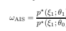

可以证明，如果模型序列θ0, θ1*,...,θ*K 缓慢演变，其中θ0 = 0 和θK = θ，那么通过退火重要性采样程序获得的重要性权重是模型θ与基础速率模型的分区函数之间比率的估计。

在我们的例子中，ξ表示 DBM 的状态(*x, y, z*)，转移算子 T(*ξ, ξ*; θ)对应于方程 25.3 和 25.4 中定义的交替吉布斯采样器。参数序列{θ0*,...,θ*K}可以，例如，位于 0 和θ之间的直线上，即θk = αk · θK，其中α0 < ··· < αK。或者，参数序列可以是训练过程中观察到的那些。在这种情况下，在训练过程中保持参数的移动平均是必要的，因为学习噪声会在两个相邻参数之间产生不必要的大变动。

我们现在可以计算方程 25.10 中的两个分区函数比率为：

$${\frac{Z(\theta)}{Z(0)}}\approx\mathrm{E}[\omega_{\mathrm{AIS}}]\quad{\mathrm{and}}\quad{\frac{\Psi(\theta,x)}{\Psi(0,x)}}\approx\mathrm{E}[\nu_{\mathrm{AIS}}(x)]$$

其中ωAIS 是由自由运行的吉布斯采样器和νAIS 通过将输入单位钳制到数据点所得到的退火过程中产生的重要性权重。将方程 25.11 和 25.12 代入方程 25.10，我们得到：

$$(25.12)$$

$$p(x;\theta)\approx{\frac{\operatorname{E}[\nu_{\mathrm{AIS}}(x)]}{\operatorname{E}[\omega_{\mathrm{AIS}}]}}\cdot{\frac{1}{2^{M_{x}}}}$$

因此，模型的对数似然被估计为：

$${\rm E}_{X}[\log(p(x;\theta))]\approx{\rm E}_{X}[\log{\rm E}[\nu_{\rm AIS}(x)]]-\log{\rm E}[\omega_{\rm AIS}]-M_{x}\log(2).\tag{25.13}$$

通常，对于每个数据点 x 计算重要性权重νAIS 的平均值可能需要很长时间。在实践中，我们可以通过对每个数据点进行单次 AIS 运行来近似它。在这种情况下，由于詹森不等式的结果：

$${\rm E}_{X}[\log\nu_{\rm AIS}(x)]-\log{\rm E}[\omega_{\rm AIS}]\leq{\rm E}_{X}[\log{\rm E}[\nu_{\rm AIS}(x)]]-\log{\rm E}[\omega_{\rm AIS}].\tag{25.14}$$

因此，这种近似往往会产生稍微悲观的模型对数似然估计，但由于将可见单位钳制到数据点减少了 AIS 运行的多样性，因此νAIS 的方差相对于ωAIS 的方差较低。

## 25.5 实验

在本节中，我们展示了一些实验，证明了中心化技巧在学习深度玻尔兹曼机中的有效性。我们使用 MNIST 数据集。

手写数字识别数据集包含 60000 个训练样本和 10000 个测试样本。每个样本是一个 28 × 28 的灰度图像，表示一个手写数字及其标签。灰度值（介于 0 和 1 之间）被视为概率。

结构：我们考虑一个由 28 × 28 输入单元、200 个中间单元和 25 个顶层单元组成的深度玻尔兹曼机(DBM)，以及一个由 28×28 输入单元、400 个连接到 6 × 6 随机输入块的中间单元和 100 个顶层单元组成的局部连接 DBM(LC-DBM)。这些结构在图 25.7（左）中进行了说明。在 DBM 中，建模负担集中在第一层，而顶层仅用于建模全球数字特征。

另一方面，在 LC-DBM 中，大部分建模负担被推迟到第二层，而第一层基本上作为低级局部预处理器。可见单元的初始偏移量和偏差设置为α = xdata，a0 = sigm−1(α)。我们考虑不同的初始偏差(b0, c0 = −2, b0, c0 = 0 和 b0, c0 = 2)及偏移量(*β, γ* = sigm(−2), *β, γ* = sigm(0) 和 *β, γ* = sigm(2))。

对于隐藏单元，这些偏移量和初始偏差对应于图 25.4 中绘制的 sigmoid 曲线。

学习：我们使用持久对比散度[19]来训练网络，并在学习过程中跟踪 25 个自由粒子。我们使用吉布斯采样器收集*数据无关*和*数据依赖*的统计信息。在学习过程的每次迭代中，我们进行 3 次交替吉布斯采样器迭代以收集数据依赖统计（来自 25 个数据点的迷你批量），以及一次迭代以更新数据无关统计。我们对每一层使用学习率η = 0.0004。

评估：以在线方式评估 DBM 需要在训练过程中跟踪模型参数。我们通过维护观察到的参数序列的移动平均值来减少学习噪声。移动平均值被调整为记住大约 10%的训练历史。我们跟踪 500 个依赖数据的链，这些链在平滑的参数序列上运行，从中估计顶层统计量 k(z,z)和比例Ψ(θ, x)/Ψ(0, x)。我们还跟踪 100 个与数据无关的链，这些链在相同的参数序列上运行，从中估计比例 Z(θ)/Z(0)。判别性能通过标签在核主成分上的投影残差和误差曲线下的面积来衡量。

（见方程 25.9）使用指数 RBF 核，σ设置为 z 和 z 之间成对距离的平均值。生成性能通过数据对数似然度衡量（见方程 25.13）。结果：图 25.7 总结了我们的分析结果，并证实了居中对于获得更好的数据区分性和生成模型的重要性。居中 DBM 系统性地产生更好的顶层 AUC 误差，并且具有更高的对数似然度。改善生成模型的居中重要性在局部连接 DBM 中尤为明显。

（LC-DBM），其中顶层对于建模长程依赖性至关重要。

这些结果表明，当处理仅在网络深层处理全局统计的分层架构时，居中技巧特别有用。图 25.8（左）显示，居中 DBM 产生的核在其主要成分中包含大部分标签信息，并且其余成分的噪声水平较低。这对应于图 25.6 的场景 1。另一方面，在非居中 DBM 的情况下，标签跨越核的一些主要成分，但其余成分具有较高的噪声水平。这对应于图 25.6 的场景 2。相比之下，简单的输入层 RBF 核表现出高维度和低噪声，因此对应于图 25.6 的场景 3。通过查看第二层滤波器，进一步确认了居中对于生成良好顶层核的重要性，如图 25.8（右）所示。

图 25.7。训练过程中 AUC 误差和对数似然度的演变。“Centered+”表示在训练过程中持续居中的深度玻尔兹曼机。在 DBM 中，合理的生成性能可以在不居中的情况下实现，因为顶层被模型的其他部分简单忽略。在 LC-DBM 中，

居中对于生成和区分性能都很重要，因为顶层对于建模长程依赖性是必要的。持续居中可获得最稳健的性能。

居中 DBM。左：居中 DBM 和非居中 DBM 产生的误差残差。右：2D-PCA（线性核）和第二层滤波器。结果表明，居中 DBM 的顶层表示比非居中 DBM 更丰富。

线性反投影，并观察到对于居中 DBM 来说，它们比非居中 DBM 要丰富得多。

## 25.6 结论

学习深度玻尔兹曼机是一个困难的优化问题，对其能量函数的参数化非常敏感。在本章中，我们提出了*中心化技巧*，即将能量重写为中心状态的函数。中心化技巧提高了深度玻尔兹曼机的稳定性，并使我们能够学习同时具有有利的判别和生成特性的模型。

我们的实验在中规模模型（大约几百个隐藏单元）上取得了最成功的结果。深度玻尔兹曼机的高表示能力使得我们难以将实验扩展到更大规模的模型。

（数千个单元）而不使用显式正则化器，如层级预训练或有限连接。我们认为，将中心化技巧应用于大规模模型应与强正则化器结合使用，以限制模型的有效维度。

致谢。作者感谢 Mikio Braun 和多位审稿人提出的有用意见。本研究得到了韩国教育部、科学技术部资助的国家研究基金会通过世界一流大学项目的支持，资助号 R31-10008。作者还感谢 DFG（MU 987/17-1）的部分支持。

[1] Arnold, L., Auger, A., Hansen, N., Ollivier, Y.：信息几何优化算法：通过不变性原理统一的视角，arXiv:1106.3708

（2011）

[2] Braun, M.L., Buhmann, J., Müller, K.-R.：核特征空间中的相关维度。《机器学习研究杂志》9，1875–1908（2008）

[3] Cho, K., Raiko, T., Ilin, A.：用于训练限制玻尔兹曼机的增强梯度和自适应学习率。在：第 28 届国际机器学习会议论文集，页 105–112（2011）

[4] Hinton, G.E.：通过最小化对比散度训练专家的产品。

神经计算 14(8)，1771–1800（2002）

[5] Hinton, G.E.：训练限制玻尔兹曼机的实用指南。在：

Montavon, G., Orr, G.B., Müller, K.-R.（编）《神经网络：行业技巧》，第 2 版。LNCS，第 7700 卷，页 599–619。斯普林格，海德堡（2012）

[6] Hinton, G.E., Sejnowski, T.J.：在玻尔兹曼机中学习与重学习。在：

并行分布式处理：认知微观结构的探索，第 1 卷，页 282–317。MIT 出版社（1986）

[7] LeCun, Y., Bottou, L., Orr, G.B., Müller, K.-R.：高效的反向传播。在：Orr, G.B., Müller, K.-R.（编）《NIPS-WS 1996》。LNCS，第 1524 卷，页 9–50。斯普林格，海德堡（1998）

[8] Montavon, G., Braun, M.L., Müller, K.-R.：深度网络的核分析。

《机器学习研究杂志》12，2563–2581（2011）

[9] Montavon, G., Braun, M.L., Müller, K.-R.：作为前馈层次的深度玻尔兹曼机。《机器学习研究杂志 - 会议记录》22，789–804（2012）

[10] Neal, R.M.：退火重要性采样。统计与计算 11(2)，125–

139（2001 年）

[11] Pearlmutter, B.A.: 快速精确的海森矩阵乘法。神经计算 6(1)，147–160（1994 年）

[12] Salakhutdinov, R., Hinton, G.E.: 深度玻尔兹曼机。载于：人工智能与统计国际会议论文集，第 5 卷，第 448–455 页（2009 年）

[13] Salakhutdinov, R.: 玻尔兹曼机的学习与评估。技术报告 UTML TR 2008-002， 多伦多大学计算机科学系

（2008 年）

[14] Salakhutdinov, R., Murray, I.: 深度信念网络的定量分析。

载于：第 25 届国际机器学习大会论文集，ICML 2008，第 872–879 页（2008 年）

[15] Schölkopf, B., Smola, A., Müller, K.-R.: 非线性成分分析作为核特征值问题。神经计算 10(5)，1299–1319（1998 年）

[16] Schölkopf, B., Mika, S., Burges, C.J.C., Knirsch, P., Müller, K.-R., Rätsch, G.,

Smola, A.J.: 核方法中的输入空间与特征空间。IEEE 神经网络汇刊 10(5)，1000–1017（1999 年）

[17] Schraudolph, N.N.: 中心化神经网络梯度因子。载于：Orr, G.B.,

Müller, K.-R. (编辑) NIPS-WS 1996。LNCS，第 1524 卷，第 207–226 页。施普林格，海德堡（1998 年）

[18] Tang, Y., Sutskever, I.: 在限制玻尔兹曼机学习中的数据归一化。技术报告 UTML-TR-11-2，多伦多大学计算机科学系（2011 年）

[19] Tieleman, T.: 使用似然梯度近似训练限制玻尔兹曼机。载于：第 25 届国际机器学习大会论文集，第 1064–1071 页（2008 年）

# 26 深度学习通过半监督嵌入

Jason Weston1, Frédéric Ratle2, Hossein Mobahi3, 和 Ronan Collobert4，1 谷歌，美国纽约

jweston@google.com 2 Nuance Communications, Montreal, Canada frederic.ratle@gmail.com 3 伊利诺伊大学厄本那-香槟分校计算机科学系，美国

hmobahi2@illinois.edu 4 IDIAP 研究所，马尔蒂尼，瑞士 ronan@collobert.com 摘要。我们展示了非线性半监督嵌入算法如何轻松应用于深层多层架构，无论是作为输出层的正则化器，还是应用于每一层架构。

与标准监督反向传播相比，这可以带来显著的收益。这个技巧为现有的半监督深度学习方法提供了简单的替代方案，同时在错误率方面与这些方法及现有的浅层半监督技术相竞争。

## 26.1 引言

在本章中，我们描述了一种通过利用未标记*示例对*来改善神经网络泛化能力的技巧。半监督学习[7]的目标是利用未标记数据来提高监督任务的泛化能力。他们使用的技巧之一是将数据嵌入到低维空间（或相关的聚类任务），这些都是已经被深入研究的无监督降维技术。例如，研究者们使用非线性嵌入或聚类表示作为监督分类器的特征，取得了更好的结果。许多提出的架构是*不相交*且*浅层*的，这意味着无监督降维算法在未标记数据上单独训练作为第一步，然后将其结果输入具有浅层架构的监督分类器，例如（核化的）。

线性模型。例如，几种方法首先基于非线性流形嵌入学习聚类或距离度量[8, 9]。传导

- 本章的大部分工作是在杰森·韦斯顿和罗南·科洛贝特在美国普林斯顿的 NEC 实验室工作期间完成的，同时弗雷德里克·拉特尔在瑞士洛桑大学任职。有关此主题的会议论文请参见[28]和[18]。

G. Montavon 等（编）：NN: 实用技巧，第二版，LNCS 7700，第 639–655 页，2012 年。

-c 斯普林格-弗拉克 柏林 海德堡 2012 年

支持向量机（TSVMs）[26]（使用某种聚类）和 LapSVM [2]（使用某种嵌入）是同时使用未标记数据和标记数据的*联合*方法示例，尽管它们的架构较为浅层。在本研究中，我们使用与那些研究者相同的嵌入技巧，但将其应用于（深度）神经网络。

深度架构似乎是处理涉及多个子任务的困难 AI 任务的自然选择，这些子任务可以编码到架构的层中。如几位研究者所论述的[14, 3]，在这种情况下，半监督学习也是自然而然的，因为否则可能永远没有足够的数据来表现良好。这既是由于标签数据的匮乏，也是由于训练架构的困难。其次，直观上认为在标记和未标记数据上*联合*训练应该有助于指导未标记数据在标记任务中的最佳使用，相较于两阶段不相交的方法。（然而，据我们所知，后者并没有系统证据，并且可能有理由进行不相交的训练，例如，标签预测往往比嵌入更快过拟合，因为你拥有更少的数据去拟合。先进行无监督预训练，再进行监督微调，可能自然地解决这个问题。另一方面，正是因为问题是非凸的，两阶段方法才会起作用——第一阶段的所有学习可能会被“遗忘”。）

最近，几位作者提出了在基于深度神经网络的架构中使用未标记数据的方法。这些方法要么仅使用未标记数据进行贪婪的逐层预训练，然后进行监督的微调（这可以与之前描述的半监督学习的*不相交*浅层技术进行比较），要么在多个层次上与监督信号共同学习无监督编码。仅考虑后者，我们倡导的基本设置很简单：

1. 选择一个无监督学习算法。2. 选择一个具有深度架构的模型。

3. 无监督学习作为*辅助任务*被嵌入到架构的任何（或所有）层中。

4. 同时使用相同架构训练监督和无监督任务（采用联合目标函数）。

其目的是无监督方法将提高当前任务的准确性。

在本章中，我们提倡通过利用*浅层*架构中开发的半监督算法的现有思想，采用一种简单的深度学习方法。特别是，我们专注于将*嵌入*基础的正则化项与监督学习者结合以执行半监督学习的思想，如在拉普拉斯 SVM [2] 中使用的那样。我们展示了该方法可以：(i)推广到多层网络，并通过随机梯度下降进行训练；(ii) 在上述深度学习框架中有效。从实验上看，我们也表明它似乎表现相当好。我们预计这归因于几个因素：首先，额外的嵌入目标既作为依赖于数据的正则化项，也作为与关注的监督任务良好相关的弱监督任务。最后，在网络的多个层中添加这个训练目标有助于训练所有层，而不仅仅是像监督学习那样从最后一层反向传播。

尽管本章的核心集中在联合设置中的特定算法（嵌入），但我们预计该方法在非联合设置中也有效，并且适用于其他无监督算法，例如，传导 SVM 的方法也已推广到深度学习的案例 [15]。

## 26.2 半监督嵌入

我们的方法将现有的半监督嵌入技术适应于神经网络的浅层方法。因此，在描述该方法之前，让我们首先回顾现有的半监督方法。许多半监督算法中的一个关键假设是结构假设 1：同一结构（如簇或流形）中的点可能具有相同的标签。基于这个假设，目标是利用未标记数据揭示这一结构。为了实现这一点，许多算法，如聚类核 [8]、LDS [9]、标签传播 [30] 和 LapSVM [2]等，使用与无监督嵌入算法直接相关的正则化项。为了理解这些方法，我们将首先回顾一些与线性和非线性嵌入相关的方法。

## 26.2.1 嵌入算法

我们将专注于一类相当通用的嵌入算法，这些算法可以通过以下类型的优化问题来描述：给定数据 x1*,...,x*U

通过最小化找到每个点 xi 的嵌入 f(xi)

$$\sum_{i,j=1}^{U}L(f(x_{i},\alpha),f(x_{j},\alpha),W_{i j})$$

关于学习参数α，受平衡约束的限制。

这种类型的优化问题具有以下主要成分：

- f(x) ∈ Rn 是为给定示例 x ∈ Rd 尝试学习的嵌入。它由α参数化。在许多技术中，f(xi) = fi 是一个查找表，每个示例 i 被分配一个独立的向量 fi。

- L 是示例对之间的损失函数。

- 权重矩阵 W 的 Wij 指定了示例 xi 和 xj 之间的相似性或不相似性。这是提前提供的，作为损失函数的一种标签。

- 对于某些目标函数，通常需要平衡约束，以避免达到平凡解。

1 这通常被称为聚类假设或流形假设 [7]。

对于这种机器学习设置，通常可以指定模型类型（函数族）和损失，以获得不同的算法变体。许多知名方法适合这个框架，我们在下面描述一些相关的方法。

多维标度法 (MDS) [16] 是一种经典算法，试图保持点之间的距离，同时将它们嵌入到较低维空间，例如，使用损失函数。

$$L(f_{i},f_{j},W_{i j})=(||f_{i}-f_{j}||-W_{i j})^{2}$$

如果度量是欧几里得的，那么 MDS 等价于 PCA [29]。

ISOMAP [25] 是一种非线性嵌入技术，试图捕捉原始数据中的流形结构。它通过定义一个相似性度量来工作，该度量测量流形上的距离，例如，Wij 是通过邻域图上的最短路径定义的。然后使用这些距离通过传统的 MDS 嵌入。

拉普拉斯特征映射 [1] 通过强调 *局部距离* 的保持来学习流形结构。通过在拉普拉斯 L˜ = W − D 中编码它们来定义示例之间的距离度量，其中 Dii = j Wij 是对角的。

然后，使用以下优化：

$$\sum_{i j}L(f_{i},f_{j},W_{i j})=\sum_{i j}W_{i j}||f_{i}-f_{j}||^{2}=f^{\top}\tilde{L}f$$

受平衡约束的限制：

$$(26.1)$$

$$f^{\top}D f=I\ \ \mathrm{和}\ \ f^{\top}D1=0.$$

$$(26.2)$$

f Df = I 和 f D1=0. (26.2)

孪生网络 [4] 也是一种经典的非线性嵌入方法。神经网络研究者将此类模型视为具有两个相同函数的网络，使用相同的权重，输入到一个“距离测量”层，以计算两个示例是否相似，前提是有标记数据。实际上，这与本节开头给出的公式完全相同。

已经提出了几种用于 *孪生网络* 的损失函数，这里我们描述了 [13] 作者提出的基于边际的损失。

$$L(f_{i},f_{j},W_{ij})=\begin{cases}||f_{i}-f_{j}||_{2}&\text{如果$W_{ij}=1$,}\\ \max(0,m-||f_{i}-f_{j}||_{2})^{2}&\text{如果$W_{ij}=0$}\end{cases}\tag{26.3}$$

这鼓励相似的示例靠近，而不相似的示例之间的距离至少为 m。注意，这种损失的选择不需要平衡约束，因为边际约束抑制了平凡解。与使用（26.2）这样的约束相比，这种方法更容易通过梯度下降优化。

## 26.2.2 半监督算法

提出了几种*半监督*分类算法，利用了上一节描述的算法。在这里，我们假设设置为给定 M +U 示例 xi，但只有前 M 个具有已知标签 yi。

标签传播 [30] 在最近邻分类器中添加了拉普拉斯特征映射类型的正则化：

$$\operatorname*{min}_{f}\sum_{i=1}^{M}||f_{i}-y_{i}||^{2}+\lambda\sum_{i,j=1}^{M+U}W_{i j}||f_{i}-f_{j}||^{2}$$

$$(26.4)$$

该算法试图给两个具有大权重边 Wij 的示例相同的标签。邻居的邻居往往也会由于传递性而获得相同的标签，因此得名*标签传播*。

LapSVM [2] 使用拉普拉斯特征映射类型的正则化器与 SVM：

$$\min_{w,b}\ ||w||^{2}+\gamma\sum_{i=1}^{M}H(y_{i}f(x_{i}))+\lambda\sum_{i,j=1}^{M+U}W_{ij}||f(x_{i})-f(x_{j})||^{2}\tag{26.5}$$

其中 H(x) = max(0, 1 − x) 是铰链损失，最终分类器将是 f(x) = w · x + b。

其他方法在 [9] 中建议了一种称为*图*的方法，它结合了修改版的 ISOMAP 和 SVM。作者还建议将修改的 ISOMAP 与 TSVM 而不是 SVM 结合，称之为*低密度*分离 (LDS)。

## 26.3 深度学习的半监督嵌入

我们希望在*深度*学习中使用半监督学习中开发的思想。深度学习由几个非线性映射层的模型学习组成。在本章中，我们将考虑具有 N 层的多层网络。

隐藏单元的层生成一个 C 维输出向量：

$$f_{i}(x)=\sum_{j=1}^{d}w_{j}^{O,i}\ h_{j}^{N}(x)+b^{O,i},\ \ i=1,\ldots,C$$

其中 wO 是输出层的权重，通常第 k 层定义为

$$h_{i}^{k}(x)=S\,\left(\sum_{j}w_{j}^{k,i}\;h_{j}^{k-1}(x)+b^{k,i}\;\right)\!,\;k>1$$

$$(26.6)$$

$$(26.7)$$

$$h_{i}^{1}(x)=S\,\left(\,\sum_{j}w_{j}^{1,i}\ x_{j}+b^{1,i}\ \right)$$

$$(26.8)$$

j xj + b1,i $(26.8)

S 是一个非线性压缩函数，例如 tanh。这里，我们描述一个标准的*全连接*多层网络，但对于特定问题的先验知识可能会引导出其他网络设计。例如，在序列和图像识别中，时间延迟和卷积网络（TDNN 和 CNN）[17] 非常成功。在这些方法中，引入了在输入上应用卷积的层，这些卷积考虑了数据中的局部信息，即它们从图像补丁或序列中的窗口学习特征。

我们提出的*通过半监督嵌入进行深度学习*的一般方法是在深度架构中以三种不同模式之一添加半监督正则化，如图 26.1 所示：

(a) 在整个网络输出上添加一个半监督损失（正则化项）到监督损失中（26.6）：

$$\sum_{i=1}^{M}\ell(f(x_{i}),y_{i})+\lambda\sum_{i,j=1}^{M+U}L(f(x_{i}),f(x_{j}),W_{ij})\tag{26.9}$$

这与之前描述的 *浅层* 技术最为相似，例如方程 (26.5)。

(b) 直接对第 k 个隐藏层进行正则化 (26.7)：

$$\sum_{i=1}^{M}\ell(f(x_{i}),y_{i})+\lambda\sum_{i,j=1}^{M+U}L(f^{k}(x_{i}),f^{k}(x_{j}),W_{ij})\tag{26.10}$$

其中 f k(x)=(hk1(x)*,...,h*kHUk (x)) 是网络到第 k 个隐藏层的输出（HUk 是第 k 层的隐藏单元数）。

(c) 创建一个辅助网络，它共享原始网络的前 k 层，但有一组新的最终权重：

$$g_{i}(x)=\sum_{j}w_{j}^{AUX,i}\ h_{j}^{k}(x)+b^{AUX,i}\tag{26.11}$$

我们训练这个网络以同时 *嵌入* 未标记数据，同时训练原始网络以处理 *标记* 数据。

可以使用损失函数 (26.3) 进行嵌入，以及铰链损失

$$\ell(f(x),y)=\sum_{c=1}^{C}H(y(c)f_{c}(x)),$$

对于标记示例，如果 y(c)=1 则 y = c，否则为 -1。对于邻近点，这与 LapSVM 和拉普拉斯特征映射中使用的正则化器相同。

图 26.1. 深度架构中的三种嵌入模式

## 算法 26.1 Embednn

输入：标记数据 (xi, yi)，i = 1*,...,M*，未标记数据 xi，i = M+1*,...,U*，

函数集 f(·) 和嵌入函数 gk(·)，参见图 26.1 以及方程 (26.9)、(26.10) 和 (26.11)。

重复选择一个随机的 *标记* 示例 (xi, yi)，进行一次梯度步进以优化 (f(xi), yi)

对于每个嵌入函数 gk(·)，随机选择一对邻居 xi, xj。

对 λL(gk(xi), gk(xj ), 1) 进行一次梯度步进。

随机选择一个未标记的示例 xn。

对 λL(gk(xi), gk(xn), 0) 进行一次梯度步进。

直到满足停止标准为止结束。

对于非邻居，当 Wij = 0 时，该损失“拉开”点，因此抑制了平凡解，而不需要如 (26.2) 所示的困难约束。为了实现 *没有* 标记数据的嵌入，后者是必要的，否则所有示例将在嵌入空间中塌缩到一个单一的点。因此，这种正则化器比单独使用 (26.1) 更可取。整体方法的伪代码见算法 26.1。

一些需要考虑的可能技巧包括：

- 超参数 λ：在我们的大多数实验中，我们简单地将其设置为 λ = 1，并且由于算法 26.1 中的交替更新，这样做效果良好。不过需要注意的是，如果使用多个嵌入损失函数，它们会主导目标函数。

- 我们注意到，在优化结束时，降低正则化器的学习率可能比降低最小化训练误差的项的学习率更有利，这样可以确保在无噪声任务上训练误差尽可能低（不过我们在实验中并没有尝试这一点）。

- 如果你在网络的第一层使用内部嵌入，这个嵌入问题很可能比后面的层的内部嵌入更复杂，因此你可能不希望给它们相同的学习率或边际，但这会使超参数选择变得复杂。一个替代思路是在早期层上使用辅助层，甚至通过两个辅助层，而不是一个，以简化嵌入任务。辅助层在测试时会被丢弃。

- 在最后输出层上进行嵌入可能并不总是一个好主意，这取决于网络的类型。例如，如果你使用的是 softmax 最后一层，则 2 范数类型的嵌入损失可能不适用于最后一层的对数概率表示。在这种情况下，我们建议在倒数第二层进行嵌入。

- 最后，尽管我们没有尝试，但以不相交的方式进行训练，即先进行嵌入训练，然后继续仅用标记数据进行微调步骤，可能会简化上述的超参数选择。

## 26.3.1 将未标记数据标记为邻居（构建图）

在线使用随机梯度下降训练神经网络速度快，并且可以扩展到数百万个示例。描述的方法可能的瓶颈是矩阵 W 的计算，即计算哪些未标记的示例是邻居并且具有值 Wij = 1。嵌入算法通常使用 k 近邻来完成此任务。确实存在许多快速计算的方法，例如哈希和基于树的方法。

然而，还有许多其他收集邻近未标记数据的方法，并不涉及计算 k-nn。例如，如果可以访问未标记的序列数据，可以使用以下技巧：

- 对于图像任务，可以利用未标记视频的时间一致性：两个连续帧很可能包含相似的内容并代表相同的概念类别。视频中的每个对象也很可能经历小的变换，如平移、旋转或在相邻帧上的形变。因此，使用这点与半监督嵌入结合，能够学习对这些变化不变的类别。例如，可以将来自两个连续（或相近）视频帧的图像作为邻居对，Wij = 1。这类对很可能具有相同的标签，并且收集成本较低。相距较远的帧则分配 Wij = 0。

- 对于文本任务，可以使用文档收集无监督对。例如，可以将文档的句子（或段落）视为包含语义相似信息的邻居（它们可能关于相同的主题）。

- 类似地，对于语音任务，也可能以相同的方式使用音频流。

## 26.3.2 我们预计这种方法何时有效？

可以将所描述的方法视为使用无监督辅助任务的多任务学习实例[6]。与其他半监督学习方法以及其他深度学习方法相似，考虑到构建未标记对的 k-nn 类型的方法，只有当 p(x)对监督任务 p(y|x)有用时，我们才期望其有效，即结构假设成立。也就是说，如果决策规则位于相对于所选择的 k 近邻距离度量的低密度区域内。我们相信许多自然任务具有这种特性。

然而，如果图是使用上一节描述的序列数据构建的，那么该方法就可能完全不依赖于低密度假设。为了解释这一点，考虑均匀的二维数据，其中如果类标签在 y 轴之上则为正，若在之下则为负。最近邻图对类标签没有提供任何信息，或者等价地，TSVMs 没有优化的边际。然而，如果序列数据（类似于视频）在连续帧中只有相同类标签的数据点，则这将携带信息。此外，与构建邻居图相比，收集视频数据以计算嵌入损失没有计算成本。最后，注意在高维空间中，最近邻也可能表现不佳，例如在图像的像素空间中。

## 26.3.3 为什么这种方法好？

有多个理由说明与竞争方法相比，深度半监督嵌入技巧可能是有用的：

- 深度嵌入非常容易通过梯度下降进行优化，因为它具有非常简单的损失函数。这意味着它可以廉价而高效地应用于任何类型的神经网络架构。除了普遍适用外，它的实现也相对简单。

- 与基于重建的损失函数（例如在自编码器中使用的）相比，我们的方法在进行梯度更新时可以节省很多成本。在我们的方法中有一个编码步骤，但没有解码步骤。也就是说，损失是在通常相对低维的嵌入空间中测量的。对于高维输入数据（即使数据稀疏），例如文本数据，重建可能非常缓慢，例如，一个包含数万单词的词典的词袋表示。此外，在卷积池化网络架构中，重建原始数据可能很困难，因此编码器-解码器系统可能很难实现，但我们的方法只需要一个编码器。

- 我们的方法并不一定需要大多数其他方法依赖的所谓低密度假设。许多方法仅在该假设成立时对数据有效（通常我们事先并不知道这一点）。我们的办法可能仍然有效，这取决于对数据对的收集方式。这个观点在上一小节中进行了详细阐述。

表 26.1. 我们实验中使用的数据集。前三个是小规模数据集，使用的实验设置与文献[9, 24, 10]中的相同。接下来的六个数据集是大规模的。Mnist 1h、6h、1k、3k 和 60k 变种是带有标签数据子集的 MNIST，遵循文献[10]中的实验设置。SRL 是一个语义角色标注任务[20]，有一百万个标记的训练样本和 6.31 亿个未标记样本。COIL100 是一个目标检测数据集[19]。

| 数据集                | 类别            | 维度 点数 标签       |      |       |
| --- | --- | --- | --- | --- |
| g50c                  | 2                | 50                    | 500  | 50    |
| Text                  | 2                | 7511                  | 1946 | 50    |
| Uspst                 | 10               | 256                   | 2007 | 50    |
| Mnist1h               | 10               | 784                   | 70k  | 100   |
| Mnist6h               | 10               | 784                   | 70k  | 600   |
| Mnist1k               | 10               | 784                   | 70k  | 1000  |
| Mnist3k               | 10               | 784                   | 70k  | 3000  |
| Mnist60k              | 10               | 784                   | 70k  | 60000 |
| SRL                   | 16               | -                     | 631M | 1M    |
| COIL100 (30 个对象)    | 30 72x72 像素  | 7200                  | 120  |       |
| COIL100 (100 个对象) | 100 72x72 像素 | 7200                  | 400  |       |

## 26.4 实验评估

我们在表 26.1 中总结的多个数据集上测试半监督嵌入方法。

## 26.4.1 小规模实验

g50c、Text 和 Uspst 是常用于半监督学习实验的小规模数据集[9, 24, 10]。我们遵循相同的实验设置，平均十个分割中 50 个标记样本的结果，其余数据为未标记。在这些实验中，我们测试了嵌入正则化器在神经网络输出上的效果（见方程(26.9)和图 26.1(a)）。我们定义了一个具有 hu 个隐藏单元的两层神经网络（NN）。我们定义 W，使得 i 的 10 个最近邻有 Wij = 1，其他为 Wij = 0。我们进行了 50 轮随机梯度下降训练，并固定λ = 1，但前 5 轮仅优化监督目标（不使用嵌入正则化器）。这给出了两个自由超参数：隐藏单元数量 hu = {0, 5, 10, 20, 30, 40, 50}和学习率 lr = {0.1, 0.05, 0.01, 0.005, 0.001, 0.0005, 0.0001}。

我们报告了这些值的最佳选择，这些值通过 5 折交叉验证和在测试集上优化而得，如表 26.2 所示。注意数据集非常小，因此交叉验证不可靠。文献中的一些方法使用测试集优化它们的超参数（未标记为(cv)的那些）。我们的 *Embed*NN 在基于 SVM 的最先进的半监督方法中具有竞争力，甚至在某些情况下超越了它们。

表 26.2 小规模数据集的结果。我们报告了我们的方法 *Embed*NN 的最佳测试错误，以及通过交叉验证优化参数时的错误 *Embed*NN(cv)。LDS(cv) 和 LapSVM(cv) 也使用了交叉验证。

|                         | g50c   | Text Uspst   |       |
| --- | --- | --- | --- |
| SVM                     | 8.32   | 18.86        | 23.18 |
| TSVM                    | 5.80   | 5.71         | 17.61 |
| LapSVM(cv)              | 5.4    | 10.4         | 12.7  |
| LDS(cv)                 | 5.4    | 5.1          | 15.8  |
| 标签传播 17.30 |        | 11.71        | 21.30 |
| Graph SVM               | 8.32   | 10.48        | 16.92 |
| NN                      | 10.62  | 15.74        | 25.13 |
| EmbedNN                 | 5.66   | 5.82         | 15.49 |
| EmbedNN(cv)             | 6.78   | 6.19         | 15.84 |
| Mnst1h Mnst6h Mnst1k Mnst3k   |       |       |       |      |
| --- | --- | --- | --- | --- |
| SVM                           | 23.44 | 8.85  | 7.77  | 4.21 |
| TSVM                          | 16.81 | 6.16  | 5.38  | 3.45 |
| RBM(∗)                        | 21.5  | -     | 8.8   | -    |
| SESM(∗)                       | 20.6  | -     | 9.6   | -    |
| DBN-NCA(∗)                    | -     | 10.0  | -     | 3.8  |
| DBN-rNCA(∗) -                 | 8.7   | -     | 3.3   |      |
| NN                            | 25.81 | 11.44 | 10.70 | 6.04 |
| EmbedONN                      | 17.05 | 5.97  | 5.73  | 3.59 |
| EmbedI1NN                     | 16.86 | 9.44  | 8.52  | 6.02 |
| EmbedA1NN                     | 17.17 | 7.56  | 7.89  | 4.93 |
| CNN                           | 22.98 | 7.68  | 6.45  | 3.35 |
| EmbedOCNN                     | 11.73 | 3.42  | 3.34  | 2.28 |
| EmbedI5CNN                    | 7.75  | 3.82  | 2.73  | 1.83 |
| EmbedA5CNN 7.87               | 3.82  | 2.76  | 2.07  |      |
| 2          | 4    | 6    | 8    | 10   | 15   |      |
| --- | --- | --- | --- | --- | --- | --- |
| NN         | 26.0 | 26.1 | 27.2 | 28.3 | 34.2 | 47.7 |
| EmbedONN   | 19.7 | 15.1 | 15.1 | 15.0 | 13.7 | 11.8 |
| EmbedALLNN | 18.2 | 12.6 | 7.9  | 8.5  | 6.3  | 9.3  |

表 26.3。使用 100、600、1000 和 3000 个标签在 MNIST 上的结果。将一个两层神经网络（NN）与带嵌入正则化的 NN（*Embed*NN）进行比较，后者在输出（O）、第 i 层（Ii）或来自第 i 层的辅助嵌入（Ai）（见图 26.1）上。卷积网络（CNN）也以相同方式进行了测试。我们与 SVM 和 TSVM 进行了比较。RBM、SESM、DBN-NCA 和 DBN-rNCA（标记为

（∗）取自[21, 23]，在不同的数据划分上训练。

表 26.4。使用 2、6、8、10 和 15 层深度网络的 Mnist1h 数据集；每个隐藏层有 50 个隐藏单元。我们将经典的 NN 训练与*Embed*NN 进行比较。

在这里，我们要么在输出层（O）学习一个嵌入，要么同时在所有层学习一个辅助嵌入（ALL）。

| 2            | 4   | 6   | 8   | 10   | 15   |     |
| --- | --- | --- | --- | --- | --- | --- |
| NN (HUs=50)  | 2.9 | 2.6 | 2.8 | 3.1  | 3.1  | 4.2 |
| EmbedALLNN   | 2.8 | 1.9 | 2.0 | 2.2  | 2.4  | 2.6 |
| NN (HUs=100) | 2.0 | 1.9 | 2.0 | 2.2  | 2.3  | 3.0 |
| EmbedALLNN   | 1.9 | 1.5 | 1.6 | 1.7  | 1.8  | 2.4 |

表 26.5。使用 2、6、8、10 和 15 层深度网络的完整 Mnist60k 数据集，使用 50 或 100 个隐藏单元。我们将经典的 NN 训练与 EmbedALLNN 进行比较。

在这里，我们同时在所有层学习一个辅助嵌入。

## 26.4.2 Mnist 实验

我们在三种不同模式下（图 26.1）将我们的方法与传统的半监督学习（TSVM）进行了比较，使用与[10]中相同的数据划分和验证集。我们还与几种深度学习方法进行了比较：RBMs（限制玻尔兹曼机），SESM（稀疏编码对称机），

DBN-NCA 和 DBN-rNCA（深度信念网络-（正则化）邻域组件分析）。（注意，后者是在不同的数据划分上训练的）。在这些实验中，我们考虑了 2 层网络（NN）和 6 层卷积神经网络（CNN）进行嵌入。我们优化了 NN 的参数（hu = {50, 100, 150, 200, 400}隐藏单元和之前的学习率）

在验证集上。CNN 架构是固定的：5 层图像块类型卷积，后面跟着一个包含 50 个隐藏单元的线性层，类似于[17]。

表 26.3 中的结果显示了在所有三种模式下嵌入的有效性，包括 NN 和 CNN。

## 26.4.3 更深的 Mnist 实验

然后我们进行了类似的一组实验，但使用非常深的架构——最多 15 层，每个隐藏层有 50 个隐藏单元。使用 Mnist1h，我们首先比较传统的神经网络与 EmbedALLNN，其中我们在每一层学习一个辅助非线性嵌入（50 个隐藏单元和 10 维嵌入空间），以及*Embed*ONN，仅嵌入输出。

结果见表 26.4。当我们增加层数时，使用传统反向传播训练的 NN 会过拟合，并持续产生*更差*的测试误差（尽管它们能够轻松实现零训练误差）。相反，由于半监督的原因，EmbedALLNN 在深度增加时*改进*。

“正则化”。在网络的所有层上嵌入使得*深度学习*成为可能。*Embed*ONN（输出嵌入）也有帮助，但效果不如前者。

我们还使用完整的 MNIST 数据集 Mnist60k 进行了实验。

再次使用多达 15 层的深度网络，隐藏单元为 50 或 100 的 EmbedALLNN 优于标准 NN。结果见表 26.5。

尽管缺乏额外未标注数据的可用性，我们仍然观察到与半监督情况相同的效果，即 NN 随着容量的增加而过拟合，而 EmbedNN 则更加稳健（即使与最佳深度相比，它表现出一些过拟合，但远没有那么明显。）增加隐藏单元的数量可能进一步改善这些结果，例如在每层使用 4 层和 500 个隐藏单元时，使用 EmbedALLNN 可以获得 1.27%。总体而言，这些结果表明 EmbedNNALL 中的正则化在半监督学习以外的环境中也是有用的。

表 26.6。在没有先验知识的情况下，深度架构的语义角色标注优于结合词性和解析树知识的最先进系统 ASSERT 和 SENNA。通过学习一个辅助嵌入（*Embed*A1CNN），使用整个维基百科网站作为未标注数据，将单词表示为 100 维向量，卷积网络（CNN）得到了改进。

| 方法                             | 测试误差   |
| --- | --- |
| 断言 [20]                     | 16.54%       |
| SENNA [11]                      | 16.36%       |
| CNN [无先验知识]                | 18.40%       |
| EmbedA1CNN [无先验知识]        | 14.55%       |

## 26.4.4 语义角色标注

语义角色标注（SRL）的目标是，给定一个句子和一个感兴趣的关系，为每个单词标注 16 个标签中的一个，这些标签指示该单词在关系的动作中的语义角色。例如，句子*“猫在池塘里吃鱼”*的标注方式如下：

“TheARG0 catARG0 eatsREL theARG1 fishARG1 inARGM−LOC theARGM−LOC pondARGM−LOC”，其中 ARG0 和 ARG1 有效地指示了关系“吃”的主语和宾语，ARGM-LOC 指示一个位置修饰符。PropBank 数据集包含大约 100 万个来自《华尔街日报》的标注单词。我们遵循[11]的实验设置，并为此任务训练一个 5 层的卷积神经网络，第一层将输入句子的单词表示为 50 维向量。与[11]不同，我们没有向分类器提供任何先验知识。在那项工作中，单词通过词性进行词干提取和聚类。我们的分类器仅使用原始输入单词进行训练。

我们试图通过学习一个*辅助嵌入*任务来改进该系统。我们的嵌入是使用来自维基百科网站的未标记句子学习的，总共包含 6.31 亿个单词，采用第 26.3 节中描述的方案。与监督任务中相同的词向量查找表作为输入，围绕给定单词的 11 个单词窗口，生成 550 个特征。然后，线性层将这些特征投影到 100 维嵌入空间。维基百科中的所有文本窗口被视为邻居，而非邻居则通过用随机单词替换句子窗口中的中间单词来构造。我们的查找表索引最常用的 30,000 个单词，所有其他单词被分配索引 30,001。

表 26.6 中的结果表明，当学习辅助嵌入时，性能明显提升。ASSERT [20]是一个基于 SVM 解析器的系统，具有许多手动编码的特征，而 SENNA 是一个利用词性信息构建词向量的神经网络。相比之下，我们的系统是唯一的最先进的技术。表 26.7 显示在各种设置下 COIL100 的测试准确率。根据[27]使用了 30 和 100 个对象。使用视频的时间一致性进行半监督嵌入算法（*Embed* CNN），在一个 8 层 CNN 的倒数第二层中，选择各种视频，超越了一个标准的（否则相同的）8 层 CNN。

以及其他基准。（注意，使用 100 个对象时这是一个传递性方法，因为我们在训练期间将测试集用作未标记数据，而使用 30 个对象时则采用半监督方法。）

|                  | 方法     | 30 个对象    | 100 个对象    |
| --- | --- | --- | --- |
| Nearest Neighbor | 81.8     | 70.1         |               |
| SVM              | 84.9     | 74.6         |               |
| SpinGlass MRF    | 82.79    | 69.41        |               |
| Eigen Spline     | 84.6     | 77.0         |               |
| VTU              | 89.9     | 79.1         |               |
| Standard CNN     | 84.88    | 71.49        |               |
| Embed CNN        | 95.03    | 92.25        |               |

该方法不使用来自词性或解析树数据的特征的先验知识。虽然在[12]中详细探讨了该应用的神经网络技术，但那项工作中使用的是不同的半监督技术。

## 26.4.5 使用未标记视频的目标识别

最后，我们详细描述了一些使用未标记视频进行半监督嵌入的实验，这些实验的更多细节可以在[18]中找到。我们使用了 COIL100 图像数据集[19]，该数据集包含 100 个对象的彩色图片，每张图片为 72x72 像素。每个对象有 72 个不同的视图，即总共有 7200 张图像。这些图像是通过将对象放在转盘上并在每次转动 5 度时拍摄的。请注意，物体的旋转可以视为我们在半监督嵌入方法中使用的未标记视频。

我们实验的设置如下。首先，我们使用标准卷积神经网络（CNN），不利用任何时间信息来建立基线。我们使用了一个 8 层网络，由三组卷积层、下采样层、最终卷积层和一个完全连接层组成，以预测输出。

为了与其他关于 COIL100 研究中可用的设置进行可比性，我们选择了两种实验设置。这些是（i）在实验中考虑所有 100 个 COIL 对象，以及（ii）仅研究 100 个对象中的 30 个标记对象（用于训练和测试）。在任一情况下，每个对象使用 72 个视图中的 4 个视图（分别为 0、90、180 和 270 度）进行训练，其余 68 个视图用于测试。结果在表 26.7 中给出，与一些现有方法[22, 27, 5]进行比较。请注意，使用 100 个对象的任务比使用 30 个对象（类别）要困难。

为了在我们的 CNN 上使用半监督嵌入技巧处理视频，我们将 COIL100 视为旋转对象的连续未标记视频序列，每个对象有 72 个连续帧（在 72 帧后，连续视频切换对象）。我们在 8 层 CNN 的倒数第二层上执行嵌入，即在网络各层成功输出的表示上，在最终 softmax 之前。因此，100 个对象的结果中，测试集是未标记视频的一部分（所谓的“传导”设置）。在这里我们得到了 92.25%。

准确率（*嵌入* CNN）远高于我们训练的最佳替代方法（VTU）和标准 CNN。

一个自然的问题是，如果在训练期间没有访问测试数据，会发生什么，即设置是典型的半监督情况，而不是“传导”设置。为此，我们使用 30 个对象作为主要任务，即使用该集合中每个对象的 4 个视图进行训练，其余用于测试。其他 70 个对象仅被视为未标记视频序列（同样，每个对象的图像被放置在视频序列的连续帧中）。使用 30 个对象的 4 个视图（标记数据）和 70 个对象的 72 个视图（未标记视频序列）进行训练，在识别 30 个对象的 68 个视图时达到了 95.03%的准确率。这比标准 CNN 的表现高出约 10%。

## 26.5 结论

在本章中，我们展示了如何通过共同学习嵌入任务来改善深层架构的监督学习，使用未标记数据。

使用*浅层*架构的研究人员已经展示了两种利用嵌入改善泛化的方法：（i）将未标记数据作为*单独*的预处理步骤嵌入（即，第一层训练）；（ii）将嵌入用作正则化器（即，在输出层）。似乎类似的技术也可以用于多层神经网络，利用本章描述的技巧。

[1] Belkin, M., Niyogi, P.: 用于维度降低和数据表示的拉普拉斯特征图。神经计算 15(6), 1373–1396 (2003 年)

[2] Belkin, M., Niyogi, P., Sindhwani, V.: 流形正则化：从标记和未标记示例中学习的几何框架。《机器学习研究杂志》7, 2399–2434 (2006 年)

[3] Bengio, Y., Lamblin, P., Popovici, D., Larochelle, H.: 深度网络的贪婪分层训练。在：神经信息处理系统进展，NIPS

19 (2007 年)

[4] Bromley, J., Bentz, J.W., Bottou, L., Guyon, I., LeCun, Y., Moore, C., Sackinger, E., Shah, R.: 使用西米尔时间延迟神经网络进行签名验证。《国际模式识别与人工智能杂志》7(4) (1993 年 8 月)

[5] Caputo, B., Hornegger, J., Paulus, D., Niemann, H.: 用于三维物体识别的自旋玻璃马尔可夫随机场。技术报告 LME-TR-2002-01，因弗兰肯大学信息学院 (2002 年)

[6] Caruana, R.: 多任务学习。《机器学习》28(1), 41–75 (1997 年)

[7] Chapelle, O., Schölkopf, B., Zien, A.: 半监督学习。《自适应计算与机器学习》。麻省理工学院出版社，剑桥 (2006 年) [8] Chapelle, O., Weston, J., Schölkopf, B.: 半监督学习的聚类核。见：Becker, S., Thrun, S., Obermayer, K.（编），NIPS，第 15 卷，页 585–592。

麻省理工学院出版社，剑桥 (2003 年)

[9] Chapelle, O., Zien, A.: 通过低密度分离进行半监督分类。

在：人工智能与统计国际会议 (AISTATS),

第 57–64 页 (2005 年 1 月)

[10] Collobert, R., Sinz, F., Weston, J., Bottou, L.: 大规模转导 SVM。

《机器学习研究杂志》7, 1687–1712 (2006 年)

[11] Collobert, R., Weston, J.: 使用新型神经网络架构进行快速语义提取。在：计算语言学协会第 45 届年会论文集，第 25–32 页 (2007 年)

[12] Collobert, R., Weston, J., Bottou, L., Karlen, M., Kavukcuoglu, K., Kuksa, P.：

几乎从零开始的自然语言处理。《机器学习研究杂志》12, 2493–2537 (2011 年)

[13] Hadsell, R., Chopra, S., LeCun, Y.: 通过学习不变映射进行维度降低。在：计算机视觉与模式识别会议论文集

(CVPR 2006)。IEEE 出版社 (2006 年)

[14] Hinton, G.E., Osindero, S., Teh, Y.: 深度信念网络的快速学习算法。

神经计算 18(7)，1527–1554 (2006)

[15] Karlen, M., Weston, J., Erkan, A., Collobert, R.：大规模流形传导。收录于：第 25 届国际机器学习会议论文集，pp. 448–455。ACM (2008)

[16] Kruskal, J.B.：通过优化与非度量假设的拟合优度进行多维缩放。心理计量学 29(1)，1–27 (1964)

[17] LeCun, Y., Bottou, L., Bengio, Y., Haffner, P.：基于梯度的学习应用于文档识别。IEEE 86(11) 会议录 (1998)

[18] Mobahi, H., Collobert, R., Weston, J.：从视频中的时间一致性进行深度学习。收录于：第 26 届国际机器学习年会论文集，pp. 737–744。ACM (2009)

[19] Nene, S.A., Nayar, S.K., Murase, H.：哥伦比亚物体图像库（coil-100）。

技术报告 CUCS-006-96 (1996 年 2 月)

[20] Pradhan, S., Ward, W., Hacioglu, K., Martin, J., Jurafsky, D.：使用支持向量机的浅语义解析。收录于：HLT/NAACL 2004 会议论文集

(2004)

[21] Ranzato, M., Huang, F., Boureau, Y., LeCun, Y.：无监督学习不变特征层次及其在物体识别中的应用。收录于：计算机视觉与模式识别会议（CVPR 2007）论文集。IEEE 出版社 (2007)

[22] Roobaert, D., Van Hulle, M.：基于视图的 3D 物体识别与支持向量机。收录于：IEEE 国际神经网络信号处理研讨会，pp. 77–84 (1999)

[23] Salakhutdinov, R., Hinton, G.：通过保持类邻域结构学习非线性嵌入。收录于：国际人工智能与统计会议，AISTATS (2007)

[24] Sindhwani, V., Niyogi, P., Belkin, M.：超越点云：从传导学习到半监督学习。收录于：国际机器学习会议，ICML (2005)

[25] Tenenbaum, J.B., de Silva, V., Langford, J.C.：用于非线性降维的全球几何框架。科学 290(5500)，2319–2323 (2000)

[26] Vapnik, V.：统计学习理论。约翰·威利与儿子出版社，纽约 (1998) [27] Wersing, H., Körner, E.：为不变识别的分层模型学习优化特征。神经计算 15(7)，1559–1599 (2003)

[28] Weston, J., Ratle, F., Collobert, R.：通过半监督嵌入进行深度学习。

收录于：第 25 届国际机器学习会议论文集，pp. 1168–1175。ACM (2008)

[29] Williams, C.K.I.：关于核 PCA 与度量多维缩放之间的联系。收录于：神经信息处理系统进展，NIPS 13

(2001)

[30] Zhu, X., Ghahramani, Z.：通过标签传播从标记和未标记数据中学习。技术报告 CMU-CALD-02-107，卡内基梅隆大学 (2002)

# 动态系统识别用于预测和控制

## 前言

从数据中识别动态系统是一种有前景的数据预测和最优控制方法。数据预测是定量金融、市场营销和规划中理性决策的重要组成部分。最优控制系统，即能够感知环境并做出适当反应的系统，使得设计成本高效的燃气轮机、智能电网和人机界面成为可能。

用于建模动态系统任务的成功架构是递归神经网络（RNN）。动态系统的状态由组成网络的单元集表示，两个连续状态之间的转换由这些单元之间的递归连接决定。该网络可以通过时间反向传播进行训练，即对时间展开的 RNN 进行标准反向传播。递归神经网络训练 notoriously 困难，尤其是当神经网络必须建模长期依赖关系时。实际上，当局部变化（时间序列的高频成分）不反映全球趋势（低频成分）时，局部学习信号的作用微乎其微。

这种现状使许多人寻求反向传播的替代方案。与反向传播的根本性突破是*回声状态网络*。回声状态网络背后的想法很简单：（1）创建一个具有*随机*递归连接的大型神经网络，和（2）在网络激活与时间序列之间拟合线性模型进行预测。这个巨大的随机 RNN 被称为“水库”，实现了一组过完备的非线性原语，其中只有一部分对于建模要预测的时间序列是有用的。调整水库以产生最相关任务的原语需要一些实践经验。调整回声状态网络的最佳实践在第二十七章中描述。

克服反向传播固有困难的另一种方法是特别关注 RNN 的结构。精心设计的 RNN 有助于误差导数在更大时间尺度上流动。第二十八章引入了一些技巧，如过冲、误差修正神经网络或变体不变分离。相同类型的网络可以应用于控制系统的状态-动作表示识别。第二十九章展示了如何将递归神经网络应用于从现有控制系统的观察中识别完整的马尔可夫决策过程。这种所谓的马尔可夫决策过程提取网络（MPEN）促进了能够最佳捕捉控制任务相关信息的联合状态-动作表示的出现。

G. Montavon 等（编辑）：NN: Tricks of the Trade, 2nd edn., LNCS 7700, pp. 657–658, 2012。

-c 施普林格-维尔拉格 柏林 海德堡 2012 Q 学习 [5] 是控制系统中一种流行的强化学习算法。它将每个状态-动作对与一个 Q 值关联，该值指示在给定状态下的动作离目标有多近。Q 值由 Q 学习算法动态确定，作为控制器对状态-动作空间探索的结果。问题在于，Q 值如何在连续状态空间中进行泛化。第三十章 [4] 解答了这个问题，并提供了逐步设置神经强化控制器的实用指南。

Grégoire & Klaus

[1] Duell, S., Udluft, S., Sterzing, V.: 使用递归神经网络解决部分可观测强化学习问题。见：Montavon, G., Orr, G.B., Müller, K.-R.（编）《神经网络：行业技巧》，第 2 版。LNCS，第 7700 卷，第 687–707 页。施普林格，海德堡（2012）

[2] Jaeger, H., Haas, H.: 利用非线性：预测混沌系统并在无线通信中节省能源。《科学》304(5667), 78–80（2004）

[3] Lukoševičius, M.: 应用回声状态网络的实用指南。见：Montavon, G., Orr, G.B., Müller, K.-R.（编）《神经网络：行业技巧》，第 2 版。LNCS，

第 7700 卷，第 659–686 页。施普林格，海德堡（2012）

[4] Riedmiller, M.: 设置神经强化控制器的 10 个步骤和一些技巧。见：Montavon, G., Orr, G.B., Müller, K.-R.（编）《神经网络：行业技巧》，第 2 版。LNCS，第 7700 卷，第 735–757 页。施普林格，海德堡（2012）

[5] Watkins, C.J.C.H.: 从延迟奖励中学习。剑桥大学博士论文（1989）

[6] Zimmermann, H.-G., Tietz, C., Grothmann, R.: 使用递归神经网络进行预测：12 个技巧。见：Montavon, G., Orr, G.B., Müller, K.-R.（编）《神经网络：行业技巧》，第 2 版。LNCS，第 7700 卷，第 687–707 页。施普林格，海德堡（2012）

# 27 应用回声状态网络的实用指南

Mantas Lukoševičius 雅各布大学不来梅，校园环路 1，28759 不来梅，德国 m.lukosevicius@jacobs-university.de 摘要。储层计算在过去十年中作为一种替代梯度下降方法出现，用于训练递归神经网络。回声状态网络（ESN）是储层计算的一种关键“风格”。尽管实用、概念简单且易于实现，ESN 需要一些经验和洞察力，以在许多任务中达到备受推崇的良好性能。在这里，我们介绍成功应用 ESN 的实用技术和建议，以及一些更高级的应用特定修改。

## 27.1 引言

训练递归神经网络（RNN）本质上是困难的。这（去-）

促使许多人完全避免它们。然而，RNN 代表了一种非常强大的通用工具，集成了大规模动态记忆和高度可适应的计算能力。它们是与生物大脑最相似的机器学习（ML）模型，是自然智能的基础。

错误反向传播（BP）[40] 至今仍是人工神经网络训练中最重要的成就之一。它已成为训练特别是前馈神经网络（FFNNs）的标准方法。本书及其前一版的其他章节讨论了 BP 的许多实用方面，例如 [26]。BP 方法也已扩展到 RNNs [51, 52]，但仅取得部分成功。BP 方法在 RNNs 的一个概念限制是，分叉可能使训练不收敛。

[8]。即使它们收敛，这种收敛也是缓慢的，计算成本高，并可能导致较差的局部最小值。

十年前，一种理解、训练和使用 RNNs 的替代趋势被提出，使用**回声状态网络**（ESNs）[16, 21] 在机器学习中，以及**液态状态机器**（LSMs）[32] 在计算神经科学中。研究表明，RNNs 即使在没有完全调整所有网络权重的情况下，通常也能良好工作。在经典的 ESN 方法中，RNN（称为*储备*）是随机生成的，只有从储备中输出的部分被训练。值得注意的是，这一基本思想首次在皮质-纹状体处理回路的神经科学模型中被清晰阐述 [7]。或许令人惊讶的是，这种方法在许多基准任务中表现出色，例如 [16, 15, 19, 22, 47, 48]。

G. Montavon 等（编）：NN：行业技巧，第 2 版，LNCS 7700，页 659–686，2012 年。

-c Springer-Verlag Berlin Heidelberg 2012

由 ESNs 和 LSMs 开始的趋势最近被称为**储备计算**（RC）[49]。RC 目前是一个蓬勃发展的研究领域，为 RNNs 提供了重要见解，提供实用的机器学习工具，并使得与非传统硬件的计算成为可能 [31]。今天的 RC 包含了许多相关方法和对原始思想的扩展 [29]，但原始的 ESN 方法因其简单性和强大功能依然占据一席之地。

对 RNNs 的 BP 最新进展，即二阶梯度下降方法称为无海森优化，在[34]中提出，并在一章中讨论

本书的[35]部分缓解了一些提到的缺点。特别是，它们在需要长记忆的问题上表现更好 [34]。这些问题被认为对 BP RNN 训练来说是困难的 [1]，除非网络特别设计来处理它们 [13]。无海森优化的结构阻尼

[34]，在线学习过程的适应惩罚 RNN 激活的大幅变化，可能会使学习过程远离通过许多分叉（即激活的重大变化，可能在某种程度上被预见和避免）。然而，在一个旨在挑战长短期记忆获取的基准套件中，ESNs 仍然优于无海森训练的 RNNs [23]。

从一开始，ESNs 就证明是一种高度实用的 RNN 方法

训练。它在概念上简单且计算成本低。通过使 RNN 可被更广泛的受众所接触，重新激发了对其的兴趣。然而，ESN 的表面简单性有时可能是误导性的。成功应用 ESN 需要一定的经验。可以做错的事情有很多。特别是，原始储层网络的初始生成受到少数全局参数的影响，而这些参数必须明智地设置。然而，几乎每种机器学习技术也可以说是如此。成功应用 ESN 的技术和建议将在本工作中讨论。

我们将尝试将 ESN 的“最佳实践”整理成逻辑顺序，尽管它们通常是非线性互联的。我们将从定义 ESN 模型和基本学习过程开始，在第 27.2 节中进行介绍。然后在第 27.3 节详细介绍生成良好储层的指南，在第 27.4 节中探讨训练不同类型读取的各个方面，在第 27.5 节中讨论输出反馈。最后，我们将在第 27.6 节中做一个简短的总结。

## 27.2 基本模型

ESN 应用于监督的时间机器学习任务，其中给定的训练输入信号 u(n) ∈ RNu 已知期望的目标输出信号 ytarget(n) ∈ RNy。在这里，n = 1*,...,T*是离散时间，T 是训练数据集中的数据点数量。实际上，数据集可以由多个长度不同的序列组成，但这并不会改变原则。任务是学习一个模型，使得输出 y(n) ∈ RNy，其中 y(n)尽可能匹配 ytarget(n)，最小化误差度量 E(y, ytarget)，更重要的是，对未见数据具有良好的泛化能力。误差度量 E 通常是均方误差（MSE），例如均方根误差（RMSE）。

$$(27.1)$$

$$E(\mathbf{y},\mathbf{y}^{\mathrm{target}})={\frac{1}{N_{\mathrm{y}}}}\sum_{i=1}^{N_{\mathrm{y}}}{\sqrt{{\frac{1}{T}}\sum_{n=1}^{T}\left(y_{i}(n)-y_{i}^{\mathrm{target}}(n)\right)^{2}}},$$

这里也对输出的 Ny 维度 i 进行了平均。

RMSE 也可以通过目标 ytarget(n)的方差进行维度归一化（除以），产生归一化均方根误差。

(NRMSE)。NRMSE 具有绝对解释：它不依赖于目标 ytarget(n)的任意缩放，值为 1 可以通过将简单常量输出 y(n)设为 ytarget(n)的均值来实现。这表明，一个合理的平稳过程模型应当能够达到 NRMSE。

准确率介于零和一之间。

归一化和平方根部分更多是为了人类的可解释性，因为最小化任何均方误差（MSE）的最优输出 ytarget 与最小化（27.1）的输出是等效的，只要没有引入额外的惩罚或权重，如在第 27.4.2 节和 27.4.6 节中讨论的那样。

ESNs 使用带有泄漏积分的离散时间连续值单元的 RNN 类型。典型的更新方程是

$${\tilde{\mathbf{x}}}(n)=\operatorname{tanh}\left(\mathbf{W}^{\mathrm{in}}[1;\mathbf{u}(n)]+\mathbf{W}\mathbf{x}(n-1)\right),$$

$$(27.2)$$

$$\mathbf{x}(n)=(1-\alpha)\mathbf{x}(n-1)+\alpha{\tilde{\mathbf{x}}}(n),$$

$$(27.3)$$

其中 x(n) ∈ RNx 是储层神经元激活的向量，x˜(n) ∈ RNx 是其更新，均在时间步 n 处，tanh(·) 按元素应用，[·; ·] 表示垂直向量（或矩阵）连接，Win ∈ RNx×(1+Nu) 和 W ∈ RNx×Nx 是输入和递归权重矩阵，α ∈ (0, 1]

是泄漏率。除了 tanh 之外，还可以使用其他 sigmoid 包装器，然而 tanh 是最常见的选择。该模型有时也可以在没有泄漏积分的情况下使用，这是一种特殊情况，其中 α = 1，因此 x˜(n) ≡ x(n)。

图 27.1. 一个回声状态网络

线性读取层定义为

$$\mathbf{y}(n)=\mathbf{W}^{\mathrm{out}}[1;\mathbf{u}(n);\mathbf{x}(n)],$$

$$(27.4)$$

y(n) = Wout[1; u(n); x(n)], (27.4)

其中 y(n) ∈ RNy 是网络输出，Wout ∈ RNy×(1+Nu+Nx) 是输出权重矩阵，[·; ·; ·] 再次表示垂直向量（或矩阵）连接。

额外的非线性可以应用于 (27.4) 中的 y(n)，以及反馈连接 Wfb 从 y(n − 1) 到 x˜(n) 在 (27.2) 中。图 27.1 展示了我们的符号和训练思路的 ESN 图示。

与 ESNs 一起引入的 RC 原始方法 [16] 是：

1. 生成一个大型随机储层 RNN (Win, W, α)；

2. 使用训练输入 u(n) 运行它，并收集相应的储层激活状态 x(n)；

3. 使用线性回归从储层计算线性读取权重 Wout，最小化 y(n) 与 ytarget(n) 之间的均方误差；

4. 在新输入数据 u(n) 上使用训练好的网络，通过使用训练好的输出权重 Wout 计算 y(n)。

在后续部分，我们将深入探讨这一过程的隐藏复杂性，尽管表面上看起来如此简单，并详细说明具体设计选择中需要注意的实用提示。更具体地说，步骤 1 在第 27.3 节中详细阐述；步骤 2 由方程 (27.2) 和 (27.3) 完成，

其初始化在第 27.4.5 节中讨论；步骤 3 在第 27.4 节中正式定义，并解释选项，针对某些特定应用在第 27.5 节中提供额外选项；步骤 3 再次由方程 (27.2)、(27.3) 和 (27.4) 执行。

## 27.3 生成一个储层

生成良好储层的重要性在于理解它所服务的功能。

## 27.3.1 储层的功能

实际上，重要的是要记住，储层同时充当 (i) 非线性扩展和 (ii) 输入 u(n) 的记忆。

RC 和机器学习中的核方法之间存在类比。水库可以被视为输入信号 u(n)的非线性高维扩展 x(n)。对于分类任务，原始空间 RNu 中不可线性分离的输入数据 u(n)，在扩展空间 RNx 的 x(n)中通常可以被分离，其中它们被 Wout 分开。实际上，在 RC 的背景下，也可以使用“核技巧”来整合所有可能的水库，尽管这并不实际[12]。

同时，（ii）水库作为一种记忆，提供时间上下文。这是使用 RNN 的一个关键原因。在不需要记忆的任务中，应使用实现从当前输入到当前输出的功能映射的非时间机器学习技术。

综合考虑（i）和（ii），水库作为一个输入驱动的动态系统，应提供足够丰富和相关的信号空间 x(n)，

以便所需的 ytarget(n)可以通过线性组合从中获得。

然而，在设置水库的参数时（i）和（ii）之间存在某种权衡[50]，我们将更详细地解释这一点。

## 27.3.2 水库的全局参数

根据 RNN 模型（27.2），（27.3），水库由元组定义。

（Win,W, α）。输入和递归连接矩阵 Win 和 W 是根据稍后讨论的一些参数随机生成的，泄漏率α被选为自由参数。

类比其他机器学习，特别是神经网络的方法，我们在这里称之为“参数”的东西也可以称为“元参数”或“超参数”，因为它们不是具体的连接权重，而是支配其分布的参数。为了更好地反映其本质，我们称之为“全局参数”，或为简洁起见，简单称为“参数”。

水库的定义全局参数包括：大小 Nx、稀疏度、非零元素的分布和 W 的谱半径；Win 的缩放（-s）；以及泄漏率α。我们将按此顺序提供关于每个设计选择的更多细节，并提供如何进行选择的直觉。然后，在第 27.3.3 节中，我们将总结如何优先考虑这些全局参数，并以原则性的方式调整真正重要的，或者说特定任务的参数。水库的大小是模型中显然至关重要的参数。

（27.2）（27.3）是 Nx，即水库中单元的数量。

一般的经验法则是，储层越大，获得的性能越好，*前提是采取适当的正则化措施以防止* 过拟合（参见第 27.4.1 节）。由于训练和运行 ESN 相较于其他 RNN 方法计算开销较小，大小约为 10⁴ 的储层并不少见 [47]。储层信号 x(n) 的空间越大，找到信号的线性组合以近似 ytarget(n) 就越容易。根据我们的经验，储层过大通常仅在任务简单且可用数据不足 T < 1 + Nu + Nx 时出现。

对于具有挑战性的任务，尽可能使用你能承受的最大的储层。

也就是说，计算上的权衡非常重要。在学术环境中，作者在比较不同方法时，通常为了结果的便利性和兼容性，而不是追求最佳性能，限制储层大小。即使是在追求最佳性能的情况下，从一开始就选择最大的储层也会显得笨重。

选择较小的储层作为全局参数，然后扩展到更大的储层。

全球参数的调整（如下所述）通常需要多次试验，因此每次试验不应消耗太多时间。好的参数通常可以迁移到更大的储层，但也可以对大储层进行一些试验以确认这一点。

储层大小 Nx 的下限可以通过考虑储层必须从输入中记住的独立实值的数量来粗略估计，以成功完成任务。在 ESN 中，最大存储值的数量（称为记忆容量）不能超过 Nx [17]。

Nx 至少应等于储层必须记住的独立实值的估计，以解决其任务。

对于独立同分布的输入 u(n)，这个估计是 Nu 乘以输入应记住的时间步数的粗略估计，以解决任务。尽管 [17] 中的结果对于独立同分布的输入是精确的，但在实践中，u(n) 中常常存在时间和通道间的相关性，使其在某种程度上“可压缩”。此外，储层的“遗忘曲线”通常不是矩形的（取决于其他参数），即遗忘不是瞬时的，而是逐渐的。因此，储层通常可以使用更小的尺寸。

储层的稀疏性。在原始的 ESN 论文中，建议使储层连接稀疏，即使大多数 Win 中的元素等于零。在我们的实践经验中，稀疏连接通常会带来稍微更好的性能。一般而言，储层的稀疏性对性能的影响不大，这个参数的优化优先级较低。然而，如果使用稀疏矩阵表示，稀疏性可以实现快速的储层更新。

将每个储存节点连接到平均数量较少的其他节点（例如，10 个），而不考虑储存池的大小。利用这种储存稀疏性加速计算。

如果不考虑储存池的大小，选择固定的扇出数量，网络状态更新的计算成本仅与网络大小线性增长，而不是以平方增长。这大大降低了运行大储存池的成本。当编程环境支持稀疏矩阵的高效表示和操作时，几乎不需要额外的努力来实现计算节省，许多环境都是如此。非零元素的分布。矩阵 W 通常是稀疏生成的，非零元素具有对称均匀、离散双值或以零为中心的正态分布。不同的作者偏好不同的分布。我们通常更倾向于均匀分布，因为它的值连续且有界。高斯分布也很流行。这两种分布几乎表现相同，具体取决于这里讨论的其他参数。离散双值分布倾向于给出稍微不那么丰富的信号空间（存在相同神经元的非零概率），但可能使对储存池中发生的情况的分析更容易。分布的宽度并不重要，因为它在下一节中将以某种方式重置。

输入矩阵 Win 通常是根据与 W 相同类型的分布生成的，但通常是稠密的。谱半径。ESN 的一个核心全局参数是储存连接矩阵 W 的谱半径，即该矩阵的最大绝对特征值。它缩放矩阵 W，或换句话说，缩放其非零元素的分布宽度。

通常会生成一个随机稀疏的 W；计算其谱半径 ρ(W)；然后将 W 除以 ρ(W)，以得到具有单位谱半径的矩阵；接着方便地用最终谱半径进行缩放，以便在调优过程中确定。

为了使 ESN 方法有效，储存池应满足所谓的回声状态特性：储存池的状态 x(n) 应由输入 u(n) 的衰减历史唯一定义[16]。换句话说，对于足够长的输入 u(n)，储存池状态 x(n) 不应依赖于输入之前的初始条件。

较大的 ρ(W) 值可能导致储存池中存在多个固定点、周期性，甚至混沌（当储存池中达到足够的非线性时）。

自发吸引子模式，违反回声状态特性。

ρ(W) < 1 确保在大多数情况下具有回声状态特性。

尽管即使ρ(W) < 1 也可能违反回声状态属性，但在实践中这种情况不太可能发生。更重要的是，对于非零输入 u(n)，回声状态属性通常在ρ(W) ≥ 1 时成立。这可以通过强 u(n)将神经元的激活推离 0 的区域来解释，在该区域，tanh()非线性具有单位斜率，推向斜率较小的区域，从而减少神经元的增益和反馈连接的有效强度。直观而言，由于激活压缩的非线性，强输入“挤出”水库激活中的自主活动。这意味着，对于非零 u(n)，ρ(W) < 1 并不是回声状态属性的必要条件，最佳的ρ(W)值有时可以显著大于 1。

在实践中，应选择ρ(W)以最大化性能，初始参考点为值 1。

作为指导原则，对于需要更广泛输入历史的任务，ρ(W)应设置得更大；对于当前输出 y(n)更依赖于最近历史的任务，ρ(W)应设置得更小。谱半径决定了输入在水库中随时间消失的速度，以及水库激活的稳定性[50]。

在需要较长输入记忆的任务中，谱半径应更大。

输入缩放。输入权重矩阵 Win 的缩放是 ESN 中另一个关键的优化参数。对于均匀分布的 Win，我们通常将输入缩放 a 定义为从区间[−a; a]中采样的 Win 值的范围；对于正态分布的输入权重，可以采用标准差作为缩放度量。

为了减少自由可调参数的数量，通常会将 Win 的所有列使用一个单一的缩放值一起缩放。然而，Win 的第一列对应于（27.2）中水库单元的偏置输入，可以单独优化。如果其余“活跃”输入通道对任务的贡献差异很大，也建议单独优化它们的缩放。

这将自由全局参数的数量从 1 到 Nu + 1 进行变化，以设置 Win。

在原始 ESN 出版物中建议缩放和偏移输入数据，优化两者的幅度。但相同的效果也可以通过分别缩放活跃输入的输入权重和偏置来实现。

尽管如此，输入数据的归一化对 ESN 来说仍然是可取的，就像对任何其他机器学习方法一样。这使每个学习任务进入一个更标准化的环境。限制输入数据值的范围可能会有所帮助。

例如，如果 u(n)的分布是无界的，则对 u(n)应用 tanh(·)压缩。

否则，异常值可能会将水库状态 x(n)抛入一些“陌生”的区域，这些区域不被 x(n)的常规工作轨迹良好覆盖，而这些轨迹的全局参数已被优化或输出已被学习。这可能导致有用记忆的虚拟损失（由于激活非线性的饱和）或在这些点的不可预测输出。

建议对数据进行归一化，这有助于保持输入 u(n)的边界，避免异常值（例如，

如果 u(n)是无界的，应用 tanh(·)）。

输入缩放决定了水库响应的非线性程度。对于非常线性的任务，Win 应较小，使单元在激活 tanh(·)几乎线性的 0 点附近工作。对于较大的 Win，单元容易在其 1 和−1 值附近饱和，以更非线性、二元开关的方式运作。虽然ρ(W)也会影响非线性，但随着ρ(W)的增加，水库激活变得不稳定，如第 27.3.2 节所述，直到能够使水库高度非线性。

任务所需的非线性程度不易判断。找到适当的设置依赖于经验和对非线性动态的直观洞察。不过，RC 的高手（如果有的话）也会通过反复试验来调整这一特性。

从(27.2)可以看出，Win 的缩放与 W 的缩放（即ρ(W)）共同决定了当前状态 x(n)

在多大程度上依赖于当前输入 u(n)，以及在多大程度上依赖于先前状态 x(n−1)。

相应地，Nu 和 Nx 的大小也应考虑在内。

经经验观察，u(n)的不同主成分在 x(n)中的表示大致与它们在 u(n)中大小的平方根成正比[11]。换句话说，水库倾向于在 x(n)中压平 u(n)的主成分谱——在选择正确的表示或数据预处理时应牢记这一点。例如，如果较小的主成分没有有用信息，可能有助于通过主成分分析（PCA）在将其输入水库之前将其从数据中去除，否则它们将在那里相对放大。

漏泄率。水库节点在(27.3)中的漏泄率α可以视为水库更新动态在时间上的离散化速度。我们可以用常微分方程（ODE）来描述水库更新动态在连续时间上的表现。

$${\dot{\mathbf{x}}}=-\mathbf{x}+\operatorname{tanh}\left(\mathbf{W}^{\mathrm{in}}[1;\mathbf{u}]+\mathbf{W}\mathbf{x}\right).$$

如果我们对该常微分方程(27.5)进行时间上的欧拉离散化，得到

$$(27.5)$$

$${\frac{\Delta\mathbf{x}}{\Delta t}}={\frac{\mathbf{x}(n+1)-\mathbf{x}(n)}{\Delta t}}\approx{\dot{\mathbf{x}}},$$

$$(27.6)$$

我们最终得到了离散时间方程（27.2）（27.3），其中α代替了采样间隔Δt，因此α可以视为离散实现中两个连续时间步骤之间的时间间隔。在经验上，设置α的效果与对信号 u(n)和 ytarget(n)进行重采样的效果相当，尤其是在信号较慢时[27, 41]。泄漏率α甚至可以在线调整，以处理信号的时间包裹问题[27, 22]。等效地，如果保持Δt ≡ 1，α可以作为（27.5）中的时间常数引入。

尽管有一些轻微的变体替代（27.3）中关于泄漏积分的实现方式（例如，[22]），但（27.3）版本已成为首选，因为它保证 x(n)不会超出（−1, 1）区间。

7.3）以匹配设置的()和/或$\mathbf{y}^{\mathrm{target}}(n)$。

在（27.3）中设置泄漏率α，以匹配 u(n)和/或 ytarget(n)的动态速度。

在某些情况下，确定这一点可能困难且主观，尤其是当 u(n)和 ytarget(n)的时间尺度差异较大时。这是需要通过试错调整的另一个全局参数。

当任务需要在多个时间尺度上对产生动态系统的时间序列进行建模时，可能需要为不同的单元设置不同的泄漏率（使α成为一个向量α ∈ RNx）[43]，这可能导致需要优化更多的参数。

或者，泄漏积分（27.3）可以看作是一个简单的数字低通滤波器，也称为指数平滑，应用于每个节点。有些研究建议为此目的应用更强大的滤波器[53, 14]。

在某些情况下，设置小的α，从而诱导 x(n)的慢动态，可以显著增加 ESN 中的短期记忆持续时间[23]。

## 27.3.3 水库生产的实用方法

参数优先级。在第 27.3.2 节中讨论的所有 ESN 水库参数都有其设置的指导直觉，但修正其中一些参数比其他参数更直接。

这三个参数分别在第 27.3.2 节中讨论，对于良好的性能非常重要，并且相当任务特定。

水库大小 Nx 几乎是一个外部限制（第 27.3.2 节），

其余参数可以设置为合理的默认值：水库稀疏性（第 27.3.2 节）、权重分布（第 27.3.2 节）或模型细节（27.2）（27.3）。对于这些参数，仍然值得探讨几种选择，作为优先级较低的任务。

如前所述，在许多情况下，通过将单一参数“分割”为多个参数，可以进一步提高性能。对 Win 的列设置不同的缩放（对应于偏置输入，可能对应于不同性质的输入的不同维度）会有很大帮助。此外，为不同单元设置不同的泄漏率α（例如，通过将其分割为多个具有恒定值的亚群体）在多时间尺度任务中也能有很大帮助。

参数选择的设置。ESNs 的主要优势之一是学习输出的速度快。这应该在评估特定参数集生成的水库质量时加以利用。

评估一个水库最务实的方法是训练输出（27.4）并测量其误差。

可以使用验证误差或训练误差。显然，如果存在过拟合的风险，验证是更优先的选择。训练误差的优势在于使用的数据较少，并且在某些情况下不需要重新运行训练好的网络。如果输出训练需要验证数据集（如第 27.4 节所解释），则可以在没有额外成本的情况下利用其误差，作为训练和另一个独立的验证集之间的折衷。

如果输出的训练和验证速度不够快，可以使用较小的初始水库（如第 27.3.2 节所述），或者使用一个减少的代表性数据集。出于同样的原因，在全局参数优化的初始阶段，使用 k 折交叉验证往往过于复杂，除非数据真的稀缺。

重要的是要记住，即使参数相同，随机生成的水库在性能上也会略有不同。这种变异是始终存在的，但通常在较小的水库中表现得更为明显；较大水库内部的随机变化往往会“趋于平均”。然而，重要的是将这种性能的随机波动与由于不同参数值引起的波动区分开来。

为了消除性能的随机波动，保持随机种子固定和/或对多个水库样本进行平均。

在生成水库之前，在编程环境中固定随机种子，使得水库的随机性在各次实验中保持一致，从而使实验可确定性地重复。使用单一水库速度较快，但明显存在性能低于平均水平和/或对特定随机生成水库的参数过拟合的风险：好的参数可能不适用于不同的软件实现，或者例如不同大小的水库。手动参数选择。在几乎所有机器学习方法中，手动选择参数在某种程度上是不可避免的。即使通过自动搜索学习或选择参数，通常仍然需要为这些过程设置元参数（或者说“元元参数”）。

在手动调整水库参数时，一次只改变一个参数。

同时改变多个参数往往对性能产生相反的影响，但很难判断每个参数的具体贡献。一个合理的方法是在开始改变另一个参数之前，将一个参数设置到一个足够好的值，并重复这个过程，直到性能令人满意。

还建议在进行长期优化时记录笔记或自动记录性能，以避免在重复相同参数值时“打转”。

可以通过对一个参数进行小幅度的改变并观察性能变化来估计该参数的梯度的经验方向。然而，误差景观往往是非凸的，尝试远离的参数值有时会带来显著的改进。

始终绘制水库激活信号 x(n) 的样本，以便了解水库内部发生的情况。

这可能揭示 x(n) 过度饱和、未激活、表现出自主周期或混沌行为等。总的来说，绘制除误差率之外的信息对于深入了解参数如何变化非常有帮助。

通常，好的平均性能不会出现在非常狭窄的参数范围内，因此对参数的非常详细的微调不会带来显著的改善，也不是必要的。自动参数选择。由于手动参数优化可能很快变得乏味，因此通常更倾向于使用自动化方法。

由于 ESN 只有少数几个需要更仔细调节的参数，*网格*搜索可能是最直接的选择。通过几个嵌套循环来实现这一点相对简单，并且高层次的机器学习编程库（例如在 RC 的情况下提到的 Oger）通常提供现成的例程。

一个合理的方法是在更宽的参数区间上进行较粗的网格搜索，以识别有前景的区域，然后在这些区域内进行更细的搜索（更小的步长）。如前所述，通常网格不必非常密集即可达到良好性能。

在被覆盖的网格边界上表现最佳，说明最佳性能可能在网格之外。

一般来说，元参数或超参数优化是机器学习及其他领域中的一个非常常见的话题。文献中描述了许多通用优化方法可用于此任务。它们通常处理比网格搜索更大的搜索空间，例如随机搜索或更复杂的方法，试图建模误差景观（参见，例如 [2]）。原则上，它们同样适用于 ESN，并且可能还包括第二重要性的参数。

也有一种通过梯度下降优化储层全局参数的方法 [22]。然而，在文献中尚未广泛应用。

## 27.3.4 储层扩展指针

文献中还提出了生成和调整储层的替代方法，包括确定性方法，例如 [39]，和数据特定方法，例如 [36]。通过多种方法，现代 RC 领域已从使用固定储层并仅从中训练输出，发展到也调整储层，但与输出方式不同，使用通用、无监督或甚至监督的方法。在某些情况下，硬件系统作为储层，因此由其特定特征预先确定。有关分类和概述，请参见 [29] 和 [30] 的第二章更新。然而，这里描述的经典 ESN 方法仍因其简单性和性能而占据一席之地。

## 27.4 训练输出 27.4.1 岭回归

由于 ESN 的输出通常是线性和前馈的，方程 (27.4) 可以用矩阵表示为

$$\mathbf{Y}=\mathbf{W}^{\mathrm{out}}\mathbf{X},$$

$\left(27.7\right)^{2}$

Y = WoutX, (27.7)

其中 Y ∈ RNy×T 是所有的 y(n)，而 X ∈ R(1+Nu+Nx)×T 是所有的 [1; u(n); x(n)]

通过呈现储层与 u(n) 生成，两个相应的矩阵通过在训练期间 n = 1*,...,T* 水平拼接列向量收集到一起。这里我们使用单个 X，而不是 [1; U; X] 以简化表示。

找到最小化 y(n) 和 ytarget(n) 之间平方误差的最优权重 Wout，相当于求解一个通常过定的线性方程组 Ytarget = WoutX, (27.8)

其中 Ytarget ∈ RNy×T 是所有的 y(n)，相对于 Wout 以最小二乘法的意义 - 即线性回归的一种情况。在这个上下文中，X 可以称为 *设计* 矩阵。该系统是过定的，因为通常 T ! 1 + Nu + Nx。

有解决 (27.8) 的标准知名方法，我们将在此讨论几个良好的选择。

在这种情况下，对 (27.8) 最通用和稳定的解决方案是岭回归，也称为带 Tikhonov 正则化的回归：

$$(27.8)$$

$$\mathbf{Y}^{\mathrm{target}}=\mathbf{W}^{\mathrm{out}}\mathbf{X},$$

$$\mathbf{W}^{\mathrm{out}}=\mathbf{Y}^{\mathrm{target}}\mathbf{X}^{\mathrm{T}}\left(\mathbf{X}\mathbf{X}^{\mathrm{T}}+\beta\mathbf{I}\right)^{-1},$$

$$(27.9)$$

其中 β 是在 27.4.2 节中解释的正则化系数，I 是单位矩阵。

从 ESN 学习线性输出权重的最推荐方法是岭回归 (27.9)。

我们从这种方法开始，因为它应该是首选，即使它不是最简单的选择。我们将在接下来的章节中解释该方法的不同方面，以及为什么它应该被优先选择和在某些情况下可以更具优势的替代方案。

## 27.4.2 正则化

为了评估训练所产生解的质量，建议监控实际获得的输出权重 Wout。较大的权重表明 Wout 利用并放大了 x(n) 各维度之间微小的差异，并且对网络训练时的精确条件的偏差非常敏感。这在网络将其输出作为下一个输入的设置中是一个大问题。输出与预期值的轻微偏差在后续时间步骤中会迅速升级。处理此类设置的方法在 27.5 节中进行了解释。

极大的 Wout 值可能表明这是一个非常敏感和不稳定的解。

正是为了抵消这种影响，岭回归 (27.9) 中的正则化部分 βI 的作用。岭回归 (27.9) 不仅仅是最小化 RMSE (27.1)。

$${\bf W}^{\rm out}=\mathop{\rm arg\,min}_{\bf W}\frac{1}{N_{\rm y}}\sum_{i=1}^{N_{\rm y}}\left(\sum_{n=1}^{T}\left(y_{i}(n)-y_{i}^{\rm target}(n)\right)^{2}+\beta\left\|{\bf w}_{i}^{\rm out}\right\|^{2}\right),\tag{27.10}$$

其中 wout i 是 Wout 的第 i 行，· 表示欧几里得范数。

公式 (27.10) 中的目标函数添加了正则化项或权重衰减项 β wout i 2，以惩罚 Wout 的大值与 y(n) 和 ytarget(n) 之间的平方误差。这是两个目标的总和，即在保持较小训练误差和小输出权重之间的折衷。这两个目标之间的相对“重要性”由正则化参数 β 控制。

每当存在过拟合或反馈不稳定的危险时，使用正则化（例如，(27.9)）。

在 (27.9) 中，最佳正则化系数 β 取决于 ESN 的具体实例化。它应该根据验证数据为具体水库单独选择。

通过验证为具体的 ESN 选择 β，而无需重新运行水库的训练数据。

不需要对每个β值重新运行模型，因为（27.9）中的其他变量不受其变化的影响。如果内存允许，如果可以存储 X 以计算验证输出（27.7），则也不需要使用（小）验证数据集重新运行模型。这使得测试β值在计算上比测试第 27.3 节中解释的水库参数便宜得多。

β的最优值可以相差多个数量级，具体取决于水库的确切实例和训练数据的长度。如果进行简单的穷举搜索，建议在对数网格上搜索。

将β设置为零去除了正则化：目标函数在（27.10）

相当于 RMSE（27.1），使得岭回归成为常规线性回归的推广。当β = 0 时，解（27.9）变为

$$\mathbf{W}^{\mathrm{{out}}}=\mathbf{Y}^{\mathrm{{target}}}\mathbf{X}^{\mathrm{{T}}}\left(\mathbf{X}\mathbf{X}^{\mathrm{{T}}}\right)^{-1},$$

$$(27.11)$$

被称为求解线性回归的正态方程法（27.8）。然而，在实践中，设置β = 0 通常导致数值不稳定，尤其是在求逆时。

（27.11）中的（XXT）。这也建议在选择β时使用对数尺度，其中它永远不会降到零。在某些情况下，可以通过在（27.11）中使用伪逆而不是真实逆来缓解此问题。

高斯过程对线性读出的解释提供了一种直接设置β的替代标准[4]。

通过向（27.3）中的 x(n)添加缩放白噪声，可以实现类似于 Tikhonov（27.9）的正则化效果——这种方法早于 ESN 中的岭回归[16]。与岭回归一样，i.i.d.噪声强调（XXT）的对角线。

其优点在于它也通过（27.2）中的 W 进行传播，更好地建模水库中噪声信号的影响。输出学习从扰动信号中恢复，使模型在反馈循环（第 27.5 节）中更加稳定。这种噪声免疫的缺点是模型需要对每个噪声缩放值重新运行。

## 27.4.3 大数据集

岭回归（27.9）（或维纳-霍夫特解（27.11）作为特例）

还允许进行几乎无限数据量的一次性训练。

注意矩阵（YtargetXT）∈ RNy×Nx 的维度和

（XXT）∈ RNx×Nx 的大小不依赖于训练序列的长度 T。两个矩阵可以通过简单地添加来自新数据的对应结果进行更新。原则上，这种一次性训练方法可以处理无限量的数据——工作记忆的复杂性和训练过程（27.9）本身的时间均不依赖于数据长度 T。

直接求和的最终限制来自于浮点数的有限精度——将大数（如当前累计矩阵中的大数）和小数（如下一个更新）相加会变得不准确。应使用更好的求和方案，例如层次多阶段求和，其中两个相加值始终具有相似的量级（例如，来自相同数量的时间步），或补偿累积误差的 Kahan 求和 [24]。

在这里使用扩展精度数也可能有帮助，以及在其他计算中。

$\left(27.12\right)^{2}$

27.4.4 直接伪逆解 对 (27.8) 的直接解是 Wout = YtargetX+，(27.12)

其中 X+ 是 X 的摩尔-彭若斯伪逆。如果 (XXT) 是可逆的

(27.12) 本质上等同于 (27.11)，但即使在不满足条件时也能工作。直接伪逆计算通常表现出较高的数值稳定性。

作为一个缺点，对于大的设计矩阵 X，内存开销昂贵，从而限制了水库的大小 Nx 和/或训练样本的数量 T。

由于几乎没有正则化，线性方程组 (27.8)

应该是良好超定的，即 1 + Nu + Nx T。换句话说，任务应该相对于水库的容量相对困难，以避免过拟合。

当内存和运行时间允许时，使用直接伪逆 (27.12) 以高精度和少量正则化训练 ESN。

许多现代编程库处理线性代数时都有矩阵伪逆的实现，可以“开箱即用”。然而，实现的精度、计算效率和数值稳定性各不相同。

对于高精度任务，检查回归。

(Ytarget − WoutX)X+ 在误差 Ytarget − WoutX 上实际上都是 = 0，如果不是，则将其添加到 Wout。

理论上，这一计算技巧不应有效（误差的回归应等于零），但在实践中在 Matlab [28] 中有时有效。

可能是由于某些内部优化。

一些高级线性代数库有现成的子例程来进行回归，即求解 (27.8) 中的线性最小二乘，具体方法未明确列出，可以根据问题的条件性内部选择。使用这些方法有一个明显的缺点，即缺乏对这里讨论问题的控制。

基本 ESN 方法的一个强大扩展是并行训练（非常多的）小型 ESN 并平均它们的输出，这在某些情况下显著提高了性能 [19, 22]。对于需要大量内存的任务，这可能不成立，其中一个较大的水库可能仍然比几个较小的水库更好。

从多个水库平均输出可以提高性能。

## 27.4.5 初始瞬态

通常，在训练运行开始时的 x(n)数据会被丢弃（即不用于学习 Wout），因为它们受到初始瞬态的影响。为了简化符号，我们假设它们在 n = 1 之前。

对于长序列，丢弃受初始瞬态影响的激活 x(n)的初始时间步进行训练。

初始瞬态本质上是 x(0)任意设置的结果，通常情况下 x(0)=0。这引入了一个不自然的初始状态，一旦网络“适应”了任务，就不会正常访问。丢弃的时间步数量取决于网络的记忆（这又依赖于水库参数），通常在几十或几百的范围内。

然而，如果数据由多个短的独立序列组成（如在序列分类中），那么“初始瞬态”可能是 ESN 的常见工作模式。在这种情况下，丢弃宝贵的数据（可能是全部数据！）可能是不利的。有关更多信息，请参见第 27.4.7 节。请注意，你希望在每个序列之前将状态重置为某个初始（相同）值，以使序列的分类相互独立。

对于多个数据序列，学习应在的时间步应该以与只有单个长序列相同的方式连接在 X 和 Ytarget 中。

在下一节 27.4.6 中介绍了丢弃数据的概括。

## 27.4.6 回归加权

在 ESN 的回归学习中，通过对最小化平方误差的加权，可以轻松使某些时间步的权重大于其他时间步。为此，平方误差的时间步与权重向量 s(n) ∈ R 相乘：

$$E({\bf y},{\bf y}^{\rm target})=\frac{1}{N_{\rm y}}\sum_{i=1}^{N_{\rm y}}\sum_{n=1}^{T}s(n)\left(y_{i}(n)-y_{i}^{\rm target}(n)\right)^{2}.\tag{27.13}$$

该误差使用相同的学习算法最小化，但在每个时间步 n，向量[1; u(n); x(n)]和 ytarget

&

(n)与 s(n)逐元素相乘，然后收集到 X 和 Ytarget 中。s(n)的更高值使得在 y(n)和 ytarget(n)之间最小化误差的重点更加突出。在时间步 n 上施加权重 s(n)的效果就像[1; u(n); x(n)]和 ytarget(n)在训练中出现了 s(n)次，权重为 s(n)=1。将 s(n)=0 相当于完全丢弃该时间步的训练。

在训练时使用加权为不同的时间步分配不同的重要性。

这种加权最小二乘方案在不同情况下非常有用，例如丢弃或降低受初始瞬态影响的信号，加工或缺失数据，强调信号的结尾[6]等。它与岭回归（27.9）完全兼容，其中权重（27.13）应用于目标函数（27.10）的平方误差部分。

对于一个更精细的版本，可以分别训练 y(n)的不同通道，并使用不同的 s(n)。加权可以用来对抗分类或检测任务中正负样本之间的不平衡。

## 27.4.7 分类的读取结果

当任务是对单独的短时间序列进行分类时，训练通常设定为输出 y(n)为每个类别都有一个维度，并且 ytarget(n)

在与正确类别对应的维度上等于 1，其他地方为 0。模型被训练以逼近 ytarget(n)，而单个序列 u(n)的类别通常由

$$\operatorname{class}\left(\mathbf{u}(n)\right)=\arg\operatorname*{max}_{k}\left({\frac{1}{|\tau|}}\sum_{n\in\tau}y_{k}(n)\right)=\arg\operatorname*{max}_{k}\left((\Sigma\mathbf{y})_{k}\right)，$$

$$(27.14)$$

((Σy)k)，(27.14)

其中 yk(n) 是由 ESN 从 u(n)生成的 y(n)的第 k 维，τ是某个积分区间（可以是整个序列 u(n)的长度），Σy 表示 y(n)在τ上时间平均的简写符号。

有更好的方法来实现这一点。请注意，在这种情况下

$$\Sigma\mathbf{y}={\frac{1}{|\tau|}}\sum_{n\in\tau}\mathbf{y}(n)={\frac{1}{|\tau|}}\sum_{n\in\tau}\mathbf{W}^{\mathrm{out}}[1;\mathbf{u}(n);\mathbf{x}(n)]=$$ $$=\mathbf{W}^{\mathrm{out}}{\frac{1}{|\tau|}}\sum_{n\in\tau}[1;\mathbf{u}(n);\mathbf{x}(n)]=\mathbf{W}^{\mathrm{out}}\,\Sigma\mathbf{x}，$$

$$(27.15)$$  $$(27.16)$$

其中 Σx 是[1; u(n); x(n)]在τ上时间平均的简写形式。该形式

(27.16)是一种更有效的计算Σy 的方法，因为只需与 Wout 进行一次乘法运算。

更重要的是，(27.16)可以用来提高训练的效率和能力。对于给定的短序列 u(n)，与其在每个 n ∈ τ中找到最小化 E(ytarget(n), y(n))的 Wout 相比，找到最小化时间平均值 E(ytarget, Σy)的 Wout 更为合适。在这种情况下，y(n)（实际上并没有被明确计算）可以偏离 ytarget(n)，只要时间平均的Σy 接近 ytarget 即可。这里 ytarget ≡ Σytarget = ytarget(n) = const，对于单个短序列。

为了分类序列，训练并使用从时间平均激活Σx (27.16)中读取的结果，而不是 x(n)。

注意，在短序列之间以及每个序列内的区间τ中，仍然可以使用加权，采用加权平均而不是简单平均。实际上，通常推荐在τ上加权，强调序列结束时的信息，此时所有信息已输入到储备池中以做出分类决策。

为了保留短序列中不同时间的信息，可以计算并连接在短序列中的多个时间区间τ1*,...,τ*k 上的加权平均Σ1x*,...,Σ*kx，形成扩展状态Σ∗x = [Σ1x; ... ; Σkx]。这个扩展状态Σ∗x 可以替代Σx，用于更强大的分类。在这种情况下，Wout 也扩展为 Wout。

∗ ∈

RNy×k·(1+Nu+Nx)。

在不同区间上连接加权时间平均值，以实现更强大的分类。

由于短序列通常具有不同的长度（使用时间分类方法的优势），因此区间τ1*,...,τ*k 应缩放以匹配每个序列的长度。

本节中描述的技术通过将可变长度输入 u(n)减少到固定大小的特征向量Σ∗x ∈ Rk·(1+Nu+Nx)，有效地将时间序列分类问题转化为静态数据分类问题。此时可以使用许多强大的机器学习方法来解决静态分类问题，例如逻辑回归或最大边际分类器。有关不同选项，请参见例如[3]。这些方法以不同的方式定义误差函数，并提供不同的、主要是迭代的优化算法。

可以采用不同的强大分类方法来处理从时间平均激活Σ∗x 的读出。

其中，针对时间数据的相同回归方法可以用于训练线性读出 y = Wout。

∗ Σ∗x，并通过最大值来决定类别，如(27.14)所示。在这种情况下，对于每个短序列 u(n)，仅收集一对向量 ytarget 和Σ∗x 到 Ytarget 和 X 中，分别用于通过(27.9)进行训练。

或者 (27.12)。由于这将训练数据点从总时间步数减少到短序列的数量，因此应采取防止过拟合的预防措施。这种用于分类的回归训练具有一次性闭合形式解的优势，但它并不是最优的，因为它并未直接优化正确分类率。

对于长序列中的时间模式识别任务（即检测加分类），ytarget(n)应设计得巧妙。ytarget(n)中指示 u(n)中模式的信号的形状、持续时间和延迟也是必须优化的参数；以及从连续信号 y(n)生成最终识别的算法（以离散符号序列或注释的形式）。但这超出了本文的范围。或者，可以使用动态规划方法（如维特比算法）用于输出层的可训练识别器，见[10]。

## 27.4.8 在线学习

一些应用需要在线模型适应，例如[19]。在这种情况下，生成数据的过程通常不假定是平稳的，并通过不断调整的模型进行跟踪。这里的 Wout 作为一个自适应线性组合器。

训练 Wout 的最简单方法是称为最小均方（LMS）算法的方法[9]，它有许多扩展和修改。它是一种随机梯度下降算法，在每个时间步 n 中，Wout 沿着最小化瞬时平方误差 ytarget(n) − y(n)的方向变化。

2.

LMS 是一种一阶梯度下降方法，局部地用超平面近似误差面。当误差面的曲率在不同方向上差异很大时，这种近似效果较差，这通过 XXT 的大特征值分散表示。在这种情况下，LMS 的收敛性能不幸受到严重损害。

与 LMS 相比，另一种线性读出学习被称为*递归最小二乘*（RLS）算法，它对特征值分散的有害影响不敏感，并且具有更快的收敛速度。它在每个时间步 n 明确最小化一个向后时间指数折扣的平方误差：

$$E({\bf y},{\bf y}^{\rm target},n)=\frac{1}{N_{\rm y}}\sum_{i=1}^{N_{\rm y}}\sum_{j=1}^{n}\lambda^{n-j}\left(y_{i}(j)-y_{i}^{\rm target}(j)\right)^{2},\tag{27.17}$$

其中 0 < λ ≤ 1 是误差“遗忘”参数。这种加权与 27.4.6 节讨论的情况相似，其中 s(n)(j) = λn−j 在时间步 n 处。RLS 可以被视为在每个时间步 n 最小化（27.17）的方法，类似于 WienerHopf（27.11），但通过保持和更新（XXT)−1 的估计，而不是从头开始重新计算，来进行优化。RLS 的缺点是计算开销更大（相对于 LMS 是二次的，而非线性的），且以数值稳定性问题而闻名。RLS 在 ESNs 中的演示见于[19, 18]。对 RLS 在 ESN 读出变体的仔细全面比较在一篇硕士论文中进行[25]，这可能对从业者有帮助。

反向传播-去相关（BPDC）[44]和 FORCE[46]学习算法在 27.5.3 节中讨论，是两种强大的方法，用于在线训练带有反馈连接的单层读出。

## 27.4.9 指针到读出扩展

文献中还建议了从储层训练输出的替代方法，例如，高斯过程[4]、copula[5]或支持向量机[42]风格的输出。有关概述，请参见[29]和[30]第二章中的更新。

## 27.5 处理输出反馈 27.5.1 输出反馈

即使储层保持固定，对于某些任务，训练好的读出被反馈到储层，从而训练过程的动态发生变化。换句话说，储层和训练的读出之间存在递归。模式生成就是这样任务的典型例子。这可以通过两种方式实现。要么通过输出到储层的反馈连接 Wfb ∈ RNx×Ny，将（27.2）替换为

$${\bar{\mathbf{x}}}(n)=\operatorname{tanh}\left(\mathbf{W}^{\mathrm{in}}[1;\mathbf{u}(n)]+\mathbf{W}\mathbf{x}(n-1)+\mathbf{W}^{\mathrm{fb}}\mathbf{y}(n-1)\right),$$

$$(27.18)$$

或者通过将输出 y(n − 1) 作为下一个更新步骤 n 的输入 u(n) 循环（27.2），实际上将训练好的单步预测器 ESN 转变为模式生成器。注意，这两种选项是等效的，仅仅是符号的不同：分别用 u(n) 和 Win 代替 y(n − 1) 和 Wfb。因此，产生 Wfb 的原理与 Win 相同。然而，在某些情况下，外部输入和输出反馈都可以存在。

这扩展了 RC 的能力，因为它不再依赖固定的随机输入驱动动态来构建输出，而是动态适应任务。这种能力有其代价，因为在这里会出现稳定性问题。

仅在任务必要时使用输出反馈到水库。

这可能包括一些在没有反馈的情况下根本无法学得足够好的任务。反馈使水库能够实现通用计算能力 [33]，并且在实际上，即使它们不是任务的固有部分，也能带来好处 [28]。

为了避免在全 RNN 训练算法中遇到相同的困难，在 RC 中学习带反馈的输出时使用两种策略：

- 在训练期间打破反馈循环，第 27.5.2 节；

- 在存在真实反馈的情况下，使用专门算法在线调整 Wout，见第 27.5.3 节。

## 27.5.2 教师强制

第一种策略是使用 *教师强制* 解除水库与读取输出之间的递归关系，并将输出学习视为前馈任务。这是通过在学习过程中通过反馈连接 Wfb 送入所需输出 ytarget(n − 1)，而不是实际输出 y(n − 1) 来实现的（图 27.2a）。目标信号 ytarget(n) 为学习过程提供“启动”，如果输出以高精度学习（即 y(n) ≈ ytarget(n)），

递归系统在训练后与真实的 y(n) 在反馈中运行方式类似于在训练期间与 ytarget(n) 的运行方式（图 27.2b）。在纯粹的

在没有额外输入的情况下设置模式生成器，u(n) 和 Win 可能完全不存在 - 在训练后，ESN 被运行以自主生成模式，最初使用教师强制启动模式。如前所述，这相当于训练一个不带反馈的单步预测器 Wfb，并将其输出 y(n − 1) 作为输入 u(n) 通过 Win 循环。

（a）使用教师强制进行训练（b）以生成模式运行 图 27.2。一个经过教师强制训练的具有输出反馈的 ESN 对于简单任务，将 ytarget(n) 而非 y(n) 送入

（27.18）在学习时打破递归。

这样，Wout 可以通过线性回归以同样高效的批处理模式学习，如前所述。

本书第[54]章中也讨论了应用教师强制以加速错误反向传播 RNN 训练的方法。

这里有一些注意事项。如果输出可以精确学习，这种方法效果非常好[16]。然而，如果情况并非如此，扭曲的反馈将导致下一个时间步的输出和反馈更加扭曲，实际生成的输出 y(n)很快就会偏离期望的 ytarget(n)。即使输出已学习良好，自主运行系统的动态稳定性也常常是一个问题。

反馈的稳定性。在这两种情况下，通过岭回归或/和噪声免疫来对输出进行正则化，如第 27.4.2 节所解释的，是成功的关键。

通过岭回归或噪声进行正则化对于使教师强制反馈稳定至关重要。

除第 27.4.2 节中的选项外，还有一些其他选项可供选择。一个是向强制教师信号 ytarget(n)添加缩放噪声，通过 y(n)模拟不完美学习的 ytarget(n)，并使网络对这种情况具有鲁棒性。实际上，通过在训练期间向输入或反馈中注入强噪声，可以训练读取器完全忽略某些输入或反馈[20]。

另一种方法是在多个迭代中进行训练，并反馈介于完美 ytarget(n)和从上一次迭代获得的实际 y(n)之间的信号。例如，ESN 对信号的一次时间步预测（与真实反馈运行相对）可以用作下一次训练迭代的教师强制[19]。这样，模型学习从它实际产生的信号的偏差方向中恢复，而不仅仅是从噪声的随机偏差中恢复；同时教师信号也不会过于偏离目标。

另一种最近提出的选项是对递归连接 W 本身进行正则化。对 W 进行一次性重新学习并进行正则化（类似于 Wout 的岭回归(27.9)），以产生与最初随机生成的 W 相同的 x(n)，可以降低递归连接的强度，并帮助使 ESN 生成器更加稳定[38, 37]。

## 27.5.3 在线学习与真实反馈

处理 ESN 中的输出反馈的第二种策略是使用在线（而非一次性）学习算法在启用反馈的情况下训练输出 Wout，并反馈（尚未完美学习的）输出，而不是教师信号。这样模型可以在真实生成设置中学习自我稳定。

可以使用第 27.4.8 节中讨论的通用在线学习算法。然而，确实存在一些在线 RC 学习算法，专门用于训练带反馈的输出，实际上如果没有它们则无法工作。

反向传播去相关（BPDC）[44]是一种高度优化的 RC。

在线学习算法以线性时间复杂度运行，依赖于连接数。该算法被认为对储层设置不敏感，并能够跟踪快速变化的信号。作为这种特性的一个缺点，训练后的网络会忘记之前看到的数据，并且会受到近期数据的高度偏见。[45]中报道了一些减少这一影响的补救措施。

最近一种名为*FORCE*学习的 RC 方法使用 RLS（第 27.4.8 节）

在线学习算法能够在真实反馈存在的情况下积极适应 Wout [46]。通过对 Wout 的初始快速和强适应，反馈 y(n)从学习过程开始就保持接近期望的 ytarget(n)，类似于教师强制法。该算法受益于储层内部初始自发的混沌激活，这些激活随后受到反馈的抑制。看起来，FORCE 学习非常适合生成非常稳定和准确的神经模式生成器。

## 27.6 摘要与实现

我们已经介绍了许多成功应用 ESN 的实际方面。其中一些不是通用的，应根据特定任务进行筛选。它们也不是唯一可能的方法，并且很可能可以进一步改进。然而，它们汇集了自该领域开始十年来积累的最佳实践，应作为 ESN 研究人员和从业者的指导原则。

实现一个 ESN 相对简单——可以通过 [`reservoir-computing.org/software/minimal`](http://reservoir-computing.org/software/minimal) 获取几种编程语言中的简约一页自包含代码示例。还有许多现成的可扩展软件库，这些库结合了此处描述的许多技术。可以在 [`reservoir-computing.org/software`](http://reservoir-computing.org/software) 找到不同编程语言和不同复杂程度的开源 RC 工具箱集合。

其中最全面的是 Python 中的 Oger 工具箱 [`reservoir-computing.org/oger`](http://reservoir-computing.org/oger)。

[`reservoir-computing.org`](http://reservoir-computing.org) 网站是一个整体上良好的储层计算相关资源中心，新人也可以注册并贡献内容。

致谢。作者得到了来自欧洲第七框架计划（FP7）项目 ORGANIC 和 AMARSi 的资金支持。他特别感谢 Herbert Jaeger 对本章的校对和宝贵建议，以及匿名评审和整个储层计算社区的集体智慧，在某种程度上，本章基于此。

[1] Bengio, Y., Simard, P., Frasconi, P.: 使用梯度下降学习长期依赖关系是困难的。IEEE 神经网络交易 5(2), 157–166

（1994）

[2] Bergstra, J.S., Bardenet, R., Bengio, Y., Kégl, B.: 超参数优化的算法。见：Shawe-Taylor, J., Zemel, R.S., Bartlett, P., Pereira, F.C.N.,

Weinberger, K.Q.（主编）《神经信息处理系统进展 23》

(NIPS 2010)，pp. 2546–2554 (2011)

[3] Bishop, C.M.: 模式识别与机器学习（信息科学与统计学）。Springer-Verlag New York, Inc., Secaucus (2006)

[4] Chatzis, S.P., Demiris, Y.: 回声状态高斯过程。IEEE 神经网络交易 22(9), 1435–1445 (2011)

[5] Chatzis, S.P., Demiris, Y.: Copula 回声状态网络。模式识别 45(1), 570–577 (2012)

[6] Daukantas, S., Lukoševičius, M., Marozas, V., Lukoševičius, A.: 比较

在多通道信号中用于丢失数据重建的“黑箱”和“灰箱”方法。见：第 14 届国际会议“生物医学工程”会议论文集，考纳斯，pp. 135–138 (2010)

[7] Dominey, P.F., Ramus, F.: 自然语言的神经网络处理：I. 对婴儿语言的序列、时间和抽象结构的敏感性。语言与认知过程 15(1), 87–127 (2000)

[8] Doya, K.: 递归神经网络学习中的分岔。在：IEEE 国际电路与系统研讨会会议论文集，第 6 卷，pp. 2777–2780 (1992)

[9] Farhang-Boroujeny, B.: 自适应滤波器：理论与应用。Wiley (1998)

[10] Graves, A.: 使用递归神经网络的监督序列标注。博士论文

论文，慕尼黑技术大学，德国慕尼黑 (2008)

[11] Hermans, M., Schrauwen, B.: 高维输入的水库中的记忆。

在：IEEE 国际神经网络联合会议论文集 (IJCNN 2010)，pp. 1–7 (2010)

[12] Hermans, M., Schrauwen, B.: 递归核机器：与无限回声状态网络计算。神经计算 24(1), 104–133 (2012)

[13] Hochreiter, S., Schmidhuber, J.: 长短期记忆。神经计算 9(8), 1735–1780 (1997)

[14] Holzmann, G., Hauser, H.: 具有滤波神经元和延迟和求和读取的回声状态网络。神经网络 23(2), 244–256 (2010)

[15] Ilies, I., Jaeger, H., Kosuchinas, O., Rincon, M., Šak˙enas, V., Vaškevičius, N.：

通过过去的回声向前迈进：使用回声状态网络进行预测。关于 NN3 金融预测竞赛获胜作品的简短报告

(2007),

http://www.neural-forecasting-competition.com/

downloads/NN3/methods/27-NN3_Herbert_Jaeger_report.pdf

[16] Jaeger, H.: “回声状态”方法分析和训练递归神经网络。技术报告 GMD 报告 148，德国国家信息技术研究中心 (2001)

[17] Jaeger, H.: 回声状态网络中的短期记忆。技术报告 GMD

报告 152，德国国家信息技术研究中心 (2002)

[18] Jaeger, H.: 使用回声状态网络的自适应非线性系统识别。在：

神经信息处理系统进展 15 (NIPS 2002)，pp. 593–600。MIT 出版社，剑桥 (2003)

[19] Jaeger, H., Haas, H.: 利用非线性：预测混沌系统并节省无线通信中的能量。科学 304(5667), 78–80 (2004)

[20] Jaeger, H.：利用线性增长的回声状态网络生成指数多的周期吸引子。技术报告第 3 号，雅各布斯大学不来梅（2006）

[21] Jaeger, H.：回声状态网络。学术百科 2(9)，2330（2007）

[22] Jaeger, H., Lukoševičius, M., Popovici, D., Siewert, U.：具有漏积分神经元的回声状态网络的优化与应用。神经网络 20(3)，

335–352（2007）

[23] Jaeger, H.：回声状态网络中的长短期记忆：模拟研究的详细信息。技术报告第 27 号，雅各布斯大学不来梅（2012）

[24] Kahan, W.：实用技巧：关于减少截断误差的进一步说明。《计算机协会通讯》8(1)，40（1965）

[25] Küçükemre, A.U.：用于自适应滤波的回声状态网络。硕士论文，博恩-莱因-西格应用科技大学，德国（2006）

http://reservoir-computing.org/publications/

2006-回声状态网络-自适应滤波

[26] LeCun, Y.A., Bottou, L., Orr, G.B., Müller, K.-R.：高效的反向传播。见：Orr, G.B., Müller, K.-R.（主编）NIPS-WS 1996。LNCS，第 1524 卷，第 9–50 页。施普林格，海德堡（1998）

[27] Lukoševičius, M., Popovici, D., Jaeger, H., Siewert, U.：时间扭曲不变的回声状态网络。技术报告第 2 号，雅各布斯大学不来梅（2006 年 5 月）

[28] Lukoševičius, M.：具有训练反馈的回声状态网络。技术报告第 4 号，雅各布斯大学不来梅（2007 年 2 月）

[29] Lukoševičius, M., Jaeger, H.：递归神经网络训练的蓄水池计算方法。计算机科学评论 3(3)，127–149（2009）

[30] Lukoševičius, M.：蓄水池计算与自组织神经层次结构。

博士论文，雅各布斯大学，不来梅，德国（2011）

[31] Lukoševičius, M., Jaeger, H., Schrauwen, B.：蓄水池计算趋势。KI -

人工智能，第 1–7 页（2012）

[32] Maass, W., Natschläger, T., Markram, H.：无稳定状态的实时计算：基于扰动的神经计算新框架。神经计算 14(11)，2531–2560（2002）

[33] Maass, W., Joshi, P., Sontag, E.D.：应用于皮层微电路模型的反馈实时计算原则。在：神经信息处理系统 18（NIPS 2005），第 835–842 页。麻省理工学院出版社，剑桥（2006）

[34] Martens, J., Sutskever, I.：无海森优化的递归神经网络学习。在：第 28 届国际机器学习会议论文集（2011）

[35] Martens, J., Sutskever, I.：使用无海森优化训练深度和递归网络。在：Montavon, G., Orr, G.B., Müller, K.-R.（主编）NN：交易技巧，第 2 版。LNCS，第 7700 卷，第 479–535 页。施普林格，海德堡（2012）

[36] Ozturk, M.C., Xu, D., Príncipe, J.C.：回声状态网络的分析与设计。

神经计算 19(1)，111–138（2007）

[37] Reinhart, F.R., Steil, J.J.：输入驱动的递归神经网络的约束正则化方法。《微分方程与动力系统》19，第 27–

46（2011）

[38] Reinhart, F.R., Steil, J.J.: 水库正则化稳定回声状态网络的学习，带有输出反馈。见：第 19 届欧洲人工神经网络研讨会论文集，ESANN 2011（2011）（即将出版）

[39] Rodan, A., Tiňo, P.: 最小复杂度回声状态网络。IEEE 神经网络交易 22(1)，131–144（2011）

[40] Rumelhart, D.E., Hinton, G.E., Williams, R.J.: 通过误差传播学习内部表征。见：神经计算：研究基础，页 673–695。MIT 出版社，剑桥（1988）

[41] Schrauwen, B., Defour, J., Verstraeten, D., Van Campenhout, J.: 在水库计算中引入时间尺度，应用于孤立数字识别。

见：de Sá, J.M., Alexandre, L.A., Duch, W., Mandic, D.P.（编辑）ICANN 2007。LNCS, 第 4668 卷，页 471–479。施普林格，海德堡（2007）

[42] Shi, Z., Han, M.: 用于混沌时间序列预测的支持向量回声状态机。IEEE 神经网络交易 18(2)，359–372（2007）

[43] Siewert, U., Wustlich, W.: 带通神经元的回声状态网络：朝着通用时间尺度独立的水库结构迈进。内部状态报告，PLANET 智能系统有限公司（2007），

http://reslab.elis.ugent.be/node/112

[44] Steil, J.J.: 反向传播-去相关：具有 O(N) 复杂度的递归学习。见：IEEE 国际联合神经网络会议论文集（IJCNN 2004），第 2 卷，页 843–848（2004）

[45] Steil, J.J.: 反向传播-去相关 O(N) 高效在线递归学习。见：Duch, W., Kacprzyk, J., Oja, E., Zadrożny, S.（编辑）ICANN

2005。LNCS，第 3697 卷，页 649–654。施普林格，海德堡（2005）

[46] Sussillo, D., Abbott, L.F.: 从混沌神经网络生成一致的活动模式。神经元 63(4)，544–557（2009）

[47] Triefenbach, F., Jalalvand, A., Schrauwen, B., Martens, J.-P.: 使用大型层次水库的音素识别。见：神经信息处理系统进展 23（NIPS 2010），页 2307–2315。MIT 出版社，剑桥（2011）

[48] Verstraeten, D., Schrauwen, B., Stroobandt, D.: 基于水库的语音识别技术。见：IEEE 国际联合神经网络会议论文集（IJCNN 2006），页 1050–1053（2006）

[49] Verstraeten, D., Schrauwen, B., D'Haene, M., Stroobandt, D.: 水库计算方法的实验统一。神经网络 20(3)，391–403

（2007）

[50] Verstraeten, D., Dambre, J., Dutoit, X., Schrauwen, B.: 水库中的记忆与非线性。见：国际神经网络会议（IJCNN）联合会议论文集，页

1–8（2010）

[51] Werbos, P.J.: 时间反向传播：它的功能及其实现方法。

IEEE 78(10)，1550–1560（1990）

[52] Williams, R.J., Zipser, D.: 一种用于持续运行完全递归神经网络的学习算法。神经计算 1，270–280（1989）

[53] Wyffels, F., Schrauwen, B., Verstraeten, D., Stroobandt, D.: 带通水库计算。在：Hou, Z., Zhang, N. (编) 《IEEE 国际联合神经网络会议（IJCNN 2008）论文集》，香港，第 3204–3209 页（2008 年）

[54] Zimmermann, H.-G., Tietz, C., Grothmann, R.: 使用递归神经网络进行预测：12 个技巧。在：Montavon, G., Orr, G.B., Müller, K.-R. (编) 《神经网络：交易技巧，第 2 版》，LNCS，卷 7700，第 687–707 页。施普林格，海德堡（2012 年）

# 28 使用递归神经网络进行预测：12 个技巧

Hans-Georg Zimmermann, Christoph Tietz, 和 Ralph Grothmann，西门子股份公司，企业技术，Otto-Hahn-Ring 6，D-81739 慕尼黑，德国，Hans_Georg.Zimmermann@siemens.com 摘要：递归神经网络（RNN）通常被认为是相对简单的架构，但伴随复杂的学习算法。本文持有不同的观点：我们从 RNN 可以建模任何高维非线性动态系统的事实出发。我们不专注于学习算法，而是集中在网络架构的设计上。时间展开是这一建模理念的一个著名例子。在这里，时间算法被转化为一个架构框架，使得学习可以通过标准误差反向传播的扩展来执行。

我们介绍 12 个技巧，这些技巧不仅提供了对 RNN 运作的更深入见解，还改善了从数据中识别潜在动态系统的能力。

## 28.1 引言

在许多商业管理学科中，复杂的规划和决策可以通过考虑广泛影响因素的定量预测模型来支持，这些因素具有非线性的因果关系。

此外，预测中的不确定性应予以考虑。原材料采购或需求规划就是典型例子：通过准确的市场价格预测，可以优化铜采购的时机，而准确的产品销售预测则提高了交付的可靠性并降低了成本。

类似的技术应用，例如能源生产，也需要对复杂动态系统进行建模。

在这篇文章中，我们处理时间延迟递归神经网络（RNN）。

用于时间序列预测，并介绍 12 个技巧，这些技巧不仅简化了对 RNN 的处理，还提高了预测准确性。RNN 及其相关技巧在我们许多客户的经济和工业项目中得到了应用。

RNN 在处理与预测相关的典型挑战方面提供了显著的好处。凭借其通用逼近性质[11]，RNN 可以建模高维非线性关系。时间延迟的信息处理解决了时间结构的问题。相较之下，传统经济计量学一般使用线性模型（例如自回归模型（AR）、多元线性模型）。

G. Montavon 等（编）：神经网络：交易技巧，第 2 版，LNCS 7700，第 687–707 页，2012 年。

-c Springer-Verlag Berlin Heidelberg 2012

回归) 可以从历史数据中高效估计，但仅为非线性动态系统提供了不充分的框架[12]。

在第 28.2 节中，我们介绍所谓的神经网络对应原则（Trick 1）。对我们来说，神经网络是一类可以转化为架构的函数。我们将仅使用在架构内局部处理信息的算法。正如我们将阐述的，对于某些问题，从 NN 架构开始并随后制定方程更容易，而对于其他问题则相反。算法的局部性使我们能够建模甚至是大型系统。对应原则是不同 RNN 模型及相关技巧的基础。

我们将从基本的状态空间形式的 RNN 开始，以建模部分自主和部分外部驱动的动态系统（所谓的开放系统）。相关的参数优化任务通过（有限）解决。

随着时间展开，可以通过标准反向传播的共享权重扩展来处理。处理状态空间模型时，我们能够利用记忆效应。因此，不需要复杂的输入预处理来表示时间关系。然而，开放动态系统的学习往往侧重于外部驱动，从而忽视了自主部分的识别。在这个问题上，Trick 2 加强了动态的自主流动，从而使长期预测成为可能。Trick 3 为有限展开中的递归神经网络的第一个状态向量找到合适的初始化。

通常我们并不知道开放动态系统的所有外部驱动因素。

这可能导致伪因果关系的识别。Trick 4 是将错误修正项扩展到 RNN，形成所谓的错误修正神经网络（ECNN），使我们能够处理缺失信息、隐藏的外部因素或动态冲击。ECNN 是适用于目标变量少于 5 的低维动态系统的合适框架。

在电负荷曲线中，Trick 5 为低维流形上的高维系统建模增加了坐标变换（所谓的瓶颈）到 ECNN。

标准 RNN 使用过去的外部驱动，并假设从现在开始环境条件保持不变。对于快速变化的环境，这一假设是可疑的。将动态环境内部化到模型中，导致 Trick 6，即所谓的历史一致神经网络。

(HCNN)。HCNN 的特殊之处在于，它不仅建模感兴趣的个体动态，还建模外部驱动因素。这导致了一个封闭的动态系统公式。因此，HCNN 在输入和输出变量上是对称的，即系统描述不区分输入、输出和内部状态变量。

在实践中，HCNN 难以训练，因为模型没有输入信号，并且在整个数据范围内展开。这意味着我们是从一个唯一的数据模式中学习，即独特的数据历史。因此，在技巧 7 中，我们引入了结构性教师强制，以尽可能充分地利用可观察量的数据，并加快 HCNN 的训练。

HCNN 同时建模所有可观察量及其交互的动态。为此，需要一个高维状态转移矩阵。然而，完全连接的状态转移矩阵可能在使用时间反向传播（EBTT）训练神经网络时导致信号过载。我们通过引入稀疏状态转移矩阵来解决这个问题，使用技巧 8。

HCNN 内的信息流是从过去到现在和未来时间，即我们有一个因果模型来解释跨多个时间尺度的高度互动的非线性动态系统。技巧 9 扩展了这一建模框架，从未来流向过去的信息流。正如我们将展示的，这使我们能够将理性决策和规划的影响纳入建模。得到的模型被称为 *因果-逆因果* 历史一致神经网络（CRCNNs）。与 HCNN 一样，CRCNN 也难以训练。在技巧 10 中，我们通过一个结构性教师强制机制扩展了基本的 CRCNN 架构，使我们能够学习 CRCNN。

使用标准的 EBTT 算法。技巧 11 引入了一种改善确定性混沌系统建模的方法。

最后，技巧 12 专注于不确定性和风险的建模。我们计算 HCNNs 或 CRCNNs 的集合来预测概率分布。这两种建模框架完美描述了过去可观察量的动态。然而，世界的部分可观察性导致隐藏变量的重建不是唯一的，从而产生不同的未来情景。由于动态的真实发展未知，所有路径的概率相同，因此集合的平均值是最佳预测，而集合带宽描述了市场风险。

第 28.3 节总结了本贡献的主要发现，并指出了未来研究的方向。

## 28.2 循环神经网络的技巧技巧 1. 神经网络的对应原则

为了更深入地理解 RNN 的功能和组成，我们引入第一个概念性技巧，即方程、架构和局部算法之间的对应原则。神经网络 (NN) 的对应原则意味着任何 NN 的方程都可以通过一种图形形式表现出来，架构表示网络的各个层，以节点的形式表示层之间的矩阵，以边的形式连接。这个对应原则与局部优化算法结合时最为有利，这些算法为 NN 的训练提供基础。例如，误差反向传播算法只需从网络的前向和后向流中获取局部可用的信息，以计算 NN 误差函数的偏导数[13]。在这里使用局部算法为神经网络扩展到大型系统建模提供了优雅的基础。结合合适的（随机）学习规则，可以使用梯度作为识别稳健最小值的基础[8]。

现在让我们引入一个基本的递归神经网络 (RNN) 的状态空间形式。我们从假设开始，一个向量时间序列 yτ 是由一个开放的动态系统生成的，这个系统可以用离散时间 τ 的状态转移和输出方程来描述[3]：

$$\begin{array}{r l}{{\mathrm{状态~转移}}}&{{s_{\tau+1}=f(s_{\tau},u_{\tau})}}\\ {{\mathrm{输出~方程}}}&{{y_{\tau}}}&{{=g(s_{\tau})}}\end{array}$$

$$(28.1)$$

输出方程 yτ = g(sτ ) (28.1)

隐藏的时间递归状态转移方程 sτ+1 = f(sτ , uτ ) 通过当前系统状态 sτ 和外部因素 uτ 的函数描述即将到来的状态 sτ+1。因此，状态转移方程中所形成的系统可以被解释为一个部分自主和部分外部驱动的动态。我们称之为开放动态系统。

输出方程 yτ，也称为观察者方程，在每个时间步 τ 中使用不可观察的系统状态 sτ 来计算动态系统的输出 yτ 。基于所选择的参数化函数 f() 和 g() 进行数据驱动的系统识别。我们选择 f() 和 g() 中的参数，使得适当的误差函数最小化（见 Eq. 28.2）。

$$\frac{1}{T}\sum_{\tau=1}^{T}\left(y_{\tau}-y_{\tau}^{d}\right)^{2}\rightarrow\operatorname*{min}_{f,g}\;\;.$$

$$(28.2)$$

两个函数 f() 和 g() 是使用二次误差函数 (Eq. 28.2) 进行估计的，目的是使观察数据 ydτ 和系统输出 yτ 在多个观察 τ = 1*,...,T* 之间的平均距离最小化。

到目前为止，我们对开放动态系统的状态转移和输出方程进行了概述。我们可以通过递归神经网络 (RNN)[11, 15] 来具体定义函数 f() 和 g()，而不失一般性：

$$\begin{array}{r l}{{\mathrm{状态~转移}}}&{{s_{\tau+1}=\operatorname{tanh}(A s_{\tau}+B u_{\tau})}}\\ {{\mathrm{输出~方程}}}&{{y_{\tau}}}&{{=C s_{\tau}}}\end{array}$$

$$(28.3)$$

方程 28.3 规定了一个具有权重矩阵 A、B 和 C 的 RNN，用于建模开放动态系统。该 RNN 被设计为非线性状态空间模型，能够逼近任何函数 f()和 g()。我们选择双曲正切 tanh()作为隐藏网络层 sτ+1 的激活函数。输出方程被指定为线性函数。RNN 输出由两个组件的叠加生成：（i）自主动态（编码在 A 中），随着时间累积信息（记忆），以及（ii）外部因素的影响（编码在 B 中）。

请注意，方程 28.3 中的状态转移不需要额外的矩阵来引导双曲正切 tanh()激活函数，因为额外的

矩阵可以合并到矩阵 A 中。此外，在不失一般性的情况下，我们可以在方程 28.3 中使用线性输出方程。如果输出方程（方程 28.3）中有非线性，它可以合并到状态转移方程（方程 28.3）中。有关详细信息，请参见 Schäfer 等人[11]。

我们使用有限时间展开的技术[10]来解决时间系统识别，即选择适当的矩阵 A、B 和 C。

以最小化误差函数（方程 28.1）。这里的基本思想是，任何 RNN 都可以重新表述为等效的前馈神经网络，只要矩阵 A、B 和 C 在各个时间步上是相同的（共享权重）。图 28.1 描绘了得到的 RNN。

图 28.1. 基本 RNN 在时间上展开，具有共享权重 A、B 和 C

共享矩阵的一个优势是自由参数（权重）的数量适中，这降低了过拟合的风险[18]。实际训练是通过时间误差反向传播（EBTT）与随机学习规则一起进行的[13, 10]。关于算法解决方案，读者可以参考 B. Pearlmutter 的概述文章[9]。

## 技巧 2. 过冲

在应用中，我们经常观察到 RNN 倾向于只关注最近的外部输入，以解释动态。为了平衡信息流，我们使用了一个叫做超调的技巧。超调将自主系统动态（编码矩阵 A）扩展到未来（这里是 t + 2, t + 3, t + 4）[18]（见图 28.2）。为了适当地描述这些未来时间步骤中动态的发展，矩阵 A 必须能够在时间上转移信息。矩阵 A 的不同实例指的是同一个原型矩阵 A。因此，共享权重原则允许我们保持对应原则的局部性（见技巧 1）。通过这个，我们可以计算一致的多步预测。相应的 RNN 架构在图 28.2 中描述。对于 RNN，我们通常使用输入预处理 uτ = xτ − xτ−1 作为原始数据 x 的变换。这避免了输入中的趋势或

图 28.2. 包含超调的 RNN

RNN 的目标变量。在未来缺失的外部输入 uτ>0 可以被解释为一个常量环境（uτ>0 ≈ 0）。超调的有效性依赖于自主动态的强度。自主流越强，未来超调时间步骤的预测准确性就越好。此外，超调对学习本身也有影响。如果没有超调，RNN 往往只关注短期的输入输出关系。通过超调，学习需要处理中长期的输入输出关系。

总结来说，应该注意的是，超调产生了关于被分析的动态系统的额外有价值的预测信息，并且作为学习的正则化方法。

## 技巧 3. 处理初始状态的不确定性

有限时间展开的一个困难是找到 RNN 的第一个状态向量的适当初始化。我们下一个技巧可以解决这个问题。

一个显而易见的解决方案是将第一个状态 s0 设置为*零*。我们假设展开包含足够的（过去）时间步骤，以便初始化阶段的错误在状态转换过程中被覆盖。换句话说，网络随着时间的推移积累信息，因此可能消除任意初始状态对网络输出的影响。

此外，如果我们能够使展开的 RNN 对未知的初始状态 s0 不那么敏感，则建模可以得到改善。使模型对未知 s0 稳健的第一种方法是对状态 s0 应用噪声项Θ。

一个固定的噪声项 Θ 来自于某种噪声分布，显然不足以应对初始状态的不确定性。由于我们不知道什么是合适的噪声水平，我们必须找到一种方法来估计噪声水平。我们建议应用一个自适应噪声 Θ，它最适合未知状态 s0 的不确定性水平。自适应噪声项 Θ 的特性是作为错误反向传播算法的副产品自动确定的。

基本思路如下 [8]：我们使用通过错误反向传播计算的神经网络的残差误差作为 s0 的依据。在初始状态 s0 处测得的残差误差可以被解释为不确定性。

由于缺失有关真实初始状态向量 s0 的信息。我们用一个遵循残差误差分布的噪声项 Θ 来干扰初始状态 s0。考虑到不确定的初始状态，学习尝试在动态中满足输出目标关系。学习的结果是我们得到一个以收缩形式出现的状态转移矩阵，从而排除了初始的不确定性。相应的网络架构在图 28.3 中展示。

图 28.3. 通过应用自适应噪声来处理初始状态 s0 的不确定性

重要的是要注意，噪声项 Θ 是从观察到的残差误差中提取的，而没有对潜在噪声分布做出任何假设。因此，网络对初始状态向量 s0 的去敏感化可以被视为建模的自我缩放稳定器。

一般而言，时间离散轨迹可以看作是随时间变化的一系列点。这种轨迹可与内部状态空间中的一根细线相比较。

轨迹对初始状态向量 s0 非常敏感。如果我们对 s0 应用噪声，轨迹将在内部状态空间中变成一个管道。由于自适应噪声项的特性，管道随时间收缩。这促进了对稳定动态系统的识别。

## 技巧 4. 错误修正神经网络（Ecnn）

RNN 的一个弱点（参见图 28.1 或 28.2）是，建模可能会受到未知外部影响或冲击的干扰。作为补救措施，下一个技巧称为错误修正神经网络（ECNN），在状态转换 (28.4) 中引入了额外的项 zτ = tanh(yτ − ydτ)。这一项可以被解释为一个修正因子：在时间 τ 的模型误差 (yτ − ydτ) 量化了不匹配，并可能有助于随后调整模型输出。

$$|\rangle$$

$$(28.4)$$

状态转换 sτ+1 = tanh(Asτ + Buτ + D tanh(yτ − ydτ ))

输出方程 yτ = Csτ(28.4)

在公式 28.4 中，模型输出 yτ 由 Csτ 计算，并与观察值 ydτ 比较。生成学习阶段误差信号的 ECNN 输出聚类是 zτ (τ ≤ t) 和 yτ (τ>t)。请注意，输出聚类 zτ 的目标值是 *零*，因为我们希望优化期望值 yτ 和其观察值 ydτ 之间的补偿机制 yτ − ydτ。 zτ = tanh(yτ − ydτ ) 中的额外非线性压缩函数吸收了较大的误差和冲击。在所有未来时间步 t + 1 处出现特殊情况：此时我们没有内部期望值的补偿 ydt+1，因此系统提供预测 yt+1 = Cst+1。

系统识别任务（见公式 28.2）再次通过时间有限展开来解决 [3]。图 28.4 展示了得到的 ECNN [15]。

图 28.4. 包含过冲的 ECNN。请注意，−Id 是固定的负

作为单位矩阵的输出聚类，而 zt−τ 是建模误差校正机制的输出聚类。

ECNN 有两个不同的输入：(i) 外部 uτ，直接影响状态转移，(ii) 目标 ydτ。只有 yτ 和 ydτ 之间的差异对 sτ+1 有影响。在未来 τ>t 时，我们对 yτ 没有补偿，因此计算预测 yτ = Csτ。我们成功地应用 ECNN 模型来预测供应链管理中产品和产品组的需求。

## 技巧 5. 变体-不变分离

对于高维动态系统的建模，下一步称为变体-不变分离的技巧，通过坐标变换扩展了 ECNN 的架构（图 28.5），以降低原始预测问题的维度。维度降低以瓶颈子网络的形式实现（图 28.5，左）。压缩器 E 从动态中移除时间不变结构。完整动态的重建（解压缩）由矩阵 F 完成。瓶颈通过共享矩阵 E 和 F [15] 隐式连接到 ECNN。我们使用瓶颈神经网络将高维向量 ydt 压缩为低维向量 xt。向量 xt 包含关于 ydt 的所有相关信息。ECNN 预测低维向量 xτ 而不是高维向量 yτ。误差校正进行比较。

图 28.5. 带有变体-不变分离的 ECNN

期望值 xτ = Csτ 与变换后的观察值 −xdτ = E(−ydτ ) 进行比较。

请注意，负输入 −ydτ 是 ECNN 生成变换目标 −xdτ 所必需的。根据我们的经验，我们发现扩展的 ECNN（图 28.5）的训练非常稳健，即坐标变换和预测可以并行训练。时间不变的信息不会在瓶颈网络中丢失，而只是被降级到表示的较低方差成分。此外，可以对中间层应用节点剪枝。由于共享权重，瓶颈网络中剪枝的结果也会转移到 ECNN 分支。

我们成功地应用了图 28.5 所示的 ECNN 来预测电力负荷曲线和交通流。在负荷预测中，典型的应用场景是需要在 15 分钟的时间段内预测负荷曲线，即每天 96 次观察。为了避免纯迭代模型的误差累积，逐日预测负荷曲线更为有用。根据我们的经验，负荷曲线（即每天 96 次观察）可以压缩成一个维度约为 8 的指标向量，从中可以重建负荷曲线。从数学角度来看，这种方法对应于在流形上建模动态系统。更复杂的流形可以通过深瓶颈神经网络生成。

## 技巧 6. 历史一致神经网络（HCNNs）

在大系统的背景下，许多现实世界的技术和经济应用可以看到，其中各种（非线性）动态相互作用（在时间上）。不幸的是，只有一小部分变量可以被观察到。

从观察到的变量子集，我们必须重建大系统的隐藏变量，以理解动态。在这里，可观察量一词包括传统建模方法中的输入和输出变量（即 yτ := (yτ , uτ )）。这表明 RNN（图 28.1）或 ECNN（图 28.4）中存在一致性问题：在输出端，RNN

(ECNN) 提供了可观察量 yτ 的动态预测，而输入端假设可观察量 yτ 从现在开始不会变化。这种一致性的缺失在模型框架内表示出明显的矛盾。另一方面，如果我们能够实现一个模型框架，其中可以使用共同描述和预测来表示所有可观察量的趋势，我们将能够关闭开放系统——换句话说，我们将对一个封闭的大动态系统建模。

下一个技巧称为历史一致神经网络（HCNNs），它引入了一种模型类，遵循大动态系统建模的设计原则，并克服传统模型的概念缺陷。

方程 28.5 构造了历史一致神经网络（HCNN）。

$$i_{\tau}\}$$

$$(28.5)$$

状态转移 sτ+1 = A tanh(sτ )

输出方程 yτ = [Id, 0]sτ(28.5)

所有可观察量的联合动态在 HCNN（28.5）中由状态序列 sτ特征化。可观察量(i = 1*,...,N*)排列在前 N 个状态神经元 sτ上，后面是作为后续神经元的不可观察（隐藏）变量。连接器[Id, 0]是一个固定矩阵，用于读取可观察量。初始状态 s0 被描述为偏置向量。偏置 s0 和矩阵 A 包含唯一的自由参数。

像标准 RNN（图 28.1）一样，HCNN 也具有通用逼近能力。RNN 的证明可以在[11]中找到。图 28.6 概述了 HCNN 的证明。如图 28.6 所示，HCNN 的通用逼近能力证明可以分为六个步骤：

1. 输出方程被推移一步到未来，得到的 sτ+1 被系统转移方程替代。

2. 通过将输出和状态变量组合成扩展状态，我们得到一个扩展状态转移方程。系统的输出来源于扩展内部状态的第一个组件。

3. 对于扩展状态转移方程，我们应用前馈通用逼近定理。至少对于有限时间范围，这保证了较小的逼近误差。请注意，在 RNN 中，状态向量中的至少一个大分量与双曲正切可以模拟偏置向量。因此，我们在 NN 方程中省略了偏置向量的显式表示。

4. 在这一步中，我们移除了状态转移方程中的两个矩阵之一。我们应用状态变换 rτ = Asτ。这导致两个状态转移方程。

5. 这两个状态转移方程可以重新组织为一个状态转移方程，其维数是原始方程的两倍。

6. 重新写位于 tanh 激活函数前的矩阵得出了封闭系统的声明性公式。

矩阵 A 并不是在 tanh 激活函数内部应用，而是在 tanh 激活函数外部使用。这有一个优势，即状态以及系统输出不受 tanh(.)非线性所创建的有限状态空间(−1; 1)n 的限制。输出方程具有简单且与应用无关的形式。请注意，我们只能观察状态向量的第一个元素。

图 28.6. HCNN 的通用逼近能力证明

图 28.7. 历史一致神经网络（HCNN）

图 28.7 展示了 HCNN 架构。HCNN 状态 sτ是具有 tanh 压缩的隐藏层。预测由输出层 yτ提供。

未来时间步没有可用的目标值。期望值 yτ>t 可以在网络对应的未来时间步中读取。

由于 HCNN 模型没有输入，我们必须沿着完整的数据历史展开神经网络。这与小型递归神经网络不同（参见图 28.2），后者是通过滑动窗口构建训练数据模式。HCNN 从单一观察历史（即单一训练数据模式）中学习大规模动态。在用 HCNN 预测商品价格时，我们将在过去的 440 个交易日上展开神经网络，以预测接下来的 20 天。

## 技巧 7. 针对 HCNN 的架构教师强制（ATF）

在实际操作中，我们观察到 HCNN 的训练比较困难，因为模型没有任何输入信号，并且在整个数据集上展开。我们的下一个技巧，针对 HCNN 的架构教师强制（ATF），使得训练尽可能高效。

使用可观测量的数据，并加速 HCNN 的训练[20, 14, 9]。下图 28.8 显示了集成教师强制的 HCNN。

在带有 ATF 的 HCNN（图 28.8）中，所有可观测量的期望值

图 28.8. 带有架构教师强制（ATF）的 HCNN

到时间τ = t 的实际观察值替代了期望值。HCNN 的输出层被赋予固定的目标值为零。负的观察值

−ydτ 被添加到输出层。这迫使 HCNN

以创建期望值 yτ来补偿负的观察值

−ydτ 。输出层的内容，即 yτ − ydτ ，现在以组件为单位传递到隐藏层 rτ的前 N 个神经元，并带有负号。此外，我们将状态 sτ中的期望值 yτ复制到中间隐藏层 rτ。结果，状态向量 sτ的前 N 个组件上的期望值 yτ被观察值 ydτ = yτ −(yτ −ydτ )所替代（图 28.8）。ATF 机制的所有连接都是固定的。

在 ATF 步骤之后，状态转移矩阵 A 被应用，以将系统移动到下一个时间步。根据定义，我们对未来时间步的可观测量没有任何观察。在这里，系统仅基于期望值进行迭代。这将一个开放动态系统转变为一个闭合动态系统。如果 HCNN 在训练中收敛到零误差，那么图 28.8 中的 HCNN 等同于图 28.7 中的架构。在这种情况下，我们已经解决了原始问题。

## 技巧 8. 稀疏性、维度与连接性和记忆

HCNNs 可能需要在时间上并行建模十个、二十个甚至更多的可观察量。显然，我们必须处理高维动态系统（例如，在我们的商品价格模型中，我们使用 dim(s) = 300）。这样维度的全连接状态转移矩阵 A 的迭代是危险的：有时矩阵向量运算会产生大的数字，这些数字会在递归计算中传播到整个网络并导致算术溢出。为了避免这种现象，我们可以选择稀疏矩阵 A。因此，线性代数不会累积大数字，稀疏性也会抑制大数字在网络中的传播。

$$(28.6)$$

我们必须回答选择哪个维度和稀疏度的问题。在[16]中，我们发现维度和稀疏度与另一对元参数相关：连接性（con）和记忆长度（mem）。连接性定义为矩阵 A 每行中的非零元素数量。记忆长度是我们必须收集信息以达到马尔可夫状态所需的步骤数，即状态向量包含过去的所有必要信息。我们提出以下参数化来定义状态维度（dim(s)）和稀疏度[16]：

$${\mathrm{维度~of~}}A\quad\quad d i m(s)\ =c o n\cdot m e m$$

$A$的维度\quad\quad dim(s)\ =con\cdot mem$ (28.6) $$\text{稀疏度}A\quad\text{稀疏度}=random\left(\frac{con}{mem\cdot con}\right)=random\left(\frac{1}{mem}\right)\tag{28.7}$$

等式 28.7 表明稀疏系统在信息扩散到网络之前，可以在更长的时间内保持信息。例如，移位寄存器非常稀疏，只作为一种存储，而在完全连接的矩阵中，信息的叠加会掩盖信息源。假设我们已经用均匀随机稀疏矩阵 A 初始化了状态转移矩阵。根据等式 28.7，A 中更稠密的部分将模拟整体动态中的快速子动态，而 A 中高度稀疏的部分将专注于慢速子系统。因此，稀疏随机初始化允许对不同时间尺度的系统进行综合建模。

不幸的是，公式 28.6 倾向于非常大的维度。我们早期的研究（见[16]）以系统的记忆长度 mem 的预定义开始，因为对于 RNN，记忆长度等于时间中过去展开的长度。另一方面，连接性必须选择大于可观测量的数量。使用 HCNN 时，记忆长度不那么重要，因为我们沿整个数据视野展开神经网络。在这里，连接性发挥着更重要的作用。根据我们的经验，我们知道 EBTT 算法在连接性等于或小于 50（con ≤ 50）时稳定运行。为了计算性能，我们通常将状态维度限制为 dim(s) = 300。这意味着稀疏性为 50/300 ≈ 17%。我们将参数的微调留给 EBTT 学习。

我们建议用随机选择的稀疏网格初始化神经网络。因此，稀疏网格是任意选择的，而不是通过如修剪算法等进行优化。这引发了一个问题，即随机稀疏初始化是否会使网络偏向较差的解决方案。这通过集合预测来处理。我们进行了不同稀疏网格与基于相同稀疏网格的集合的集合实验。我们发现，集合的平均值以及集合宽度不受稀疏网格初始化的影响（有关集合预测的更多细节见技巧 12）。这些考虑仅适用于大系统。

## 技巧 9. 因果-逆因果神经网络（Crcnns）

HCNN 的基本思想是以因果方式解释可观测量的联合动态，即信息流从过去流向未来。然而，合理的规划不仅是因果信息流的结果，还包括预测未来发展并根据某个目标函数作出反应。这类似于最优控制理论中的伴随方程[6]。换句话说，逆因果信息流相当于询问行为的动机作为目标。这反过来是重建动态的锚点。

为了将理性决策和规划的影响纳入建模，下一个技巧引入因果-逆因果神经网络（CRCNNs）。CRCNN 背后的想法是通过从未来到过去的逆因果信息流来丰富 HCNN 中从过去到未来的因果信息流。CRCNN

模型由以下一组方程 28.8 给出。

因果状态转移 $s_{\tau}=A\tanh(s_{\tau-1})$  逆因果状态转移 $s^{\prime}_{\tau}=A^{\prime}\tanh(s^{\prime}_{\tau+1})$  输出方程 $y_{\tau}=[Id,0]s_{\tau}+[Id,0]s^{\prime}_{\tau}$。

CRCNN 的输出方程 yτ（公式 28.8）是因果和

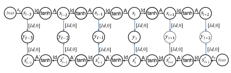

反因果影响。因此，所有可观察量的动态是通过因果状态 (sτ) 和反因果状态 sτ 的序列来解释的，使用因果和反因果信息流的转移矩阵 A 和 A。基于方程 28.8，我们绘制了图 28.9 中所示的 CRCNN 网络架构。

图 28.9. 一种因果-反因果历史一致神经网络 (CRCNN)。

## 技巧 10. 建筑教师强制 (Atf) 用于 CRCNN。

CRCNN (图 28.9) 也在整个时间路径上展开，即我们学习系统的独特历史。与 HCNN 的训练类似，CRCNN 的训练也较为困难。我们的下一个技巧称为用于 CRCNN 的建筑教师强制 (ATF)，将 TF 形式化为 CRCNN 架构的一部分，这使我们能够使用标准的 EBTT 算法学习 CRCNN。ATF 使我们能够更有效地利用数据中的信息，并加快训练过程。图 28.10 描绘了结合 ATF 的 CRCNN 架构。

。

图 28.10. 带有建筑教师强制 (ATF) 机制的扩展 CRCNN。

让我们解释扩展 CRCNN 模型中的 ATF 机制。

(图 28.10)：扩展的 CRCNN 使用因果-反因果网络对网络的对侧部分进行对称性误差校正。在每个时间步 τ ≤ t 上，期望值 yτ 被观察值 ydτ 替代，使用中间的 tanh() 层用于因果部分和反因果部分。由于因果和反因果部分 *共同* 解释了可观察量 yτ ，我们必须将因果部分注入反因果部分，反之亦然。这是通过用因果输出 (Δτ) 来补偿实际观察值 −ydτ 完成的。

和输出层中固定目标值为零的反因果部分 (Δτ)。输出层的结果内容 (Δτ + Δτ − ydτ = 0) 被取反并转移到 CRCNN 的因果和反因果部分。

[−Id, 0] 连接器。在中间的 tanh() 层中，yτ 的期望被实际观察值 ydτ 替代，同时考虑来自 CRCNN 对侧的贡献。注意，ATF 不会导致更多的自由网络参数，因为所有新的连接都是固定的，仅用于在神经网络中传递数据。在未来的方向 τ>t 上，CRCNN 仅基于期望值进行迭代。

ATF 的使用并不会重新引入输入/输出建模，因为我们用实际观察值替代可观察量的期望值，同时考虑动态的因果和反因果部分。对于足够大的 CRCNN 和输出误差收敛到零，图 28.10 中的架构收敛于图 28.9 所示的基本 CRCNN 架构。CRCNN 的优势在于它允许因果和反因果信息流的完全动态叠加。

图 28.10 中描绘的 CRCNN 描述了在流形上的动态。在每个时间步，信息流包含闭环，这在技术上可以看作是等式约束。这些约束通过因果部分和反因果部分的相互作用隐式定义。CRCNN 结构中的闭环（图 28.10）导致模型中固定点递归子结构的出现，这些结构在 EBTT 中难以处理。为此，我们提出

类似于技巧 7 的解决方案概念：我们将 CRCNN 模型嵌入到一个更大的网络架构中，这样更容易解决，并且收敛到与原系统相同的解决方案。图 28.11 描绘了这样一个嵌入的初步草图。

图 28.11 中的扩展架构是图 28.10 中原始模型的复制。图 28.11 中的 CRCNN 架构不包含闭环，因为我们将因果和反因果部分的 ATF 机制分成两个分支。重要的是要注意，这些分支通过因果和反因果部分的共享权重隐式连接。如果该架构收敛，则不再需要 ATF，我们将得到两个与图 28.9 中描述的 CRCNN 模型相同的副本。我们为嵌入提出的解决方案并不是处理固定点循环的唯一可行方法。我们将在即将发表的论文中概述替代解决方案。CRCNN 是我们预测商品价格项目的基础。

图 28.11. CRC 神经网络中 ATF 的不对称分割

## 技巧 11. 动态系统中的稳定与不稳定信息流

根据技巧 3，给因果分支和反因果分支施加噪声是自然而然的（另见图 28.12）。这应该改善两个时间方向即信息流的稳定性。在 CRCNN 中，这一特性具有特殊的解释：因果信息流的稳定性意味着一开始的不确定性沿着从过去到未来的时间路径被减弱。因果系统的不稳定性意味着在混沌状态下，过去的小干扰会扩散到非常不同的未来情境（见图 28.12，上部分）。

图 28.12. 不稳定的因果动态转变为稳定的反因果动态

如果一个子动态的因果信息流不稳定，则该子系统的反因果描述是稳定的。另一方面，从因果的角度来看，不稳定的反因果动态是稳定的。在一个结合因果和反因果的神经网络中，即使基础动态部分不稳定，因果和反因果分支也可以同时稳定。为了加强因果和反因果部分的稳定性，我们在两个分支的起始点施加噪声。1

## 技巧 12. 不确定性与风险

在最新金融危机中获得的经验引发了关于定量预测模型局限性的广泛讨论，使得投资者对风险有了更强的意识[2]。为了理解风险分布，传统风险管理使用扩散模型。风险被理解为随机游走，其中扩散过程是通过观察到的潜在模型的过去误差进行校准的[7]。相比之下，下一个称为不确定性与风险的技巧侧重于集成预测，以便提供对复杂风险关系的重要洞察，因为内部模型（未观察到的）变量可以从观察变量（可观察）的趋势中重建。

如果对 HCNNs 或 CRCNNs 反复进行系统识别，将会产生一个解的集成，所有解在过去的预测误差为零，但在未来却相互不同。由于每个 HCNN 或 CRCNN 模型对观察数据的描述都很完美，因此完整集成是正确解。简化预测的一种方法是将个别集成成员的算术平均值作为期望值，前提是集成直方图在每个时间步骤中是单峰的。

除了期望值外，我们还考虑集成的带宽，即其分布。集成的形式受可观察变量对隐藏系统变量重建差异的影响：对于每个有限的

感谢莱比锡 MPI 的 Jürgen Jost 教授对此主题的有益讨论。

在观察量方面，有无限多的解释模型可以完美描述数据，但在其预测上有所不同，因为观察使得在训练期间以不同形式重建隐藏变量成为可能。换句话说，我们的风险概念基于世界的部分可观察性，导致对隐藏变量的不同重建，从而产生不同的未来场景。由于所有场景都与历史完全一致，我们不知道哪个场景最能描述未来趋势，因此风险产生。

该方法直接解决了模型风险。对于 HCNN 和 CRCNN

在建模中，我们声称模型风险等于预测风险。原因可以总结如下：首先，HCNNs 是通用逼近器，因此能够描述每一个市场场景。其次，集成分布的形式是由潜在动态引起的，这将市场动态解释为相互决策的结果[17]。第三，在实验中，我们已表明，集成分布独立于模型配置的细节，如果我们使用大型模型和大规模集成。

让我们举例说明我们的风险概念。下面的图（图 28.13，左侧）展示了应用于道琼斯工业指数（DJX）的方法。对于集成，使用 HCNN 生成了 250 个针对 DJX 的个体预测。对于每个预测日期，所有个体预测共同代表经验密度函数，即在单一时刻许多可能市场价格的概率分布（见图 28.13，右侧）。值得注意的是，DJX 的实际发展始终在集成通道内（见灰色线条，图 28.13，左侧）。预测分布的期望值也是 DJX 的一个合适点预测（见图 28.13，右侧）。

图 28.13. HCNN 对道琼斯指数的集成预测（12 周预测范围），左侧为相关指数点在时间步 t + 12 的分布，

右侧

## 28.3 结论与展望

循环神经网络以非线性状态空间模型的形式对动态系统进行建模。与其他神经网络一样，RNN、ECNN、HCNN 或 CRCNN 的方程可以表示为一种架构，该架构以节点的形式表示各层，以链接的形式表示层之间的连接。在图形架构中，我们可以应用局部学习算法，如误差反向传播和适当的（随机）学习规则来训练神经网络[13, 17, 3]。这种关系称为方程、架构及其相关的局部算法之间的对应原则（技巧 1）。

使用共享权重矩阵的 RNN 的有限时间展开使我们能够坚持对应原则。超调强化了自主动态，并实现了长期预测（技巧 2），而自适应噪声项则处理了有限时间展开的不确定性（技巧 3）。

ECNN 利用先前模型误差作为额外输入。因此，学习可以将模型的不匹配解释为外部冲击，并用于指导模型后续的动态。这使我们能够防止模型的自主部分适应误导性的时间间因果关系。如果我们知道一个动态系统受外部冲击的影响，ECNN 的误差校正机制则是网络架构的重要预结构元素，以补偿缺失输入（技巧 4）。

通过变元与不变元的分离扩展 ECNN，可以将基础动态的额外先验结构知识纳入模型中。

通过瓶颈坐标变换将变元和不变元分离，能够处理高维问题（技巧 5）。

HCNN 不仅建模个体动态，还建模由多个相互作用的子动态组成的复杂系统。HCNN 在输入和输出变量上是对称的，即系统描述并不区分输入、输出和内部状态变量。因此，开放系统变成了封闭系统（技巧 6）。稀疏转移矩阵使我们能够建模不同的时间尺度并稳定训练（技巧 8）。在集成模型（CRCNN）中，因果和逆因果信息流可用于建模市场中的理性规划和决策。CRCNN 动态结合因果和逆因果信息，以描述当前的市场状态。

（技巧 9）。架构教师强迫可有效训练 HCNN 或 CRCNN（技巧 7 和 10）。架构扩展（见图 28.12）使我们能够在学习 CRCNN 时平衡因果和逆因果信息流（技巧 11）。

我们通常使用 HCNN 或 CRCNN 的集合来预测商品价格。所有解决方案在过去的模型误差为零，但在未来表现出不同的行为。这是由于从观测中重构隐藏变量的不同方式，与不同的随机稀疏初始化无关。由于每个模型对观察数据提供了完美的描述，我们可以使用单个预测的简单平均值作为期望值，假设集合的分布是单峰的。对集合分布的分析为市场风险提供了新的视角。我们主张 CRCNN 或 HCNN 的模型风险等于预测风险（技巧 12）。

当前正在进行的工作旨在改善 CRCNN 的嵌入

架构（见图 28.10）旨在简化和稳定训练。另一方面，我们分析集合的微观结构，并在实际风险管理和金融市场应用中实现模型。

所有 NN 架构和算法均在神经网络模拟环境（SENN）中实现，这是西门子企业技术的一款产品。该工作部分由德国联邦研究部（BMBF）资助。

赠款爱丽丝，01 IB10003 A-C）。

[1] Calvert, D., Kremer, S.: 自适应状态转移网络。在：Kolen, J.F., Kremer, S.（编）《动态递归网络实用指南》，第 15–25 页。IEEE（2001）

[2] Föllmer, H.: 一切正确却依然错误？关于金融危机和金融数学的注释。在：MDMV，第 17 卷，第 148–154 页（2009）

[3] Haykin, S.: 《神经网络与学习机器》，第 3 版。普伦蒂斯霍尔（2008）

[4] Hull, J.: 《期权、期货与其他衍生证券》。普伦蒂斯霍尔（2001）

[5] Hornik, K., Stinchcombe, M., White, H.: 多层前馈网络是通用近似器。神经网络 2，359–366（1989）

[6] Kamien, M., Schwartz, N.: 动态优化：经济与管理中的变分法与最优控制，第 2 版。爱思唯尔科学（1991 年 10 月）

[7] McNeil, A., Frey, R., Embrechts, P.: 定量风险管理：概念、技术与工具。普林斯顿大学出版社，普林斯顿（2005 年）

[8] Neuneier, R., Zimmermann, H.-G.: 如何训练神经网络。见：Orr, G.B.,

Müller, K.-R.（编）NIPS-WS 1996。LNCS，卷 1524，第 373–423 页。施普林格，海德堡（1998 年）

[9] Pearlmutter, B.: 动态递归神经网络的梯度计算。

见：Kolen, J.F., Kremer, S.（编）。动态递归网络领域指南，第 179–206 页。IEEE 出版社（2001 年）

[10] Rumelhart, D.E., Hinton, G.E., Williams, R.J.: 通过误差传播学习内部表示。见：Rumelhart, D.E., McClelland, J.L.等（编）。并行分布式处理，第 1 卷：基础。MIT 出版社，剑桥（1986 年）

[11] Schäfer, A.M., Zimmermann, H.-G.: 递归神经网络是通用逼近器。见：Kollias, S.D., Stafylopatis, A., Duch, W., Oja, E.（编）。ICANN 2006。LNCS，卷 4131，第 632–640 页。施普林格，海德堡（2006 年）

[12] Wei, W.S.: 时间序列分析：单变量与多变量方法。艾迪森-韦斯利出版公司，纽约（1990 年）

[13] Werbos, P.J.: 超越回归：行为科学中的预测与分析新工具。博士论文，哈佛大学（1974 年）

[14] Williams, R.J., Zipser, D.: 一种用于持续运行完全递归神经网络的学习算法。神经计算 1(2)，270–280（1989 年）

[15] Zimmermann, H.G., Grothmann, R., Neuneier, R.: 通过误差修正神经网络建模动态系统。见：Soofi, A., Cao, L.（编）。建模与预测金融数据，非线性动力学技术。克鲁威尔（2002 年）

[16] Zimmermann, H.G., Grothmann, R., Schäfer, A.M., Tietz, Ch.: 用动态一致神经网络建模大型动态系统。见：Haykin, S.等（编）。统计信号处理的新方向。MIT 出版社，剑桥（2006 年）

[17] Zimmermann, H.G.: 神经网络作为决策计算。见：Rehkugler, H.,

Zimmermann, H.G.（编）经济学中的神经网络，基础与科学应用。瓦伦，慕尼黑（1994 年）

[18] Zimmermann, H.G., Neuneier, R.: 动态系统建模的神经网络架构。见：Kolen, J.F., Kremer, S.（编）。动态递归网络领域指南，第 311–350 页。IEEE 出版社（2001 年）

[19] Zimmermann, H.G., Grothmann, R., Tietz, C., von Jouanne-Diedrich, H.: 市场建模、预测和风险分析与历史一致的神经网络。见：Hu, B.等（编）。2010 年运筹学会议论文集，德国运筹学会（GOR）年会的精选论文，慕尼黑。施普林格，海德堡（2011 年 9 月）

[20] Zimmermann, H.G., Grothmann, R., Tietz, Ch.：使用因果-逆因果神经网络预测市场价格。在：Klatte, D., Lüthi, H.-J., Schmedders, K.（编）《2011 年运筹学会议论文集》，国际运筹学会议 2011（OR 2011）精选论文，瑞士苏黎世。施普林格

（2012）

# 29 解决部分可观测强化学习问题的递归神经网络

Siegmund Duell1,2, Steffen Udluft1, 和 Volkmar Sterzing1 1 西门子公司，企业技术部，智能系统与控制 2 柏林工业大学，机器学习

{duell.siegmund.ext,steffen.udluft,volkmar.sterzing}@siemens.com 摘要。本章的目的是提供一系列用于神经状态估计的技巧和方法，特别是针对强化学习的现实世界应用。我们使用多种递归神经网络拓扑，因为它们能够识别复杂动态系统的连续值，可能是高维的状态空间。递归神经网络明确提供了考虑时间和记忆的可能性，原则上能够建模任何类型的动态系统。

由于这些能力，递归神经网络是近似动态系统马尔可夫状态空间的合适工具。在第二步中，可以应用强化学习方法来解决定义好的控制问题。除了使用递归神经网络进行状态估计的技巧外，还解决了许多与现实世界问题相关的各种问题，如大规模观测集和长期依赖。

## 29.1 引言

在本章中，我们提出了一种状态估计方法，以解决离散时间中的部分可观测强化学习[26]问题。强化学习是针对最优控制问题的机器学习方法。它不是设计控制策略，而是从被控制系统的实际观察中学习。结合强大的函数逼近器如神经网络，可以取得显著的成果。

[28, 13, 19]。在大多数现实世界应用中，某种形式的状态估计是满足强化学习要求的必要条件。

考虑一个任务，即在保持低噪音（由燃烧动力学引起）的同时，减少燃气涡轮的排放。燃气涡轮由压缩机组成，提供压缩空气。在燃烧室内，这种空气与气体一起燃烧，以驱动涡轮及其耦合的发电机。气体通过多个燃烧器注入。在每个燃烧器，燃料流被分成不同的部分，以便控制燃烧过程。燃烧过程产生的 NOx 和 CO 排放必须控制在一定水平以下。

G. Montavon 等（编）：NN：行业技巧，第 2 版，LNCS 7700，第 709–733 页，2012 年。

-c 施普林格-瓦格 2012 年

法律限制。同时，燃烧过程会产生嗡嗡声。这种嗡嗡声缩短了机器的使用寿命，并可能对涡轮机造成致命损害。强化学习可以通过优雅地调节燃料比例来解决优化燃烧过程的问题。强化学习还可以考虑季节性影响和磨损，因为这些影响可以在传感器读数中找到。基于（固定）物理模型的方法通常无法发现此类影响。为了成功开发一个强化学习代理，状态估计的问题必须得到解决（见第三十章 [23]）。

其他问题解决方案以应用于现实世界的强化学习。

必须解决，以满足强化学习框架的要求。由于燃气涡轮机提供大量传感器读数，例如温度和压力读数、质量流量以及阀门位置和低级控制器设定点等执行器设置，因此状态是非常高维的。即使是专家也无法预见各种子系统及其相互作用可能造成的所有影响。状态估计方法可以克服这个问题。

各种递归神经网络（RNN）的拓扑被用于状态估计，因为它们能够识别现实世界应用的连续值、高维状态空间。RNN 明确提供了考虑时间和记忆的可能性，原则上它们能够建模任何类型的动态系统 [9, 15, 11, 32]。由于这些能力，RNN 成为状态估计的宝贵工具，特别是在现实世界应用中。基于这些估计，可以应用强化学习的方法来解决定义的控制问题。

本章分为四个部分。在简要介绍强化学习及其要求后，第 29.3 节描述了使用 RNN 建模马尔可夫状态空间的主要技巧。第 29.4 节继续介绍从可能的大量可观察变量中提取马尔可夫决策过程的技巧，并进一步调整神经拓扑以适应强化学习的状态估计任务。为了解决捕捉动态依赖的不同时间尺度的任务，第 29.5 节提供了长期依赖问题的解决方案。对于所有呈现的技巧，提供了作为实用指南的配方，以避免潜在的陷阱并提高一般适用性。此外，还介绍了一些实验以证明所呈现程序的适用性。

## 29.2 背景

强化学习通常要求将感兴趣的系统描述为马尔可夫决策过程（MDP）M := (S, A, P, R)，其中 S 和 A 分别表示状态和动作空间，P : *S×A×S* → [0, 1]是状态转移概率，即在状态 st 中执行动作 at 进入后继状态 st+1 的概率，R : *S×A×S* → R 是奖励函数，为转移分配其即时成本或收益。强化学习的目标是推导出一个策略π : S → A，将每个状态映射到最大化回报的动作，即所有（折扣）未来奖励的总和。MDP 的一个中心特征是马尔可夫属性，它表明到达某个后继状态 st+1 的概率仅依赖于当前状态 st 和动作 at。

然而，在许多现实世界的控制问题中，当前状态并不可直接访问。相反，只能使用一组可观察量 zt ∈ Z 作为关于真实当前状态 st 的信息源，从而将 MDP 转变为部分可观察的马尔可夫决策过程（POMDP）M := (S, Z, A, P, R, O)。除了 MDP 的组件外，POMDP 还包含一个观察空间 Z 和一个（通常未知的）观察函数 O : S×A → Z，描述从状态-动作对到观察的映射。

在引言中提到的燃气涡轮环境中，也必须处理 POMDP。各种测量以及阀门位置等演员设置作为可观察量 z 提供。通过改变燃料流量阀的位置，可以影响涡轮的状态。因此，计算出一个即时奖励信号，提供关于所执行动作质量的信息。

处理 POMDP 的常见方法是对可能的当前状态建模分布[12]，即信念状态。当使用这种方法时，选择动作 at 是基于最可能的当前状态及其不确定性[20]。在处理技术系统时，部分可观察性主要源于有限的可用测量和一个时间步不足以描述当前系统状态，即大多数技术系统也可以描述为更高阶的 MDP。通过简单地聚合足够数量的先前时间片，这些马尔可夫过程可以简化为一阶 MDP，即强化学习所需的 MDP 类型。在许多情况下，简单的聚合导致高维状态空间，因此在大多数情况下被认为不实用（贝尔曼的“维数诅咒”）。

[2]。对基础系统的深入理解，或特别是在更自主的环境中，状态估计器可以克服这个问题。接下来，将推导出用于从部分可观察动态建模马尔可夫状态空间的递归神经方法。建模的状态允许在离线设置中应用任何被充分理解的强大强化学习算法，例如神经拟合 Q 迭代[24]、递归控制神经网络[31]或在线方法如演员-评论家算法[21]。

## 29.3 使用递归神经网络建模马尔可夫状态空间的技巧

强化学习代理与系统进行交互，从而常常改变其演变。这一发展可以描述为一个开放的动态系统。请注意，与第二十八章[36]中的描述相比，系统的可调外部驱动 a 与其他外部驱动 z 显式分离。在实践中，像燃气涡轮这样的动态系统可以受到可调外部驱动的影响，例如燃料或冷却流的阀门位置，但同时，其他外部驱动，例如环境条件，可能也很重要。对于离散时间网格（t = 1*,...,T* 且 T ∈ N），这可以

$$(29.1)$$

图 29.1。动态系统可以受到动作 a 的影响，这些动作由（强化学习）控制器执行，同时也受到外部驱动 z 的影响，例如燃气涡轮的环境条件。两者都会改变动态的状态 s，并导致状态转移，结果生成一组可观察量 y。对于燃气涡轮，可观察量是温度或压力水平等传感器读数，以及阀门位置等执行者设置。

表示为一个由状态转移和输出方程组成的方程组[9, 11]：

$$\begin{array}{r l}{s_{t+1}=f(s_{t},a_{t},z_{t})}&{{}{\mathrm{状态~转移}}}\\ {y_{t}}&{{}=g(s_{t})}&{{}{\mathrm{输出~方程}}.}\end{array}$$

图 29.1 说明了方程 29.1。状态转移是将系统当前内部状态 st 和外部输入 at 及 zt 的影响映射到新状态 st+1。在强化学习的背景下，输入 zt 是代理对系统的（部分）信息，而 at 代表由控制策略选择的动作。输出方程决定可观察输出 yt。在基本框架中，输出等同于系统的结果变化，换句话说，是系统的后续可观察量 zt+1。

识别方程 29.1 的动态系统的任务可以表述为寻找（参数化的）函数 f 和 g，使得观察数据 ydt 与模型输出 yt 之间的距离测量（方程 29.2）最小：

$$\sum_{t=1}^{T}\left(y_{t}-y_{t}^{d}\right)^{2}\to\operatorname*{min}_{f,g}$$

$$(29.2)$$

$$(29.3)$$

方程 29.1 和 29.2 的识别任务可以通过如下形式的 RNN 进行表述：

$\begin{array}{ll}s_{t+1}=\text{tanh}(As_{t}+c+Bz_{t}+Ca_{t})&\text{状态转移}\\ y_{t}&=Ds_{t}\\ \end{array}$  考虑 D，我们可能希望使用一致的维度。

其中 A, B, C 和 D 是适当维度的权重矩阵，c 是一个偏置。

通过使用固定维度的权重矩阵 *A, B*, C, D 和偏置向量 c 来逼近函数 f 和 g，方程 29.2 的系统识别任务转化为参数优化问题：

$$\sum_{t=1}^{T}\left(y_{t}-y_{t}^{d}\right)^{2}\rightarrow\operatorname*{min}_{A,B,C,D,c}$$

$$(29.4)$$

A,B,C,D,c (29.4)

图 29.2. 在训练阶段用作状态估计器的标准 RNN。每个圆圈表示一个隐藏层的神经元（称为集群）。每个箭头描绘一个权重矩阵，连接两个层之间的所有神经元。注意所有隐藏集群和所有输出集群都连接到一个偏置（图中未显示）。

这个参数优化问题是通过一个 RNN 解决的，该 RNN 在时间上有限展开，使用共享权重矩阵 *A, B*, C 和 D [22, 9]。图 29.2 描绘了生成的空间神经网络架构。RNN 通过时间反向传播进行训练，这是一种标准反向传播的共享权重扩展 [22, 9]。使用共享权重训练 RNN 是直接的，并且可以获得良好的结果。与前馈网络不同，RNN 能够由于时间结构而建立记忆，向过去和未来展开。这使得能够建模跨时间依赖关系和潜变量。例如，燃气涡轮的排放延迟多个步骤，因为传感器响应特性和导致排放的点（在燃烧室内）与测量点（在废气流中）之间的距离。

为了将状态估计映射到 RNN，隐藏单元 s 的 RNN（图 29.2）描述了强化学习任务的状态变量。

换句话说，经过训练后，这些变量被用作状态估计函数的输出。外部可用的观测值和执行的动作被用作输入向量 zt 和动作向量 at，ydt = zt+1 定义了目标。

RNN 通过所谓的超越向未来展开 [35]，即网络超出当前时间向未来展开（图 29.2）。这导致输出一整序列的预测。超越正则化学习，从而提高模型性能 [35]。超越不需要额外的网络参数，因为使用的是共享权重矩阵 A, B, C 和 D。

生成的训练网络根据行动序列建模底层动态系统的状态转换。如果系统能够充分好地建模预测视野，隐藏簇 s0 的马尔可夫性质可以被任意好地逼近[30，27]。因此，经过充分训练的 RNN 会生成一个状态估计器，以便在后续的强化学习算法中使用[29]。

本节介绍了使用 RNN 进行状态估计的基本思路。在使用 RNN 作为状态估计器的技巧之后，将介绍一系列方案，以克服设计神经状态估计器时遇到的各种问题。首先，行动在状态估计任务中的重要作用，以及对所有行动进行泛化的要求。

（第 29.3.1 节，29.3.2 节）进行讨论。接下来，介绍数据和模式预处理方法，以提供合适的训练和测试集（第 29.3.3 节，29.3.4 节，29.3.5 节）。随后，介绍学习过程（第 29.3.6 节，29.3.7 节）。最后，呈现训练状态估计器的简化回忆拓扑（第 29.3.8 节）。

进行呈现。方法的适用性在第 29.3.9 节的摆杆问题中进行了说明。

## 29.3.1 改善针对行动的泛化能力

与开放动态系统的标准定义和过冲的描述[35]相比，已知的行动序列作为过去和未来的输入 ap，ap−1，...，a0，a1，...，af，其中 p 表示过去的步数，f 表示未来的步数（图 29.2）。这至关重要，因为数据可能是由任意的、可能未知的控制策略生成的。

生成的网络应能够基于这些外部驱动因素的影响来建模系统的动态，而不是从马尔可夫状态预测一系列行动。例如，燃气涡轮的数据可能是由任意控制策略生成的。如果忽略这种影响，状态估计器将被迫在网络中编码潜在策略。生成的网络很可能无用，因为它无法对不同的行动序列进行泛化，这些序列在遵循强化学习策略时会出现。一般来说，还建议测试训练好的状态估计器对不同行动序列的泛化能力。这对于大多数系统都是可能的。例如，对于燃气涡轮，某些行动被证明可以减少排放，将其应用于涡轮应导致 NOx 或 CO 的变化。

## 29.3.2 改进状态转换建模的方案

图 29.2 中显示的标准 RNN 使用单个隐藏神经元集群来编码状态 s，状态转移由矩阵 A 建模。在强化学习中的状态估计情况下，我们关注状态转移的建模，即，stat −→ st+1。这可以在神经拓扑中明确表达，从而提高估计器的整体性能。特别是关于不同动作的泛化能力得到了改善。请注意，一个好的状态估计器不仅最小化优化任务的训练误差（如方程 29.4 所述），而且对不同的动作序列具有良好的泛化能力（见 29.3.1 节）。状态转移的神经表示见图 29.3。

## 29.3.3 输入和目标的缩放

像其他监督学习方法一样，输入和目标值的缩放是一个重要的预处理步骤。通常，更倾向于将输入缩放为均值为零，标准差为一。也可以使用其他缩放方法，例如编码关于动态的先验知识。例如，对于浓度，如燃气涡轮的排放，可以使用对数以避免负值和不合理的输出值。

## 29.3.4 区块验证

由于 RNN 的模式包含一整套输入和目标值，因此后续模式高度相关。每个模式仅与前一个模式在一个时间片上有所不同。因此，随机分配模式到训练集（用于更新权重）或验证集（不用于更新权重，但用于评估当前权重集的性能）会导致训练集和验证集之间的强相关性，从而影响训练和验证误差。为了去相关化模式集，通过使用不包含重叠信息的模式块，实现了更高粒度的划分。一个块要么用于训练，要么用于测试。理想情况下，生成具有相同统计特性的集合。

使用区块的原因是由于新*情况*的出现。例如，一个燃气涡轮可能在满负荷下运行并转变为降低负荷水平。在瞬态期间后，涡轮达到新的负荷水平。这类过程需要几分钟，而控制器设计为每隔几秒执行一次动作。通过将模式分组为区块，数据集去相关化并仍然捕获所有操作*情况*。为给定问题选择合适的区块大小对良好结果和可靠测试集至关重要。如果简单地将例如两天的操作数据集分成两个集合，每个集合一整天，这两个集合可能具有显著不同的统计特性，且某个集合可能会轻易错过某些操作*情况*。

随机区块验证算法（Alg. 29.1）解决了这些问题。

算法使用一个包含 M 个观测值的数据文件，即 M 个时间片段的数据向量。首先，在预定义的限制 minblocksize 和 maxblocksize 内随机确定块 j 的大小。接下来，从后续的观测时间片段生成 j 个模式。每个模式在其整个时间范围内展开。换句话说，如果拓扑定义了 p 个过去的时间片段和 f 个未来的时间片段，则

图 29.3. 一个 RNN 建模依赖于施加动作的显式状态转移：

stat −→ st+1。注意，所有隐藏簇以及所有输出簇都连接到一个偏置（图中未显示）。

图 29.4. 采用块验证程序生成的模式。所有块都是去相关的，以提供可靠、无相关性的测试集（即用于验证和泛化测试）。

时间片段，整个模式覆盖 p + f 观测数据。进一步地，每个模式会被缩放（参见第 29.3.3 节）。这个过程会重复，直到块被填满或者没有观测数据为止。最后，根据预定义的概率确定一个块的类型（训练集或测试集）。完整的块会被添加到最终的模式集中。生成的模式按图 29.4 所示的方式组织。生成的数据集满足我们对一组模式的要求，其中每个模式集（训练集和测试集）是去相关的，但具有相似的属性，因为不同的操作*情境*在所有集合中分布。

## 29.3.5 无效数据模式的移除

在所有以时间展开的训练数据应用中，都可能出现无效模式的问题。无效数据模式包含不符合预定义时间网格的数据。例如，每次燃气涡轮重新启动时，数据流也会重新启动，导致出现间隙。任何生成的模式如果包含来自先前关闭（可能是几小时前）和新的启动的数据，则被视为无效。它并不描述涡轮的行为，因此应从使用的模式中移除。

有效模式包含每个时间展开步骤的输入，这些输入与定义的时间网格相匹配。例如，如果选择时间网格 t = τ，有效模式将在 n 个等距步骤 t = τ, 2*τ, . . . , nτ* 上展开，其中 n 定义了模式展开步骤的数量。任何时间线中有间隙的模式应被排除，以避免无效的训练模式。这个问题在许多实际应用中都会出现，也适用于诸如倒立摆或倒立机器人等情景基准问题 [26]。

在实践中，这项任务可以通过简单地扩展块验证算法（算法 29.1）来解决。在子程序：generate(*tm, ..., tm*+n) 之前，测试每个数据向量以匹配定义的时间网格。所有违反网格的数据显示向量将被忽略。

$\epsilon\;\;i$) ...

算法 29.1。随机块验证 输入：观察集 O = {tm = (zm, am, rm)|m = 1*,...,M*}

结果：用于训练和测试的块验证模式集 m := 1 当 m ≤ M 时执行 j := rand(minblocksize, maxblocksize) " 确定在给定限制内的块大小 i := 0 当 (i<j) ∧ (m + n) ≤ M 时执行 " 生成一个包含 j 个模式的块，每个模式覆盖 n 个时间切片，如果数据不足则中断 pattern := generate(tm*,...,t*m+n) " 使用所选缩放生成有效模式 block.add(pattern) i := i + 1 m := m + 1 结束循环 type := rand(ptraining, ptest) " 根据指定概率 p 选择新块的类型用于训练和测试集 patternSet.add(block,type) " 将有效块添加到最终模式集中 m := m + n " 跳过数据以避免重叠模式，n 表示网络在时间上的展开 结束循环 返回 patternSet

## 29.3.6 学习设置

我们在所描述的神经网络拓扑上使用标准反向传播获得了良好的经验。这有效地实现了在固定范围内的时间反向传播，即覆盖神经网络的所有过去和未来时间切片。通过小批量随机选择的模式进行稳健学习，批量大小 B 例如为 B = 1/1000 N，其中 N 为所有模式的数量。权重更新Δw 的计算方式为

$$\Delta w=-\eta\,\frac{1}{B}\sum_{i=1}^{B}\partial E_{i}/\partial w\,,$$

$$(29.5)$$

∂Ei*/∂w ,* (29.5)

其中η为学习率，Ei 为模式 i 的误差。在大多数情况下，学习率选择在 0.01 和 0.001 之间。

在许多应用中，通过对标准反向传播的扩展称为 VarioEta，可以显著加快学习过程[18]。VarioEta 根据所有模式的标准差单独缩放权重更新。

$$\sigma_{w}={\sqrt{{\frac{1}{N}}\sum_{i=1}^{N}(\partial E_{i}/\partial w-D_{w})^{2}}}\,,$$

(∂Ei/∂w − Dw)² , (29.6)

其中

$$D_{w}={\frac{1}{N}}\sum_{i=1}^{N}\partial E_{i}/\partial w$$

$$(29.6)$$

$$(29.7)$$

∂Ei/∂w (29.7)

导致 VarioEta 更新规则

$$\Delta w^{\prime}=-\eta\,\frac{1}{B}\sum_{i=1}^{B}\partial E_{i}/\partial w\,\frac{1}{\sigma_{w}}\,.$$

$$(29.8)$$

. (29.8)

## 29.3.7 双重休息学习

实证证明，具有共享权重的 RNN 的训练过程是可靠和稳健的。然而，我们的目标是获得最佳的训练结果，而不浪费时间在不必要的网络训练上。为此，我们开发了双重休息学习程序（算法 29.2）。

原则上，同一网络在一个恒定的数据集上多次训练，但使用不同的随机初始化的初始神经权重。如果在多次训练尝试后没有找到更好的网络，则过程终止。需要包含训练集和至少一个用于验证的测试集的模式集。算法以最大尝试次数 tmax 初始化，

算法 29.2。双重休息学习

输入：每次训练的最大时期 emax，最大训练试验 tmax，休息

epochs erest, rest trials trest

结果：训练好的神经网络

t := 0

ttotal := 0

v := ∞

当 t<trest 且 ttotal < tmax 时

net := restLearning(erest, emax)

vt := net.min() 如果 vt < v 则

$$\begin{array}{l}{{v:=v_{t}}}\\ {{\mathrm{bestNN}:=\mathrm{net}}}\\ {{v:=v_{t}}}\end{array}$$

t := 0

如果的话

t := t + 1;

ttotal := ttotal + 1

当返回 bestNN

试图尝试找到更好解决方案的试验次数，trest。对于休息学习算法（Alg. 29.3），允许训练单个网络的最大时期 emax，以及在达到最佳验证错误的时期后训练单个网络的时期 erest 是必需的。

双 rest 学习开始使用 rest 学习算法（Alg. 29.3）训练单个网络。每当新的网络发现比前一个网络有更好的验证错误时，休息试验的数量 t 被重置为 0。一旦 trest 次没有找到更好的网络，或者超过了最大试验次数 tmax，则算法终止。

单个网络的休息学习过程采用类似方法

（Alg. 29.3）。该算法允许我们根据验证集选择最佳网络。单个网络训练 e 个时期。如果在 erest 内找到更好的解决方案，则确定具有最佳验证错误的时期 i。

从第 i 个时期存储的最佳权重集 bestNN，网络训练另外 erest − i 个时期。如果验证错误在 erest 个时期内没有改善，或者超过了最大训练时期 emax，则训练过程终止。

算法 29.3 . 休息学习 输入：每次训练的最大时期 emax，休息时期 erest 结果：训练好的神经网络 t := 0 vmin := ∞ ttotal := 0 e := erest 当 t<erest 且 ttotal < emax 时 net.learn(e) " 训练网络 e 时期 ttotal := ttotal + e v := net.min() " 检索最小验证错误 i := net.index(v) " 检索导致最小验证错误的时期如果 v < vmin 那么 vmin := v bestNN := net.weights(i) " 检索具有权重的网络，导致最小验证错误 t := i e := erest elset := t + i e := erest − i end if end while 返回 bestNN

双休息学习可以应用于任何神经网络训练，其中希望使用强大的停止准则从多次试验中选择最佳网络。当训练过程的元参数需要优化并且在每个试验中进行修改时，特别有用。另一个优势 3 在所有试验中具有相同的元参数情况下，使用固定数量的试验即 tmax = trest 是适当的（甚至更有效）。

是算法的参数化。尽管有四个参数，但可以认为它们是常数。对于大多数应用，我们使用：erest = 50, emax = 5000, trest = 10, 和 tmax = ∞。这种参数化在广泛的应用和 500 到 50000 个训练模式中显示出稳健的结果。

## 29.3.8 生成高效状态估计函数的方案

在训练完 RNN 后，神经网络被截断，以接收形式为：

$$s_{t}=f(z_{t},z_{t-1},...,z_{t-n},a_{t},a_{t-1},...,a_{t-n}),$$

其中 n 表示网络考虑的历史长度。可以通过逐渐减少过去网络的长度，直到预测的误差增加，即对于输出 y0, y1, ... , ym，来找到最优长度 n。

瞬时增加的误差要么表示 n 的完美选择，要么表示历史不够。另一次以增加的过去视野进行的训练确保神经网络获得所有先前所需的信息。

结果网络的拓扑结构如图 29.5 所示。此函数可用于将观察转换为{*s, a, s*}的元组，并应用所选择的强化学习方法来解决控制问题。

$$(29.9)$$

(z−3, a−3)(z−2, a−2)(z−1, a−1)(z0, a0)

图 29.5. 训练后的最终状态估计器。前隐藏单元 s0 现在用作函数的输出，并为给定的观察和动作序列提供马尔可夫状态表示。请注意，所有隐藏聚类都连接到一个偏置（图中未显示）。

## 29.3.9 神经状态估计器的应用

为了展示 RNN 作为状态估计器的能力，我们选择了倒立摆问题，该问题在控制和强化学习理论中得到了广泛研究。三十多年来，它作为新思想的基准，因为它易于理解，并且在相关问题上具有代表性。经典问题在过去已完全解决。例如，Sutton [26] 证明了杆可以在相当短的训练序列内，在任意时间步内保持平衡。有两个主要方向可以使倒立摆问题更具挑战性。一是通过例如使用两根杆[8]或考虑二维小车[7]来使任务本身更加困难。另一个是使原始问题部分可观察[17, 1, 8]。

我们将重点关注后者，因为所有其他变体首先提供了马尔可夫状态表示，因此不需要状态估计。有关原始（模拟）基准问题的强化学习解决方案，以及真实的倒立摆系统，可以在第三十章找到[23]。

问题描述。经典的倒立摆问题由在有限轨道上移动的小车和试图在其顶部平衡一根杆组成。该倒立摆系统在图 29.6 中进行了说明[17]。

图 29.6 小车-杆问题系统

该系统通过四个变量完全定义（t = 1*,...,T*）：

xt := 水平小车位置 x˙ t := 小车的水平速度 θt := 杆与垂直线之间的角度

˙θt := 杆的角速度

$$\mathrm{{\cal~cent}}$$ $$\mathrm{{\cal~vertical}}$$

$$(29.10)$$

目标是尽可能长时间地保持杆的平衡而不超出限制。可能的行动是用恒定的力 F 将小车向左或向右推动。当杆的角度θt 超过 12 度时，杆会倾斜。此时或当小车撞到边界时，系统会受到负强化信号的惩罚。在所有其他情况下，奖励为零。

如前所述，该系统已经在多个形式下进行了广泛研究。当该系统作为部分可观察时，通常会省略两个速度，x˙ t 和˙θt，即仅将小车的位置和杆与垂直线之间的角度作为输入 [17, 1, 8]。解决这个问题并不困难，因为模型或算法只需要一个过去时间步的记忆来计算缺失的信息。

为了展示 RNN（时间展开）的优势，仅可观察到小车的水平位置 xt [29]。系统无法获取所有其他信息。

模型描述。为了解决上述问题，采用了 RNN（第 29.3 节）。

被用于开发小车-杆系统的完整动力学。输入 ze 和目标 y 由水平小车位置 xt 及其预处理变换 xt - xt-1 组成。输入 at 包含代理的行动。模型无法观察到其他信息。内部状态空间 st 限制为四个神经元，使网络能够在其内部状态空间中重建完整但仅部分可观察的动力学（方程 29.10）。网络向过去和未来展开了十个时间步。先前的实验表明，这个记忆长度足以识别动力学。为了使网络独立于最后展开的时间片，采用了一种称为清除噪声的技术作为初始初始化 [10]。网络通过时间反向传播进行训练 [22, 9]。

在第二步中，从 RNN 提取演变的状态空间，即导出一个状态估计函数以根据观察计算估计状态（见第 29.3.8 节）。然后，使用 Samuel 的自适应启发式评估器 (AHC) 算法 [25] 的广义形式来解决基于状态估计的控制问题。注意，该算法必须以已填充的滞后结构启动，即状态估计器的过去滞后需要用观察填充，以提供初始状态估计。否则，算法在其首次学习步骤中很可能会面临倾斜的杆，因为需要至少十个不受控的时间步来填充所有滞后。

图 29.7. 重构状态空间变量 (st)1, ... , (st)4 与原始变量之间的最佳二次组合的相关性 (方程 29.10)

结果。作为第一个结果，图 29.7 展示了推车-杆不同状态变量的估计质量。四个图展示了动力学原始状态空间变量 xt, x˙ t, θt, ˙θt 之间的相关性。

（方程 29.10）以及重构状态空间变量 (st)1*,...,*(st)4 及其平方 (st)21*,...,*(st)24 的最佳线性组合。在每种情况下，各状态空间变量的高相关性展示了 RNN 的重构质量。这也支持了 RNN 在部分可观察强化学习问题中的应用。

我们将我们的方法的结果与 AHC 的直接应用进行了比较

算法在问题上的直接应用，即在第一步不使用 RNN。注意，未使用自适应分箱。在两种情况下，状态空间的离散化都选择以获得最佳结果。

图 29.8 显示了杆能够平衡的步骤数与试验次数的关系。训练过程在第一种方法能够在至少 1000 步内平衡杆时停止。图 29.8 显示了 RNN 方法优于 AHC 算法的直接应用。

图 29.8. 我们的 RNN 方法（上曲线）与 AHC 算法直接应用（下曲线）在部分可观察的推车-杆问题中的性能比较

## 29.4 马尔可夫决策过程提取网络

在将强化学习算法应用于实际问题（如燃气轮机）时，不仅面临观察不提供马尔可夫性质的问题，而且在许多应用中，甚至不明显应考虑哪些变量用于状态定义。例如，燃气轮机提供的测量数据包含关于各种子系统的信息。在实践中，通常很难确定是否需要考虑某个特定变量，或者某个子系统的一整组变量可以被忽略。

图 29.9。马尔可夫决策过程提取网络（MPEN）由一个过去子网络（左）和一个未来子网络（右）组成。输入变量被分成两组：

动作 at 由强化学习代理控制，zt 表示动态中的可观测变量。未来子网络只有输出 rt。状态转移由 sit 和 st 建模。注意，过去的所有权重矩阵

(*A, . . . , D*)与未来矩阵(*E,...,H*)不同。

除了考虑专家知识和输入选择方法外，我们开发了一种方法，旨在优化控制问题，在这种情况下，奖励信号是可用的。从强化学习的角度来看，执行的动作 at、可能的大量可观测量 zt 以及给定观测和动作元组的奖励 rt 在时间 t 的所有步骤中都是可用的。在许多现实场景中，奖励函数 rt = fr(zt, at)是已知的，因为它描述了要解决问题的期望目标，并且很可能是我们设计的。这种知识可以通过将网络拆分为过去和未来子网络，在高级神经状态估计器中建模以匹配以下方程：

$s_{t+1}=f_{\rm past}(s_{t},z_{t},a_{t}),\ t\leq0$ (29.11) $s_{t+1}=f_{\rm future}(s_{t},a_{t}),\ t>0.$ (29.12)

网络的分裂解决了 RNN 拓扑中的不一致性，因为可观测量 z 在未来时间片（t > 0）中不可用。为了解决这个问题，另一种拓扑是动态一致的递归神经网络[34]。然而，这种拓扑必须预测所有可观测量 z，这在某些变量较难预测时可能会造成问题。由于将数据分为过去和未来，我们可以使用任何目标，未包含在输入集中的变量也可以被考虑。这使得可以使用奖励信号，或者在已知奖励函数的情况下，作为目标的奖励函数的参数：

$$(29.13)$$

$$r_{t}=g(s_{t},a_{t}),t\geq0$$

rt = g(st, at), t ≥ 0 (29.13)

注意，当前状态 st 和施加的动作 at 足以描述所有相关奖励函数的期望值，因为关于后继状态 st+1 概率分布的所有信息必须包含在这两个参数中。这个目标使我们可以将神经网络的目标更改为所需的动态：

$$\sum_{t=1}^{T}(r_{t}-r_{t}^{d})^{2}\rightarrow\operatorname*{min}_{f,g}$$

$$(29.14)$$

f,g (29.14)

结果拓扑允许神经网络从提供的过去观察中累积满足马尔可夫性质所需的所有信息，而未来网络则重塑状态转移。

还可以通过相应调整过去网络的拓扑来编码有关相关信息在考虑的过去时间范围内分布的先验知识。一个可能的修改是直接向隐藏簇 s0 添加额外输入，例如，如果它们已知在考虑的过去时间范围内是恒定的。比如，燃气涡轮的燃烧过程中的环境温度、压力和湿度。由于这些变量在考虑的展开过去网络中是恒定的，因此可以直接馈入簇 s0。任何过去信息输入的唯一约束是，它必须经过隐藏簇 s0，最终用于马尔可夫状态表示的输出。因此，过去网络的拓扑可能性是无穷无尽的。

这些发现的表示导致了图 29.9 中所示的马尔可夫决策过程提取网络（MPEN）。左侧的子网络（过去网络）没有明确的目标，并向右侧的神经分支（未来网络）提供信息。这两个子网络通过任意神经结构连接，例如，权重矩阵或多层感知器。

未来网络利用 s0 提供的信息以及未来的行动来学习一个动态系统，能够预测未来奖励的序列。请注意，未来的行动是重要的输入，防止网络预测导致状态转变的行动序列。这一点很重要，因为行动选择可能基于外部信息，而这些信息并不包含在可观测集合中，或者可能由于随机探索而无法预测。有关此问题的更多细节，请参见第 29.3.1 节。

如[27]所证明，RNN 可以通过基于观察历史预测所有预期的未来后继状态来近似 MDP。RNN 的结构强制每个隐藏簇 s 编码所有必要的信息，以便在考虑行动影响的情况下估计后继状态。

因此，RNN 必须能够估计每个未来状态的预期奖励，因为奖励函数只能使用状态、行动和结果后继状态作为参数。因此，建模一个动态系统以预测所有未来时间片的奖励是足够的。基于这一结论，该方法旨在建模被视为系统的最小所需动态[4]。

引入的神经拓扑相对于其他基于 RNN 的状态估计器的主要优势在于能够从一组可观察量中建模最小动态，而无需手动选择变量。另一个优势是提取最小状态空间的能力。需要预测所有可观察量的网络，例如动态一致的 RNN [34]，将所有信息编码到状态空间中，因此不是最小的。如果可观察量集合中包含不重要的变量，这些变量可能难以预测，从而导致预测性能下降，这一点尤为重要。此外，这些变量会干扰训练过程，因为验证误差可能会受到这些变量的高度影响。换句话说，产生的最大残差会导致整个神经网络的训练结果不够稳健。

## 29.4.1 奖励函数设计影响状态估计器的性能

与标准的 RNN 相比，训练神经拓扑的难度取决于强化学习问题本身，因为奖励函数的定义提供了目标。我们可以证明，对于像杠杆小车这样的情景问题，可以使用标准的奖励函数训练网络，该函数在轨迹结束时提供一些正或负反馈 [4]。然而，当提供有关当前状态质量的更多信息时，问题变得更容易解决。这反映在额外的梯度信息中，加速了学习过程。对于大多数实际应用，通常可以轻松提供这样的奖励函数，因为我们通常参与其设计。如果奖励函数已知，奖励函数的参数通常更倾向于作为目标使用。

## 29.4.2 选择状态估计器的预测视野

在设计神经状态估计网络时，关于应包含在预测中的未来步数的问题立即出现。由于网络在时间上向过去和未来展开，步数是有限的，因此必须找到该问题的实际答案。

幸运的是，强化学习问题本身的定义提供了答案。使用折扣因子 γ 来定义回报，限制了未来时间步数的重要视野。回报定义了代理策略的性能，其定义如下：

$$\sum_{t=1}^{\infty}r_{t}\gamma^{t}.$$

$$(29.15)$$

rtγt. (29.15)

在实践中，可以安全地相应限制未来时间步数，因为奖励的影响呈指数下降。

## 29.5 解决长期依赖问题的技巧

大多数状态估计方法依赖于塔肯斯定理 [33]，该定理表明，足够数量的过去时间切片包含了所有必要的信息。

图 29.10. 带快捷方式的马尔可夫决策过程提取网络 (MPEN-S)

由过去（左）和未来（右）子网络组成。输入变量分为两组：动作 at 由强化学习代理控制，zt 表示来自动态的可观测变量。未来子网络的输出为 rt。

状态转移由 sit 和 st 建模。请注意，过去的所有权重矩阵（*A, . . . , E*）与未来的矩阵（*G, . . . , L*）不同。所有隐藏集群以及所有输出集群都连接到一个偏置（图中未显示）。

估计一个马尔可夫状态。递归状态估计器在各种应用中表现出色，例如用于气体涡轮机控制的状态估计。

[28]，但尽管 RNN 有诸多优点，人们仍对其建模长期依赖的能力表示担忧[3]。在一个表现出长期依赖的系统中，系统在时间 T 的输出依赖于时间 t T 的输入[14]。这一问题由 Mozer 发现[16]，他发现 RNN 无法捕捉古典音乐中的全局效应。造成这种效应的主要原因是基于梯度的学习方法中的梯度消失问题[6, 14]。长期依赖存在于许多时间序列中，从技术系统到金融数据。为了解决这个问题，引入了带捷径的马尔可夫决策过程提取网络（MPEN-S）[5]。这是先前提出的 MPEN 拓扑的扩展（第 29.4 节），在该拓扑中，额外的捷径连接跨越固定数量时间片的集群（图 29.10）。示例包括在过去 p 步和未来 f 步的网络中，长度为 n 的捷径连接 s−n → s0, s−n+1 → s1, ..., sp → sp+n。在未来部分，添加相同长度的捷径从 s1 → sn+1, s2 → sn+2，...。

sf−n → sf。

结果拓扑成功用于面临延迟可观测量或对动态产生延迟影响的动作的状态估计问题。例如，气体涡轮机的排放测量延迟约为一到两分钟，而涡轮机的燃烧动态几乎是瞬时发生的。这两种效应都受到施加于涡轮机的相同动作的影响，因此底层状态包含关于这两者的信息，即高度延迟的影响以及短期效应。

在第 29.5.1 节中提出寻找良好捷径长度的食谱后，我们进行了实验以展示 MPEN-S 拓扑的能力。实验包括一个气体涡轮机的模拟，具有高度延迟的作用对动态的影响。

## 29.5.1 寻找良好捷径长度的食谱。

选择适当的快捷长度 n 时，可以考虑以下启发式方法：消失梯度问题的严重性与信息在网络中转发所需的步数相关。因此，选择的 n 值旨在最小化信息从过去任何状态到当前状态 s0 的总步数。即，p i=1 steps(s0, s−i, n) →n min，其中 steps(s0, s−i, n)给出从 s−i 到 s0 的最小步数，包括可能的快捷方式。例如，如果 n = 2，steps(s0, s−1)=1，steps(s0, s−2)=1，steps(s0, s−3)=2，steps(s0, s−4)=2。这个启发式方法所需的唯一信息是假定会影响当前状态的过去时间片的最大数量。图 29.11 显示了不同快捷长度实验的结果，表明该启发式方法导致了合理的结果。

## 29.5.2 关于长期依赖问题的实验

为了展示 MPEN-S 的能力，使用了两个基准，一个是随机数字序列，另一个是燃气轮机模拟。我们将带有长度为 n = 4 的快捷方式的 MPEN-S 与 MPEN 进行比较。根据启发式方法（第 29.5.1 节）选择了快捷长度 n = 4。对于每个架构和基准，通过在线反向传播训练 10 个网络，学习率为 0.001，基于 10,000 个观察数据，其中 30%用于验证。

评估基于另一组相同大小但没有噪声的数据。为了判断状态估计的质量，用 s0 中的激活值表示，我们测试 s0 中的信息内容。为此，我们将估计的状态作为输入馈送到一个前馈神经网络（两个隐藏层，每层 150 个神经元）。

图 29.11. 使用不同快捷长度和过去 p = 20 的实验结果。(a)显示了没有快捷方式的网络和具有不同长度（n ∈ {4, 5, 6}）的网络的总和 pi=1 steps(s0, s−i, n)（最小化总和）。(b)

显示这些网络在随机数字实验中的验证错误（第 29.5.2 节）。步数之和与验证错误之间的相关性显而易见。

每个网络的目标是基准应用的真实马尔可夫状态。在最佳情况下，估计的状态包含所有相关信息，从而允许与真实马尔可夫状态的完美映射，即目标与输出之间的相关性为 1。

随机数实验。在第一次实验中，使用均匀分布的随机数序列 xi ∈ [0, 1]。具有 i 步过去和未来视野的网络接收序列 xt, xt+1*,...,x*t+i 作为网络过去部分的输入。该序列也用作网络未来部分的目标，在输入和相应输出之间引入延迟。通过这种方式，网络必须在时间步 t+i 输出在时间步 t 给出的输入，以最小化其误差。此外，还引入了均匀分布的噪声 e ∈ [−0.05, 0.05]。

被添加到训练的目标值中。随机数问题的状态估计目标是编码关于过去 i 个随机数的信息。

燃气涡轮模拟。为了展示所提出方法在与我们关注的实际应用类似的问题上的能力，使用了燃气涡轮模拟。该模拟提供了一个可控变量 *pilot*，影响涡轮的排放和嗡嗡声。飞行员比例是与燃烧控制相关的最重要的燃料比例之一。为了使模拟尽可能简单，燃烧调节仅限于这个变量。策略的目标是最小化排放并避免关键嗡嗡声，这在奖励函数中得以体现。尽管嗡嗡声瞬间反应，排放如同现实世界一样，存在较长的延迟和在多个时间步长上的明确模糊。每一步，模拟器提供关于其当前状态的观察。状态估计模型的唯一附加信息是模拟的最大期望延迟 d。状态估计器的目标是编码过去 d 步的所有相关信息。

结果。图 29.12 说明了随机数实验中估计的马尔可夫状态与真实马尔可夫状态的相关性（（a）和（b））以及燃气涡轮模拟实验的结果（（c）和（d））。这两个基准结果表明，MPEN 方法能够很好地估计小延迟下的马尔可夫状态。然而，对于较长的依赖关系，近似质量显著下降，而 MPEN-S 可以保持其性能。表 29.1 显示了所有状态变量的平均相关性和验证误差。数字显示 MPEN-S 在马尔可夫状态的重构质量（导致更好的相关性）以及原始预测性能（较低的验证误差）方面均优于 MPEN。验证误差是估计质量的良好指标，这在现实世界应用中尤为重要。

图 29.12. 真实和估计马尔可夫状态的平均相关性。较高的变量索引表示更接近当前的变量。(a)和(b)展示了延迟 60 步的随机数问题的估计质量。(c)和(d)展示了延迟 30 步的燃气涡轮仿真的估计质量。

表 29.1. MPEN 和 MPEN-S 在验证误差方面的比较

(均方误差)以及真实和估计的马尔可夫状态之间的相关性

| 架构         | 实验       | 延迟相关性验证误差               |       |        |
| --- | --- | --- | --- | --- |
| 随机数 | 60           | 0.4                                  | 0.9   |        |
| MPEN           | 燃气涡轮  | 30                                   | 0.988 | 0.0160 |
| 随机数 | 60           | 0.99                                 | 0.012 |        |
| MPEN-S         | 燃气涡轮  | 30                                   | 0.995 | 0.0058 |

## 29.6 结论

在本章中，我们介绍了神经状态估计的方法，特别是针对强化学习应用的方法。然而，这些方法也可应用于其他需要马尔可夫状态表示的应用。此外，提出了一系列实用方案，以克服特别与实际应用相关的问题。

第 29.3 节描述了使用递归神经网络（RNN）作为状态估计器的用法。随后，介绍了一系列改进适用性和克服潜在问题的方案。部分可观察的倒立摆在第 29.3.9 节中用于演示该方法。在第 29.4 节中，基于标准 RNN 的状态估计思想进一步发展为马尔可夫决策过程提取网络（MPEN）。该拓扑是动态一致的，能够自主从大量观测中建模最小的马尔可夫决策过程（MDP）。最后，第 29.5 节通过带捷径的马尔可夫决策过程提取网络（MPEN-S）讨论了长期效果。这种拓扑在不同时间尺度上可能出现多种效应的实际应用中尤其相关。

使用基准测试进行演示，包括燃气涡轮仿真。基准应用的结果表明，相较于以前的方法有显著改善。这体现在预测的验证误差更小，以及估计质量的提高，特别是对高度延迟观测值依赖的状态变量。另一个重要的结论是验证误差与估计质量之间的相关性。

这些信息具有高度价值，因为在任何实际应用中，人们只能依赖于验证误差的度量。致谢。本部分工作得到德国联邦教育与研究部资助，拨款号 ALICE，01 IB10003 A-C。

[1] Bakker, B.: 带长短期记忆的强化学习. 在: Becker, S., Dietterich, T.G., Ghahramani, Y. (编者) 神经信息处理系统进展, pp. 1475–1482. MIT 出版社 (2002)

[2] Bellman, R.E.: 动态规划. 普林斯顿大学出版社 (1957)

[3] Bengio, Y., Simard, P., Frasconi, P.: 使用梯度下降学习长期依赖是困难的. IEEE 神经网络汇刊 5(2), 157–166

(1994)

[4] Duell, S., Hans, A., Udluft, S.: 马尔可夫决策过程提取网络.

在: 第 18 届欧洲人工神经网络研讨会论文集 (2010)

[5] Duell, S., Weichbrodt, L., Hans, A., Udluft, S.: 在具有长期依赖的领域中进行递归神经状态估计. 在: 第 20 届欧洲人工神经网络研讨会论文集 (2012)

[6] Frasconi, P., Gori, M., Soda, G.: 局部反馈多层网络. 神经计算 4(1), 120–130 (1992)

[7] Gomez, F., Miikkulainen, R.: 使用递归进化网络的二维平衡. 在: 国际人工神经网络会议论文集 (ICANN 1998), pp. 425–430. Springer (1998)

[8] Gomez, F.: 通过神经进化实现鲁棒非线性控制. 博士论文，计算机科学系技术报告 AI-TR-03-3003 (2003)

[9] Haykin, S.: 神经网络与学习机器, vol. 3. Prentice-Hall (2009)

[10] Haykin, S., Principe, J., Sejnowski, T., McWhirter, J.: 统计信号处理的新方向：从系统到大脑. MIT 出版社 (2007)

[11] Kolen, J.F., Kremer, S.C.: 动态递归网络的实地指南. IEEE

出版社 (2001)

[12] Kaelbling, L.P., Littman, M.L., Cassandra, A.R.: 在部分可观察随机领域中的规划与行动. 人工智能 101, 99–134 (1998)

[13] Kietzmann, T.C., Riedmiller, M.: 神经插槽赛车：在现实世界环境中的强化学习. 在: 国际机器学习与应用会议论文集. IEEE (2009)

[14] Lin, T., Horne, B.G., Tino, P., Giles, C.L.: 在 NARX 递归神经网络中学习长期依赖. IEEE 神经网络汇刊 7(6) (1996)

[15] Medsker, L., Jain, L.: 递归神经网络：设计与应用. 计算智能国际系列, vol. I. CRC 出版社 (1999)

[16] Mozer, M.C.: 多尺度时间结构的归纳. 在: 神经信息处理系统进展, vol. 4, pp. 275–282 (1992)

[17] Meuleau, N., Peshkin, L., Kee-Eung, K., Kaebling, L.P.: 为部分可观察环境学习有限状态控制器. 在: 第十五届国际人工智能不确定性会议论文集 (UAI)

1999), pp. 427–436 (1999)

[18] Neuneier, R., Zimmermann, H.-G.: 如何训练神经网络. 在: Orr, G.B.,

Müller, K.-R. (编者) NIPS-WS 1996. LNCS, vol. 1524, pp. 373–423. Springer, Heidelberg (1998)

[19] Peters, J., Schaal, A.: 使用策略梯度的运动技能强化学习. 

神经网络 21(4) (2008)

[20] Ramachandran, D.: 强化学习中的知识与无知。博士论文

论文，伊利诺伊大学 (2011)

[21] Rosenstein, M.T., Barto, A.G., Si, J., Powell, W., Wunsch, D.: 监督式演员-评论家强化学习。在《学习与近似动态规划手册》中，第 359–380 页 (2012)

[22] Rumelhart, D.E., Hinton, G.E., Williams, R.J.: 通过反向传播误差学习表示。自然 323(9), 533–536 (1986)

[23] Riedmiller, M.: 设置神经强化控制器的 10 个步骤和一些技巧。在 Montavon, G., Orr, G.B., Müller, K.-R. (编)《神经网络：行业技巧》，第二版。LNCS，卷 7700，第 735–757 页。施普林格，海德堡 (2012)

[24] Riedmiller, M.: 神经拟合 Q 迭代 - 数据高效神经强化学习方法的初步经验。在 Gama, J., Camacho, R., Brazdil, P.B., Jorge, A.M., Torgo, L. (编)《ECML 2005》。LNCS (LNAI)，卷 3720，第 317–328 页。

施普林格，海德堡 (2005)

[25] Samuel, A.L.: 使用跳棋游戏进行机器学习的一些研究。IBM

《研究与开发期刊》，210–229 (1959)

[26] Sutton, R.S., Barto, A.G.: 强化学习：导论。MIT 出版社

(1998)

[27] Schneegass, D.: 提高强化学习中的信息效率。

博士论文，吕贝克大学 (2008)

[28] Schäfer, A.M., Schneegass, D., Sterzing, V., Udluft, S.: 一种用于燃气轮机控制的神经强化学习方法。在《国际联合神经网络会议论文集中》 (2007)

[29] Schäfer, A.M., Udluft, S.: 使用循环神经网络解决部分可观察的强化学习问题。在《欧洲机器学习会议研讨会论文集中》 (2005)

[30] Schneegass, D., Udluft, S., Martinetz, T.: 用于马尔可夫和部分可观察环境中近似最优策略识别的神经奖励回归。

在《欧洲人工神经网络研讨会论文集中》，第 301–306 页 (2007)

[31] Schäfer, A.M., Udluft, S., Zimmermann, H.G.: 循环控制神经网络。在《欧洲人工神经网络研讨会论文集中》，第

319–324 (2007)

[32] Schäfer, A.M., Zimmermann, H.-G.: 循环神经网络是通用逼近器。在 Kollias, S.D., Stafylopatis, A., Duch, W., Oja, E. (编)《ICANN》

2006。LNCS，卷 4131，第 632–640 页。施普林格，海德堡 (2006)

[33] Takens, F.: 检测湍流中的奇怪吸引子。《动力系统与湍流》898, 366–381 (1981)

[34] Zimmermann, H.G., Grothmann, R., Schäfer, A.M., Tietz, C.: 通过动态一致神经网络识别和预测大型动态系统。在《统计信号处理的新方向：从系统到大脑》中，第 203–242 页。MIT 出版社 (2006)

[35] Zimmermann, H.G., Neuneier, R.: 动态系统建模的神经网络架构。在 Kolen, J.F., Kremer, S.C. (编)《动态递归网络的实地指南》中，第 311–350 页。IEEE 出版社 (2001)

[36] Zimmermann, H.G., Tietz, C., Grothmann, R.：使用递归神经网络进行预测：12 个技巧。在：Montavon, G., Orr, G.B., Müller, K.-R.（编），NN：行业技巧，第 2 版，LNCS，第 7700 卷，第 687–707 页，施普林格，海德堡（2012）

# 30 10 个步骤和一些技巧来建立神经强化控制器

Martin Riedmiller 机器学习实验室 计算机科学系 阿尔伯特-路德维希大学弗赖堡 riedmiller@informatik.uni-freiburg.de http://ml.informatik.uni-freiburg.de 摘要。本论文讨论了成功解决典型（真实世界）控制任务所需建立神经强化控制器的步骤。主要目的是提供一套实践规范，展示如何将控制任务要求转化为强化学习任务的规范。在此过程中，我们并不一定声称我们提出的方法是唯一的（这需要大量的实证工作，超出本论文的范围），但我们尽可能提供我们为何选择这样或那样方法的见解。我们的神经强化学习系统建立过程在多个真实、现实或基准风格的控制应用中表现良好。

关键词：神经强化学习，拟合 Q，批量强化学习，学习控制。

## 30.1 概述

本论文讨论了成功解决典型（真实世界）控制任务所需建立神经强化控制器的步骤。主要目的是提供一套实践规范，包含将控制任务规范转化为强化学习任务规范和参数化所需的关键步骤。在此过程中，我们并不一定声称我们提出的方法是唯一的（这需要大量的实证工作，超出本论文的范围）。但，我们尽可能提供我们为何选择这样或那样方法的见解。本论文主要旨在主观报告我们如何在实践中通过强化学习解决控制问题。它并不旨在成为一般性的综述文章，因此，许多相关和替代方法在这里并未提及。

在面对一个真实世界系统时，通常存在许多将其表述为学习问题的方法。这与强化学习论文中通常的情况有所不同，后者通常会给出所有主要设置（如状态描述、动作、控制间隔）。

G. Montavon 等（编）：NN：行业技巧，第 2 版，LNCS 7700，第 735–757 页，2012。

-c 施普林格-维拉格 柏林 海德堡 2012

因此，在以下内容中，我们仔细区分（现实世界）控制问题（已给出）和学习问题（需要设计）。当然，理想情况下，当学习任务解决后，所得到的策略应该满足原始控制任务。本文的目标是展示我们如何利用学习任务建模中的自由度，成功解决原始控制任务。我们建立神经强化学习系统的过程在广泛的真实、现实或基准风格的控制应用中表现良好，例如[9, 24, 10, 26, 7, 19, 13, 6]。

## 30.2 强化学习框架 30.2.1 马尔可夫决策过程中的学习

此处的控制器学习方法将控制问题视为离散时间马尔可夫决策过程（MDPs）。一个 MDP 由状态集 S、动作集 A 和随机转移函数 p(*s, a, s*)描述。

描述（随机）系统行为和即时奖励或成本函数 c : S × A → R。目标是找到一个最优策略π∗ : S → A，最小化每个状态的期望累积成本。特别是，我们允许 S 为连续，假设 A 为有限，并且 p 对我们的学习系统是未知的（无模型方法）。决策在常规时间步长内进行，周期时间为"t。

基础学习原理基于 Q 学习[30]，这是一种无模型的动态规划值迭代思想的变体。基本思想是迭代学习一个值函数 Q，将状态-动作对映射到其期望的最优路径成本。在 Q 学习中，更新规则为

$$s,a):=(1-a$$

Qk+1(*s, a*) := (1 − α)Q(*s, a*) + α(c(*s, a*) + γ min b Qk(s, b))。

这里，s 表示转移开始的状态，a 是应用的动作，s 是结果状态。α是学习率，必须在学习过程中逐渐降低，以满足随机逼近的条件，γ是折扣因子。可以证明，在温和假设下，Q 学习对有限状态和动作空间收敛，只要每个状态动作对被无限次更新（参见[3]）。然后，在极限情况下，最优 Q 函数 Q∗得以达到。最优策略π∗可以通过贪婪地评估最优 Q 函数来推导：

$$\mathbf{a})(Q)$$

$$-\ \alpha(c(s,$$

$$\pi^{*}(s)\in\arg\operatorname*{min}_{a\in A}Q^{*}(s,a)$$

有关强化学习的详细介绍，读者可以参考优秀的教科书[3, 27]。

## 30.2.2 使用函数逼近的 Q 学习

在处理大型或甚至连续状态空间时，Q 函数的表格表示法达到了极限或根本不可行。解决这个问题的标准方法是使用函数逼近来表示 Q 函数。我们接下来将重点关注神经网络，但也使用其他逼近方案（例如高斯过程[4]，CMACs[28, 29]，等）。

使用神经网络的一个重大优势是它们能够推广到未见过的情况——这一事实在大型或连续状态空间中特别有用，因为在训练期间不能期望经历所有情况。然而，这一积极特性也有负面影响：当标准 Q 学习规则应用于某个状态过渡时，也会以不可预见的方式影响其他输入的值。

为了对抗这种影响，我们开发了一种基于更新过渡批次的神经 Q 学习框架，而不是原始 Q 学习规则中的单个过渡更新。这种方法被证明是拟合 Q 迭代算法家族[5]的一个实例，并因此被命名为“神经拟合 Q 迭代（NFQ）”[23]。

NFQ 的基本思想简单但关键：价值函数的更新是考虑完整的过渡经验集，而不是单个过渡。过渡以(*s, a, s*)的三元组形式收集。

通过与环境互动。这里，s 是原始状态，a 是选择的动作，s 是结果状态。经验集称为样本集 D。

算法如图 30.1 所示。它由两个主要步骤组成：生成训练集 P 和在多层感知器中训练这些模式。每个训练模式的输入部分由训练经验 l 的状态 sl 和动作 al 组成。每个模式的目标值根据 Q 学习规则计算：它是过渡成本 c(sl, al)加上后继状态 sl 的期望最小路径成本的总和。

后者是基于当前对 Q 函数的估计 Qk 计算的。

由于此时，Q 函数的训练可以作为固定模式集的批量学习进行，我们可以使用更先进的监督学习技术，这些技术的收敛速度比普通的梯度下降技术更快、更可靠。特别地，NFQ 使用 Rprop 算法进行快速监督学习。

Rprop 根据偏导数的符号调整搜索步长，并已证明在参数选择上非常快速且稳健。有关 Rprop 的详细描述，请参见[17]。模式集的训练要么在预定义的周期数内执行（即对模式集的完整遍历），要么直到误差低于某个预定义限制。尽管简单明了，固定周期数的训练效果良好，因此是我们的标准选择。关于 NFQ 的更详细讨论，

请参见[23]。

NFQ_main() {

输入：一组过渡样本 D；输出：Q 值函数 QN

k=0 init_MLP() → Q0; 循环 {生成模式集 P = {(inputl,targetl), l = 1*,...,* \#D} 其中：

inputl = sl, al, targetl = c(sl, al) + γ minb Qk(sl, b)

Rprop_training(P) → Qk+1 k:= k+1

} 当 (k<kmax) 时循环

图 30.1 NFQ 的主循环。k 计数迭代次数，kmax 表示最大迭代次数。init_MLP()返回一个权重随机初始化的多层感知器。Rprop_*training*(P)接收模式集 P 并返回一个已使用 Rprop 作为监督训练方法在 P 上训练的多层感知器。

## 30.3 控制任务的特点

在本研究中，我们考虑以下类型的控制场景。控制器必须控制一个技术系统或过程，以最终实现期望的目标状态。系统的当前状态通过传感器进行测量。因此，控制目标通常是通过使一个或多个传感器值在某些容差范围内等于外部给定的参考值来定义的。为此，控制器必须应用适当的控制动作序列。控制系统作为一个闭环系统实现，在离散时间步长上运行。在每个时间步，传感器值被测量，控制器计算出一个控制动作，然后应用于过程。

在这个框架内存在不同类型的控制任务。一个重要的特征是控制任务是否有明确的终止。第一种情况下，一旦达成某个目标标准，控制会立即终止。一个典型的例子是将移动机器人驱动到某个目标位置。当目标位置到达时，任务就终止了。

第二种情况更具挑战性：如果达到目标条件，控制任务并不会结束。相反，控制器必须主动保持系统在一组目标状态中，这些状态都满足某个成功标准。通常，这个标准是传感器值在一个小的容差带内等于其目标参考值。这在技术系统控制中是非常常见的场景。一个典型的例子是实现并保持房间内的特定温度。从控制的角度来看，这后一种情况更具挑战性（因为它将第一种情况作为特殊情况）。

## 30.4 建模学习任务

本节讨论如何在神经强化学习框架内适当地建模给定的（现实世界）控制任务。我们讨论替代方案和“技巧”，始终尽量贴近动态编程理论提出的框架。

## 30.4.1 状态信息

基础强化学习框架关键依赖于状态转移的马尔可夫特性假设：后继状态是

（概率）当前状态和动作的函数。因此，提供给学习系统的状态信息必须“丰富”——在观察到的状态转移不依赖于额外历史信息的意义上“丰富”。在实际应用中，我们不能指望从传感器提供的值中获得完整的状态信息。在经典控制理论中，观察者的概念已知可以从观察到的传感器信息序列中推导状态信息。然而，这需要系统模型的可用性，我们假设在学习框架中没有这种模型。解决此问题的标准方法是提供来自先前时间步的历史传感器和动作信息。由于我们无论如何都在学习，因此我们不依赖于状态信息的特定语义可解释性。

这允许例如提供超过必要的信息或冗余信息，以确保安全。作为权衡，状态信息应尽可能小且简洁，以支持良好的泛化，这通常会导致更快的学习和更好的控制性能。在技术动态系统中，我们常用传感器值的时间差作为物理有意义值（如速度或加速度）的近似值。

像在监督学习中一样，使用有意义的特征而不是原始传感器值来增强泛化通常是有帮助的。然而，同样像在监督学习中，良好特征的设计通常需要对应用有深入的理解（在此：关于系统行为的知识，我们在强意义上假设没有）。当前的研究方向是从高维原始传感器数据（如摄像头）中自主学习有意义的状态表示[15, 16, 25, 2]。

## 摘要：

- 状态信息必须由传感器信息设计，并且必须足够丰富以支持马尔可夫特性。

- 冗余信息不是问题，但最好保持输入维度尽可能低。

- 状态表示可以转化为特征以增强泛化。

- 状态信息不一定具有人类可理解的含义。

## 30.4.2 动作

原始控制任务通常允许应用（准）连续控制值，通常在最小值和最大值之间的某个范围内。虽然原则上存在学习连续控制动作的方法（例如[11, 22]），但我们将在这里重点提供一组离散控制动作给我们的学习系统。这是强化学习中最常见的框架，对应于第 30.2 节中提出的框架。

这意味着，在建立学习系统时，必须明确选择一个在潜在控制信号范围内的离散动作集。一个可能的选择是一个由最小和最大控制动作组成的双动作集（“开关”控制）。在经典控制理论中，这样的双值控制策略是时间最优控制器的基础。当然，在控制真实硬件时，在两个极端控制信号之间来回振荡，诸如保持系统接近期望传感器输出，往往是不可接受的。因此，通常建议向学习集添加额外的动作，例如不向系统施加额外能量的中性动作。

可用策略的搜索空间随着动作数量的增加而指数增长。因此，从学习时间的角度来看，应尽量限制可用动作的数量。然而，当然存在权衡：较少的动作会导致较粗糙的控制行为，学习控制器可能无法满足所需的控制精度。

控制间隔“t”的长度与此密切相关：较大的控制间隔可能需要更大的动作集以实现相同的可控性水平，反之亦然：控制间隔越小，动作集可能越粗糙，因为更频繁的交互（以及纠正）是可能的。动态输出元素框架利用了动作集的时间和结构方面之间的密切关系，以实现更灵活的控制策略[22]。

显然，对动作集的最低要求是必须存在一个策略，该策略将系统转移到目标状态，并在非终端状态框架下（见下文，第 30.4.4 节）保持其在目标区域内。

## 摘要：

- 动作集应保持较小，以便快速学习 - 权衡：更多动作可以增强控制策略的质量或准确性

动作必须允许达到目标状态，并在非终端目标状态设置中保持系统在目标区域内。

## 30.4.3 控制间隔 T 的选择

控制间隔“t”表示学习系统两次控制干预之间的时间。在经典控制理论中，控制器设计通常假设交互发生在连续时间内（如经典 PID 控制中）。

因此，目标是使控制间隔“t 尽可能小，以逼近假设的连续时间场景——否则，控制器将无法按预期工作。这在这里提出的学习框架中并不是必要的要求。相反，控制器学习根据给定的控制间隔调整其行为——因此也可以管理较大的控制间隔。这一额外的自由度是一个巨大优势，因为例如一个较慢的控制器可能在较便宜的硬件上实现。

一般而言，如果控制间隔较大，学习会变得更容易，因为决策点更少。另一方面，控制间隔越小，系统的控制精度越高。如果对系统行为完全没有先验知识，则“t 必须通过经验选择。确定“t 的潜在策略是从相对较大的时间步长开始，这有助于更快学习，然后细化它，直到达到所需的精度。

正如在第 30.4.2 节中讨论的，可用动作集、控制间隔“t 与控制的潜在精度之间存在密切的相互作用。

## 总结：

- 控制间隔“t 越大，达到目标所需做出的决策就越少，因此学习通常更快。

- 权衡：较小的控制间隔“t 可能允许更准确的控制和更好的控制质量。

## 30.4.4 终端目标状态与非终端目标状态设置

正如在第 30.3 节中讨论的，控制任务可以在满足目标标准后终止，或者（实际上）无限期继续。在后者的情况下，控制目标不仅是达到满足某些成功标准的状态，而是积极地将系统保持在一组满足这些成功标准的目标状态中。一个状态的典型成功标准可以是，所有传感器值在某个容差范围内对应其目标值。接下来我们讨论如何在我们的学习框架中建模这两种控制场景。

对于控制任务，主要有两种学习场景最为适合：终端目标状态和非终端目标状态框架。从学习的角度来看，终端目标状态设置是更简单的。任务是通过适当的动作序列将受控系统从初始状态转移到终端目标状态。一旦达到目标状态，剧集将停止，最后状态动作对的目标 Q 值被设置为转移成本加上终端状态的最终成本。

这可以通过如下计算目标 Q 值来实现。

$$Q(s,u)=\left\{\begin{array}{l l}{{c(s,u)+\gamma\cdot t e r m i n a l\_c o s t s(s^{\prime})}}&{{,\quad\mathrm{if}\ s^{\prime}\in X^{+}}}\\ {{c(s,u)+\gamma\cdot\operatorname*{min}_{b}Q(s^{\prime},b)}}&{{,\quad\mathrm{else}}}\end{array}\right.$$

$$(30.1)$$

其中 c(*s, u*)表示转移的即时成本（见下文）。这里，X+表示所有满足成功标准的终端目标状态的集合，达到这些状态将终止控制任务。对于每个终端目标状态，terminal_*costs*()分配相应的终端成本。

另一方面，非终端目标状态框架特别适用于控制任务，在这些任务中，控制器还必须积极保持系统处于一组目标状态中。在这里，X+再次表示所有满足成功标准的目标状态的集合，但与上述框架不同，当达到这些状态中的一个时，控制任务不会终止。

这导致以下 Q 值更新规则

$$Q(s,u)=\left\{\begin{array}{c c}{{0+\gamma\,\cdot\operatorname*{min}_{b}Q(s^{\prime},b)}}&{{,\quad\mathrm{if}\ s^{\prime}\in X^{+}}}\\ {{c(s,u)+\gamma\,\cdot\operatorname*{min}_{b}Q(s^{\prime},b)}}&{{,\quad\mathrm{else}}}\end{array}\right.$$

$$(30.2)$$

如前所述，c(*s, u*)表示目标区域外转移的即时成本（见下文）。

这个看似轻微的修改有两个重要后果：一旦到达目标区域的某个状态，事件不会停止，其次没有

Q 值的“基准化”到终端值会发生。当使用多层感知器近似时，这对价值函数产生不良影响。由于插值效应和缺乏基准，价值函数往往会持续增加。我们将在 30.5.3 节中更详细地讨论这个问题。

由于在终端目标状态框架下学习通常更容易，有时将一个本质上非终端的控制问题建模为终端状态学习问题是有意义的。一般的想法是将变化率低的目标状态视为伪终端状态。然后，可以根据方程 30.1 应用终端目标状态框架。在学习过程中，一旦达到这些伪终端状态，任务就会停止。在应用阶段，随后将应用通过这一过程学到的策略，而不进行停止。

其背后的想法是，无论何时系统在应用过程中偏离其目标区域，控制器都会立即将其带回目标区域。

然而，这种方法仅仅是对实际期望行为的近似。此外，它还需要根据特定设置启发式地定义“低变化率”的含义。因此，对于非终端控制任务，我们建议尽可能使用非终端目标状态学习框架。我们之所以提到这一可能性，是因为有时控制任务可能过于困难，以至于无法在非终端目标状态框架内学习。此时，通过终端目标状态问题的近似可能构成一种有效的解决方案。

## 总结：

- 一般来说，终端目标状态使学习变得更容易

- 对于控制应用，通常非终端目标状态框架是合适的，因为需要找到一个控制策略，使得系统能够在目标区域内稳定。

30.4.5 X+ 的选择

集合 X+ 包括所有符合控制任务定义的目标标准的状态。定义 X+ 的一种典型方法是为每个状态变量的值指定范围。对于我们希望控制的状态变量，我们通常定义一个围绕其指定目标值的范围，即目标值 ±δ，其中 δ > 0 表示允许的公差。对于其他状态变量，允许的范围可能是无限大的，表示我们不关心它们在判断是否属于 X+ 时的具体值。

再次提到，有一个权衡：我们选择的 X+ 越小，最终成功学习到的控制器将越准确。X+ 越大，学习就越容易，但我们也必须接受相应的控制器准确性降低。

从学习框架的角度来看，一个重要要求是 X+ 足够大，以便存在一个策略使得可以从每个起始状态到达 X+。因此，X+ 的选择与动作集的选择和控制时间间隔 "t 的选择高度相关。

在无折现（γ = 1）的非终端目标状态情况下，对 X+ 有一个额外要求。必须选择一个策略，使得系统能够永久保持在 X+ 内。该策略不必事先已知。再次强调，这一要求意味着 X+ 的选择、控制时间间隔 "t 和可用动作集之间的相互作用。

总结：

- X+ 越大，学习就越容易。

- X+ 越小，学习到的控制器将越准确。30.4.6 X− 的选择

在许多控制问题中，状态变量存在约束，成功的控制策略必须遵循这些约束。定义不期望状态的集合 X− 是在所提出的学习框架内建模这一要求的一种方式。在典型设置中，当原始控制问题的约束被违反时，状态就处于 X− 内。

遇到时，控制阶段将停止。下面，我们展示了 Q 值目标的计算结果，作为非终端目标状态框架方程（方程 30.2）的扩展。在终端目标状态框架中的应用非常直接。

$$Q(s,u)=\left\{\begin{array}{ccc}0+\gamma\,\cdot\min_{b}Q(s^{\prime},b)&,&\mbox{如果 $s^{\prime}\in X^{+}$}\\ c(s,u)+\gamma\,\cdot terminal\_cost(s^{\prime})&,&\mbox{如果 $s^{\prime}\in X^{-}$}\\ c(s,u)+\gamma\,\cdot\min_{b}Q(s^{\prime},b)&,&\mbox{其他情况}\end{array}\right.\tag{30.3}$$

在 X− 内的状态的终端成本理想情况下应大于任何成功策略的路径成本。当使用具有 sigmoid 输出函数的多层感知器时，我们通常使用接近 1 的值作为 X− 内状态的终端成本。

总结：

- 学习框架允许对状态变量施加严格的约束

## 30.4.7 即时成本和最终成本的选择

即时成本函数 c(*s, u*)的选择决定了控制轨迹的走向，直到达到目标区域。在强化学习中，将 c(*s, u*)设置为与目标区域距离的函数并不罕见。这具有优势，即即时成本已经包含了指向目标的局部提示，这可能大大帮助学习。然而，从控制任务的角度来看，必须记住，最终控制器优化的是通往目标的路径成本。优化与目标的综合距离可能并不总是理想实现实际意图的方式。

（想象一个情况，其中一个策略首先犯了一个大错误，但随后在几个时间步内达到了目标，而不是一个只犯小错误但持续时间较长的策略）。如果需要设计一个在多个传感器值之间进行权衡的即时成本函数，这个情况就变得更加困难，这些传感器值都必须最终实现某个目标值。

因此，我们更倾向于一种成本表述，这种表述的优势在于具有非常简单且因此广泛适用的成本函数：

$$c(s,u)={\left\{\begin{array}{l l}{0}&{\mathrm{,~如果~}s^{\prime}\in X^{+}}\\ {c}&{\mathrm{,~否则}}\end{array}\right.}$$

$$(30.4)$$

其中 c > 0 是一个常数值。一个合理的 c 选择是，c 乘以最优策略的估计时间步数应该远低于神经网络所能表示的最大路径成本（当使用标准的 sigmoid 输出函数时，为 1）。

上述提出的即时成本函数还有一个优势，即学习到的最优策略有明确的解释：它是最小时间控制器。附带说明：使用这个即时成本函数，可以检查学习系统学习正确价值函数的能力：在这个框架内，学习只有在学习到的价值函数实际上有意义的情况下才能成功，因为即时成本函数没有提供任何朝向目标的提示。

终端成本函数也很简单：如果达到终端目标状态，终端成本为 0；如果违反约束，则为 1。当然，这些值可能依赖于神经网络输出值的潜在范围。

## 摘要：

- 成本应尽可能满足原始控制任务的规格要求

- 即时成本可能反映指向目标的局部提示以帮助学习，但这可能并不一定反映原始控制任务的意图

## 30.4.8 折扣

在上述方程中，γ 的范围为 0 ≤ γ ≤ 1，表示折扣参数。使用 γ < 1 可能会使值函数的学习变得更容易，因为考虑的未来成本的范围缩小（例如考虑极端情况 γ = 0，这样只有即时成本是相关的）。另一方面，选择折扣率也会影响最终的最优策略：如果 γ < 1，则序列中稍后的即时成本的权重较小。必须确保这与初始控制任务的表述一致。因此，我们通常偏好没有折扣的表述，即 γ = 1，因此必须确保成功学习时满足额外的假设（例如，

存在适当策略的情况，这基本上意味着从每个状态出发可以以非零概率达到 X+。有关详细讨论，请参见例如 [1]）。

## 总结：

- 折扣要求较少的假设，因此可以使学习更简单和/或更稳健

- 必须检查，为了更好的学习引入折扣率是否仍符合原始控制任务的意图。

30.4.9 X0 的选择 在典型的设置中，每个情节开始时，初始状态是从初始状态集 X0 中随机抽取的。理想情况下，X0 的选择应该覆盖原始控制任务中出现的所有初始条件范围。

在平均需要大量步骤才能达到目标状态的任务中，偶然击中目标区域的概率可能非常低。在这里，我们称之为 *'逐步提升能力'-启发式* [21] 可能会有所帮助：首先，从接近目标区域的初始状态开始，然后逐步增加初始状态集，直到最终覆盖完整的原始初始状态区域。

## 总结：

- 学习的初始状态集应覆盖原始控制问题的预期工作空间

- 如果适用，首先从简单状态开始，然后逐步增加范围可能有助于显著改善学习过程 30.4.10 最大情节长度 N 的选择

控制情节可能会无限长——在非终端目标状态框架中这本质上是如此，在终端目标状态设置中也可能发生，如果策略既不找到目标区域也不崩溃。因此，在学习过程中，通常会在预定义的时间步数后停止情节。这在下文中称为最大情节长度 N。

理论上，在拟合的 Q 学习框架内，N 并不是一个关键选择。它只是表示连续采样的过渡数量（这与依赖完整轨迹的学习方法不同）。实际上，N 可以低至 2。然后，每个回合只收集一个过渡样本。然而，从实际角度来看，通常考虑较长的回合更有意义——特别是当用于采样过渡的策略将系统逐步引导向目标区域，从而允许收集越来越多的“有趣”过渡时。

我们使用的一个粗略启发是将 N 设为成功控制器到达目标区域所需平均时间的两倍或三倍。

如果 N 选择得过大，那么可能会收集到很多无用的信息——例如考虑非常长的回合，仅包含相同状态的循环。

## 摘要：

- 从理论上讲，N 的选择并不关键——在实践中，N 可以显著影响学习行为，因为它影响收集的过渡分布。

## 30.5 技巧 30.5.1 输入值的缩放

在正常的监督学习中，缩放输入值是一个重要的预处理步骤。各种方法及其解释在[14]中讨论。作为标准方法，在我们所有的学习实验中，我们将输入值归一化，使其均值为 0，标准差为 1。

## 摘要：

- 在监督学习中，所有输入值具有相似水平是很重要的。

- 在我们迄今为止的所有学习实验中，简单地将均值设为 0，标准差设为 1 的缩放效果很好。30.5.2 X++技巧 如果不存在显式的终止状态（在非终止目标状态框架中就是这种情况），神经网络的输出往往会随着迭代不断增加。这是由于过渡成本的选择，目标区域内为 0，目标区域外为正数。因此，每个状态动作对的目标值大于或至少等于其后继状态的评估。在多层感知器的泛化特性放大下，这导致了所有状态动作对的输出值不断增加的趋势。

针对这种效应的一个简单但有效的补救措施是实际将某些状态动作对的值固定为 0。我们称这些状态的集合为 X++，我们假设这一点是成立的。只要 0 是 X++ 中各状态动作对的期望最优路径成本，这一启发是符合价值迭代方案的正确工作的。当然，通常不能假设这些状态动作对是已知的。因此，为了应用这个技巧，人们必须依赖启发式方法。X++ 的一个合理选择是位于 X+ 中心的状态，即零过渡成本区域。

其背后的推理如下：如果从状态 x 开始，位于 X+ 的中心，那么一个好的控制策略将有很高的机会使系统永远保持在 X+ 内，这就证明了将零路径成本分配给该起始状态的合理性。

如果 X++ 选择得过大，那么在某些 X++ 内的状态中，最优路径成本为 0 的假设可能会被违反。因此，最终得到的策略很可能无法满足可靠地将系统保持在 X+ 的预期属性。另一方面，如果 X++ 选择得过小，则某个状态实际落入 X++ 的机会非常低，因此启发式方法变得无效。对此的解决方法是强制学习系统面临 X++ 内的状态。实现这一点的一种可能性是强制在 X++ 附近开始回合，另一种可能性是引入人工状态过渡，这在下节 30.5.3 的*提示-目标启发式方法*中进行了讨论。

## 摘要：

- X++ 启发式方法是一种防止价值函数不断增加的方法。

- 如果谨慎应用，它与价值迭代方案完全一致。

## 30.5.3 人工训练过渡

从某种意义上说，学习过程可以被解释为将最优价值函数的知识从目标状态传播到状态空间的其他部分。因此，确实需要拥有合理数量的状态-动作对，以便在整体过渡样本集中导向目标状态。一种明显的做法是强制出现这些目标状态，例如通过在接近目标区域的地方开始回合。然而，这并非所有系统都可以实现，因为它们不允许设置任意初始状态。

一种非常规方法是将人工状态过渡添加到样本集中。这样，用于训练的模式集就由实际收集的过渡以及额外添加的人工过渡组成。该方法首次作为*提示-目标*启发式的一部分在我们的第一篇 NFQ 论文中介绍[23]，并且目前也被其他研究者成功应用于其他函数逼近方案（例如，高斯过程，[4]）。*提示-目标*启发式方法的想法是引入人工状态过渡，从 X++ 开始并在 X++ 结束。这些状态根据 X++ 的定义，终端成本为 0。因此，价值函数在这些输入模式处被“固定”为零。在函数逼近的泛化能力的支持下，邻近状态也会倾向于具有较低且因此具有吸引力的价值。

如果对于人工引入的状态-动作对，最优路径成本实际上为零，则*提示-目标*启发式不会对价值迭代过程的正确工作产生负面干扰。因此，一个显而易见的选择是一个状态-动作对，其中状态在 X+中嵌入良好，以至于最优路径成本为 0 的假设最有可能成立。我们通常通过将这样的状态与动作集中的每个动作组合来生成这样的人工状态-动作对。

人工模式的数量应选择，以便在成功经验和常规状态转移之间存在“合理的平衡”（作为经验法则，通常在 1:100 和 1:10 之间）。当然，这个数字需要通过经验来确定。我们目前正在研究自动找到这种平衡的方法，但这项工作仍在进行中，超出了本文的范围。

## 摘要：

*提示-目标*启发式可能有助于在价值函数中建立目标区域，如果在常规学习中难以获得真正的成功经验。

## 30.5.4 增长批次

拟合 Q 迭代框架最初使用固定的转移集。并没有特别的假设说明这些转移是如何收集的。在极端情况下，这些经验是在控制器的工作空间中随机采样的。然而，在实际设置中，这并不总是可行的。一个原因是，无法任意设置初始状态，随意采样整个工作空间不可实现。另一个原因是，在工作空间中均匀采样转移可能由于需要覆盖完整空间的巨大数据量而不可行。

因此，集中于与最终控制器相关的状态空间区域是理想的。实现这一点的一种方法是*增长批次*方法。其思路是从一个空的转移集开始。在第一次经历后，更新价值函数，并通过利用新的价值函数来控制新的经历。存在不同的变体，例如价值函数仅在 n 次经历后更新，或者 NFQ 的最大数量 kmax。

两次经历之间的迭代可以变化。在迄今为止的大多数实验中，我们成功地使用了这个增长批次程序，选择 n=30。

kmax = 1。

## 摘要：

- *增长批次*方法旨在在策略性能提高时收集越来越多的相关转移。

## 30.5.5 训练神经 Q 函数

为了表示价值函数，我们使用了神经多层感知器。虽然通常认为设置这种网络是一门黑魔法，其参数难以找到，但在提出的神经拟合 Q 框架中，我们发现这并不特别关键。然而，其中一个关键点是使用强大的训练算法来训练权重。*Rprop*学习算法结合了快速学习和不关键的参数选择优势 [17]。我们总是使用 Rprop 及其标准参数。此外，我们发现，训练轮数（通过训练集进行的扫描次数）并不特别关键。因此，我们总是进行 300 轮的训练，并获得良好的结果。人们也可以考虑监视训练误差的方法，并找到一些停止标准，使其更加灵活（例如，适应不同的网络大小、不同的模式集大小等），但就迄今为止的应用而言，我们发现这对学习成功影响不大。

令人惊讶的是，观察到在神经网络大小和结构选择上同样具有鲁棒性。根据我们的经验，每层有 20 个神经元的 2 隐藏层的多层感知器在各种应用中表现良好。我们在隐藏神经元中使用双曲正切激活函数，并在输出神经元中使用标准的 sigmoid 函数。后者限制了估计路径成本在 0 和 1 之间的输出范围，并且需要相应地选择即时成本和终端成本。这意味着在典型设置中，终端目标成本为 0，终端失败成本为 1，即时成本通常设置为一个小值，例如 c = 0.01。后者是考虑到预期的最大情节长度乘以转移成本应远低于 1，以区分成功的轨迹和失败。

作为一般印象，学习的成功更多地取决于学习框架其他参数的正确设置。神经网络及其训练过程在各种选择范围内表现非常稳健。

## 概要：

- 多层感知器的选择相对不关键 - 使用强大的学习算法调整权重很重要 - 如果监督学习算法对其参数的选择不特别依赖，这是一种优势。

## 30.5.6 探索

在强化学习中，探索 - 从当前值函数的贪婪开发中偏离 - 对于探索状态空间至关重要。

已经提出了各种良好的探索策略建议，例如：

在学习阶段考虑安全控制行为 [12]。根据我们对 NFQ 的经验，一个简单的-贪心探索方案通常就足够了。这意味着在每个时间步骤中，以一定的概率（例如 0.1），会随机选择动作，而不是贪心地利用价值函数。

在许多应用案例中，即使没有明确的探索，我们也观察到了良好的结果。这是因为学习过程本身——

随机初始化的神经价值函数、不断增长的经验、随机分布的初始状态——已经包含了相当数量的随机性。

在没有明确探索的情况下学习也是实际上的一个重要问题。当始终贪婪地行动时，训练阶段所取得的表现已经是最终贪婪控制器将展现的表现。这减少了额外测试的工作量，因此对于现实世界任务特别有趣。

## 总结：

- 一个简单的贪婪探索方案通常就足够了。

- 如果初始状态在工作空间中分布良好，那么结合*增长批次*方法，甚至在许多情况下对当前价值函数的始终贪婪利用也是有效的。

## 30.5.7 延迟

在实际系统中，延迟起着至关重要的作用。延迟可能发生在传感器端——即传感器值仅在 n 个时间步后可用，或者在执行器端——控制动作的效果仅在若干时间步后显现。简单地忽略这些影响通常会导致糟糕的控制行为甚至失败。存在各种方法，例如使用预测或滤波方法将可用于控制器的信息与当前世界状态同步。一种简单但有效的方法是用关于施加于系统的先前动作的历史信息来增强状态信息 [31, 20]。

## 总结：

- 在实践中，执行器和传感器延迟往往不可忽视——一个简单的补救方法是将关于先前动作值的历史信息添加到当前状态信息中。

## 30.6 实验 30.6.1 控制任务

接下来要解决的控制任务是控制一个真实的摆杆系统。

虽然摆杆是一个众所周知的基准 [27]，但这个现实世界的任务具有额外的挑战性特征：

- 初始状态不能设置为任意值。此外，我们假设不允许有人干预，特别是系统最初只能在杆垂直向下的情况下启动。

图 30.2. 真实的摆杆系统

- 控制任务是以高精度将杆平衡竖直并使小车位于给定目标位置（此处为：轨道中间）。因此，控制器不仅需要学习将杆从垂直向下的位置摆起，还需以一种复杂的方式进行，以最终能够在请求的位置保持平衡。

- 无法直接控制施加于小车的力，只能控制施加于驱动电动机的电压。这为系统引入了额外的动态效应。

- 由于通信效应，传感器信息存在延迟——执行和传感器值中都有相当大的噪声。

- 当杆子处于垂直向下位置时，传感器值存在不连续性（跳变）从−π到+π。

- 存在一个硬约束：小车的位置不得低于

-0.25 米及超过 0.25 米，因为轨道是有限的。

- 最终控制器应能够从任意初始起始状态工作，而不仅仅是从一个位置。

控制输入的范围是（准）连续的，从-12 伏到 12 伏。系统提供的传感器信息包括小车和杆子的位置信息；无法测量速度信息。传感器值的目标值应尽快达到。硬件允许的最小控制间隔为“t = 0.01 秒”。

由于在真实系统中我们只能进行有限数量的实验，我们还报告了一些关于真实系统可靠模拟的结果（第 30.6.5 节）。模拟和真实系统的输入输出接口完全相同。模拟模型是通过使用真实数据对植物的物理模型进行参数化而得出的。真实与模拟系统行为之间的准确匹配使我们能够保持所有建模决策和学习参数设置在模拟和真实系统中一致。因此，在以下内容中，我们只描述真实系统的设置。模拟植物的实现可以在我们的开源学习框架 CLSquare 中获得，网址是 http://ml.informatik.uni-freiburg.de/research/clsquare。

## 30.6.2 建模作为学习任务

状态描述。提供给学习系统的状态信息包括位置（pt）、角度（αt）的传感器值，以及这些测量值的归一化时间差 pt−pt−1 t 和αt−αt−1 t。当杆子竖直时，角度为零。当杆子垂下时，角度值存在不连续性（从−π跳到+π）。对此不连续性没有特别的解决方法。

相反，我们期望学习算法能够处理这一问题。为了应对传感器延迟，先前控制动作的值 at−1 也被加入到状态信息中。

行动。学习系统可用的动作集包括“标准”选择的最小和最大控制信号，以及“中立”动作 0V。

因此 A = {−12V, 0V, +12V}。

控制间隔 t。根据硬件定义，控制间隔的最小长度为 0.01 秒。经过一些初步实验，我们发现控制间隔“t = 0.05 秒”对于可接受的控制质量仍然足够，同时允许快速和成功的学习过程。非终止目标状态框架。对于倒车杆任务，一旦杆角和小车位置达到目标值，控制必须继续以主动保持系统在目标状态内。这意味着，学习问题的正确表述是非终止目标状态设置。因此，只有当系统状态进入失败集 X−或每个回合的最大步骤数 N 达到时，每个回合才会被打断。

X+的选择。如果满足以下两个条件，则状态在 X+中：

当小车位置距离目标位置（此处：轨道中间）最多为 0.1 米时，杆角最大偏差为±0.15 弧度。其余状态条目不考虑以判断是否属于 X+。

X−的选择。如果小车位置小于-0.25 米或大于 0.25 米，则状态在 X−中。这对应于轨道的物理边界。其余状态条目不考虑以判断是否属于 X−。

$$(30.5)$$

立即和最终成本函数。作为立即成本，我们使用标准最小时间公式，常数过渡成本为 0.01。因此，

$$c(s,u)=\left\{\begin{array}{l l}{{0}}&{{,\quad\mathrm{if}\ |p_{t}|\leq0.1m\ \mathrm{and}\ |\alpha_{t}|\leq0.15\mathrm{rad}}}\\ {{0.01}}&{{,\quad\mathrm{else}}}\end{array}\right.$$

当观察到来自 X−的状态时，回合停止，并赋予最终成本+1。

回合长度。经验表明，一个好的回合长度为 N = 200。30.6.3 应用技巧缩放。我们应用了标准输入缩放程序，如 30.5.1 所述。

X++的选择和人工过渡。X++仅包含一个状态，即所有状态变量恰好为 0。这对应于 X+的中心。当然，这种状态在学习过程中很可能不会偶然出现。因此，这一定义只有与添加人工过渡的*提示到目标*启发式结合时才有意义。在这里，我们使用了三种不同的人工模式，即状态(0,0,0,0,0)与所有三种动作结合。

为了在（巨大的）正常过渡和那些特殊过渡之间建立一些平衡，这些过渡在训练模式集中重复了 100 次。这些人工模式的目标值为 0。增长批次。学习被实现为“增长批次”过程。这意味着，在每个回合后，进行一次 NFQ 迭代（Q 目标值的新计算，神经 Q 函数的监督学习）。然后，通过对这个新 Q 函数的-贪婪利用来控制下一个回合。

训练神经 Q 函数。神经 Q 函数由一个具有 6 个输入神经元的多层感知器表示，两个隐藏层各有 20 个神经元和一个输出神经元。隐藏神经元使用 tanh 激活函数，输出神经元使用标准 sigmoid 函数。权重更新采用标准参数的 Rprop。在每个 NFQ 迭代步骤中，学习网络的网络权重在训练前随机初始化在-0.5 和 0.5 之间。网络在每次 NFQ 迭代中训练 300 个周期。探索。在这里进行的实验中没有使用显式的探索方案，即当前的 Q 函数总是贪婪地利用以确定动作。这具有一个优势，即在训练期间可以确定应用性能。

## 30.6.4 质量测量

学习控制方法的质量有两个重要方面：学习过程的质量和最终控制器的质量。学习过程的质量通过所需的学习努力来衡量，通常以所需的过渡次数（或回合数）为单位，所实现解决方案相对于使用的成本函数的质量，以及在多次学习试验中的结果可靠性来衡量。

最终控制器的质量相对于原始控制任务的规范来衡量。相关标准例如准确性、鲁棒性、工作区域和性能指标，例如超出容忍误差区域的时间。有关不同标准的详细讨论，请参见[11]。

在这里，我们首先报告在现实模拟中取得的结果。这使我们能够在合理的时间内进行一系列 10 次实验，使用不同种子的随机生成器。对于真实系统的学习，我们使用完全相同的设置和参数。我们唯一的不同之处是，控制器在模拟的推杆上最多允许学习 500 个回合。

- 由于时间限制 - 在真实推杆系统上最多 300 个回合。

## 30.6.5 模拟推杆的结果

对于模拟系统，所有 10 次实验都成功交付了控制器。“成功”意味着，在 100 个随机初始起始情况的测试集中，控制器能够将杆摆起并稳稳地保持系统在期望的容忍范围内。每次测试运行持续 20 秒。在 10 次运行的平均值中，最佳控制器在平均 392 个回合的训练后找到，标准差为 80。最佳控制器所需的平均时间为 3.23 秒，标准差为 0.16 秒。

表 30.1. 模拟推杆的结果，基于标准设置，平均 10 次试验。显示了训练最佳控制器所需的平均回合数及其控制性能，后者通过超出目标区域的时间来衡量。括号中的数字显示了相应的标准差。

| 设置   | 成功的实验 最佳控制器 在回合时间 外部 X+   |            |               |
| --- | --- | --- | --- |
| 默认 | 10/10                                                             | 392 (80.7) | 3.23s (0.16s) |

## 30.6.6 在真实的倒立摆上的结果

在真实的倒立摆系统上的评估略有不同，因为进行真实设备实验需要花费精力。然而，模拟系统和真实系统的学习行为总体一致。

我们进行了三次学习实验，随机生成器的初始设置不同。每次学习实验持续了 300 个回合。除了最大回合数减少外，学习系统的设置与模拟系统完全相同。在进行的三次实验中，成功的控制器在少于 300 个训练回合内学习到。特别是，这些控制器对于变化的初始状态或外部干扰非常稳健。

记录学习和最终控制器性能的视频可在 [`www.youtube.com/watch?v=Lt-KLtkDlh8`](http://www.youtube.com/watch?v=Lt-KLtkDlh8) 查看。

## 30.7 结论

本文讨论了建立强化学习任务的许多基本建模和方法技巧。这些见解应有助于成功处理广泛有趣的控制问题。所提出的方法建立在神经拟合 Q 迭代（NFQ）基础上，该方法考虑了收集的所有转移批量来更新 Q 函数。虽然本文是从使用神经网络的角度撰写的，但在使用其他类型的函数逼近方案时也应提供有用的见解。

当前和未来的工作旨在从多个方向进一步改进该方法。其中一个重要方向是提高 NFQ 在控制器质量（例如，准确性、连续动作、控制策略的解释、控制任务的复杂性增加等）方面的表现。这方面已采取了一些步骤，并在[11]中讨论。另一个正在进行和未来的研究领域是进一步提高 NFQ 在学习过程的稳健性和自主性方面的表现。第三个领域是提高学习所需数据的效率。此外，分布式强化学习算法在多智能体环境中协作控制复杂系统是一个重要的研究领域。基于这里提出的神经学习框架的分布式学习系统已成功应用于典型的多智能体场景，如分布式作业车间调度[18, 8]。

致谢。作者特别感谢来自 Cognit GmbH 的 Roland Hafner，为撰写本文提供了重要的初步启发。

[1] Bertsekas, D.P.: 动态编程与最优控制，第一卷，第二卷。Athena Scientific，Belmont (1995)。

[2] Blum, M., Springenberg, J.T., Wülfing, J., Riedmiller, M.: 用于 RGB-D 数据对象识别的学习特征描述符。载于：IEEE 会议论文集

国际机器人与自动化会议（ICRA），美国明尼苏达州圣保罗（2012）

[3] Bertsekas, D.P., Tsitsiklis, J.N.: 神经动态编程。阿西纳科学，贝尔蒙特（1996）

[4] Deisenroth, M.P., Rasmussen, C.E., Peters, J.: 高斯过程动态编程。神经计算 72(7–9), 1508–1524（2009）

[5] Ernst, D., Wehenkel, L., Geurts, P.: 基于树的批量模式强化学习。机器学习研究杂志 6, 503–556（2005）

[6] Gabel, T., Lutz, C., Riedmiller, M.: 应用于新型计算机游戏与学习基准的改进神经拟合 Q 迭代。载于：IEEE 近似动态编程与强化学习研讨会论文集（ADPRL 2011），法国巴黎。IEEE 出版社（2011 年 4 月）

[7] Gabel, T., Riedmiller, M.: 在复杂竞争游戏领域的经验：强化学习与 RoboCup 的结合。载于：IEEE 计算智能与游戏研讨会论文集，美国檀香山（2007）

[8] Gabel, T., Riedmiller, M.: 基于强化学习代理的自适应反应式作业车间调度。国际信息技术与智能计算杂志 24(4)（2008）

[9] Hafner, R., Riedmiller, M.: 在全向移动机器人上的强化学习。载于：2003 IEEE/RSJ 国际智能机器人与系统会议论文集（IROS 2003），拉斯维加斯（2003）

[10] Hafner, R., Riedmiller, M.: 用于真实机器人应用的神经强化学习控制器。载于：IEEE 国际机器人与自动化会议论文集（ICRA 2007），意大利罗马（2007）

[11] Hafner, R., Riedmiller, M.: 反馈控制中的强化学习。机器学习 27(1), 55–74（2011），10.1007/s10994-011-5235-x

[12] Hans, A., Schneegass, D., Schäfer, A.M., Udluft, S.: 强化学习的安全探索。载于：ESANN，页 143–148（2008）

[13] Kietzmann, T., Riedmiller, M.: 神经插槽赛车：在现实环境中的强化学习。载于：国际机器学习应用会议论文集（ICMLA 2009），佛罗里达州迈阿密。施普林格（2009 年 12 月）

[14] LeCun, Y., Bottou, L., Orr, G.B., Müller, K.-R.: 高效的反向传播。在：Orr, G.B., Müller, K.-R.（编）NIPS-WS 1996。LNCS，第 1524 卷，页 9–50。施普林格，海德堡（1998）

[15] Lange, S., Riedmiller, M.: 强化学习中的深度自编码神经网络。载于：国际神经网络联合会议（IJCNN 2010），西班牙巴萨罗那（2010）

[16] Lange, S., Riedmiller, M.: 视觉控制策略的深度学习。载于：欧洲人工神经网络、计算智能与机器学习研讨会（ESANN 2010），比利时布鲁日（2010）

[17] Riedmiller, M., Braun, H.: 一种用于更快反向传播学习的直接自适应方法：RPROP 算法。在：Ruspini, H.（编辑）1993 年 IEEE 国际神经网络会议（ICNN）论文集，旧金山，pp. 586–591（1993 年）

[18] Riedmiller, M., Gabel, T.: 用于作业车间调度任务的分布式策略搜索强化学习。《TPRS 国际生产研究杂志》50(1)（2012 年）；在线可用（2011 年 5 月）

[19] Riedmiller, M., Gabel, T., Hafner, R., Lange, S.: 用于机器人足球的强化学习。《自主机器人》27(1)，55–74（2009 年）

[20] Riedmiller, M., Hafner, R., Lange, S., Lauer, M.: 通过成功与失败学习在真实机器人上运球。在：2008 年国际机器人与自动化会议（ICRA 2008）论文集，加州帕萨迪纳。施普林格（2008 年）（视频展示）

[21] Riedmiller, M.: 学习控制动态系统。在：Trappl, R.（编辑）第 13 届欧洲控制论与系统研究会议论文集，EMCSR 1996（1996 年）

[22] Riedmiller, M.: 使用动态输出元件生成强化控制器的连续控制信号。在：1997 年欧洲人工神经网络研讨会，ESANN 1997，布鲁日（1997 年）

[23] Riedmiller, M.: 神经拟合 Q 迭代 - 数据高效的神经强化学习方法的初步经验。在：Gama, J., Camacho, R., Brazdil, P.B., Jorge, A.M., Torgo, L.（编辑）ECML 2005。LNCS（LNAI），第 3720 卷，pp. 317–328。

施普林格，海德堡（2005 年）

[24] Riedmiller, M.: 神经强化学习以摆动和保持一个真实的杆子。

在：国际系统、人机与控制论会议论文集，2005 年，美国大岛（2005 年 10 月）

[25] Riedmiller, M., Lange, S., Voigtländer, A.: 在实际应用中对原始视觉输入数据进行自主强化学习。在：2012 年国际联合神经网络会议论文集，布里斯班，澳大利亚（2012 年）

[26] Riedmiller, M., Montemerlo, M., Dahlkamp, H.: 学习在 20 分钟内驾驶。

在：2007 年 FBIT 会议论文集，韩国济州岛。施普林格（2007 年）（最佳论文奖）

[27] Sutton, R.S., Barto, A.G.: 强化学习。麻省理工出版社，剑桥（1998 年） [28] Sutton, R.S.: 强化学习中的泛化：使用稀疏粗编码的成功示例。在：Touretzky, D.S., Mozer, M.C., Hasselmo, M.E.（编辑）《神经信息处理系统进展》，第 8 卷，pp. 1038–1044。麻省理工出版社，剑桥（1996 年）

[29] Timmer, S., Riedmiller, M.: 使用 CMAC 的拟合 Q 迭代。在：2007 年 IEEE 国际近似动态编程与强化学习研讨会（ADPRL 2007）论文集，美国檀香山（2007 年）

[30] Watkins, C.J.: 从延迟奖励中学习。博士论文，剑桥大学

（1989 年）

[31] Walsh, T.J., Nouri, A., Li, L., Littman, M.L.：在具有延迟反馈的环境中进行规划和学习。在：Kok, J.N., Koronacki, J., Lopez de Mantaras, R., Matwin, S., Mladenič, D., Skowron, A.（编）ECML 2007。LNCS（LNAI），第 4701 卷，442–453 页。施普林格出版社，海德堡（2007）
