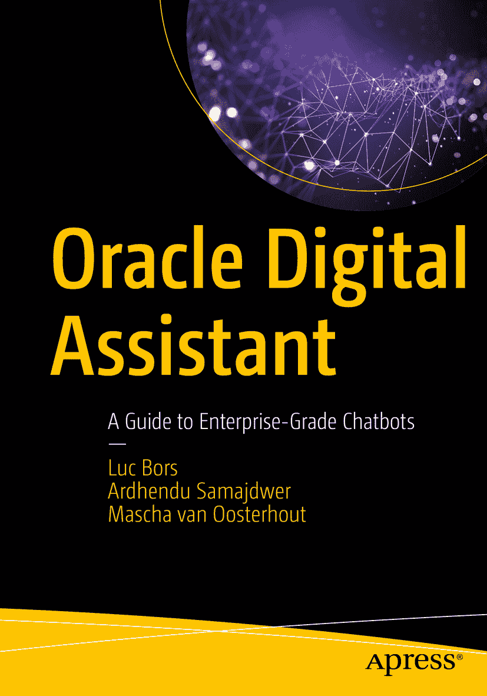

ISBN 978-1-4842-5421-9 e-ISBN 978-1-4842-5422-6 [`doi.org/10.1007/978-1-4842-5422-6`](https://doi.org/10.1007/978-1-4842-5422-6) © Luc Bors, Ardhendu Samajdwer, Mascha van Oosterhout 2020 本作品受版权保护。出版商保留所有权利，涉及材料的全部或部分内容，特别是翻译、重印、重用插图、朗诵、广播、以缩微胶片或任何其他物理方式复制，以及传输或信息存储与检索、电子改编、计算机软件，或现在已知或以后开发的类似或不同方法的权利。本书中可能出现商标名称、标识和图像。我们并未在每次出现商标名称、标识或图像时使用商标符号，而是仅以编辑方式使用这些名称、标识和图像，以利于商标所有者，且无意侵犯商标权。本出版物中使用的商品名称、商标、服务标志和类似术语，即使未明确标识，也不应被视为对其是否受专有权利保护的表达意见。尽管本书中的建议和信息在出版时被认为是真实准确的，但作者、编辑和出版商均不对可能存在的任何错误或遗漏承担法律责任。出版商对本书所含内容不作任何明示或暗示的保证。本书通过 Springer Science+Business Media New York 在全球图书贸易中发行，地址：233 Spring Street, 6th Floor, New York, NY 10013。电话：1-800-SPRINGER，传真：(201) 348-4505，电子邮件：orders-ny@springer-sbm.com，或访问 www.springeronline.com。Apress Media, LLC 是加利福尼亚州的有限责任公司，其唯一成员（所有者）是 Springer Science + Business Media Finance Inc (SSBM Finance Inc)。SSBM Finance Inc 是特拉华州的一家公司。

*“成就伟业的唯一途径是热爱你所做的事。”*

*——史蒂夫·乔布斯*

*每一个成就都始于尝试的决定。*

## 引言

聊天机器人，或者现在通常被称为数字助手，已经进入了企业领域。它们以交互方式协助用户执行管理任务，使这些任务更简单、更省时。通过阅读本书，您将学习理解数字助手的核心概念。

本书为您提供了开发企业级聊天机器人和数字助手的入门途径。它基于实际经验，并解释了使用 Oracle 技术开始构建您自己的数字助手所需了解的一切。通过阅读本书，您将从用户体验和技术角度熟悉数字助手开发所涉及的概念。您将学习使用 Oracle 技术（包括 Oracle 数字助手云）创建数字助手。

在本书的第一部分，您将学习数字助手（又称聊天机器人）技术的基本原理。之后，您将逐步了解设计数字助手所涉及的步骤，包括如何确保用户在使用助手时获得满意的体验。在本书的第二部分，您将学习如何实现第一部分中设计的数字助手。您将从基本实现开始，随后通过多语言支持、问答和 Webview 来增强该实现。本书的最后部分深入探讨了自定义组件开发、情感分析和语音。

本书面向希望使用 Oracle 技术和云平台实现数字助手的设计师和开发人员。本书非常适合刚接触数字助手创建的读者，并在进入技术实现之前涵盖了设计方面，包括用户体验设计。在其他平台上创建数字助手有经验的读者会发现本书对于过渡到 Oracle 技术和 Oracle 数字助手云非常有用。

-   **第 1 章。** 本章介绍 Oracle 数字助手，它是一个用于开发自然对话界面应用的平台。该平台使构建复杂的数字助手或简单的聊天机器人变得容易，这些机器人可以连接和扩展多个后端系统，如 Oracle ERP、HCM 和 CX。

-   **第 2 章。** 在本章中，您将找到设计数字助手时面临的关键问题的答案。我们试图解决的业务痛点是什么？用户现有的旅程是什么，如何改进？接触用户的合适渠道是什么，如何最好地利用它？机器人与用户之间的对话以及对话选项是什么，如何增强对话以利用渠道的属性、媒体和设施来提高用户交互性？对话中交换的、访问后端系统所需的关键词汇和实体是什么？在实际实现之前，有许多许多问题需要回答。

-   **第 3 章。** 为了理解数字助手的技术实现，本章将向您介绍 Travvy，即极限远足假期的数字助手。通过逐步的方法，您将熟悉 Travvy，从而了解所有细节，以便理解技术实现的所有步骤。

-   **第 4 章。** 在本章中，您将学习 Oracle 数字助手如何允许开发人员与设计师一起将初始流程输入到数字助手云中。这将加快设计与技术实现之间的过渡，因为设计师实际上可以看到数字助手的行为方式以及流程的执行方式。

-   **第 5 章。** 本章解释了技术实现中涉及的领域，例如流程、意图和实体。这些共同构成了您数字助手的心脏和身体。您将学习实现并理解这一点，以及如何使用训练设施使您的数字助手理解用户的意图。

-   **第 6 章。** 在本章中，您将向用户介绍您的数字助手。您将学习如何配置渠道。数字助手可以在任何支持 webhook 的消息服务上运行，webhook 是允许无需轮询即可进行实时消息传递的调用。

-   **第 7 章。** 在这里，您将学习如何实现多语言支持：您可以使用多语言方法或单语言方法。后者是 Oracle 数字助手使用的方法，并通过使用翻译服务进行扩展。

-   **第 8 章。** 自然语言对话本质上是自由流动的。但它们可能并不总是您的机器人从用户那里收集信息的最佳方式。例如，在某些情况下，如输入信用卡或护照详细信息，需要用户输入特定信息（并且精确输入）。为了帮助机器人的用户轻松输入此类信息，您的机器人可以调用一个外部应用程序，该应用程序提供带有标签、选项、选择、复选框、数据字段和其他 UI 元素的表单。您将学习如何使用 Webview 组件来实现这一点。

-   **第 9 章。** 常见问题解答本质上是那些仅仅在寻找答案的常见问题：“你们的营业时间是什么？”“我可以用信用卡吗？”“你们每周送货几次？”这些常见问题解答通常已经存在于公司中。在本章中，您将学习如何将它们引入您的机器人。

-   **第 10 章。** 您将学习如何构建自定义组件。每当数字助手需要执行内置组件提供的功能之外的特定操作时，例如返回后端数据或实现业务逻辑，我们就需要使用自定义组件。这些组件特定于用例，因此需要专门构建。

-   **第 11 章。** 使用情感分析背后的原因是人类心理学。当人们感到快乐或中立时，他们往往更能接受坏消息或挫折。通过从一开始就理解上下文，聊天机器人可以选择最佳行动方案并应用非常不同的模式。您将学习如何为您的数字助手添加情感分析，此外，您还将学习如何将语音实现为一个渠道。

我们创建了一个专门针对本书和数字助手的博客：

[`https://oda-book.blogspot.com/`](https://oda-book.blogspot.com/)

该博客将用于发布额外内容和其他可用于构建出色数字助手的文章。

假设读者没有聊天机器人技术的先验知识。成为专家所需了解的一切都包含在本书中。希望您喜欢本书！

