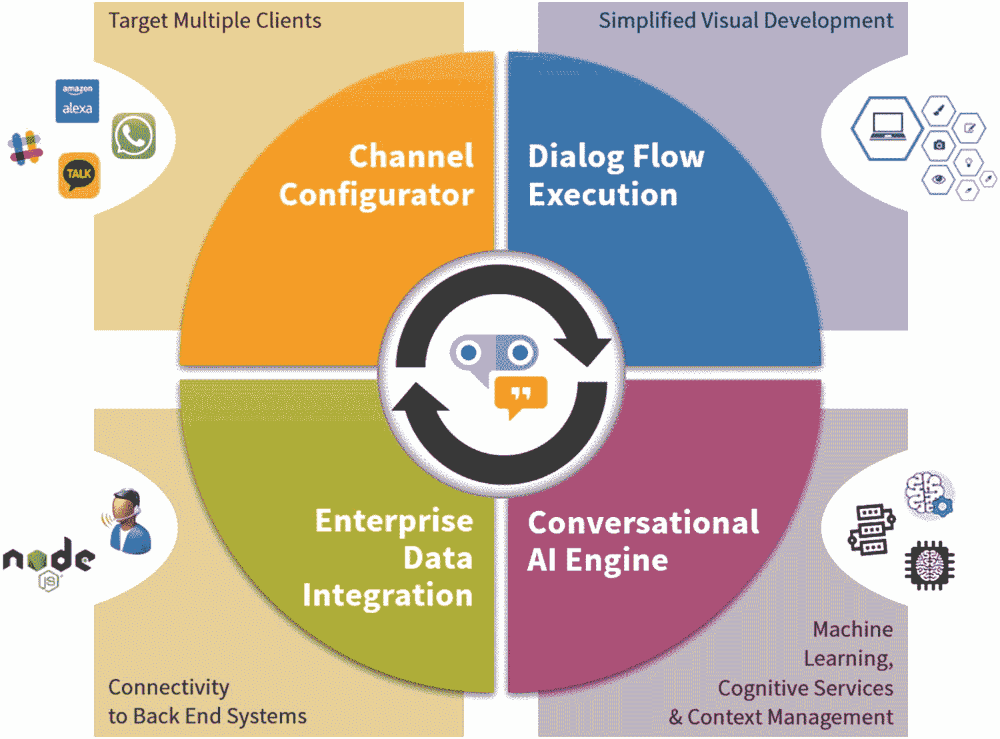
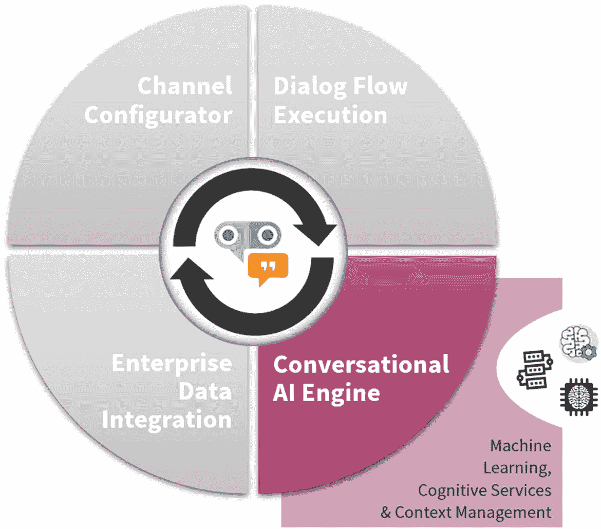
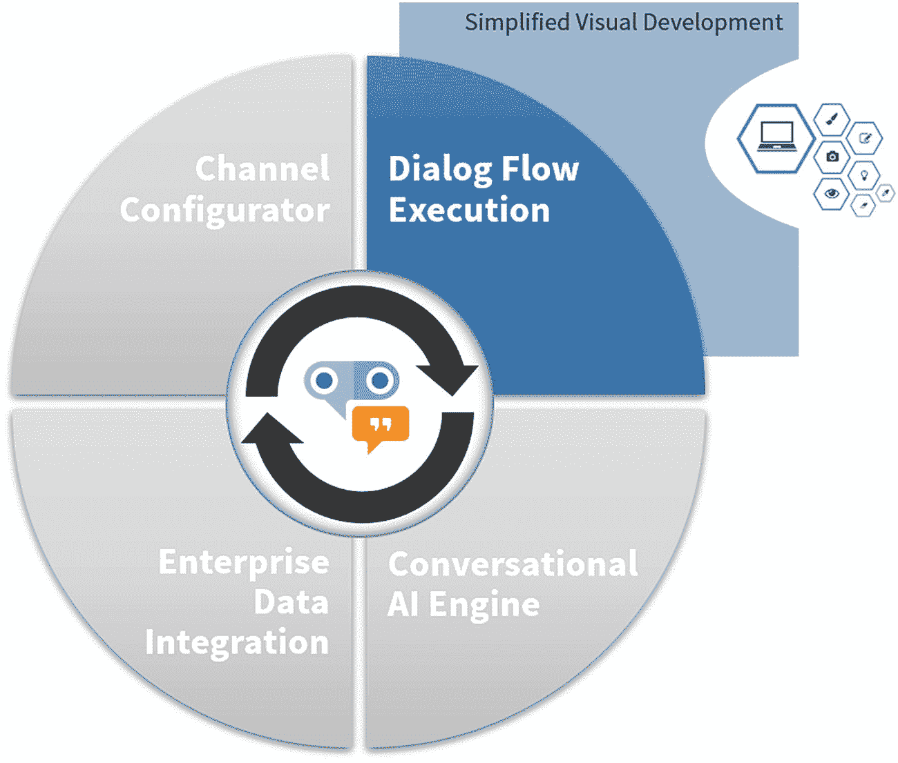
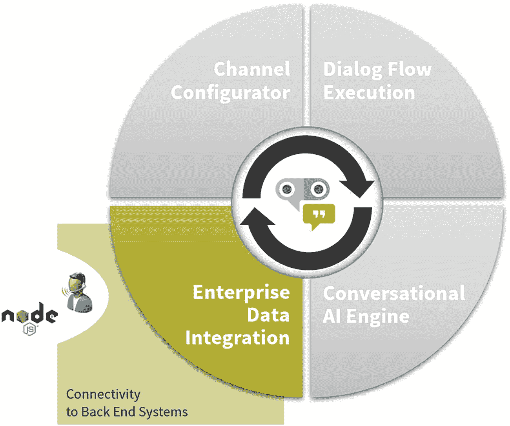
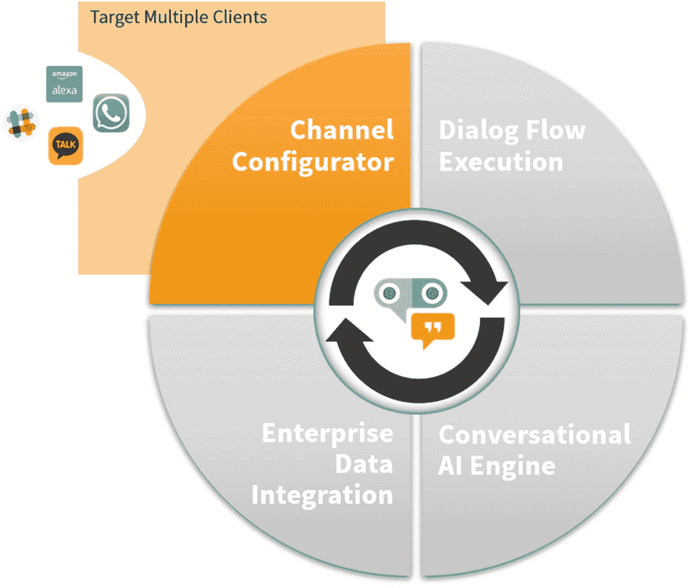

# 1. Oracle 数字助手简介

在过去的几十年里，计算机的尺寸从巨大的仓库级超级计算机变成了微小的口袋级智能手机。人们与计算机交互或使用程序的方式也发生了变化。从桌面和笔记本电脑上的客户端-服务器或基于浏览器的模式，到平板电脑和智能手机上的应用程序使用。在过去的几年里，应用程序的使用方式发生了巨大变化。最初是"每个任务一个应用"，如今越来越多的人希望"一个应用完成所有任务"。微信、Snapchat、Skype、Slack 和 Facebook Messenger 等即时通讯应用的使用量激增。除此之外，Google Home、Amazon Echo、Apple Siri 和 Microsoft Cortana 等虚拟私人助手也进入了人们的生活。让我们来看看这一切是如何发生的，以及 Oracle 如何抓住机遇，填补了消费者使用和企业使用之间的空白。

## 聊天机器人简史

聊天机器人的历史始于大约 70 年前，当时艾伦·图灵^(¹)提出，一台真正智能的机器是在纯文本对话中无法与人类区分的机器。这最终导致了"图灵测试"的产生，该测试可用于证明机器是否真正表现出智能行为。在他 1950 年的论文《计算机器与智能》中，他为我们现在所知的聊天机器人或数字助手奠定了基础。

在图灵之后大约 15 年，麻省理工学院人工智能实验室创建了`ELIZA`。这是一个自然语言处理计算机程序，能够基于脚本化的响应模拟人类对话。尽管许多早期用户相信`ELIZA`具有智能和理解能力，但实际上`ELIZA`无法进行真正理解的对话，没过多久人们就非常明显地意识到自己是在和一台机器说话。

在`ELIZA`之后不久，1972 年斯坦福大学创建了`PARRY`。`PARRY`是第一个真正拥有对话策略的"聊天机器人"。在 1972 年第一届国际计算机通信大会上，`PARRY`和`ELIZA`被设置成相互对话。

从`ELIZA`和`PARRY`到"聊天机器人"历史上的下一个里程碑，几乎过去了二十年。20 世纪 80 年代末，`Jabberwacky`被开发出来。`Jabberwacky`（至今仍在[`www.jabberwacky.com`](http://www.jabberwacky.com)上线）旨在以有趣、娱乐和幽默的方式模拟自然的人类聊天。`Jabberwacky`是第一个使用人工智能并因此能够学习的"聊天机器人"。它从过去的对话中学习。

在上世纪末和本世纪初，其他"聊天机器人"也相继出现，例如`Dr. Sbaitso`、`ALICE`和`SmarterChild`。`ALICE`（人工语言互联网计算机实体）基于`ELIZA`。尽管`ALICE`可以根据用户输入和模式识别与用户建立对话，但它从未能够通过图灵测试。

下一代聊天机器人包括来自大型厂商的机器人，如`IBM Watson`（2006 年）、`Apple Siri`（2010 年）、`Google Now`（2012 年）、`Amazon Alexa`（2015 年）和`Microsoft Cortana`（2015 年）。2016 年，Facebook 为 Facebook Messenger 引入了机器人，到年底已有超过 30,000 个机器人可用。

聊天机器人通常用作界面，例如提取产品详细信息。聊天机器人是任务导向的，而数字助手则以用户为中心。数字助手能够将不同的聊天机器人任务整合到一次对话中。这些助手可以真正协助用户完成任务，例如提醒您参加会议、管理您的待办事项列表等。当聊天机器人被要求提供此类虚拟协助时，它们通常会感到困惑，并最终不断重复询问相同的问题以进行澄清。理解构建聊天机器人不仅仅需要人工智能这一点非常重要。其他技能，包括用户体验和对话设计，也起着重要作用。糟糕的设计甚至可能导致数字助手失败。尽管聊天机器人和数字助手都被视为对话界面，但它们非常不同。最大的区别之一在于两者如何维持对话流程。与聊天机器人交互时，如果您在对话中途打断，聊天机器人很可能无法记住交互的上下文，而虚拟助手则使用动态对话流技术，因此它们可以理解人类意图并保持对话的进行。

以下示例展示了设计良好的助手如何应对从预订门票到查询余额的上下文切换：

"我想**预订一张**泰勒·斯威夫特在阿姆斯特丹演唱会的门票。"

- 好的，您对观看演出的位置有偏好吗？我们有 A 区 84 欧元，B 区 60 欧元，C 区 35 欧元。

"我**有多少钱**？"

- 您想知道哪个账户的余额？A) 储蓄账户。B) 信用卡。C) 支票账户。

"C，支票账户。"

- 好的，您有 1500 欧元可用。

"两张票，A 区，谢谢。"

- 好的。您也对泰勒·斯威夫特的周边商品感兴趣吗？我们今天有货。

如今，大多数数字助手的功能已超越简单的"请求与响应"。它们正在极大地改变品牌与客户互动的方式。

## Oracle 数字助手

前述的大多数聊天机器人主要面向个人使用。虽然它们也可以用于企业解决方案，但从需求来看，这些解决方案所提供的功能与企业实际需求之间仍存在诸多差距。

弥合个人数字助手与企业级数字助手之间的差距，正是 Oracle 的目标所在。到 2016 年底，Oracle 发布了其首个版本的 Oracle 数字助手。当时，它被称为 Oracle 聊天机器人，是 Oracle 移动云服务的一部分。大约两年后，Oracle 发布了 Oracle 数字助手（ODA）云服务，这是一款专门用于开发和运行数字助手的产品。数字助手是虚拟个人助手，能够在与用户交互时理解自然语言。通常，简单的聊天机器人能够解析用户的意图并帮助他们完成简单的任务。而 Oracle 数字助手则更进一步。每个数字助手都包含一组专门的技能。这些助手可以被训练使用多种不同的“技能”。这些技能可以拥有自己的后端领域集成，并且可以在跨技能的用户对话过程中与这些后端协同工作。它们会评估用户输入，并调用合适的技能来启动或继续对话。

通过这种方式，用户所需完成的一切都可以在单次对话中实现，无需与多个聊天机器人打交道。用户还可以在对话中途切换，而数字助手仍能理解用户问题的上下文。技能之间的上下文共享是成功的关键，对于提供良好的用户体验至关重要。可以想象一下某人的位置、情绪或特定时刻的需求等因素。这些属性会影响用户愿意接收哪些消息，更重要的是，会影响在何时何地接收。

Oracle 数字助手还能够根据从外部应用程序接收到的计划事件，主动与用户发起对话。这被称为应用程序发起的对话（AIC）。Oracle 数字助手可以利用应用程序事件消息的内容，在对话流程中的预定状态开始对话。这是 Oracle 数字助手区别于其他聊天机器人的特点，后者通常只“在有人说话时才回应”。

## Oracle 数字助手核心组件

为了清晰理解 Oracle 数字助手（ODA），你需要了解其高层架构。Oracle 数字助手由一组协同工作的组件组成，以支持企业级数字助手的开发和使用。在本节中，你将了解这些组件是什么以及它们的主要用途。

图 1-1

Oracle 数字助手 – 核心组件

Oracle 数字助手是一个平台即服务（PaaS），它使你能够创建数字助手，并将其暴露给许多不同的接口，这些接口称为渠道。Oracle 数字助手允许你创建`数字助手`和`技能`。

数字助手可以帮助用户通过自然语言对话完成多项任务。每个数字助手通常拥有自己的一套技能。

技能可以被视为对话的主力，可以与一个或多个数字助手配合使用。可以想象一下诸如在特定商店订购鲜花或查询银行账户余额等任务。使用 Oracle 数字助手，技能的使用并不局限于单个数字助手。

技能和数字助手的实现依赖于四个协同工作的核心组件（图 1-1）：

*   对话式 AI 引擎
    *   使数字助手能够处理用户输入
*   对话流
    *   定义用户可以与特定技能进行的交互
*   企业数据集成
    *   使数字助手能够通过其技能连接到后端系统
*   渠道配置器
    *   使数字助手能够在消息平台中使用

在深入探讨技能和数字助手的开发之前，你需要先了解其中一些概念，这些将在本章剩余部分进行解释。我们首先来看一下对话式 AI 引擎。

### 对话式 AI 引擎

使用 Oracle 数字助手时，你无需担心用于处理和理解自然语言的技术，也无需担心如何处理用户输入。Oracle 数字助手使用基于神经网络的不同技术来实现其自身的对话式 AI 引擎（图 1-2）。这些技术利用语言和语言建模来处理来自最终用户的自然语言。

图 1-2

*Oracle 数字助手 – 对话式 AI 引擎*

有了这些，开发者可以专注于用户对话，而无需了解这些底层算法的所有繁琐细节。

意图和实体都是常见的 NLP（自然语言处理）概念。NLP 是从文本中提取文本意图和相关信息的科学。

`意图`是用户期望你的技能为其执行的一组任务或操作。意图通常包含动词和名词，例如“提供报价”、“获取日期”和“查找行程”。它们使你的技能能够理解用户希望它做什么。换句话说，它们可以确定用户的意图。例如，一个 `FindTrip` 意图可以关联到一条直接指令，例如*我想找一趟行程*，也可以关联到其他请求，例如*我真的很想来个短假*，这两者都是同一意图的`表述`。

意图将单词和短语映射到特定操作，而`实体`则为意图本身添加上下文。它们是用户输入片段的关键标识符，使技能能够完成任务。基本上，实体是修饰意图的词语（大的、现代的、户外的、短的、最佳可用的）。实体可以分为用户创建的实体和系统实体。上述所有概念将在本书中更详细地讨论。

#### 对话流执行

接下来要介绍的组件是`对话流`（图 1-3）。对话流定义了用户与技能之间可能的交互方式，描述了技能如何根据用户输入进行响应和表现。

图 1-3

Oracle Digital Assistant – 对话流执行

Oracle Digital Assistant 使您能够定义具有上下文感知能力的对话式交互。拥有上下文感知的对话非常重要，因为最终用户不一定会紧扣主题，在对话过程中可能会分支到不同的状态和上下文。例如，如果用户想买花，但在继续付款之前，他必须先检查账户余额。

在流程的某个时刻，用户会指示助手“支付花款”。助手的回复可能是“从哪个账户支付”。用户会选择“支票账户”，但实际上并不清楚该账户中有多少钱。然后用户会切换上下文，询问当前余额。换句话说，就是将状态从“向花店转账”转变为“查询余额”。在某个时刻，用户会决定返回到支付花款的流程。

Oracle Digital Assistant 平台通过内置的状态管理功能，使您能够处理这类场景。作为开发者，您无需编写和维护解决方案代码。

#### 企业数据集成

在创建企业级数字助手时，它们显然也需要一种访问企业数据的方式（图 1-4）。Oracle Digital Assistant 简化了与后端系统的连接。它帮助您扩展诸如 Oracle HCM、Oracle ERP 和 Oracle CX 等后端系统。然而，您并不局限于 Oracle 产品。您也可以连接到第三方应用程序。所有这些操作，正如企业级解决方案所预期的那样，都可以以安全且可扩展的方式完成。

图 1-4

Oracle Digital Assistant – 企业数据集成

为了在 Oracle Digital Assistant 中集成企业数据，您可以使用`自定义组件`。它们为您的技能提供通用功能，例如输出文本，或者从后端返回信息并执行自定义逻辑。作为开发者，您可以创建用 JavaScript 开发并部署在 Node.js 服务器上的自定义组件。在对话流执行期间，可以调用自定义组件来从后端系统检索信息或执行事务。当然，这些操作将使用您必须在后端系统中提供的 API。

另一种跳出流程的方式是通过`问答（QnA）`。这实际上是助手的常见用例。每当用户输入的短语与 QnA 中的搜索词匹配时，匹配的问题和答案就会显示给用户。开发的技能可以作为常见问题解答（FAQ）或其他知识库文档的接口。常见问题解答是那些寻求答案的常见问题：“你们的营业时间是几点？”、“我可以带孩子吗？”、“你们有纯素披萨吗？”

您只需通过从简单的电子表格中导入问答对集合，即可轻松集成 QnA 服务。QnA 和意图可以在同一个流程中使用。

#### 人工坐席移交

有时，您的聊天机器人用户确实需要与真人交谈。Oracle 的 Digital Assistant 可以配置为能够将对话移交给 Oracle Service Cloud 中的坐席。

人工坐席可以像处理常规的入站通信一样处理该查询。坐席可以准确看到用户与 Digital Assistant 之间讨论的内容。这意味着无需要求用户不必要地重复自己。坐席可以与用户进行双向对话，在将对话控制权交还给助手之前帮助用户。通过这种方式，Oracle Digital Assistant 实现了呼叫中心坐席与数字助手之间的无缝协作。

#### Webview 组件

通常，用户与数字助手之间的对话流程是非常非结构化的。对人类来说，这是一种非常自然的交互方式。然而，有时您可能需要一种捕获结构化信息的方法，例如数据输入表单。这时您可以使用 Oracle Digital Assistant Webview 组件。这些`Webview 组件`是小型、自包含的模块化应用程序，使用户能够完成简单的任务，例如任务升级或输入购买详情。它们可以集成到对话流程中，从而使数字助手能够与用户进行结构化（webview）和非结构化（聊天）两种交互。

用户可以从与机器人的自然语言对话切换到类似应用程序的体验，用于结构化数据输入、即时验证和富媒体。

在 Oracle Digital Assistant 中，您会找到一个基于 Web 的构建工具。使用此工具，您可以声明式地开发丰富的表单，包括图像、图表、地图和签名捕获。添加验证以确保捕获数据的准确性也非常容易。

Webview 组件可以通过对话中的链接调用。一旦数据输入完成，就可以将其传回数字助手，流程将从进入应用程序之前的位置继续执行。

#### 渠道配置器

数字助手高层架构的最后一个组件是渠道配置器（图 1-5）。数字助手并非可以安装在智能手机或平板电脑上的应用程序。通常，它们通过不同的`渠道`提供。

图 1-5

Oracle Digital Assistant – 渠道配置器

这些渠道，也称为消息平台或消息应用，例如 Facebook Messenger、Slack 和网页，是用户与数字助手交互的实际平台。也支持纯文本渠道，例如 Twilio SMS 和微信。这些渠道在 Oracle Digital Assistant 中使用其特定于平台的配置进行配置，并允许从消息平台访问数字助手，反之亦然。一个数字助手或技能可以配置多个渠道，以便它可以同时在多个不同的服务上运行。

#### 可执行的洞察

Oracle 数字助理中另一个非常有价值的功能是内置的分析功能。这些功能使您能够对对话进行深入分析。它将向您展示数字助理的使用情况，以及对话中存在的潜在问题。分析功能还能帮助您获取一些利用率信息，这些信息可用于提高数字助理的准确性，从而为您最终用户创造更佳的体验。系统提供了几种即时报告。**概览报告**会以图表形式展示所有对话指标。您可以查看用户随时间推移是放弃对话还是完成对话。它还能帮助您确定热门意图、最常用的渠道、对话时长以及错误计数。

**意图报告**提供针对特定意图的执行指标数据和信息，而**路径报告**则以可视化方式呈现某个意图的对话流程。此外，还有**对话报告**，它显示对话的实际记录文本。这将帮助您在对话流程和聊天窗口的上下文中查看对话。最后，还有**重新训练报告**。此报告可用于通过有节制的自我学习来改进已开发的技能。

所有分析数据都会自动收集，并与数字助理的测试工具集成，以便即使在测试期间也能收集和分析数据。本书后续章节将更详细地讨论这些报告，届时您将学习何时以及如何使用这些报告。

## 总结

在本章中，您了解了聊天机器人的历史以及 Oracle 数字助理是如何从中演变而来的。您还获得了 Oracle 数字助理所涉及组件的高级概述，以及这些组件如何帮助您构建企业级数字助理。所有这些组件以及更多内容，都将在本书的其余章节中进行深入讨论。

脚注 1

