# 2. 设计对话式用户体验

在没有商业案例的情况下构建数字助理是注定失败的。在开始之前，您应该始终尝试回答关键问题，例如：

-   我们试图解决的业务痛点是什么？
-   用户现有的使用流程是怎样的，如何改进？
-   接触用户的合适渠道是什么，以及如何最好地利用它？
-   机器人与用户之间的对话以及对话选项是什么？如何增强对话以利用渠道的属性、媒体和功能来改善用户交互？
-   关键词汇是什么？对话中交换的实体有哪些？

回答这些关键问题正是设计阶段的价值所在。

## 为什么需要对话式用户体验？

简单来说，人与人之间的交谈比使用技术要自然得多。这是因为对话是天生的本能。与朋友或陌生人交谈时，如果我们说了令人困惑或说错的话，我们可以轻松地纠正自己。因此，自人类开始交易以来，人们就一直利用对话来推动销售和让客户满意。

对话式用户体验（UX）转向了一种人类沟通的形式，就像一个人在与另一个人进行正常对话一样。参与对话式用户体验的两种流行方式是通过语音说话和通过向聊天机器人输入文本。千禧一代似乎更喜欢打字而不是打电话。而我们其他人也正在逐渐适应这种方式。

对话式用户体验帮助企业更有效地销售其产品/服务或帮助客户。这也是通过消息和聊天应用（如 Facebook Messenger、WhatsApp、Talk 和微信）或通过语音技术（如亚马逊的 Echo 产品，它通过语音命令与公司交互）与企业进行交互这一趋势的原因。通过对话式商务，客户可以在消息应用内与公司代表聊天、提问、获得客户支持、获得个性化推荐、阅读评论并一键购买。随着越来越多的人成为重度移动用户，提供更无缝的移动在线购物体验是一个很好的商业理念。通过对话式商务，消费者可以与人类代表、聊天机器人或两者结合进行互动。

对话式商务之所以强大，是因为它：

-   使品牌与消费者之间的自动化交互感觉更加人性化。作为界面的对话仍然是人类与技术交互最自然的方式。
-   减少了完成一个操作所需的步骤以及消费者需要求助的信息源数量。
-   实现了与客户的双向沟通。它不仅告诉客户信息，还从客户那里学习，倾听他们的问题，并建立关系。提供迎合用户主动意图的个性化体验，对于满足（和取悦）用户，并最终赢得他们的信任和忠诚度至关重要。
-   是一种极其有效的方法，用于吸引用户/客户，根据他们的需求收集信息，理解他们的主动意图和目标，然后提供最有可能满足这些需求的体验。
-   创造了一种比电子邮件等更具人情味和意义的互动。不仅语言听起来很自然，就像朋友或家人与用户交谈一样，而且它还能让用户一次性继续对话，从而立即加强关系，如图 2-1 所示的示例。

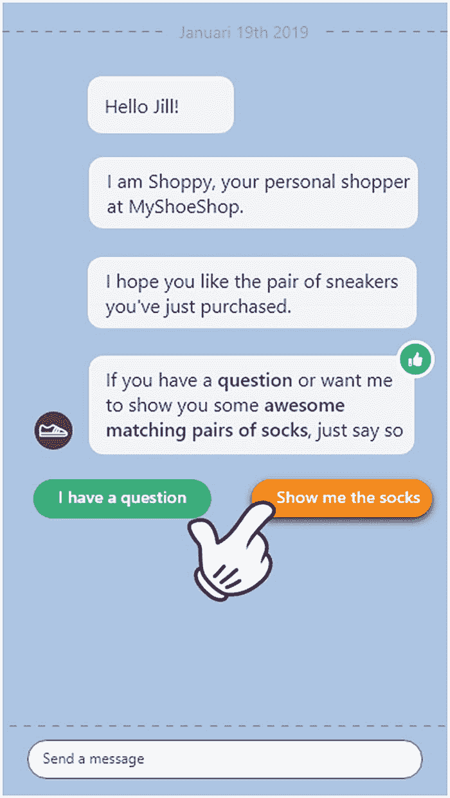

图 2-1

用户只需点击一下即可继续对话

-   对话式商务缩短了潜在客户与购买之间的距离。它为客户提供了在商店里可能从销售助理那里得到的关注。当从网站订购时，他们可以阅读评论以了解产品是否适合自己，但使用聊天功能，他们可以请求帮助比较选项——更像是在店内获得的建议。

请注意，并非所有内容都适合对话。您不希望聊天机器人列出完整的产品目录或用户手册。对话界面是一种补充界面。

例如，当用户需要详细的说明或教程时，视频比文本效果更好。这保证了可用且固定的信息流，这是使用聊天时无法保证的。在这种情况下，固定的信息流效果更好，不会用大段文字填满聊天对话框。

本质上，对话式用户体验是关于让技术的行为和交互方式更像我们彼此之间的互动。

## 设计对话式用户体验

为了设计出独特的对话式用户体验，本章将揭示一种方法，通过八个步骤引导你获得令所有利益相关者满意的结果——这些利益相关者包括营销经理、开发团队，以及同样重要的最终用户/客户，他们对于最终以聊天机器人形式呈现的体验，各自有着特定的要求、期望和需求。图 2-2 展示了所有利益相关者之间的关系。

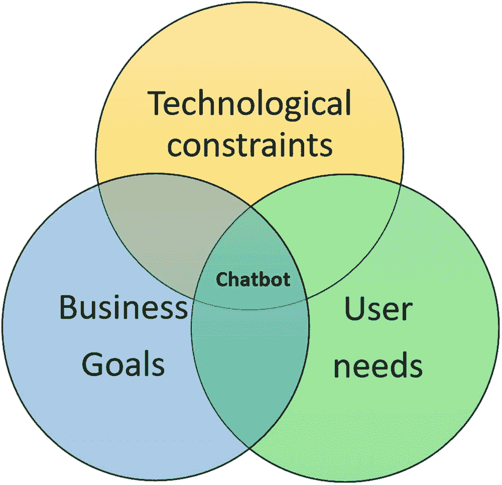

图 2-2

挑战在于找到良好的平衡

我们将流程分为八个步骤。图 2-3 展示了这些步骤。随后各节将依次描述每个步骤。

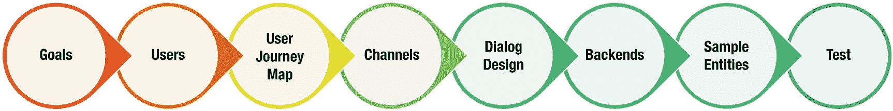

图 2-3

八个设计步骤

## 目标

设计出色聊天机器人的第一步是问自己：“我们真的需要聊天机器人吗？”

> *设计的“为什么”应始终先于“怎么做”。*——威尔·范吉，《内部设计》

至关重要的是，对话式用户体验，以及最终的聊天机器人，必须有其存在的目的。这是所有工作的基础。这应该是在你开始考虑设计对话式用户体验之前很久就要做的事情。

当你明确了聊天机器人的目的时，你就已经回答了那些需要解答的基本问题，从而可以进入设计流程。

为了了解客户对你的对话式体验有何目标，你可以采访不同的利益相关者，他们了解当前的业务目标并对未来有愿景。不同的利益相关者可能有不同的目标。

例如，CEO 可能希望利用聊天机器人来：

* 击败竞争对手
* 扩大客户覆盖范围和客户认知度
* 减少服务台员工数量，从而使公司更具成本效益

另一方面，营销经理希望聊天机器人能够：

* 在 Facebook Messenger 上与客户无缝连接
* 直接从在线商店与客户聊天
* 根据购买历史和通过对话收集的客户数据推荐产品
* 在客户离开商店后与他们保持联系
* 询问客户是否准备再次订购附加产品

最后，服务台经理可能希望：

* 让客户知道他们的订单已收到或已发货
* 在客户首次购买后表示感谢
* 向客户确认包裹已送达并征求他们的意见
* 进行故障排除
* 回答问题

设计的主要目标是保持目标简单，因此不要陷入所有约束和需求中。要包含足够的信息，让所有利益相关者了解该项目相对于他们自身同时试图完成的其他任务，究竟要达成什么目标。

对目标进行优先级排序，并在设计对话式体验时牢记这些目标。

每做一个设计决策时，都要问自己：“这个设计能让我们朝着目标前进吗？”

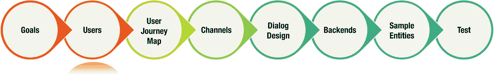

图 2-4

### 用户

正如你在图 2-2 的维恩图中看到的，用户的需求和期望在设计对话式体验时扮演着重要角色。这就是为什么你应该充分了解你希望聊天机器人与之沟通的用户。

以用户为中心的设计流程的第一步是进行用户研究。通过这种方式，例如观察和访谈潜在用户，你可以了解：

* 他们的目标和优先事项
* 他们的行为
* 日常习惯
* 他们的教育背景和技能
* 他们对企业所在领域的知识
* 他们对电脑、智能手机、互联网、社交媒体和其他渠道等工具的使用情况

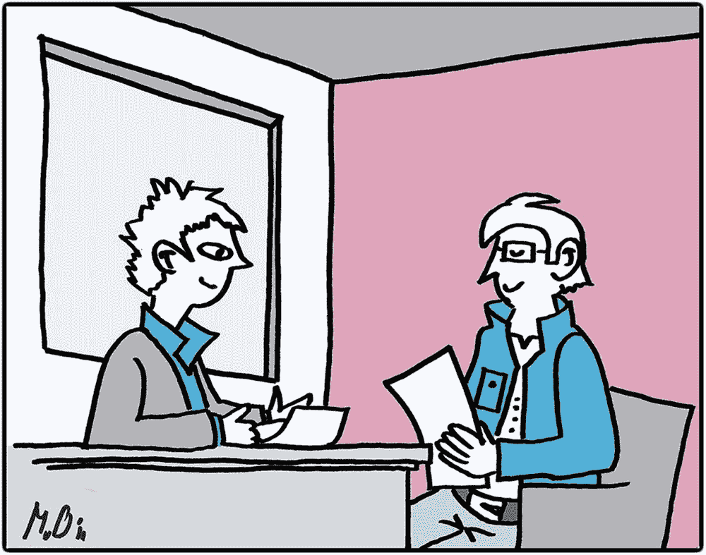

图 2-5

通过访谈和观察目标群体进行用户研究

一旦你获得了所有这些有趣且有用的丰富数据，挑战就在于如何将其传达给设计/开发团队的其他成员。我们一直使用的一个有效方法是创建一个或多个人物角色。

#### 创建人物角色

> *人物角色是一个现实的角色素描，代表目标群体的某个特定细分。*——史蒂夫·穆尔德/齐夫·亚尔，《用户永远是对的》

人物角色实际上是虚构的人物。人物角色的目的是传达我们对用户的所有了解，并确保在整个项目生命周期中被记住和使用。为此，人物角色必须被设计/开发团队所采纳。

一个人物角色有一个名字，并由一张图片和一些相关特征的摘要来代表。一句引语，将他们的需求、情感、动机和目标浓缩成一句话，具有赋予人物角色更多个性的额外优势。图 2-6 展示了一个如何描述和说明人物角色的示例。

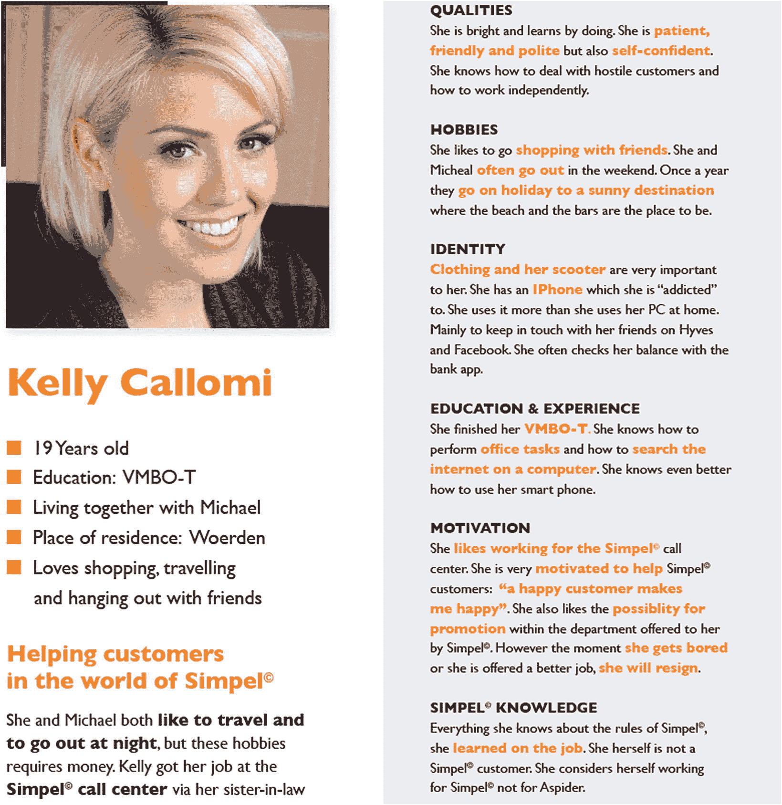

图 2-6

代表呼叫中心员工的人物角色示例

每个主要用户群体至少应有一个对应的人物角色。之所以使用“主要”这个词，是因为理想情况下你应该使用三到五个人物角色。每个人物角色都应有自己的个性，并且令人难忘。如果你有超过五个人物角色，人们往往会感到不知所措。而且似乎：

> *当你为你的主要人物角色设计时，你最终会让主要人物角色感到愉悦，并满足次要人物角色。如果你为所有人设计，你无法取悦任何人。这就是平庸产品的配方。*——艾伦·库珀

### 用户画像的益处

用户画像之所以有益，是因为它们有助于聚焦和定位你的思考。用户画像能帮助你以更具体的方式思考受众及其需求。精心记录用户画像的益处包括：

-   将焦点放在“真实用户的需求……”上。
-   帮助设计师/开发者更容易地与用户产生共鸣。
-   对许多不同的利益相关者都有用：
    -   业务开发（战略制定）
    -   营销团队（吸引用户）
    -   设计团队（为用户设计）
-   用户画像能促进团队内部达成共识。当用户画像被采纳时，这一点会变得很明显。然后团队开始直呼其名地引用它们，“凯莉绝不会想那样做”……而其他人也不会问凯莉是谁。
-   用户画像能提高效率。
-   用户画像既能代表当前用户，也能代表未来用户。它们帮助团队更多地思考对话式体验的未来用途。
-   用户画像能激发突破性思维。

创意/开发团队中的每个人现在都对他们正在为其创建对话式体验的用户形象有了概念。在向设计/开发团队介绍用户画像后，通过张贴用户画像海报，它们将更顺利地被采纳，并在开发过程中逐渐深入人心。

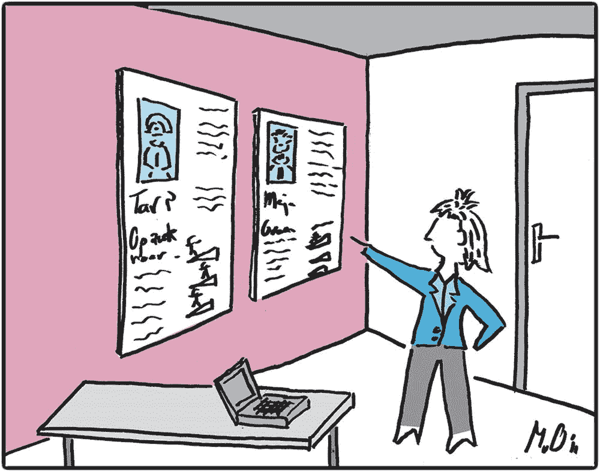

图 2-7  
墙上真人大小的用户画像将时刻印在团队脑海中

用户画像使团队能够基于对用户的了解来设计聊天机器人。他们开发什么、如何运作、想要达成什么目标，以及同样重要的语气语调，都可以基于你对用户的了解。

## 用户旅程地图

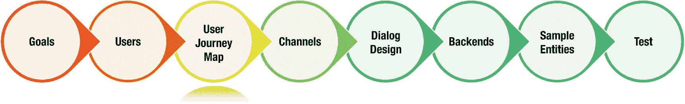

图 2-8

既然我们已经对对话式体验的用户有了清晰的认识，接下来需要弄清楚他/她将经历怎样的旅程，通过使用我们即将创建的聊天机器人等触点/渠道来实现其目标。实现这一目标的一个著名方法是定义用户/客户旅程地图。

客户旅程描述了客户在与您公司的品牌、产品、服务、网站或应用程序互动时所经历的所有体验。客户遇到的触点被用来构建旅程并创建一个引人入胜的故事，详细描述他们的互动及伴随的情感。

客户旅程不仅仅着眼于交易或体验的一部分，而是记录了作为客户的完整体验。对话式体验可以为客户旅程的每个部分增加价值，例如，从客户下第一笔订单到即时回答与产品相关的问题。

### 如何创建用户/客户旅程地图？

识别用户与您的产品、服务、网站或应用程序互动的触点至关重要。一旦确定了触点，就可以将它们按顺序连接起来，代表客户在与各个触点互动时所遵循的路径。图 2-9 展示了一个整体客户旅程地图的示例，其中包含了用户规划并通过史基浦机场使用公共交通前往阿姆斯特丹进行短途旅行的所有可能触点和路径。

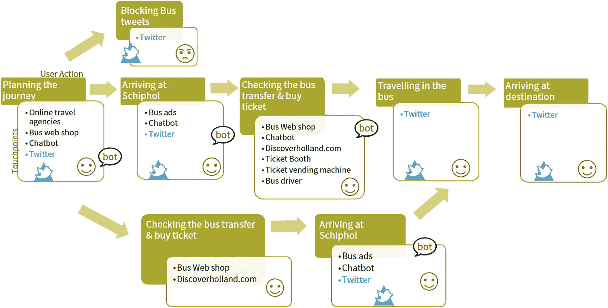

图 2-9  
展示不同路径的旅程地图示例

你需要分析客户执行的活动，并记录他们在旅程的每个活动中正在做什么。

描述旅程中的每个相关时刻，并尝试识别以下内容：

-   使用情境：他们在何时何地使用该触点。
-   他们想要达成什么目标（他们的意图）？
-   他们采取了哪些步骤来实现目标？
-   他们考虑什么？
    -   他们有疑问吗？
    -   是否存在不确定性？
-   什么影响了客户？
    -   是什么激励了他们？
    -   是否存在令人气馁的障碍？思考任何可能导致客户在旅程中放弃的因素。
    -   他们感受到了什么情绪？
-   他们期望得到什么反馈？

这将形成一个更详细的客户体验可视化图。图 2-10 提供了此类可视化图的一个示例。

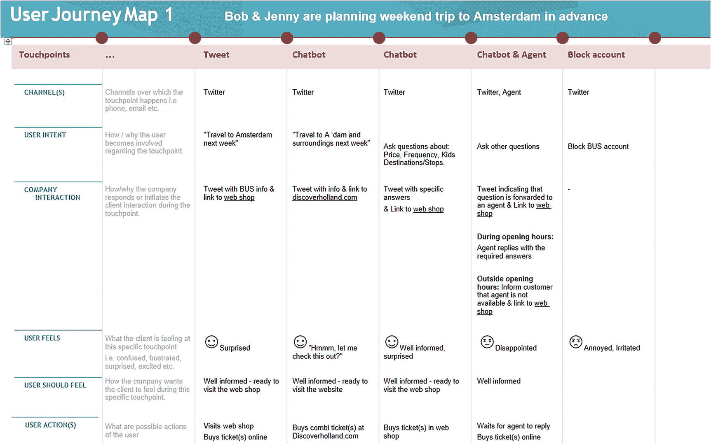

图 2-10  
详细的客户/用户旅程地图

### 为什么客户旅程地图如此有用？

客户旅程地图的益处包括：

-   它从用户的角度出发，为你提供了影响体验因素的高层概览。
-   该地图提供了对触点（未来）使用情况（使用情境、使用频率）的洞察。
-   它有助于识别问题领域和创新机会。例如，你是否可以通过主动解决客户在旅程各阶段可能遇到的问题来改善客户体验？
-   地图中的不同阶段可用于进一步分析和创建使用场景。

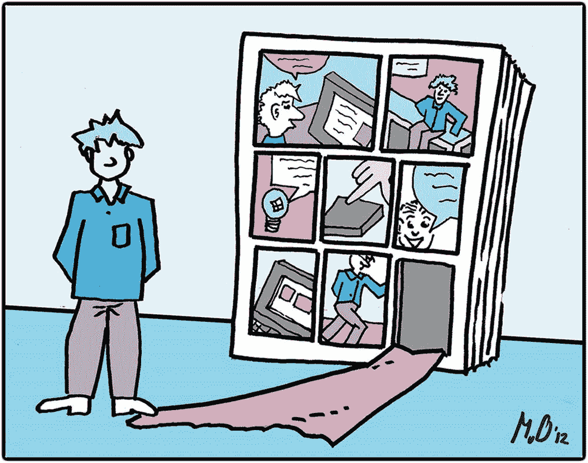

图 2-11  
用户在场景创建中扮演主角。

-   它有助于你确定优先级。
-   在整个设计过程中，每一个重大的设计决策都将由客户旅程地图驱动。

### 下一步是什么？

在完成用户/客户旅程地图后，你就知道了旅程的哪些部分至关重要。这些部分是经常发生或对用户至关重要的。目标是帮助用户从头到尾完成其中一个旅程，并确定这些旅程是否可以通过你的聊天机器人设计来服务。

## 渠道

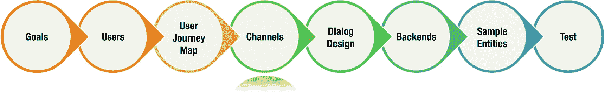

图 2-12

聊天机器人设计的下一步是确定哪些渠道适合在用户的旅程中通过你的聊天机器人触达客户/用户，以及如何最好地利用这些渠道。

关于应该使用哪些渠道来触达客户的问题有两个方面：

-   企业认为哪个渠道是借助聊天机器人向客户提供协助的最有效方式？它可能是企业已经用于触达客户的渠道之一，甚至是一个全新的渠道，企业将其视为触达更多客户并增加产品/服务销售的机会。
-   在哪个渠道中，客户最期望（甚至可能需要）聊天机器人的协助？

### Facebook Messenger

Facebook Messenger 聊天机器人非常适合营销和销售。它们提供了通过对话与潜在客户互动的途径，使公司能够围绕其产品对用户进行教育、推广和娱乐。聊天机器人还可以跟进在电商商店中放弃购物车的用户，甚至在 Messenger 内完成销售。

许多公司使用聊天机器人进行客户发掘和潜在客户生成。在这种情况下，它们用包含“发送到 Messenger”按钮的个性化行动号召，取代了用于获取客户/潜在客户电子邮件地址的典型“挤压”页面。通过这样做，用户无需输入任何内容，无需提供电子邮件地址或姓名。当然，通过 FB Messenger，公司可以获取用户的真实姓名（大多数情况下）、性别以及他们系统的语言。

Facebook 允许企业将 Messenger 作为网站上的客户聊天功能进行集成。人们可以在网站聊天窗口中开始对话，并在 Messenger 上继续。

### Twitter

您的聊天机器人可以向在 Twitter 上提及您、您提供的服务或您公司的客户发送包含相关信息的直接回复。该机器人还可以使用 Twitter 直接向客户询问更多信息，以便提供更好的帮助。

您可能用于对话体验的其他渠道包括 Web、Slack、iOS、SMS、Google Home、Android 和 Alexa。

## 对话设计

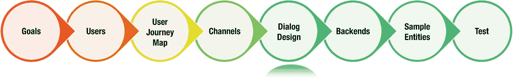

图 2-13

下一步是设计您的机器人对话。它应该吸引用户并推动他们实现目标，同时确保公司的目标得以实现。

理想情况下，对话由文本和附件（如音频、视频、图像和文件）混合组成。对话还可以呈现菜单和按钮，使用户能够快速回复。图 2-14 展示了此类对话的一个示例。

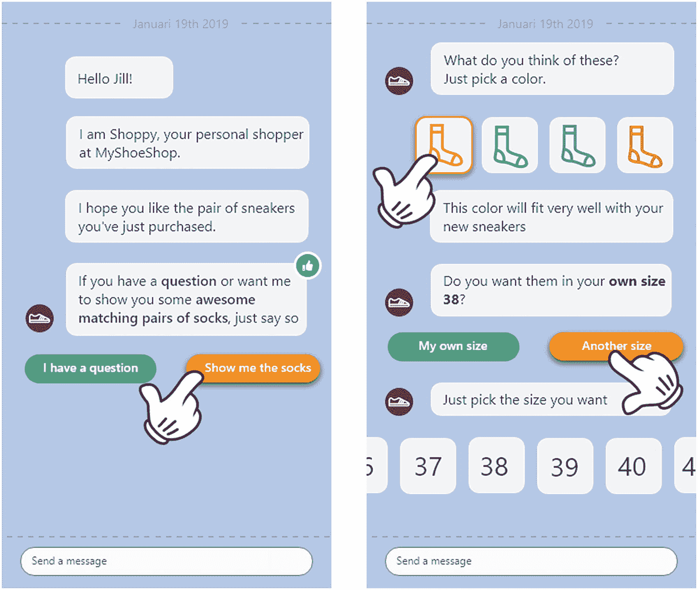

图 2-14

带有快速回复选项的对话示例

### 聊天机器人的个性与语气

每个机器人都有一种声音——这意味着每个机器人都需要个性。聊天机器人的个性由其风格、语气和态度决定。

聊天机器人和语音助手是供人类使用的。对话界面负责处理人与计算机之间更好的交互。通过个性，我们可以个性化这些对话，使其更逼真、更亲密，并更具人类互动的代表性。构建丰富且详细的个性使您的聊天机器人对用户更具相关性、可信度和吸引力。它鼓励客户表现出更大的信任和粘性。

个性有助于更好地理解机器人，以及它将如何通过语言、情绪、语气和风格的选择进行沟通。如果您不为聊天机器人创建个性，用户自己也会为其赋予一个个性。那么您将面临风险，即用户对您机器人的感知可能与您希望其关联的形象不符。

#### 构建个性

为了定义聊天机器人的个性，您需要再次经历创建人物角色的过程。创建一个能够真实代表理想客户、模仿人类互动的角色。模仿客户的个性是吸引用户的关键。定义年龄，描述态度、一些典型词汇和个性背景。您可以选择将其设为男性、女性或完全无性别。然而，机器人不应体现性别刻板印象，除非这符合您公司的品牌和目标。创建一个角色，并为其命名，并选择一个代表您公司且能吸引用户的图片/图标。

在这样做时，请牢记以下几点：

- 客户应在情感上与机器人的个性建立联系，从而与对话体验建立联系。
- 如果机器人代表您的品牌，那么机器人的个性应与品牌的价值观和语气保持一致。许多公司在代表机器人的图片中使用其徽标（的一部分）。
- 机器人应具有亲和力，但不应是真人。它应该以机器人的身份表达自己；绝不应伪装成人类。当用户不确定他们是在与人类还是机器交互时，他们会感到被误导，失去信任，并拥有糟糕的体验。客户应该知道他们正在与机器人打交道。例如，可以通过让机器人自我介绍为机器人来实现这一点。

> *“你好！我是 Cuby。我是一个聊天机器人。有什么可以帮你的吗？”*

#### 语气

现在您已经定义了聊天机器人的个性，您需要了解机器人应该如何“说话”。您可以通过写下机器人的关键价值观来弄清楚这一点。您需要定义聊天机器人的态度、风格和语气，这些应反映其个性。然后决定应该使用什么词汇。

然后，您可以将您设计的个性与您设想的语音结合起来，编写您的机器人消息。

例如，一个酷酷的机器人：

> *“嘿，Harold，咋样？我看到你正在查看这个超级酷的徒步旅行假期。我能帮你什么吗？”*

或者一个严肃且专业的机器人：

> *“你好 Amy，我看到你正在编辑你的工时表。我能帮上忙吗？”*

### 对话流程

对话流程可以用流程图来可视化。为了创建对话，客户/用户旅程图非常有用。在地图中，您可以找到用户意图以及机器人（代表公司）应该如何反应。用户意图可以从用户当时正在做的事情中推断出来，或者通过机器人提出的问题（如对话开场白）来推断：

> *“你好！我是 Cuby。我是一个聊天机器人。我能帮你处理预订吗？”*

### 设计激励性对话

聊天机器人能够带来愉悦感并激励用户采取行动，这一点至关重要。当机器人满足用户的需求和愿望时，它就会带来愉悦感。激励能够促成某种行为。用户可能受到以下一个或多个因素的激励：

#### 信息

机器人提供的信息应与用户相关、易于理解、值得信赖，并能促成相关选择。用户还应能轻松了解机器人能做什么或不能做什么，以便设定正确的用户期望。机器人应清晰地传达其核心功能。如果用户意图被误解或系统无法实现，请诚实告知，让他们知道需要尝试不同的方法。

> *“你知道我可以帮你处理……吗？”*

> *“抱歉，我只能帮你处理有关飞往美国的航班的问题。”*

> *“抱歉，我不明白你的意思，你能重新表述一下问题吗？”*

#### 目标设定与承诺

人们通过比较现状和理想的未来来设定目标。作为机器人对话的设计者，请确保您了解客户的目标，并引导他们实现这些目标。

当用户致力于他们的目标时，他们更有可能坚持该行为并保持专注。

训练机器人通过创建更具吸引力和更个性化的闲聊对话，与用户就个人话题进行互动。通过这样做，机器人也将学会预测未来用户的信息。

> *“嘿 Jenny，你今天怎么样？”*

#### 激励措施

激励措施或奖励能激励用户表现出某种积极行为。激励和奖励并不总是经济上的；地位或便利性也可能对用户如何回应机器人产生重要影响。

> *“如果你告诉我你的生日是哪天，我可以给你寄一张生日贺卡。”*

### 自主性

成为自身行为的主宰，并以自己的方式行事，是激励用户的关键。因此，机器人应引导用户，但同时要让他们感到一切尽在掌握。例如，你可以通过随时为用户提供“退出”选项来实现这一点。图 2-15 提供了一个示例。请注意最右侧面板底部附近的“我更喜欢自己操作”按钮。

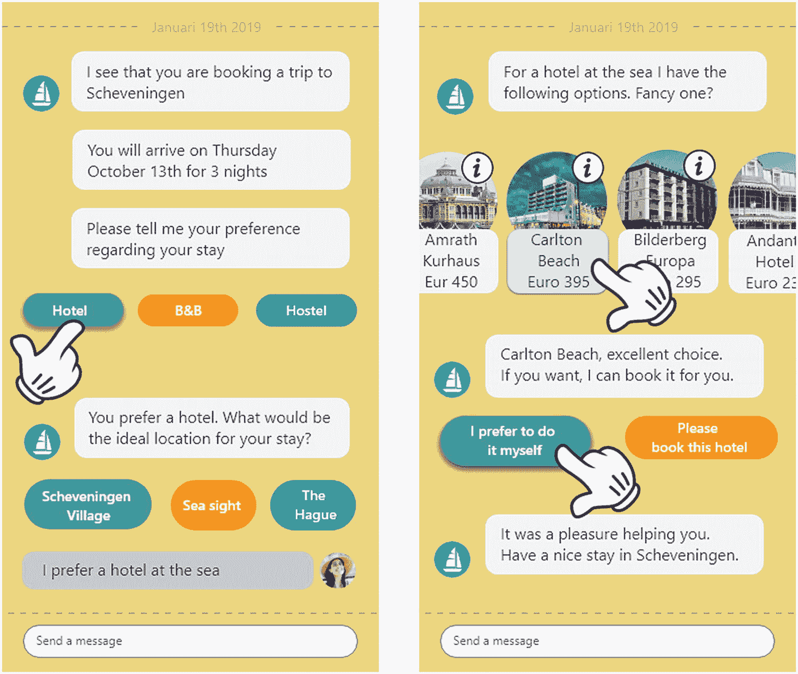

**图 2-15** 一个让用户感到一切尽在掌握的对话示例

### 反馈

激励用户对机器人产生积极行为的最重要因素之一是反馈。机器人提供的反馈是传达上述某些激励因素所必需的。例如，目标设定需要反馈来传达实现目标的进度。

> *“您已选择了男士部门。”*

在设计对话时，其他需要牢记的问题如下：

-   保持对话主题贴近聊天机器人的服务目的。如果用户偏离主题，请尝试将其引导回主要话题。
-   避免使用“是”或“否”的答案/按钮，因为用户容易出错。相反，应指明用户将对什么内容说“是”或“否”，例如“是的，我是老客户”和“不，我是新客户”。
-   尽可能让聊天机器人的回复简洁明了，因为用户并不总是仔细阅读。相反，要预期用户经常快速浏览聊天机器人的回复。
-   在机器人的回答中重复问题，以表明机器人理解了用户的需求。
-   考虑根据用户之前的请求来个性化机器人的回答。利用你从用户之前给出的答案/提出的问题中已经了解到的信息。
-   根据用户与机器人及其所支持的网站或产品的实时活动来定制对话。

> *“我看到您正在尝试报销一项索赔。如果您提供保单号，我可以帮您处理。”*

-   考虑如何结束对话，例如：

> *“随时乐意为您效劳！再见。”*

## 后端系统

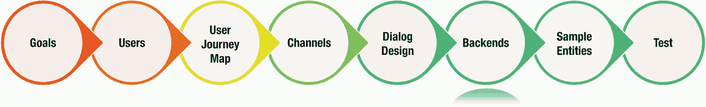

**图 2-16**

在设计时，你的数字助手必须考虑到，它自身不会内置处理整个流程所需的所有知识。例如，身份验证不会在数字助手本身中实现，而是由后端系统提供。客户数据、员工数据和库存信息等数据也不会成为数字助手本身的一部分。在企业环境中，可能需要一个能够执行人力资源相关任务（如员工资料更新和假期余额查询）的人力资源机器人/技能，或者一个用于招聘相关活动的招聘机器人。执行此类任务所需的信息通常在你的后端应用程序中。你的数字助手应能够连接到这些系统，并将这些系统中的信息带入对话中。

让我们以图 2-17 中的数字助手为例。

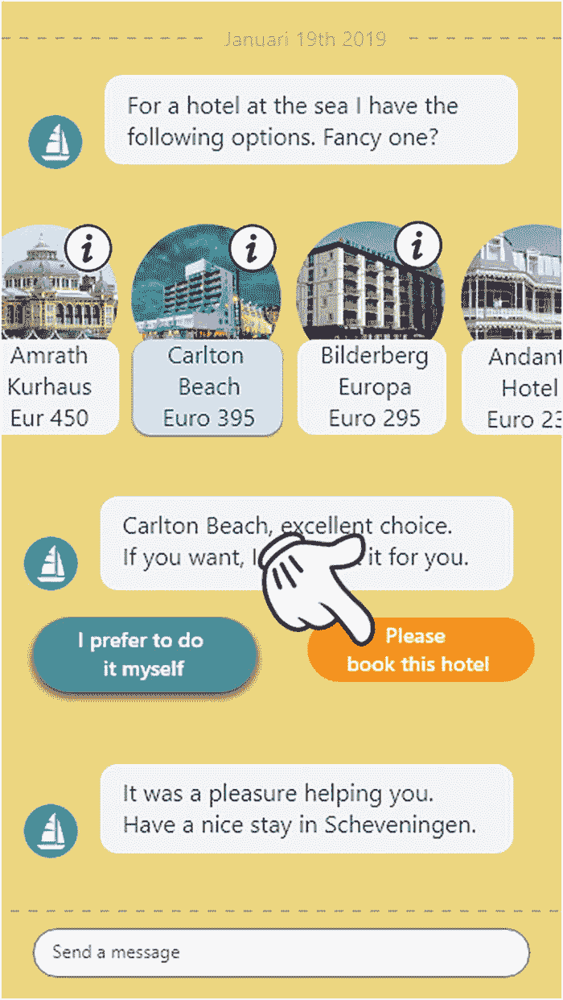

**图 2-17** 用户想要预订选定的酒店

在此示例中，用户选择预订酒店。为此，数字助手需要与后端预订系统通信。当数字助手调用后端系统时，对用户而言，酒店将按要求完成预订。通常，数字助手会向预订系统发送一个包含预订详情的请求，然后由预订系统处理实际的预订。用户完全不知道数字助手调用了后端系统。这应该是完全透明的，并与用户体验流程无缝集成。

在你的设计中，你应该识别出对话中所有需要后端集成的部分。你还需要提供正确创建此集成所需的信息。以预订示例为例，请考虑入住和退房日期、酒店名称，以及最后但同样重要的预订酒店的用户名。提供这些信息使开发人员能够正确创建实现这些集成点的 API 和组件。

## 示例实体

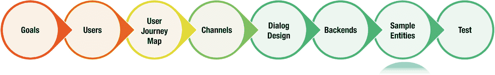

**图 2-18**

正如旅程地图中所描述的，在每个接触点，用户都有一个或多个意图，例如“从史基浦机场前往阿姆斯特丹”。*意图* 是用户的意图。

*实体* 则修饰一个意图。例如，在意图“从史基浦机场前往阿姆斯特丹”中，实体是“前往”、“史基浦机场”和“阿姆斯特丹”。

用户实际说出的任何内容都称为话语。例如，如果用户输入或发布推文“我刚到史基浦机场，准备去阿姆斯特丹进行城市旅行”，那么整个句子就是 *话语*。

在为对话流程创建流程图时，除了“快乐路径”之外，你还必须制定不同的话语，因为用户表达自己的方式多种多样。

> *“在史基浦机场等候。期待我的阿姆斯特丹城市之旅。”*

> *“刚到史基浦机场，准备和全家人进行周末旅行。”*

> *“我们前往阿姆斯特丹的周末之旅从史基浦机场开始。”*

实体的组合构成了这些不同话语的基础。聊天机器人最终必须能够识别用户的问题/评论——无论其书写方式如何——以便给出正确的答案。

与项目利益相关者共享实体可能会有所帮助。使用图 2-19 中所示的词云方法，是一种快速提供所支持实体概览的方式，同时也能显示它们的相对重要性或至少是相对使用频率。

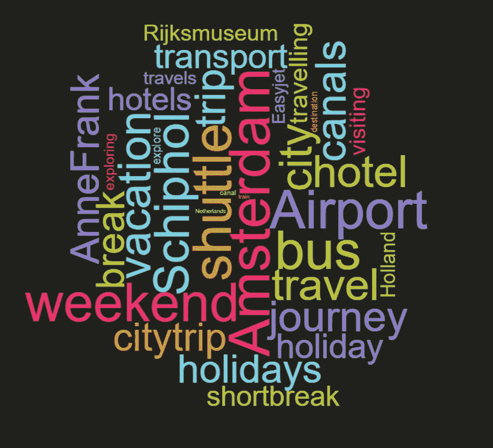

**图 2-19** 词云是一种向利益相关者展示所有不同实体的方式

### 可用性测试

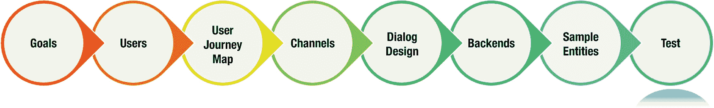

**图 2-20**

这是所有辛勤工作得到回报的时刻。虽然这是此处概述的第八个步骤，但它不一定是最后一步。事实上，大多数情况下，你在测试阶段收集到的信息和反馈会导致重新定义问题、寻找更多示例实体以及更好地与用户共情。不断问自己这个问题：我们是否在构建正确的东西？

### 使用测试场景

你为对话流程创建了流程图。流程图中从上到下的每条路径都是一个测试用例，并且只能用于测试“快乐路径”。

流程图没有显示的是用户表达意图的无限可能性以及机器人自身对话响应的变化。然而，一个训练有素的聊天机器人能够理解不同的用户表达（话语），而一个设计良好的聊天机器人会在对话响应中提供一些变化。

### 由大量用户进行探索性测试

根据项目状态明智地选择测试人群非常重要。最重要的选择标准是语言和方言。对于此测试，不需要使用任何需求或测试用例；只需让测试人群自行操作即可。

盲测也是一种很好的测试方式。那些属于目标受众但未接受过使用你的聊天机器人培训的用户，在第一次面对它时能否成功使用？这是一个值得提出的好问题，而用户测试将提供答案。

### A/B 测试

A/B 测试的定义是，通过同时向相似访客展示两个版本的对话式用户体验，对二者进行比较。其目标是确定哪个版本表现更佳。

通过进行 A/B 测试，您将能够衡量以下指标：

- **留存率**：监控聊天机器人在吸引和留住用户方面的表现。结构良好且具有吸引力的即时通讯聊天机器人用户体验，其留存率可能高达 70%，而广泛使用的电子邮件营销活动留存率最高仅为 40%。
- **流失点**：指用户在对话流程中离开预设主流程，转向非预期路径的位置。这意味着用户体验中可能存在某些内容或元素，访客因感到厌倦或受挫而无法触及。
- **主要转化**：测试哪种对话式用户体验最能引导用户完成对您业务最有价值的操作，例如，点击特定的“行动号召”、与客服人员开始实时聊天、完成结账流程等。

一些聊天机器人构建平台提供了现成的聊天机器人 A/B 测试解决方案。您可以利用它们来实现此目的。

每个为 A/B 测试设置的实验都可能包含同一功能或需要验证的用户体验元素的两个或更多变体。即使您的机器人已上线，也可以进行此类测试。尝试不同的用户表述，并衡量用户行为的变化。

脚注 1 2

