# 3. 用例

## 引言

为了理解 Oracle 数字助理的技术实现，本章将向您介绍 `Travvy`——一家由作者虚构的、专为冒险爱好者提供徒步假期的旅行社“极限徒步假期”所使用的数字助理/聊天机器人。

极限徒步假期组织在瑞士/法国、加拿大和美国的高难度徒步旅行。他们提供完整的旅行套餐，包括机票、有导游带领的徒步旅行和住宿。
通过循序渐进的步骤，您将熟悉 `Travvy`，从而全面了解创建对话式体验和技术实现的各个环节。
您将了解 `Travvy 的初衷`，并认识代表与 `Travvy` 沟通的旅行者/用户的 `用户画像`。我们将阐述 `用户旅程`，并解释 `Travvy` 在其中扮演的角色。您将看到如何为数字助理选择 `渠道`，最后，您将找到揭示用户意图的 `对话/会话流程`。在本章的最后部分，将介绍聊天机器人所使用的 `实体和用户表述`。

## 目标

### 利益相关者是谁？

极限徒步假期的首席执行官和营销经理是决策者。
极限徒步假期是一家小型旅行社。三名员工负责预订，六名富有冒险精神的导游在现场陪同旅行者。该机构在一个新兴的利基市场中占有很大的市场份额。

### 为何需要聊天机器人？

营销经理知道，他们的客户对于此类假期的风险、难度等级以及保险条件有很多疑问。目前，预订部门负责通过邮件或电话回答所有这些问题，而这些问题往往有相同的答案。
聊天机器人有助于降低成本，因为接听电话或回复邮件的人工成本通常高于每次成本不到一美分的聊天机器人回复。这也是聊天机器人不应提供电话号码的原因。最好为用户提供一个链接，让他们自己能够找到所需信息。
这就是他们考虑开发聊天机器人的原因，以便能够为客户提供更好的全天候服务、建议/帮助他们，并说服他们预订假期。
优秀聊天机器人的优势在于用户可以询问任何问题。这意味着无需搜索/浏览网站。用户可以直接询问他们想要什么。数字助理甚至可以显示所需的表单，以便用户立即填写。`智能数字助理变成了智能搜索引擎`。

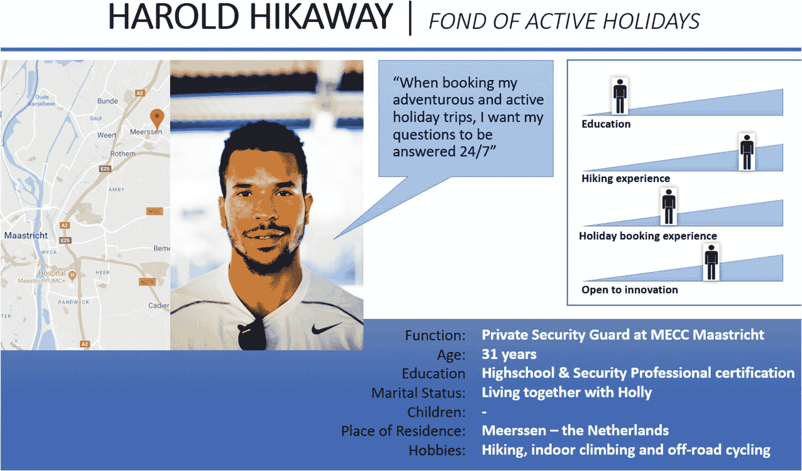

## 客户：用户画像

### 描述哈罗德

在业余时间，哈罗德非常活跃。每周六早上，他都会和一群朋友进行长途骑行。他和女友霍莉每周会进行一次室内攀岩，假期时，他们喜欢在多洛米蒂山脉（具有挑战性）和捷克（价格便宜）进行户外攀岩。他们都喜欢探索新的徒步路线。哈罗德说话直截了当（“少说废话”），也期望他人同样直接和诚实。他不喜欢任何不能以积极方式度过的时光。

### 他的工作“日”

哈罗德经常上夜班。他的主要任务是确保马斯特里赫特展览与会议中心（`MECC`）大楼的安全。在这些夜晚，他会进行巡逻，但中间经常有一些空闲时间，这时他就会浏览网站，寻找有关冒险旅行和不错度假目的地的信息。他曾在极限徒步假期网站上预订过一次去法国的旅行。他和霍莉认为那是一次奇妙的冒险。为了预订那次徒步旅行，他当时在该网站上创建了一个个人资料。

### 他的工具

哈罗德使用办公室的台式电脑或在进行现场安全检查时使用手机上网。他的一些朋友使用平板电脑，但哈罗德认为这没什么优势。

### 他的目标

他非常热衷于活跃的假期，之前他曾在极限徒步假期的网站上找到并预订了这样的假期。他使用该网站获取关于他们假期选择的详细信息。在与霍莉商量后，他们经常会有一些具体问题。如果这些问题能够快速得到解答（最好是在他上夜班期间），他就会在网站上一次性预订行程。

## 用户旅程图

哈罗德将经历怎样的旅程，才能通过我们的聊天机器人等接触点/渠道实现他的目标？

### 接触点

- 在家沙发上看到的互联网/电视广告
- 在家或在工作时使用的 `Facebook`
- 在家或在工作时访问的极限徒步假期网站
- 聊天机器人

### 哈罗德的意图

- 查看一些徒步假期选项。
- 查找并选择一个徒步假期，并提出相关问题。
- 预订并支付徒步旅行费用。

### 他的动机/需求

- 哈罗德被极限徒步假期提供的诱人假期选项所吸引。
- 他注意到自己无需输入凭据。
- 他能全天候获得清晰、快速且个性化的答案。
- 他喜欢被引导，但不想失去 `自主权`。他想要掌控感。

### 需触发的情感

- 聊天机器人记住了他的偏好，令他 `喜出望外`。
- 聊天机器人的语气应：
  - 对他具有 `吸引力`
  - 让他感到 `愉悦`
  - `激励` 他采取行动
- 他应对结果感到 `满意` 并充满 `信心`。

下图 3-3 展示了哈罗德在搜索并决定进行一次徒步旅行时的完整旅程。

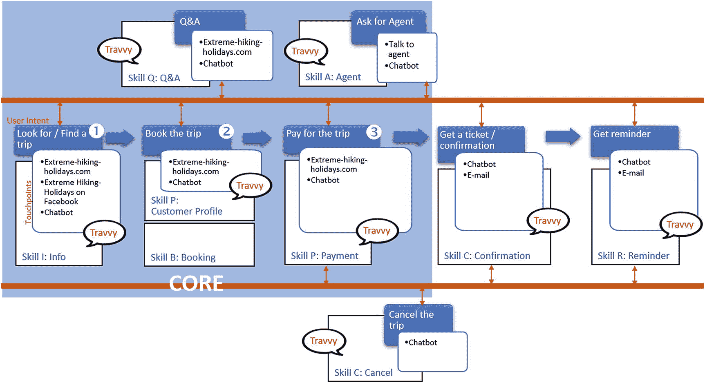

对于我们将在此用例中创建的聊天机器人，重点将放在核心区域旅程的前三个部分以及顶部的两个部分。至于四个核心部分，您将在后续的图中找到完整的详细客户旅程。
由于聊天机器人只是用户为查找和预订行程所接触的众多接触点之一，因此梳理整个客户旅程以确保没有遗漏任何交互环节至关重要。在本书中，我们只关注用户与单一接触点（即聊天机器人）的交互。因此，在后续的图片中，旅程中与聊天机器人相关的部分会被高亮显示。
如图 3-3 所示，哈罗德做的第一件事是查看徒步假期的选项。在此过程中，他会接触到多个接触点，例如电视上的广告和“极限徒步假期”的在线信息，并且他会遇到他们的聊天机器人。
图 3-4 展示了一个详细的用户旅程，描述了哈罗德的主要意图、他的行动以及公司为支持他所做的活动。

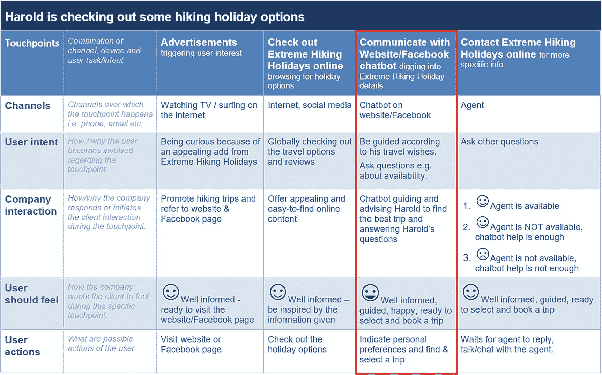

在旅程图中，您还可以描述您认为用户在接触该接触点时应有的感受、将使用何种渠道进行接触，甚至使用场景。由于在此旅程中，哈罗德的假定使用场景主要是在工作或家中的台式电脑上，因此这些旅程图中未描述使用场景。
在哈罗德找到心仪的行程（当然，还要和霍莉确认一下）后，他想进行预订并完成下单。见图 3-5。

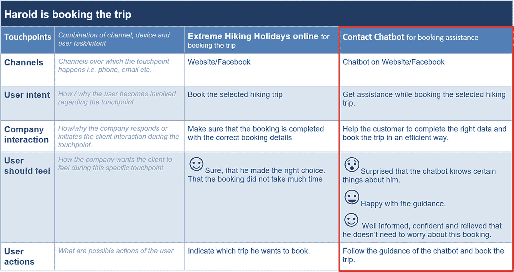

预订未完成支付就不算完整。哈罗德可以通过网站在线支付预订费用，期间会得到聊天机器人的协助，并与他的银行保持密切联系。见图 3-6。

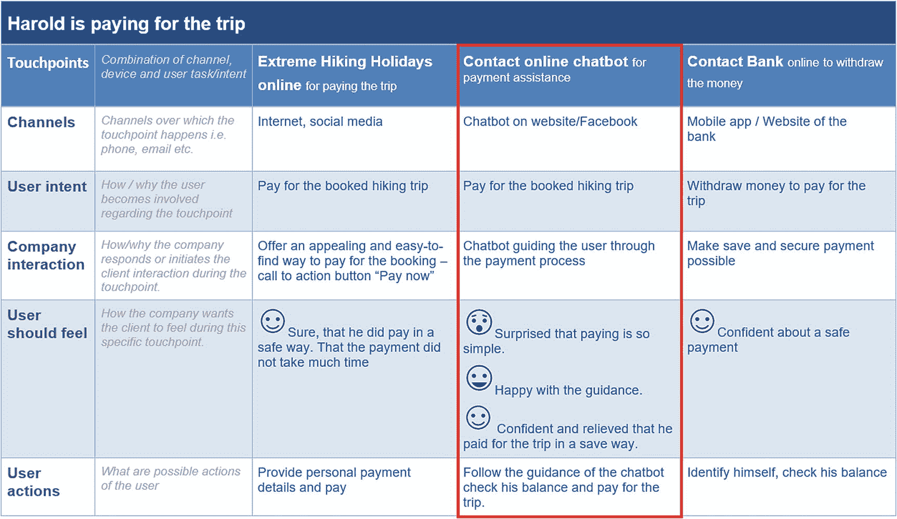

当然，完成所有这些操作后，哈罗德需要收到关于其预订和支付成功的反馈。他可以在他的个人页面“我的极限徒步之旅”上在线获取这些信息，同时聊天机器人也可以提供这些信息以及他的门票/代金券。见图 3-7。

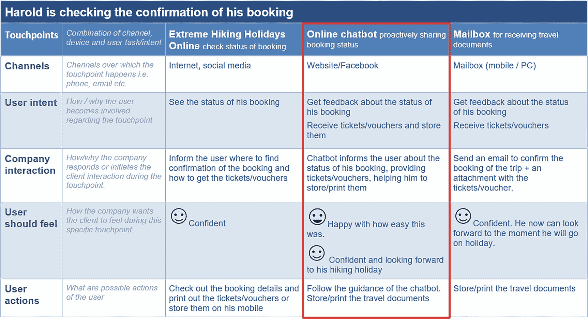

## 渠道

哈罗德与“极限徒步假期”沟通时最常使用的接触点是他们的 `Facebook` 页面和网站。这就是为什么在此用例中，聊天机器人将在 `Facebook` 和网站这两个渠道上与用户互动。当然，哈罗德可以在他的电脑和手机上与聊天机器人交流。

## 对话

### 机器人的个性

我们聊天机器人的用户像哈罗德一样年轻、活跃且热爱运动。他们几乎从不感到无聊。不工作时，他们就去徒步和进行（团队）运动。他们经常与朋友在一起，然后详细谈论他们的运动活动、徒步旅行和假期。
“极限徒步假期”公司的营销传播活动与这一形象相符。因此，聊天机器人的 `语气` 应该像是哈罗德自行车队中的一员。机器人的 `名字` 应与公司形象相符。由于该机器人将为“极限徒步假期”公司提供旅行相关服务，并且不应过于严肃，因此它将被命名为 `Travvy`。它的 `“肖像”` /头像源自公司标志。见图 3-8。

`Travvy` 是 `无性别` 的，尽管与用户一起测试聊天机器人应能确认用户是否同意这一说法。

### 对话流程

哈罗德的主要意图构成了对话流程的基础。如图 3-3 所示，整体旅程的每个阶段都由一个意图表示，该意图需要聊天机器人具备某种技能。在第一阶段，`Travvy` 的 `信息` 技能将协助哈罗德，帮助他为他和霍莉找到合适的行程，并向 `Travvy` 表明他们的偏好。
图 3-9 展示了哈罗德寻找行程的对话流程。

在他旅程的第一阶段，`Travvy` 会要求哈罗德指明他的度假目的地（国家和区域），以及他心目中徒步旅行的难度等级。如果他决定从一个中心点进行三级徒步，他可以指明他偏好的住宿类型。
在哈罗德找到并选定心仪的假期后，`Travvy` 可以协助他预订该行程。为此，`Travvy` 将整合两项技能：`客户资料` 技能和 `预订` 技能。
图 3-10 展示了哈罗德预订行程的对话流程。

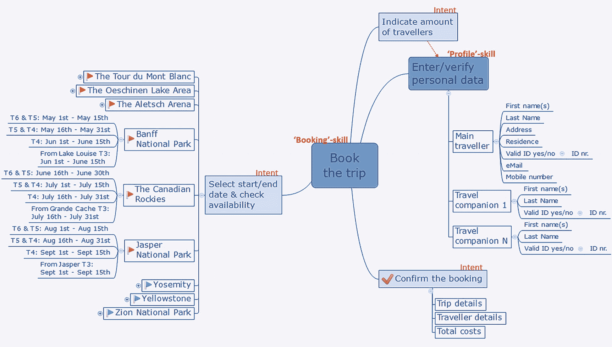

哈罗德将被要求选择一个旅行时段，并验证/输入他自己及其旅伴的所有个人信息。
现在哈罗德已经预订并确认了他的行程，`Travvy` 会询问他是否需要协助付款。为此，`Travvy` 包含一个提供 `支付` 技能的即时应用。
图 3-11 展示了哈罗德为行程付款的对话流程。

`Travvy` 会要求哈罗德选择他的银行账户，检查余额是否充足，然后进行转账。
为了确认支付是否顺利，哈罗德需要确认信息。当然，他也希望收到与行程相关的门票和代金券。因此，`Travvy` 包含一个提供 `确认` 技能的客户组件。
图 3-12 展示了数字助手将提供的确认对话流程。

`Travvy` 会给他一张收据，并可以帮助他保存/打印门票和代金券。

## 后端

在对话过程中，`Travvy` 需要 `Harold` 输入个人数据和支付信息。尽管对话需要这些数据，但它们不会存储在数字助手本身中。通常，此类信息仅能从后端获取并存储在其中。后端是包含支持对话所需数据的信息系统。聊天机器人必须能够连接到这些后端系统，以便在对话中纳入来自这些系统的信息。
后端必须提供 `REST` 接口，以便与数字助手集成。在数字助手内部，需要编写自定义组件来实现与后端系统的实际集成。与后端系统集成的另一种方式是使用表单进行数据输入。`Travvy` 使用一个表单，让 `Harold` 直接将他的个人数据输入到后端。

## 实体与表述

### 用户说什么/写什么

在前面的段落中，我们定义了用户的旅程并阐述了他的意图。`Harold` 可以通过多种方式（表述）来表达他的意图。为了确保 `Travvy` 理解 `Harold` 的意思，需要对 `Travvy` 进行训练。训练机器人是决定其性能的最重要因素。这就是为什么每个意图至少应制定 10 种可能的表述（最好达到 50 种）。最好是这些句子/表述多样化，并且真正来自最终用户。
切勿仅使用开发和项目团队想出的表述来训练你的机器人：他们太熟悉技术行话了，无法准确代表像 `Harold` 这样的真实用户。
图 3-13 展示了 `Harold` 某个意图的不同表述。

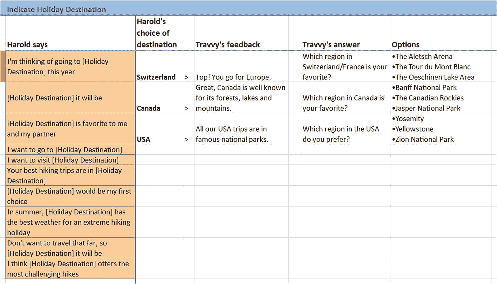

### Travvy 说什么/回答什么

请记住，聊天机器人是一种对话式界面。对话应该是互动的。`Travvy` 绝不应回复大段文本（超过 60 个字符就太长了）。因此，回复应该简短，并且应使用图片、按钮、列表和其他用户界面组件，使对话生动有趣、富有成效，并让像 `Harold` 这样的用户保持参与感。
图 3-14 展示了如何向用户呈现交互。

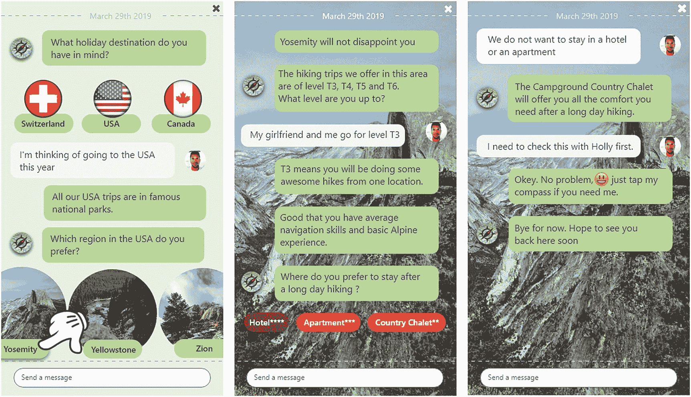

除了这种呈现对话的方式之外，你还必须确保整个流程都可以通过自然语言完成。图 3-15 展示了一个自然对话的示例。

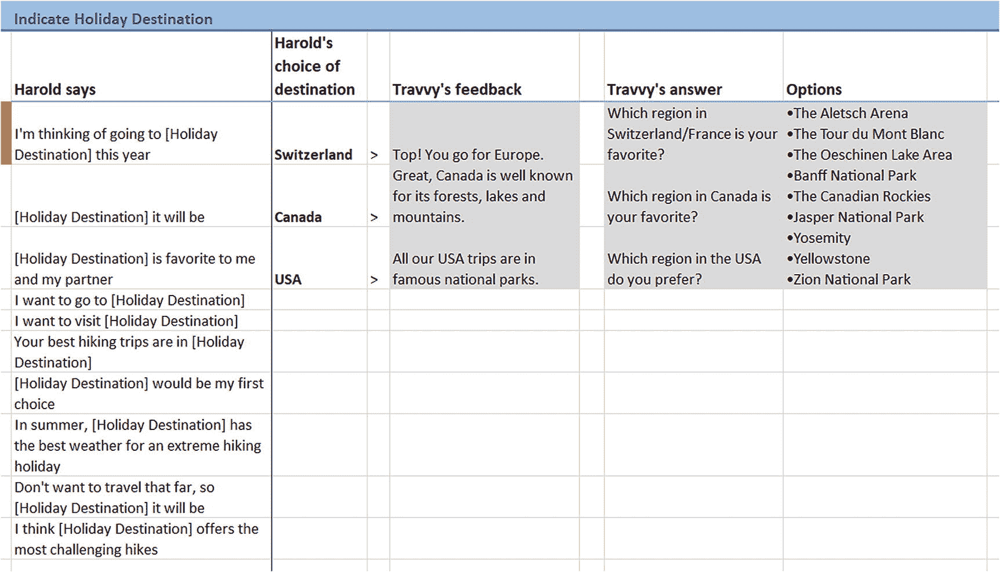

`Travvy` 就 `Harold` 的问题/回答给出清晰反馈非常重要。这种反馈将确保 `Harold` 确信 `Travvy` 很好地理解了他。
定义对话的所有其他可能的用户表述和机器人回复都可以在相关的 Excel 表格中找到。
通过考虑所有这些技巧，在 `Travvy` 帮助 `Harold` 选择度假目的地并为他预订行程的场景中，对话体验可能如图 3-16 所示。

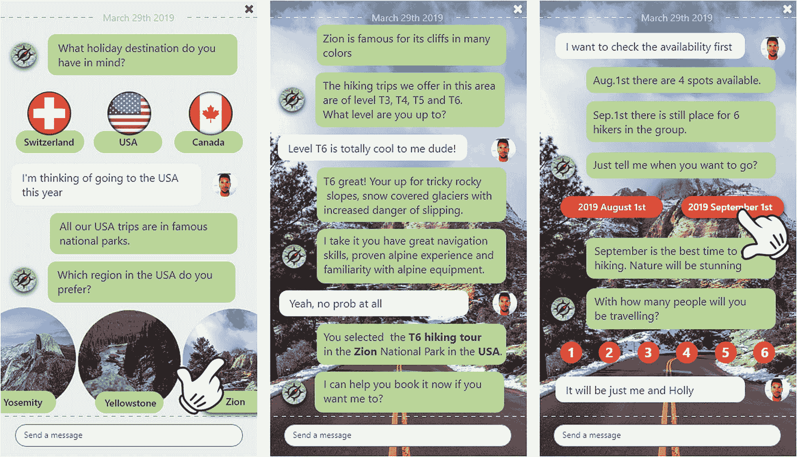

`Harold` 可以使用按钮，但他也可以输入/键入他的答案。如果你的聊天机器人是语音驱动的，`Harold` 甚至可以“对” `Travvy` “说话”。
当 `Harold` 选择了一个行程时，`Travvy` 可以通过要求 `Harold` 验证/编辑他自己及其旅行同伴的个人数据来帮助他进行预订。见图 3-17。

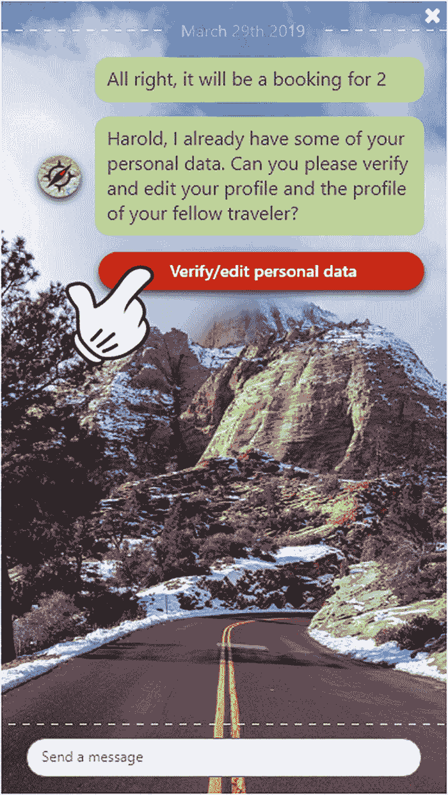

`Travvy` 使用 `客户资料` 技能来预填一些已知的数据。为了显示和收集这些数据，`Harold` 将看到一个不同的屏幕。这样他也知道这是聊天机器人对话的一个旁支步骤。在这个屏幕上，他不是在和 `Travvy` 聊天，而是在认真填写个人数据。
这个额外的屏幕可能如图 3-18 所示。

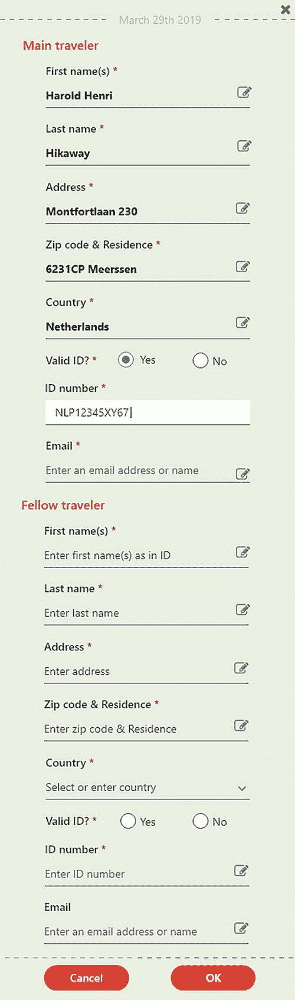

如果 `Harold` 现在不想编辑数据，他可以取消此屏幕以返回对话。
当 `Harold` 输入并验证了数据后，他可以通过点击“确定”关闭个人数据屏幕，并继续对话，例如图 3-19 所示。

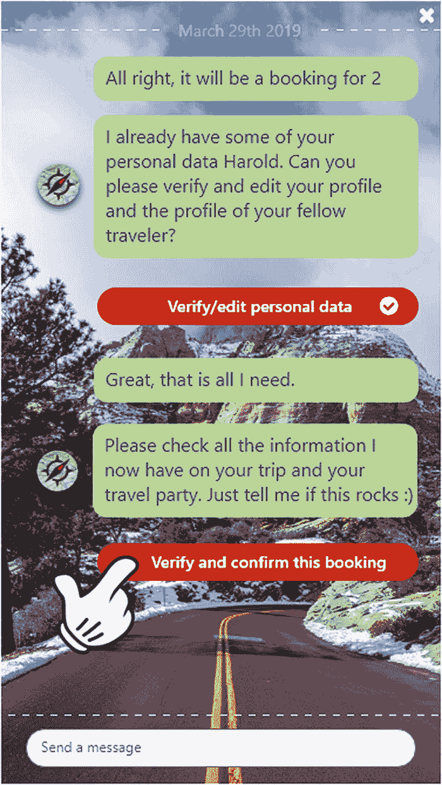

在任何时候，`Harold` 都应该能够关闭/停止对话。因此，在屏幕的右上角有一个关闭图标。

## 测试对话界面

在设计过程的早期阶段评估对话，可以让你在投入大量昂贵的开发工作之前有机会改进流程。
图 3-20 展示了好的设计如何节省资金。

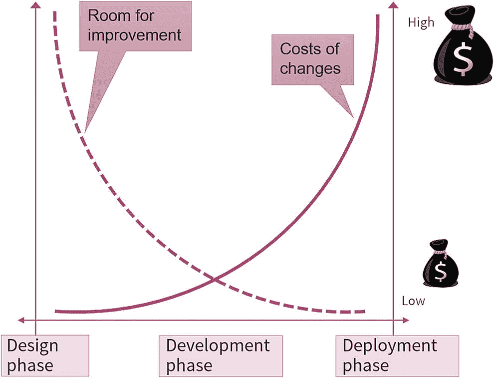

在互联网上，你可以找到各种用于模拟设计的工具。图 3-21 展示了这样一个模拟示例。

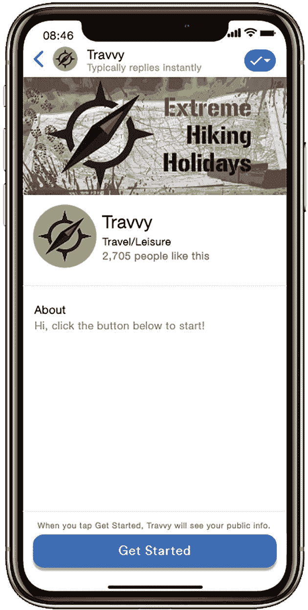

## 认知走查

借助线框图，您可以进行认知走查。这是一种可用性评估方法，您需要模拟用户执行一系列预期任务，并从用户视角提出一组问题，例如：

- 用户是否会尝试并达成正确的结果？
- 用户是否会注意到正确的操作是可用的？
- 用户是否会将正确的操作与其期望达成的结果联系起来？
- 如果执行了正确的操作，用户是否会看到正在朝着预期结果取得进展？

这些洞察随后被用于改进对话界面的可用性。

在图 3-22、3-23 和 3-24 中，您可以看到 `Travvy` 的线框图，展示了为 `Harold` 提供不同选项的显示方式。

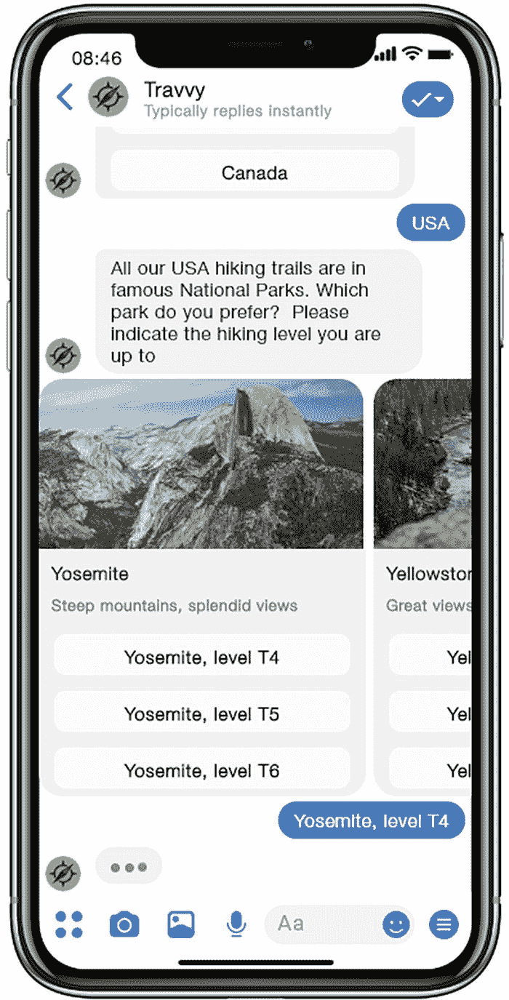
**图 3-23** 在轮播图中，`Harold` 可以一次性选择目的地和徒步难度等级

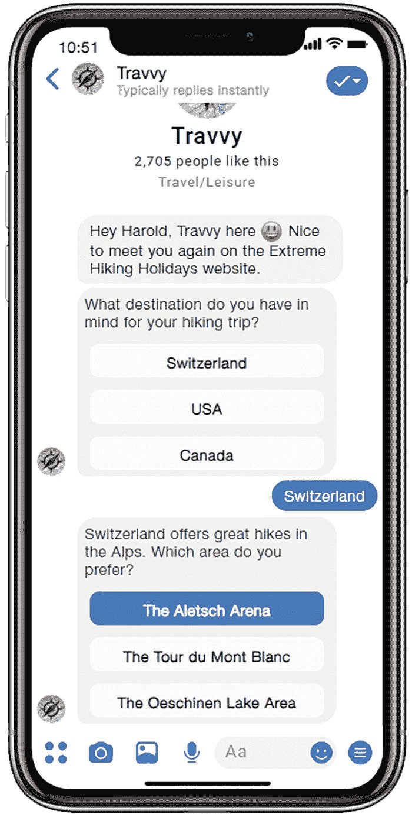
**图 3-22** `Harold` 只需点击首选选项即可选择目的地

除了为用户提供可选择的选项外，他还应该能够自行构思/输入/说出自己的答案。

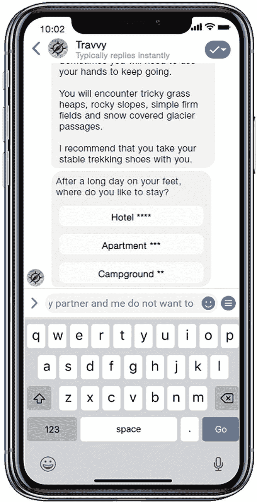
**图 3-24** `Harold` 输入自己的答案

## 可用性测试

您可以使用线框图，邀请像 `Harold` 这样的代表性用户进行可用性测试，只需让他们执行一些预定义任务，与 `Travvy` 进行交互，然后观察他们的操作即可。

如果您使用刚刚开发完成的真实对话界面进行此测试，那么您不仅测试了其可用性，而且同时还能训练 `Travvy` 更好地响应用户的请求、问题和答案。

为了全面了解用户对 `Travvy` 的感受，您可以询问以下问题：

- 请说出您最喜欢 `Travvy` 的三点。
- 请说出您不喜欢 `Travvy` 的三点。
- 我们如何改进 `Travvy`？

这些答案将帮助您改进您的数字助手。

## 训练聊天机器人

您可以向 `Travvy` 询问任何事情，但可以肯定的是，在初期，`Travvy` **不会**理解您问的所有问题。

为了确保用户不会因为错误的答案或 `Travvy` 不理解他们的问题而感到烦恼，投入精力训练 `Travvy` 至关重要。

图 3-25 显示，随着数字助手变得越来越智能，公司的训练工作量会减少。

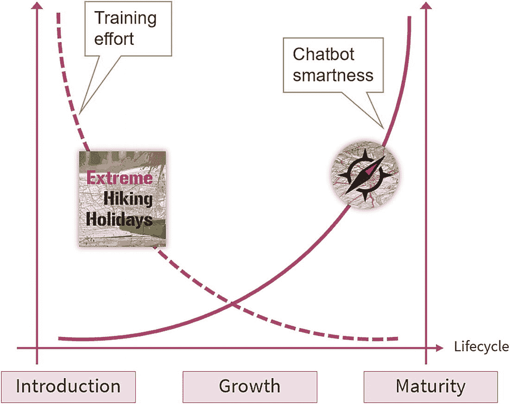
**图 3-25** 随着 `Travvy` 变得更智能，训练工作量减少

在初期，训练会花费时间。但训练很简单，您很快就会看到 `Travvy` 变得更聪明。

### 三步训练法

`Travvy` 最好使用用户提供的语料进行训练。但是，您不希望让真实用户面对一个未经训练/无知的聊天机器人。因此，最好分三步进行训练：

1.  自己训练聊天机器人。通过输入尽可能多的语料来使用 `Travvy`。您已经对 `Harold` 有了很多了解；您知道他可能会如何与 `Travvy` 互动。
2.  请 `Extreme Hiking Holidays` 的预订员工（利益相关者）利用他们对通常致电/发送电子邮件的客户的了解来试用 `Travvy`。
3.  使用可用性测试（如前文所述）来收集语料（由真实用户输入）并检查 `Travvy` 的回复。

为了避免 `Travvy` 要求用户澄清问题，或者更糟的是，给出不恰当的答案，请将 `置信度阈值` 设置为 0.35 或更高，并将 `胜出裕度` 设置为 0.2。（具体操作方法，请参见第 9 章）。

然后，聊天机器人将首先检查哪些意图与问题的匹配概率超过 35%。如果有多个意图满足此要求，机器人将查看这些意图之间的概率差异。如果差异小于 20%，则它会将这两个或更多意图作为选项显示给用户选择。

在训练和测试聊天机器人时，您可以在应用程序的 `洞察` 中找到结果报告。在 `Retrainer` 选项卡中，您可以看到哪些语料导致了未解析的意图（`Travvy` 不知道答案）。然后，您可以决定是将这些语料添加到某个现有意图，还是为它们创建一个新意图。