# 4. 设计与实现的交汇点

## 引言

在前面的章节中，您了解了关于聊天机器人设计的所有内容，以及 Extreme Hiking Holidays 如何设计他们的数字助手 Travvy。这个数字助手的实际实现可以由开发人员通过编写所有流程逻辑的代码来完成，但 Oracle 数字助手（ODA）提供了一个功能，业务用户和设计人员都可以使用它来搭建数字助手的初始版本，之后开发人员可以接手完成实现。借助此功能，即**对话设计器**，您可以快速为对话设计概念构建概念验证，而无需编写任何`OBotML`代码，也无需创建意图或实体。对话设计器允许您通过设置机器人与用户之间的对话来专注于用户体验。在按照第 2 章所述创建了对话式用户体验之后，可以使用对话设计器来创建技能机器人的原型/线框图。从该线框图出发，只需点击一个按钮即可生成实际的技能机器人。然后，可以对聊天机器人进行训练和测试。图 4-1 展示了对话设计器在设计和开发流程中的位置。

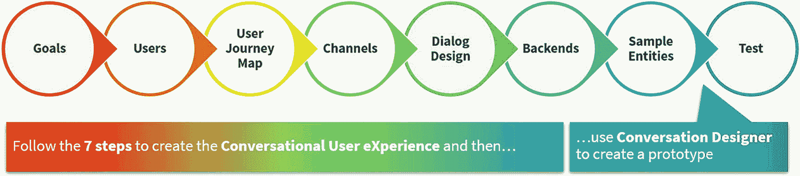

**图 4-1** 对话设计器的定位

为了使用对话设计器，您必须对对话设计器使用的概念有一些基本了解。首先是任务的概念。任务代表您的主要用例（查找行程、支付行程、获取确认）。任务中的第一条消息应该是来自用户的、清晰表达所选任务/意图的消息。这是必需的，因为当从对话设计器内部生成机器人时，该用户消息将用于创建其变体作为语料。意图将从任务中派生。

例如，第一条消息可以是“我想找一个行程。”这条消息是祈使句，并以名词结尾。这有助于对话设计器将此消息归类为意图语料。

接下来是子任务。这些子任务通常执行辅助功能，也可以称为次要任务。用户不会明确要求机器人执行这样的子任务。

## 注意

在 Oracle 数字助手 19.1.5 版本中，对话设计器作为测试版引入（图 4-2）。

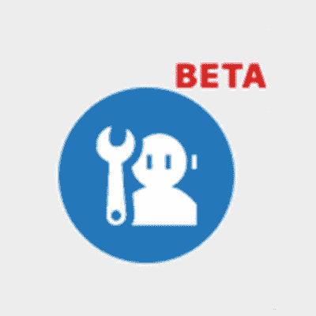

**图 4-2** 测试版


## 实现 Travvy 设计

既然你已经了解了任务和子任务的概念，那么实现第 4 章中阐述的 Travvy 设计就变得简单了。如前所述，对话设计器中的任务将转化为意图。

为了调用对话设计器并实现 Travvy 的设计，我们将创建一个全新的空技能（图 4-3）。

## 注意

在本示例中，我们创建了一个新的空技能。不建议在现有技能上使用对话设计器。这是因为当从对话设计器内部生成技能机器人时，现有的意图、实体和代码将被覆盖。此过程将在本章后面进行说明。

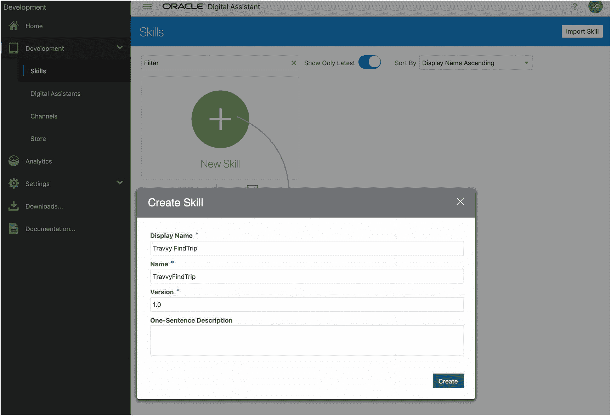

图 4-3

创建一个新技能

创建这个新技能后，你会注意到左侧工具栏中的“对话设计器”按钮。点击此按钮，你将进入创建技能机器人的引导流程。

欢迎界面允许你添加技能机器人应能执行的任务。你可以根据需要输入任意数量的任务（图 4-4），并且在后续阶段，如果需要，还可以添加更多任务。

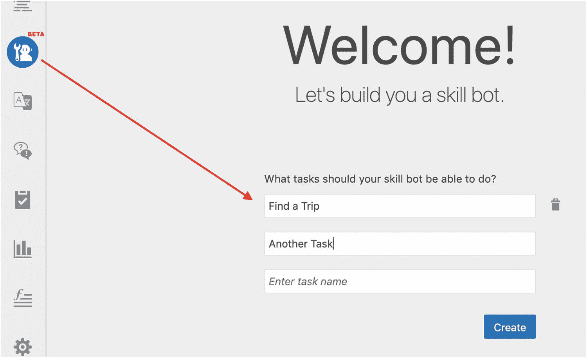

图 4-4

对话设计器欢迎界面

点击**创建**，对话设计器将打开并显示你在欢迎界面上输入的任务（图 4-5）。

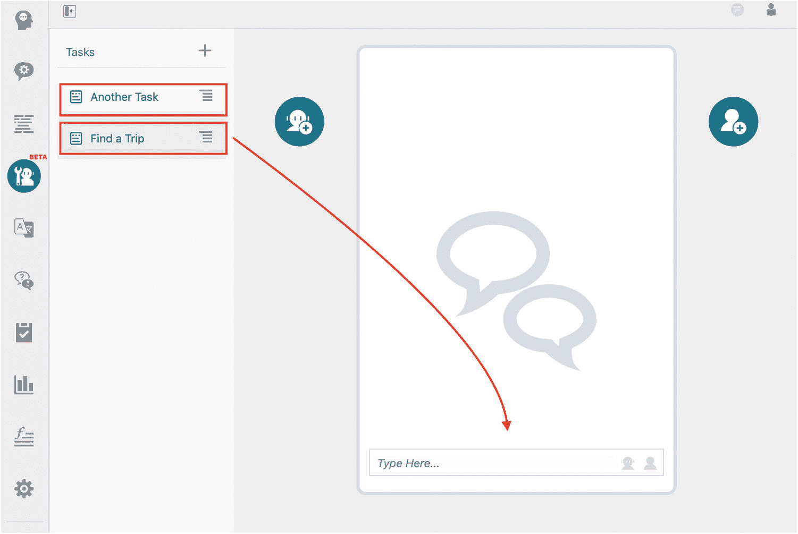

图 4-5

设计器的初始视图

有了这个空的框架，你现在就可以开始创建机器人对话的模型了。

出于本书的目的，本节不会解释创建此技能模型所涉及的所有步骤，但核心功能将详细讨论。

从图 4-6 中可以看到，对话设计器中有两个图标：

*    点击此图标，可以输入用户表述。

*    选择此图标，可以输入机器人回复。

当你只需要输入简单文本时，可以使用一个快捷方式。只需在底部的对话框中输入文本，然后点击图标（机器人或用户）即可将其添加到对话中。

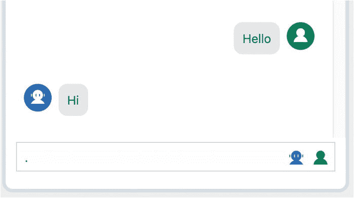

图 4-6

添加简单步骤

如前所述，任务中的第一条消息应该是来自用户的消息，该消息清晰地表达了所选的任务/意图，以便从中生成相当好的表述。例如，对于 `FindTrip` 任务，可以输入 *我想去进行一次极限徒步旅行*。下一步是添加机器人的回复。我们这里需要一个简单的回复，让机器人进行自我介绍。例如：*嘿，Harold，我是 Travvy，EHH 的数字助理。很高兴再次在这里见到你。*

现在对话的开端已经设置好了，我们准备向对话中添加一些实际内容。如第 4 章所述，`FindTrip` 技能（图 4-7）包含几个步骤，我们将在本章中实现其中一部分（并非全部）。让我们从*指明度假目的地*开始。

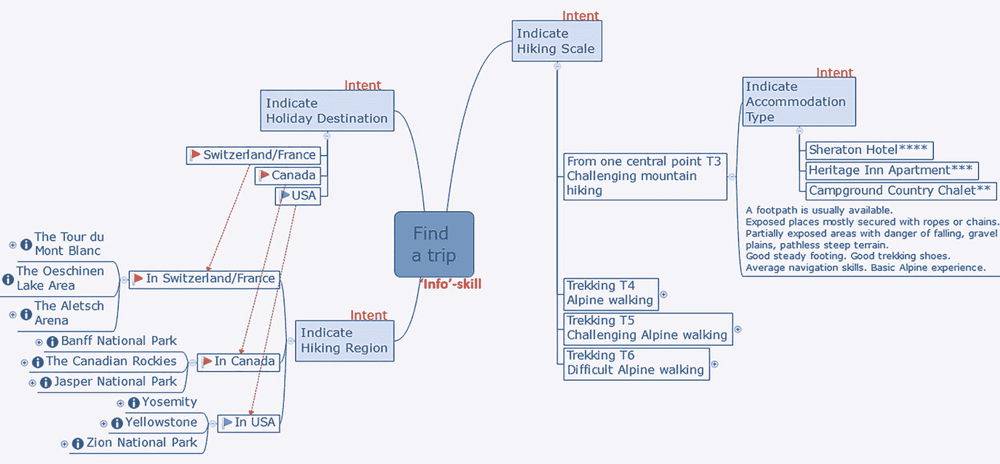

图 4-7

查找旅行的对话流程

`指明度假目的地` 允许用户选择最喜欢的目的地，之后用户将被引导至该目的地的可用徒步旅行。如果你再读一遍上一句话，可能会注意到它包含以下内容：

*   一个选择目的地的动作

*   一个路由到最喜欢目的地的分支

*   一个子任务，用于选择该目的地可用的徒步旅行之一

这正是对话设计器允许你输入的内容。通过点击机器人图标，将打开一个“添加消息”对话框，允许你将机器人的回复作为“动作”输入。在“动作”部分，只需添加一条消息，并根据需要添加任意数量的动作。如图 4-7 所示，用户的选项是：

*   美国

*   加拿大

*   瑞士/法国

对于每个选项，都将添加一个动作。

所有这些动作都需要分支到正确的“最喜欢的目的地”子任务。你可以手动创建这些子任务，但对话设计器允许你自动完成此操作。如果你调用动作文本框旁边的汉堡菜单（图 4-8），可以选择动作类型（`GoURL` 或 `分支对话`）。在这种情况下，我们想要分支对话，因此应该选择此项。选择该选项后，随后的文本框允许你选择一个现有的（子）任务，或者通过输入一个不存在的名称来创建一个新任务。

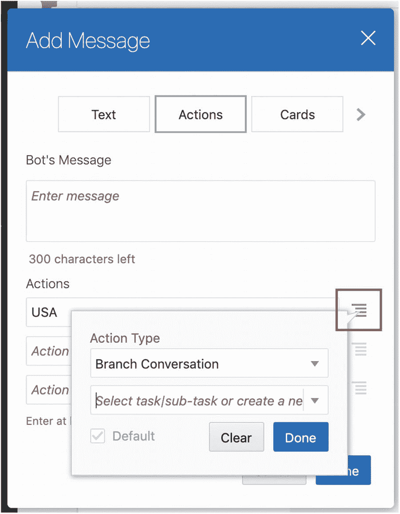

图 4-8

分支对话

对于创建的每个“分支对话”动作（图 4-9），对话设计器都会自动创建一个新的子任务。

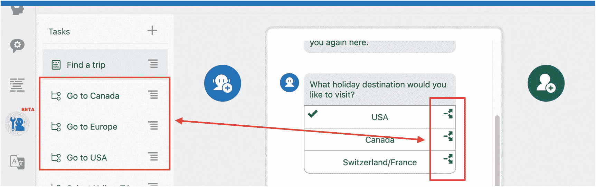

图 4-9

分支和子任务

实现设计的下一步是定义子任务的内容。这与之前描述的“常规任务”（如 `FindTrip`）的工作方式完全相同。

作为示例，我们将实现“前往美国”子任务。`FindTrip` 任务使用动作让用户选择目的地，而在“前往美国”中，我们将使用卡片。

卡片是一种更花哨的 UI 组件，也支持图片。你可以输入图片 URL，在其下方可以添加供用户选择的动作。图 4-10 显示了一个示例。

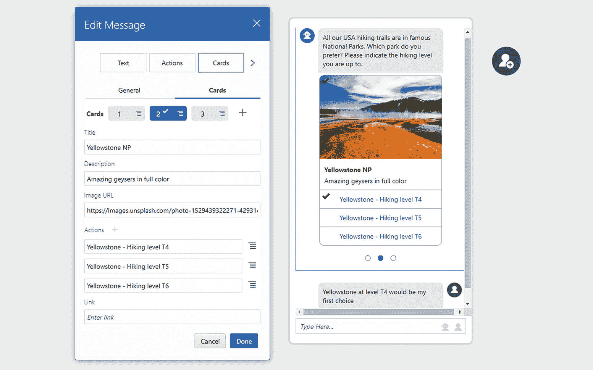

图 4-10

卡片和图片

现在，你可以在对话设计器中预览技能机器人的单个任务和子任务。此预览模式——通过点击屏幕右上角的“预览你的任务”链接激活——允许你通过播放当前显示的单个（子）任务来检查流程。它不是技能机器人完整功能的表示，只会完全按照在设计器中输入的方式回放对话。这意味着无法点击动作或滚动浏览带有卡片的轮播选项。其主要目标是“预览”你的技能机器人。

一旦你对模型感到满意，对话设计的最后一步就是生成你的技能机器人，对其进行训练和测试。

当你点击屏幕右上角的**生成**按钮时，会弹出一个弹出窗口（图 4-11），警告你即将生成技能机器人。当你点击“生成”时，魔法就会启动，技能机器人就会被生成。

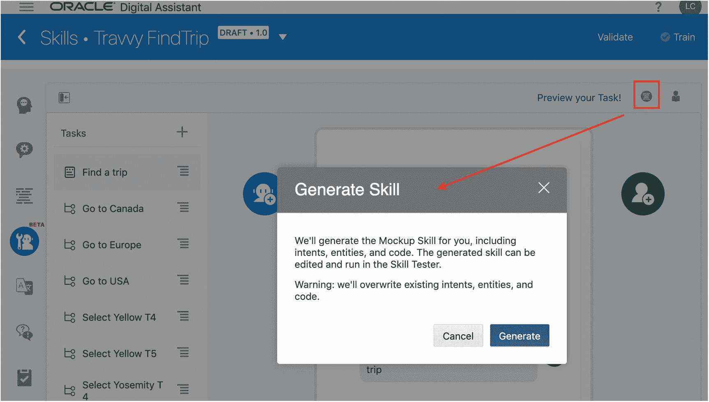

图 4-11

生成技能


## 注意

在使用`Skill Tester`（位于左侧菜单底部，用于测试/使用`Skill Bot`）之前，您必须通过点击顶部蓝色栏中的“train”来训练它。

### 审查生成的工件

要理解`Conversation Designer`的工作原理，最好仔细查看生成的工件。这将使我们能够了解`Intents`和`Entities`是从哪里从原型中提取的，以及对话流程是如何推导出来的。首先，我们将查看`Intents`。如前所述，`Intents`是从任务中推导出来的，示例话语是基于对话中的第一条消息生成的。以`FindTrip`为例，输入了消息“*我想去进行一次极限徒步旅行*”。查看图 4-12，您将了解到以下内容：

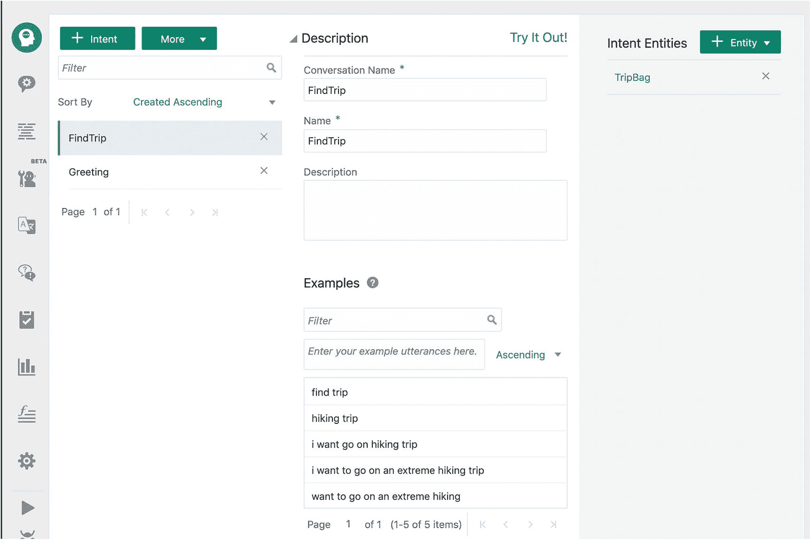

**图 4-12** 生成的意图

- `FindTrip`意图是基于任务`Find a Trip`创建的。
    - 此意图添加了五个话语，全部直接源自`Designer`中输入的消息。
- `Greeting`意图被创建。

接下来，我们可以查看生成的实体。如您所见，为此`Skill Bot`创建了十个实体。这些实体（图 4-13）源自`Conversation Designer`中输入的机器人回复。您会注意到有单个实体和复合包实体，这两种实体都将在第 5 章中更详细地解释。

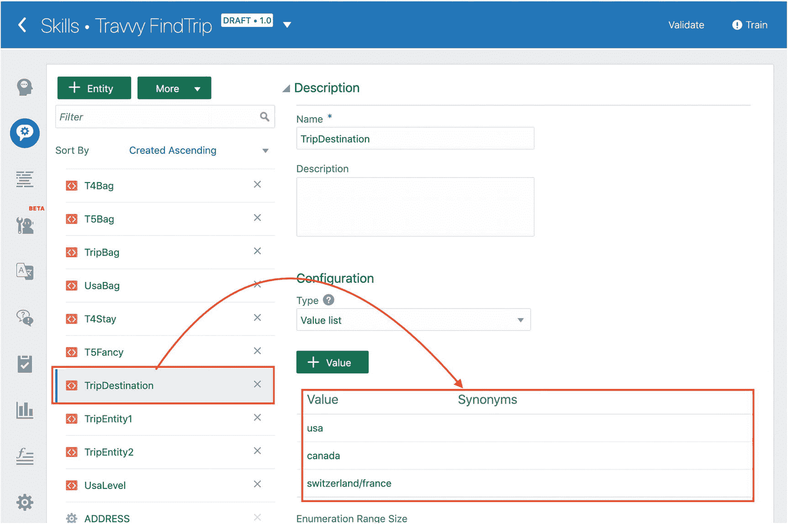

**图 4-13** 生成的实体

例如`TripDestination`实体。它是作为`ValueList`实体生成的，其值为*USA, Canada, and Switzerland/France*。显然，这是从消息“*您想去哪个度假目的地？*”中推导出来的，如图 4-14 所示。

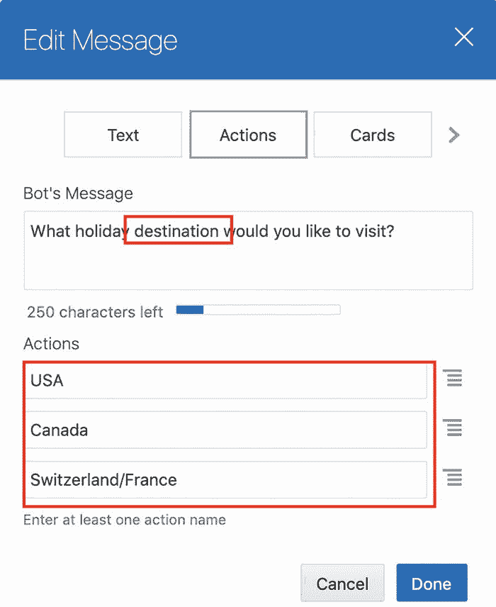

**图 4-14** 用于推导`TripDestination`实体的消息

最后，生成了完整的`OBotML`流程定义`YAML`文件。我们不会详细讨论其内容，但高层次的解释应该足以让您有所了解。当您打开流程编辑器时，您会注意到第一部分包含大量以`#!`开头的行。这些行包含作为`JSON`对象的原型定义。

## 注意

有时您看不到以`#!`开头的行。通常这是因为这些行被折叠了，由`{←`→`}`表示。您可以通过单击第 1 行旁边的小箭头来展开该部分。

除了原型定义之外，`YAML`文件还包含`Skill Bot`的实际流程定义。所有状态都已生成，包括一个`Unresolved Intent`状态。每个简单的机器人回复都有`System.Output`组件，而复杂的回复（如`Actions`和`Cards`）则有`System.CommonResponse`组件。下面显示了一个“Go to USA”子任务及其各个卡片的示例。首先，设置一个变量名`levelCards`来包含所有关于卡片的信息。

```
--------------------  # Task "Go to USA" ---------------  ---------------
setLevelCards:
component: System.SetVariable
properties:
variable: levelCards
value:
np:
title: Yosemite NP
imageUrl: ""
description: "陡峭的山脉，壮丽的景色"
action1Label: Yosemite - 徒步等级 T4
action1Branch: Select Yosemite T4
action2Label: Yosemite - 徒步等级 T5
action3Label: Yosemite - 徒步等级 T6
yellowstone np:
title: Yellowstone NP
imageUrl: ""
description: 色彩斑斓的惊人间歇泉
action1Label: Yellowstone - 徒步等级 T4
action1Branch: Select Yellow T4
action2Label: Yellowstone - 徒步等级 T5
action2Branch: Select Yellow T5
action3Label: Yellowstone - 徒步等级 T6
zion np:
title: Zion NP
imageUrl: ""
description: 绿色、灰色和橙色相得益彰
action1Label: Zion - 徒步等级 T4
action2Label: Zion - 徒步等级 T5
action3Label: Zion - 徒步等级 T6
transitions: {}
```

然后，将使用此变量来提取需要在各个卡片中显示的信息。关于`Entities`、`Intents`和流程的所有细节将在本书的后续章节中解释。目前，只需知道这些是自动为您生成的，并且您对它们如何从原型中推导出来有了一些了解就足够了。

### 测试生成的技能机器人

最后一步是实际测试生成的`Skill Bot`。如果之前没有完成，剩下的一个任务是训练`Skill Bot`。您可以通过查看工具栏中`Train`旁边的图标轻松判断是否需要训练。如果是一个感叹号，则表示需要训练（图 4-15）。如果是一个勾选框，则表示不需要训练。

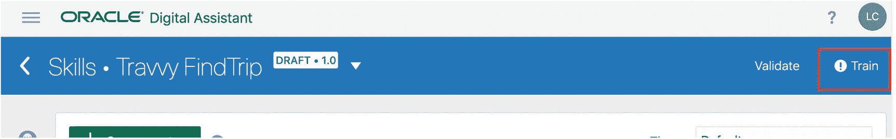

**图 4-15** 需要训练

如果需要训练，您需要点击顶部蓝色工具栏中的`Train`，并提交弹出的窗口。训练将开始，并且通常成功完成，不会出现任何失败。您会注意到感叹号将变为一个勾选框，表示训练成功。现在您可以测试`Skill Bot`了。可以通过点击左侧工具栏中的播放按钮来开始测试（图 4-16）。


**图 4-16** 启动测试器

`Skill Tester`弹出窗口将显示，您可以通过输入类似“*嗨，我想去美国进行一次极限徒步旅行*”的消息来与`FindTrip` `Skill Bot`开始对话（图 4-17）。`Skill Bot`将回复并为您提供选择徒步旅行的选项。请注意，美国已被预选为目的地，因为机器人从您的话语中识别出来了。

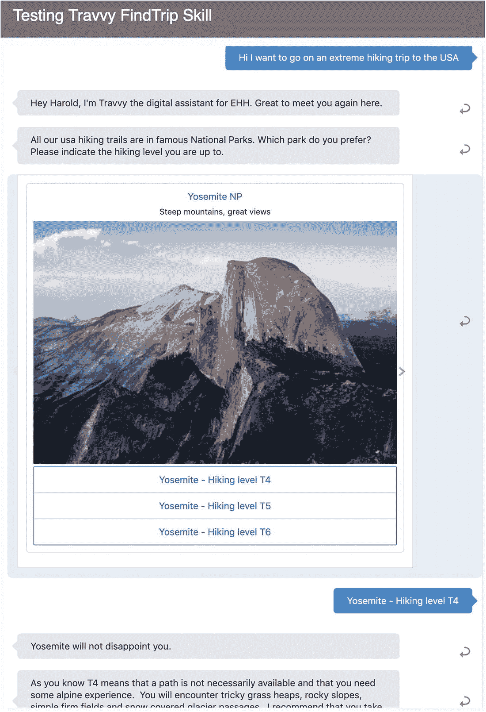

**图 4-17** 使用生成的`Skill Bot`运行测试器

接下来，您可以在轮播中浏览国家公园，并通过单击选择您偏好的徒步等级。对话将继续，就像在`Conversation Designer`中定义的那样。

您可以随时重新进入`Conversation Designer`对原型进行更改并重新生成`Skill Bot`。

## 注意

始终记住，重新生成意味着所有在`OBotML`中对`Entities`、`Intents`和流程手动进行的更改都将被覆盖。

## 总结

在本章中，您学习了如何使用`Oracle Digital Assistant`的`Conversation Designer`来实现`Skill Bot`的原型/初始骨架。`Conversation Designer`在开发的早期阶段非常有用，因为它不允许您实现更复杂的功能，例如问答、翻译、自定义组件和代理集成。这些功能需要在为`Skill Bot`生成`OBotML`之后植入。所有这些都将在本书的后续章节中解释，您还将了解更多关于`Entities`、`Intents`和对话流程的内容。


