# 5. 深入实现细节

现在你已经熟悉了 Oracle 数字助理的背景、功能以及如何设计数字助理，是时候了解一些基本概念了。在本章中，你将首先了解 Oracle 数字助理（ODA）环境。然后，你将基于第 3 章描述的用例，开始与数字助理 `Travvy` 的旅程。每一节中，你将先了解概念，然后针对该用例实现这些概念。

## Oracle 数字助理（ODA）环境简介

一旦你的 Oracle 云环境中的身份域管理员授予你访问权限，你将收到一封发送至注册邮箱的注册邮件。收到邮件后，你需要完成环境的注册。流程成功完成后，你将进入 ODA 的主屏幕，如图 5-1 所示。
此屏幕显示 ODA 中的实例列表。如图 5-1 所示，我们目前创建了一个名为 `dadev` 的实例，作为开发环境。

### 提示

你应该为实例使用命名约定，以便轻松理解所查看的内容。本书使用的约定是 `<2 字母缩写-产品><3 字母缩写-环境>`，因此数字助理开发环境命名为 `dadev`。
但当你为 ODA 添加任何新实例时，此列表会更新，并且该名称将出现在列表中。

图 5-1：Oracle 数字助理主页

然后，要导航到特定实例（本例中为 `dadev`），你需要点击对应环境的图标，并选择 `数字助理设计器 UI`。
选择 `数字助理设计器 UI` 后，你将重定向到该特定实例的主屏幕，如图 5-2 所示。你会注意到实例中包含一个数字助理和几个并非你创建的技能。这些是 Oracle 作为实例的一部分提供的示例，帮助你入门。
此外，你可能注意到主屏幕包含三个选项卡：

- `全部`：显示 ODA 实例中所有技能和数字助理的累积视图。
- `数字助理`：包含实例中的所有数字助理。
- `技能`：包含 ODA 实例中的所有技能。

图 5-2：实例主页

首先理解 `数字助理` 和 `技能` 之间的区别很重要。你可以将数字助理视为一个或多个技能的逻辑分组，这些技能可以单独执行特定任务，以完成一项活动。当用户开始与数字助理对话时，数字助理首先分析用户的输入，然后根据输入将用户引导至特定技能。
如果你考虑本书第 4 章描述的用例，`Travvy` 就是你的数字助理。对于 `Travvy`，你将创建各种技能（即独立的聊天机器人）来执行任务，例如查找行程、预订行程、更新用户信息等。
现在你对数字助理和技能有了基本了解，本章接下来的部分将进一步深入细节。

## 使用技能

你可能已经了解，技能是任何数字助理的构建块。根据你的具体场景，你将创建一个或多个技能，让数字助理执行特定任务。本节将描述如何：

- 创建技能
- 克隆技能
- 导入技能
- 导出技能
- 创建技能的新版本
- 删除技能
- 发布技能
- 导出对话日志
- 显示渠道路由

### 创建技能

点击屏幕左上角的图标，导航至 `开发` 下的 `技能`，如图 5-3 所示。

图 5-3：创建技能

导航至技能后，点击图标关闭侧边菜单。
现在你将添加一个 `Travvy` 的新技能。为此，你首先需要为技能决定一个名称，也称为调用名称。命名技能时有一些指导原则需要遵循。因此，技能名称应：

- 在 Oracle 数字助理实例中唯一
- 明确指定技能的用途
- 简单，即易于阅读和发音
- 不是长短语，也不是单个单词（除非该单词明确表达唯一名称或用途）
- 不包含“打开”、“转到”或“告诉我”等词语

考虑上述指导原则，你将技能命名为 `FindTrip`。顾名思义，你将使用此技能为数字助理的用户查找行程。
从技能主页点击 `新建技能`，如图 5-4 所示。

图 5-4：添加新技能

这将打开一个新窗口。你需要填写所需详细信息，如图 5-5 所示。

图 5-5：创建 `FindTrip` 技能

### 注意

当您开始为技能输入 `显示名称` 时，`名称` 字段会自动填充。如果您希望为技能设置不同的 `显示名称` 和 `名称`，也可以手动编辑此字段。
创建完成后，`FindTrip` 将与其他技能一起出现在“技能”部分。参见图 5-6。

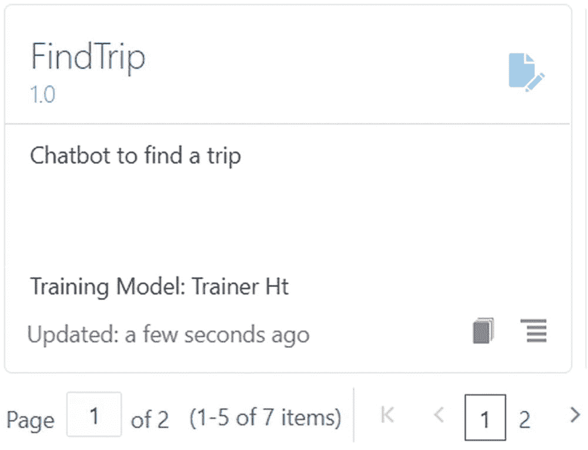

图 5-6 `FindTrip` 技能

点击 `FindTrip` 技能。这将打开一个包含该技能所有详细信息的新窗口。参见图 5-7。

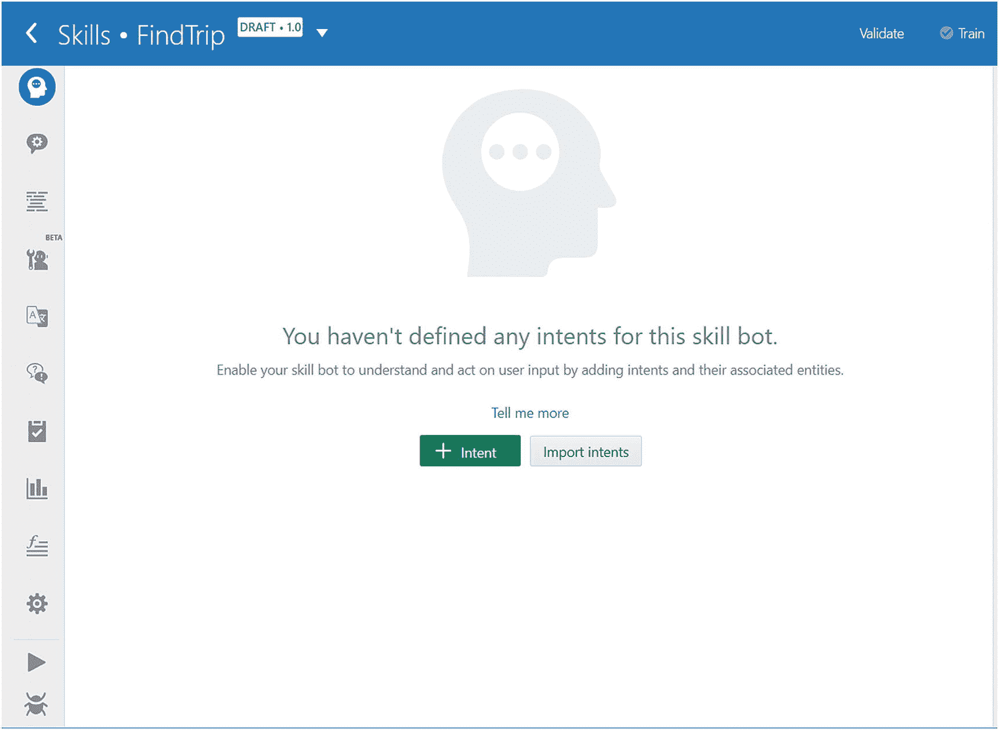

图 5-7 `FindTrip` 技能详情

您可以看到屏幕左上角包含一个导航菜单，可带您返回“技能”屏幕。
向右移动，您会看到两个菜单项：`验证` 和 `训练`。顾名思义，它们用于验证您的更改和训练您的技能。
左侧菜单项展示了您技能的各个部分。参见表 5-1，该表对这些图标及其描述进行了说明。

表 5-1 菜单项及其描述

| 菜单项 | 描述 |
| --- | --- |
|  | 意图 |
|  | 实体 |
|  | 流程 |
|  | 对话设计器 |
|  | 资源包 |
|  | 问答 |
|  | 质量 |
|  | 洞察 |
|  | 组件 |
|  | 设置 |
|  | 技能测试器 |
|  | 查看影响技能机器人的问题 |

### 克隆技能

在某些时候，您可能希望将某个技能中设计的功能复用到新技能中，而无需对现有技能进行任何更改。为此，您可以将现有技能克隆到一个新技能中。
从“技能”屏幕（见图 5-4）中，找到您想要复用的技能。点击技能右下角的“选项”图标 ，打开技能目录，如图 5-8 所示。

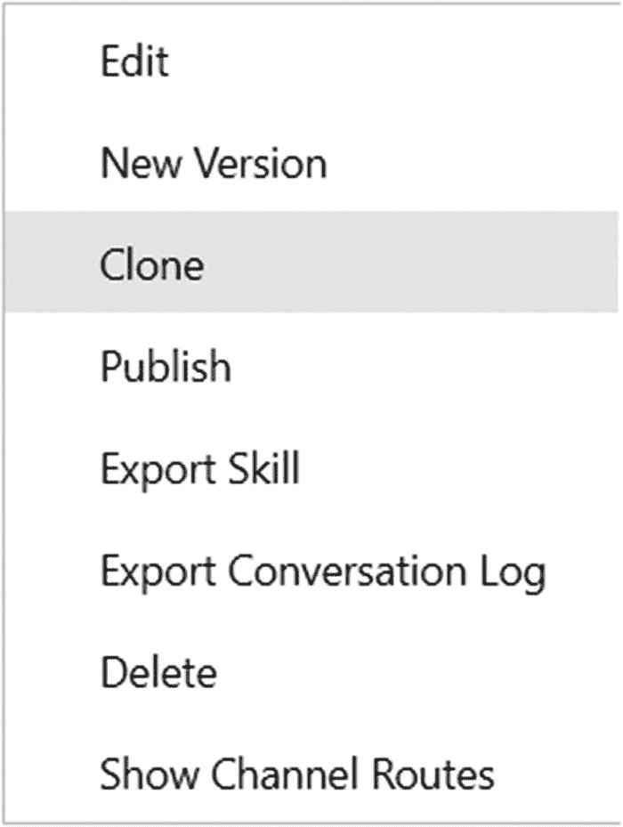

图 5-8 技能目录

从目录中，选择 `克隆` 选项来克隆该技能。

### 导出技能

您可以从技能目录访问的另一个有用功能是 `导出技能`。顾名思义，使用此功能，您可以导出您的技能，然后将其下载到您的系统上。例如，如果您导出 `FindTrip` 技能，您会注意到一个 `FindTrip(1.0).zip` 文件被下载到您的系统。这里的 `1.0` 是您技能的版本。

### 导入技能

如果您想为您的数字助手使用一个预构建的技能，那么您可以将该技能导入到您的数字助手环境中。从技能主页，点击 `导入技能` 按钮，如图 5-9 所示，以导入包含该技能的 zip 文件。


图 5-9 导入技能

### 创建技能的新版本

从技能目录（见图 5-8）中，如果您想为您的技能添加一个新版本，请选择 `新版本`。

### 删除技能

如果需要，您可以通过从技能目录（见图 5-8）中选择 `删除` 选项来删除您的技能。

### 发布技能

完成技能开发后，您可能希望从数字助手中访问它。要在数字助手中访问技能，首先需要发布该技能。要发布您的技能，请从技能目录中选择 `发布` 选项。确保在发布前训练您的技能。如何执行此操作将在 `训练和测试意图` 部分中说明。
发布技能后，您只能从“设置”部分的“配置”选项卡更改其自定义参数值。
如果您希望在发布后更新您的技能，则必须创建一个技能的 `新版本`。

### 导出对话日志

对话日志的目的是检查与您的技能发生的各种对话。这包括与意图、问答（如果技能中存在）以及整个技能相关的对话。默认情况下，技能的所有类型的对话日志记录都是关闭的。您可以通过访问技能的“设置” ，从“常规”选项卡中启用它们。
将显示以下选项：

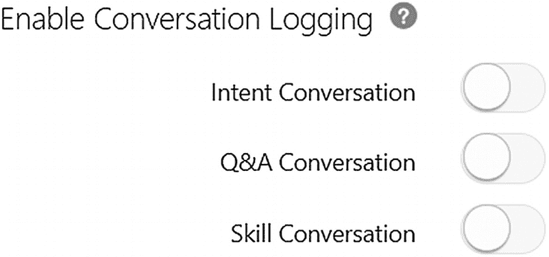

图 5-10 对话日志记录选项

启用对话日志记录后，从技能目录（见图 5-8）中选择 `导出对话日志`。这将显示一个新的弹出窗口，如图 5-11 所示。在此处，您可以选择要导出的对话日志。您还可以指定要获取日志的 `时间段`。要最终导出所需的对话日志，请点击 `导出` 按钮。

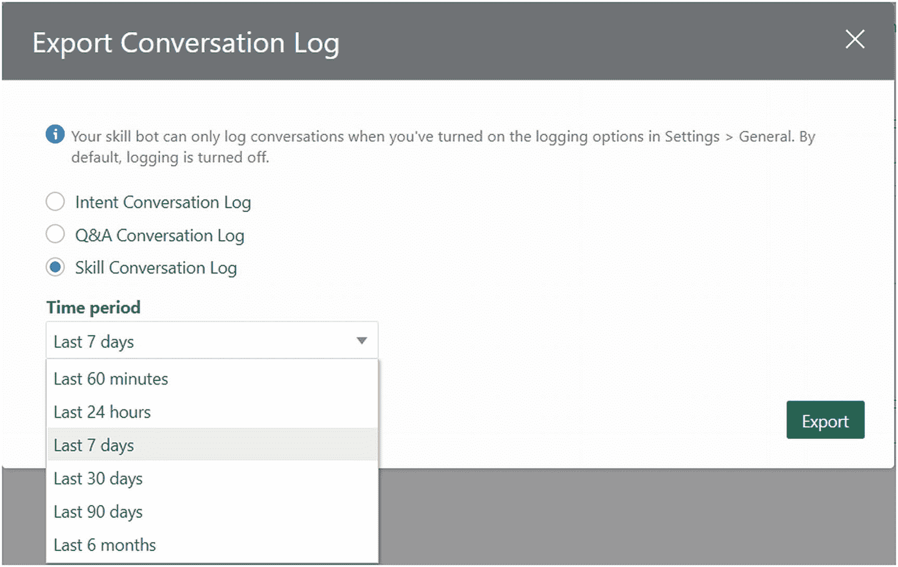

图 5-11 导出对话日志

### 显示渠道路由

技能目录中的 `显示渠道路由` 选项允许您将渠道路由到您的技能。您将在本书的后续部分中了解更多关于渠道以及如何将这些渠道路由到您的技能的信息。

## 处理意图与表述

在本节中，您将学习如何：

- 创建意图
- 向意图添加表述
- 导出意图
- 导入意图
- 训练和测试意图

在本书的第 2 章中，您已经了解了意图和表述的相关概念。
快速回顾一下，`意图` 可以描述为您打算通过技能执行的一项工作或任务。为了描述这些意图，您需要将它们与示例句子关联起来。这些描述意图的示例句子被称为 `表述`。
例如，如果您创建了一个 `PizzaSkill`，您可能希望使用该技能来订购披萨。为此，您可以添加一个意图，比如 `OrderPizza`，它允许用户通过该技能订购披萨。为了让技能识别用户的意图，您只需向技能中添加一些示例表述，例如“帮我订一份披萨。”当用户与技能交互并说出/写下“帮我订一份披萨”时，技能将能够根据该表述解析出具体的意图，在本例中就是 `OrderPizza`。您添加的表述越多，您的技能就越健壮。
您的表述应该是完整且有意义的句子，但长度不要超过 255 个字符。较短的表述通常能带来更好的结果，因为它们往往更简洁，填充词更少。此外，表述不应由单个单词构成。

### 提示

最初，您至少应该为定义的每个意图创建十到十五条表述。这能确保更好的意图解析效果。当您准备将技能部署到生产环境时，您将需要更多的表述。为意图识别表述是一个迭代过程——如果做得好，会带来良好的结果。
每个技能必须至少关联两个意图。因此，如果以 `PizzaSkill` 为例，它应该包含两个意图，比如 `OrderPizza` 和 `CancelPizza`。

### 创建意图

在本节中，您将向之前在本章中创建的 `FindTrip` 技能中添加意图。展开 `FindTrip` 技能，然后从左侧菜单导航到意图部分 。
点击 `+ Intent` 按钮来添加一个意图。点击该按钮后，您会注意到一个默认名称为 `Intent1` 的意图被创建。参见图 5-12。然后，您需要为意图指定一个合适的名称，在本例中为 `SelectTrip`。

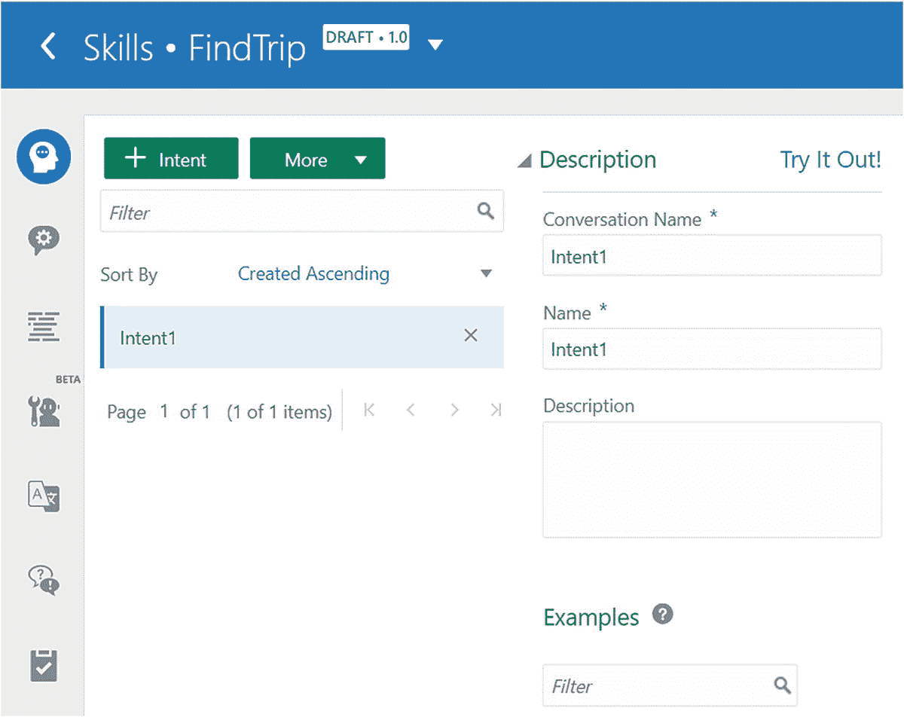

图 5-12 创建意图

将意图的 `对话名称` 更新为“选择您的行程”，并将 `名称` 更新为 `SelectTrip`。当技能无法解析某个意图时，对话名称会在对话中显示（作为选项）；而在您的对话流程中，您通过名称来识别任何意图。如果需要，您还可以为意图添加 `描述`，但这并非强制要求。

### 向意图添加表述

要向意图添加表述，您需要将它们添加到 `示例` 部分下，位于占位符文本为“在此处输入您的示例表述”的文本区域中（参见图 5-13）。

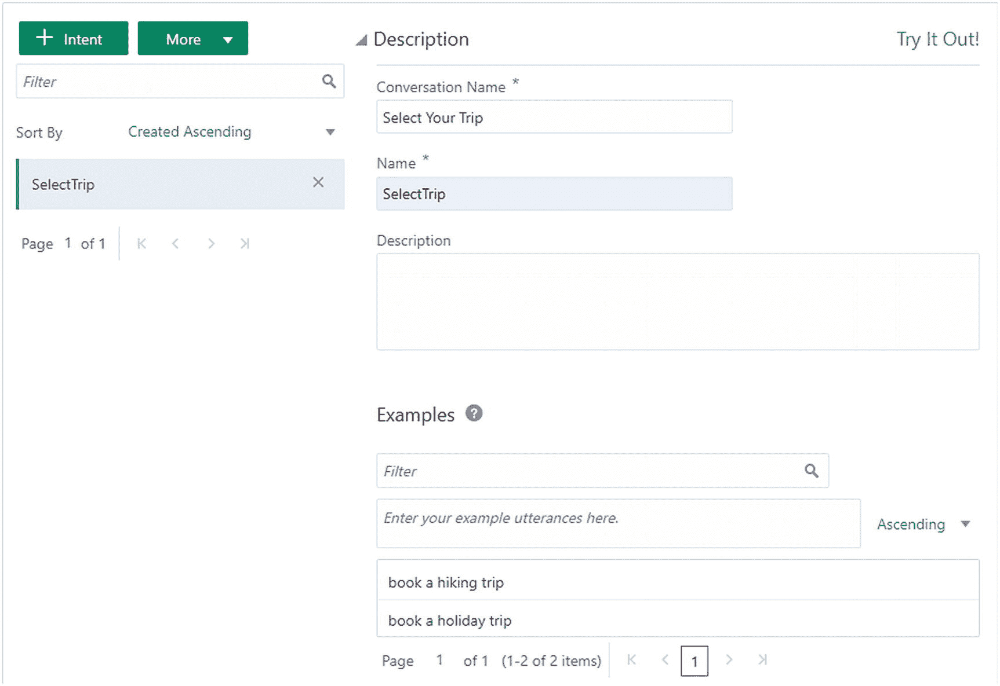

图 5-13 添加表述

一旦您开始添加表述，这个列表就会增长。如果您想查找特定的表述，可以在 `Filter` 字段中输入该表述进行搜索，系统随后会在已添加的表述中进行搜索。

### 导出意图

您可以从一个技能中导出意图，然后将这些意图用于另一个技能。这样，如果需要为多个技能创建相同的意图，可以节省您的精力。以下步骤将说明如何导出意图：

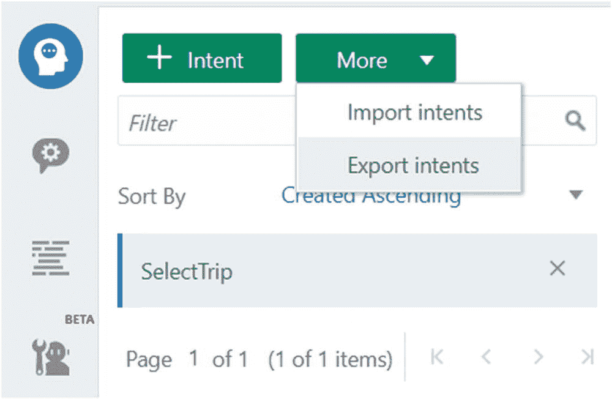

图 5-14 导出意图

1. 导航到技能中的 `意图` 部分 。
2. 点击“更多”按钮，然后选择 `导出意图`（参见图 5-14）。

这会将您的意图导出到一个 CSV 文件中。在本例中，该文件名为 `FindTrip-Intents.csv`。导出的 CSV 文件包含三列，分别是 `query`、`topIntent` 和 `conversationName`。`query` 列包含表述，而 `topIntent` 和 `conversationName` 列则包含相关意图的名称以及该意图的对话名称（参见图 5-15）。

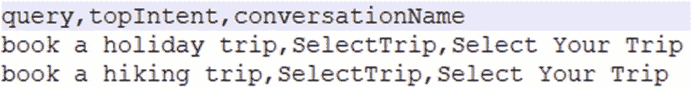

图 5-15 `FindTrip-Intents.csv`

### 注意

当您导出意图时，技能中存在的所有意图都将被导出到一个 CSV 文件中。

### 导入意图

要将意图导入到您的技能中，您需要导入包含已导出意图的 CSV 文件，如上一节所示。以下步骤将说明如何导入意图：

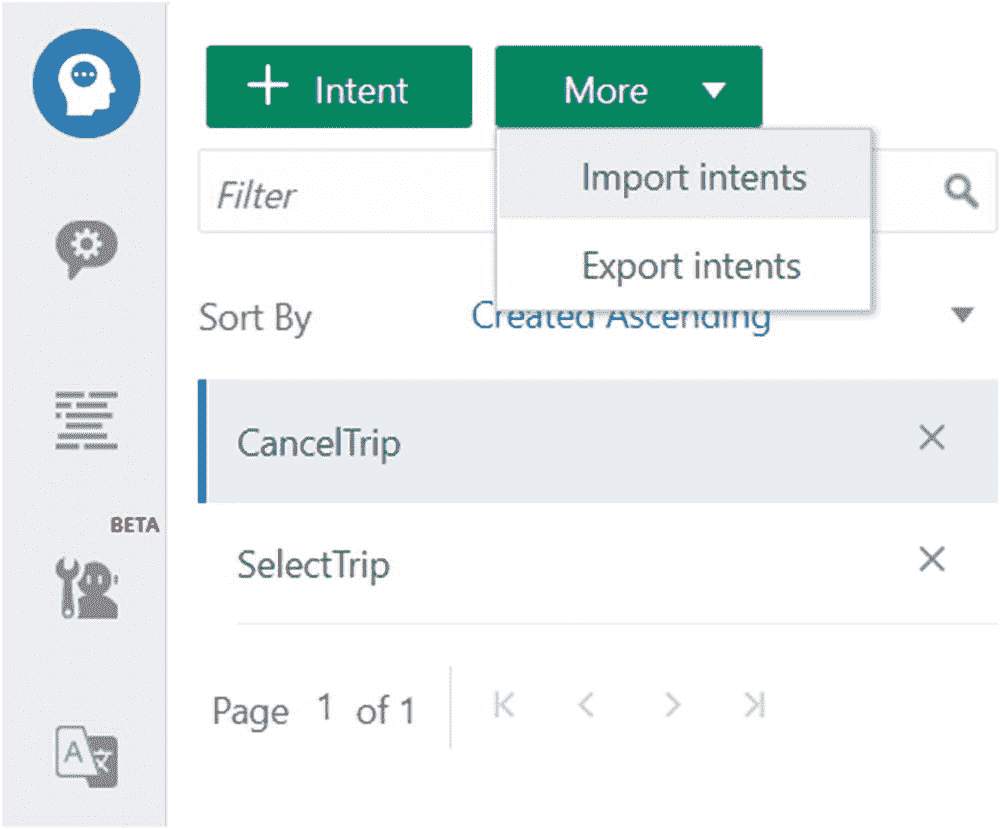

图 5-16 导入意图

1. 导航到技能中的 `意图` 部分 。
2. 点击“更多”按钮，然后选择 `导入意图`。参见图 5-16。

如前所述，“导出意图”会导出技能包含的所有意图。因此，“导入意图”会将所有导出的意图添加到您的技能中。如果您想添加特定的意图及其关联的表述，则需要在将导出的 CSV 文件导入技能之前，手动编辑该文件。

### 训练与测试意图

创建或更新意图后，你需要训练技能，以便模型根据你的更改进行训练。此训练基于不同的机器学习算法，这些算法会使用相关的意图和表述来训练你的技能。当用户与你的技能交互时，此训练可确保你的技能识别出特定意图并做出相应响应。

# 技能开发指南：意图、实体与对话流

当你添加或编辑意图时，你会注意到右上角的 `Train` 按钮旁会出现一个指示标记（）（见图 5-17）。这表示你需要训练你的技能以应用你的更改。


图 5-17 需要训练的指示

点击 `Train` 按钮会显示两种不同的训练机制：`Trainer Ht` 和 `Trainer Tm`（见图 5-18）。你可以通过点击相应的单选按钮来选择特定机制。请注意，默认选中 `Trainer Ht`。在初始开发周期中，当你的训练语料库较小时，请使用 `Trainer Ht` 来训练你的技能。但随着训练语料库逐渐成熟，并且你开始获得准确的意图解析结果时，你最终应转向使用 `Trainer Tm`。

现在，你将使用默认的 `Trainer Ht` 训练模型来训练你的技能。由于它是默认选项，要启动该过程，你只需点击 `Submit` 按钮。

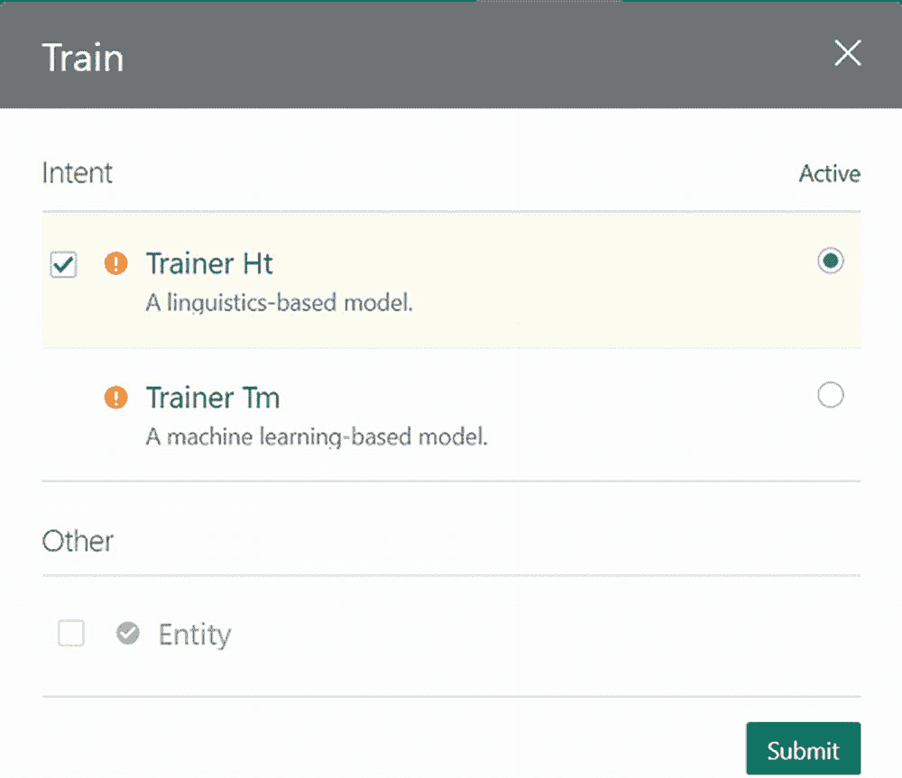
图 5-18 训练意图

假设你已经训练了你的技能，接下来你将测试你的意图。

测试是任何开发周期的核心环节之一，机器人测试也不例外。在机器人开发过程中，应持续测试其功能。一旦你完成了意图的开发，就应该测试这些意图是否按预期运行。

要测试你的意图，请点击 `Try It Out!`，如图 5-19 所示。


图 5-19 测试意图

这将打开一个新窗口，你可以在其中测试你的意图。输入一个短语进行测试，然后点击 `Send` 按钮。随后，测试器将处理你的短语，并向你显示该短语解析到了哪个意图，以及其他附加信息。见图 5-20。

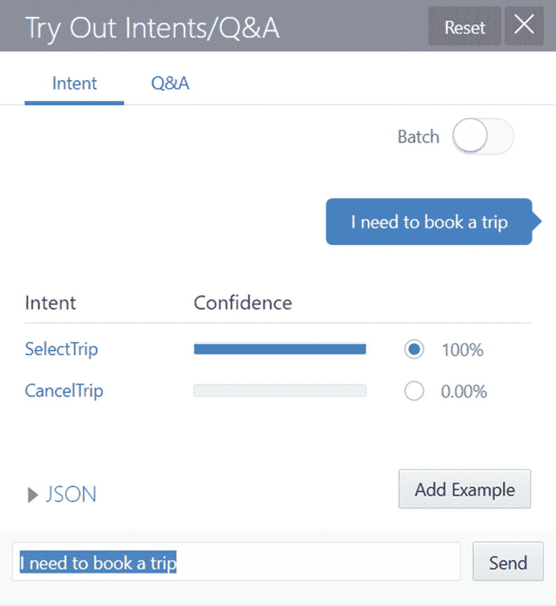
图 5-20 意图测试

或者，你也可以通过切换 `Batch` 按钮，然后上传 CSV 文件，以批处理模式测试你的意图。请查看图 5-21。

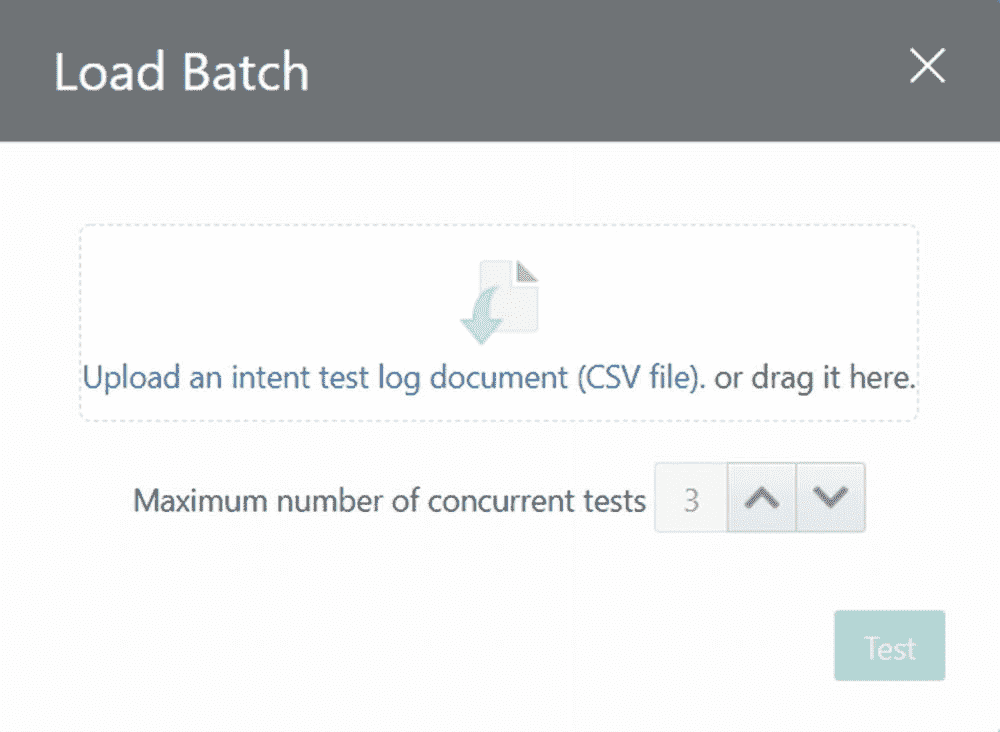
图 5-21 批量上传

当你为“意图对话”启用对话日志记录，然后按照前面“导出对话日志”一节所述导出对话日志时，即可获得该 CSV 文件。

## 使用实体

在处理意图和表述时，你了解到意图是你打算执行的特定操作，而表述是描述这些意图的有意义的句子。实体是可变元素，为意图提供上下文。简单来说，实体是你在对话过程中向用户寻求的那些值，你将根据这些值来定义机器人的结果或流程。

例如，对于你的 `FindTrip` 技能，如果用户说“我想预订一次旅行”，那么你知道用户的意图是预订旅行，但与此同时，这是一个非常笼统的陈述。相反，如果用户说“我想预订一次去美国的徒步旅行”，那么上下文就清晰得多。所以，用户想预订旅行，但去哪个地点？答案是去美国。这个有助于为意图提供恰当含义的地点，就被称为实体。因此，如果用户提供了地点，你就可以为他预订特定的旅行，否则你需要询问他地点，以便为他提供合适的预订选项。

实体分为两类：

1. 内置实体
2. 自定义实体

内置实体或系统实体是 Oracle 作为数字助手实例的一部分提供给你的实体。自定义实体是你根据自己的需求创建的实体。

## 内置实体

内置实体分为两类：

1. 简单实体
2. 复杂实体

### 简单实体

简单实体基于原始类型，如字符串和整数。简单实体的示例包括：

* `NUMBER`
* `EMAIL`
* `YES_NO`

### 复杂实体

另一方面，复杂实体基于特定属性。表 5-2 展示了复杂实体及其属性。

表 5-2 复杂实体

| 实体 | 属性 |
| --- | --- |
| `ADDRESS` | `city`、`houseNumber`、`road`、`originalString` |
| `DATE` | `originalString`、`date` |
| `TIME` | `hrs`、`mins`、`secs`、`"hourFormat":"PM"` |
| `DURATION` | `startDate`、`endDate`、`originalString` |
| `SET` | `minute`：范围为 {0–59}，`hour`：范围为 {0–23}，`dayOfTheMonth`：范围为 {1–31}，`monthOfTheYear`：范围为 {1–12}，`dayOfTheWeek`：范围为 {0–6}，以 0 表示星期日，`year` |
| `CURRENCY` | `amount`、`currency`、`totalCurrency` |
| `PHONE_NUMBER` | `phoneNumber`、`completeNumber` |
| `URL` | `protocol`、`domain`、`fullPath` |

## 自定义实体

自定义实体是特定于技能的实体，你将创建它们来存储或检索自定义值。例如，对于金融机器人，你可以考虑使用 `AccountType` 实体，它可以具有 `Savings` 和 `Current` 账户等值。或者对于 `PizzaBot`，`CrustType` 可以是 `Thin`、`Thick` 或 `Medium`。

以下是自定义实体的类型：

* `派生实体`：顾名思义，它们派生自内置实体或你定义的自定义实体。
* `值列表实体`：这些实体基于预定义的值列表。
* `实体列表实体`：这些实体是实体的超集，并基于其他实体的列表。
* `正则表达式实体`：这些实体基于正则表达式（regex）来严格匹配特定模式。
* `复合包实体`：这些实体是一组相关实体，可以解析到特定领域或特定功能。你可以通过不同方式配置复合包实体。你可以提示用户输入构成复合包的每个实体的值，也可以提示用户输入特定实体，并根据提供的实体值推导出复合包中的其余实体。

### 创建实体

要创建实体，你需要深入找到要添加实体的技能，然后导航至实体部分。在接下来的几步中，你将向 `FindTrip` 技能添加 `TripLocation` 实体：

1. 点击 `FindTrip` 技能。
2. 从左侧菜单导航至实体 ()。
3. 点击“+ 实体”按钮。

这将添加一个默认名称为 `Entity1` 的新实体。然后你需要将其更新为 `TripLocation`。请参见图 5-22。

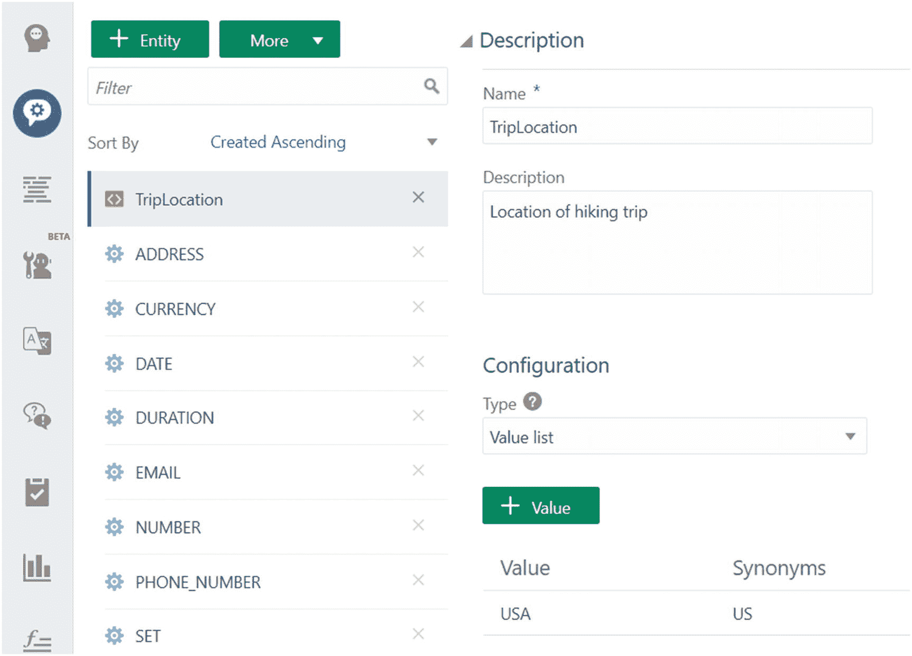
图 5-22 创建实体

你可以通过点击“+ 值”按钮向列表中添加新值。这将弹出一个如图 5-23 所示的弹出窗口，你可以在其中向列表添加新值。

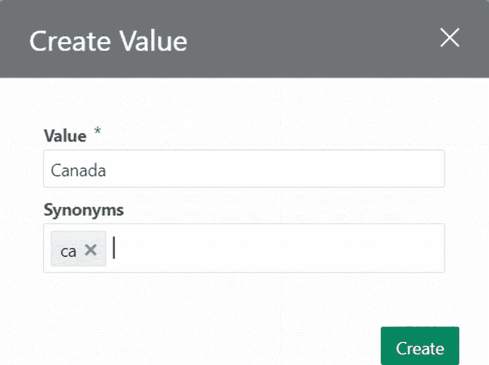
图 5-23 添加新值

### 向意图添加实体

创建 `TripLocation` 实体后，你需要将新创建的实体添加到 `SelectTrip` 意图中。为此，只需遵循以下步骤：

1. 导航至**意图**部分 ()。
2. 选择“SelectTrip”意图。
3. 点击右侧的“+ 实体”按钮。
4. 这将打开一个包含所有可用实体的弹出窗口。
5. 点击“TripLocation”，即可将该实体添加到“SelectTrip”意图中。

请参见图 5-24。

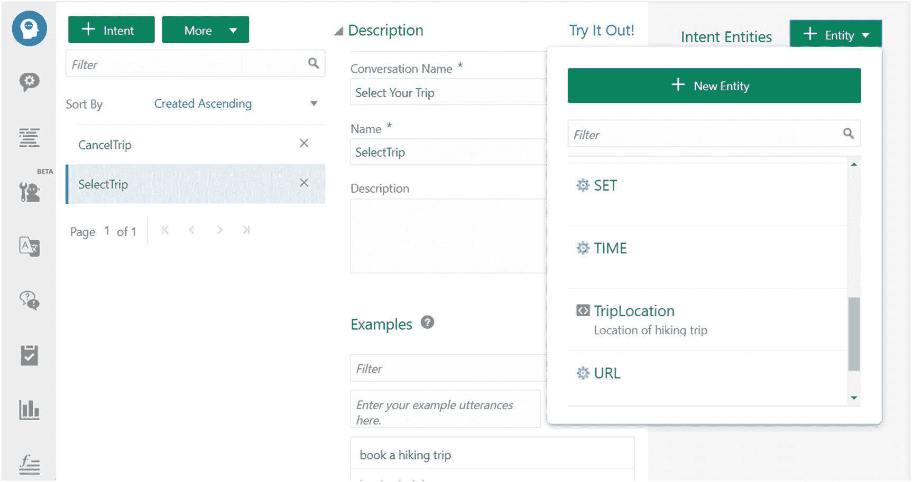
图 5-24 向意图添加实体

由于你刚刚更新了意图，请确保按照本章前一节所述训练模型并测试你的意图。此外，如果你添加了实体，则在训练模型时应选中“实体”选项（图 5-25）。

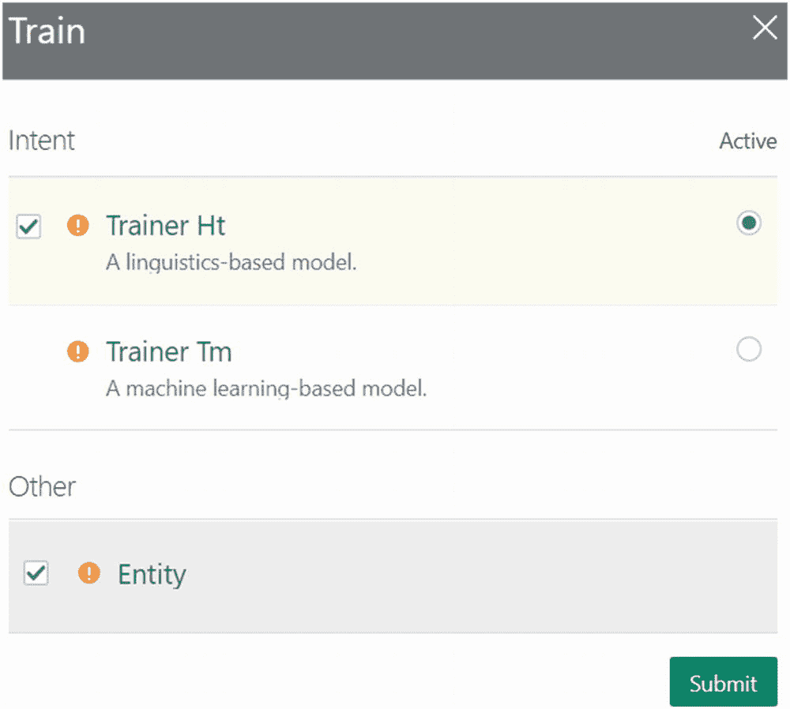
图 5-25 训练技能

## 使用对话流

到目前为止，你已经熟悉了意图、表述和实体。现在是时候在对话流中使用它们了，这样你的技能就能具备处理对话的能力。对话流是设计技能对话的地方。技能应该如何问候、应该向用户询问什么、以及如何根据用户输入做出反应——所有这些都通过对话流中的各种组件来处理。因此，可以说对话流定义充当了任何技能的模型。

对话流是使用 Oracle Bots 标记语言 (OBotML) 设计的。OBotML 基于 YAML，这是一种表达数据和数据关系的人性化方式。

你可以通过点击左侧导航栏中的“流” () 来访问技能的对话流。在继续之前，理解构成对话流的各个部分至关重要。请参见图 5-26。

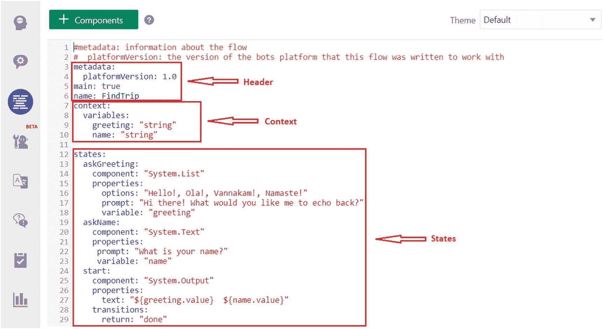
图 5-26 对话流部分

对话流大致可以分为三个部分：

1. 头部：包含 OBotML 平台版本和对话流名称。
2. 上下文：包含上下文和变量，也称为对话流变量，这些变量在流程中使用。
3. 状态：包含各个状态、动作及其结果。此部分包含技能交互和响应的主要逻辑。

由于 OBotML 遵循 YAML 标准，因此在对话流中保持正确的缩进非常重要。如果你编写的行没有正确缩进，在设计时自动保存期间将会收到错误。

> **注意**：每个缩进的长度等于两个空格。

流程的头部部分相当直接。它包含你的机器人的元数据信息。但涉及到上下文和状态时，你需要更仔细地查看。

### 上下文部分

如前所述，你在上下文部分为技能定义了全局作用域的变量，然后可以在技能对话流的各个状态中使用这些变量。上下文部分中的变量定义如下：

`variableName`: “`variableType`”;

显然，`variableName` 是你给变量起的名称。`variableType` 是变量的类型，可以是：

* 原始类型（`string`、`int`、`boolean`、`double` 和 `float`）
* 内置实体（`CURRENCY`、`ADDRESS` 等）
* 自定义实体（如前面章节创建的 `TripLocation`）
* `nlpresult`，来自自然语言处理引擎的结果
* `resourcebundle`，用于你定义的引用技能中资源包的变量

这些变量在对话结束时或被显式重置时总是会被清除。

### 状态部分

状态是定义技能整个流程的地方。在这里，你定义技能应该执行的所有活动和动作。你的流程通常由许多状态组成。这些状态调用组件，组件为状态执行任务或工作。

> **注意**：一个状态只能调用一个组件。

流程总是从上到下执行。这意味着在状态部分，你定义的第一个状态首先被执行，第二个状态接下来被执行，依此类推。这是默认行为，除非你显式设置转换到另一个状态。

此外，强烈建议在你的流程中设置一个默认转换，以优雅地处理因不可预见的用户输入而可能产生的任何意外异常/错误。

在开始使用对话流之前，你还需要了解另外两件事：Apache FreeMarker 模板语言 (FTL) 和对话流中的组件。

首先，我们来处理 Apache FreeMarker 模板语言及其工作原理。

### Apache FreeMarker 模板语言

为简单起见，在 ODA 环境中，您使用 Apache FreeMarker 模板语言 (FTL) 来设置和访问变量的值（以及它们的属性，如果有的话）。如果您想了解更多关于 FTL 的信息，可以访问其官方网站 [`freemarker.apache.org/`](https://freemarker.apache.org/)。

在对话流中使用 FTL 的语法相当直接。您只需将想要使用 FTL 处理的所有内容包裹在 `${…}` 中。您可以在组件的属性定义中使用 FTL（组件将在本章下一节中描述）。例如，如果您定义了一个名为 `myVariable` 的变量，并想读取它的值，那么您只需使用：

```ftl
${myVariable.value}
```

或者，如果您定义了一个变量，它是一个类型为 `ADDRESS` 的复杂实体，比如 `userAddress`，那么您可以使用 FTL 来提取城市，如下所示：

```ftl
${userAddress.value.city}
```

FTL 的用途不仅限于此。您还可以使用 FTL 在流程中编写复杂的表达式。一个非常常见的场景是在 `System.CommonResponse` 组件中使用 FTL，您可以在其中使用 `if`、`else` 或 `elseif` 指令定义条件。其语法如下：

```ftl
<#if yourCondition>result1<#else>result2</#if>
<#if firstCondition>result1<#elseif secondCondition>result2<#elseif thirdCondition>result3</#if>
```

当然，FTL 的使用并不仅限于 `CommonResponse` 组件，您可以在整个对话流中使用它们，用于在机器人响应中赋值或进行评估。

此外，您还可以使用 FTL 支持的各种操作，例如针对字符串、数字、日期时间值等的操作。要了解更多信息，请参考链接 [`freemarker.apache.org/docs/ref.html`](https://freemarker.apache.org/docs/ref.html)。

对 FTL 进行冗长的讨论，涵盖所有这些用例和操作，可能会超出本书的范围。因此，我们在此结束本节。任何 FTL 的进一步用法将在需要时进行解释。

### 对话流中的组件

您想在技能中实现的任何功能都来自组件。无论您是想显示卡片或列表、根据用户输入执行特定操作、显示任何输出、状态转换、处理错误等，甚至是想执行某些特定任务（如调用 REST 调用来处理用户响应），您都将借助组件来完成所有这些操作。

组件可以大致分为两类：

- 内置组件
- 自定义组件

顾名思义，内置组件是 Oracle 作为数字助手框架的一部分提供给您的组件，供您在技能中使用。这些组件足以执行大多数技能操作。您可以在流程中轻松识别这些组件，因为它们总是在 `states` 部分的 `component` 下以 `System.` 开头。请参考图 5-26。

如果在任何时候，您想在技能中执行某些无法使用内置组件完成的操作，那么您可以定义自己的组件。您为执行特定任务而创建的这些组件称为自定义组件。

### 内置组件

如前所述，这些是 ODA 框架中预定义的组件。要将内置组件添加到您的流程中，您需要点击编辑器顶部的 `+ Components` 按钮。这将打开一个新窗口，如图 5-27 所示，为您提供多种组件类型可供选择。

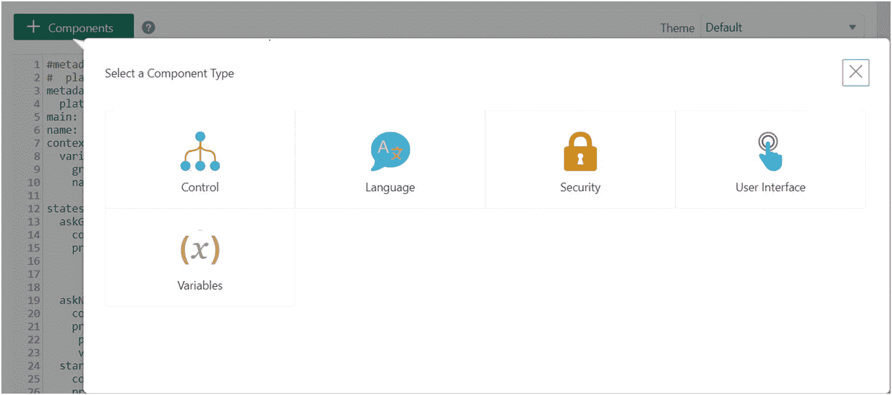
图 5-27 组件类型

如上图所示，ODA 为您提供了五种类型的内置组件。通过选择一种组件类型，您可以选择属于该类型的组件模板。下面，您可以找到属于图 5-27 中所示每种组件类型的完整组件模板列表：

1. 控制
    1. `System.ConditionEquals`
    2. `System.ConditionExists`
    3. `System.Switch`
2. 语言
    1. `System.DetectLanguage`
    2. `System.Intent`
    3. `System.MatchEntity`
    4. `System.QnA`
    5. `System.TranslateInput`
    6. `System.TranslateOutput`
3. 安全
    1. `System.OAuth2AccountLink`
    2. `System.OAuthAccountLink`
4. 用户界面

# 自定义组件与 Webview

当内置组件无法满足特定需求时，您可以创建自定义组件。自定义组件在技能中作为服务实现。为技能定义自定义组件服务后，您可以在对话流中引用它们。

考虑一个基于用户输入通过 API 访问数据的场景，您需要检索某些特定于用户的详细信息。这种需求无法通过内置组件满足，您需要编写自己的自定义逻辑，在自定义组件中实现此类场景。在流程中引用自定义组件的方式如下：

*   `component: "YourCustomComponentName"`

您使用 JavaScript 编写自定义组件代码。为方便起见，Oracle 为您提供了用于实现自定义组件的 SDK。自定义组件可以通过三种不同的方式实现：

1.  在 Oracle Digital Assistant 的嵌入式容器中部署自定义组件
2.  作为使用 Oracle Mobile Hub（Oracle Mobile Cloud）的 API
3.  作为外部 Node 服务

要向技能添加自定义组件，请从左侧导航菜单导航到“组件”（）部分。选择“自定义”选项卡（默认选中）。请参考图 5-29。

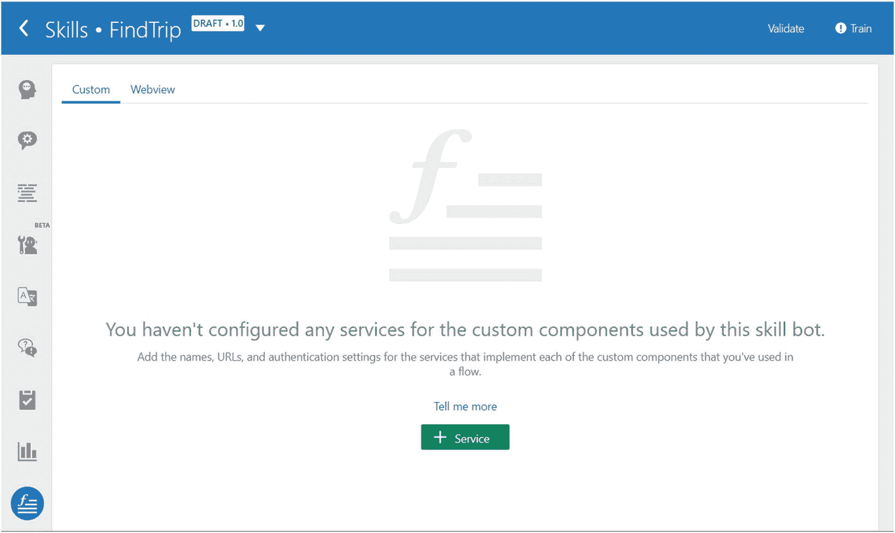

然后您需要点击 `+ Service` 按钮，该按钮将提供上述用于实现自定义组件的选项。请参考图 5-30。

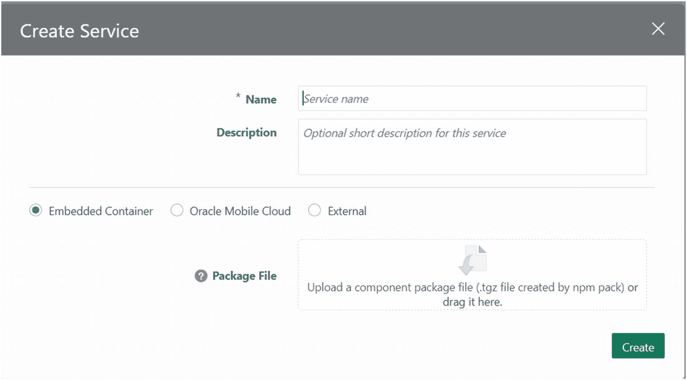

自定义组件将在第 10 章中详细说明。

请参考图 5-29。在“自定义”选项卡旁边，您还有另一个“Webview”选项卡。点击“Webview”选项卡。在这里，您可以为技能创建 Webview 组件。顾名思义，Webview 允许您将网页集成到技能中。通过点击“Webview”选项卡上的 `+ Service` 按钮，您可以为技能创建 Webview 服务，如图 5-31 所示。

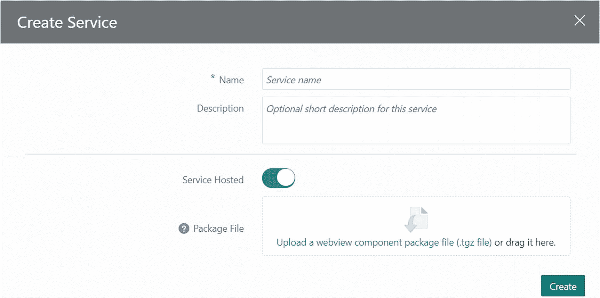

Webview 组件将在第 8 章中详细讨论。

# 将技能添加到数字助理

如本章前面所述，您可以使用技能向数字助理添加各种功能。当具有特定功能的技能准备就绪后，您发布这些单独的技能，并将已发布的技能添加到数字助理。此外，技能必须发布才能添加到数字助理。假设您的技能 `FindTrip` 已准备就绪并已发布，本节将重点介绍如何将 `FindTrip` 技能添加到数字助理 `Travvy`。

通过点击菜单（）图标，导航到 Oracle Digital Assistant 欢迎屏幕的“数字助理”部分，如图 5-32 所示。

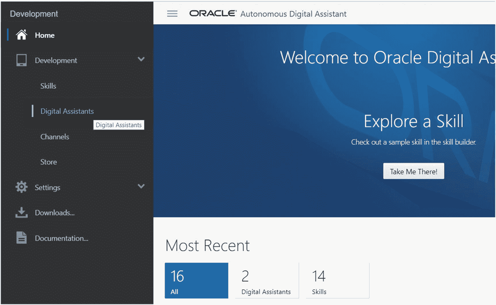

在数字助理屏幕上，点击“新建数字助理”，如图 5-33 所示。

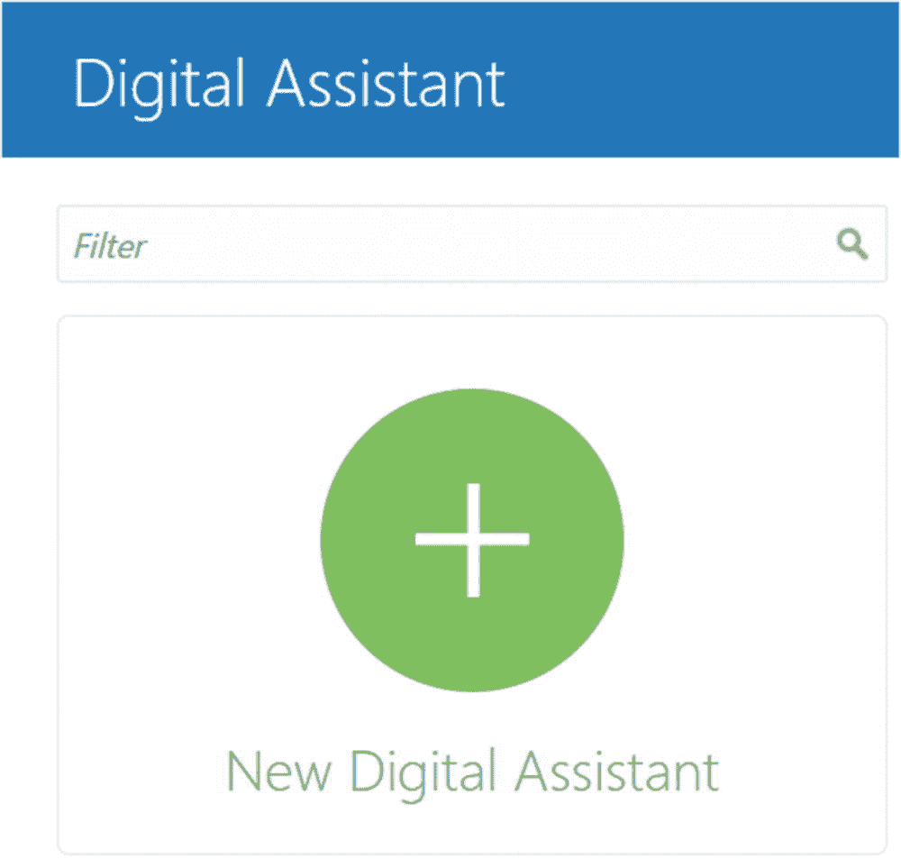

这将为您打开一个新的弹出窗口。在弹出窗口中添加 `Display Name` 为 `Travvy`，`Description` 为 `The Digital Assistant for Extreme Hiking Holidays`，然后点击 `Create` 按钮。创建完成后，您将被重定向到“数字助理详细信息”屏幕（请参考图 5-34），这也会在数字助理主屏幕上添加一个新的 Travvy 部分。

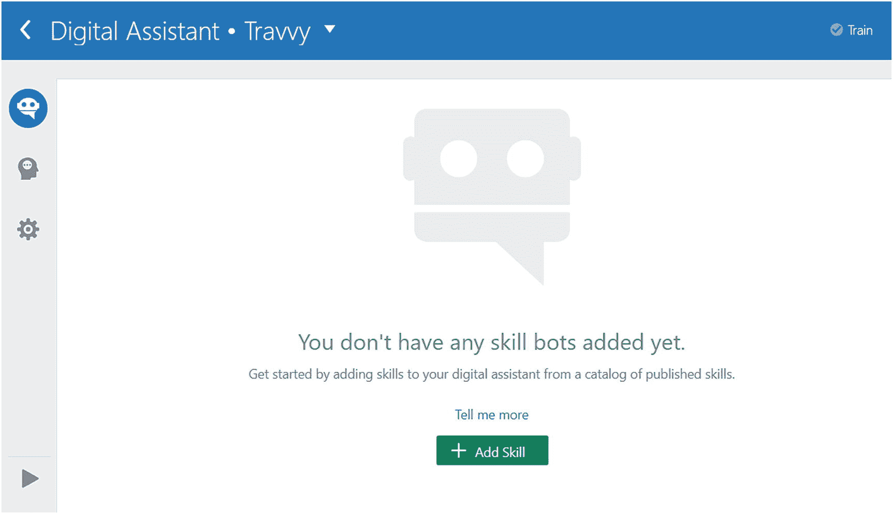

点击 `+ Add Skill` 按钮，如图 5-33 所示，以添加 `FindTrip` 技能。这将重定向您到“技能目录”屏幕。点击 `FindTrip` 技能的“添加技能”（）。完成后，您将收到一条确认消息，表明技能已成功添加。

导航回 `Travvy`。由于您刚刚通过向数字助理添加新技能进行了更改，您会注意到一个训练指示（）。您将拥有与技能相同的训练模型，即 `Trainer Ht` 和 `Trainer Tm`，其中 `Trainer Ht` 是默认模型。使用默认的 `Trainer Ht` 模型训练您的数字助理。

向您的技能添加一些示例语句，以区分一个技能与其他技能。在此情况下，您也将为 `FindTrip` 技能添加一些此类语句。最后，您的数字助理 `Travvy` 的技能部分将类似于图 5-35。

### 注意

这些语句并非用于训练您的数字助理。相反，它们会显示在数字助理帮助中。数字助理训练所用的语句来自已配置的技能。

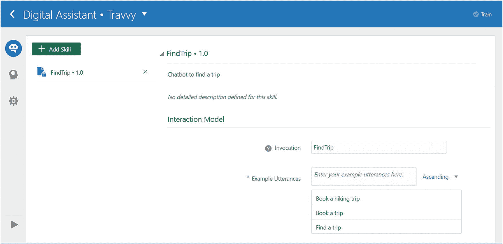

这就是如何将技能集成到数字助理中的方法。

# 总结

既然您已经学习了这么多，现在是时候快速回顾一下了。

本章开始时，您熟悉了 Oracle Digital Assistant (ODA) 环境、数字助理以及技能。然后，您深入探讨了技能以及语句、意图和实体的基本概念，以及如何在技能中使用它们。下一步是对话流，您了解了如何处理技能与人的交互，以及如何使用 Digital Assistant 框架中可用的各种组件来处理用户输入，从而构建技能通信。最后，您学习了如何创建数字助理并将技能集成到其中。

我们建议您清晰理解本章讨论的概念。在接下来的章节中，我们将假定您已熟悉这些概念，并将带您了解 ODA 的更高级概念。