# 6. 通过渠道发布你的数字助手

当你决定在业务中引入数字助手时，想必你已经清楚自己的目标受众。了解目标受众将帮助你确定让数字助手触达他们的最佳方式。当你开始设计数字助手或技能时，只有你和有权访问该特定云实例的人才能使用它。为了让你的数字助手或技能可供业务用户使用，你需要一个渠道来将其发布给他们。顾名思义，渠道充当一种媒介，你通过它将技能或数字助手提供给最终用户。

选择合适的渠道来发布数字助手对其成功与否起着至关重要的作用。例如，如果最终用户无法轻松访问你的数字助手或技能，他们可能会倾向于避开它，转而选择相对更简单的途径来完成任务。同时，如果你的聊天机器人旨在提供用户敏感信息，你可能希望将其限制在更安全、更封闭的渠道中。

设想一个场景，你允许用户通过你的数字助手执行日常银行任务，例如查询账户余额或进行转账。在这种情况下，你可能希望通过银行的网页门户和/或他们的移动应用程序来发布你的数字助手。这可能是出于两个原因：首先，任何银行的网页门户都相当安全；其次，因为此类信息和任务仅针对该银行的用户，你不希望有不必要的用户访问。

另一方面，考虑一个你正在为外卖配送设计数字助手的场景。为了让你的数字助手易于访问并广受欢迎，除了网页渠道之外，你可能还希望将其发布到各种其他消息渠道上——例如 `Facebook Messenger`、`Skype`、`Microsoft Teams` 等。

简而言之，你始终需要根据数字助手的目的和目标受众来决定选择哪个渠道。

现在你已经了解了渠道的重要性，让我们来看看 `Oracle` 数字助手平台提供的各种开箱即用的渠道。

## Oracle 数字助手中的渠道类型

`Oracle` 数字助手中的渠道大致分为四种类型。它们是：

1.  用户
2.  坐席集成
3.  应用程序
4.  系统

### 用户渠道

用户渠道允许你通过面向用户的平台发布你的技能或数字助手。以下是用户渠道的列表：

*   `Facebook Messenger`
*   `Webhook`
*   `Web`
*   `iOS`
*   `Android`
*   `Twilio SMS`（仅文本）
*   `微信`
*   `Slack`
*   `Microsoft Teams`
*   `Cortana`
*   `Skype for Business`

### 坐席集成

顾名思义，当你希望在对话过程中引入人工坐席时，可以创建坐席集成渠道。坐席集成使用 `Oracle Service Cloud`（18C 或更高版本）将用户在对话过程中提供的信息传递给在线坐席。这样，当在线坐席从机器人接管对话控制权并开始与用户交互时，他们无需再次要求用户提供所需信息。坐席集成将在本书的单独章节中详细讨论。

### 应用程序渠道

当你希望进行事件驱动的对话时，会使用应用程序渠道。简单来说，你根据来自不同应用程序生成的事件，在特定的（机器人流程）状态下启动与你的技能或数字助手的对话。

### 系统

这是你的 `Oracle` 数字助手实例的特定于系统的默认渠道。此渠道用于使用技能测试器测试你的技能或数字助手。你无法自行创建任何额外的系统渠道。这里需要重点说明的是，对此渠道所做的任何更改都将应用于该实例中的所有技能以及数字助手。

## 使用渠道

在本节中，你将学习为你的 `Oracle` 数字助手（`ODA`）创建渠道。登录你的 `ODA` 实例，点击左上角的图标打开侧边菜单。选择“`开发`”部分下的“`渠道`”。请参考 `图 6-1`。这将带你进入“`渠道`”屏幕。

进入“`渠道`”屏幕后，你会注意到它包含四个不同的选项卡，分别对应上一节讨论的每种渠道类型。默认情况下，当你导航到“`渠道`”时，会显示“`用户`”选项卡，如 `图 6-2` 所示。如果你创建过任何预配置的用户渠道，它也会显示一个列表。

此部分允许你创建新的用户渠道，以及维护（即更新或删除）之前创建的用户渠道。这将在本章后续部分详细讨论。

接下来，点击“`坐席集成`”选项卡。此选项卡允许你创建和管理坐席集成渠道。与“`用户`”选项卡类似，如果你碰巧有预配置的渠道，它会显示出来。如 `图 6-3` 所示，我们尚未创建任何坐席集成。因此，这里没有显示任何渠道。

点击下一个选项卡，“`应用程序`”。此选项卡允许你为 `ODA` 实例创建和管理你的应用程序渠道。与之前的选项卡类似，你可以找到所有之前创建的应用程序渠道（如果有的话）。请查看 `图 6-4`。

点击此屏幕的最后一个选项卡，即“`系统`”。如 `图 6-5` 所示，此选项卡带有预构建的默认 `System_Global_Test` 渠道。

如果你在此屏幕上切换“`频道已启用`”开关，它将根据你的选择启用或禁用 `ODA` 实例中的所有技能测试器。“`重置会话`”按钮也是如此。点击此按钮，所有技能测试器会话都将被重置。

## 注意

您的数字助手实例中所有渠道均设有“`渠道已启用`”开关。此开关允许您启用或禁用任何特定渠道。

假设您已熟悉各种渠道类型及其重要性，下一节将开始创建“`用户`”渠道，重点介绍 `Web` 渠道。基于 `Travvy` 的用例，本章将把讨论范围限定在 `Web` 渠道。如前所述，`Webhook` 和代理集成将在单独的章节中详细讨论。渠道的概念对于其他渠道类型是相同的，但其配置会有所不同。如果您需要配置其他渠道类型，建议您参考 `Oracle` 文档。

既然本章的目的已经明确，让我们回到为 `Travvy` 创建和配置 `Web` 渠道的工作。

## 创建用户渠道

点击左上角的图标 ``，然后选择“`开发`”➤“`渠道`”。在“`用户`”选项卡中，点击 `` 按钮。这将为您打开“`创建渠道`”窗口，如 `图 6-6` 所示。

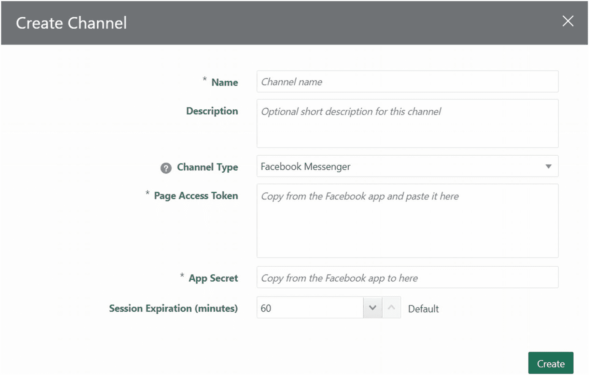

在此处，您将创建一个 `Web` 渠道。通过点击下拉菜单并从列表中选择“`Web`”来更改渠道类型。请参考 `图 6-7`。

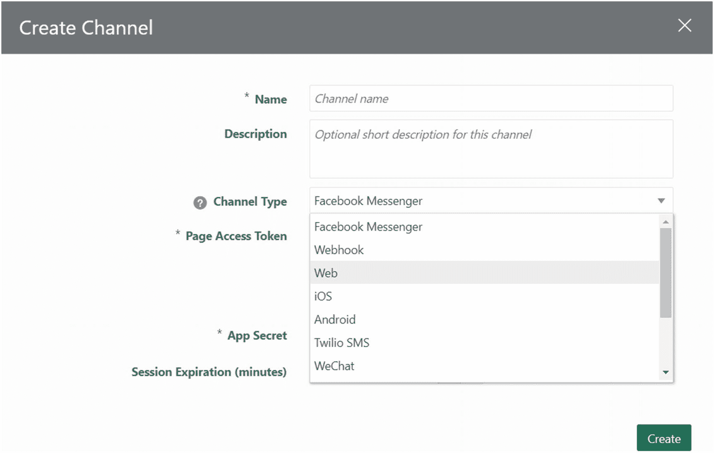

填写如 `图 6-8` 所示的必要详细信息，然后点击 `` 按钮。

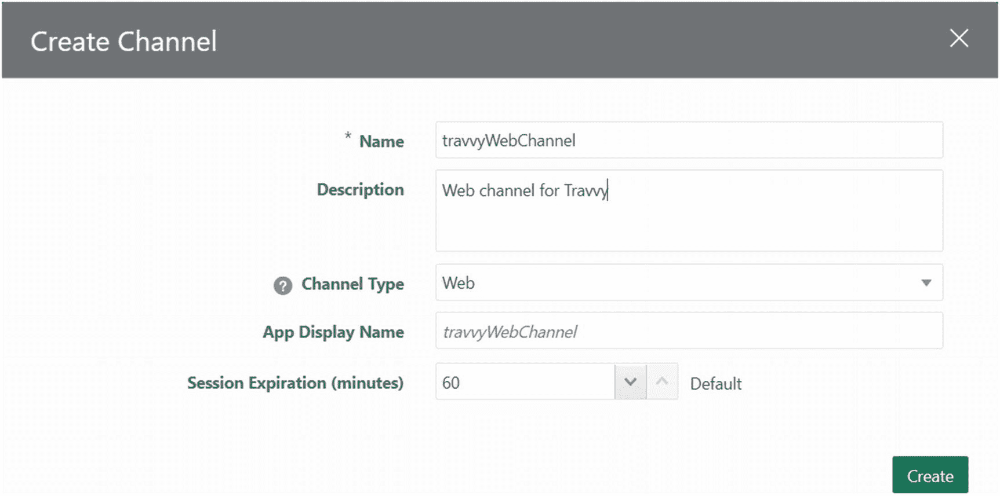

创建成功后，您应该能够在“`用户`”渠道列表中看到新创建的 `travvyWebChannel`，如 `图 6-9` 所示。

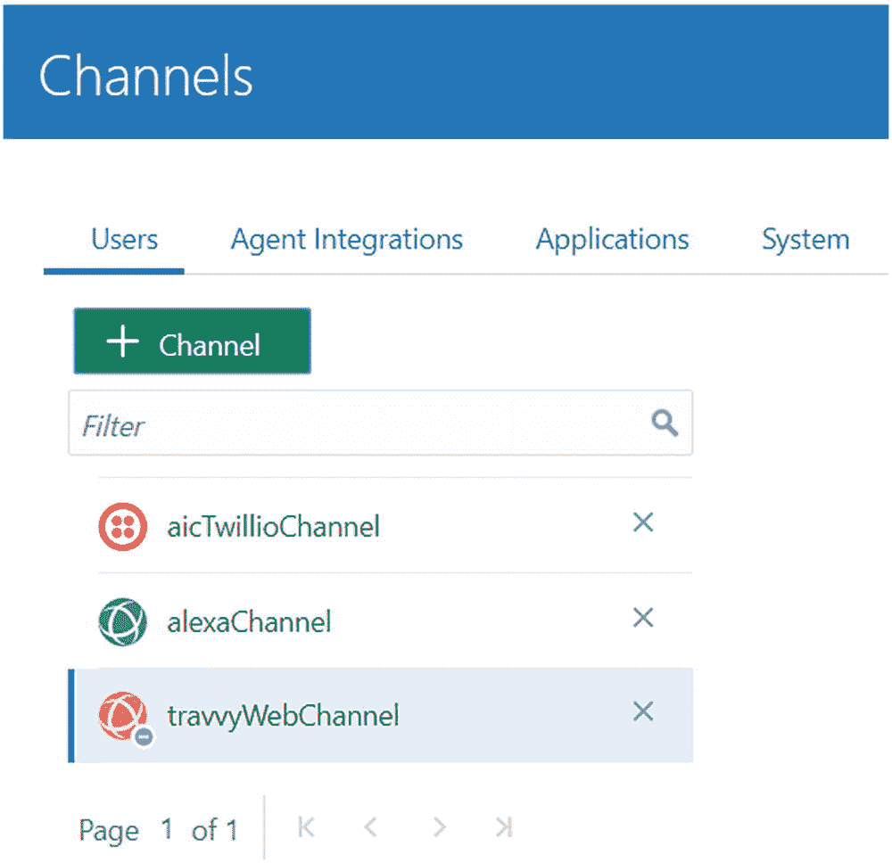

通过选择一个渠道，您将能够在此屏幕上查看其详细信息。请参考 `图 6-10`。其中包含各种关键信息，例如“`路由至`”、“`渠道已启用`”和“`应用 ID`”。您将在本章后续部分使用这些详细信息。

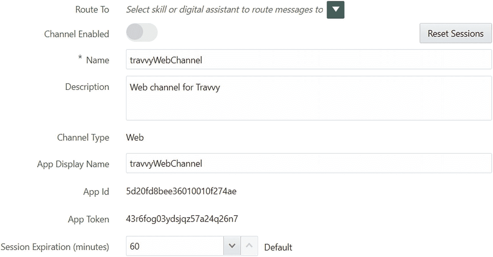

如 `图 6-10` 所示，此渠道尚未启用。要启用渠道，您需要将渠道与技能或数字助手关联。将技能或数字助手关联到渠道的过程称为“`渠道路由`”。渠道路由将在下一节中讨论。

如果您还记得本书前一章的内容，您必须始终发布技能才能将其关联到数字助手。而对于渠道，您也可以将未发布的技能关联到渠道。当您同时在渠道上开发和测试技能时，此功能非常方便。因此，它使您免于创建技能的多个版本。因此，您可以根据需要将任何已发布或未发布的技能或任何数字助手关联到渠道。

此外，您还可以将技能的预发布版本关联到渠道。这有助于您在需要时处理生产环境中的回退情况。

## 渠道路由

通过将技能或数字助手关联到渠道，您正在定义一个特定的技能或数字助手，当渠道被调用时，该渠道应将您路由到该技能或数字助手。这通常称为“`渠道路由`”。

选择您新创建的 `travvyWebChannel`。接下来，点击“`路由至`”对应的 `` 按钮。这将显示您可以关联到此渠道的所有可用技能和数字助手的完整列表。请参考 `图 6-11`。

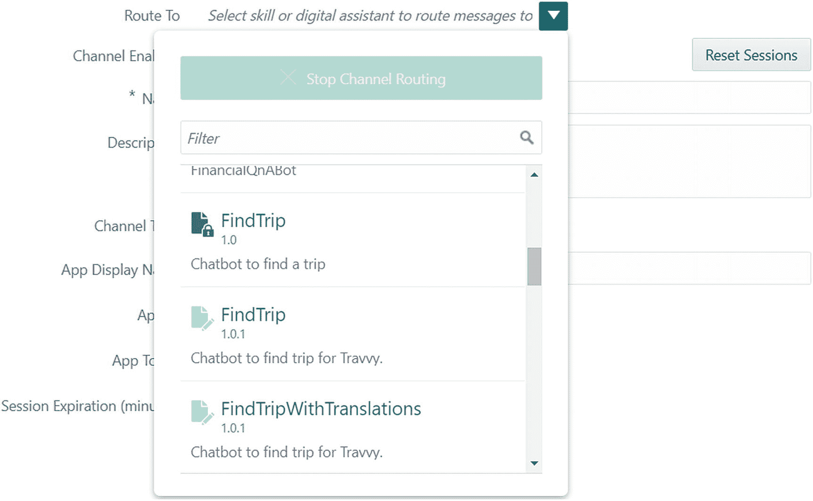

如上图所示，已发布的技能可以通过 `` 图标识别，而未发布的技能则带有 `` 图标。类似地，数字助手可以通过 `` 图标识别。

此外，列表还在名称下方提到了技能的“`一句话描述`”和数字助手的“`描述`”，这些信息是在您创建它们时填写的。

从列表中选择您想要公开的技能或数字助手。接下来，切换“`渠道已启用`”对应的按钮以启用渠道。包含所有详细信息的屏幕应如 `图 6-12` 所示。

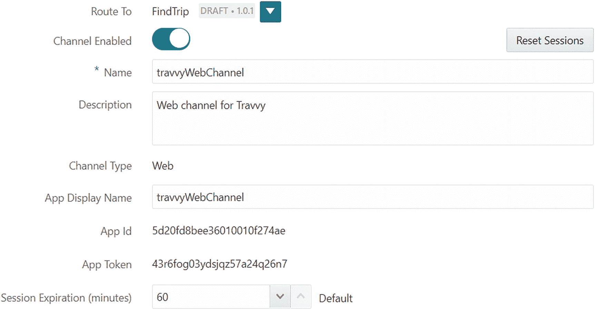

为了将您的渠道重新路由到不同的技能或数字助手，您只需点击“`路由至`”对应的 `` 按钮，然后从列表中选择不同的技能或数字助手来更改路由。

您新创建的 `Web` 渠道现在已准备好被访问。

在继续本章之前，以下两点您应始终牢记：

1.  一个渠道与一个技能或数字助手保持一对一的关系。这强调了一个事实，即在一个特定渠道上一次只能公开一个技能或数字助手。不过，您可以为特定的消息类型创建多个渠道。
2.  当您通过渠道调用数字助手时，与该数字助手关联的技能将始终使用数字助手的渠道来发送和接收消息。无论技能是否有自己独立的渠道。简而言之，如果您通过技能的渠道直接访问技能，则对话将在技能的渠道上进行。如果您通过数字助手的渠道访问一个或多个技能，则所有通信都将通过数字助手的渠道进行。

## 使用 ODA 客户端示例测试渠道

`Oracle` 为您提供了适用于 `JavaScript` 的 `ODA` 客户端示例，您可以从 [www.oracle.com/technetwork/topics/cloud/downloads/amce-downloads-4478270.html](http://www.oracle.com/technetwork/topics/cloud/downloads/amce-downloads-4478270.html) 下载。

使用这些示例，您可以通过最少的步骤快速测试您的 `Web` 渠道。这些示例附带了预配置的 `Bots` 客户端 `SDK`，您稍后将在 `Web` 应用程序中使用它来访问 `Web` 渠道。这些示例应用程序为您提供了一个测试和调试渠道的试验场。请按照以下步骤操作：

1.  使用上述链接下载 `bots-client-sdk-js-samples-<版本号>.zip` 文件。
2.  将 `zip` 文件解压到您偏好的位置。
3.  解压后，您将获得两个示例应用程序，即 `chat-sample-web` 和 `chat-sample-custom-web`。要开始使用这些示例，您需要在系统上安装 `Node.js`。如果没有安装，请从 [https://nodejs.org/en/download/](https://nodejs.org/en/download/) 下载。
4.  进入 `chat-sample-web` 目录并运行命令：

```
npm install
```

使用命令提示符/终端来安装应用程序依赖项。

5.  依赖项安装完成后，运行以下命令启动应用程序：

```
node server.js
```

默认情况下，应用程序将监听您机器的 `3000` 端口。打开浏览器并导航到 URL `http://localhost:3000/`。

您应该能够看到如 `图 6-13` 所示的网页。

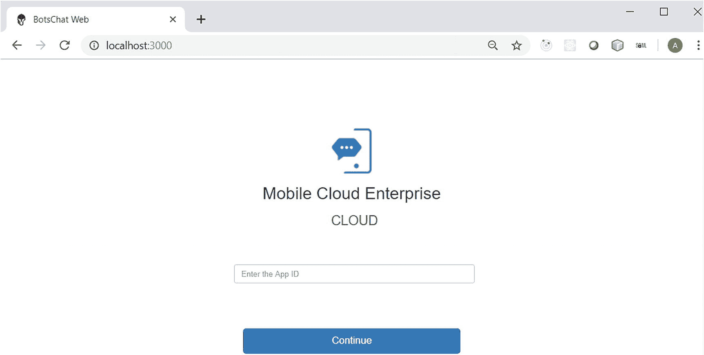

您需要输入 `Web` 渠道的应用程序 `ID`。您可以在渠道详细信息部分找到它，如 `图 6-14` 所示。

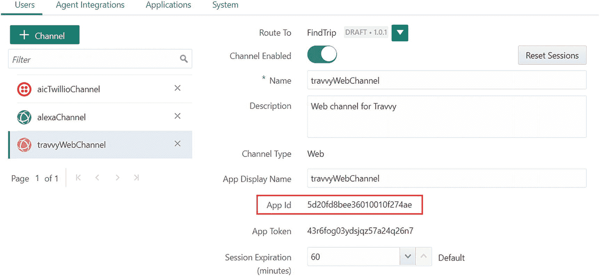

在 `chat-sample-web` 应用程序的浏览器窗口中输入应用程序 `ID`，然后按“`继续`”按钮。这将带您进入应用程序的主页。

从主页，点击“`与您的机器人聊天`”按钮。这将打开一个聊天小部件，它会根据应用程序 `ID` 调用您的 `Web` 渠道。请参考 `图 6-15`。

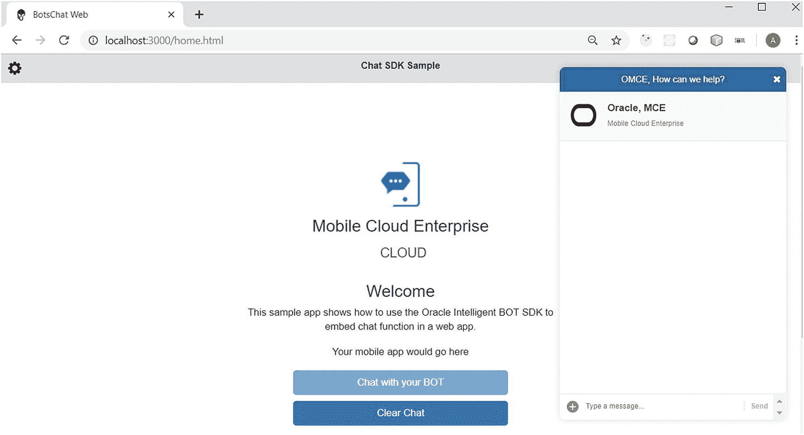

现在您应该能够通过您的 `Web` 渠道进行聊天了。请查看 `图 6-16`。

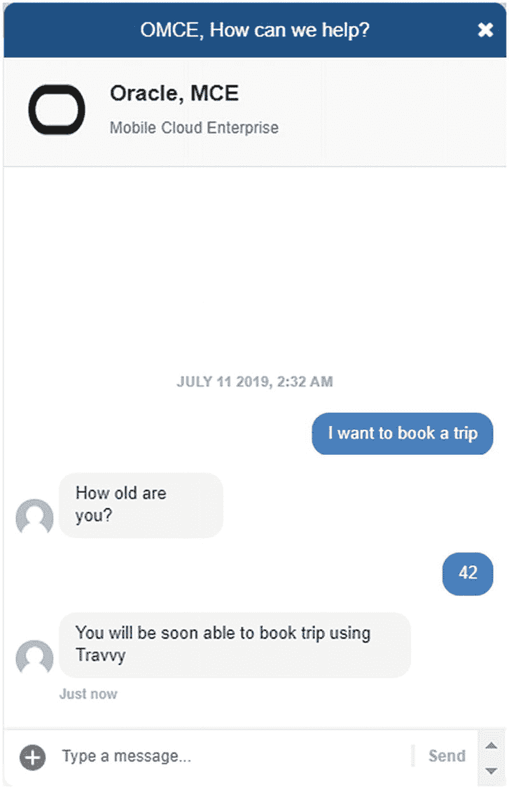

现在您已成功测试了您的应用程序，下一节将使用适用于 `JavaScript` 的 `ODA` 客户端 `SDK` 从您的 `Web` 应用程序中调用该渠道。

## 使用 ODA 客户端 SDK 从 Web UI 访问用户的 Web 渠道

以下是从 `Web` 应用程序访问您的 `Web` 渠道所需执行的步骤：

1.  配置客户端 `SDK` 并将其托管在 `Web` 服务器上。
2.  为 `Extreme Hiking` 创建一个简单的 `Web` 应用程序。
3.  在 `Web` 应用程序的 `HTML` 文件中添加 `JavaScript` 代码以调用客户端 `SDK`。
4.  部署 `Web` 应用程序并测试通过 `Web` 渠道的对话。

在本章中，我们将使用 `GlassFish` `Web` 服务器来托管客户端 `SDK` 和 `Web` 应用程序。但是，您可以自由选择任何您喜欢的 `Web` 服务器。

### 配置客户端 SDK

从 URL [www.oracle.com/technetwork/topics/cloud/downloads/amce-downloads-4478270.html](http://www.oracle.com/technetwork/topics/cloud/downloads/amce-downloads-4478270.html) 下载最新版本的适用于 `JavaScript` 的 `ODA` 客户端 `SDK`，并将其解压到您偏好的位置。文件解压后，您需要为其配置将要托管 `SDK` 的 `Web` 服务器。

首先，让我们启动 `GlassFish` 服务器并添加一个存放 `SDK` 的位置。默认情况下，`GlassFish` 服务器监听 `8080` 端口。

在本例中，我们在 `GlassFish` 服务器上的 `docroot` 文件夹内创建了一个 `odaTravvyDemo` 文件夹。在此文件夹内，您将为 `SDK` 添加一个 `static` 文件夹。为了配置 `SDK`，您需要在 `Mac` 系统上执行以下命令，如 `图 6-17` 所示。

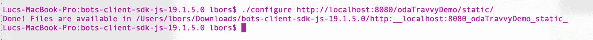

```
./configure http://localhost:8080/odaTravvyDemo/static/
```

如果您希望为不同的 `Web` 服务器配置 `SDK`，基于 `IP` 地址或任何公共互联网部署，`localhost` 和端口 `8080` 可能会发生变化。

执行上述命令后，它会生成一个文件夹，其名称包含您提供的配置路径。在本例中，文件夹名称将为 `http:__localhost:8080_odaTravvyDemo_static_`。将该文件夹重命名为 `static`，并将其复制到之前在 `GlassFish` 服务器上创建的 `odaTravvyDemo` 文件夹内。这样就完成了。

不幸的是，对于使用 Windows 机器的用户来说，情况并非如此简单。幸运的是，您有一个替代方案。导航到您解压 SDK 的 `js-sdk` 文件夹。在 `js-sdk` 文件夹中找到 `loader.json` 文件并打开它。您会注意到该文件包含：

```json
{"url":"https://placeholder.public.path/bots.1.16.1.min.js"}
```

在 `loader.json` 中，将 `https://placeholder.public.path` 替换为 `http://localhost:8080/odaTravvyDemo/static`。同样，如果您希望为不同的 Web 服务器配置 SDK，基于 IP 地址或任何公共互联网部署，`localhost` 和端口 `8080` 可能会发生变化。

使用文本编辑器，在此文件夹的其余文件中查找并替换相同的部分。为了方便您，除了 `loader.json` 之外，以下是您需要更新的文件列表：

1. `bots.1.16.1.min.js`
2. `frame.1.16.1.css`
3. `frame.1.16.1.min.js`

### 注意
上述文件的版本号可能会根据 SDK 版本而变化。

完成后，将文件夹重命名为 `static`，并将其复制到之前在 GlassFish 服务器上创建的 `odaTravvyDemo` 文件夹内。

# 为 Travvy 创建一个简单的 Web 应用程序

现在您需要创建一个 Web 应用程序，从中调用 SDK。我们使用 Oracle JET 创建了一个 Extreme Hiking Web 应用程序，但您可以选择任何您喜欢的技术。图 6-18 展示了 Extreme Hiking 网站。

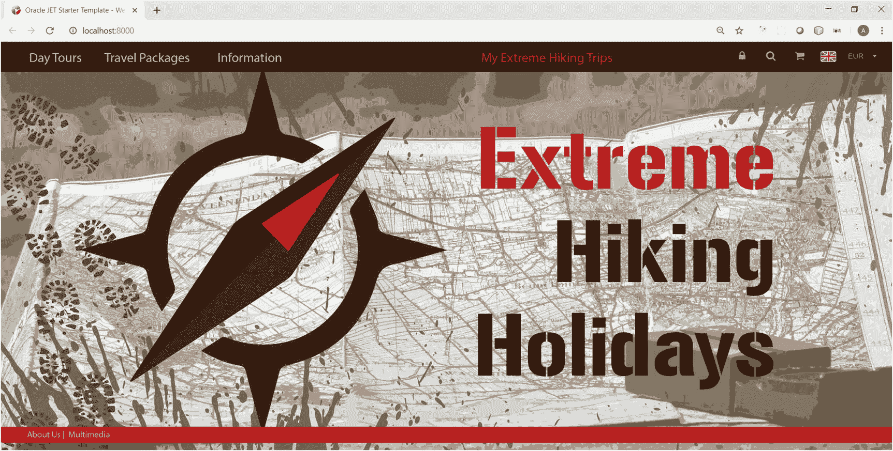

### 添加 JavaScript 代码

在代码编辑器中打开您想要添加小部件的网页。在我们的示例中，`index.html` 是我们的主页，我们将使用 Microsoft Visual Studio Code 编辑器。

在 HTML 的 `head` 部分中添加以下脚本片段。此代码负责调用您在前面的步骤中部署的 SDK。

```javascript
!function (e, t, n, r) {
function s() { try { var e; if ((e = "string" == typeof this.response ? JSON.parse(this.response) : this.response).url) { var n = t.getElementsByTagName("script")[0], r = t.createElement("script"); r.async = !0, r.src = e.url, n.parentNode.insertBefore(r, n) } } catch (e) { } } var o, p, a, i = [], c = []; e[n] = { init: function () { o = arguments; var e = { then: function (t) { return c.push({ type: "t", next: t }), e }, catch: function (t) { return c.push({ type: "c", next: t }), e } }; return e }, on: function () { i.push(arguments) }, render: function () { p = arguments }, destroy: function () { a = arguments } }, e.__onWebMessengerHostReady__ = function (t) { if (delete e.__onWebMessengerHostReady__, e[n] = t, o) for (var r = t.init.apply(t, o), s = 0; s < i.length; s++)t.on.apply(t, i[s]); if (p) for (var u = 0; u < p.length; u++)t.render.apply(t, p[u]); if (a) for (var l = 0; l < a.length; l++)t.destroy.apply(t, a[l]); t.core.addHook("before:render", function () { if (c) for (var e = 0; e < c.length; e++)c[e].type && "t" === c[e].type && c[e].next && c[e].next() }), t.core.addHook("render:error", function () { if (c) for (var e = 0; e < c.length; e++)c[e].type && "c" === c[e].type && c[e].next && c[e].next() }) } }(window, document, "Bots", void 0);
```

完成后，只需将代码中高亮的部分替换为您的静态文件夹的 URL。此 URL 必须与您用于配置 SDK 的 URL 相同。在我们的示例中，它是 `http://localhost:8080/odaTravvyDemo/static/`。

替换后，代码应如图 6-19 所示。

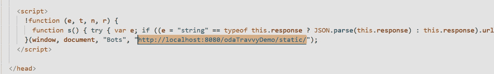

现在，您需要添加代码片段以从该页面调用小部件。在页面的 `body` 部分中，添加以下代码片段：

```javascript
Bots.init({appId: ''})
```

将代码片段中高亮的部分替换为您频道的 App ID。请参考上一节来查找您的 App ID。

### 部署 Web 应用程序并测试

完成上述更改并部署您的 Web 应用程序。在我们的示例中，我们将 Web 应用程序部署在 `web` 文件夹中。该文件夹与 `static` 文件夹位于同一层级。请参考图 6-20 查看部署层级。

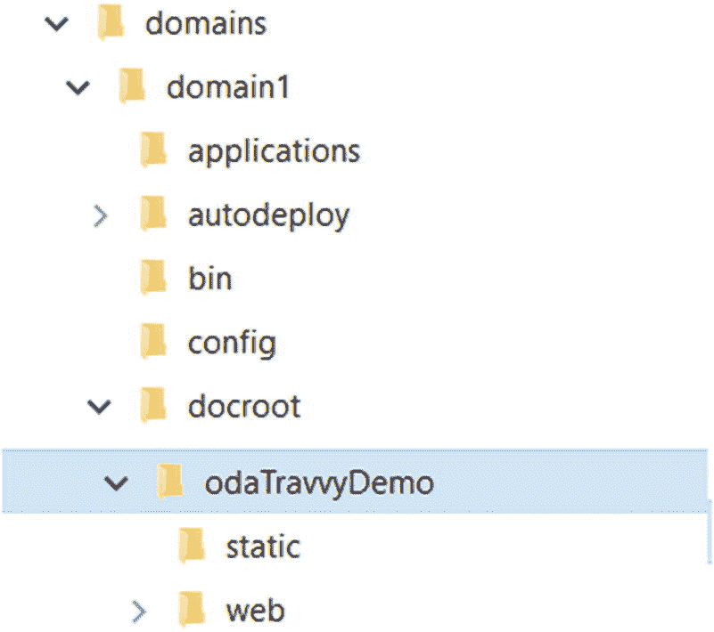

之后，从任意浏览器访问该 Web 应用程序。如果您完全按照上述步骤操作，您应该能够通过 URL `http://localhost:8080/odaTravvyDemo/web/` 访问该应用程序。图 6-21 展示了应用程序的最终外观。在右下角，您可以看到聊天小部件。

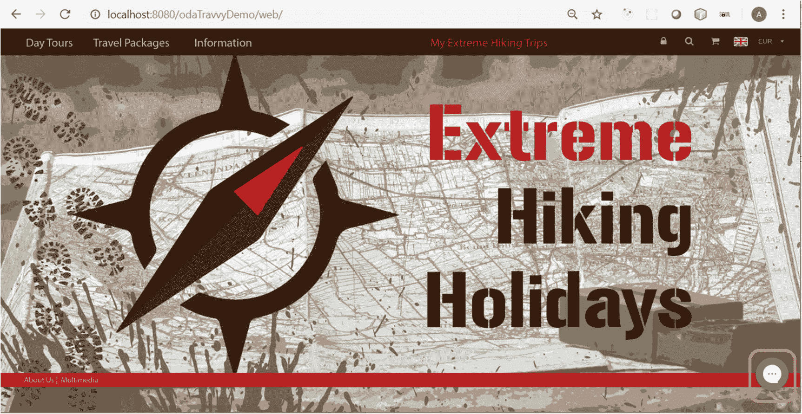

点击小部件将其打开并开始测试。图 6-22 展示了使用 Web 应用程序中的聊天小部件进行的对话。

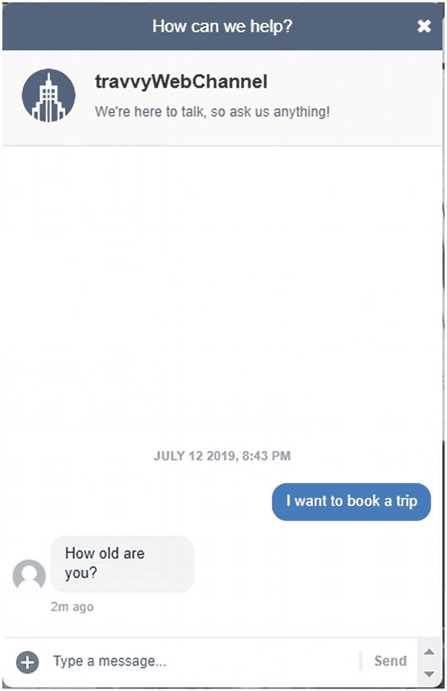

# 自定义聊天小部件

您经常需要根据业务需求自定义聊天小部件的外观。在本节中，您将学习如何快速高效地自定义聊天小部件的外观。

在“添加 JavaScript 代码”的第三部分中，您使用了 `Bots.init()` 函数。只需向其传递一些额外的属性，您就可以更改小部件的各种功能。请查看以下该函数的代码片段以实现此目的：

```javascript
Bots.init(
{
appId: '5d20fd8bee36010010f274ae', // 频道的 app id
menuItems: {  // 启用/禁用左下角选项
imageUpload: false,
shareLocation: false,
fileUpload: false,
},
browserStorage: 'sessionStorage', // 何时清除聊天历史记录
businessName: "I'm Travvy", // 粗体名称文本
customText: {
headerText: 'Book A Hiking Trip', // 顶部面板文本
inputPlaceholder: 'Start booking a trip...' //消息输入占位符
},
buttonIconUrl: './assets/Kompas kaart-02.png', // 聊天小部件按钮图标
businessIconUrl: './assets/Kompas kaart-02.png', // 小部件响应图标
backgroundImageUrl: './assets/Travvy.png', // 小部件背景图片
}
)
```

在代码编辑器中，这应如图 6-23 所示。

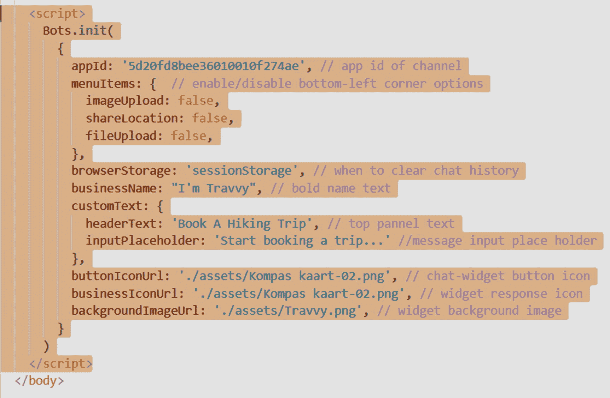

以下是另外一些默认属性，供您需要更新时参考：

1. 要更改机器人图标，请在 `frame.1.16.1.min.js` 中搜索文本 `m.default.createElement("img",{alt:name+"'s avatar",src:t}))}}])`，并将其更新为 `m.default.createElement("img",{alt:name+"'s avatar",src:'http://localhost:8080/odaTravvyDemo/Kompas.png'}))}}])`。高亮部分为图片的位置。
2. 要更新小部件的 `introductionText`，请搜索 `introductionText:"We're here to talk, so ask us anything!"`，并将其更新为 `introductionText:"Extreme Hiking Assistant!"`。

我们还建议您参考 `README.md` 文件以获取更多自定义选项。

完成所有这些更改后，您的小部件将如图 6-24 所示。

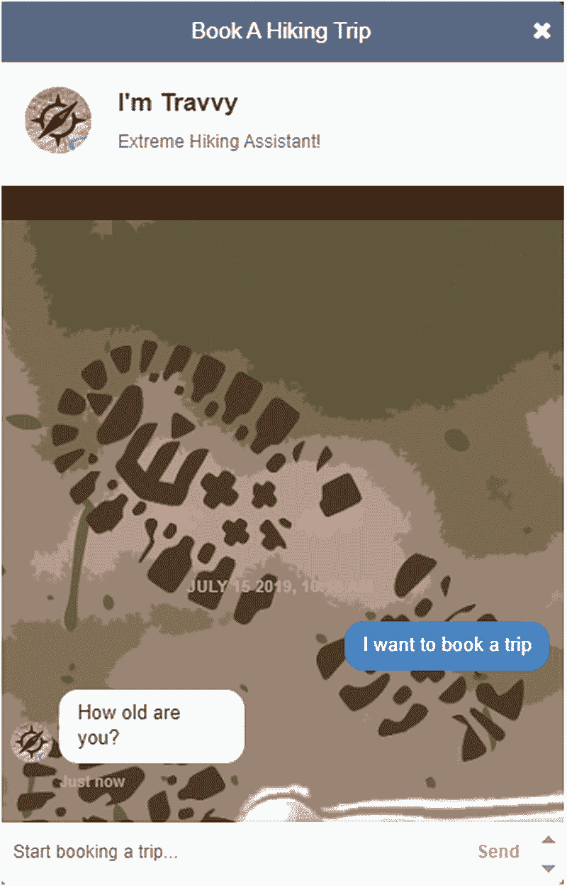

# 总结

在本章中，您了解了 Oracle 提供的用于公开您的技能和数字助手的各种类型的频道。您重点关注了用户 Web 频道，因为这是本书正在创建的示例应用程序的主要焦点。话虽如此，我们鼓励您探索本章开头部分提到的各种频道类型。有关这些频道类型的说明，请参考 Oracle 文档。同样，代理集成和 Webhook 频道将在本书的另一章中解释。在本章的后续部分中，您学习了如何通过最少的更改来显著增强聊天小部件的外观。我们希望本章为您提供了足够的信息来开始使用频道，我们下一章再见。