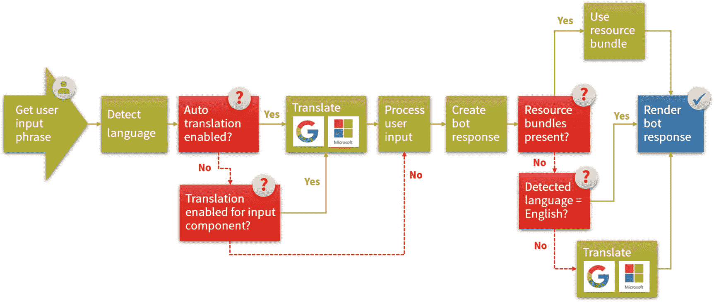
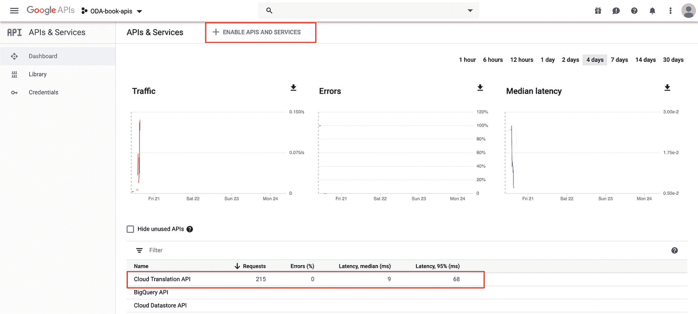
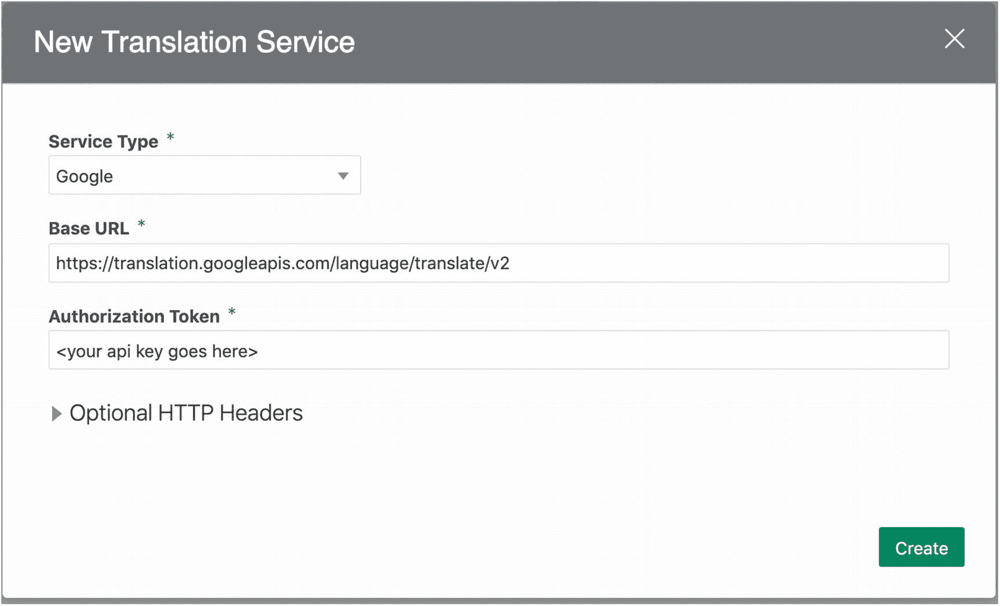
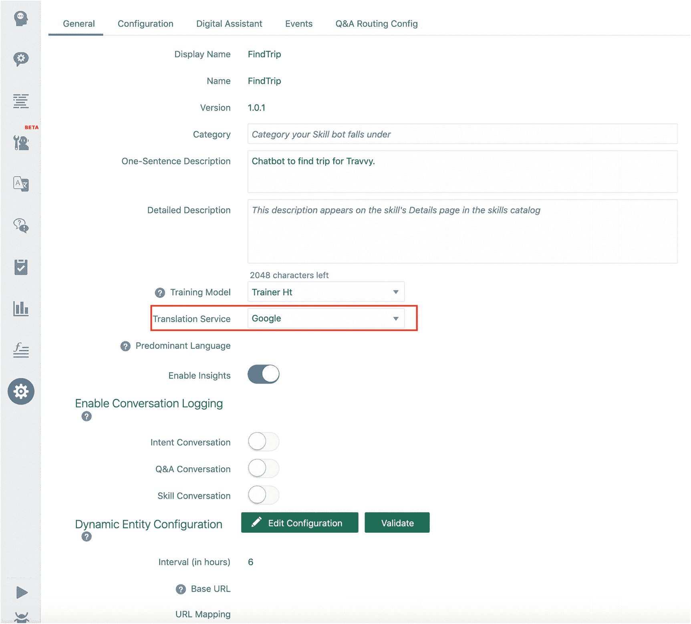
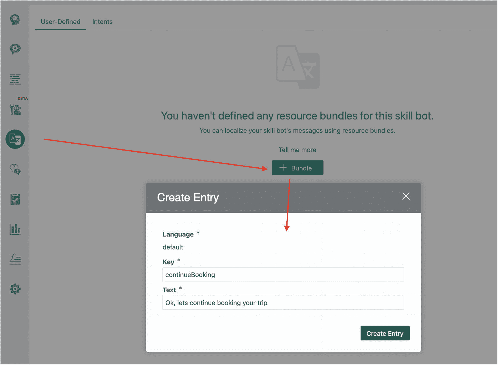
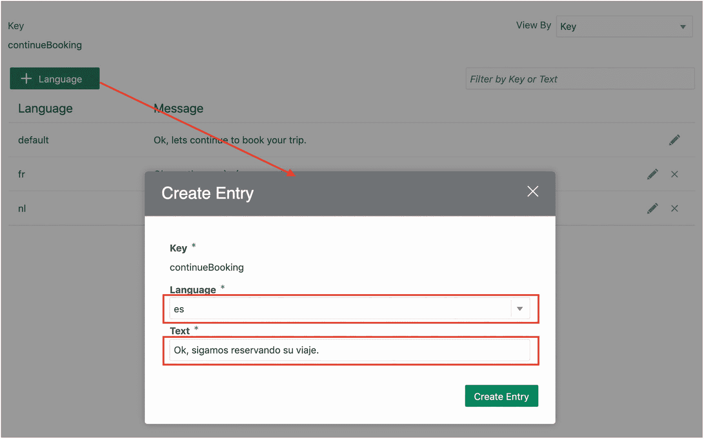
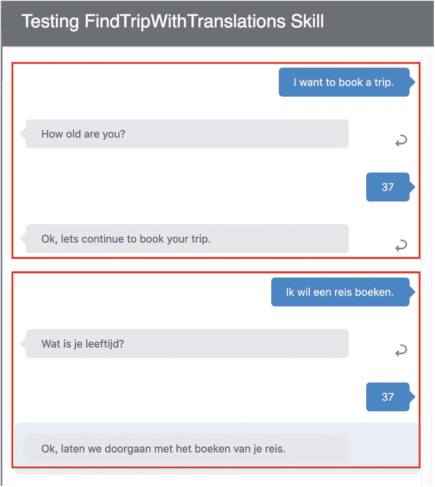
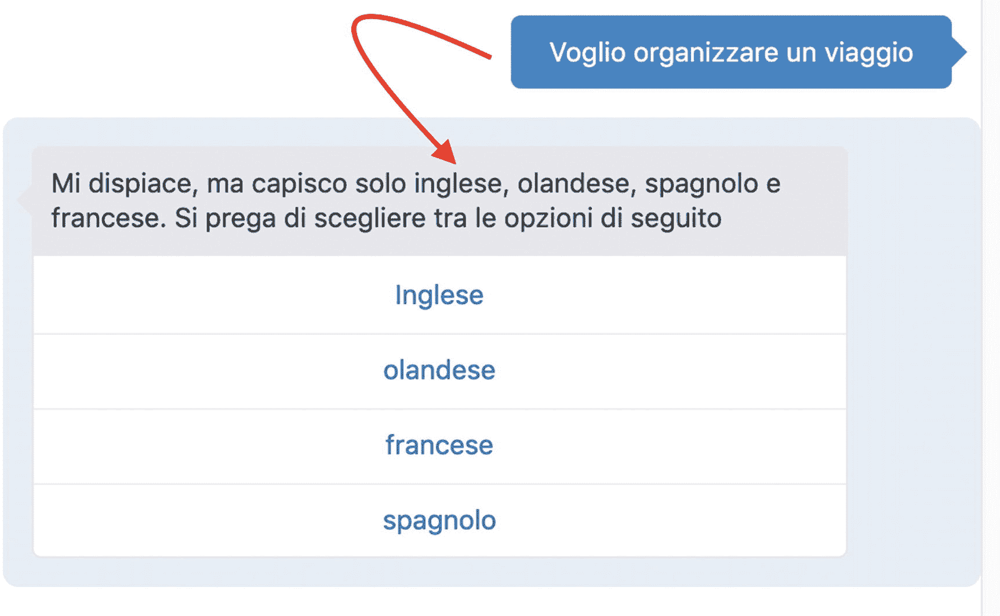

# 7. 在数字助手中支持多种语言


## 引言


或者，用英语来说：你可能没想过要用一句印地语来开启本章。

虽然本书是用英语写成的，但世界上还有更多种语言，其中许多语言只有少数世界人口在使用。当今世界上大约有 6,500 种口语。然而，其中约 2,000 种语言的母语者不足 1,000 人。使用人数最多的十种语言覆盖了全球约 50% 的人口。这意味着另外 50% 的人口使用其余 6,490 种语言中的任何一种。这些数字对任何想要提供多语言解决方案的人都构成了挑战。确定你想要支持哪些语言至关重要，因为支持所有语言几乎是不可能的。

一个简单的例子足以说明一切：

* I would like to order a pizza.
* Je voudrais commander une pizza.
* Me gustaria pedir una pizza.
* Ich mochte gerne einen Pizza bestellen.

如何构建一个数字助手，使其能够理解上述所有语言，并将它们关联到 `OrderPizza` 意图，同时还能用正确的语言回复用户？

Extreme Hiking Holidays 也面临着同样的挑战，因为他们服务来自多个国家的客户。他们的大多数客户说英语，但作为对客户的额外服务，他们还为客户提供了一个不仅会说英语，还能说其他语言的数字助手。在本章中，你将学习如何为 Oracle 数字助手添加多语言支持。

## 注意

数字助手的多语言支持目前尚不完美。对于单个技能，你可以实现多语言支持。如果你需要这种多语言支持，应考虑公开技能。在数字助手层面，目前无法检测语言或使用资源包。当前的解决方案是创建所谓的“主导语言”机器人。这些机器人不是多语言的，而是单一外语机器人。

为 Oracle 数字助手启用真正的多语言使用已在路线图中。

## 翻译是如何工作的？

Oracle 数字助手的自然语言处理（NLP）基于英语。但这并不意味着你不能添加对其他语言的支持。这种支持依赖于两个组件。

首先是使用外部翻译服务。这将获取用户输入的任何话语，并将其与英语进行互译。其次是使用包含特定语言文本的资源包。这些资源包将用于向用户发送翻译后的机器人响应。在本章后面，我们将解释这些组件如何工作以及如何组合使用。首先，你将了解语言翻译的典型流程，如图 7-1 所示。



图 7-1

翻译流程

基于用户输入，数字助手将尝试检测语言。一旦检测到语言，它将进入流程的下一步。在该步骤中，如果需要，用户的输入话语将由翻译服务翻译成英语。这种翻译需求由 `autoTranslate` 属性决定。自动翻译默认是禁用的，但随时可以启用或禁用。需要定义 `autoTranslate` 上下文变量，并且每当此变量的值设置为 `true` 时，自动翻译即被启用。启用后，所有用户消息都会被翻译成英语，所有机器人消息都会被翻译成用户语言。

```
variables:
autoTranslate: "boolean"
states:
enableAutotranslation:
component: "System.SetVariable"
properties:
variable: "autoTranslate"
value: true
transitions: {}
```

如果 `autoTranslate` 为 `false`，单个组件可能仍然需要翻译。这是因为组件上的 `translation` 属性可以覆盖全局的 `autoTranslate` 设置。

因此，如果组件上的 `translation` 属性设置为 `true`，即使 `autoTranslate` 设置为 `false`，数字助手也会调用已配置的翻译服务。

```
:
component: "System.Text"
properties:
translate: true
```

在调用翻译服务之后，或者当不需要翻译时，数字助手将继续处理用户的输入，然后生成机器人的响应。

数字助手需要确定如何将响应发送给最终用户。有三种选择：

1.  可以从资源包中获取。
2.  可以通过翻译服务进行翻译。
3.  可以“原样”发送。

具体方式取决于情况。默认情况下，使用组件上定义的输出字符串。如果定义的输出字符串是对资源包的引用，则使用资源包字符串。如果语言设置不是英语，则会查找并使用该语言的资源包条目。如果该条目不可用，则回退到默认语言（英语）的资源包字符串。如果为某个组件启用了翻译（可以通过 `autoTranslate` 或 `translate` 属性实现），则组件输出文本会首先发送到翻译服务进行翻译。即使该字符串是从资源包中获取的，也是如此。

## 注意

Oracle 数字助手内部使用的语言是英语。如果用户的语言是英语，则无需翻译机器人的回复，因为两者都是英语。在这种情况下，你需要使用 Apache FreeMarker 表达式将组件上的 `translate` 属性设置为 `false`，或将 `autoTranslate` 属性设置为 `false`。否则，Oracle 数字助手会尝试将其翻译成英语。

如果用户的语言不是英语，数字助手将调用翻译服务，并将翻译后的答案传达给用户。但是，如果你在引用资源包的组件上将 `translate` 属性设置为 `false`，则会使用资源包字符串。

## 注意

如果你以 `System.TranslateInput` 开始你的流程，数字助手将始终将用户的输入翻译成英语。如果你需要这种翻译，这会非常有用。

```
translateInput:
component: "System.TranslateInput"
properties:
variable: "translatedString"
transitions:
next: "Intent"
```

### 提示

你甚至可以从变量中读取原始字符串，这样你就可以保留原始字符串和翻译后字符串的副本。

### 翻译服务的陷阱

翻译服务在创建多语言数字助手时非常有用。然而，它们并非万无一失。有几种情况下，翻译服务难以正确检测语言或提供准确的翻译。让我们看一些例子。

首先是语言相近的情况。在欧洲，有几种语言非常接近。对于翻译服务来说，区分挪威语和瑞典语、瑞典语和丹麦语会很困难。在这种情况下，作为开发人员，你应该做好准备，在继续之前要求用户确认检测到的语言。其次是问候语或从其他语言“借用”的词语。Hi、Hey、Hoi、Hello、Hallo、Bonjour、Ciao，这些问候语在许多不同的语言中都有使用。没有任何翻译服务能够区分一个意大利人说的“Ciao”和一个荷兰人说的“Ciao”。它总是会得出意大利语的结论，从而使荷兰人感到困惑。对此你无能为力。


## 为 Travvy 添加多语言支持

Extreme Hiking Holidays 的客户遍布 50 多个国家，但他们没有能覆盖这 50 种语言的员工。此外，他们也没有资源来创建和管理 50 种不同语言的机器人。这时，翻译服务就派上了用场。

使用翻译服务需要配置一个外部翻译服务。Oracle Digital Assistant 支持使用 Google Translation API 和 Microsoft 翻译服务。

## 注意

在本书中，我们将使用 Google Translation API。

Google Translation API 是一项付费 API。费用因 API 使用量而异，可能有所不同。在使用 API 之前，您必须设置一个 Google 帐户并启用 Translation API。可以在您的 Google 帐户的开发者控制台（图 7-2）中启用该 API：[`https://console.developers.google.com/apis/dashboard`](https://console.developers.google.com/apis/dashboard)。



图 7-2

Google 开发者控制台仪表板

激活翻译服务后，必须将此翻译服务添加到 Digital Assistant 中才能使用。您可以在 Digital Assistant 级别的“设置菜单”中打开“添加翻译服务”（图 7-3）。



图 7-3

添加翻译服务

您只需从下拉列表中选择服务类型，添加翻译服务的基本 URL，最后输入授权令牌。单击“创建”后，配置将被保存，翻译服务即可使用。

添加翻译服务后，您需要配置其使用方式。翻译服务的使用可以在技能级别进行配置。在技能的常规设置中，您需要从包含此云实例所有可用翻译服务的下拉列表（图 7-4）中选择要使用的翻译服务。



图 7-4

设置翻译服务

选择后，所有需要的翻译都将由此翻译服务提供。

## 使用翻译服务

在 Digital Assistant 中进行翻译有两种选项：选择加入和选择退出。本节将对两者进行说明。

### 选择退出

要使 Digital Assistant 默认启用翻译（也称为选择退出翻译），在添加翻译服务后需要执行一些步骤。首先，您需要添加 `autoTranslate` 上下文变量。接下来，需要一个 `System.SetVariable` 组件，将 `autoTranslate` 设置为 `true`。最后，作为下一个状态，您需要添加 `System.DetectLanguage` 组件，该组件会调用翻译服务来确定用户的语言。所有这些将生成以下代码片段：

```
metadata:
platformVersion: "1.0"
main: true
name: FindTripWithTranslations
context:
variables:
iResult: "nlpresult"
autoTranslate: "boolean"
states:
enableAutoTranslation :
component: "System.SetVariable"
properties:
variable: "autoTranslate"
value: true
transitions:
next: "detectLanguage"
detectLanguage:
component: "System.DetectLanguage"
properties:
source:
transitions:
next: ............
............
............
............
```

### 选择加入

翻译的另一个选项是选择加入选项。仅针对您希望翻译的那些组件，您需要专门将 `translate` 属性设置为 `true`。

为了实现这一点，您必须确保将 `autoTranslate` 上下文变量设置为 `false`。接下来，对于所有需要翻译的单个组件，将 `translate` 属性设置为 `true`。最后，确保 `System.Intent` 组件也将 `translate` 属性设置为 `true`。这是因为 Oracle Digital Assistant 的内部语言是英语。

```
intent:
component: "System.Intent"
properties:
variable: "iResult"
translate: true
```

### 提示

如果您依赖翻译服务来提供答案，Translation API 会将机器人的英语答案翻译成用户的语言。您对翻译几乎没有控制权，因此无法 100% 确保答案始终一致。为了完全控制 Digital Assistant 的回复内容，您应该使用资源包来存储依赖于语言的答案。

## 使用资源包

如前一条提示所述，最佳实践是依赖资源包来处理机器人的所有回复。这可以根据需要支持任意数量的语言和方言。要实现这一点，您必须创建资源包和资源包条目。如果您尚未添加任何资源包，Oracle Digital Assistant 会为您创建一个，然后您可以输入第一个条目（图 7-5）。



图 7-5

创建第一个资源包条目

## 注意

当您创建新的资源包条目时，它总是会被添加到默认语言（即英语）中。

现在，您可以开始添加翻译，或者换句话说，为其他语言添加资源包。对于每个键，您可以通过点击“+ 语言”按钮来添加翻译。这将弹出一个弹出窗口，您可以在其中为所选键输入特定于语言的文本（图 7-6）。



图 7-6

向资源包添加其他语言

请确保对于每一个键，您都有 Digital Assistant 支持的所有语言的翻译。为了帮助您完成此操作，Oracle Digital Assistant 在右上角提供了一个“查看方式”下拉列表（图 7-6）。首先，您可以将其切换为“语言”。然后选择要为其创建资源字符串的语言，并开始构建字符串，直到看不到更多键为止。当所有键都有对应的字符串时，将不再显示更多键。

## 从资源包回复

输入所有翻译后，现在该让 Digital Assistant 基于这些翻译来回复用户了。这实际上非常简单。单语言的 Digital Assistant 可以使用硬编码文本，如下面的代码示例所示：

```
bookTrip:
component: "System.Output"
properties:
text: "Ok, lets continue to book your trip."
transitions:
return: "done"
```

为了在技能中支持多语言，您应该添加对资源包的引用，以便它可以基于此资源包进行回复。前面的代码示例需要更改为：

```
bookTrip:
component: "System.Output"
properties:
text: "${rb.continueBooking}"
transitions:
return: "done"
```

其中 `rb.continueBooking` 引用对话语言中一个键值为“continueBooking”的资源包条目。Digital Assistant 将查找该条目并回复该键对应的确切值。

请注意，前缀 `rb` 需要在流程的 `context/variables` 部分中定义。

```
context:
variables:
iResult: "nlpresult"
rb: "resourcebundle"
autoTranslate: "boolean"
```


## 注意

你可以利用资源包中的参数，让回复更具动态性。以下示例展示了如何为酒店房间添加动态定价。机器人会从资源包中提取文本进行回复，该文本会根据自定义组件中服务调用的结果动态调整价格。

资源包的键和值：

- 键：`Pricing`
- 值：`Currently the price for this hotel is {0} per night.`

oBOTML 代码：

```
component: "System.Output"
properties:
text: ${rb(pricing, '${pricingService.value}')}"
transitions:
return: "done"
```

### 从用户话语中确定语言

在上一节中，你学习了如何在对话中使用用户配置文件中的语言，并将所有内容在该语言与目标语言之间进行翻译。还有另一种选择，即使用翻译服务来确定用户的语言。为了实现这一点，我们需要使用 `System.DetectLanguage`。该组件利用翻译服务检测用户语言，并自动设置一个名为 `profile.languageTag` 的变量，其值为区域设置字符串。

## 注意

`profile.languageTag` 的优先级高于 `profile.locale` 变量。

```
metadata:
platformVersion: "1.0"
main: true
name: FindTripWithTranslations
context:
variables:
iResult: "nlpresult"
rb: "resourcebundle"
autoTranslate: "boolean"
states:
enableAutoTranslation:
component: "System.SetVariable"
properties:
variable: "autoTranslate"
value: false
transitions:
next: " detectLanguage"
detectLanguage:
component: "System.DetectLanguage"
properties:
source:
transitions:
next: "intent"
intent:
component: "System.Intent"
properties:
variable: "iResult"
transitions:
actions:
SelectTrip: "askAge"
CancelTrip: "cancelTrip"
unresolvedIntent: "unresolved"
```

如果你输入的数字助理支持的任何语言的话语，它都会解析意图，并用相同的语言回复用户。如图 7-7 所示，数字助理识别出用户的话语是英语，于是用英语回复用户。接着，用户的话语变成了荷兰语，数字助理清晰地理解后，切换到新语言并用荷兰语回复。



图 7-7：数字助理用用户的语言回复

始终存在一种可能性，即你的数字助理不支持用户的语言。

## 注意

限制在于翻译服务所支持的语言范围。良好的设计实践是，机器人设计者只支持那些对其业务有意义且团队内部具备语言能力的语言。

有几种方式可以向用户传达这一信息。一种非常友好且用户友好的方式是，用用户自己的语言告知他们其语言不受支持。此消息可以附带一份支持的语言列表。用户可以选择其中一种支持的语言，然后你可以将所选语言存储在 `profile.languageTag` 中。

为了实现这一点，需要在流程中的 `detectLanguage` 状态和 `intent` 状态之间添加一段额外的逻辑。

下一个代码示例展示了如何实现此功能：

```
detectLanguage:
component: "System.DetectLanguage"
properties:
source:
transitions:
next: "checkUserDetectedLanguage"
checkUserDetectedLanguage:
component: "System.Switch"
properties:
source: "${['nl','fr','en']?seq_contains(profile.languageTag)?string('yes','no')}"
values:
- "yes"
- "no"
transitions:
actions:
yes: "Intent"
no: "selectLanguageFromList"
NONE: "selectLanguageFromList"
selectLanguageFromList:
component: "System.CommonResponse"
properties:
processUserMessage: true
keepTurn: false
translate: true
metadata:
responseItems:
- type: "text"
text: "${rb.globalLanguagePrompt}"
actions:
- label: "${rb.globalLanguageEnglish}"
type: "postback"
payload:
variables:
profile.languageTag: "en"
- label: "${rb.globalLanguageDutch}"
type: "postback"
payload:
variables:
profile.languageTag: "nl"
- label: "${rb.globalLanguageFrench}"
type: "postback"
payload:
variables:
profile.languageTag: "fr"
transitions:
next: "Intent"
```

有了这个设置，每当 Travvy 不支持用户的语言时，它就会用该语言回复用户，告知 Travvy 仅支持英语、法语、荷兰语和西班牙语。图 7-8 展示了在意大利语环境下的效果。



图 7-8：用用户自己的语言回复用户

## 注意

虽然你可以使用语言检测功能，但必须意识到这会对性能产生影响。开启语言检测后，对于每一次用户话语，翻译服务都会被调用来检测语言，从而增加了对话中对外部服务的调用次数。

### 使用用户配置文件中的语言

如上一节所述，使用翻译服务进行语言检测可能会对性能产生轻微的负面影响。另一种方法是通过省略语言检测来消除这种影响。这种方法使用用户配置文件中的语言。因此，不再由翻译服务自动设置 `profile.languageTag`，而是像以下代码示例那样显式设置它：

```
metadata:
platformVersion: "1.0"
main: true
name: FindTripWithTranslations
context:
variables:
iResult: "nlpresult"
rb: "resourcebundle"
autoTranslate: "boolean"
states:
enableAutoTranslation:
component: "System.SetVariable"
properties:
variable: "autoTranslate"
value: false
transitions:
next: "setBrowserBasedProfileLanguage"
#Set profile.languageTag based on user's browser language
setBrowserBasedProfileLanguage:
component: "System.SetVariable"
properties:
variable: "profile.languageTag"
value: "${profile.locale}"
transitions:
next: "Intent"
```

为了实现这一点，你需要获取用户的区域设置。一种方法是读取 `profile.locale` 变量，该变量由消息客户端设置。

另一种方法是在消息客户端上显式设置它。以下代码示例展示了如何在从网页调用数字助理时，使用 Oracle 数字助理 JavaScript SDK（参见第 6 章）通过 JavaScript 实现这一点：

```
Bots.updateUser(
{
"properties": {
"userLocale": userLocale}
}
);
```

## 总结

世界上有许多种语言。为了让数字助理取得成功，它们应该能够使用除英语以外的其他语言。幸运的是，Oracle 数字助理可以实现多语言支持这一需求。在本章中，你学习了如何基于翻译服务和资源包来实现这一点。翻译服务并不能 100% 保证覆盖所有用例，也无法涵盖所有话语。你需要通过提供让用户选择或确认其偏好语言的功能，来帮助用户和翻译服务。


