# 8. 使用 Webview 组件

聊天机器人是一种以对话方式检索信息并提供给最终用户的方法。最终用户向机器人输入查询，机器人则回复相应的答案。聊天机器人在当今世界如此流行的核心原因之一是，它们能够以极少的用户输入，以更快的速度提供响应。

随着聊天机器人的日益普及，各类组织不仅使用聊天机器人来提供其产品/服务信息，还将其用于关键业务流程，例如下单、预订、提供反馈等。通常，聊天机器人中的此类流程需要最终用户提供多项信息才能完成特定交易或任务。从最终用户的角度来看，这种与机器人进行的长链交互可能会变得有些乏味。因此，用户可能更愿意选择其他途径来满足其需求，例如致电客服或返回组织的网站。

Oracle 意识到了这一点，并为数字助手提出了 Webview 组件的概念。使用 Webview 组件，参数可以从技能传递到 Web 表单，也可以从 Web 表单传回技能。在本章中，您将熟悉 Webview 组件及其用途。

## 什么是 Webview 组件？

尽管聊天机器人是为信息收集和共享的对话方式而设计的，但这并非总是理想之选。处理此类情况的另一种方法可以是向最终用户提供一个 Web 表单，让他们一次性填写以完成特定任务。您可以设计机器人流程，使其仅在需要结构化数据输入的场景下向最终用户提供此类表单，例如，在下单时提供包含必要地址字段的 Web 表单，或提供包含完成假期预订所必需字段的表单，或提供包含开设银行账户所需必填信息的表单等。

顾名思义，`System.Webview` 组件允许您将网页集成到数字助手中，以便从最终用户那里收集结构化数据。尽管 Webview 组件与数字助手集成，但它们会在单独的浏览器标签页/窗口中打开（对于基于 Web 的聊天客户端），或者在移动设备上于聊天客户端之外的 Webview 中打开。因此，您能够在网页中利用各种功能，如表单视图、选择选项、日期选择器、自定义样式等。但这还不是全部。除了这些功能之外，您还可以轻松地在网页上添加各种输入验证，例如必填字段、电子邮件格式、日期范围等。此验证逻辑保留在网页上，您无需将其添加到数字助手中。

您已经知道，在 Oracle 数字助手的上下文中，组件大致分为两类：内置组件和自定义组件。Webview 组件（`System.Webview`）属于内置组件类别，这意味着它们由 Oracle 直接提供。

在对话流程中使用 Webview 组件，您可以将最终用户引导至一个 Web 应用程序，他们可以在其中提供必要的输入以完成交易。由于 Webview 组件由 Oracle 直接提供，您只需在“流程” 屏幕上点击  按钮，然后从**用户界面**组件中选择它，即可轻松将其添加到您的流程中。

请参考图 8-1。

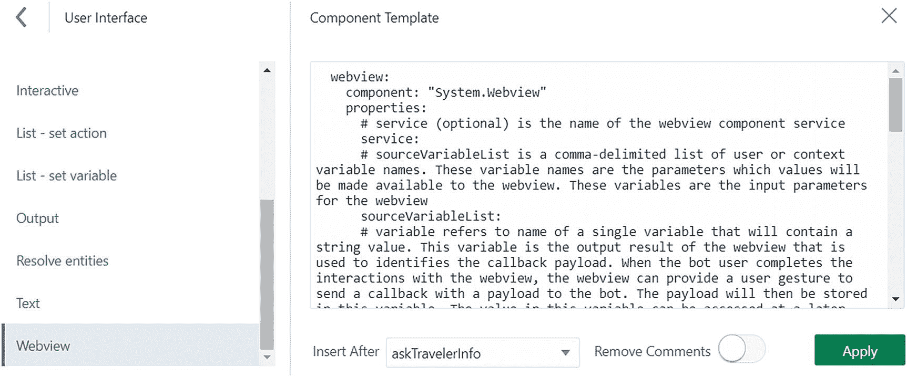

图 8-1

Webview 组件

在我们进一步讨论 Webview 组件之前，先来看看它的优缺点。

**优点：**

*   使用 Web 应用程序收集用户信息，而非进行冗长的机器人对话。
*   Web 应用程序的屏幕尺寸不受聊天客户端窗口限制。
*   Web 应用程序可以按需自定义皮肤。
*   也可以使用预先构建的 Web 应用程序（网页应可通过 GET 请求访问）。
*   利用各种浏览器功能，例如上传和下载。
*   用户输入的数据保持安全，因为它不会出现在聊天会话中。

**缺点：**

*   由于 Webview 在单独的浏览器窗口中打开应用程序，该应用程序看起来与聊天机器人不集成。因此，如果在启动应用程序前未在聊天中适当预先告知用户，用户可能会感到困惑。

## Webview 组件架构

要实现 Webview 组件，您可以遵循两种不同的方法：

*   在 Oracle 数字助手内部托管的 Webview 应用程序
*   在外部（Oracle 数字助手之外）托管的 Webview 应用程序

与自定义组件类似，Oracle 数字助手提供了一个内置容器来托管单页 Web 应用程序。如果您希望在此内置容器中本地部署 Web 应用程序，那么 Webview 应用程序将托管在技能内部。如果您希望使用现有的 Web 应用程序，或将新创建的 Web 应用程序部署在数字助手之外的远程环境中，那么这将是一个外部托管的 Webview 应用程序。在这两种情况下，应用程序都会在单独的浏览器标签页中启动（对于基于 Web 的聊天客户端），或者在移动设备上于 Webview 中启动。让我们深入了解这两种方法。

### 在数字助手内部托管的 Webview 应用程序

在您的 Oracle 数字助手中本地部署的应用程序应为单页应用程序（SPA）。如果您不熟悉，SPA 渲染单个页面，并且应用程序只有一个入口点，但页面内容可以在运行时动态更改/更新。您可以使用任何 JavaScript 框架为 `System.Webview` 组件开发此类应用程序，例如 React、Oracle Jet、Oracle VBCS 等。然后，您将应用程序打包成 TAR 归档文件（扩展名为 `.tgz`），并将其部署到本地容器中以创建 Webview 服务。

## 注意

您的 SPA 的入口点必须是一个 `index.html` 文件，放置在应用程序的根级别，因此也是您的部署归档文件的根级别。

当您在对话流程中使用 `System.Webview` 组件时，它会：

1.  调用您 SPA 的 `index.html` 并在新的浏览器标签页中启动应用程序。
2.  `System.Webview` 组件随后将输入参数从您的对话流程传递到您的 SPA，并附带一个回调 URL。该回调 URL 由 `System.Webview` 组件生成并作为 `window.webViewParameters` 参数附加到 Webview 请求中。
3.  您的 SPA 在处理完成后向回调 URL 发起 POST 请求。可以从应用程序中的 `webview.onDone` 参数访问回调 URL。如果您需要将任何数据从应用程序传回技能中的 Webview 组件，则该数据作为 **JSON 对象**传递，该对象存储在从 `System.Webview` 变量属性引用的对话流程变量中。您可以在对话流程中轻松访问此数据，如 `${variable_name.value.Param}`。

此流程的图示可在图 8-2 中找到。

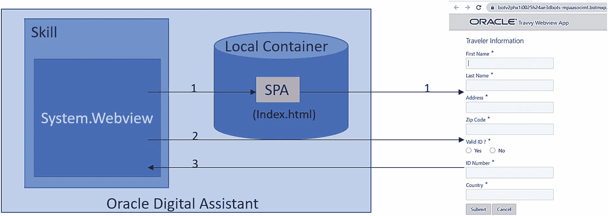

图 8-2

Web 应用程序的本地部署

上述流程将在本章后面的“在数字助手内部托管的 Webview 应用程序”一节中详细说明。


## 注意

如果您希望使用 Oracle VBCS 创建 SPA，它将存在一些限制。由于 VBCS 的后端负责业务对象、对业务对象的 REST 调用以及业务对象的用户访问（使用 Oracle Identity Cloud Service，IDCS），这些功能在您导出应用程序时将不可用。如果您希望使用 Oracle VBCS 来构建 SPA，则必须在外部部署应用并显式处理这些功能。

### 外部托管的 Webview 应用程序

如果您已有想要用作 Webview 的现有应用程序，则需要采用此方法。当您的应用程序有安全要求或需要使用服务器端基础设施等情况时，这属于典型场景。与本地部署的应用程序不同，您的外部应用程序可能是也可能不是 SPA。唯一的要求是，您希望使用的应用程序应能通过来自技能的 GET 请求进行访问。在外部托管 Web 应用程序的情况下，您需要使用一个中介服务，该服务将负责为技能组合应用程序调用 URL。然后，技能使用 GET 方法调用 Web 应用程序。您可以根据需求，将中介服务和 Web 应用程序托管在同一服务器或不同服务器上。

流程如下所述：

1.  技能中的 `System.Webview` 组件向中介服务发送一个 POST 请求，请求中包含输入参数和有效载荷中的回调 URL。
2.  中介服务向技能返回一个 JSON 对象，该对象仅包含一个属性 `webview.url`，其中包含 Web 应用程序 URL 以及指向技能的回调 URL。如果需要向 Web 应用程序传递任何参数，这些参数将附加到 `webview.url` 属性中。技能中的 `System.Webview` 组件随后使用此属性向 Web 应用程序发起所有后续的 GET 请求。
3.  技能发送一个 GET 请求以启动应用程序。
4.  Web 应用程序处理该请求，并向回调 URL 发起一个 POST 调用，指示应用程序已完成处理。同样，如果您需要从 Web 应用程序向技能中的 Webview 组件传回任何数据，则该数据将作为 JSON 对象传递，并存储在从 `System.Webview` 变量属性引用的对话流变量中。然后，您可以在对话流中通过 `${variable_name.value.param_name}` 访问此数据。

图 8-3 展示了上述流程的图示，其中中介服务和 Web 应用程序托管在同一 Web 服务器上。

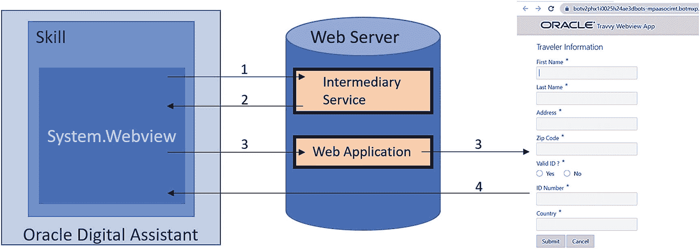

图 8-3：外部托管的 Web 应用程序

图 8-4 展示了中介服务和 Web 应用程序位于不同服务器时的流程。

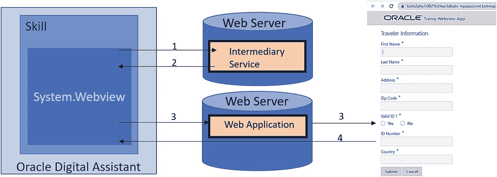

图 8-4：服务与应用程序位于不同服务器的外部托管 Web 应用程序

## 前提条件

现在您已经熟悉了实现 Webview 组件的两种方法，让我们来看看这两种方法的具体实现。在这两种情况下，我们都将使用 Oracle JET 作为 JavaScript 框架来构建我们的 Web 应用程序。如前所述，您并非必须使用 Oracle JET，也可以使用您偏好的任何其他框架。在接下来的章节中，我们不会解释如何使用 Oracle JET 设计应用程序，而是主要关注实现部分。如果您想了解更多关于 Oracle JET 的信息，我们建议您访问官方网站：[`www.oracle.com/webfolder/technetwork/jet/index.html`](http://www.oracle.com/webfolder/technetwork/jet/index.html)。

以下是您需要拥有/安装的前提条件列表，以便遵循实现步骤：

1.  访问 Digital Assistant 环境（19.1.5 或更高版本）的权限。
2.  下载并安装 Node.js ([`https://nodejs.org/en/download/`](https://nodejs.org/en/download/))。
3.  Microsoft Visual Studio Code IDE ([`https://code.visualstudio.com/download`](https://code.visualstudio.com/download))。
4.  安装 Oracle JET 命令行界面（在 Node.js 安装之后）。

    Windows

    ```
    npm install -g @oracle/ojet-cli
    ```

    MAC

    ```
    sudo npm install -g @oracle/ojet-cli
    ```

5.  用于将您的系统暴露在互联网上的隧道软件。在我们的案例中，我们将使用 ngrok ([`https://ngrok.com/download`](https://ngrok.com/download))。这对于外部托管的 Web 应用程序是必需的。

## 用例

在接下来的章节中，您将为 Travvy 实现 Webview 组件。您将创建一个 Web 应用程序来检索预订 Extreme Hiking Holidays 套餐的旅行者信息。图 8-5 展示了该 Web 应用程序的模型图。

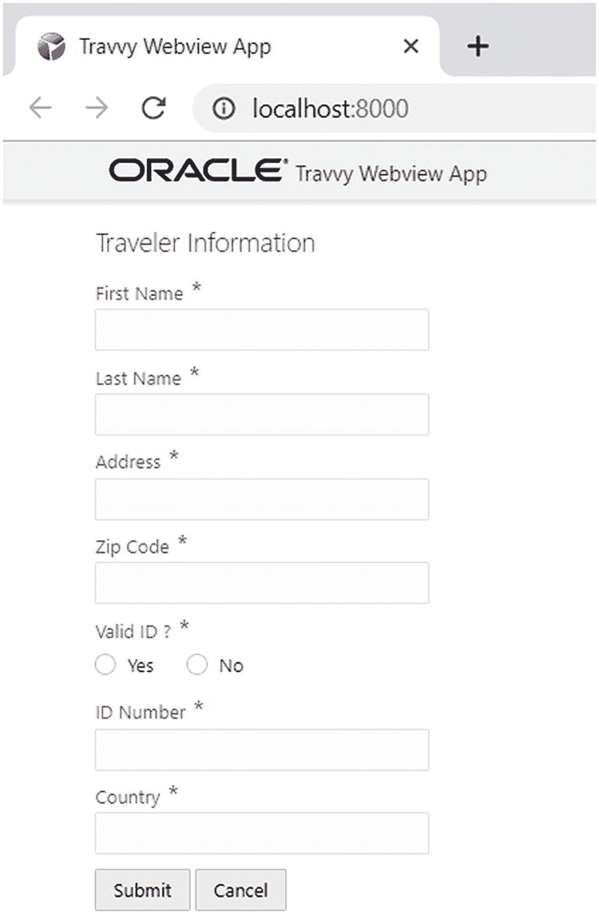

图 8-5：Travvy Web 应用程序

点击“提交”按钮后，用户档案信息将被处理，句柄将传回给技能，并相应通知用户。如果用户点击“取消”按钮，我们也会将句柄传递给技能，但会告知技能用户点击了“取消”按钮。相应地，会向用户显示一条消息。我们将在此演示中使用 Skill Tester，但您也可以按照第 6 章所述，通过渠道公开技能。让我们看一下图 8-6 中显示的流程。

1.  用户向技能打招呼说“你好”。
2.  技能回复，要求用户输入其名字。
3.  用户输入其名字。
4.  技能随后提示用户输入旅行者信息以完成预订。

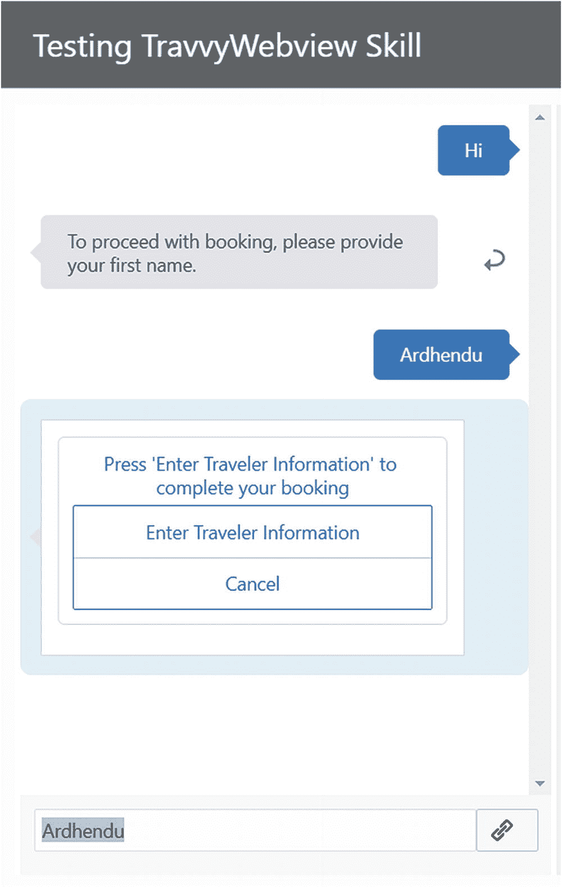

图 8-6：Webview 组件的执行

5.  当用户点击“输入旅行者信息”时，Web 应用程序会在一个单独的窗口中启动，如图 8-7 所示。
6.  应用程序启动时，会预填在技能中提供的名字。

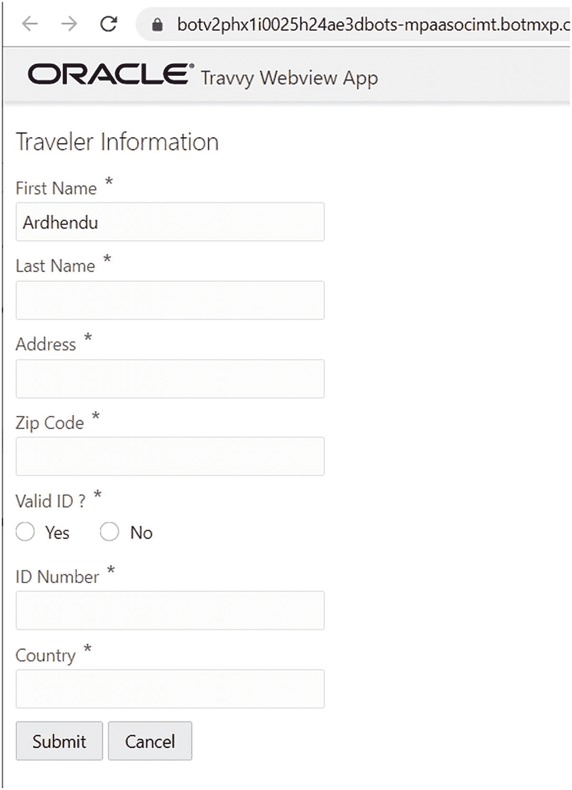

图 8-7：从技能调用的 Web 应用程序，名字已预填

7.  如果用户未填写必填字段就点击“提交”按钮，则会触发验证消息，如图 8-8 所示。

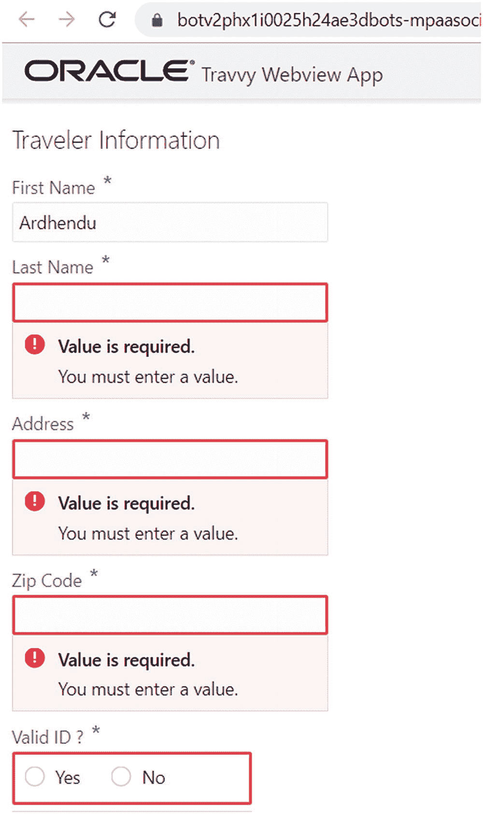

图 8-8：Web 应用程序验证消息

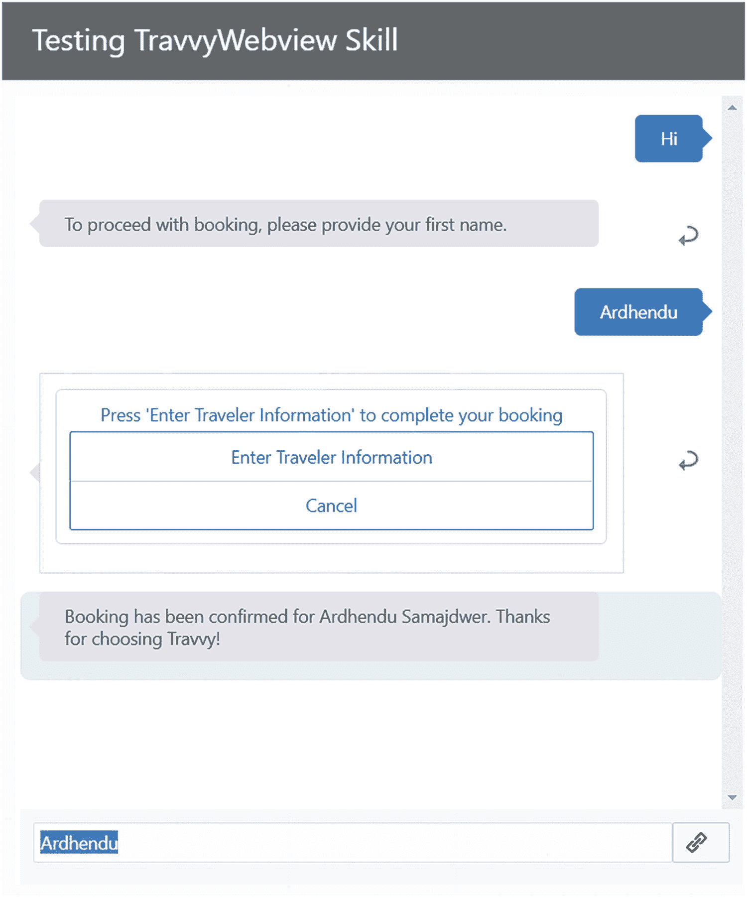

图 8-9：包含全名的确认消息

8.  一旦用户输入必填详细信息并提交表单，将向用户显示一条确认消息。在此案例中，根据 Web 应用程序的响应显示用户的全名（见图 8-9）。

## 在 Digital Assistant 内部托管的 Webview 应用程序

在本节中，我们将向您解释如何实现一个 Webview 组件，其中 Web 应用程序部署在 Digital Assistant 内部。在以下小节中，您将找到技能实现和 Web 应用程序实现。我们将分享源代码并沿途进行解释。


### 技能实施

在您的数字助手环境中创建一个名为 `TravvyWebview` 的新技能。导航至“流程”并替换为以下内容：

1.  在“上下文”级别，您定义了两个“变量”：
    -   `travellerFirstName`：用于存储用户名字的变量，并将其传递给 Web 应用程序进行预订。
    -   `appResponse`：用于存储来自 Web 应用程序响应的变量。

2.  在 `askTravelerInfo` 状态中，您要求用户提供名字。请注意，您将用户的响应存储在 `travellerFirstName` 变量中。

3.  在下一个状态 `webview` 中，您通过点击添加了 `System.Webview` 组件，然后从用户界面组件类别中选择了 Webview。请查看为该组件定义的各种属性：
    -   `service`：Webview 服务的名称。您将在后续部分创建此服务。
    -   `sourceVariableList`：源变量列表，这些变量将被传递给 Web 应用程序。
    -   `variable`：用于存储 Web 应用程序响应的变量。
    -   `prompt`：向用户显示的消息提示，要求他们在 Web 应用程序中提供额外信息。
    -   `linkLabel`：按钮的标签，点击该按钮将启动 Web 应用程序。
    -   `cancelLabel`：取消按钮的标签，用于用户不希望提供个人信息进行预订的情况。
    -   `transitions`：在此处，您定义了下一个状态的转换流程，用于评估应用程序响应以及取消操作。

4.  对话流程中的下一个状态是 `evaluateWebviewResponse`。在此状态中，您正在评估 Web 应用程序的响应 `${appResponse.value.status}`。在 Web 应用程序中，您将定义两个状态：“success”和“cancel”。在此状态中，您检查来自 Web 应用程序的状态是成功还是取消。根据状态，您随后调用相应的状态。

5.  如果来自 Web 应用程序的状态为“success”，您将调用 `confirmBooking` 状态。在此状态中，您根据在 Web 应用程序中输入的值向用户显示确认消息。请检查您为此使用的表达式 `${appResponse.value.firstName} ${appResponse.value.lastName}`。

6.  如果来自 Web 应用程序的状态为“cancel”或来自 `System.Webview` 组件的取消操作，您将调用 `onCancel` 状态。在此状态中，您优雅地处理了用户的取消响应并显示了适当的消息。

```
#metadata: information about the flow
### platformVersion: the version of the bots platform that this flow was written to work with
metadata:
platformVersion: "1.0"
main: true
name: TravvyWebview
#context: Define the variables which will used throughout the dialog flow here.
context:
variables:
travellerFirstName: "string"
appResponse: "string"
#states is where you can define the various states within your flow.
states:
askTravelerInfo:
component: "System.Text"
properties:
prompt: "To proceed with booking, please provide your first name."
variable: "travellerFirstName"
transitions:
next: "webview"
webview:
component: "System.Webview"
properties:
service: "travvyWebview"
sourceVariableList: "travellerFirstName"
variable: "appResponse"
prompt: "Press 'Enter Traveler Information' to complete your booking"
linkLabel: "Enter Traveler Information"
cancelLabel: "Cancel"
transitions:
next: "evaluateWebviewResponse"
actions:
cancel: "onCancel"
evaluateWebviewResponse:
component: "System.Switch"
properties:
source: "${appResponse.value.status}"
values:
- "success"
- "cancel"
transitions:
actions:
success: "confirmBooking"
cancel: "onCancel"
NONE: "onCancel"
confirmBooking:
component: "System.Output"
properties:
text: "Booking has been confirmed for ${appResponse.value.firstName} ${appResponse.value.lastName}. Thanks for choosing Travvy!"
keepTurn: false
transitions:
return: "done"
onCancel:
component: "System.Output"
properties:
text: "Sorry that you canceled your booking. Hope to see you back soon!"
transitions:
return: "done"
```

### Web 应用程序实施

在您的系统上安装 Oracle JET CLI 后，您可以通过在命令提示符或终端中，从您希望创建应用程序的位置发出以下命令，轻松创建一个示例应用程序：

```
ojet create  --template=navdrawer|navbar|basic|blank
```

对于此演示，您只需调用以下命令：

1.  完成后，打开您的 `appController.js`（`\travvyWebviewApp\src\js\appController.js`）并将应用程序名称更新为“Travvy Web App”，如下所示：

```
    self.appName = ko.observable("Travvy Webview App");
```

2.  打开 `index.html` 文件（`\travvyWebviewApp\src\index.html`）并将 **head** 部分下的 **title** 更新如下：

```
    Travvy Webview App
```

3.  将同一 `index.html` 文件（`\travvyWebviewApp\src\index.html`）的 body 部分替换为以下代码：

```
Traveler Information

Yes
    No

Submit
    Cancel
```

在此 body 部分中，您定义了如图 8-5 之前显示的各种屏幕元素，并添加了屏幕上的验证。

4.  最后，打开您应用程序的 `main.js` 文件（`\travvyWebviewApp\src\js\main.js`），并将文件的全部内容替换为以下代码。


```javascript
/**
 * @license
 * Copyright (c) 2014, 2019, Oracle and/or its affiliates.
 * The Universal Permissive License (UPL), Version 1.0
 */
'use strict';
/**
 * Example of Require.js boostrap javascript
 */
requirejs.config(
{
  baseUrl: 'js',
  // Path mappings for the logical module names
  // Update the main-release-paths.json for release mode when updating the mappings
  paths:
  //injector:mainReleasePaths
  {
    'knockout': 'libs/knockout/knockout-3.5.0.debug',
    'jquery': 'libs/jquery/jquery-3.4.1',
    'jqueryui-amd': 'libs/jquery/jqueryui-amd-1.12.1',
    'promise': 'libs/es6-promise/es6-promise',
    'hammerjs': 'libs/hammer/hammer-2.0.8',
    'ojdnd': 'libs/dnd-polyfill/dnd-polyfill-1.0.0',
    'ojs': 'libs/oj/v7.0.1/debug',
    'ojL10n': 'libs/oj/v7.0.1/ojL10n',
    'ojtranslations': 'libs/oj/v7.0.1/resources',
    'text': 'libs/require/text',
    'signals': 'libs/js-signals/signals',
    'customElements': 'libs/webcomponents/custom-elements.min',
    'proj4': 'libs/proj4js/dist/proj4-src',
    'css': 'libs/require-css/css',
    'touchr': 'libs/touchr/touchr'
  }
  //endinjector
}
);
/**
 * A top-level require call executed by the Application.
 * Although 'ojcore' and 'knockout' would be loaded in any case (they are specified as dependencies
 * by the modules themselves), we are listing them explicitly to get the references to the 'oj' and 'ko'
 * objects in the callback
 */
require(['ojs/ojcore', 'knockout', 'appController', 'jquery', 'ojs/ojknockout', 'ojs/ojformlayout', 'ojs/ojinputtext', 'ojs/ojlabel', 'ojs/ojbutton', 'ojs/ojradioset', 'ojs/ojvalidationgroup'],
  function (oj, ko, app, $) { // 当所有必需的模块加载完成后，此回调函数将被执行
    $(function () {
      /*
      从 WebView 发送的参数保存在名为 "webviewParameters" 的 window 对象中。在此示例中，
      这些参数包含用户在机器人对话中提供的信息。
      */
      let webviewParameters = window.webviewParameters != null ? window.webviewParameters['parameters'] : null;
      /*
      用于读取命名 WebView 参数的辅助函数
      */
      let getWebviewParam = (arrParams, key, defaultValue) => {
        if (arrParams) {
          let param = arrParams.find(e => {
            return e.key === key;
          });
          return param ? param.value : defaultValue;
        }
        return defaultValue;
      };
      /*
      如果未提供值，则为 travellerFirstName 设置默认值
      */
      self.firstName = ko.observable(getWebviewParam(webviewParameters, 'travellerFirstName', "));
      self.lastName = ko.observable();
      self.address = ko.observable();
      self.zipCode = ko.observable();
      self.validId = ko.observable();
      self.idNumber = ko.observable();
      self.country = ko.observable();
      /*
      当用户提交或取消 Web 表单时，需要将控制权交回给机器人。
      为此，WebView 会将一个回调 URL 传递给 Web 应用程序。
      保存此信息的参数是 "webview.onDone"
      */
      var webViewCallback = getWebviewParam(webviewParameters, 'webview.onDone', null);
      this.tracker = ko.observable();
      self.buttonClick = function (event) {
        let userProfile = {};
        userProfile.firstName = self.firstName();
        userProfile.lastName = self.lastName();
        userProfile.address = self.address();
        userProfile.zipCode = self.zipCode();
        userProfile.validId = self.validId();
        userProfile.idNumber = self.idNumber();
        userProfile.country = self.country();
        var tracker = document.getElementById("tracker");
        if (tracker.valid === "valid") {
          // 提交表单
          if (event.currentTarget.id === 'Submit') {
            userProfile.status = "success"
            //JQuery post 调用
            $.post(webViewCallback, JSON.stringify(userProfile));
          }
        }
        else if (event.currentTarget.id === 'Cancel') {
          let userProfile = {};
          userProfile.status = "cancel"
          //JQuery post 调用
          $.post(webViewCallback, JSON.stringify(userProfile));
        }
        else {
          // 在所有组件上显示消息
          tracker.showMessages();
          return;
        }
        const sleep = (milliseconds) => {
          return new Promise(resolve => setTimeout(resolve, milliseconds))
        }
        //关闭打开窗口的浏览器标签页。关闭浏览器标签页时，
        //确保 AJAX 调用在标签页关闭前完成。因此添加一个 "sleep" 时间
        sleep(500).then(() => {
          window.open(", '_self').close();
        })
        return true;
      }
      function init() {
        // 为整个页面主体的内容绑定你的 ViewModel
        ko.applyBindings(app, document.getElementById('globalBody'));
      }
      // 如果在混合（例如 Cordova）环境中运行，我们需要等待 deviceready
      // 事件后再执行任何可能与 Cordova API 或插件交互的代码。
      if ($(document.body).hasClass('oj-hybrid')) {
        document.addEventListener("deviceready", init);
      } else {
        init();
      }
    });
  }
);
```

```
ojet create travvyWebviewApp --template=basic
```

你可以在上述代码中看到内联代码注释，它们详细说明了每个部分。请仔细查看从技能传递到应用程序的 `webviewParameters`，以及应用程序内部如何使用 `getWebviewParam` 来访问它。检查你如何设置 "success" 和 "cancel" 状态，并使用 JQuery 向回调 URL 发起 Ajax POST 请求。`webview.onDone` 参数保存了这个回调 URL。

一切完成后，从应用程序的根文件夹执行以下命令来测试你的应用程序：

```
ojet serve
```

## 打包 Web 应用程序

现在你的 Web 应用程序已经准备就绪并测试完毕，接下来是打包你的应用程序。从应用程序的根文件夹执行以下命令：

```
ojet build --release
```

导航到 "web" 文件夹：

```
cd web
```

从 web 文件夹执行以下命令，为部署生成 TAR 归档文件：

```
tar -zcvf travvyWebviewApp.tgz *
```

## 创建 Webview 服务

最后，你需要在你的 Digital Assistant 环境中创建一个 Webview 服务，以部署上一步创建的 TAR 归档文件。导航到组件 。在此屏幕上，你将看到两个选项卡，即 "Custom" 和 "Webview"。选择 Webview 选项卡，然后点击  按钮。按照图 8-10 所示填写详细信息。保持 "Service Hosted" 开关为打开状态，并将应用程序 web 文件夹中的 `travvyWebviewApp.tgz` 拖放到 "Package File" 部分。

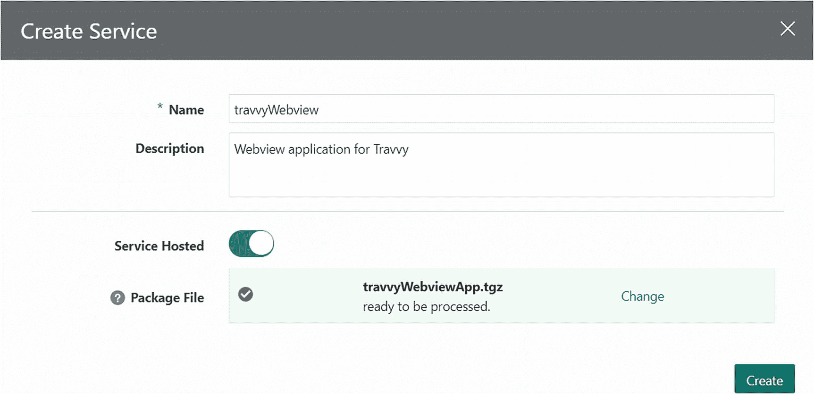

**图 8-10** 创建 Webview 服务

完成后，点击  按钮来创建你的 Webview 服务。此过程需要几分钟时间，准备就绪后，你将看到如图 8-11 所示的屏幕。

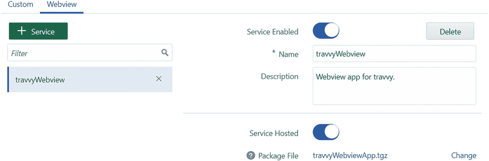

**图 8-11** Webview 服务

由于你创建此服务时使用的名称与 `System.Webview` 组件的服务属性中提到的名称完全相同，因此无需进行任何额外更改。你现在可以按照之前用例部分所述，测试你的端到端流程。


## 外部托管的 Webview 应用

在本节中，我们将向您说明如何将 Web 应用托管在 Digital Assistant 之外，并借助中介服务调用该应用。为此，您将复用之前章节创建的应用，仅需进行极少的修改。我们建议您将之前创建的 Web 应用复制一份到单独的文件夹中，并使用不同的名称（例如 `TravvyWebviewExternal`）克隆您的技能。虽然在真实场景中，您并不局限于使用 SPA 来实现此类功能，但当前示例已足以满足演示目的。您将使用 `ngrok` 将您的中介服务和 Web 应用暴露到互联网上。

### 创建中介服务

在您的机器上，创建一个名为 `intermediaryService` 的文件夹来实现该服务。

```
mkdir intermediaryService
```

使用以下命令进入该文件夹：

```
cd intermediaryService
```

通过执行以下命令将其配置为 Node 项目：

```
npm init -y
```

这将在您的 `intermediaryService` 目录中生成一个默认的 `package.json` 文件。您将使用 `Express` 来创建此服务。在同一个命令提示符/终端中，执行以下命令：

```
npm install express --save
```

在您的 `intermediaryService` 目录中创建一个名为 `index.js` 的文件，并向其中添加以下代码：

```
var express = require("express");
const bodyParser = require("body-parser");
var app = express();
app.use(bodyParser.json());
app.post("/travvyWebApp", (req, res) => {
let requestBody = req.body;
let parameters = requestBody.parameters;
let firstName = getWebviewParam(parameters, 'travellerFirstName', null);
let callbackUrl = getWebviewParam(parameters, 'webview.onDone', null);
//Web 应用的 ngrok URL
let responseUrl = "https://d64ae6e3.ngrok.io?callbackUrl="+callbackUrl+"&firstName="+firstName;
res.status(200).json({
"webview.url": responseUrl
})
});
function getWebviewParam (arrParams, key, defaultValue) {
if (arrParams) {
let param = arrParams.find(e => {
return e.key === key;
});
return param ? param.value : defaultValue;
}
return defaultValue;
};
app.listen(4000, () => {
console.log("Server running on port 4000");
});
```

在此服务中，您借助 `getWebviewParam` 函数读取技能发送的输入参数（`travellerFirstName`）和回调 URL。之后，您构建一个响应 URL，其中包含您的 Web 应用 URL、`firstName`（从技能接收的 `travellerFirstName`）以及从技能 Webview 组件接收的回调 URL。在上述代码中，您需要替换 Web 应用 URL `https://d64ae6e3.ngrok.io`，我们稍后将对此进行说明。您将此 URL 作为包含 `webview.url` 参数的 JSON 对象传递给您的技能。

### Web 应用实现

您需要在之前复制的应用中所做的唯一更改位于 `main.js` 文件中。导航到您复制 Web 应用的文件夹，找到您的 `main.js` 文件，并将整个代码替换为以下内容：

```
/**
* @license
* Copyright (c) 2014, 2019, Oracle and/or its affiliates.
* The Universal Permissive License (UPL), Version 1.0
*/
'use strict';
/**
* Example of Require.js boostrap javascript
*/
requirejs.config(
{
baseUrl: 'js',
// Path mappings for the logical module names
// Update the main-release-paths.json for release mode when updating the mappings
paths:
//injector:mainReleasePaths
{
'knockout': 'libs/knockout/knockout-3.5.0.debug',
'jquery': 'libs/jquery/jquery-3.4.1',
'jqueryui-amd': 'libs/jquery/jqueryui-amd-1.12.1',
'promise': 'libs/es6-promise/es6-promise',
'hammerjs': 'libs/hammer/hammer-2.0.8',
'ojdnd': 'libs/dnd-polyfill/dnd-polyfill-1.0.0',
'ojs': 'libs/oj/v7.0.1/debug',
'ojL10n': 'libs/oj/v7.0.1/ojL10n',
'ojtranslations': 'libs/oj/v7.0.1/resources',
'text': 'libs/require/text',
'signals': 'libs/js-signals/signals',
'customElements': 'libs/webcomponents/custom-elements.min',
'proj4': 'libs/proj4js/dist/proj4-src',
'css': 'libs/require-css/css',
'touchr': 'libs/touchr/touchr'
}
//endinjector
}
);
/**
* A top-level require call executed by the Application.
* Although 'ojcore' and 'knockout' would be loaded in any case (they are specified as dependencies
* by the modules themselves), we are listing them explicitly to get the references to the 'oj' and 'ko'
* objects in the callback
*/
require(['ojs/ojcore', 'knockout', 'appController', 'jquery', 'ojs/ojknockout', 'ojs/ojformlayout', 'ojs/ojinputtext', 'ojs/ojlabel', 'ojs/ojbutton', 'ojs/ojradioset', 'ojs/ojvalidationgroup'],
function (oj, ko, app, $) { // this callback gets executed when all required modules are loaded
$(function () {
const queryParameters = new URLSearchParams(window.location.search);
/*
Setting default values for the travellerFirstName if no value provided
*/
self.firstName = ko.observable(queryParameters.get('firstName') != null ? queryParameters.get('firstName') : ");
self.lastName = ko.observable();
self.address = ko.observable();
self.zipCode = ko.observable();
self.validId = ko.observable();
self.idNumber = ko.observable();
self.country = ko.observable();
/*
When the user submits or cancels the web form, control need to be passed back to the bot,
For this a callback URL is passed from the webview to the web application. The parameter
holding the information is "webview.onDone"
*/
var webViewCallback = queryParameters.get('callbackUrl');
this.tracker = ko.observable();
self.buttonClick = function (event) {
let userProfile = {};
userProfile.firstName = self.firstName();
userProfile.lastName = self.lastName();
userProfile.address = self.address();
userProfile.zipCode = self.zipCode();
userProfile.validId = self.validId();
userProfile.idNumber = self.idNumber();
userProfile.country = self.country();
var tracker = document.getElementById("tracker");
if (tracker.valid === "valid") {
// submit the form
if (event.currentTarget.id === 'Submit') {
userProfile.status = "success"
//JQuery post call
$.post(webViewCallback, JSON.stringify(userProfile));
}
}
else if (event.currentTarget.id === 'Cancel') {
let userProfile = {};
userProfile.status = "cancel"
//JQuery post call
$.post(webViewCallback, JSON.stringify(userProfile));
}
else {
// show messages on all the components
tracker.showMessages();
return;
}
const sleep = (milliseconds) => {
return new Promise(resolve => setTimeout(resolve, milliseconds))
}
//Closes the browser tab the window is opened in. When closing the browser
//tab, ensure the ajax call gets trough before the the tab closes. Thus adding
//a "sleep" time
sleep(500).then(() => {
window.open(", '_self').close();
})
return true;
}
function init() {
// Bind your ViewModel for the content of the whole page body.
ko.applyBindings(app, document.getElementById('globalBody'));
}
// If running in a hybrid (e.g. Cordova) environment, we need to wait for the deviceready
// event before executing any code that might interact with Cordova APIs or plugins.
if ($(document.body).hasClass('oj-hybrid')) {
document.addEventListener("deviceready", init);
} else {
init();
}
});
}
);
```

由于您的应用部署在 Digital Assistant 之外，您将无法再直接访问 `getWebviewParam`。为此，您使用了中介服务。因此，您需要读取从技能 URL 中附加接收的参数。基于此原因，您现在使用 `queryParameters` 来获取 `firstName` 和回调 URL，这些参数被附加到从技能调用的 Web 应用 URL 中。其余的实现保持不变。


### 技能实现

打开您新克隆的技能 `TravvyWebviewExternal`，并将其流程替换为以下内容：

```
#metadata: information about the flow
### platformVersion: the version of the bots platform that this flow was written to work with
metadata:
platformVersion: "1.0"
main: true
name: TravvyWebviewExternal
#context: Define the variables which will used throughout the dialog flow here.
context:
variables:
travellerFirstName: "string"
appResponse: "string"
#states is where you can define the various states within your flow.
states:
askTravelerInfo:
component: "System.Text"
properties:
prompt: "To proceed with booking, please provide your first name."
variable: "travellerFirstName"
transitions:
next: "webview"
webview:
component: "System.Webview"
properties:
service: "travvyWebview"
sourceVariableList: "travellerFirstName"
variable: "appResponse"
prompt: "Press 'Enter Traveler Information' to complete your booking"
linkLabel: "Enter Traveler Information"
cancelLabel: "Cancel"
transitions:
next: "evaluateWebviewResponse"
actions:
cancel: "onCancel"
evaluateWebviewResponse:
component: "System.Switch"
properties:
source: "${appResponse.value.status}"
values:
- "success"
- "cancel"
transitions:
actions:
success: "confirmBooking"
cancel: "onCancel"
NONE: "onCancel"
confirmBooking:
component: "System.Output"
properties:
text: "Booking has been confirmed for ${appResponse.value.firstName} ${appResponse.value.lastName}. Thanks for choosing Travvy!"
keepTurn: false
transitions:
return: "done"
onCancel:
component: "System.Output"
properties:
text: "Sorry that you canceled your booking. Hope to see you back soon!"
transitions:
return: "done"
```

您的技能整体实现保持不变，除了为 `System.Webview` 组件创建服务。在这种情况下，您将通过切换“服务托管”开关来创建 `travvyWebview` 服务，如图 8-12 所示。

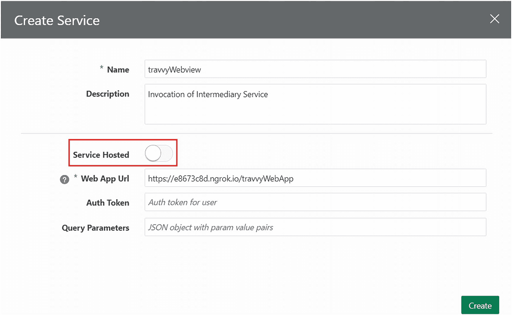

图 8-12

为外部托管应用程序创建 Webview 服务

在下一节生成“Web 应用 URL”后，您需要更新它。成功完成后，服务将如图 8-13 所示。

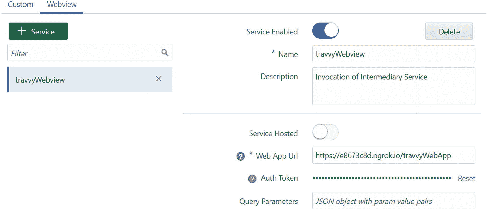

图 8-13

外部托管应用程序的服务

### 使用 ngrok 公开 Web 应用程序和中介服务

通过执行以下命令启动您的 Oracle JET Web 应用程序：

```
ojet serve
```

您的本地 Oracle JET 应用程序运行在端口 8000 上。您将首先使用以下命令公开此端口：

```
ngrok http 8000
```

复制如图 8-14 所示的高亮部分，并将其更新到您的 `intermediaryService` 的 `index.js` 中，如“创建中介服务”部分末尾所述。

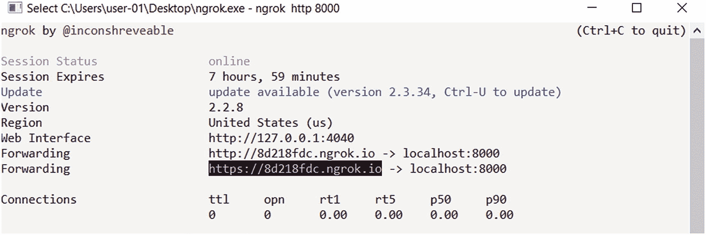

图 8-14

公开端口 8000

现在，从服务 `intermediaryService` 的根文件夹使用以下命令启动您的中介服务：

```
node index.js
```

您的服务运行在端口 4000 上。如前所述，也使用 `ngrok` 公开您的端口 4000。完成后，在您的 `TravvyWebviewExternal` 技能的 Webview 服务（即 `travvyWebview`）中更新此 URL。您需要更新该服务的“Web 应用 URL”。

现在，您可以使用技能测试器测试端到端流程。

## 总结

在本章中，您了解了 Webview 组件，这是在对话设计中从用户处收集结构化数据的一种替代方法。我们向您解释了 Webview 组件架构以及两种不同的方法，您可以使用这些方法在技能中实现 Webview 组件。希望您觉得这个主题有趣，我们下一章再见。

