# 9. 将常见问题解答集成到您的数字助理中

## 引言

数字助理的一个非常常见的用例是使用常见问题解答（FAQ），也称为问答（Q&A）。每当用户输入与问答中的搜索词匹配的短语时，匹配的问题和答案就会显示给用户。一个已开发的技能可以作为这些常见问题解答或其他知识库文档的接口。常见问题解答是寻求答案的常见问题。“你们的营业时间是什么？”“我可以带孩子吗？”“你们有素食披萨吗？”这些常见问题解答通常已经存在于公司的网站上，并且可以轻松地引入到您的机器人中。`Oracle 数字助理`的问答框架使机器人能够通过返回一个或多个问答对来回答一般兴趣问题。通过这种方式，机器人可用于展示常见问题解答或其他知识库文档。

我们公司 `Extreme Hiking Holidays` 运营网站已有很长时间。他们收集了大量常见问题解答，这些解答可从网站上获取。在本章中，您将学习如何获取这些常见问题解答及其答案，并将它们作为问答添加到公司的数字助理 `Travvy` 中。

## 问答是如何工作的？

在您学习如何实现问答之前，了解问答在数字助理中的工作原理会很有帮助。设置一个良好的问答技能涉及一些重要的配置。意图解析如何工作，什么是问答路由，以及如何构建您的问答流程？

### 在技能级别配置问答路由

对于问答路由，`Oracle 数字助理`在问答路由配置页面中提供了一组开箱即用的常用词和开场短语，这些词和短语指示命令或问题。除此之外，还可以添加任何特定领域的内容。此配置可以在技能的设置页面中更改，它使路由器能够区分问答和意图。如图 9-1 所示，有一个事务配置部分和一个问题配置部分。

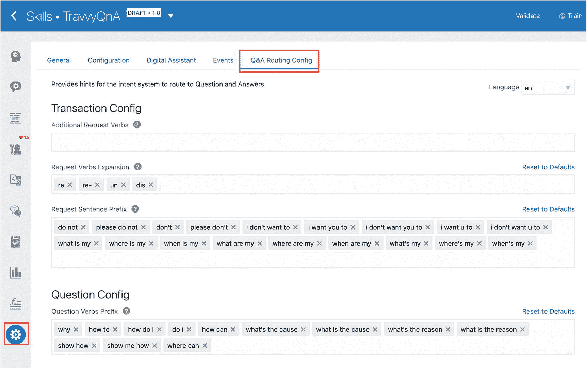

图 9-1 技能级别的问答路由设置

在事务配置部分，您可以配置技能，使意图引擎更容易将话语识别为事务（例如“我希望你预订行程”、“我的付款何时到期”）。这些示例使用了请求句子前缀。此外，默认情况下，还有一组广泛的请求动词，例如“order”、“cancel”、“check”等。您可以添加特定于用例的请求动词。从图 9-1 可以看出，内置集已经包含了最常用的动词和前缀，但您始终可以添加自己的动词以满足特定事务，例如“book”或“check in”，这些对于我们的旅游业务来说是典型的。

在问题配置中，您可以创建一组单词，这些单词表明用户正在提问（“我如何预订行程”、“我怎样才能取消我的假期”），而不是请求事务。这些也可以使用特定的问题动词进行扩展。

### 问答在运行时如何工作

在运行时，机器人的行为受到上一节中描述的配置的影响。除此之外，还有两个重要的属性参与问答路由：

- `confidenceTreshold`：技能使用此属性通过已解析意图的置信度来引导对话。此属性在技能级别配置中设置。

- `Q&AMinimumMatch`：设置任何问答对必须包含的令牌的最小和最大百分比，才能被视为匹配。此属性的值可以在流程编辑器中的 `System.Intent` 组件中设置。

#### 提示

`Q&AMinimumMatch` 设置默认为 `50%/25%`。虽然将其设置为例如 `90%` 没有意义，但您可能希望通过将其设置为仅 `50%` 或仅 `30%` 来调整问答（Q&A）的查找结果。`50%/25%` 的默认值意味着，如果 `50%` 的匹配度未达到，搜索将回退到 `25%`，即采用一个更宽松的条件。

这两个属性的组合决定了流程的最终解析结果和输出。当用户输入一个短语时，可能会出现几种情况。让我们看一些示例：

- 超过 `confidenceTreshold` 且未达到 `Q&AMinimumMatch`：在这种情况下，意图被解析，用户会看到机器人对该意图的回复（图 9-2）。

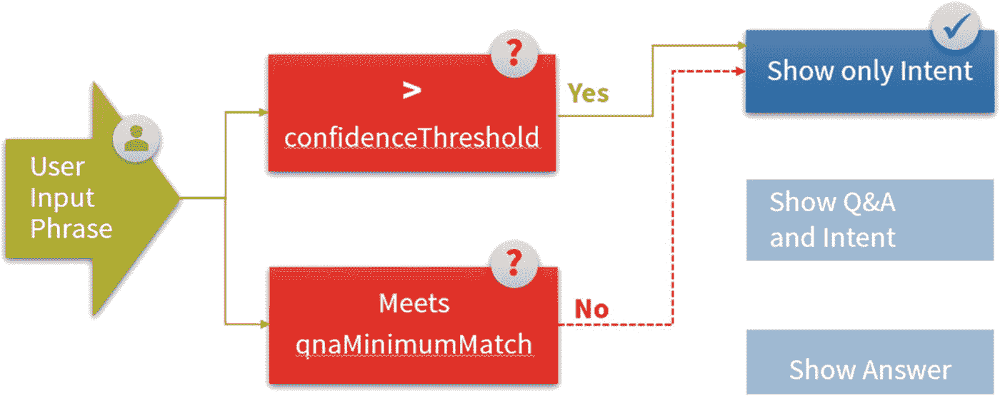

图 9-2 情况 1

- 低于 `confidenceTreshold` 且达到 `Q&AMinimumMatch`：在这种情况下，机器人将向用户回复与所提问题对应的答案（图 9-3）。

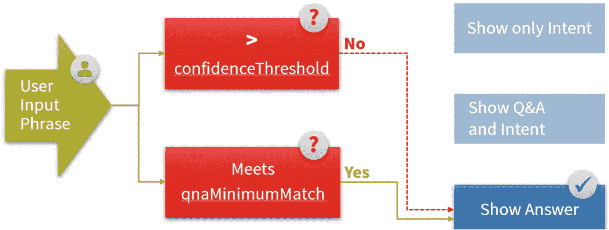

图 9-3 情况 2

- 低于 `confidenceTreshold` 且未达到 `Q&AMinimumMatch`：机器人将不知道如何解析该意图，并向用户显示未解析意图的提示（图 9-4）。

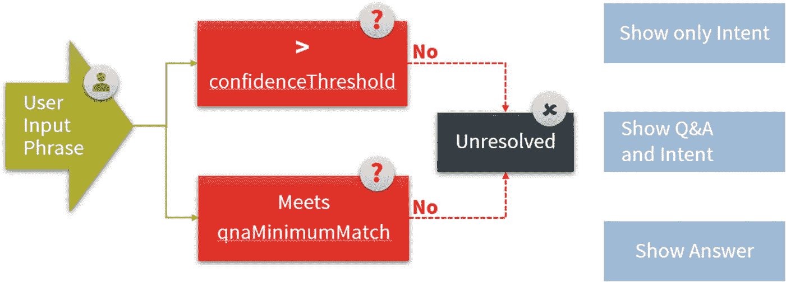

图 9-4 情况 3

- 超过 `confidenceTreshold` 且达到 `Q&AMinimumMatch`：在这种情况下，有几种可能的结果：

  - 第一种取决于是否使用了祈使动词，例如“购买”、“检查”、“订购”、“确认”和“取消”。这些词表示一个交易，而非一个问题，因此，只要话语中使用了祈使句，机器人将仅回复意图。如果话语中不包含祈使句，机器人将同时显示问答和意图（图 9-5）。

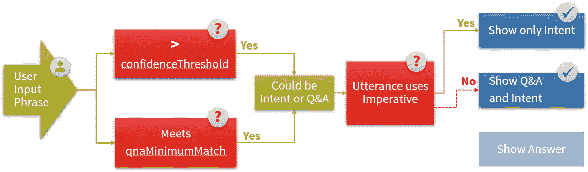

图 9-5 情况 5

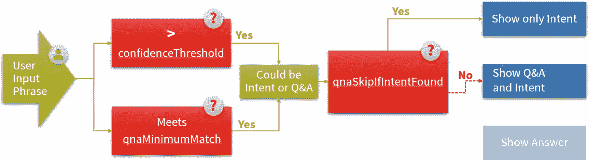

图 9-6 情况 5

  - 第二种取决于 `QnASkipIfIntentFound` 的设置。此属性可以在 `System.Intent` 级别设置。当设置为 `true` 时，如果匹配到意图，机器人将绕过问答。当设置为 `false`（默认值）时，机器人会使用用户的话语查询问答服务器，并将问答作为选项呈现（图 9-6）。

在本章的剩余部分，您将学习如何在 `Travvy` 数字助手的问答技能中使用这些属性。

## 为我们的数字助手添加问答功能

现在您已经了解了如何配置问答，是时候开发一个问答技能了。为数字助手添加问答功能的过程包含多个步骤。我们将引导您完成这些步骤，并对它们逐一进行解释：

- 创建一个新的技能来承载问答。

- 为该技能启用问答功能。

- 加载问答源文件，并可选择编辑、添加或删除更多问题。

- 使用问答训练器训练机器人。

- 通过在问答测试器中输入问题来测试新的问答功能。

- 要在机器人对话流程中使用问答，我们需要配置 `System.QnA`。

- 为 `none` 动作添加一个状态，并在问题被回答时，通过为下一次转换添加问答，将转换设置回问答组件。

要开始使用问答，首先需要创建一个新的技能（图 9-7）。

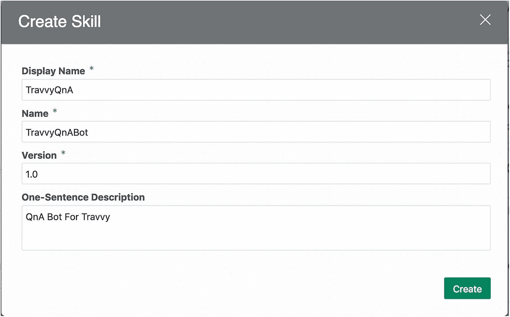

图 9-7 创建一个新的问答技能

点击“创建”后，技能编辑器将打开，一切准备就绪，可以添加问题和答案、编写流程并测试问答技能。在初始创建技能后，机器人构建器并不知道这个特定的技能应该被创建为问答技能。为了使该技能成为问答技能，需要通过点击导航栏中的问答图标  来启用问答。然后点击 `添加问答`（图 9-8）。

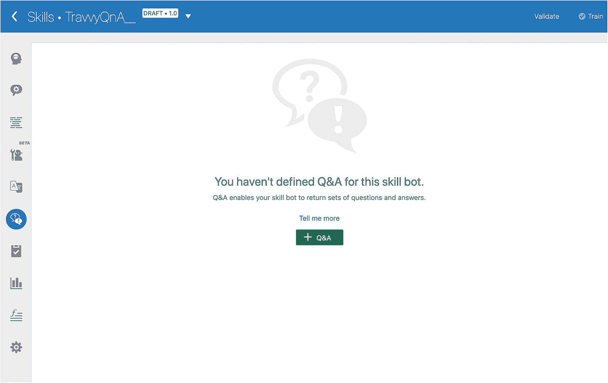

图 9-8 为技能添加问答

现在一切已设置完毕，下一步是上传包含该技能所有问题和答案的 csv 文件。点击“+ 问答源”后，会显示一个对话框，您可以在其中设置语言、区域设置和名称，并上传您的 csv 文件。在讨论上传本身之前，我们需要确保初始问答数据集的数据源设置正确。

### 问答数据文件

问答数据文件是一个包含您技能初始所需的所有问答对的文件。通常，此文件会以 `Oracle 数字助理`可以处理的格式打包您的常见问题解答（FAQ）。该文件必须满足一些标准才能上传到数字助手云：

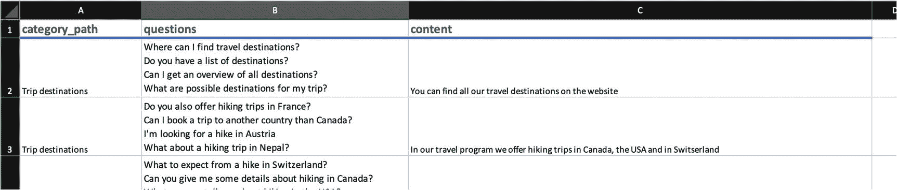

图 9-9 问答数据源文件示例

- 该文件必须是 `UTF-8` 编码的 `CSV` 文件。

- 文件必须包含带有 `category_path`、`questions` 和 `content` 的标题行。在该行下方，可以添加实际的问题和答案。图 9-9 显示了一个示例。

`category_path` 包含给定问答对的类别（或多个类别）。这样一个问答对可以属于多个类别。如果是这种情况，每个类别应在新的一行中输入。如果类别存在层级关系，则应使用正斜杠：

- travel

- travel/insurance

- travel/itinerary

在 `questions` 列中，您输入要使用的问题。每个问题版本应在新的一行中输入。第一个问题，即规范问题，是默认在机器人消息中显示的问题。该列中的后续问题是替代版本。

您可以在云用户界面中手动添加所有问题和答案，但使用电子表格输入数据是一种更方便的方式。使用电子表格进行初始的问答批量加载将节省您的时间。如果在后期需要添加额外的单个问题和/或答案，可以在上传 `csv` 文件后始终在用户界面中手动添加。

#### 提示

为每个答案添加的问题越多，技能返回相关问答对的可能性就越大。请为每个答案添加 2 到 5 个问题，这将提高准确性。

在添加问题和答案时，必须确保为技能提供足够多的问题，以便识别用户提出相同问题的所有不同方式。最佳做法是变换动词和疑问词，如“如何”、“什么”和“哪里”，但答案的主题要保持高度一致。

像“我在哪里可以找到旅行目的地？”这样的问题，可以用不同的方式提问，例如：

- 你们有目的地列表吗？

- 我能获取所有目的地的概览吗？

- 我的旅行有哪些可能的目的地？

显然，这些问题应始终返回相同的答案。当您对问答 `CSV` 的内容满意后，就可以将其添加到技能中。可以通过点击“+ Q&A 源”按钮来启动此上传过程，如图 9-10 所示。

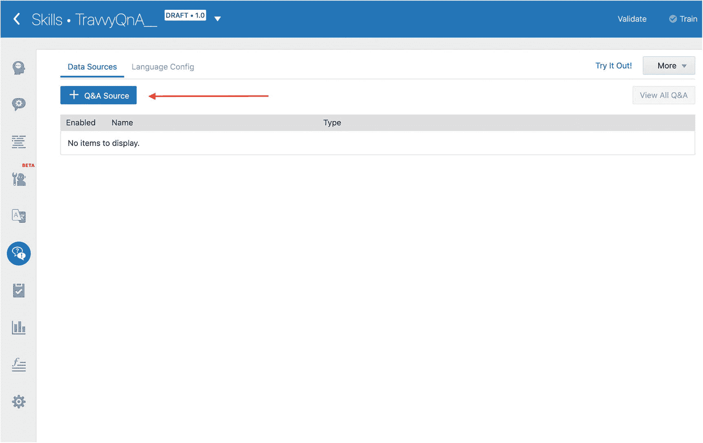

图 9-10：添加新的问答源

将出现一个上传对话框（图 9-11），您可以在其中选择问答源的语言和区域设置，并为其命名。接下来，可以将 `CSV` 文件拖放到对话框中进行上传。填写完所有字段后，点击 `Create`，`CSV` 文件将被上传并添加到您的问答中。

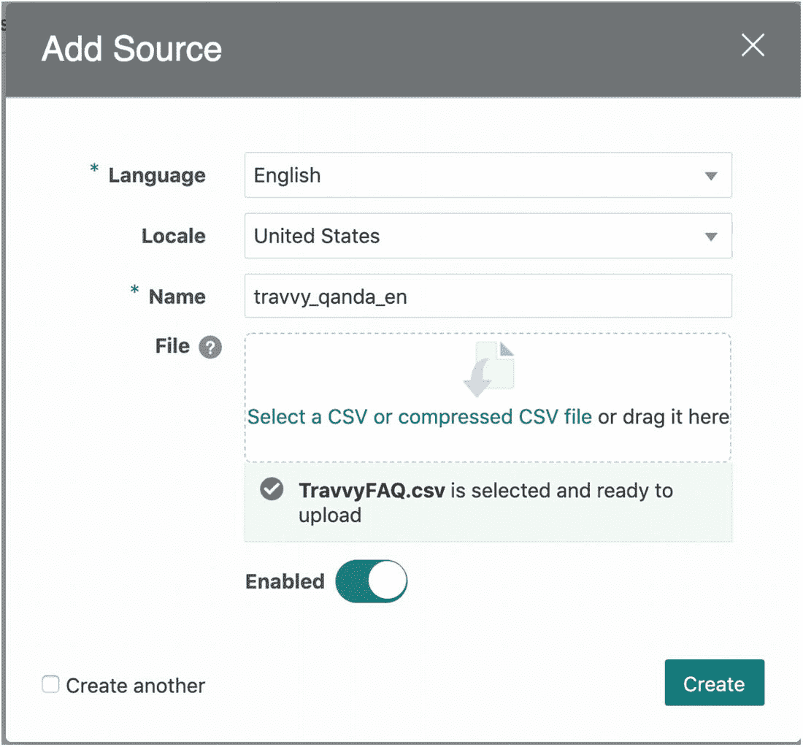

图 9-11：添加问答源

#### 提示

如果在上传后决定编辑数据源文件并替换内容，请注意，这将用新 `CSV` 文件中的内容替换所有在线内容。您在云端所做的任何更改都将被覆盖。最好在 `CSV` 中进行更改，而不是在云端。如果您在云端进行了更改，请确保在上传新文件之前，先导出云端的问答内容。

`CSV` 中的所有问题和答案现在都已上传到技能编辑器中。在列表中，您可以看到刚刚上传的文件。

提高问答质量的另一项措施是添加特定于语言的配置。在这里，您可以添加忽略词、缩写和同义词。例如，对于“旅行”，有“旅程”、“假期”、“航行”等同义词。

只需将它们作为同义词添加到这里，它们都可以用来解析到同一个问题（图 9-12）。

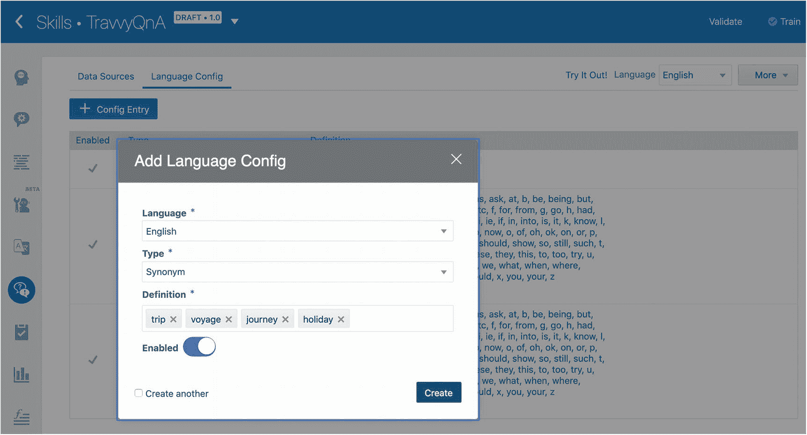

图 9-12：添加同义词

#### 注意

在本章中，我们不会深入探讨多语言细节。多语言的具体内容已在第 7 章中讨论过。

当您点击“查看所有问答”时，您将看到一个列表，显示该文件的确切内容（图 9-13）。

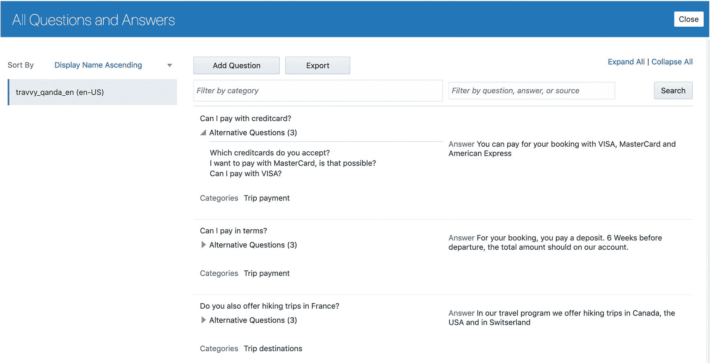

图 9-13：`Travvy` 的所有问答

这也是编辑问答并在需要时进行导出的地方。现在是时候训练问答了。

### 测试问答

为了确保问答按预期工作，必须进行测试，但在测试问答之前，我们必须先训练问答（图 9-14）。这是一项简单的任务，可以在机器人构建器的训练部分执行：

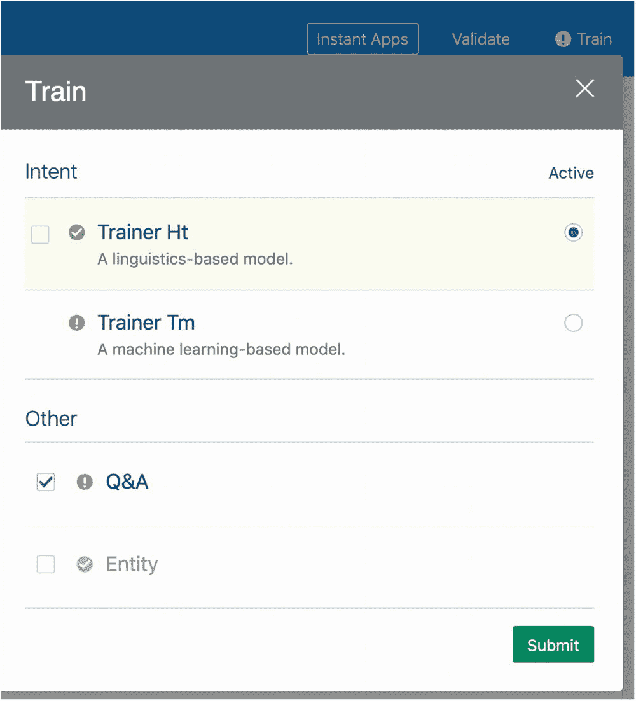

图 9-14：训练技能的问答

完成后，可以通过点击“试用”来调用测试器，开始测试 `Travvy` 的问答。这可以“逐个”进行，也可以批量进行。对于 `Travvy`，我们将坚持“逐个”测试。让我们看看当我们输入“我如何支付我的旅行费用？”时会发生什么（图 9-15）。

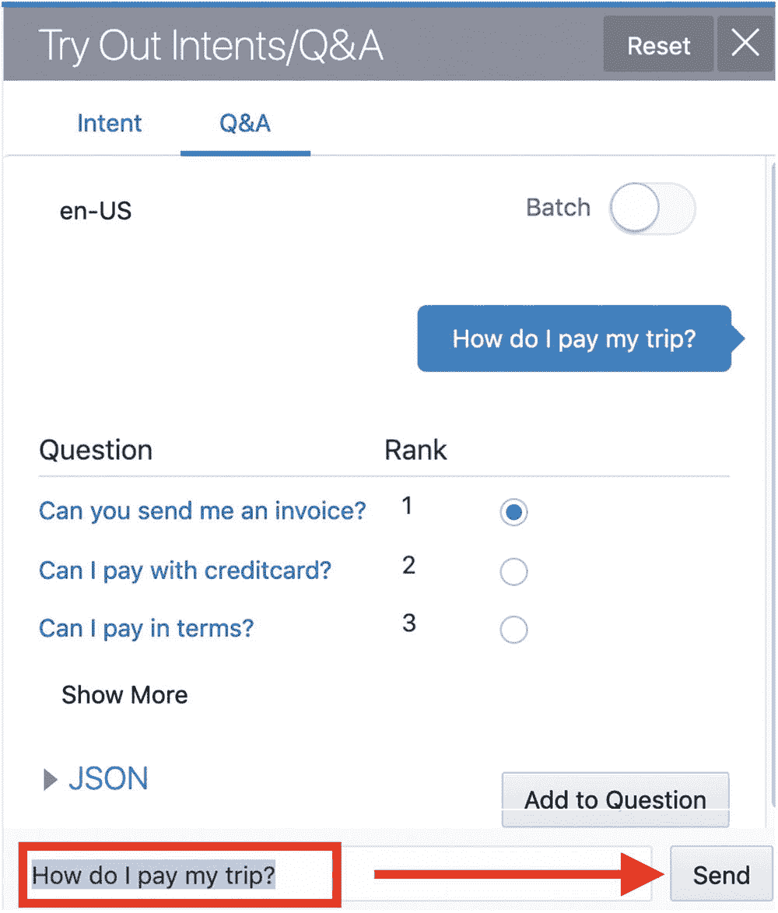

图 9-15：测试问答

问答功能处理对输入语句的响应。它由一组代表最佳匹配的问题组成。在我们的测试案例中，有三个可能的问题与用户的语句相关，都属于“旅行支付”类别。在测试器之外，在真实的“聊天机器人”中，这些答案将以一种轮播形式显示，以便用户可以浏览所有匹配的问题，找到他正在寻找的那个。

现在让我们看看，如果我们将其改为“我如何支付我的预订费用？”会发生什么（图 9-16）。

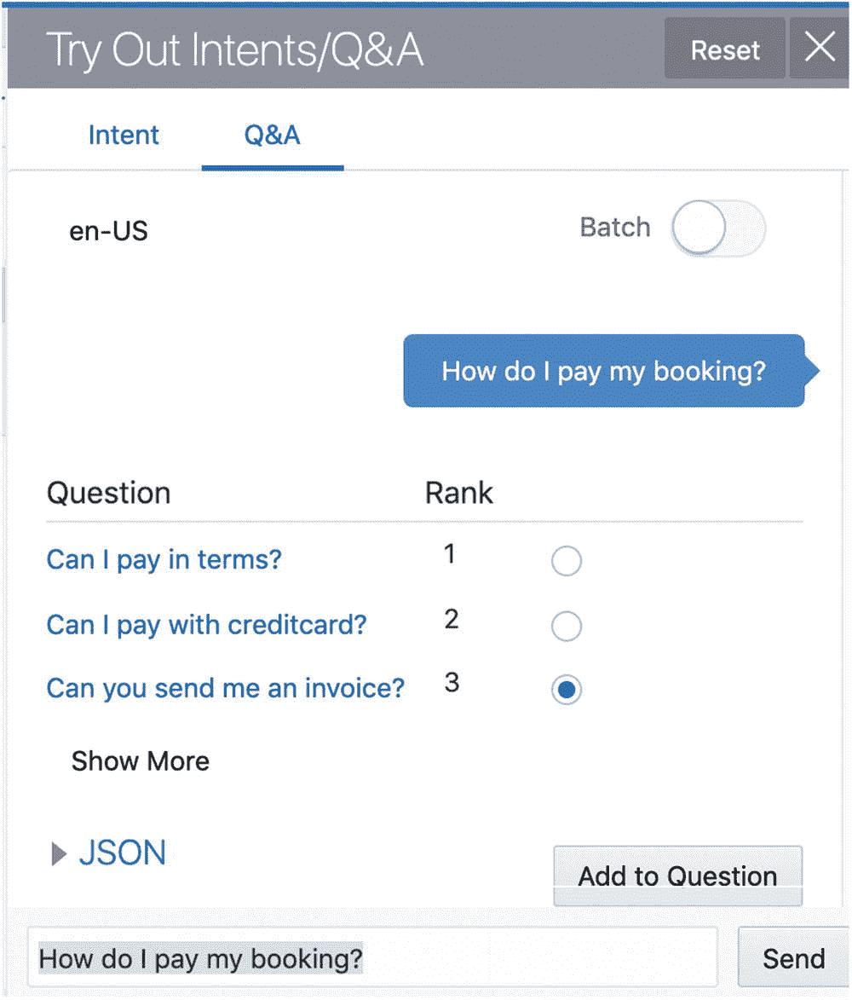

图 9-16：测试问答

问答功能现在选择了不同的问题和不同的顺序。显然，所有问题都以某种方式与输入的语句相关。如果您想增加某个问答对针对某个语句的权重，可以使用“添加到问题”按钮，将您的语句添加到特定的问答问题中。

### 在对话流中添加问答功能

设置此问答技能的最后一步是在流程编辑器中进入问答流程。打开流程编辑器后，您会看到其中已包含代码。`states` 关键字下方的所有内容都可以删除，因为此问答机器人不需要这些内容。您也可以根据需要删除注释。清理编辑器后，现在可以轻松设置问答流程了。

这个“纯问答”技能将包含两个状态：

- `Q&A`：允许输入问题并显示答案的状态。

- `unresolved`：与往常一样，技能需要一个 `unresolved` 状态，以确保当数字助手无法理解用户意图时，对话不会崩溃。

这里的 `Q&A` 状态是问答的主要状态，下一个状态应始终是 `Q&A`，这样在返回答案时就会路由回问答状态。因此，配置如下：

- `component`：`System.Q&A`

- `transitions`：

  - `actions`：

    - `none`：`unresolved`

  - `next`：`travvyQnA`

最终结果如下代码所示：

```
metadata:
platformVersion: "1.0"
main: true
name: "TravvyQnA"
context:
variables:
greeting: "string"
name: "string"
terminateChoice: "string"
states:
travvyQnA:
component: "System.QnA"
transitions:
actions:
none: "unresolved"
next: " travvyQnA"
unresolved:
component: "System.Output"
properties:
text: "抱歉，我没有找到任何匹配项。您能重新表述一下问题吗？"
transitions:
return: "done"
```

让我们看看在技能测试器中询问“how can I pay my voyage”时会发生什么。

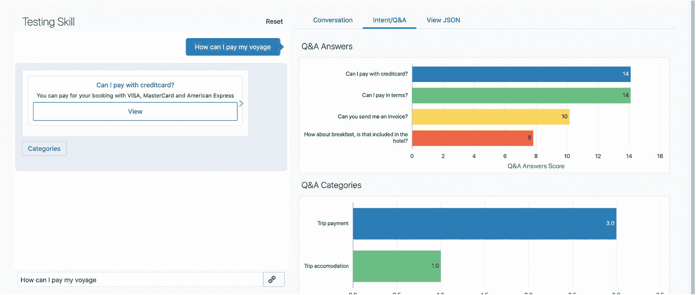

图 9-17 测试器中的默认行为

您可以在图 9-17 的右侧看到，问答功能选择了四个问答集。这四个问答集也显示在轮播中，您可以使用箭头按钮浏览选项。通过调整 `System.QnA` 组件的属性可以改变此行为。为了减少呈现给用户的问答对数量，您可以使用 `matchListLimit` 属性。

在以下代码中，此属性被设置为 `1`：

```
travvyQnA:
component: "System.QnA"
properties:
matchListLimit: 1
transitions:
actions:
none: "unresolved"
next: " travvyQnA"
```

行为将发生变化，您可以在测试器中看到这一点（图 9-18）：

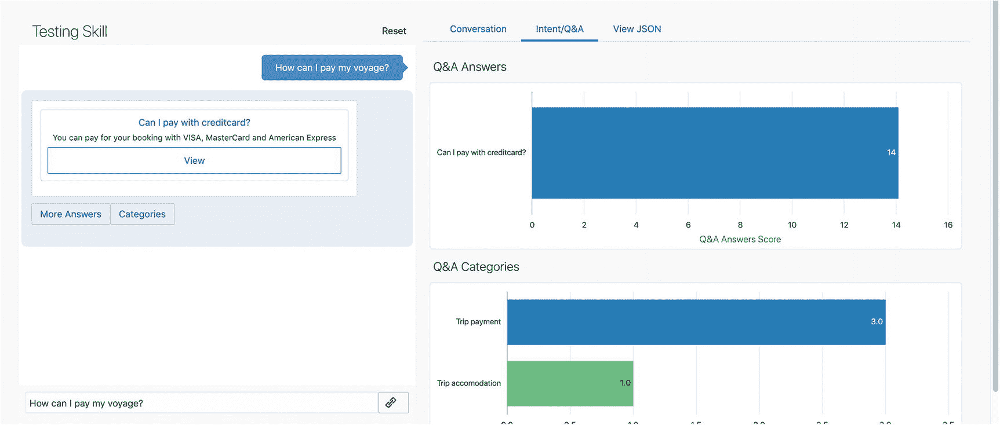

图 9-18 设置 `matchListLimit=1` 后的行为

# 问答与意图的混合配置

只有第一个选项显示给用户，并且用户会获得一个额外的选项来显示“更多答案”。

您还可以使用更多选项来影响问答的行为，例如前面提到的 `QnASkipIfIntentFound` 和 `confidenceTreshold`。

为了展示将问答与意图混合使用并调整可用选项时会发生什么，我们向问答技能添加了一个简单的意图（`PayTrip`）。

> **注意**：对于 Travvy 数字助手，我们将把问答功能放在一个独立的、不包含意图的干净技能中。在后续阶段，我们会将此技能添加到数字助手中。

首先，我们来看看 `confidenceTreshold` 的作用。我们将使用语句 `I need to fulfill the invoice`，该语句既可以关联到问答，也可以关联到 `PayTrip` 意图。当 `confidenceTreshold` 设置为 `0.6` 时，技能会立即显示它找到的问答（图 9-19），因为意图得分百分比为 `0.49`，低于 `confidenceTreshold`。

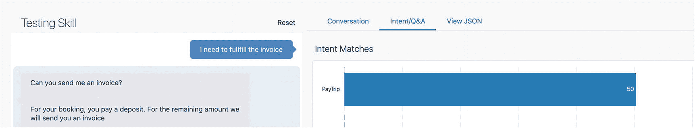

现在，如果我们将 `confidenceTreshold` 从 `0.6` 降低到 `0.5`，您会看到技能的行为有所不同，它会同时显示意图和问答，并让用户选择他想要的内容（图 9-20）。

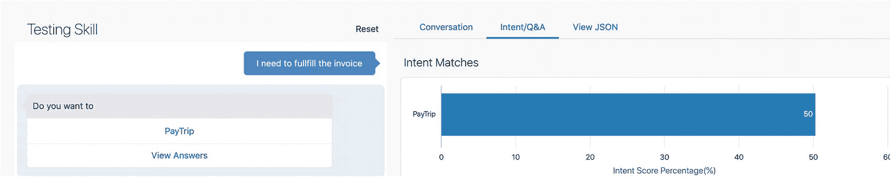

最后，我们可以将 `QnASkipIfIntentFound` 从 `false` 改为 `true`，看看效果如何（图 9-21）。

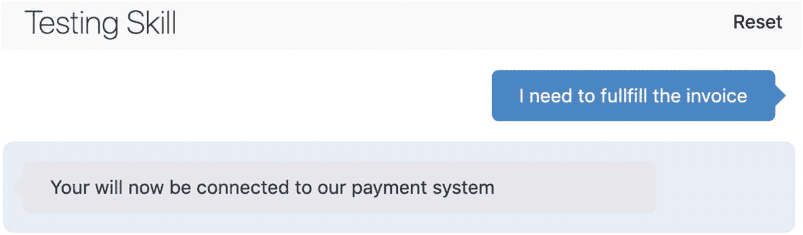

```yaml
Intent:
component: "System.Intent"
properties:
variable: "iResult"
qnaEnable: true
qnaSkipIfIntentFound: true
transitions:
actions:
unresolvedIntent: "unresolved"
payTrip: "payTrip"
qna: "travvyQna"
```

现在，让我们将 `QnASkipIfIntentFound` 设置回 `false`。当用户说 `I need to pay my voyage` 时，技能会显示两个选项，因为存在一个得分高于置信度阈值的意图和一个匹配的问题，但意图会排在第一位（图 9-22）。

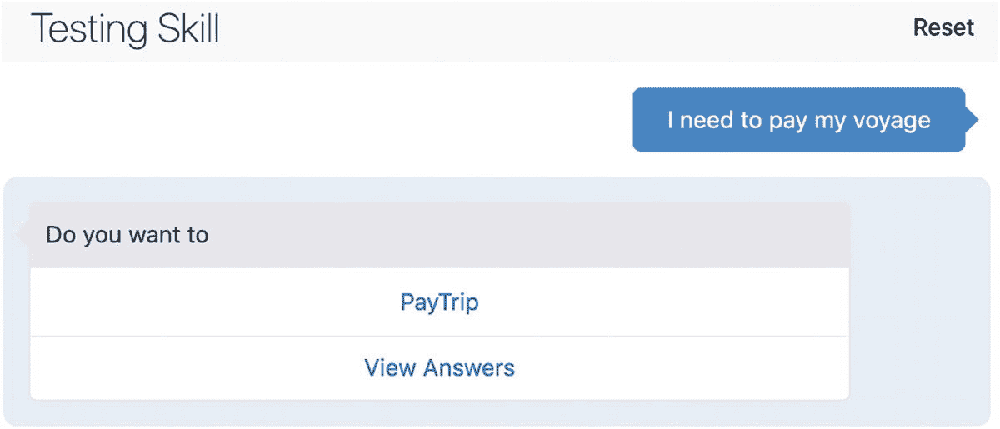

当用户使用问答路由配置中定义的“问题动词或前缀”时，表明用户正在提问。问答响应的链接会优先显示，因为它比意图响应的链接获得更高的“优先级”（图 9-23）。

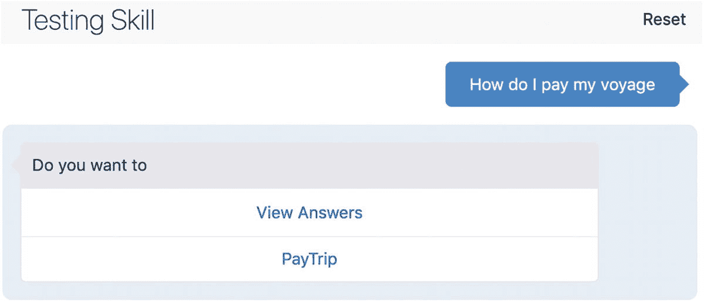

还有一件事需要配置，那就是问答路由。您可以在路由部分添加自定义的 `请求句子前缀`。让我们看看，如果您在该部分添加 `I want to` 并向技能询问 `I want to pay my trip`，会发生什么。

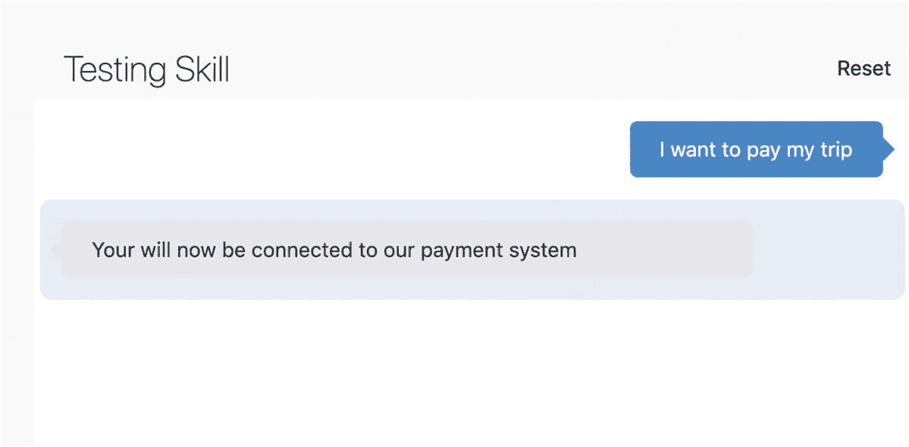

就是这样。技能现在完全理解您想做什么，并且会解析 `PayTrip` 意图（图 9-24）。

影响和配置问答行为的方法有很多，此外，理解所有选项确实至关重要，因为您需要根据技能的要求，在不同情况下以不同方式使用它们。

## 总结

常见问题解答是寻求答案的常见问题。它们通常已经存在于公司的网站上，并且可以轻松地引入到您的机器人中。在本章中，您学习了如何开发问答技能以及如何在数字助手中使用它。现在，您应该能够理解如何在 Oracle 数字助手中配置问答，以及如何改进问答集以获得最佳用户体验。