# 10. 使用自定义组件扩展您的数字助手

## 引言

欢迎来到自定义组件章节。本章将重点介绍 Oracle 数字助手（ODA）的自定义组件。在第 5 章的学习过程中，你已经对自定义组件有了初步了解。假设你对自定义组件已有大致认识，本章将详细阐述自定义组件。自定义组件是指那些你可以根据自身需求亲手打造的组件，最重要的是，你可以完全控制其行为。你将学习从在本地环境中创建自定义组件的基础知识开始，包括本地调试、托管，并最终在技能对话流中使用它们。
如前所述，在数字助手中，或者更准确地说，在技能中，要执行的任何任务或操作都需要一个组件来实现。考虑一个非常简单的用例：你让用户输入姓名，然后显示一条针对该用户名的个性化问候消息。要实现这个功能，你至少需要使用两个组件。首先，你将使用一个组件来显示提示，要求用户提供姓名。然后，使用第二个组件，根据提供的输入，显示一条包含用户名的个性化问候消息。
每个操作和机器人响应，无论是输入提示还是显示消息，都需要在对话流中对应一个状态。每个状态将调用且仅调用一个组件来执行任务。尽管 Oracle 数字助手提供了多种可直接使用的内置组件，用于构建机器人流程，但你经常会遇到内置组件不足以执行特定任务的情况。
特定任务，例如后端集成，你需要调用 REST 服务从后端系统获取所需信息，然后在向用户展示结果之前进行数据处理，这些都需要自定义组件。这仅靠内置组件是无法完成的。这是自定义组件的典型用例：你在自定义组件中使用 JavaScript 定义自定义逻辑，托管该组件，然后从对话流中调用它以获得所需结果。在使用 Travvy 时，你可能希望使用 REST 服务检索用户特定信息，如全名、年龄、地址等。
另一个可以考虑使用自定义组件的场景是，当你想要为技能实现一些复杂逻辑，但意识到使用 Apache FreeMarker 无法完成时。在本书的上下文中，考虑 Travvy 的一个用例：你只允许成年用户（即年龄大于 18 岁）预订行程。如果用户年龄不符合条件，则显示一条消息，说明他/她没有资格使用 Travvy 预订行程。这种类型的复杂逻辑直接在机器人流程中实现不太方便，但使用自定义组件可以有效地完成。话虽如此，根据我们目前的讨论，可以总结出使用自定义组件的以下好处。

## 使用自定义组件的好处

- 对于原本需要多个状态来实现的用例，自定义组件可以使你的对话流保持简洁。
- 自定义组件如果使用 Oracle Mobile Hub 部署为 API（请参阅“从 ODA 实例访问自定义组件”部分下的图 10-13，其中可以选择 Oracle Mobile Cloud 选项），则可以跨不同的技能使用，这些技能甚至可以分布在不同的 ODA 实例中。
- 由于自定义组件是使用 `Node.js` 开发的，你可以利用公共且免费的第三方 `Node` 库。

## 自定义组件的用例

- 默认情况下，Oracle 允许你使用 Google 和 Microsoft 翻译服务为机器人提供多语言支持。但如果你希望为机器人使用任何第三方翻译服务，也可以通过自定义组件来实现。
- 如果你希望为机器人或任何特定部分（如 API 调用）实现安全性，你也可以考虑使用自定义组件。
这个列表远不止于此。当你开始使用自定义组件时，你会在自己的特定场景中发现更多的好处和用例。
现在你已经对自定义组件以及何时应考虑使用它们有了基本了解，是时候开始实践了。在接下来的几个步骤中，你将看到创建第一个自定义组件并开始实现自定义逻辑是多么容易。我们还建议你学习一些 JavaScript 语言知识，如果你目前还不熟悉的话。这将为后续工作带来极大便利，在处理自定义组件时你会感受到不同。但首先，你需要搭建本地开发环境。这将使你能够在自己的机器上开发自定义组件，在实际部署到云端之前进行调试和测试。

## 自定义组件的环境搭建

为了开始使用自定义组件，你需要在本地机器上安装一些必备软件。首先也是最重要的，如果你的本地机器上尚未安装 `Node`，则需要安装它。你可以从以下链接下载 `Node`：
[`nodejs.org/en/download/`](https://nodejs.org/en/download/)
接下来需要下载 `Oracle Bots Node.js SDK`。安装 `Node` 后，你可以使用以下命令全局安装 `Oracle Bots Node SDK`：
Windows
```
npm install -g @oracle/bots-node-sdk
```
Mac
```
sudo npm install -g @oracle/bots-node-sdk
```
接下来，你需要下载一个隧道软件。我们将使用 `ngrok`。这将使你在调试和测试自定义组件时轻松许多，因为它允许你直接从 ODA 访问位于你开发计算机上的自定义组件。你可以从以下链接下载 `ngrok`：
[`ngrok.com/download`](https://ngrok.com/download)
使用 `ngrok`，你可以将机器上的特定端口暴露到互联网上。这将在“通过互联网暴露自定义组件”部分详细讨论。
最后，根据你的偏好下载一个用于 JavaScript 开发的代码编辑器。你可以考虑使用 `Microsoft Visual Studio Code`。

## 自定义组件开发入门

假设您已按照上一节中的步骤操作，您的本地环境应该已准备好进行自定义组件开发。如本章开头所述，在接下来的几个步骤中，您将创建一个自定义组件来验证用户的年龄。
导航到您想要创建自定义组件的目录，并从该目录打开命令提示符。请确保您要创建自定义组件的目录以及您在自定义组件内部创建的任何目录都不包含空格。请参考图 10-1。
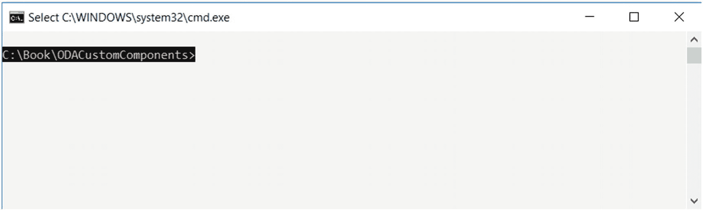
图 10-1
自定义组件位置
在上述位置，您将创建一个名为 `ageValidatorCC` 的目录。在命令行中使用以下命令：
```
mkdir ageValidatorCC
```
创建完成后，使用以下命令导航到 `ageValidatorCC` 目录：
```
cd ageValidatorCC
```
下一步是将您的项目目录（即 `ageValidatorCC` 目录）配置为一个 `node` 项目。使用以下命令：
```
npm init -y
```
这将在 `ageValidatorCC` 目录内生成一个默认的 `package.json`。您稍后可以更新此 `package.json` 文件，添加项目特定的详细信息。请参考图 10-2。
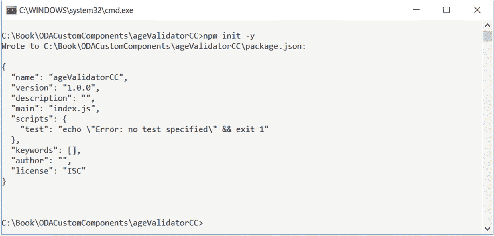
图 10-2
配置一个 `node` 项目
接下来，使用以下命令将 `Oracle Bots Node SDK` 添加到您的项目目录：
```
npm install --save-dev @oracle/bots-node-sdk
```
如果您现在导航到 `ageValidatorCC` 目录，您会注意到该目录包含上一步创建的 `package.json`，以及 `node_modules` 目录中新增的 `node` 模块。
接下来，您需要添加一个 JavaScript 文件，用于编写您的自定义逻辑。为此，请使用以下命令：
```
bots-node-sdk init -c AgeValidator
```
完成后，您将看到一条消息，显示“自定义组件包‘ageValidatorCC’创建成功！”。这将在您的目录中创建组件包并添加依赖项。请参考图 10-3。
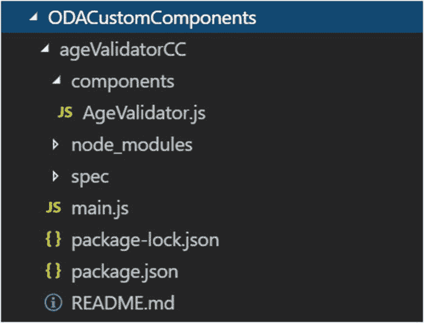
图 10-3
自定义组件包
恭喜！您现在已经成功创建了第一个自定义组件。如果您之前有使用 `node` 项目的经验，那么您一定对图 10-3 中显示的文件很熟悉。但如果没有，我们将简要介绍您主要关心的文件：
`package.json`：此文件包含您项目的特定元数据信息。这包括对项目入口点的引用（在本例中为 `main.js`），以及项目的 JavaScript 依赖项。要了解更多信息，请参考以下链接：
[`https://docs.npmjs.com/files/package.json`](https://docs.npmjs.com/files/package.json)
`main.js`：如前所述，此文件是自定义组件项目的默认入口点。您会注意到此文件引用了组件目录，您将在其中添加自定义组件实现。请参考以下 `main.js` 的代码：
```
module.exports = {
components: [
'./components'
]
};
```
即使您在组件目录中实现了多个组件，您也可以通过指定组件名称来简单地访问特定组件。您无需修改 `main.js` 中的任何内容即可访问它。例如，就像您添加了 `AgeValidator` 组件一样，您也可以在组件目录中添加另一个组件 `GetUserProfile` 来检索用户配置文件信息。
在此上下文中，另一个重要点是在创建组件时创建某种逻辑分组。例如，您可能希望将 `AgeValidator` 和 `GetUserProfile` 配置文件组件放在 `components` 内的不同目录中，以隔离不同的实现。您可能想要更改的一件事是给您的父文件夹起一个通用名称，例如 `odaCustomComponentCC`，而在本例中它是 `ageValidatorCC`。
虽然这不是必须的，但这是一个值得遵守的良好实践。毕竟，它将帮助您以及您的团队成员理解代码实现，并在出现问题时准确定位到特定组件。
`AgeValidator.js`：这是您的自定义组件的 JavaScript 实现，位于 `components` 目录下。图 10-4 向您展示了执行 `bots-node-sdk init -c AgeValidator` 时生成的默认自定义组件实现。
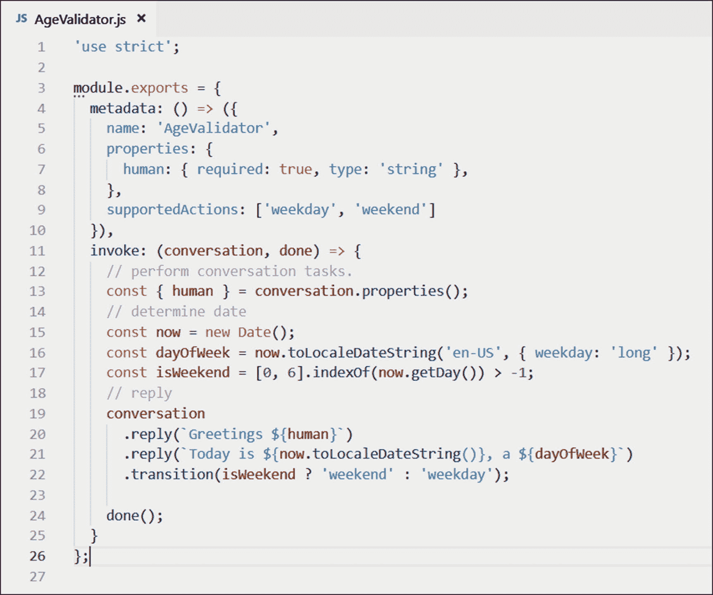
图 10-4
自定义组件默认实现
如您所见，`AgeValidator` 默认暴露了两个不同的函数。它们是 `metadata` 和 `invoke`。让我们在这里更详细地讨论它们：
`metadata: ():` 如您所见，此函数保存组件的元数据信息。`metadata` 函数由三个不同的属性组成。
*   `name`：这是标识您组件的唯一名称。
*   `properties`：这是一个对象，包含组件执行所必需的参数。
*   `supportedActions`：这些是您的组件支持的操作，您可以根据条件从组件中调度这些操作。基于这些操作，您可以在机器人流程中定义状态转换操作。
`invoke: (conversation, done):` `invoke` 函数接受两个参数，即 `conversation` 和 `done`。`conversation` 是对自定义组件 SDK 的引用。您可以使用其函数来读取从机器人发送到自定义组件的消息，并根据这些消息编写组件响应。例如，假设您在 `properties` 部分中定义了一个变量 `userAge` 及其类型，您期望它作为自定义组件的输入参数。一旦您从技能中传递了 `userAge` 值，要在自定义组件中获取该值，您可以使用以下代码：
```
var givenAge = conversation.properties().userAge;
```
同样，您也可以在 `properties` 部分中定义一个变量（例如 `ccResult`）及其类型。然后使用此变量通过如下设置将值传递回您的机器人：
```
conversation.variable(ccResult, ccCalculatedVal);
```
一旦您的自定义组件完成处理，并且您希望将控制权交还给机器人对话流程，您将调用 `done()`，这是一个回调函数。例如，您可以在按照上述代码为变量设置计算值后立即调用 `done()`。因此，它看起来如下所示：
```
conversation.variable(ccResult, ccCalculatedVal);
done();
```

## 在本地运行自定义组件

现在您已准备好自定义组件的基本实现，下一步是在本地运行它。请参考图 10-3 查看项目的目录结构。
导航至包含自定义组件 `ageValidatorCC` 的父目录 `ODACustomComponents`，以启动节点服务器。请参考图 10-4。
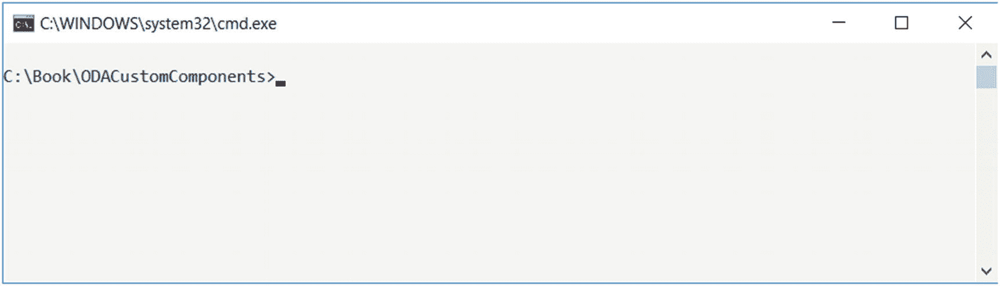
图 10-5 – 自定义组件父目录
使用命令提示符/终端，执行如图 10-6 所示的以下命令来启动节点服务器：
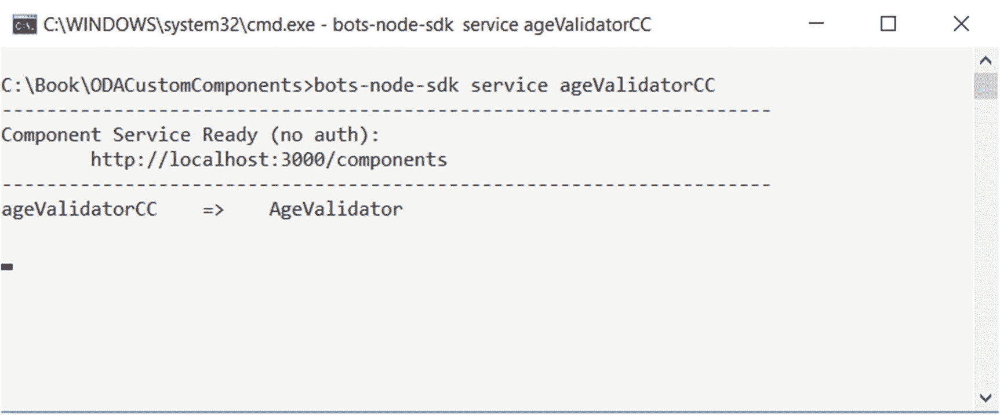
图 10-6 – 启动节点服务器
```
bots-node-sdk service ageValidatorCC
```
现在您的组件已在本地机器上运行，您可以通过在浏览器中导航至 URL `http://localhost:3000/components` 来检查它。其显示效果将如图 10-7 所示。
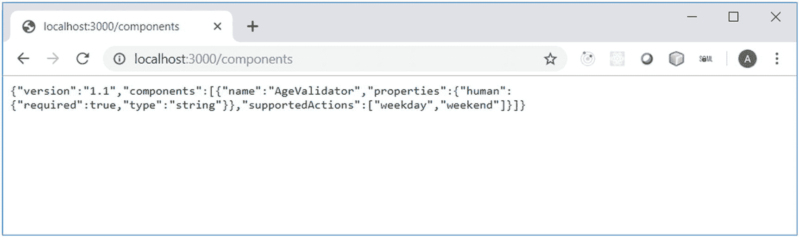
图 10-7 – 在本地机器上运行的自定义组件
在上述内容中，您可以看到基于初始实现的组件中的各种元数据信息。当您在本章后续部分更改 `AgeValidator` 的实现时，您会注意到这些元数据信息也会根据您的新实现而发生变化。

## 通过互联网公开自定义组件

到目前为止，您已在本地机器上成功创建了第一个自定义组件，并使用 `Oracle bots-node-sdk` 在本地节点容器中启动了它。您还使用 Web 浏览器测试了正在运行的组件。现在，您距离从 ODA 实例访问自定义组件仅一步之遥。为此，您需要通过互联网公开您的 IP，以便使用该 IP 访问您的服务。现在，您将使用 `ngrok` 来完成此操作。
导航到您在本地机器上下载并解压 `ngrok.exe` 的目录。到达后，运行 `ngrok`。`ngrok` 允许您生成一个主机名，通过该主机名您可以通过互联网访问您的机器。您需要告诉 `ngrok` 您打算公开哪个端口，在本例中为 `3000`。
运行 `ngrok` 后，只需执行以下命令即可通过互联网公开您的机器：
```
ngrok http 3000
```
请参考图 10-8。
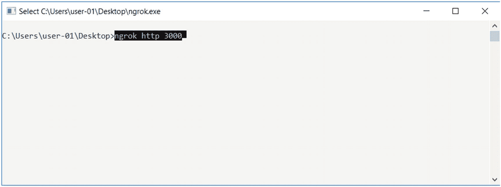
图 10-8 – 运行 `ngrok.exe`
完成后，您需要从 `ngrok` 复制 `https` 实例，并将其替换为您的 `http://localhost:3000`。请参考图 10-9 查看具体需要复制的内容。
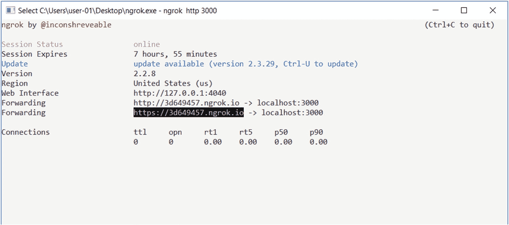
图 10-9 – `ngrok` https 主机
根据上图，您的自定义组件将通过 [`https://3d649457.ngrok.io/components`](https://3d649457.ngrok.io/components) 进行访问。您可以通过在 Web 浏览器中访问此 URL 来检查。请查看图 10-10。
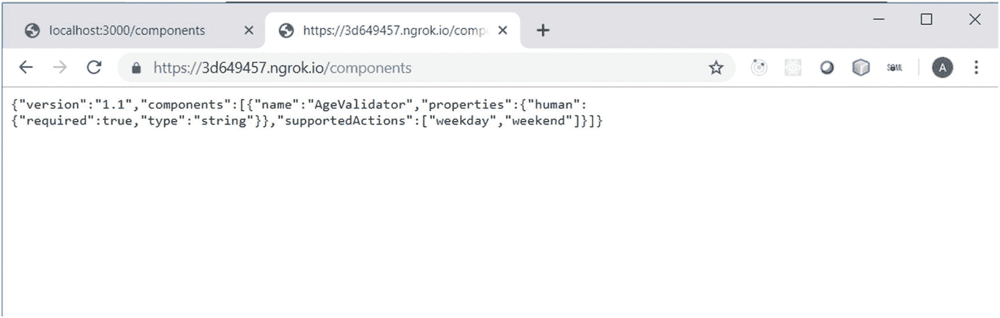
图 10-10 – 使用公共 URL 访问自定义组件

## 注意

您使用 `ngrok` 生成的主机在每次关闭 `ngrok` 应用程序或会话过期时都会发生变化。过期的主机将无法再访问。但是，通过免费订阅 `ngrok` 可以创建永久主机名。

## 从 ODA 实例访问自定义组件

现在您已拥有在本地运行且可通过互联网访问的自定义组件，让我们看看如何从您的 ODA 实例访问它。
登录您的 ODA 实例，并导航到您想要使用该组件的技能。在本例中，我们希望从您在本书第 5 章创建的 `FindTrip` 技能（图 10-11）中访问此自定义组件。
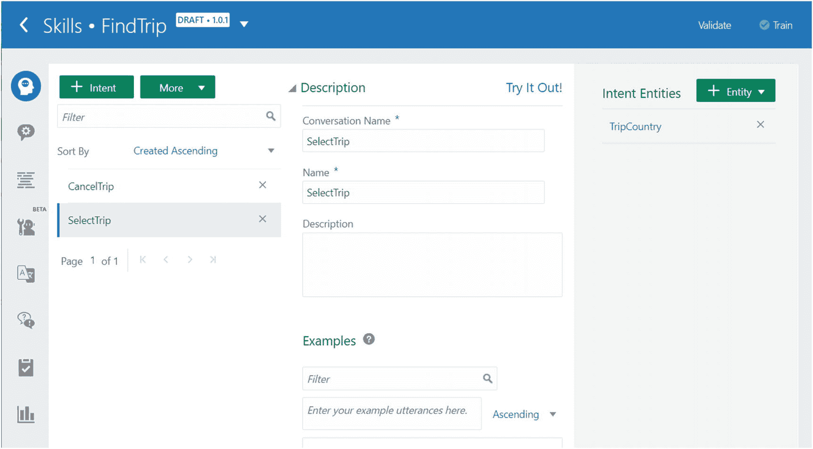
图 10-11 – `FindTrip` 技能
从左侧菜单项中，单击  组件。您在屏幕的“自定义”选项卡上创建自定义组件。由于您尚未将任何自定义组件服务关联到该技能，屏幕显示如图 10-12 所示。
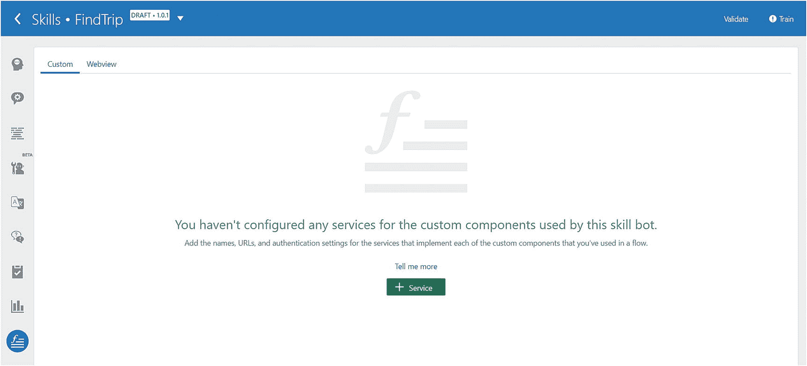
图 10-12 – ODA 组件屏幕

单击  按钮以创建新的自定义组件服务。这将打开一个新窗口，如图 10-13 所示。

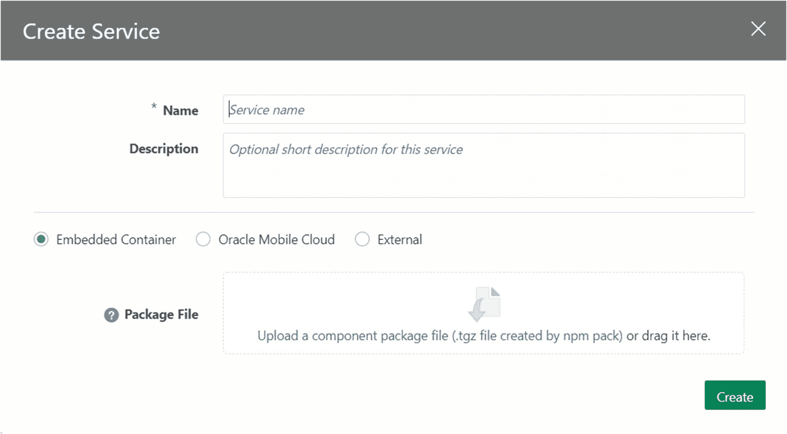

从图 10-13 中，您可以看到可以通过三种不同的方式创建自定义组件服务：

*   **嵌入式容器**：当您想要将自定义组件部署在 ODA 实例内嵌的节点容器中时，将使用此方法。此方法将在本章后续部分进行说明。一旦您的自定义组件准备就绪，您将使用此方法。
*   **Oracle Mobile Cloud**：如果您想将自定义组件作为 API 服务公开，可以使用此方法。对于此方法，您需要设置一个 Oracle Mobile Hub。
*   **外部**：如果您想使用部署并运行在外部节点容器上的自定义组件，将使用此方法。此方法适用于我们的情况，因为我们已经在本地环境中启动并运行了该组件。作为替代方案，您也可以使用任何支持 Node 的服务器。您可以在其中创建节点平台并托管您的自定义组件。

从“创建服务”窗口中选择**外部**，并填写详细信息，如图 10-14 所示。

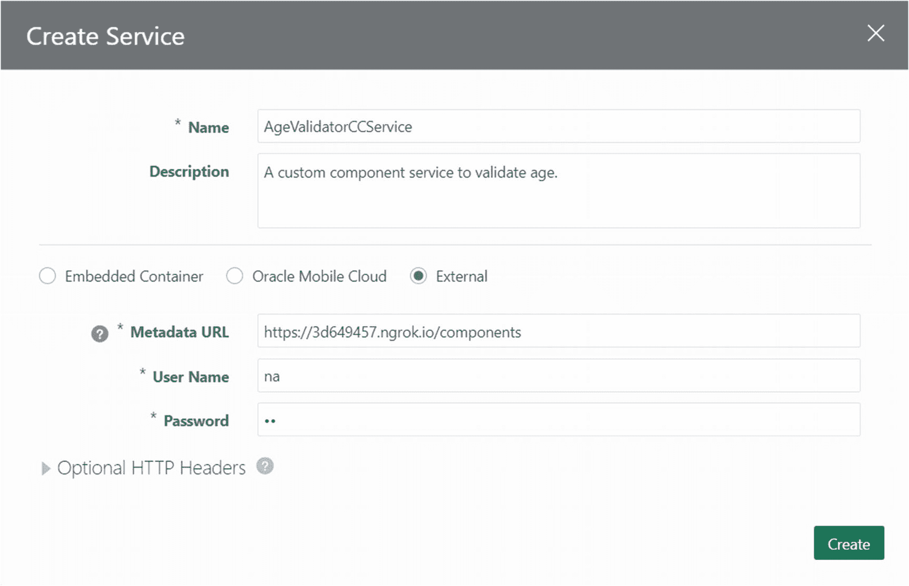

`用户名`和`密码`在调试时不是必需的。但由于这些是配置中的必填字段，您需要提供它们。

完成后，单击  按钮完成该过程。根据您在 `package.json` 中定义为依赖项的自定义组件中使用的节点模块，这可能需要一些时间。完成后，您将看到一个显示自定义组件详细信息的新屏幕。请参考图 10-15。

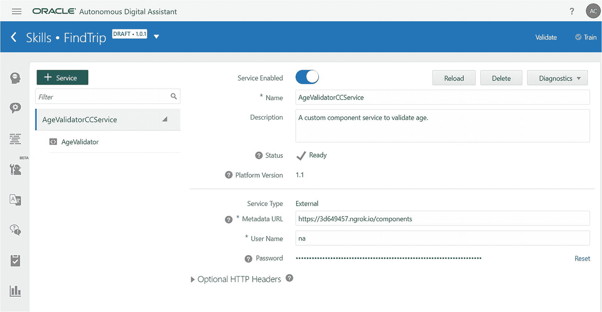

现在您可以看到，您的自定义组件服务可从 ODA 实例访问，并已准备好用于 `FindTrip` 技能的对话流程中。

## 后续章节概览

在后续章节中，你将使用自己的代码更新组件的默认实现，以验证年龄、打包自定义组件，并将其部署到嵌入式容器。最后，你将从机器人对话流中调用该自定义组件。

## 更新自定义组件实现与本地调试

在本节中，你将实现年龄验证的逻辑，并在本地调试组件以排查问题。将以下代码片段复制到你的 `AgeValidator.js` 文件中：

```javascript
'use strict';
module.exports = {
metadata: () => ({
name: 'com.hiking.AgeValidator',
supportedActions: ['allowed', 'denied']
}),
invoke: (conversation, done) => {
// 执行对话任务。
const userInput = conversation.text();
// 确定年龄
// const minBookingAge = 18;
let age = 0;
if (userInput){
const matches = userInput.match(/\d+/);
if (matches) {
age = matches[0];
} else {
conversation.invalidUserInput("年龄输入无法识别，请重试");
done();
return;
}
} else {
var errText = "未提供年龄输入";
conversation.logger().error(errText);
done(new Error(errText));
return;
}
conversation.logger().info('AgeValidator: 用户输入的年龄=' + age);
conversation.transition( age >= minBookingAge ? 'allowed' : 'denied' );
done();
}
};
```

让我们简要概述这些更改。作为上述更改的一部分，你已更新了默认实现中的 `metadata` 和 `invoke` 函数。在 `metadata` 函数中，你将组件名称从 `"AgeValidator"` 更新为 `"com.hiking.AgeValidator"`。这为你的组件赋予了唯一名称。虽然这不是强制步骤，但这样做可以让你对组件包及其包含的组件进行分类。这进一步有助于降低与其他机器人设计者可能添加的自定义组件发生命名冲突的风险。随着自定义组件规模的扩大，这种命名方式将变得非常实用。

然后，你移除了 `properties` 对象（该对象之前是默认实现的一部分），因为此处不需要它，同时更新了 `supportedActions`。在本节后续内容中，你将看到这些操作如何用于对话流中的状态导航。

接下来，你更新了 `invoke` 函数，使用 `conversation.text()` 方法获取用户响应并将其存储在变量中。然后，你使用正则表达式从存储用户响应的变量中提取了年龄的数值。之后，你添加了条件来验证年龄并针对这些条件做出响应。请仔细查看此实现中使用的各种 `conversation` 方法。

本地调试的主要好处是，它允许你逐步执行代码并查找问题（如果有的话）。

好了，现在你的实现已经就绪，请保存文件。然后，通过导航到父目录（本例中为 `ODACustomComponents`）重启你的自定义组件 `ageValidatorCC`。使用以下命令，如前文“在本地运行自定义组件”部分所述：

```
// 在现有命令窗口中使用 ctrl+c 停止现有进程
bots-node-sdk service ageValidatorCC
```

### 注意

每次对本地组件进行更改并保存后，都需要使用上述命令重启本地 Node 容器。

如果你现在从本地机器通过浏览器访问 `http://localhost:3000`，你会注意到 `AgeValidator.js` 中的这些新更改已生效。请查看图 10-16。

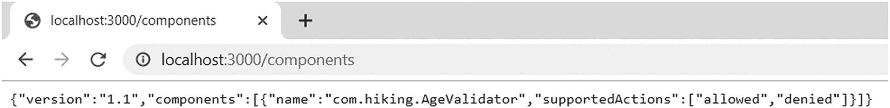

如果你的 ngrok 会话仍然有效，你只需在 ODA 实例中重新加载自定义组件即可。为此，你需要点击 ODA 中“组件”屏幕右上角的  按钮。

如果你的 ngrok 会话已过期或终止，你需要按照“通过互联网公开自定义组件”部分所述，使用 ngrok 重新生成主机名。为端口 3000 生成新的主机名后，你需要在“组件”屏幕上更新元数据 URL。请参考图 10-17 中突出显示的部分。

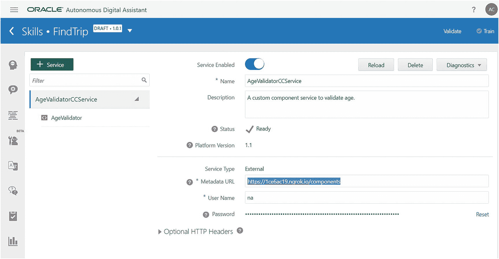

假设你的自定义组件已在本地运行，并且按照上述说明可在 ODA 中访问，那么现在是时候从机器人的对话流中调用该自定义组件了。从左侧菜单导航到  流程。进入“流程”屏幕后，按如下方式更新对话流：

```yaml
metadata:
platformVersion: 1.0.1
main: true
name: FindTrip
context:
variables:
states:
intent:
component: "System.Intent"
properties:
variable: "iResult"
transitions:
actions:
SelectTrip: "askAge"
CancelTrip: "cancelTrip"
unresolvedIntent: "unresolved"
askAge:
component: "System.Output"
properties:
text: "你多大了？"
transitions:
next: "validateAge"
validateAge:
component: "com.hiking.AgeValidator"
properties:
transitions:
next: "bookTrip"
actions:
denied: "underAge"
bookTrip:
component: "System.Output"
properties:
text: "您很快就能使用 Travvy 预订行程了"
transitions:
return: "done"
underAge:
component: "System.Output"
properties:
text: "您不符合使用 Travvy 预订行程的最低年龄要求。"
transitions:
return: "done"
cancelTrip:
component: "System.Output"
properties:
text: "您很快就能使用 Travvy 取消行程了"
transitions:
return: "done"
unresolved:
component: "System.Output"
properties:
text: "抱歉，我不理解您的意思。请重试。"
transitions:
return: "done"
```

作为上述机器人流程的一部分，你首先使用了 `"System.Intent"` 组件来识别意图。这些意图与你在第 5 章中创建的意图相同。根据 `System.Intent` 组件的意图解析结果，你定义了与这些意图对应的状态。请注意，只有当意图被解析为 `SelectTrip` 时，你才会进行年龄验证，否则不会。

检查 `"askAge"` 状态，在该状态中你要求用户提供其年龄，然后转换到 `"validateAge"` 状态。该状态正在调用你的自定义组件。然后，根据自定义组件的响应，你将机器人句柄传递给不同的状态。

由于技能实现尚处于早期阶段，你只会为各种状态显示静态文本内容。这并没有什么问题，而且也满足了自定义组件实现的目的。随着机器人的发展，这些文本可以轻松更新为更合适的机器人响应。

现在您已经清楚了解了在自定义组件实现和机器人流程中所做的更改，接下来让我们使用 `Skill Tester` 来测试技能。从左侧菜单中，单击  打开 `Skill Tester`。在消息区域输入“我想预订一次旅行”，参考图 10-18，然后按 Enter 键。

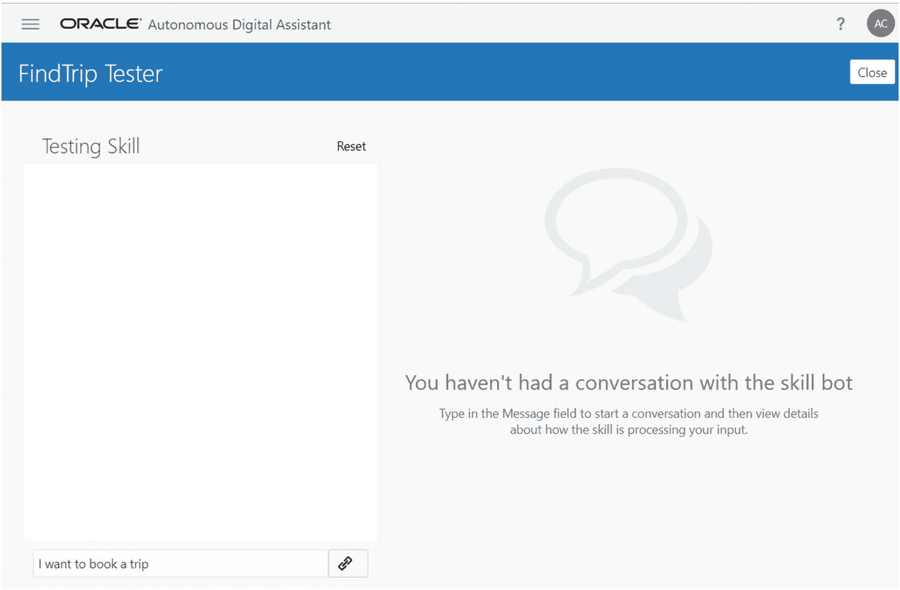

当您输入年龄时发生了什么？您是否在 `Skill Tester` 中看到了如图 10-19 所示的错误消息？

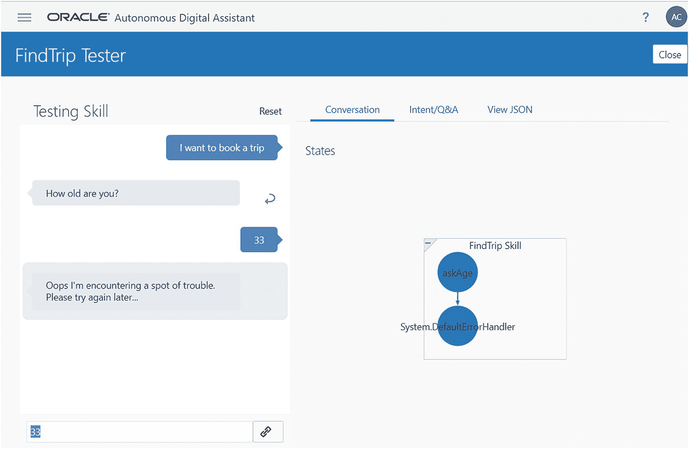

您没想到会这样，对吧？没关系，这给了您一个调试代码的机会。

由于您在之前章节中完成了自定义组件开发的本地设置，因此调试问题和识别错误变得容易得多。让我们检查一下本地机器的命令提示符中是否有任何错误。您看到任何错误了吗？有一个。请参考图 10-20。

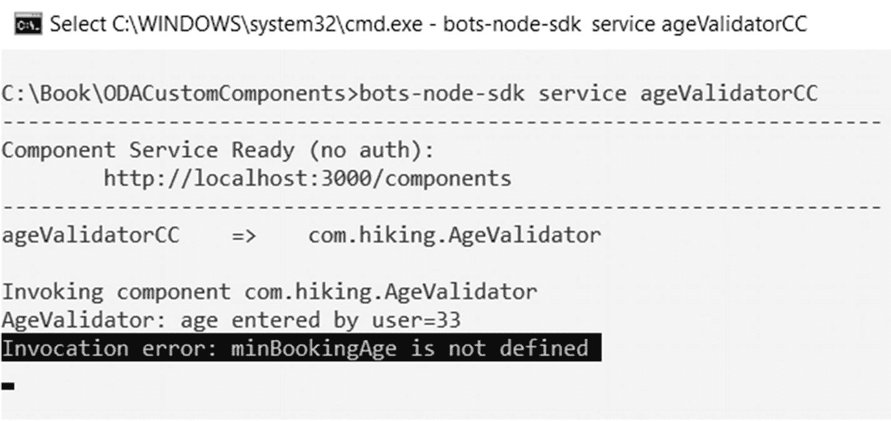

我们在实现 `AgeValidator.js` 逻辑的过程中故意引入了这个错误，以演示如何在本地调试代码。

检查您的 `AgeValidator.js` 文件，并取消定义变量 `minBookingAge` 的那行代码的注释。以下是代码更改：

从：

`// const minBookingAge = 18;`

改为：

`const minBookingAge = 18;`

更新后，重新启动组件服务。通过单击  按钮重置您的 `Skill Tester`，并测试相同的场景。这次将会成功，您将收到如图 10-21 所示的响应。

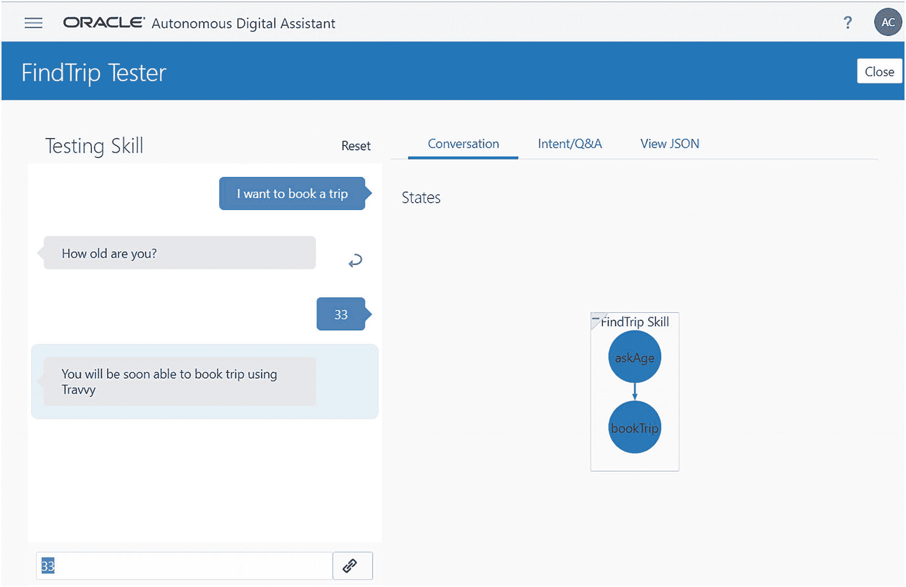

在本节中，您已成功实现了自定义组件，并从 `FindTrip` 技能中调用了该组件。您还实现了机器人流程来调用该自定义组件。

您可能还想查看 `PizzaBot` 中类似的自定义组件实现，这是 Oracle 作为 ODA 实例一部分提供给您的示例技能之一。该技能在允许您订购披萨之前会检查您的年龄。您在本节中实现的自定义组件也受到了相同概念的启发。

现在，您的自定义组件已在本地环境中准备就绪，并且您已经对其进行了测试，这将带您进入本章的最后一节，您将了解如何将自定义组件部署到 ODA 实例中的嵌入式容器。让我们来看看。

## 将自定义组件部署到 ODA 实例中的嵌入式容器

要将自定义组件部署到 ODA 实例中的嵌入式容器，您首先需要打包您的组件。您的自定义组件实现或技能的对话流程将完全不需要更改。

打开命令提示符，导航到系统中您创建自定义组件实现的 `ageValidatorCC` 目录。在那里，执行以下命令：

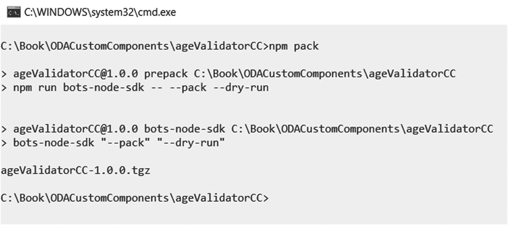

```
npm pack
```

如图 10-22 所示，这会在 `ageValidatorCC` 目录内生成一个名为 `ageValidatorCC-1.0.0.tgz` 的归档文件。

接下来，通过单击左侧菜单中的  按钮导航到“组件”屏幕。

在“组件”屏幕上，您首先需要删除引用本地机器上运行的组件的现有部署。为此，请单击屏幕右上角的  按钮。单击该按钮后，您将看到一个要求您确认删除组件的新窗口。同意该操作。

现在，您应该会看到一个空的“组件”屏幕，屏幕中央有一个  按钮。您将再次开始创建新组件服务的相同过程。单击“服务”按钮，这次填写嵌入式容器的详细信息，如图 10-23 所示。

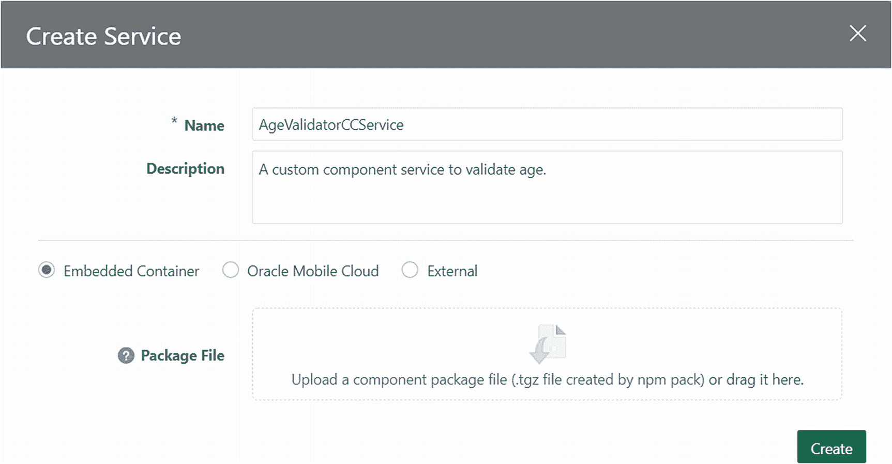

填写详细信息后，将 `ageValidatorCC-1.0.0.tgz` 归档文件拖放到“包文件”部分。

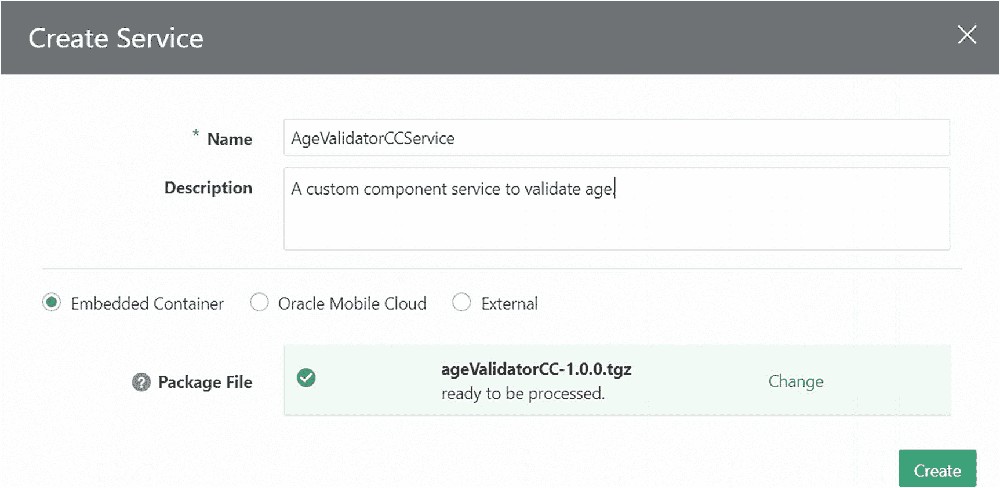

单击如图 10-24 所示的“创建”按钮来创建服务。等待一段时间，直到部署完成。完成后，您应该会看到如图 10-25 所示的屏幕。

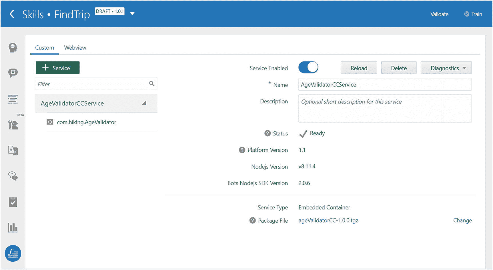

### 部署与验证

请注意，与组件相关的所有详细信息与之前保持一致，只是这次您可以看到“`服务类型`”为“`嵌入式容器`”，其中显示了您刚刚上传的包。

除此之外，通过单击“`诊断`”按钮，您会得到两个选项，即“`查看日志`”和“`查看崩溃报告`”。您可以使用这些选项分别检查自定义组件的日志和崩溃报告。

现在，您应该重新执行前面讨论的`旅行预订测试场景`，并尝试不同的年龄以查看结果。

### 总结

每当您想要实现内置组件无法支持的功能时，自定义组件就成为技能开发中不可或缺的一部分。在本章开始时，您了解了自定义组件，到本章结束时，您已经准备好了一个部署在`嵌入式容器`中并运行的自定义组件。到现在，您一定已经意识到拥有一个本地开发环境对于能够在您的机器上创建、运行和调试自定义组件是多么重要。您现在也了解了在 `ODA` 实例中为您的技能创建自定义组件服务的不同方法。希望您觉得这个主题很有趣，我们下一章再见。