# 11. 为您的数字助手添加语音和情感


## 引言

在本节的前几章中，您学习了如何基于 Oracle 技术构建一些非常智能的数字助手。它们在多种渠道上都能良好运行，并涵盖了您能想到的大多数用例。在本章中，您将学习如何为数字助手增添额外维度。首先，您将学习如何通过情感分析来丰富数字助手，接着学习如何为数字助手添加语音功能。阅读本章时，您将清楚认识到，这两项新增功能都基于对前几章所学知识的巧妙运用。

## 情感分析

如果您想创建一个行为更接近人类而非机器人的聊天机器人，它应当能够理解用户所说的话，甚至能理解上下文、语气以及诸如讽刺等细微差别。实现这种行为最显而易见的方式就是引入情感分析。

根据词典定义，情感分析是"*通过计算方式识别和分类文本中表达的观点，特别是为了判断作者对特定主题、产品等的态度是正面、负面还是中性的过程。*"

当您为机器人添加情感分析功能后，它将能更好地理解用户。如果机器人能感知用户是满意、沮丧还是愤怒，它就能更好地解析意图，并很可能让技能的反应更不像机器人，而更像人类。这能提升用户满意度，进而对您的业务产生积极影响。这一切都基于人类心理学。感到快乐或中性的人往往更能接受坏消息或挫折，而悲伤、失望或愤怒的人则耐心非常有限。

要实现这一点，您必须非常谨慎。过去，像微软的 Tay 聊天机器人这样的实验就失败了。Tay 仅仅通过与用户互动就变成了恐同、种族主义和纳粹分子。Tay 基于用户的回应进行学习，而用户反过来又教会了 Tay 成为一个"坏机器人"。您很容易理解，这绝不应发生在您公司的机器人身上。诸如语法、讽刺与挖苦、措辞选择、文化差异以及任何对人类来说非常正常的因素，都必须加以考虑，并且可能影响机器人的回应。对此没有简单的解决方案。因此，每当您决定为机器人添加情感分析时，必须确保不会损害您品牌的形象和声誉。

为了在 Oracle 数字助手中添加此类功能，您可以使用第三方服务，因为 Oracle 数字助手没有内置的解决方案。

## 实施前需要考虑什么？

在聊天机器人的背景下，情感分析可以通过多种方式实现，但实施方式始终应受您的需求影响。出于商业目的调用任何第三方 API 都会涉及成本。因此，在开始实施之前，了解范围和可用预算至关重要。

明确了这些事实后，让我们考虑几个现实场景。恶意用户经常通过提出无关问题来试图破坏机器人流程，例如："你是男是女？"、"天气怎么样？"、"你是机器人吗？"、"你爱我吗？"等等。您应该尝试在一开始就打断任何此类对话，并尝试将用户引导回机器人的上下文。处理此类对话最常见的方法是将它们添加到技能的 `unresolvedIntent` 中。或者，您也可以在技能中创建一个特定的意图来处理此类对话。这可以是一个专门的"闲聊"技能，让数字助手能够应对此类问题并保持对话进行。使用技能的 Insight 功能密切关注此类对话，并不断将这些用户输入添加到 `unresolvedIntent` 或您的特定意图中。

另一种可能的方式是，如果您通过数字助手而非直接在渠道上暴露技能，可以添加一个明确的技能来处理此类闲聊对话。如果您希望实施这种方法，则无需将上述用户输入添加到任何特定意图或 `unresolvedIntent` 中。相反，您在专门的技能中创建意图来处理此类对话，并让数字助手负责路由。这种方法允许您保持业务特定技能背后的逻辑清晰。

如果上述方法并非您所寻找的，而您更希望依赖更复杂的方法，那么使用第三方 API 是前进的方向。如前所述，使用第三方 API 总是会产生成本，但它们也带来各种好处。最重要的是，在使用此类 API 服务时，您无需在技能或数字助手中实现任何复杂功能来分析用户情感。由于这些 API 是为高度商业化的目的而构建的，您可以信赖它们分析用户输入的精确性。

此类 API 将用户输入大致分为三类：正面、中性和负面。但也有服务提供更多类别，例如极度正面或非常正面，以及极度负面或非常负面。在使用此类服务时，根据它们对用户输入的分析结果，您可以设计机器人的适当对话流程。例如，考虑一个场景，您根据 API 结果向最终用户发送反馈表单。

目前有多种商业 API 可用于情感分析。以下是一些流行的情感分析 API 列表：

* Google 情感分析
* IBM Watson 语调分析器 API
* Qemotion
* AYLIEN API
* PreCeive API
* MoodPatrol API
* Indico API
* ParallelDots
* DeepAI

为了使用您选择的任何情感分析 API，您首先需要在其网站上向 API 提供商注册。这将使您获得访问令牌。使用该令牌，您就可以从聊天机器人调用 API。这个过程应该相当简单，并且由于您可以选择任何可用的 API 提供商，这完全取决于您。通常，这些第三方在设置期间会提供一个密钥或令牌，在调用其 API 时应使用该密钥或令牌。我们建议您将访问令牌放在手边，因为在接下来的章节中会用到它。

## 从文本分析情感

为了使用任何第三方 API 服务分析文本，您只需将用户的输入从技能传递给 API。然后 API 分析输入值并返回结果。根据 API 的结果，您可以设计聊天机器人的流程。

要从技能调用情感分析 API，您将使用自定义组件。自定义组件已在第 10 章中详细讨论过。

这个过程将很直接。在调用自定义组件时，您需要将用户输入从技能传递给自定义组件。在自定义组件内部，您将从 `invoke` 函数的 `conversation` 参数中提取用户输入（`conversation` 是对 `bots-node-sdk` 的引用）。然后，您将提取的输入传递给情感分析 API。调用情感分析 API 的方式可能因提供商而异，您需要注意这一点。一旦收到 API 结果，就将其从自定义组件传回技能。这就是您需要做的全部工作。这些步骤中的每一步都将在下一节中进一步详细描述。


## 情感分析 API 的调用

在您的 Oracle Digital Assistant 环境中创建一个技能，并将其命名为`TravvySentimentAnalysis`。目前，该技能将仅以实现情感分析演示所需的最基本功能来实现。在`Flows`中添加以下代码：

```
#metadata: information about the flow
### platformVersion: the version of the bots platform that this flow was written to work with
metadata:
platformVersion: "1.0"
main: true
name: TravvySentimentAnalysis
#context: Define the variables which will used throughout the dialog flow here.
context:
variables:
#states is where you can define the various states within your flow.
states:
askFeedback:
component: "System.Output"
properties:
text: "How was your experience with Travvy?"
transitions:
next: "checkFeedback"
checkFeedback:
component: "com.hiking.SentimentAnalysis"
properties:
transitions:
actions:
Positive: "Positive"
Negative: "Negative"
Neutral: "Neutral"
Positive:
component: "System.Output"
properties:
text: "Thanks for your positive feedback"
transitions:
return: "done"
Negative:
component: "System.Output"
properties:
text: "Thanks for your response. Apologies for a bad experience"
transitions:
return: "done"
Neutral:
component: "System.Output"
properties:
text: "Thanks!"
transitions:
return: "done"
```

在第一个状态`askFeedback`中，您将请求用户提供对 Travvy 的反馈。一旦用户做出回应，您将在`checkFeedback`状态中调用自定义组件`com.hiking.SentimentAnalysis`。在后续步骤中，将根据自定义组件的操作响应执行状态转换。

接下来，按照第 10 章中向您介绍的步骤，创建一个名为`sentimentAnalysisCC`的自定义组件。完成后，在您的自定义组件内部创建一个名为`SentimentAnalysis.js`的 JavaScript 文件。同一章 10 中也对此进行了说明。之后，在`SentimentAnalysis.js`中添加以下代码：

```
var request = require('request');
module.exports = {
metadata: () => ({
name: 'com.hiking.SentimentAnalysis',
supportedActions: ['Positive','Negative','Neutral']
}),
invoke: (conversation, done) => {
// perform conversation tasks.
// retrieve user input and store it into a variable
const userInput = conversation.text();
// Invoke API
request.post({
url: 'https://api.deepai.org/api/sentiment-analysis',
json: true,
headers: {
'Api-Key' : 'YourAPIKeyGoesHere',
},
form: {
'text': userInput,
}
}, function(error, response, body){
if (response.statusCode === 200) {
if (body.output[0] === 'Positive') {
conversation.transition('Positive');
done();
return;
} else if (body.output[0] === 'Negative') {
conversation.transition('Negative');
done();
return;
} else if (body.output[0] === 'Neutral') {
conversation.transition('Neutral');
done();
return;
}
} else {
conversation.logger().error(errText);
conversation.transition();
done();
return;
}
});
}
};
```

上述代码片段中描述的步骤已添加了内联注释。在此案例中，我们使用了 DeepAI 的情感分析 API。用上述更改更新您的自定义组件后，您需要做的就是打包和部署。同样，自定义组件的打包和部署在第 10 章中有详细描述。

完成这些步骤后，您应该尝试测试此技能。您可以为此使用内置的技能测试器。图 11-1 展示了您在本节中到目前为止所做工作的一个简单测试用例。

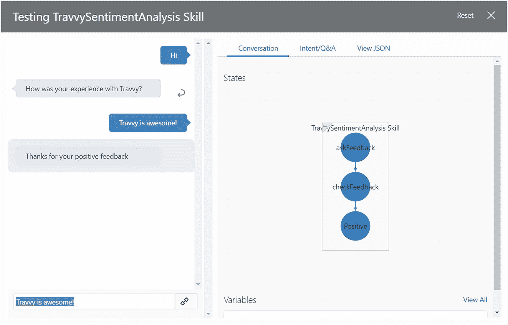

图 11-1

文本情感分析

## 语音

如今，支持语音的个人助手（如 Google Home、Amazon Alexa、Apple Siri、Microsoft Cortana 等）的使用越来越广泛。如果您能为 Oracle Digital Assistant 添加语音功能会怎样？正如您已经了解的，Digital Assistant 可以通过几个预定义的渠道进行公开。其他非开箱即用的渠道也可以使用，但要做到这一点，您必须使用 HTTP `webhook channel`，并将 Digital Assistant 与该渠道手动集成。

关键问题是：语音能否被视为一个独立的渠道？如果可以，如何在 Oracle Digital Assistant 中配置和实现它？显然，问题第一部分的答案是肯定的。语音可以被视为一个独立的渠道，更准确地说，您需要为 Amazon Alexa、Google Home 等分别定义独立的渠道。

解决了这个问题，您现在将学习如何为 Oracle Digital Assistant 实现语音功能。

## 注意

在撰写本书时，Amazon Alexa、Google Home 和其他第三方提供商服务是唯一通过语音渠道公开 Oracle Digital Assistant 的方式。Oracle 最近收购了 speak.ai，并正在努力实现自己的语音引擎并将其添加到 Oracle Digital Assistant 中。当该功能就位后，您仍然可以使用第三方解决方案，但 Oracle 随后为您提供了完全嵌入在 Oracle Digital Assistant 中启用语音交互的选项，而无需依赖第三方服务。

### 您需要什么？

在学习如何实现 webhook 渠道之前，您首先需要了解什么是 webhook 以及它是如何工作的。简而言之，webhook 在技术上是一种“使用 HTTP 进行的用户定义回调”。Webhook 通常用于连接两个不同的应用程序。当触发应用程序上发生事件时，它会向操作应用程序的 webhook URL 发送（POST）数据。Webhook 使用“事件反应”（不要调用我们，我们会调用您）的概念。这个概念避免了接收端向发送端持续轮询的需要。

要在 Oracle Digital Assistant 中创建 webhook 渠道，您需要以下内容：

*   一个可公开访问的 HTTP 消息服务器，它使用 webhook 在用户设备和您的机器人之间中继消息。通常，在 Oracle 云环境中，您会使用 Oracle 计算实例来托管它，但任何节点服务器都可以。您使用 node 实现此 webhook，并且它需要实现以下两个端点：
    *   一个用于从我们的机器人接收消息的 POST 端点
    *   一个用于向我们的机器人发送消息的 POST 端点

*   接收您机器人消息的 webhook 调用的 URI（以便机器人知道将消息发送到哪里）。

*   完成“创建渠道”对话框后为您的机器人生成的 webhook URL（以便消息服务器可以访问您的机器人）。

为了使所有这些部分协同工作，形成一个基于 webhook 的可行解决方案，您需要设置节点服务器，在 Digital Assistant 上配置 webhook 渠道，编写用于传入和传出 webhook 的 Node.js 实现，并配置语音引擎。

## 注意

为了解释如何向 Oracle Digital Assistant 添加语音，这里使用了 Amazon Alexa。其他平台（如 Google Assistant）只要支持 webhook，也可以以相同的方式添加。

图 11-2 展示了此解决方案的整体架构：

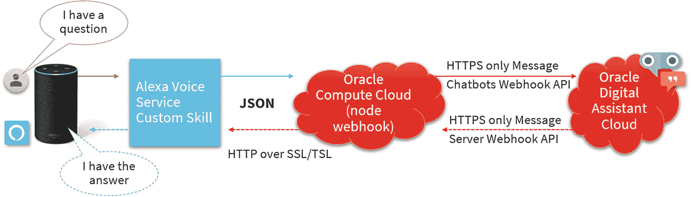

图 11-2

Digital Assistant 到 Alexa 的架构

## 注意

Alexa 应用节点包的扩展文档可以在[`www.npmjs.com/package/alexa-app`](http://www.npmjs.com/package/alexa-app)找到。

您甚至可以通过使用`ssml-builder`来操纵输出，从而改变 Alexa 的说话方式。`ssml-builder /amazon_speech`节点包可以向输出中添加 Alexa 特定的 SSML 标签，从而指示 Alexa 以不同的方式说话。


## 注意

`ssml-builder` 节点包的扩展文档可在 [`www.npmjs.com/package/ssml-builder`](http://www.npmjs.com/package/ssml-builder) 找到。

## 语音合成标记语言 (SSML)

语音合成标记语言 (SSML) 是一种基于 XML 的标记语言。SSML 允许开发者指定如何使用文本转语音服务将输入文本转换为合成语音。SSML 使开发者能够微调文本转语音输出的音高、发音、语速、音量等。标点符号（例如句号后的停顿，或句子以问号结尾时使用正确的语调）会自动处理。

万维网联盟 (W3C) 有一项关于语音合成标记语言的推荐标准，可在此处找到：[`www.w3.org/TR/speech-synthesis11/`](http://www.w3.org/TR/speech-synthesis11/)。

使用 SSML，你可以通过特定文本指示文本转语音服务如何“朗读”你的文本，如下面的代码示例所示：

```
"Hi, this output speech uses SSML. It is part of this chapter."
```

这个示例可以通过添加额外的标签来增强。下一个示例展示了如何在句子中添加 1 秒的停顿：

```
"Hi,  this output speech uses SSML. It is part of this chapter."
```

你还可以更改用于朗读句子某部分的语音：

```
"Hi,  this output speech uses SSML.  It is part of this chapter. "
```

并且还有许多其他方法可以改变文本转语音的行为。

## 注意

SSML 尚未完全标准化。任何供应商都会在其平台上使用自己特定的实现和扩展。请确保你了解目标平台支持哪些标签。

## Webhook 代码

要实现 webhook 代码，你有两个选择。第一个是完全自己编写所有逻辑和底层代码。这可能会给你带来一些灵活性，但也会增加大量的编码工作。第二个选择（也是我们在本书中使用的）可能更明智一些。Oracle 产品管理团队创建了一个可用的示例库，可以作为 Alexa 集成的基础。此代码使用了 `bots-node-sdk`。`bots-node-sdk` 包含以下库，用于促进你的 webhook 与 Oracle Digital Assistant 之间的通信：

*   `OracleBot.Util.Webhook`
*   `OracleBot.Util.MessageModel`
*   `OracleBot.Lib.MessageModel`
*   `OracleBot.Util.Text`

因此，无需编写消息签名和建模 Alexa 与 ODA 之间消息等底层代码，你可以简单地通过 `require` 定义使用 `bots-node-sdk`，然后使用该 SDK 内部的库。

```
const OracleBot = require('@oracle/bots-node-sdk');
const MessageModel = OracleBot.Lib.MessageModel;
const messageModelUtil = OracleBot.Util.MessageModel;
const botUtil = OracleBot.Util.Text;
const webhookUtil = OracleBot.Util.Webhook;
```

有了这段通用的 Node 代码，你就可以将 webhook 用于任何你想通过 Alexa 公开的技能。Alexa 和 ODA 之间 webhook 的最终配置也需要在此 Node 代码中完成。你将在本章后面学习如何做到这一点。

## 了解 Travvy

通过 Alexa 公开 Travvy 的过程相当直接，仅包含几个配置步骤。我们将引导你完成这些步骤，并逐一解释。

### 向 ODA 添加 Webhook 通道

第一步是在 ODA 中创建一个新通道。这必须是一个 webhook 通道，因为这是此类通道所需的类型。你可以简单地点击“创建通道”按钮，并填写所有需要的字段（图 11-3）。请注意，在“出站 Webhook URI”中，你必须设置你的服务器 URL 以及 webhook 代码期望接收来自 ODA 消息的端点。此处使用 `https://your-server-url/genericBotWebhook/messages`，因为 webhook 代码将运行的 URL 尚不清楚。端点将是 `/genericBotWebhook/Messages`，因为这是在 webhook 代码中定义的方式。

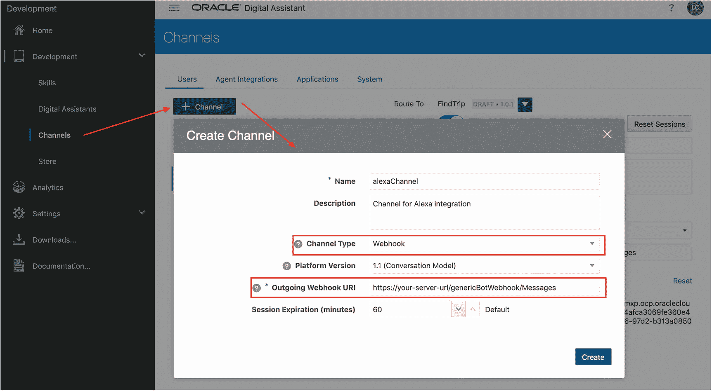

图 11-3

在 ODA 中创建通道

当你点击“确定”时，webhook 通道将被创建，你将看到（图 11-4）添加了两个额外字段，这两个字段在 webhook 代码的配置中都需要用到：

1.  Webhook URL：你的 webhook 将用于向 ODA 发送消息的 URL。
2.  密钥：你的 webhook 需要对发送给 ODA 的消息进行签名所使用的密钥，ODA 将使用该密钥来检查传入的消息是否使用正确的密钥签名。

    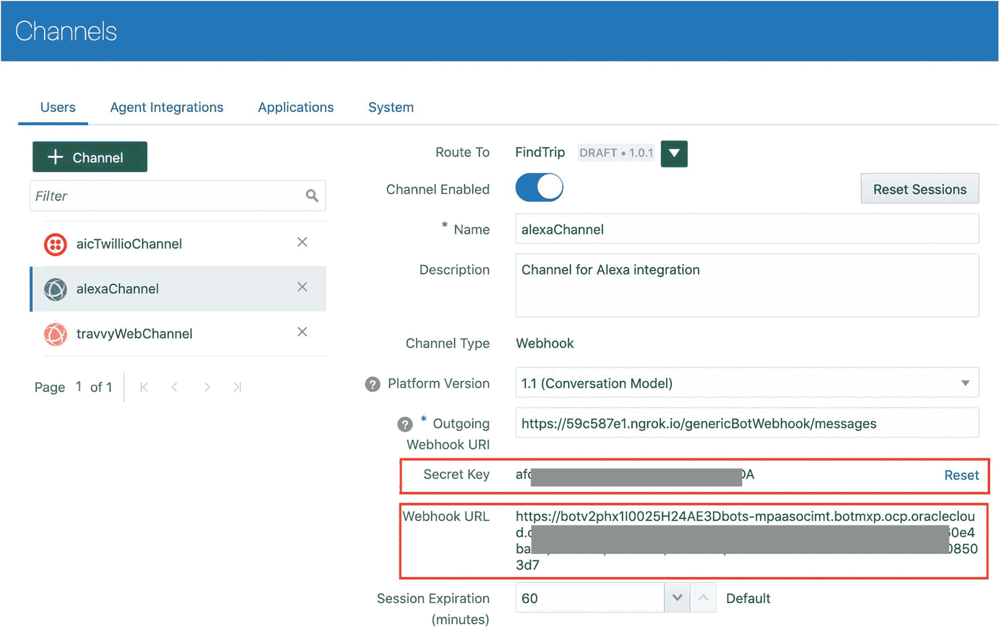

    图 11-4

    生成的密钥和 Webhook URL

这就是在 Oracle Digital Assistant 中所需的所有操作。只需添加并配置该通道，你的 Digital Assistant（或技能）现在就可以通过这个最终将被 Alexa 使用的 webhook 通道进行访问。


### 配置 Alexa

与 Alexa 交互的方式是向支持 Alexa 的设备发送命令（语音或文本）。该命令将被转发到运行在亚马逊 Alexa 服务上的技能，并最终转发到能够提供所请求信息的服务或数据源。为了使 Oracle Digital Assistant 能够与 Alexa 协同工作，需要创建一个自定义技能，该技能将调用一个 REST 端点，将 Alexa 请求转发给我们的 DA，并获取 DA 的响应，然后将其发送回 Alexa。

要创建此 Alexa 技能并使其正常工作，需要对 Alexa 进行配置。相关步骤将在后续章节中说明。

#### Alexa 调用语句

调用语句是开始与特定自定义技能交互所必需的（图 11-5）。例如，要调用 Travvy，您可以使用“Travvy travel”。因此，每当用户说“Alexa，Travvy travel”时，此自定义技能就会被调用。现在，要预订行程，用户可以这样说：“Alexa，ask Travvy travel to book me a trip.”

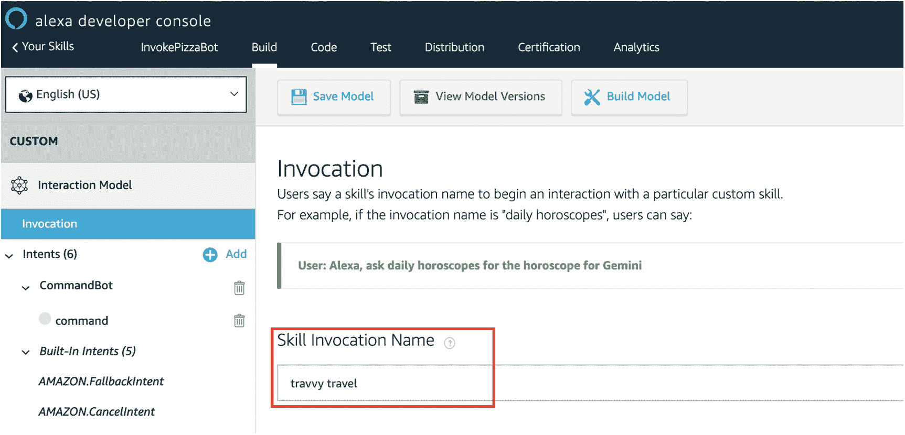

图 11-5：设置调用名称

#### Alexa 意图和槽位类型

通过意图，您可以尝试表达您想要什么，您的意图是什么。它通常由一个句子组成。意图可以有可选的参数，称为槽位。槽位本质上是*话语中的变量*。槽位可以有预定义的值，但默认情况下是空的。要定义一个槽位，您首先需要在您的 Alexa 技能中创建一个自定义意图（图 11-6）。之后，当您需要为该意图创建示例话语时，只需用花括号括起来定义一个槽位即可。

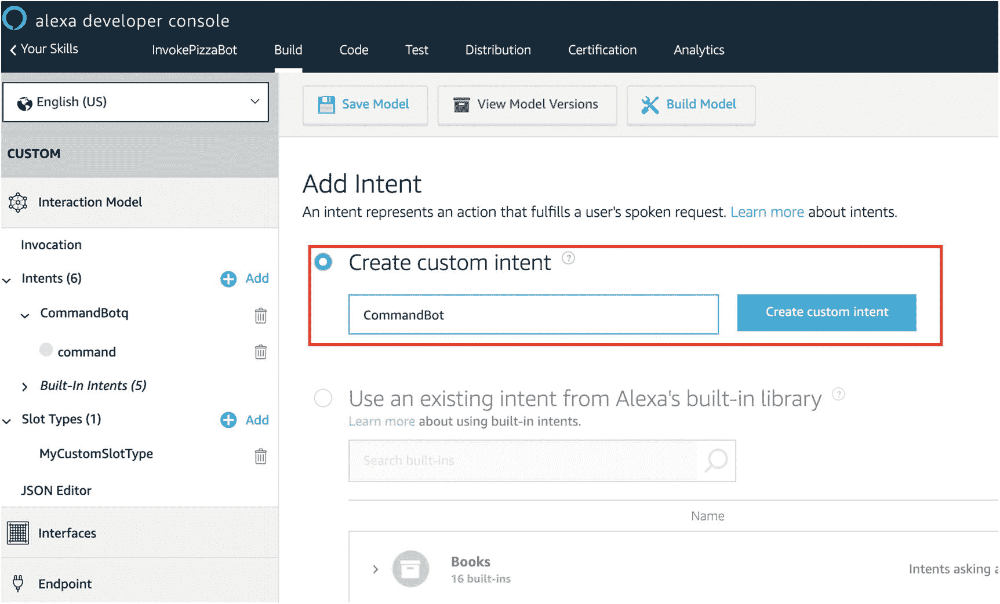

图 11-6：Alexa 添加意图

槽位值从话语中提取，并与意图请求一起发送。实际的意图解析不会由 Amazon Alexa 完成，而是由我们的 Oracle Digital Assistant 完成。这意味着您可以使用槽位类型 `AMAZON.LITERAL`（图 11-7）。此槽位将保存用户所说内容的文本表示形式。此槽位的全部内容随后将被转发到技能的端点以及 Oracle Digital Assistant 进行意图解析。

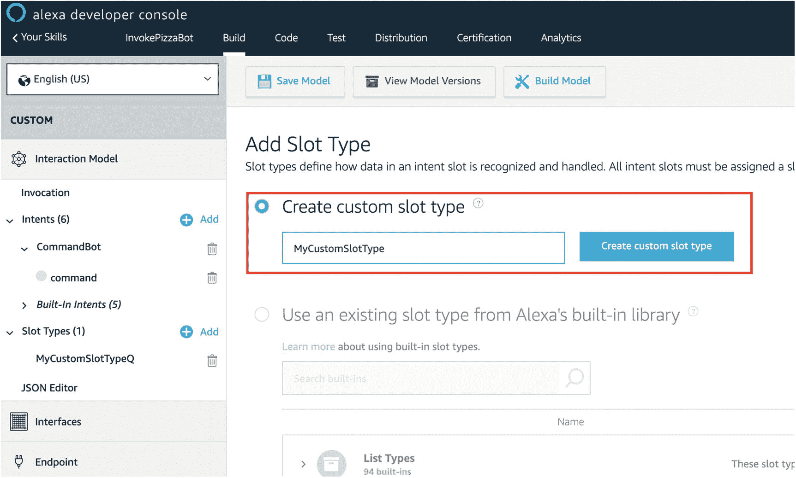

图 11-7：Alexa 添加槽位类型

#### 端点

在我们的案例中，自定义技能的实际逻辑将运行在由 Node.js 实现并托管 Alexa 应用的服务器上的 REST 端点中。

出于本演示的目的，它将在本地运行，并附带一个 `ngrok` URL。该端点需要添加到托管 Alexa 应用的服务器根 URL 中，在我们的案例中是本地的 `ngrok`。

在 HTTPS 端点字段中，您需要填写此 URL 的确切地址（图 11-8）：

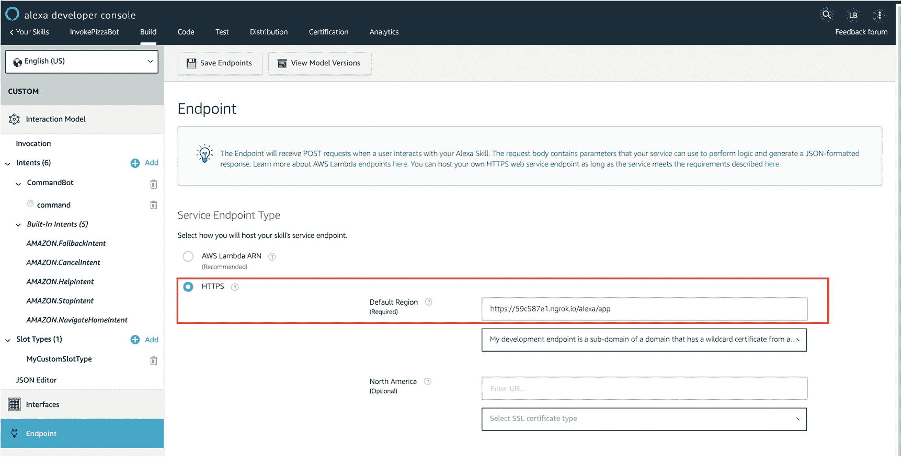

图 11-8：Alexa 配置端点

完成此设置后，自定义 Alexa 技能就配置好了。最后，您需要找到技能 ID，以便在节点代码的配置部分中使用它。技能 ID 可以从 Alexa Skills Kit (ASK) 开发者控制台中找到（图 11-9）：

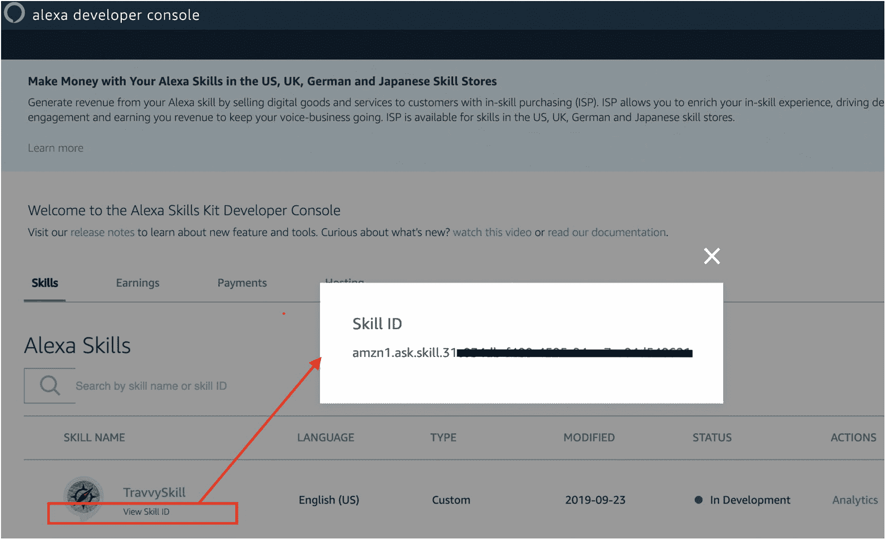

图 11-9：Alexa 查找技能 ID

此 ID 需要添加到之前创建的 webhook 的节点代码中，以便 webhook 知道在哪里找到 Alexa 技能。

### 设置 Webhook

为了在 Oracle Digital Assistant 和 Amazon Alexa 之间设置 webhook，它们需要知道在哪里可以找到对方。为此，您需要将之前生成的**密钥**、**通道 URL** 和 **Amazon 技能 ID** 添加到 JavaScript 代码的元数据设置中：

```javascript
//替换这些设置以指向您的 webhook 通道
var metadata = {
allowConfigUpdate: true,
waitForMoreResponsesMs: 200,
amzn_appId: "",
channelSecretKey: '', //BOT 密钥
channelUrl: ''
};
```

### 测试 Alexa 通道

通过 Alexa 的对话可以很容易地使用 Alexa 开发者控制台进行测试（图 11-10）。只需转到测试选项卡，开始输入您的命令，或者如果您喜欢，甚至可以与 Alexa 对话。

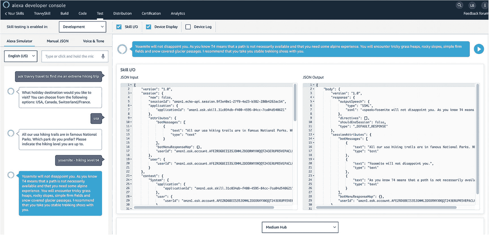

图 11-10：Alexa，在控制台中测试

另一种选择是使用智能手机，这样就不需要真正的 Amazon Echo 或 Alexa 设备。您可以在智能手机上使用官方的 Alexa 应用。以下示例展示了如何在 Android 手机上运行 Alexa。在 Google Play 商店中，搜索 Alexa 并选择 Amazon Alexa。点击安装按钮，等待 Amazon Alexa 应用下载到您的设备上。在手机上安装 Alexa 后，您需要进行设置。打开 Amazon 应用，使用您现有的 Amazon 账户信息登录，包括您的电子邮件地址（如果您有移动账户，也可以是手机号码）和密码。点击登录按钮。

登录后，您应该能够像使用 Amazon Echo 或 Dot 一样使用该应用，并调用调用 Oracle Digital Assistant 的技能。点击技能以查看更多信息，或者只需点击 Alexa 按钮与 Alexa 对话，让她让 Travvy 为您找到一次旅行（图 11-11）。

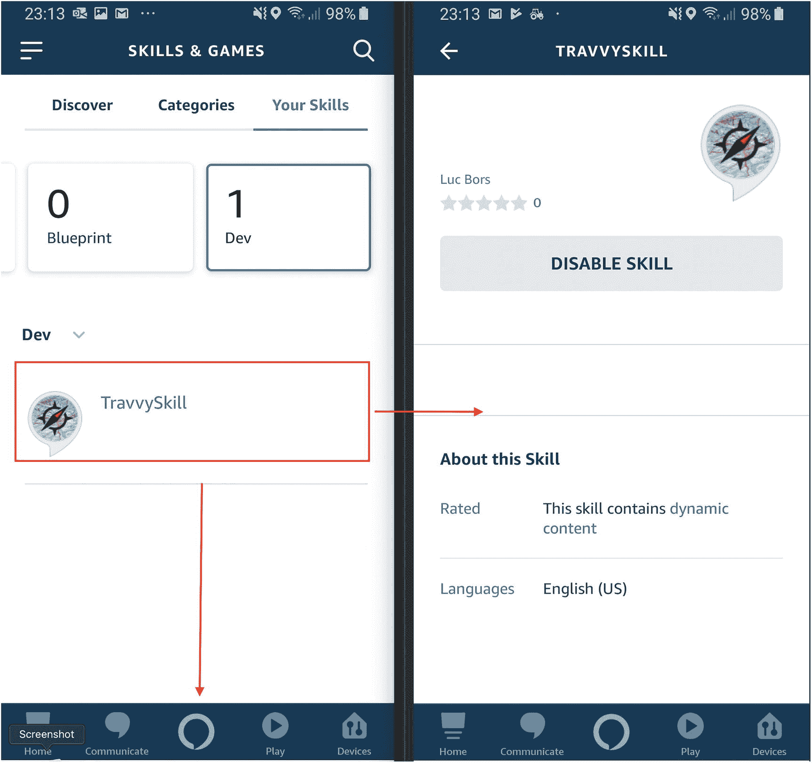

图 11-11：Alexa，在应用中测试技能

很明显，通过语音通道进行的对话与通过文本或 Web 通道进行的对话是不同的。例如，语音通道无法显示图像，也不允许您点击链接或调用 webview 组件来输入额外数据。但是，可以处理这些差异。Digital Assistant 可以发送特定于通道的回复。在对话流中，您可以通过表达式和自定义组件了解通道类型和正在使用的通道名称。这将使您能够优化对话流以用于语音。

此外，`System.CommonResponse` 组件可以根据通道类型和名称显示或隐藏响应项。

在前面的章节中，您学习了如何在技术上将 Alexa 设置为一个通道。它是可行的，但对话有些繁琐。您可能注意到，使用语音通道需要特殊的对话设计。下一节将为您提供一些关于如何设计语音用户体验 (VUX) 的提示。


## 语音用户体验设计指南

为语音设计对话与为视觉设计对话截然不同。语音界面提供的体验中，用户无需使用眼睛或双手进行交互。因此，你所了解的关于视觉层次、色彩以及利用动效对用户产生影响的全部知识，在设计语音用户界面（VUX）时都无法应用。措辞的选择将影响人们如何感知你为他们设计的客户体验，因为没有任何视觉线索来引导用户。

以下是一些建议：

-   通过提出相关的**后续问题**（图 11-13）来激发更以用户为导向的语音交互，从而在推荐之前将选项列表缩小到最佳选择。聊天机器人可以收集所需数据，以提供最佳答案。

-   最后，请记住，用户往往倾向于认为系统能理解超出其实际能力范围的内容，并且用户常常不了解可用的功能。因此，当用户第二次犯同样的错误时，应添加**帮助信息**。此外，在与当前情境相关时，数字助手可以**提供信息，特别是关于用户从未使用过的功能的信息**。

-   **要有人情味。** 设计你的语音用户界面（VUX），让聊天机器人**与**用户交谈，而不是**对**用户说话。你的用户需要聊天机器人简洁地说话，以帮助他们理解你的技能需要哪些信息，并对正在发生的事情感到确信。

-   鉴于语音会占用其他任务宝贵的记忆资源，最好保持简洁。不要一次性将所有信息都提供给用户。**只提供最相关的信息**，然后与用户确认要详细说明哪一部分。

-   在给出答案之前，通过**根据已知的用户偏好对信息进行优先级排序和总结**，向用户呈现一个选项列表。

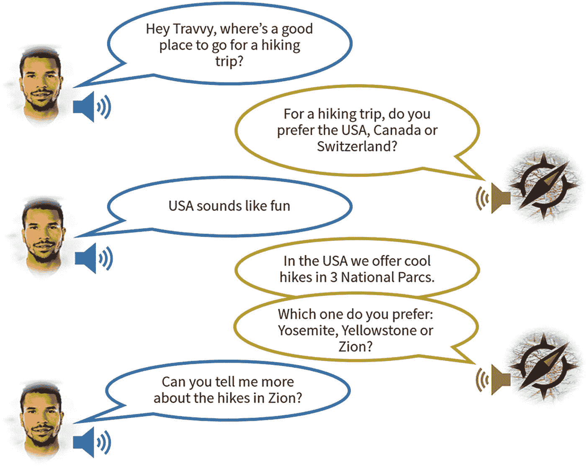

图 11-13

提出后续问题

-   **按照人们说话的方式设计**，而不是按照他们打字的方式。用户不会像在互联网上搜索时那样使用关键词，例如“锡安国家公园旅游信息”。

-   **优雅地处理错误。** 避免出现仅说明聊天机器人没有听清或理解用户意思的错误信息。例如，“我没听清你说的话。”这会导致用户重复说出导致错误的相同短语。相反，应添加更有帮助的信息，并尽可能明确你的指示。用户很快就会失去兴趣，并对一个像坏掉的电话树菜单一样机械地重复“对不起，我没太听清”的声音感到厌烦。相反，**只询问缺失的信息**，并**提供多种可能的回应**。创建有意义的错误信息，以引导与用户的对话重回正轨，同时避免无休止地惹人厌烦。

-   除了聊天机器人实际所说的内容（内容）之外，它的声音还会向听众揭示大量的元信息。**利用性别、年龄、语调、语气、口音、节奏和语速**来打造代表公司品牌的特定用户体验。声音使聊天机器人独一无二，而语气使其听起来像人类。使用悦耳的声音对你的品牌至关重要，但远不止于此。提供具有一致声音并仔细关注其语气的语音用户体验的公司，能够与用户建立更好的关系。

-   语气是情感的自适应反映。用你自己的声音和语气来思考：你只有一种声音，但你和朋友说话时可能使用一种语气，而和老板或客户说话时则使用完全不同的语气。你和朋友开玩笑时可能使用极其随意的语气，但在安慰伤心的人时则会使用严肃的语气。我们在对话中本能地调整语气，以此表达同理心。

-   在音频方面，你必须做出一个设计决策：“**是录制，还是不录制？:)**”你是使用标准语音（即文本转语音引擎），还是为你的技能将拥有的每个回应录制自定义音频？

始终测试词语的流畅度以及语音提示听起来的效果。

-   我们的眼睛喜欢模式。它们能让用户更快地完成操作。一致的视觉设计就是好的设计！然而，在语音方面，我们的耳朵不喜欢重复。在设计语音对话时，**尝试使用表示相同动作的不同短语**（图 11-12）。

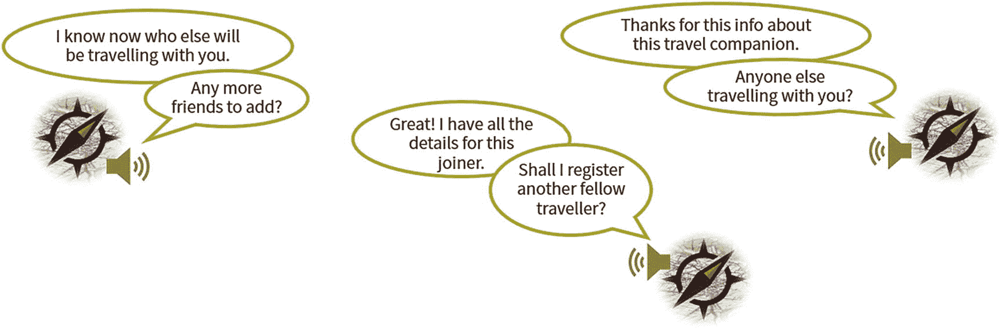

图 11-12

表示相同动作的不同短语

## 总结

在本章中，你学习了如何为你的数字助手添加情感分析和语音功能。在聊天机器人的上下文中，情感分析可以通过多种方式实现，但通常使用专门用于情感分析的特定（有时是第三方）API。通过使用自定义组件，你可以调用这些 API 并利用其结果以正确的方式回复用户。

通过 Google Home 或 Amazon Alexa 等语音渠道公开你的数字助手非常直接，并且基于 Webhook 渠道。一旦你准备好了（最好是可复用的）Webhook 代码，只需为你的数字助手配置即可使用这些渠道。尽管使用语音渠道非常诱人，但你必须始终记住，语音通常需要与文本渠道完全不同的设计。

