# 2. 训练我们的第一个模型

在第一章，我们介绍了 TensorFlow.js 生态系统。在那里，我们讨论了其历史、特性和细节，例如张量、操作和层。在本章中，我们将应用所介绍的一些概念来构建我们的第一个机器学习模型。

我们在这里创建的模型属于**监督学习**类别。这是从标记的训练集中学习，一个将一组输入（称为**特征**）映射到**标签**（也称为类别）的函数。在本章中，我们将通过构建使用 TensorFlow.js 的 Layers API 的**逻辑回归**和**线性回归**模型来探索这种学习类型及其工作原理。

这些模型中的第一个，逻辑回归，是一个经典的监督学习模型，它将一个实例分类为两个类别之一。然后，我们将看到线性回归，这是一种用于预测数值的算法。在第三章，我们将把监督学习放在一边，专注于无监督学习，这是一种不需要标签的机器学习类型。

在直接进入算法之前，让我们将本章的第一部分用于讨论我们将如何处理你在这里（以及本书的其余部分）将要构建的机器学习项目。

## 接近机器学习问题

每个机器学习问题的起点正是：*问题*，我们需要解决的问题。这个问题不应该是在构建机器学习模型。构建模型是我们解决问题的解决方案或方法。相反，这个问题应该是一个精确的陈述或问题，同时可以将其转化为我们希望模型学习的目标。

知道我们想要解决什么问题是至关重要的。一旦我们定义了问题，我们将更有能力选择一个合适的 **模型**（以及因此的学习范式）和其他与开发机器学习系统相关的事情，例如 **训练框架**、**性能指标**和**部署平台**。但在那之前，有一个关键细节我们需要解决，那就是**数据**——机器学习的燃料。

### 数据

在机器学习中，数据是本质。它是模型用来学习的知识和信息。没有它，机器学习就不会存在。牛津大学将数据定义为“为参考或分析而收集在一起的事实和统计数据。”^(1) 我想强调“分析”这个词。用通俗易懂的话来说，我们可以说当机器学习模型在学习时，它正在分析数据，直到它能够从数据中推断出结果。

但是，当我们进行机器学习时，计算机并不是唯一应该分析这些数据并从中学习的。我们，作为负责机器学习系统的责任人，也应该在将其输入模型之前进行分析，因为有两个主要原因。

这些任务中的第一个是确保数据的质量。坏的和脏的数据是存在的。事实上，我愿意说，大多数数据集离完美还非常远。因此，我们应该在我们的开发过程中分配一部分时间来探索这些数据，预处理它们，并确保它们适合我们的问题。毕竟，正如我们在这个领域喜欢说的，“垃圾输入，垃圾输出”，这意味着如果训练数据很差，那么模型的预测能力也会很差。

探索数据集的任务不出所料地被称为**探索性数据分析**，它涉及总结、可视化和处理数据以了解更多信息。在这个过程中，我们可能会执行诸如*特征归一化*的任务，即将数值转换为公共尺度或检查空值行。在这本书中，我们将看到的大多数数据集已经准备好了，不需要任何进一步的修改。然而，始终记住这一点总是好的。

理解数据之所以至关重要的第二个原因是，没有模型与所有数据兼容。数据有不同的尺寸和形状，具有特定的属性，不幸的是，没有适合所有情况的通用模型。在数据集可能具有的所有可能特征中，我们将考虑的是数据的**类型**和**目标变量**。

一些最常用且流行的数据类型是**表格型**、**图像型**和**文本型**数据。表格型数据集是经典的矩阵形式。其数据结构化成行和列，其中每一行代表一个特定的实例或数据观察，而列代表属性或特征——我们通常在*CSV*文件中找到它们。然后，还有图像数据，这种格式在深度学习中非常流行。正如我们在第一章中看到的，当我们讨论张量时，图像和视频是表格数据集的扩展。例如，一张图片，至少是一张灰度图片，是一个矩阵，其中每个数据点是像素的强度。最后，还有文本数据。这类数据没有特定的格式。例如，你可以在表格数据集中找到文本数据，例如，一个 CSV 文件，其中每一行是一个句子，或者在语料库（大量文本）中。文本数据主要用于自然语言处理应用（NLP）。

然后是目标变量及其两种类型：**离散型**和**连续型**。离散型变量是取自一组可能值的特定值的变量。例如，在一个旨在预测这张图片是猫还是狗的模型中，目标变量是离散的，因为唯一可能的值是“猫”或“狗”。

另一方面，我们还有连续变量，它可以取一个最小值和最大值之间的任何数值。其目标变量（我们想要预测的内容）可能是，例如，我一天内会走的距离。在这种情况下，这个变量的范围从 0 公里一直延伸到无限大（我最好买双好鞋！）。

### 模型

没有一个完美的机器学习模型。虽然它们都很令人印象深刻，但它们都有自己的优点和缺点。有些在数据集*A*上表现更好，而在*B*上表现不佳，而有些在*B*上表现很好，但在*A*上表现不佳——这就是所谓的“无免费午餐”定理。因此，选择一个合适的模型并不是一个简单的事情。正如前一点提到的，模型与我们手头的数据类型密切相关。例如，由于图像具有视觉性质和大型尺寸，需要一种能够提取其特征的层。因此，在这种情况下，*卷积神经网络*（CNN）是一个不错的选择。但对于文本数据，CNN 并不是最佳选择。相反，你可以考虑使用*循环神经网络*（RNNs）。其他情况包括，如果目标是预测连续值，则使用*线性回归*；如果是离散分类，则使用逻辑回归。

选择模型还取决于数据集是否有标签。例如，在数据有标签的情况下，答案是监督学习模型。否则，无监督学习可能更合适。

我们在这本书中将要应用的大多数模型属于**连接主义**领域（Domingos，2015），即涉及人工神经网络的领域。其中一些将是深度网络，其他是浅层网络，还有一些可能在其名称上没有“网络”这个词，但它们仍然是网络。此外，我们将主要关注监督学习问题。

### 训练框架

在获取正确数据并选择模型后，下一步是选择用于训练模型的框架或库。在大多数情况下，这是一个个人选择，或者基于我们必须部署系统的技术堆栈。其中一些最受欢迎的是**TensorFlow**（Python）、**PyTorch**（Python）、**scikit-learn**（Python，看到了趋势吗？）以及当然，**TensorFlow.js**（JavaScript）。

### 定义模型的架构

在大多数被称为“传统机器学习”的库中——即非深度学习的机器学习——训练一个模型就是创建算法的一个实例，并使用`model.fit()`来训练它。在 TensorFlow.js 中，这种方法是不可行的。正如我们在第一章中看到的，在 TensorFlow.js 中定义一个模型涉及使用 Layers API 逐层创建它。在我们的练习中，我们将使用我们设计和训练的模型、预训练模型和 ml5.js 模型的混合。

### 性能指标、损失函数和优化器

我们需要配置的培训的另一部分是*性能指标*，这是一个评估模型正确性的单一数字分数。同样，没有完美的性能指标，就像之前的案例一样，它也取决于数据和我们要解决的问题。

在所有性能指标中，**准确率**是最常见的一个。这个分数衡量了模型正确预测的预测比例或比率。例如，假设我们训练了一个模型，用来预测土豆是否好吃。然后，我们用包含十个观察值的测试数据集来测试它，我们知道这些观察值的真实标签（真实标签）。在这十个试验中，有七个是正确的，三个是错误的，所以我们可以简化为说这个模型的准确率是 7 / 10 = 0.7 或 70%（而且你刚刚吃了十个土豆）。

虽然简单易懂，但准确率指标并不是每个案例都最优的，例如，在目标变量是连续的问题中，或者在数据集不平衡的情况下——当一个类别的观察数量远远超过另一个类别时，例如，一个 95%的行属于类别*A*的数据集。

我们需要定义的培训的第二方面是*损失函数*，通常称为*成本*或*目标*函数。这个函数指定了模型在训练期间想要最小化的目标。就像性能指标一样，它也是一个单一数字值。但与衡量其性能不同，它计算预测的不正确性。在训练过程中，我们希望最小化这个值（我们并不对错误预测感兴趣，对吧？），所以数字越小，越好。

计算损失值没有唯一的方法；毕竟，有许多损失函数。但它们之间的共同点是，模型在每个数据批次和每个 epoch 结束时评估它（关于这一点稍后会有更多介绍）。然后，根据函数的值更新其权重（模型的参数）：损失值。这个概念可能有点难以理解，但训练第一个模型后，你会对它有一个更好的理解。

最后，我们还有一个第三个组件，即*优化器*，这是一种与损失函数非常紧密相关的函数。在前一个点中，我们说损失函数的目的是衡量模型错误的大小，以便它可以更新权重。但是，它会更新这些权重多少呢？这就是优化器的角色。引用官方 TensorFlow.js 文档，优化器的工作是“根据当前模型预测决定模型中每个参数的变化量”（Google，2018c）。

现在，有了合适的数据，定义了模型架构，并决定了指标，是时候训练我们的模型了。

### 评估模型

训练一个模型可能是一个漫长、昂贵且耗能的过程。因此，我们需要确保它以正确的方式进行，以避免训练结束后出现任何不愉快的惊喜。在即将看到的例子中，我们将使用之前引入的指标来窥视训练过程并观察其进展。为此，我们将使用 TensorFlow.js 的可视化库**tfjs-vis**，以实时查看模型损失和性能指标在训练过程中的演变。

评估阶段也扩展到训练好的模型。在这里，我们将使用在训练阶段没有见过的数据来测试模型，以评估其预测能力。这样做非常重要，因为训练表现良好的模型并不一定擅长预测。这种现象发生的一个主要原因是**过拟合**。一个过拟合的模型是经历了错误的训练阶段，它*记忆*——而不是*建模*——训练数据、其噪声和随机波动。结果，模型失去了泛化能力，这意味着它将不会在训练期间没有见过的案例中表现良好。

### 部署模型

到目前为止，假设我们有一个很好的模型，它符合我们在一开始就定义的问题。它在训练期间表现良好，在测试阶段表现优异，并且你的老板也批准了它。现在，是时候部署并向世界展示它了。但如何做呢？这既不是一个容易回答的问题，也不是一个简单的任务，因为模型的部署取决于许多因素，如感兴趣的平台或公司的要求。

部署模型是提供其服务或使其可供使用的流程。例如，亚马逊的推荐引擎可能位于亚马逊云服务服务器上，监听我们对“tensorflow js books”的搜索。通常，当我们训练机器学习模型时，我们会在一个封闭的环境中完成，比如脚本、笔记本或云中的某个服务。然而，这些可能不是你部署它的环境。毕竟，这些脚本可能是为了训练而不是推理而设计的。因此，我们需要一个第二平台来部署它们。

如你所预期，我们的部署目标是 TensorFlow.js——正如之前讨论的，它作为一个训练和推理平台表现良好。

总结本章的第一部分，这里介绍的所有案例都是对如何解决本书大部分问题的描述和指南。然而，这并不是一个详尽无遗或完美的列表，说明了每个机器学习系统是如何工作的。现在，让我们最终应用所有这些信息，构建本书的第一个模型。

## 构建逻辑回归模型

在这个第一个练习中，我们将创建一个网络应用程序，该程序训练并服务于一个逻辑回归模型。此外，为了使应用程序更加丰富，我们将使用可视化库 tfjs-vis 来绘制数据和训练的损失以及性能指标。

由于我们处于网络环境中，这个教程也涵盖了某些网络开发概念，例如从 CDN 加载库或如何动态创建按钮。虽然这些主题与 TensorFlow.js 或机器学习无关，但我认为这本书应该解释它们，以便彻底理解应用程序，并帮助那些不熟悉这些概念的人。

是时候开始了！所以，拿起你的笔记本电脑，准备动手实践。或者，如果你更愿意只是阅读关于这个过程的内容，当然，那也很好。为了额外的参考，你可以在[`https://github.com/Apress/Practical-TensorFlow.js/tree/master/2`](https://github.com/Apress/Practical-TensorFlow.js/tree/master/2)找到完整的源代码。

### 理解逻辑回归

这个网络应用程序具有一个**逻辑回归**（或 logit）模型，这是一种监督学习算法，试图找到一组**独立变量**（也称为预测因子）与一个**离散的因变量**（称为标签）之间的关联。换句话说，它使用一组属性或特征来学习如何将它们分类到某个类别。将特征集映射到目标函数是逻辑函数的特殊情况（因此得名），称为 Sigmoid 函数。

具体来说，所讨论的模型是一个**二元逻辑回归模型**，其目标变量有两个可能的值之一，例如，“0”或“1”，“true”或“false”，或“垃圾邮件”或“非垃圾邮件”。然而，算法的输出并不是这样。logit 模型的输出是标签为默认情况的似然或概率。让我解释一下。假设我们有一个预测消息是“垃圾邮件”或“非垃圾邮件”的模型，我们用文本“TensorFlow.js 很棒。”来测试它。答案是，当然，“非垃圾邮件”，但模型不会这样表达。相反，它的输出是一个介于 0 和 1 之间的值，其中 1 表示它 100%确信该消息是垃圾邮件，而 0 表示它 0%可能是垃圾邮件。通常，大多数逻辑回归的实现将阈值设置为 0.5，这意味着它们将任何高于这个值的视为“true”响应，例如，“垃圾邮件”，而任何低于这个值的视为“false”。

图 2-1 展示了来自一个预测车辆发动机形状（vs）的模型的逻辑函数示例，其中标签“0”表示“V 形”，1 表示“直列”，使用其马力（hp）作为预测因子.^(2) 你在这里看到的点都是训练集。在 x 轴上，你有马力，*hp*；在 y 轴上，发动机的形状，*vs*；在图表中，映射这两个变量的逻辑曲线。为了解释它并从这个图表中进行预测，考虑输入*hp=100*。现在，转到 y 轴，找到“100”与“S”曲线相交的值。在这种情况下，它触及曲线的 0.80 标记，由于 0.80 > 0.50，因此预测是“1”。另一方面，如果*hp=200*，似然度为 0.004，因此预测的标签是“0”。

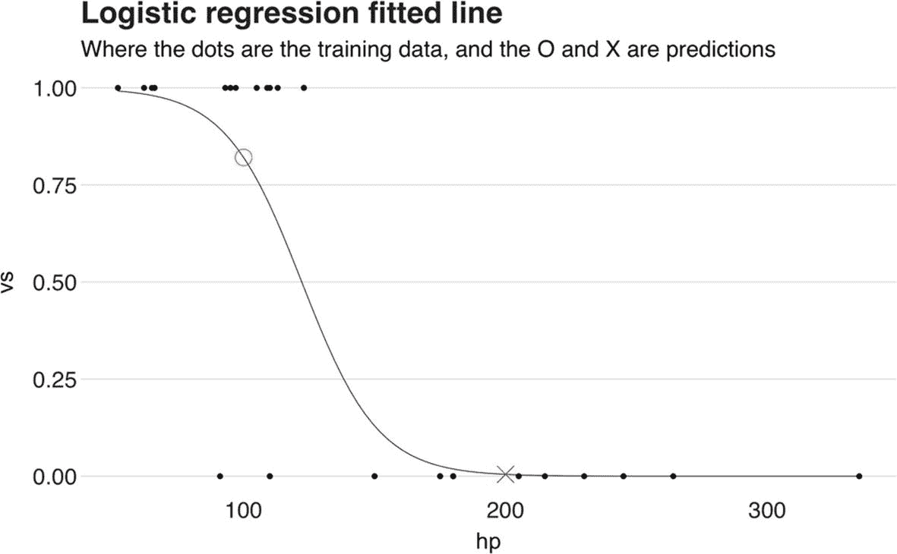

图 2-1

适配的逻辑回归

对于这个练习，我们将使用 TensorFlow.js 中的网络模型创建逻辑回归。但在到达那里之前，我们需要先回顾一下什么是人工神经网络。

### 什么是人工神经网络？

我们的大脑由数十亿相互连接的神经元组成，这些神经元以复杂的网络结构组织。这些神经元——大脑的基本单元——不断地发送被称为信号的电脉冲，被其他神经元接收。一些信号很强，当它们到达接收神经元时，会刺激它产生并传输自己的信号到网络。另一方面，弱信号不会触发脉冲。

人工神经网络旨在模仿大脑的连接性和脉冲特征。其主要的模块，**感知器**（Rosenblatt，1958），扮演着生物神经元的角色。感知器是神经元的数学表示，就像其生物对应物一样，其作用是根据输入是否强烈产生输出信号。它由五个主要部分和一个附加部分组成（图 2-2）：

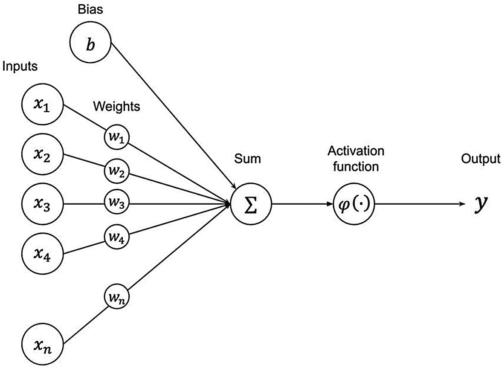

图 2-2

感知器

+   输入：传入的信号。

+   权重：衡量（修改）输入的值。权重可能是网络中最重要的一部分。在训练过程中，网络将学习一组能够产生所需输出的最优权重。

+   加权求和：这个操作计算输入的加权求和 *z* = *w*[1]*x*[1] + *w*[2]*x*[2] + … + *w*[*n*]*x*[*n*]

+   激活函数：这个操作将激活函数应用于加权求和。

+   输出：这个值是应用于加权求和的激活函数 *h**w* = *activation*(*z*)；输出信号。

+   偏置（可选）：有时，感知器有一个额外的输入称为偏置，用 *x*[0] 表示。如果使用偏置，加权求和变为 *y* = *x*[0] + *w*[1]*x*[1] + *w*[2]*x*[2] + … + *w*[*n*]*x*[*n*]。

简而言之，感知器是一个接收一系列输入并产生输出的结构。让我们看一个例子。假设我们有一个感知器，其输入 *X*[1] = 0.7，*W*[1] = 0.3，*X*[2] = 0.4，*W*[2] = 0，以及偏置 *X*[0] = 1，激活函数是 sigmoid（逻辑回归中的那个），定义为 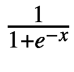。在这种情况下，加权求和是 *y* = 1 + 0.7 * 0.3 + 0.4 * 0 = 1.21。然后应用 sigmoid 激活函数，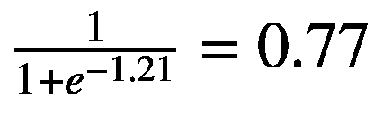（图 2-3）。

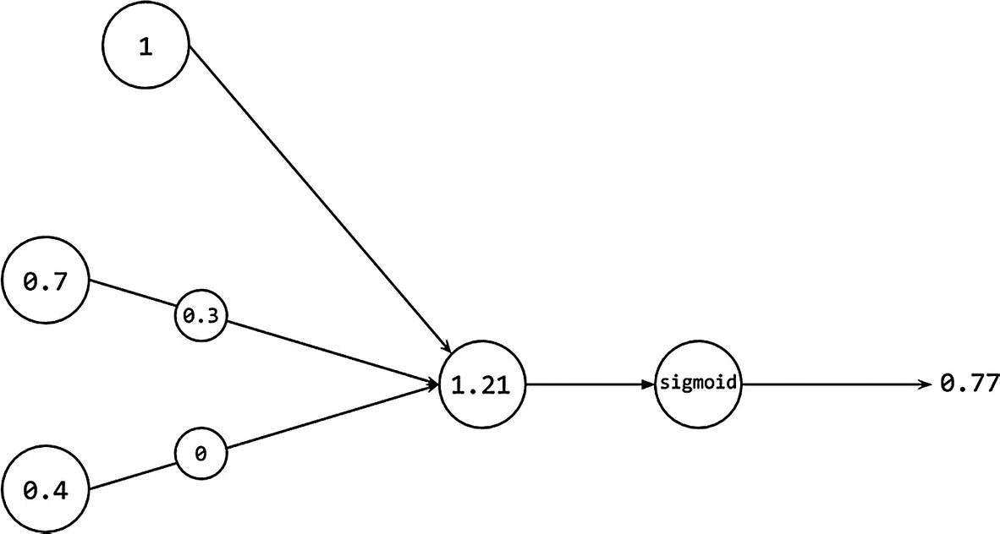

图 2-3

带有值的感知器示例

就像大脑一样，在实践中，你永远不会使用单个感知器，因为单个感知器不足以学习复杂问题。因此，你不会使用单个感知器，而是使用连接的感知器层，这就是**人工神经网络**（ANN）这个术语的由来。ANN 有三种类型的层：**输入**、**隐藏**和**输出**层。输入层接收数据并将其分配给第一个隐藏层，因为通常，一个层的神经元会连接到前一个层的所有神经元，这是一个*全连接层*。隐藏层计算其输入的激活值并将它们发送到下一个层。最后，输出层使用来自先前隐藏层的激活值来产生最终的输出。在神经网络架构中，你拥有的层数越多，权重就越多，这增加了网络学习更复杂问题解决方案的能力。例如，前面的例子旨在学习只有两个权重。但在现实中，图像分类等问题可能需要数百万个权重的网络。因此，为了应对复杂性，网络可能需要更多的层。

但他们是如何学习的呢？这是一个很好的问题。在训练过程中，模型试图调整其权重，以便能够使用其预测因子预测数据集的标签。在我们的感知器示例中，我们使用了两个预测因子[0.7, 0.4]，输出为 0.7702。但如果实际正确的目标是 1.0 呢？我们能否调整权重以获得更好的输出？答案是肯定的。

在训练过程中，当值达到输出层时，模型计算实际值和预测值之间的差异。这个差异，正式上称为误差，被发送回模型的权重和偏差以修改它们，从而最小化误差；换句话说，我们更新权重以缩小实际值和预测值之间的差距。将误差发送回模型的过程称为**反向传播**（Rumelhart 等人，1985 年）。正如我们很快就会看到的，网络以称为**周期**的循环进行学习。在每个周期的末尾，模型都会传播误差，目的是在下一个周期中减少误差。因此，你可以将其视为一个迭代过程，直到模型找到一组最优的权重或*收敛*。因此，在训练初期出现较大的误差并不奇怪。你将通过我们将创建的可视化了解更多关于训练误差如何演变的信息。

### 数据概述

本练习的数据集是一个合成数据集。它包括 700 个观测值，2 个特征，以及名为“label”的类别列。它是平衡的，有 349 个点属于类别“0”，351 个点属于第二个类别“1”。每个特征都遵循正态分布，这意味着大多数点都位于平均值附近，标准差为 1。此外，为了使数据集适合分类问题，特征是相互依赖的。

### 构建应用程序

为了更好的可见性和清晰度，我们将教程分为不同的部分，其中每个部分都描述了应用程序的特定特性或机制。首先，我们将从设置工作区开始，然后定义 HTML 文件和导入所需的包。然后，我们将加载数据集，绘制它，最后构建模型并训练它。跟我来！

#### 设置工作区

对于这个练习，您只需要一个网络浏览器和您喜欢的代码编辑器。不需要其他任何东西。应用程序将使用 CDN 方法下载库，因此您不需要安装任何东西。现在，创建一个新的项目，打开代码编辑器，让我们开始吧。

#### 结构化 HTML，导入包和加载脚本

在本教程的第一部分，您将通过 CDN 加载 TensorFlow.js 和 tfjs-vis 包，使用几个 HTML 标签定义应用程序的结构和元素，并加载训练模型的脚本。但在做所有这些之前，请打开您的编辑器，创建一个新文件，并将其命名为*index.html*。

在文件顶部，创建一个`<html>`标签和对应的闭合标签`</html>`。这个基本标签是代表 HTML 文件根元素的元素。接下来，在标签内创建一个`<head>`标签——一个用于定义元数据、样式和脚本等元素的标签——并关闭它。然后，在`<head>`标签内添加以下行以导入 TensorFlow.js 和 tfjs-vis：

```py

script src="https://cdn.jsdelivr.net/npm/@tensorflow/tfjs-vis">

```

接下来，紧随`</head>`标签之后，创建一个`<body>`标签（在`<html>`标签内），正如其名称所示，它定义了文档的主体并包含所有内容。

在 body 中添加的第一个元素是一个`<div>`标签，即 HTML 文档中的一个容器或分区，它封装了其他元素。在这个`<div>`标签内部，您将稍后通过 JS 编程添加按钮，用于构建和显示数据集的可视化。因此，将其`id`设置为`visualize`，如下所示：

在下一行中，添加一个类型为“number”的`<input>`字段，一个用户可以输入数字的空白区域，因此命名为 input。在这个字段中，用户将指定训练轮数，因此使用 id 和 name“number-epochs”。此外，为了使其更有趣，添加一个值为“1”的`min`属性，一个值为“20”的`max`属性，以及默认值设置为“5”。它应该看起来像这样：

```py
Additionally, to improve the app’s readability, add a `<label>` tag with the text “Number of epochs (between 1 and 20):” on top of the input:

```

训练轮数（介于 1 到 20 之间）：

```py

The `<label>` tag improves the interaction and usability of the element we use it *for* (in this case, the input field) by highlighting the targeted element if the mouse is over the label or selecting it if the user clicks the label.After the input, use a second `<div>` with the `id` attribute `train`. Like the previous `<div>`, in this one, the app adds the button that starts the model’s training:

```

最后，添加一个 `<script>` 标签来导入和运行 *index.js*，这是你将编写 Web 应用程序功能的脚本。要导入它，请添加以下行：

```py
And that’s the first file. If everything went right (I’m sure it did), it should look like this:

```

需要的周期数（介于 1 到 20 之间）：

```py

To summarize, this HTML file is the skeleton of the app. In it, you have loaded the required libraries, defined its structure, and exported the JavaScript file that, in the next part, we will use to train a model with TensorFlow.js. So, before moving on, in the same directory where *index.html* is, create a new file and name it *index.js*.Loading the data with TensorFlow.js Data (tfjs-data)In this part of the tutorial, you will load the dataset that is required to train the model using tfjs-data. This component of TF.js provides the tools to load and parse data from both the Web and disk as well as to process it using operations such as *filter* and *shuffle*.Before loading the dataset, first, you need to define its location, which, in this case, is a remote URL. So, in the first line of *index.js*, declare a variable and set its value to the following string (or you could copy the dataset from the book’s repository):

```

const csvUrl =

'https://gist.githubusercontent.com/juandes/ba58ef99df9bd719f87f807e24f7ea1c/raw/59f57af034c52bd838c513563a3e547b3650e7ba/lr-dataset.csv';

```py

Right under `csvUrl`, declare another one named `dataset`, the variable that will contain the dataset:

```

let dataset;

```py

Next, create a function named `loadData()` to load the dataset and assign it to the variable `dataset` you just created. The function looks like this:

```

function loadData() {

// 我们的目标变量是 'label' 列

dataset = tf.data.csv(

csvUrl, {

hasHeader: true,

columnConfigs: {

label: {

isLabel: true,

},

},

},

);

}

```py

Let’s take a detailed look at what is happening here. Even though the function spreads across several lines, it only has one statement. That statement, or function to be more precise, is `tf.data.csv()` from tfjs-data. This function creates a `CSVDataset` object by reading and parsing a CSV file from a given URL passed as an argument. The function’s second argument is a `CSVConfig` object, one that has several configurations about the file it is about to load.In this case, the `CSVConfig` object

 has its `hasHeader` attribute set to `true`, indicating that the file’s first row is a header line with the column’s names and not data. Then, there is the `columnConfigs` attribute, a dictionary whose key is the column’s name, and the value, an object of type `ColumnConfig`. Here, you will set the attribute `isLabel` of the column “label” (i.e., the name of the dataset’s target variable) to `true,` to indicate that this column is the label and not another feature. If this specification is missing, the returned dataset is a dictionary of features only. Otherwise, like here, it is an object of the shape `{xs: features, ys: labels}`.The attributes here presented are not the only ones supported by these objects. For instance, the `CSVConfig` object has a `columnNames` key which takes a list of strings that overrides the dataset column names.In short, this command does the following:1.  First, it retrieves a dataset from a URL.

     2.  Then, it indicates that the dataset’s first row is a header and not data.

     3.  It specifies that the column “label” is the target variable and not a feature.

     Now that the data is here, let’s proceed to visualize it.Visualizing the dataIn this part of the tutorial, you will use TensorFlow.js’ visualization library, tfjs-vis, to plot the data. The plot is a scatter plot where the dataset’s labels are displayed in different colors and shapes. A tfjs-vis visualization requires three main things: the **data**, a **visor**, and a **surface**. The data is self-explanatory. But, unlike other libraries, for example, R’s *ggplot2*^(3) and Python’s *matplotlib*,^(4) we can’t just pass it as an argument and call it a day. So, as you will soon see, we have to pre-process it a bit. Then, there is the visor, a window that holds the surfaces, which are the tabs containing the charts. So, we have a visor with surfaces and surfaces with graphs (the data).We will create the plot inside a function named `visualizeDataset()`.

 However, this won’t be a standard function, but an **asynchronous** or async one. An async function is a function that does not follow the main execution thread of the program and, thus, runs asynchronously or separate from the main thread. These functions have many uses, but in this book, we will mostly use them to draw visualizations or load things in the background without blocking (freezing) the app:

```

async function visualizeDataset() {

}

```py

Inside the function, declare two arrays, `classZero` and `classOne`. In `classZero`, you will add the dataset’s features labeled with “0,” and in `classOne`, the rows labeled with “1.” Next, iterate over the dataset and check each row’s label to add its features to the correct array. To do so, call the dataset’s method `forEachAsync()`,

 which asynchronously iterates over the dataset and applies a function to each of its elements. The following code snippet shows the process:

```

const classZero = [];

const classOne = [];

dataset.forEachAsync((e) => {

// 从数据集中提取特征

const features = {

x: e.xs.feature_1,

y: e.xs.feature_2,

};

if (e.ys.label == 0) {

classZero.push(features);

} else {

classOne.push(features);

}

]);

```py

In the loop’s first line, create a variable named `features`, a dictionary of two keys, `x` and `y`, whose values are the first and the second feature of the dataset. Then, check if the label is “0.” If true, push `features` to `classZero`. Otherwise, push it to `classOne`.In its current state, the functions from `forEachAsync()` are executed asynchronously, meaning that the program continues its normal flow while they do their job somewhere else. On this occasion, we don’t want to do this. Otherwise, the subsequent lines of code will execute while the functions might still be running. As a result, the program will suffer an unexpected behavior because the arrays `classZero` and `classOne` are not ready yet. So, we need to halt the execution until `forEachAsync()` ends. The way to do this is by adding the modifier `await` before calling the function. Among other things we will discover later, `await` causes the program to “suspend” its progress until the “awaited” statement finishes (it’s like the program is saying “I’ll wait until you’re done.” Cute).Now, back in the main thread (no more talks about async and await), declare three new variables. The first of them, `series`, is a list of the names you want to give to the different labels in the chart’s legend, for example, “Class 0” and “Class 1.” The second one, `dataToDraw`, is a dictionary, and one of its keys, `values`*,* takes as value an array whose elements are `{x, y}` tuples (like the ones you added in the variable `features`). Then, the third one, `dataSurface`, is the surface we previously discussed. The surface is a dictionary with a key `name` which is the surface’s name and a second key, `chart`, which indicates in which tab you want to draw the plot (if the tab does not exist, it creates one).Lastly, you need to call the `tfvis.render.scatterplot()` function

, the one responsible for drawing the chart. Its first parameter is the surface, followed by the data and an optional parameter `opts`, a dictionary with several configuration options. For this example, we are explicitly changing the name of both labels to “feature_1” and “feature_2” (this is not really necessary because that is the original name of the columns, but now we know how to do it) as well as setting `zoomToFit` to `true` to make the plot bounds to just fit the data. The following is the final function:

```

async function visualizeDataset() {

const classZero = [];

const classOne = [];

await dataset.forEachAsync((e) => {

// 从数据集中提取特征

const features = {

x: e.xs.feature_1,

y: e.xs.feature_2,

};

if (e.ys.label === 0) {

classZero.push(features);

} else {

classOne.push(features);

}

});

const series = ['类 0', '类 1'];

const dataToDraw = {

values: [classZero, classOne],

series,

};

const dataSurface = {

name: '散点图',

tab: '图表',

};

tfvis.render.scatterplot(dataSurface, dataToDraw, {

xLabel: 'feature_1',

yLabel: 'feature_2',

zoomToFit: true,

});

}

```py

There’s an important detail the app is missing, and that’s the functionality to call this function. Remember the `<div>` with ID `visualize` you added before? In the following steps, you will write a function named `createVisualizeButton` ()

 that creates a button inside that `<div>`:

```

function createVisualizeButton() {

const btn = document.createElement('BUTTON');

btn.innerText = '可视化！';

// 监听器等待点击。一旦按钮被点击，它将调用 visualizeDataset

// 按钮被点击时，它将调用 visualizeDataset

btn.addEventListener('click', () => {

visualizeDataset();

});

// # 是 ID 选择器。因此它正在搜索

// 为具有 id visualize 的元素

document.querySelector('#visualize')

.appendChild(btn);

}

```py

In the first line, you will find a variable named `btn` and its value set to `document.createElement('BUTTON')`, a function that creates an instance of the specified HTML tag. Here, the returned element is a button (tag `<button>)`. This statement does not imply that we now have a button in the app; the button exists but is not yet in the HTML. Still, you can work on it and even change its attributes. For instance, in the second line, the string “Visualize!” is being assigned to its attribute `innerText`. But attributes are not the only thing that you can add to the button.Following the `btn.innerText` line, there is a statement involving the button’s method `addEventListener`. This function sets up another one, known as the *listener*, that is triggered whenever the specified event happens. In this case, it is waiting or listening for a “click” event, meaning that when the user clicks the button, the listener executes. The listener you will use here is the `visualizeDataset()` function

.As for the last step, you will add the button to the document using the function `document.querySelector()`.

 This function takes as an argument a *selector*, which for this purpose means the ID of an element from the HTML file. Then, it returns the first element that matches the ID. As seen in the preceding code, the function’s parameter is the “visualize” `<div>` you defined in the HTML. Once it returns the `<div>`, use the function `appendChild()` to append the button to it.Defining the modelIn this section, you will finally start working on the model, and the first task will be defining its architecture. Unlike other traditional machine learning libraries, in TensorFlow.js, we need to design the network, which means adding its layers, nodes, and configuration. Modeling a large network architecture is not a trivial task; it can confuse and is prone to mistakes. However, there are ways that simplify this procedure, and TensorFlow.js provides one: the Layers API and its `tf.Sequential` object.Resuming the explanation started back in Chapter 1, a `tf.Sequential` object represents a set of layers, where the output of one is the input of the following one. In the case of the first layer, the shape of its input has to be defined. As for the others, TensorFlow.js infers their shape automatically. The layer we will use in this network, a dense layer, has three principal hyperparameters: **inputShape**, **units**, and **activation** function.The first of these hyperparameters, *inputShape*, indicates the shape of the layer’s input data. The second one, *units*, is a positive integer that describes the dimensionality of the output space. Last, we have *activation*, the activation function responsible for producing the layer’s output.This app’s model contains a single layer responsible for computing the logistic function. To define the model, create a new async function named `defineAndTrainModel()`, with a parameter `numEpochs`. Next, inside the function, initialize a `tf.Sequential` model:

```

async function defineAndTrainModel(numEpochs) {

const model = tf.sequential();

}

```py

Inside the function, add a **dense** layer, the network’s only layer using the method `model.add()`. A dense layer, also known as a fully connected layer, calculates the layer’s output through the operation `output = activation(dot(input, weights) + bias)`, where *dot* is the dot product (matrix multiplication) of the input value and the layer’s weights, and bias is the layer’s bias vector. This layer’s **input shape**

 is an array of length two, where each element is a feature of the dataset. Let’s make a small pause here.Since we know the dataset’s number of features, we could simply write “2.” But that is a bit ugly. Instead, let’s use a more programmatic approach to obtain this number, namely, the dataset’s method `columnNames()` to retrieve a list with the column names. Then, from that list, you can get its length by using the property `length`. After that, subtract 1 from the length since we do not want to count the label column. The statement looks like this:

```

const numFeatures = (await

dataset.columnNames()).length - 1;

```py

Notice the `await` keyword? The `columnNames` function is async, so to ensure that we have the value before continuing the execution, add an await. Back to the network.The second hyperparameter of a dense layer is **units**

, a value that defines the layer’s output shape. When we discussed the logistic regression model, we stated that the model’s output is a single number between 0 and 1\. Such a number is of dimensionality one. So, set `units` to 1.The last hyperparameter you will define is the activation function. On this occasion, the most appropriate one is the sigmoid function, a special case of the general logistic function and the one used in the logistic regression algorithm. The following code shows the defined layer:

```

// 向序列模型添加一个密集层

model.add(tf.layers.dense({

inputShape: [numFeatures],

units: 1,

activation: 'sigmoid',

}));

```py

As for the final step before starting the training, you have to compile the model using the method `compile()`

 to configure and prepare the model. This function takes as an argument a `ModelCompileArgs` object that specifies the training optimizer, loss function, and evaluation metric. For this model, use the following configuration:*   The Adam **optimizer**

    , an efficient optimization algorithm that computes individual learning rates (how fast a particular weight is updated) for each weight of the neural network (Kingma & Ba, 2014).

    *   The binary cross-entropy **loss** function, a function that measures how far a prediction outcome is from its real value and then averages these differences or errors to obtain one value. This value is the loss.

    *   The accuracy **metric**

    , a score that measures the fraction or ratio of predictions the model correctly guessed.

    The following is the model’s compile statement and the complete function:

```

async function defineAndTrainModel(numEpochs) {

const model = tf.sequential();

const numFeatures = (await

dataset.columnNames()).length - 1;

// 向序列模型添加一个密集层

model.add(tf.layers.dense({

inputShape: [numFeatures],

units: 1,

activation: 'sigmoid',

}));

model.compile({

optimizer: tf.train.adam(0.1),

loss: 'binaryCrossentropy',

metrics: ['accuracy'],

});

}

```py

Training and visualizing the trainingNow that the model is defined, and compiled, the next step before training it involves changing the dataset’s structure to make it suitable for the `model.fitDataset()` method, the one that trains the model. By this point, the dataset is a list where each element is a dictionary of two keys: `xs` and `ys`. The key’s `xs` value is another dictionary where the keys are the names of the features, and the value is the feature itself. The second key, `ys`, is also a dictionary of only one key, `label`, whose value is the row’s class. The next line shows an example.

```

[{xs: {feature_1: 0.23, feature_2: -1.90},

ys: {label: 1},

{xs: {feature_1: 1.83, feature_2: 0.73},

ys: {label: 0},

{...}, ... {...}]

```py

As readable as it is for us (right?), this format won’t work for training the model. So, you have to change a few things, starting with removing the nested dictionaries. Then, extract the features and the label values, and add them to two separate arrays. Afterward, add these two arrays to a dictionary with a key `xs` that holds the flattened features and another key `ys` that has as value the label. So, in the end, the dataset will look like this:

```

[{xs: [0.23, -1.90], ys: [1]},

{xs: [1.83, -0.73],  ys: [0]}]

```py

To change the data to this format, use the dataset’s method `map()`. This method executes a function on each row of the dataset to get the values of the dictionaries `xs` and `ys` and convert them into the desired format. The following is the code. Write it under the `model.compile()` line from `defineAndTrainModel()`.

```

// 将特征（xs）和标签（ys）转换为数组

// 数组

const flattenedDataset = dataset

.map(({ xs, ys }) => ({

xs: Object.values(xs),

ys: Object.values(ys),

}))

.batch(10)

.shuffle(100, 1717); // 缓冲区大小和种子

```py

See those two functions, `batch()` and `shuffle()`? The first one, `batch()`

, groups the data into chunks of *N* samples. Usually, using smaller batches leads to a training that requires less memory, because the network trains using fewer samples. Also, it might even train faster because the network’s weights are updated after each batch, and not after assessing the whole dataset. On the other hand, since the network is evaluating less data, it might not be as accurate as one done without batching. The second function, `shuffle()`

, shuffles the dataset using a streaming approach by sampling *N* (the first parameter) elements and shuffling those; the second parameter is the seed for reproducibility.Now, for real this time, let’s train the model using `model.fitDataset()`.

 This function is asynchronous, so like before we will use an `await` modifier. The method `model.fitDataset()` takes two parameters, a `tf.data.Dataset` like the one you have already prepared and a `ModelFitDatasetArgs` object with several fields we will describe next.The `ModelFitDatasetArgs` object you will use has two keys: `epochs` and `callbacks`. The first one, `epochs`, corresponds to the training’s number of epochs. Set it to `numEpochs`. Then, there is the `callback` key, which takes a list of callback functions that executes at several stages of the training. For this model, you will use the following two callbacks:*   `onTrainEnd`

    `(logs)`: Callback called when the training ends; the parameter `logs` contain logs about the training. It is used here to print to the console “training has ended” when the training ends.

    *   `onEpochEnd`

    `(epoch, logs)`: Callback called at the end of every epoch. The parameter `epoch` refers to the epoch’s number. `logs` is an object that has the loss function’s current value and the evaluation metrics. It is used here to print the loss value at the end of every epoch.

    Besides these uses, we will use the callbacks to visualize in real-time the training’s loss and the performance metric. The tfjs-vis library provides a function, `tfvis.show.fitCallbacks()`

, that returns a collection of callback functions you can directly pass to the callbacks of `model.fitDataset()`. This function takes as arguments a surface, a list of the metrics to display, and an optional configuration object. In the configuration object, we will use the `callbacks` property to specify that we want to update the charts at the end of every epoch. With that, we conclude the training code. The following is the complete `fitDataset()` statement (add it after the variable `flattenedDataset`).

```

await model.fitDataset(flattenedDataset, {

epochs: numEpochs,

callbacks: [

tfvis.show.fitCallbacks(

{ name: '损失和均方误差', tab: '训练' },

['loss', 'acc'],

{ callbacks: ['onEpochEnd'] },

),

{

onEpochEnd: async (epoch, logs) => {

console.log(`${epoch}:${logs.loss}`);

},

},

{

onTrainEnd: async () => {

console.log('训练已完成。');

},

}],

});

```py

And that’s how you train a model! To quickly summarize, here we have created a `tf.Sequential` object of one layer, compiled it, and ultimately trained it. Now, please make sure you closed the `defineAndTrainModel()` function

.Wrapping things up and running the appThe code is missing two things: a way to start the training and reading the `number-epochs` input from the HTML. To do this, as before, you will programmatically create a button in the `train <div>` with a listener that initiates the training once the user clicks it. In this same listener, you will read the value from the `number-epochs` input field using `document.getElementById()`

 and its property, `value`. Then, to ensure the value is an integer, convert it to a number, and finally, pass it to `defineAndTrainModel ()`:

```

function createTrainButton() {

const btn = document.createElement('BUTTON');

btn.innerText = '训练！';

btn.addEventListener('click', () => {

const numberEpochs = document.getElementById('number-epochs').value;

// 10 表示该数字是 10 进制。

defineAndTrainModel(parseInt(numberEpochs, 10));

});

document.querySelector('#train').appendChild(btn);

}

```py

After that, create an `init()` function and call it:

```

function init() {

createTrainButton();

createVisualizeButton();

loadData();

}

init();

```py

Congratulations! You just finished your first TensorFlow.js application. To run it, go to your computer’s file manager (*Finder* on Mac or *File Explorer* on Windows), and double-click the *index.html* file to open the web app in your default web browser.In the app, you should see the “Visualize!” button. If you click it, the tfvis visor shows up on the right side of the screen. There you will find the scatter plot of the data and its two classes. One of them, class “0,” is at the bottom of the graph and class “1” in the top-center region. Since there is a clear gap between both classes (except for the minimal noise), the model should be able to find the separation quickly.Similarly, you will see the training button and the “number of epochs” input field with its default value of 5\. After changing the value (or not), click the button to begin the training. Right after clicking, the visualization visor switches to the *Training* tab to present the real-time charts of the loss value and accuracy. Oh, if you wish to close (or open) the visor, press the backtick key.Training with five epochs is a bit exaggerated. If you see the graphs, you will realize that the loss and accuracy values do not change that much (Figure 2-4). It only took one epoch to achieve an accuracy of over 93%!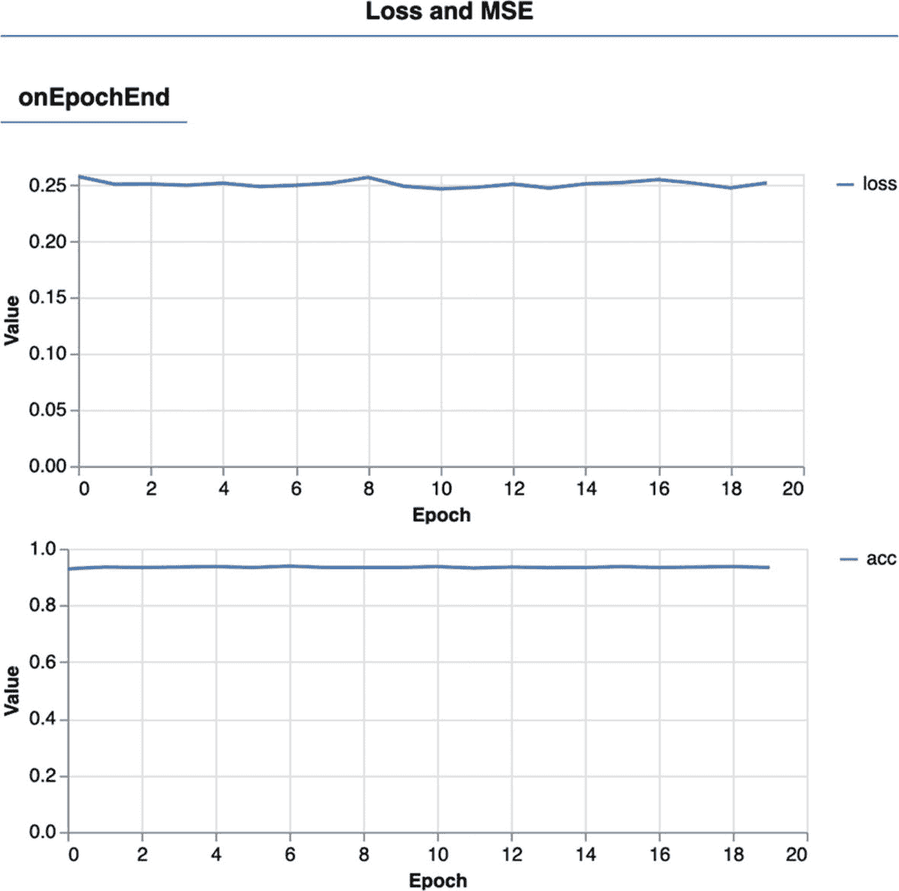Figure 2-4Loss and accuracy valuesThere is one crucial thing this exercise is missing, and that’s using the model to predict an outcome. To predict, call the method `model.predict()`

 using as input a tensor of the same shape as the one used for training. The tensor’s values are the predictors, the input data we want to classify. In this case, since we have a synthetic dataset, there is no real meaning behind the predictors. In the following are some examples of how to predict using some arbitrary values. You can add these lines anywhere after `model.fitDataset():`

```

// 输出值应接近 0。

model.predict(tf.tensor2d([[0.1773208878849,

-1.447465411302]])).print();

// 输出值应接近 1。

model.predict(tf.tensor2d([[-1.58566906881,

1.91762229933]])).print();

```py

In the first example, the prediction value should be close to 0, that is, 0.0613599, meaning that we should classify this case with the label “0.” The second example outputs a number close to 1, so its label is “1” since it is above the usual threshold of 0.5.RecapIn this first exercise, you have built and trained your first TensorFlow.js model, a logistic regression. During the tutorial, we explored essential concepts of TensorFlow.js, such as loading a dataset, preparing it, designing a model, and training it. Moreover, we also used TensorFlow.js’ visualization library, tfjs-vis, to visualize the dataset and monitor training.In the following section, we will introduce a second model, linear regression, to create a model that predicts a continuous value.Building a linear regression modelIn the previous section, we explored the basic components of TensorFlow.js and used them to develop a logistic regression model. In this exercise, we will keep building on that knowledge and implement another model in a second web application. This time, the algorithm in question is linear regression, a supervised learning algorithm that predicts a scalar response. We will use it to create a model capable of predicting the distance the author would walk in one day, given the number of taken steps.The web app you will develop follows a similar approach to the one we just did. It downloads a dataset, processes it, plots it with tfjs-vis, and then fits a model with it. But, in this one, you will create a mechanism that allows the user to enter a value (number of steps) to predict an outcome using the model.Understanding linear regressionLinear regression is one of the most useful and essential tools from machine learning and statistics. Its objective is modeling an association between a set of independent variables and a target continuous variable—a variable whose value can be any number between a minimum and a maximum value—by finding a linear equation, short for just a line, that best fits the data.Let’s see a fun example. In Figure 2-5, you can find a scatter plot showing the *Hit Points* (HP) and *Combat Power* (CP) of a sample of *Pidgey* (a Pokémon) from the game *Pokémon Go*.^(5) Now suppose we want to know the HP of a Pidgey whose CP stat is 100\. How do we do this? With a linear regression model!Figure 2-6 shows the same dataset, but with a fitted line that serves to predict the Pokémon’s CP using its HP as the independent variable. If you look at the upper-right corner of the graph, you will find our test case (HP = 100) and the model’s output (CP = 40.9) marked with a big dot.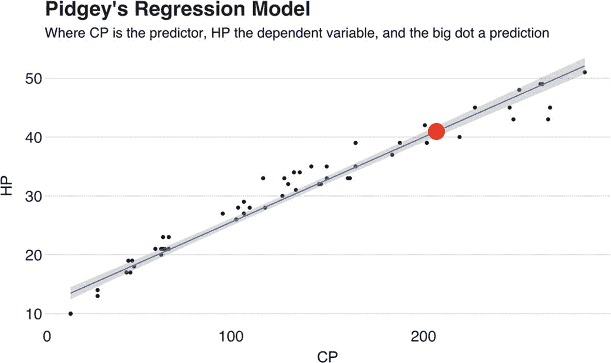Figure 2-6Pidgey’s regression line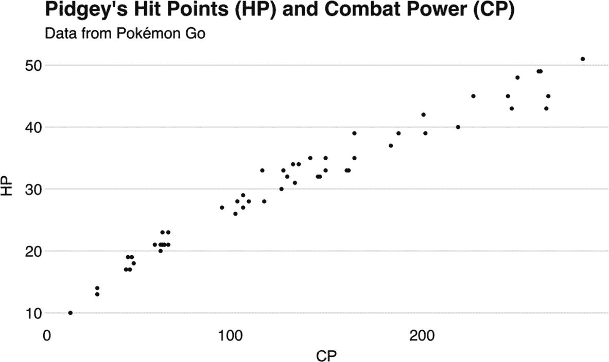Figure 2-5Sample of Pidgey’s HP and CPThere are two things that we need to notice here. Unlike the previous logistic regression model, linear regression predicts a continuous value, which in this example could have been any number from 0 up to plus infinity. Moreover, we also need to be aware that linear regression works on the assumption that there is a linear relationship between the independent variables and the dependent variable. Otherwise, if the dataset does not meet this assumption, then the model’s predictive power will be highly inaccurate.For example, Figure 2-7 shows the population of Puerto Rico from the year 1960 until 2018 and a suboptimal regression line that does not fully fit the dataset. Until the 2000s, the population increase was mostly linear. After that, it starts to decline and loses its linearity. Yet, the regression line keeps growing. So, this model is not useful.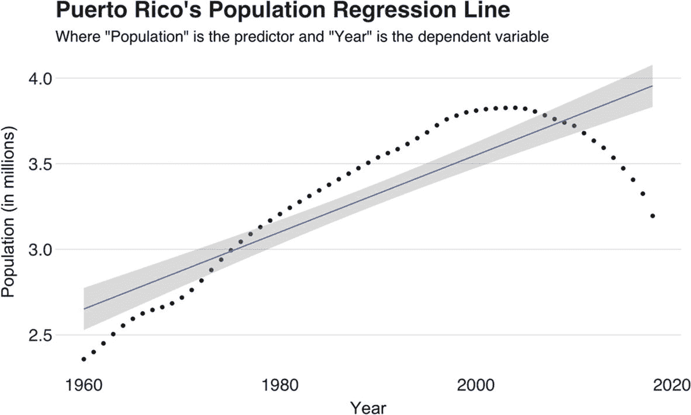Figure 2-7A bad regressionOverview of the dataThe data you will use to train the model is a small dataset of 198 observations, where each row represents a particular day. It has two columns: the number of steps walked in that day and the total distance (in kilometers) traveled. Since the goal here is predicting the distance walked based on steps taken, the former plays the role of the dependent variable and the latter, the independent variable. In contrast to the last exercise’s synthetic dataset, this one comes from the author’s Fitbit^(6) device.Building the appYou will build this app following a similar approach to the last one. In the beginning, you will set up the workspace. Once set, we will discuss how to structure the HTML and import the necessary packages. After this part, you will load and plot the dataset, followed by defining the model and training it. Then, we will end this tutorial by building a feature for the app that will let the user make predictions from it.Setting up the workspaceFor reasons covered in the following segment, you will host the web application in a local web server. But do not despair; it is not as hard as it sounds. Chances are you have Python installed in your machine. If so, starting a local HTTP server is only a matter of executing `python3 -m http.server` in the terminal. But since this book is about a web framework, it makes more sense to use something along those lines to create the server. So, as an alternative to Python, you could use *http-server*,^(7) a command-line HTTP server. To install it, execute `npm install http-server -g` (you need to have Node.js installed in your computer). To start the server, run `http-server`. By default, it runs the server on port 8080, but you can change it using the `-p` or `--port` option.Now create the project’s directory on the location of your preference, and in the terminal, navigate to that folder. Once there, execute the previous command to start the server.To test it, create a new file in the project’s directory, name it *index.html*, and write “hello, world” on it. Then, open a new browser tab and go to localhost:8080 (make sure the port number is the correct one). You should see a page with the message you wrote. Now, let’s turn this page into something better.Structuring the HTML, importing the packages, and loading the scriptStill on the same HTML file? Good, because you will need it. In this step, you will define the structure of the app’s interface and load TensorFlow.js and tfjs-vis and the training script. But first, remove the “hello, world” line you previously wrote.Afterward, create the root `<html>` tag, and within it, add a `<head>` tag (do not forget to close them!). Inside the `<head>` tag, add the script tags to import TensorFlow.js and tfjs-vis:In the line that follows the `</head>` tag, create a `<body>` tag. Like the last exercise, inside this node you will define elements whose content is programmatically created by the app. The first of these elements is a `<div>` with `id` attribute `load-plot`. Within this `<div>`, the program creates a button that, once clicked, loads and plots the dataset.Right after it, add an input field of type “number,” with ID `number-epochs`. Like last time, you will use this field to specify for how many epochs you want to train the model. On this occasion, let’s avoid adding a maximum value; have fun and play around with the model (break it if you want!). On top of this input field, add a `<label>` element. Set the `for` attribute to the same ID as the input. Then, after the input, create another `<div>` with `id` attribute `train-div`. Here, the app will create the button that starts the training.There is a third and more interesting `<div>` section that we will use for the app’s prediction functionality. Within this node, we will have three elements. The most important of them is a numeric input field that the user will use to enter the value the model uses to predict. Next, there is a button that once clicked reads the input value and triggers the prediction. Lastly, the final element is a paragraph `<p>` that displays the model’s output.Last but not least, add the script tag that calls the *index.js* script. The following code shows the complete *index.html* file:

```

Epochs

```py

If the server is still up, go again to the browser and refresh the page so you can see how your masterpiece app is shaping up.Loading and visualizing the data with tfjs-data and tfjs-visClose *index.html* and say hello to *index.js*. This part of the exercise is about loading the data using tfjs-data and visualizing it with tfjs-vis. So, as the first step, declare the variable `csvUrl` at the top of the file and set its value to the dataset’s remote location. After that, declare a second variable and name it `csvDataset`.In this example, we will do things a bit differently than the previous one. Instead of plotting just the training set, we will also plot the test cases from several parts of the app. So, we need several arrays that will contain the data to draw. In addition to them, declare the tfjs-vis’ surfaces:

```

const csvUrl = 'https://gist.githubusercontent.com/juandes/2f1ffa32dd4e58f9f5825eca1806244b/raw/c5b387382b162418f051fd83d89fddb4067b91e1/steps_distance_df.csv';

let csvDataset;

const dataSurface = {

name: '步骤与距离散点图',

tab: '数据' };

const fittedSurface = {

name: '拟合数据集', tab: '数据' };

const dataToVisualize = [];

const predictionsToVisualize = [];

let fittedLinePoints = [];

```py

Following this, create the plotting function and call it `loadData()`

. This function has to be async because it uses the `forEachAsync()` method

 we used earlier to iterate over the data and change its structure:

```

async function loadData() {

csvDataset = tf.data.csv(

csvUrl, {

columnConfigs: {

distance: {

isLabel: true,

},

},

},

);

await csvDataset.forEachAsync((e) => {

dataToVisualize.push({

x: e.xs.steps,

y: e.ys.distance,

});

});

tfvis.render.scatterplot(dataSurface, {

values: [dataToVisualize],

series: ['数据集'],

}));

}

```py

The function’s first statement loads the data (the dataset is also available in the book’s repository) and stores it in the `csvDataset` variable you previously declared. In the line that proceeds, we iterate over the dataset using `forEachAsync()`

, and in each iteration, create a dictionary made of two keys, `x` and `y`. Set the value of `x` to the number of steps and the value of `y` to the distance. These dictionaries are then pushed to `dataToVisualize`. After `forEachAsync()`, call `tfvis.render.scatterplot()` using as arguments the surface `dataSurface` and an object consisting of the values to visualize and the series.By this point, you might be wondering, “what if I want to load a dataset not from the Internet, but from a local directory, can I do this?” The answer is yes! You can do so with the same `tf.data.csv()` function

 by specifying the path to the local file, instead of a URL. But there is a small catch, and it is that the app must be running on a web server. Otherwise, you will meet an error due to a mechanism called **same-origin policy** and **cross-origin resource sharing** (CORS).For the sake of clarification, we could say that the same-origin policy is a security mechanism that denies one document loaded from one origin to load another from another origin. CORS, on the other hand, is the tool that enables resource sharing across origins. In the case of running a web app directly from the HTML (like we did in the first exercise), Internet browsers restrict access to other local files. Contrarily, an application running on a server has no issues accessing a file that is also in the server. If you wish to use a local version of the dataset, save the remote one locally or get it from the book’s repository. Then, back at the code, replace the dataset’s URL with `steps_distance_df.csv`.After `loadData()`, define `createLoadPlotButton()`

, the function that calls it:

```

function createLoadPlotButton() {

const btn = document.createElement('BUTTON');

btn.innerText = '加载并绘图数据';

btn.id = 'load-plot-btn';

btn.addEventListener('click', () => {

loadData();

}));

document.querySelector('#load-plot')

.appendChild(btn);

}

```py

This function works just like the one we used in the past section. It creates a button with a listener that runs `loadData()` once it receives a click. To end the section, create the `init()` function

 that calls `createLoadPlotButton()`:

```

function init() {

createLoadPlotButton();

}

init();

```py

Return to the app and click the button to load and plot the data. Everything worked, right? There you should see the data and its linearly characteristic (just what linear regression likes!), which honestly is not that surprising at all because my walking stride is quite constant. Remember that you can close and open the visor by pressing the backtick key.Defining the modelNow that we have the data, we will proceed to define the model. So, let’s open this section by declaring the model’s variable, `model`, at the top of the file. Then, create a new async function named `defineAndTrainModel()`

 with a parameter `numEpochs` (does this process sound familiar?). At the top of the function, use `tfvis.visor().open()` to force open the visualization visor. After this line, use `const numFeatures = (await csvDataset.columnNames()).length - 1` to create a variable with the number of features as well as a `map()` operation on `csvDataset` to create a flattened version of the dataset.

```

let model;

async function defineAndTrainModel(numEpochs) {

// 确保 tfjs-vis 可视化器已打开。

tfvis.visor().open();

const numFeatures = (await csvDataset.columnNames())

.length - 1;

// 将特征（xs）和标签（ys）转换为数组

const flattenedDataset = csvDataset

.map(({ xs, ys }) => ({ xs: Object.values(xs), ys: Object.values(ys) }))

.batch(32);

}

```py

Now comes the fun part, and that’s designing the model. Once again, it has a single layer with one unit (it gets better later; I promise). To design it, create an instance of `tf.Sequential` and set it to the `model` variable you just defined. After that, add a dense layer to the model and pass as argument a dictionary with key `inputShape` set to `[numFeatures]`, and `units` set to 1\. This latter value is 1 because we expect the model’s output to be a single number representing the predicted distance. Also, note that we are not using an activation function because we want to model a linear relationship between the inputs and output:

```

model = tf.sequential();

model.add(tf.layers.dense({

inputShape: [numFeatures],

units: 1,

}));

```py

Following the model’s definition, the next step is compiling it and setting its optimizer, loss function, and metric score. In this occasion, you will use the following parameters:*   **Adam** optimizer.

    *   The **mean squared error** (MSE)

     loss function, a function that measures the mean of the squares of the errors, that is, the difference between the actual label and the predicted one, that is, *loss* = (*y*[*true*] − *y*[*pred*])². Remember that during training, the model wants this number to be as low as possible.

    *   As for the last parameter, the metric score, this model also uses the **mean squared error**.

```

model.compile({

optimizer: tf.train.adam(0.1),

loss: tf.losses.meanSquaredError,

metrics: ['mse'], // 也表示均方误差

});

```py

Lastly, call `model.fitDataset()`

 using `flattenedDataset` as the first argument. For the second argument, use an object whose values are the `numEpochs` variable and a list of callback functions that are executed at several stages of the training. For this model, use only one callback function to visualize the training loss and MSE metric at the end of each epoch (`onEpochEnd`).There is a new thing I want us to do with `model.fitDataset()`, and that’s using its returned value. Back when we introduced the `await` keyword, we described it as a mechanism used for waiting for an asynchronous function to finish its execution. While true, the technical explanation is that it waits until the async function returns something known as a **promise**. A promise is a programming pattern that refers to a value that returns sometime in the future. In other words, an `await` statement causes the program to stop and wait for what was promised.An async function always returns an implicit promise that supplies the intended value—the return value you specified—at some point in the future (if the function has no return line, the promise intended value is void). In the case of `model.fitDataset()`, it returns a “promised” *History*, formally written as *Promise<History>*. A History object is essentially a record of the training’s loss and metric values at each epoch, information that might be valuable if one wishes to further evaluate the model. For this example, we will just print it:

```

const history = await

model.fitDataset(flattenedDataset, {

epochs: numEpochs,

callbacks: [

tfvis.show.fitCallbacks(

{ name: '损失和均方误差', tab: '训练' },

['loss', 'mse'],

{ callbacks: ['onEpochEnd'] },

),

{

onEpochEnd: async (epoch, logs) => {

console.log(`${epoch}:${logs.loss}`);

},

}],

});

console.log(history);

```py

Now, close `defineAndTrainModel()`

 (we will come back to it later). Before wrapping up this section, implement the function that creates the button that starts the training. This function is very similar to the one also defined here, except for one detail. By default, the function disables the button so that we cannot start the training until the data is loaded:

```

function createTrainButton() {

const btn = document.createElement('BUTTON');

btn.innerText = '训练！';

btn.disabled = true;

btn.id = 'train-btn';

btn.addEventListener('click', () => {

const numberEpochs =

document.getElementById('number-epochs').value;

defineAndTrainModel(parseInt(numberEpochs, 10));

});

document.querySelector('#train-div')

.appendChild(btn);

}

```py

That button is to stay disabled until the user loads the data. To enable it back, return to `createLoadPlotButton()`

, and after the call to `loadData()` (in the listener), add the following two lines:

```

const trainBtn = document

.getElementById('train-btn');

trainBtn.disabled = false;

```py

The first instruction gets the button by its ID, while the second one sets its `disabled` attribute to `false`.Once done, go to the `init()` function

 and call `createTrainButton()` from the first line. Then, test the app. Is it running yet? Good. There you should see two buttons, “load and plot” data and the disabled “train.” Click the first one to load and visualize the data. After clicking it, the grayed-out button should now be enabled. So, click it to train the model.For this model, I recommend training for around 20 epochs. Plus, the training phase is so fast that 1 or 20 epochs do not make that much of a difference. When it finishes, open the inspect tab from the browser to see the model’s History.One interesting thing we could do with the model is showing the fitted line it learns, like in Figure 2-6. Unfortunately, with our current tools, there is no direct way of doing this. But there is a very hacky one. This approach involves performing many predictions using as input a sequence of incremental values (this is usually known as “range”) and plotting these values and the output produced by the model. For our dirty experiment, we could use 0 as the minimum and 30,000 as maximum with an increment step of 500 (this would give us 61 points). Let’s try this with the following function:

```

function drawFittedLine(min, max, steps) {

// 如果用户训练超过一次，则清空数组。

fittedLinePoints = [];

const predictors = Array.from(

{ length: (max - min) / steps + 1 },

(_, i) => min + (i * steps),

);

const predictions = model

.predict(tf.tensor1d(predictors))

.dataSync();

predictors.forEach((value, i) => {

fittedLinePoints

.push({ x: value, y: predictions[i] });

});

const structureToVisualize = {

values: [dataToVisualize, fittedLinePoints],

series: ['1. 训练数据', '2. 拟合线'],

};

tfvis.render.scatterplot(fittedSurface,

structureToVisualize);

}

```py

Then, add a call to `drawFittedLine()`

 after the line that prints the model’s History using the current parameters:

```

drawFittedLine(0, 30000, 500);

```py

To test this functionality, restart the app, and train again. In my case, I trained using 15 epochs, producing the loss and error graph seen in Figure 2-8. Unlike our previous loss graph, in this one, you can clearly see how the loss function goes from a large value early during training to a low one. When the training ends, switch to the visor’s “Training,” and there you will find both the training data and the fitted line in separate plots. Try different epoch values to see how the line evolves (the sweet spot is around 40–50 epochs). Figure 2-9 presents a screenshot of the plot.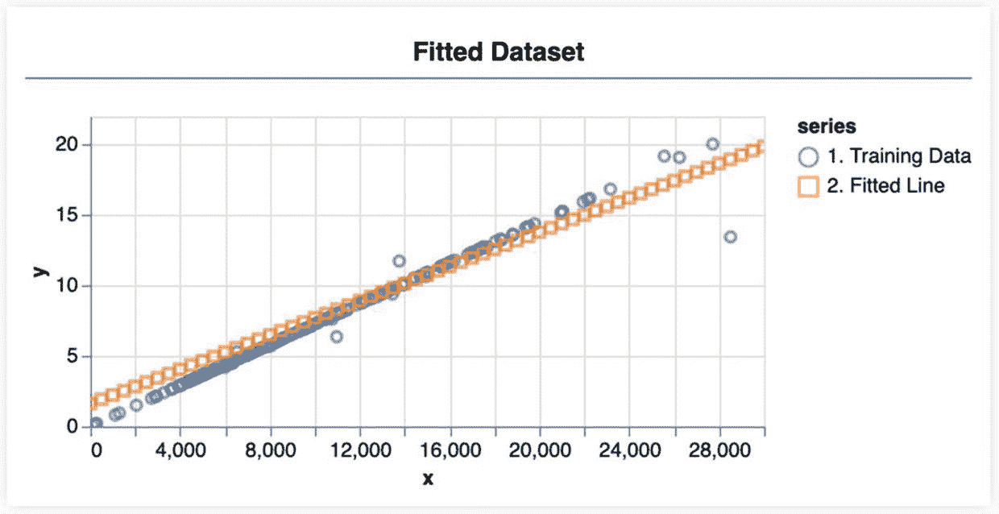Figure 2-9Training set (circles) and the fitted line (squares)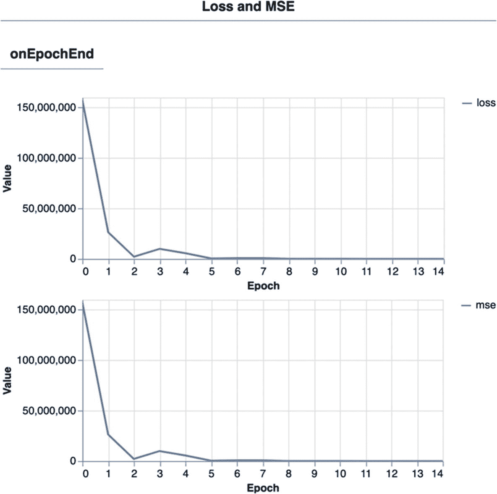Figure 2-8Loss and error valuesTesting the modelTo have a more complete and useful application, you will implement a feature that allows a user to enter a value—the number of steps—to predict the distance I would walk on a day. To build such functionality, you will create an input field and a click button that, when pressed, parses the value and predicts with it. After predicting, the app draws the input data and the prediction so we can visually assess the accuracy. Lastly, the outcome is displayed on the app’s `<p>` tag mentioned earlier. In the following, you will find the functions that create the input field `createPredictionInput()`,

 the output paragraph `createPredictionOutputParagraph()`, and the button `createPredictButton()`.

```

首先是创建预测输入函数 createPredictionInput():

function createPredictionInput() {

const input = document.createElement('input');

input.type = 'number';

input.id = 'predict-input';

document

.querySelector('#predict').appendChild(input);

}

现在创建预测输出段落 createPredictionOutputParagraph():

function createPredictionOutputParagraph() {

const p = document.createElement('p');

p.id = 'predict-output-p';

document.querySelector('#predict').appendChild(p);

}

创建预测按钮 createPredictButton():

function createPredictButton() {

const btn = document.createElement('BUTTON');

btn.innerText = '预测！';

btn.disabled = true;

btn.id = 'predict-btn';

btn.addEventListener('click', () => {

// 从输入获取值

const valueToPredict = document

.getElementById('predict-input').value;

const parsedValue = parseInt(valueToPredict, 10);

const prediction = model

.predict(tf.tensor1d([parsedValue]))

.dataSync();

// 获取元素并添加预测

const p = document

.getElementById('predict-output-p');

p.innerHTML = `预测值: ${prediction}`;

// 将输入和预测推送到 predictionsToVisualize，然后绘制它。

// 将输入和预测推送到 predictionsToVisualize，然后绘制它。

predictionsToVisualize.push(

{ x: parsedValue, y: prediction },

);

const structureToVisualize = {

values: [dataToVisualize, predictionsToVisualize],

series: ['1. 训练数据', '2. 预测'],

};

tfvis.render.scatterplot(dataSurface, structureToVisualize);

// 自动切换到“数据”标签页

tfvis.visor().setActiveTab('Data');

});

document.querySelector('#predict').appendChild(btn);

}

```py

As before, you will notice that the “predict” button is disabled. To enable it, add the next two lines below `drawFittedLine()` in `defineAndTrainModel()`

:

```

const predictBtn = document.getElementById('predict-btn');

predictBtn.disabled = false;

```py

Next, add the three functions to `init()`, run the app, and predict. You will notice that after predicting, the visor switches to the “Data” tab and shows on the first chart the input value and the outcome.

```

function init() {

createTrainButton();

createPredictionInput();

createPredictButton();

createPredictionOutputParagraph();

createLoadPlotButton();

}

```py

Explaining the modelOne last thing we will do in this exercise is interpreting the model to know why it predicts the way it does. Before breaking it down, we will use the method `model.summary()`

 to review the model’s layers and parameters. These parameters, also known as weights, are the things the model learns; learning in ML is finding a good set of weights. So, with the weight’s values, we can reconstruct the equation the model learned from the data.Back when we introduced the linear regression algorithm, we mentioned that its objective is finding a line that best fits the data. Straight lines, and maybe you remember this from school, are described by the following equation: *y* = *mx* + *b*, where *m* is the slope (how steep the line is) and *b* is the y-intercept (the value of *y* when *x* = 0). These two variables are what the model is trying to learn.If you execute `model.summary()` at some point after the training, it outputs a table such as the one in Figure 2-10.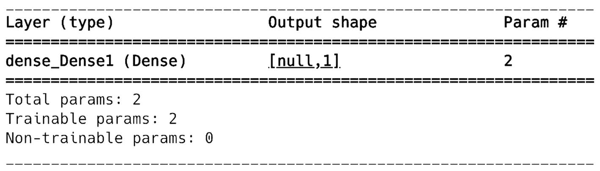Figure 2-10The model’s summaryOn the first column, you have the dense layer, followed by its output shape and a column “param” which counts how many parameters the layer has—two. To get them and print them, add this line after `model.summary()`:

```

console.log(`模型权重:\n${model.getWeights()}`);

```py

The values that follow are the model’s weights after training it for 45 epochs (you might get a slightly different result):

```

模型权重:

Tensor

[[0.0007682],],Tensor

[-0.6309097]

```py

The first number, 0.0007682, is the weight of the layer’s only node—this value is the equivalent to the line’s slope *m*. The second number, -0.6309097, is the node’s bias, and it represents the regression line’s y-intercept. Thus, to conclude, if we insert these numbers in the line equation, it will look as follows: *y* = 0.0007682*x* +  − 0.6309097, where *x* is the number of steps and *y*, the predicted distance. To manually test it, try the equation with *x = 1000*.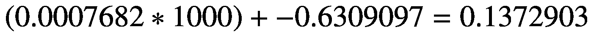This result means 1000 footsteps equal 0.13 kilometers traversed. To test the result (no, I’m not going to send you running), return to the app, and make a prediction also using 1000 as input. The result should be similar to the previous one.RecapIn this example, we developed a web app that trains a linear regression, an algorithm that seeks to find a line that fits a dataset to predict a continuous outcome. The model we built uses steps data to predict distance walked. Through this exercise, we learned how to use tfjs-data to retrieve data from a local file, how to interpret a model, and how to read a user’s input to predict.Wrapping things upOver the last two exercises, we have explored the fundamental structures of TensorFlow.js to fit a logistic and linear regression model using the Layers API. As part of the training, we used two additional components of TF.js to handle the data and to visualize it. The first of these, tfjs-data, is a module for loading and processing data, while the second, tfjs-vis, provides a simple API for visualizing data and aspects of the training. Additionally, earlier in the chapter, we saw a guide on how to approach a machine learning problem, and throughout the tutorials, we applied most of the guide’s content. For instance, we explored the data, defined the model’s architecture, and tested it.What we saw here is a preview of what we can achieve with TensorFlow.js. While most applications follow the same method and employ the same techniques and functions, the extent of what they can do goes further than what we have done so far. In the next and upcoming chapters, we will keep exploring and using the framework to develop more exciting and powerful apps.The complete source code of both apps is available on the book’s GitHub page. The version of the app you will find there contains part of the documentation here discussed and a CSS file to improve the app’s looks.Exercises1.  What are the three principal hyperparameters a model uses?

     2.  Re-train all of them using other datasets. Chapter 11 tells more about where to find them.

     3.  What is the main difference between logistic and linear regression?

     4.  Want to see two examples of models gone wrong? Train both models using each other’s datasets. This will give you an idea on the importance of choosing an appropriate loss function.

     5.  Fit another logistic and linear regression model using a generated dataset created with `tf.data.generator()` like this:

    ```

    function* data() {

    for (let i = 0; i < 100; i++) {

    yield tf.tensor1d([1]);

    }

    }

    function* labels() {

    for (let i = 0; i < 100; i++) {

    yield tf.tensor1d([1]);

    }

    }

    const xs = tf.data.generator(data);

    const ys = tf.data.generator(labels);

    const ds = tf.data.zip({ xs, ys }).batch(32);

    ```py

    Then, use `ds` as the first argument of `model.fitDataset()`. Try different combinations of tensor's values. This sample produces a dataset where the features and labels are 1; not interesting at all.

     6.  In the linear regression model, use the property `weights` of the dense layers to set the weights.

```

```py

```
