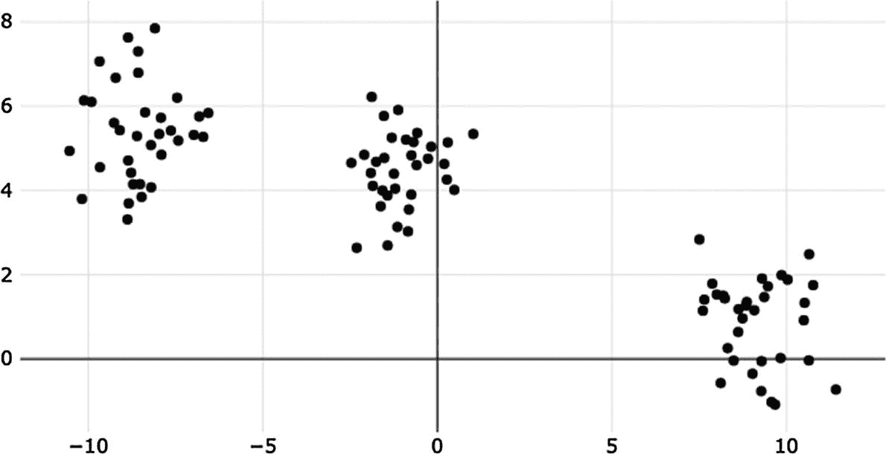
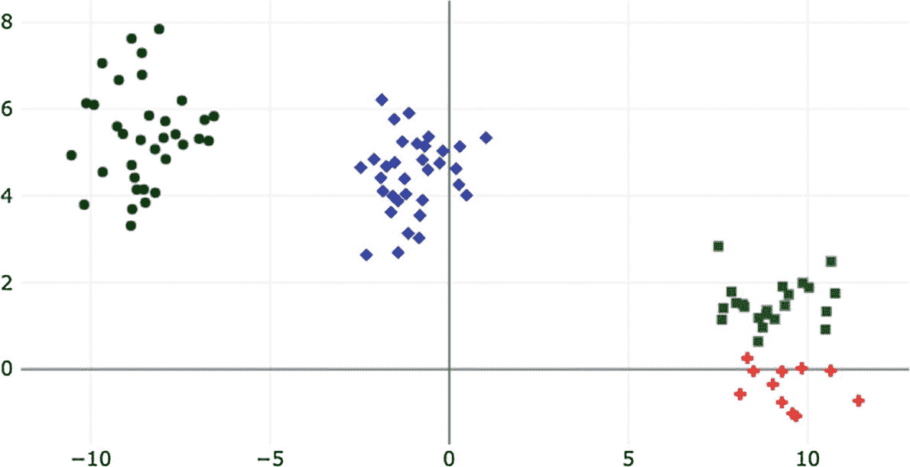

# 3. 使用 ml5.js 进行 k-means

在上一章中，我们探讨了 TensorFlow.js 的基本模块，以设计、实现和构建逻辑回归和线性回归模型。这两个模型是监督学习的例子，这些算法使用由特征和标签组成的数据集来学习一个将这些特征映射到标签的函数。

在我们的下一个练习中，我们将放下监督学习的话题，引入其对立面，即 **无监督学习**，以及其典范算法，**k-means**。

在这里，你将编写一个网络应用程序，使用任意数据集训练 k-means 模型，并使用可视化库 **Plotly** 可视化其不同的结果。与之前两个问题中你使用 Layers API 实现算法不同，在这个问题中，你将使用一个名为 **ml5.js** 的外部库。这个库是 TensorFlow.js 的高级抽象，提供了一个简单的接口来访问几个预构建和现成的模型。这个练习灵感来源于 ml5.js GitHub 页面上展示的 k-means 示例.^(1)

## 理解 k-means

在监督学习环境中，我们是老师。通过使用标签，我们通过告诉模型“这是一个苹果”，“这是一封垃圾邮件”，或者“2000 步等于 2 公里”来监督学习。但在无监督学习中则不然——在这里，没有标签或类别。由于没有结果，模型的目标是从数据集的特征集中发现 **关联** 和 **模式**。

无监督学习最经典的应用是 **聚类**（Murphy，2013 年）。这种技术旨在以这种方式将数据集划分为组，使得相似的数据点被分配到同一个簇中，同时保持那些不相似的数据点在其他簇中。用更数学的语言来说，这相当于在最大化不相似点的 *簇间距离* 的同时，最小化 *簇内距离*（也称为成对不相似度）。

k-means 聚类算法的一个典型例子，它通过将未标记的数据集划分为 *k* 个簇来对数据观测值进行分组。k-means 通过迭代地将 *k* 个簇的中心移动到最小化总簇间距离（Gareth 等人，2013 年）来工作。该算法通过一个初始步骤和两个迭代步骤来完成，直到收敛：

+   初始步骤，0：从数据点中随机选择一个初始的 *k* 个中心，称为质心。

+   分配步骤，1：使用欧几里得距离作为不相似度标准，将每个数据点分配到其最近中心。

+   更新步骤，2：对于每个质心，计算分配给它所有点的平均值。之后，质心移动到新的平均值。

## 关于 ml5.js

ml5.js 库是 TensorFlow.js 的高级接口，它使我们能够快速训练像 k-means 这样的算法，并且只需几行代码就能使用预训练和现成的模型。根据其文档，ml5.js 旨在使 Web 上的机器学习民主化，并使其对具有各种技术背景的广泛用户都易于接近。由于其简单性和易用性，ml5.js 是构建原型的一个宝贵工具。

现在你可能会问：如果它如此简单友好，为什么我们不能一直使用它呢？这是一个合理的问题。一个答案是，作为一个高级库，它阻止了我们访问 TensorFlow.js 提供的所有广泛的功能和 API，在我看来，这正是使其成为一个丰富框架的原因。

## 关于数据

这个练习包含一个合成数据集（这是最后一个，我保证！）它有 100 个观测值，两个特征和三个未明确标记的类别，但一旦我们训练模型，我们就会发现它们。毕竟，这就是无监督学习的目的。

## 构建应用

你在这里将要构建的应用看起来和感觉上与上一章中创建的应用相似。因此，为了避免重复阅读我们已经讨论过的事情，这个教程将比之前的更简洁、更简洁。这种调整部分原因是因为我们不需要预处理数据或定义模型。尽管如此，方法论仍然是相同的：下载数据，拟合模型，并可视化。

### 设置工作空间和应用的 HTML

让我们开始吧。和之前一样，在你的首选位置创建一个目录，并使用工具 *http-server* 启动一个网络服务器。要启动服务器，请转到终端并在应用目录中执行 `http-server`；默认情况下，服务器运行在端口 8080 上。接下来，转到代码编辑器并创建 *index.html* 文件。在这个文件中，你将设计应用界面并加载所需的库。

在文件顶部，添加必要的 `<html>`、`<head>` 和 `<body>` 标签，并在 `<head>` 内部添加两个脚本标签以加载 ml5.js 和 Plotly。请注意，我们并没有导入 TensorFlow.js，因为 ml5.js 已经完成了这项工作：

在 `<body>` 元素内部，创建一个 `<div>`，并在其中创建一个类型为 *range* 的输入——`<input type="range">`——（不是像之前那样类型为 number）并设置其 `min` 和 `max` 属性分别为 1 和 4，`id` 设置为 `k-range`。这个元素是一个滑动控件，用于输入介于 `min` 和 `max` 值之间的数字。你将使用它来输入所需的聚类数 *k*。然后，在输入下方添加一个 `<p>` 来显示输入的值。这个 `<div>` 应该看起来像这样：

```py
Enter K (1 to 4)

k: 

```

接下来，您必须实现一种方法来获取滑块的价值并更新段落的文本，以便显示所选的 *k*。为了实现这一点，我们将在 HTML 中使用脚本标签来编写 JavaScript 代码。此脚本使用 `getElementById()` 获取滑块和段落，并将段落的 `innerHTML` 属性（即文本）设置为滑块中分配的值。然而，此指令只运行一次。为了确保段落始终显示当前的 *k*，您需要一个 `oninput` 事件，每次滑块的值改变时执行一个函数（类似于之前的点击监听器）。在这个新函数中，您将更改段落的文本为滑块的值：

```py
var slider = document
.getElementById('k-range');
var output = document
.getElementById('k-value');
output.innerHTML = slider.value;
slider.oninput = function () {
output.innerHTML = this.value;
}

```

在关闭脚本标签后，添加一个额外的 `<div>`，其 `id` 设置为 `button`。在这里，程序创建了一个启动训练的按钮。

最后，我们需要另一个 `<div>`，它将包含 Plotly 可视化画布（注意，使用 tfjs-vis 我们甚至不需要它）和一个脚本标签来启动 *index.js*。完整的 *index.html* 文件应该看起来像这样：

```py

Enter K (1 to 4)

k: 

var slider = document
.getElementById('k-range');
var output = document
.getElementById('k-value');
output.innerHTML = slider.value;
slider.oninput = function () {
output.innerHTML = this.value;
}

```

您可以关闭 *index.html* 并创建一个新的 *index.js* 文件。

### 训练

适配 ml5.js k-means 模型的训练函数非常简单且简短，以至于让其他函数看起来像是史上最复杂的事情（嗯，它们确实有点复杂）。它涉及两个语句。第一个是一个 `options` 对象，用于配置模型的聚类数量（`k`）和最大迭代次数（`maxIter`）。然后，是调用 `kmeans` 函数。

函数的第一个参数是数据集的 URL 或本地路径（注意，我们甚至不需要手动读取数据集？）。第二个参数是 `options` 对象，第三个参数是一个回调函数，当算法完成后会被调用。在教程的下一段中，您将创建一个回调函数，在训练结束后可视化聚类。现在，让我们简单地写一个打印“完成。”的函数。此外，请注意，`options` 对象是一个可选参数。如果没有使用，模型将使用默认值 `k=3` 和 `maxIter=5`。

在以下内容中，您将找到完整的训练函数，名为 `execute`，以及变量 `model` 和 `csvUrl`。如果您更喜欢使用数据集的本地版本，您可以在仓库中找到一个副本：

```py
let model;
const csvUrl = 'https://gist.githubusercontent.com/juandes/34d4eb6dfd7217058d56d227eb077ca2/raw/c5c86ea7a32b5ae89ef06734262fa8eff25ee776/cluster_df.csv';
async function execute(k) {
// The k-means model configuration
const options = {
k,
maxIter: 20,
};
// Arguments are: file's path, config, and a
// callback that’s called once the clustering ends
model = ml5.kmeans(csvUrl, options, () => {
console.log('Done :)');
});
}
```

如我们之前所做的那样，我们将实现一个名为 `createClusterButton()` 的函数来创建初始化训练的按钮。一旦点击，按钮将触发一个事件，读取滑块的值并将其用作 `execute()` 的参数：

```py
function createClusterButton() {
const btn = document.createElement('BUTTON');
btn.innerText = 'Cluster!';
btn.addEventListener('click', () => {
const slider = document
.getElementById('k-range');
execute(slider.value);
});
document.querySelector('#button').appendChild(btn);
}
```

最后，创建一个 `init()` 函数，并从其中调用 `createClusterButton()`。之后，调用 `init()`：

```py
function init() {
createClusterButton();
}
init();
```

要运行系统，启动本地 Web 服务器，并转到 localhost:8080。在那里，你会看到滑块及其当前值。接下来，选择所需的簇数 *k* 并点击“训练”按钮。不会发生任何事情，或者至少我们看不到任何事情（除了回调函数的输出）。在下一节中，我们将改变这种情况，并可视化数据以及聚类结果。

### 可视化簇

到目前为止，我们一直在使用 tfjs-vis 来可视化数据集。但为了这个练习的可视化，我们将从 tfjs-vis 脱离出来，并介绍 **Plotly**，这是一个用于可视化的高级 JavaScript 库，用于绘制聚类。

你将生成的图表是聚类数据集的散点图，每个簇都使用预定义的颜色和形状表示。生成此图的函数，我们将称之为 `visualizeResult()`，将是模型在训练结束时执行的回调函数。但在到达那里之前，请在 *index.js* 的顶部声明以下变量：

```py
const colMap = {
0: 'black',
1: 'green',
2: 'blue',
3: 'red',
};
const shapeMap = {
0: 'circle',
1: 'square',
2: 'diamond',
3: 'cross',
};
```

这些图是用来区分图上的簇的。例如，来自簇一的数据点以黑色圆圈表示，来自簇二的数据点以绿色正方形表示。接下来，我们将执行函数 `visualizeResult()`：

```py
function visualizeResult() {
const x = [];
const y = [];
const colors = [];
const shapes = [];
model.dataset.forEach((e) => {
x.push(e[0]);
y.push(e[1]);
colors.push(colMap[e.centroid]);
shapes.push(shapeMap[e.centroid]);
});
const trace = {
x,
y,
mode: 'markers',
type: 'scatter',
marker: {
symbol: shapes,
color: colors,
},
};
Plotly.newPlot('plot', [trace]);
}
```

要创建一个简单的 Plotly 图，你需要创建 *traces*，这是库用来指代数据集合的术语。对于这个可视化，我们只有一个用于绘制簇的 trace。在函数的开始部分，我们遍历 `model.dataset`，这是一个包含原始数据集的对象数组，还有一个名为 `centroid` 的附加属性，它指示数据点的簇。在每次迭代中，我们将这些值推送到不同的数组中，同时将簇编号映射到其相应的颜色和形状。循环结束后，定义 trace 并使用 `'plot'`（`<div>` 的 ID）和 `trace` 数组调用 `Plotly.newPlot()`。

这就是完整的 `visualizeResult()` 函数。在关闭代码编辑器并结束工作之前，回到 `kmeans()` 函数，并将回调函数替换为 `visualizeResult`：

```py
model = ml5.kmeans(csvUrl, options, visualizeResult);
```

### 测试模型

现在是测试模型的时候了。所以，打开浏览器，运行应用，并进行训练。在这个过程中，尝试所有不同的 k 值。

如果 *k* 为 1（图 3-1），你会注意到所有点都有相同的颜色和形状，因为它们属于同一个簇。换句话说，根据算法，每个观测值都属于同一个类别。



图 3-1

使用 k=1 进行聚类。注意所有数据点都聚集在同一个簇中

然而，我们知道这并不正确，因为数据集有三个类别。尽管如此，这种小 k 和大 k 之间的权衡是 k-means 的主要属性之一。如果选择不当，可能会得到较差的结果。然而，能够控制这个值的灵活性也是算法的关键特性之一，我们也可以说这是优势（或劣势，取决于你的观点）。

关于其他 k 的值，如果它是 2，你很可能会在同一个聚类下有两个数据块，剩下的一个作为另一个。如果等于 3，你可能会得到一个“完美”的聚类（在无监督学习中，什么是完美的呢？），其中每个数据块都是自己的聚类，如果 k 是 4，你将看到包含两个类别的数据块（图 3-2）。



图 3-2

使用 k=4 进行聚类。数据块在右下角被分为两个聚类。

## 回顾

在这个练习中，我们使用了 ml5.js 库来拟合 k-means 聚类。与之前的示例相比，我们看到了这个库如何通过数量级简化创建和训练模型的过程。例如，我们不需要加载数据集、准备数据或定义模型。简单，对吧？然而，尽管看起来很完美，我们需要理解使用这样的库意味着会失去 TensorFlow.js 提供的一些功能。除了聚类之外，我们还引入了一个可视化库 Plotly 来可视化它们。

练习

1.  什么是无监督学习？它与监督学习有何不同？

1.  列举 ml5.js 的两个优点和两个缺点。

1.  在应用中添加一个滑块或任何输入元素来选择最大迭代次数。

1.  使用逻辑回归的数据集来拟合模型，并检查算法找到的类别与真实类别有何不同。

1.  从头实现 k-means 算法。为了获得一些灵感，请参考这里找到的 ml5.js 实现：[`https://github.com/ml5js/ml5-library/tree/development/src/KMeans`](https://github.com/ml5js/ml5-library/tree/development/src/KMeans)。

1.  向数据集添加一个第三维度，对其进行聚类，并使用 Plotly 进行可视化。
