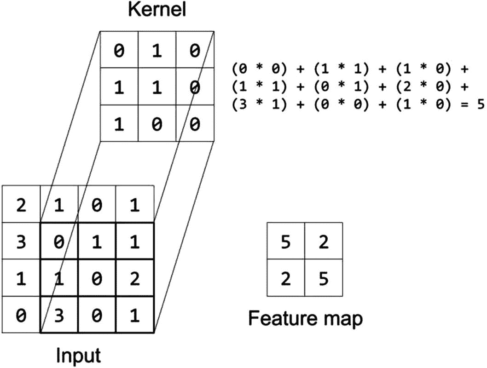
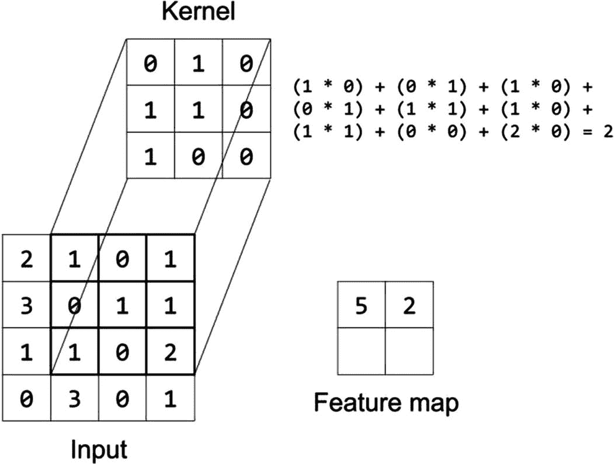
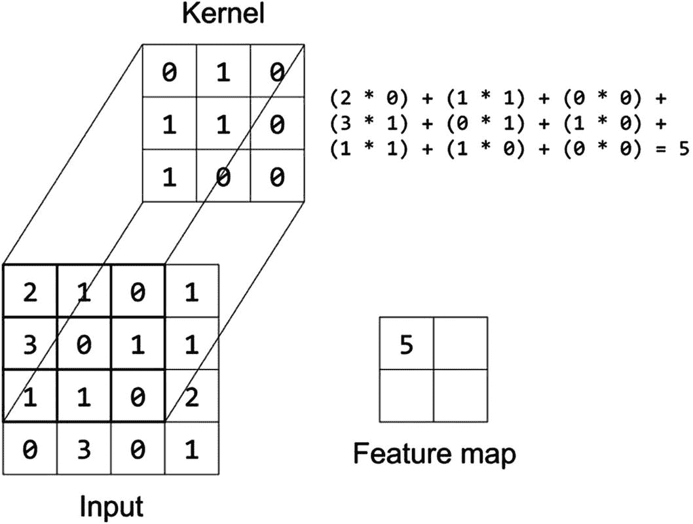
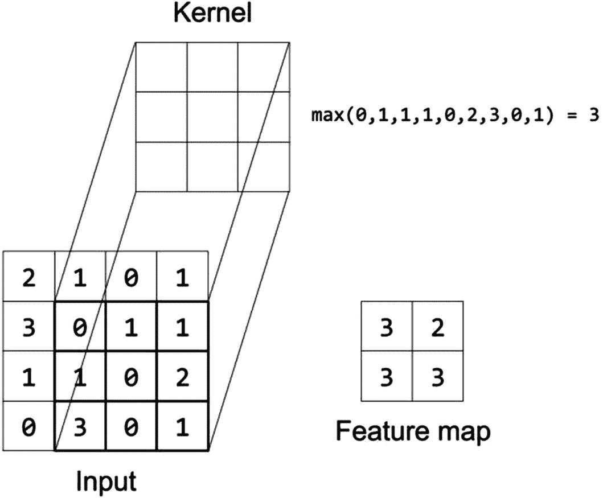
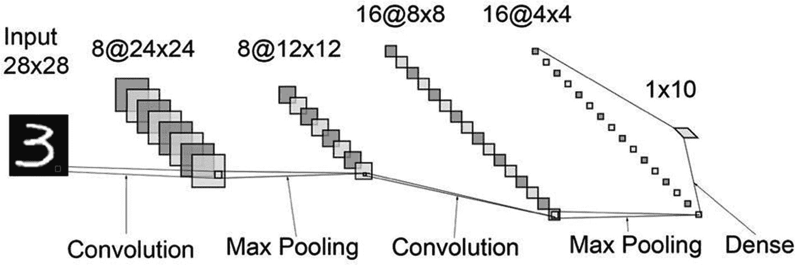
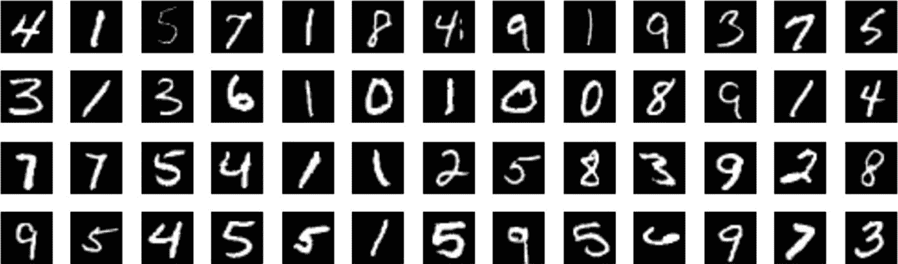
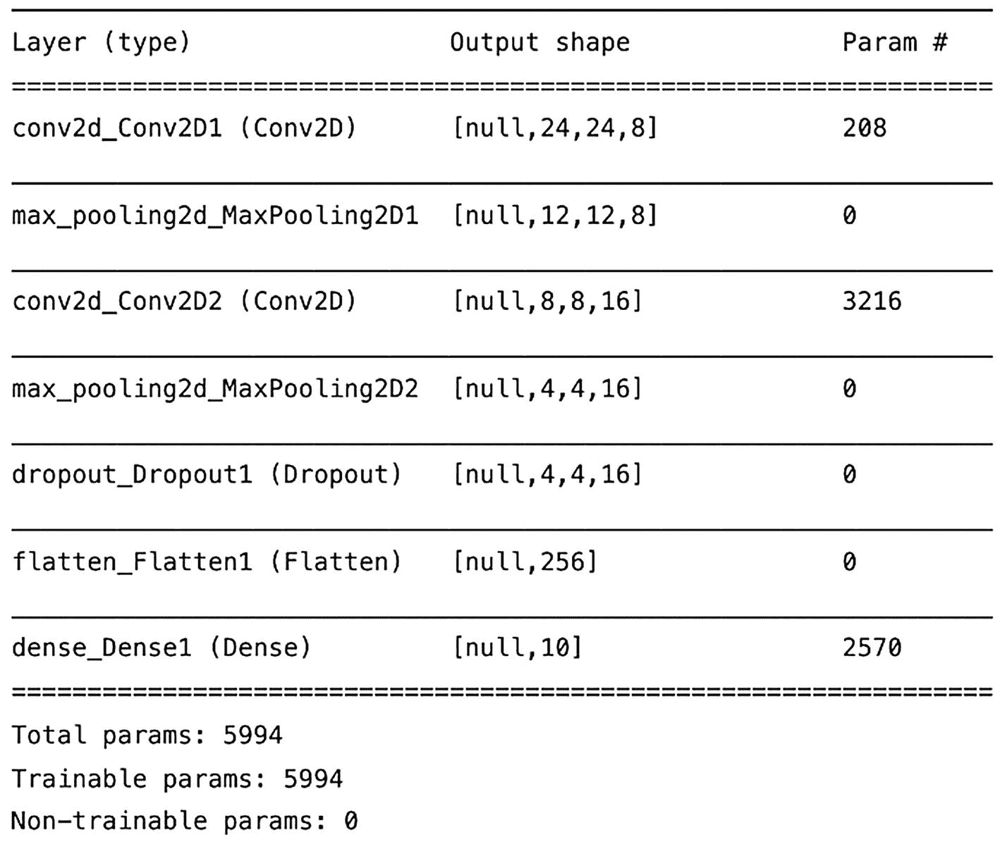
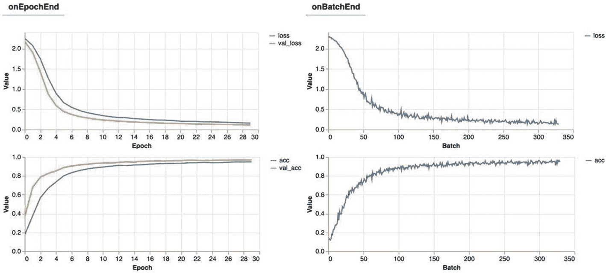
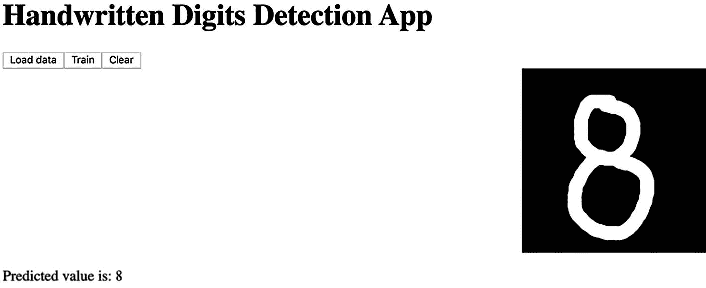

# 4. 使用卷积神经网络识别手写数字

在前几章中我们训练的模型让我们窥见了我们可以用 TensorFlow.js 做些什么。虽然这些模型富有洞察力和实用性，但你可能会说它们也很简单。这些算法（线性回归、逻辑回归和 k-means）是传统机器学习模型的例子。通常，你不会使用像 TF.js 这样的工具来实现它们。相反，大多数人会使用更专业的库，如 *scikit-learn*。然而，使用类似网络的结构来复制它们是开始使用 TensorFlow 的 Layers API 的一个极好方法。

现在我们已经很好地理解了 Layers API 的基础知识，我们将从简单的网络开始，构建我们的第一个复杂网络，一个**卷积神经网络**（CNN）。这一类模型——可能是最流行的深度学习算法——擅长提取和识别视觉特征。

你将开发的应用程序是一个由在**修改后的国家标准与技术研究院（MNIST）**数据集上训练的 CNN 驱动的手写数字检测应用程序。这个 Web 应用程序有一个画布，用户将在其中绘制一个数字，模型将实时识别。

## 理解卷积神经网络

当我们看到一只猫时，我们只知道它是一只猫。对吧？我们甚至都没有去想它。但大脑是如何做到这一点的呢？虽然实际的答案可能涉及关于神经科学和大脑视觉皮层的几本书，但为了我们的目的，我们可以用一个词来总结解释：**特征**。当你看一只小猫时，你能够识别它的特征：可爱的耳朵、胡须、蓬松的尾巴和锋利的爪子——这就是一只猫。

卷积神经网络（Y. LeCun 等，1989）是一种模拟大脑视觉皮层功能的神经网络，用于提取和识别图像的特征。一旦提取出来，网络就会学习这些特征构成了物体，例如，一只猫是一只猫，因为这些特征。

CNN 的核心涉及两个层：**卷积**层和**池化**层。卷积层提取图像的特征。这个层有一个卷积核（通常被称为**滤波器**），一个大小为 *height* * *width* * *depth* 的张量，它从左上角开始扫描（正确的术语是**卷积**）输入图像（一个张量），直到它到达右下角。

在每次卷积中，层计算核与当前覆盖的输入区域（称为**感受野**）之间逐元素乘积的总和。核的值，称为**权重**，是由学习算法调整的参数。在滑动整个输入之后，结果是称为**特征**（或激活）**图**的二维数组，它是输入主要特征的简化表示。请注意，卷积层可以有一个以上的滤波器。在这种情况下，深度大小是滤波器的数量。

图 4-1 展示了卷积的一个示例。在时间 *t*，大小为 3x3 的核评估输入图像的左上角并产生在特征图上显示的值。然后，在 *t* + 1（图 4-2），核向右滑动一个像素并重复该过程。到这一点，由于核位于张量的最右侧，在下一个步骤 *t* + 2 中，它向下移动一个单位，并再次从输入的最左侧（单元格 [2,1]）开始。滑动的长度（它移动了多少个单位）称为**步长**。图 4-3 显示了最后一个特征图。



图 4-3

完整的特征图



图 4-2

时间 *t* + 1 时的卷积



图 4-1

一个大小为 3x3 的卷积的示例

卷积层的一个属性是**填充**，这是一种通过向输入添加零填充（一个“零边界”）来控制层输出大小的技术。这样，在卷积之后，输出的尺寸与输入的尺寸保持相同。使用填充允许网络保留图像边缘的信息。

在卷积层之后添加一个**池化层**是一种常见的做法。这些层减少了（即子采样）输入图像的空间大小，从而减少了网络的参数数量，降低了模型过拟合的风险。直接结果是，参数更少导致模型更小，减少了训练时间和内存占用。

与卷积层类似，池化层涉及一个（池化）核，该核扫描输入。但与通过某些权重（池化核没有权重）乘以感受野不同，它使用平均或最大函数对感受野的值进行聚合和总结。图 4-4 展示了一个最大池化层的示例。在图像中，你可以看到输出中的每个单元格都是其感受野的最大值。



图 4-4

一个最大池化层和特征图

最后，卷积神经网络需要一个全连接层（在 TF.js 中称为密集层）来输出预测。

总结来说，卷积神经网络有两个主要层：卷积层和池化层。第一个层从图像中提取特征以学习如何识别它。例如，网络可能知道猫是猫，因为它有锋利的爪子。经过卷积操作后，得到的张量将具有更小的宽度和高度（取决于使用的属性）以及等于使用的过滤器数量的深度。第二个层，池化层，减少了输入的大小，从而得到一个更小、更快的网络。为了可视化这些概念，图 4-5 展示了我们将创建的 CNN 架构，包括输入和过滤器的尺寸。



图 4-5

卷积神经网络

## 关于 MNIST 数据集

我们将用于训练卷积网络的数据库是**修改后的国家标准与技术研究院**，或 MNIST（Yann LeCun 等，2010）手写数字数据库。这个著名的数据库，常用于基准测试机器学习模型和架构，包含超过 60,000 个 0 到 9 之间的 28x28 灰度手写数字图像。图 4-6 展示了一个样本。



图 4-6

MNIST 数字样本

有超过两个类别意味着我们将处理一个**多类别分类**问题，即将示例分类到三个或更多类别中的任务。

## 构建应用

对于本章的练习，你将制作一个应用，使用 MNIST 数据集来实时识别手写数字。一开始，就像我们处理其他数据集一样，我们将加载数据集，然后设计模型并进行训练。接着，我们将开发绘图功能，这涉及到设置一个画布来绘制我们希望识别的数字。绘制数字后，应用将图像转换为张量，并将其输入到模型中以识别输入值。

要开始练习，创建一个新的目录，并在同一位置启动本地服务器。

### 应用程序的 HTML 文件

在目录中创建应用的`*index.html`文件。在其顶部，在`<html>`标签之后创建一个`<head>`标签，并导入 TF.js、tfjs-vis 和名为`*style.css`的 CSS 文件。CSS，代表**层叠样式表**，是一种描述 HTML 文档样式的语言。我们将使用它来改变几个 HTML 元素的外观：

在`<head>`标签之后创建一个新的`<body>`标签，并在其中添加一个具有`id`属性`pipeline`的`<div>`。在这个`<div>`内部，应用创建了加载数据、编译和训练模型以及清除画布的按钮：

```py
Handwritten Digits Detection App

```

在 `<div>` 之后是 `<canvas>`，这是一个用于绘制图形的元素。它的 `id` 属性设置为 `draw-canvas`，CSS `class` 设置为 `digits-canvas`。这种样式将画布背景色改为黑色并使其居中。在画布之后，添加一个带有 `id predict-output` 的 `<p>` 元素来展示模型的推断数字：

最后，加载应用的 *index.js* JavaScript 代码和另一个名为 *data.js* 的脚本。这个文件——来自官方 TensorFlow.js 示例仓库——加载并准备 MNIST 数据集：

HTML 部分就到这里。至于 CSS 内容，创建一个 *style.css* 文件并添加

```py
.digits-canvas {
background-color: black;
display: block;
margin: auto;
}
```

### 加载数据和准备数据

这个练习的 MNIST 数据集包含一个大的精灵文件。因为这个格式，解开数据可能会变得混乱。为了简化任务，我们将使用来自官方 TF.js 示例仓库的脚本，该脚本下载、处理并将数据转换为张量.^(1) 但我们不会只是复制粘贴，而是要理解它做了什么（然后你可以无顾忌地复制粘贴）。所以，作为第一步，创建一个新的文件并将其命名为 *data.js* 。

脚本开始于几个与图像大小、元素数量和数据集及标签的 URL 相关的变量：

```py
export const IMAGE_H = 28;
export const IMAGE_W = 28;
const IMAGE_SIZE = IMAGE_H * IMAGE_W;
const NUM_CLASSES = 10;
const NUM_DATASET_ELEMENTS = 65000;
const NUM_TRAIN_ELEMENTS = 55000;
const NUM_TEST_ELEMENTS = NUM_DATASET_ELEMENTS - NUM_TRAIN_ELEMENTS;
const MNIST_IMAGES_SPRITE_PATH = 'https://storage.googleapis.com/learnjs-data/model-builder/mnist_images.png';
const MNIST_LABELS_PATH = 'https://storage.googleapis.com/learnjs-data/model-builder/mnist_labels_uint8';
```

然后是 `MnistData` 类，这个类负责加载数据和处理数据。这个类包括五个主要组件：一个构造函数，三个方法和一个静态函数。

构造函数初始化两个变量，用于存储最后返回的数据批次的索引：

```py
export class MnistData {
constructor() {
this.shuffledTrainIndex = 0;
this.shuffledTestIndex = 0;
}
}
```

在构造函数之后是异步方法 `load()`，负责加载数据。这个方法首先从远程位置读取数据集并将其分配给一个 `Image` 对象的实例。由于数据集很大，接下来的步骤包括将其分成 *N* 个元素的块并将它们添加到数组中：

```py
async load() {
const img = new Image();
const canvas = document.createElement('canvas');
const ctx = canvas.getContext('2d');
const imgRequest = new Promise((resolve) => {
img.crossOrigin = '';
img.onload = () => {
img.width = img.naturalWidth;
img.height = img.naturalHeight;
const datasetBytesBuffer = new ArrayBuffer(NUM_DATASET_ELEMENTS * IMAGE_SIZE * 4);
const chunkSize = 5000;
canvas.width = img.width;
canvas.height = chunkSize;
for (let i = 0; i < NUM_DATASET_ELEMENTS / chunkSize; i += 1) {
const datasetBytesView = new Float32Array(
datasetBytesBuffer, i * IMAGE_SIZE * chunkSize * 4,
IMAGE_SIZE * chunkSize,
);
ctx.drawImage(
img, 0, i * chunkSize, img.width, chunkSize, 0, 0, img.width,
chunkSize,
);
const imageData = ctx.getImageData(0, 0, canvas.width, canvas.height);
for (let j = 0; j < imageData.data.length / 4; j += 1) {
datasetBytesView[j] = imageData.data[j * 4] / 255;
}
}
this.datasetImages = new Float32Array(datasetBytesBuffer);
resolve();
};
img.src = MNIST_IMAGES_SPRITE_PATH;
});
```

在获取图像后，函数会获取数据集的标签并将其分配给另一个数组。一旦数组准备好了，最后一步是将它们切片以将数据和标签分成训练集和测试集：

```py
const labelsRequest = fetch(MNIST_LABELS_PATH);
const [, labelsResponse] = await Promise.all([imgRequest, labelsRequest]);
this.datasetLabels = new Uint8Array(await labelsResponse.arrayBuffer());
this.trainIndices = tf.util.createShuffledIndices(NUM_TRAIN_ELEMENTS);
this.testIndices = tf.util.createShuffledIndices(NUM_TEST_ELEMENTS);
this.trainImages = this.datasetImages.slice(0, IMAGE_SIZE * NUM_TRAIN_ELEMENTS);
this.testImages = this.datasetImages.slice(IMAGE_SIZE * NUM_TRAIN_ELEMENTS);
this.trainLabels = this.datasetLabels.slice(0, NUM_CLASSES * NUM_TRAIN_ELEMENTS);
this.testLabels = this.datasetLabels.slice(NUM_CLASSES * NUM_TRAIN_ELEMENTS);
}
```

你可以关闭这个函数。

接下来是 `nextBatch()`，这是一个静态函数，它返回一个包含数据集一批数据的张量。它有三个参数：`batchSize`，`data` 和 `index`。`batchSize` 指的是批量的大小，`data` 是数据集，而 `index` 表示从哪个索引开始获取批量：

```py
static nextBatch(batchSize, data, index) {
const batchImagesArray = new Float32Array(batchSize * IMAGE_SIZE);
const batchLabelsArray = new Uint8Array(batchSize * NUM_CLASSES);
for (let i = 0; i < batchSize; i += 1) {
const idx = index();
const image = data[0].slice(idx * IMAGE_SIZE, idx * IMAGE_SIZE + IMAGE_SIZE);
batchImagesArray.set(image, i * IMAGE_SIZE);
const label = data[1].slice(idx * NUM_CLASSES, idx * NUM_CLASSES + NUM_CLASSES);
batchLabelsArray.set(label, i * NUM_CLASSES);
}
const xs = tf.tensor2d(batchImagesArray, [batchSize, IMAGE_SIZE]);
const labels = tf.tensor2d(batchLabelsArray, [batchSize, NUM_CLASSES]);
return { xs, labels };
}
```

至于最后的函数，我们有 `nextTrainBatch()` 和 `nextTestBatch()`。它们分别使用 `nextBatch()` 返回训练集和测试集的下一批数据：

```py
nextTrainBatch(batchSize) {
return MnistData.nextBatch(
batchSize, [this.trainImages, this.trainLabels], () => {
this.shuffledTrainIndex = (this.shuffledTrainIndex + 1) % this.trainIndices.length;
return this.trainIndices[this.shuffledTrainIndex];
},
);
}
nextTestBatch(batchSize) {
return MnistData.nextBatch(batchSize, [this.testImages, this.testLabels], () => {
this.shuffledTestIndex = (this.shuffledTestIndex + 1) % this.testIndices.length;
return this.testIndices[this.shuffledTestIndex];
});
}
```

总结一下，这个文件有一个名为 `MnistData` 的类，它从远程位置加载数据并以批量的形式返回。数据集的副本可在本书的仓库中找到。

### 定义网络

由于我们即将创建的模型比过去的模型大得多，我们将设计部分和训练部分分为两个部分，因此分为两个单独的函数。在这一部分，我们只关注定义架构。

这个应用程序的卷积神经网络有七层（图 4-7）——与早期由一层组成的模型相比，这是一个很大的飞跃。模型的第一层是一个名为 `tf.layers.conv2d` 的卷积层，在 TensorFlow.js 中。正如我们之前看到的，在卷积之后使用最大池化层是很常见的，因此第二层是一个最大池化层或 `tf.layers.maxPooling2d`。这种卷积和最大池化的组合重复一次，构成了第 3 和第 4 层。在网络末尾，我们有一个 dropout 层（`tf.layers.dropout`）、一个 flatten 层（`tf.layers.flatten`）和一个 dense 层。随着我们设计网络，我们将更好地了解它们。



图 4-7

模型的层

在项目的目录下，创建一个文件并将其命名为 *index.js*。在文件中，声明变量 `model`、`data` 和 `isModelTrained` 以及两个常量，这些常量定义了每个数据样本的大小和深度。其中第一个，`IMAGE_SIZE` 等于 28，因为 MNIST 数字的大小是 28x28，而第二个 `IMAGE_CHANNELS` 是 1，因为图像是灰度的。

```py
let model;
let data;
let isModelTrained = false;
const IMAGE_SIZE = 28;
const IMAGE_CHANNELS = 1;
```

接下来编写一个新的函数，`defineModel()`。在其内部，创建一个 `tf.Sequential` 的实例并将其分配给 `model`。然后，添加第一个卷积层：

```py
function defineModel() {
model = tf.sequential();
model.add(tf.layers.conv2d({
inputShape: [IMAGE_SIZE, IMAGE_SIZE, IMAGE_CHANNELS],
kernelSize: [5, 5],
filters: 8,
strides: 1,
activation: 'relu',
}));
}
```

让我们描述一下这里发生的事情。属性 `inputShape` 指定了输入值的形状，即 28x28x1。下面是 `kernelSize`，卷积核的维度；对于这个模型，我们将使用 [5,5] 的窗口。然后是应用到的 `filters`（8）数量。下一个超参数 `stride` 的值为 1，这意味着核每次移动一个像素。最后，我们有激活函数，在这种情况下，是 ReLU，即 **归一化线性单元**。在卷积之后，这一层的输出形状为 [24, 24, 8]（看看长度和宽度如何减少而深度如何增加？）作为旁注，值得一提的是，该层的名称是 conv2d，因为核在两个空间维度（x 和 y）上卷积。

注意

ReLU 是一种在卷积神经网络中（LeCun 等人，2015 年）广泛使用的激活函数。ReLU 层将元素级函数 *max*(0, *x*) 应用到输入张量上，为网络引入非线性。结果是值大于 0 或 0 的张量。

你将要添加的第二层是一个大小为 [2,2] 且步长为 2 的最大池化层。在池化操作之后，输出张量的形状为 [12, 12, 8]：

```py
model.add(tf.layers.maxPooling2d({
poolSize: [2, 2],
strides: 2,
}));
```

接下来是一个第二个卷积层。它的属性与上一个相同，除了过滤器的数量（16）和缺少输入形状，你不需要指定它，因为它不是网络的第一层。这个层产生一个形状为[8, 8, 16]的张量：

```py
model.add(tf.layers.conv2d({
kernelSize: [5, 5],
filters: 16,
strides: 1,
activation: 'relu',
}));
```

你还需要另一个最大池化层。在这个之后，输出的形状是[4, 4, 16]（看它缩小了吗？）：

```py
model.add(tf.layers.maxPooling2d({
poolSize: [2, 2],
strides: 2,
}));
```

现在让我们介绍**dropout**层。Dropout（Srivastava 等人，2014）是一种非常流行的正则化技术，有助于防止过拟合。这个操作迫使网络在当前训练步骤中丢弃并忽略一部分输入单元。丢弃单元导致网络“重新评估”它将如何训练，这意味着在尽可能少使用网络部分的同时尝试获得低损失值。简单来说，dropouts 防止网络过于舒适。在这种情况下，使用一个“丢弃”率为 0.3 的 dropout 层，这意味着训练将不会使用 30%的单元。输出形状保持不变：

```py
model.add(tf.layers.dropout({ rate: 0.3 }));
```

在 dropout 之后，添加一个**flatten**层。这个层将输入展平成一个形状为[256]的一维张量。这个张量是最后层用来产生分类的特征向量：

```py
model.add(tf.layers.flatten());
```

为了总结模型，在 TensorFlow 语音中我们需要一个全连接层或密集层。这一层产生网络的输出，在这种情况下，是预测的数字。我们的目标是生成一个长度为 10 的向量（每个数字一个），其中每个值是每个类别的概率。为了实现这一点，我们需要将`units`属性（输出空间的维度）设置为 10，并使用**softmax**激活函数。这个函数将原始的非归一化预测（称为**logits**）转换为实际的概率：

```py
model.add(tf.layers.dense({
units: 10,
activation: 'softmax',
}));
```

呼！这些层太多了。为了确保我们一切都做得正确，让我们回顾一下我们刚才做了什么。网络有七个层。前四个层——两个卷积和两个最大池化层——提取图像的特征并减小其大小。之后是一个忽略每个训练迭代中 30%的单元的 dropout 层。对于输出，我们使用了一个 flatten 层来将张量展平，以及一个带有 softmax 激活函数的 dense 层来生成一个包含预测概率的向量。

至于最后一步，编译模型以准备训练。在这种情况下，我们还将使用 Adam 优化器和准确度指标。至于损失函数，对于这种情况，合适的函数是**分类交叉熵**（CCE）。与第二章中的二进制交叉熵（BCE）函数一样，这个函数也衡量预测与其实际值之间的距离，然后平均误差以获得损失值。它们之间的区别在于 CCE 适用于多类分类问题，而 BCE 适用于二分类情况：

```py
model.compile({
optimizer: tf.train.adam(),
loss: 'categoricalCrossentropy',
metrics: ['accuracy'],
});
```

在编译模型后，你可以使用 `model.summary()` 打印出层的表格及其输出大小。

通过这种方式，我们得出结论：完美的架构并不存在。当然，有一些常见的做法、经验法则，甚至有正式命名的架构，例如 *LeNet-5*（Yann LeCun 等人，1998 年），*AlexNet*（Krizhevsky 等人，2012 年），以及拥有 152 层的巨型 *ResNet*（He 等人，2015 年）。但总的来说，你需要找到一个适合数据的配置。我知道说起来容易做起来难，但通过实践，我保证你会变得更好。我们刚刚设计的架构是文献中对于 MNIST 数据集的标准架构。然而，为了说明和教学目的，我通过添加 dropout 层对其进行了修改。

### 训练模型

模型编译完成后，让我们进入有趣的训练部分。尽管模型的设计与我们之前创建的模型不同，但其训练过程遵循相同的步骤：加载数据并拟合。

首先创建一个新的函数 `train()`，以及变量 `BATCH_SIZE`、`TRAIN_DATA_SIZE` 和 `TEST_DATA_SIZE`：

```py
const BATCH_SIZE = 512;
const TRAIN_DATA_SIZE = 6000;
const TEST_DATA_SIZE = 1000;
async function train() {
}
```

在变量之后，前往文件的起始位置并添加以下行以从 *data.js* 中导入 `MnistData` 类：

```py
import { MnistData } from './data.js';
```

回到 `train()` 函数中，添加以下内容：

```py
const [xTrain, yTrain] = tf.tidy(() => {
const d = data.nextTrainBatch(TRAIN_DATA_SIZE);
return [
d.xs.reshape([TRAIN_DATA_SIZE, IMAGE_SIZE, IMAGE_SIZE, 1]),
d.labels,
];
});
```

在这个声明中，我们使用 `tf.tidy()` 将训练集的一部分（及其标签）分配给 `xTrain` 和 `yTrain`，使用 `nextTrainBatch()`。`tf.tidy()` 是一个函数，它接受一个函数 `fn` 作为参数，并在 `fn` 执行完成后清理由 `fn` 分配的张量（`fn` 返回的张量不会被清理）。

我们明确地管理内存，因为在 WebGL 后端模式下，张量不会被自动垃圾回收。但不用担心！在这个例子中，内存不是问题。尽管如此，承认这个限制和 `tf.tidy()` 函数是好的。如果你对应用程序的内存分配感兴趣，可以使用 `tf.memory()` 获取内存使用情况的摘要。

注意

使用 `tensor.dispose()` 来释放任何张量并释放其内存。

使用相同的方法来加载测试数据集。稍后，你将使用这些数据来测试模型在训练阶段未遇到的案例的预测能力：

```py
const [xTest, yTest] = tf.tidy(() => {
const d = data.nextTestBatch(TEST_DATA_SIZE);
return [
d.xs.reshape([TEST_DATA_SIZE, IMAGE_SIZE, IMAGE_SIZE, 1]),
d.labels,
];
});
```

现在，我们拟合模型。与之前的案例不同，这次我们将使用 `tf.Sequential.fit()` 而不是 `tf.Sequential.fitDataset()` 函数，因为这次数据集不是一个 `tf.data.Dataset` 对象。除了这个细节之外，两个函数是相同的：

```py
await model.fit(xTrain, yTrain, {
batchSize: BATCH_SIZE,
epochs: 30,
validationData: [xTest, yTest],
shuffle: true,
callbacks: tfvis.show.fitCallbacks(
{ name: 'Loss and Accuracy', tab: 'Training' },
['loss', 'val_loss', 'acc', 'val_acc'],
),
});
isModelTrained = true;
```

`model.fit()`有三个参数：训练数据、标签以及一个`ModelFitConfig`对象，该对象指定模型的超参数和其他属性。这些超参数中的第一个是`batchSize`，我们将将其设置为`BATCH_SIZE`（512）。这个数字定义了模型在更新其权重之前检查的数据样本数量.^(2)之前，我们没有明确设置这个数字，并使用了其默认值，32。然后，将 epoch 设置为 30。

在超参数之后，使用属性`validationData`设置验证数据集和标签。在训练过程中，模型使用验证数据集来评估其性能，在每个 epoch 结束时产生额外的损失（验证损失）和度量（验证准确率）。这个数据集不是训练数据的一部分。正如其名称所指出的，验证数据是用来评估模型在训练期间未看到的数据。

接下来，将`shuffle`设置为`true`，在每个 epoch 之前对训练数据进行洗牌，并使用`tfvis.show.fitCallbacks()`创建可视化回调。这次，应用程序将在每个批次和 epoch 之后生成训练和验证数据的损失和准确率度量的图表。在关闭函数之前，将`isModelTrained`更改为`true`。

### 创建绘图画布

在完成应用程序之前，所需的最后一个组件是绘图机制。要绘制数字，您将使用在 HTML 中定义的画布元素和四个不同的事件监听器。

首先，在文件顶部（在 const 变量之下），添加以下新变量：

```py
let lastPosition = { x: 0, y: 0 };
let drawing = false;
let ctx;
const canvasSize = 200;
```

现在，创建一个新的函数并命名为`prepareCanvas()`。在函数的第一行，使用`getElementById()`获取画布及其上下文。上下文对象提供了绘制和修改画布所需的属性和方法。通过上下文，更改`strokeStyle`、`fillStyle`、`lineJoin`（连接两条线的角的形状）、`lineCap`（端点的形状）和`lineWidth`：

```py
function prepareCanvas() {
const canvas = document.getElementById('draw-canvas');
canvas.width = canvasSize;
canvas.height = canvasSize;
ctx = canvas.getContext('2d');
ctx.strokeStyle = 'white';
ctx.fillStyle = 'white';
ctx.lineJoin = 'round';
ctx.lineCap = 'round';
ctx.lineWidth = 15;
}
```

接下来，创建第一个画布事件监听器。这个监听器类型为`mousedown`，将`drawing`设置为`true`并获取鼠标的偏移量。当用户在画布内按下鼠标按钮时，事件被触发。相反，添加一个`mouseout`事件，当用户将光标移出画布时将变量`drawing`更改为`false`：

```py
canvas.addEventListener('mousedown', (e) => {
drawing = true;
lastPosition = { x: e.offsetX, y: e.offsetY };
});
canvas.addEventListener('mouseout', () => {
drawing = false;
});
```

然后是`mousemove`事件，当用户在画布内移动鼠标时触发。事件的第 一行检查`drawing`是否为`true`。如果不是，则返回；否则，进行绘制。绘图过程涉及使用`moveTo`设置线的起始点，`lineTo`指定要绘制线的位置，以及`stroke`来勾勒线：

```py
canvas.addEventListener('mousemove', (e) => {
if (!drawing) {
return;
}
ctx.beginPath();
ctx.moveTo(lastPosition.x, lastPosition.y);
ctx.lineTo(e.offsetX, e.offsetY);
ctx.stroke();
lastPosition = { x: e.offsetX, y: e.offsetY };
});
```

最后需要的事件是 `mouseup`，当用户将鼠标从画布上移开时触发。当发生这种情况时，函数会读取画布的图像，将其转换为张量，并预测。将图像转换为张量需要使用几个方法来确保它具有正确的形状和格式。这些步骤是

1.  `resizeBilinear()`: 将张量调整大小为 28x28。

1.  `mean()`: 将图像转换为灰度。

1.  `expandDims()`: 将张量重塑为 [1, 28, 28, 1]。

1.  `float()`: 将值转换为浮点数。

1.  `div()`: 将值除以 255 以在 0 和 1 之间归一化。为什么是 255？因为灰度图像的值在 [0, 255] 范围内。

使用处理过的张量，使用 `model.predict()` 进行预测，并使用 `tf.Tensor.dataSync()` 获取结果张量的值。然后，使用 `tf.argMax()` 返回预测向量最大值的索引——记住，softmax 产生一个概率向量，其中最大的数字对应于预测的类别，例如，在向量 `[0, 0.10, 0.999, 0.093, 0.891, 0.673, 0.453, 0.381, 0.449, 0.300]` 中，最大的值在索引 2，所以预测的类别是数字“2”。为了在应用中呈现预测，使用具有 id `predict-output` 的 `<p>` 元素和 `innerHTML` 属性：

```py
canvas.addEventListener('mouseup', () => {
drawing = false;
if (!isModelTrained) {
return;
}
const toPredict = tf.browser.fromPixels(canvas)
.resizeBilinear([IMAGE_SIZE, IMAGE_SIZE])
.mean(2)
.expandDims()
.expandDims(3)
.toFloat()
.div(255.0);
const prediction = model.predict(toPredict).dataSync();
const p = document
.getElementById('predict-output');
p.innerHTML = `Predicted value is: ${tf.argMax(prediction).dataSync()}`;
});
```

### 将所有内容整合在一起

快要完成了！到目前为止，我们还没有创建应用中的任何按钮，由于应用需要几个按钮，我们将使用一个函数来生成它们。这样，我们可以避免重复相同的代码。以下是这个函数：

```py
function createButton(innerText, selector, id, listener, disabled = false) {
const btn = document.createElement('BUTTON');
btn.innerText = innerText;
btn.id = id;
btn.disabled = disabled;
btn.addEventListener('click', listener);
document.querySelector(selector).appendChild(btn);
}
```

`createButton()` 有五个参数，包括一个可选参数。第一个参数是 `innerText`，用于分配按钮的文本。接下来是 `selector`，在这里用于选择要插入按钮的 `<div>`。其余的是按钮的 `id`、事件 `listener` 和一个用于禁用按钮的标志。

你还需要 `drawData()` 函数，该函数用于在 tfjs-vis 视图中可视化数据集的样本。与早期的可视化不同，这个示例不使用任何预构建的图表（如散点图）。相反，我们将样本图像添加到画布中，并在视图中显示画布（是的，这是可能的！）：

```py
const dataSurface = { name: 'Sample', tab: 'Data' };
async function drawData() {
const surface = tfvis.visor().surface(dataSurface);
const numSamples = 20;
let digit;
const sample = data.nextTestBatch(numSamples);
for (let i = 0; i  sample.xs
.slice([i, 0], [1, sample.xs.shape[1]])
.reshape([IMAGE_SIZE, IMAGE_SIZE, 1]));
const visCanvas = document.createElement('canvas');
visCanvas.width = IMAGE_SIZE;
visCanvas.height = IMAGE_SIZE;
visCanvas.style = 'margin: 5px;';
await tf.browser.toPixels(digit, visCanvas);
surface.drawArea.appendChild(visCanvas);
}
}
```

注意

ESLint 不赞成在循环中使用 await，但在这个情况下，我们可以安全地忽略该规则。

如果愿意，可以将 `dataSurface` 移到文件顶部。

为了完成应用，创建以下 `init()` 函数和辅助的 `enableButtons()` 函数，用于在应用生命周期的特定阶段启用按钮：

```py
function enableButton(selector) {
document.getElementById(selector).disabled = false;
}
function init() {
prepareCanvas();
createButton('Load data', '#pipeline', 'load-btn',
async () => {
data = new MnistData();
await data.load();
drawData();
enableButton('train-btn');
});
createButton('Train', '#pipeline', 'train-btn',
async () => {
defineModel();
train();
}, true);
createButton('Clear', '#pipeline', 'clear-btn',
() => {
ctx.clearRect(0, 0, canvasSize, canvasSize);
});
}
init();
```

函数使用 `prepareCanvas()` 和 `createButton()` 来构建三个按钮。第一个按钮加载并绘制数据的样本。第二个按钮（默认禁用）编译和训练模型，第三个按钮重置绘图画布。

拍拍自己的后背。你完成了！现在，让我们看看应用的实际效果。

### 尝试应用

要测试应用程序，请回到终端并使用 *http-server* 启动本地 Web 服务器。然后点击显示的地址以访问应用程序。在那里，你应该看到三个按钮和它们下面的画布。现在点击“加载”按钮来加载数据并可视化。下载数据集可能需要几秒钟。一旦下载完成，tfjs-vis 可视化器将打开并显示数据集的样本，如图 4-6 所示。

到目前为止，“训练”按钮应该又可以使用了——点击它来编译和训练模型。如果你在 `defineModel()` 中添加了对 `model.summary()` 的调用，请打开浏览器的开发者控制台以查看模型的摘要，其中包括层和输出形状。

由于我们的模型比第二章和第三章中的模型更深，数据集也更大，因此训练时间显著更长。这个时间可能长达 5 分钟，而不是几秒钟。所以，在训练的同时，可以稍作休息，喝一杯水。

如果你查看可视化器，你会找到 `onBatchEnd` 和 `onEpochEnd` 图表。从它们中，我们可以得出结论，大约需要 100 个批次或 8 个 epoch 才能达到大于 80%的合理准确率。训练集和验证集的最终准确率大约都是 95%（图 4-8）。



图 4-8

模型的指标

训练结束后，画布就完全属于你了，可以用来画数字。在其下方，你会看到模型的预测。要清除画布，请点击“清除”按钮。图 4-9 展示了截图。



图 4-9

抽 8 和模型的响应

## 回顾与结论

卷积神经网络已成为深度学习和人工智能的基石。自从它们在 2010 年代初回归以来，这种架构已成为我们听说、遇到甚至在我们日常生活中使用的众多应用程序、系统和平台的主要组成部分。例如，CNN 是自动驾驶汽车、面部识别软件和物体检测系统（我们稍后将会构建一个！）等应用的引擎。尽管视觉应用是它们的主要目标，但使用卷积神经网络进行其他任务并不罕见，即语音识别（Abdel-Hamid 等人，2014 年）。

在本章中，我们构建了一个应用程序，该程序使用在 MNIST 数据集上训练的卷积神经网络来识别手写数字。其核心模型由两个卷积层、两个最大池化层和一个生成结果的完全连接层组成。在训练了 30 个 epoch 后，模型达到了大约 95%的准确率。虽然听起来很令人印象深刻，但我们应该知道我们的分数与一些最高分数相去甚远，例如，99.80%（Wan 等，2013）。但不要因此气馁！作为练习的一部分，我会邀请你重新审视模型并提高分数。而且谁知道呢，也许我将来会在某个时候看到你的论文。

练习

1.  修改网络以降低错误率。

1.  使用数据集拟合一个非卷积神经网络。

1.  在文献中实现一个卷积神经网络架构，例如 AlexNet。

1.  步长和内核大小是什么？它们如何影响张量的输出形状？

1.  卷积层和池化层之间有什么区别？

1.  查阅论文“应用于手写邮编识别的反向传播”（Y. LeCun 等，1989），以了解卷积神经网络首次被提及的情况。
