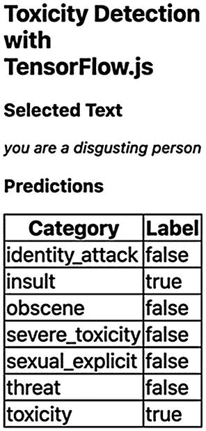
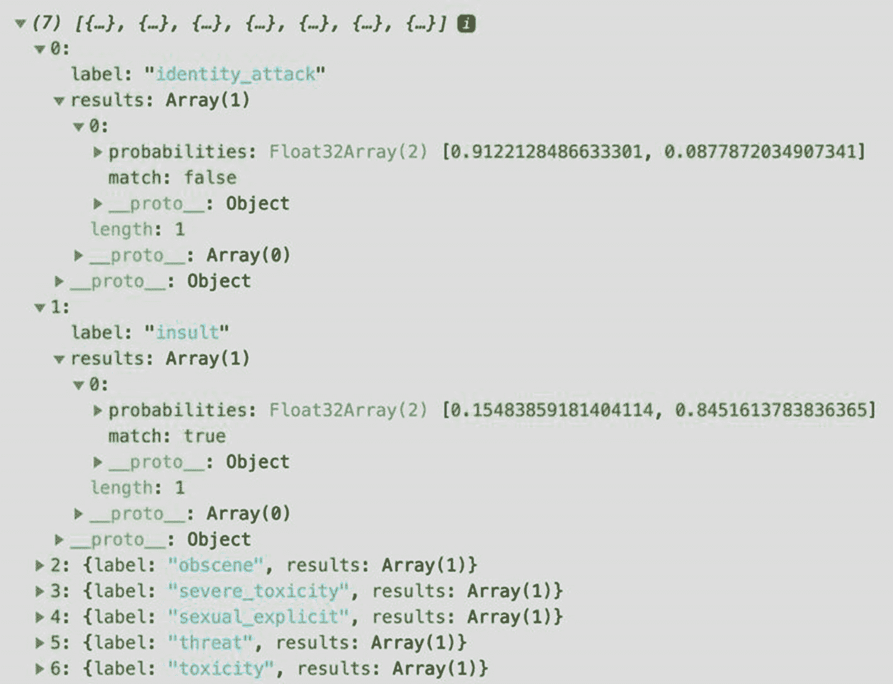
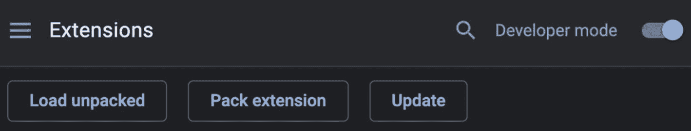

# 6. 从 Google Chrome 扩展程序中识别有毒文本

**在线毒性** 是互联网上不幸、具有挑战性和不受欢迎的现实。在任何在线评论区、Twitter 线程或多人游戏中漫步，你都会发现一些令人震惊和冒犯性的文本，这会让你说“哇。”在这种情况下，我们几乎无能为力，只能点击“举报”按钮，并希望有人或某个神奇实体识别并删除该评论。本章将解决这个问题。在这里，我们将构建一个能够检测和 **分类有毒内容** 的工具。

我们接下来的练习涉及使用 TensorFlow.js 的预训练毒性分类器来检测文本中存在的毒性类型，例如侮辱或淫秽，这使得本章成为第一个介绍文本数据的章节。你将开发的产品是一个 **Google Chrome 扩展程序**，用于从所选文本中识别有毒内容。图 6-1 是该小部件的截图。在那里，“所选文本”标题下是明显有毒的文本“你是个令人厌恶的人”，下面是一个包含七个不同类别毒性和一个指出该行是否属于该类别的标签的表格。在这种情况下，所选文本被分类为“侮辱”和“有毒”。



图 6-1

扩展程序的截图

## 理解毒性检测器

毒性检测器模型，让我们称其为 **ToxDet**，是一个预训练模型，用于检测一段（英语）文本或一系列文本中的六种毒性子类型。其六种毒性包括——*身份攻击*、*侮辱*、*淫秽*、*严重毒性*、*色情暴露*、*威胁*，以及一个 *总体毒性* 标签——涵盖了在线环境中你会遇到的大量粗俗或“级别”。例如，考虑“身份攻击”这一类别，它描述了“关于个人或群体的负面、歧视性或仇恨性评论”（Conversation AI，2018），或者“威胁”标签，它识别旨在对实体或群体造成伤害的文本。

ToxDet 是在另一个名为 **Universal Sentence Encoder** (Cer et al., 2018) 或 USE 的模型之上进行训练的，USE 是一个将文本编码或转换为 512 维嵌入的网络。换句话说，USE 将文本转换为 512 个浮点数的数组。为了说明这一点，请参见以下使用 TensorFlow.js 实现 USE 的示例：^(1)

```py

use.load().then(model => {
model.embed('we like tensorflow.js').then(embeddings => {
embeddings.print(true);
});
});

```

此示例将短语“我们喜欢 tensorflow.js”（当然我们喜欢）编码为形状为 [1,512] 的张量，其值为 [[-0.0569201, -0.0590669, -0.0376535, ..., -0.0493428, 0.0461595, -0.0551419],]。

那么，我们如何将像 USE 这样的模型转变为毒性检测器？通过**迁移学习**。迁移学习（我们将在第八章中探讨的技术）是将最初为一个问题训练的模型作为第二个模型的起点重新使用的机器学习任务。在这里，USE 的知识作为毒性检测器的基石。在迁移知识后，新的模型将使用目标数据集进一步训练，以便它能发挥其作用，即预测不同的毒性类别。

## 关于数据

ToxDet 的训练数据集（Borkan 等人，2019 年）来自已停用的评论插件*Civil Comments*的评论语料库。这个工具具有一种评论提交方法，即为了发布评论，每个用户首先必须审查和评分其他评论，以便其他人也能对其评分。该数据集大约有 200 万条这样的评分评论。其目标变量“target”是一个从 0 到 1 的值，用于评估文本的整体毒性。除了有一个标签外，每条评论还被按照前面提到的六个子类型进行排名。例如，评论“haha you guys are a bunch of losers”的目标值或毒性为 0.89，“severe_toxicity”为 0.02，“identity_attack”为 0.02，“insult”为 0.87。

由于数据具有通用性，ToxDet 更适合通用领域的应用。因此，它可能在高度特定的用例或输入数据与训练集显著不同的情境中表现不佳。

## 构建扩展

到目前为止，我们开发的解决方案涉及一个网络应用程序（或游戏），其中用户通过浏览器的窗口与模型交互。但浏览器不仅仅是窗口。它还是一个能够执行小型内置应用程序的环境，这些应用程序可以定制浏览体验并扩展其功能。一个例子是 Chrome 扩展程序，现在你将创建一个。

该扩展旨在使用毒性模型识别所选文本中存在的毒性子类型。使用它非常简单。首先，用户必须从网页中选择任何文本。文本被选中后，必须点击应用程序的图标以打开一个小弹出窗口，显示预测结果表格（如图 6-1 所示）。关于实现方面，由于我们不会进行任何类型的可视化、数据处理、训练甚至构建完整的用户界面，工作就简化为加载模型、预测和显示结果。现在我们开始吧！

### 创建 HTML 和应用程序清单

我们将开始这个教程的方式与其他教程略有不同。不是创建一个*index.html*文件，而是创建一个名为*manifest.json*的文件，这是一个用于配置扩展的文件。同时，不要担心 Web 服务器；你将不需要它。在清单中，设置一些必要的信息，例如扩展的名称、版本、描述和其他更具体的属性：

```py
{
"name": "Toxicity Detection with TensorFlow.js",
"version": "1.0",
"description": "Identify Toxic Content",
"permissions": [
"activeTab"
],
"browser_action": {
"default_popup": "src/popup.html"
},
"manifest_version": 2,
"content_security_policy": "script-src 'self' https://cdn.jsdelivr.net; object-src 'self'"
}
```

`permissions` 属性定义了应用的目的。例如，此扩展需要 `activeTab` 权限，它允许在用户使用插件时访问活动标签页。我们还需要另一个属性 `browser_action`，用于在扩展的工具栏中放置图标。在其内部，添加一个字段 `default_popup` 并将其值设置为 `src/popup.html` 以在点击图标后打开此文件。我们使用的另外两个属性是 `manifest_version`，用于指定清单文件的格式，以及 `content_security_policy`，允许应用访问 `[`cdn.jsdelivr.net`](https://cdn.jsdelivr.net)`，这是我们获取 TensorFlow.js 的 CDN。此规则通过确保无法访问其他网站来强制执行安全性。

你还需要第二个文件，即 *popup.html*，这是扩展的界面。在项目的根目录中，创建一个 *src/* 目录，并在其中创建 *popup.html* 文件。接下来，打开该文件。在那里，打开一个 `<head>` 标签并导入 TensorFlow.js 和毒性模型，并描述表格的样式。然后，在 `<body>` 中添加几个标题，一个带有 `id` 属性 `input` 的段落以显示选中的文本，以及一个带有 `id predictions-table` 的表格。在关闭 `<body>` 标签后，导入扩展的主要脚本文件，命名为 *popup.js*。既然提到了它，请创建该文件在 *src/* 目录内：

```py

table,
td,
th {
border: 1px solid black;
}
table {
border-collapse: collapse;
}

Toxicity Detection with TensorFlow.js
Selected Text

Predictions

Category
Label

```

### 扩展脚本

你会被 *popup.js* 的体积之小而感到惊讶：

```py
const threshold = 0.7;
async function init() {
const model = await toxicity.load(threshold);
chrome.tabs.executeScript({
code: 'window.getSelection().toString();',
}, async (selection) => {
const selectedText = selection[0];
document.getElementById('input').innerHTML = selectedText;
const table = document.getElementById('predictions-table');
await model.classify(selectedText).then((predictions) => {
predictions.forEach((category) => {
const row = table.insertRow(-1);
const labelCell = row.insertCell(0);
const categoryCell = row.insertCell(1);
categoryCell.innerHTML = category.results[0].match === null ? '-' : category.results[0].match.toString();
labelCell.innerHTML = category.label;
});
});
});
}
init();
```

第一行设置预测阈值，然后是一个名为 `init()` 的异步函数。在其内部，我们将使用 `toxicity.load()` 函数并带有 `threshold` 参数来加载模型。之后是 `chrome.tabs.executeScript()`，这是 Chrome 扩展 API 中的一个函数，用于从指定的标签页插入和运行 JavaScript 代码。由于我们没有指定标签页（在函数的第一个可选参数中），它默认为当前标签页。第二个参数是一个对象，其属性 `code` 是你希望运行的代码，这里为 `window.getSelection().toString()` 以获取选中的文本。最后，第三个参数是在给定代码执行后调用的回调；在回调中，我们将进行预测。

回调函数使用 `window.getSelection().toString()` 返回的内容作为参数——在这种情况下，选中的文本，这里称为 `selection`。在函数体中，从选择的第一个索引获取文本，并在应用上的 *input* 段落中显示它。接着获取表格。现在是最激动人心的部分，即使用 `model.classify()` 进行预测。

ToxDet 的预测输出是一个包含七个对象的列表，其中每个对象代表毒性类别。这些对象中每个都有一个属性`label`（毒性子类型）和`results`，一个数组，其值是一个包含`probabilities`列表和布尔值`match`的对象。这些概率是文本不包含和包含指示的毒性目标的可能性。如果子类型不出现的概率大于`threshold`，则`match`为`false`。相反，如果存在的概率高于`threshold`，则`match`为`true`。否则，如果没有任何分数通过`threshold`，则`match`为`null`。在图 6-2 中，你可以看到一个例子。



图 6-2

预测的一个例子

要在表格上显示值，在遍历预测的同时附加标签和结果（如果概率均不超过阈值，则写一个破折号）。这就是函数！在继续之前，不要忘记从脚本的底部调用`init()`。

### 部署和测试应用程序

那么，我们如何部署这个？比听起来容易！在 Google Chrome 中，在地址栏中输入*chrome://extensions*以访问*扩展管理*页面。

在屏幕的右侧，使用切换按钮启用“开发者模式”。一旦激活，点击“加载未打包”按钮（图 6-3）并选择扩展目录以加载应用程序。确保项目目录遵循以下结构：



图 6-3

如何激活“开发者模式”

```py
├── manifest.json
└── src
├── popup.html
└── popup.js
```

在成功加载项目后，你将在扩展工具栏中找到应用程序的“T”图标（在地址栏旁边）。如果你现在点击它，将会弹出，但不会发生任何事情，因为你没有选择任何文本。所以，选择一行随机文本（下流的那一行可能更合适），点击图标，并惊叹于模型的魔力；请注意，下载模型需要几秒钟。表 6-1 展示了一些攻击性文本及其毒性子类型。

表 6-1

毒性文本及其标签的示例

| 文本 | 身份攻击 | 侮辱 | 下流 | 严重毒性 | 性内容 | 威胁 |
| --- | --- | --- | --- | --- | --- | --- |
| “精彩的游戏。我很喜欢” | false | false | false | false | false | false |
| “你的意见是垃圾” | false | true | false | false | false | false |
| “你这个白痴，你妈的…” | false | true | true | false | false | false |

## 概括

除了是通往互联网的窗口外，网络浏览器还是一个能够执行小型应用的平台，这些应用可以丰富和扩展我们的在线之旅。一个例子是 Google Chrome 扩展程序，在这一章中，我们已经构建了一个。所讨论的扩展程序使用 TensorFlow.js 的预训练毒性分类器来识别文本是否包含毒性内容。通过这个例子，我们有机会将 TensorFlow.js 应用于除网络应用以外的环境，这一点我们将在第八章中继续探索，在那里我们将使用 Node.js 提供模型服务。

不言而喻，让我们让互联网成为一个干净的地方！现在你有了开始所需的正确工具。

练习

1.  创建一个网络应用，用户可以输入文本。为了使其更有趣，可以在同一调用中使用字符串列表对多行进行分类，例如，`model.classify(['lol u silly', 'this is a bad comment'])`。

1.  在第八章学习了 Node.js 之后，创建一个暴露模型的网络服务。添加一个名为“predict”的端点，它接受一个字符串作为输入并返回预测结果。

1.  尝试本章前面介绍的通用句子编码器。你可以从一个简单的应用开始，该应用嵌入给定的文本。

1.  使用 USE 的嵌入创建两个任意类别的数据集，例如，“关于披萨的句子”和“关于树木的句子”。然后，构建一个分类器来对这些嵌入进行分类。
