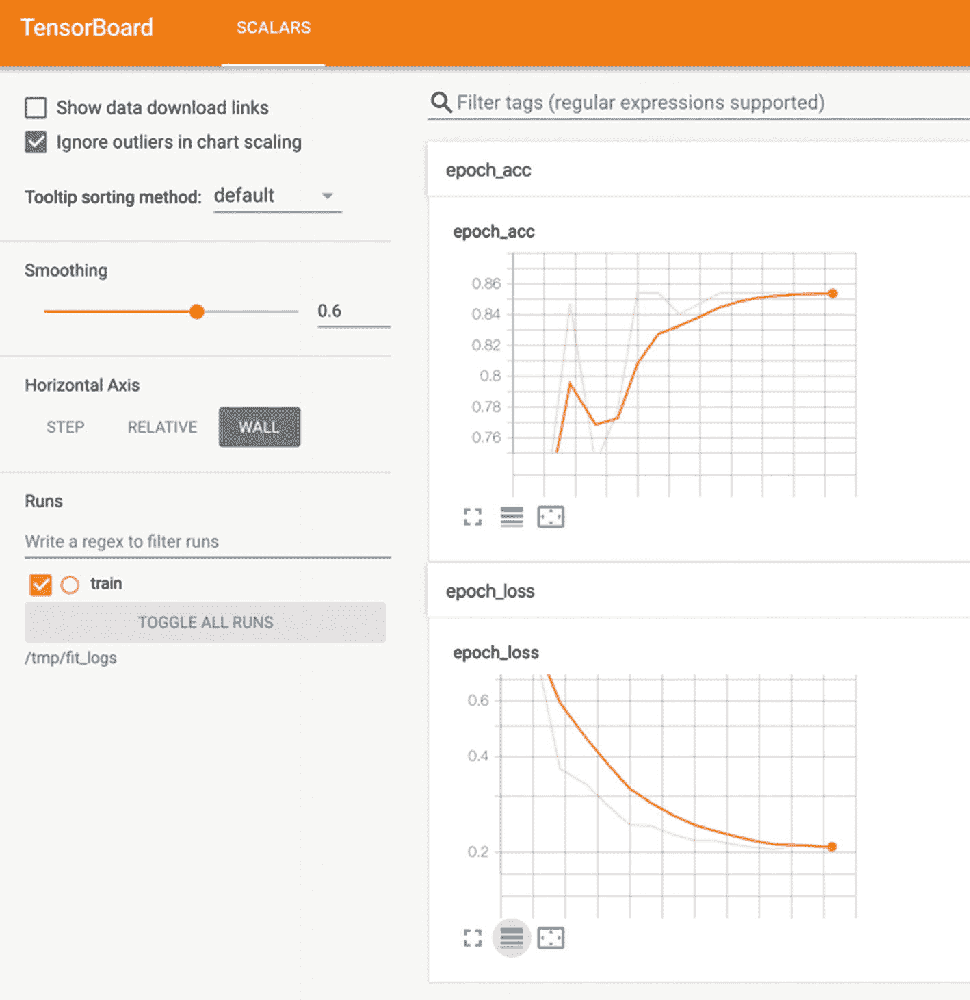

# 8. 在 Node.js 上使用迁移学习训练图像分类器

我们迄今为止构建的产品——一个游戏、一个网络应用程序或一个 Chrome 扩展——之间的交集是它们都存在于浏览器中。从这个生态系统中，我们训练了模型，加载了其他模型，可视化了数据，检测了平均词汇，等等。但现实情况不同。与我们的应用程序不同，我们每天与之交互的大多数模型都在服务器上，而不是客户端。在那里，从服务器部署并暴露机器学习模型给用户，通过一个服务。在本章中，我们将创建一个。

使用**Node.js**，一个在浏览器外执行 JS 代码的运行环境，我们将开发一个服务器端应用程序，通过网络服务部署和提供 TensorFlow.js 模型。但哪个模型呢？

在创建服务——让我们称它为*服务器*——之前，你将编写另一个 Node.js 程序（*训练器*），用于使用第七章中个性化数据集训练一个图像分类器。然而，你不会从头开始训练它，而是将**迁移学习**应用于预训练的**MobileNet**模型，并从这里开始。

哇，这么多概念：Node.js、服务器、网络服务、迁移学习和 MobileNet。嗯，还有一个！为了检查训练情况，我们将使用**TensorBoard**，^(1)这是一个 TensorFlow 可视化工具包，它提供了许多功能，其中包括模型性能指标和损失值的跟踪。

## 迁移学习是什么？

训练（大型）深度学习模型是一个计算密集型任务，需要大量的数据。为了有一个概念，NVIDIA 的*Megatron-LM*（Shoeybi 等人，2019 年），一个 83 亿参数的转换器模型，每个 epoch 需要使用 512 个 GPU 两天时间。两天！每个 epoch！我不知道你，但我没有那种硬件。那么，我们这些普通人如何才能在相对较短的时间内，以及有限的训练数据集下训练深度模型呢？一个选择是迁移学习。

迁移学习指的是将一个模型的部分（训练好的权重）作为另一个模型的起点来重用的技术。换句话说，它*将一个设置中学习到的知识转移到另一个设置中*（Goodfellow 等人，2016 年）。使用预训练模型作为第二个模型的基，意味着可以显著加快目标模型的训练速度，并减少所需的训练数据。

迁移学习背后的主要思想是将基础模型的层与一组新的层连接起来并对其进行训练。在实践中，这涉及到使用基础模型的上层（第一层），因为它们最有可能已经学会了数据集的高级特征，也就是说，这些特征可能是对新模型有用的。这些层有时被称为“冻结”层，因为它们的权重是固定的，不会进行训练。然后，在这些冻结层上，你附加新的层集，包括输出层，并使用你的数据进行训练，以创建基础模型所知与你的数据集目标之间的关系。

虽然迁移学习很有用，但它并不是一个完美或“一刀切”的解决方案。在应用它时，我们必须考虑几个方面。其中之一是我们应该从哪一层“截断”模型，这个决定取决于训练集的大小；你拥有的数据越多，切割点（冻结的层越少）就越高（Géron，2019）。另一个可能的问题是原始模型的任务与我们想要训练的模型之间的相似性。例如，如果原始模型是用来检测土豆的，你不能期望它能很好地识别宇宙飞船（除非它们是土豆形状的宇宙飞船）。因此，尝试使用在类似数据集或大型多样化数据集上训练的基础模型，例如 ImageNet。同样，我们还需要记住基础模型的输入形状。例如，我们的基础模型 MobileNet 是在 224x224 大小的图像上训练的，因此我们必须在将其输入模型之前调整我们的数据集大小。

## 理解 MobileNet 和 ImageNet

我们的基础模型是 MobileNet（Howard 等人，2017 年），这是一种轻量级且快速的卷积神经网络架构，适用于视觉应用，包括目标检测、图像分类以及第五章中提到的 PoseNet 网络等新颖的应用。MobileNet 针对低资源设备，如嵌入式系统和手机，这就是为什么它以速度换取精度。它有超过 25 层，包括一个名为深度可分离卷积的特殊卷积层以及批量归一化层、ReLU 激活层、一个卷积层和一个用于分类的 softmax 层。

我们将要使用的 MobileNet 模型是在 2012 年大规模视觉识别挑战（ILSVRC2012）数据库上训练的（Russakovsky 等人，2015 年），在该数据库上它达到了 70.6%的准确率。该数据集包含 1,431,167 张图像和 1000 个类别，描述了各种物品、动物和物体，例如“足球”、“头盔”、“蜡烛”、“鳗鱼”和“数字时钟”。如果标签看起来杂乱无章，那是因为这个数据集是更大的 ImageNet 的一个子集，旨在涵盖大多数英语名词。使用这样多样化的物体混合训练的模型可能对我们的迁移学习工作有益。

## 构建训练器

我们的首要任务是创建训练器，负责训练模型。这个程序做两件事，预处理数据和训练模型，因此我们将解释分为两部分。此外，由于我们有一个新的框架，Node.js，我们将从如何在环境中运行 TensorFlow.js 的简要描述开始。

### 设置环境

第一步是安装 Node.js。你可以在这里找到说明：[`nodejs.org/en/`](https://nodejs.org/en/)。安装 Node.js 也会安装 **npm**，它是 JavaScript 项目的包管理器。一旦准备就绪，在您首选的位置添加一个目录并创建 *package.json* 文件，这是一个包含项目元数据的文档。我们的看起来像这样：

```py
{
"name": "tfjs-node-trainer-server",
"version": "0.0.1",
"description": "Train a image classifier using transfer learning and deploy it",
"scripts": {
"train": "node trainer.js",
"serve": "node server.js",
"tensorboard": "tensorboard --logdir /tmp/fit_logs"
},
"dependencies": {
"@tensorflow/tfjs-node": "¹.5.2",
"express": "⁴.17.1",
"multer": "¹.4.2"
}
}
```

前三个键是项目的名称、版本和描述。然后是 `scripts` 属性，一个命令字典。例如，我们有一个 `train` 命令，其值是 `node trainer.js`，所以在包含 *package.json* 的路径下执行 `npm train` 会运行 `node trainer.js`。下一个属性定义了项目的依赖项，包括 TensorFlow.js 的 Node.js 版本、*Express* 和 *Multer*，这两个我们将用于网络服务。如果你的计算机有 NVIDIA GPU 并支持 CUDA，你可以使用 GPU 变体，*tfjs-node-gpu*。

为了确保一切正常工作，首先运行 `npm i` 安装依赖项。当完成时，创建一个名为 *trainer.js* 的文件，添加一行 `console.log('boo!');`，然后从控制台执行 `npm run train`。

### 加载和预处理图像

工作了吗？太好了。现在，删除“boo”行，并替换以下两行以加载 TensorFlow.js 和 *fs*（代表“文件系统”）模块：

```py
const tf = require('@tensorflow/tfjs-node');
// or const tf = require('@tensorflow/tfjs-node-gpu');
const fs = require('fs');
```

然后，声明这三个变量：

```py
const NUM_CLASSES = 2;
let xTrain;
let yTrain;
```

`xTrain` 是数据集，`yTrain` 是标签。

接下来，创建 `readImage()`。该函数包含一个对 `tf.tidy()` 的调用，用于使用 *fs* 的 `readFileSync()` 从文件系统读取图像，然后使用 `tf.node.decodeImage()` 解码它并将其转换为张量。接下来，使用以下方法转换张量：

+   使用 `resizeBilinear([224, 224])` 将其调整到 224x224。在此函数之后，张量的形状是 [224, 224, 3]。3 是因为彩色图像有 RGB 通道。

+   使用 `expandDims()` 添加一个额外的维度。张量形状：[1, 224, 224, 3]。

+   使用 `toFloat()` 将值转换为浮点数。

+   使用 `div(127.0)` 将值除以 127。

+   使用 `sub(1)` 减去 1。这两个最后的方法将值限制在 -1 和 1 之间（RGB 值范围从 0 到 255）。

为了避免在内存中保留这些中间张量，将所有内容包裹在 `tf.tidy()` 中：

```py
function readImage(path) {
return tf.tidy(() => {
const imageBuffer = fs.readFileSync(path);
const tfimage = tf.node.decodeImage(imageBuffer);
return tfimage.resizeBilinear([224, 224])
.expandDims()
.toFloat()
.div(127.0)
.sub(1);
});
}
```

脚本的第二个函数是 `getImages()`。这个函数接受两个参数，`dir`，一个包含图像的目录，以及 `label`，数据集的标签，编码为数字，例如，0 代表“皮卡丘”。`getImages()` 使用 *fs* 方法 `readdir()` 和 foreach 来遍历目录中的文件，这些文件被函数 `readImages()` 使用来获取图像。在每个图像之后，它调用 `tf.oneHot()` 来创建一个 *one-hot* 张量，该张量编码图像的类别。一个 one-hot 向量是一个长度为 *n* 的向量，其中 *n* - 1 个值是零，剩下的一个是 1。在机器学习中，我们经常使用这种技术来以这种方式标记数据集，其中只有与实例类别对应的索引是 1，而其他的是 0。例如，假设在我们的“皮卡丘和瓶子”分类器中，类别“皮卡丘”的索引是 0，而“瓶子”的索引是 1。在这里，“瓶子”标签的 one-hot 编码是 [0, 1]。

使用图像和标签集后，缺失的步骤是将它们沿着第一个轴连接到 `xTrain` 和 `yTrain`，即形成一个图像的张量：

```py
async function getImages(dir, label) {
let img;
let y;
fs.readdir(dir, (_, files) => {
files.forEach(async (file) => {
img = readImage(`${dir}/${file}`);
y = tf.tidy(() => tf.oneHot(tf.tensor1d([label]).toInt(), NUM_CLASSES));
if (xTrain == null) {
xTrain = img;
yTrain = y;
} else {
xTrain = xTrain.concat(img, 0);
yTrain = yTrain.concat(y, 0);
}
});
});
tf.dispose(img);
tf.dispose(y);
}
```

### 使用迁移学习训练模型

欢迎来到迁移学习！在重复了这个术语这么多遍之后，你肯定（也许）渴望应用它。所以，让我们立即开始一个新的函数 `train()`。该函数的第一个命令涉及使用 `tf.loadLayersModel()` 方法加载由 Google 提供的 MobileNet 版本，以及使用 `tf.LayersModel.getLayer()` 获取层“conv_pw_13_relu。”

这个“conv_pw_13_relu”层是切割点。所有这个之前的层都被认为是“冻结的”，也就是说，它们是我们将要迁移的“学习”（基础模型）。为什么是这个特定的层？一个原因是它靠近输出层——这意味着我们将使用许多已学习的层——并且因为它在我的数据集上表现良好。然而，你不必选择相同的层。在我们完成模型构建后，我建议尝试不同的切割点，看看哪一个更适合你的数据。

```py
async function train() {
const mobilenet = await tf.loadLayersModel('https://storage.googleapis.com/tfjs-models/tfjs/mobilenet_v1_0.25_224/model.json');
const cutoffLayer = mobilenet.getLayer('conv_pw_13_relu');
}
```

注意

使用 `mobilenet.summary()` 来查看网络的层名称。

由于我们知道切割点，让我们获取相应的层并使用它们构建一个新的模型。这个模型不是一个顺序模型，而是一个基于图的模型，它使用我们在第一章节中看到的函数式方法。为了创建它，我们将使用参数对象的属性输入和输出来设置其输入和输出（在 `cutoffLayer` 行下写入）：

```py
const truncatedModel = tf.model({
inputs: mobilenet.inputs,
outputs: cutoffLayer.output,
});
```

如果你好奇，运行 `console.log(mobilenet.summary())` 和 `console.log(truncatedModel.summary())` 来查看架构的差异。

下一步是使用 `truncatedModel.predict(xTrain)` 生成中间激活。请注意，这并不是我们习惯意义上的“预测”，因为没有分类输出。在这里，我们使用基础模型的权重来生成一个中间激活张量，该张量被第二个模型使用：

```py
const activation = truncatedModel.predict(xTrain);
```

现在创建一个最终模型，该模型以激活张量作为输入并产生图像分类。该模型需要三个层。其中第一个是一个展平层，其 `inputShape` 是 `truncatedModel` 输出的形状。接下来是一个包含 20 个单位的密集层和一个 ReLU 激活函数。至于最后一个，添加另一个密集层，其中单位等于 `NUM_CLASSES`，激活函数是 softmax。然后使用分类交叉熵损失函数、学习率为 0.001 的 Adam 优化器和准确度指标来编译它。

为了拟合模型，这次我们将使用一个新的回调 `tf.node.tensorBoard()`。这个回调将训练的指标和损失值写入函数参数中指定的目录。稍后，我们将使用 TensorBoard 读取这些日志以跟踪训练过程。至于其他参数，使用激活张量作为训练数据，标签 `yTrain`，并使用配置对象设置批大小为 32 和周期为 15。最后，使用 `model.save()` 保存模型：

```py
const model = tf.sequential();
model.add(tf.layers.flatten(
{ inputShape: truncatedModel.output.shape.slice(1) },
));
model.add(tf.layers.dense({
units: 20,
activation: 'relu',
}));
model.add(tf.layers.dense({
units: NUM_CLASSES,
activation: 'softmax',
}));
model.compile({
loss: 'categoricalCrossentropy',
optimizer: tf.train.adam(0.001),
metrics: ['accuracy'],
});
await model.fit(activation, yTrain, {
batchSize: 32,
epochs: 15,
callbacks: tf.node.tensorBoard('/tmp/fit_logs'),
});
await model.save('file://model/');
```

`train()` 的内容到此为止。你可以关闭这个函数。

### 运行训练器

为了完成脚本，使用 `init()` 函数定义起点：

```py
async function init() {
await getImages('data/pikachu/', 0);
await getImages('data/bottle/', 1);
train();
}
init();
```

注意，你需要对每个类别调用一次 `getImages()`。它们的参数是包含一个类别的图像的目录路径（仅包含一个类别的图像）和标签（作为一个数字）。如果你所有的图片都在同一个目录下，请将它们分成两个。

回到终端，打开第二个标签页并运行 `pip install tensorboard` 以安装 TensorBoard。安装完成后，执行 `npm run tensorboard` 并点击提供的地址（可能是 `http://localhost:6006`）以启动工具。在终端的第一个标签页中，运行 `npm run train` 以启动训练脚本。程序需要大约一分钟来加载和处理所有图像。在这个过程中，如果你追踪计算机的内存使用情况，你会看到它在 dispose 方法之后会稍微填充一些然后下降。

注意

pip 是一个 Python 软件包管理器。要了解如何安装它，请访问 [`pip.pypa.io/en/stable/installing/`](https://pip.pypa.io/en/stable/installing/)。

在训练过程中，一旦你在终端上看到日志消息，切换到 TensorBoard（图 8-1）以跟踪准确度和损失。如果它们不在那里，要么等待几秒钟直到训练器写入日志，要么点击刷新按钮。



图 8-1

TensorBoard

注意

如果你重新训练，请在回调中更改 TensorBoard 日志目录或确保它是空的。否则，你将会有来自不同训练的日志。

使用我的数据集，模型在十个周期后达到了 0.85 的准确率和 0.207 的损失（不是一个糟糕的结果）。如果你对结果不满意，你可以尝试调整超参数的学习率、单元或周期数。另一个选择是尝试减少基础模型的层数（在这种情况下，你可能需要增加训练集的大小），增加更多，甚至改变顶层模型的架构。

## 构建服务器

因此，我们有一个使用迁移学习训练的不错模型，但没有与之交互的方法。直到现在。在这个练习的第二部分，我们将编写服务器，这是一个小的 Node.js 程序，它通过 REST Web 服务公开模型。一旦部署，你将能够通过从终端发送的 POST 请求进行预测（并查看响应）。

### 服务器模型运行

创建一个新文件，并将其命名为 *server.js*。然后，导入 TensorFlow.js 和两个库——Express 和 Multer，这两个库将帮助我们构建网络服务器。导入之后，创建一个名为 `imageBufferToTensor()` 的函数，用于将 `imageBuffer` 转换为张量。该函数与之前的 `readImage()` 函数相同，但去掉了 `fs.readFileSync()` 这一行。

```py
const tf = require('@tensorflow/tfjs-node');
const express = require('express');
const multer = require('multer');
function imageBufferToTensor(imageBuffer) {
return tf.tidy(() => {
const tfimage = tf.node.decodeImage(imageBuffer);
return tfimage.resizeBilinear([224, 224])
.expandDims()
.toFloat()
.div(127)
.sub(1);
});
}
```

在下面，定义创建和执行服务器的函数 `runServer()`：

```py
async function runServer() {
const model = await tf.loadLayersModel('file://model/model.json');
const mobilenet = await tf.loadLayersModel('https://storage.googleapis.com/tfjs-models/tfjs/mobilenet_v1_0.25_224/model.json');
const cutoffLayer = mobilenet.getLayer('conv_pw_13_relu');
const truncatedModel = tf.model({ inputs: mobilenet.inputs, outputs: cutoffLayer.output });
const app = express();
const storage = multer.memoryStorage();
const upload = multer({ storage });
app.post('/upload', upload.single('data'), (req, res) => {
const img = imageBufferToTensor(req.file.buffer);
const activation = truncatedModel.predict(img);
const prediction = model.predict(activation).dataSync();
res.json({
prediction,
});
});
app.listen(8081, () => {
console.log('Ready');
});
}
runServer();
```

在函数的第一行，我们加载我们的模型和 MobileNet。和之前一样，我们必须使用 MobileNet 的截断版本来创建中间激活张量。加载模型后，使用 Express 设置网络服务器，并使用 Multer 的 `memoryStorage()` 函数将上传的图像保存在内存中。

现在我们创建 POST 路由。这个路由有一个名为 *handler function* 的函数，当应用程序接收到对指定端点的请求时（例如，发送到 `http://localhost:8081/upload` 的 POST 请求）会运行。该函数接受两个参数，`req`（请求）和 `res`（响应）。`req` 是一个包含请求信息的对象，包括数据，在这种情况下，是图像，而 `res` 是我们将发送给用户的响应。

这个响应是预测结果，封装在一个 JSON 对象中。要获取它，我们需要三个步骤：将图像缓冲区转换为张量，生成中间激活张量，并对它进行分类。为了结束脚本，使用 `app.listen()` 监听指定端口上的请求。

### 测试模型

要测试模型，回到终端并执行 `npm run serve` 以初始化服务器。在另一个终端标签页中（一旦服务器就绪），运行

```py
$ curl -F "data=@data/{DIR_NAME}/{IMAGE_NAME}" http://localhost:8081/upload
```

其中 `DIR_NAME` 是目录，`IMAGE_NAME` 是你想要分类的图像，例如：

```py
$ curl -F "data=@data/bottle/0001.jpg" http://localhost:8081/upload
```

结果是模型预测的 JSON 编码，如下所示：

```py
{"prediction":{"0":0.000023536138542112894,"1":0.9999765157699585}}
```

它可能看起来不多，但这个服务可能是一个更大项目的起点。例如，你可以考虑将其部署在远程服务器上，这样你就可以从任何你想要的地方进行预测。或者想象有一个客户端，例如一个网络应用程序，它将图像发送到服务器，并整洁地展示结果。听起来很有趣。你怎么看？

## 回顾

TensorFlow.js 应用程序并不仅限于在浏览器中运行。有了合适的工具，即 Node.js 和 TF.js 自带的“node”后端模式，我们可以在服务器端程序中构建用于训练和部署模型的硬件加速软件。在本章中，我们探讨了 TensorFlow.js 的 Node.js 版本，以创建一个训练模型和提供服务的应用程序。名为“训练器”的训练脚本使用迁移学习——一种将一个模型的知识转移到另一个模型的技术——来使用有限的数据量来适应图像分类器。在训练过程中，我们瞥了一眼 TensorBoard——TensorFlow 的可视化工具包——以监控过程。我们的第二个应用程序，服务器，加载训练器的模型并通过网络服务公开它。

在 Node.js 运行时下运行 TensorFlow.js 不仅使其更快，还提供了一套独特的功能，使我们能够执行解码图像、为 TensorBoard 记录日志以及通过其 GPU 版本进一步加速进程。

练习

1.  从经验的角度来看，第七章节中的目标检测模型与这个模型相比如何？

1.  在不同的层上将基础模型剪裁，然后进行迁移学习。你实现了更好的结果吗？更差的结果？

1.  调整模型的超参数。

1.  对于实验，你能否使用更少的训练样本达到可接受的准确率？目标是研究基础模型在你的数据集上的表现，而不需要看到太多。

1.  从头开始训练一个模型。它的表现是否优于这里刚刚训练的那个？它需要多少个周期才能达到相同的准确率？

1.  对于好奇的人来说，打开 `model.json` 并研究模型的完整拓扑结构。

1.  分享模型！
