# 9. 使用循环神经网络进行时间序列预测和文本生成

想想你的早晨例行程序。你醒来，拿起手机，查看消息、电子邮件和其他内容。几分钟之后，你去洗手间，洗澡，刷牙（也许在洗澡时？）。在那段美好的水下时光之后，你吃早餐，可能是一杯咖啡，然后准备迎接新的一天。这些都是基础。现在，回顾这个列表，告诉我，它看起来像是一个**序列**吗？确实看起来像。如果是这样，能否使用过去的行为作为预测因素来预测下一步或几步呢？有了正确的模型，是的。

能够预测或预测未来的机器学习架构是**循环神经网络**（RNN）。这些网络以任意长度的序列作为输入，并试图预测下一个动作。一般来说，RNNs 可以预测未来的多个步骤，使我们不仅知道当前时间步 *t* 之后会发生什么，还能知道 *t* 之后会发生什么，这一特性有助于进行预测和生成序列。这一点使得 RNN 成为自然语言处理应用的优秀架构。正如我们很快就会看到的，RNNs 可以记住顺序，这使得它们适合于识别句子的部分、翻译，甚至生成创意内容。例如，如果你用一个由你最喜欢的艺术家的歌词组成的语料库来喂一个 RNN，它就可以学会如何创建与输入数据具有相同模式或风格的歌曲。其他 RNN 应用包括使用事件序列识别垃圾邮件用户（Jugel 等人，2019 年）、交通预测（赵等人，2017 年）以及分析时间序列数据，正如我们将在这里所做的那样。

在本章的第一部分，我们将通过创建和训练两个循环神经网络来介绍使用本书前面介绍的时间序列数据集进行**时间序列预测**的步骤。第一个 RNN 预测未来的一个点，而第二个 RNN 预测多个步骤。然后，我们将创建第二个应用程序，该应用程序加载一个在莎士比亚作品语料库上训练的 ml5.js RNN，以**生成**“莎士比亚风格”的文本。

## 理解 RNN 和 LSTM

要理解一个句子的含义，你必须，作为读者，理解之前的单词。你同意吗？

在阅读时，我们不自觉地会将当前单词的意义与之前的单词联系起来，以理解整个文本的含义。换句话说，我们刚刚阅读的数据并没有从我们的脑海中消失——我们保留了它。循环神经网络也这样做。与其他人工神经网络不同，RNNs 有能力在其内部持续信息。

我们迄今为止使用的网络具有这样一个特征：激活（张量）单向流动：正向。例如，在一个 CNN 训练的 epoch 中，数据从卷积层流向最大池化层。RNN 不是这样的。它们的基本单元，一个循环神经元，有一个连接回神经元的输入，创建了一个循环，其中神经元将输出发送回自己。

图 9-1 展示了一个简单的循环神经元的例子，其中 *x* 是输入，*y* 是输出。在训练的每个时间步 *t*，节点接收一个输入 *X*^(*t*)（序列）和前一个时间步 *t* − 1 的输出（看那个循环吗？）以产生一个新的输出 *y*^(*t*)。因此，由于这种迭代行为，神经元的输出变成了过去输出的函数。所以，我们可以这样说，这个函数有一个内部状态（或记忆），用 *h* 表示，并在数学上定义为 *h*^(*t*) = *f*(*h*^((*t* − 1)), *x*^(*t*)).

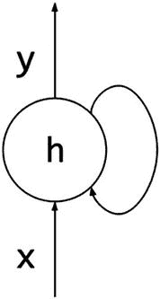

图 9-1

循环神经元

快速问答时间。让我问一下，你还记得本节的第一句话吗？（请说“不记得”，否则示例将无法工作）。对吧？我也不记得了。自从我们阅读它以来已经有一段时间了，所以我们忘记了它。循环神经网络也遇到这个问题。序列越长，网络记住最初发生的事情就越困难。简单来说，保持“长期依赖性”（Bengio et al., 1994）就变得更加困难。

为了解决这个缺点，1997 年，*Sepp Hochreiter* 和 *Jürgen Schmidhuber* 引入了一种名为“长短期记忆”或 LSTM 的 RNN 架构（Hochreiter & Schmidhuber, 1997）。算法的细节远远超出了本书的范围。然而，为了获得一个概念，让我们简要回顾其主要特征。简单来说，LSTM 是一个细胞（我们也可以称之为节点），通过在其中保持数据来记住。为了调节它保留的信息，即添加和删除什么，它使用三个称为**门**的单元。

LSTM 单元有三个门：*遗忘*门、*输入*门和*输出*门。遗忘门决定从细胞中丢弃哪些信息。相反，输入门控制什么数据进入细胞，输出门决定当计算单元的输出时是否使用细胞中的值。

对于 LSTM 和 RNN 的完整解释，请参阅 Goodfellow 等人所著的《深度学习》一书。

## 关于数据

预测应用程序使用的是第一章中使用的步数数据集的修改版。这个数据集包含了我从 2019 年 7 月 9 日到 2019 年 7 月 31 日期间的（归一化）步数，按 15 分钟间隔分组。其形状是 [933, 61]，其中前 60 列是在任意时间步长 *t* 所走的步数，一直到最后一个时间步长 *t* + 59，每一行是一个序列。因此，我们有一个包含 60 个值的序列。最后一列是我们想要在第一个 RNN 中预测的目标值。对于第二个 RNN，我们将使用不同的形状。

为了便于理解，图 9-2 展示了原始数据集。x 轴是时间步长 *t*，y 轴是那个时间间隔内所走的步数。

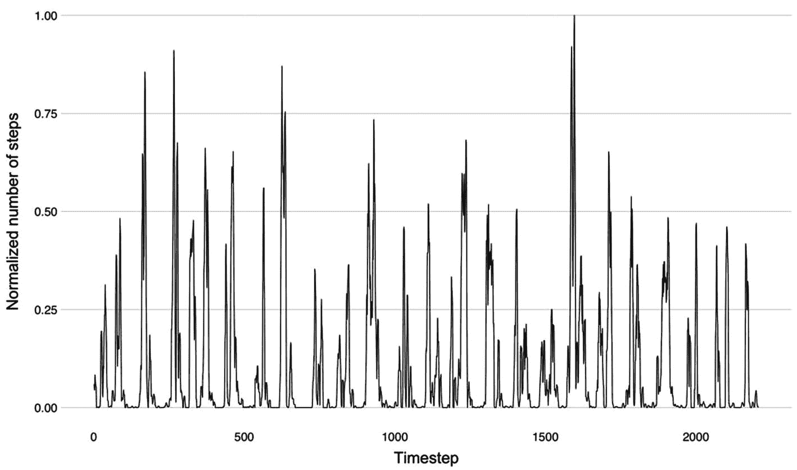

图 9-2

数据集

## 构建用于时间序列预测的 RNN

本章的第一个应用是一个训练 LSTM 来预测序列时间步长 *t* + 1 的 web 应用程序。这个应用程序和代码的结构与书中第一章节中完成的结构相似。它加载数据，构建模型，训练它，并使用 tfjs-vis 可视化训练阶段。为了测试模型，我们将使用一个包含八个测试用例的单独测试数据集。测试涉及可视化样本序列、预测值和实际值。为了创建此图，你将使用 Plotly。

准备好了吗？让我们开始吧。我们首先创建一个目录，然后在其中创建一个名为“time-series”的第二个目录。接着创建 *index.html*、*index.js* 和 *style.css* 文件。

### 准备应用程序的界面

图 9-3 展示了应用程序的屏幕截图。

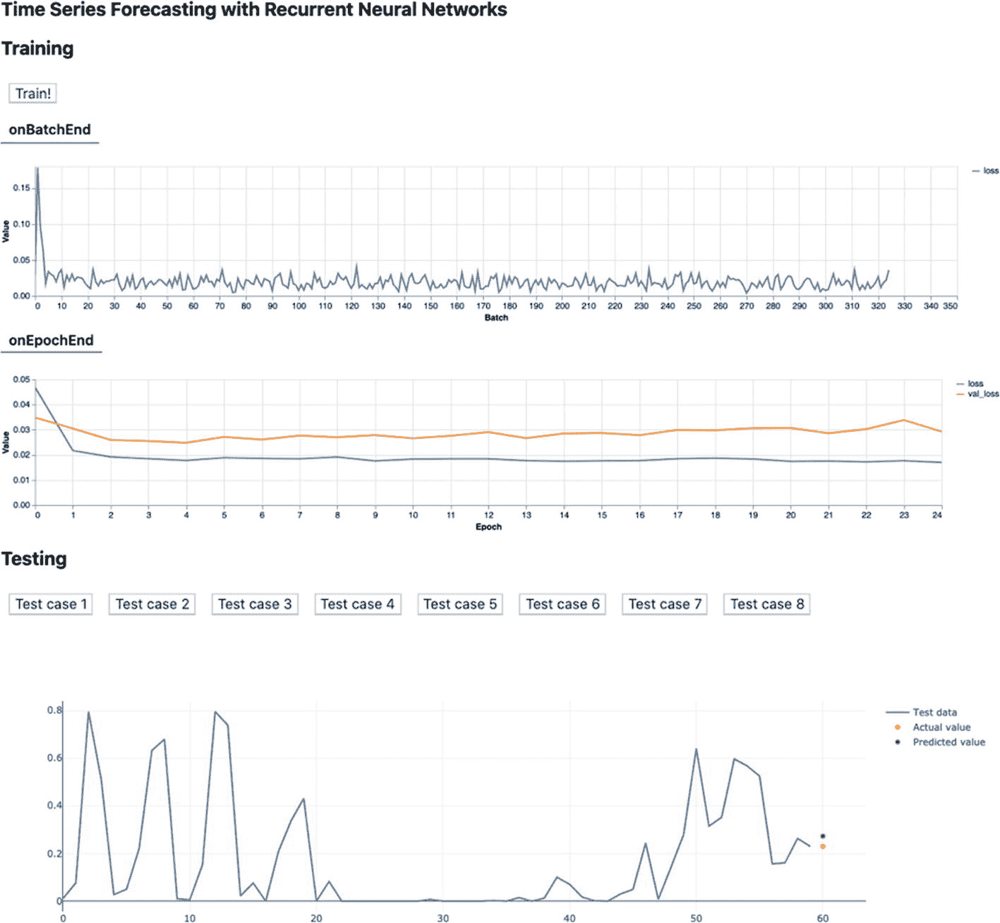

图 9-3

应用程序。在顶部是训练可视化，在底部是测试用例。

它有一个启动训练的按钮，一个包含 tfjs-vis 图表的 canvas（这次没有 visor），测试用例按钮，以及展示数据的 Plotly 可视化。以下是完全的 HTML：

```py

Time Series Forecasting with Recurrent Neural Networks
Training
Train!

Testing

```

首先，我们有加载所需包的 `<head>` 节点。接着是主体部分，由一个包含三个 `<h2>` 标题、一个“Train!”按钮、tfjs-vis 图表的 canvas 以及测试按钮和 Plotly 图表的 divisions 的大型 `<div>` 组成。底部是加载 *index.js* 脚本的 script 标签。将此代码复制到 *index.html* 中。

在样式方面，将以下 CSS 添加到 *style.css* 中：

```py
body {
margin: 50px 0;
padding: 0;
font-family: -apple-system, BlinkMacSystemFont, "Segoe UI";
}
button {
margin: 10px 10px;
font-size: 100%;
}
.main-centered-container {
padding-left: 60px;
padding-right: 60px;
margin: 0 auto;
max-width: 1280px;
}
```

如果你想看看它的样子，请在项目的目录下使用 *http-server* 启动本地服务器，并访问提供的地址。完成后，关闭 *index.html* 并准备好转换数据集。

### 转换数据集

尽管数据集已经预处理过，但你还需要进一步处理它，以便将其转换为与 LSTM 兼容的格式。和之前一样，我们将使用`tf.data.csv()`函数将 CSV 数据集加载为`tf.data.Dataset`对象。但是 RNN 不使用这种格式。它们需要一个形状为（`batch_size`，`timesteps`，`input_dim`）的 3 阶张量，其中`batch_size`是示例数量，`timesteps`是序列长度，`input_dim`是特征数量。在我们的情况下，使用我们手头的数据集，批大小应该是 933（但让我们使用 900，因为它是一个很好的整数），`timesteps` 60，`input_dim` 1，因为我们只使用一个序列特征（步数）。总之，输入张量的形状应该是[900, 60, 1]。我们如何在代码中做到这一点？打开*index.js*并跟我来。

首先，在文件顶部定义以下变量：

```py
const csvUrl = 'https://gist.githubusercontent.com/juandes/5c7397a2b8844fbbbb2434011e9d9cc5/raw/9a849143a3e3cb80dfeef3b1b42597cc5572f674/sequence.csv';
const testUrl = 'https://gist.githubusercontent.com/juandes/950003d00bd16657228e4cdd268a312a/raw/e5b5d052f95765d5bedfc6618e3c47c711d6816d/test.csv';
const TIMESTEPS = 60;
const TRAINING_DATASET_SIZE = 900;
const TEST_DATASET_SIZE = 8;
let model;
```

前两个是训练集和测试集的路径。你可以使用数据集的远程版本或者位于书籍仓库（目录*9/time-series/data/*）中的版本。然后是`TIMESTEPS`，数据集的大小和模型。

接下来，创建一个函数来加载训练集和测试集：

```py
function loadData() {
const trainingDataset = tf.data.csv(csvUrl, {
columnConfigs: {
value: {
isLabel: true,
},
},
});
const testDataset = tf.data.csv(testUrl, {
columnConfigs: {
value: {
isLabel: true,
},
},
});
return { trainingDataset, testDataset };
}
```

然后是第二个负责准备数据集的函数：

```py
async function prepareDataset(dataset, size) {
const sequences = tf.buffer([size, TIMESTEPS, 1]);
const targets = tf.buffer([size, 1]);
let row = 0;
await dataset.forEachAsync(({ xs, ys }) => {
let column = 0;
Object.values(xs).forEach((element) => {
sequences.set(element, row, column, 0);
column += 1;
});
targets.set(ys.value, row, 0);
row += 1;
});
return { xs: sequences.toTensor(), ys: targets.toTensor() };
}
```

`prepareDataset()`有两个参数，`dataset`（一个`tf.data.Dataset`对象）和`size`，数据集的长度。它首先调用`tf.buffer()`来创建两个`TensorBuffers`——一个可变对象，你可以在将其转换为张量之前向其中插入值——你将使用它们将序列数据分配给`sequences`（一个 3 阶张量）和目标值（我们想要预测的值）分配给`targets`（一个 2 阶值）。该函数使用两个循环来设置缓冲区中的值。内循环遍历单个序列（一行）的每个元素，将这些值设置到序列缓冲区中，而外循环设置目标值。这个`set()`方法在给定位置设置一个值。在这两种情况下，`set()`的最后一个参数是 0，因为缓冲区的最后一个维度的大小是 1。`prepareDataset()`返回一个对象，其中键`xs`是序列张量，`ys`是目标。就这样，LSTM 已经准备好接受数据了！

在进入下一节之前，让我们运行一下这个应用并验证它是否正常工作。因此，在`prepareDataset()`下创建一个`init()`函数，并调用`loadData()`和`prepareDataset()`两次来准备训练集和测试集。为了双重检查它们的形状，使用`console.log(train.xs.shape), console.log(set.xs.shape).`它们各自的值应该是[900, 60, 1]和[8, 60, 1]：

```py
async function init() {
const { trainingDataset, testDataset } = loadData();
const train = await prepareDataset(trainingDataset, TRAINING_DATASET_SIZE);
const test = await prepareDataset(testDataset, TEST_DATASET_SIZE);
console.log(train.xs.shape);
console.log(test.xs.shape);
}
```

回到浏览器，点击刷新按钮重新加载应用。打开开发者控制台并验证形状是否与之前相同。

### 设计模型并进行训练

到了有趣的部分（我知道我一直在说这个）：创建模型。这个预测模型是一个包含 32 个单元的单层 LSTM 循环神经网络和一个单元的密集层：

```py
async function defineModel() {
model = tf.sequential();
model.add(tf.layers.lstm(
{
inputShape: [TIMESTEPS, 1],
units: 32,
returnSequences: false,
},
));
model.add(tf.layers.dense({ units: 1 }));
model.compile({
loss: 'meanSquaredError',
optimizer: tf.train.adam(0.1),
});
}
```

前面的例子是 `defineModel()`，负责构建和编译模型。第一行创建了一个 Sequential 模型的实例。接下来是层，从 LSTM 开始。由于它是模型的初始层，因此指定了 `inputShape`，其值是训练数据集最后两个维度的形状。我们需要定义的第二个超参数是 `units`，它指的是 LSTM 单元。层的最后一个属性是 `returnSequences`，这是与 RNN 相关层的属性。此属性指定是否返回序列的最后一个输出或整个序列。默认情况下，其值为 `false`，但为了演示，让我们明确地定义它。

然后，我们进行编译。在这种情况下，使用均方误差损失函数，因为目标输出是一个连续变量。至于优化器，使用 Adam。模型完成！

接下来是训练部分。在之前的函数下，创建一个新的函数名为 `trainModel()`，它有一个参数 `trainingSet`。在函数中，使用 `getElementById()` 获取包含 tfjs-vis 可视化的 canvas 元素。之后，使用 `trainingSet.xs` 和 `trainingSet.ys` 作为前两个参数，并使用以下属性配置对象调用 `model.fit()`：

+   `batchSize` = 64。

+   `epochs` = 25。

+   `validationSplit` = 0.1，使用 10% 的数据来验证训练。

+   至于回调函数，使用 `tfvis.show.fitCallbacks()` 在 `onEpochEnd` 和 `onBatchEnd` 时可视化损失和验证损失值。

```py
async function trainModel(trainingSet) {
const container = document.getElementById('canvas-training-tfvis');
await model.fit(trainingSet.xs, trainingSet.ys, {
batchSize: 64,
epochs: 25,
validationSplit: 0.1,
callbacks: [
tfvis.show.fitCallbacks(
container,
['loss', 'val_loss'],
{ callbacks: ['onEpochEnd', 'onBatchEnd'] },
)],
});
}
```

### 预测和测试模型

到目前为止，你已经加载数据并创建了模型。所以，唯一缺少的步骤是实现测试功能以经验性地评估其性能。为了测试它，我们将使用一个包含八个观测值的小数据集，这些观测值不在训练集中。如图 9-3 所示，应用程序的测试部分涉及使用八个按钮中的一个（每个测试案例一个）来可视化序列及其预测值和实际值。通过这种方法，用户可以直观地评估预测值与真实值之间的差距。

开发这个功能涉及三个不同的组件，一个用于预测，另一个用于绘制预测结果，还有一个用于创建按钮。

第一个，`predict()`，是一个使用 `model.predict()` 并返回其值的函数。而不是逐个预测每个案例，使用整个测试数据集来获得八个预测：

```py
function predict(testingSet) {
return model
.predict(testingSet.xs)
.dataSync();
}
```

第二个函数，名为 `plotPrediction()`，用于绘制预测结果。它有三个参数，测试案例的编号、测试数据集和预测数组：

```py
async function plotPrediction(which, testingSet, predictions) {
let testCase = (await testingSet.xs.array());
testCase = testCase[which].flat();
const traceSequence = {
x: range(0, TIMESTEPS - 1, 1),
y: testCase.slice(0, TIMESTEPS),
mode: 'lines',
type: 'scatter',
name: 'Test data',
};
const traceActualValue = {
x: [TIMESTEPS],
y: [testCase[TIMESTEPS - 1]],
mode: 'markers',
type: 'scatter',
name: 'Actual value',
symbol: 'circle',
};
const tracePredictedValue = {
x: [TIMESTEPS],
y: [predictions[which]],
mode: 'markers',
type: 'scatter',
name: 'Predicted value',
symbol: 'diamond',
};
const traces = [traceSequence, traceActualValue, tracePredictedValue];
Plotly.newPlot('plot', traces);
}
function range(min, max, steps) {
return Array.from({ length: (max - min) / steps + 1 }, (_, i) => min + i * steps);
}
```

函数的第一行将测试数据（`xs`）的值部分转换为嵌套数组，其中每个元素都是一个测试用例。这个测试用例数组也是一个嵌套数组，其中每个元素又是另一个数组。因此，我们需要 `flat()` 来将其展平。之后，与第二章中使用的相同“range-like”函数（在 `plotPrediction()` 之后定义）生成从 0 到 59（序列长度）的值数组。然后是 Plotly 可视化。

对于这个可视化，你需要三个 Plotly 跟踪，一个用于序列，一个用于预测值，一个用于真实值。但我们还希望跟踪看起来不同。因此，我们将指定它们的样式。例如，序列用线表示，其他值用标记表示；请随意根据您的喜好进行自定义。定义跟踪后，将它们追加到同一个数组中。然后使用 `'plot'`（`<div>` 的 id）和 `traces` 数组调用 `Plotly.newPlot()`。

最后，使用前面章节中提到的相同 `createButton()` 函数来创建按钮：

```py
function createButton(innerText, selector, id, listener, disabled = false) {
const btn = document.createElement('BUTTON');
btn.innerText = innerText;
btn.id = id;
btn.disabled = disabled;
btn.addEventListener('click', listener);
document.querySelector(selector).appendChild(btn);
}
```

将所有这些放在一起，返回到 `init()` 函数。在那里，使用 `range()` 创建一个数组并遍历它以创建八个按钮及其回调函数，这些函数在点击时绘制预测（默认情况下是禁用的）。随后，再次使用 `getElementById()` 获取启动训练的按钮。给它分配一个“click”事件监听器，该监听器调用 `defineModel()`、`trainModel()` 和 `predict()`。

```py
async function init() {
let predictions;
const { trainingDataset, testDataset } = loadData();
const train = await prepareDataset(trainingDataset, TRAINING_DATASET_SIZE);
const test = await prepareDataset(testDataset, TEST_DATASET_SIZE);
const testCasesIndex = range(1, 8, 1);
testCasesIndex.forEach((testCase) => {
createButton(`Test case ${testCase}`, '#test-buttons', `test-case-${testCase}`,
async () => {
plotPrediction(testCase - 1, test, predictions);
}, true);
});
const trainButton = document.getElementById('btn-train');
trainButton.addEventListener('click', async () => {
await defineModel();
await trainModel(train);
predictions = predict(test);
testCasesIndex.forEach((testCase) => {
document.getElementById(`test-case-${testCase}`).disabled = false;
});
});
}
init();
```

将旧的 `init()` 函数替换为这个版本。

### 运行应用

让我们开始预测。如果本地网络服务器没有启动，请先启动它。然后启动应用程序并点击“训练！”以开始训练。在按钮下方，您将看到两个图表，分别显示 *onBatchEnd* 损失和 *onEpochEnd* 训练和验证损失。

平均损失值（经过 10 次尝试后计算得出）约为 0.02，平均训练时间为 3 分钟（在 MacBook Pro 2018 上）。训练完成后，八个测试按钮应该被激活。三个测试用例（1、2 和 4）的实际值为 0，因此预测值至少应该接近 0。在我的测试中，案例 3（图 9-4）、6（图 9-5）和 7 的结果非常准确，而案例 8 显示的结果最不准确（实际值为 0.90，预测值为 0.51）。

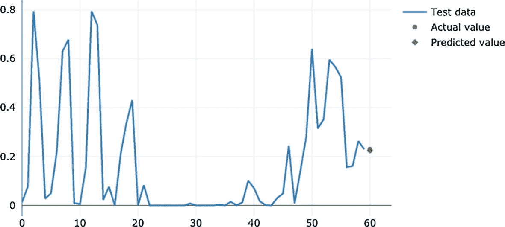

图 9-5

测试用例 #6

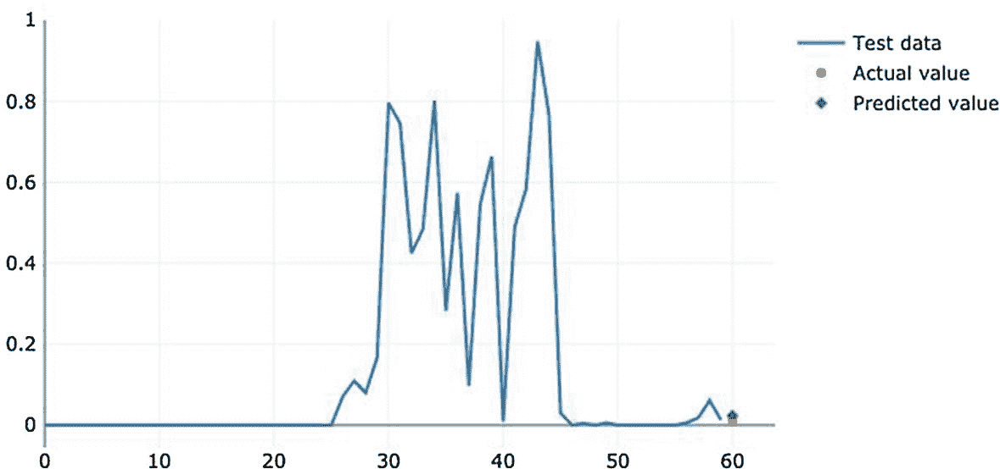

图 9-4

测试用例 #3

### 多步预测

但等等？预测时间步 *t* + 2 呢？可能吗？是的，可以。只预测未来一步是有限的，而且说实话，并不那么有洞察力。例如，你想要一个天气预报，它预测飓风的完整轨迹，而不仅仅是下一分钟的位置。因此，我们将扩展我们的预测模型以预测时间序列的下一个 *N* 个未来步骤。

扩展应用程序意味着两件事：重塑数据和当然，更新模型的架构。就目前而言，我们的训练数据集的形状是 [900, 60]，并使用一个形状为 [900, 1] 的目标。但我们要将目标数据扩展到预测 *N* 个值而不是 1。为此，我们将垂直切割训练数据集以创建一个新的数据集，其大小为 [900, 60 - *N*]，以及一个形状为 [900, *N*] 的目标张量。在这个例子中，我们将 *N*，现在称为 `FUTURE_TIMESTEPS`，设置为 5 以预测接下来的五个步骤。让我们先创建数据（你可以在同一个文件中添加以下代码片段）：

```py
const FUTURE_TIMESTEPS = 55;
function prepareMultiDataset(trainingSet, testingSet) {
let [xTrain, yTrain] = tf.split(trainingSet.xs, [FUTURE_TIMESTEPS, TIMESTEPS - FUTURE_TIMESTEPS], 1);
yTrain = yTrain.squeeze(2);
const [xTest, yTest] = tf.split(testingSet.xs, [FUTURE_TIMESTEPS, TIMESTEPS - FUTURE_TIMESTEPS], 1);
return {
xTrain, yTrain, xTest, yTest,
};
}
```

函数 `prepareMultiDataset()` 接收训练和测试数据，并将它们切割成四个：新的训练和测试集及其标签。`yTrain` 需要 `tf.squeeze()` 来移除最后一个维度 ([900, `FUTURE_TIMESTEPS`, 1] → [900, `FUTURE_TIMESTEPS`])。

然后是模型训练和设计功能。由于我们的问题不像之前那么简单，让我们在模型中添加一个额外的 LSTM 层，并将第一层的 `returnSequences` 属性设置为 `true`。与上次不同，我们将从这个函数中调用 `model.fit()`：

```py
let multiModel;
async function trainMultiModel(xTrain, yTrain) {
multiModel = tf.sequential();
multiModel.add(tf.layers.lstm(
{
inputShape: xTrain.shape.slice(1),
units: 16,
returnSequences: true,
},
));
multiModel.add(tf.layers.lstm(
{
units: 8,
activation: 'relu',
},
));
multiModel.add(tf.layers.dense({ units: yTrain.shape[1] }));
multiModel.compile({
loss: 'meanSquaredError',
optimizer: tf.train.adam(0.01),
});
await multiModel.fit(xTrain, yTrain, {
batchSize: 32,
epochs: 15,
callbacks: [
tfvis.show.fitCallbacks(
document.getElementById('canvas-training-tfvis'),
['loss'],
{ callbacks: ['onEpochEnd', 'onBatchEnd'] },
)],
});
}
```

我们还需要一个执行预测的函数。在这种情况下，我们将使用 `tf.Tensor.arraySync()` ——一个将张量转换为嵌套数组的方法——而不是 `tf.Tensor.dataSync()`，因为返回的预测张量具有形状 [8,5]：

```py
function predictMultiModel(xTest) {
return multiModel
.predict(xTest).arraySync();
}
```

接下来是绘图功能。因为现在应用程序生成的是一个预测序列而不是单个点，我们需要将轨迹改为绘制线条而不是点：

```py
async function plotMultiPrediction(which, xTest, yTest, predictions) {
let testCase = (await xTest.array());
let targets = (await yTest.array());
testCase = testCase[which].flat();
targets = targets[which].flat();
const traceSequence = {
x: range(0, FUTURE_TIMESTEPS, 1),
y: testCase,
mode: 'lines',
type: 'scatter',
name: 'Test data',
line: {
width: 3,
},
};
const traceActualValue = {
x: range(FUTURE_TIMESTEPS, TIMESTEPS - 1, 1),
y: targets,
mode: 'lines',
type: 'scatter',
name: 'Actual value',
line: {
dash: 'dash',
width: 3,
},
};
const tracePredictedValue = {
x: range(FUTURE_TIMESTEPS, TIMESTEPS - 1, 1),
y: predictions[which],
mode: 'lines',
type: 'scatter',
name: 'Predicted value',
line: {
dash: 'dashdot',
width: 3,
},
};
const traces = [traceSequence, traceActualValue, tracePredictedValue];
Plotly.newPlot('plot', traces);
}
```

最后是新的 *init* 函数，现在命名为 `initMultiModel()`，然后调用它（确保注释掉对“正常”的 `init()` 的上一个调用）：

```py
async function initMultiModel() {
let predictions;
const { trainingDataset, testDataset } = loadData();
const trainingSet = await prepareDataset(trainingDataset, TRAINING_DATASET_SIZE);
const testingSet = await prepareDataset(testDataset, TEST_DATASET_SIZE);
const {
xTrain, yTrain, xTest, yTest,
} = prepareMultiDataset(trainingSet, testingSet);
const testCasesIndex = range(1, 8, 1);
testCasesIndex.forEach((testCase) => {
createButton(`Test case ${testCase}`, '#test-buttons', `test-case-${testCase}`,
async () => {
plotMultiPrediction(testCase - 1, xTest, yTest, predictions);
}, true);
});
const trainButton = document.getElementById('btn-train');
trainButton.addEventListener('click', async () => {
await trainMultiModel(xTrain, yTrain);
predictions = predictMultiModel(xTest);
testCasesIndex.forEach((testCase) => {
document.getElementById(`test-case-${testCase}`).disabled = false;
});
});
}
initMultiModel();
```

现在刷新应用程序并开始训练。这次，因为我们有一个更大的模型，所以训练时间更长。此外，你将注意到损失值几乎没有变化（图 9-6）；没有像之前那样的突然下降。它从 0.035 开始，收敛到 0.025——没有显著变化。这种行为表明模型可能存在一些问题。让我们看看一些测试案例。

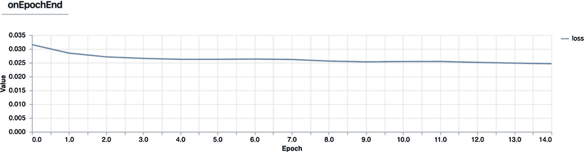

图 9-6

训练的损失值

图 9-7 显示了测试案例 #3。实线是测试数据，虚线是实际值，虚点线是预测值。在这里，预测值与实际数据不太吻合，但总体上遵循相同的模式。

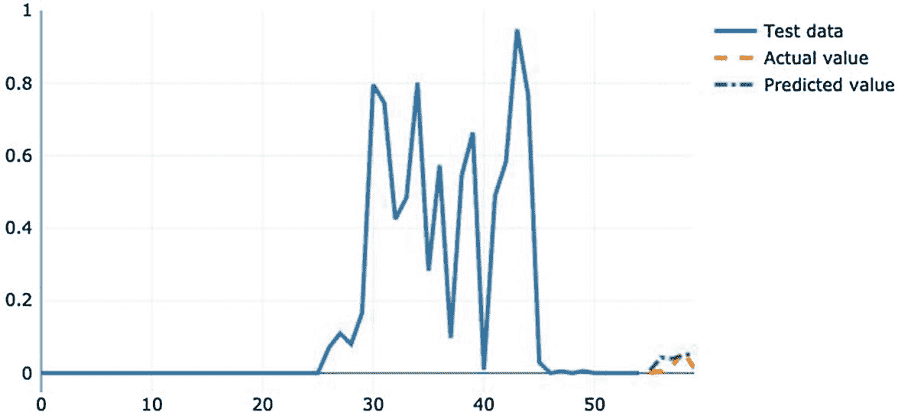

图 9-7

多模型测试案例 #3

但现在情况变得更糟了。接下来是测试案例 #6（图 9-8），其预测值类似于实际值的*平滑*形式——不是很好的结果，但也不是糟糕的结果。

最后，我们有测试案例 #8（图 9-9），这是其中最糟糕的一个。在这个例子中，预测的线条趋势向下，而实际值在增加。

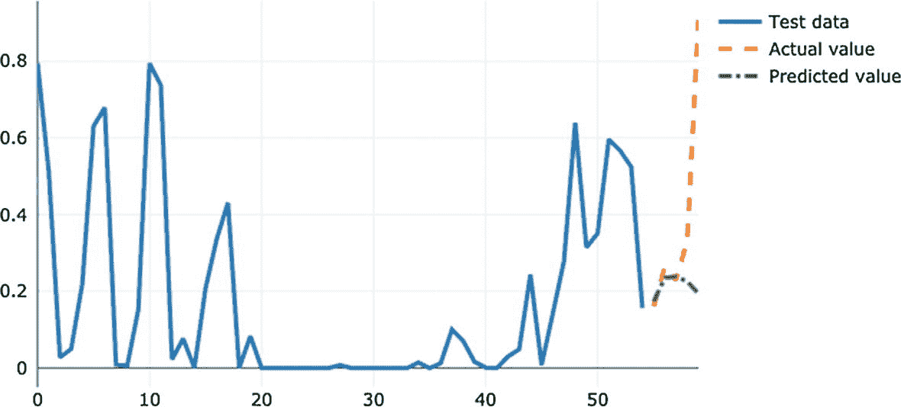

图 9-9

多模型测试案例 #8

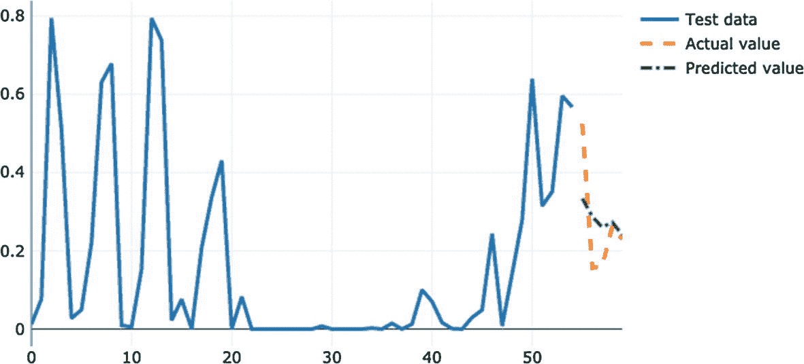

图 9-8

多模型测试案例 #6

从这些例子中，我们可以得出结论，该模型不如第一个模型好——或者至少在预测未来方面不是那么好。你可能已经注意到，在大多数例子中，前三个预测点与实际值相似，这是模型可能在预测近期未来方面表现良好的一个迹象，但不是在预测远期。其中一项练习邀请你尝试不同的 `FUTURE_TIMESTEPS`。

承认这一点很令人难过，但有时模型不起作用。原因可能很多：数据不足，数据不正确，模型选择不当，超参数选择不佳，或者架构不适合。在这种情况下，数据集非常波动，有很多波动，这可能会影响训练。将此作为经验教训和提醒，尽管机器学习背后有所有这些进步，但它（目前）还不是一门完美的科学。

但是我拒绝以这样的低潮结束这一节。为了体验一个好的多步模型，我将介绍 Jena 天气数据集（马克斯·普朗克生物地球化学研究所，n.d.）的一个修改版本。这个数据集——通常用于展示时间序列——包含了从 2009 年到 2016 年德国耶拿市的天气信息。我们将使用这些数据来预测温度。该数据集的结构与之前的相同，因此我们不需要修改程序的功能。但是我们需要做一些小的改动。首先，我们必须将训练集和测试集的 URL 更改为[`https://raw.githubusercontent.com/Apress/Practical-TensorFlow.js/master/9/time-series/multiple-steps-jena/data/sequences.csv`](https://raw.githubusercontent.com/Apress/Practical-TensorFlow.js/master/9/time-series/multiple-steps-jena/data/sequences.csv)和[`https://raw.githubusercontent.com/Apress/Practical-TensorFlow.js/master/9/time-series/multiple-steps-jena/data/test.csv`](https://raw.githubusercontent.com/Apress/Practical-TensorFlow.js/master/9/time-series/multiple-steps-jena/data/test.csv)。或者，由于数据集很大，我建议从存储库中获取数据集。你可以在 *9/time-series/multiple-steps-jena/data/* 找到它。此外，由于数据集显著更大，将 `TRAINING_DATASET_SIZE` 更改为 65000，将 `FUTURE_TIMESTEPS` 更改为 40，将 `batchSize` 更改为 512，将 `epochs` 更改为 3。然后，启动应用程序并像往常一样进行训练。但要注意！更大的数据集意味着需要更长的时间来加载数据和训练模型。

图 9-10 展示了模型训练五个周期后的损失值。顶部图表 *onBatchEnd* 显示，仅仅经过 50 个批次，损失就下降到几乎为零，而第二个图表 *onEpochEnd* 则表明两个周期就足够了。要查看模型的性能，请参阅图 9-11、9-12 和 9-13。

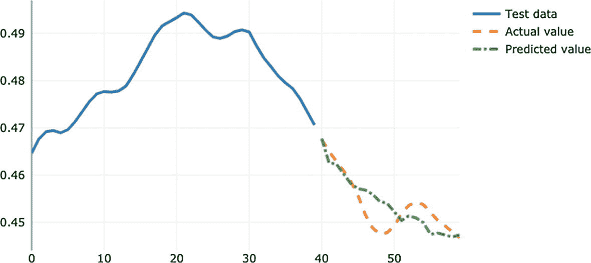

图 9-13

测试案例 #5

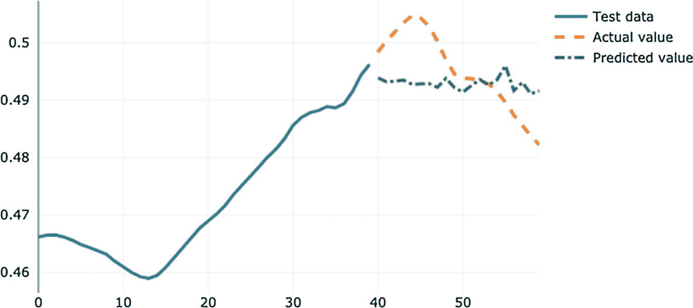

图 9-12

测试案例 #4

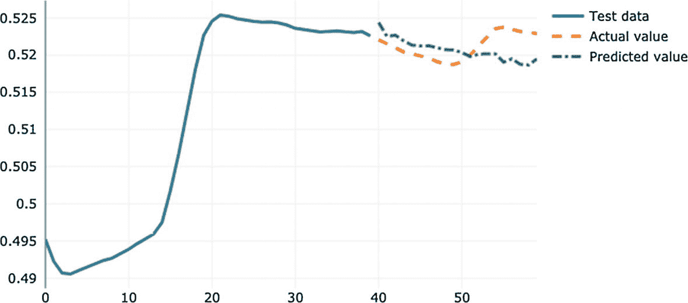

图 9-11

测试案例 #2

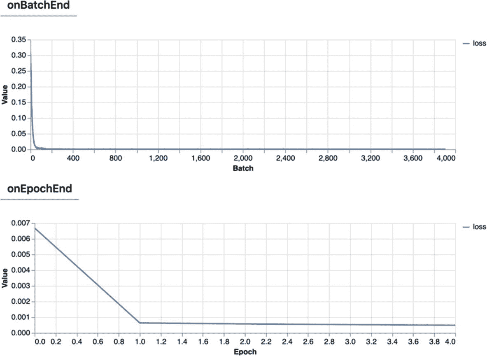

图 9-10

训练过程中的损失值

比上一个模型好得多。在所有图表中，预测的预报值与实际值非常接近。如果你看 y 轴，你会看到数值之间的差异小于 0.01——这是一个非常准确的预测。

## 使用 ml5.js 预训练的 LSTM 生成文本

循环神经网络在文本生成任务上表现出色。如果你在网上或文献中查找 RNN 的生成示例，你会惊讶于人们开发出的独特、有趣和原创的应用数量。有些人创作歌词，其他人创作音乐和弦，电影剧本，源代码，以及模仿古典作家写作风格的文本，就像我们在这次练习中要做的那样。

训练这些网络并不简单。它们背后是一个庞大的架构，一个更大的训练集，以及大量的计算资源投入其中。因此，我们将跳过这次训练，不仅因为其长度或复杂性，还为了有机会使用一个“经过实战检验”的模型，能够生成连贯的文本。

我们将使用的是 ml5.js 库提供的预训练模型。在其模型库中，^(1) 你可以找到几个在包含莎士比亚和海明威等作家作品的语料库上训练的 LSTM 模型。在这个例子中，我将使用莎士比亚模型。然而，你也可以选择另一个。这个应用程序本身是最简单的。它的目的是生成。界面（图 9-14）由一个用于写入模型“种子”的文本字段组成，这是一个初始文本片段，模型从中生成文本。还有一个输入滑块，用于设置预测 **温度**，这是一个介于 0 和 1 之间的值，用于控制生成文本的“随机性”。低温预测会产生更“保守”或自信的输出，而高温则会产生更多“创意”的内容（Karpathy，2015）。

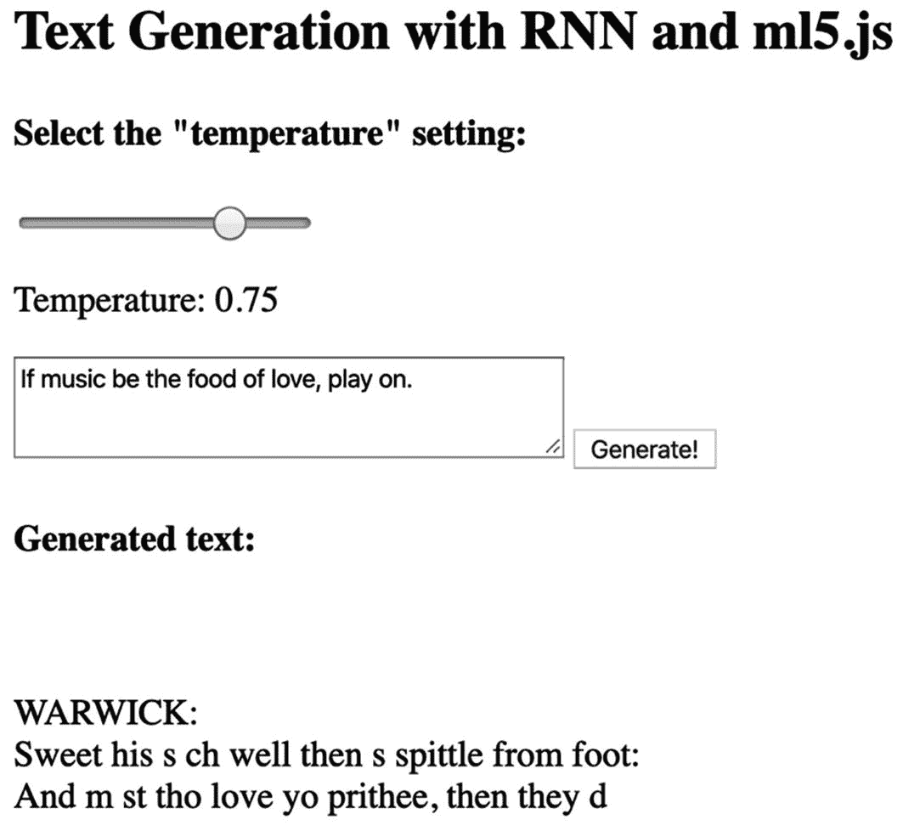

图 9-14

应用程序的截图。顶部的框是种子输入，下面的文本是生成的文本

### 开发应用程序

首先，从这里克隆 ml5.js 模型库的仓库：[ml5.js 模型库](https://github.com/ml5js/ml5-data-and-models)。在克隆的同时，创建一个名为 *ml5js-text-generation* 的目录。下载完成后，前往 *models/lstm/* 目录，并将“shakespeare”目录复制到你的工作目录。然后创建 *index.html* 和 *index.js* 文件。

由于应用程序代码非常简洁，我将在此节中展示其全部内容，从 *index.html* 开始：

```py

Text Generation with RNN and ml5.js

Select the "temperature" setting: 

Temperature: 

Generate!
Generated text:

```

HTML 的主体包含五个主要元素：一个用于设置温度的滑块，一个 `<p>` 元素用于显示它，一个 `<textarea>` 用于定义种子，一个预测按钮，以及另一个 `<p>` 元素用于显示生成的文本。这就是完整的文件——你可以关闭它并打开 *index.js*。

在 *index.js* 的前几行中，声明一个变量 `model` 和 `temperature`：

```py
let model;
let temperature;
```

然后，创建`processInput()`函数。在函数中，使用`getElementById()`获取“预测”按钮和输出`<p>`元素。为此按钮分配一个点击事件监听器，从文本区域获取种子并将其用作`model.generate()`方法的一个属性，该方法生成此文本。除了种子外，使用`temperature`属性和`length`设置温度和所需序列的长度。本例使用长度为 100，但你可以根据自己的喜好进行调整。`model.generate()`有一个可选的回调，在模型生成序列时执行。使用它将生成的内容分配给`<textarea>`元素：

```py
function processInput() {
const btnInput = document.getElementById('btn-input');
const pOutput = document.getElementById('p-output');
btnInput.addEventListener('click', () => {
const text = document.getElementById('input').value;
model.generate({ seed: text, temperature, length: 100 }, (_, generatedText) => {
pOutput.innerText = generatedText.sample;
});
});
}
```

要获取滑块的值，使用第七章中的相同`updateSliders()`函数。在其回调中，更新`temperature`值：

```py
function updateSlider() {
const slider = document.getElementById('temp-range');
const tempValue = document.getElementById('temp-value');
tempValue.innerHTML = slider.value;
temperature = slider.value;
slider.oninput = function onInputCb() {
const val = this.value;
tempValue.innerHTML = val;
temperature = val;
};
}
```

最后是`init()`函数。在这里，调用`ml5.charRNN()`并将其路径和加载后打印“模型已加载”的回调函数作为其参数。在这行之后，调用`updateSlider()`和`processInput()`：

```py
function init() {
model = ml5.charRNN('models/shakespeare/',
console.log('Model loaded'));
updateSlider();
processInput();
}
init();
```

就这样，我们结束了这个应用程序。

### 测试应用程序

让我们生成经典文学。像你一样，这也是我第一次测试这个模型，所以我有点兴奋。在运行应用程序之前，请记住在项目位置启动本地服务器。现在运行它。作为一个示例，我使用了一个经典的莎士比亚引语作为种子，“一切闪耀的不是金子”，默认温度为 0.75。结果是以下陈述：

> *到死的边缘，*
> 
> *这个岛屿的心脏如此之深，*
> 
> *在这份智慧中，告诉他他的命运。*
> 
> *VOL*

我对经典英国文学了解不多，但我会说它听起来非常经典和戏剧性（至少是我能从文本中辨认出的词语）。但是，总的来说，它并不是一篇优秀的文本。它缺乏连贯性、结构和正确的语法。诚然，这是一句有趣且独特的阅读语句。但是，如果我们把温度降低到 0 呢？看看你自己吧：

> *与窗户和人们在一起，让他在这里，*
> 
> *命令作为生命，她将如此地*

温度为 0 时，生成的文本纠正了上一版中发现的多数错误。例如，它看起来像是一个完整的句子，以大写字母开头，甚至还有意义。但是，它更好吗？在某种意义上，是的。然而，在我看来，它并不像其他的那样令人惊讶。对于其他例子，请参阅表 9-1。我建议尝试相同的种子来发现你的结果与我的有何不同。最后，如果你想得到更短或更长的文本，请更改长度属性。享受吧！

表 9-1

生成的文本示例

| 种子 | 温度 | 生成的文本 |
| --- | --- | --- |
| *生存还是毁灭：这是问题所在* | 0.50 | *的碗和那双优雅的手的宝座。**第一任参议员**：先生，那么，现在您已经准备好了，* |
| *A man can die but once* | 0.25 | *That we m st be so well as the sea**That the matter of the s n that hath dead**I cannot s ppose the p* |
| *Nothing will come of nothing* | 1.00 | *That is lives to remons have sea and a idle not take**Where I mine elsel that heaven, whence thirtle* |

## 概括和结论

LSTM 是一种独特且通用的神经网络架构。它具有循环结构，能够记忆并生成。例如，使用合适的数据，你可以将模型转变为音乐制作人，或者预测你今天早上是否会洗澡。在本章中，我们针对两个任务进行了四个 LSTM 的实验：时间序列预测和文本生成。对于时间序列练习，我们创建了两个 LSTM，一个用于预测未来的一个点，另一个用于预测多个步骤。第一个模型表现令人满意。在我们的测试中，我们看到许多预测值接近实际值。至于多步模型，第一个模型能够某种程度上预测数据的一般趋势，但不够精确，而 Jena 模型则能够以高精度预测未来的 20 步。对于第二个任务，我们使用了 ml5.js 和一个预训练的模型来生成描述莎士比亚写作风格的文本。

在下一章中，我们将继续探讨生成式 AI 的主题。但我们将创建图像，而不是文本。

练习

1.  什么是循环神经网络？是什么让它与众不同？

1.  “长期依赖”问题是什么？

1.  另一个合适的应用场景是输入是一个序列，输出是一个单一值？或者一个序列到序列的例子？

1.  RNN 的另一种细胞类型是**门控循环单元**（Cho et al., 2014）或 GRU，这是一种更简单的细胞，它将忘记门和输入门合并到一个结构中，称为更新门。在 TensorFlow.js 中，你可以使用`tf.layers.gru()`添加一个 GRU 层。将 LSTM 替换为 GRU 并比较它们的性能。

1.  尝试不同的`FUTURE_TIMESTEPS`值并重新训练多步模型。

1.  使用你选择的数据库集拟合一个 LSTM。一个好的开始搜索的地方是[`www.kaggle.com/tags/time-series`](http://www.kaggle.com/tags/time-series)。我建议从天气或股票数据集开始。
