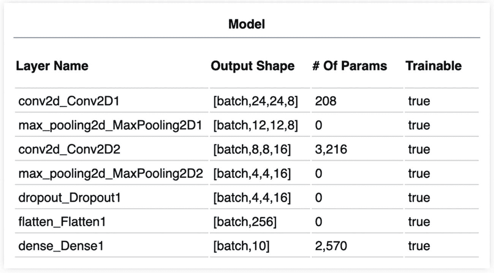
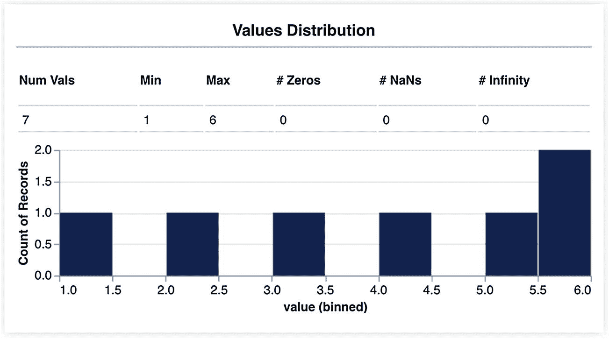

# 11. 需要记住的事情，你的下一步是什么，以及最后的言语

欢迎来到旅程的终点。通过过去的十个章节，我们使用 TensorFlow.js 探索了机器学习的激动人心的领域。我们预测了步数、聚类数据、提出问题、识别有害内容、生成图像等等，这些例子超过十个，涵盖了广泛的网络和使用案例。这已经很多了。

正是因为这个原因，在最后一章，我想以回顾一些我们看到的和一些额外的概念作为结束——我们将这个部分称为“需要记住的事情”。此外，我还想提供一些关于如何进一步扩展你在本处所学的内容的指导，并给出一些可能有助于你在未来的机器和深度学习冒险中的参考。

## 需要记住的事情

### 张量

这本书全部关于张量和它们的流动。因此，从它们开始是非常合适的。正如我们所学的，张量是具有属性 *rank*、*shape* 和 *dtype* 的 *N* 维矩阵的推广。张量有一个我想强调的重要特性：它们是**不可变的**。一旦它们的值被设置，就不能改变它们。所以，每次我们使用像 `tf.add()` 这样的张量方法时，实际上我们创建了一个新的张量。

关于张量的另一个重要事实是我们可以改变它们的形状。例如，`tf.reshape()` 函数（如下所示）可以将秩为 1 的张量转换为秩为 2 的张量。其他修改张量形状的函数还有 `tf.squeeze()` 和 `tf.expandDims()`，分别用于移除和添加维度：^(1)

```py
> const tf = require('@tensorflow/tfjs-node');
> let x = tf.tensor1d([1, 2, 3, 4]);
> x = x.reshape([2, 2]);
> x.print();
> Tensor
[[1, 2],
[3, 4]]
> x = x.expandDims(2);
> x.shape
> [ 2, 2, 1 ]
> x.squeeze().shape
> [ 2, 2 ]
```

你也可以在张量上执行数学运算。例如，在几个场合，我们应用了算术函数，如 `tf.add()` 和 `tf.div()`，来添加或除以张量的值，例如：

```py
> const a = tf.tensor1d([1, 2, 3, 4]);
> a.add(2).print();
> Tensor
[3, 4, 5, 6]
```

同样，我们也可以在两个张量之间进行逐元素操作：

```py
> const b = tf.tensor1d([5, 6, 7, 8]);
> a.add(b).print();
Tensor
[6, 8, 10, 12]
```

最后，我们也不能忘记如何将张量转换为数组。例如，`tf.dataSync()` 和 `tf.arraySync()` 函数将张量作为数组或嵌套数组返回。

### 内存管理

拥有许多张量会对你的内存造成负担，导致意外的减速，最终崩溃。这就是为什么在处理大型网络或当应用程序在 WebGL 后端运行时（因为它不会自动回收未使用的张量），管理应用程序的内存是一个好的实践。为了处理这个问题，TensorFlow.js 提供了几个函数来控制内存使用。其中一些是 `tf.dispose()`，用于丢弃任何张量，`tf.tidy()` 用于清理给定函数内分配的张量，以及 `tf.memory()`，用于返回程序的内存信息。我们未使用但应该知道的一个是 `tf.keep()`，用于避免在 `tf.tidy()` 内创建的张量被丢弃：

```py
> const tf = require('@tensorflow/tfjs-node');
> const y = tf.tidy(() => {
...   x = tf.keep(tf.tensor1d([1, 2, 3, 4]));
...
...   return x.add(1);
... });
> x.print();
Tensor
[1, 2, 3, 4]
> y.print()
Tensor
[2, 3, 4, 5]
```

但如果你移除了 `tf.keep()` 函数并尝试使用张量 `x`，你会得到一个“Tensor is disposed”错误。

### TensorFlow.js 可视化（tfjs-vis）

我们经常使用的一个包是 **tfjs-vis**，即 TensorFlow.js 可视化。使用这个库，我们经常可视化我们使用的数据集和训练进度。但这个库的功能远不止于此。

除了绘制散点图之外，使用 tfjs-vis，您还可以创建条形图（`tfvis.render.barchart()`）、直方图（`tfvis.render.histogram()`）或折线图（`tfvis.render.linechart()`）。

除了可视化数据之外，您还可以使用其他方式创建更专业的图表，例如更美观的模型摘要（图 11-1）。



图 11-1

使用 tfjs-vis 生成的模型摘要

```py
tfvis.show.modelSummary({ name: ‘Model’, tab: ‘Summary’}, model);
```

或者，您可以使用以下方式可视化张量值的分布（图 11-2）。



图 11-2

张量值的分布

```py
const a = tf.tensor1d([1, 2, 3, 4, 5, 6, 6]);
const surface = {name: 'Values Distribution', tab: 'Tensor'};
await tfvis.show.valuesDistribution(surface, a);
```

在前面的章节中，我们通过 tfjs-vis 的“视窗”使用它。然而，在第九章节中，我们了解到您也可以通过使用函数的第一个参数作为 `<canvas>` 的 id 来在 `<canvas>` 上展示可视化：

```py
const container = document.getElementById(‘canvas-training-tfvis’);
await tfvis.show.valuesDistribution(container, tensor);
```

要获取完整的参考指南，请访问[`https://js.tensorflow.org/api_vis/latest/`](https://js.tensorflow.org/api_vis/latest/)。

### 设计模型

设计模型不是一个简单的任务。创建一个模型需要理解手头的数据集，了解想要解决的问题的每一个细节，以及了解框架中可用的不同类型的层。最后一点并不简单。如果在某个时刻，您觉得层及其特性让您感到不知所措，请让我向您保证，这是完全正常的。随着时间的推移，在设计了多个模型之后，您将开始理解它们的不同之处和功能。

在 TensorFlow.js 中，创建模型主要有两种方式。一种是通过 **Sequential**（“堆叠的煎饼”）方法，另一种是 **Functional**（“桌面上的煎饼”）方法。我们的大部分练习都使用了 Sequential 模型，这是一种描述层堆叠的模型拓扑，其中一层的输出是下一层的输入。Functional 或 `tf.model()` 方法是基于图的替代方案，其中您通过指定输入和输出以及使用 `tf.apply()` 连接层来定义拓扑。无论层类型如何，您都必须始终在输入层中声明输入张量的形状。使用 Sequential 模型，您可以在第一层中使用 `inputShape` 指定形状。或者，如果您使用的是 `tf.model()`，那么您需要在 `tf.input()` 中定义形状。

在设计好架构之后，下一步是编译和调整模型。在训练模型之前，你总是需要编译它来设置训练所需的损失函数、优化器和度量属性。然后是使用`model.fit()`来调整模型。`model.fit()`的参数是训练数据、目标，或者在`model.fitDataset()`的情况下，是一个`tf.data.Dataset`对象。在这两种情况下，你还需要一个对象来配置超参数。在这些超参数中，你至少应该定义批大小和训练轮数。否则，模型将使用默认值。其他重要的属性包括回调、验证数据和洗牌。

有关层的更多信息，请访问[`js.tensorflow.org/api/latest/#Layers`](https://js.tensorflow.org/api/latest/%2523Layers)的文档。

### 超参数和属性

如果设计网络的架构很复杂，那么决定其超参数的值可能更为复杂。对于网络来说，没有正确或错误的一组属性。毕竟，每个数据集和用例都是不同的。然而，有一些最佳实践和指南可以作为起点。还记得第十章中的 DCGAN 吗？我们使用的 0.0002 的学习率来自描述该模型的论文。我的建议是，在创建模型时，检查文献、项目或教程，以找到其他人已经成功使用的配置。尝试这些配置。研究它们如何影响模型的表现。这样做将给你一个如何处理问题的思路。

另一个需要考虑的重要属性是损失函数。与超参数不同，损失函数直接与模型的任务相关联。因此，选择一个比选择，比如说，训练轮数更为直接。例如，如果当前任务是回归问题，均方误差是一个最佳选项。如果问题是分类，对于二元分类，二元交叉熵表现良好，就像分类交叉熵对于多类分类一样有效。表 11-1 总结了这些信息。

表 11-1

适用于特定任务的损失函数

| 任务 | 目标 | 损失函数 | 最后层的激活函数 |
| --- | --- | --- | --- |
| 回归 | 连续值 | 均方误差 | - |
| 分类 | 二元分类 | 二元交叉熵 | Sigmoid |
| 分类 | 多类分类 | 分类交叉熵 | Softmax |

### 测试

在软件开发中，测试是必不可少的，然而，在书中，我们没有执行任何类型的测试。我省略测试用例的原因是尽可能简化代码。但在幕后，我执行了各种测试，这些测试主要涉及确认张量的形状或它们的值。要测试 TensorFlow.js 中的语句，API 提供了一个函数，`tf.util.assert()`，该函数断言表达式是否为真。为了说明这一点，请考虑以下示例，其中我们测试张量的形状：

```py
> const tf = require('@tensorflow/tfjs-node');
> const a = tf.tensor2d([1, 2, 3, 4], [2, 2]);
> tf.util.assert(JSON.stringify(a.shape) == JSON.stringify([2, 2]), 'shape is not [2,2]');
> tf.util.assert(JSON.stringify(a.shape) == JSON.stringify([2, 3]), 'shape is not [2,3]');
Uncaught Error: shape is not [2,3]
at Object.assert (/.../node_modules/@tensorflow/tfjs-core/dist/util.js:105:15)
```

在第一个例子中，我们正在测试张量 `a` 的形状是否为 [2, 2]。如果为真（就像这里一样），则不会发生任何事。请注意，为了比较形状（它们是数组），我们必须将它们转换为字符串并比较这些字符串。如果表达式不为真（第二个测试用例），则返回第二个参数中提供的消息。第二种常见的测试场景是断言张量值的范围，如下所示：

```py
> const b = tf.tensor1d([-1, 0, 1]);
> tf.util.assert(
...   b.min().dataSync()[0] >= -1 && b.max().dataSync()[0] <= 1,
...   'values outside range',
... );
```

在这个例子中，我们使用了 `tf.min()` 和 `tf.max()` 来检查张量的值是否在 -1 和 1 之间，这是我们第十章节中看到的情况。使用索引是因为 `dataSync()` 返回长度为 1 的数组中的最小或最大值。

### 异步代码

虽然这一点不仅与 TensorFlow.js 有关，但值得提及的是，在开发 Web 应用程序时，你应该考虑使用异步代码以避免阻塞应用程序。潜在的场景包括调用函数 `tf.Sequential.fitDataset()` 和 `tf.loadLayersModel()` 或在执行可能引起应用程序明显暂停的函数时。在我们的示例中，我们使用了张量到数组的函数的同步版本——`tf.dataSync()` 和 `tf.arraySync()`——因为我们没有处理大型张量，并且响应是立即的。然而，如果需要，请考虑使用异步变体 `tf.data()` 和 `tf.array()`。

## 你接下来要做什么？

所以，你已经读完了这本书。这意味着你学习深度学习就结束了？绝不！深度学习和数据科学是一个随着每一天的过去而不断发展的广阔领域。幸运的是，我们所学到的应用和经验为我们开始了探索自己的准备。如果你问我应该从哪里开始，我会建议探索一些我们之前没有看到的 TensorFlow.js 预训练模型，例如人体分割模型和语音命令识别。在他们之后，你可以学习其他深度学习和机器学习概念，如嵌入、自动编码器、图像分割、基于注意力的模型和降维算法。关于后者，你可以在官方 TensorFlow.js 仓库中找到一个 t-Distributed Stochastic Neighbor Embedding (t-SNE)的实现.^(2) 然而，在撰写本文时，该库尚未更新到 TF.js 的最新版本。另一个选择是回到我们创建的模型，对其进行改进。添加（或删除）更多层，使用不同的数据，调整超参数，创建一个有趣的应用程序，编写一个 Chrome 扩展程序，等等。

如果你想要将模型进一步发展，尝试在其他平台上部署它们，例如移动设备、云平台，甚至使用 Electron 在桌面应用程序上。通过在其他地方部署，你不仅有机会从全新的角度与他们互动，还有机会学习新的框架。此外，尝试在 TensorFlow（Python）中进行实验。更好的是，一旦你到了那里，改变你已有的模型（迁移学习，也许？）以体验 TensorFlow 和 TensorFlow.js 框架之间的相似性。

最后，也是最重要的，享受乐趣。训练、部署、制作、打破、可视化、设计、质疑和享受——在我看来，这是最好的学习方式。

## 外部资源

以下是一份外部资源列表，以指导你通过 TensorFlow.js 的冒险之旅：

+   在[`https://js.tensorflow.org/api/latest/`](https://js.tensorflow.org/api/latest/)的官方 API 文档：这是库的指南。在其中，你可以找到关于 TensorFlow.js 提供的每个函数和对象的文档。

+   StackOverflow 的 TensorFlow.js 标签在[`https://stackoverflow.com/questions/tagged/tensorflow.js`](https://stackoverflow.com/questions/tagged/tensorflow.js)：使用此标签提问或寻找答案（现在你应该能够回答一些问题！）。

+   TensorFlow.js 的 GitHub 问题标签在[`https://github.com/tensorflow/tfjs/issues`](https://github.com/tensorflow/tfjs/issues)：这主要是用于报告库的 bug 和问题，而不是寻求帮助。尽管如此，你可能会在这里找到一些答案，尤其是当它们与 bug 相关时。

+   对于寻找数据集，可以尝试 Kaggle 的数据集收藏（[`www.kaggle.com/datasets`](https://www.kaggle.com/datasets)）或 Google 数据集搜索（[`https://datasetsearch.research.google.com/`](https://datasetsearch.research.google.com/)）。

+   对于这里介绍的概念背后的理论和数学，我强烈推荐 Ian Goodfellow、Yoshua Bengio 和 Aaron Courville 合著的《深度学习》一书。

+   我们在这里讨论的主题主要属于深度学习的子领域。但机器学习更多地涉及网络和张量。如果你希望了解更多的机器学习知识，我推荐阅读 David Paper（Apress）的《Hands-on Scikit-Learn for Machine Learning Applications》和 Aurélien Géron（O’Reilly）的《Hands-On Machine Learning with Scikit-Learn, Keras & TensorFlow》。

## 感谢

虽然听起来很老套，但我还是想以感谢结束。这本书不仅是你的一次旅程，也是我的一次旅程。你在这里学到的每一行代码、每一个概念和每一项信息，对我来说也是一次教训。我对此表示感激。

正如本书开头所说，我在背包旅行中写下了这本书。实际上，当我写下这一行时，我正被困在新西兰的冠状病毒危机中。所以，你阅读的每一页背后，都有一个新城市、一家不同的公司、一个激动人心的故事，甚至是一个糟糕的网络连接。尽管我经历了这些变化，但唯一不变的是，我想要把一本关于 TensorFlow.js 和机器学习的优秀书籍带给你们。

我真心希望，通过最后的 11 章，你已经获得了一个全新的知识世界，这将伴随你在未来的努力中。如果你有任何问题，发现错误，或者想要向我展示你的最新应用程序，请通过 Twitter 联系我：[`https://twitter.com/jdiossantos`](https://twitter.com/jdiossantos)。我很乐意听到你的声音。

保持冷静！

> *（胡安：)*
> 
> *2020 年 4 月 7 日，新西兰基督城*
