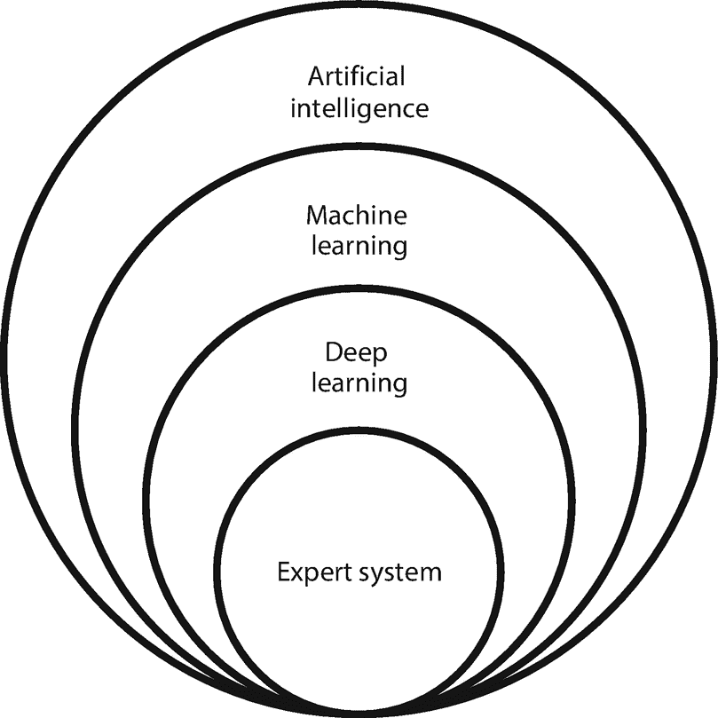
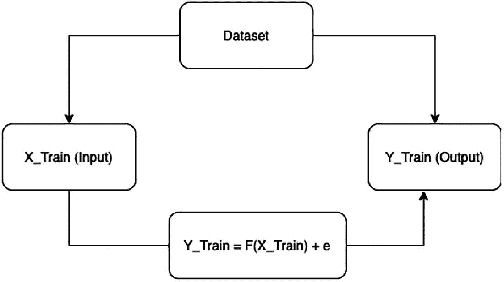
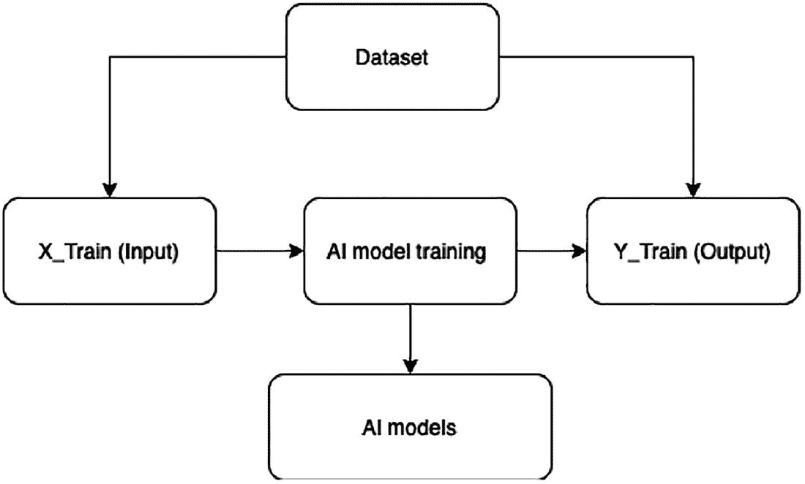
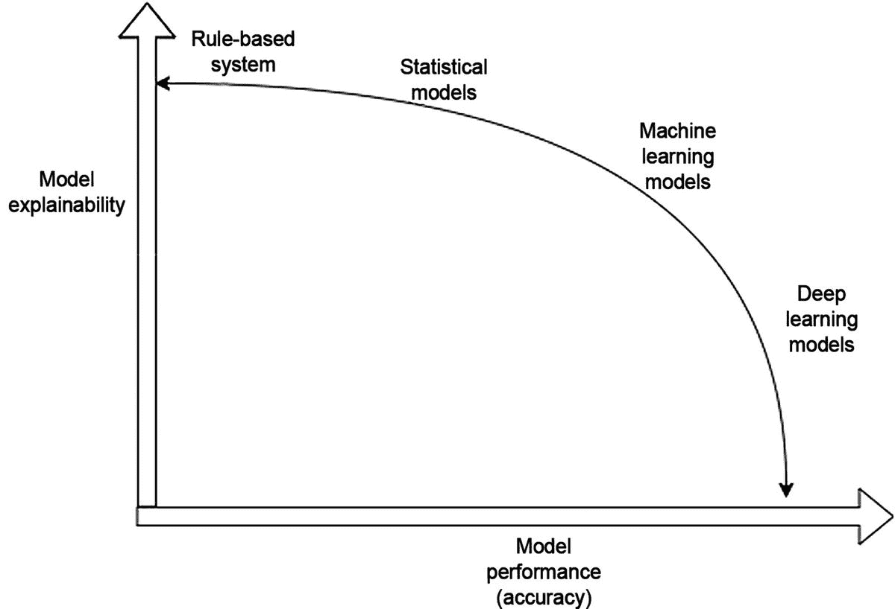
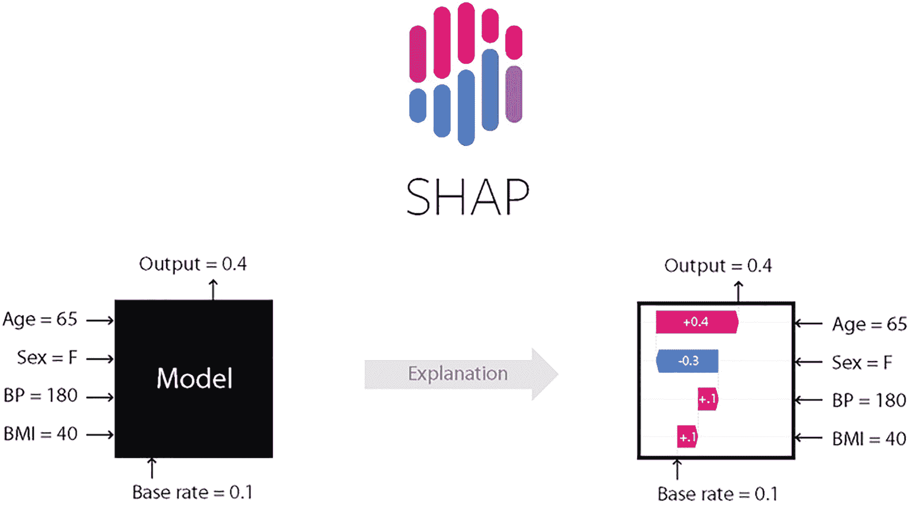
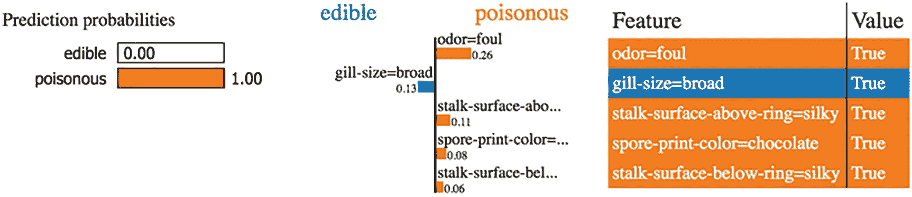
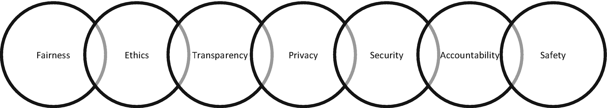
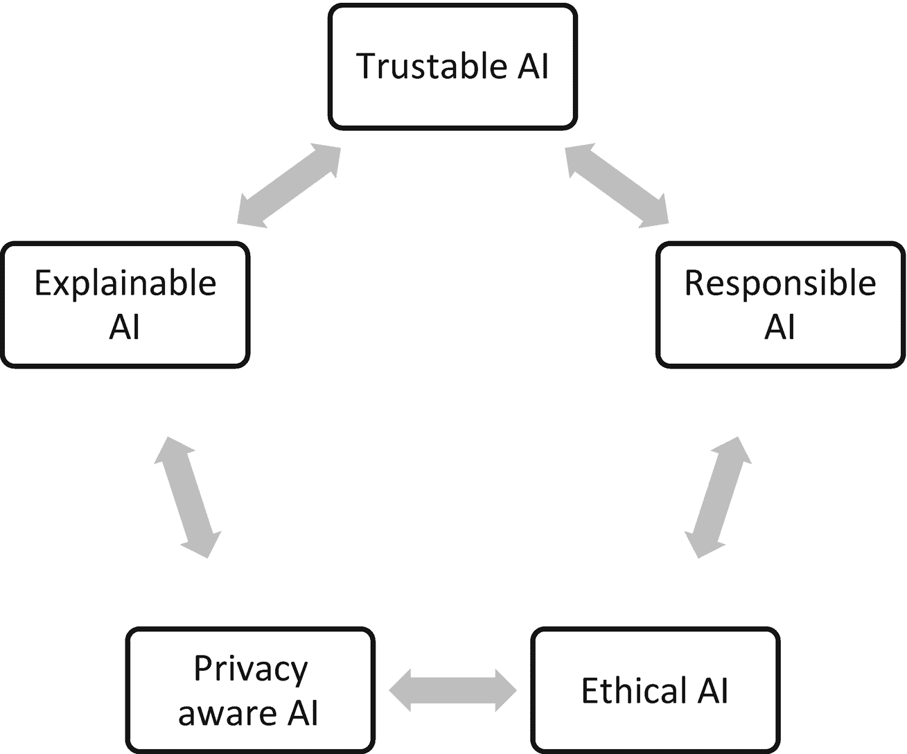

## 模型可解释性与可理解性

在本书中，我们将首先介绍模型可解释性和可理解性的基础知识、AI 应用中的伦理考量以及 AI 模型生成预测中的偏差。我们将涵盖 AI 模型在不同用例中生成预测的可靠性。然后，我们将介绍用于解释 AI 中使用的线性模型（如非线性模型和时间序列模型）的方法和系统。接下来，我们将探索最复杂的集成模型，以及使用 Lime、SHAP、Skater、ELI5 等框架进行可解释性和可理解性分析。然后，我们将涵盖非结构化数据和与自然语言处理相关任务的模型可解释性。

## 建立框架

近年来，机器学习与深度学习领域在构建人工智能解决方案方面取得了巨大进展，这些方案横跨零售、银行、金融服务、保险、医疗、制造业以及基于物联网的行业。人工智能是众多产品与解决方案的核心，这些产品正随着各类业务功能的快速数字化而不断涌现。人工智能之所以能成为这些产品与解决方案的根基，是因为智能机器如今已具备学习、推理和自适应能力。经验是稀缺的。如果我们能利用聪明人积累的丰富经验，并通过机器的学习与推理层将其反映出来，就能极大地放大学习要素的倍增效应。凭借这些能力，当今的机器学习和深度学习模型在解决复杂业务问题方面能够达到前所未有的性能水平，从而推动业务成果的实现。

回顾过去两年，市场上涌现了大量 AutoML（自动机器学习）工具、框架、低代码和无代码工具（只需最少的人工干预），这是人工智能系统实现的又一层次精妙之处。这标志着在解决方案的设计、交付和部署方面，几乎实现了零人工干预的极致。当决策完全由机器做出，而人类始终处于被动接收端时，我们迫切需要理解机器是如何得出这些决策的。为人工智能系统提供动力的模型通常被称为黑盒模型。因此，为了解释人工智能模型做出的预测，我们需要模型的可解释性与可理解性。

## 人工智能

人工智能是指将系统设计为一个计算机程序，该程序能在无需显式编程的情况下，代表人类针对特定任务自动做出决策。图 1-1 解释了机器学习、深度学习与人工智能之间的关系。



图 1-1 机器学习、深度学习与人工智能之间的关系

人工智能是一个利用计算机程序设计的系统，能够针对问题陈述得出智能推论。在获取智能的过程中，我们可能会使用机器学习算法或深度学习算法。机器学习算法是简单的数学函数，用于利用输入和输出数据的组合进行优化。此外，这些函数可用于利用新的输入来预测未知的输出。对于结构化数据，我们可以使用机器学习算法；但当数据维度和规模增加时，例如图像数据、音频数据、文本数据和视频数据，机器学习模型的表现会变差，因此需要深度学习模型。专家系统被设计为基于规则的系统，有助于获取推论。当我们没有足够的训练数据来训练机器学习模型或深度学习模型时，就需要用到它。总体而言，构建人工智能系统需要结合专家系统、机器学习算法和深度学习算法来生成推论。

机器学习可以定义为一个系统，其中算法根据先前定义的某个任务从示例中学习，并且随着我们向系统输入越来越多的数据，学习性能会不断提高。任务可以定义为监督学习（输出/结果事先已知）、无监督学习（输出/结果事先未知）以及强化学习（行动/结果始终由反馈层驱动，反馈可以是奖励或惩罚）。就学习算法而言，它们可以分为线性算法、确定性算法、加法和乘法算法、基于树的算法、集成算法以及基于图的算法。性能标准可根据所选算法来定义。解释人工智能模型的决策被称为可解释人工智能（XAI）。

### 可解释人工智能（XAI）的必要性

让我们来看看为何将人工智能模型称为黑盒模型。图 1-2 展示了经典的建模场景：一组自变量通过一个预先确定的函数，从而产生输出。将生成的输出与真实输出进行比较，以评估该函数是否拟合数据。如果函数拟合效果不佳，我们就必须对数据进行变换，或者考虑使用另一个函数来拟合数据。但这个过程相当依赖人工操作，并且每当数据刷新时，都需要统计学家或建模者重新校准模型，再次检查数据是否拟合模型。这就是为什么用于推理处理的经典预测模型生成方式依赖于人类，并且总是存在多种解读。有时，利益相关者很难信任模型，因为许多专家提出的各种变体在某种意义上听起来都不错，但缺乏通用性。因此，如图 1-2 所示的经典模型开发系统，在数据时刻变化的人工智能系统世界中难以实施。数据在不断变化。人类对校准的依赖是一个瓶颈；因此，需要一种使用动态算法动态生成推理的现代系统。



图 1-2 经典模型训练系统

图 1-2 展示了经典的模型开发场景，其中模型可以通过一个方程来捕获，该方程易于解释，也容易向任何人说明。然而，基于公式的解读方式在人工智能世界中正在发生变化。图 1-3 展示了探索能够利用输入产生输出的最佳可能函数的结构。在这里，没有约束将模型限制为特定的函数（如线性或非线性）。在这种结构中，学习通过多次迭代进行，并使用交叉验证方法来确定最佳模型。人工智能模型面临的挑战在于可解释性和可说明性，因为许多算法很复杂，所以不容易向每个人解释其预测结果。



图 1-3 人工智能模型训练过程

随着计算机程序和算法的进步，开发者搜索不同类型函数（如线性和非线性）变得非常困难，并且对这些函数的评估也变得极其困难。机器学习或深度学习模型负责搜索能够良好拟合训练数据的合适函数。图 1-3 解释了机器如何识别最终模型，该模型不仅在准确性方面表现更佳，而且在生成预测的稳定性和可靠性方面也更优。当输入和输出之间的函数关系被明确定义时，歧义较少，预测结果也更为透明。然而，当我们的 AI 模型选择了一个复杂的函数关系时，作为最终用户很难理解。因此，人工智能模型被视为黑箱。在本书中，我们希望让黑箱模型变得可解释，从而使人工智能解决方案越来越易于部署和适应。

用于决策的人工智能模型的日常执行需要透明度、无偏性和伦理性。目前，在多种场景下缺乏可解释性：

- 某人申请信用卡，而人工智能模型拒绝了该申请。重要的是要说明申请被拒绝的原因，以及申请人可以采取哪些纠正措施来改善其行为。

- 在基于生活方式和生命体征的医疗诊断中，人工智能模型预测一个人是否会患糖尿病。这里，如果模型预测此人可能患上糖尿病，那么它也必须说明原因以及未来导致该疾病的驱动因素是什么。

- 自动驾驶汽车识别道路上的物体并做出明确的决策。它们也需要对其为何做出这些决策有清晰的解释。

还有许多其他用例，其中支持模型输出的解释至关重要。人类倾向于不接受他们无法解读或理解的事物。这降低了他们对人工智能模型预测结果的信任度。我们使用人工智能模型是为了消除人类决策中的偏见；然而，如果结果不公正、不合法且不透明，那么这些决策将是危险的。另一方面，有人可能会争辩说，如果我们无法解读和解释人工智能模型的决策，那为什么还要使用它们呢？原因在于模型的准确性和性能。模型的性能与可解释性之间总是存在权衡。图 1-4 解释了两者之间的权衡。



图 1-4 模型可解释性与性能（准确性）之间的权衡

在图 1-4 中，横轴表示模型的性能或准确性，纵轴表示模型的解读和解释。基于规则的系统位于性能并非最优的位置；然而，其可解释性很好。相比之下，基于深度学习的模型以较低的可解释性和可说明性为代价，提供了卓越的性能和良好的准确性。

### 可解释性 vs. 可理解性

模型解释与可解释性之间存在差异。**可理解性**关乎预测结果的含义，而**可解释性**则关乎模型为何做出某个预测，以及人们为何应该信任该模型。为了更好地理解这种差异，让我们看一个销售预测的真实案例。在该案例中，有助于预测的因素包括广告费用、产品质量、广告制作来源、广告尺寸等。回归建模完成后，每个因素都有一个系数。这些系数可以理解为，当某个因素（如广告费用）发生单位变化时，销售额的增量变化。然而，如果你预测下个月的销售额将达到 20,000 美元，而历史月平均销售额一直低于或等于 15,000 美元，这就需要一个解释。作为模型可解释性的一部分，我们需要以下几点：

- 模型可理解性确保决策过程自然，且预测中不存在偏见。

- 区分虚假因果关系与真实因果关系，这有助于使预测过程透明化。

- 需要在保证学习经验和迭代的高性能不受影响的前提下，生成可解释的模型。

- 使决策者能够信任 AI 模型。

> “XAI 应用和产品将成为 2021 年的新趋势，因为对 AI 可理解性、信任度和伦理学的需求已经非常明确且强烈。” – 普拉迪普塔·米什拉（来源：各类研究报告）

围绕 XAI 的研究从未停止，其目标始终是向最终用户解释 AI 模型及其行为，以提高 AI 模型的采用率。那么问题来了，谁是 XAI 的最终用户？

- 信贷官员：他们评估贷款、信贷请求等申请。如果他们理解了决策，就能帮助教育客户纠正其行为。

- 数据科学家：他们评估自己的解决方案，并确保模型得到改进。这是否是利用当前数据集所能构建的最佳模型？

- 高级管理人员：他们需要在高层面上满足监管和合规要求。

- 业务负责人：他们需要信任 AI 黑箱决策，并寻找任何可以依赖的历史证据。

- 客户支持主管：他们需要回应投诉并解释决策。

- 内部审计师和监管机构：他们必须确保建立了一个透明的、数据驱动的流程。

XAI 的目标是实现以下几点：

- **信任**：预测准确性是数据质量、真实因果关系和合适算法选择的明确函数。然而，模型在预测过程中容易产生误报。如果模型产生大量误报，最终用户就会失去对模型的信任。因此，向最终用户传达对模型的信心至关重要。

- **关联性**：机器学习或深度学习模型通过学习各种特征之间的关联来进行预测。这些关联可能是相关性，也可能仅仅是关联。无法解释的相关性就是虚假相关性，它会使模型难以理解。因此，捕捉真实的相关性非常重要。

- **可靠性**：对模型的信心、模型预测的稳定性以及模型的鲁棒性也非常重要。这是为了增强 AI 模型的可信度，并确保最终用户对模型预测有足够的信心。如果做不到这一点，就没有用户会信任这些模型。

- **公平性**：AI 模型应该是公平且符合伦理的。它们在生成预测时不应基于宗教、性别、阶级和种族进行歧视。

- **身份识别**：AI 模型应能完好地保护隐私，不泄露个人身份。在生成 XAI 时，隐私和身份管理非常重要。

### 可解释性类型

机器学习可理解性是模型可解释性的一个组成部分。模型解释有多种分类方式：

- **内在解释**：简单模型属于此类，例如简单的线性回归模型和基于决策树的模型，其中简单的 if/else 条件就能解释预测结果。这意味着 XAI 内置于模型本身，无需进行任何事后分析。

- **事后解释**：复杂模型，如非线性模型、集成树模型、随机梯度提升树模型和堆叠模型，需要投入更多精力来创建可解释性。

- **模型特定**：有一类解释只能从特定类型的模型中得出，仅此而已。例如，线性回归模型不提供特征重要性。但有人可以将线性回归模型的系数用作代理指标。

- **模型无关**：这类解释可以通过查看训练输入数据和训练输出数据的组合来理解。在本书中，我们将在后续章节中探讨模型无关的解释。

- **局部解释**：这提供了关于单个预测的概念，即对单个数据点的解释。例如，如果模型预测某个借款人可能违约，原因是什么？这就是局部解释。

- **全局解释**：这提供了对所有数据点预测结果的全局理解、整体模型行为等方面的概念。

- **子局部解释**：这解释了一组数据点（而非所有数据点）的局部情况。这与局部解释不同。

- **文本解释**：基于文本的解释包括数字部分以及用于传达模型某些参数含义的语言。

- **可视化解释**：可视化解释很好，但有时它们不够直观，无法解释预测结果，因此非常需要可视化与文本解释相结合。

### 模型可解释性工具

有多种工具和框架可用于从机器学习和深度学习模型中生成可解释性。开源的 Python 库各有优缺点。在本书的所有示例中，我们将混合使用开源的 Python 库以及来自各个网站的公开数据集。以下是需要安装的工具和需要设置的环境。

#### SHAP

SHAP（SHapley Additive exPlanations）库是一种基于 Python 的统一方法，用于解释任何机器学习模型的输出。SHAP Python 库基于博弈论，并提供局部解释。博弈论方法是一种在某个因素存在与不存在时获取预测结果的方式。如果预期结果发生显著变化，则该因素对目标变量非常重要。该方法统一了先前几种解释机器学习模型输出的方法。SHAP 框架可用于除时间序列模型之外的各种模型类型。参见图 1-5。SHAP 库可用于理解模型。

```
!pip install shap
```



图 1-5 Shapley 值与解释示例图

#### LIME

`LIME` 代表局部可解释的模型无关解释（Local Interpretable Model-Agnostic Explanations）。其中，“局部”指的是围绕模型预测的类别所在局部区域进行解释。分类器在该局部区域的行为有助于我们很好地理解其预测结果。“可解释”意味着，如果预测结果无法被人类理解，那就毫无意义。因此，类别预测必须是可解释的。“模型无关”则意味着，该系统和方法应能够生成解释，而无需理解特定的模型类型。

文本分类问题，例如情感分析或任何其他文本分类，其输入是作为文档的句子，输出是一个类别。参见图 1-6。当模型预测一个句子具有积极情感时，我们需要知道是哪些词使得模型将类别预测为积极。这些词向量有时非常简单，例如单个词语。有时则很复杂，例如词嵌入，在这种情况下，我们需要知道模型如何解释词嵌入，以及它如何影响分类。在这些场景中，`LIME` 对于理解机器学习和深度学习模型极其有用。`LIME` 是一个基于 Python 的库，可用于展示其工作原理。可以按照以下步骤安装该库：

```
!pip install lime
```



图 1-6 蘑菇分类示例

#### ELI5

`ELI5` 是一个基于 Python 的库，旨在用于可解释的人工智能管道，它允许我们通过统一的 API 来可视化和调试各种机器学习模型。它内置了对多个机器学习框架的支持，并提供了一种解释黑盒模型的方法。该库的目的是让各种黑盒模型的解释变得简单。参见图 1-7。

```
!pip install eli5
```

![../images/506619_1_En_1

*   文本解释需要阐述数学公式、模型参数的结果或模型定义的指标的含义。解释可以基于预定义的模板来设计，其中故事线需要事先准备好，只需在模板中填充参数即可。有两种不同的方法可以实现这一点：使用自然语言生成方法，这需要收集文本并生成描述对象的句子；以及使用摘要生成进行解释。

*   视觉解释可以通过自定义图表和图形来提供。基于树的图表对最终用户来说相当简单且不言自明。每种基于树的方法都有一组规则支持。如果这些规则能够以简单的 `if/else` 语句形式展示给用户，那将会强大得多。

*   基于示例的方法确保我们可以通过类比，使用常见的日常示例来解释模型。此外，也可以使用常见的业务场景来解释模型。

### XAI 兼容模型

让我们来看看当前模型的状态、其内在特性、它们与 XAI 的兼容程度，以及这些模型是否需要额外的框架来实现可解释性。

-   **线性模型**：线性回归模型或逻辑回归模型通过分析其系数值（一个数字）很容易解释。这些值非常容易理解。然而，如果将其扩展到正则化回归族，解释起来就变得非常困难。通常我们更关注单个特征，而不纳入交互特征。如果包含交互项，例如加法交互、乘法交互、二次多项式交互或三次多项式交互，模型的复杂度就会上升。数学结果需要一种更简单的解释方式。因此，在这些复杂场景中，需要解释的内容要多得多。

-   **时间序列预测模型**：这些也是非常简单的模型，遵循回归类场景，可以通过参数化方法轻松解释。

-   **基于树的模型**：基于树的模型更容易分析，对人类来说也非常直观。然而，这些模型通常无法提供更好的准确性和性能。它们还缺乏鲁棒性，并存在固有的偏差和过拟合问题。由于存在如此多的缺点，对最终用户来说，解释这些模型毫无意义。

-   **集成模型**：集成模型有三种不同类型：Bagging、Boosting 和 Stacking。这三种类型都缺乏可解释性。需要一种简化的描述来传达模型结果。特征重要性也需要简化。

-   **数学模型**：基于向量数学的支持向量机用于回归任务和分类任务。这些模型相当难以解释，因此非常需要进行模型简化。

-   **深度学习模型**：深度神经网络模型通常具有三个以上的隐藏层，才能符合“深度”的定义。除了深度学习模型的层之外，还有各种模型调优参数，例如权重、正则化类型、正则化强度、不同层的激活函数类型、模型中使用的损失函数类型，以及包括学习率和动量参数在内的优化算法。这在本质上非常复杂，需要一个简化的框架来进行解释。

-   **卷积神经网络**：这是另一种神经网络模型，通常应用于目标检测和图像分类相关任务。它被认为是一个完全的黑盒模型。其中有卷积层、最大/平均池化层等等。如果有人问为什么模型把猫预测成了狗，我们能解释哪里出错了吗？目前答案是否定的。在向最终用户解释这个模型方面，还需要大量的工作。

-   **循环神经网络**：基于循环神经网络的模型通常适用于文本分类和文本预测。存在多种变体，例如长短期记忆网络和双向 LSTM，它们非常复杂，难以解释。我们一直需要更好的框架和方法来解释此类模型。

-   **基于规则的模型**：这些模型非常简单，因为我们只需要 `if/else` 条件就能构建这些模型。

### XAI 与负责任的人工智能

负责任的人工智能是一个框架，确保在各种软件应用、数字解决方案和产品中实现可解释性、透明度、伦理和问责制。人工智能的发展正在不同领域迅速创造多种机会，普通人的生活也受到这些技术的影响，因此人工智能需要负责任，其决策也应该是可解释的。

负责任人工智能的七大核心支柱是可解释性的关键部分（图 1-11）。让我们来看看每个支柱。



图 1-11

负责任人工智能的核心支柱

-   **公平性**：人工智能系统生成的预测不应导致对个人的歧视，无论其种姓、信仰、宗教、性别、政治派别、种族等如何，因此需要更高程度的公平性。

-   **伦理**：在构建智能系统的过程中，我们不应忘记在使用数据收集情报时的伦理问题。

-   **透明度**：模型预测以及预测的生成方式应该是透明的。

-   **隐私**：在开发人工智能系统时，应保护个人数据（PII，个人可识别信息）。

-   **安全性**：智能系统应该是安全的。

-   **问责制**：如果出现错误预测，人工智能模型应能够承担责任并修复问题。

-   **安全性**：当人工智能模型就自动驾驶汽车的导航、机器人牙科手术和数据驱动的医疗诊断做出决策时，任何错误的预测都可能导致危险的后果。

许多组织正在为其解决方案中的人工智能使用制定指南和标准，以避免未来人工智能带来意外的负面后果。以组织 A 为例。它使用人工智能来预测销售量。人工智能预测销售额将比平均水平高出 30%，因此企业储备了大量产品并动员了人力来支持销售。但如果实际销售额与历史销售平均水平持平，那么额外储备的库存和人力就浪费了。这里的人工智能预测是错误的。借助模型可解释性，这种情况本可以得到分析，并且模型或许可以得到纠正。

### XAI 评估

目前，互联网上基于 Python 的库所生成的不同解释尚无统一的评估标准。XAI 流程在评估解释时应遵循以下步骤：

- 每个分层都应有独立的解释。如果数据集因数据量过大而无法用于模型训练，我们通常会对其进行采样。若采用分层抽样方法，则每个分层都应有独立的解释。

- **时间约束**：我们知道现实生活中的数据集非常庞大。即使采用分布式计算框架，XAI 库生成的解释通常也不应耗费过多时间。

- **实例不变性**：如果数据点基于其属性完全相同，它们应属于同一组，因此应传达相似的解释。

在各种 AI 项目和计划中，当我们进行预测时，常常会有人问：为什么有人会信任我们的模型？在预测分析、机器学习或深度学习中，预测结果与预测原因之间存在权衡。如果预测结果符合人类预期，那自然很好。但如果超出人类预期，我们就需要了解模型为何做出这样的决策。在低风险场景下，例如客户定位、数字营销或内容推荐，预测与预期的偏差是可以接受的。然而，在高风险环境中，例如临床试验或药物测试框架，预测与预期的微小偏差都会造成巨大影响，并引发诸多关于模型为何做出此类预测的疑问。作为人类，我们自认为优于万物。我们天生好奇，想知道模型是如何得出预测结果的，以及为什么不是由人类来完成。XAI 框架是识别机器学习训练过程中固有偏见的绝佳工具。XAI 帮助我们调查偏见产生的原因，并找出偏见具体出现在哪里。

由于许多人无法自如地解释机器学习模型的结果，也无法推理出模型的决策依据，因此他们不愿意使用 AI 模型（图 1-12）。本书旨在推广 XAI 框架的概念，用于调试机器学习和深度学习模型，以提高 AI 在工业界的采用率。在高风险环境和用例中，存在监管和审计要求，需要对模型的决策进行推理。本书旨在提供 XAI 框架在有监督回归、分类、无监督学习、聚类和分割相关任务中的实践操作。此外，某些时间序列预测模型也需要 XAI 来描述预测结果。进一步地，XAI 框架也可用于非结构化文本分类相关问题。单一的 XAI 框架并不适用于所有类型的模型，因此我们将讨论各种类型的开源 Python 库及其在生成基于 XAI 的解释中的用法。



图 1-12

AI 提高采用率所需的条件

检查模型公平性还需要使用预测结果模拟假设情景。我们也将涵盖这一点。然后，我们将讨论 AI 模型的反事实和对比解释。我们将涵盖深度学习模型的模型可解释性、基于规则的专家系统，以及使用各种 XAI 框架针对预测不变性和计算机视觉任务的模型无关解释。

模型可解释性和可说明性是本书的重点。书中介绍了通常用于解释 AI 模型决策的数学公式和方法。读者将了解软件库方法、类、框架和函数，以及如何使用它们来实现模型的可说明性、透明度、可靠性、伦理、偏见和可解释性。如果人类能够理解 AI 模型做出决策背后的原因，这将赋予用户更大的权力来进行修正和提出建议。

## 结论

模型可解释性和可说明性是所有使用 AI 进行预测的流程所必需的，原因在于我们需要了解预测背后的理由。在本章中，您学习了以下内容：

- 模型可说明性和可解释性基础

- AI 应用中的伦理考量以及 AI 模型生成预测中的偏见

- AI 模型在不同用例中生成预测的可靠性

- 用于解释 AI 中使用的线性模型、非线性模型和时间序列模型的方法和系统

- 使用诸如 `Lime`、`SHAP`、`Skater`、`ELI5` 等框架的最复杂集成模型、可说明性和可解释性

- 非结构化数据和自然语言处理相关任务的模型可解释性