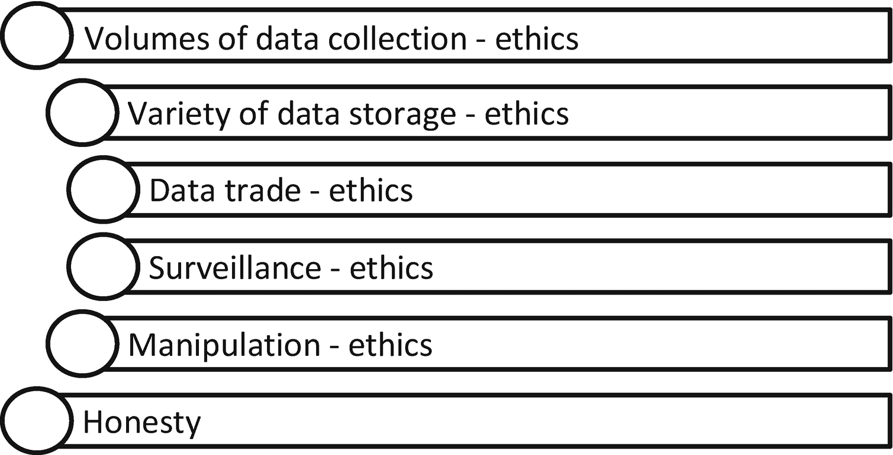
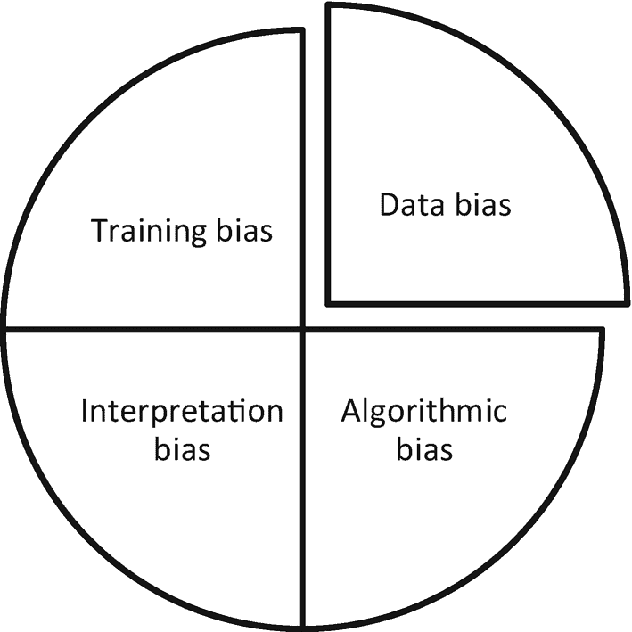
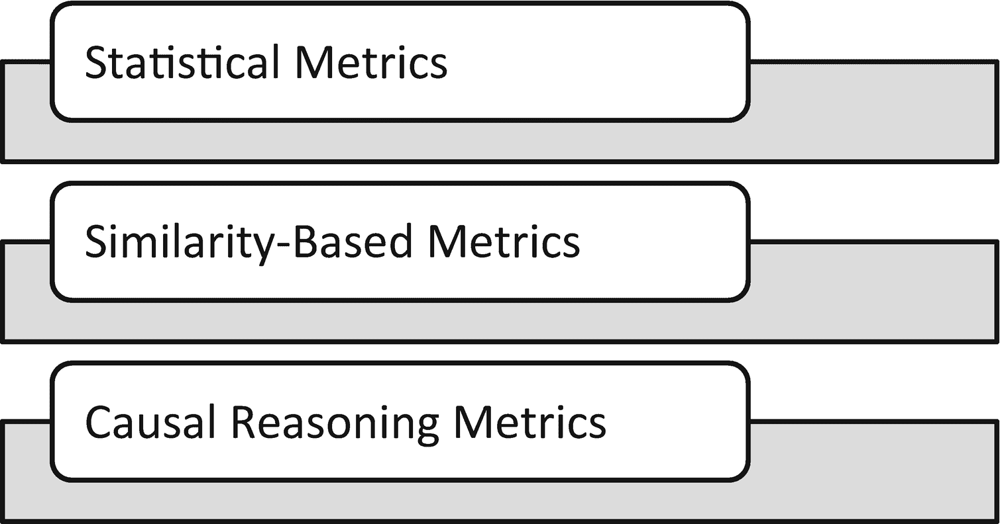
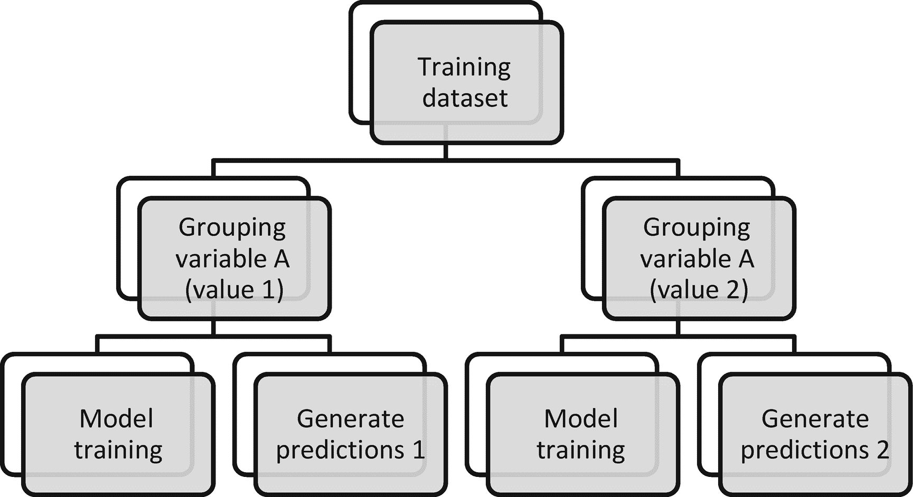
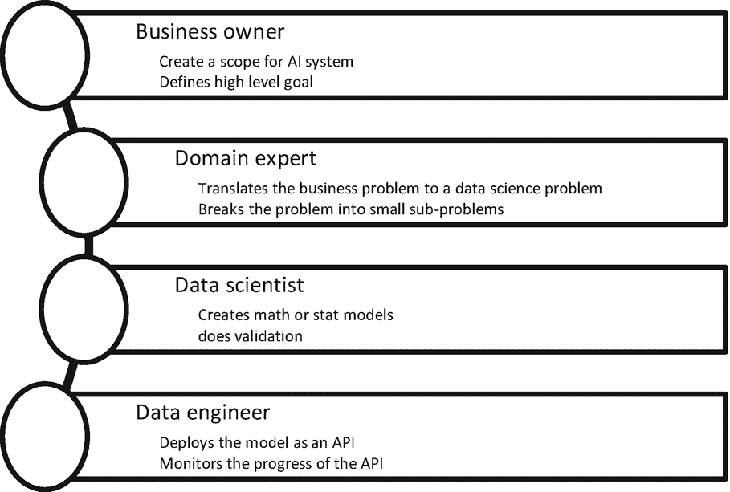

# 2. AI 伦理、偏见与可靠性

本章涵盖了使用可解释人工智能 (XAI) Python 库的不同框架，以控制偏见、执行可靠性原则，并在生成预测时维护伦理。随着数字化进程触及不同行业，它为人工智能和机器学习相关解决方案的应用开辟了全新的机遇。采用这些 AI 技术的主要挑战在于伦理、偏见、系统可靠性以及流程的透明度。这些 AI 系统提出了根本性问题：我能信任 AI 系统做出的预测吗？我能假设它是无偏见的吗？它存在何种风险？是否存在某种流程可以让我控制 AI 系统及其对未来的预测？AI 伦理更侧重于 AI 为人类及其福祉的合法使用。AI 不应被用于毁灭人类文明。在本章中，我们将讨论 AI 的各个方面。

## AI 伦理入门

人工智能是一个相对较新的领域，随着世界各国政府发现其存在不一致性的证据，该领域正逐步规范化。AI 广义上指计算机为达成最终目标所展现或演示的智能行为。这些目标通常由业务定义，例如在物流场景中用于安排仓库，或定义机器人及其在仓库中搬运和移动包裹的活动。它也可以被定义为一种机器人，能够在自卫场景中通过观察人类的威胁来开火。这些场景截然不同。在第一种场景中，使用 AI 是被允许的。在第二种场景中，这并非 AI 的最佳用途。AI 系统能够推理、思考、感知行动与反应，因此可以被训练来采取行动。AI 的核心目标是创造能够通过建模技术辅助感知、逻辑推理、游戏、决策，理解自然语言处理，像人类一样生成文本等等的机器。

学术界、政治家在各种公开演讲中以及从业者之间，就 AI 伦理这一主题存在着巨大的争论。可说的很多，但围绕 AI 伦理制定某些政策的实际基础工作却很少。这不仅仅是因为缺乏意愿，更是因为执行起来很困难。AI 正在不断发展，因此技术政策难以规划和执行。

预先估计 AI 技术对人们生活的影响、AI 在军事领域使用的威胁以及 AI 技术在其他领域的威胁，确实非常困难。因此，从伦理角度围绕 AI 使用制定政策，本质上往往具有很强的迭代性。由于不同组织出于不同目的使用 AI，商业巨头之间对于如何使用 AI 以及从伦理角度看何为正确，并未达成共识。世界各地的每个政府都希望借助 AI 技术占据主导地位并变得强大，因此在围绕 AI 伦理使用制定共同政策方面没有共识（图 2-1）。这遵循了过去核技术的发展路径。

**图 2-1** AI 中的伦理

-   **数据量（非匿名）：** 数据收集过程和存储系统主要基于云端且完全数字化。从用户收集的数据包括他们的个人信息以及在线行为。这些数据不再是匿名的，尽管公司会在汇总层面使用这些信息，并且大部分个人身份信息（PII）已被屏蔽。但营销活动仍然是个性化的。因此，数据不再是匿名的；它可以追溯到个人。个人的整个在线足迹都被存储、分析，并用于任何产品或服务的销售活动。目前，许多组织遵守其客户制定的数据使用规则。但仍然需要制定政策来使数据匿名化。

-   **数据多样性：** 如今，机器执行的每一项活动都会被捕获并存储，以改进机器性能、优化维护成本、防止生产过程中的故障等等。物联网（IoT）应用和系统产生了大量数据，例如工业生产系统、道路车辆的远程信息处理数据等等。

-   **数据交易（有意、无意）：** 从源系统为某一目的收集的数据不应被用于其他目的，无论是有意还是无意。当我们为其他用例重新利用数据时，数据交易问题就出现了。这个问题已由 GDPR 法规处理，不同的公司和不同的机构也执行类似的法律，目的就是为了确保不发生数据交易。如果我们使用交易来的数据创建 AI 系统，那么整个系统就变得不道德。

-   **监控（定向、非定向）：** AI 伦理也适用于对所有人群的全面监控，无论其是定向还是非定向，也无论出于何种目的。关于何时以及如何实施监控系统的伦理辩论一直在进行。是的，没有额外安全保障的生物识别认证系统是一个令人担忧的问题，这就是为什么世界各地持续开展呼吁停止人脸识别系统的运动。

-   **操纵干预理性选择：** 从伦理角度来看，AI 应该是理性的。必须有一个合法的流程，并且 AI 系统应该是透明的。

-   **诚实：** 这是定义组织透明度的核心。从伦理角度来看，组织遵守可解释性并为核心 AI 产品和应用提供技术透明度至关重要。这适用于训练数据的来源、算法的选择、系统究竟是如何训练的、预测是如何生成的等等。

## AI 中的偏见

许多 AI 系统使用机器学习（ML）和深度学习（DL）模型（具体而言）以及预测模型（一般而言）。AI 中的偏见意味着预测中的偏见。为什么会产生预测偏见？如何控制有偏见的预测是当今讨论的话题。AI 系统进行算法决策的伦理后果是一个巨大的担忧。AI 主导决策中出现的偏见严重影响了 AI 的采用。为了构建一个无偏见的系统，需要具备强烈的正义感，以帮助决策者公正行事，不带任何偏见和偏袒。

### 数据偏见

偏见可以分为数据偏见和算法偏见。当我们从单一角度考虑有限的样本来标记数据，并增加主要群体的存在时，就会出现数据偏见。这会导致数据集有偏见。通过与自然数据收集源建立联系，可以改进这一过程。如图 2-2 所示。让我们通过一个例子来理解数据偏见。如果我们观察一家电子商务公司过去 15 年的收入或利润趋势，肯定存在一个上升趋势，并且每 5 年会出现一个趋势转折点。趋势转折是由于产品单价上涨造成的。如果我们想构建一个机器学习模型来预测未来两年的收入，我们不能包含过去 15 年的所有数据。如果我们选择随机数据点来训练 ML 模型，就会产生数据偏见，而这种数据偏见可能导致错误的预测。

### 算法偏见

算法偏见在一定程度上源于数据偏见，因为数据偏见无法通过训练过程完全消除。因此，错误的模型被训练出来，导致预测结果存在偏见。为了减少训练过程中的偏见和数据偏见，需要对预测结果进行合理解释（图 2-2）。无论是在全局层面还是局部层面，预测模型的结果都需要对所有利益相关者具有可解释性。因此，对 XAI 框架的需求持续存在。可解释的人工智能平台和框架能够提供必要的工具和结构，来阐明算法和数据中的偏见，并帮助决策者认识到偏见的存在。

人工智能系统展现出智能行为，能够显著提升生产系统的效率，并帮助创建具有智能决策能力的智能应用。对于业务利益相关者和用户来说，AI 通常难以理解。如果任何软件的应用程序层使用了 AI 模型，那么向监管机构、执法机构等解释 AI 系统做出的决策就会变得困难。数据偏见会导致 AI 决策系统产生偏见，并可能使组织陷入声誉受损的境地。有时，AI 系统会产生对组织不利或不适宜的结果。此外，预测结果也超出了组织的控制范围。在典型的软件开发场景中，我们知道软件在何种情况下会正常工作，在何种情况下不会。然而，在 AI 驱动的决策系统中，我们无法确定 AI 在何种条件下会失效。这非常难以预测。

### 偏见缓解流程

为了减少偏见并提高道德标准，治理发挥着重要作用。AI 治理意味着遵守一套规则、指南、标准、实践和流程，通过这些规则和流程，基于 AI 的决策系统可以得到控制和治理。通过设定治理标准，例如数据评估、应用程序的严格测试等，可以减少数据偏见。

图 2-2

基于 AI 的决策系统中的偏见

### 解释偏见

如果预测结果没有按照预期的思路生成，那么一些从业者会使用相同的指标和数学方法来改变模型结果的叙述方式。这对最终用户或业务用户来说更加令人困惑。解释偏见被称为预测模型使用中的偏见。假设我们使用群体 A 训练了一个机器学习模型并得到了所需结果，但我们将该模型应用于群体 B，这在机器学习中被称为迁移学习，目的是避免进一步训练。这是一个典型的解释偏见例子。这是因为预测结果可能存在偏见，因为模型是在一个不同的群体上训练的，而该群体可能具有不同的特征或特性。算法训练过程中的偏见是由于持续提高模型准确性的需求而产生的。我们通常会采用平滑和特征变换方法，例如对数变换和平方变换。有时，为了限制训练和测试阶段的过拟合，我们还会采用正则化。这种修剪模型系数及相关步骤的正则化过程，也被称为模型训练步骤中的算法偏见。

### 训练偏见

AI 系统中的训练偏见发生在以下情况：我们选择了不正确的超参数集、错误地选择了模型类型，或者为了追求任务更高的准确性而对模型进行了过度训练。在机器学习模型的开发中，超参数调优和交叉验证对模型的稳定性起着重要作用。为了评估一个算法是否存在偏见，我们需要审视为此目的收集的数据、模型训练过程以及建模过程的假设。让我们举一个例子：基于人们的人口统计特征和过去的消费模式，预测他们对特定 OTT 平台服务的支付意愿。任何 AI 系统能否预测人们订阅 OTT 平台的意愿以及他们愿意为月度订阅支付多少费用？在预测过程或模型训练过程中是否存在偏见？

表 2-1

程序性方法与关系性方法在偏见测量上的区别

| 程序性方法 | 关系性方法 |
| --- | --- |
| 这是算法特定的 | 这是数据特定的 |
| 更侧重于技术 | 比较不同的数据集 |
| 任务类型已知 | 任务未知 |

有两种不同的测量偏见的方法：程序性方法和关系性方法。参见表 2-1。如果我们以全球范围收集数据，并以比例方式从不同群体、不同国家以及不同年龄、性别和种族中获取相似比例的数据，那么我们可以说，为预测目的收集的数据中不存在偏见。关系性方法有助于发现数据集中的这种偏见。程序性方法则侧重于进行预测时的算法训练过程。由于不同年龄组的属性和关系可能不同，我们可能需要在不同年龄组类别中训练不同的模型。

表 2-2

偏见指标

| 统计度量 | 同质性度量 | 因果推理度量 |
| --- | --- | --- |
| 指标驱动 | 看起来像来自特征集的指标 | 类似于 if/else 条件 |
| 有时无意义 | 对所有人都有意义 | 极其有用 |
| 无法验证 | 可以验证 | 可以验证 |

三种最常用的偏见指标是统计度量、基于同质性的度量和基于因果推理的度量（图 2-2 和 2-3）。统计度量侧重于基于人口统计特征对不同群体做出相似的预测。如果预测结果因群体而异，并且来自同一模型的不同群体在准确性上存在差异，那么我们可以用统计术语来衡量这种偏见。统计度量非常流行。然而，对于某些特定类型的算法，它们并不足够。

作为一种替代方法，我们可以考察相似性度量。如果两个客户从特征角度来看完全相似，那么他们的预测结果也应该是相似的。如果结果出现偏差，则说明算法对特定客户存在偏见，而相对于另一个客户则没有。这里的客户指的是训练数据集中的一条记录，例如在讨论客户流失分类、信用评分或贷款申请这类用例时。要使这种方法成功，需要相似性度量来估计训练数据集中两条记录的相似程度。如果它们完全相同，我们可以称之为完全相似。然而，如果有一个次要或主要特征不同，那么相似度百分比是多少？当我们将其扩展到 n 个特征时，这又将如何发挥作用？这种识别偏见的方法也并非没有局限性。在这里，方法的成功取决于相似性度量。相似性度量越稳健，结果就越好。

评估偏差的第三种重要方法是因果推理，这可以通过创建类似 `if/else` 条件的方式来实现。我们更深入地理解 `if/else` 条件，因此，使用因果推理将记录分类为二元类别，可以为算法的偏差性提供额外的见解。`if/else/then` 条件可以通过考虑训练数据集中存在的所有特征来应用。

图 2-3

衡量偏差的指标

AI 系统中的伦理问题可以通过以下方式解决：确保系统质量，这取决于流程的正确性、预测的效率、预测的稳健性、在个体层面决策的可解释性、确保安全与隐私考量，并为所有人构建透明的架构，以便所有利益相关者都能了解 AI 决策系统及其内部流程。一个良好的 AI 系统应为其生成的决策负责，因此这些决策必须是公平的。

当前形式的 AI 治理及相关政策限制了将数据用于其他目的的重用，但并未限制机器学习中的迁移学习。在一个场景中训练好的 ML 和 DL 模型可以在组织内部或外部的另一个场景中重用。然而，这些限制并不适用于模型本身。模型包含关于训练数据的关键信息，任何开发者都可能通过逆向工程获取这些信息，并将其用于其他目的。例如，在虚拟试戴眼镜时，我们上传一张图片，系统会将面部分类为由训练模型生成的特定类别，如椭圆形、方形或圆形。系统随后会显示为该类脸型设计的镜框。竞争对手公司可以利用这个系统生成自己的训练数据，并创建一个类似的系统。《通用数据保护条例》（GDPR）于 2018 年颁布，旨在确保个人有权基于其数据获得任何 AI 驱动的决策。如果涉及个人数据，则必须遵守该条例。然而，如果是非个人数据，则 GDPR 不适用。

从预测模型中消除偏差的高级流程如图 2-4 所示。预测 1 和预测 2 应该匹配。如果匹配，则该数据点被视为无偏差；否则，即为有偏差。如果数据点有偏差，则应将其从模型训练过程中剔除，以获得无偏差的模型。

图 2-4

从模型训练中消除偏差的流程

为了减少算法模型中的偏差，可解释性是必不可少的。机器学习模型在生产前通常会根据可解释性、稳健性、公平性、安全性和隐私性进行评估，同时也会评估训练好的模型是否学习了模式、欠拟合或过拟合。ML 模型的公平性理想情况下应基于两个特定原因进行评估：

*   模型的预测（即 ML 模型生成的决策）
*   数据偏差对模型公平性的影响

## AI 的可靠性

AI 技术的发展给医学影像领域带来了重大变革。3D 打印的 AR 和 VR 体验在软件环境中提供了逼真的体验。一个稳健的 AI 系统如果能产生无偏见、无歧视的伦理洞察，那么它就是可靠的。存在一些算法偏差的案例，这些偏差在预测中表现为种族、政治和性别导向。为了提升 AI 系统的可靠性，我们需要将 ML 可解释性、ML 模型的设计考量、ML 模型管理和训练纳入考量。基于数据驱动的自动化决策支持的 AI 系统的可靠性，取决于算法的无偏性。

算法歧视是决策过程中偏差带来的负面后果之一。它导致基于种姓、信仰、宗教、性别和种族的个体受到不公平对待。随着解决方案的偏差减少且几乎不存在歧视，自动化决策支持系统的可靠性会随之提高。考虑一个信用评估系统，AI 系统会评估谁应该获得信贷，谁不应该。算法做出的决策可能是理性的，但有时我们必须使其非常透明，以免某些群体认为该决策对其群体不利。自动化决策系统中的偏差和歧视是两回事。

歧视是基于人口统计特征或属性对群体或阶层的不公平、不平等的对待。这种歧视在批准用户贷款和信贷请求的 AI 决策系统中很常见。随着我们在智能系统中越来越多地采用自动化和 AI/ML，在决策中发现歧视的风险也更大。因此，必须通过解释决策并使流程高度透明，来使系统消除歧视。歧视是故意的。然而，偏差是无意的，并且是模型训练过程中固有的。因此，只有当我们建立一个既无歧视也无偏差的系统时，AI 系统的可靠性才会提高，AI 系统的采用率才会上升。

为了增加对 AI 模型及其相关服务的信任和可靠性，有必要解释决策是如何做出的。AI 系统的可靠性应该是所有参与为客户开发 AI 解决方案的利益相关者的共同责任。通常，业务所有者是客户（组织内部或外部），他们提供系统的高级目标以及他们希望开发的功能。

图 2-5

信任与可靠性之旅

确保在 AI 模型创建和部署到生产系统过程中的信任和可靠性，是所有利益相关者的责任（图 2-5）。为了赢得信任，在开发系统时需要适当的文档记录。文档应解决某些问题：训练此类系统使用了哪些数据？该模型能否用于其他领域或其他用例？模型在哪些最佳场景下表现更好？我们是否知道模型表现不佳的情况？如果我们知道模型在某些情况下表现不佳，我们如何从系统中消除这种偏差？是否有任何机制来解释 AI 系统生成的预测？这些问题应附有示例以及领域和案例研究的名称进行记录。

## 结论

在本章中，您学习了 AI 系统设计中的伦理、算法偏差和模型可靠性。我们人类总是在寻找方法使我们的理解正确并趋于完美。AI 系统是在一个不平等世界中开发和使用的，灾难性事件显而易见且频繁发生。我们从错误中学习，并制定新规则以在未来避免它们。从以上三个概念来看，将可解释 AI 置于前沿至关重要，以便至少为 AI 系统做出的决策提供可解释性、信任和可靠性，并维护既定的伦理标准。

