# 3. 线性模型的可解释性

本章探讨如何使用 `SHAP`、`LIME`、`SKATER` 和 `ELI5` 库来解释线性模型在结构化数据监督学习任务中所做出的决策。在本章中，你将学习解释线性模型及其决策的各种方法。在监督式机器学习任务中，存在一个目标变量（也称为因变量）和一组自变量。其目标是将因变量预测为输入变量或自变量的加权和。

## 线性模型

线性模型，例如用于预测实数值输出的线性回归模型或用于预测类别及其对应概率的逻辑回归模型，都属于监督学习算法。这些用于监督式机器学习任务的线性模型非常易于解释。它们也易于向业务相关方进行说明。为了本模块的完整性，让我们开始探讨线性模型的可解释性。

## 线性回归

线性回归用于在给定一组预测变量的情况下预测目标变量的定量结果。其建模公式通常如下所示：

`y = β[0] + β[1]x[1] + … + β[p]x[p] + ϵ`

其中，β 系数被称为参数，ε 项被称为误差项。误差项可以看作是一个综合指标，反映了模型预测能力的不足。在现实世界中，我们无法实现 100% 的准确预测，因为数据的变化是客观存在的。数据在不断变化。开发模型的目标是以尽可能高的准确性和稳定性进行预测。当自变量取值为零时，目标变量的值等于截距项。你将使用一个在线数据集 `automobile.csv` 来创建一个线性回归模型，根据汽车的属性预测其价格。

```python
import pandas as pd
import numpy as np
import matplotlib.pyplot as plt
%matplotlib inline
from sklearn.model_selection import cross_val_score, train_test_split
from sklearn.linear_model import LinearRegression
from sklearn import datasets, linear_model
from scipy import linalg
df = pd.read_csv('automobile.csv')
df.info()
df.head()
```

该数据集中有 6,019 条记录和 11 个特征，这些是基础特征。数据字典如表 3-1 所示。

**表 3-1** 特征数据字典

| 序号 | 特征名称 | 描述 |
| --- | --- | --- |
| 0 | Price | 价格（印度卢比） |
| 1 | Make | 制造商 |
| 2 | Location | 汽车所在城市 |
| 3 | Age | 车龄 |
| 4 | Odometer | 已行驶里程（公里） |
| 5 | FuelType | 燃油类型 |
| 6 | Transmission | 变速箱类型 |
| 7 | OwnerType | 车主数量 |
| 8 | Mileage | 每升燃油行驶里程 |
| 9 | EngineCC | 发动机排量（CC） |
| 10 | PowerBhp | 马力（BHP） |

在数据清理和特征转换（这是进入模型开发步骤之前的基本步骤）之后，数据集将包含 11 个特征，且数据集中的记录数量保持不变。下图显示了各个特征之间的相关性。这对于理解各个特征与因变量之间的关联非常重要。结果通过配对散点图显示在图 3-1 中。


**图 3-1** 因变量与自变量之间的相关性

```python
import seaborn as sns
sns.pairplot(df[['Price','Age','Odometer','mileage','engineCC','powerBhp']])
```

为了获得各个特征之间的精确相关性，你需要计算相关性表格，以下脚本展示了如何操作。参见表 3-2。

**表 3-2** 变量间的相关系数

|  | Price | Age | Odometer | Mileage | EngineCC | PowerBhp |
| --- | --- | --- | --- | --- | --- | --- |
| Price | 1.000000 | -0.305327 | -0.011493 | -0.334989 | 0.659230 | 0.771140 |
| Age | -0.305327 | 1.000000 | 0.173048 | -0.295045 | 0.050181 | -0.028722 |
| Odometer | -0.011493 | 0.173048 | 1.000000 | -0.065223 | 0.090721 | 0.031543 |
| Mileage | -0.334989 | -0.295045 | -0.065223 | 1.000000 | -0.641136 | -0.545009 |
| EngineCC | 0.659230 | 0.050181 | 0.090721 | -0.641136 | 1.000000 | 0.863728 |
| PowerBhp | 0.771140 | -0.028722 | 0.031543 | -0.545009 | 0.863728 | 1.000000 |

```python
corrl = (df[['Price','Age','Odometer','mileage','engineCC','powerBhp']]).corr()
corrl
```

为了在同一张表格中比较正相关和负相关，你可以使用渐变图。参见表 3-3。

**表 3-3** 正相关与负相关映射


|   | 价格 | 车龄 | 里程表读数 | 行驶里程 | 发动机排量 | 功率 |
|---|---|---|---|---|---|---|
| **价格** | 1.000000 | -0.305327 | -0.011493 | -0.334989 | 0.659230 | 0.771140 |
| **车龄** | -0.305327 | 1.000000 | 0.173048 | -0.295045 | 0.050181 | -0.028722 |
| **里程表读数** | -0.011493 | 0.173048 | 1.000000 | -0.065223 | 0.090721 | 0.031543 |
| **行驶里程** | -0.334989 | -0.295045 | -0.065223 | 1.000000 | -0.641136 | -0.545009 |
| **发动机排量** | 0.659230 | 0.050181 | 0.090721 | -0.641136 | 1.000000 | 0.863728 |
| **功率** | 0.771140 | -0.028722 | 0.031543 | -0.545009 | 0.863728 | 1.000000 |

```
corrl.style.background_gradient(cmap='coolwarm')
```

有时相关性表格也会显示虚假的相关性。为了验证这一点，你需要使用各数值特征与目标变量之间每个相关系数的统计显著性：

```
np.where((df[['Price','Age','Odometer','mileage','engineCC','powerBhp']]).corr()>0.6,'Yes','No')
array([['Yes', 'No', 'No', 'No', 'Yes', 'Yes'],
['No', 'Yes', 'No', 'No', 'No', 'No'],
['No', 'No', 'Yes', 'No', 'No', 'No'],
['No', 'No', 'No', 'Yes', 'No', 'No'],
['Yes', 'No', 'No', 'No', 'Yes', 'Yes'],
['Yes', 'No', 'No', 'No', 'Yes', 'Yes']], dtype='<U3')
```

从表格中可以看出，`PowerBhp` 与 `Price` 呈高度正相关，`EngineCC` 也与 `Price` 高度相关。有四个分类变量需要引入虚拟变量才能进行矩阵乘法。你不能在计算过程中直接使用字符串。在机器学习中，这被称为*独热编码*，需要应用于分类列，以生成对应每个类别的标志，从而将信息引入模型。在统计建模框架中，相同的技术被称为*创建虚拟变量*。需要创建虚拟变量的变量是 `Location`、`FuelType`、`Transmission` 和 `OwnerType`。以下程序执行了该虚拟变量计算：

```
Location_dummy = pd.get_dummies(df.Location,prefix='Location',drop_first=True)
FuelType_dummy = pd.get_dummies(df.FuelType,prefix='FuelType',drop_first=True)
Transmission_dummy = pd.get_dummies(df.Transmission,prefix='Transmission',drop_first=True)
OwnerType_dummy = pd.get_dummies(df.OwnerType,prefix='OwnerType',drop_first=True)
combine_all_dummy = pd.concat([df,Location_dummy,FuelType_dummy,Transmission_dummy,OwnerType_dummy],axis=1)
combine_all_dummy.head()
combine_all_dummy.columns
Index(['Price', 'Make', 'Location', 'Age', 'Odometer', 'FuelType',
'Transmission', 'OwnerType', 'Mileage', 'EngineCC', 'PowerBhp',
'mileage', 'engineCC', 'powerBhp', 'Location_Bangalore',
'Location_Chennai', 'Location_Coimbatore', 'Location_Delhi',
'Location_Hyderabad', 'Location_Jaipur', 'Location_Kochi',
'Location_Kolkata', 'Location_Mumbai', 'Location_Pune',
'FuelType_Diesel', 'FuelType_Electric', 'FuelType_LPG',
'FuelType_Petrol', 'Transmission_Manual',
'OwnerType_Fourth +ACY- Above', 'OwnerType_Second', 'OwnerType_Third'],
dtype='object')
clean_df = combine_all_dummy.drop(columns=['Make','Location','FuelType','Transmission','OwnerType',
'Mileage', 'EngineCC', 'PowerBhp'])
clean_df.columns
Index(['Price', 'Age', 'Odometer', 'mileage', 'engineCC', 'powerBhp',
'Location_Bangalore', 'Location_Chennai', 'Location_Coimbatore',
'Location_Delhi', 'Location_Hyderabad', 'Location_Jaipur',
'Location_Kochi', 'Location_Kolkata', 'Location_Mumbai',
'Location_Pune', 'FuelType_Diesel', 'FuelType_Electric', 'FuelType_LPG',
'FuelType_Petrol', 'Transmission_Manual',
'OwnerType_Fourth +ACY- Above', 'OwnerType_Second', 'OwnerType_Third'],
dtype='object')
```

在创建线性回归模型之前，你需要检查模型的假设条件，这些条件在脚本笔记本中已给出。在完成必要的特征转换（例如列归一化和异常值处理）之后，你会得到以下数据集：你将数据集拆分为 75% 用于训练，25% 用于测试或验证模型。你使用了 `sklearn` Python API，这是一个机器学习 API。

```
#split the dataset into training and testig
data_train, data_test = train_test_split(clean_df,test_size=0.25,random_state=1234)
data_train.shape,data_test.shape
XTrain = np.array(data_train.iloc[:,0:(clean_df.shape[1]-1)])
YTrain = np.array(data_train['Price'])
XTest = np.array(data_test.iloc[:,0:(clean_df.shape[1]-1)])
YTest = np.array(data_test['Price'])
XTrain.shape, XTest.shape
```

模型训练结束后，你提取了训练准确率和测试准确率。两者都是 100% 的准确率。当你查看系数时，发现所有系数都是 0，截距项是 1。这说明出了问题。这时，可解释性 AI 就发挥了作用，它能阐明发生了什么。

```
#multiple linear regression model
reg = linear_model.LinearRegression()
reg
reg.fit(XTrain,YTrain) #training the model
print('Coefficients: \n', np.round(reg.coef_,4))
print('Intercept: \n', np.round(reg.intercept_,0))
reg.score(XTrain,YTrain) # R-square value from the trained model
reg.score(XTest,YTest) # R-square value from the test set
```

为了验证结果，你还可以使用统计模型中的统计 API 来了解输出是否存在差异。表 3-4 显示了统计模型 API 的结果。

**表 3-4** OLS 回归结果

|  |

```
from scipy import stats
# Using Statistical API
import statsmodels.api as sm
y = np.array(clean_df['Price'])
xx = np.array(clean_df[['Price', 'Age', 'Odometer', 'mileage', 'engineCC', 'powerBhp',
'Location_Bangalore', 'Location_Chennai', 'Location_Coimbatore',
'Location_Delhi', 'Location_Hyderabad', 'Location_Jaipur',
'Location_Kochi', 'Location_Kolkata', 'Location_Mumbai',
'Location_Pune', 'FuelType_Diesel', 'FuelType_Electric', 'FuelType_LPG',
'FuelType_Petrol', 'Transmission_Manual',
'OwnerType_Fourth +ACY- Above', 'OwnerType_Second', 'OwnerType_Third']])
y
mod = sm.OLS(y, xx)
results = mod.fit()
print(results.summary())
```

从 OLS 回归结果表中可以清楚确认，结果是一样的，没有差异。参见表 3-4。

回归结果摘要显示模型创建过程中存在错误。这可能是由于严重的多重共线性导致的。R 平方值显示为 1.0，这意味着因变量 100% 的方差可以由自变量解释。这个模型没有错误，这几乎令人难以置信。各变量之间的高度多重共线性可以通过 VIF（方差膨胀因子）来解释。任何预测变量的 VIF 都应小于 10。在任何情况下都不能超过 10。

```
# This might indicate that there are strong multicollinearity
print('Parameters: ', results.params)
print('R2: ', results.rsquared)
print('Parameters: ', results.params)
print('Standard errors: ', results.bse)
print('Predicted values: ', results.predict())
```

以下脚本展示了如何计算所有变量的 VIF，对其进行排序，并显示 VIF 值最高的前五个变量：

| `变量` | `VIF` |   |
|---|---|---|
| `0` | `车龄` | `6.322638` |
| **15** | `变速箱 _ 手动` | `3.482934` |
| **14** | `燃油类型 _ 汽油` | `1.997771` |
| **6** | `位置 _ 海得拉巴` | `1.838072` |
| **11** | `位置 _ 浦那` | `1.760061` |


```python
infl = results.get_influence()
print(infl.summary_frame().filter(regex="dfb"))
from statsmodels.stats.outliers_influence import variance_inflation_factor
def calc_vif(X):
# Calculating VIF
vif = pd.DataFrame()
vif["variables"] = X.columns
vif["VIF"] = [variance_inflation_factor(X.values, i) for i in range(X.shape[1])]
return(vif)
X = clean_df.drop('Price',axis=1)
vif_df = calc_vif(X)
vif_df.sort_values(by='VIF', ascending=False).head()
X = clean_df.drop(['Price','engineCC'],axis=1)
vif_df = calc_vif(X)
vif_df.sort_values(by='VIF', ascending=False).head()
X = clean_df.drop(['Price','engineCC','FuelType_Diesel'],axis=1)
vif_df = calc_vif(X)
vif_df.sort_values(by='VIF', ascending=False).head()
X = clean_df.drop(['Price','engineCC','FuelType_Diesel','mileage'],axis=1)
vif_df = calc_vif(X)
vif_df.sort_values(by='VIF', ascending=False).head()
# VIF less than 10 is acceptable
# the more your VIF increases, the less reliable your regression results are going to be.
# In general, a VIF above 10 indicates high correlation and is cause for concern.
X = clean_df.drop(['Price','engineCC','mileage'],axis=1)
vif_df = calc_vif(X)
vif_df.sort_values(by='VIF', ascending=False).head()
X = clean_df.drop(['Price','engineCC','FuelType_Diesel','mileage'],axis=1)
vif_df = calc_vif(X)
vif_df.sort_values(by='VIF', ascending=False).head()
X = clean_df.drop(['Price','engineCC','FuelType_Diesel','mileage','powerBhp'],axis=1)
vif_df = calc_vif(X)
vif_df.sort_values(by='VIF', ascending=False).head()
```

### VIF 及其可能引发的问题

`VIF` 是方差膨胀因子。该指标量化了模型中存在的多重共线性程度。多重共线性可定义为两个以上自变量之间存在高度相关性。遵循 `VIF <= 10` 的规则来检测模型中的多重共线性是行业标准做法。它可能引发的问题可以通过一个例子来解释。假设有两个特征 `X1` 和 `X2`，两者都可用于预测因变量 `Y`。`X1` 的系数为 `0.20`，其含义可定义为：*在保持模型中所有其他变量不变的情况下，`X1` 每变化一个单位，因变量预计变化 `0.20` 倍*。当 `X1` 和 `X2` 高度相关时，保持所有其他变量不变的假设就被违反了。因此，应从模型中移除多重共线性，以便对每个预测变量对应的系数值做出正确解释。

`VIF` 小于 `10` 是可接受的。`VIF` 越大，回归结果的可靠性就越低。通常，`VIF` 超过 `10` 表示高度相关，需要引起关注。以下脚本展示了删除多重共线性变量后的 `VIF`。模型在精简后的变量集上重新训练。训练得分现在为 `70%`，测试得分现在为 `69%`，因此这是一个良好的模型。一旦模型被确定为良好模型，您可以使用可解释的 AI Python 包来解释模型的各个组成部分。

```python
y = clean_df['Price']
x = clean_df.drop(['Price','engineCC','FuelType_Diesel','mileage'],axis=1)
xtrain,xtest,ytrain,ytest = train_test_split(x,y,test_size=0.25,random_state=1234)
xtrain.shape,ytrain.shape,xtest.shape,ytest.shape
new_model = LinearRegression()
new_model.fit(xtrain,ytrain)
print(new_model.score(xtrain,ytrain))
print(new_model.score(xtest,ytest))
0.7000714797069869
0.6902967954209108
```

系数表显示了变量名称、其系数值以及在数据集中的顺序。

| `Variables` | `Coefficients` |
| --- | --- |
| `FuelType_Electric` | `9.02` |
| `OwnerType_Fourth +ACY- Above` | `4.70` |
| `Location_Coimbatore` | `2.35` |
| `Location_Bangalore` | `1.96` |
| `Location_Hyderabad` | `1.92` |
| `OwnerType_Third` | `1.66` |
| `FuelType_LPG` | `1.50` |
| `Location_Chennai` | `1.05` |
| `Location_Jaipur` | `0.65` |
| `Location_Pune` | `0.21` |
| `powerBhp` | `0.14` |
| `Odometer` | `0.00` |
| `Location_Kochi` | `-0.06` |
| `Location_Delhi` | `-0.12` |
| `OwnerType_Second` | `-0.53` |
| `Location_Mumbai` | `-0.60` |
| `Age` | `-0.93` |
| `Location_Kolkata` | `-0.97` |
| `FuelType_Petrol` | `-1.31` |
| `Transmission_Manual` | `-2.68` |

```python
resultsDF = pd.DataFrame()
resultsDF['Variables'] = pd.Series(xtrain.columns)
resultsDF['coefficients'] = pd.Series(np.round(new_model.coef_,2))
resultsDF.sort_values(by='coefficients',ascending=False)
```

回归模型的拟合优度可通过调整后的 `R` 平方值来了解。由于在数据集/训练过程中添加了任何冗余变量，`R` 平方值可能会很高。然而，调整后的 `R` 平方值会考虑模型训练过程中额外变量的影响。


| `Variables` | `Coefficients` | `p_value` |   |
| --- | --- | --- | --- |
| `13` | `FuelType_Electric` | `9.02` | `0.02` |
| `17` | `OwnerType_Fourth +ACY- Above` | `4.70` | `0.03` |
| `5` | `Location_Coimbatore` | `2.35` | `0.00` |
| `3` | `Location_Bangalore` | `1.96` | `0.00` |
| `7` | `Location_Hyderabad` | `1.92` | `0.00` |
| `19` | `OwnerType_Third` | `1.66` | `0.01` |
| `14` | `FuelType_LPG` | `1.50` | `0.29` |
| `4` | `Location_Chennai` | `1.05` | `0.01` |
| `8` | `Location_Jaipur` | `0.65` | `0.08` |
| `12` | `Location_Pune` | `0.21` | `0.31` |
| `2` | `powerBhp` | `0.14` | `0.00` |
| `1` | `Odometer` | `0.00` | `0.04` |
| `9` | `Location_Kochi` | `-0.06` | `0.44` |
| `6` | `Location_Delhi` | `-0.12` | `0.38` |
| `18` | `OwnerType_Second` | `-0.53` | `0.02` |
| `11` | `Location_Mumbai` | `-0.60` | `0.06` |
| `0` | `Age` | `-0.93` | `0.00` |
| `10` | `Location_Kolkata` | `-0.97` | `0.01` |
| `15` | `FuelType_Petrol` | `-1.31` | `0.00` |
| `16` | `Transmission_Manual` | `-2.68` | `0.00` |

```
#adjusted R square
def AdjustedRSquare(model,X,Y):
YHat = model.predict(X)
n,k = X.shape
sse = np.sum(np.square(YHat-Y),axis=0) #sum of suare error
sst = np.sum(np.square(Y-np.mean(Y)),axis=0) # sum of square total
R2 = 1- sse/sst #explained sum of squares
adjR2 = R2-(1-R2)*(float(k)/(n-k-1))
return adjR2, R2
from scipy import stats
def ReturnPValue(model,X,Y):
YHat = model.predict(X)
n,k = X.shape
sse = np.sum(np.square(YHat-Y),axis=0)
x = np.hstack((np.ones((n,1)),np.matrix(X)))
df = float(n-k-1)
sampleVar = sse/df
sampleVarianceX = x.T*x
covarianceMatrix = linalg.sqrtm(sampleVar*sampleVarianceX.I)
se = covarianceMatrix.diagonal()[1:]
betasTstat = np.zeros(len(se))
for i in range(len(se)):
betasTstat[i] = model.coef_[i]/se[i]
betasPvalue = 1- stats.t.cdf(abs(betasTstat),df)
return betasPvalue
resultsDF['p_value'] = pd.Series(np.round(ReturnPValue(new_model,xtrain,ytrain),2))
resultsDF.sort_values(by='coefficients',ascending=False)
```

```
reg.adjR2, reg.R2 = AdjustedRSquare(new_model,xtrain,ytrain)
print (reg.adjR2, reg.R2)
0.6987363872507527 0.7000714797069869
def ErrorMetric(model,X,Y):
Yhat = model.predict(X)
MAPE = np.mean(abs(Y-Yhat)/Y)*100
MSSE = np.mean(np.square(Y-Yhat))
Error = sns.distplot(Y-Yhat)
return MAPE, MSSE, Error
resultsDF.sort_values(by='p_value',ascending=False)
```

β 系数的概率值（p 值）显示了在线性回归场景中预测变量的统计显著性。p 值的阈值设定为 0.05，即统计检验的显著性水平为 5%。如果某个预测变量的 p 值小于 0.05，则该预测变量是显著的；否则，它就是不显著的。如果 p 值大于 0.05，β 系数值将更接近于零。该模型中有五个变量的 p 值大于 0.05。图 3-2 展示了实际 Y 变量（即目标变量）与预测目标变量之间的相关性。你可以看到实际 Y 变量与预测 Y 变量之间存在良好的相关性，相关系数为 0.83，这表明这是一个不错的模型。接着，你可以查看系数表，其中各系数按 p 值降序排列。任何 p 值大于 0.05 的预测变量都可以通过迭代的方式从模型中移除。

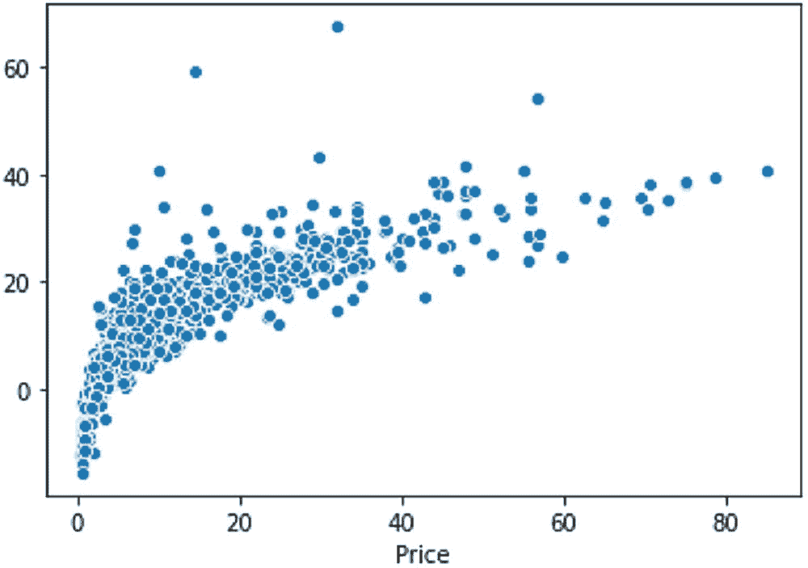

**图 3-2** 实际 Y 与预测 Y 之间的相关性

#### 最终模型

在移除高度多重共线性的变量以及统计上不显著的冗余变量后，模型在训练集上的准确率仍接近 70%，在测试集上为 69%。

```
y = clean_df['Price']
x = clean_df.drop(['Price','engineCC','FuelType_Diesel','mileage','Location_Kochi'],axis=1)
xtrain,xtest,ytrain,ytest = train_test_split(x,y,test_size=0.25,random_state=1234)
xtrain.shape,ytrain.shape,xtest.shape,ytest.shape
new_model = LinearRegression()
new_model.fit(xtrain,ytrain)
print(new_model.score(xtrain,ytrain))
print(new_model.score(xtest,ytest))
```

#### 模型可解释性

模型的解释可以通过查看模型的 β 系数来完成。线性回归模型最大的优点是简单性和线性性，这使得模型解释变得容易。线性回归也强制预测结果是特征的线性组合。置信区间是真预测值会落入的范围。95% 的置信区间意味着在 95% 的情况下，预测的真值会落在这个范围内。在当前示例中，你看到的是 95% 的置信区间。显著性水平意味着在双尾假设检验场景中，即 5% 的显著性水平下，其解释可以在表 3-5 中说明。从解释的角度来看，截距值在建模场景中没有意义。如果训练数据中的所有数值特征都为零，并且所有二元特征都处于其参考类别，那么模型生成的预测将等于截距项。这是一种非常特殊的情况，但在训练数据集中所有数值特征都存在，并且它们被标准化为均值为零、标准差为 1 的情况下，截距项反映了所有特征都处于其均值时的实例预测结果。

**表 3-5** 线性模型中模型参数的解释

| 回归系数的解释 | 目标列是汽车的价格，它是各种变量（包括数值型和分类型）的函数。 |
| --- | --- |
| `Age = -0.911` | 汽车车龄每增加一年，预计汽车价格会降低 0.911 个单位。假设价格单位是千元，那么在其他所有特征保持不变的情况下，每运行一年，汽车价格将降低 911 美元。 |
| `PowerBhp = 0.141` | 汽车的 PowerBhp 每增加一个单位，预计汽车价格会提高 0.141 个单位。假设其他所有特征相同，BHP 越高，汽车价格越高。 |
| `Location_Jaipur = 0.663` | 假设其他所有特征不变，如果汽车的基础位置在斋浦尔而非其他地方，其预计价格将增加 663 美元。 |
| `FuelType_Electric = 8.972` | 假设模型的其他特征不变，如果汽车是电动汽车而非其他燃料类型，其预计价格将增加 8972 美元。 |
| `OwnerType_Second = -0.54` | 假设其他特征不变，如果汽车是二手所有权而非其他所有权次数，其基础价格将降低 540 美元。 |
| `Transmission_manual = -2.671` | 假设其他所有因素不变，如果变速箱类型是手动挡而非其他类型，汽车价格将降低 2671 美元。 |

```
resultsDF = pd.DataFrame()
resultsDF['Variables'] = pd.Series(xtrain.columns)
resultsDF['coefficients'] = pd.Series(np.round(new_model.coef_,2))
resultsDF['p_value'] = pd.Series(np.round(ReturnPValue(new_model,xtrain,ytrain),2))
resultsDF.sort_values(by='p_value',ascending=False)
```


## 对机器学习模型的信任：SHAP

为了信任基于线性回归的机器学习模型，你需要理解模型得出的`R square`值。`R square`值表示回归模型的拟合优度，即所有特征共同解释目标变量方差的比例。`R square`值的范围是 0.0 到 1.0。如果`R square`值为零，则表明模型显示因变量与自变量之间没有相关性。如果为 1，则表明特征之间高度相关。要成为一个值得信赖其预测的优质模型，该值应达到 0.80 或更高。在上述汽车示例中，`R square`值为 0.70，非常接近一个可信任的标准模型。相比于`R square`，更常被引用的是调整后的`R square`值，因为它考虑了模型中使用的特征数量。`R square`与调整后的`R square`之间的关系通过以下公式展示。在下面的公式中，`N`表示训练样本总数，`p`表示特征总数：

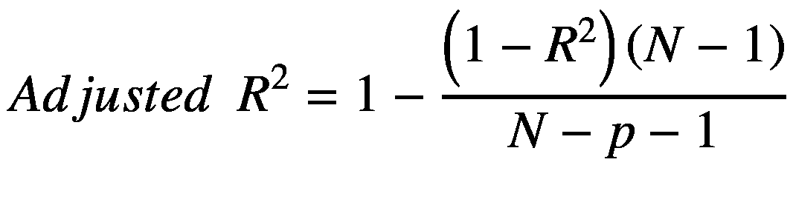

当你向模型中添加冗余变量时，`R square`值可能会增加，但调整后的`R square`值将保持不变。只有当该特征对模型的整体可解释性有所贡献时，调整后的`R square`值才会增加。

为了生成额外的可解释性并更深入地理解模型的工作原理，你可以借助其他基于 Python 的库。Shapley 值是一种广泛使用的合作博弈论方法，具有理想的特性。你可以从模型系数中了解，当改变输入参数时，结果变量是如何被预测或估计变化的。然而，它并不能告诉你哪些特征是重要的。每个系数的值取决于输入特征的尺度。例如，车龄的范围可以是 0-15 年。然而，在上述数据集中，`BHP`的范围可以从 34.20 到 560.00。因此，在线性回归模型中，模型系数的大小并不一定是衡量特征重要性的良好指标。

一些数据科学家使用 t 统计量的绝对值作为线性回归模型中特征重要性的度量。

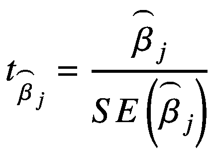

理解特征重要性的方法之一是查看特征相对于模型输出的偏依赖图。

```
!pip install shap
```

一旦`SHAP`成功安装，你就可以使用该库生成如图 3-3 所示的偏依赖图。


图 3-3

偏依赖图

```
import shap
shap.plots.partial_dependence("Age", new_model.predict,xtrain, ice=False, model_expected_value=True, feature_expected_value=True)
```

水平虚线表示模型应用于数据集时的期望输出值，垂直虚线表示平均年龄特征值，而蓝色的偏依赖图线（即当你将年龄特征固定为某个给定值时模型输出的平均值）在图上始终穿过两条灰色期望值线的交点。这个交点可以被视为相对于数据分布的偏依赖图的“中心”。水平轴上的垂直灰色框显示年龄分布略微向右偏斜。

Shapley 值建立的模型解释背后的主要思想是，利用合作博弈论中公正的结果分配方式，将模型输出（`x`）的贡献在其输入特征之间进行分配。为了将博弈论与机器学习模型联系起来，既需要将模型的输入特征与博弈中的玩家相匹配，也需要将模型函数与博弈规则相匹配。在博弈论中，玩家可以选择加入或不加入一个博弈，这类似于一个特征可以“加入”或“不加入”一个模型。

什么是`SHAP`值，它是如何计算的？这为理解`SHAP`值的解释和含义提供了一个清晰的概念。每个特征值的 Shapley 值通过以下公式计算：

![$$ {\phi}_i=\sum \limits_{S\subseteq F\backslash \left\{i\right\}}\frac{\mid S\mid !\left(|F|-|S|-1\right)!}{\mid F\mid !}\left[{f}_{S\cup \left\{i\right\}}\left({x}_{S\cup \left\{i\right\}}\right)-{f}_S\left({x}_S\right)\right] $$](images/506619_1_En_3_Chapter/506619_1_En_3_Chapter_TeX_Equc.png)

以下几点阐明了其工作原理：

- 为了计算每个特征的贡献，`SHAP`需要在所有特征子集`S`上重新训练模型。
- 在上述公式中，`i`是单个特征。
- `F`是所有特征的集合。
- `S`是来自集合`F`的特征子集。
- 对于任何特征`i`，会创建两个模型：包含特征`i`的模型 1 和不包含特征`i`的模型 2。然后计算预测值之间的差异。
- 一个特征对模型的影响取决于模型中其他特征的行为。
- 针对`S`的所有可能子集计算预测差异，并取其平均值。
- 所有可能差异的加权平均值用于填充特征重要性。

定义特征“加入”模型含义的最常见方式是：当我们知道某个特征的值时，就说该特征“加入了模型”；当我们不知道其特征值时，就说它没有加入模型。当模型中某个特征的权重/系数为 0.000 时，我们就认为该特征没有加入博弈。如果某个特征的系数不等于 0.000，我们就认为该特征是博弈的一部分。让我们来看看线性回归模型的`SHAP`值。

```
### 计算线性模型的 SHAP 值
background = shap.maskers.Independent(xtrain, max_samples=2000)
background
xtrain.shape
```

这个`shap.maskers.Independent`函数通过对给定的背景数据集进行积分来屏蔽表格特征。这里的背景数据集包含来自训练数据集的 4500 条记录，这是从传入的背景数据中使用的最大样本数。如果数据超过`max_samples`，则使用`shap.utils.sample`对数据集进行子采样。从掩码器中输出的样本数量（用于积分）与背景数据集中的样本数量相匹配。这意味着更大的背景数据集会导致更长的运行时间。通常，大约 1、10、100 或 1000 个背景样本是合理的选择。

```
explainer = shap.Explainer(new_model, background)
explainer
shap_values = explainer(xtrain)
shap_values
```


上述脚本展示了 SHAP 值、背景数据样本以及模型基值的输出结果。以下脚本展示了标准的偏依赖图，该图考虑了`age`特征和模型`predict`函数，针对数据集中第 23 号样本记录。特定特征`i`的 SHAP 值就是模型期望输出与该特征值`xi`处偏依赖图之间的差值，这体现了 Shapley 值的可加性。Shapley 值的基本属性之一是，它们总和始终等于所有玩家参与时的游戏结果与无玩家参与时的游戏结果之差。对于机器学习模型而言，这意味着所有输入特征的 SHAP 值总和始终等于基线（期望）模型输出与当前模型输出（针对被解释的预测）之间的差值。理解这一点的最简单方式是通过瀑布图，该图从你对房价`f(x)`的背景先验期望开始，然后逐个添加特征，直到达到当前模型输出`f(x)`。对应于`age`特征值为 10 年时，蓝线与灰色虚线之间的垂直差值就是该特征的 SHAP 值。

### 机器学习模型中的局部解释与个体预测

SHAP 偏依赖图（图 3-4）是解释个体预测、获取个体预测的额外洞察以及解释哪些特征对特定个体预测重要的好方法。

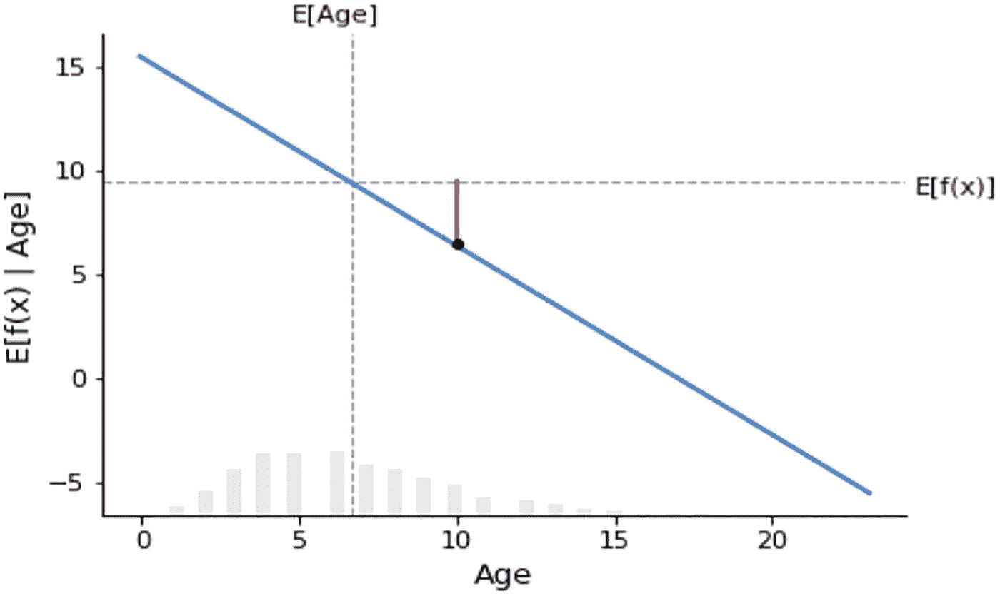

图 3-4

年龄与预测期望值的偏依赖图

```
# 制作一个标准的偏依赖图
sample_ind = 23
fig,ax = shap.partial_dependence_plot(
"Age", new_model.predict, xtrain, model_expected_value=True,
feature_expected_value=True, show=False, ice=False,
shap_values=shap_values[sample_ind:sample_ind+1,:],
shap_value_features=X.iloc[sample_ind:sample_ind+1,:]
)
```

图 3-5 通过散点图解释了`age`特征与`age`特征的 SHAP 值之间的相关性。

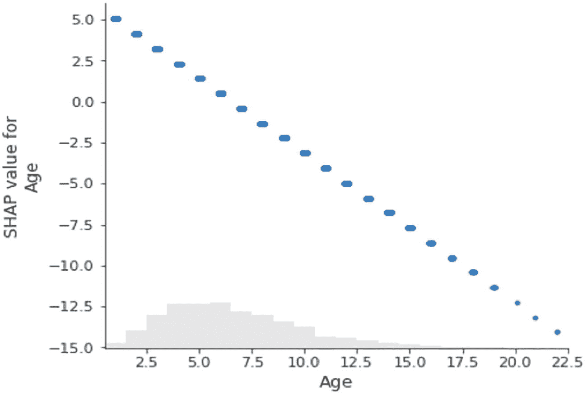

图 3-5

年龄的 SHAP 值与年龄的关联

```
shap.plots.scatter(shap_values[:,"Age"])
```

从数据集中获取某一样本行的 SHAP 值可以通过瀑布图（图 3-6）来解释。这是局部解释的一部分。瀑布图旨在显示个体预测的解释，因此它期望输入一个解释对象的单行数据。瀑布图的底部从模型输出的期望值开始，然后每一行显示每个特征的正向（红色）或负向（蓝色）贡献如何将值从背景数据集上的模型期望输出移动到该预测的模型输出。

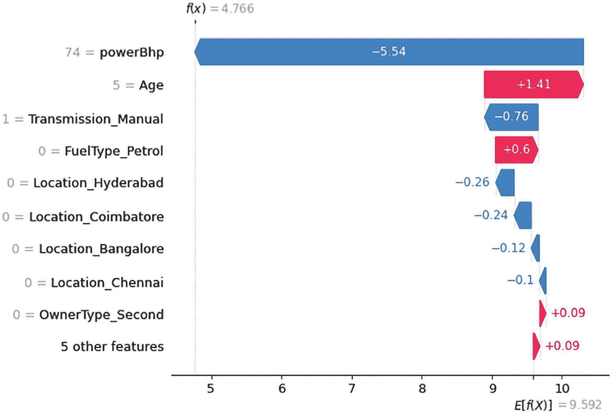

图 3-6

显示正向和负向 SHAP 值的瀑布图

让我们通过一个例子来理解 SHAP 值：训练数据集中的第 60 号记录，即整个数据集中的第 2966 行。将其作为一个新数据点，并使用训练好的模型进行预测。预测值为 4.7656。然而，同一记录的实际价格值为 4.85。来自 SHAP 库的瀑布图展示了如何从函数的 SHAP 基值达到预测值 4.766。

```
xtrain[60:61]
new_model.predict(xtrain[60:61])
ytrain[60:61]
# waterfall_plot 展示了如何从 shap_values.base_values 达到 model.predict(X)[sample_ind]
shap.plots.waterfall(shap_values[60])
```

从上述瀑布图可以清楚地看出，对于第 60 号记录，最具影响力的预测因子是功率 BHP、车龄、汽油燃料类型和手动变速箱。有五个最不重要的特征被合并在一起，它们对预测的联合贡献为+0.09。如果取消合并为单个特征的限制，可以通过更改`max_display`选项来展开。以下脚本展示了基于 SHAP 值修改后的瀑布图版本，用于预测的局部解释（图 3-7）：

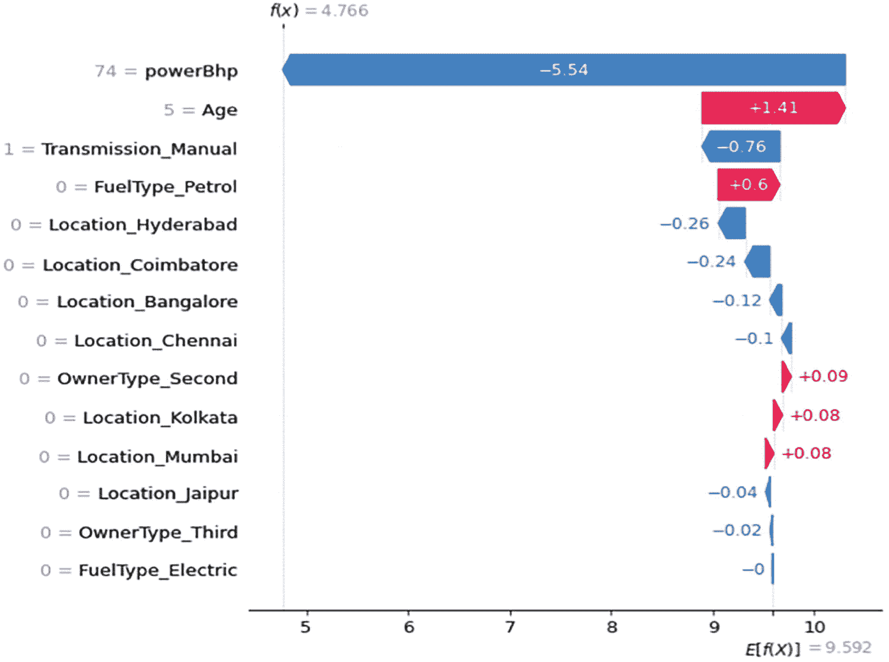

图 3-7

显示所有特征的展开形式

```
shap.plots.waterfall(shap_values[60],max_display=30)
```


### 机器学习模型中的全局解释与整体预测

`beeswarm`（蜂群）图是一种可视化工具，旨在以信息密集的方式总结数据集中最重要的特征如何影响模型输出。每个被解释的实例在特征行上用一个点表示。点的中心位置由该特征的 SHAP 值决定，点沿着特征行“堆积”以显示密度。颜色用于显示特征的原始值。在图 3-8 的图中，你可以看到年龄和马力（BHP）是平均而言最重要的特征。

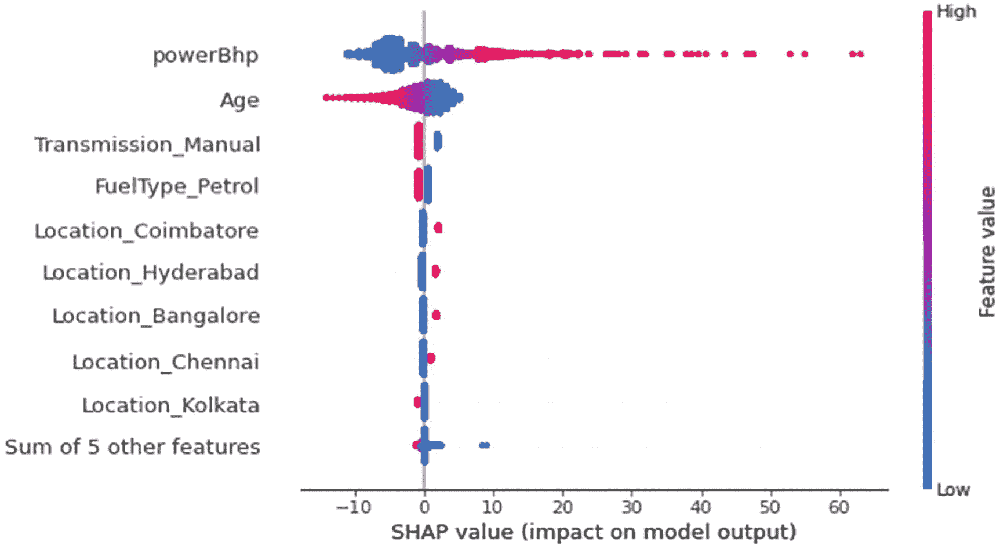

**图 3-8** 显示正负 SHAP 值的蜂群图

- 马力（BHP）越高，对模型输出的影响越大，因为你知道马力越大，汽车价格越高。
- 类似地，汽车年龄与预测价格呈负相关。因此，车龄越新，对模型输出的影响越大，如下方图表所示。
- 默认情况下，蜂群图显示 10 个特征。你可以通过更改 `max display` 选项来调整该参数。默认情况下，特征根据 SHAP 值的平均绝对值排序。
- 默认情况下，特征使用 `shap_values.abs.mean(0)` 排序，即每个特征 SHAP 值的平均绝对值。然而，这种排序更侧重于广泛的平均影响，而对罕见但影响巨大的情况关注较少。
- 如果你想找出对个体影响较大的特征，可以改为按最大绝对值排序。

```
# waterfall_plot 展示了如何从 shap_values.base_values 得到 model.predict(X)[sample_ind]
shap.plots.beeswarm(shap_values)
```

默认情况下，蜂群图使用红蓝配色。你也可以自定义并更改颜色（图 3-9）。

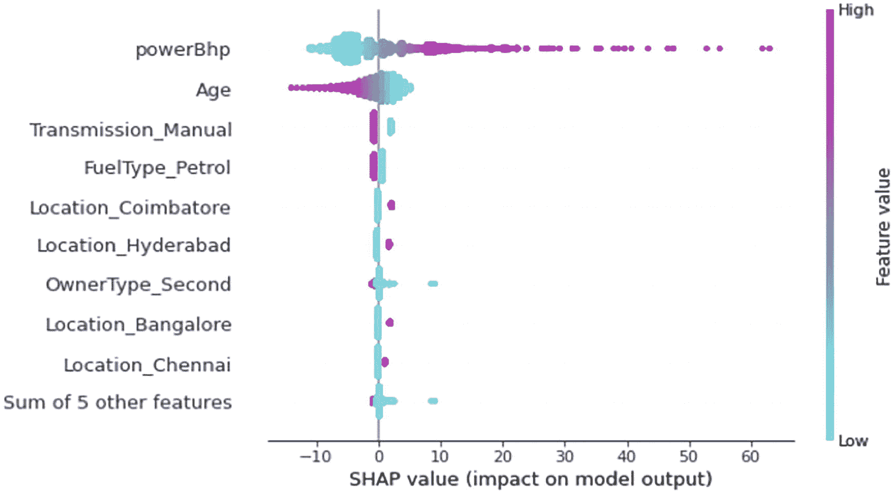

**图 3-9** 使用不同配色的蜂群图

```
import matplotlib.pyplot as plt
shap.plots.beeswarm(shap_values, color=plt.get_cmap("cool"))
```

还有一种选择是使用条形图显示 SHAP 值，该图考虑了 SHAP 值的平均绝对值。图 3-10 中的水平轴显示平均绝对 SHAP 值，垂直轴显示特征。五个最不重要的特征被合并在一起。此外，还可以查看所有特征相对于特征本身的最大绝对值。最大绝对 SHAP 值表示训练数据集中影响预测的关键观测值。将 SHAP 值矩阵传递给热力图绘制函数，会生成一个图，其中 x 轴为实例，y 轴为模型输入，SHAP 值通过颜色刻度编码。默认情况下，样本使用 `shap.order.hclust` 排序，该排序基于解释相似性进行层次聚类。另请参见图 3-11 和图 3-12。

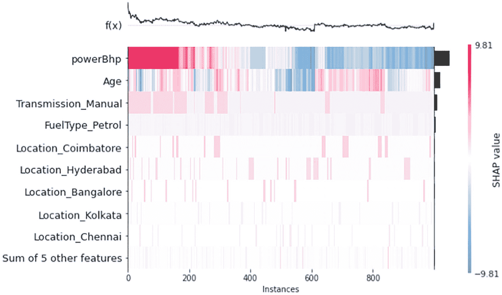

**图 3-12** 具有 SHAP 关联的特征实例

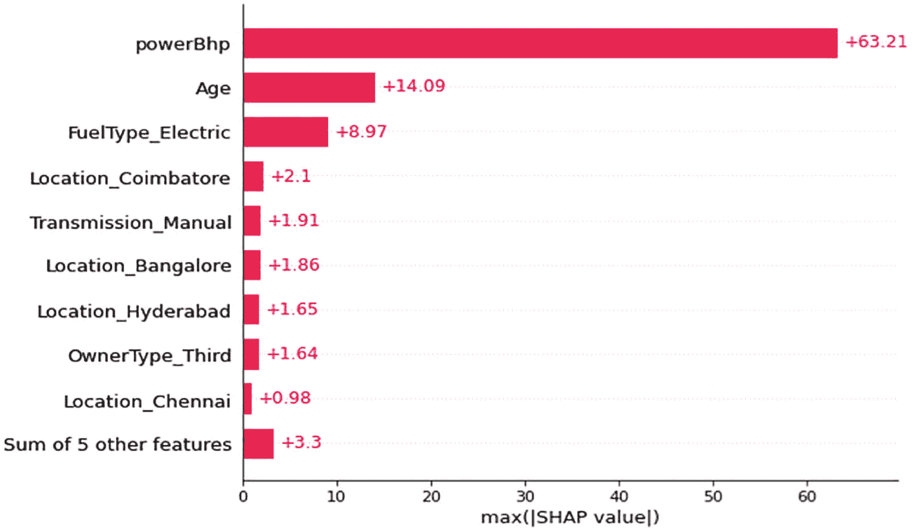

**图 3-11** 最大绝对 SHAP 值

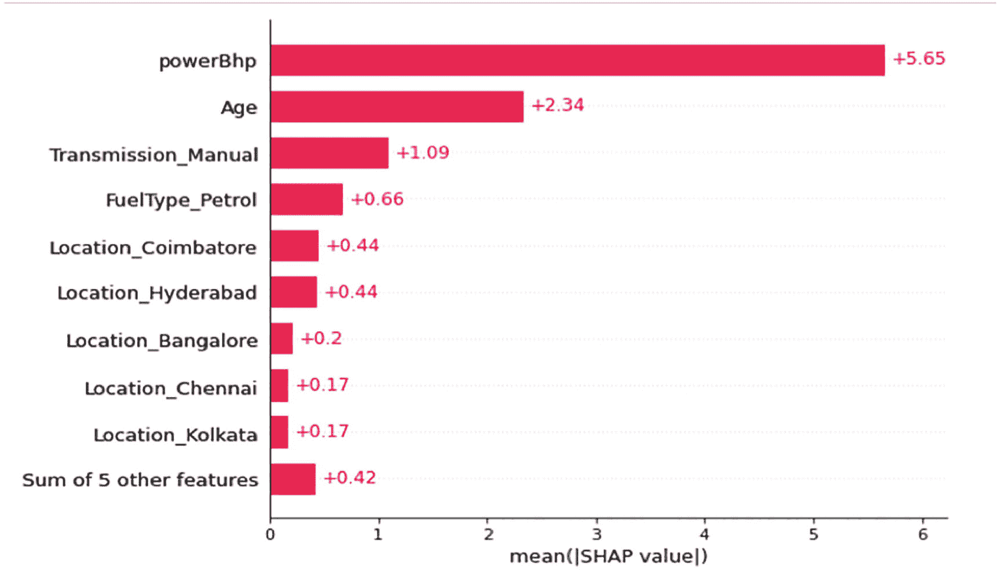

**图 3-10** SHAP 值的平均绝对值

```
shap.plots.bar(shap_values)
```

```
shap.plots.bar(shap_values.abs.max(0))
```

```
shap.plots.heatmap(shap_values[:1000])
```

这会导致具有相同模型输出且原因相同的样本被分组在一起（例如，受马力（BHP）和年龄影响较大的人群）。模型的输出显示在图 3-12 的热力图矩阵上方（以解释的 `.base_value` 为中心），每个模型输入的全局重要性则显示在图的右侧（默认情况下，这是整体重要性的 `shap.order.abs.mean` 度量）。


## LIME 解释与机器学习模型

LIME（局部可解释模型无关解释）是一种算法，能够通过使用可解释模型在局部进行近似，以可信的方式解释任何分类器或回归器的预测结果。它通过调整特征值来修改单个数据样本，并观察对输出产生的影响。它扮演着“解释器”的角色，用于解释每个数据样本的预测结果。LIME 的输出是一组解释，代表每个特征对单个样本预测的贡献，这是一种局部可解释性形式。LIME 中的可解释模型可以是，例如，线性回归或决策树，这些模型通过在原始模型的小扰动（例如，添加噪声、移除单词或隐藏图像部分）上进行训练，以提供良好的局部近似。可以使用 `pip` 命令安装 LIME。

你可以使用包含目标列的模型训练数据集，重新训练一个回归模型，而不是使用之前的模型对象 `new_model`，因为 LIME 是一种模型无关技术，它在生成解释器时会重新训练模型。LIME 将问题局部化，并在局部层面解释模型，而不是提供全局解释。

```
!pip install lime
import lime
import lime.lime_tabular
explainer = lime.lime_tabular.LimeTabularExplainer(np.array(xtrain),
mode='regression',
feature_names=xtrain.columns,
class_names=['price'],
verbose=True)
```

LIME 表格解释器需要 numpy 数组作为输入，因此训练数据格式会发生变化。在扰动后，模式选择为回归，目标列为价格。一旦解释器开发完成，就可以进一步生成详细的局部解释。特征频率选项提供了特征的分布情况以及它在扰动过程中被使用的次数。

```
explainer.feature_selection
explainer.feature_frequencies
```

如果你想使用之前训练好的模型对象，那么可以使用解释实例选项。这需要一个测试数据集、模型对象以及可以使用的特征数量。让我们使用测试数据集中的第 60 条记录。你将得到结果，包括截距项、局部预测值以及全局预测值（即 `right` 值）。对于测试数据集中的第 60 条记录，如果你使用预测函数，你会得到预测值 27.5854，该值等于解释实例中的 `right` 值。局部预测模式值为 28.54，更接近实际预测值 35.0。

```
# 请求 LIME 模型的解释
i = 60
exp = explainer.explain_instance(np.array(xtest)[i],
new_model.predict,
num_features=14
)
new_model.predict(xtest)[60]
ytest[60:61]
Intercept 18.186435664326485
Prediction_local [28.15539047]
Right: 27.58547373488966
exp.show_in_notebook(show_table=True)
exp.as_list()
```

你可以以表格格式显示解释器，其中包含预测值、正负特征值以及表格中的总体特征及其值。预测值为 46.62。在第二个图表中，针对同一个实例（编号 60）显示了正特征值和负特征值。第二个图表中的水平条表示该记录的特征重要性。第三个表格显示了每个特征对应的 LIME 值。该方法和局部解释非常直观。这可以向任何业务用户解释。第 60 条记录的样本局部性会均匀且随机地选择单个数据点，创建扰动数据点以及模型对应的预测值。默认情况下，特征选择方法是自动的。LIME 专注于使用样本权重在打乱的数据集（扰动后）上拟合可解释模型，并使用新训练的模型提供局部解释。参见图 3-13。


图 3-13

不同特征的正负值对预测值的贡献

第 60 条记录的解释器也可以像上面那样以列表形式显示。还有另一个类函数，称为子模选择，用于生成全局决策边界。

```
# SP-LIME 的代码
import warnings
from lime import submodular_pick
# 记住将数据框转换为矩阵值
# SP-LIME 返回样本集上的解释，以提供原始模型的非冗余全局决策边界
sp_obj = submodular_pick.SubmodularPick(explainer, np.array(xtrain),
new_model.predict,
num_features=14,
num_exps_desired=10)
[exp.show_in_notebook() for exp in sp_obj.sp_explanations ]
```

这里用于生成全局决策边界的特征数量是 14，期望的实验次数是 10。这部分脚本需要一些时间才能完成，因为你正在生成多次迭代。参见图 3-14。


图 3-14

子模选择解释

LIME 试图在保真度和可解释性之间进行权衡。保真度意味着模型应该能够在用于预测的实例的局部区域内复制模型行为。可解释性你已经知道，是指清晰度，以便人类能够理解模型输出。以下公式展示了两者之间的关系：


让我们理解上述公式中使用的每个符号：

*   `F` 是原始预测器。
*   `g` 是模型解释。
*   原始特征是 `x`。
*   `x` 的 `pi` 是一个邻近度度量，定义了 `xx` 周围的局部区域。
*   `x` 的 `omega` 是用于解释的模型复杂度的度量。

LIME 的局限性之一是对邻域和邻近度的定义不准确。在对局部区域内的记录进行采样时，它使用高斯分布，这没有考虑各个特征之间的关系。如果因变量和自变量之间的关系是非线性的，那么解释将不准确。另一个局限性是子模选择，它是从数据集中选出的最能解释模型的一组 n 个样本。子模选择会产生大量输出，有时难以解释。尽管该模块存在局限性，但 LIME 主要用于为单个预测生成与模型无关的局部解释。由于其输出的简单性和易于解释的特点，它非常受欢迎。


## Skater 解释与机器学习模型

Skater 是一个开源统一框架，用于实现所有形式模型的解释，帮助我们构建在实际应用场景中通常需要的可解释机器学习系统。Skater 支持多种算法，可以从全局（基于完整数据集进行推理）和局部（对单个预测进行推理）两个层面，揭示黑盒模型已学习到的结构。该软件包最初由 Aaron Kramer、Pramit Choudhary 以及 [DataScience.com](http://datascience.com) 团队的其他成员开发，旨在帮助数据科学家和数据爱好者更好地理解模型。Skater 通过提供按需推断和调试模型决策策略的能力，将“人类引入循环”，从而实现这一愿景。

可以使用 `pip` 或 `conda` 安装脚本来安装 Skater 库。在 Jupyter 环境中安装也很容易。模型对象可以通过两个类来实现：内存模型和已部署模型。可调用函数形式的模型可以通过内存模型来使用；通过 Rest API 部署和调用的模型则通过已部署模型对象来暴露。

```
!pip install skater
import skater
from skater import Interpretation
# Interpretation 接收一个数据集，以及一些可选的元数据，如特征名称和行 ID
interpreter = Interpretation(xtrain, feature_names=xtrain.columns)
interpreter
from skater.model import InMemoryModel
model = InMemoryModel(new_model.predict, examples = xtrain[:10])
model
```

解释模块接收一个数据集。通过解释器，你可以提取回归对象的特征重要性。内存模型需要一个预测函数和一组需要解释其预测结果的数据样本。

```
interpreter.feature_importance.feature_importance(model)
# 计算与模型实例相关的所有特征的特征重要性。
# 支持回归。
```

从上面的特征重要性表格来看，两个重要的特征是功率（BHP）和车龄；它们累计贡献了 75% 的重要性。其他 12 个特征贡献了 25% 的重要性。模型报告函数显示了详细的元数据，例如训练的模型类型、输出变量类型、输出形状、输入形状以及模型的概率状态。

```
model.model_report(examples=xtrain)
```

要生成偏依赖图或双向偏依赖图，解释器需要你再次加载训练数据集，并且还需要提供特征名称。

```
# Skater 的设计直观地支持
# - InMemoryModel : 当前正在构建且估计器实例仍在作用域内的模型
# - DeployedModel: 已投入运营的模型，或第三方部署的模型
interpreter.load_data(xtrain, feature_names=xtrain.columns)
print("2-way partial dependence plots")
# 特征可以作为元组传入以生成双向偏依赖图
pdp_features = [('Age', 'powerBhp')]
interpreter.partial_dependence.plot_partial_dependence(
pdp_features, model, grid_resolution=10
)
```

使用两个重要特征与因变量，生成了上面图 3-15 所示的双向偏依赖图。图中的颜色仅表示关联性，不应解释为因果关系。从图 3-15 的第二个梯度图来看，对预测值贡献较高的部分用绿色表示，而车龄和功率（BHP）这两个特征共同对预测值贡献较低的部分用深蓝色表示。浅绿色表示较高的预测值，蓝色表示较低的预测值。类似地，可以生成单向偏依赖图。带有置信区间的 PDP 图可以绘制在同一个单向 PDP 图上。

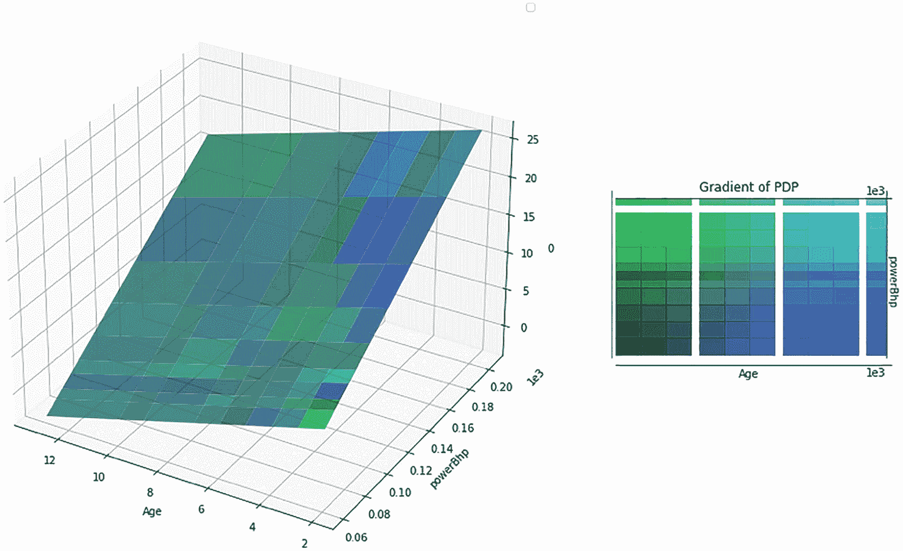

图 3-15

双向偏依赖图

```
print("1-way partial dependence plots")
# 或者作为独立特征用于单向偏依赖图
pdp_features = ['powerBhp', 'Age']
interpreter.partial_dependence.plot_partial_dependence(
pdp_features, model, grid_resolution=30
)
# 包含方差效应的偏依赖图
interpreter.partial_dependence.plot_partial_dependence(
pdp_features, model, grid_resolution=30, with_variance=True
)
```

这两个图各自产生的两个图表此处未打印，因为目前它们不会增加太多价值。你可以根据需要从数据集中绘制任意数量的 PDP 图表。相关的图表能提供关于特征的重要见解。


## ELI5 解释与机器学习模型

ELI5 是一个 Python 包，用于帮助调试机器学习分类器并解释其预测结果。它支持以下机器学习框架和包：`scikit-learn`。目前，ELI5 能够解释 `scikit-learn` 线性分类器和回归器的权重与预测，以文本或 SVG 格式打印决策树，展示特征重要性，并解释决策树及基于树的集成模型的预测。ELI5 能够理解 `scikit-learn` 的文本处理工具，并据此高亮显示文本数据。它还能通过撤销哈希处理，来调试包含 `HashingVectorizer` 的 `scikit-learn` 管道。

特征的权重也包含一个偏置特征。这实际上就是线性回归模型中的截距项。特征按其权重的降序排列。ELI5 的意思是*像对五岁小孩一样解释*。它支持所有 `scikit-learn` 算法。它还通过 `show_weights()` 函数提供全局解释，并通过 `show_prediction()` 函数提供局部解释。在 ELI5 库中，有一个排列模型。它仅适用于全局解释。其工作原理如下：

-   首先，它从训练数据集中获取基线模型并计算误差。
-   然后，它打乱特征的值，重新训练模型，并计算误差。
-   最后，它比较打乱后与打乱前的误差减少量。

如果打乱后误差增量变得非常高，则该特征被认为是重要的；如果打乱后错误率保持不变，则该特征被认为是不重要的。结果会显示多次打乱步骤后特征的平均重要性和标准差。这种方法并非用于查看哪个特征影响模型性能。它只告诉我们特征权重的变化幅度，因此我们不能真正将权重视为特征重要性的度量标准。上述过程通过以下脚本演示：

```
!pip install eli5
import eli5
eli5.show_weights(new_model,
feature_names=list(xtrain.columns))
eli5.explain_weights(new_model, feature_names=list(xtrain.columns))
eli5.explain_prediction(new_model,xtrain.iloc[60])
from eli5.sklearn import PermutationImportance
perm = PermutationImportance(new_model)
perm.fit(xtest, ytest)
eli5.show_weights(perm,feature_names=list(xtrain.columns))
```

解释单个预测提供了对某条记录的局部解释。同时，它还会告诉你对预测贡献权重最高的前三个特征。从排列重要性图中可以清楚地看到，功率（BHP）和车龄是最重要的特征。这与您之前使用其他 XAI Python 库（基于 `automobile.csv` 数据集）进行的类似练习结果一致。

现在，作为下一步，让我们来看一个线性分类模型，也称为逻辑回归模型，以从逻辑回归模型的角度理解 XAI 的各个方面。部分依赖图描绘了目标特征（或因变量）与一个特征（即自变量）之间的关系。这种关系可以是线性的、非线性的、曲线的，或者更复杂的，如圆形或周期性的单调关系。

## 逻辑回归

当目标特征是连续变量时，线性回归模型适用；但当目标特征是二元的，例如 0 或 1、真或假、接受或拒绝时，线性回归模型则不适用。这是因为目标特征的预测值可能会超出 0 和 1 的范围，但我们的期望是将输出限制在两个类别中，因为需要分别预测这两个类别。这就是为什么需要逻辑回归模型，它使用二元值来计算对数几率，即优势比。优势比与特征呈线性关系。这就是逻辑回归模型被称为线性模型的原因。

当需要对本质为二元或多分类的结果进行概率建模时，通常会使用逻辑回归。你不能在那里应用线性回归模型，因为在逻辑回归场景中，结果变量是 0 或 1（有时也可能是多分类的，即可能有两个以上的结果）。如果你在那里应用线性回归，预测范围可能会超出 0 和 1 的范围。它不会为任何类别提供概率。在多分类模型中，类别分离将是一个巨大的挑战。基于普通最小二乘法的线性回归模型假设因变量和自变量之间的关系是线性的；然而，逻辑回归模型假设这种关系是对数形式的。

在许多现实场景中，我们关注的变量本质上是分类的，例如是否购买产品、是否批准信用卡、或者肿瘤是否为癌性。逻辑回归不仅能预测因变量的类别，还能预测某个案例属于因变量中某一水平的概率。自变量不需要服从正态分布，也不需要具有相等的方差。逻辑回归属于非线性回归家族。如果因变量有两个水平，可以应用逻辑回归；但如果因变量有两个以上的水平，例如高、中、低，则可以应用多项逻辑回归模型。自变量可以是连续的、分类的或名义的。

逻辑回归模型可以用以下方程解释：

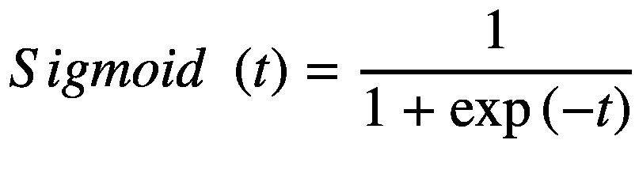

上述函数也称为 Sigmoid 函数。

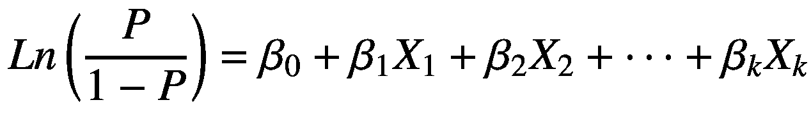

`Ln (P/1-P)` 是结果的对数几率。上述方程中提到的 Beta 系数解释了对于解释变量每增加或减少一个单位，结果变量的几率如何增加或减少。图 3-16 展示了 Sigmoid 函数的形状。它看起来像一条 S 形曲线。逻辑回归模型的解释与线性回归模型截然不同。方程右侧的加权和被转换/变换成一个概率值。方程左侧被称为对数几率，因为它是事件发生概率与事件不发生概率的比值。关于对数几率的更多解释，可以通过我们接下来要讨论的一个例子来理解。

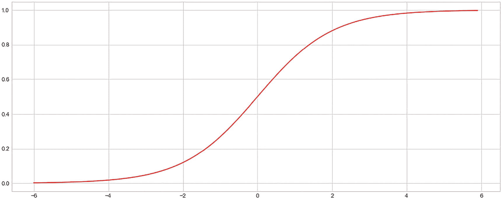

**图 3-16** 逻辑/Sigmoid 函数，x 轴表示特征，y 轴表示概率


为了解释逻辑回归模型及其决策过程，你需要同时理解概率和优势比。你将使用`churndata.csv`，该数据集属于电信领域，包含近 3333 条记录和 18 个特征。你将根据特征值预测客户是否可能流失。

```
import pandas as pd
import numpy as np
import matplotlib.pyplot as plt
%matplotlib inline
from sklearn.linear_model import LogisticRegression, LogisticRegressionCV
from sklearn.metrics import confusion_matrix, classification_report
df_train = pd.read_csv('ChurnData.csv')
```

第一步，获取数据，转换某些字符串格式的特征，并应用标签编码器进行转换。转换后，按 80%用于训练、20%用于测试的比例进行分割。在创建训练/测试分割时，你保持流失案例和非流失案例的比例，以维持类别间的平衡。然后训练模型，将训练好的模型应用于测试数据，并比较训练集和测试集的准确率。

```
del df_train['Unnamed: 0']
df_train.shape
df_train.head()
from sklearn.preprocessing import LabelEncoder
tras = LabelEncoder()
df_train['area_code_tr'] = tras.fit_transform(df_train['area_code'])
df_train.columns
del df_train['area_code']
df_train.columns
df_train['target_churn_dum'] = pd.get_dummies(df_train.churn,prefix='churn',drop_first=True)
df_train.columns
del df_train['international_plan']
del df_train['voice_mail_plan']
del df_train['churn']
df_train.info()
df_train.columns
from sklearn.model_selection import train_test_split
df_train.columns
X = df_train[['account_length', 'number_vmail_messages', 'total_day_minutes',
'total_day_calls', 'total_day_charge', 'total_eve_minutes',
'total_eve_calls', 'total_eve_charge', 'total_night_minutes',
'total_night_calls', 'total_night_charge', 'total_intl_minutes',
'total_intl_calls', 'total_intl_charge',
'number_customer_service_calls', 'area_code_tr']]
Y = df_train['target_churn_dum']
```

只有区号变量被转换。其余特征要么是整数，要么是浮点数，这足以继续训练模型。

现在，你可以查看概率、对数优势比和优势比的分布，以及模型参数，以理解决策是如何围绕预测做出的。如果你参考`SHAP`值来解释逻辑回归模型的概率，可以看到强烈的交互效应。这是由于逻辑回归模型在概率空间中的非加性行为。如果你使用模型的对数优势比作为输出，可以看到模型输入和输出之间存在强相关性或完美的线性关系。

```
xtrain,xtest,ytrain,ytest=train_test_split(X,Y,test_size=0.20,stratify=Y)
log_model = LogisticRegression()
log_model.fit(xtrain,ytrain)
print("training accuracy:", log_model.score(xtrain,ytrain)) #training accuracy
print("test accuracy:",log_model.score(xtest,ytest)) # test accuracy
```

通过观察准确率，你可以得出结论，这是一个好模型，并且可能不存在过拟合问题，因为训练和测试准确率之间没有偏差。

```
np.round(log_model.coef_,2)
log_model.intercept_
X.columns
```

你创建了两个实用函数来生成所需输出，这些函数可以进一步用于`SHAP`值的图形表示。

```
# Provide Probability as Output
def model_churn_proba(x):
return log_model.predict_proba(x)[:,1]
# Provide Log Odds as Output
def model_churn_log_odds(x):
p = log_model.predict_log_proba(x)
return p[:,1] - p[:,0]
```

由于你已经在本章的回归部分介绍了依赖图的解释，类似的解释也可以应用于逻辑回归模型。部分依赖图以数据集中的一条记录为例，因为它是一种局部解释。

```
# make a standard partial dependence plot
sample_ind = 25
fig,ax = shap.partial_dependence_plot(
"total_day_minutes", model_churn_proba, X, model_expected_value=True,
feature_expected_value=True, show=False, ice=False
)
```

对于第 25 条记录，图 3-17 中特征`total_day_minutes`的部分依赖图显示了概率值或函数的期望值与特征之间的关系是正的，但似乎不是线性的。


图 3-17

`total_day_minutes`与流失概率的部分依赖图

```
# compute the SHAP values for the linear model
background_churn = shap.maskers.Independent(X, max_samples=1000)
explainer = shap.Explainer(log_model, background_churn,feature_names=list(X.columns))
shap_values_churn = explainer(X)
shap_values = pd.DataFrame(shap_values_churn.values)
shap_values.columns = list(X.columns)
shap_values
```

`SHAP.Explainer`模块具有表 3-6 中列出的重要参数。

表 3-6

来自`SHAP`库的`Explainer`参数

| 参数 | 描述 |
| --- | --- |
| `Model` | 模型对象名称 |
| `Masker` | 用于屏蔽隐藏特征的函数 |
| `Link` | 用于在模型输出单元和`SHAP`值单元之间进行映射的函数 |
| `Algorithm` | 用于估计`Shapley`值，命名为`auto`、`permutation`、`partition`、`tree`、`kernel`、`sampling`、`linear`、`deep`和`gradient`。默认值为`auto`。 |

当你查看`account_length`与`account_length`的`SHAP`值的散点图（图 3-18）时，存在一个强烈的、完美的线性关系。


图 3-18

`account_length`特征与`SHAP`值之间的关系

```
shap.plots.scatter(shap_values_churn[:,'account_length'])
```

`SHAP`值以及各个特征的平均绝对值在以下图表中表示。这显示了在分类问题中哪个特征具有更高的权重。客户服务电话次数是流失的一个良好驱动因素，因为投诉越多的人越有可能致电客服，因此他们是观望者；他们随时可能流失。第二重要的因素是`total_day_minutes`，第三是`number_vmail_messages`。在末尾，你可以看到七个最不重要的特征被合并在一起。`SHAP`值还有另一种表示方式。每个特征的最大绝对`SHAP`值被表示出来，但两个图表之间没有重大差异。还有一种称为蜂群图的视图，它显示了`SHAP`值及其对模型输出的影响。数千条记录的`SHAP`值热图视图显示了`SHAP`值相对于模型特征的密度。最佳特征的`SHAP`值较高，并且特征重要性逐渐降低，`SHAP`值也随之减小。参见图 3-19 至 3-22。


图 3-22

训练过程中使用的实例中每个特征贡献的`SHAP`值分布


图 3-21


