```markdown
# 3. 线性模型的可解释性

本章探讨如何使用 `SHAP`、`LIME`、`SKATER` 和 `ELI5` 库来解释线性模型在结构化数据监督学习任务中所做出的决策。在本章中，你将学习解释线性模型及其决策的各种方法。在监督式机器学习任务中，存在一个目标变量（也称为因变量）和一组自变量。其目标是将因变量预测为输入变量或自变量的加权和。

## 线性模型

线性模型，例如用于预测实数值输出的线性回归模型或用于预测类别及其对应概率的逻辑回归模型，都属于监督学习算法。这些用于监督式机器学习任务的线性模型非常易于解释。它们也易于向业务相关方进行说明。为了本模块的完整性，让我们开始探讨线性模型的可解释性。

## 线性回归

线性回归用于在给定一组预测变量的情况下预测目标变量的定量结果。其建模公式通常如下所示：

`y = β[0] + β[1]x[1] + … + β[p]x[p] + ϵ`

其中，β 系数被称为参数，ε 项被称为误差项。误差项可以看作是一个综合指标，反映了模型预测能力的不足。在现实世界中，我们无法实现 100% 的准确预测，因为数据的变化是客观存在的。数据在不断变化。开发模型的目标是以尽可能高的准确性和稳定性进行预测。当自变量取值为零时，目标变量的值等于截距项。你将使用一个在线数据集 `automobile.csv` 来创建一个线性回归模型，根据汽车的属性预测其价格。

```python
import pandas as pd
import numpy as np
import matplotlib.pyplot as plt
%matplotlib inline
from sklearn.model_selection import cross_val_score, train_test_split
from sklearn.linear_model import LinearRegression
from sklearn import datasets, linear_model
from scipy import linalg
df = pd.read_csv('automobile.csv')
df.info()
df.head()
```

该数据集中有 6,019 条记录和 11 个特征，这些是基础特征。数据字典如表 3-1 所示。

**表 3-1** 特征数据字典

| 序号 | 特征名称 | 描述 |
| --- | --- | --- |
| 0 | Price | 价格（印度卢比） |
| 1 | Make | 制造商 |
| 2 | Location | 汽车所在城市 |
| 3 | Age | 车龄 |
| 4 | Odometer | 已行驶里程（公里） |
| 5 | FuelType | 燃油类型 |
| 6 | Transmission | 变速箱类型 |
| 7 | OwnerType | 车主数量 |
| 8 | Mileage | 每升燃油行驶里程 |
| 9 | EngineCC | 发动机排量（CC） |
| 10 | PowerBhp | 马力（BHP） |

在数据清理和特征转换（这是进入模型开发步骤之前的基本步骤）之后，数据集将包含 11 个特征，且数据集中的记录数量保持不变。下图显示了各个特征之间的相关性。这对于理解各个特征与因变量之间的关联非常重要。结果通过配对散点图显示在图 3-1 中。

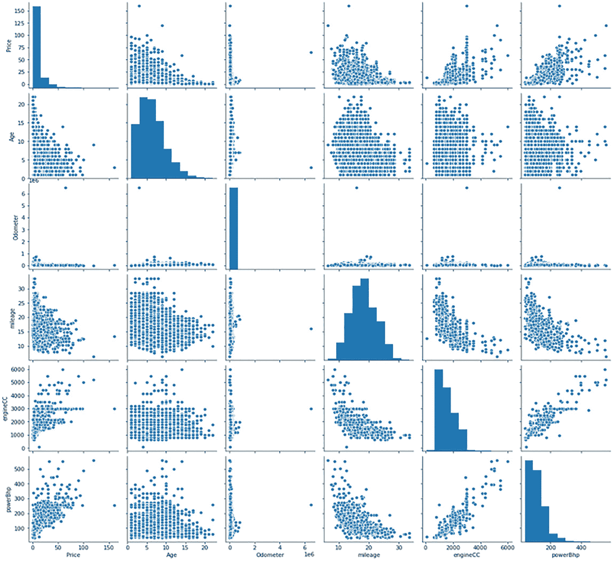

**图 3-1** 因变量与自变量之间的相关性

```python
import seaborn as sns
sns.pairplot(df[['Price','Age','Odometer','mileage','engineCC','powerBhp']])
```

为了获得各个特征之间的精确相关性，你需要计算相关性表格，以下脚本展示了如何操作。参见表 3-2。

**表 3-2** 变量间的相关系数

|  | Price | Age | Odometer | Mileage | EngineCC | PowerBhp |
| --- | --- | --- | --- | --- | --- | --- |
| Price | 1.000000 | -0.305327 | -0.011493 | -0.334989 | 0.659230 | 0.771140 |
| Age | -0.305327 | 1.000000 | 0.173048 | -0.295045 | 0.050181 | -0.028722 |
| Odometer | -0.011493 | 0.173048 | 1.000000 | -0.065223 | 0.090721 | 0.031543 |
| Mileage | -0.334989 | -0.295045 | -0.065223 | 1.000000 | -0.641136 | -0.545009 |
| EngineCC | 0.659230 | 0.050181 | 0.090721 | -0.641136 | 1.000000 | 0.863728 |
| PowerBhp | 0.771140 | -0.028722 | 0.031543 | -0.545009 | 0.863728 | 1.000000 |

```python
corrl = (df[['Price','Age','Odometer','mileage','engineCC','powerBhp']]).corr()
corrl
```

为了在同一张表格中比较正相关和负相关，你可以使用渐变图。参见表 3-3。

**表 3-3** 正相关与负相关映射

|   | 价格 | 车龄 | 里程表读数 | 行驶里程 | 发动机排量 | 功率 |
|---|---|---|---|---|---|---|
| **价格** | 1.000000 | -0.305327 | -0.011493 | -0.334989 | 0.659230 | 0.771140 |
| **车龄** | -0.305327 | 1.000000 | 0.173048 | -0.295045 | 0.050181 | -0.028722 |
| **里程表读数** | -0.011493 | 0.173048 | 1.000000 | -0.065223 | 0.090721 | 0.031543 |
| **行驶里程** | -0.334989 | -0.295045 | -0.065223 | 1.000000 | -0.641136 | -0.545009 |
| **发动机排量** | 0.659230 | 0.050181 | 0.090721 | -0.641136 | 1.000000 | 0.863728 |
| **功率** | 0.771140 | -0.028722 | 0.031543 | -0.545009 | 0.863728 | 1.000000 |

```
corrl.style.background_gradient(cmap='coolwarm')
```

有时相关性表格也会显示虚假的相关性。为了验证这一点，你需要使用各数值特征与目标变量之间每个相关系数的统计显著性：

```
np.where((df[['Price','Age','Odometer','mileage','engineCC','powerBhp']]).corr()>0.6,'Yes','No')
array([['Yes', 'No', 'No', 'No', 'Yes', 'Yes'],
['No', 'Yes', 'No', 'No', 'No', 'No'],
['No', 'No', 'Yes', 'No', 'No', 'No'],
['No', 'No', 'No', 'Yes', 'No', 'No'],
['Yes', 'No', 'No', 'No', 'Yes', 'Yes'],
['Yes', 'No', 'No', 'No', 'Yes', 'Yes']], dtype='<U3')
```

从表格中可以看出，`PowerBhp` 与 `Price` 呈高度正相关，`EngineCC` 也与 `Price` 高度相关。有四个分类变量需要引入虚拟变量才能进行矩阵乘法。你不能在计算过程中直接使用字符串。在机器学习中，这被称为*独热编码*，需要应用于分类列，以生成对应每个类别的标志，从而将信息引入模型。在统计建模框架中，相同的技术被称为*创建虚拟变量*。需要创建虚拟变量的变量是 `Location`、`FuelType`、`Transmission` 和 `OwnerType`。以下程序执行了该虚拟变量计算：

```
Location_dummy = pd.get_dummies(df.Location,prefix='Location',drop_first=True)
FuelType_dummy = pd.get_dummies(df.FuelType,prefix='FuelType',drop_first=True)
Transmission_dummy = pd.get_dummies(df.Transmission,prefix='Transmission',drop_first=True)
OwnerType_dummy = pd.get_dummies(df.OwnerType,prefix='OwnerType',drop_first=True)
combine_all_dummy = pd.concat([df,Location_dummy,FuelType_dummy,Transmission_dummy,OwnerType_dummy],axis=1)
combine_all_dummy.head()
combine_all_dummy.columns
Index(['Price', 'Make', 'Location', 'Age', 'Odometer', 'FuelType',
'Transmission', 'OwnerType', 'Mileage', 'EngineCC', 'PowerBhp',
'mileage', 'engineCC', 'powerBhp', 'Location_Bangalore',
'Location_Chennai', 'Location_Coimbatore', 'Location_Delhi',
'Location_Hyderabad', 'Location_Jaipur', 'Location_Kochi',
'Location_Kolkata', 'Location_Mumbai', 'Location_Pune',
'FuelType_Diesel', 'FuelType_Electric', 'FuelType_LPG',
'FuelType_Petrol', 'Transmission_Manual',
'OwnerType_Fourth +ACY- Above', 'OwnerType_Second', 'OwnerType_Third'],
dtype='object')
clean_df = combine_all_dummy.drop(columns=['Make','Location','FuelType','Transmission','OwnerType',
'Mileage', 'EngineCC', 'PowerBhp'])
clean_df.columns
Index(['Price', 'Age', 'Odometer', 'mileage', 'engineCC', 'powerBhp',
'Location_Bangalore', 'Location_Chennai', 'Location_Coimbatore',
'Location_Delhi', 'Location_Hyderabad', 'Location_Jaipur',
'Location_Kochi', 'Location_Kolkata', 'Location_Mumbai',
'Location_Pune', 'FuelType_Diesel', 'FuelType_Electric', 'FuelType_LPG',
'FuelType_Petrol', 'Transmission_Manual',
'OwnerType_Fourth +ACY- Above', 'OwnerType_Second', 'OwnerType_Third'],
dtype='object')
```

在创建线性回归模型之前，你需要检查模型的假设条件，这些条件在脚本笔记本中已给出。在完成必要的特征转换（例如列归一化和异常值处理）之后，你会得到以下数据集：你将数据集拆分为 75% 用于训练，25% 用于测试或验证模型。你使用了 `sklearn` Python API，这是一个机器学习 API。

```
#split the dataset into training and testing
data_train, data_test = train_test_split(clean_df,test_size=0.25,random_state=1234)
data_train.shape, data_test.shape
XTrain = np.array(data_train.iloc[:,0:(clean_df.shape[1]-1)])
YTrain = np.array(data_train['Price'])
XTest = np.array(data_test.iloc[:,0:(clean_df.shape[1]-1)])
YTest = np.array(data_test['Price'])
XTrain.shape, XTest.shape
```

模型训练结束后，你提取了训练准确率和测试准确率。两者都是 100% 的准确率。当你查看系数时，发现所有系数都是 0，截距项是 1。这说明出了问题。这时，可解释性 AI 就发挥了作用，它能阐明发生了什么。

```
#multiple linear regression model
reg = linear_model.LinearRegression()
reg
reg.fit(XTrain,YTrain) #training the model
print('Coefficients: \n', np.round(reg.coef_,4))
print('Intercept: \n', np.round(reg.intercept_,0))
reg.score(XTrain,YTrain) # R-square value from the trained model
reg.score(XTest,YTest) # R-square value from the test set
```

为了验证结果，你还可以使用统计模型中的统计 API 来了解输出是否存在差异。表 3-4 显示了统计模型 API 的结果。

**表 3-4** OLS 回归结果

| 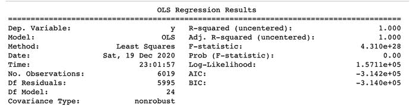 |

```
from scipy import stats
# Using Statistical API
import statsmodels.api as sm
y = np.array(clean_df['Price'])
xx = np.array(clean_df[['Price', 'Age', 'Odometer', 'mileage', 'engineCC', 'powerBhp',
'Location_Bangalore', 'Location_Chennai', 'Location_Coimbatore',
'Location_Delhi', 'Location_Hyderabad', 'Location_Jaipur',
'Location_Kochi', 'Location_Kolkata', 'Location_Mumbai',
'Location_Pune', 'FuelType_Diesel', 'FuelType_Electric', 'FuelType_LPG',
'

```markdown
## 重要规则

- 不要修改正文内容的语义
- 不要删减有价值的信息
- 不要重复输出原文，也不要添加额外信息，只输出排版后的文本

## 要排版的文本

| 6 | Location Hyderabad | `1.838072` |

| 11 | Location Pune | `1.760061` |

```python
infl = results.get_influence()
print(infl.summary_frame().filter(regex="dfb"))
from statsmodels.stats.outliers_influence import variance_inflation_factor
def calc_vif(X):
# Calculating VIF
vif = pd.DataFrame()
vif["variables"] = X.columns
vif["VIF"] = [variance_inflation_factor(X.values, i) for i in range(X.shape[1])]
return(vif)
X = clean_df.drop('Price',axis=1)
vif_df = calc_vif(X)
vif_df.sort_values(by='VIF', ascending=False).head()
X = clean_df.drop(['Price','engineCC'],axis=1)
vif_df = calc_vif(X)
vif_df.sort_values(by='VIF', ascending=False).head()
X = clean_df.drop(['Price','engineCC','FuelType_Diesel'],axis=1)
vif_df = calc_vif(X)
vif_df.sort_values(by='VIF', ascending=False).head()
X = clean_df.drop(['Price','engineCC','FuelType_Diesel','mileage'],axis=1)
vif_df = calc_vif(X)
vif_df.sort_values(by='VIF', ascending=False).head()
# VIF less than 10 is acceptable
# the more your VIF increases, the less reliable your regression results are going to be.
# In general, a VIF above 10 indicates high correlation and is cause for concern.
X = clean_df.drop(['Price','engineCC','mileage'],axis=1)
vif_df = calc_vif(X)
vif_df.sort_values(by='VIF', ascending=False).head()
X = clean_df.drop(['Price','engineCC','FuelType_Diesel','mileage'],axis=1)
vif_df = calc_vif(X)
vif_df.sort_values(by='VIF', ascending=False).head()
X = clean_df.drop(['Price','engineCC','FuelType_Diesel','mileage','powerBhp'],axis=1)
vif_df = calc_vif(X)
vif_df.sort_values(by='VIF', ascending=False).head()
```

### VIF 及其可能引发的问题

`VIF` 是方差膨胀因子。该指标量化了模型中存在的多重共线性程度。多重共线性可定义为两个以上自变量之间存在高度相关性。遵循 `VIF <= 10` 的规则来检测模型中的多重共线性是行业标准做法。它可能引发的问题可以通过一个例子来解释。假设有两个特征 `X1` 和 `X2`，两者都可用于预测因变量 `Y`。`X1` 的系数为 `0.20`，其含义可定义为：*在保持模型中所有其他变量不变的情况下，`X1` 每变化一个单位，因变量预计变化 `0.20` 倍*。当 `X1` 和 `X2` 高度相关时，保持所有其他变量不变的假设就被违反了。因此，应从模型中移除多重共线性，以便对每个预测变量对应的系数值做出正确解释。

`VIF` 小于 `10` 是可接受的。`VIF` 越大，回归结果的可靠性就越低。通常，`VIF` 超过 `10` 表示高度相关，需要引起关注。以下脚本展示了删除多重共线性变量后的 `VIF`。模型在精简后的变量集上重新训练。训练得分现在为 `70%`，测试得分现在为 `69%`，因此这是一个良好的模型。一旦模型被确定为良好模型，您可以使用可解释的 AI Python 包来解释模型的各个组成部分。

```python
y = clean_df['Price']
x = clean_df.drop(['Price','engineCC','FuelType_Diesel','mileage'],axis=1)
xtrain,xtest,ytrain,ytest = train_test_split(x,y,test_size=0.25,random_state=1234)
xtrain.shape,ytrain.shape,xtest.shape,ytest.shape
new_model = LinearRegression()
new_model.fit(xtrain,ytrain)
print(new_model.score(xtrain,ytrain))
print(new_model.score(xtest,ytest))
0.7000714797069869
0.6902967954209108
```

系数表显示了变量名称、其系数值以及在数据集中的顺序。

| `Variables` | `Coefficients` |

| --- | --- |

| `FuelType_Electric` | `9.02` |

| `OwnerType_Fourth +ACY- Above` | `4.70` |

| `Location_Coimbatore` | `2.35` |

| `Location_Bangalore` | `1.96` |

| `Location_Hyderabad` | `1.92` |

| `OwnerType_Third` | `1.66` |

| `FuelType_LPG` | `1.50` |

| `Location_Chennai` | `1.05` |

| `Location_Jaipur` | `0.65` |

| `Location_Pune` | `0.21` |

| `powerBhp` | `0.14` |

| `Odometer` | `0.00` |

| `Location_Kochi` | `-0.06` |

| `Location_Delhi` | `-0.12` |

| `OwnerType_Second` | `-0.53` |

| `Location_Mumbai` | `-0.60` |

| `Age` | `-0.93` |

| `Location_Kolkata` | `-0.97` |

| `FuelType_Petrol` | `-1.31` |

| `Transmission_Manual` | `-2.68` |

```python
resultsDF = pd.DataFrame()
resultsDF['Variables'] = pd.Series(xtrain.columns)
resultsDF['coefficients'] = pd.Series(np.round(new_model.coef_,2))
resultsDF.sort_values(by='coefficients',ascending=False)
```

回归模型的拟合优度可通过调整后的 `R` 平方值来了解。由于在数据集/训练过程中添加了任何冗余变量，`R` 平方值可能会很高。然而，调整后的 `R` 平方值会考虑模型训练过程中额外变量的影响。

| `Variables` | `Coefficients` | `p_value` |   |

| --- | --- | --- | --- |

| `13` | `FuelType_Electric` | `9.02` | `0.02` |

| `17` | `OwnerType_Fourth +ACY- Above` | `4.70` | `0.03` |

| `5` | `Location_Coimbatore` | `2.35` | `0.00` |

| `3` | `Location_Bangalore` | `1.96` | `0.00` |

| `7` | `Location_Hyderabad` | `1.92` | `0.00` |

| `19` | `OwnerType_Third` | `1.66` | `0.01` |

| `14` | `FuelType_LPG` | `1.50` | `0.29` |

| `4` | `Location_Chennai` | `1.05` | `0.01` |

| `8` | `Location_Jaipur` | `0.65` | `0.08` |

| `12` | `Location_Pune` | `0.21` | `0.31` |

| `2` | `powerBhp` | `0.14` | `0.00` |

| `1` | `Odometer` | `0.00` | `0.04` |

| `9` | `Location_Kochi` | `-0.06` | `0.44` |

| `6` | `Location_Delhi` | `-0.12` | `0.38` |

| `18` | `OwnerType_Second` | `-0.53` | `0.02` |

| `11` | `Location_Mumbai` | `-0.60` | `0.06` |

| `0` | `Age` | `-0.93` | `0.00` |

| `10` | `Location_Kolkata` | `-0.97` | `0.01` |

| `15` | `FuelType_Petrol` | `-1.31` | `0.00` |

| `16` | `Transmission_Manual` | `-2.68` | `0.00` |

```
#adjusted R square
def AdjustedRSquare(model,X,Y):
YHat = model.predict(X)
n,k = X.shape
sse = np.sum(np.square(YHat-Y),axis=0) #sum of suare error
sst = np.sum(np.square(Y-np.mean(Y)),axis=0) # sum of square total
R2 = 1- sse/sst #explained sum of squares
adjR2 = R2-(1-R2)*(float(k)/(n-k-1))
return adjR2, R2
from scipy import stats
def ReturnPValue(model,X,Y):
YHat = model.predict(X)
n,k = X.shape
sse = np.sum(np.square(YHat-Y),axis=0)
x = np.hstack((np.ones((n,1)),np.matrix(X)))
df = float(n-k-1)
sampleVar = sse/df
sampleVarianceX = x.T*x
covarianceMatrix = linalg.sqrtm(sampleVar*sampleVarianceX.I)
se = covarianceMatrix.diagonal()[1:]
betasTstat = np.zeros(len(se))
for i in range(len(se)):
betasTstat[i] = model.coef_[i]/se[i]
betasPvalue = 1- stats.t.cdf(abs(betasTstat),df)
return betasPvalue
resultsDF['p_value'] = pd.Series(np.round(ReturnPValue(new_model,xtrain,ytrain),2))
resultsDF.sort_values(by='coefficients',ascending=False)
```

```
reg.adjR2, reg.R2 = AdjustedRSquare(new_model,xtrain,ytrain)
print (reg.adjR2, reg.R2)
0.6987363872507527 0.7000714797069869
def ErrorMetric(model,X,Y):
Yhat = model.predict(X)
MAPE = np.mean(abs(Y-Yhat)/Y)*100
MSSE = np.mean(np.square(Y-Yhat))
Error = sns.distplot(Y-Yhat)
return MAPE, MSSE, Error
resultsDF.sort_values(by='p_value',ascending=False)
```

β 系数的概率值（p 值）显示了在线性回归场景中预测变量的统计显著性。p 值的阈值设定为 0.05，即统计检验的显著性水平为 5%。如果某个预测变量的 p 值小于 0.05，则该预测变量是显著的；否则，它就是不显著的。如果 p 值大于 0.05，β 系数值将更接近于零。该模型中有五个变量的 p 值大于 0.05。图 3-2 展示了实际 Y 变量（即目标变量）
```

```
resultsDF = pd.DataFrame()
resultsDF['Variables'] = pd.Series(xtrain.columns)
resultsDF['coefficients'] = pd.Series(np.round(new_model.coef_,2))
resultsDF['p_value'] = pd.Series(np.round(ReturnPValue(new_model,xtrain,ytrain),2))
resultsDF.sort_values(by='p_value',ascending=False)

## 对机器学习模型的信任：SHAP

为了信任基于线性回归的机器学习模型，你需要理解模型得出的`R²`值。`R²`值表示回归模型的拟合优度，即所有特征共同解释目标变量方差的比例。`R²`值的范围是 0.0 到 1.0。如果`R²`值为零，则表明模型显示因变量与自变量之间没有相关性。如果为 1，则表明特征之间高度相关。要成为一个值得信赖其预测的优质模型，该值应达到 0.80 或更高。在上述汽车示例中，`R²`值为 0.70，非常接近一个可信任的标准模型。相比于`R²`，更常被引用的是调整后的`R²`值，因为它考虑了模型中使用的特征数量。`R²`与调整后的`R²`之间的关系通过以下公式展示。在下面的公式中，`N`表示训练样本总数，`p`表示特征总数：

$$
Adjusted\kern0.5em {R}²=1-\frac{\left(1-{R}²\right)\left(N-1\right)}{N-p-1}
$$

当你向模型中添加冗余变量时，`R²`值可能会增加，但调整后的`R²`值将保持不变。只有当该特征对模型的整体可解释性有所贡献时，调整后的`R²`值才会增加。

为了生成额外的可解释性并更深入地理解模型的工作原理，你可以借助其他基于 Python 的库。Shapley 值是一种广泛使用的合作博弈论方法，具有理想的特性。你可以从模型系数中了解，当改变输入参数时，结果变量是如何被预测或估计变化的。然而，它并不能告诉你哪些特征是重要的。每个系数的值取决于输入特征的尺度。例如，车龄的范围可以是 0-15 年。然而，在上述数据集中，`BHP`的范围可以从 34.20 到 560.00。因此，在线性回归模型中，模型系数的大小并不一定是衡量特征重要性的良好指标。

一些数据科学家使用 t 统计量的绝对值作为线性回归模型中特征重要性的度量。

$$
{t}_{{\overset{\frown }{\beta}}_j}=\frac{{\overset{\frown }{\beta}}_j}{SE\left({\overset{\frown }{\beta}}_j\right)}
$$

理解特征重要性的方法之一是查看特征相对于模型输出的偏依赖图。

```
!pip install shap
```

一旦`SHAP`成功安装，你就可以使用该库生成如图 3-3 所示的偏依赖图。

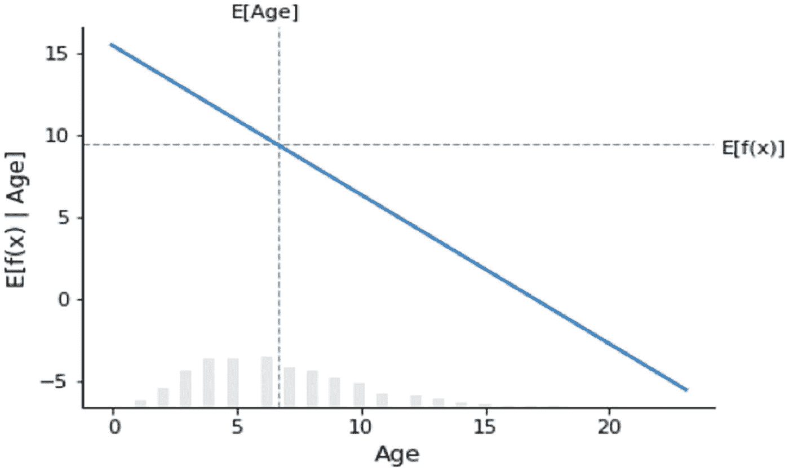

图 3-3

偏依赖图

```
import shap
shap.plots.partial_dependence("Age", new_model.predict,xtrain, ice=False, model_expected_value=True, feature_expected_value=True)
```

水平虚线表示模型应用于数据集时的期望输出值，垂直虚线表示平均年龄特征值，而蓝色的偏依赖图线（即当你将年龄特征固定为某个给定值时模型输出的平均值）在图上始终穿过两条灰色期望值线的交点。这个交点可以被视为相对于数据分布的偏依赖图的“中心”。水平轴上的垂直灰色框显示年龄分布略微向右偏斜。

Shapley 值建立的模型解释背后的主要思想是，利用合作博弈论中公正的结果分配方式，将模型输出（`x`）的贡献在其输入特征之间进行分配。为了将博弈论与机器学习模型联系起来，既需要将模型的输入特征与博弈中的玩家相匹配，也需要将模型函数与博弈规则相匹配。在博弈论中，玩家可以选择加入或不加入一个博弈，这类似于一个特征可以“加入”或“不加入”一个模型。

什么是`SHAP`值，它是如何计算的？这为理解`SHAP`值的解释和含义提供了一个清晰的概念。每个特征值的 Shapley 值通过以下公式计算：

$$
{\phi}_i=\sum \limits_{S\subseteq F\backslash \left\{i\right\}}\frac{\mid S\mid !\left(|F|-|S|-1\right)!}{\mid F\mid !}\left[{f}_{S\cup \left\{i\right\}}\left({x}_{S\cup \left\{i\right\}}\right)-{f}_S\left({x}_S\right)\right]
$$

以下几点阐明了其工作原理：

- 为了计算每个特征的贡献，`SHAP`需要在所有特征子集`S`上重新训练模型。

- 在上述公式中，`i`是单个特征。

- `F`是所有特征的集合。

- `S`是来自集合`F`的特征子集。

- 对于任何特征`i`，会创建两个模型：包含特征`i`的模型 1 和不包含特征`i`的模型 2。然后计算预测值之间的差异。

- 一个特征对模型的影响取决于模型中其他特征的行为。

- 针对`S`的所有可能子集计算预测差异，并取其平均值。

- 所有可能差异的加权平均值用于填充特征重要性。

定义特征“加入”模型含义的最常见方式是：当我们知道某个特征的值时，就说该特征“加入了模型”；当我们不知道其特征值时，就说它没有加入模型。当模型中某个特征的权重/系数为 0.000 时，我们就认为该特征没有加入博弈。如果某个特征的系数不等于 0.000，我们就认为该特征是博弈的一部分。让我们来看看线性回归模型的`SHAP`值。

```
### 计算线性模型的 SHAP 值
background = shap.maskers.Independent(xtrain, max_samples=2000)
background
xtrain.shape
```

这个`shap.maskers.Independent`函数通过对给定的背景数据集进行积分来屏蔽表格特征。这里的背景数据集包含来自训练数据集的 4500 条记录，这是从传入的背景数据中使用的最大样本数。如果数据超过`max_samples`，则使用`shap.utils.sample`对数据集进行子采样。从掩码器中输出的样本数量（用于积分）与背景数据集中的样本数量相匹配。这意味着更大的背景数据集会导致更长的运行时间。通常，大约 1、10、100 或 1000 个背景样本是合理的选择。

```
explainer = shap.Explainer(new_model, background)
explainer
shap_values = explainer(xtrain)
shap_values
```

上述脚本展示了 SHAP
```

LIME 解释器需要 numpy 数组作为输入，因此训练数据格式会发生变化。在扰动后，模式选择为回归，目标列为价格。一旦解释器开发完成，就可以进一步生成详细的局部解释。特征频率提供了特征的分布情况以及它在扰动过程中被使用的次数。

```
explainer.feature_selection
explainer.feature_frequencies
```

如果你想使用之前训练好的模型对象，那么可以使用解释实例。这需要一个测试数据集、模型对象以及特征数量。使用测试数据集中的第 60 条记录。使用预测函数，你会得到预测值 27.5854，该值等于解释实例的 `right`。局部预测值为 28.54，更接近实际预测值 35.0。

```
# 请求 LIME 模型的解释
i = 60
exp = explainer.explain_instance(np.array(xtest)[i],
new_model.predict,
num_features=14
)
new_model.predict(xtest)[60]
ytest[60:61]
Intercept 18.186435664326485
Prediction_local [28.15539047]
Right: 27.58547373488966
exp.show_in_notebook(show_table=True)
exp.as_list()
```

你可以以表格格式显示解释器，其中包含预测值、正负特征值以及表格中的总体特征及其值。预测值为 46.62。在第二个图表中，针对同一个实例（编号 60）显示了正特征值和负特征值。第二个图表中的水平条表示该记录的特征重要性。第三个表格显示了每个特征对应的 LIME 值。该方法和局部解释非常直观。这可以向任何业务用户解释。第 60 条记录的样本局部性会均匀且随机地选择单个数据点，创建扰动数据点以及模型对应的预测值。默认情况下，特征选择方法是自动的。LIME 专注于使用样本权重在打乱的数据集（扰动后）上拟合可解释模型，并使用新训练的模型提供局部解释。参见图 3-13。

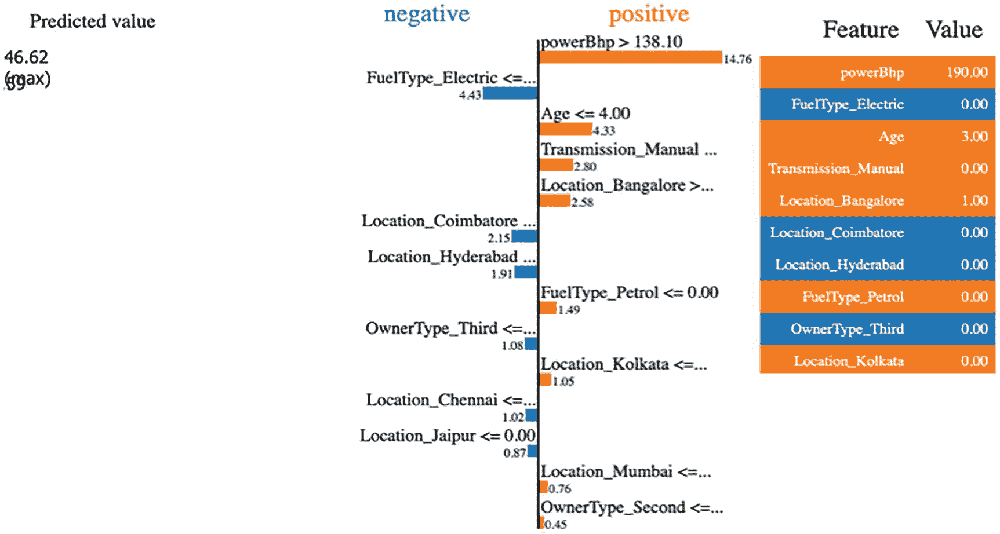

图 3-13

不同特征的正负值对预测值的贡献

第 60 条记录的解释器也可以像上面那样以列表形式显示。还有另一个类函数，称为子模选择，用于生成全局决策边界。

```
# SP-LIME 的代码
import warnings
from lime import submodular_pick
# 记住将数据框转换为矩阵值
# SP-LIME 返回样本集上的解释，以提供原始模型的非冗余全局决策边界
sp_obj = submodular_pick.SubmodularPick(explainer, np.array(xtrain),
new_model.predict,
num_features=14,
num_exps_desired=10)
[exp.show_in_notebook() for exp in sp_obj.sp_explanations ]
```

这里用于生成全局决策边界的特征数量是 14，期望的实验次数是 10。这部分脚本需要一些时间才能完成，因为你正在生成多次迭代。参见图 3-14。

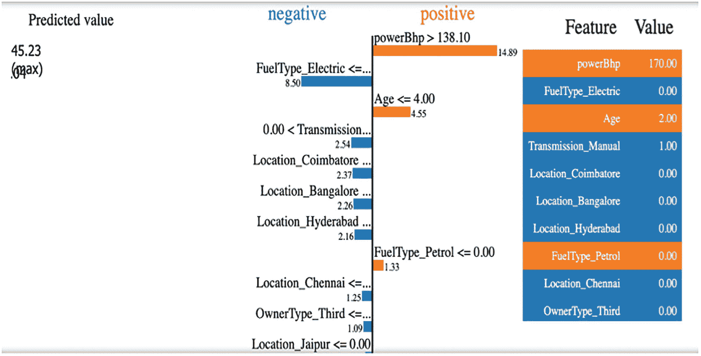

图 3-14

子模选择解释

LIME 试图在保真度和可解释性之间进行权衡。保真度意味着模型应该能够在用于预测的实例的局部区域内复制模型行为。可解释性你已经知道，是指清晰度，以便人类能够理解模型输出。以下公式展示了两者之间的关系：

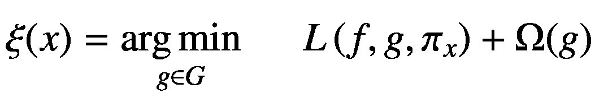

让我们理解上述公式中使用的每个符号：

*   `F` 是原始预测器。

*   `g` 是模型解释。

*   原始特征是 `x`。

*   `x` 的 `pi` 是一个邻近度度量，定义了 `xx` 周围的局部区域。

*   `x` 的 `omega` 是用于解释的模型复杂度的度量。

LIME 的局限性之一是对邻域和邻近度的定义不准确。在对局部区域内的记录进行采样时，它使用高斯分布，这没有考虑各个特征之间的关系。如果因变量和自变量之间的关系是非线性的，那么解释将不准确。另一个局限性是子模选择，它是从数据集中选出的最能解释模型的一组 n 个样本。子模选择会产生大量输出，有时难以解释。尽管该模块存在局限性，但 LIME 主要用于为单个预测生成与模型无关的局部解释。由于其输出的简单性和易于解释的特点，它非常受欢迎。

## Skater 解释与机器学习模型

Skater 是一个开源统一框架，用于实现所有形式模型的解释，帮助我们构建在实际应用场景中通常需要的可解释机器学习系统。Skater 支持多种算法，可以从全局（基于完整数据集进行推理）和局部（对单个预测进行推理）两个层面，揭示黑盒模型已学习到的结构。该软件包最初由 Aaron Kramer、Pramit Choudhary 以及 [DataScience.com](http://datascience.com) 团队的其他成员开发，旨在帮助数据

```
del df_train['Unnamed: 0']
df_train.shape
df_train.head()
from sklearn.preprocessing import LabelEncoder
tras = LabelEncoder()
df_train['area_code_tr'] = tras.fit_transform(df_train['area_code'])
df_train.columns
del df_train['area_code']
df_train.columns
df_train['target_churn_dum'] = pd.get_dummies(df_train.churn,prefix='churn',drop_first=True)
df_train.columns
del df_train['international_plan']
del df_train['voice_mail_plan']
del df_train['churn']
df_train.info()
df_train.columns
from sklearn.model_selection import train_test_split
df_train.columns
X = df_train[['account_length', 'number_vmail_messages', 'total_day_minutes',
'total_day_calls', 'total_day_charge', 'total_eve_minutes',
'total_eve_calls', 'total_eve_charge', 'total_night_minutes',
'total_night_calls', 'total_night_charge', 'total_intl_minutes',
'total_intl_calls', 'total_intl_charge',
'number_customer_service_calls', 'area_code_tr']]
Y = df_train['target_churn_dum']
```

只有区号变量被转换。其余特征要么是整数，要么是浮点数，这足以继续训练模型。

现在，你可以查看概率、对数优势比和优势比的分布，以及模型参数，以理解决策是如何围绕预测做出的。如果你参考`SHAP`值来解释逻辑回归模型的概率，可以看到强烈的交互效应。这是由于逻辑回归模型在概率空间中的非加性行为。如果你使用模型的对数优势比作为输出，可以看到模型输入和输出之间存在强相关性或完美的线性关系。

```
xtrain,xtest,ytrain,ytest=train_test_split(X,Y,test_size=0.20,stratify=Y)
log_model = LogisticRegression()
log_model.fit(xtrain,ytrain)
print("training accuracy:", log_model.score(xtrain,ytrain)) #training accuracy
print("test accuracy:",log_model.score(xtest,ytest)) # test accuracy
```

通过观察准确率，你可以得出结论，这是一个好模型，并且可能不存在过拟合问题，因为训练和测试准确率之间没有偏差。

```
np.round(log_model.coef_,2)
log_model.intercept_
X.columns
```

你创建了两个实用函数来生成所需输出，这些函数可以进一步用于`SHAP`值的图形表示。

```
# Provide Probability as Output
def model_churn_proba(x):
return log_model.predict_proba(x)[:,1]
# Provide Log Odds as Output
def model_churn_log_odds(x):
p = log_model.predict_log_proba(x)
return p[:,1] - p[:,0]
```

由于你已经在本章的回归部分介绍了依赖图的解释，类似的解释也可以应用于逻辑回归模型。部分依赖图以数据集中的一条记录为例，因为它是一种局部解释。

```
# make a standard partial dependence plot
sample_ind = 25
fig,ax = shap.partial_dependence_plot(
"total_day_minutes", model_churn_proba, X, model_expected_value=True,
feature_expected_value=True, show=False, ice=False
)
```

对于第 25 条记录，图 3-17 中特征`total_day_minutes`的部分依赖图显示了概率值或函数的期望值与特征之间的关系是正的，但似乎不是线性的。

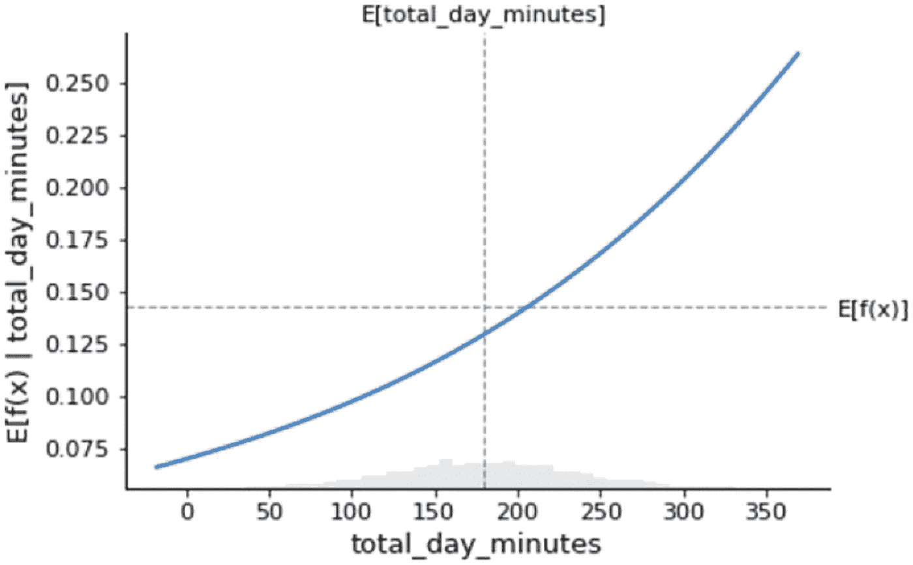

图 3-17

`total_day_minutes`与流失概率的部分依赖图

```
# compute the SHAP values for the linear model
background_churn = shap.maskers.Independent(X, max_samples=1000)
explainer = shap.Explainer(log_model, background_churn,feature_names=list(X.columns))
shap_values_churn = explainer(X)
shap_values = pd.DataFrame(shap_values_churn.values)
shap_values.columns = list(X.columns)
shap_values
```

`SHAP.Explainer`模块具有表 3-6 中列出的重要参数。

表 3-6

来自`SHAP`库的`Explainer`参数

| 参数 | 描述 |

| --- | --- |

| `Model` | 模型对象名称 |

| `Masker` | 用于屏蔽隐藏特征的函数 |

| `Link` | 用于在模型输出单元和`SHAP`值单元之间进行映射的函数 |

| `Algorithm` | 用于估计`Shapley`值，命名为`auto`、`permutation`、`partition`、`tree`、`kernel`、`sampling`、`linear`、`deep`和`gradient`。默认值为`auto`。 |

当你查看`account_length`与`account_length`的`SHAP`值的散点图（图 3-18）时，存在一个强烈的、完美的线性关系。

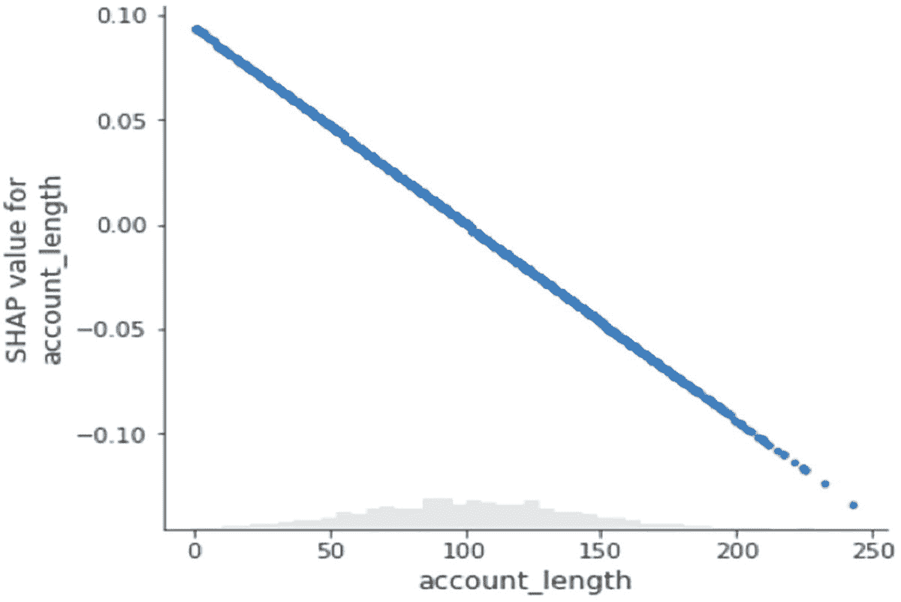

图 3-18

`account_length`特征与`SHAP`值之间的关系

```
shap.plots.scatter(shap_values_churn[:,'account_length'])
```

`SHAP`值以及各个特征的平均绝对值在以下图表中表示。这显示了在分类问题中哪个特征具有更高的权重。客户服务电话次数是流失的一个良好驱动因素，因为投诉越多的人越有可能致电客服，因此他们是观望者；他们随时可能流失。第二重要的因素是`total_day_minutes`，第三是`number_vmail_messages`。在末尾，你可以看到七个最不重要的特征被合并在一起。`SHAP`值还有另一种表示方式。每个特征的最大绝对`SHAP`值被表示出来，但两个图表之间没有重大差异。还有一种称为蜂群图的视图，它显示了`SHAP`值及其对模型输出的影响。数千条记录的`SHAP`值热图视图显示了`SHAP`值相对于模型特征的密度。最佳特征的`SHAP`值较高，并且特征重要性逐渐降低，`SHAP`值也随之减小。参见图 3-19 至 3-22。

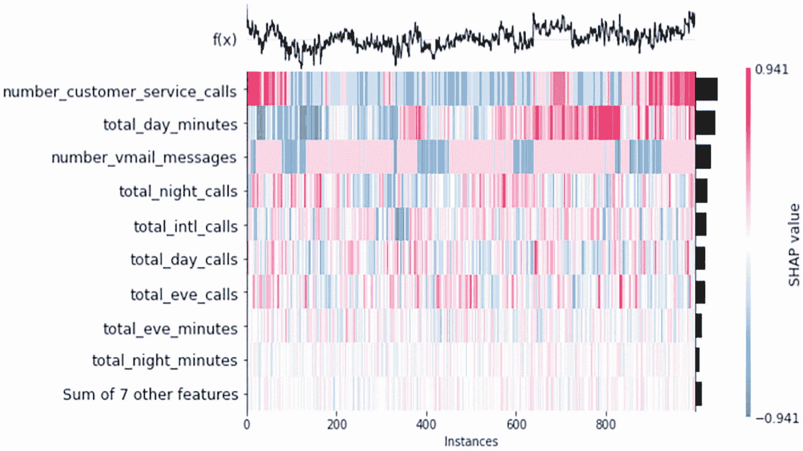

图 3-22

训练过程中使用的实例中每个特征贡献的`SHAP`值分布

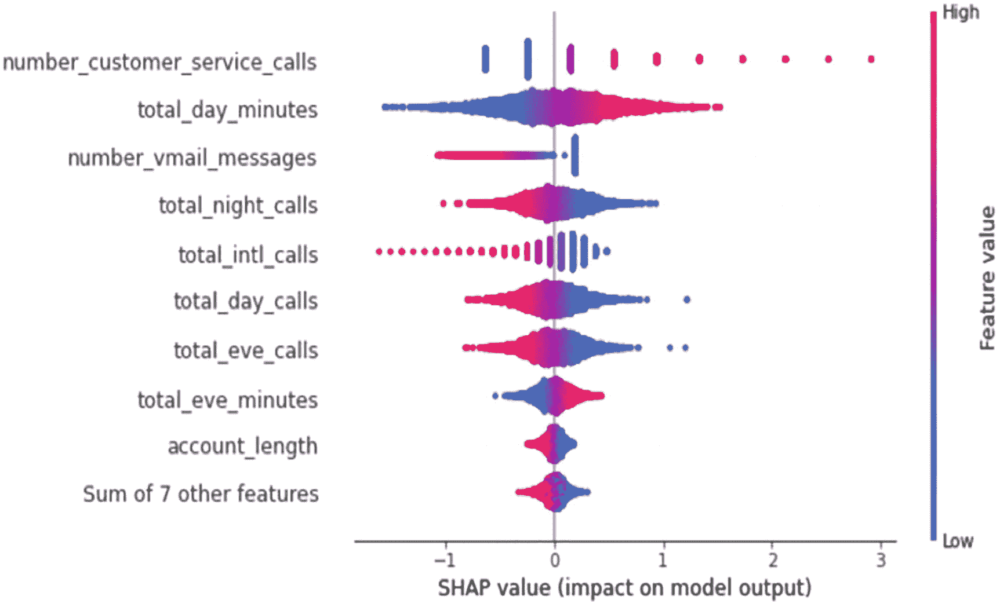

图 3-21

# 特征对 SHAP 值的正负贡献


图 3-20

# 每个特征贡献的最大绝对 SHAP 值


图 3-19

# 每个特征贡献的平均绝对 SHAP 值

```
# make a standard partial dependence plot
sample_ind = 25
fig,ax = shap.partial_dependence_plot(
"number_vmail_messages", model_churn_proba, X, model_expected_value=True,
feature_expected_value=True, show=False, ice=False
)
shap_values_churn.feature_names
# compute the SHAP values for the linear model
explainer_log_odds = shap.Explainer(log_model, background_churn,feature_names=list(X.columns))
shap_values_churn_log_odds = explainer_log_odds(X)
shap_values_churn_log_odds
shap.plots.bar(shap_values_churn_log_odds)
```

```
shap.plots.bar(shap_values_churn_log_odds.abs.max(0))
```

```
shap.plots.beeswarm(shap_values_churn_log_odds)
```

```
shap.plots.heatmap(shap_values_churn_log_odds[:1000])
```

| `特征名称` | `系数` |   |

| `14` | `number_customer_service_calls` | `0.383573` |

| `2` | `total_day_minutes` | `0.008251` |

| `4` | `total_day_charge` | `0.001378` |

| `5` | `total_eve_minutes` | `0.000947` |

| `7` | `total_eve_charge` | `0.000098` |

| `10` | `total_night_charge` | `-0.000048` |

| `13` | `total_intl_charge` | `-0.000196` |

| `11` | `total_intl_minutes` | `-0.000464` |

| `0` | `account_length` | `-0.000573` |

| `8` | `total_night_minutes` | `-0.001730` |

| `3` | `total_day_calls` | `-0.009254` |

| `9` | `total_night_calls` | `-0.010050` |

| `6` | `total_eve_calls` | `-0.012706` |

| `1` | `number_vmail_messages` | `-0.019944` |

| `15` | `area_code_tr` | `-0.033119` |

| `12` | `total_intl_calls` | `-0.097870` |

```
temp_df = pd.DataFrame()
temp_df['Feature Name'] = pd.Series(X.columns)
temp_df['Coefficients'] = pd.Series(log_model.coef_.flatten())
temp_df.sort_values(by='Coefficients',ascending=False)
```

### 解释

当你将某个特征的值增加一个单位时，模型方程会产生两个几率：一个是基准几率，另一个是特征增量值对应的几率。这里的目标是观察特征值每增加或减少一个单位时，几率比的变化。特征变化一个单位会导致几率比以相应贝塔系数的指数倍发生变化。这可以通过以下方程进一步解释，其中 `beta 0` 是截距项，`beta 1` 到 `beta k` 是模型参数，`x1` 到 `xk` 是模型的独立预测变量：

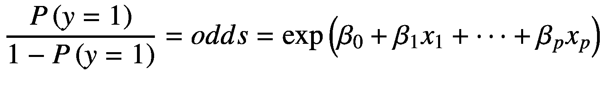

我们将方程右侧称为 `exp(a)`，其中 `a` 代表线性回归概念的方程。如果你增加模型的任意参数，方程将变化一个单位，因此我们称之为 `b`，那么右侧变为 `exp(b)`。相对于预测变量值变化一个单位的几率比将是 `odds_new / odd_old = exp(a - b)`。你可以用这种格式解释所有数值特征。这也适用于所有分类特征或二元特征。

### LIME 推断

为了解释逻辑回归模型，你可以使用 SHAP 值。然而，其复杂性在于时间成本。如果你有百万条记录，并且需要抽取一个相当大的样本来生成所有排列组合，以便在全局层面解释局部准确性，那么你将需要更多时间。为了避免处理大型数据集时的这一瓶颈，LIME 在生成解释方面提供了速度优势。为了解释表格矩阵数据（即结构化数据），你必须使用 `LimeTabularExplainer`。对于数值特征，通过从 `Normal(0,1)` 中采样并进行均值中心化和缩放的逆操作（根据训练数据中的均值和标准差）来扰动它们。对于分类特征，通过根据训练分布进行采样，并创建一个二元特征（当该值与正在解释的实例相同时为 1）来扰动。

在生成 LIME 解释器时，你需要将数据作为数组传递，提供列名列表，提供目标列名，并根据你计划使用的机器学习任务将模式设置为回归或分类。verbose 选项用于启用模型预测。

```
import lime
import lime.lime_tabular
explainer = lime.lime_tabular.LimeTabularExplainer(np.array(xtrain),
feature_names=list(xtrain.columns),
class_names=['target_churn_dum'],
verbose=True, mode='classification')
# this record is a no churn scenario
exp = explainer.explain_instance(xtest.iloc[0], log_model.predict_proba, num_features=16)
exp.as_list()
```

一旦生成了解释器模型对象，你就可以检查单个预测和全局预测以生成解释。在具有两个类别或多个类别的分类问题中，你可以针对每个类别相对于特征列生成单独的特征重要性。在此示例中，你考虑两条记录：记录 1（模型正确预测了结果）和记录 20（模型错误地进行了预测）。你将解释在这两种情况下模型为何做出这样的决策。与目标类别具有正相关关系的特征为正数，而具有负相关关系的类别则带有负号。你可以将结果以表格笔记本的形式展示。你也可以通过仅考虑其中最重要的特征来限制视图。

```
pd.DataFrame(exp.as_list())
```

DataFrame 视图中的特征权重如表 3-7 所示。

**表 3-7** 具有阈值的特征及其对预测值的权重

| **0** | **1** |

| **0** | `number_customer_service_calls <= 1.00` | `-0.106490` |

| **1** | `total_day_minutes <= 143.70` | `-0.082492` |

| **2** | `number_vmail_messages <= 0.00` | `0.063827` |

| **3** | `total_eve_calls > 114.00` | `-0.046997` |

| **4** | `101.00 < total_night_calls <= 114.00` | `-0.014762` |

| **5** | `total_eve_minutes > 235.07` | `0.009634` |

| **6** | `account_length > 126.00` | `-0.007626` |

| **7** | `1.00 < area_code_tr <= 2.00` | `-0.007580` |

```
## 重要规则

- 不要修改正文内容的语义
- 不要删减有价值的信息
- 不要重复输出原文，也不要添加额外信息，只输出排版后的文本

## 要排版的文本

| **8** | `2.27 < total_intl_charge <= 2.75` | `0.006753` |
| **9** | `87.00 < total_day_calls <= 101.00` | `0.006710` |
| **10** | `166.93 < total_night_minutes <= 200.40` | `0.005046` |
| **11** | `total_day_charge <= 24.43` | `-0.004913` |
| **12** | `3.00 < total_intl_calls <= 4.00` | `0.004285` |
| **13** | `7.51 < total_night_charge <= 9.02` | `-0.001845` |
| **14** | `total_eve_charge > 19.98` | `-0.001836` |
| **15** | `8.40 < total_intl_minutes <= 10.20` | `-0.000155` |

对应于记录 1，可以生成下表。截距项为 0.126，LIME 预测的客户流失本地概率为 0.18，逻辑回归模型预测的流失概率为 0.15。这基本上是截距项加上不同特征的所有权重。由于流失概率较低，因此被归类为非流失场景。因此，图 3-23 中的蓝色条形图显示非流失概率为 0.84，流失概率为 0.16。特征按其权重的总体重要性显示在表格的右侧。中间的表格显示了按特征值划分的权重。

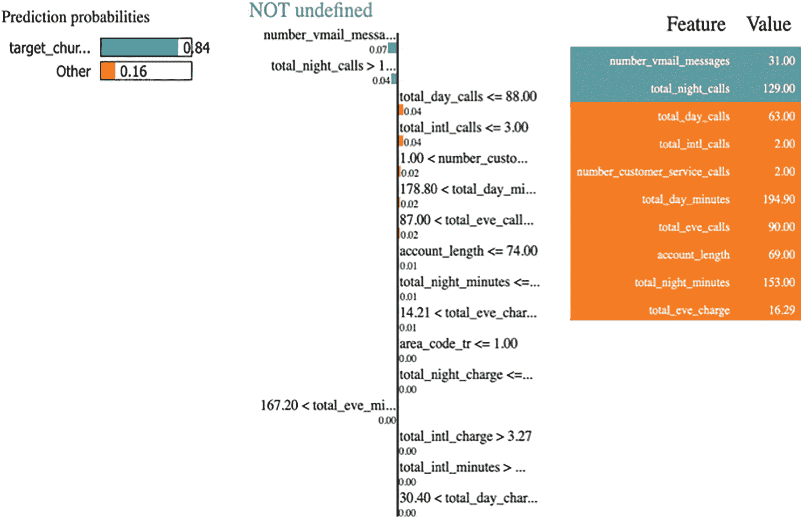

**图 3-23** 测试集记录 1 的摘要及其局部解释

```
exp.show_in_notebook(show_table=True)
```

对于测试集中的记录 20，模型预测了不同的结果，而实际测试结果也不同。这是一种模型预测与真实情况不符的场景，因此模型需要解释为什么会发生这种情况。你可以使用 LIME 局部实例获得更清晰的视图。

```
# 这是一个流失场景
exp = explainer.explain_instance(xtest.iloc[20], log_model.predict_proba, num_features=16)
exp.as_list()
exp.show_in_notebook(show_table=True)
xtest.iloc[20]
```

在图 3-24 中，预测概率有两个条形图：蓝色条形图显示非流失概率，橙色条形图显示流失概率。如果你查看旁边的表格，它会清晰地显示特征及其在构成整个橙色条形图时的权重。

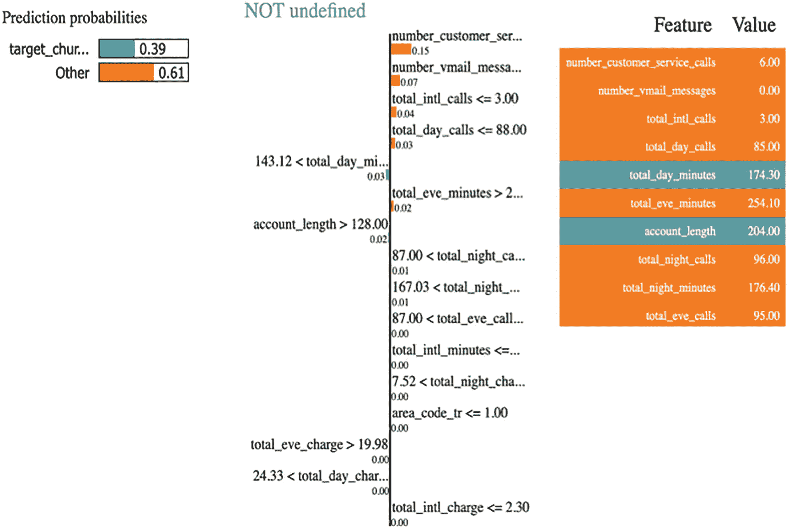

**图 3-24** 测试集记录 20 的局部解释

除了两个特征（总日通话时长和账户时长）之外，所有其他特征都对流失概率有贡献，因此模型正确预测了结果，并且预测得到了解释。每个特征的阈值及其权重都已给出。这为业务人员理解预测模型的行为提供了更清晰的图景。

```
explainer = lime.lime_tabular.LimeTabularExplainer(np.array(xtrain),
feature_names=list(xtrain.columns),
class_names=['target_churn_dum'],
verbose=True, mode='classification')
# SP-LIME 的代码
import warnings
from lime import submodular_pick
# SP-LIME 返回样本集上的解释，以提供原始模型的非冗余全局决策边界
sp_obj = submodular_pick.SubmodularPick(explainer, np.array(xtrain),
log_model.predict_proba,
num_features=14,
num_exps_desired=10)
```

子模块选择选项提供了原始模型的全局决策边界。你可以使用`explainer`对象、训练数据集以及从训练模型中提取的概率，然后指定描述中应包含的特征数量和所需的表达式数量。参见图 3-25 至图 3-28。

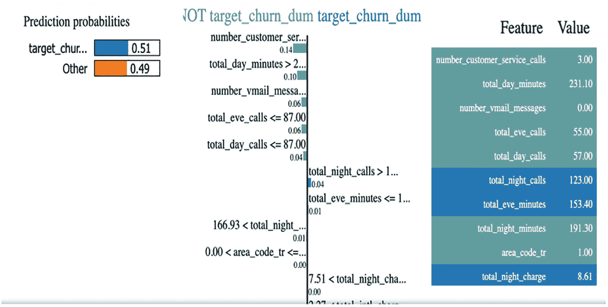

**图 3-28** 10 条记录中第四条记录的局部解释

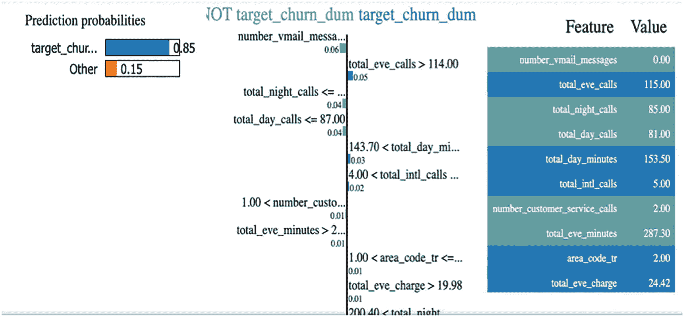

**图 3-27** 10 条记录中第三条记录的局部解释

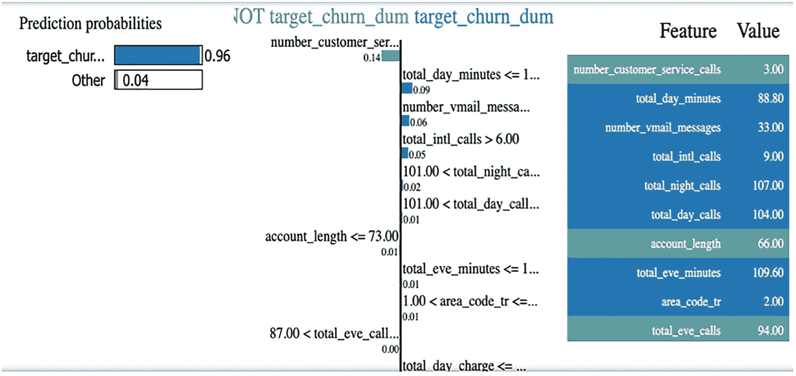

**图 3-26** 10 条记录中第二条记录的局部解释

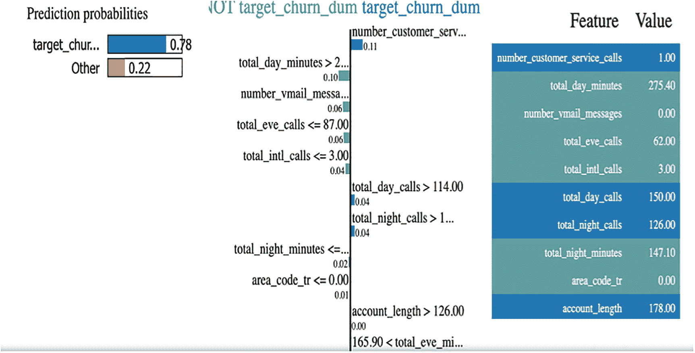

**图 3-25** 10 条记录中第一条记录的局部解释

Skater 生成的结果与 LIME 库类似，因此不再赘述其描述，因为我们已使用 LIME 库进行了介绍。ELI5 主要用于文本分类用例，因此 ELI5 不适用于解释线性或逻辑回归模型。更多信息请参见表 3-8。

**表 3-8** 何时使用哪个库的摘要视图

| 库名称 | 定义 | 使用时机 | 优势 | 局限性 |
| --- | --- | --- | --- | --- |
| **SHAP** | 使用 Shapley 值解释任何机器学习模型 | 表格数据、图像数据 | 提供更多指标和统计信息，解释更优 | 不明显 |
| **LIME** | 局部可解释模型解释（LIME） | 用于局部解释、表格数据 | 适用于单个实例的可解释性 | 全局解释不直观。不适用于图像数据。 |
| **Skater** | Skater 包中的通用工作流程是创建解释、创建模型并运行解释算法。 | 表格数据，提供两个模块：内存模型和已部署模型 | 模型训练和解释只需运行一次。无需作为单独进程运行。 | 仅支持少数模型。未能涵盖所有类型的模型。 |
| **ELI5** | 一个帮助调试机器学习分类器并解释其预测的 Python 包 | Scikit-learn 模型、文本分类、Keras 模型解释 | 适用于文本分类 | 对于所有其他任务来说不是一个成熟的库。解释非常基础。 |

## 结论

在本章中，你学习了如何解释线性模型、用于预测的线性回归模型以及用于二分类的逻辑回归模型。类似地，逻辑回归模型也可以扩展到多项分类。线性模型是较易于解释的模型，每个人都很好地理解这些模型的工作原理。因此，人们对线性模型始终抱有高度的信任。然而，在本章中，你从多个角度探讨了如何使用可解释 AI 库（如 LIME 和 SHAP）为线性模型创建视图。在下一章中，你将学习非线性模型的模型可解释性。
```