# 4. 非线性模型的可解释性

本章探讨如何使用基于可解释 AI 的 Python 库 LIME、SHAP 和 Skope-rules 来解释非线性模型在结构化数据监督学习任务中所做的决策。在本章中，你将学习解释非线性模型和基于树的模型及其在预测因变量时的决策的各种方法。在监督式机器学习任务中，存在一个目标变量（也称为因变量）和一组自变量。目标是预测因变量作为输入变量或自变量的加权和，其中存在高度的特征交互和非线性复杂关系。


## 非线性模型

决策树是一种将自变量映射到因变量的非线性模型。在局部层面，它可以被视为分段线性回归，但在全局层面，它是一个非线性模型，因为因变量和自变量之间不存在一对一的映射关系。与线性回归模型不同，没有数学方程来展示输入和输出变量之间的关系。如果我们将最大树深度参数设置为无限，那么决策树可能会完美拟合数据，这是模型过拟合的经典场景。无论训练数据集是否线性可分，决策树都容易过拟合。这个问题需要解决。人们通常会对树进行剪枝，以获得最佳拟合的决策树模型。我们可以将决策树视为一系列条件语句，这些语句在输出列中产生一个值或一个类别。例如，如果一个人 45 岁，在私营部门工作，拥有博士学位，那么他们每年的收入肯定超过 5 万美元。决策树是一种监督学习算法，适用于存在无限多种可能影响目标列的特征组合的情况。在决策树中，我们根据输入变量中最显著的分割点或区分因素，将总体分成两个或更多子总体。

决策树算法主要遵循`ID3`（迭代二分器 3）算法，尽管还有其他算法，如`C4.5`、`CART`、`MARS`和`CHAID`。它基于以下几点：

-   根据数据集的信息增益（具有高预测价值）识别最佳属性或特征，并将其置于树的根节点
-   将训练数据集分割成子集，使得每个子集对于某个属性具有相同的值
-   重复上述两个步骤，直到所有类别都被分离到一个节点中，或者满足节点所需的最小样本数

在决策树模型中，为了预测一条记录的类别标签，我们从树的根节点开始。我们比较根属性，在开始时使用最佳属性，然后继续构建决策树。当我们考虑模型可解释性时，决策树解释预测的能力相当不错。简单来说，决策树提供了任何应用程序都可以直接使用的规则。这些规则大多是一堆`if/else`语句。在特征之间存在关系的情况下，例如特征之间的交互作用、特征的平方或立方值与因变量相关等。在这种情况下，线性回归和逻辑回归必然会失败。这是因为特征交互的数量可能很多。基于树的模型会考虑特征值，决定一个阈值，将特征分成两部分，并不断生长树的分支。将数据分割成多个子组的过程有助于捕捉数据集中存在的非线性。类似地，平方和立方特征也遵循模型概述的`if/else`规则。

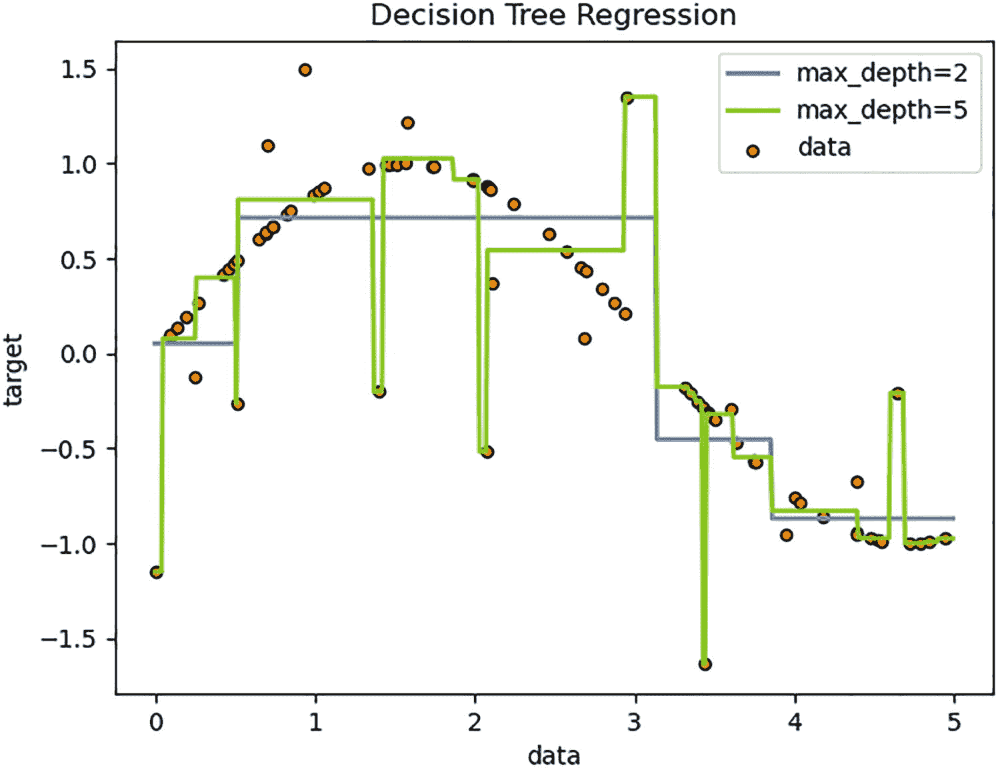

图 4-1

决策树回归捕捉非线性

如图 4-1（来源：[`https://scikit-learn.org/`](https://scikit-learn.org/)）所示，数据与目标之间的关系是非线性的。决策树模型通过增加最大深度参数来逼近这种非线性。随着最大深度参数从 2 增加到 5，曲线之外的所有点也成为了模型的一部分，因此它们出现在决策树模型生成的规则集中。

## 决策树解释

图 4-2 描绘了树的起始点。它从一个根特征开始。分支逻辑基于能够创建分割的最佳可能特征。

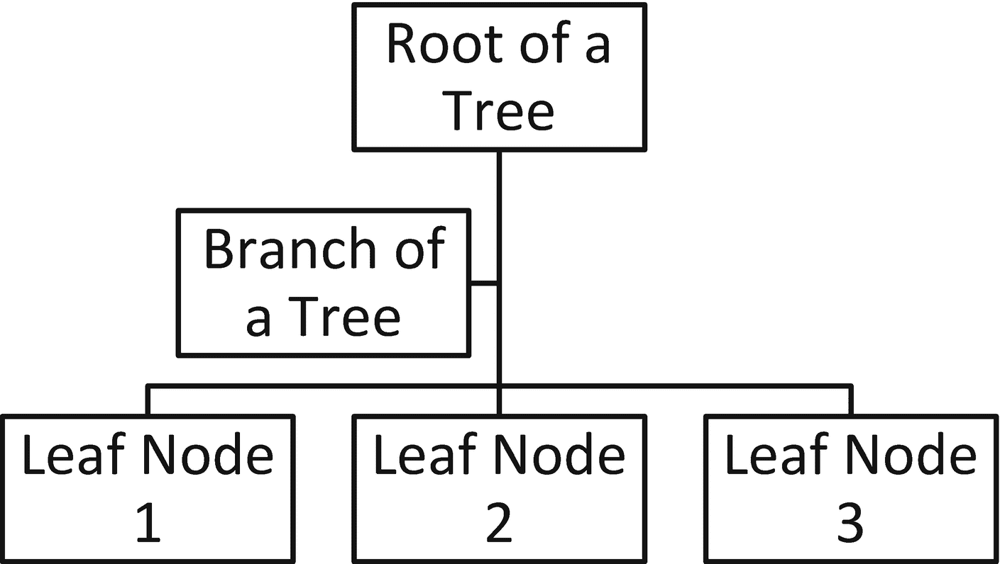

图 4-2

决策树的剖析

终端节点是树构建停止的结束节点。为了预测特定记录的结果，使用整体数据的平均结果。

如图 4-3 所示，模型可解释性可以通过两种方式实现：`XAI`库和基础`ML`库。

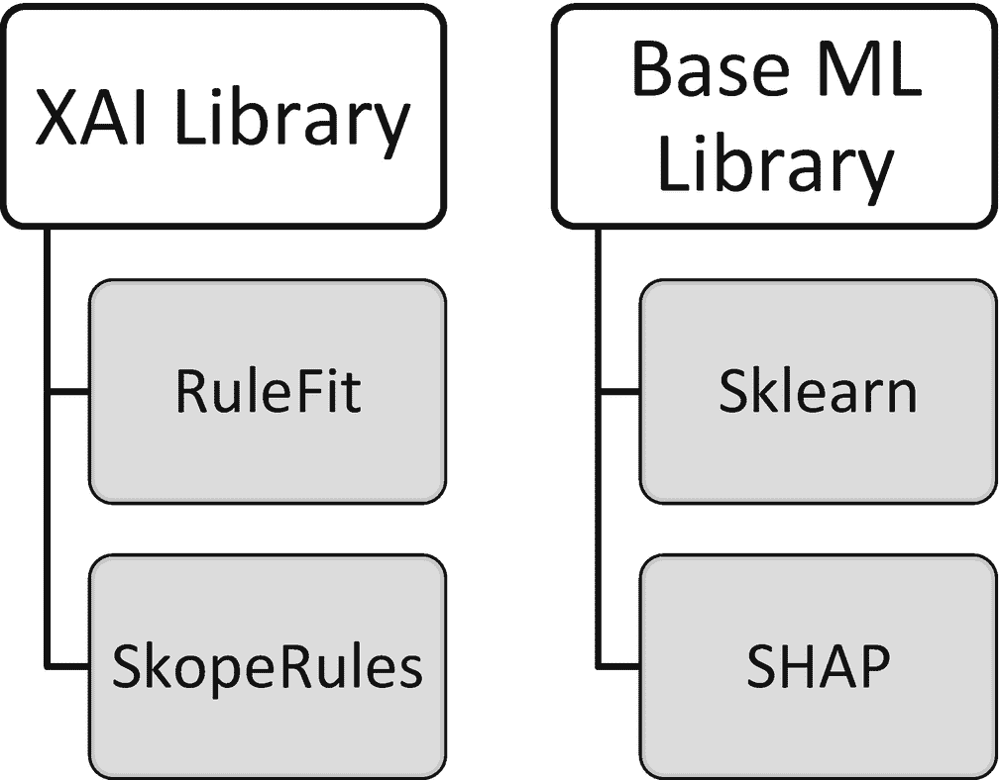

图 4-3

解释基于树的模型的两种方法

区别在于，如果我们使用父级`ML`库，我们可以使用已经训练好的模型。否则，如果我们使用`XAI`库，我们可能必须重新训练`ML`模型。现在回到解释模型结果或输出，如果我们重新训练模型，这将是模型重新训练的开销。超参数调优和最佳模型选择是不同的过程，并且需要大量时间。

然而，如果我们有一个现成的模型，并且可以直接生成模型解释，这对最终用户是有益的。以下代码展示了创建决策树模型所需的必要库。你将使用你在第 3 章中使用的电信客户流失数据。该数据集包含 20 个特征和 3333 条记录。对于某些分类变量，例如区号，你需要转换该变量并执行标签编码。


# 决策树模型的数据准备

以下脚本展示了准备决策树模型所需的库。同时，您还需要以 CSV 格式导入开发模型所需的数据。

```
import pandas as pd
import numpy as np
import matplotlib.pyplot as plt
%matplotlib inline
import numpy as np, pandas as pd, matplotlib.pyplot as plt
from sklearn import tree, metrics, model_selection, preprocessing
from IPython.display import Image, display
from sklearn.metrics import confusion_matrix, classification_report
df_train = pd.read_csv('ChurnData.csv')
del df_train['Unnamed: 0']
df_train.shape
df_train.head()
```

数据中存在的额外列已被删除。`shape` 函数提供了数据集中行数和列数的信息。此外，`head` 函数提供了数据框中的前五条记录。

```
from sklearn.preprocessing import LabelEncoder
tras = LabelEncoder()
df_train['area_code_tr'] = tras.fit_transform(df_train['area_code'])
df_train.columns
del df_train['area_code']
df_train.columns
```

数据中存在一些字符串列，例如 `area_code`。需要使用标签编码器将这些数据转换为数字。这是模型训练所必需的，因为您不能直接使用字符串变量。

```
df_train['target_churn_dum'] = pd.get_dummies(df_train.churn,prefix='churn',drop_first=True)
df_train.columns
del df_train['international_plan']
del df_train['voice_mail_plan']
del df_train['churn']
df_train.info()
df_train.columns
```

下一步，您将把数据集拆分为训练集和测试集。训练集用于开发模型，测试集用于生成推断或预测。

```
from sklearn.model_selection import train_test_split
df_train.columns
X = df_train[['account_length', 'number_vmail_messages', 'total_day_minutes',
'total_day_calls', 'total_day_charge', 'total_eve_minutes',
'total_eve_calls', 'total_eve_charge', 'total_night_minutes',
'total_night_calls', 'total_night_charge', 'total_intl_minutes',
'total_intl_calls', 'total_intl_charge',
'number_customer_service_calls', 'area_code_tr']]
Y = df_train['target_churn_dum']
xtrain,xtest,ytrain,ytest=train_test_split(X,Y,test_size=0.20,stratify=Y)
tree.DecisionTreeClassifier() # 基础树模型
# 决策树分类器的默认超参数
class_weight=None,
criterion='gini',
max_depth=None,
max_features=None,
max_leaf_nodes=None,
min_impurity_decrease=0.0,
min_impurity_split=None,
min_samples_leaf=1,
min_samples_split=2,
min_weight_fraction_leaf=0.0,
presort=False,
random_state=None,
splitter='best'
dt1 = tree.DecisionTreeClassifier()
dt1.fit(xtrain,ytrain)
print(dt1.score(xtrain,ytrain))
print(dt1.score(xtest,ytest))
```

**表 4-1** 决策树超参数说明

| 参数 | 说明 |
| --- | --- |
| `Class_weight` | 与类别相关的权重 |
| `Criterion` | 衡量分裂质量的函数，如基尼系数和熵 |
| `max_depth` | 树的最大深度 |
| `max_features` | 寻找最佳分裂时需要考虑的特征数量 |
| `max_leaf_nodes` | 以最佳优先方式生成具有 `max_leaf_nodes` 个叶节点的树 |
| `min_samples_leaf` | 叶节点所需的最小样本数 |
| `min_samples_split` | 分裂内部节点所需的最小样本数 |

决策树模型中还有许多其他超参数，但表 4-1 中列出了重要的几个。一些超参数用于控制模型的过拟合，另一些则用于提高模型的准确性。

### 创建模型

下一步是创建模型并验证训练集和测试集之间的准确性。有两个模型，`dt1` 和 `dt2`：一个限制了最大深度，另一个对最大深度没有限制。区别在于 `dt1` 是一个过拟合模型，而 `dt2` 是一个进行了树剪枝且没有过拟合的模型。

```
dt1 = tree.DecisionTreeClassifier()
dt1.fit(xtrain,ytrain)
print(dt1.score(xtrain,ytrain))
print(dt1.score(xtest,ytest))
1.0
0.8590704647676162
dt2 = tree.DecisionTreeClassifier(max_depth=3)
dt2.fit(xtrain,ytrain)
print(dt2.score(xtrain,ytrain))
print(dt2.score(xtest,ytest))
0.9021005251312828
0.8875562218890555
```

无限制的过拟合模型的局限性在于，它会生成一个庞大的决策树，并且用于得出预测的规则会非常多。因此，并非所有规则都是重要的，因为随着树的增长，一些冗余规则可能会参与到树的构建过程中。

```
!pip install pydotplus
!pip install graphviz
import pydotplus
dot_data = tree.export_graphviz(dt1, out_file=None, filled=True, rounded=True,
feature_names=list(xtrain.columns),
class_names=['yes','no'])
graph = pydotplus.graph_from_dot_data(dot_data)
display(Image(graph.create_png()))
```

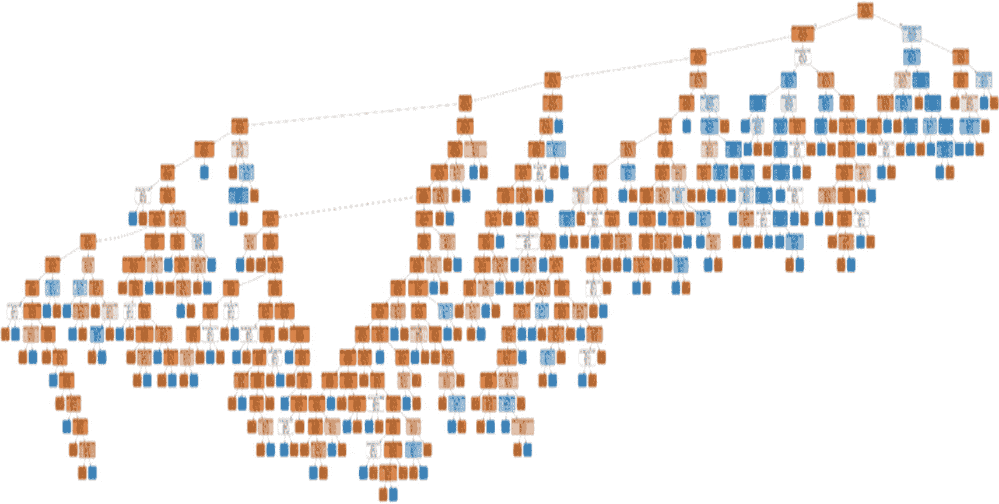

**图 4-4** 使用 GraphViz 可视化默认模型下的决策树

使用所有默认超参数训练的决策树会生成一棵庞大的树，并导致产生多条规则，这不仅难以解释，而且在实际项目场景中也难以实施。如图 4-4 所示的最大可能决策树，是将树的最大深度参数设置为 `None` 的结果，这意味着您要求决策树不断生长分支。

```
dot_data = tree.export_graphviz(dt2, out_file=None, filled=True, rounded=True,
feature_names=list(xtrain.columns),
class_names=['yes','no'])
graph = pydotplus.graph_from_dot_data(dot_data)
display(Image(graph.create_png()))
```

```
tree.plot_tree(dt1)
tree.plot_tree(dt2)
```

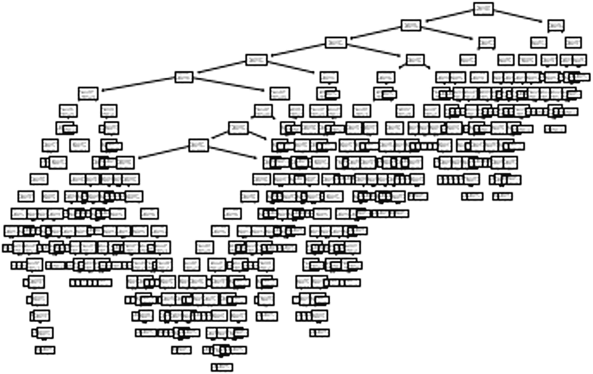

**图 4-6** 使用 `plot_tree` 方法可视化决策树

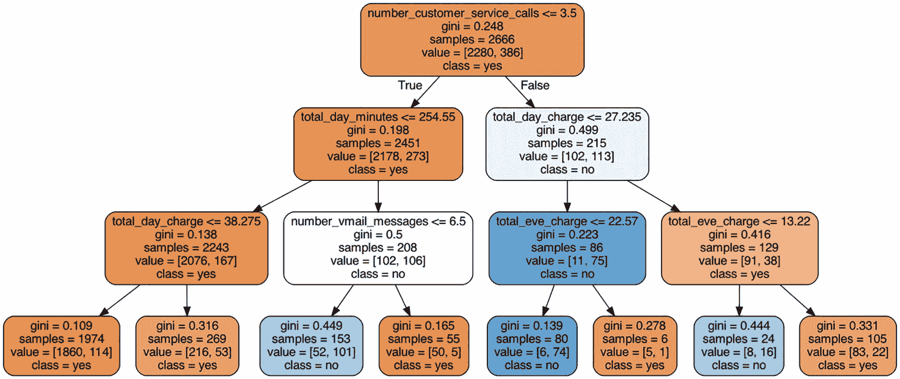

**图 4-5** 同一决策树模型的剪枝版本

图 4-4 中展示的相同模型在图 4-5 和 4-6 中重新生成。后一张图是使用 sklearn Python 库的内置函数 `plot_tree` 以另一种方式生成的。两者没有区别，只是两个库的不同。如果在生产环境中安装 GraphViz 库或 Pydotplus 库时出现问题，您可以切换到 `plot_tree` 函数。

`dt1` 模型生成的树非常大，以至于任何人都难以浏览和解释结果。在应用树剪枝方法将最大深度参数限制为 3 后，您可以看到一棵小得多的树，只有相关特征参与了树的构建（图 4-7）。

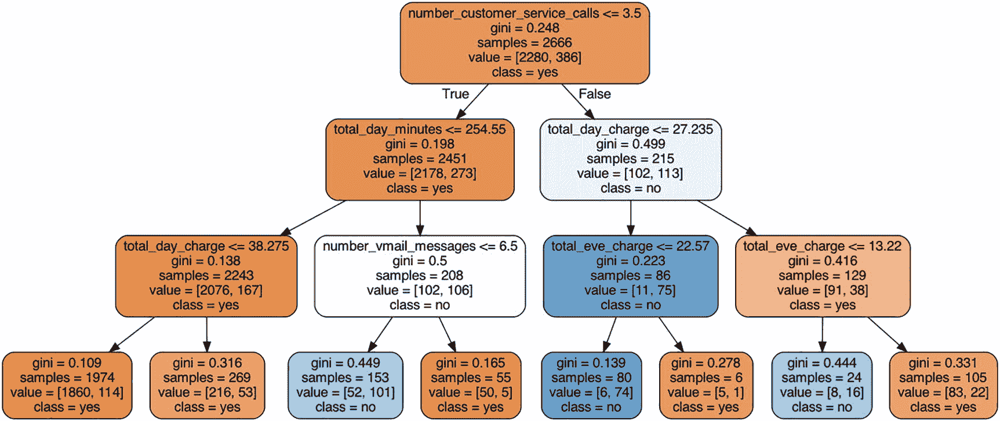

**图 4-7** 图 4-5 所示决策树模型的剪枝版本


剪枝后的决策树模型对象`dt2`使用最大深度参数`3`，这意味着在第三层分支之后，树应停止进一步扩展。该版本的模型生成了一棵更小的树，其中包含可作为`if/else`条件使用的稳健规则。这是一种最保守的决策树建模方法，可避免过拟合。

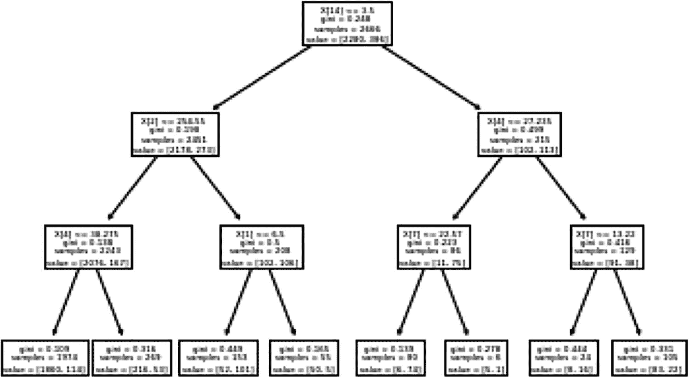

**图 4-8** 使用`plot tree`函数生成的剪枝树可视化

图 4-8 所示的决策树版本使用了更少的规则，这使得理解决策如何做出变得更加容易，并且更容易集成到任何生产系统中。

如果你想解释、实现或嵌入由决策树模型生成的规则到其他外部应用程序中，可以通过导出规则文本来实现。

```python
from sklearn.tree import export_text
r = export_text(dt1, feature_names=list(xtrain.columns))
print(r)
```

从`dt1`模型生成了许多规则，这些规则难以解释。让我们看一下`dt2`模型生成的规则。类别`0`表示非流失场景，类别`1`表示可能的流失客户指标。规则文本显示，如果总日间费用小于或等于`44.96`，客户服务电话次数小于或等于`3.5`，并且总日间通话分钟数小于或等于`223.25`，那么这是一个非流失案例。类似地，相反的场景可以被解释为流失场景。你可以打印并查看以下所有规则。

```python
from sklearn.tree import export_text
r = export_text(dt2, feature_names=list(xtrain.columns))
print(r)
|--- number_customer_service_calls   38.27
|   |   |   |--- class: 0
|   |--- total_day_minutes >  254.55
|   |   |--- number_vmail_messages   6.50
|   |   |   |--- class: 0
|--- number_customer_service_calls >  3.50
|   |--- total_day_charge   22.57
|   |   |   |--- class: 0
|   |--- total_day_charge >  27.24
|   |   |--- total_eve_charge   13.22
|   |   |   |--- class: 0
```

来自`dt1`模型的特征重要性如下所示。

```python
list(zip(dt1.feature_importances_, xtrain.columns))
[(0.04051943775304626, 'account_length'),
(0.08298083105277364, 'number_vmail_messages'),
(0.0644144400251063, 'total_day_minutes'),
(0.028172622004021135, 'total_day_calls'),
(0.20486110565087778, 'total_day_charge'),
(0.10259170929879882, 'total_eve_minutes'),
(0.03586253729017199, 'total_eve_calls'),
(0.0673761405897894, 'total_eve_charge'),
(0.0613662104733965, 'total_night_minutes'),
(0.05654698887273517, 'total_night_calls'),
(0.03894924950827072, 'total_night_charge'),
(0.01615654226052593, 'total_intl_minutes'),
(0.039418913794511345, 'total_intl_calls'),
(0.02842685405881307, 'total_intl_charge'),
(0.11203068621155501, 'number_customer_service_calls'),
(0.020325731155606916, 'area_code_tr')]
# 提取定义树的数组
children_left = dt2.tree_.children_left
children_right = dt2.tree_.children_right
children_default = children_right.copy() # 因为 sklearn 不使用缺失值
features = dt2.tree_.feature
thresholds = dt2.tree_.threshold
values = dt2.tree_.value.reshape(dt2.tree_.value.shape[0], 2)
node_sample_weight = dt2.tree_.weighted_n_node_samples
print("     children_left", children_left)
# 注意：负的 children 值表示这是一个叶节点
print("    children_right", children_right)
print("  children_default", children_default)
print("          features", features)
print("        thresholds", thresholds.round(3))
print("            values", values.round(3))
print("node_sample_weight", node_sample_weight)
```

决策树分类器模型有一个名为`tree_`的属性，它允许你获取关于模型对象的详细解释。它以并行数组的形式存储整个二叉树结构。节点`0`是根节点，其余参数在表 4-2 中解释。左子节点或右子节点的 ID 在取负值（例如`-1`）时，表示它是一个叶节点，决策树在此终止。

**表 4-2** 决策树的底层属性提取

| 参数 | 解释 |
| --- | --- |
| `dt2.tree_.node_count` | 树中节点的总数 |
| `tree_.children_left[i]` | 节点`i`的左子节点 ID |
| `tree_.children_right[i]` | 节点`i`的右子节点 ID |
| `tree_.feature[i]` | 用于分割节点`i`的特征 |
| `tree_.threshold[i]` | 节点`i`处的阈值 |
| `tree_.n_node_samples[i]` | 到达节点`i`的训练样本数量 |
| `tree_.impurity[i]` | 节点`i`的不纯度 |
| `tree_.weighted_n_node_samples` | `n_node_samples`是每个节点中实际数据集样本的计数。`weighted_n_node_samples`是相同的，但按`class_weight`和/或`sample_weight`加权。 |

```python
# 定义一个自定义树模型
tree_dict = {
"children_left": children_left,
"children_right": children_right,
"children_default": children_default,
"features": features,
"thresholds": thresholds,
"values": values,
"node_sample_weight": node_sample_weight
}
model = {
"trees": [tree_dict]
}
import shap
explainer = shap.TreeExplainer(model)
# 提供概率作为输出
def model_churn_proba(x):
    return dt2.predict_proba(x)[:,1]
# 提供对数几率作为输出
def model_churn_log_odds(x):
    p = dt2.predict_log_proba(x)
    return p[:,1] - p[:,0]
# 制作一个标准的偏依赖图
sample_ind = 25
fig, ax = shap.partial_dependence_plot(
    "total_day_minutes", model_churn_proba, X, model_expected_value=True,
    feature_expected_value=True, show=False, ice=False
)
```

## 决策树 – SHAP

`SHAP` Python 库可用于解释决策树。`SHAP`库具有有用的函数，可以为模型可解释性提供额外的见解。

```python
import shap
explainer = shap.TreeExplainer(model)
# 提供概率作为输出
def model_churn_proba(x):
    return dt2.predict_proba(x)[:,1]
# 提供对数几率作为输出
def model_churn_log_odds(x):
    p = dt2.predict_log_proba(x)
    return p[:,1] - p[:,0]
# 制作一个标准的偏依赖图
sample_ind = 25
fig, ax = shap.partial_dependence_plot(
    "total_day_minutes", model_churn_proba, X, model_expected_value=True,
    feature_expected_value=True, show=False, ice=False
)
```


# 偏依赖图

偏依赖图（PDP）用于可视化特征列与目标列（或响应列）之间的交互关系。目标列包含两个标签：0 表示未流失案例，1 表示流失案例。当你使用 `predict_proba()` 函数时，可以生成类别 0 和类别 1 的概率。

```
pd.DataFrame(dt2.predict_proba(X)) # 0 - 未流失, 1- 流失
model_churn_proba(X).max()
model_churn_proba(X).mean()
model_churn_proba(X).min()
```

上述脚本中的函数用于选择第 1 列，即流失概率。例如，第一条记录显示概率为 0.090909，这意味着流失几率低于 10%。你可以得出结论，这是一个未流失样本。在下面的脚本中，`model_churn_proba` 仅显示第二列的流失概率。

在绘制流失概率与总日通话分钟数（如图 4-10 的 PDP 图所示）的关系图之前，你应该先使用分布图查看流失概率的分布情况。这将有助于你理解如何解读偏依赖图。概率分布如图 4-9 所示。

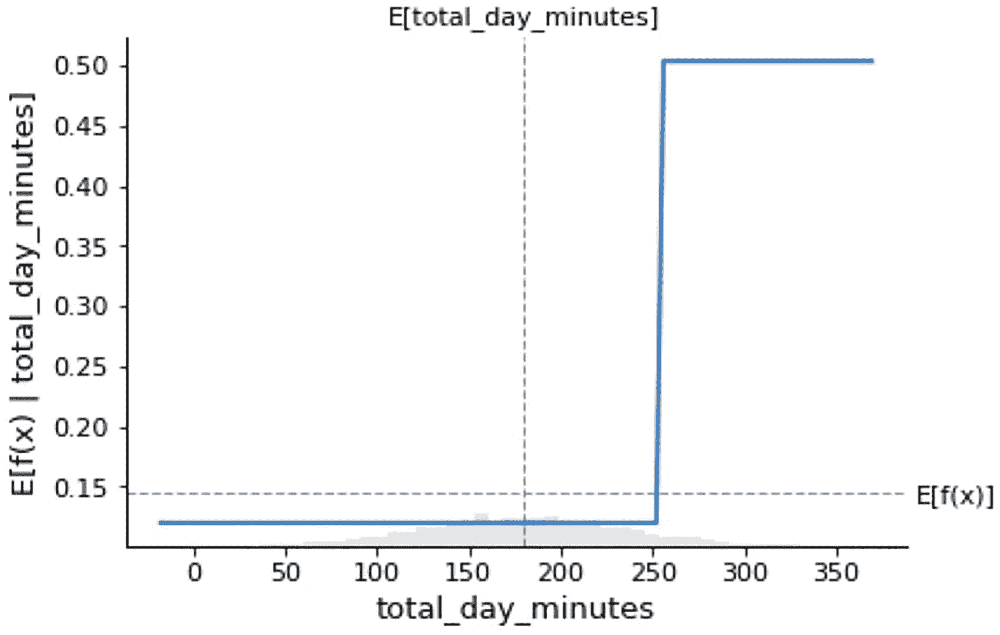

图 4-10

总日通话分钟数与流失概率的 PDP 图

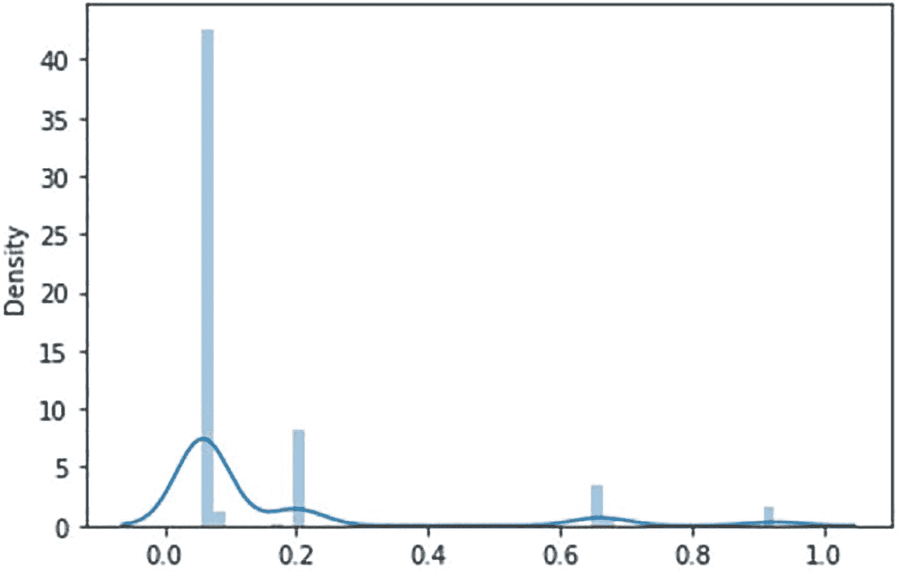

图 4-9

决策树模型得出的流失概率分布

```
import seaborn as sns
sns.distplot(model_churn_proba(X))
pd.DataFrame(model_churn_proba(X))
from sklearn.inspection import plot_partial_dependence
xtrain.columns
plot_partial_dependence(dt2, X, ['account_length', 'number_vmail_messages', 'total_day_minutes'])
plot_partial_dependence(dt2, X, [
'total_day_calls', 'total_day_charge', 'total_eve_minutes',
])
plot_partial_dependence(dt2, X, [
'total_eve_calls', 'total_eve_charge', 'total_night_minutes'])
```

图 4-10 中展示的总日通话分钟数及其期望值呈分段线性关系，但观察整条蓝色曲线，它并非线性。这是针对样本编号 25 的局部解释。总日通话分钟数是数值型数据，在训练数据集中被视为连续列。对于同一个样本观测值 25，语音邮件数量也会影响该特征对流失预测的边际贡献。在图 4-10 中，如果用户的总日通话分钟数不超过 225 分钟，那么流失概率将小于或等于平均流失概率（14.25）。即使总日通话分钟数超过 225 分钟，流失概率仍低于 25%。

```
# 生成标准偏依赖图
sample_ind = 25
fig,ax = shap.partial_dependence_plot(
"number_vmail_messages", model_churn_proba, X, model_expected_value=True,
feature_expected_value=True, show=False, ice=False
)
```

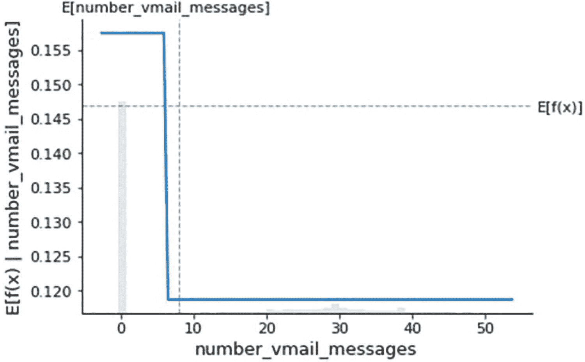

图 4-11

语音邮件数量与流失概率的 PDP 图

当你观察账户时长对流失预测的边际贡献与账户时长之间的关系时，可以看到一条蓝色的平行线（图 4-11）。这表明无论账户时长如何变化，边际贡献都保持不变，意味着该特征没有预测价值，不重要，并且在流失预测模型中不起作用。

```
# 生成标准偏依赖图
sample_ind = 25
fig,ax = shap.partial_dependence_plot(
"account_length", model_churn_proba, X, model_expected_value=True,
feature_expected_value=True, show=False, ice=False
)
```

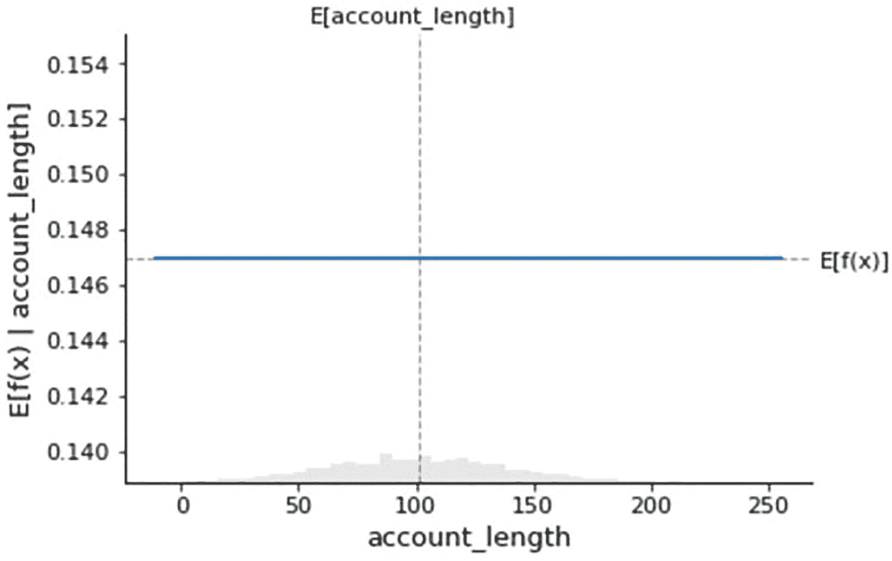

图 4-12

账户时长特征的 PDP 图

账户时长的 PDP 图对流失概率没有影响，这一点从图 4-12 中的蓝色直线可以清晰看出。蓝色直线遵循流失概率的平均值。

```
# 生成标准偏依赖图
sample_ind = 25
fig,ax = shap.partial_dependence_plot(
"number_customer_service_calls", model_churn_proba, X, model_expected_value=True,
feature_expected_value=True, show=False, ice=False
)
```

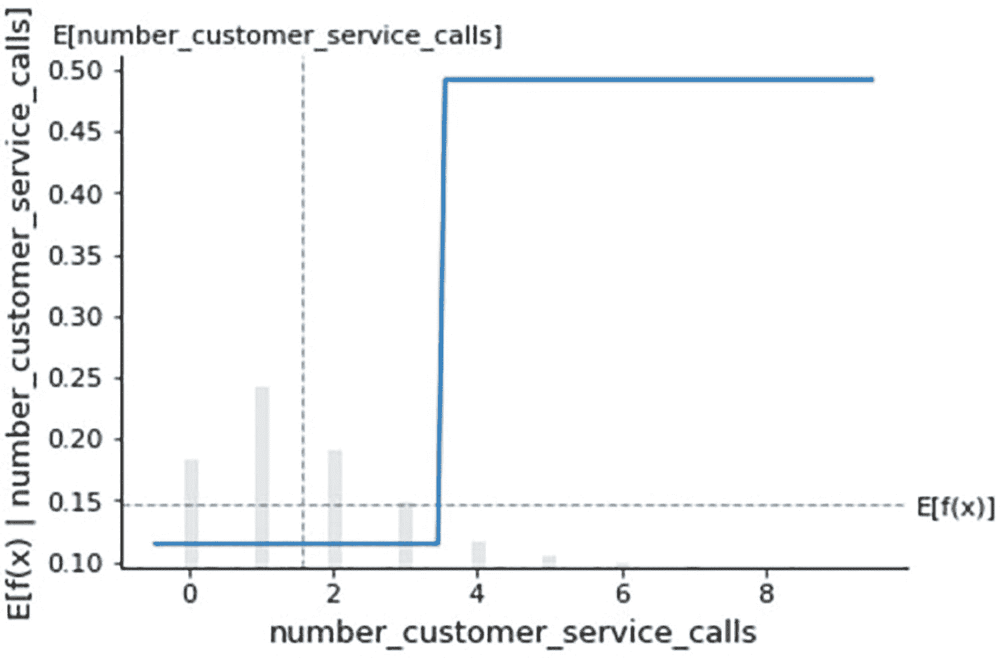

图 4-13

客户服务呼叫次数的 PDP 图

需要注意的是，客户服务呼叫次数越高，流失概率也越高。这是因为用户遇到了问题，导致客户服务呼叫次数增加。你可以在图 4-13 中看到相同的模式：超过四次呼叫会增加流失概率。

```
# 生成标准偏依赖图
sample_ind = 25
fig,ax = shap.partial_dependence_plot(
"total_day_charge", model_churn_proba, X, model_expected_value=True,
feature_expected_value=True, show=False, ice=False
)
```

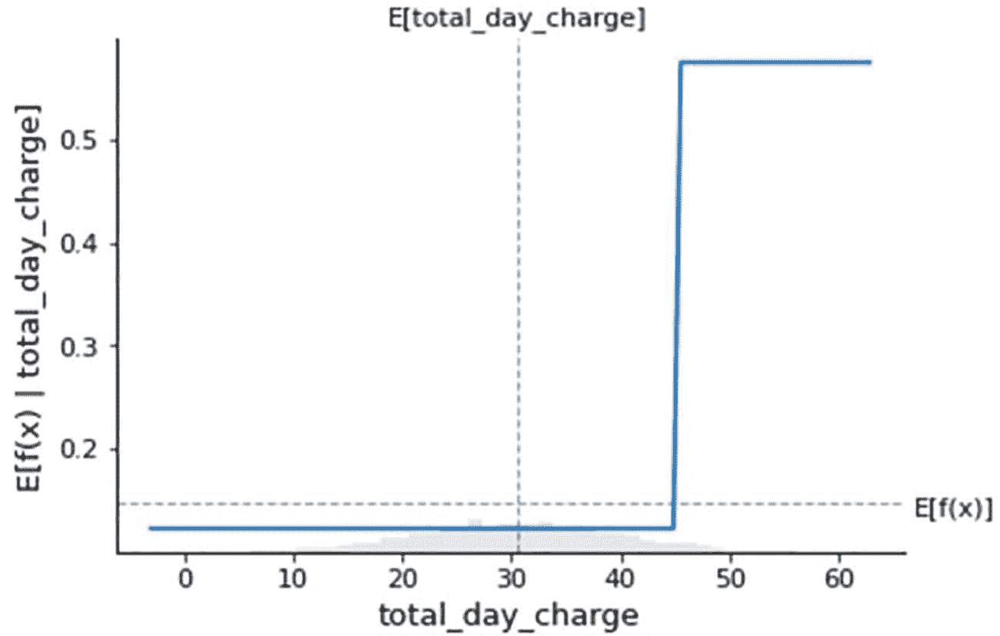

图 4-14

总日通话费用的 PDP 图

如果总日通话费用超过 45 美元，那么流失概率将会更高（图 4-14）。这是由于费用较高，用户可能会被迫选择其他服务提供商。

```
# 生成标准偏依赖图
sample_ind = 25
fig,ax = shap.partial_dependence_plot(
"total_eve_minutes", model_churn_proba, X, model_expected_value=True,
feature_expected_value=True, show=False, ice=False
)
```

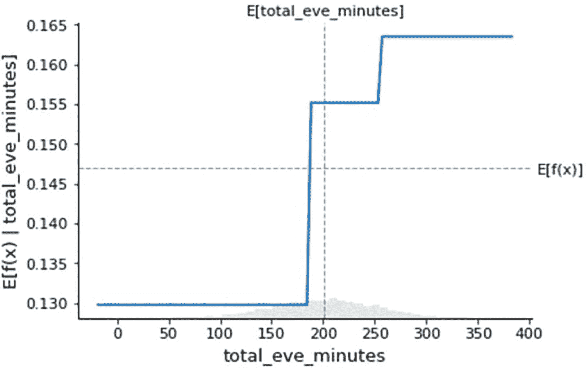

图 4-15

总晚间通话分钟数的 PDP 图

总晚间通话分钟数对流失概率有一定影响，但不会将用户从未流失状态转变为流失状态（图 4-15）。在总晚间通话分钟数不超过 180 分钟时，流失概率保持非常低且恒定，为 13%。当超过 180 分钟时，流失概率略微上升至 15.5%。在 250 分钟及之后，概率上升至 16.5%，但相对而言仍然很低。

```
# 生成标准偏依赖图
sample_ind = 25
fig,ax = shap.partial_dependence_plot(
"total_eve_calls", model_churn_proba, X, model_expected_value=True,
feature_expected_value=True, show=False, ice=False
)
```

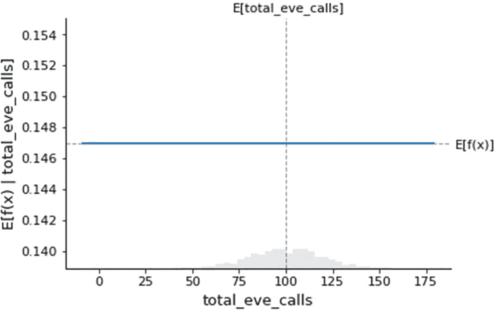

图 4-16

总晚间通话次数的 PDP 图

总晚间通话次数对流失概率没有影响，因为无论总晚间通话次数如何增加，概率都保持在平均值不变（图 4-16）。表 4-3 显示了每个特征的特征重要性得分。

表 4-3

每个特征的特征重要性得分


| 特征名称 | 得分 |
| --- | --- |
| **4** | `total_day_charge` | 0.306375 |
| **14** | `number_customer_service_calls` | 0.282235 |
| **2** | `total_day_minutes` | 0.223336 |
| **1** | `number_vmail_messages` | 0.105760 |
| **5** | `total_eve_minutes` | 0.082294 |
| **0** | `account_length` | 0.000000 |
| **3** | `total_day_calls` | 0.000000 |
| **6** | `total_eve_calls` | 0.000000 |
| **7** | `total_eve_charge` | 0.000000 |
| **8** | `total_night_minutes` | 0.000000 |
| **9** | `total_night_calls` | 0.000000 |
| **10** | `total_night_charge` | 0.000000 |
| **11** | `total_intl_minutes` | 0.000000 |
| **12** | `total_intl_calls` | 0.000000 |
| **13** | `total_intl_charge` | 0.000000 |
| **15** | `area_code_tr` | 0.000000 |

```
shap_values_churn.feature_names
temp_df = pd.DataFrame()
temp_df['Feature Name'] = pd.Series(X.columns)
temp_df['Score'] = pd.Series(dt2.feature_importances_.flatten())
temp_df.sort_values(by='Score',ascending=False)
```

在上图中，你看到了基于 SHAP 库的偏依赖图。同样的图也可以使用 `scikit-learn` 库的检查模块生成。

## 使用 Scikit-Learn 的 PDP

`scikit-learn` 模块套件中有一个新模块，可以帮助你生成偏依赖图。你可以使用 `scikit-learn` 库中的 `inspection` 模块。请参见图 4-17 至 4-22。

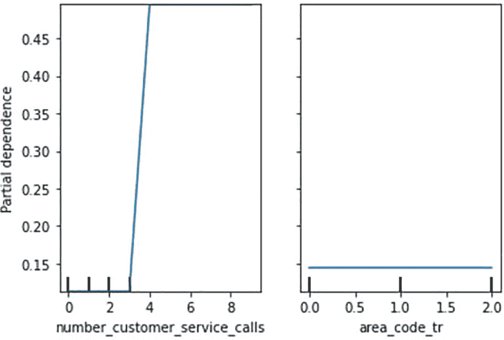

图 4-22

客户服务电话次数和区号的 PDP

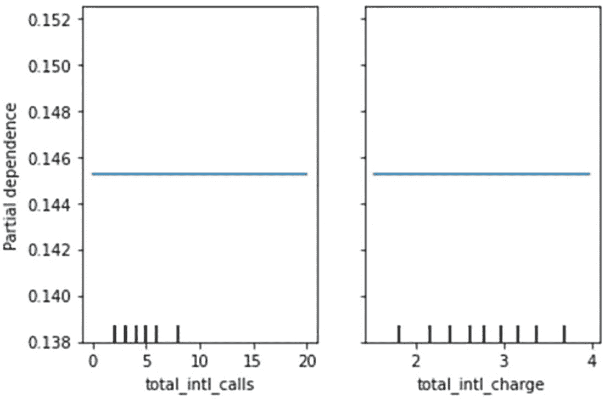

图 4-21

国际电话总次数和国际话费总额的 PDP

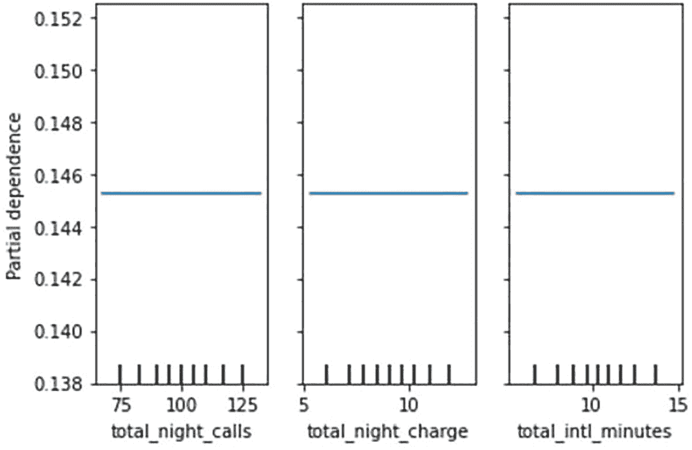

图 4-20

三个不影响流失概率的特征的 PDP

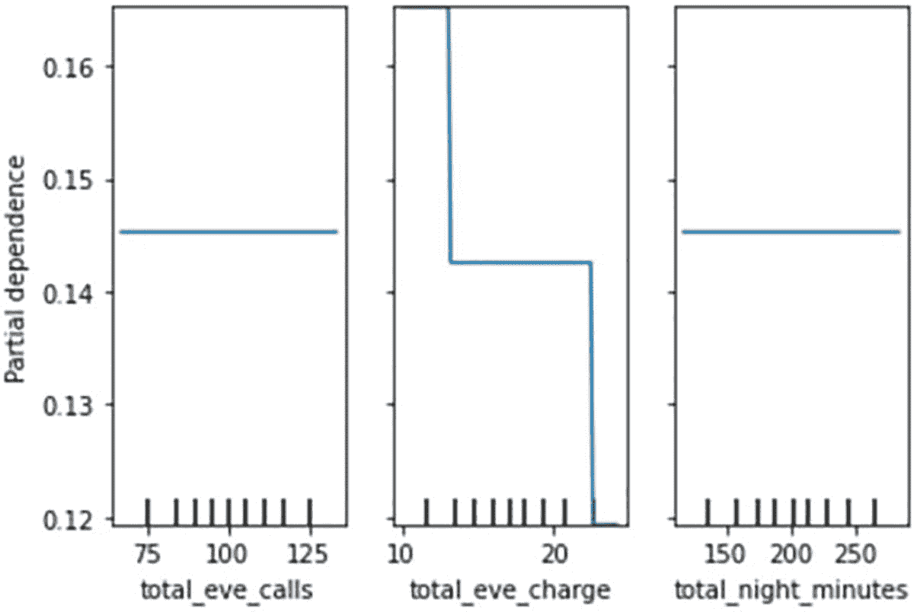

图 4-19

另外三个变量的 PDP

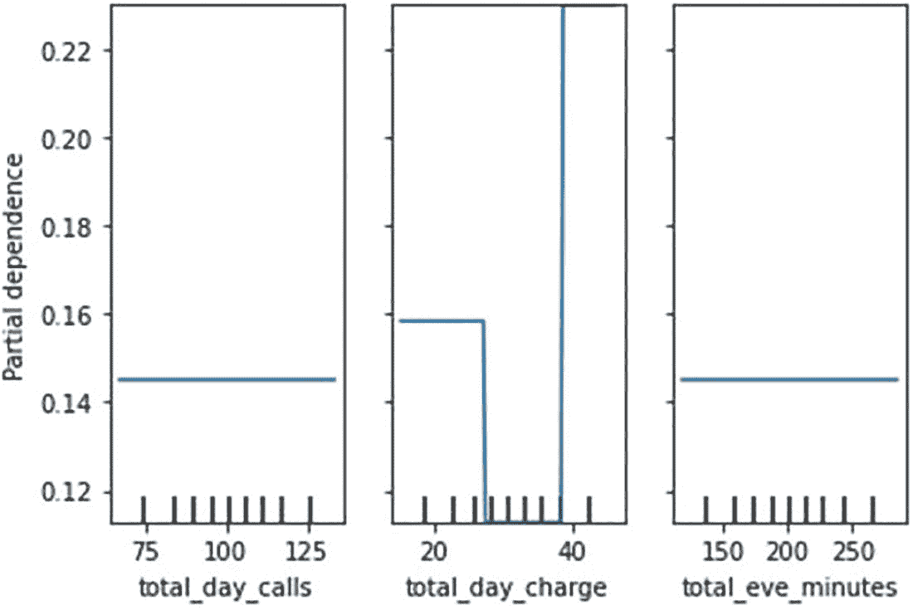

图 4-18

下一组三个特征的 PDP

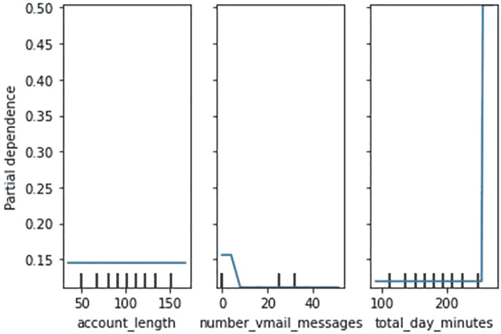

图 4-17

三个变量一起的 PDP

```
from sklearn.inspection import plot_partial_dependence
xtrain.columns
plot_partial_dependence(dt2, X, ['account_length', 'number_vmail_messages', 'total_day_minutes'])
```

```
plot_partial_dependence(dt2, X, [
'total_day_calls', 'total_day_charge', 'total_eve_minutes',
])
```

```
plot_partial_dependence(dt2, X, [
'total_eve_calls', 'total_eve_charge', 'total_night_minutes'])
```

```
plot_partial_dependence(dt2, X, [
'total_night_calls', 'total_night_charge', 'total_intl_minutes'])
```

```
plot_partial_dependence(dt2, X, [
'total_intl_calls', 'total_intl_charge'])
```

```
plot_partial_dependence(dt2,X, [
'number_customer_service_calls', 'area_code_tr'])
```

图 4-17 至 4-22 是通过 `scikit-learn` 库中的一个函数生成的，该函数产生的解释与 SHAP 库类似。其解读方式也类似。

## 非线性模型解释 – LIME

在流失预测过程中起重要作用的最重要特征包括 `total_day_charge`、`number_customer_service_calls`、`total_day_minutes`、`number_vmail_messages` 和 `total_eve_minutes`。其他特征不起作用，因此无关特征的偏依赖图是平行线。

你还可以利用 LIME Python 库中的一些函数来解释决策树模型所做的决策。

```
import lime
import lime.lime_tabular
explainer = lime.lime_tabular.LimeTabularExplainer(np.array(xtrain),
feature_names=list(xtrain.columns),
class_names=['target_churn_dum'],
verbose=True, mode='classification')
# this record is a no churn scenario
exp = explainer.explain_instance(xtest.iloc[0], dt2.predict_proba,
num_features=16)
exp.as_list()
pd.DataFrame(exp.as_list())
exp.show_in_notebook(show_table=True)
```

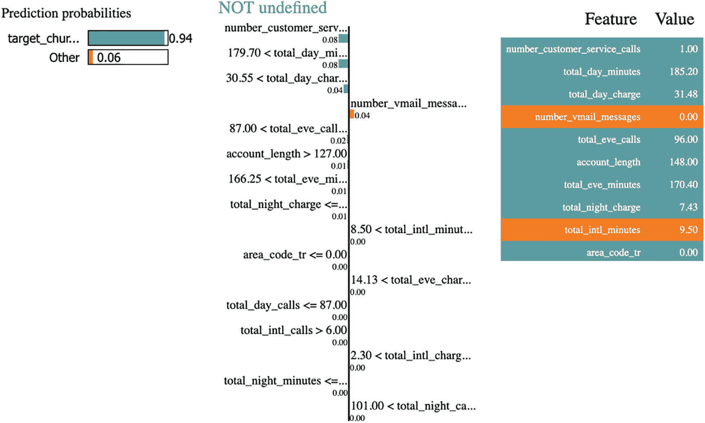

图 4-23

记录 0 的特征重要性以及对预测概率的正负贡献

图 4-23 显示了测试集中第一条记录 `xtest[0]` 的局部解释模型说明。图 4-23 中间的图表显示了两种颜色。蓝色表示对目标流失预测概率的贡献，橙色表示对另一类别（即非流失场景）的贡献。决策树将特征表示为一系列值，例如 `total_day_minutes` 在 179.90 到 216.20 之间，该特征对流失概率的贡献为 0.08（8%）。如果从模型中移除两个特征 `number_customer_service_calls <= 1.00` 和 `total_day_minutes > 179.90` 且 `<= 216.20`，那么目标流失预测概率将降低 0.16（16%），即 (0.94 – 0.08 -0.08) = 0.78（78%）。另一方面，如果移除 `number_vmail_messages <=0.00`，则目标流失概率将增加 4%（0.04）。图 4-23 中的第三个表格显示了每个特征对预测的贡献值。可以对更多记录进行类似的分析和解读，如图 4-24 至 4-26 所示。

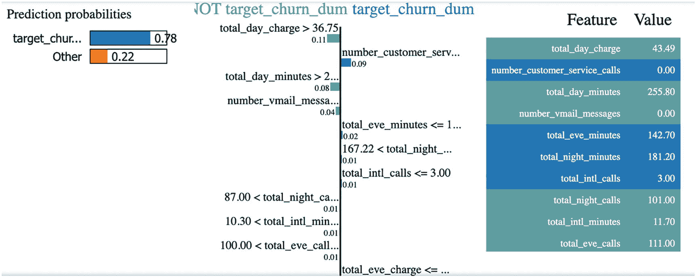

图 4-25

所有记录的特征重要性以及对预测概率的正负贡献

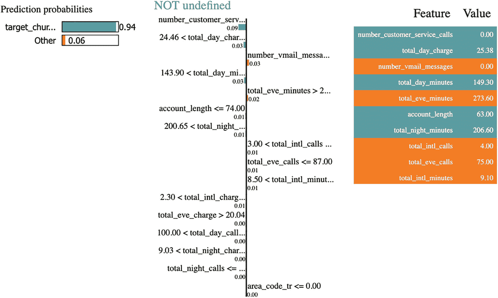

图 4-24

记录编号 20 的特征重要性以及对预测概率的正负贡献

```
# This is s churn scenario
exp = explainer.explain_instance(xtest.iloc[20], dt2.predict_proba, num_features=16)
exp.as_list()
exp.show_in_notebook(show_table=True)
```

```
xtest.iloc[20]
ytest.iloc[20]
dt2.predict(xtest)[20]
explainer = lime.lime_tabular.LimeTabularExplainer(np.array(xtrain),
feature_names=list(xtrain.columns),
class_names=['target_churn_dum'],
verbose=True, mode='classification')
# Code for SP-LIME
import warnings
from lime import submodular_pick
# SP-LIME returns exaplanations on a sample set to provide a non redundant global decision boundary of original model
sp_obj = submodular_pick.SubmodularPick(explainer, np.array(xtrain),
dt2.predict_proba,
num_features=14,
num_exps_desired=10)
```


## 非线性解释 – Skope-Rules

还有另一个名为 `Skope-rules` 的可解释性库，可用于从训练模型中生成规则，并且这些规则可用于对任何新数据集进行预测。

以下代码可用于安装基于 Python 的库。参数说明见表 4-4。

**表 4-4** Skope-Rules 参数说明

| 参数 | 说明 |
| --- | --- |
| `feature_names` | 每个特征的名称，用于以字符串格式返回规则 |
| `precision_min` | 规则被选中的最小精确度 |
| `recall_min` | 规则被选中的最小召回率 |
| `n_estimators` | 用于预测的基础估计器（规则）数量 |
| `max_depth_duplication` | 用于规则去重的决策树最大深度 |
| `max_depth` | 决策树的最大深度 |
| `max_samples` | 从 X 中抽取用于训练每棵决策树的样本数量，规则由此生成并筛选 |

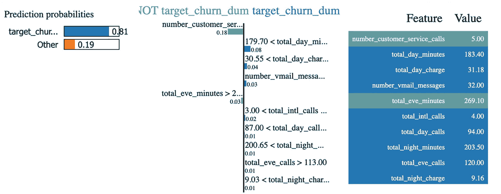

**图 4-26** 所有记录的特征重要性以及对预测概率的正负贡献

```
!pip install skope-rules
import six
import sys
sys.modules['sklearn.externals.six'] = six
import skrules
from skrules import SkopeRules
clf = SkopeRules(max_depth_duplication=2,
n_estimators=30,
precision_min=0.3,
recall_min=0.1,
feature_names=list(xtrain.columns))
clf
clf.fit(xtrain,ytrain)
print('以下是最精确的 5 条规则：')
for rule in clf.rules_[:5]:
print(rule[0])
```

使用 `clf.fit()` 方法可以训练决策树模型，并得出以下规则。可以使用 `precision` 和 `recall` 参数对规则进行筛选或整理。如果将阈值降低到较低水平，将会生成大量规则，这对用户毫无用处，因为误报规则会进入业务应用。较高的阈值会减少规则数量，只有最相关的规则才会被用于业务应用。

最精确的五条规则如下：

```
number_vmail_messages  249.70000457763672
number_vmail_messages  44.989999771118164 and total_eve_minutes > 145.39999389648438
number_customer_service_calls > 3.5 and total_day_minutes  245.0999984741211 and total_eve_minutes > 204.20000457763672
number_customer_service_calls > 3.5 and total_day_charge <= 30.65999984741211
clf.predict(xtest)
clf.predict_top_rules(xtest,5)
clf.score_top_rules(xtest)
```

`predict` 函数使用所有规则来预测目标流失类别：0 表示未流失，1 表示流失。

`predict_top_rules` 函数用于利用这五条规则来预测结果。5 是用于预测的规则数量。如果 `n_rules` 条性能最佳的规则中有一条被激活，则预测结果等于 1。对于每个观测值，该函数会根据所选规则判断其是否应被视为异常值（1 或 0）。

```
clf.decision_function(xtrain)
clf.decision_function(xtest)
```

`Score top rules` 表示基础分类器（规则）之间的排序。当实例被一条性能良好的规则检测到时，得分会很高。正分数代表异常值，零分数代表正常值。

`decision_function` 是输入样本的异常得分，计算方式为二元规则输出的加权和，权重为每条规则各自的精确度。对于输入样本的异常得分，得分越高，表示异常程度越高。正分数代表异常值，零分数代表正常值。

## 结论

在本章中，您学习了如何解释非线性模型，特别是决策树模型，而不是用于二分类的逻辑回归。类似地，决策树模型也可用于回归模型，并可扩展到多项分类。非线性模型是较易于解释的模型，每个人都通过简单的 if/then else 规则理解这些模型的工作原理。因此，人们对基于树的非线性模型有很高的信任度。在本章中，您从多个角度探讨了如何使用可解释 AI 库（如 LIME、SHAP 和 Skope-rules）为非线性模型创建视图。在下一章中，您将学习集成模型的模型可解释性。

