# 5. 集成模型的可解释性

集成模型是一组模型，其预测结果通过某种度量进行聚合，以生成最终预测。例如，可以开发一组基于树的模型来预测实值输出，如回归模型。所有树的预测结果取平均值作为最终输出。类似地，分类模型会生成各个类别的预测，然后采用投票规则。得票最多的类别作为最终输出。集成模型不仅难以解释，而且难以向最终用户说明。考虑一个场景：四棵树预测“是”，六棵树预测“否”；根据 6/4 的多数规则，我们将“否”作为最终答案。这里很难向最终用户解释为什么有些模型预测了“是”。因此，解释集成模型非常重要。在本章中，您将主要使用 SHAP 来解释集成模型的预测。

## 集成模型

集成模型是最复杂的模型集合，需要详细解释，因为输出是多个预测结果的组合。*集成* 简单来说就是*分组*。对于集成模型，重要的是如何解释预测结果、实际产生预测的是哪个模型变体，以及如何在最终预测过程中解读特征的边际贡献。

决策树模型的优点在于它考虑了数据集中潜在的非线性关系。在生成模型预测时，变量交互作用会发挥作用。然而，决策树模型的局限性在于它容易产生偏差，因为强大或更强的特征会参与树的构建过程，而弱特征由于缺乏预测能力而无法进入树的分支过程。因此，模型会偏向于数据集中少数几个选定的、更强的特征。这有时也会导致模型过拟合。为了平衡强特征的影响，规范特征进入基于树的模型的过程非常重要。如果在模型创建步骤中排除强特征，只包含弱特征来创建树，您仍然能够生成预测，但这同样会是一个有偏模型。因此，只有在树构建过程中同时使用强特征和弱特征的组合，才能处理模型偏差并同时控制过拟合。这种组合可以纯粹基于自助法进行，并且可以充分增加树的数量以平均化预测结果。


### 集成模型的类型

集成模型分为三种类型：装袋模型（也称为自助聚合模型）、提升模型和堆叠模型（图 5-1）。堆叠模型又可分为两种类型：同质组堆叠和异质变体模型堆叠。同质组堆叠涉及同质模型类型，例如仅包含基于树的模型，并将每个模型的输出与其他模型进行对比。异质堆叠模型则意味着将基于树的模型与非基于树的模型进行对比，并组合它们的预测结果。堆叠模型的可解释性并不困难，因为我们可以识别特定模型并解释其预测和参数；然而，解释装袋模型和提升模型则有些棘手。随机森林模型是装袋模型的一个例子，其中生长了许多树，最终将预测结果组合起来得出最终结论。提升模型则采用一个基础模型，从该模型的结果中学习，并尝试以迭代方式改进模型。


图 5-1

三种类型的集成模型

## 为什么使用集成模型？

当数据集中特征总数增加，例如超过 50 个时，由于以下原因，单个决策树无法容纳：

-   强大的特征将在决策树构建过程中占据分支创建步骤；因此，弱特征将不会参与树的形成。
-   在单个决策树场景中，模型会变得更具偏差，因为少数几个强大的特征主导了预测。
-   由于少数几个强大的特征，超参数的选择受到限制。
-   当你考虑到在 100 多个特征中，20% 的强大特征驱动着预测时，这个问题会变得更大。剩余的 80% 的弱特征未被利用。
-   由于是单棵树，并非所有特征都能在预测中获得公平的机会。
-   在单个决策树场景中，偏差缓解主要通过剪枝来完成。

为了解决单个决策树模型的上述局限性，需要有一组树，因此得名*树集成*。装袋、提升和堆叠模型既可以应用于基于回归的问题，也可以应用于基于分类的问题。图 5-2 提供了区分这三种集成模型的图示。

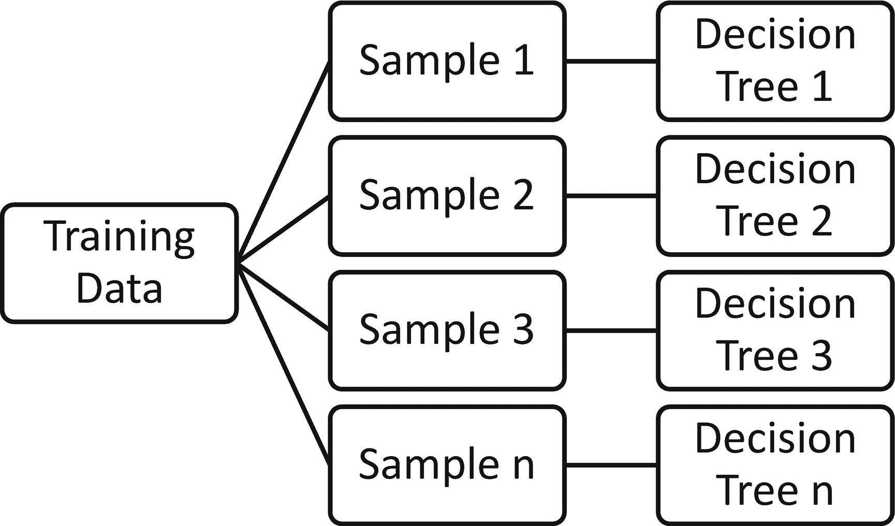

图 5-2

装袋模型

装袋（也称为自助聚合）从训练数据集中抽取不同的特征和记录样本，并尝试训练一个决策树。在图 5-2 中，你可以开发 `n` 棵树，其中 `n` 可以是 100、500 或 1000。当你增加树的数量时，如果训练数据集中的特征更多，模型的准确率就会上升。如果你的特征和样本较少，并且你增加树的数量，那么你将能够获得更高的准确率，但在此过程中会产生大量重复的树。它们是重复的树，因为每棵树中都出现了相同的特征集。装袋本质上是并行的，因为你可以为分类和回归任务并行训练多棵树。因此，根据行业实践，当训练数据集中有超过 50 个特征和超过 50,000 条记录时，建议使用集成方法。

另一方面，提升是一个顺序过程，首先训练一个基础分类器来分类或预测目标列。然后，在分类场景中分离出正确预测的案例，在基于回归的场景中拾取误差分布，以便在相同的配置或设置下重新训练模型。这个过程会重复多次，直到没有进一步提高准确率的可能性。这本质上是顺序的，因为第二个模型基于第一个模型的结果工作。这是一种获得集成模型的强大技术。该过程在图 5-3 中进行了说明。

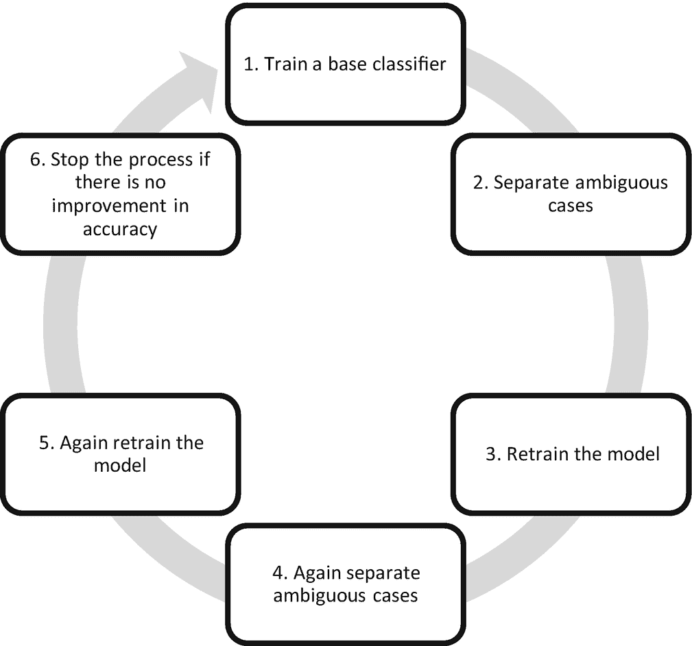

图 5-3

提升模型训练过程

集成模型的第三种变体是堆叠。堆叠模型预测有两种方式：同质组堆叠和异质组堆叠。参见表 5-1。

表 5-1

回归问题同质组堆叠

| | 模型 | |
| --- | --- | --- |
| **测试数据** | DT | RF | 自适应提升 | 梯度提升 | XGBoost | 预测 |
| --- | --- | --- | --- | --- | --- | --- |
| **1** | 25.3 | 25.2 | 24.3 | 26.1 | 24.5 | 25.08 |
| **2** | 12.5 | 13.21 | 14.1 | 11.9 | 12.2 | 12.782 |
| **3** | 17.8 | 15.3 | 16.3 | 16.7 | 17.1 | 16.64 |

最后一列“预测”是不同模型预测值的平均值。你只考虑了测试数据集中的三条记录。现在请看表 5-2。

表 5-2

分类问题同质组堆叠

| | 模型 | |
| --- | --- | --- |
| **数据** | DT | RF | 自适应提升 | 梯度提升 | XGBoost | 预测 |
| --- | --- | --- | --- | --- | --- | --- |
| **1** | 是 | 否 | 是 | 是 | 是 | 是 |
| **2** | 否 | 否 | 否 | 是 | 否 | 否 |
| **3** | 是 | 是 | 否 | 否 | 否 | 否 |

在第一行中，有四个“是”和一个“否”，因此最终预测为“是”。同样，在第二行和第三行中，最终预测由多数投票决定。在异质堆叠场景中，不仅基于树的模型可以参与，其他模型也可以，例如逻辑回归模型、支持向量机模型等。在表 5-3 中，你可以看到回归模型异质组堆叠，在表 5-4 中，你可以看到带有异质组堆叠的分类模型。

表 5-4

分类问题异质堆叠

| | 模型 | | | |
| --- | --- | --- | --- | --- |
| **数据** | DT | RF | 自适应提升 | 梯度提升 | XGBoost | SVM | LR | 预测 |
| --- | --- | --- | --- | --- | --- | --- | --- | --- |
| **1** | 是 | 否 | 是 | 是 | 是 | 否 | 否 | 是 |
| **2** | 否 | 否 | 否 | 是 | 否 | 是 | 是 | 否 |
| **3** | 是 | 是 | 否 | 否 | 否 | 否 | 是 | 否 |

表 5-3

回归问题异质组堆叠

| | 模型 | | | |
| --- | --- | --- | --- | --- |
| **数据** | DT | RF | 自适应提升 | 梯度提升 | XGBoost | SVM | LR | 预测 |
| --- | --- | --- | --- | --- | --- | --- | --- | --- |
| **1** | 25.3 | 25.2 | 24.3 | 26.1 | 24.5 | 24.9 | 24.6 | 24.98571429 |
| **2** | 12.5 | 13.21 | 14.1 | 11.9 | 12.2 | 12.6 | 11.9 | 12.63 |
| **3** | 17.8 | 15.3 | 16.3 | 16.7 | 17.1 | 16.8 | 17.1 | 16.72857143 |


## 使用 SHAP 进行集成模型分析

你将考虑两个不同的数据集。你将使用流行的波士顿房价数据集来解释回归用例场景中的模型预测，并使用成人数据集来解释分类场景。以下是波士顿房价数据集中的变量：

- `CRIM`：城镇人均犯罪率
- `ZN`：占地面积超过 25,000 平方英尺的住宅用地比例
- `INDUS`：每个城镇非零售商业用地的比例
- `CHAS`：查尔斯河虚拟变量（若地块临河则为 1；否则为 0）
- `NOX`：一氧化氮浓度（每千万分之一）
- `RM`：每栋住宅的平均房间数
- `AGE`：1940 年之前建造的自住单位比例
- `DIS`：到波士顿五个就业中心的加权距离
- `RAD`：径向高速公路可达性指数
- `TAX`：每 10,000 美元的全额财产税率
- `PTRATIO`：城镇师生比
- `B`：1000(Bk - 0.63)²，其中 Bk 是城镇黑人比例
- `LSTAT`：人口中较低地位阶层的百分比
- `MEDV`：自住房屋的中位数价值（单位：千美元）

```
import pandas as pd
import shap
import sklearn
### 波士顿房价预测
X,y = shap.datasets.boston()
X100 = shap.utils.sample(X, 1000) # 1000 个实例用作背景分布
# 一个简单的线性模型
model = sklearn.linear_model.LinearRegression()
model.fit(X, y)
```

波士顿房价数据集现在是 SHAP 库的一部分。基础模型的计算使用线性回归模型进行，这样你就可以在该数据集上执行集成模型并比较结果。

```
print("模型系数:\n")
for i in range(X.shape[1]):
print(X.columns[i], "=", model.coef_[i].round(4))
```

**表 5-5** 线性回归模型的模型系数

| 模型系数： |
| CRIM = -0.108 |
| ZN = 0.0464 |
| INDUS = 0.0206 |
| CHAS = 2.6867 |
| NOX = -17.7666 |
| RM = 3.8099 |
| AGE = 0.0007 |
| DIS = -1.4756 |
| RAD = 0.306 |
| TAX = -0.0123 |
| PTRATIO = -0.9527 |
| B = 0.0093 |
| LSTAT = -0.5248 |

基础模型的系数是起点（表 5-5）。随后，你将查看复杂的集成模型，并将系数与基础线性模型进行比较。此外，你还可以比较解释结果。预测效果越好，可解释性就越强。

```
shap.plots.partial_dependence(
"RM", model.predict, X100, ice=False,
model_expected_value=True, feature_expected_value=True
)
```

图 5-4 中显示的水平虚线`E[f(x)]`实际上就是房价中位数的预测平均值。

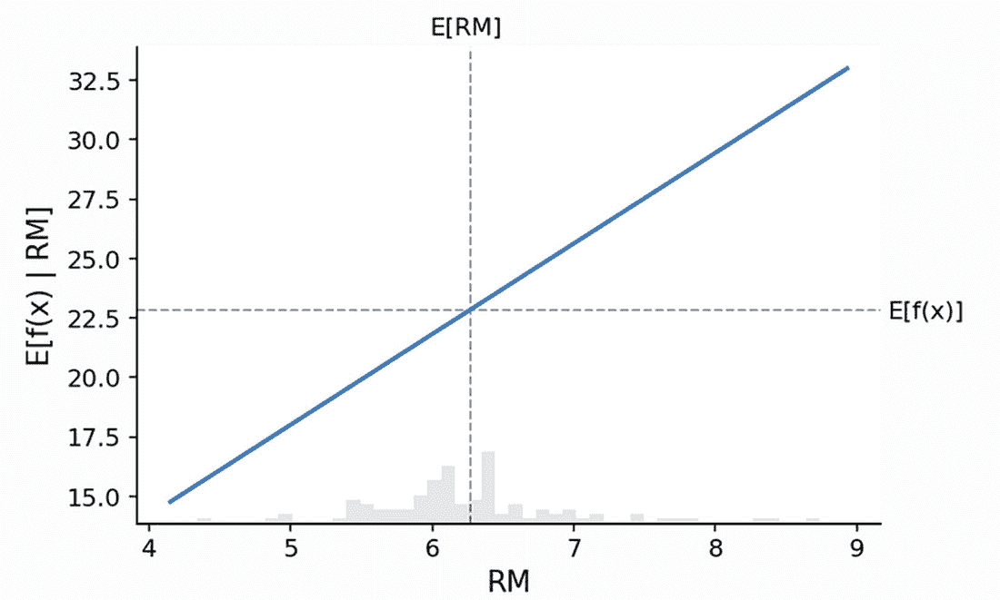

**图 5-4** 使用`X100`子集样本绘制的`RM`与预测房价的 PDP 图

如果取预测结果的平均值，则为 22.84。如图 5-4 所示，`RM`特征与模型的预测结果之间存在线性关系。

```
### 计算线性模型的 SHAP 值
explainer = shap.Explainer(model.predict, X100)
shap_values = explainer(X)
# 绘制标准的部分依赖图
sample_ind = 18
shap.partial_dependence_plot(
"RM", model.predict, X100, model_expected_value=True,
feature_expected_value=True, ice=False,
shap_values=shap_values[sample_ind:sample_ind+1,:]
)
```

图 5-5 显示，`RM`特征对目标列预测值的边际贡献呈线性关系，如向上倾斜的直线所示。红线表示预测值与平均预测值之间的差异。SHAP 值等于预测值。

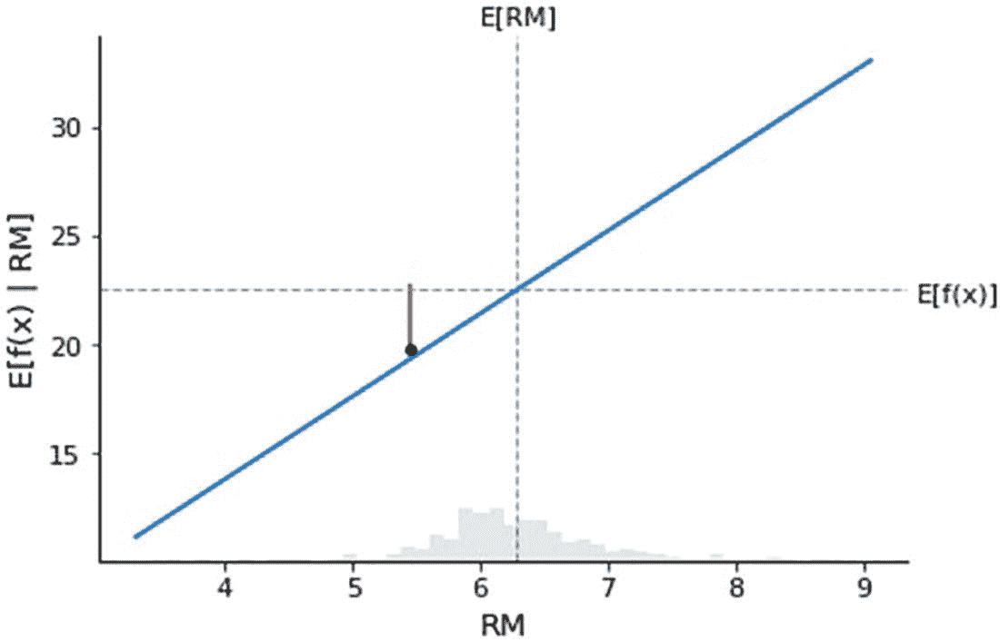

**图 5-5** 数据集中第 18 行叠加在 PDP 图上

```
X100 = shap.utils.sample(X,100)
model.predict(X100).mean()
model.predict(X100).min()
model.predict(X100).max()
shap_values[18:19,:]
X[18:19]
model.predict(X[18:19])
shap_values[18:19,:].values.sum() + shap_values[18:19,:].base_values
```

因此，第 18 条记录的预测结果为 16.178，而来自不同特征的 SHAP 值之和加上基础值（即平均预测值）等于预测值 16.178。

```
shap.plots.scatter(shap_values[:,"RM"])
```

在图 5-6 中，关系是线性的，因为 SHAP 值是使用线性模型作为解释器生成的。如果你切换到非线性模型，可以预期这条线将是非线性的。

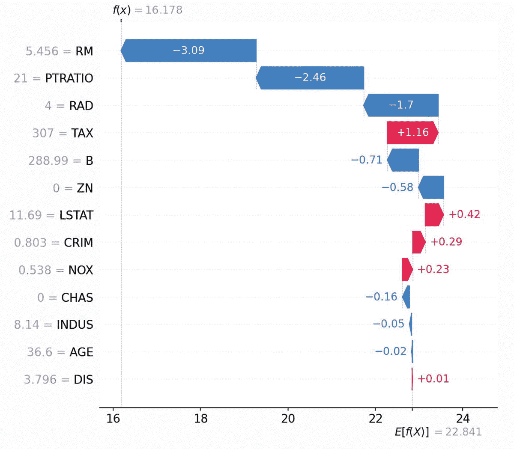

**图 5-7** 预测结果与 SHAP 值之间的关系

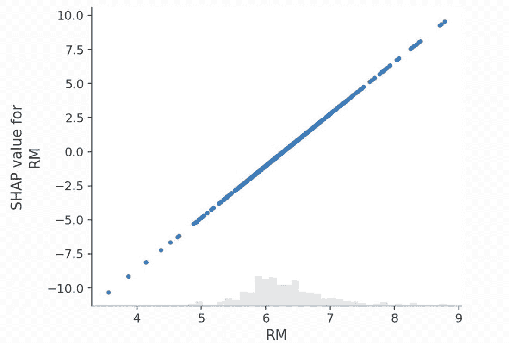

**图 5-6** `RM`与`RM`的 SHAP 值之间的线性关系

```
# waterfall_plot 展示了如何从 shap_values.base_values 得到 model.predict(X)[sample_ind]
shap.plots.waterfall(shap_values[sample_ind], max_display=14)
```

在图 5-7 中，水平轴显示预测结果的平均值（22.841），垂直轴显示来自不同特征的 SHAP 值。数据集中每个特征的假定值以灰色显示，负 SHAP 值以蓝色显示，正 SHAP 值以红色显示。垂直轴还显示了第 18 条记录的预测结果，即 16.178。


### 使用可解释的增强模型

在本节中，你将使用广义加性模型（GAM）来预测房价。你可以使用 SHAP 库来解释拟合后的模型。广义加性模型可以使用 `interpret` Python 库进行训练，然后将训练好的模型对象传递给 SHAP 模型，以生成对增强模型的解释。

`interpret` 库可以通过三种方式安装：

```
!pip install interpret-core
```

这是使用 `pip install` 过程，没有任何依赖项。

```
conda install -c interpretml interpret-core
```

这是使用 anaconda 发行版。你可以从 conda 环境的终端进行安装。

```
git clone https://github.com/interpretml/interpret.git && cd interpret/scripts && make install-core
```

这是直接从 GitHub 源码安装。

`interpret` Python 库支持两种算法：

- **玻璃箱模型**：这些模型旨在更具可解释性，使用 `scikit-learn` 框架，同时保持与最先进的 `sklearn` 库相同的精度水平。它们支持四种不同类型的模型：线性模型、决策树、决策规则和基于增强的模型。
- **黑盒解释器**：这些解释器旨在提供关于模型行为及模型预测的近似解释。当机器学习模型的任何组件都不可解释时，这些算法变体将非常有用。它们支持 Shapley 解释、LIME 解释、部分依赖图和 Morris 敏感性分析。

```
# 对数据拟合 GAM 模型
import interpret.glassbox
model_ebm = interpret.glassbox.ExplainableBoostingRegressor()
model_ebm.fit(X, y)
```

首先，你必须从 `interpret` 导入 `glassbox` 模块，初始化可解释增强回归器，并拟合模型。模型对象是 `model_ebm`。

```
# 使用 SHAP 解释 GAM 模型
explainer_ebm = shap.Explainer(model_ebm.predict, X100)
shap_values_ebm = explainer_ebm(X)
```

你将采样训练数据集，并取 100 个样本，为使用 SHAP 库生成解释创建背景。在 SHAP 解释器中，你使用 `model_ebm.predict`，并取 100 个样本生成解释。

```
# 制作一个标准的偏依赖图，并叠加单个 SHAP 值
fig,ax = shap.partial_dependence_plot(
"RM", model_ebm.predict, X, model_expected_value=True,
feature_expected_value=True, show=False, ice=False,
shap_values=shap_values_ebm[sample_ind:sample_ind+1,:]
)
```

图 5-8 展示了基于增强的模型。你可以看到一个分阶段的非线性曲线，以及 RM 值与预测目标列（即房价平均值）之间的非线性关系。这里再次解释的是同一个第 18 条记录，如红色直线所示。

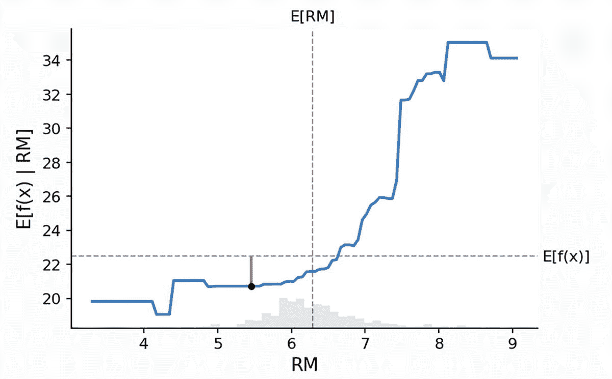

**图 5-8** RM 特征的增强模型 PDP 图

```
shap.plots.scatter(shap_values_ebm[:,"RM"])
```

在图 5-9 中，关系显示为一条非线性曲线。在初始阶段，随着 RM 的增加，预测值增加不多，但在某个阶段之后，随着 RM 值的增加，RM 的 SHAP 值也呈指数级增长。另请参见图 5-10。

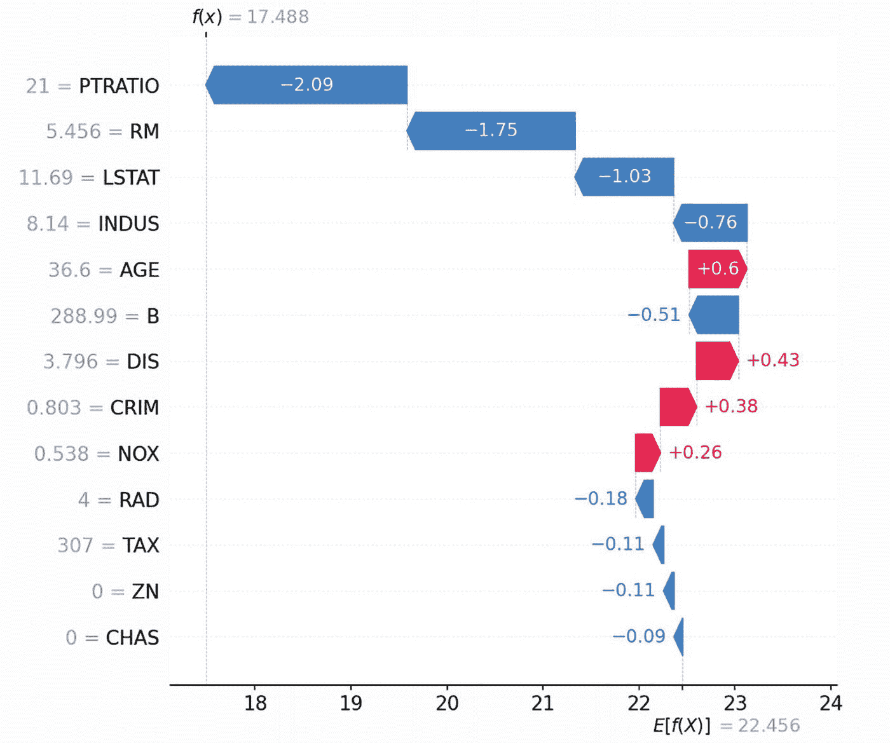

**图 5-10** 同一组变量的瀑布图

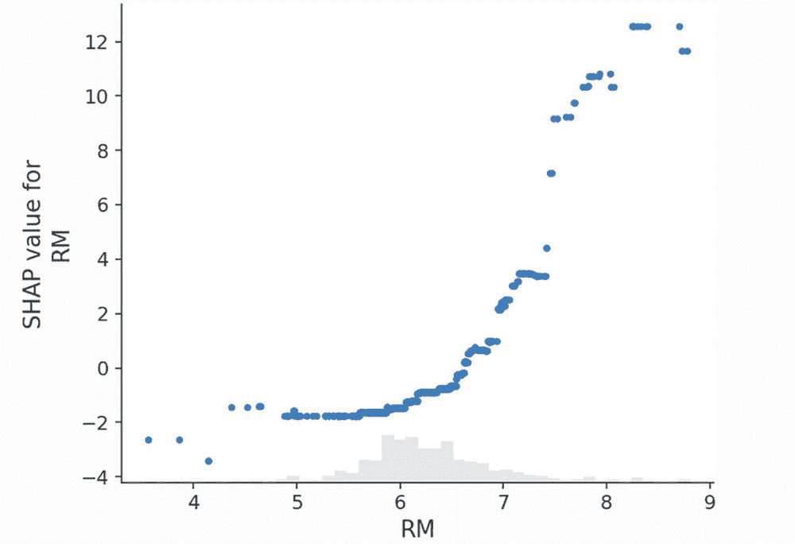

**图 5-9** RM 与 RM 的 SHAP 值

```
# waterfall_plot 展示了如何从 explainer.expected_value 得到 model.predict(X)[sample_ind]
shap.plots.waterfall(shap_values_ebm[sample_ind], max_display=14)
```

```
# waterfall_plot 展示了如何从 explainer.expected_value 得到 model.predict(X)[sample_ind]
shap.plots.beeswarm(shap_values_ebm, max_display=14)
```

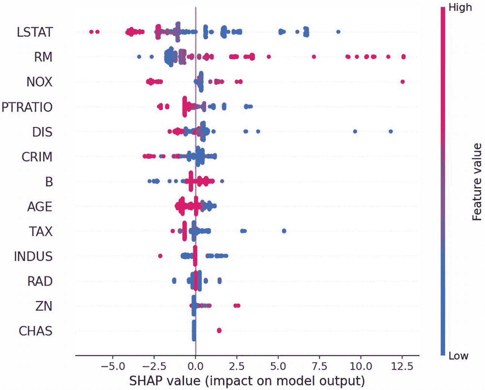

**图 5-11** 特征值与 SHAP 值

图 5-11 是 SHAP 值和特征值的另一种可视化。

```
# 训练 XGBoost 模型
import xgboost
model_xgb = xgboost.XGBRegressor(n_estimators=100, max_depth=2).fit(X, y)
# 使用 SHAP 解释 GAM 模型
explainer_xgb = shap.Explainer(model_xgb, X100)
shap_values_xgb = explainer_xgb(X)
# 制作一个标准的偏依赖图，并叠加单个 SHAP 值
fig,ax = shap.partial_dependence_plot(
"RM", model_xgb.predict, X, model_expected_value=True,
feature_expected_value=True, show=False, ice=False,
shap_values=shap_values_ebm[sample_ind:sample_ind+1,:]
)
```

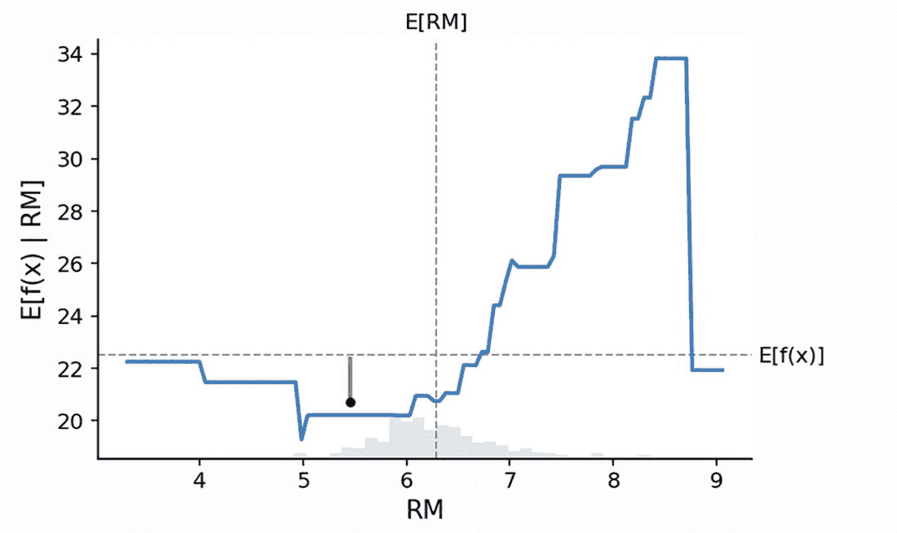

**图 5-12** RM 的 PDP 图与提取的 SHAP 值

在图 5-12 中，使用极端梯度提升回归模型来解释集成模型，这里你也可以看到存在非线性关系。

```
shap.plots.scatter(shap_values_xgb[:,"RM"])
```

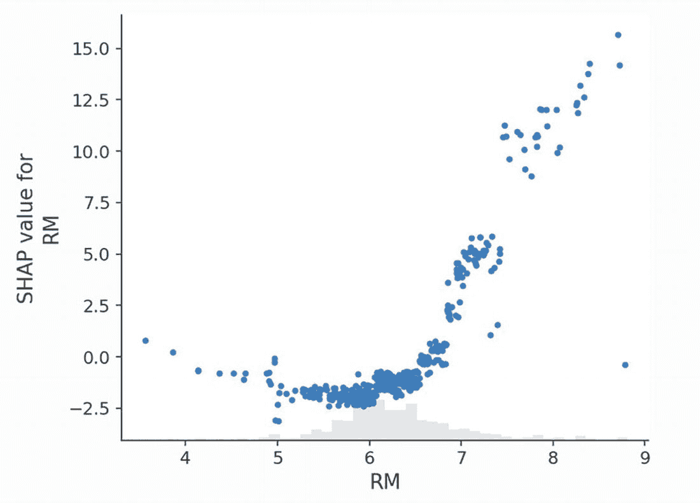

**图 5-13** RM 与 RM 的 SHAP 值散点图

在图 5-13 中，有一条曲线显示了 RM 与 RM 的 SHAP 值之间的非线性关联。

```
shap.plots.scatter(shap_values_xgb[:,"RM"], color=shap_values)
```

图 5-14 显示了相同的非线性关系，并额外叠加了 TAX 特征，这表明 RM 值越高，TAX 分量越高，反之亦然。

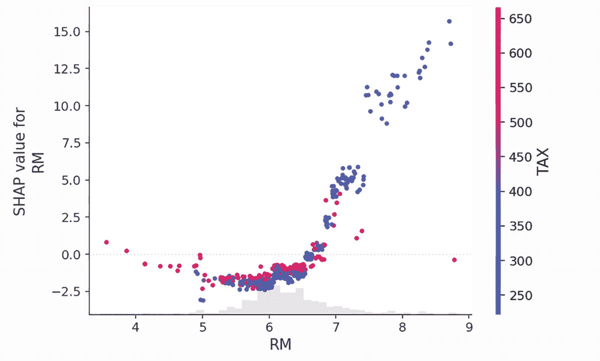

**图 5-14** RM 与 RM 的 SHAP 值可以通过第三个维度（即颜色）来展示


### 集成分类模型：SHAP

对于回归模型，你已经了解了 SHAP 特征和特征重要性，两者都包含针对少数特征的偏依赖图。现在，让我们来看一个常见且流行的收入普查分类数据集（通常称为成人数据集）。它之所以流行，是因为它易于理解、贴近生活，并且几乎出现在所有机器学习示例代码中。

```
# 一个经典的成人普查数据集
X_adult, y_adult = shap.datasets.adult()
# 一个简单的线性逻辑模型
model_adult = sklearn.linear_model.LogisticRegression(max_iter=10000)
model_adult.fit(X_adult, y_adult)
```

在上述脚本中，加载了已属于 SHAP 库一部分的普查收入数据集。由于这是一个二分类问题，因此训练了一个逻辑回归模型。最后，通过模型拟合过程创建了一个训练好的模型。

```
def model_adult_proba(x):
    return model_adult.predict_proba(x)[:,1]
def model_adult_log_odds(x):
    p = model_adult.predict_log_proba(x)
    return p[:,1] - p[:,0]
```

对于使用普查收入数据集的分类示例，目标列有两个标签：年收入超过 5 万美元的人和年收入低于 5 万美元的人。这是一个二分类模型，作为基线，你可以使用逻辑回归模型来展示作为 SHAP 值线性函数的 PDP。然后，你可以使用集成模型来比较 PDP，并展示函数如何变为非线性。集成模型捕捉了这种非线性和复杂的关系。名为 `model_proba` 和 `model_log_odds` 的两个函数分别提供了两个类别的概率值和对数几率比。

```
# 制作一个标准的偏依赖图
sample_ind = 18
fig, ax = shap.partial_dependence_plot(
    "Capital Gain", model_adult_proba, X_adult, model_expected_value=True,
    feature_expected_value=True, show=False, ice=False
)
```

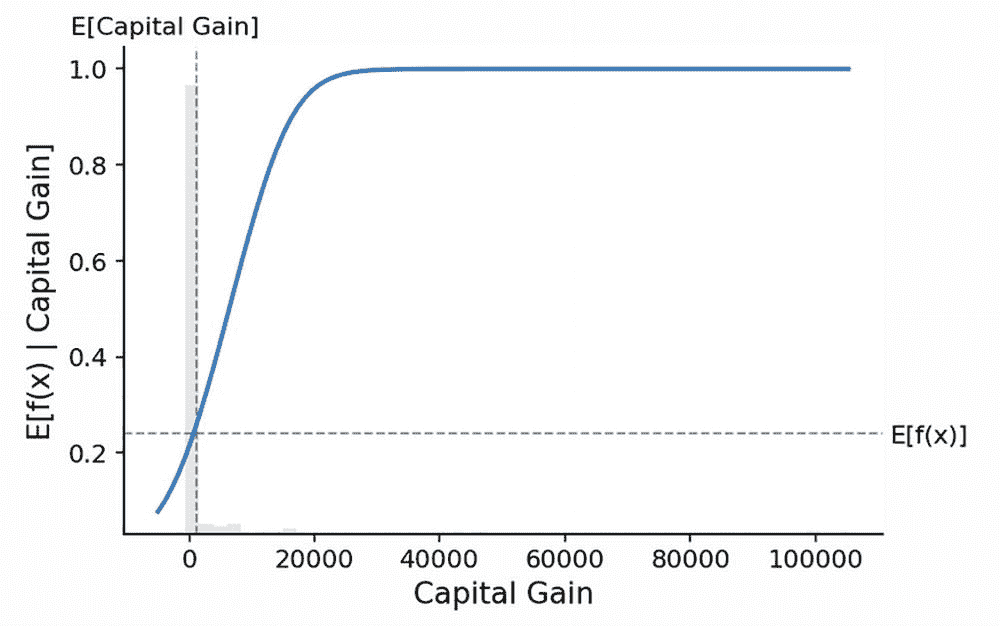

图 5-15

资本收益与收入低于 5 万美元概率之间的 PDP

图 5-15 的 x 轴显示资本收益变量，y 轴显示收入低于 5 万美元的预测概率。概率值范围从 0.05 到 0.99，之后变得平坦，接近 100% 但并非恰好 100%。这里的解释是，当资本收益金额超过 2 万美元时，它对预测概率值没有影响。在 2 万美元以内，随着资本收益的增加，预测概率也会增加。

```
### 计算线性模型的 SHAP 值
background_adult = shap.maskers.Independent(X_adult, max_samples=100)
explainer = shap.Explainer(model_adult_proba, background_adult)
shap_values_adult = explainer(X_adult[:1000])
shap.plots.scatter(shap_values_adult[:,"Age"])
```

图 5-16 显示了线性关系，但数据点的分散程度存在变化，这表明可能存在非线性，并且线性模型无法正确捕捉这种非线性。因此，需要使用集成模型。

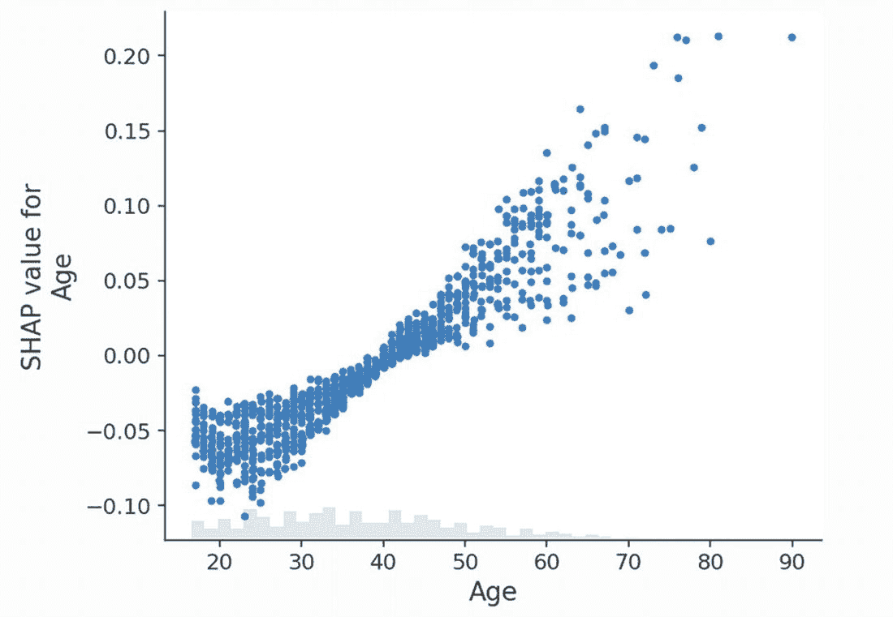

图 5-16

线性模型中年龄与年龄 SHAP 值的散点图

```
### 计算线性模型的 SHAP 值
explainer_log_odds = shap.Explainer(model_adult_log_odds, background_adult)
shap_values_adult_log_odds = explainer_log_odds(X_adult[:1000])
shap.plots.scatter(shap_values_adult_log_odds[:,"Age"])
# 制作一个标准的偏依赖图
sample_ind = 18
fig, ax = shap.partial_dependence_plot(
    "Age", model_adult_log_odds, X_adult, model_expected_value=True,
    feature_expected_value=True, show=False, ice=False
)
# 训练 XGBoost 模型
model = xgboost.XGBClassifier(n_estimators=100, max_depth=2).fit(X_adult, y_adult)
# 计算 SHAP 值
explainer = shap.Explainer(model, background_adult)
shap_values = explainer(X_adult)
# 设置用于绘图的数据显示版本（包含字符串值）
shap_values.display_data = shap.datasets.adult(display=True)[0].values
```

现在让我们看看极端梯度提升分类器模型。作为一种提升模型，它提高了分类器的准确性，同时提供了对预测结果的解释。

```
shap.plots.bar(shap_values)
```

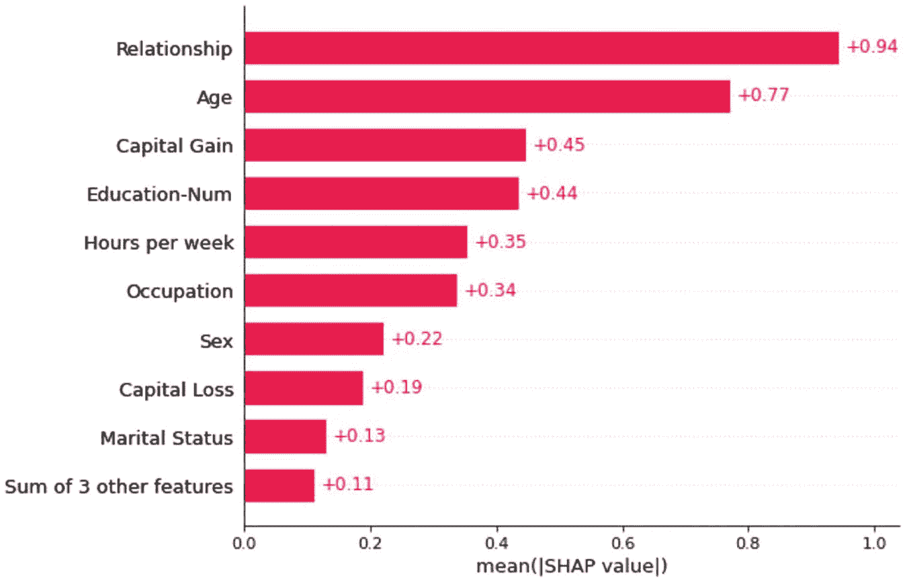

图 5-17

用于特征排序的平均绝对 SHAP 值

在图 5-17 中，关系变量显示出最高的平均绝对 SHAP 值，这反映了该变量在预测目标列类别方面的重要性。第二重要的变量是年龄，然后是资本收益，依此类推。

```
shap.plots.bar(shap_values.abs.max(0))
```

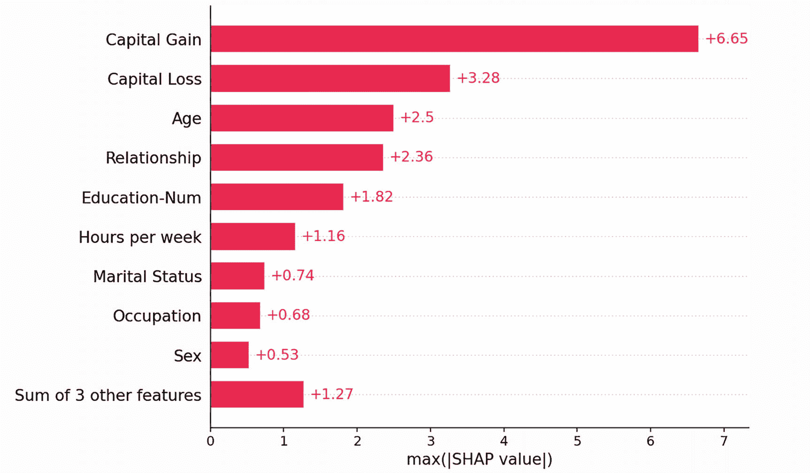

图 5-18

不同特征的绝对 SHAP 值最大值

在图 5-18 中，资本收益特征具有最高的 SHAP 值，因此这可能是一个异常值。同样，资本损失也可能是一个异常值。这一点将在图 5-19 中得到澄清。

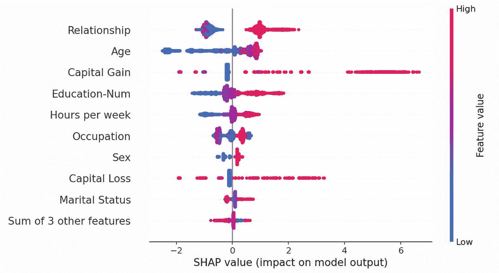

图 5-19

SHAP 值与特征值的关系图

在图 5-19 中，SHAP 值显示了特征值如何影响模型输出。蓝色点表示低特征值，红色点表示高特征值。

```
shap.plots.beeswarm(shap_values)
```

```
shap.plots.beeswarm(shap_values.abs, color="shap_red")
```

在图 5-20 中，你看不到负的 SHAP 值，并且资本收益和资本损失这两个特征显示出 SHAP 值有很大的变化，这意味着这两个特征实际值的变化可能导致不一致的预测。

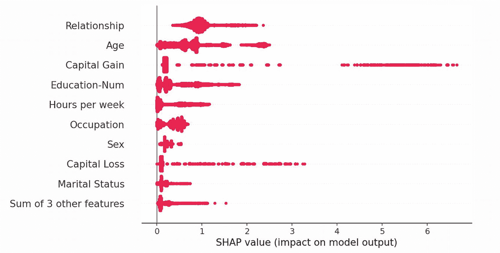

图 5-20

SHAP 的绝对值

在图 5-21 中，让我们考虑关系特征。它在第 430 个实例之前具有较高的 SHAP 分数。之后，SHAP 值变为负值，直到第 580 个实例，并持续到第 610 个实例。此后，关系特征的所有实例都产生负的 SHAP 值。该图显示了训练数据集中不同实例的 SHAP 值变化。

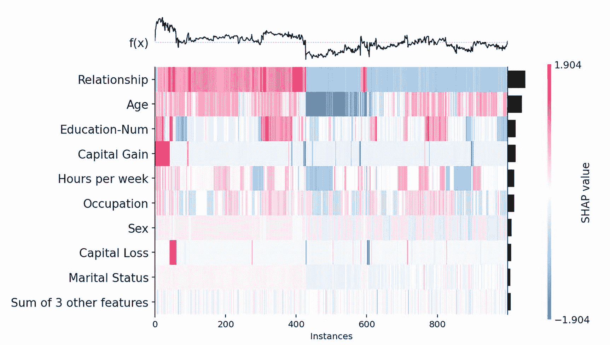

图 5-21

按实例和 SHAP 值显示的特征值变化

```
shap.plots.heatmap(shap_values[:1000])
```

图 5-22 解释了年龄变量与年龄变量 SHAP 分数之间的严格非线性关系。这种非线性是由极端梯度提升分类器模型产生的。


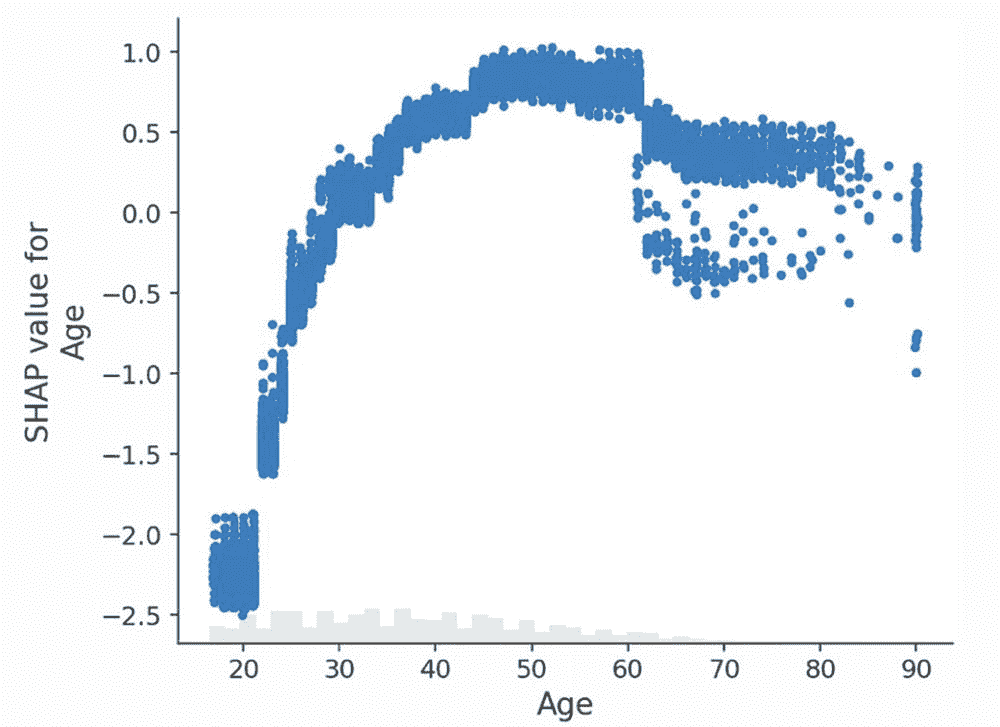

**图 5-22** – 年龄与年龄的 SHAP 值

```
shap.plots.scatter(shap_values[:,"Age"])
```

```
shap.plots.scatter(shap_values[:,"Age"], color=shap_values)
```

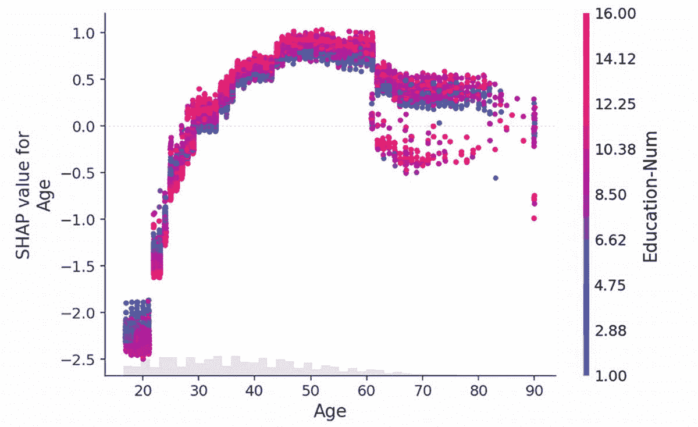

**图 5-23** – 年龄与年龄的 SHAP 值（叠加教育年限）

在图 5-23 中，年龄和教育年限遵循与年龄的 SHAP 值相似的模式。

```
shap.plots.scatter(shap_values[:,"Age"], color=shap_values[:,"Capital Gain"])
```

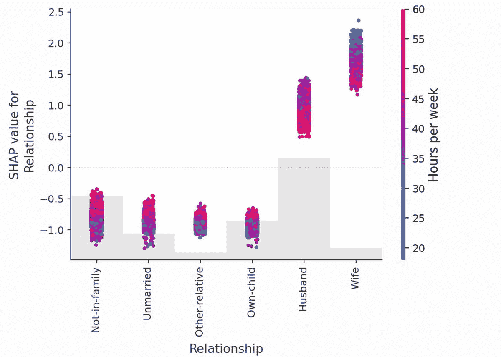

**图 5-24** – 关系状态与每周工作小时数的关系及 SHAP 值

在图 5-24 中，丈夫、妻子以及其他关系状态值之间存在明显差异。丈夫和妻子的 SHAP 值为正；然而，其他四种关系状态的 SHAP 值为负。

### 使用 SHAP 解释分类提升模型

当分类模型的特征包含分类变量时，我们通常会对这些特征进行独热编码，以识别每个特征对目标列的影响。在本例中，你将使用 CatBoost Python 库结合 SHAP 来生成解释。

要安装 CatBoost 库，可以使用 `pip` 安装命令。

```
!pip install catboost
shap.initjs()
import catboost
from catboost.datasets import *
import shap
```

这个人口普查收入数据集包含关系状态、性别、职业和婚姻状况等分类特征。这些分类特征不能直接使用 `sklearn` 或任何其他管道（如 `Keras`、`TensorFlow` 等）传递给机器学习训练算法。这些分类特征首先需要转换为标签编码，然后再转换为独热编码。如果你有超过一百个分类特征，这会变得非常繁琐。因此，你需要一个能够自动处理此过程的库。CatBoost 库正好满足了这一需求。

`Initjs()` 函数将 JavaScript 可视化代码加载到 Jupyter notebook 中。因此，我们使用上述语法来加载 JS 功能。

CatBoost 回归模型或分类模型基于梯度提升模型运行，因此得名 CatBoost 模型。

```
X,y = shap.datasets.boston()
model = CatBoostRegressor(iterations=300, learning_rate=0.1, random_seed=123)
model.fit(X, y, verbose=False, plot=False)
explainer = shap.TreeExplainer(model)
shap_values = explainer.shap_values(X)
# 可视化第一个预测的解释
shap.force_plot(explainer.expected_value, shap_values[0,:], X.iloc[0,:])
```

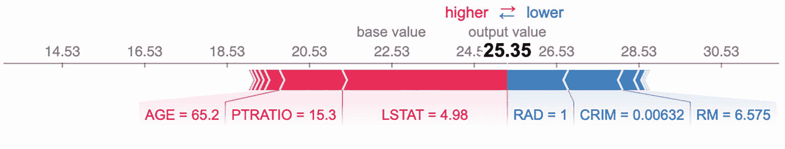

**图 5-25** – 单个记录的预测力图

在图 5-25 中，你正在尝试解释一个局部预测。对于训练数据集中的第 0 条记录，你展示了预测解释。例如，你使用了波士顿房价数据集，使用默认参数训练了一个 CatBoost 模型，并保存了该模型。下一步，使用树解释器生成一个解释器对象，然后再次使用该解释器对象，以训练数据集 `X` 作为输入来生成 SHAP 值。最后，使用预测值和训练数据集中第一条输入记录的 SHAP 值创建了力图可视化。对于第一条记录，预测的房价为 25.35，即 25,350 美元。预测房价的平均值为 22.53，即 22,530 美元。诸如年龄、`PTRATIO` 和 `LSTAT` 等特征将预测值推高（红色箭头指向右侧）。诸如 `RAD`、`CRIM` 和 `RM` 等特征则将预测值压低，即向左推动，由向后指的蓝色箭头表示。水平轴上以灰色显示的值是所有样本的预测值。

```
# 可视化训练集预测
shap.force_plot(explainer.expected_value, shap_values, X)
```

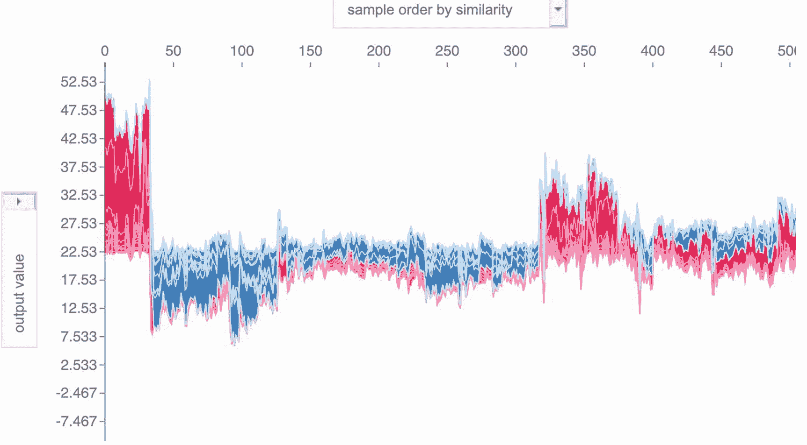

**图 5-26** – 按样本相似性排序的模型解释器

在图 5-26 中，样本按样本相似性排序。水平轴显示样本，垂直轴显示预测输出值。这是一个有趣的可视化；只需将鼠标或光标悬停，你应该就能看到特征的 SHAP 值、精确的预测输出值以及作为解释器输入而选择的相应样本。该图表提供了关于理解预测结果和特征贡献的详细视图。


为了解释如何应用 CatBoost 分类器，我们使用 Amazon 数据集。表 5-6 列出了该数据集中的特征。

**表 5-6** Amazon 数据集数据描述

| 特征名 | 描述 |
| --- | --- |
| `ACTION` | 如果资源被批准，`ACTION`为 1；如果资源未被批准，则为 0 |
| `RESOURCE` | 每个资源的 ID |
| `MGR_ID` | 当前员工 ID 记录的管理者的员工 ID；一个员工一次只能有一个管理者 |
| `ROLE_ROLLUP_1` | 公司角色分组类别 ID 1（例如，美国工程部） |
| `ROLE_ROLLUP_2` | 公司角色分组类别 ID 2（例如，美国零售部） |
| `ROLE_DEPTNAME` | 公司角色部门描述（例如，零售部） |
| `ROLE_TITLE` | 公司角色业务头衔描述（例如，高级工程零售经理） |
| `ROLE_FAMILY_DESC` | 公司角色系列扩展描述（例如，零售经理，软件工程） |
| `ROLE_FAMILY` | 公司角色系列描述（例如，零售经理） |
| `ROLE_CODE` | 公司角色代码；该代码对每个角色是唯一的（例如，经理） |

当一名员工开始在软件开发部门工作时，他们需要特定的访问权限和许可才能完成其工作职责。有一个手动流程来授予员工访问权限，但员工在此过程中可能会遇到障碍。没有自动化的机制来授予对必要软件系统的访问权限。此用例的目标是对历史数据进行建模，以确定员工的访问需求。目标列是`ACTION`；如果资源被批准则为 1，如果资源访问被拒绝则为 0。其余特征用于预测目标特征。

```
train_df, test_df = catboost.datasets.amazon()
train_df
set(train_df.ACTION)
y_train = train_df.ACTION
X_train = train_df.drop('ACTION',axis=1)
cat_features = list(range(0,X_train.shape[1]))
from catboost import Pool, CatBoostClassifier, cv
# Initialize CatBoostClassifier
model = CatBoostClassifier(iterations=300,
learning_rate=0.1,
random_seed=12)
# Fit model
model.fit(X_train,y_train,cat_features=cat_features,verbose=False,plot=False)
```

使用 CatBoost 分类器的模型训练过程具有一定的复杂性，这意味着存在无法通过单一函数近似的复杂关系。如果特征具有线性关系，你可以使用一条直线来近似该函数。然而，如果特征是圆形或锯齿形模式，则称为复杂模式，因为数学上没有任何函数可以近似圆形或锯齿形模式。在这些情况下，你需要多个函数或数据归一化来匹配某个数学函数。

在当前场景中，由于特征数据集的复杂性，SHAP 值是近似计算的。

```
eval_dataset = [X_train.iloc[0:1]]
eval_dataset
# Get predicted classes
preds_class = model.predict(X_train)
# Get predicted probabilities for each class
preds_proba = model.predict_proba(X_train)
# Get predicted RawFormulaVal
preds_raw = model.predict(X_train,
prediction_type='RawFormulaVal')
preds_class
preds_proba
preds_raw
```

训练好的模型存储在`model`对象中。你可以取两个样本作为示例，来生成该实例的概率和原始公式值。该样本可以是训练数据集中的任何数据点。在脚本中，我们以第一条和第 91 条记录为例。

```
import numpy as np
np.log(0.9964/(1-0.9964))
np.exp(5.62)/(1+np.exp(5.62))
cat_features
```

第一条记录显示预测为类别 1 的概率为 99.64%。对数几率值为 5.61。对数几率意味着`log(P/1-P)`，这里`P`是类别 1 的概率。如果你想从原始预测值得到概率，可以使用公式`exp(raw prediction) / (1+ exp(raw prediction))`。例如，对于第一条记录，`exp(5.61) / (1+ exp(5.61)) = 0.9964`。以类似的方式，你可以解释第 91 条记录的原始预测值`-3.4734`。CatBoost 模型提供了预测不同预测类型的选项；参见表 5-7。

**表 5-7** CatBoost 模型对象生成的预测类型

| `prediction_type` | 描述 |
| --- | --- |
| **Probability** | 对应于每个类别的概率值 |
| **Class** | 将生成类别标签 |
| **RawFormula Value** | 对数几率值 |
| **Exponent** | 预测概率的指数值 |
| **LogProbability** | 概率的对数值 |

来自 CatBoost 模型的不同类型的预测提供了更多洞察，有助于理解预测值以及模型如何生成预测。所有类型之间的关联提供了更好的理解。你可以转换原始预测值以得到类别 1 的概率。

```
from catboost.datasets import *
train_df, test_df = catboost.datasets.amazon()
y = train_df.ACTION
X = train_df.drop('ACTION', axis=1)
cat_features = list(range(0, X.shape[1]))
model = CatBoostClassifier(iterations=300, learning_rate=0.1, random_seed=12)
model.fit(X, y, cat_features=cat_features, verbose=False, plot=False)
explainer = shap.TreeExplainer(model)
shap_values = explainer.shap_values(Pool(X, y, cat_features=cat_features))
test_objects = [X.iloc[7:9], X.iloc[56:58]]
for obj in test_objects:
print('Probability of class 1 = {:.4f}'.format(model.predict_proba(obj)[0][1]))
print('Formula raw prediction = {:.4f}'.format(model.predict(obj, prediction_type='RawFormulaVal')[0]))
print('\n')
shap.force_plot(explainer.expected_value, shap_values[0,:], X.iloc[0,:])
```

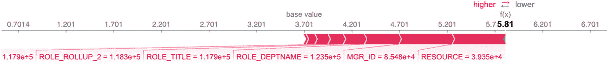

```
shap.force_plot(explainer.expected_value, shap_values[91,:], X.iloc[91,:])
```

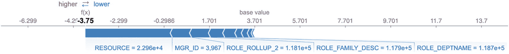

**图 5-27** 训练集中记录 1 的力导向图

在图 5-27 中，力导向图展示了原始预测值是如何基于拉低（蓝色，下方图形）和推高（红色，上方图形）的特征值来决定的。从 1.124 到 6.124 刻度上反映的值是原始预测值，即相对于类别 1 的预测概率的对数几率比。平均对数几率比值为 3.624。拉低值通过使用诸如`resource`、`role title`、`roll`、`roll-up 2`等特征来降低预测的几率比。推高特征（`role dept name`、`MGR id`等）会将预测的几率比提高到更高水平。最终值为 5.61，这是最终的预测原始概率值，也称为几率比。

```
shap.summary_plot(shap_values, X)
```

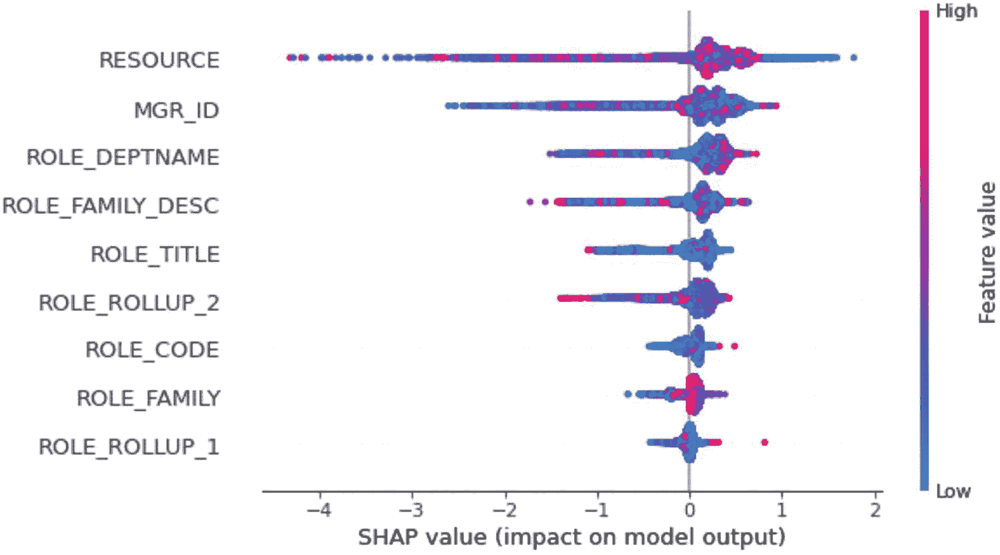

**图 5-28** SHAP 值摘要图，显示对模型输出的影响

图 5-28 显示了影响模型输出的特征及其重要性。`Resource`是最具影响力的特征，其次是`MGR ID`，依此类推，如图所示。


### 使用 SHAP 多分类 CatBoost 模型

CatBoost 分类器模型也可用于训练多分类模型。训练好的模型对象可以传递给 SHAP 树解释器以生成 SHAP 值。参见图 5-29。

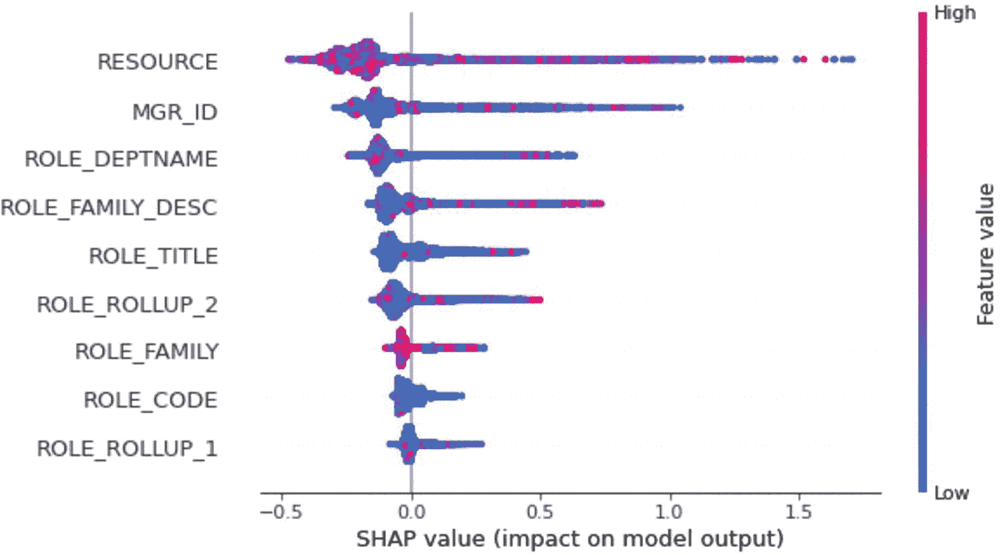

图 5-29

特征值与 SHAP 值表示

```
model = CatBoostClassifier(loss_function = 'MultiClass', iterations=300, learning_rate=0.1, random_seed=123)
model.fit(X, y, cat_features=cat_features, verbose=False, plot=False)
explainer = shap.TreeExplainer(model)
shap_values = explainer.shap_values(Pool(X, y, cat_features=cat_features))
shap.summary_plot(shap_values[0], X)
```

CatBoost 分类器或回归器有许多超参数。表 5-8 展示了一些重要参数及其对模型结果的影响。

表 5-8

CatBoost 分类器的超参数

| 参数 | 说明 |
| --- | --- |
| `cat_features` | 训练数据集中存在的分类列索引 |
| `text_features` | 文本列索引（指定为整数）或名称（指定为字符串） |
| `learning_rate` | 用于损失函数优化，减小梯度步长 |
| `Iterations` | 解决机器学习问题时可以构建的最大树数量 |
| `Max_depth` | 树的深度 |
| `leaf_estimation_method` | 用于计算叶节点值的方法。可能的值：`Newton`、`Gradient`、`Exact`。取决于模式和所选损失函数：使用 `Quantile` 或 `MAE` 损失函数的回归——一次精确迭代；使用除 `Quantile` 或 `MAE` 之外的任何损失函数的回归——一次梯度迭代；分类模式——十次牛顿迭代；多分类模式——一次牛顿迭代 |
| `boosting_type` | 提升方案。可能的值：`Ordered`——通常在小数据集上提供更好的质量，但可能比 `Plain` 方案慢；`Plain`——经典的梯度提升方案 |

为了获得更好的结果，可以更改或修改上述参数，并使用 SHAP 库进行解释。

### 使用 SHAP 解释 Light GBM 模型

如 CatBoost 分类器部分所述，类似地，你也可以使用轻量梯度提升模型。Light GBM 模型和 CatBoost 模型之间的区别在于，在混合数据场景（即训练数据集中存在混合特征集）下，Light GBM 运行速度更快。当数据集中有大量分类特征时，CatBoost 分类器更有用。在 Light GBM 中，你需要对分类特征进行编码，但在 CatBoost 模型中，模型具有处理分类特征的内部机制。

安装 Light GBM 模型：

```
conda install -c conda-forge lightgbm
from sklearn.model_selection import train_test_split
import lightgbm as lgb
import shap
X,y = shap.datasets.adult()
X_display,y_display = shap.datasets.adult(display=True)
# create a train/test split
X_train, X_test, y_train, y_test = train_test_split(X, y, test_size=0.2, random_state=7)
d_train = lgb.Dataset(X_train, label=y_train)
d_test = lgb.Dataset(X_test, label=y_test)
params = {
"max_bin": 512,
"learning_rate": 0.05,
"boosting_type": "gbdt",
"objective": "binary",
"metric": "binary_logloss",
"num_leaves": 10,
"verbose": -1,
"min_data": 100,
"boost_from_average": True
}
model = lgb.train(params, d_train, 10000, valid_sets=[d_test], early_stopping_rounds=50, verbose_eval=1000)
```

你可以使用相同的人口普查收入分类数据集，通过 Light GBM 模型训练分类器，并为预测结果生成解释。通过查阅 Light GBM 模型的官方文档页面，可以了解许多超参数。表 5-9 展示了以下代码行中使用的超参数。

表 5-9

LGB 模型的超参数

| 参数 | 说明 |
| --- | --- |
| `Max_bin` | 特征值将被分入的最大箱数。箱数较少可能会降低训练精度，但可能会提高泛化能力（处理过拟合） |
| `Learning_rate` | 收缩率 |
| `Boosting_type` | `gbdt`，传统梯度提升决策树，别名：`gbrt`；`rf`，随机森林，别名：`random_forest`；`dart`，Dropouts meet Multiple Additive Regression Trees；`goss`，基于梯度的单边采样 |
| `Objective` | 应用类型，例如二分类、多分类等 |
| `Metric` | 在评估集上评估的指标 |
| `Num_leaves` | 一棵树中最大叶节点数 |
| `Min_data` | 每个分类组的最小数据量 |

训练完 Light GBM 模型后，你可以使用 SHAP 树解释器来解释预测结果，还可以为 SHAP 值生成力图（图 5-30）。

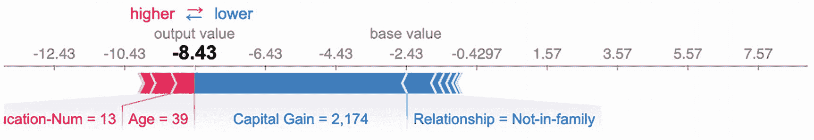

图 5-30

使用 SHAP 特征值预测对数几率比的力图

```
explainer = shap.TreeExplainer(model)
shap_values = explainer.shap_values(X)
shap.force_plot(explainer.expected_value[1], shap_values[1][0,:], X_display.iloc[0,:])
```

在图 5-30 中，教育年限和年龄将预测的几率比推向更高值，而资本收益和关系将预测的几率比拉向更低值。因此，数据集中第一条记录的最终预测几率比为 -8.43，远低于基准值 -2.43 所示的平均几率比。

```
shap.force_plot(explainer.expected_value[1], shap_values[1][:1000,:], X_display.iloc[:1000,:])
```

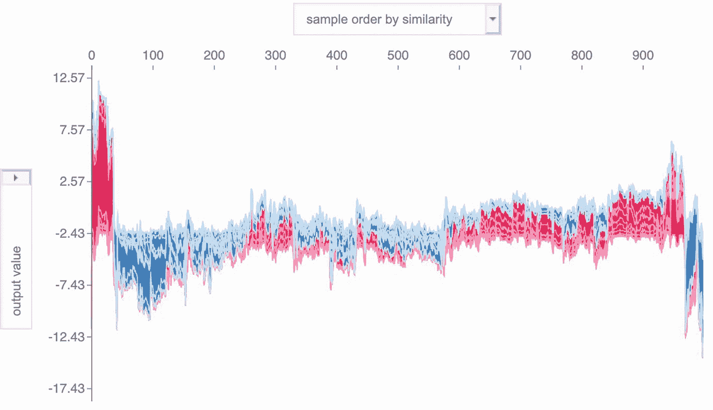

图 5-31

LGBM 模型生成输出值时样本顺序的相似性

在图 5-31 中，输出是几率比，并且如本章所示，你可以从几率比反推出目标类别的概率值。此图显示了样本的相似性，然后据此排序。生成较高几率比的样本位于 0-50 之间。之后，其余样本生成的几率比范围在 +3 到 -9 之间，直到第 900 条记录。此后，几率比下降到非常负的范围。红线表示有助于提高预测几率比的特征值，蓝线表示降低预测几率比的特征值。平均线对应 -2.43 的值。如果你计算整个数据集的几率比然后求平均值，结果就是 -2.43。

```
shap.summary_plot(shap_values, X)
```

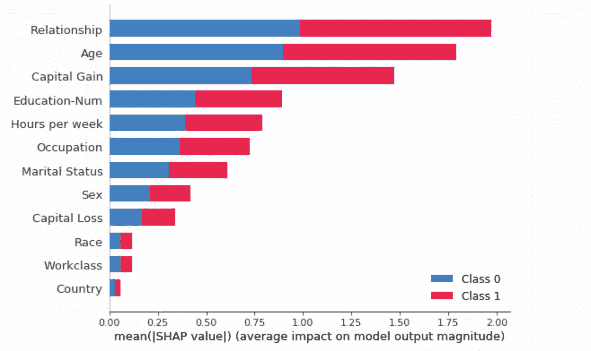

图 5-32

汇总图

图 5-32 显示了汇总图。这是一个非常重要的图。它提供了目标列中每个类别对应的不同特征的平均 SHAP 值。此图有趣之处在于，平均值在两个类别之间均匀分布，与特征值无关。


## 结论

本章涵盖了用于分类和回归场景的几种基于提升的模型。类似地，装袋分类器也可以进行训练，并生成类似的输出图表。图表本身不会改变，但随着你从一个模型切换到另一个模型，对数值的解释会发生变化。以下是需要重点关注的五点：

- 在回归场景中，你预测目标列，并根据特征贡献观察预测结果是上升还是下降。因此，如果你改变一个输入特征，就能轻松理解对目标输出的影响。
- 在分类场景中，你将对数几率比作为连续变量进行预测，并根据特征输入值预测结果。你知道哪些特征重要，因此能够清晰地看到基于输入特征变化的预测结果。
- 无论是装袋、提升还是堆叠，都可以生成类似的偏依赖图（PDP）、力图和汇总图框架，以理解模型的决策过程。然而，以偏依赖图为例，其展示的模式会发生变化。
- 图表模式发生变化，是因为模型试图捕捉数据中可能存在的复杂模式。随着数据复杂性的增加，模型变得更加复杂，从视觉上看可能难以解释。然而，从数值中得出的推论将保持不变。
- 因此，基于本章的分析，你涵盖了多少个集成模型并不重要。更重要的是建立一个可以应用于其他集成模型的框架。

