```markdown
## 时间序列模型

时间序列模型是一种沿未来时间段生成多步预测的方法。存在统计模型和基于机器学习的模型，可以利用历史数据对未来进行预测。模型预测是否可信？人们对预测结果能有多大程度的信心？可解释的模型和不可解释的模型是本章将要探讨的内容。

## 时间序列模型

时间序列模型的主要目标是利用时间作为自变量来估计目标变量的值。目标变量可以是股票价格、产品单位数量、流入公司账户的收入金额，也可以是特定网站的独立访客数量。预测值是多步的，因为使用时间序列模型时，我们通常预测多个时间步长。时间序列模型生成预测值，这些预测值具有一定的置信水平。置信水平越高，模型越好；置信水平较低时，模型在生成预测值方面缺乏稳定性。置信区间可以计算为预测值加减 1.96（统计表中对应 95% 置信度的标准化值）乘以模型计算出的残差项的标准误差。这基于误差项呈正态分布的条件。

时间序列模型要求数据以频繁的时间间隔记录，且时间步长不能中断。时间序列数据本质上是有序的，因为顺序决定了隐含的时间序列。作为机器学习工程师，从数据中创建有用的特征以做出正确预测至关重要。在时间序列模型中，时间是自变量。在单变量时间序列模型中，你只有一个变量。在因果预测模型中，你有一个类似于回归模型的模型。在单变量时间序列模型中，特征是自回归项，如滞后项、移动平均项（例如三期或五期移动平均）和差分项。最流行的时间序列预测模型纯粹依赖于目标变量的历史值。它们是指数平滑模型和 ARIMA（自回归积分滑动平均模型）。如果你打算使用上述两种模型，必须在特征工程步骤中捕捉时间序列的组成部分。以下是时间序列的组成部分：

- **趋势**：当变量的值在连续几个时间步长内持续增加、减少或保持不变时，这是一个信号。在使用时间序列建模时，趋势被视为一个特征。

- **季节性**：这是在特定时间间隔内显现的规律性模式的信号，具有周期性。它以恒定的时间间隔不断重复。时间序列模型在特征工程步骤中也会考虑季节性变量。

- **周期性**：商业周期通常会随时间波动。有时较高，有时较低。周期性是一个特定特征，有助于预测目标变量的值。

除了时间序列组成部分，还可以引入其他工程特征，例如滞后变量；基于移动平均的变量；基于事件（如节假日和特殊事件）的虚拟变量；营销活动；以及数据中异常值的存在。时间序列模型的可解释性和可说明性对于建立对模型的信任、解释预测结果以及理解模型行为至关重要。时间序列组成部分、特征以及附加特征对于解释时间序列模型的行为非常重要。图 6-1 展示了我们在单变量时间序列预测模型中通常建模的内容。

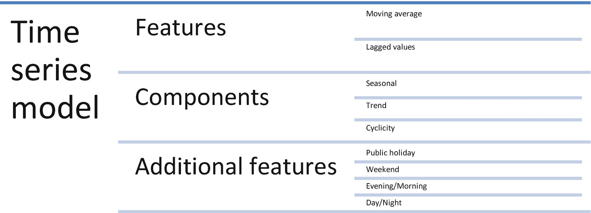

*图 6-1 – 我们在时间序列预测模型中通常建模的内容*

让我们看一些适用时间序列模型且需要模型可解释性的用例：

- 从安装在各地的物联网设备传感器获取的数据

- 金融数据，如股票价格

- 经济指标，如 GDP、FII、IIP、通货膨胀等

- 来自机器的系统日志和错误日志

- 供应链行业的需求预测

为了解决各种用例，我们有一系列可以生成未来预测的算法。然而，这些算法并不容易理解。也存在复杂的模型。并非所有算法都具有可解释性和可说明性。但向业务领导者解释模型非常重要。算法如下：

- 自回归积分滑动平均模型

- 广义自回归条件异方差模型

- 贝叶斯概率模型

- 向量自回归模型

- 神经网络自回归模型

- 循环神经网络模型

- 长短期记忆模型

- 门控循环单元模型

### 判断模型优劣

在将时间序列模型投入生产场景之前，需要使用指标和其他诊断方法对其进行评估。

指标：

- **均方根误差（RMSE）**：这是一个尺度相关函数。该值越小，模型性能越好。

- **平均绝对百分比误差（MAPE）**：该指标与尺度无关。根据行业基准，该值最好低于 10%。

在拟合预测模型后，了解这些指标对于判断模型对数据的拟合程度至关重要。时间序列模型的一个特定概念是白噪声，即模型无法解释的误差。如果满足以下特性，则误差可被视为白噪声：

- 残差项不相关，即由`ACF`值表示的自相关函数为 0。

- 残差服从正态分布。

如果上述两个条件不满足，则模型仍有改进空间。

## 预测策略

如果业务需求是在上层层级生成预测，并且有粒度数据可用，则有两种生成预测的方式：

- 宏观层面，使用上层层级（例如：对服装类别的销量预测属于宏观层面，而对每个库存单位（SKU）的预测属于微观层面）

- 微观层面，然后使用尽可能低的粒度进行聚合

## 预测的置信区间

并非所有时间序列模型都能为预测值提供置信区间。预测值的置信区间提供了有意义的洞察。置信区间越高，模型性能越好。如果模型与置信区间不一致，可能会出现两种情况：

- **黑天鹅事件**：实际值显著突破预测值的置信区间，造成严重破坏。

- **灰天鹅事件**：实际值低于预测值的置信区间，可能导致次优结果。

在图 6-2 中，显示了每日销售额，并使用历史数据来预测未来的预测值。虚线表示模型生成的预测值，两条平行的黑线表示预测值的置信区间，置信区间在上线处有上限阈值，在下线处有下限阈值。如果预测值超过上限阈值（如 A 点），则称为黑天鹅事件；如果预测值超过下限阈值（如 B 点），则称为灰天鹅事件。

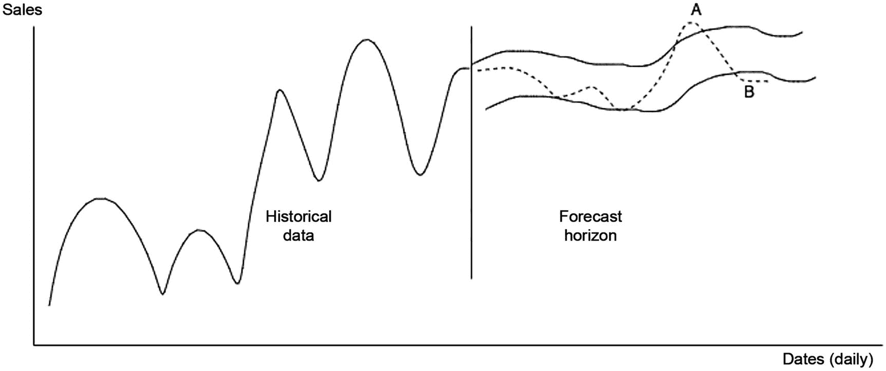

图 6-2

黑天鹅与灰天鹅事件

## 信任何去何从？

XAI 的目标是向最终用户解释他们是否应该相信预测，或者决定选择更值得信赖的竞争模型。上述两种情况，即黑天鹅和灰天鹅事件，极难预测。如果它们发生一两次，还可以接受。如果模型频繁无法识别此类情况，用户将对该模型失去信心或信任。控制此类事件的方法之一是在更高的阈值（例如 90%的置信限）下生成置信区间。其他情况则需要使用模型参数进行解释。

该数据集包含某个产品的日期戳和价格。这被视为一个单变量时间序列模型。你需要生成未来的预测值。

```python
import pandas as pd
import numpy as np
import matplotlib.pyplot as plt
%matplotlib inline
df = pd.read_csv('/Users/pradmishra/Downloads/XAI Book Apress/monthly_csv.csv',index_col=0)
df
# 时间序列的折线图
# 数据集的折线图
df.plot()
```

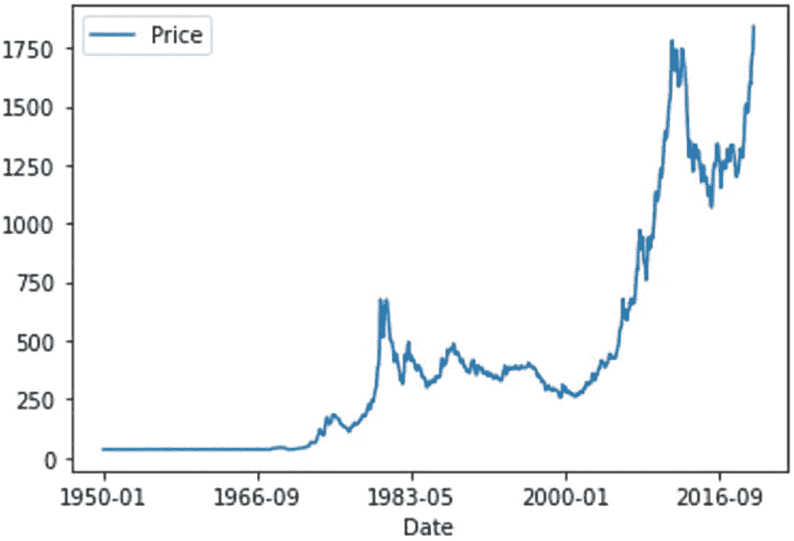

图 6-3

价格随时间变化

在图 6-3 中，数据集中的数据显示了价格的变化，存在趋势，并且在 2016 年底有一定程度的跳跃。该时间序列模型存在一定程度的季节性。季节性意味着价格会在特定时间段内出现相同的值，并且会重复出现此类事件。如果出现多次，则可以确认数据中存在季节性。为了将季节性纳入预测值，你可以将时间序列模型扩展为季节性调整模型变体。但是，如果你想从预测值中消除季节性因素的影响，则需要使用差分法对时间序列进行调整。差分是时间序列减去其自身过去一个周期的值。季节性调整后的数据可以单独存储。

```python
# 季节性差分
differenced = df.diff(12)
# 修剪掉第一年的空数据
differenced = differenced[12:]
# 保存差分后的数据集到文件
differenced.to_csv('seasonally_adjusted.csv', index=False)
# 绘制差分后的数据集
differenced.plot()
plt.show()
```

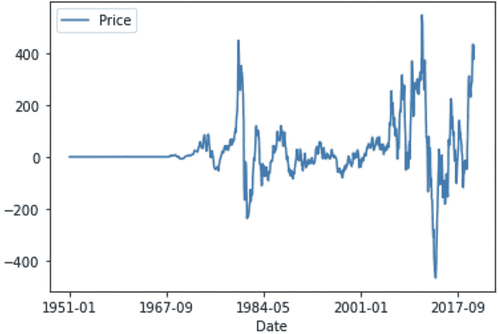

图 6-4

季节性差分后的时间序列数据

在图 6-4 中，展示了相同的季节性调整后的时间序列。自回归积分滑动平均模型（ARIMA）在业界使用最为频繁。它们解释了数据中的自相关性。平稳时间序列可以定义为其值不依赖于实际发生时间的时间序列。任何具有趋势和季节性的时间序列都是非平稳的。然而，具有周期性的时间序列本质上是平稳的。使时间序列平稳的方法之一是应用差分法，因为平稳性是 ARIMA 模型的假设之一。差分有助于减少数据中的趋势和季节性，从而使其平稳。自相关函数（ACF）是识别平稳性的方法之一；`ACF`会迅速下降到零。然而，对于非平稳时间序列，相关值仍然相当高，并且相关值的衰减也非常不明显。

```python
from statsmodels.graphics.tsaplots import plot_acf
plot_acf(df)
plt.show()
```

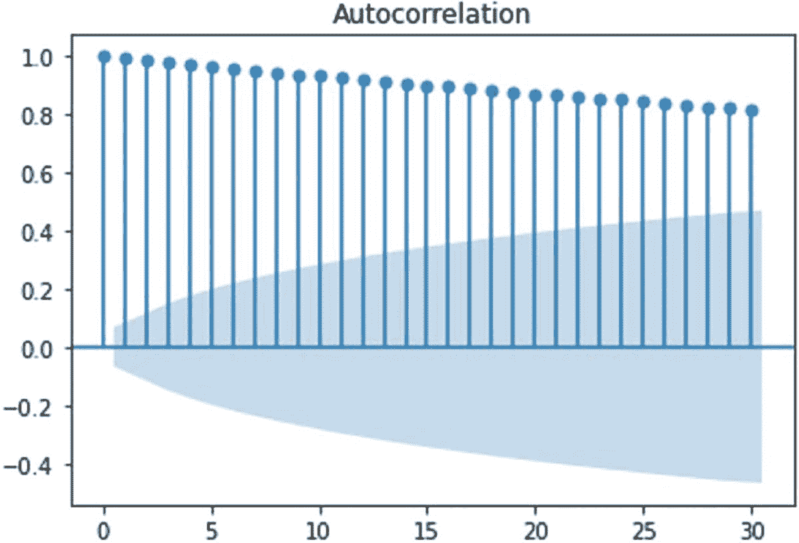

图 6-5

价格的自相关函数

在`Figure 6-5`中，自相关函数的模式表明该序列是非平稳的，因为直到 30 阶滞后的相关系数都超过 0.80。阴影区域显示了相关系数值的置信水平。由于相关系数在 30 阶滞后内不为零，该序列本质上高度非平稳。由于已知序列非平稳，因此无法应用标准`ARIMA`模型。

有一种替代方法可以将问题转化为自回归监督机器学习问题，以了解任何滞后是否对预测值有影响。因此，创建 12 个滞后值作为独立特征，以预测实际价格序列作为因变量。

```python
# reframe as supervised learning
dataframe = pd.DataFrame()
for i in range(12,0,-1):
    dataframe['t-'+str(i)] = df.shift(i).values[:,0]
dataframe['t'] = df.values[:,0]
print(dataframe.head(13))
dataframe = dataframe[13:]
# save to new file
dataframe.to_csv('lags_12months_features.csv', index=False)
```

在上述脚本中，计算了滞后值。在`Figure 6-6`中，可以看到以表格形式呈现的滞后值。

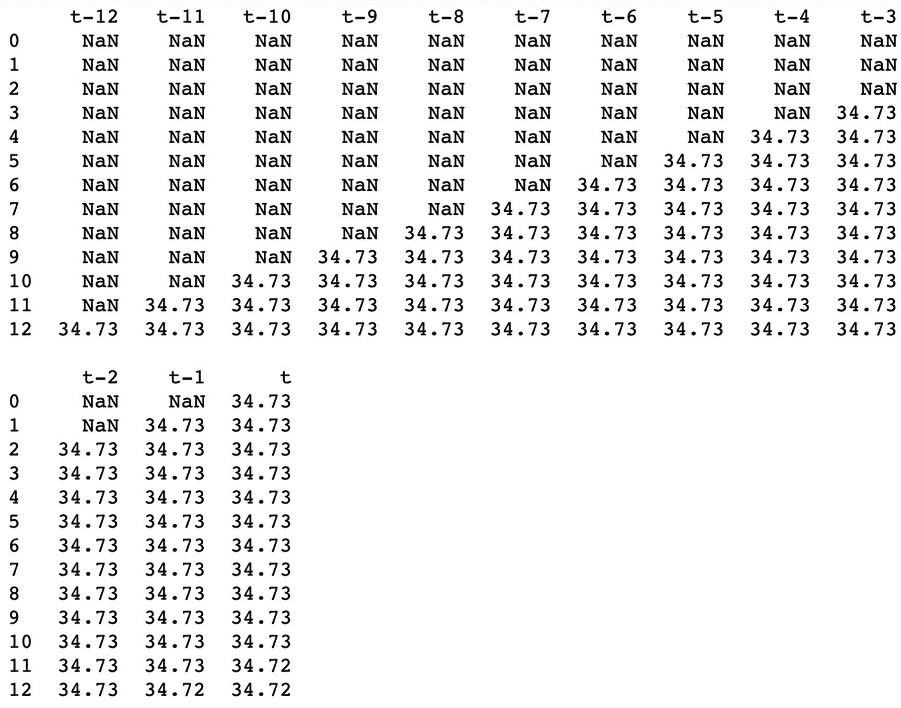

**Figure 6-6**  

为模型开发创建滞后变量后的处理数据

这 12 个滞后值是特征，可以使用随机森林回归器对特征进行不同组合，以构建决策树，并通过取所有树预测值的平均值来集成模型预测。通过这种方式，可以识别哪个特征更重要。

```python
# split into input and output
df = pd.read_csv('lags_12months_features.csv')
data = df.values
X = data[:,0:-1]
y = data[:,-1]
from sklearn.ensemble import RandomForestRegressor
# fit random forest model
model = RandomForestRegressor(n_estimators=500, random_state=1)
model.fit(X, y)
# show importance scores
print(model.feature_importances_)
# plot importance scores
names = dataframe.columns.values[0:-1]
ticks = [i for i in range(len(names))]
plt.bar(ticks, model.feature_importances_)
plt.xticks(ticks, names)
plt.show()
```

考虑了 500 棵决策树，并使用这些特征训练了一个随机森林回归模型。`Figure 6-7`估计了特征重要性。

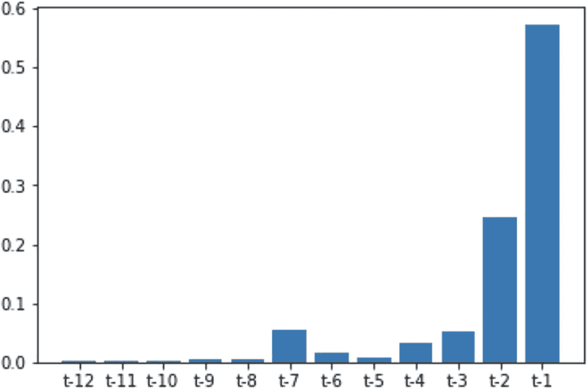

**Figure 6-7**  

随机森林模型的特征重要性

在`Figure 6-7`中，可以看到滞后 1（`t-1`）是最重要的特征，滞后 2（`t-2`）是第二重要的特征，滞后 7（`t-7`）是第三重要的特征，其次是滞后 3 和滞后 4，分别由`t-3`和`t-4`表示。其他特征对模型来说不太重要。

```python
from sklearn.feature_selection import RFE
# perform feature selection
rfe = RFE(RandomForestRegressor(n_estimators=500, random_state=1), n_features_to_select=4)
fit = rfe.fit(X, y)
# report selected features
print('Selected Features:')
names = dataframe.columns.values[0:-1]
for i in range(len(fit.support_)):
    if fit.support_[i]:
        print(names[i])
# plot feature rank
names = dataframe.columns.values[0:-1]
ticks = [i for i in range(len(names))]
plt.bar(ticks, fit.ranking_)
plt.xticks(ticks, names)
plt.show()
```

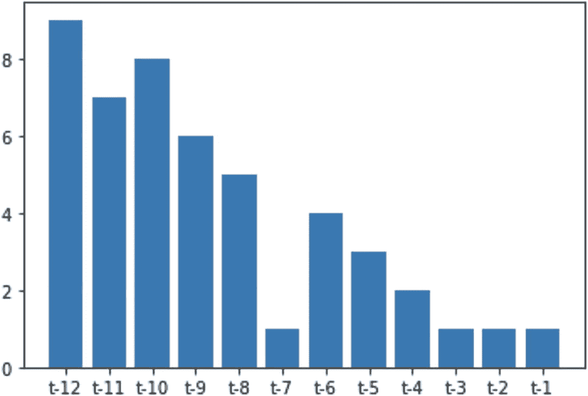

**Figure 6-8**  

来自`RFE`算法的特征重要性

递归特征消除（`RFE`）是一种流行的算法，用于在监督学习环境中从特征列表中移除冗余特征（`Figure 6-8`）。配置`RFE`有两种不同的选项：要么选择特征的数量，要么选择用于选择特征的算法。`RFE`在监督回归模型或分类模型之上充当包装算法。这意味着需要一个模型，然后在其上应用`RFE`。在上述脚本中，在随机森林回归模型之上使用了`RFE`。选择的最重要特征是滞后 7、3、2 和 1。其余八个特征未被算法选中。因此，连续且一致的滞后对目标特征没有影响；然而，选中的特征对预测结果有影响。如本章前面所述，时间序列模型的特征仅是滞后变量和移动平均变量。这就是为什么如果仅使用滞后项，时间序列对象可以建模为`AR`；如果仅使用移动平均项作为特征，则可以建模为`MA`。自回归意味着滞后值可以用作特征来预测实际时间序列。

```python
# AR example
from statsmodels.tsa.ar_model import AutoReg
from random import random
# fit model
model = AutoReg(y, lags=1)
model_fit = model.fit()
model_fit.summary()
```

前面的脚本显示，如果仅使用滞后 1 来预测当前时间段，则称为`AR(1)`模型。这类似于线性回归。参见`Table 6-1`。

**Table 6-1**  

自回归模型结果

| 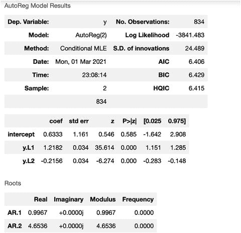 |

可以将方程写为：

`Yt = 0.5136 + 1.0039 * Yt-1`

系数`1.0039`的`p`值为`0.000`，小于`0.05`。这意味着在 95%的置信水平和 5%的统计显著性水平下，一阶滞后项足够显著，能够影响实际时间序列`Yt`。这可以解释为：*如果滞后项变化 1 个单位，序列的实际值预计变化 0.39%*。

```python
# AR example
from statsmodels.tsa.ar_model import AutoReg
from random import random
# fit model
model = AutoReg(y, lags=2)
model_fit = model.fit()
model_fit.summary()
```

类似的分析可以通过考虑两个滞后项进行，方程变为：

`Yt = 0.6333 + 1.2182 * Yt-1 – 0.2156 * Yt-2`

系数`1.2182`和`0.2156

```markdown
## 重要规则

- 不要修改正文内容的语义
- 不要删减有价值的信息
- 不要重复输出原文，也不要添加额外信息，只输出排版后的文本

## 要排版的文本

```python
# AR example
from statsmodels.tsa.ar_model import AutoReg
from random import random
# fit model
model = AutoReg(y, lags=12)
model_fit = model.fit()
model_fit.summary()
```

与上述两个滞后项的情况类似，可以将模型扩展到 12 个滞后项的场景，并进行类似的解释。参见`**Tables 6-3**`和`6-4`。

**Table 6-5**  

季节性`ARIMA`模型结果

| 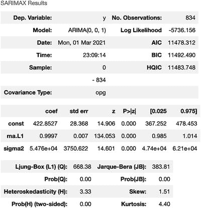 |

**Table 6-4**  

上述模型的系数表

| 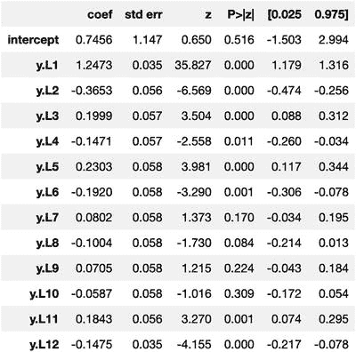 |

**表 6-3** 包含 12 个滞后变量的自回归模型结果

| 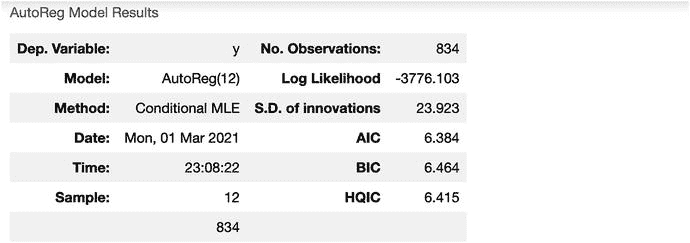 |

在选择 ARIMA 模型时，你需要定义模型的阶数。在以下脚本中，你将阶数定义为 `(0,0,1)`，即 `(p,d,q)`，其中 `p` 代表自回归项，`d` 代表差分阶数，`q` 代表移动平均项。因此，阶数 `0, 0, 和 1` 表示仅包含移动平均模型。

```
# MA example
from statsmodels.tsa.arima.model import ARIMA
from random import random
# fit model
model = ARIMA(y, order=(0, 0, 1))
model_fit = model.fit()
# make prediction
yhat = model_fit.predict(len(y), len(y))
print(yhat)
model_fit.summary()
```

以下脚本展示了阶数为 `2, 0 和 1` 的 ARIMA 模型，即包含 2 个滞后自回归项、0 次差分和 1 个移动平均项：

```
# ARMA example
from statsmodels.tsa.arima.model import ARIMA
from random import random
# fit model
model = ARIMA(y, order=(2, 0, 1))
model_fit = model.fit()
# make prediction
yhat = model_fit.predict(len(y), len(y))
print(yhat)
model_fit.summary()
```

所有模型的结果摘要都可以用与你之前类似的方式进行解读。如果你想在 ARIMA 模型中引入季节性成分，它就变成了 SARIMA 模型。季节性阶数也可以根据表 6-7 来定义。

**Table 6-7** SARIMA 模型参数说明

| 参数 | 说明 |
| --- | --- |
| `Endog` | 观测到的时间序列过程 `y` |
| `Order` | 模型的 `(p,d,q)` 阶数，分别对应 AR 参数数量、差分阶数和 MA 参数数量 |
| `seasonal_order` | 模型季节性成分的 `(p,d,q)` 阶数，分别对应 AR 参数、差分阶数、MA 参数和周期 |
| `Trend` | 控制确定性趋势多项式 `A(t)` 的参数。 |
| `enforce_stationarity` | 是否转换 AR 参数以强制模型的自回归分量满足平稳性。默认值为 `True`。 |

**Table 6-6** SARIMAX 模型结果

| 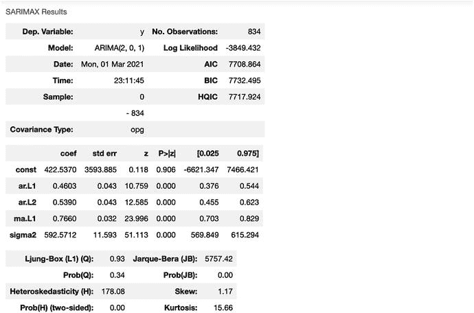 |

```
# ARMA example
from statsmodels.tsa.arima.model import ARIMA
from random import random
# fit model
model = ARIMA(y, order=(2, 1, 1))
model_fit = model.fit()
# make prediction
yhat = model_fit.predict(len(y), len(y))
print(yhat)
model_fit.summary()
# SARIMA example
from statsmodels.tsa.statespace.sarimax import SARIMAX
from random import random
# fit model
model = SARIMAX(y, order=(1, 1, 1), seasonal_order=(0, 0, 0, 0))
model_fit = model.fit(disp=False)
# make prediction
yhat = model_fit.predict(len(y), len(y))
print(yhat)
model_fit.summary()
```

**Table 6-8** SARIMA 模型结果

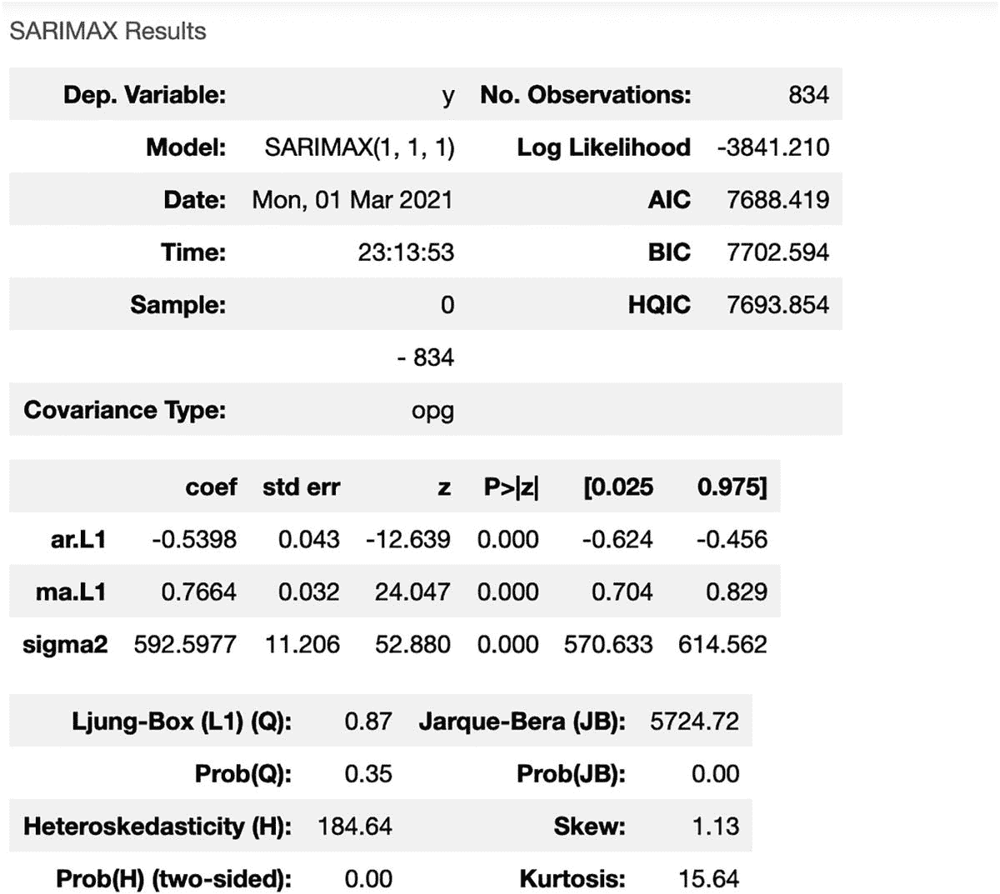

表 6-8 中系数的 p 值均小于 0.05，因此在 5% 的显著性水平下具有统计显著性。上述模型输出的摘要主要使用 OLS 作为度量技术，而 OLS 方法与多元线性回归模型非常相似。因此，可以轻松地对模型系数、其相关性及含义进行解读。

## 时间序列：LIME

使用 LIME 可解释性库，你可以将 12 个滞后变量作为特征，训练一个回归模型并解释预测结果，如下所示。第一步，如果你尚未安装 LIME 库，需要先进行安装：

```
!pip install Lime
import lime
import lime.lime_tabular
explainer = lime.lime_tabular.LimeTabularExplainer(np.array(X),
mode='regression',
feature_names=X.columns,
class_names=['t'],
verbose=True)
explainer.feature_frequencies
# asking for explanation for LIME model
i = 60
exp = explainer.explain_instance(np.array(X)[i],
new_model.predict,
num_features=12
)
exp.show_in_notebook(show_table=True)
```

在上述脚本中，你将时间序列模型视为一个监督学习模型，并使用 12 个滞后变量作为特征。从 LIME 库中，你使用了 LIME 表格解释器。图 6-9 展示了第 60 条记录的解释。

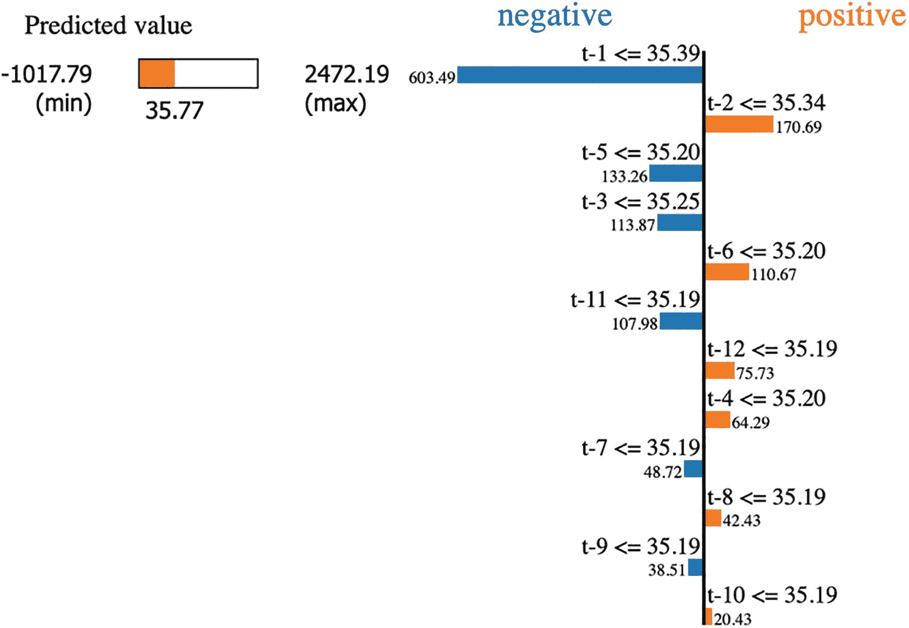

**图 6-9** 第 60 条记录的 LIME 解释

预测值为 35.77，下限阈值和上限阈值反映了预测结果的置信区间。对预测结果产生正面和负面影响的因子如图 6-9 所示。滞后 1 是一个非常重要的特征；第二重要的特征是滞后 2，然后是滞后 5、滞后 3、滞后 6，依此类推。作为特征的滞后值及其对预测值的贡献如图 6-10 所示。

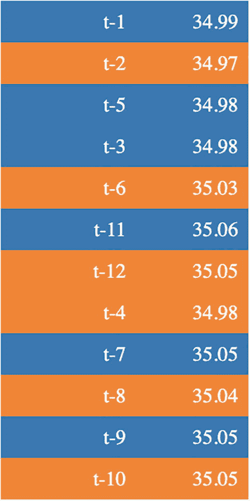

**图 6-10** 模型的特征重要性

```
# Code for SP-LIME
import warnings
from lime import submodular_pick
# Remember to convert the dataframe to matrix values
# SP-LIME returns exaplanations on a sample set to provide a non redundant global decision boundary of original model
sp_obj = submodular_pick.SubmodularPick(explainer, np.array(X),
new_model.predict,
num_features=12,
num_exps_desired=10)
import matplotlib.pyplot as plt
plt.savefig('[exp.as_pyplot_figure() for exp in sp_obj.sp_explanations ].png', dpi=300)
images = [exp.as_pyplot_figure() for exp in sp_obj.sp_explanations ]
exp.predicted_value
```

用于解释模型的子模选择通过数据中的一组实例提供了对模型的全局理解。在上述脚本中，你考虑了所有 12 个基于滞后的特征，并选取了 10 个实例供用户检查或展示解释。

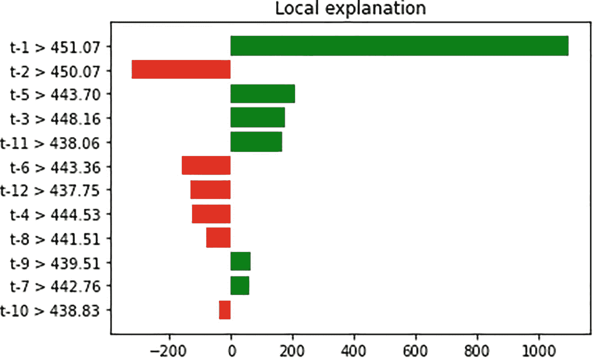

**图 6-11** 第 0 条记录的局部解释

在图 6-11 中，滞后 1 在预测输出值时非常重要。绿色条表示提升预测值，红色条表示降低预测值。这是第一条记录的局部解释。类似地，你可以考虑其他样本记录并生成此类解释。

## 结论

在本章中，你学习了如何解读时间序列模型。你将时间序列模型视为一个监督学习模型，并解释了所有特征的特征重要性。你探索了自回归模型、移动平均模型以及自回归积分移动平均模型。通过使用 LIME 作为可解释性库，你了解了各滞后项在预测目标值中的重要性。此外，你还了解了哪些正向滞后特征和负向滞后特征对预测结果有贡献。
```