# 7. 自然语言处理的可解释性

本章将讲解如何将基于可解释人工智能的 Python 库 `ELI5` 和 `SHAP` 应用于自然语言处理任务，例如文本分类模型。机器学习模型为监督学习任务做出的预测决策，其对象是非结构化数据。文本分类是一项任务，你需要将文本句子或短语作为输入，并将其分类到离散的类别中。一个例子是新闻分类，其中内容作为输入，输出则被分类为政治、商业、体育、技术等。类似的应用场景是电子邮件分类中的垃圾邮件检测，其中电子邮件内容作为输入，并被分类为垃圾邮件或非垃圾邮件。在这种情况下，了解一封邮件为何被归类为垃圾邮件就很重要：内容中究竟是哪些词元导致了该预测？这对最终用户来说很有意义。这里我提到 NLP 任务时，有很多种，但我会将其限定在文本分类用例以及类似用例上，比如实体识别、词性标注和情感分析。

## 自然语言处理任务

如今，整个世界通过万维网连接在一起。非结构化的文本数据无处不在。它们存在于社交媒体、电子邮件对话、各种应用程序的聊天记录、基于 HTML 的页面、Word 文档、客户服务中心的支持工单、在线调查回复等等之中。以下是一些与非结构化数据相关的用例：

-   文档分类，其中输入是文本文档，输出可以是二分类或多分类标签。
-   有时，如果情感已被标注，那么情感分类也遵循文档分类的用例。否则，情感分类将是一种基于词典的分类。
-   命名实体识别模型，其中输入是文本文档，输出是命名实体类别。
-   文本摘要，其中大段文本被压缩并以紧凑的形式呈现。

在 NLP 文本分类、命名实体识别模型中，下一个词预测很常见，其中输入是句子或词向量，输出是需要分类或预测的标签。在机器学习时代之前，文本分类任务相当依赖人工，一组标注员需要阅读、理解文档中文本表达的含义，并将其归入一个类别。随着非结构化数据的大规模爆发，这种人工分类数据的方式变得非常困难。现在，可以将一些标注好的数据输入机器，训练一个学习算法，以便将来可以使用训练好的模型进行预测。

## 文本分类的可解释性

非结构化文档或输入文本向量的维度非常高。用于对文档进行分类的预测模型需要被解释，因为预测背后的原因或预测类别背后的特征需要向最终用户展示。在文本分类的情况下，模型预测类别 1 而非类别 2，因此了解哪些关键词实际上对类别 1 是正面的，哪些对类别 1 是负面的，这一点很重要。在多分类中，这会变得更加复杂，因为你需要解释所有导致预测出特定类别的关键词。在本章中，你将看到这两种情况。

图 7-1 展示了将 XAI 引入文本分类模型所需的步骤。

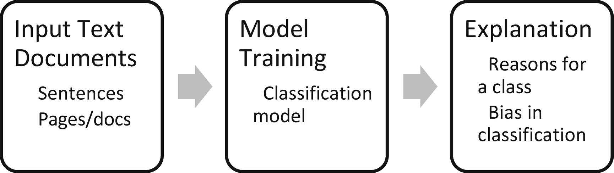

图 7-1

涉及 AI 模型的文本解释步骤

输入文本以向量的形式表示，并使用文档-词项矩阵来开发分类模型，最后需要使用可解释性库来解释预测的类别，以便了解哪些特征或词语负责预测特定的类别标签。

## 文本分类数据集

在本章中，你将使用来自 [`http://ai.stanford.edu/~amaas/data/sentiment/`](http://ai.stanford.edu/%257Eamaas/data/sentiment/) 的大型电影评论数据集。该数据集包含 50,000 条评论，其中 25,000 条已经用二分类标签（如正面或负面评论）进行了标注。另外还有 25,000 条评论用于测试。你将使用此数据集创建一个文本分类模型来预测电影评论。在预测之后，你将分析预测的原因，并进一步解释该文本分类机器学习模型中特征的重要性及其他可解释性要素。在此任务中，你将评论句子提供给机器学习模型，模型预测情感为正面或负面。因此，这里的 ML 模型被视为一个黑盒模型。这随之引发了一个问题：人们如何能信任来自黑盒模型的结果？

```
import warnings
warnings.filterwarnings("ignore")
import pandas as pd
from keras.datasets import imdb
imdb = pd.read_csv('IMDB Dataset.csv')
imdb.head()
```

IMDB 电影数据集包含评论和情感。情感被标注为正面和负面，这是一个二分类标签系统。评论会被清理，停用词会被移除，文本会被转换为向量。以下脚本展示了使用 `sklearn` 库的 `train_test_split` 函数将数据集拆分为训练集和测试集的过程：

```
from sklearn.model_selection import train_test_split
from sklearn.feature_extraction.text import CountVectorizer
from sklearn.linear_model import LogisticRegressionCV
from sklearn.pipeline import make_pipeline
vec = CountVectorizer()
clf = LogisticRegressionCV()
clf.fit(vec,imdb.sentiment)
```

为了将数据分配到训练集和测试集，你使用了 `sklearn` 库中的 `train_test_split` 函数。计数向量化器将词元转换并以向量的形式表示，这是来自语料库的文档-词项矩阵表示。计数向量被初始化并存储在 `vec` 中，然后带有交叉验证的逻辑回归模型被初始化以开发训练模型。初始化后的对象存储在 `clf` 中。最后一步是使用 `fit` 方法训练模型。

管道是一种方法，其中所有预处理步骤、模型训练步骤和验证步骤都可以被排序并一次性触发。在这个管道中，你将文本数据从单词转换为计数向量，然后传递给分类器。文本句子首先被转换为结构化的数据表。这是通过计算每个句子中出现的单词数量来实现的。在上面的例子中，评论被视为文档。每个文档被解析成单词。从所有评论中收集一个唯一的单词列表，然后将每个单词视为一个特征。如果你统计每个单词在不同评论中的出现次数，这被称为计数向量化器。由于这是一个电影评论情感分析数据集，它被分类为正面类别和负面类别，这构成了一个二分类问题。管道存储了转换和训练步骤的顺序，并通过调用 `sklearn` 库的 `fit` 方法来执行。

```
from sklearn import metrics
def print_report(pipe):
y_test = imdb.sentiment
y_pred = pipe.predict(imdb.review)
report = metrics.classification_report(y_test, y_pred)
print(report)
print("accuracy: {:0.3f}".format(metrics.accuracy_score(y_test, y_pred)))
print_report(pipe)
```

在上面的脚本片段中，你在测试数据集上预测情感，并计算分类准确率的误差指标。在这个例子中，分类准确率为 95%，这是一个非常好的准确率。


### 使用 ELI5 进行解释

为了解释文本分类模型，你需要安装可解释人工智能（XAI）库 `ELI5`。它被称为 *像对五岁小孩解释一样*。这个库可以通过 `pip install` 或使用 Anaconda 发行版中的 `conda install` 来安装。

```
!pip install eli5
import eli5
eli5.show_weights(clf, top=10) #此结果无意义，因为权重和特征名称不存在
```

安装好库之后，你可以编写一条导入语句来调用该库。

```
eli5.show_weights(clf,feature_names=vec.get_feature_names(),target_names=set(imdb.sentiment))
#有意义
```

对于基础线性分类器，`ELI5` 模块的结果是没有意义的。它提供了权重和特征。特征名称没有意义。为了让它们有意义，你可以传递特征名称和目标名称。

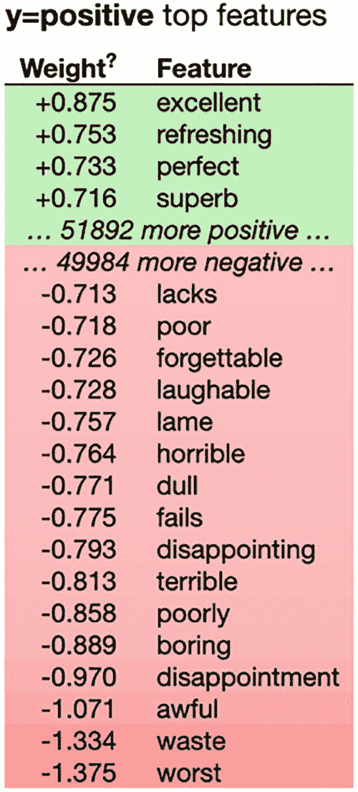

图 7-2

从模型中提取的用于正面情感类别的特征

图 7-2 中绿色的特征是对目标类别“正面”的正面特征，红色的则是负面特征，支持另一个类别。特征权重及其权重值表明了这些特征在将情感分类到一个类别时的相对重要性。

### 计算局部解释的特征权重

特征权重是通过决策路径计算的。决策路径遵循一系列 `if/else/then` 语句，这些语句将预测类别从树的根节点连接到树的各个分支。在上面的例子中，逻辑回归被用作训练情感分类器的模型，因此权重就是逻辑回归模型的系数。对于像随机森林或梯度提升模型这样的复杂模型，则会遵循树的决策路径。基本上，权重是你在模型训练阶段使用的估计器参数。

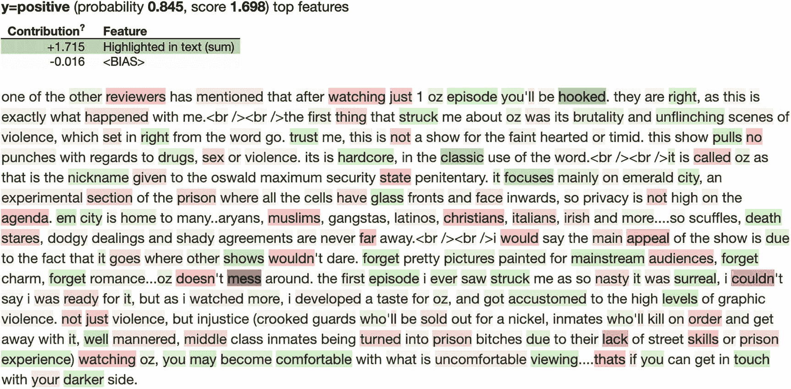

图 7-3

绘制句子中的重要特征以获得更清晰的展示

#### 局部解释示例 1

```
eli5.show_prediction(clf, imdb.review[0], vec=vec,
target_names=set(imdb.sentiment))        # 解释局部预测
```

`BIAS` 是逻辑回归分类器中的截距项。我们使用了计数向量器和线性分类器，因此映射关系非常清晰，每个词的权重对应线性分类器的系数。为了解释单个电影评论（这被称为局部解释），你可以将其传递给 `show_prediction` 函数。由于这是一个二分类器，可以计算对数几率。对数几率为 1.698。如果你使用公式 `exp(log odds)/1+exp(log odds)`，那么你会得到概率值 0.845。`review[0]` 有 84.5% 的概率属于正面情感。图 7-3 中绿色高亮显示的文本有助于提高对数几率分数，而红色文本则会降低对数几率分数。总贡献是每个绿色和红色文本贡献的总和，最终结果就是对数几率分数。

#### 局部解释示例 2

类似地，你可以解释编号为 123 和 100 的评论。评论 123 被分类为负面，负面类别的概率为 0.980。评论 100 被分类为正面，概率值为 0.670。见图 7-4。

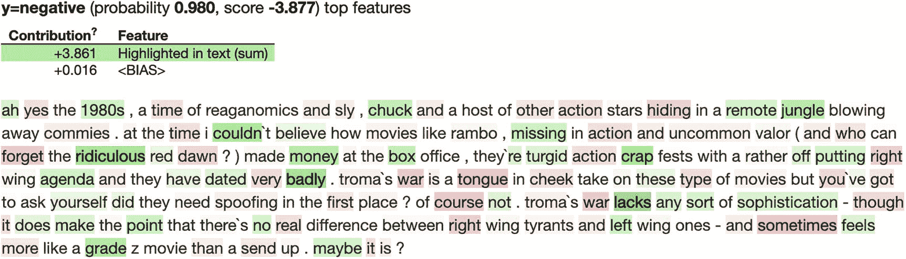

图 7-4

负面类别预测的局部解释

```
eli5.show_prediction(clf, imdb.review[123], vec=vec,
target_names=set(imdb.sentiment)) # 解释局部预测
```

#### 局部解释示例 3

在示例 1 中，你查看了第一条记录，其中正面类别的概率超过 80%。在示例 2 中，负面类别的概率为 98%。绿色高亮显示的词有助于预测的负面类别。见图 7-5。

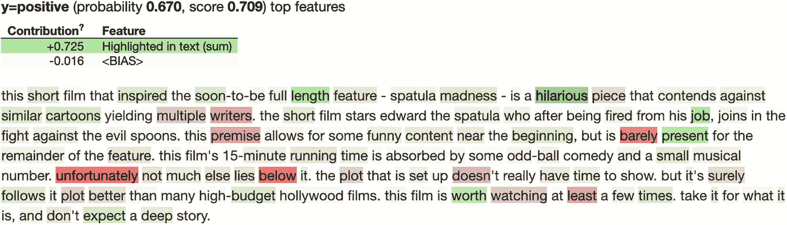

图 7-5

正面和负面类别的特征高亮显示

```
eli5.show_prediction(clf, imdb.review[100], vec=vec,
target_names=set(imdb.sentiment)) # 解释局部预测
```


#### 去除停用词后的解释

上述分析是在保留停用词的情况下进行的，目的是保持文本输入的上下文。如果从输入文本中移除停用词，那么输入向量中的一些冗余特征将被去除。你将能够获得更具意义的特征用于解释。偏置项是模型中的截距项。在上述脚本中，你查看的是未去除停用词的词袋模型。

```
vec = CountVectorizer(stop_words='english')
clf = LogisticRegressionCV()
pipe = make_pipeline(vec, clf)
pipe.fit(imdb.review, imdb.sentiment)
print_report(pipe)
```

**表 7-1** 优化后的分类器模型准确率如表 7-1 所示

| 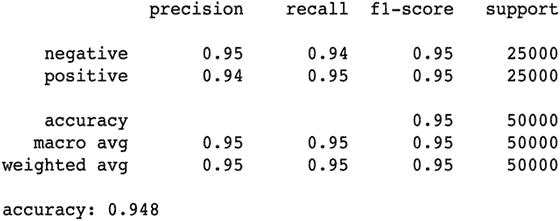 |

你尝试了线性分类器。随着模型复杂度的增加，你会得到更精细的标记和更精细的上下文。参见表 7-1。例如，你将逻辑回归模型更新为带有交叉验证的逻辑回归模型。你可以看到，评论编号 0 的概率分数更精细，为 78.7%，比之前的模型略低。

```
eli5.show_prediction(clf, imdb.review[0], vec=vec,
target_names=set(imdb.sentiment),
targets=['positive'])
```

电影评论文本（图 7-6）显示了一些关键词的重复。如果重复过多，计数向量化器中的计数将会膨胀。如果有很多词的计数被膨胀，那么这将在特征重要性列表中反映出来。为了避免计数向量化器中高词频的影响，你必须应用一种归一化方法，以便所有特征在分类过程中获得同等的重要性。为此，你可以引入一种新的向量化器，称为*词频-逆文档频率*，通常称为（tf-idf）向量化器。以下公式可用于计算 tf-idf 的值：

> *第 j 个文档中第 i 个词的 tf-idf 值 = 第 j 个文档中第 i 个词的词频 * log (文档总数 / 包含第 i 个词的文档数)*

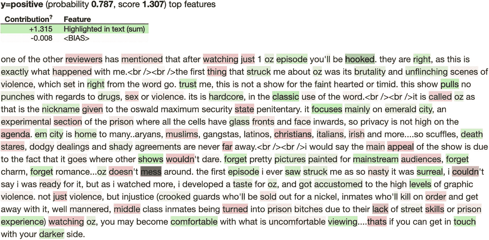

**图 7-6** 正面类别的高亮特征重要性

tf-idf 函数可以直接从 `sklearn` 库的文本模块特征提取中获得。你无需为语料库计算 tf-idf 值；可以应用以下方法：

```
from sklearn.feature_extraction.text import TfidfVectorizer
vec = TfidfVectorizer()
clf = LogisticRegressionCV()
pipe = make_pipeline(vec, clf)
pipe.fit(imdb.review, imdb.sentiment)
print_report(pipe)
```

**表 7-2** 基于 tf-idf 向量化器的模型分类报告

|  |

根据表 7-2 和图 7-7，应用 tf-idf 变换后，模型准确率没有明显差异。然而，概率值略有变化，分数也略有变化。

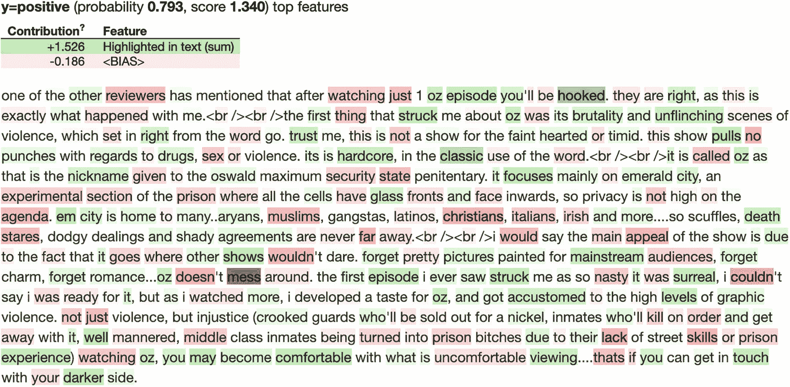

**图 7-7** 应用 tf-idf 后正面类别的特征高亮

```
eli5.show_prediction(clf, imdb.review[0], vec=vec,
target_names=set(imdb.sentiment),
targets=['positive'])
```

```
vec = TfidfVectorizer(stop_words='english')
clf = LogisticRegressionCV()
pipe = make_pipeline(vec, clf)
pipe.fit(imdb.review, imdb.sentiment)
print_report(pipe)
```

**表 7-3** 从 tf-idf 向量化方法中去除停用词后的分类报告

|  |

`Tf-idf` 是一种基于向量的文本数据表示方法。当基于计数的特征具有高频率时，这非常有用。为了避免高频词对分类算法的影响，最好使用基于 `tf-idf` 的向量化器。在初始化 `tf-idf` 向量化器时，如果提供了停用词选项，那么对于停用词将不会创建向量。同时，在 `tf-idf` 计算中也不会考虑停用词的计数。停用词被定义为本身没有意义，但能帮助我们结合其他词理解上下文的词。作为特征，它们对文本分类任务没有太多价值；相反，它们会增加数据的维度。因此，去除停用词将通过减少数据维度帮助你获得更好的准确率。参见图 7-8。

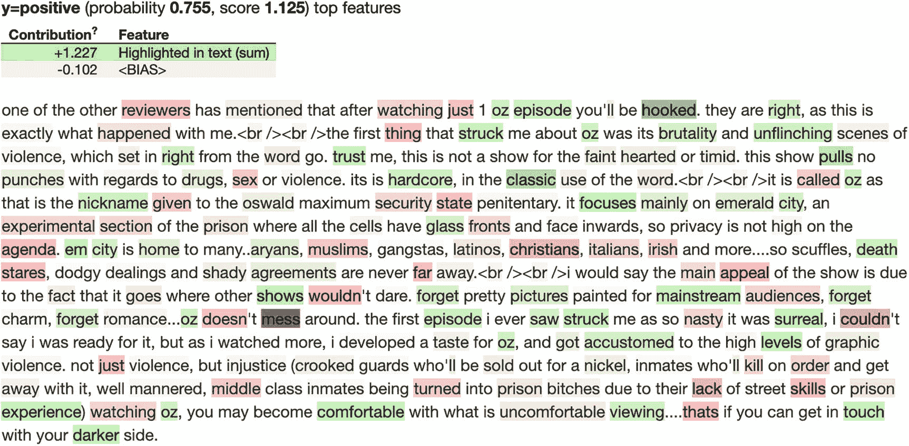

**图 7-8** 从更精细模型中高亮显示的重要特征

```
eli5.show_prediction(clf, imdb.review[0], vec=vec,
target_names=set(imdb.sentiment),
targets=['positive'])
```


### 基于 N-gram 的文本分类

让我们考虑两种开发文本分类模型的新方法。对于文本分类，你可以使用单词或字符。以下脚本分析字符并提取从二元组到五元组的特征，并将这些 n-gram 作为`tf-idf`向量化器中的特征。向量创建后，评论数据被输入到管道中进行模型训练。情感分类的训练准确率达到 99.8%，效果不错。现在你可以解释单个预测，并查看哪些因素有助于正面情感，哪些因素导致负面情感（见表 7-4 和图 7-9）。

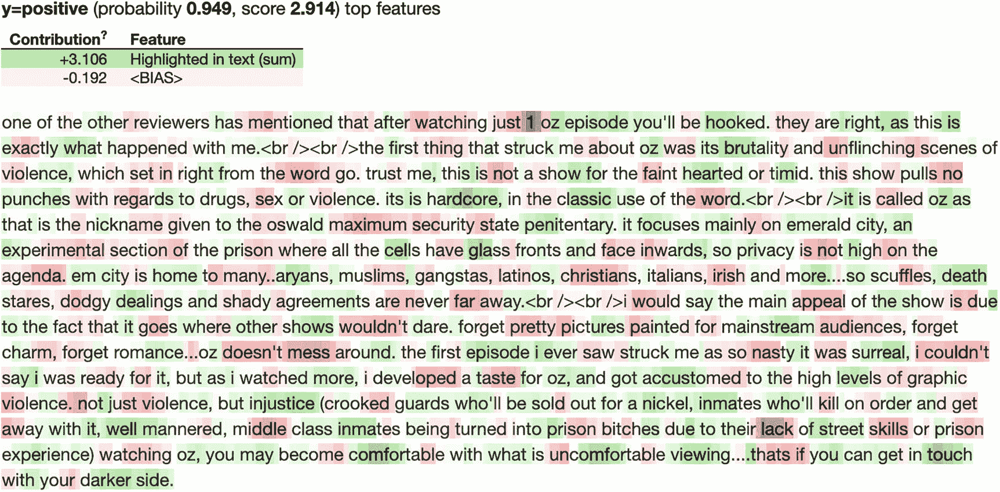

**图 7-9** 模型中二元组和五元组特征的高亮显示

**表 7-4** 采用基于 N-gram 的向量化器作为预处理方法，并考虑从二元组到五元组的 n-gram，使用`TF-IDF`向量化器创建训练模型，下表 7-4 显示了分类报告

| 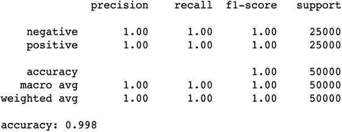 |

```
vec = TfidfVectorizer(stop_words='english', analyzer='char',
ngram_range=(2,5))
clf = LogisticRegressionCV()
pipe = make_pipeline(vec, clf)
pipe.fit(imdb.review, imdb.sentiment)
print_report(pipe)
```

```
eli5.show_prediction(clf, imdb.review[0], vec=vec,
target_names=set(imdb.sentiment),
targets=['positive'])
```

在上述脚本中，你选取了第一条评论的总贡献，即绿色和红色高亮文本元素的净结果，结果为+3.106。由于净结果为+3.106，它被归类为正面情感，同时显示正面情感的概率为 0.949，分类的对数几率为 2.914。-0.192 是偏置项，也称为逻辑回归模型的截距项。

当文本文档长度较短时，`CountVectorizer`是合适的。如果文本长度较长，意味着每个词在文本中出现频率高或重复多次，那么你应该使用`TfidfVectorizer`。`CountVectorizer`只是将单词及其频率以表格格式或数组形式表示。从以下脚本可以看出，带有停用词移除功能的`CountVectorizer`减少了特征数量，使其更具相关性。模型训练后，你可以看到准确率为 94.8%。

此外，当你解释第一条评论时，绿色和红色高亮文本的净结果总和为+1.315，由于净结果为正值，该情感被标记为正面情感，概率得分为 78.7%，对数几率得分为 1.307。你可以不断更新特征提取方法和模型类型，以改进预测效果。模型越好，情感分类的解释就越清晰。以下脚本展示了未经过停用词移除处理的`tf-idf`向量作为特征。

你可以在图 7-10 的高亮文本中看到，有一些停用词以及二元组和三元组没有被正确标记颜色。为了解决这个问题，你可以在分析器中使用`char_wb`选项。之前你已经见过`char`作为分析器，因为它将文本解析为字符形式的 n-gram，但这个过程耗时较长。此外，`char_wb`更适合微调，用于选取那些 n-gram 之间不重叠的特征。

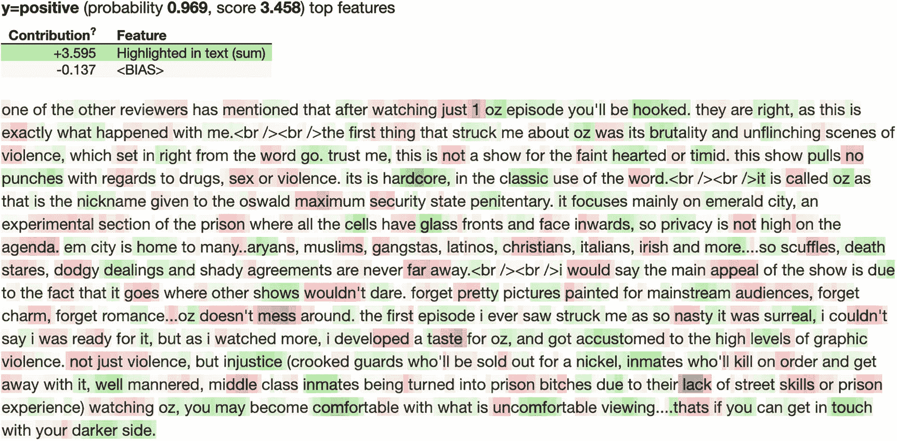

**图 7-10** 非重叠字符 N-gram 作为特征重要性

```
vec = TfidfVectorizer(stop_words='english', analyzer='char_wb',
ngram_range=(2,5))
clf = LogisticRegressionCV()
pipe = make_pipeline(vec, clf)
pipe.fit(imdb.review, imdb.sentiment)
print_report(pipe)
eli5.show_prediction(clf, imdb.review[0], vec=vec,
target_names=set(imdb.sentiment),
targets=['positive'])
```

这次结果看起来更好。例如，“watching just 1”是一个负面的 n-gram，它没有与其他任何 n-gram 重叠，这很有意义。类似地，其他 n-gram 也更加精细。如果电影评论只有几行文字，你可以使用`CountVectorizer`或`TfidfVectorizer`，但如果评论变得冗长，那么`HashingVectorizer`就能派上用场。当评论长度增加时，词汇量也会增大，因此`HashingVectorizer`非常有用。在以下脚本中，引入了`HashingVectorizer`与一种高级机器学习模型——随机梯度下降分类器相结合。这产生了比之前模型更好的效果（图 7-11）。这是因为之前的模型也存在轻微的过拟合。为了探索可解释性，你可以使用同样的第一条评论文本，解释分类标签，并查看哪些词对正面情感和负面情感有贡献。

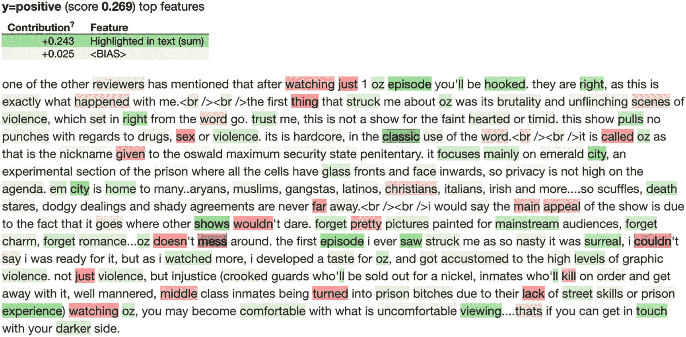

**图 7-11** 非常精细的高亮特征能更好地解释预测结果

```
from sklearn.feature_extraction.text import HashingVectorizer
from sklearn.linear_model import SGDClassifier
vec = HashingVectorizer(stop_words='english', ngram_range=(1,2))
clf = SGDClassifier(random_state=42)
pipe = make_pipeline(vec, clf)
pipe.fit(imdb.review, imdb.sentiment)
print_report(pipe)
eli5.show_prediction(clf, imdb.review[0], vec=vec,
target_names=set(imdb.sentiment),
targets=['positive'])
```

第一条评论是正面情感，总体正面得分为+0.243，得分为 0.269。它只考虑了绿色和红色文本高亮显示的相关特征。

```
from eli5.sklearn import InvertableHashingVectorizer
import numpy as np
ivec = InvertableHashingVectorizer(vec)
sample_size = len(imdb.review) // 10
X_sample = np.random.choice(imdb.review, size=sample_size)
ivec.fit(X_sample)
eli5.show_weights(clf, vec=ivec, top=20,
target_names=set(imdb.sentiment))
```

可逆哈希向量化器有助于在不拟合巨大词汇表的情况下，从哈希向量化器中提取特征权重及其对应的特征名称。图 7-12 中的笔记本输出显示了正面和负面特征。

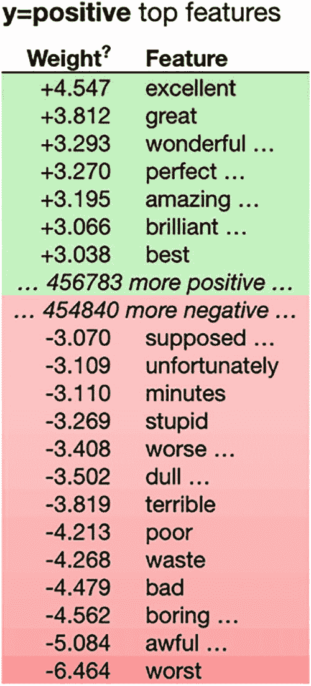

**图 7-12** 正面类别预测的顶级特征


### 多标签文本分类的可解释性

我们来看一下多类分类模型，即目标列中包含两个以上类别的情况。多类分类是另一种应用场景，其中因变量或目标列可以包含两个以上的类别或标签。这里需要的可解释性是针对每个对应的类别标签，因此需要展示重要的正向和负向特征。我们使用一个客户投诉数据集，其目标是预测客户投诉的类别或类型。

```
import pandas as pd
df = pd.read_csv('complaints.csv')
df.shape
df.info()
# 创建一个包含两列的新数据框
df1 = df[['Product', 'Consumer complaint narrative']].copy()
# 移除缺失值 (NaN)
df1 = df1[pd.notnull(df1['Consumer complaint narrative'])]
# 重命名第二列，使其更简洁
df1.columns = ['Product', 'Consumer_complaint']
df1.shape
# 由于计算耗时（就 CPU 而言），对数据进行了抽样
df2 = df1.sample(20000, random_state=1).copy()
# 重命名类别
df2.replace({'Product':
{'Credit reporting, credit repair services, or other personal consumer reports':
'Credit reporting, repair, or other',
'Credit reporting': 'Credit reporting, repair, or other',
'Credit card': 'Credit card or prepaid card',
'Prepaid card': 'Credit card or prepaid card',
'Payday loan': 'Payday loan, title loan, or personal loan',
'Money transfer': 'Money transfer, virtual currency, or money service',
'Virtual currency': 'Money transfer, virtual currency, or money service'}},
inplace= True)
df2.head()
pd.DataFrame(df2.Product.unique())
```

数据集的来源是 [`https://catalog.data.gov/dataset/consumer-complaint-database`](https://catalog.data.gov/dataset/consumer-complaint-database)`.` 该数据集经过清洗和准备，用于预测投诉类别。读取数据后，创建了 Python 对象 `DF`。以下输出显示了数据集中的前几条记录。

从 `DF` 中，你复制了一份仅包含客户投诉叙述和产品列的数据，用于开发多类分类模型，并将其赋值给 `DF1` 对象。然后，通过移除 NaN 值并为变量设置更简洁的名称来清理数据框。

那些包含更多文本的长描述被清理为更短、更合适的名称，以便你能更好地分析数据。客户投诉叙述涉及的产品类别共有 13 个唯一值。

```
# 创建一个新列 'category_id'，包含编码后的类别
df2['category_id'] = df2['Product'].factorize()[0]
category_id_df = df2[['Product', 'category_id']].drop_duplicates()
# 用于后续使用的字典
category_to_id = dict(category_id_df.values)
id_to_category = dict(category_id_df[['category_id', 'Product']].values)
# 新的数据框
df2.head()
df2.Product.value_counts()
```

为了模型训练的目的，你需要将目标列文本编码为数字。因此，你通过对产品列进行因子化来创建 `category_id` 列。上述脚本中的接下来两行代码创建了编码数字与类别描述之间的映射。这在生成预测后用于反向转换非常有用。在接下来的代码行中，你创建了一个 tf-idf 向量，其 n-gram 范围从 1 到 2，并移除了停用词，同时将次线性 TF 和最小文档频率设置为 5。如果你想减少文档长度带来的偏差，则必须将次线性词频设置为 TRUE。正如你从齐普夫定律所知，任何词的频率与其排名成反比。最小文档频率意味着在构建词汇表时，你应该忽略文档频率低于定义阈值的词项。在以下脚本中，该值为 5，这意味着任何频率低于 5 的词项都不会成为词汇表的一部分。

以下脚本的输出显示了多类分类目标列中每个类别的计数。以下脚本使用计数向量化器作为起点，为多类模型拟合了一个逻辑回归。

```
from sklearn.feature_extraction.text import CountVectorizer
from sklearn.linear_model import LogisticRegressionCV
from sklearn.pipeline import make_pipeline
vec = CountVectorizer()
clf = LogisticRegressionCV()
pipe = make_pipeline(vec, clf)
pipe.fit(df2.Consumer_complaint,df2.Product)
from sklearn import metrics
def print_report(pipe):
y_test = df2.Product
y_pred = pipe.predict(df2.Consumer_complaint)
report = metrics.classification_report(y_test, y_pred)
print(report)
print("accuracy: {:0.3f}".format(metrics.accuracy_score(y_test, y_pred)))
print_report(pipe)
```

根据图 7-13，模型准确率看起来不错，达到了 89%。在多类分类问题中，你通常会关注 f1 分数，它是精确率和召回率的调和平均值。f1 分数的可接受限度是 75% 或更高。你可以看到，对于消费贷款和其他金融服务，其 f1 分数低于 75%。作为起点，让我们看看分类问题中每个类别的词项权重。由于特征词项名称不可用，结果没有意义（图 7-14）。

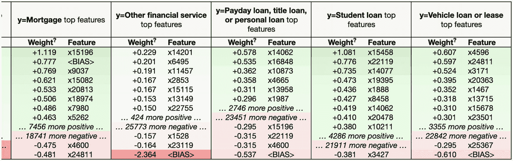

图 7-14

每个类别的重要特征示例


图 7-13

多类文本分类模型的分类准确率

```
import eli5
eli5.show_weights(clf, top=10)
#此结果没有意义，因为权重和特征名称不存在
```

由于图 7-14 中没有以词项形式提供的特征名称，你无法从中得出有意义的结论。你需要稍微修改脚本，如下所示，以包含来自 `vec` 对象的特征名称，并将目标名称作为唯一名称包含进来。因此，你可以看到，对类别标签有正向影响的词项显示为绿色，有负向影响的词项显示为红色。对于每个类别，例如银行账户、服务或消费贷款，你都可以看到最重要的特征。由于你有超过 10 个类别，无法在一个屏幕中容纳所有正向和负向词项，因此你每次至少截取 5 个标签的不同快照，以便于词项的可读性。

```
eli5.show_weights(clf,feature_names=vec.get_feature_names(),target_names=set(df2.Product))
#有意义
```

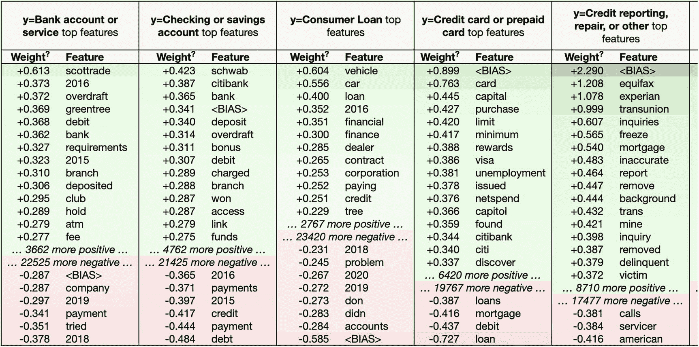

图 7-15

每个类别及其特征名称的最重要特征

图 7-15 中的输出显示了目标列中的前五个类别，展示了这五个类别及其最重要的正向和负向特征。

从这些表格中可以得到哪些关键要点？以 `mortgage` 类别为例。诸如 `mortgage`、`escrow`、`refinance`、`modification`、`servicer` 和 `ditech` 等词是帮助预测 `mortgage` 类别的最重要的正向特征。以类似的方式，你可以解释和说明所有其他类别以及客户投诉中实际帮助文本文档预测特定类别（即客户投诉的产品类别）的词项。因此，不仅仅是识别最重要的特征，而是整个上下文导致了类别标签的预测。


#### 局部解释示例 1

以下脚本和图 7-16 展示了第一条消费者投诉。对于“银行账户或服务”类别的预测概率非常低，仅为 0.008，这意味着第一条投诉不属于该类别。

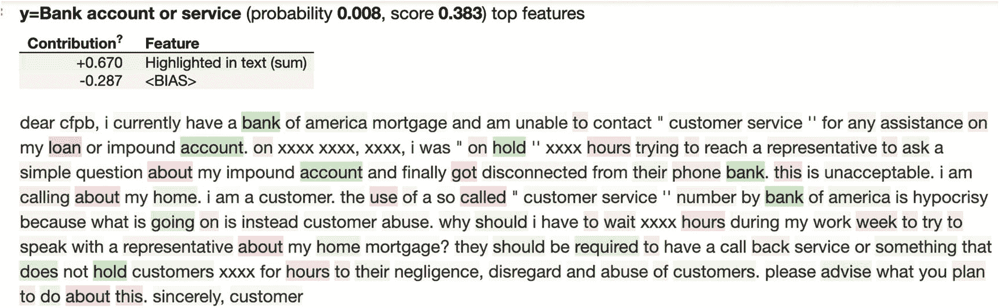

**图 7-16** 第一条投诉的类别预测解释

```
eli5.show_prediction(clf, np.array(df2.Consumer_complaint)[0], vec=vec,
target_names=set(df2.Product)) # 解释局部预测
np.array(df2.Consumer_complaint)[0]
```

由于概率为 0.083，第一条投诉不属于“支票或服务账户”类别（图 7-17）。

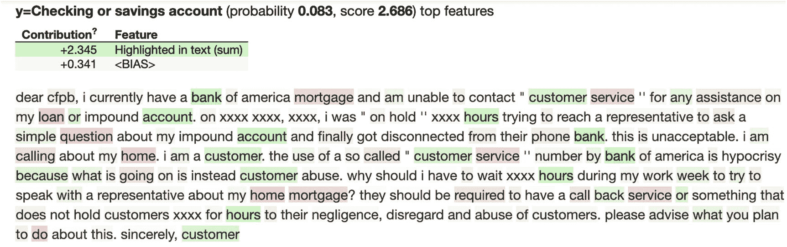

**图 7-17** “支票或储蓄账户”类别的特征重要性

图 7-18 显示，第一条消费者投诉属于“抵押贷款”类别，因为其概率为 84.3% 或 0.843。实际对预测有贡献的词语以绿色显示。

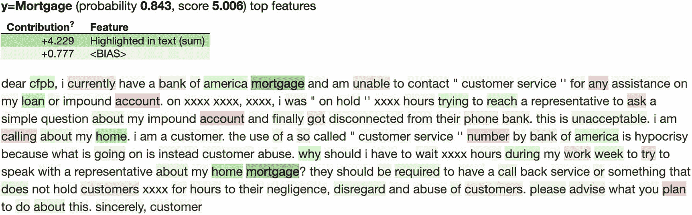

**图 7-18** “抵押贷款”类别预测的特征重要性

以下输出显示了第一条消费者投诉的实际文本：

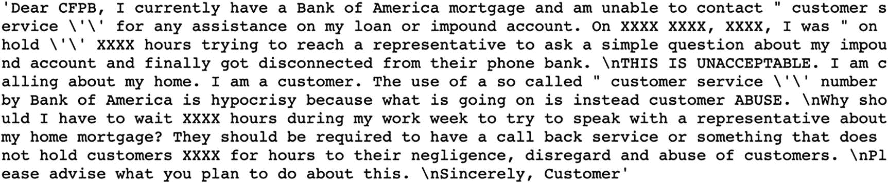

类似地，你可以检查第 123 号投诉，并发现该投诉属于“债务催收”类别。该文本属于“债务催收”类别的概率为 0.740（74%）。如果你根据实际贡献的文本解释预测，这被称为局部解释。

#### 局部解释示例 2

让我们看另一个例子，来自消费者投诉数据集的第 123 条记录。每个类别的特征重要性如下所示。以下脚本获取第 123 号投诉，生成的局部预测显示它属于“信用报告修复或其他”类别。概率为 0.515（51.5%）。见图 7-19。

```
eli5.show_prediction(clf, np.array(df2.Consumer_complaint)[100], vec=vec,
target_names=set(df2.Product)) # 解释局部预测
```

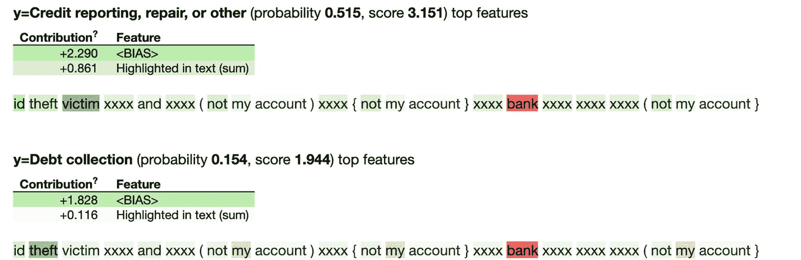

**图 7-19** 包含正面和负面词语的特征重要性

如上所述，上述输出未经任何预处理或微调。如果进一步微调和预处理文本，可以期待更精确的结果。标准做法是移除停用词。以下脚本移除了停用词并再次触发模型训练流程：

```
vec = CountVectorizer(stop_words='english')
clf = LogisticRegressionCV()
pipe = make_pipeline(vec, clf)
pipe.fit(df2.Consumer_complaint, df2.Product)
print_report(pipe)
eli5.show_prediction(clf, np.array(df2.Consumer_complaint)[0], vec=vec,
target_names=set(df2.Product))
```

由于许多投诉文本量不足，移除停用词后，丢失了许多特征，这就是准确率略微下降至 88.1% 的原因，如表 7-5 所示。

**表 7-5** 优化模型的多类别分类报告

|  |

#### 局部解释示例 1

你可以使用优化后的模型为第 0 号消费者投诉生成局部解释。概率分数现在略有优化，为 76.4%，如图 7-20 所示。

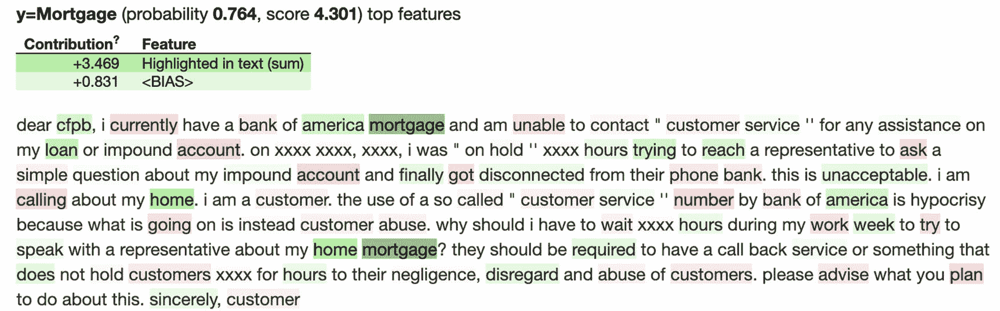

**图 7-20** 单条投诉预测的局部解释

```
eli5.show_prediction(clf, np.array(df2.Consumer_complaint)[0], vec=vec,
target_names=set(df2.Product))
```

类似地，将向量化器从计数向量更改为 tf-idf 向量，但不移除停用词，并观察这对局部解释的影响。你可以从以下脚本中看到这一点：

```
from sklearn.feature_extraction.text import TfidfVectorizer
vec = TfidfVectorizer()
clf = LogisticRegressionCV()
pipe = make_pipeline(vec, clf)
pipe.fit(df2.Consumer_complaint, df2.Product)
print_report(pipe)
```

根据表 7-6，tf-idf 方法似乎将整体准确率提升至 90.1%，并且第一条投诉的局部解释具有更好的概率分数 72.5%。

**表 7-6** tf-idf 向量化器模型的分类报告

|  |

```
eli5.show_prediction(clf, np.array(df2.Consumer_complaint)[0], vec=vec,
target_names=set(df2.Product))
```

下一步，尝试使用带有停用词移除的 tf-idf，观察第一条消费者投诉预测的局部可解释性是否有任何差异。见表 7-7。

**表 7-8** 迭代后，以下表 7-8 显示“抵押贷款”类别的多分类报告概率再次提升至 74.2%

| 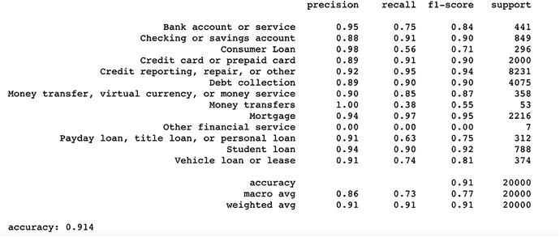 |

**表 7-7** 多类别分类模型的分类报告

|  |

```
vec = TfidfVectorizer(stop_words='english')
clf = LogisticRegressionCV()
pipe = make_pipeline(vec, clf)
pipe.fit(df2.Consumer_complaint, df2.Product)
print_report(pipe)
```

停用词移除对整体模型准确率没有重大影响。它从 90.1% 略微提升至 90.6%。同时，`mortgage` 类别的概率分数变为 73.5%。

```
eli5.show_prediction(clf, np.array(df2.Consumer_complaint)[0], vec=vec,
target_names=set(df2.Product))
```

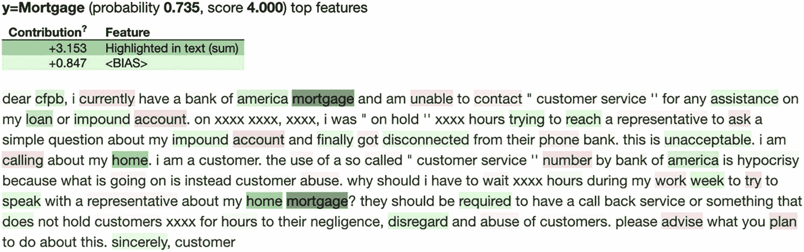

**图 7-21** 特征重要性对于理解各因素对分类的正负贡献是必要的，下图 7-21 以绿色背景突出显示正面特征，以红色背景突出显示负面特征重要性

作为进一步的改进步骤，你可以将字符作为分析器，并采用二元组到五元组进行特征创建。准确率较之前的结果略微提升至 91.4%。

```
vec = TfidfVectorizer(stop_words='english', analyzer='char',
ngram_range=(2,5))
clf = LogisticRegressionCV()
pipe = make_pipeline(vec, clf)
pipe.fit(df2.Consumer_complaint, df2.Product)
print_report(pipe)
```

```
eli5.show_prediction(clf, np.array(df2.Consumer_complaint)[0], vec=vec,
target_names=set(df2.Product))
```

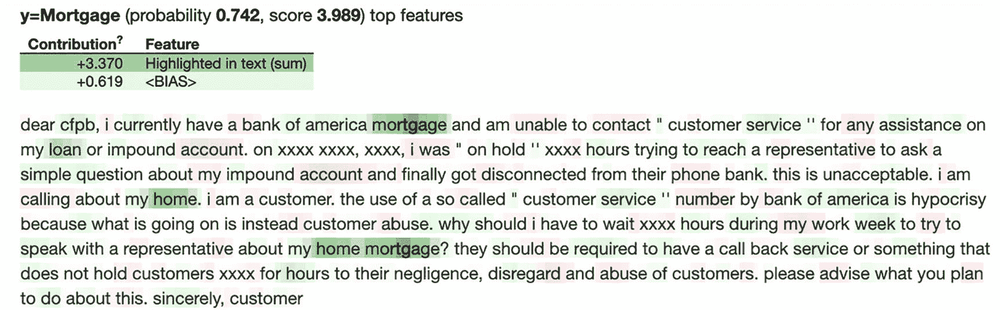

**图 7-22** 图 7-22 显示了作为特征的正面词语（以绿色背景突出显示）和作为特征的负面词语（以红色背景突出显示），针对“抵押贷款”类别


类似地，你可以使用 `char` 和非重叠二元语法（bigram）来创建特征，二元语法最高可达五元语法。这会将整体准确率降至最低水平 88.4%，但你可以检查局部解释，看看是否提高了可解释性。

```
vec = TfidfVectorizer(stop_words='english', analyzer='char_wb',
ngram_range=(2,5))
clf = LogisticRegressionCV()
pipe = make_pipeline(vec, clf)
pipe.fit(df2.Consumer_complaint, df2.Product)
print_report(pipe)
```

实际上，这并没有改善解释效果。如图 7-23 所示，只有“mortgage”这个词是重要的。其他单词都以非常浅的绿色高亮显示。甚至红色文本也非常微弱。

```
eli5.show_prediction(clf, np.array(df2.Consumer_complaint)[0], vec=vec,
target_names=set(df2.Product))
```

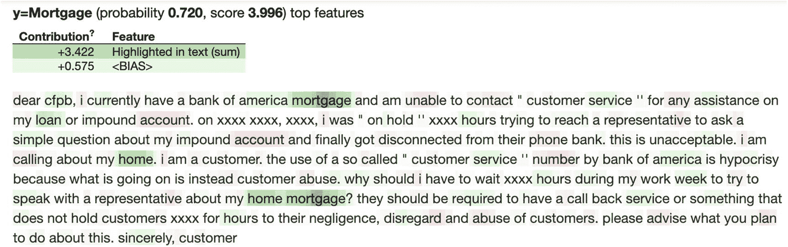

图 7-23

高亮显示的特征文本

为了处理词汇长度问题，你可以引入哈希向量化器（hashing vectorizer），并结合随机梯度提升模型作为分类器。准确率进一步下降至 85.7%。你仍然可以检查其解释。

```
from sklearn.feature_extraction.text import HashingVectorizer
from sklearn.linear_model import SGDClassifier
vec = HashingVectorizer(stop_words='english', ngram_range=(1,2))
clf = SGDClassifier(random_state=42)
pipe = make_pipeline(vec, clf)
pipe.fit(df2.Consumer_complaint, df2.Product)
print_report(pipe)
```

表 7-9

下表 7-9 显示了多分类报告中的准确率

| 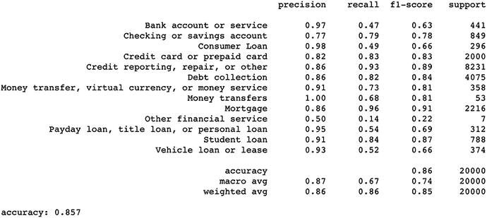 |

尽管整体模型准确率下降了，但概率分数却提高到了 78%。然而，只有主导特征“mortgage”主导了分类。其他特征并不重要。这是一个有偏见的模型。其他关键词的权重非常低。绿色和红色的强度定义了权重的值。例如，“mortgage”具有高权重，因为它显示为深绿色。所有其他单词都是浅绿色（图 7-24）。

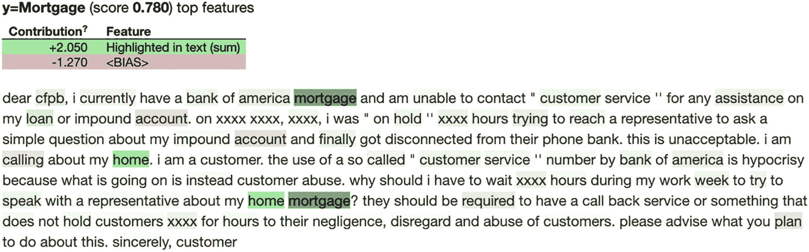

图 7-24

一个更精细、高亮效果更好的特征，用于预测“mortgage”类别

```
eli5.show_prediction(clf, np.array(df2.Consumer_complaint)[0], vec=vec,
target_names=set(df2.Product))
```

```
from eli5.sklearn import InvertableHashingVectorizer
import numpy as np
ivec = InvertableHashingVectorizer(vec)
sample_size = len(df2.Consumer_complaint) // 10
X_sample = np.random.choice(df2.Consumer_complaint, size=sample_size)
ivec.fit(X_sample)
eli5.show_weights(clf, vec=ivec, top=20,
target_names=set(df2.Product))
```

使用可逆哈希向量化器，你可以获取特征的名称及其在类别预测中的相对权重。参见图 7-25 至 7-27。

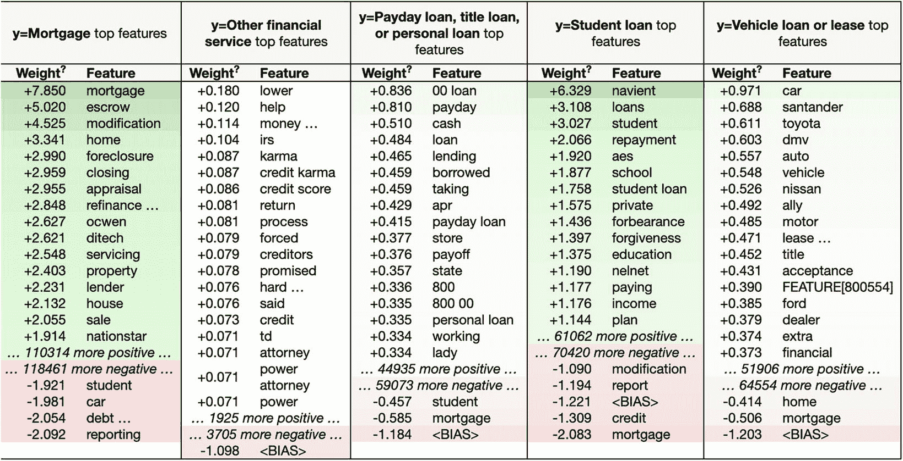

图 7-27

多分类问题中，每个类别对应的正负特征及其权重

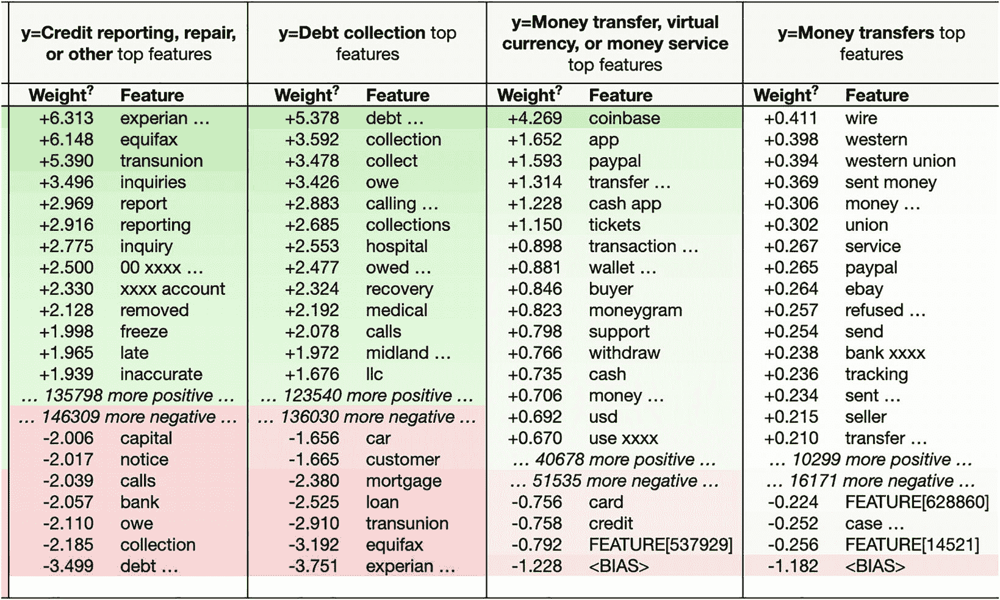

图 7-26

多分类问题中，每个类别对应的正负特征及其权重

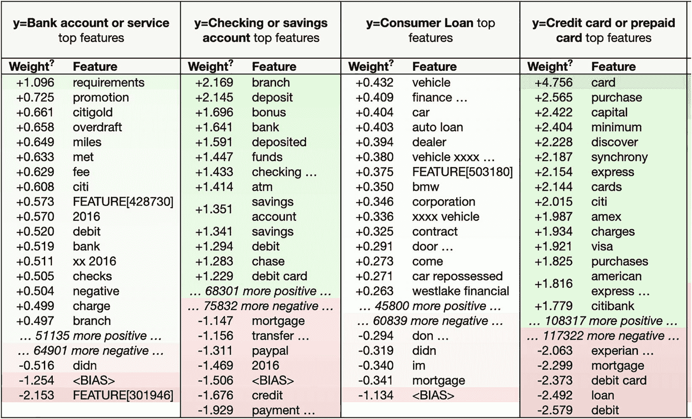

图 7-25

多分类问题中，每个类别对应的正负特征及其权重

## 结论

文本分类是自然语言处理领域最重要的用例。它可用于消费者投诉分类、将原始文本分类为各种实体，以及将情感分类为正面和负面。我们讨论的是二分类和多分类问题。其他用例包括主题建模和摘要，这些内容也包含在本章中，因为这些任务不属于监督式机器学习模型。你只考虑了监督式机器学习模型，因为当你生成预测类别结果时，解释性通常会丢失。用户自然会思考哪些标记或特征被考虑，以及为什么预测结果是如此这般等等。然而，对于基于无监督学习的 NLP 任务，有更简单的方法来理解关系，但无监督学习中没有需要向最终用户解释的预测。在本章中，你更多地关注了不同的预处理方法、模型及其可解释性。

