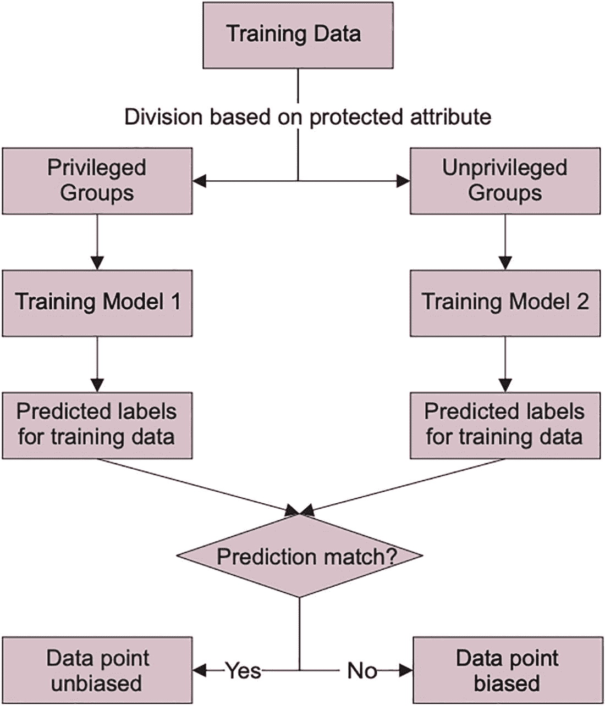
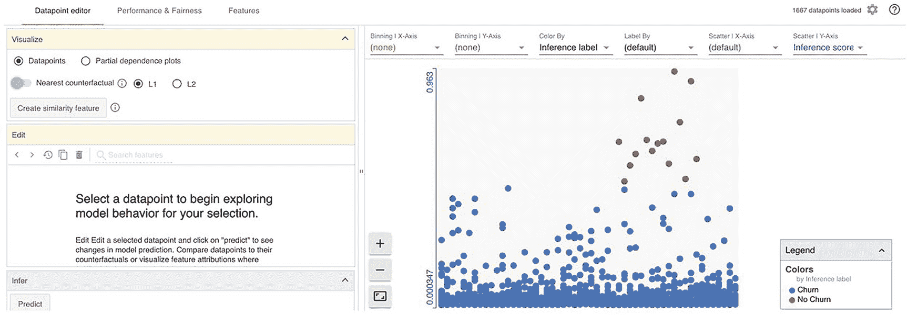
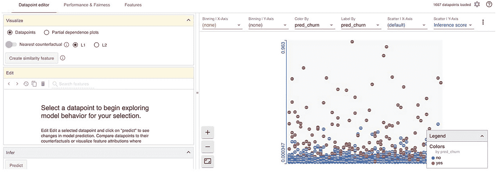
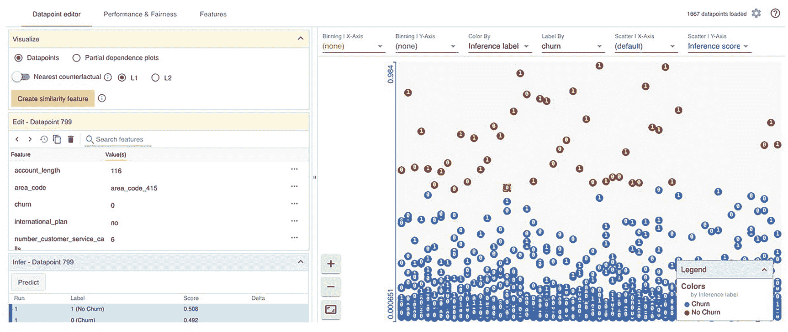
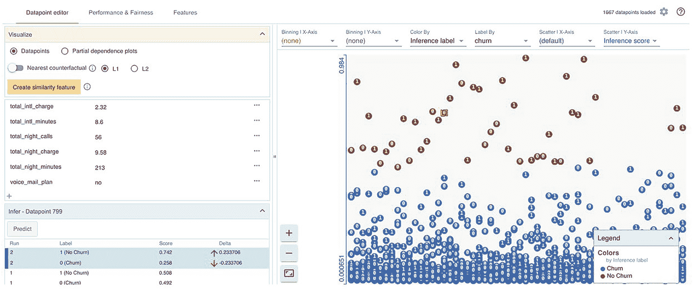
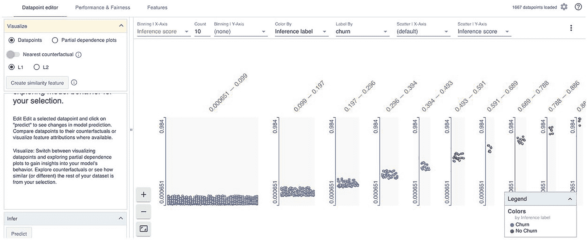
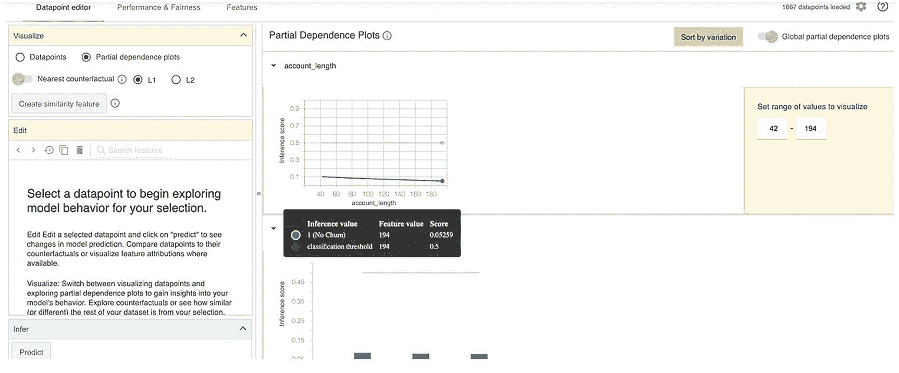
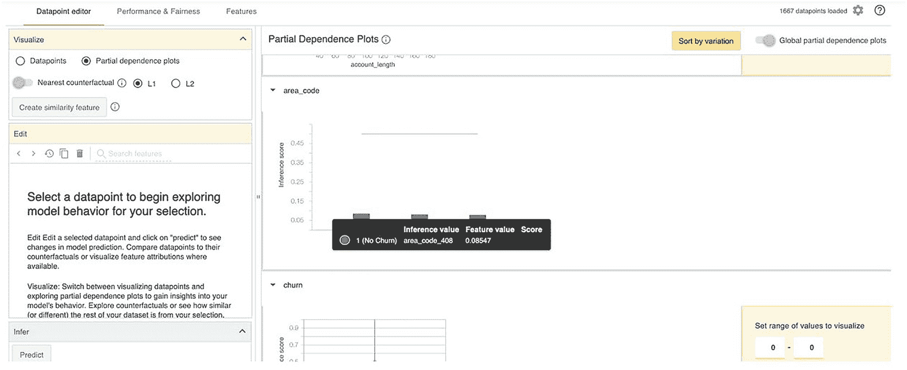
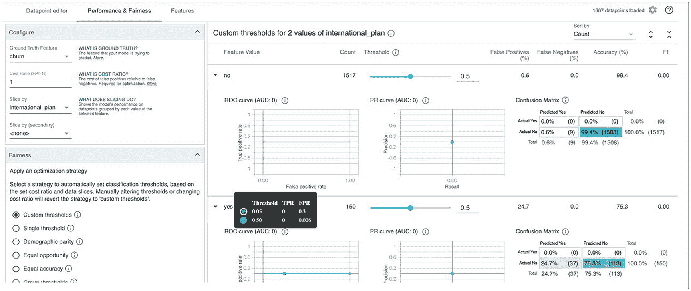
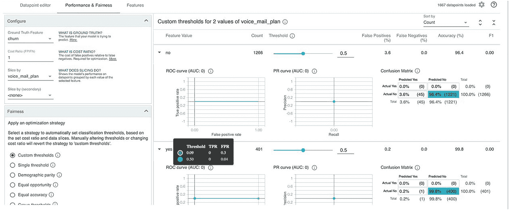

# 8. 使用假设场景实现 AI 模型公平性

本章解释了如何使用假设工具（WIT）来解释 AI 模型中的偏见，例如基于机器学习的回归模型、分类模型和多分类模型。作为数据科学家，你不仅负责开发机器学习模型，还要确保模型没有偏见，并且新观测值得到公平对待。探究决策并验证算法公平性至关重要。谷歌开发了假设工具（WIT）来解决机器学习模型中的模型公平性问题。你将看到 WIT 在三种可能的 ML 模型中的实现：用于回归任务的 ML、用于二分类模型的 ML 以及用于多项模型的 ML。

## 什么是 WIT？

假设工具（WIT）是谷歌于 2019 年发布的一款开源工具，用于探究机器学习模型。它旨在理解驱动因素与结果变量之间、数据点变化与结果变量之间的因果关系。这里的驱动因素指的是结果变量的独立预测因子。由于其易用性、吸引人的可视化效果和可解释性，WIT 工具得到了广泛的接受和采用。只需极少的编码，用户就可以直观地探究任何机器学习模型的学习行为。对训练好的机器学习模型进行各种输入的模拟，对于开发可解释 AI 和负责任 AI 是必要的。该 WIT 工具有三种格式：来自 Anaconda Navigator 窗口的常规 Jupyter Notebook、Google Colab Notebook 以及基于 TensorBoard 的可视化（适用于任何基于深度学习的模型）。当前可用的工具版本是 1.8.0，该版本克服了早期版本的某些限制。流程见图 8-1。



图 8-1

偏见识别流程图

训练数据可以根据你的问题，基于某些受保护属性进行划分。例如，假设你有种族和性别两个属性，并且你想从可解释性的角度得到答案，例如：

*   模型是否对特定种族存在偏见？
*   模型是否对特定性别（假设为男性和女性）存在偏见？

我们以第二点为例，将性别作为受保护变量。第一个性别是特权群体，第二个是非特权群体。你可以准备两个训练模型，并使用这两个模型对训练数据进行预测。如果对于任何特定记录，两个模型的预测结果一致，则该记录或数据点是无偏的；如果结果不同，则是有偏的。基于此，你可以判断模型是否对某个性别或种族存在偏见。


### 安装 WIT

以下是安装 What-If Tool 的代码：

```python
import pandas as pd
import warnings
warnings.filterwarnings("ignore")
!pip install witwidget
from witwidget.notebook.visualization import WitConfigBuilder
from witwidget.notebook.visualization import WitWidget
```

在从 notebook 环境运行 `WitWidget()` 函数之前，请先在命令行中运行以下两行代码：

```bash
jupyter nbextension install --py --symlink --sys-prefix witwidget
jupyter nbextension enable --py --sys-prefix witwidget
```

安装完成后，需要创建以下函数来准备用于模型创建和可视化的输入数据。以下脚本根据 TensorFlow 规范创建特征规范，因为 WIT 工具依赖 TensorFlow 后端来格式化输入数据：

```python
!pip install xgboost
# 如果在 xgboost 中遇到错误
# 请运行
conda install -c conda-forge xgboost
import pandas as pd
import xgboost as xgb
import numpy as np
import collections
import witwidget
from sklearn.model_selection import train_test_split
from sklearn.metrics import accuracy_score, confusion_matrix
from sklearn.utils import shuffle
from witwidget.notebook.visualization import WitWidget, WitConfigBuilder
```

你将使用 `churn` 数据集，因为你在其他章节中已经使用过它。

```python
df = pd.read_csv('ChurnData.csv')
df.head()
del df['Unnamed: 0']
df.head()
import pandas as pd
import numpy as np
import tensorflow as tf
import functools
# 根据数据框和指定的列创建 tf 特征规范。
def create_feature_spec(df, columns=None):
    feature_spec = {}
    if columns == None:
        columns = df.columns.values.tolist()
    for f in columns:
        if df[f].dtype is np.dtype(np.int64):
            feature_spec[f] = tf.io.FixedLenFeature(shape=(), dtype=tf.int64)
        elif df[f].dtype is np.dtype(np.float64):
            feature_spec[f] = tf.io.FixedLenFeature(shape=(), dtype=tf.float32)
        else:
            feature_spec[f] = tf.io.FixedLenFeature(shape=(), dtype=tf.string)
    return feature_spec
# 根据特征规范以及该规范中要使用的列列表，创建简单的数值型和类别型特征列。
#
# 注意：通过一些特征工程（例如分桶数值列和类别特征的哈希桶/嵌入列），模型可能会有更好的表现。
def create_feature_columns(columns, feature_spec):
    ret = []
    for col in columns:
        if feature_spec[col].dtype is tf.int64 or feature_spec[col].dtype is tf.float32:
            ret.append(tf.feature_column.numeric_column(col))
        else:
            ret.append(tf.feature_column.indicator_column(
                tf.feature_column.categorical_column_with_vocabulary_list(col, list(df[col].unique()))))
    return ret
```

在上述函数中，给定一个数据集，你可以验证输入数据，并格式化基于整数、浮点数和字符串的列。

以下实用函数根据基于 TensorFlow 的示例生成输入，用于模型训练步骤：

```python
# 一个用于从 tf.Examples 向模型提供输入的输入函数
def tfexamples_input_fn(examples, feature_spec, label, mode=tf.estimator.ModeKeys.EVAL,
                        num_epochs=None,
                        batch_size=64):
    def ex_generator():
        for i in range(len(examples)):
            yield examples[i].SerializeToString()
    dataset = tf.data.Dataset.from_generator(
        ex_generator, tf.dtypes.string, tf.TensorShape([]))
    if mode == tf.estimator.ModeKeys.TRAIN:
        dataset = dataset.shuffle(buffer_size=2 * batch_size + 1)
    dataset = dataset.batch(batch_size)
    dataset = dataset.map(lambda tf_example: parse_tf_example(tf_example, label, feature_spec))
    dataset = dataset.repeat(num_epochs)
    return dataset
```

以下函数使用特征规范函数定义的特征规范来解析 TensorFlow 示例函数：

```python
# 将 Tf.Example protos 解析为输入函数的特征。
def parse_tf_example(example_proto, label, feature_spec):
    parsed_features = tf.io.parse_example(serialized=example_proto, features=feature_spec)
    target = parsed_features.pop(label)
    return parsed_features, target
```

基于 TensorFlow 的模型需要将输入数据分批输入到训练步骤中。

```python
# 将数据框转换为 tf.Example protos 列表。
def df_to_examples(df, columns=None):
    examples = []
    if columns == None:
        columns = df.columns.values.tolist()
    for index, row in df.iterrows():
        example = tf.train.Example()
        for col in columns:
            if df[col].dtype is np.dtype(np.int64):
                example.features.feature[col].int64_list.value.append(int(row[col]))
            elif df[col].dtype is np.dtype(np.float64):
                example.features.feature[col].float_list.value.append(row[col])
            elif row[col] == row[col]:
                example.features.feature[col].bytes_list.value.append(row[col].encode('utf-8'))
        examples.append(example)
    return examples
```

以下函数将用户提供的数据框中的某一列转换为二进制值（0 和 1）列。该函数强制标签列变为数值型，以用于二分类模型。类似地，对于多分类模型，标签或目标列也会通过应用标签编码器函数变为标签编码器列。

```python
# 根据提供的测试条件，将数据框中的某一列转换为 0 和 1 的列。
# 用于在使用 TF 估计器进行二分类时强制标签列变为数值型。
def make_label_column_numeric(df, label_column, test):
    df[label_column] = np.where(test(df[label_column]), 1, 0)
```

你在本章中研究的用例是一个电信客户流失分类场景。电信客户的使用历史被纳入考量，例如账户时长、客户所在地区号、州代码、是否开通国际套餐、语音邮件套餐、语音邮件数量、日间总通话时长（分钟）、日间总通话次数以及日间总费用。与日间类似，晚间和夜间的使用详情也被视为特征。这些特征有助于你预测未来客户流失的可能性。如果你能提前预测出正确的结果，那么就可以处理可能导致客户流失的因素，从而留住客户。留住客户总是比获取新客户更可取。获取新客户成本高昂，而留住现有客户的成本则要低得多。因此，在客户流失预测过程中，你可以通过识别流失原因并提前验证偏差和假设情景，来制定相关策略以防止客户流失。


```python
import numpy as np
# 设置数据集中希望模型预测的列
label_column = 'churn'
# 将标签列转换为数值（0 和 1），以便在模型中使用。
# 在此示例中，目标值为'yes'的样本被视为正类（'1'），
# 所有其他样本被视为负类（'0'）。
make_label_column_numeric(df, label_column, lambda val: val == 'yes')
# 设置我们将用于模型输入的数据集中所有列的列表。
input_features = [
'account_length', 'area_code', 'international_plan',
'voice_mail_plan', 'number_vmail_messages', 'total_day_minutes',
'total_day_calls', 'total_day_charge', 'total_eve_minutes',
'total_eve_calls', 'total_eve_charge', 'total_night_minutes',
'total_night_calls', 'total_night_charge', 'total_intl_minutes',
'total_intl_calls', 'total_intl_charge',
'number_customer_service_calls']
# 创建一个包含所有输入特征和标签列的列表
features_and_labels = input_features + [label_column]
features_and_labels
examples = df_to_examples(df)
num_steps = 5000  #@param {type: "number"}
# 为分类器创建特征规范
feature_spec = create_feature_spec(df, features_and_labels)
# 定义并训练分类器
train_inpf = functools.partial(tfexamples_input_fn, examples, feature_spec, label_column)
classifier = tf.estimator.LinearClassifier(
feature_columns=create_feature_columns(input_features, feature_spec))
classifier.train(train_inpf, steps=num_steps)
test_df = pd.read_csv('churnTest.csv')
num_datapoints = 2000
tool_height_in_px = 700
from witwidget.notebook.visualization import WitConfigBuilder
from witwidget.notebook.visualization import WitWidget
make_label_column_numeric(test_df, label_column, lambda val: val == 'yes')
test_examples = df_to_examples(test_df[0:num_datapoints])
# 使用测试样本和训练好的分类器设置工具
config_builder = WitConfigBuilder(test_examples).set_estimator_and_feature_spec(
classifier, feature_spec).set_label_vocab(['流失', '未流失'])
WitWidget(config_builder, height=tool_height_in_px)
```

测试数据集包含 1667 个样本，你将使用谷歌的 What-If 工具对其进行可视化。上述脚本会生成一个包含两个面板的可视化界面。左侧面板显示各种选项，例如数据点编辑器、模型性能和公平性以及特征。右侧面板显示可视化结果和其他选项。



**图 8-2** 通过 WIT 探索模型行为

在图 8-2 中，左侧模块包含数据点和部分依赖图，这些属于数据点编辑器。第二个选项卡包含性能和公平性选项，第三个选项卡包含特征。在右侧，Y 轴显示推理分数，并按推理标签排序。红点代表未流失客户，蓝点代表流失客户。这里的标签选项为默认设置。



**图 8-3** 按预测类型表示流失与未流失

在图 8-3 中，蓝点代表未流失案例，红点代表流失案例。从测试数据集中看，如果考虑记录编号 1073，其流失概率为 0.016%，未流失概率为 98.4%，这是一个很好的预测。然而，当查看样本编号 799 时，流失概率为 49.2%，未流失概率为 50.8%。这类案例对模型来说相当模糊。你的预测模型不知道如何区分流失和未流失案例。默认情况下，WIT 工具使用 0.5 的分类阈值。如果概率阈值超过 0.5，则预测为正类；否则，预测为负类。这里正类是未流失，负类是流失。在面板右侧，散点图显示了推理分数，即概率分数。如果推理分数大于 0.5，则为正类；否则为负类。存在一些边界案例，因此需要额外的模型微调。因此，为了获得更好的结果，使用各种超参数对模型进行微调至关重要。见图 8-4。



**图 8-4** 数据点 799 分析

左侧面板的数据点编辑器可以查看和编辑记录的各个值，并显示预测推理的变化。这展示了模型推理的能力以及对预测结果的详细解释。对于同样的样本编号 799，当你将`account_length`的单个值改为 210，`total_day_calls`改为 227，并更改某些其他参数，然后点击左侧菜单中的“预测”按钮，你可以看到流失推理分数从 49.2%下降到 25.8%，未流失概率从 50.8%上升到 74.2%，这对应于模拟的运行 2。见图 8-5。



**图 8-5** 特征值微小变化导致的推理分数变化

你还可以看到单个特征的部分依赖图（PDP）。简而言之，PDP 图显示了一个或两个特征对机器学习模型预测结果的边际贡献。

图 8-6 显示了模型预测的流失和未流失案例的分布。考虑到 X 轴上的推理分数，推理分数低于 10%。所有案例都被预测为流失。这里需要注意的一点是，在推理分数为 49%到 59%的区间内，你可以看到流失和未流失案例同时存在，这表明模型缺乏预测能力，因为你的模型在这个区间内没有学习到流失和未流失类别之间的差异。



**图 8-6** 流失预测的推理分数桶视图

在图 8-6 中，推理分数被分成 10 个组，视图显示了每个桶中两个类别的存在情况。此视图有助于你选择应用于目标类别分类的阈值。该阈值应用于概率值。

所有用作模型输入变量的自变量的部分依赖图如图 8-7 所示。PDP 按变异程度排序。



**图 8-7** 账户长度的部分依赖图


随着账户时长的增加，推理得分逐渐降低。参见图 8-8。



**图 8-8**  
区号变量的部分依赖图

在评估模型的整体性能时，您可以考虑混淆矩阵，它展示了模型中流失与非流失案例的匹配与不匹配情况。



**图 8-9**  
性能与公平性界面

在图 8-9 所示的性能与公平性界面中，您可以看到 ROC 曲线、AUC 曲线、混淆矩阵以及成本比率。您可以更改阈值概率值来改变分类矩阵。

### 评估指标

**精确率**：模型正确预测正标签的频率

**召回率**：模型正确预测数据集中正类别的比例是多少？



**图 8-10**  
显示模型准确率的评估界面

## 结论

本章讨论了如何使用 What-If 工具解释分类模型结果的推理过程，以及如何识别在区分流失与非流失案例中起关键作用的特征。此外，您还使用了针对单个数据点进行局部解释的方法。

