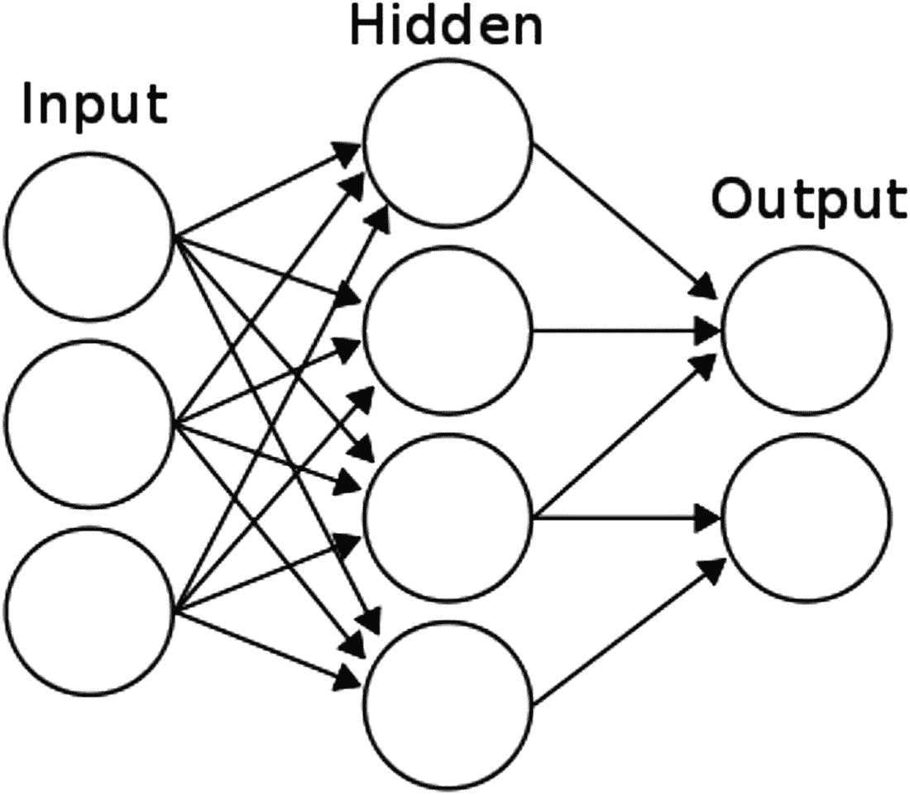
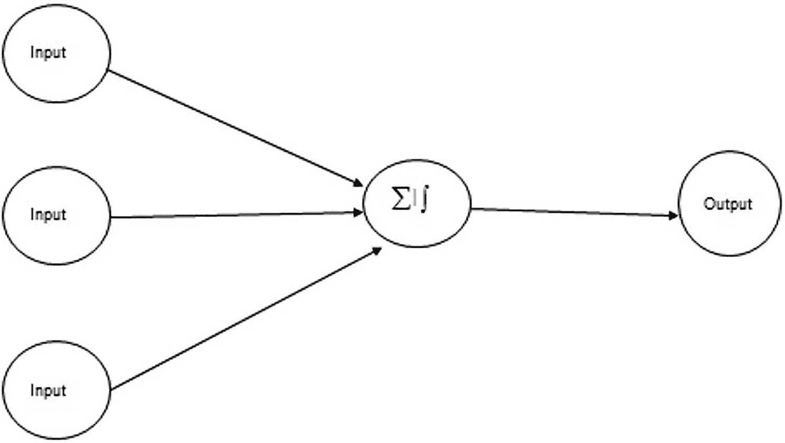
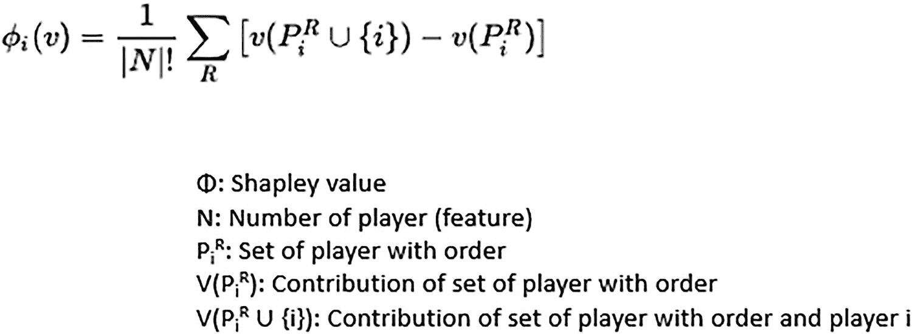

# 9. 深度学习模型的可解释性

基于深度神经网络的模型正逐渐成为人工智能和机器学习实现的支柱。数据挖掘的未来将由基于人工神经网络的先进建模技术所主导。那么，既然神经网络早在 20 世纪 50 年代就被发明出来，为何如今它们变得如此重要？借用计算机科学领域的定义，神经网络可以被描述为一个并行信息处理系统，其中输入相互连接，就像人脑中的神经元一样，以传递信息，从而执行人脸识别和图像识别等活动。理论上，神经网络已经存在了 50 多年，但神经网络项目在实际场景中的执行，是在计算能力取得某些进步之后才成为可能的，特别是 GPU 和 TPU 在执行高端计算、大规模矩阵乘法等方面的演进。在本章中，您将学习基于神经网络的方法在各种数据挖掘任务（如分类、回归、预测和特征降维）中的应用。人工神经网络（ANN）的功能类似于人脑的工作方式，其中数十亿个神经元相互连接，用于信息处理和洞察生成。

## 解释深度学习模型

大脑的生物网络为现实场景中连接元素以进行信息处理和洞察生成提供了基础。神经元通过层级结构连接，其中一层的输出成为另一层的输入。信息以权重的形式从一层传递到另一层。与每个神经元相关的权重包含洞察信息，使得下一层的识别和推理变得更加容易。人工神经网络是一种非常流行且有效的方法，它由与权重相关联的层组成。不同层之间的关联由一个数学方程控制，该方程将信息从一层传递到另一层。事实上，一个人工神经网络模型内部运行着一系列数学方程。图 9-1 展示了一个基于神经网络的模型的一般架构，其中显示了输入层、输出层和隐藏层。



**图 9-1**  
示例神经网络结构

存在三个层（输入层、隐藏层和输出层），它们是任何基于神经网络的架构的核心。ANN 是解决许多现实世界问题（如分类、回归和特征选择）的强大技术。ANN 能够以新输入数据的形式从新经验中学习，以提高基于分类或回归任务的性能，并使其自身适应输入环境的变化。图 9-1 中的每个圆圈代表一个神经元。深度学习的主要优势之一是我们不必专注于为模型训练创建手工特征。特征交互不需要由人类创建；它们应该在训练过程中自动创建。

从算法或计算的角度来看，神经网络有不同的变体，它们被用于多种不同的场景。下面我将从概念上解释其中几种，以便您理解它们在实际应用中的用途。

- **单隐藏层神经网络**：这是最简单的神经网络形式，如图 9-1 所示。其中只有一个隐藏层。
- **多隐藏层神经网络**：在这种形式中，有多个隐藏层连接输入数据和输出数据。这种形式的计算复杂度增加，并且需要系统提供更多的计算能力来处理信息。
- **前馈神经网络**：在这种神经网络架构形式中，信息从一层向另一层单向传递；没有从第一级学习开始的迭代。
- **反向传播神经网络**：在这种神经网络形式中，有两个重要步骤。前馈过程将信息从输入层传递到隐藏层，再从隐藏层传递到输出层。其次，它计算误差并将其反向传播到前面的层。

还有另一种基于用途和结构的分类，可以解释如下：

- **循环神经网络（RNN）**：主要用于序列信息处理，例如音频处理、文本分类等。
- **深度神经网络（DNN）**：用于高维结构化数据问题，其中特征交互非常复杂，以至于手动构建每个特征非常繁琐。
- **卷积神经网络（CNN）**：主要用于图像数据，其中像素尺寸会产生高维矩阵。需要以卷积的方式综合信息来对图像进行分类。

前馈神经网络模型架构如图 9-2 所示，反向传播方法将在下一节中解释。



**图 9-2**  
基本前馈神经网络结构

## 将 SHAP 与深度学习结合使用

如前几章所述，SHAP 是一个出色的库，适用于各种模型解释、局部模型解释和全局模型解释，其解释基于 Shapley 值。了解什么是 Shapley 值很重要；这个 Shapley 值完全依赖于博弈论方法。以下公式解释了 Shapley 值在库内部是如何计算的：




### 使用 Deep SHAP

Deep SHAP 是一个用于从基于深度学习（使用 Keras 或 TensorFlow 构建）的模型中推导 SHAP 值的框架。你可以以 MNIST 数据集为例，其中某个样本数据点显示了数字的像素值，并且训练了一个深度学习模型来对图像进行分类。SHAP 值如下所示。

如果我们将机器学习模型与深度学习模型进行比较，机器学习模型仍然是可解释的，但神经网络模型，尤其是深度神经网络模型，本质上是黑盒，这阻碍了 AI 模型在工业界的应用，因为没有人能够解释深度学习模型预测的应用。深度学习重要特征（DeepLIFT）是一个于 2019 年 10 月出现的框架。它旨在应用一种方法来分解深度神经网络模型的输出预测。这是通过反向传播深度神经网络中所有神经元对输入每个特征的贡献来实现的。DeepLIFT 框架通过将每个神经元的激活与其对应的激活进行比较，并分配一个分数（称为贡献分数）来实现这一点。

### 使用 Alibi

除了 DeepLIFT 和 Deep SHAP 之外，还有另一个名为 Alibi 的开源库。它是一个基于 Python 的库，旨在解释机器学习模型。以下代码说明了如何安装 Alibi 以及如何使用另一个名为 Ray 的库来加速对 Alibi 的搜索。

```
!pip install alibi
```

上述代码安装了用于解释模型的 Alibi 库。

```
!pip install alibi[ray]
```

`alibi[ray]` 库是一个依赖库，也需要安装。

```
!pip install tensorflow_datasets
```

你可以使用 `tensorflow_datasets` 从该库中收集一些数据集，以便在本章中使用。

```
!pip install keras
```

Keras 库用于训练深度学习模型。

```
from __future__ import print_function
import keras
from keras.datasets import mnist
from keras.models import Sequential
from keras.layers import Dense, Dropout, Flatten
from keras.layers import Conv2D, MaxPooling2D
from keras import backend as K
import matplotlib.pyplot as plt
%matplotlib inline
batch_size = 128
num_classes = 10
epochs = 12
# input image dimensions
img_rows, img_cols = 28, 28
```

MNIST 是一个数字分类数据集，包含手写数字的图片，并由专家标注，以便模型学习模式。`Conv2D` 是一个二维卷积层，它转换权重并对图像像素执行空间卷积。你在 `Conv2D` 中提供的值是卷积层将要学习的滤波器数量。卷积之后，需要最大池化来在低维空间中压缩表示像素。因此，每个卷积层都需要一个最大池化层。最大池化层还需要一个输出矩阵大小。在以下脚本中，你在 `Conv2D` 层中使用了 32 个滤波器，内核大小或滤波器大小为 (3,3)。最大池化通常用于减少输出体积的空间维度。内核大小必须是奇数组合，例如 (1,1)、(3,3) 或 (5,5)，以确保内核滤波器平滑地遍历空间空间。`Stride` 是使滤波器在像素空间中移动的值。`stride =1` 意味着滤波器在像素矩阵中向右移动一个位置。一旦到达像素矩阵的边缘，它就会向下移动，一直移动到可能的最低行，然后向左移动。当你在像素空间中移动奇数内核以收集所有卷积特征时，有时滤波器不会到达像素矩阵的边缘。为了实现这一点，你在原始像素矩阵周围添加一行和一列。这称为填充。填充可以是零填充和相同填充。

```
# the data, split between train and test sets
(x_train, y_train), (x_test, y_test) = mnist.load_data()
if K.image_data_format() == 'channels_first':
x_train = x_train.reshape(x_train.shape[0], 1, img_rows, img_cols)
x_test = x_test.reshape(x_test.shape[0], 1, img_rows, img_cols)
input_shape = (1, img_rows, img_cols)
else:
x_train = x_train.reshape(x_train.shape[0], img_rows, img_cols, 1)
x_test = x_test.reshape(x_test.shape[0], img_rows, img_cols, 1)
input_shape = (img_rows, img_cols, 1)
x_train = x_train.astype('float32')
x_test = x_test.astype('float32')
x_train /= 255
x_test /= 255
print('x_train shape:', x_train.shape)
print(x_train.shape[0], 'train samples')
print(x_test.shape[0], 'test samples')
```

上述脚本展示了从 Keras 库获取数据，并使用加载的数据对训练样本和测试样本进行归一化的一般步骤。这是通过将每个像素值除以其最大像素值来完成的。之后，60,000 个样本用于训练，10,000 个样本用于测试。这里的图像大小为 28 x 28 像素，批量大小为 128，类别数为 10，每个数字对应一个类别图像。此外，你使用 10 次迭代或周期来训练模型。


