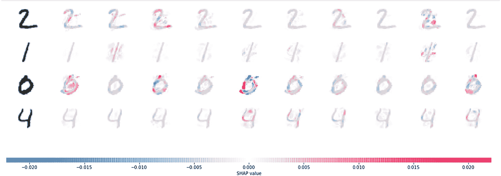
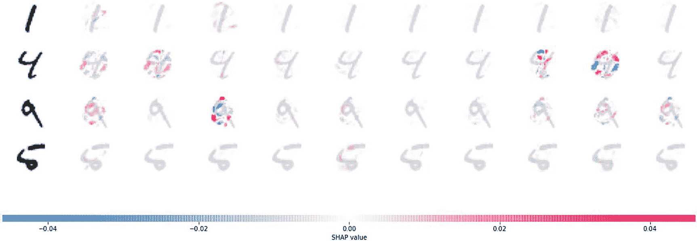
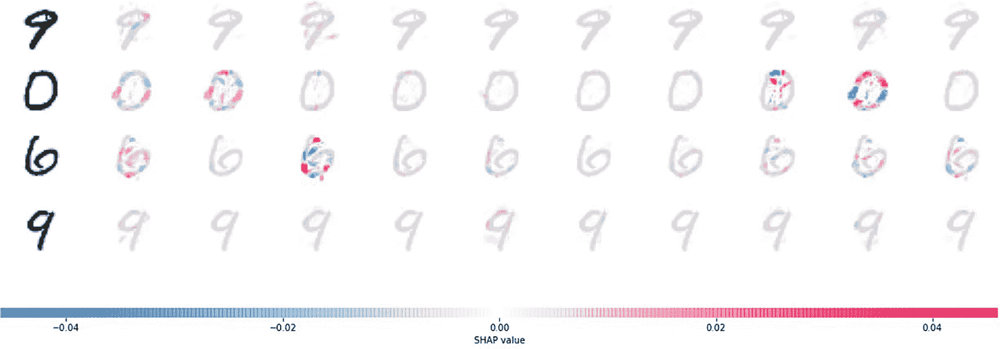
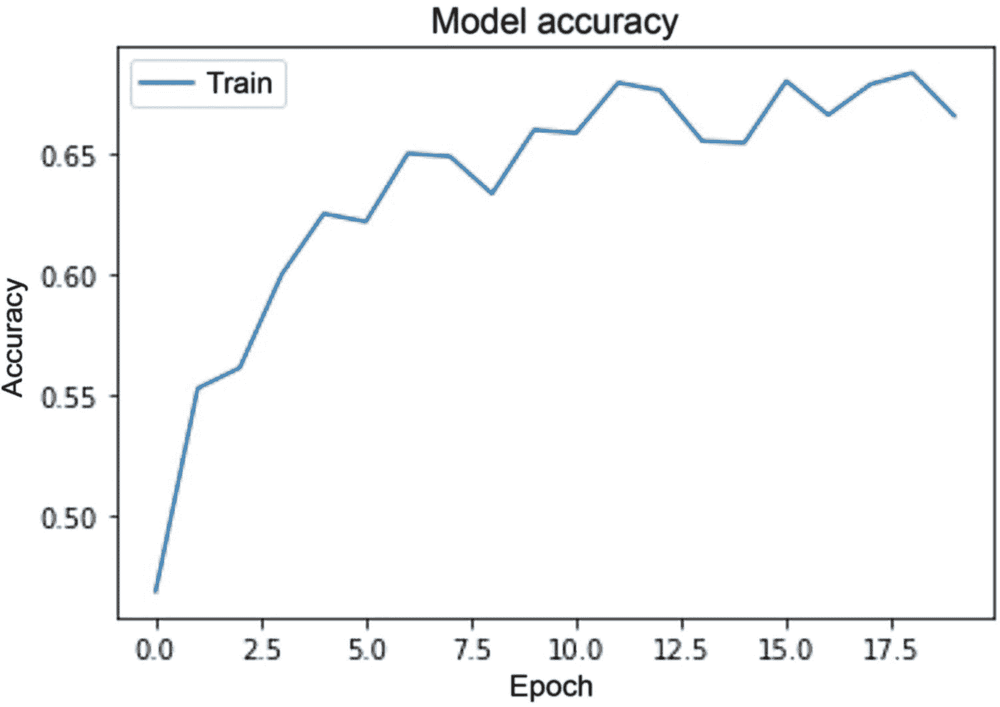
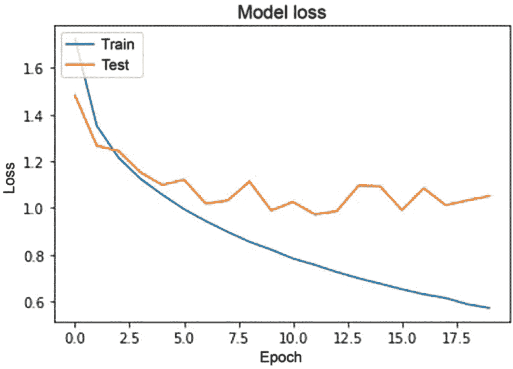
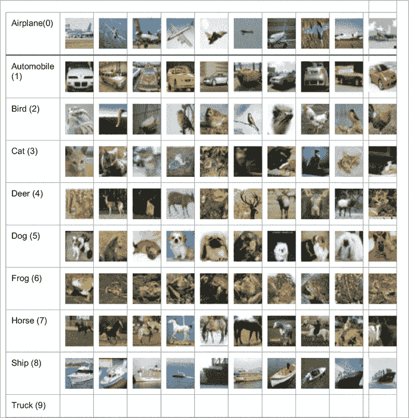
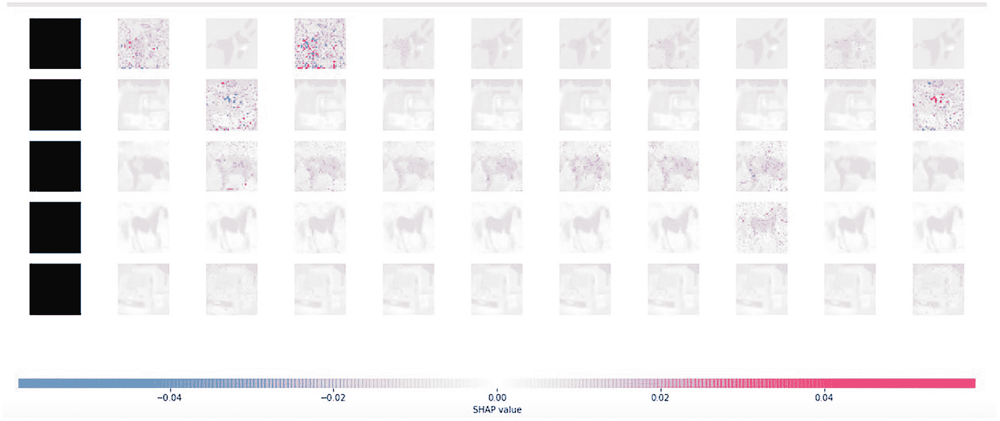

# 图像分类模型与 SHAP 解释器

```
# convert class vectors to binary class matrices
y_train = keras.utils.to_categorical(y_train, num_classes)
y_test = keras.utils.to_categorical(y_test, num_classes)
model = Sequential()
model.add(Conv2D(32, kernel_size=(3, 3),
activation='relu',
input_shape=input_shape))
model.add(Conv2D(64, (3, 3), activation='relu'))
model.add(MaxPooling2D(pool_size=(2, 2)))
model.add(Dropout(0.25))
model.add(Flatten())
model.add(Dense(128, activation='relu'))
model.add(Dropout(0.5))
model.add(Dense(num_classes, activation='softmax'))
```

此处用作示例的图像分类模型包含三个部分，外加用于降维的卷积和最大池化操作。使用`Dropout`和`Flatten`是为了移除低概率权重，从而限制模型过拟合。`Flatten`添加层以重塑数据，便于后续矩阵乘法。你还使用了一个全连接层（`Dense`）来创建在低维空间中运行的完全连接神经网络模型，从而以更高的准确率对目标类别进行分类。激活函数是在权重与来自上一层的特征进行点积乘法后使用的传递函数。为了获得每个类别的概率，你需要在神经网络模型的最后一层使用`softmax`激活函数。

```
model.compile(loss=keras.losses.categorical_crossentropy,
optimizer=keras.optimizers.Adadelta(),
metrics=['accuracy'])
```

模型结构设计完成后，下一步是编译模型。在`Keras`库中，编译步骤包含若干参数；其中重要的是损失函数、优化器和评估指标。除此之外，还有其他参数可用于微调模型并重新训练，以限制模型过拟合。误差函数或损失函数的选择应基于任务。如果目标列包含两个以上的类别，则可以使用分类交叉熵（`categorical_crossentropy`）。优化器的作用是优化损失函数，并找到损失函数最小的步骤。评估指标的功能是计算每个训练周期（epoch）对应的模型准确率。

```
model.fit(x_train, y_train,
batch_size=batch_size,
epochs=epochs,
verbose=1,
validation_data=(x_test, y_test))
```

所有训练周期的结果无法在日志中完整呈现，因此此处进行了截断，但请留意日志，以识别模型开始学习或准确率趋于平稳等迭代节点。从以下结果来看，分类模型的测试准确率为 85.28%。

```
score = model.evaluate(x_test, y_test, verbose=0)
print('Test loss:', score[0])
print('Test accuracy:', score[1])
import tensorflow as tf
tf.compat.v1.disable_v2_behavior() # run this if you get tensor related error
```

## SHAP 深度学习解释器

`SHAP`库包含一个深度解释器模块，该模块提供了一种表示方法，用于展示在分类任务中（通常以及针对特定类别）的正向和负向属性或贡献。

```
background = x_train[np.random.choice(x_train.shape[0],100, replace=False)]
explainer = shap.DeepExplainer(model,background)
shap_values = explainer.shap_values(x_test[1:5])
# plot the feature attributions
shap.image_plot(shap_values, -x_test[1:5])
```



**图 9-3** 图像分类的深度解释器

在图 9-3 中，红色值表示预测类别的正向类别，蓝色值表示预测类别的负向类别。该图显示了数字 2、1、0 和 4 的 SHAP 值。模型针对这四个图像值生成了 10 个预测。红色值使预测值接近最左侧的输入图像，而负向值则使预测值相对于左侧的输入图像降低。Deep SHAP 是基于一篇发表在 NIPS 上的论文开发的。

`DeepLIFT` 在分类和回归模型生成预测后，使用类似于反向传播的方法来估算 SHAP 值。

```
# plot the feature attributions
shap.image_plot(shap_values, -x_test[5:9])
```



**图 9-4** 更多记录的深度解释器

在图 9-4 中，打印了另外四个数字及其对应的 SHAP 分数。如果你观察数字 5 和 1，会发现模式上存在一致性。然而，当观察数字 4 和 9 时，存在模糊性，因为某些情况下 SHAP 分数并不能清晰地帮助预测该类别。

```
# plot the feature attributions
shap.image_plot(shap_values, -x_test[9:13])
```



**图 9-5** 另外四个数字的深度解释器

在图 9-5 中，数字 0 和 6 再次呈现出相似的视图，因为两者的书写方式非常相似。然而，数字 9 则相当清晰。


### 图像分类的另一个示例

CIFAR-10 数据集取自 [`www.cs.toronto.edu/~kriz/cifar.html`](http://www.cs.toronto.edu/%257Ekriz/cifar.html)。你拥有 60,000 张样本图像，这些图像由 32x32 的彩色图像组成，分为 10 个需要预测或分类的类别。这些类别包括飞机、汽车、鸟等。深度学习模型可以使用两个解释器进行解释：`DeepExplainer` 和 `GradientExplainer`。

```
from keras.datasets import cifar10
from keras.utils import np_utils
from keras.models import Sequential
from keras.layers.core import Dense, Dropout, Activation, Flatten
from keras.layers.convolutional import Conv2D, MaxPooling2D
from keras.optimizers import SGD, Adam, RMSprop
import matplotlib.pyplot as plt
#from quiver_engine import server
# CIFAR_10 是一个包含 60K 张 32x32 像素、3 通道图像的集合
IMG_CHANNELS = 3
IMG_ROWS = 32
IMG_COLS = 32
#常量
BATCH_SIZE = 128
NB_EPOCH = 20
NB_CLASSES = 10
VERBOSE = 1
VALIDATION_SPLIT = 0.2
OPTIM = RMSprop()
```

你不能将整个样本集直接送入卷积层和全连接层。这个过程非常缓慢、耗时，并且计算量巨大。因此，需要从训练集中使用小批量样本，并在每个周期（epoch）后增量更新权重。因此，批量大小设为 128，周期数为 20，优化器为 `RMSPROP`，验证样本比例为 20%。这些是作为示例考虑的超参数，它们是否是最佳的超参数配置？可能不是，因为这些参数需要经过多次迭代才能确定。最佳超参数的选择可以通过网格搜索方法或多次迭代来完成。

```
#加载数据集
(X_train, y_train), (X_test, y_test) = cifar10.load_data()
print('X_train shape:', X_train.shape)
print(X_train.shape[0], 'train samples')
print(X_test.shape[0], 'test samples')
# 转换为分类格式
Y_train = np_utils.to_categorical(y_train, NB_CLASSES)
Y_test = np_utils.to_categorical(y_test, NB_CLASSES)
# 浮点化与归一化
X_train = X_train.astype('float32')
X_test = X_test.astype('float32')
X_train /= 255
X_test /= 255
# 网络
model = Sequential()
model.add(Conv2D(32, (3, 3), padding='same',
input_shape=(IMG_ROWS, IMG_COLS, IMG_CHANNELS)))
model.add(Activation('relu'))
model.add(MaxPooling2D(pool_size=(2, 2)))
model.add(Dropout(0.25))
model.add(Flatten())
model.add(Dense(512))
model.add(Activation('relu'))
model.add(Dropout(0.5))
model.add(Dense(NB_CLASSES))
model.add(Activation('softmax'))
model.summary()
```

神经元数量的摘要显示在 `param` 列中。共有 4,200,842 个参数被训练，并且没有不可训练的参数。

```
# 训练
#optim = SGD(lr=0.01, decay=1e-6, momentum=0.9, nesterov=True)
model.compile(loss='categorical_crossentropy', optimizer=OPTIM,
metrics=['accuracy'])
history = model.fit(X_train, Y_train, batch_size=BATCH_SIZE,
epochs=NB_EPOCH, validation_split=VALIDATION_SPLIT,
verbose=VERBOSE)
print('Testing...')
score = model.evaluate(X_test, Y_test,
batch_size=BATCH_SIZE, verbose=VERBOSE)
print("\nTest score:", score[0])
print('Test accuracy:', score[1])
```

一旦训练出一个更好的分类模型，你可以保存模型对象，以便日后用于推理生成。

```
#保存模型
model_json = model.to_json()
open('cifar10_architecture.json', 'w').write(model_json)
model.save_weights('cifar10_weights.h5', overwrite=True)
# 列出历史记录中的所有数据
print(history.history.keys())
# 汇总准确率历史
#plt.plot(mo)
plt.plot(history.history['val_acc'])
plt.title('model accuracy')
plt.ylabel('accuracy')
plt.xlabel('epoch')
plt.legend(['train', 'test'], loc='upper left')
plt.show()
```



图 9-6

每个周期的训练模型准确率

从图 9-6 可以清楚地看到，最高的训练准确率大约在第 10 个周期达到。此后，训练准确率变得相当不稳定，呈现出锯齿状模式。

```
# 汇总损失历史
plt.plot(history.history['loss'])
plt.plot(history.history['val_loss'])
plt.title('model loss')
plt.ylabel('loss')
plt.xlabel('epoch')
plt.legend(['train', 'test'], loc='upper left')
plt.show()
```



图 9-7

模型训练损失与模型测试损失表示

从图 9-7 可以看出，模型训练损失和模型测试损失在第 3 个周期之前是同步的。之后，损失值出现分歧，测试损失呈现锯齿状模式，明显表明损失不稳定，而训练损失持续下降，这是过拟合的明显迹象。

在生成模型解释之前，确保模型稳定、准确且可靠至关重要。否则，很难证明推理的合理性，因为模型会产生随机的推理和解释。

### 使用 SHAP

在获得一个具有良好准确率的深度学习模型后，解释模型的预测结果非常重要。此外，了解 SHAP 分数如何导致类别预测也相当有趣。见图 9-8 和表 9-1。

表 9-3

表 9-2 中显示的九个类别各自的概率值

|   | 0 | 1 | 2 | 3 | 4 | 5 | 6 | 7 | 8 | 9 |
| **0** | 0.000 | 0.001 | 0.002 | 0.928 | 0.007 | 0.053 | 0.000 | 0.000 | 0.008 | 0.000 |
| **1** | 0.000 | 0.005 | 0.000 | 0.000 | 0.000 | 0.000 | 0.000 | 0.000 | 0.995 | 0.000 |
| **2** | 0.164 | 0.013 | 0.005 | 0.001 | 0.001 | 0.000 | 0.000 | 0.001 | 0.797 | 0.019 |
| **3** | 0.661 | 0.002 | 0.105 | 0.001 | 0.003 | 0.000 | 0.001 | 0.000 | 0.226 | 0.000 |
| **4** | 0.000 | 0.000 | 0.037 | 0.073 | 0.289 | 0.002 | 0.598 | 0.000 | 0.000 | 0.000 |
| **5** | 0.001 | 0.000 | 0.035 | 0.033 | 0.023 | 0.024 | 0.877 | 0.003 | 0.000 | 0.003 |
| **6** | 0.000 | 1.000 | 0.000 | 0.000 | 0.000 | 0.000 | 0.000 | 0.000 | 0.000 | 0.000 |
| **7** | 0.009 | 0.000 | 0.036 | 0.001 | 0.000 | 0.000 | 0.954 | 0.000 | 0.000 | 0.000 |
| **8** | 0.003 | 0.000 | 0.029 | 0.665 | 0.121 | 0.147 | 0.008 | 0.025 | 0.001 | 0.000 |
| **9** | 0.001 | 0.936 | 0.000 | 0.000 | 0.000 | 0.000 | 0.000 | 0.000 | 0.001 | 0.061 |

表 9-2

对象名称、样本图像以及括号中的数字显示了在上述模型中目标类别的编码方式

|  |

表 9-1

前 10 条记录的预测类别

| 行号 | 预测类别 |
| --- | --- |
| **0** | 3 |
| **1** | 8 |
| **2** | 8 |
| **3** | 0 |
| **4** | 6 |
| **5** | 6 |
| **6** | 1 |
| **7** | 6 |
| **8** | 3 |
| **9** | 1 |



图 9-8

SHAP 特征归因

```
background = X_train[np.random.choice(X_train.shape[0],100, replace=False)]
explainer = shap.DeepExplainer(model,background)
shap_values = explainer.shap_values(X_test[10:15])
# 绘制特征归因图
shap.image_plot(shap_values, -X_test[10:15])
import pandas as pd
pd.DataFrame(model.predict_classes(X_test)).head(10)
```

```
import pandas as pd
pd.DataFrame(np.round(model.predict_proba(X_test),3)).head(10)
```


### 表格数据的深度解释器

让我们在一个复杂数据集上应用深度学习模型。这个数据集被称为葡萄酒质量预测。由于特征复杂且存在歧义，该数据集能达到的最佳准确率为 62%。没有任何算法能将准确率提升至 70%或 80%以上。因此，这是一个复杂的数据集。数据集中包含需要分类的不同葡萄酒类别。该数据集来自 UCI 机器学习库，网址为 [`https://archive.ics.uci.edu/ml/datasets/wine+quality`](https://archive.ics.uci.edu/ml/datasets/wine%252Bquality)。其中包含两个数据集，分别涉及葡萄牙北部的红葡萄酒和白葡萄酒样本。目标是根据理化测试结果对葡萄酒质量进行建模。这两个数据集分别对应葡萄牙绿酒（Vinho Verde）的红葡萄酒和白葡萄酒变种。由于隐私和物流问题，仅提供了理化（输入）和感官（输出）变量（例如，没有关于葡萄品种、葡萄酒品牌、葡萄酒售价等数据）。这些数据集可视为分类或回归任务。类别是有序且不平衡的（例如，普通葡萄酒的数量远多于优质或劣质葡萄酒）。

```
from tensorflow import keras
from sklearn.model_selection import cross_val_score, KFold
from keras.wrappers.scikit_learn import KerasRegressor
from keras.layers import Dense, Dropout
from keras.models import Sequential
from sklearn.metrics import accuracy_score
from sklearn.preprocessing import StandardScaler
import pandas as pd
import numpy as np
import matplotlib.pyplot as plt
```

上述脚本导入了为表格数据集创建深度学习模型所需的库。以下脚本命名了可用于预测葡萄酒质量目标的特征：

```
feature_names = [
"fixed acidity",
"volatile acidity",
"citric acid",
"residual sugar",
"chlorides",
"free sulfur dioxide",
"total sulfur dioxide",
"density",
"pH",
"sulphates",
"alcohol",
"quality",
]
```

以下脚本从 UCI 机器学习库中读取两个数据集：

```
red_wine_data = pd.read_csv(
'https://archive.ics.uci.edu/ml/machine-learning-databases/wine-quality/winequality-red.csv', names=feature_names, sep=";", header=1)
white_wine_data = pd.read_csv(
'https://archive.ics.uci.edu/ml/machine-learning-databases/wine-quality/winequality-white.csv', names=feature_names, sep=";", header=1)
wine_data = red_wine_data.append(white_wine_data)
wine_features = wine_data[feature_names].drop('quality', axis=1).values
wine_quality = wine_data['quality'].values
scaler = StandardScaler().fit(wine_features)
wine_features = scaler.transform(wine_features)
```

该深度学习模型有 11 个特征输入。它是一个三层深度神经网络模型。

```
model = Sequential()
model.add(Dense(1024, input_dim=11, activation='tanh'))
model.add(Dense(512, activation='tanh'))
model.add(Dense(64,  activation='tanh'))
model.add(Dense(1))
model.compile(loss='mse', optimizer='adam', metrics=['accuracy'])
model.summary()
history = model.fit(wine_features, wine_quality,
batch_size=BATCH_SIZE,
epochs=NB_EPOCH,
validation_split=VALIDATION_SPLIT,
verbose=VERBOSE)
background = wine_features[np.random.choice(wine_features.shape[0],100, replace=False)]
explainer = shap.DeepExplainer(model,background)
shap_values = explainer.shap_values(wine_features)
pd.DataFrame(np.array(shap_values).reshape(6495,11))
np.round(model.predict(wine_features),0)
```

正的 SHAP 值有助于预测，而负的 SHAP 值则会降低预测能力。

## 结论

在本章中，你学习了如何使用三个数据集（MNIST 手写数字数据集、CIFAR 数据集和葡萄酒质量数据集）来解释分类模型结果的推理过程。通过使用深度学习模型，完成了训练，并使用 SHAP 库中的`DeepExplainer`解释了模型预测。`DeepExplainer`的作用是展示图像的正 SHAP 值和负 SHAP 值，以解释分类任务中的任何歧义或重叠。在像葡萄酒质量分类这样的结构化数据问题中，它还能解释哪些特征对预测有正面影响，哪些特征有负面影响。机器学习模型与深度学习模型的区别在于，深度学习中特征选择是自动进行的，并且在训练深度神经网络时存在一个迭代过程。正因如此，向他人解释模型预测变得困难。现在，使用`DeepExplainer`来解释模型预测，任务就简单多了。

