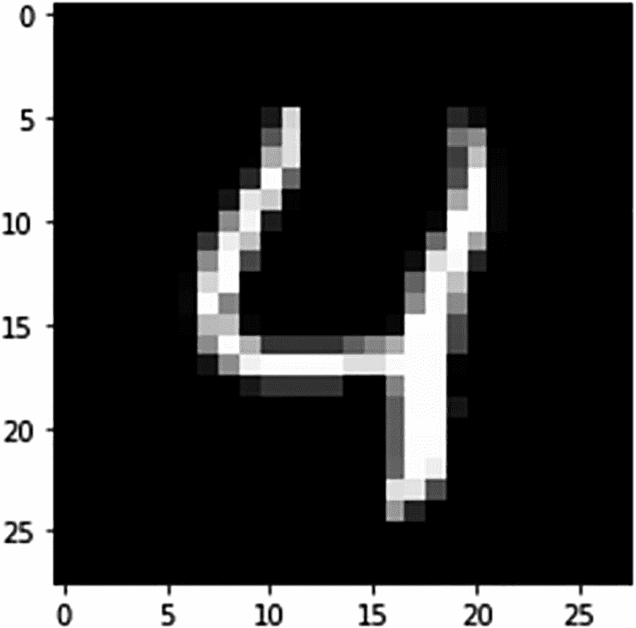
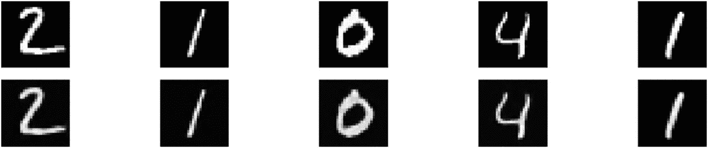
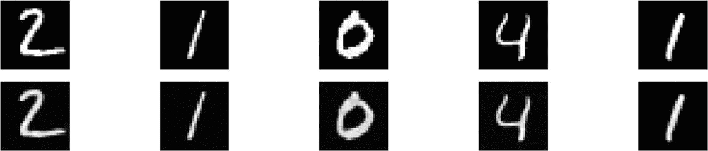
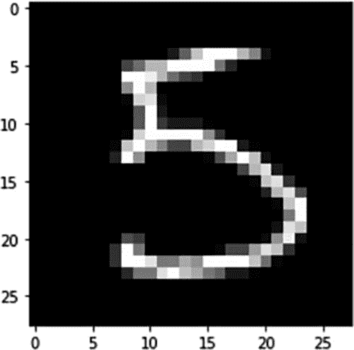
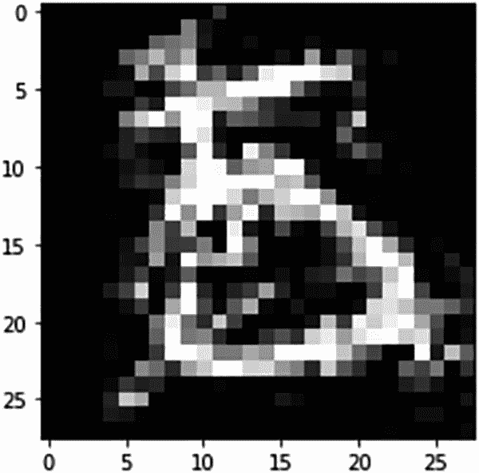
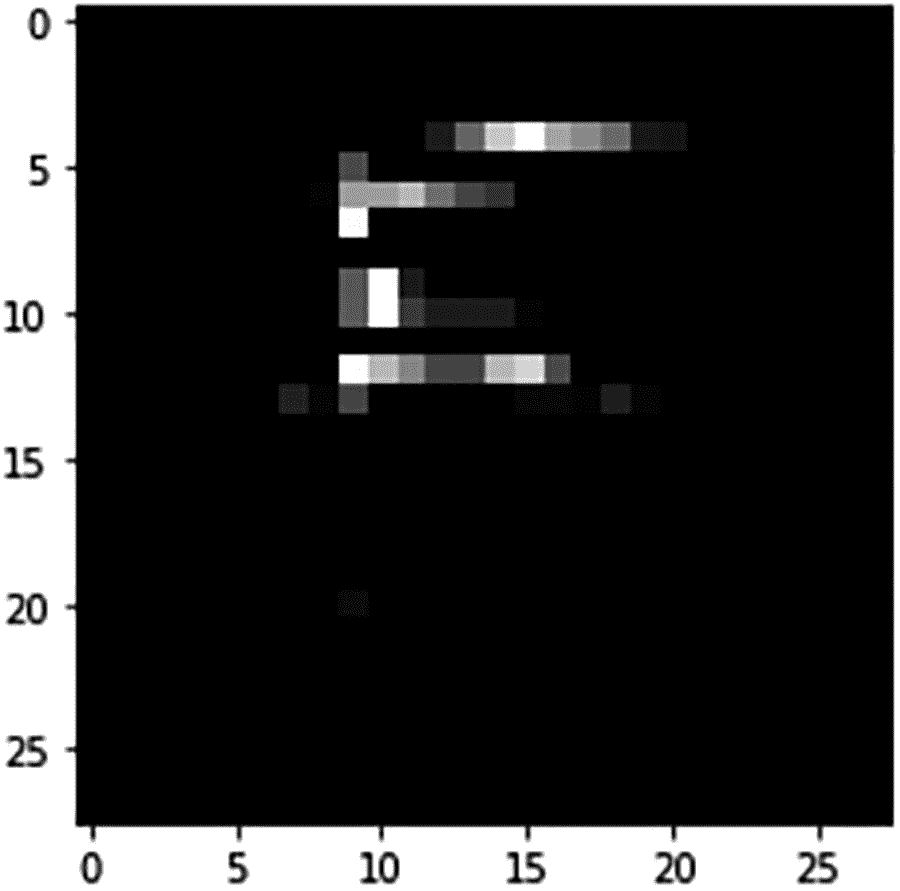
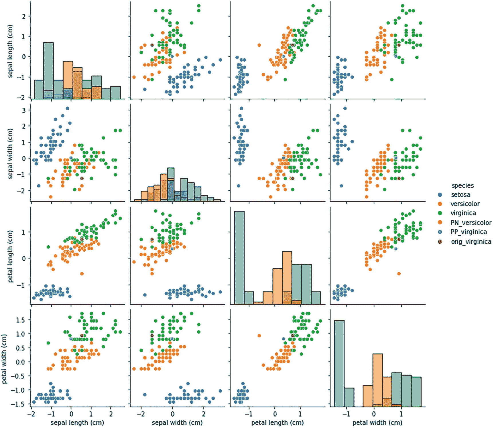

# 11. 机器学习的对比解释

对比学习是一种较新的方法，用于在机器学习流程中寻找相似和相异的候选对象。对比解释旨在寻找两个特征之间的相似性，以帮助对某个类别进行预测。典型的黑盒模型，基于不同类型的超参数以及在不同轮次和学习率下优化的大量参数进行训练，非常难以解释，更难以推理模型为何预测 A 类而非 B 类。为了生成更多解释以便业务用户理解预测结果的需求，吸引了许多开发者创建能够产生价值的创新框架。对比解释侧重于解释模型为何预测 A 类而非 B 类。寻找原因有助于业务用户理解模型的行为。在本章中，你将使用基于 TensorFlow 框架的 Alibi 库来处理图像分类任务。

## 什么是机器学习中的对比解释？

为了理解机器学习中的对比解释，让我们以银行的贷款审批流程或信用风险评估流程为例。没有银行会向高风险客户提供贷款。同样，没有银行会拒绝向非风险客户提供贷款。当贷款申请或信用申请被拒绝时，这并非银行某人的随意决定。相反，这是一个 AI 模型做出的决定，该模型考虑了关于个人的众多特征，包括财务历史和其他因素。贷款被拒绝的个人可能会思考：哪些方面决定了他的贷款资格？在贷款资格方面，是什么将一个人与另一个人区分开来？他的个人资料中缺少哪些要素？等等。同样，在从多个可用图像中识别感兴趣的对象时，是什么使感兴趣的对象与其他图像不同？对比解释就是将一个类别与其他类别区分开来的特征差异。

对比解释就像人类的对话，有助于人类进行更深入的交流。对比解释涉及两个概念：

*   相关正特征
*   相关负特征

相关正特征解释是指，找到那些对于机器学习模型识别出与预测类别相同的类别所必需的特征的存在。例如，一个人的收入和年龄决定了个人的净资产。你希望你的机器学习模型能够根据高收入和高年龄段的存在来识别高净值人群类别。这在多个方面与机器学习模型的锚点解释相似。相关负特征是相关正特征的反面；它解释了在保持原始输出类别不变的情况下，应该从记录中缺失的特征。一些研究人员也将其称为*反事实解释*。


### 使用 Alibi 实现对比解释方法（CEM）

模型的对比解释有助于向最终用户阐明，为何某个事件或预测结果会与另一种情况不同。为了解释模型对比解释方法（CEM）的概念以及如何通过基于 Python 的库来实现它，我们以 Alibi 为例。首先，你需要使用 TensorFlow 作为后端，开发一个基于 Keras 的深度学习模型。以下脚本包含了开发深度学习模型时可用的各种模块和方法的导入语句。CEM 可在 Alibi 库的 `explainer` 模块中找到。

```
import tensorflow as tf
tf.get_logger().setLevel(40) # suppress deprecation messages
tf.compat.v1.disable_v2_behavior() # disable TF2 behaviour as alibi code still relies on TF1 constructs
import tensorflow.keras as keras
from tensorflow.keras import backend as K
from tensorflow.keras.layers import Conv2D, Dense, Dropout, Flatten, MaxPooling2D, Input, UpSampling2D
from tensorflow.keras.models import Model, load_model
from tensorflow.keras.utils import to_categorical
import matplotlib
%matplotlib inline
import matplotlib.pyplot as plt
import numpy as np
import os
from alibi.explainers import CEM
print('TF version: ', tf.__version__)
print('Eager execution enabled: ', tf.executing_eagerly()) # False
```

在解释“必要存在特征”（PP）和“必要缺失特征”（PN）时，识别并组织相关特征，以及从非重要特征中分类出重要特征至关重要。如果在模型训练步骤中有更多非重要特征，那么它们属于 PP 还是 PN 实际上并不重要。模型中的非重要特征完全不相关。之所以展示 MNIST 手写数字分类数据集用于 CEM 解释，是因为许多开发者和机器学习工程师都熟悉 MNIST 数据集，因此他们能很好地理解 CEM 的概念。以下脚本将数据集分为训练集和测试集，图 11-1 中还显示了一张数字 4 的示例图像：



图 11-1

数字 4 的示例图像

```
(x_train, y_train), (x_test, y_test) = keras.datasets.mnist.load_data()
print('x_train shape:', x_train.shape, 'y_train shape:', y_train.shape)
plt.gray()
plt.imshow(x_test[4]);
```

接下来，你需要开发一个分类模型。作为下一步，你需要对特征进行归一化，以加快深度学习模型的训练过程。因此，将像素值除以最高像素值（255）。

```
x_train = x_train.astype('float32') / 255
x_test = x_test.astype('float32') / 255
x_train = np.reshape(x_train, x_train.shape + (1,))
x_test = np.reshape(x_test, x_test.shape + (1,))
print('x_train shape:', x_train.shape, 'x_test shape:', x_test.shape)
y_train = to_categorical(y_train)
y_test = to_categorical(y_test)
print('y_train shape:', y_train.shape, 'y_test shape:', y_test.shape)
xmin, xmax = -.5, .5
x_train = ((x_train - x_train.min()) / (x_train.max() - x_train.min())) * (xmax - xmin) + xmin
x_test = ((x_test - x_test.min()) / (x_test.max() - x_test.min())) * (xmax - xmin) + xmin
```

以下脚本展示了创建卷积神经网络模型的步骤：

*   输入数据集形状为 28x28 像素。
*   卷积 2D 层应用了 64 个滤波器，内核大小为 2，填充方式为“相同”，激活函数为修正线性单元。
*   应用卷积层后，需要应用最大池化，以生成可供后续层使用的抽象特征。
*   通常应用 Dropout 来限制模型过拟合。
*   共有三层卷积 2D 滤波器，随后依次应用最大池化层和 Dropout 层，以降低数据维度。
*   应用卷积和最大池化的目标是得到一个神经元数量较少的层，用于训练全连接神经网络模型。
*   如果需要展平数据以改变形状，则应用全连接神经网络模型——密集层。
*   最后，应用 Softmax 层以生成相对于每个数字类别的类别概率。
*   在编译步骤中，你需要提供分类交叉熵作为损失函数，`adam` 作为优化器，以及准确率作为评估指标。

```
def cnn_model():
x_in = Input(shape=(28, 28, 1)) #input layer
x = Conv2D(filters=64, kernel_size=2, padding='same', activation='relu')(x_in) #conv layer
x = MaxPooling2D(pool_size=2)(x) #max pooling layer
x = Dropout(0.3)(x) #drop out to avoid overfitting
x = Conv2D(filters=32, kernel_size=2, padding='same', activation='relu')(x) # second conv layer
x = MaxPooling2D(pool_size=2)(x) #max pooling layer
x = Dropout(0.3)(x) #drop out to avoid overfitting
x = Conv2D(filters=32, kernel_size=2, padding='same', activation='relu')(x) # third conv layer
x = MaxPooling2D(pool_size=2)(x) #max pooling layer
x = Dropout(0.3)(x) # drop out to avoid overfitting
x = Flatten()(x) # flatten for reshaping the matrix
x = Dense(256, activation='relu')(x) #this is for Fully Connected Neural Network Layer training
x = Dropout(0.5)(x) # drop out again to avoid overfitting
x_out = Dense(10, activation='softmax')(x) #final output layer
cnn = Model(inputs=x_in, outputs=x_out)
cnn.compile(loss='categorical_crossentropy', optimizer='adam', metrics=['accuracy'])
return cnn
```

卷积神经网络模型摘要如下表所示。在模型训练步骤中，你需要提供批次大小和训练轮数。然后，你可以将训练好的模型对象保存为 `h5` 格式。

```
cnn = cnn_model()
cnn.summary()
cnn.fit(x_train, y_train, batch_size=64, epochs=5, verbose=1)
cnn.save('mnist_cnn.h5', save_format='h5')
```

为了生成有意义的 CEM 解释，你必须确保模型具有很高的准确率，否则 CEM 解释将缺乏一致性。因此，建议先训练、微调或搜索能够产生至少 85% 准确率的最佳模型。在当前示例中，模型在测试数据集上的准确率为 98.73%，因此你可以期待有意义的 CEM 解释。

```
# Evaluate the model on test set
cnn = load_model('mnist_cnn.h5')
score = cnn.evaluate(x_test, y_test, verbose=0)
print('Test accuracy: ', score[1])
```

为了生成 CEM 解释，你需要一个能将输入数据分类到特定类别的模型对象。CEM 尝试生成两种可能的解释：

*   尝试找出输入数据中必须存在的最少信息量，这些信息足以产生相同的类别分类。这被称为 PP。
*   尝试找出输入数据中缺失的最少信息量，这些信息足以阻止类别预测发生变化。这被称为 PN。


# 自编码器模型训练与分析

寻找可能改变预测结果或有助于维持预测的最小信息，通常是输入数据集中最重要的特征值。将输入数据与从数据中生成的抽象层进行匹配，用于识别最小信息的存在与否。这个抽象层被称为自编码器。对于图像分类问题，它可以是卷积自编码器。自编码器通过在输入层和输出层同时使用输入数据进行训练。模型被训练为精确预测与输入相同的输出。一旦输入与输出匹配，神经网络模型中最内层隐藏层的权重就可以推导为自编码器值。这些自编码器值有助于识别任何输入数据集中的最小信息可用性。以下脚本展示了如何训练自编码器模型。它是一个神经网络模型，接收 28x28 像素的输入，并生成 28x28 像素的输出。

```python
# 定义并训练一个自编码器，其工作原理类似于主成分分析模型
def ae_model():
    x_in = Input(shape=(28, 28, 1))
    x = Conv2D(16, (3, 3), activation='relu', padding='same')(x_in)
    x = Conv2D(16, (3, 3), activation='relu', padding='same')(x)
    x = MaxPooling2D((2, 2), padding='same')(x)
    encoded = Conv2D(1, (3, 3), activation=None, padding='same')(x)
    x = Conv2D(16, (3, 3), activation='relu', padding='same')(encoded)
    x = UpSampling2D((2, 2))(x)
    x = Conv2D(16, (3, 3), activation='relu', padding='same')(x)
    decoded = Conv2D(1, (3, 3), activation=None, padding='same')(x)
    autoencoder = Model(x_in, decoded)
    autoencoder.compile(optimizer='adam', loss='mse')
    return autoencoder

ae = ae_model()
ae.summary()
ae.fit(x_train, x_train, batch_size=128, epochs=4, validation_data=(x_test, x_test), verbose=0)
ae.save('mnist_ae.h5', save_format='h5')
```

模型的摘要显示了架构和可训练参数的总数。可训练参数在模型的每次迭代中都会更新权重。没有不可训练的参数。一旦自编码器模型准备就绪，就可以将模型对象加载到会话中。使用测试集上的 `predict` 函数，可以生成解码后的 MNIST 图像。以下脚本的输出显示，测试图像与使用自编码器函数生成的图像完全匹配，这意味着您的自编码器模型在生成精确输出方面相当稳健。自编码器模型包含两部分：编码器和解码器。编码器的作用是将任何输入转换为抽象层，解码器的作用是从抽象层重建相同的输入。

### 原始图像与自编码器生成图像的对比

您可以将训练集中的原始图像与基于自编码器生成的模型图像集（如图 11-2 所示）进行对比。从图像中可以看出，自编码器生成的模型与原始图像完全匹配。由于这是一个示例数据集，匹配度非常高；然而，对于其他示例，需要大量的训练才能生成如此接近的图像。一个训练有素的自编码器模型对于生成对比解释将非常有帮助。



**图 11-2** — 自编码器模型生成的图像与原始图像的对比

```python
ae = load_model('mnist_ae.h5')
decoded_imgs = ae.predict(x_test)
n = 5
plt.figure(figsize=(20, 4))
for i in range(1, n+1):
    # 显示原始图像
    ax = plt.subplot(2, n, i)
    plt.imshow(x_test[i].reshape(28, 28))
    ax.get_xaxis().set_visible(False)
    ax.get_yaxis().set_visible(False)
    # 显示重建图像
    ax = plt.subplot(2, n, i + n)
    plt.imshow(decoded_imgs[i].reshape(28, 28))
    ax.get_xaxis().set_visible(False)
    ax.get_yaxis().set_visible(False)
plt.show()
```

第一行显示测试数据集第一条记录的实际图像，第二行显示自编码器生成的预测图像。

```python
ae = load_model('mnist_ae.h5')
decoded_imgs = ae.predict(x_test)
n = 5
plt.figure(figsize=(20, 4))
for i in range(1, n+1):
    # 显示原始图像
    ax = plt.subplot(2, n, i)
    plt.imshow(x_test[i].reshape(28, 28))
    ax.get_xaxis().set_visible(False)
    ax.get_yaxis().set_visible(False)
    # 显示重建图像
    ax = plt.subplot(2, n, i + n)
    plt.imshow(decoded_imgs[i].reshape(28, 28))
    ax.get_xaxis().set_visible(False)
    ax.get_yaxis().set_visible(False)
plt.show()
```



**图 11-3** — 相关负样本解释

上述脚本展示了同一图像的显示和重建（图 11-3），该图像在下方显示为数字 5（图 11-4）。



**图 11-4** — 数字 5 的原始图像显示

```python
idx = 15
X = x_test[idx].reshape((1,) + x_test[idx].shape)
plt.imshow(X.reshape(28, 28));
```

```python
# 模型预测
cnn.predict(X).argmax(), cnn.predict(X).max()
```

CNN 模型以 99.95% 的概率将输入预测为数字 5（表 11-1）。

**表 11-1** — CEM 参数说明

| 参数 | 说明 |
| --- | --- |
| `Mode` | PN 或 PP |
| `Shape` | 输入实例的形状 |
| `Kappa` | 扰动实例在预测类别（与原始实例相同）上的预测概率与在其他类别上的最大概率之间所需的最小差值，用于最小化第一个损失项 |
| `Beta` | L1 损失项的权重 |
| `Gamma` | 自编码器损失项的权重 |
| `C_steps` | 更新次数 |
| `Max iterations` | 迭代次数 |
| `Feature_range` | 扰动实例的特征范围 |
| `Lr` | 初始学习率 |

以下脚本展示了从样本实例 `X` 生成的解释对象中的相关负样本预测。相关负样本分析表明，数字 5 缺少一些重要特征；否则，它会被分类为数字 8。这些缺失的信息正是使数字 5 类别预测与数字 8 类别预测保持不同的最小信息。图 11-5 将数字 8 叠加在数字 5 上。



**图 11-5**


# 相关否定与相关肯定解释

相关否定预测结果为数字 8，而原始图像为数字 5

```
mode = 'PN'  # 'PN'（相关否定）或 'PP'（相关肯定）
shape = (1,) + x_train.shape[1:]  # 实例形状
kappa = 0.  # 扰动实例在原始实例预测类别上的预测概率，与其他类别最大概率之间所需的最小差值
# 用于最小化第一个损失项
beta = .1  # L1 损失项的权重
gamma = 100  # 可选自编码器损失项的权重
c_init = 1.  # 损失项的初始权重 c，该损失项鼓励扰动实例预测与待解释原始实例不同的类别（PN）或
# 相同的类别（PP）
c_steps = 10  # c 的更新次数
max_iterations = 1000  # 每个 c 值对应的迭代次数
feature_range = (x_train.min(),x_train.max())  # 扰动实例的特征范围
clip = (-1000.,1000.)  # 梯度裁剪
lr = 1e-2  # 初始学习率
no_info_val = -1. # 一个值（浮点数或按特征指定），可视为不包含任何用于预测的信息
# 向该值方向扰动意味着移除特征，远离该值则意味着添加特征
# 对于我们的 MNIST 图像，背景（-0.5）信息量最小，
# 因此正向/负向扰动分别意味着添加/移除特征
# 初始化 CEM 解释器并解释实例
cem = CEM(cnn, mode, shape, kappa=kappa, beta=beta, feature_range=feature_range, gamma=gamma, ae_model=ae, max_iterations=max_iterations,
c_init=c_init, c_steps=c_steps, learning_rate_init=lr, clip=clip, no_info_val=no_info_val)
explanation = cem.explain(X)
print(f'相关否定预测: {explanation.PN_pred}')
plt.imshow(explanation.PN.reshape(28, 28));
```

对于同一个数字 5，也可以生成相关肯定解释，这意味着为了将数字分类为 5，你在图像中绝对要寻找哪些特征。这被称为相关肯定解释。

```
# 现在生成相关肯定
mode = 'PP'
# 初始化 CEM 解释器并解释实例
cem = CEM(cnn, mode, shape, kappa=kappa, beta=beta, feature_range=feature_range, gamma=gamma, ae_model=ae, max_iterations=max_iterations,
c_init=c_init, c_steps=c_steps, learning_rate_init=lr, clip=clip, no_info_val=no_info_val)
explanation = cem.explain(X)
print(f'相关肯定预测: {explanation.PP_pred}')
plt.imshow(explanation.PP.reshape(28, 28));
```



**图 11-6** – 数字 5 的相关肯定解释

在上述脚本中，你生成了相关肯定解释。该解释表明，图 11-6 中显示的像素值是将图像预测为数字 5 所需的最小必要条件。

### 表格数据的 CEM 解释

对于任何表格数据（也称为结构化数据），行代表样本，列代表特征。你可以使用与上述卷积神经网络模型相同的过程，以熟悉的 IRIS 数据集为例，处理一个简单的多类分类问题。

```
# 结构化数据集的 CEM
import tensorflow as tf
tf.get_logger().setLevel(40) # 抑制弃用消息
tf.compat.v1.disable_v2_behavior() # 禁用 TF2 行为，因为 alibi 代码仍依赖 TF1 结构
from tensorflow.keras.layers import Dense, Input
from tensorflow.keras.models import Model, load_model
from tensorflow.keras.utils import to_categorical
import matplotlib
%matplotlib inline
import matplotlib.pyplot as plt
import numpy as np
import os
import pandas as pd
import seaborn as sns
from sklearn.datasets import load_iris
from alibi.explainers import CEM
print('TF 版本: ', tf.__version__)
print('启用了即时执行: ', tf.executing_eagerly()) # False
```

上述脚本展示了 Alibi 模型生成 PP 和 PN 解释所需的导入语句。

```
dataset = load_iris()
feature_names = dataset.feature_names
class_names = list(dataset.target_names)
# 缩放数据
dataset.data = (dataset.data - dataset.data.mean(axis=0)) / dataset.data.std(axis=0)
idx = 145
x_train,y_train = dataset.data[:idx,:], dataset.target[:idx]
x_test, y_test = dataset.data[idx+1:,:], dataset.target[idx+1:]
y_train = to_categorical(y_train)
y_test = to_categorical(y_test)
```

IRIS 模型有四个特征，目标列中的三个类别分别是`setosa`、`versicolor`和`virginica`。前 145 条记录是训练数据集，5 条记录留作测试模型。由于目标列包含字符串值，因此需要对目标列（即`y_train`和`y_test`数据集）进行分类编码。

以下神经网络模型函数将四个特征作为输入，并使用 Keras 的密集函数通过全连接网络训练模型。你使用分类交叉熵作为损失函数，随机梯度下降作为优化器。训练模型的批量大小为 16，迭代 500 轮。需要训练的参数数量非常少。

```
def lr_model():
x_in = Input(shape=(4,))
x_out = Dense(3, activation='softmax')(x_in)
lr = Model(inputs=x_in, outputs=x_out)
lr.compile(loss='categorical_crossentropy', optimizer='sgd', metrics=['accuracy'])
return lr
lr = lr_model()
lr.summary()
lr.fit(x_train, y_train, batch_size=16, epochs=500, verbose=0)
lr.save('iris_lr.h5', save_format='h5')
```

训练完成后，模型被保存为`iris_lr.h5`。在以下脚本中，你加载训练好的模型对象，并使用表 11-1 中先前解释的所有参数初始化 CEM 函数。


```python
idx = 0
X = x_test[idx].reshape((1,) + x_test[idx].shape)
print('对要解释的实例的预测结果: {}'.format(class_names[np.argmax(lr.predict(X))]))
print('该实例上每个类别的预测概率: {}'.format(lr.predict(X)))
mode = 'PN'  # 'PN' (相关负例) 或 'PP' (相关正例)
shape = (1,) + x_train.shape[1:]  # 实例形状
kappa = .2  # 扰动实例在原始实例预测类别上的预测概率与其他类别最大概率之间所需的最小差值
# 用于最小化第一个损失项
beta = .1  # L1 损失项的权重
c_init = 10\.  # 损失项的初始权重 c，鼓励扰动实例预测与原始实例不同的类别(PN)或
# 相同的类别(PP)
c_steps = 10  # c 的更新次数
max_iterations = 1000  # 每个 c 值的迭代次数
feature_range = (x_train.min(axis=0).reshape(shape)-.1,  # 扰动实例的特征范围
x_train.max(axis=0).reshape(shape)+.1)  # 可以是浮点数或形状为(1x 特征数)的数组
clip = (-1000.,1000.)  # 梯度裁剪
lr_init = 1e-2  # 初始学习率
# 定义模型
lr = load_model('iris_lr.h5')
# 初始化 CEM 解释器并解释实例
cem = CEM(lr, mode, shape, kappa=kappa, beta=beta, feature_range=feature_range, max_iterations=max_iterations, c_init=c_init, c_steps=c_steps, learning_rate_init=lr_init, clip=clip)
cem.fit(x_train, no_info_type='median')  # 我们需要定义哪些特征值包含最少
# 关于预测的信息
# 这里我们将天真地假设特征中位数
# 不包含任何信息；领域知识会有所帮助！
explanation = cem.explain(X, verbose=False)
```

在上述脚本中，原始实例是`virginica`，但相关负例的解释将其预测为`versicolor`。只有第三个特征的差异导致了预测的不同。你也可以用同样的例子来预测相关正例的类别。

```python
print(f'原始实例: {explanation.X}')
print('预测类别: {}'.format(class_names[explanation.X_pred]))
print(f'相关负例: {explanation.PN}')
print('预测类别: {}'.format(class_names[explanation.PN_pred]))
expl = {}
expl['PN'] = explanation.PN
expl['PN_pred'] = explanation.PN_pred
mode = 'PP'
# 定义模型
lr = load_model('iris_lr.h5')
# 初始化 CEM 解释器并解释实例
cem = CEM(lr, mode, shape, kappa=kappa, beta=beta, feature_range=feature_range, max_iterations=max_iterations, c_init=c_init, c_steps=c_steps, learning_rate_init=lr_init, clip=clip)
cem.fit(x_train, no_info_type='median')
explanation = cem.explain(X, verbose=False)
print(f'相关正例: {explanation.PP}')
print('预测类别: {}'.format(class_names[explanation.PP_pred]))
```

在上述脚本中，你解释了相关正例的预测类别。它是`virginica`类别，实际类别也是`virginica`类别。你正在创建一种可视化方式来展示 PP 和 PN，使用 CEM 模型的特征和结果。你创建了一个`expl`对象，并创建了名为`PN`、`PN_pred`、`PP`和`PP_pred`的列。你创建了一个包含原始数据和特征名称（包括目标类别）的数据框。这是数据可视化所必需的。Seaborn Python 库用于以图形方式展示 PN 和 PP，如图 11-7 所示。



**图 11-7** 相关正例和相关负例可视化

```python
expl['PP'] = explanation.PP
expl['PP_pred'] = explanation.PP_pred
df = pd.DataFrame(dataset.data, columns=dataset.feature_names)
df['species'] = np.array([dataset.target_names[i] for i in dataset.target])
pn = pd.DataFrame(expl['PN'], columns=dataset.feature_names)
pn['species'] = 'PN_' + class_names[expl['PN_pred']]
pp = pd.DataFrame(expl['PP'], columns=dataset.feature_names)
pp['species'] = 'PP_' + class_names[expl['PP_pred']]
orig_inst = pd.DataFrame(explanation.X, columns=dataset.feature_names)
orig_inst['species'] = 'orig_' + class_names[explanation.X_pred]
df = df.append([pn, pp, orig_inst], ignore_index=True)
fig = sns.pairplot(df, hue='species', diag_kind='hist');
```

对比解释通常通过将特征投影到潜在空间作为抽象特征，然后仅考虑特征空间中对模型区分目标类别有用的特征来生成。

## 结论

在本章中，你探索了能够为图像分类问题（使用 MNIST 数据集进行手写识别）和结构化数据分类问题（使用简单的 IRIS 数据集）建立对比解释的方法和库。相关正例和相关负例均从 Alibi 库的对比解释模块中捕获。这种 CEM 方法为类别预测提供了更清晰的解释，并总结了为什么预测某个特定类别，而不是为什么没有预测到该类别。

