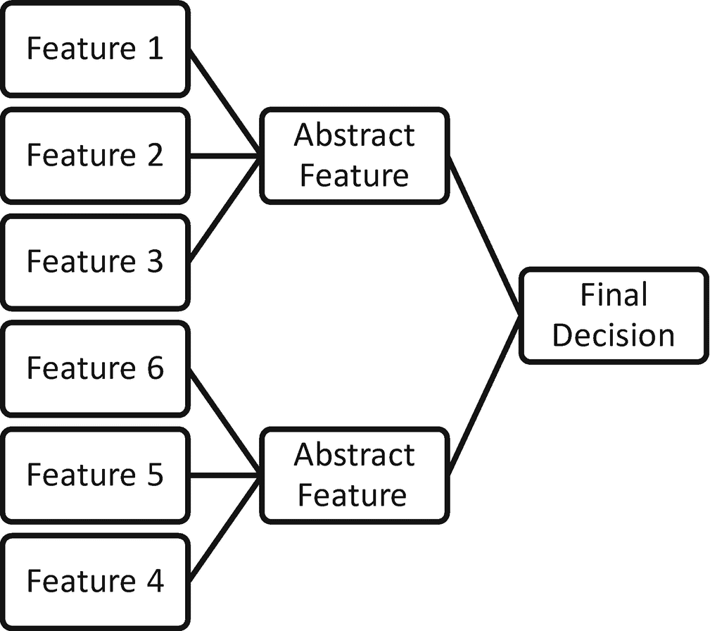
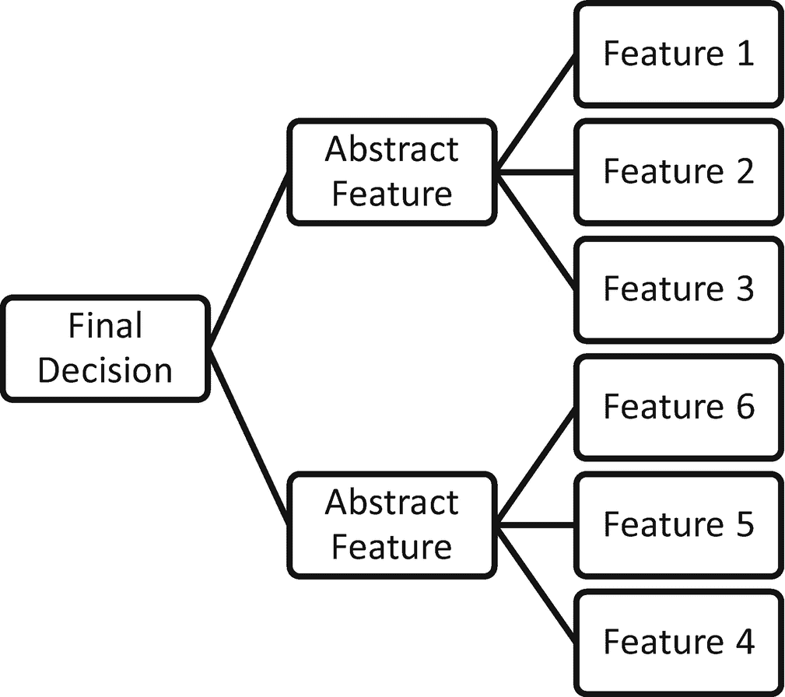
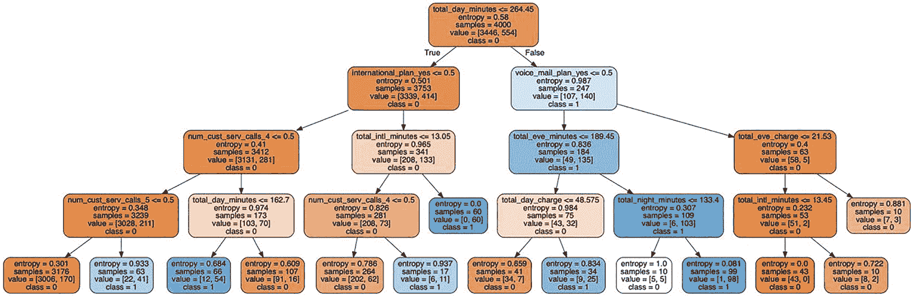

# 13. 基于规则的专家系统的模型可解释性

基于规则的系统相对更容易向最终用户解释，因为规则可以表示为 `if/else` 条件。确实，有时会存在多个 `if/else` 条件。专家系统本质上是确定性的，并且非常准确，因为它们由完善的规则和条件驱动。当多个规则发生冲突或以难以解释的方式组合时，便产生了对可解释性的需求。在人工智能领域，专家系统是一种旨在模拟真实决策过程的程序。专家系统旨在通过简单的推理来解决复杂问题，并以 `if/else/then` 条件的形式表示。专家系统旨在像推理引擎一样运作。推理引擎的作用是做出决策。有时专家系统很简单，比如决策树；有时专家系统则非常复杂。复杂的专家系统需要一个知识库。有时这些知识库是一个本体，它是一种知识体系的形式，通过它可以构建特定规则并进行推理。

## 什么是专家系统？

知识库是推理存储库，专家系统的 `if/else` 条件通过它来运行。在任何传统计算机程序中，推理和逻辑都嵌入在脚本中，这使得除技术专家之外的任何人都无法理解推理过程。基于知识的系统的目标是使决策过程明确化。借助知识库，专家系统的目标是以直观、不言自明且易于决策者理解的格式明确展示规则。本体是类、子类和超类的形式化表示。实体通过某些共同属性进行链接或关联。关系可以是概念、关联和其他元属性。本体分类有助于维护专家系统所依赖的知识库的形式化结构。

任何专家系统都需要两个组件：

- **知识库**：称为本体的形式化结构
- **推理引擎**：基于规则的系统或基于机器学习的系统。

推理引擎使用两种不同的推理形式来得出决策规则：

- 正向链
- 反向链

## 反向链与正向链

图 13-1 解释了正向链过程。可以从基础特征中提取抽象特征，并利用抽象特征得出最终决策。



正向链方法解释了决策的演变过程。假设在一个结构化数据问题中，你拥有若干特征。这些特征各有其值。`if/else` 条件的组合导致了抽象特征的形成。抽象特征则导向最终决策。如果有人想验证最终决策是如何做出的，可以追溯回去。推理引擎沿着 `if/else` 条件和推导的链条，得出关于决策的结论。类似地，我们可以在图 13-2 中解释反向链。



反向链所遵循的逻辑是理解为何做出某个特定决策。专家系统的决策引擎试图找出导致该决策的条件，例如，判断一封邮件是垃圾邮件还是非垃圾邮件。在这里，决策引擎关注的是某个特定标记的出现是否导致了垃圾邮件的判定。

## 使用 `scikit-learn` 进行规则提取

基于决策树模型的规则解释，其中可以根据电信客户流失数据集中客户的使用历史来解释流失预测，这里使用 `Python` 的 `scikit-learn` 库进行展示。为了解释规则创建和提取过程，让我们看一个电信客户流失预测数据集。在该数据集中，提前预测可能的流失客户，能让企业在与客户沟通、了解其顾虑并尝试挽留他们时获得优势。客户挽留的成本低于客户获取。训练数据集已经过预处理，其中分类列的状态被转换为独热编码列。类似地，还有其他分类特征，如区号、国际套餐状态、语音邮件套餐和客户服务呼叫次数，这些也被转换为独热编码特征。

```python
import pandas as pd
df_total = pd.read_csv('Processed_Training_data.csv')
```

将数据读入 `Jupyter` notebook 后，你可以使用 `head` 函数查看前五条记录。第一列是序列号，没有实际价值，因此可以将其删除。

```python
df_total.columns
del df_total['Unnamed: 0']
df_total.head()
```

以下脚本将目标列分离为 `Y` 变量，其余特征分离为 `X` 变量：

```python
import numpy as np
Y = np.array(df_total.pop('churn_yes'))
X = np.array(df_total)
from sklearn.model_selection import train_test_split
from sklearn.metrics import confusion_matrix, classification_report
xtrain,xtest,ytrain,ytest = train_test_split(X,Y,test_size=0.20,random_state=1234)
xtrain.shape,xtest.shape,ytrain.shape,ytest.shape
import numpy as np, pandas as pd, matplotlib.pyplot as plt, pydotplus
from sklearn import tree, metrics, model_selection, preprocessing
from IPython.display import Image, display
```

为了在 `Jupyter` 环境中可视化决策树，你需要安装 `pydotplus` 库。

```python
!pip install pydotplus
```

首先，你可以训练一个简单的决策树模型，提取规则并可视化这些规则。你可以使用更复杂的模型，例如随机森林分类器或基于梯度提升的分类器，这些模型通过使用用户定义的大量树（从 100 棵树到 10000 棵树，但不限于这两个数字）来训练模型。集成模型中的规则识别也可以使用另一个名为 `RuleFit` 的库来推导，但由于库的可用性、安装和稳定性方面的考虑，这超出了本书的范围。我在第 12 章中，使用 `Alibi` 库的锚点解释，包含了基于条件阈值和置信水平的规则提取。

```python
dt1 = tree.DecisionTreeClassifier()
dt1
dt1.fit(xtrain,ytrain)
dt1.score(xtrain,ytrain)
dt1.score(xtest,ytest)
```

使用默认参数初始化决策树，并将对象存储为 `dt1`。然后使用 `fit` 方法进行模型训练，并使用 `score` 函数获取模型在训练数据集和测试数据集上的准确率。训练准确率为 100%，测试准确率为 89.8%。这是模型过拟合的明显迹象。这是由于决策树分类器中的参数“最大深度”导致的。默认情况下该参数为 `None`，这意味着决策树的分支将一直扩展，直到所有样本都被分配到决策树中。如果模型对数据过拟合，那么从中提取的规则也会产生误导，有时会产生误报，有时会产生漏报。因此，第一步是让模型正确。你需要微调超参数，以生成一个更好、更稳定的模型。这样，规则才会有效。

```python
dt2 = tree.DecisionTreeClassifier(class_weight=None, criterion='entropy', max_depth=4,
max_features=None, max_leaf_nodes=None,
min_impurity_decrease=0.0, min_impurity_split=None,
min_samples_leaf=10, min_samples_split=30,
min_weight_fraction_leaf=0.0, presort=False,
random_state=None, splitter='best')
```

在这个版本的决策树模型 `dt2` 中，分支创建算法被选为 `entropy`，最大树深度设置为 4，并且还考虑了其他一些可能影响模型准确性的参数。

```python
dt2.fit(xtrain,ytrain)
dt2.score(xtrain,ytrain)
dt2.score(xtest,ytest)
pred_y = dt2.predict(xtest)
print(classification_report(pred_y,ytest))
```

在模型的第二次迭代中，您可以使训练准确率和测试准确率更接近，从而消除模型过拟合的可能性。第二个版本的训练准确率为 92%，测试准确率为 89.9%。根据模型预测的分类准确率为 90%。

一旦获得更好的模型，您可以从模型中提取特征以了解权重。

```python
import numpy as np, pandas as pd, matplotlib.pyplot as plt, pydotplus
from sklearn import tree, metrics, model_selection, preprocessing
from IPython.display import Image, display
dt2.feature_importances_
```

`feature_importances_` 函数显示了每个特征在影响模型预测时的得分。`export_graphviz` 函数生成一个点数据对象，`pydotplus` 库可以使用该对象以图形方式填充决策树的表示。参见图 13-3。



```python
dot_data = tree.export_graphviz(dt2,
out_file=None,
filled=True,
rounded=True,
feature_names=['state_AL', 'state_AR', 'state_AZ', 'state_CA', 'state_CO', 'state_CT',
'state_DC', 'state_DE', 'state_FL', 'state_GA', 'state_HI', 'state_IA',
'state_ID', 'state_IL', 'state_IN', 'state_KS', 'state_KY', 'state_LA',
'state_MA', 'state_MD', 'state_ME', 'state_MI', 'state_MN', 'state_MO',
'state_MS', 'state_MT', 'state_NC', 'state_ND', 'state_NE', 'state_NH',
'state_NJ', 'state_NM', 'state_NV', 'state_NY', 'state_OH', 'state_OK',
'state_OR', 'state_PA', 'state_RI', 'state_SC', 'state_SD', 'state_TN',
'state_TX', 'state_UT', 'state_VA', 'state_VT', 'state_WA', 'state_WI',
'state_WV', 'state_WY', 'area_code_area_code_415',
'area_code_area_code_510', 'international_plan_yes',
'voice_mail_plan_yes', 'num_cust_serv_calls_1',
'num_cust_serv_calls_2', 'num_cust_serv_calls_3',
'num_cust_serv_calls_4', 'num_cust_serv_calls_5',
'num_cust_serv_calls_6', 'num_cust_serv_calls_7',
'num_cust_serv_calls_8', 'num_cust_serv_calls_9', 'total_day_minutes',
'total_day_calls', 'total_day_charge', 'total_eve_minutes',
'total_eve_calls', 'total_eve_charge', 'total_night_minutes',
'total_night_calls', 'total_night_charge', 'total_intl_minutes',
'total_intl_charge', 'total_intl_calls_4.0',
'number_vmail_messages_4.0'],
class_names=['0', '1'])
graph = pydotplus.graph_from_dot_data(dot_data)
display(Image(graph.create_png()))
```

决策树从根节点开始，遵循分支创建逻辑（如 `entropy` 或 `gini` 公式）来创建后续节点，最终到达终端节点（也称为叶节点）。从根节点开始到叶节点的整个路径被视为一条规则。

```python
from sklearn.tree import export_text
tree_rules = export_text(dt1, feature_names=list(df_total.columns),decimals=0, show_weights=True)
print(tree_rules)
```

基于树的规则也可以导出为文本，以便您可以解析文本并将其集成到其他应用程序中。决策树 1 模型生成的规则数量很多，因为该模型是一个过拟合模型。因此，信任它是错误的。

这就是为什么您要寻找一个拟合度更好的模型。您希望生成数量有限的、可信的规则，以便在生产场景中实施它们。

```python
tree_rules = export_text(dt2, feature_names=list(df_total.columns),decimals=0, show_weights=True)
print(tree_rules)
|--- total_day_minutes   0
|   |   |   |   |--- weights: [22, 41] class: 1
|   |   |--- num_cust_serv_calls_4 >  0
|   |   |   |--- total_day_minutes   163
|   |   |   |   |--- weights: [91, 16] class: 0
|   |--- international_plan_yes >  0
|   |   |--- total_intl_minutes   0
|   |   |   |   |--- weights: [6, 11] class: 1
|   |   |--- total_intl_minutes >  13
|   |   |   |--- weights: [0, 60] class: 1
|--- total_day_minutes >  264
|   |--- voice_mail_plan_yes   49
|   |   |   |   |--- weights: [9, 25] class: 1
|   |   |--- total_eve_minutes >  189
|   |   |   |--- total_night_minutes   133
|   |   |   |   |--- weights: [1, 98] class: 1
|   |--- voice_mail_plan_yes >  0
|   |   |--- total_eve_charge   13
|   |   |   |   |--- weights: [8, 2] class: 0
|   |   |--- total_eve_charge >  22
|   |   |   |--- weights: [7, 3] class: 0
tree_rules = export_text(dt2, feature_names=list(df_total.columns))
print(tree_rules)
|--- total_day_minutes   0.50
|   |   |   |   |--- class: 1
|   |   |--- num_cust_serv_calls_4 >  0.50
|   |   |   |--- total_day_minutes   162.70
|   |   |   |   |--- class: 0
|   |--- international_plan_yes >  0.50
|   |   |--- total_intl_minutes   0.50
|   |   |   |   |--- class: 1
|   |   |--- total_intl_minutes >  13.05
|   |   |   |--- class: 1
|--- total_day_minutes >  264.45
|   |--- voice_mail_plan_yes   48.58
|   |   |   |   |--- class: 1
|   |   |--- total_eve_minutes >  189.45
|   |   |   |--- total_night_minutes   133.40
|   |   |   |   |--- class: 1
|   |--- voice_mail_plan_yes >  0.50
|   |   |--- total_eve_charge   13.45
|   |   |   |   |--- class: 0
|   |   |--- total_eve_charge >  21.53
|   |   |   |--- class: 0
```

让我们解释一条规则：如果总日通话分钟数小于或等于 264.45，已订阅国际套餐，并且客户拨打超过四次客服电话，则该客户可能会流失。相反，如果该客户拨打客服电话少于四次，在其他所有因素保持不变的情况下，他们不太可能流失。您可以类似地解释所有其他规则。

上述示例源自模型的行为，因为模型提供了确定决策的阈值，以识别流失或不流失的场景。然而，规则的阈值是由业务用户或领域专家定义的，他们从专家系统的角度对问题陈述有足够的了解。

# 专家系统概述

与专家系统的交互可以使用`自然语言处理`方法来实现，例如开发`问答系统`。然而，专家系统的设计和开发需要以下步骤：

*   确定问题陈述
*   寻找同一领域的主题专家
*   建立整个解决方案的成本效益

## 对基于规则的系统的需求

对基于规则的专家系统的需求可归因于以下几点：

*   没有足够的数据来训练机器学习或深度学习算法。
*   领域专家根据他们的经验制定规则，这些经验基于他们掌握的`真理表`。找到这样的专家始终是一个挑战。
*   重现机器学习模型或深度学习模型存在挑战，因为预测或分类中存在一些不确定性。
*   有时很难解释机器学习模型生成的预测决策。
*   有时，即使您使用正确的程序训练了机器学习模型，它们也会生成错误的结果；因此，需要用基于规则的结果覆盖机器预测。

## 专家系统的挑战

基于规则的专家系统在解释决策时面临的主要挑战如下：

-   规则过多可能导致解释结果时产生混淆。
-   规则过少可能导致忽略重要信号。
-   必须管理相互冲突的规则，并为最终用户添加警报机制。
-   必须找出规则集合，以识别不同规则之间的共性。
-   如果两条规则导致相同的决策，`逆向推理`可能会引起混淆。

## 结论

创建专家系统是一个耗时的过程。本章提供了一个模拟视角，展示了如何生成和阐述规则以实现可解释性。你了解了基于规则的系统的各种方法、挑战和需求。在现实世界中，主要的`机器人流程`都由基于规则的专家系统驱动。AI 模型可以解释决策，但对行动的控制有限；因此，需要一个专家系统，在 AI 模型的决策走向不利方向时，能够经常性地覆盖其决策。此外，基于规则的专家系统对于`计算机视觉`相关任务至关重要。AI 模型可能会被某种抽象形式的图像所欺骗，但基于规则的系统能够识别出这种图像并发现异常。