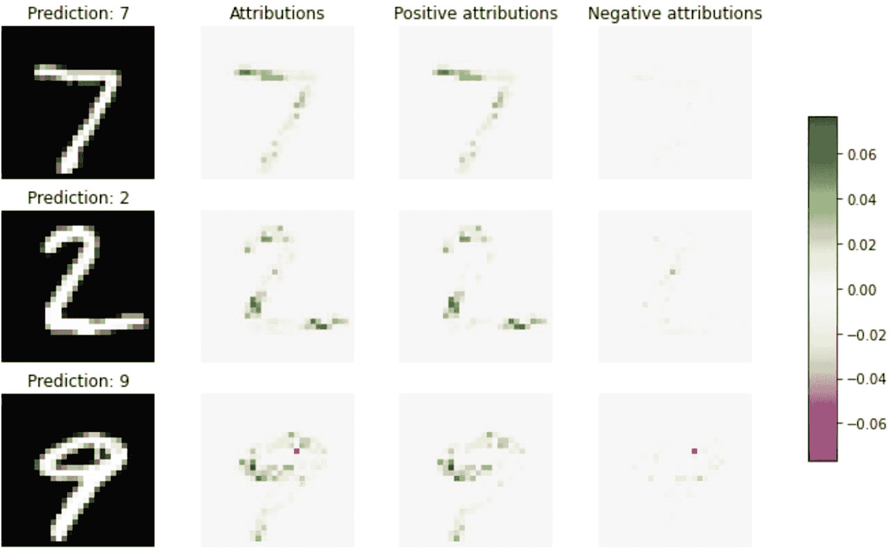

# 14. 计算机视觉的模型可解释性

由于在提高模型准确性方面的持续研究、新框架的演进以及开源社区的不断壮大，图像分类和目标检测等计算机视觉任务正日益精进。与五年前相比，当前最先进的机器学习模型的结果更具前景，这让我们有信心通过处理更复杂的问题来拓展问题解决的边界。纵观计算机视觉的应用案例，最突出的领域包括零售、农业、公共卫生、汽车工业和游戏产业。其中一些行业在法律上有义务负责任地使用 AI。欧盟也正试图对 AI 的应用和用途进行监管。如果图像分类模型产生的预测或分类出错，用户将不会信任该模型及其预测。理解 AI 模型为何以某种方式而非另一种方式生成预测或分类是必要的。模型可解释性向最终用户展示图像的哪些特定部分导致模型预测为 A 类而非其他类别。

## 为什么图像数据需要可解释性？

图像被转换为像素值。像素值随后被用作特征，来训练图像最能代表的标签。如果 AI 模型生成了错误的预测/分类，组织中有两组人需要负责并承担责任：构建模型的数据科学家，以及批准将模型投入生产的利益相关者。图像数据分类错误的原因有两个：

-   模型无法考虑正确的特征集来进行预测。相反，它从数据中选取了错误的线索和信号。训练时未考虑正确的特征集。
-   没有进行足够的训练，以使算法能够很好地泛化未见过的数据。

### 使用 Alibi 进行锚点图像解释

对于目标检测和图像分类等计算机视觉任务，你可以解释区分一个包袋图像与一件 T 恤图像的关键特征，例如。这可以通过使用锚点解释来实现，本书第 11 章对此进行了介绍。然而，同样的方法可以扩展到其他计算机视觉任务，例如假图像识别和图像可能被篡改的情况。步骤如下：

-   可以为每个领域训练目标检测或图像分类模型，例如知名人物、流行或常见物体。
-   如果你想验证另一人的图像或裁剪图像的 authenticity，你可以获得一个预测，但概率阈值会稍低。
-   在这种情况下，你可以触发锚点解释，以了解导致该预测的关键特征或显著像素。
-   理论上，这没问题。实践中，你可以通过使用以下超像素公式进行验证。

锚点解释提供的是区分该图像或物体与其他图像的颜色或对比色。你需要编写一个函数来为任何给定的图像生成超像素。


### 积分梯度法

积分梯度法的目标是为用于训练机器学习或深度学习模型的每个特征分配特征重要性分数。我们使用梯度下降法来更新深度神经网络模型的权重。当反向操作时，可以对归因于特征重要性分数的权重进行积分。梯度可以定义为深度学习模型中输出相对于输入特征的斜率。积分梯度法可用于理解在图像分类问题中识别正确图像时的像素重要性。梯度通常针对概率最高的类别相对于输入图像像素的输出进行计算。

```
import numpy as np
import os
import tensorflow as tf
from tensorflow.keras.layers import Activation, Conv2D, Dense, Dropout
from tensorflow.keras.layers import Flatten, Input, Reshape, MaxPooling2D
from tensorflow.keras.models import Model
from tensorflow.keras.utils import to_categorical
from alibi.explainers import IntegratedGradients
import matplotlib.pyplot as plt
print('TF version: ', tf.__version__)
print('Eager execution enabled: ', tf.executing_eagerly()) # True
train, test = tf.keras.datasets.mnist.load_data()
X_train, y_train = train
X_test, y_test = test
test_labels = y_test.copy()
train_labels = y_train.copy()
```

为了解释积分梯度法的工作原理，我们使用易于理解且许多人熟悉的 MNIST 数据集。表 14-1 解释了模型的参数。

**表 14-1** 积分梯度参数

| 参数 | 说明 |
| --- | --- |
| `Model` | TensorFlow 或 Keras 模型 |
| `Layer` | 计算梯度所依据的层。如果未提供，则相对于输入计算梯度。 |
| `Method` | 积分近似方法。可用的方法有：`riemann_left`、`riemann_right`、`riemann_middle`、`riemann_trapezoid` 和 `gausslegendre`。 |
| `N_steps` | 从基线到输入实例的路径积分近似中的步数 |

```
X_train = X_train.reshape(-1, 28, 28, 1).astype('float64') / 255
X_test = X_test.reshape(-1, 28, 28, 1).astype('float64') / 255
y_train = to_categorical(y_train, 10)
y_test = to_categorical(y_test, 10)
print(X_train.shape, y_train.shape, X_test.shape, y_test.shape)
load_mnist_model = False
save_model = True
filepath = './model_mnist/'  # 更改为模型保存目录
if load_mnist_model:
model = tf.keras.models.load_model(os.path.join(filepath, 'model.h5'))
else:
# 定义模型
inputs = Input(shape=(X_train.shape[1:]), dtype=tf.float64)
x = Conv2D(64, 2, padding='same', activation='relu')(inputs)
x = MaxPooling2D(pool_size=2)(x)
x = Dropout(.3)(x)
x = Conv2D(32, 2, padding='same', activation='relu')(x)
x = MaxPooling2D(pool_size=2)(x)
x = Dropout(.3)(x)
x = Flatten()(x)
x = Dense(256, activation='relu')(x)
x = Dropout(.5)(x)
logits = Dense(10, name='logits')(x)
outputs = Activation('softmax', name='softmax')(logits)
model = Model(inputs=inputs, outputs=outputs)
model.compile(loss='categorical_crossentropy',
optimizer='adam',
metrics=['accuracy'])
# 训练模型
model.fit(X_train,
y_train,
epochs=6,
batch_size=256,
verbose=1,
validation_data=(X_test, y_test)
)
if save_model:
if not os.path.exists(filepath):
os.makedirs(filepath)
model.save(os.path.join(filepath, 'model.h5'))
```

为了生成积分梯度，目标变量指定应考虑输出的哪个类别，以便使用积分方法计算归因。

```
import tensorflow as tf
from alibi.explainers import IntegratedGradients
model = tf.keras.models.load_model(os.path.join(filepath, 'model.h5'))
ig  = IntegratedGradients(model,
layer=None,
method="gausslegendre",
n_steps=50,
internal_batch_size=100)
```

从 `alibi.explainers` 导入积分梯度模块，加载预训练的 TensorFlow 或 Keras 模型，然后生成梯度。根据图像分类的复杂程度，有五种不同的积分近似方法。没有直接的规则或方法可以知道哪种方法在何时有效，因此需要以迭代的方式尝试所有方法。

```
# 初始化 IntegratedGradients 实例
n_steps = 50
method = "gausslegendre"
ig  = IntegratedGradients(model,
n_steps=n_steps,
method=method)
```

可以增加的步数取决于机器的计算能力以及用于训练模型的文件夹中的样本数量。

```
# 计算测试集中前 10 张图像的归因
nb_samples = 10
X_test_sample = X_test[:nb_samples]
predictions = model(X_test_sample).numpy().argmax(axis=1)
explanation = ig.explain(X_test_sample,
baselines=None,
target=predictions)
```

为了计算测试集中前 10 张图像的归因，可以将目标选择为预测值，基线选择为无。如果选择基线为无，则会触发黑色作为基线，即图像的背景色。

```
# 来自解释对象的元数据
explanation.meta
# 来自解释对象的数据字段
explanation.data.keys()
# 从解释对象获取归因值
attrs = explanation.attributions[0]
```

一旦获得归因，就可以以图形格式显示目标类别的正归因和负归因。

```
fig, ax = plt.subplots(nrows=3, ncols=4, figsize=(10, 7))
image_ids = [0, 1, 9]
cmap_bound = np.abs(attrs[[0, 1, 9]]).max()
for row, image_id in enumerate(image_ids):
# 原始图像
ax[row, 0].imshow(X_test[image_id].squeeze(), cmap='gray')
ax[row, 0].set_title(f'预测: {predictions[image_id]}')
# 归因
attr = attrs[image_id]
im = ax[row, 1].imshow(attr.squeeze(), vmin=-cmap_bound, vmax=cmap_bound, cmap='PiYG')
# 正归因
attr_pos = attr.clip(0, 1)
im_pos = ax[row, 2].imshow(attr_pos.squeeze(), vmin=-cmap_bound, vmax=cmap_bound, cmap='PiYG')
# 负归因
attr_neg = attr.clip(-1, 0)
im_neg = ax[row, 3].imshow(attr_neg.squeeze(), vmin=-cmap_bound, vmax=cmap_bound, cmap='PiYG')
ax[0, 1].set_title('归因');
ax[0, 2].set_title('正归因');
ax[0, 3].set_title('负归因');
for ax in fig.axes:
ax.axis('off')
fig.colorbar(im, cax=fig.add_axes([0.95, 0.25, 0.03, 0.5]));
```



**图 14-1** 由积分梯度生成的归因

在图 14-1 中，预测的数字是 7、2 和 9。正归因大多与最终预测匹配，而负归因则相当低。

## 结论

图像归因对于解释特定图像分类的原因非常重要。可以使用主导像素方法或识别图像中受影响的像素来创建图像归因。这在某些行业中可能很有用。在制造业中，它可用于从产品图像中识别缺陷产品。在医疗保健领域，它可以对各类扫描进行分类并识别扫描中的异常。在所有领域，解释模型为何将某个类别分类出来都很重要。只要能够解释预测结果，就能更好地赢得用户对模型的信任，从而可以增加 AI 模型在行业中解决复杂业务问题的采用率。


