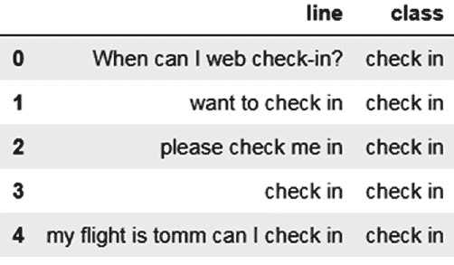
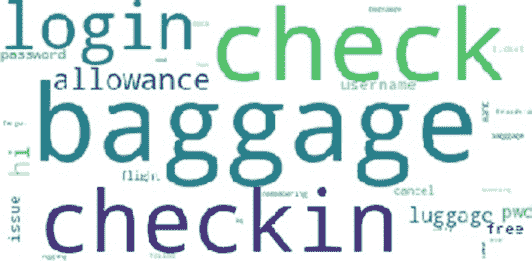
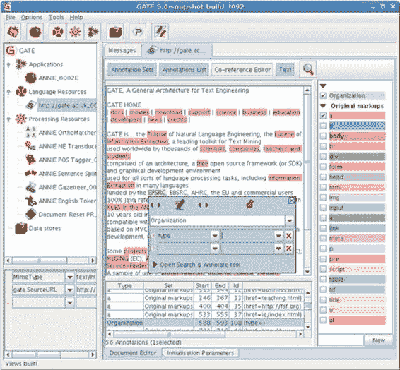
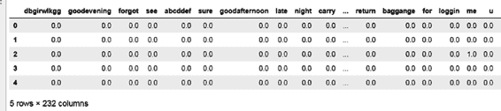

# 第 2 章 客户服务中的自然语言处理

客户服务是一个价值数十亿美元的行业。据估计，糟糕的客户体验在全球范围内造成的损失高达一万亿美元（https://blog.hubspot.com/service/customer-service-stats）。客户服务最早可追溯到 20 世纪 60 年代以呼叫中心形式出现的雏形。随着客户服务需求的增长，如今客户支持已成为任何消费类组织的重要组成部分。客户可以通过网络、应用程序、语音、`IVR`或电话等多种方式联系组织。在本章中，我们将探讨`NLP`在通过聊天和电话提供人工辅助客户服务时所解决的核心问题。

让我们通过各个服务渠道收集的文本数据，来看看客户服务行业的数据结构。

## 语音通话

客户致电联络中心，由公司的客户支持代理解答客户疑问。通话结束时，代理会记录通话性质、已创建的任何工单以及解决方案。代理还可能填写一些与通话相关的表格。表 2-1 展示了示例数据。

**表 2-1.** 通话数据示例

| **通话 ID** | **通话开始时间** | **通话结束时间** | **代理通话备注** | **是否转接** | **代理姓名** | **客户调查评分** | **客户调查评论** |
| --- | --- | --- | --- | --- | --- | --- | --- |
| 424798 | 2019/11/12 1:09:38 | 2019/11/12 1:18:38 | 客户询问账单过高问题，已解释。 | 否 | Sam | | 客户表示满意 |
| 450237 | 2019/11/26 8:58:58 | 2019/11/26 9:13:58 | 费用减免，已升级处理。 | 否 | Kiran | | |
| 794029 | 2019/4/26 8:23:52 | 2019/4/26 8:34:52 | 已发送付款链接 | 否 | Karthik | 3 | 通话中断.. 代理有帮助 |
| 249311 | 2019/12/8 10:50:14 | 2019/12/8 11:02:14 | 已转接至主管 | 是 | Megha | | |

我们分析代理的通话备注和客户调查评论。然后，这些数据会与其他结构化数据结合，以得出关于通话的洞察。

## 聊天

客户可以在电子商务网页或移动应用程序上与客户支持进行聊天。上一章中您看到了一个聊天记录的示例。与通话类似，代理在交互结束时需要填写“代理处置表”。与语音通话相比，聊天中的代理处置表稍长一些。代理可以同时处理多项任务，因此需要填写聊天的详细信息，这样我们就能获得带有时间戳的逐行文本数据。表 2-2 展示了此类数据的一个小示例。

**表 2-2.** 聊天数据示例

| **发言者** | **行文本** | **时间戳** |
| --- | --- | --- |
| 系统 | 感谢您选择最佳电信公司。客服代表将很快与您联系。 | 5:44:44 |
| 系统 | 您现在正在与 Max 聊天。 | 5:44:57 |
| 客户 | 你好 Max | 5:45:03 |
| 代理 | 感谢您联系最佳电信公司。我叫 Max。 | 5:45:14 |
| 代理 | 您好，我看到我正在与 Sara 女士聊天，您提供了 XXXXXXX 作为您账户关联的号码。请问是否正确？ | 5:45:26 |
| 客户 | 是的，正确。我刚收到一封邮件，说我的服务价格要涨到每月 70 美元，但在你们网站上，却只有 30 美元。这是怎么回事？ | 5:45:39 |

这些数据通常与以下其他数据一起分析：

- 聊天的元数据，例如平均处理时长、转接给其他代理的聊天、发生聊天的网页
- 代理的元数据，例如代理的任职年限和过往绩效记录
- 代理处置数据（由代理填写），例如用户聊天原因、是否已解决、已创建的工单等
- 用户数据，例如用户偏好、用户行为历史记录、用户联系历史记录等

## 用户调查数据

用户调查数据包括聊天结束时的用户评分以及任何用户反馈评论。

## 工单数据

工单通常在客户致电或与客服人员聊天时创建。少数情况下，客户可能通过网页或应用程序直接创建工单。表 2-3 展示了工单数据的概览。工单数据可能比你刚才查看的上述两种渠道的数据更具结构性。这里的非结构化文本可能是客服人员的备注，在某些情况下，它会以非常简洁的形式记录所采取的行动，因此其可用性较低。

**表 2-3.** 工单数据示例

| 工单 ID | 类别 | 子类别 | 客服备注 | 部门 | 状态 | 工单创建日期 | 工单关闭日期 |
|-----------|----------|-------------|-------------|------------|--------|----------------------|----------------------|
| 461970 | 维修 | 已发送替换件给供应商 a | 商品 | 已关闭 | 2019/10/1 11:51:16 | 2019/10/3 11:51:16 |
| 271234 | 账单 | 豁免 | 首次客服通话时已关闭 | 重新开启 | 2019/9/28 1:21:11 | 2019/9/30 1:21:11 |
| 356827 | 支付 | 失败 | 已致电并转至催收部门关闭 | 催收部门 | 已关闭 | 2019/12/23 8:06:24 | 2019/12/24 8:06:24 |
|  | 网络 | 间歇性网络不佳 | 技术支持 | 开启中 | 2019/8/10 11:22:03 |  |

## 电子邮件数据

电子邮件是客户支持中成本效益最高的渠道，并被广泛使用。表 2-4 展示了从安然公司 CSV 文件中提取的安然数据集（`www.cs.cmu.edu/~./enron/`）的一个样本。

**表 2-4.** 电子邮件数据示例（续）

| 消息内容 | 密送 | 抄送 | 收件人 | 主题 | 收件人 | 发件人 | 日期 |
|-------------|-------|------|------|---------|----|------|------|
| 这是我们的预测 | N> | N@ | tim Belden <Belden/enronXGa> | 回复 | tim.belden@enron.com | phillip.allen@enron.com | 2001 年 5 月 14 日，周一 |
| 测试成功。 | | | John J La <J La/enronXga> | 回复 | john.la@enron.com | phillip.allen@enron.com | 2001 年 5 月 4 日，周五 13:45 |
| ... | ... | ... | ... | ... | ... | ... | ... |

这是数据集中列的一个样本。实际数据集包含每条消息的`消息 ID`、源`.pst`文件、`From`字段等。

在下一节中，你将看到客户支持中文本挖掘最常见的用例之一：客户之声（`VOC`）。`VOC`分析可以是一个仪表板或报告，提供关于客户脉搏的可操作见解。

## 客户之声

### 意图挖掘

意图是客户想要处理或解决的问题。这是客户联系公司或组织的原因。意图的例子包括支付`failure`（故障）、关于高额账单的`complaints`（投诉）、`return`（退货）查询等。理解语料库中意图最简单快捷的方法是通过词云。然而，意图通常更为深层，为了获得可操作的洞察，你需要为每次聊天或语音交互映射一个准确的类别。在实践中，意图通常通过规则或监督算法来挖掘。让我们详细看看每个过程。我们将研究一个包含航空业客户所提问题的数据集。

在进一步操作之前，先来探索一下这些数据。请参见代码清单 2-1 和图 2-1。

**代码清单 2-1.** 数据集

```python
import pandas as pd

df = pd.read_csv("airline_dataset.csv",encoding ='latin1')
df.head()
```



**图 2-1.** 数据集

```python
df["class"].value_counts()

login       105
other        79
baggage      76
check in     61
greetings    45
cancel       16
thanks       16
```

如图 2-1 所示，该数据集包含两列，一列是句子，另一列是句子所属的类别。该类别来自手动标注数据。你可以看到总共有七个类别，其中包括“other”（其他），这是一个包罗万象的类别；任何无法归入其他六个类别的句子都被标记为`other`。

### 通过高频词理解意图

给定一个句子语料库，你可以通过提取语料库中最频繁出现的词来理解主要意图。让我们使用`NLTK`包来获取高频关键词。

`NLTK`中的`FreqDist`提供了词组中词的分布情况。你首先需要将 pandas 系列的句子转换为一个拼接后的字符串。在代码清单 2-2 中，你使用`get_str_list`方法来实现这一点。一旦得到所需格式的字符串，你就可以通过`NLTK`进行分词，并将其交给`FreqDist`包（代码清单 2-3）。

**代码清单 2-2.**

```python
def get_str_list(ser):
    str_all = ' '.join(list(ser))
    return str_all

df["line"] = df["line"].str.lower()
df["line"] = df["line"].str.lstrip().str.rstrip()
str_all = get_str_list(df["line"].str.lower())
words = nltk.tokenize.word_tokenize(str_all)
fdist = FreqDist(words)
fdist.most_common()

[('in', 76),
 ('is', 36),
 ('baggage', 33),
 ('what', 32),
 ('check', 30),
 ('checkin', 30),
 ('login', 30),
 ('allowance', 29),
 ('to', 28),
 ('i', 27),
 ('hi', 26),
 ('the', 25),
 ('my', 22),
 ('luggage', 20),
```

**代码清单 2-3.**

```python
import nltk
from nltk.probability import FreqDist

def remove_stop_words(words,st):
    new_list = []
    st = set(st)
    for i in words:
        if(i not in st):
            new_list.append(i)
    return new_list

list_all1 = remove_stop_words(words,st)
##we did not word_tokenize as the returned object is already in a list form
fdist = FreqDist(list_all1)
fdist.most_common()

('baggage', 33),
 ('check', 30),
 ('checkin', 30),
 ('login', 30),
 ('allowance', 29),
 ('hi', 26),
 ('luggage', 20),
 ('pwd', 18),
 ('free', 17),
 ('username', 15),
```

如代码清单 2-2 所示，许多不太有用的词，如“in”、“is”和“what”，成为了高频词。这些词在所有句子中都很常用，因此无法用来识别任何有意义的意图。这类词被称为“停用词”。互联网上通常可以找到停用词列表。你也可以根据自己的目的编辑这些停用词。为了避免这个问题，我们在代码清单 2-3 中编写了下一个代码片段。接下来，你将导入一个名为`stop_words`的包。`get_stop_words`方法加上指定的语言会列出所有停用词。你的任务是从给定的语料库中移除停用词并清理文本。完成后，你将再次应用`FreqDist`方法并检查输出。

在代码清单 2-3 中，你可以看到与行李、值机、登录等相关的查询。这与已标记的前六个类别中的三个相匹配。

### 词云

词云可以快速且粗略地洞察你所拥有的数据。让我们利用现有数据，在移除停用词后，用句子集生成一个词云。

你将使用`WordCloud`（[`pypi.org/project/wordcloud/`](https://pypi.org/project/wordcloud/)）和`matplotlib`包来实现，如代码清单 2-5 和图 2-2 所示。但首先，使用`pip install`安装该包，如代码清单 2-4 所示。


**代码清单 2-4.** 安装包

```python
!pip install wordcloud
!pip install matplotlib
```

**代码清单 2-5.** 生成词云

```python
from wordcloud import WordCloud
import matplotlib.pyplot as plt

def generate_wordcloud(text):
    wordcloud = WordCloud(
        background_color ='white',relative_scaling = 1,
    ).generate(text)
    plt.imshow(wordcloud)
    plt.axis("off")
    plt.show()
    return wordcloud

## 将列表连接成字符串，作为词云的输入
str_all_rejoin = ' '.join(list_all1)
str_all_rejoin[0:42]
'can web check-in ? want check please check'

wc = generate_wordcloud(str_all_rejoin)
```

**图 2-2.** 词云

在图 2-2 中，你可以发现诸如登录、行李、值机、取消以及“hi”之类的问候语等主题。你找到了计划发现的六个主题中的五个。这是一个很好的开始。然而，你可以看到某些词在这里重复出现，比如“hi”、“checkin”和“pwd”。这是因为词库中存在搭配词。搭配词同时出现的概率很高：“make coffee”、“do homework”等。你可以通过关闭`collocations`功能来移除搭配词，从而在词云中只保留单个词。参见代码清单 2-6 和图 2-3。从`generate_wordcloud`函数返回的`词云对象`开始。

**代码清单 2-6.** 移除搭配词后的词云

```python
### 返回的词云对象及其相对得分
wc.words_
{'login': 1.0,
 'hi hi': 1.0,
 'baggage': 0.782608695652174,
 'checkin checkin': 0.782608695652174,
 'free': 0.7391304347826086,
 'pwd pwd': 0.6956521739130435,
 'username': 0.6521739130434783,
 'baggage allowance': 0.6521739130434783,
 'password': 0.6086956521739131,
 'flight': 0.5652173913043478,
 'check checkin': 0.4782608695652174,
 'checkin check': 0.4782608695652174,
 'want': 0.43478260869565216,
 'check': 0.391304347826087,

def generate_wordcloud(text):
    wordcloud = WordCloud(
        background_color ='white',relative_scaling = 1,
        collocations = False,
    ).generate(text)
    plt.imshow(wordcloud)
    plt.axis("off")
    plt.show()
    return wordcloud
```



**图 2-3.** 移除搭配词后的词云

© Mathangi Sri 2021
M. Sri, *基于 Python 的实用自然语言处理*, https://doi.org/10.1007/978-1-4842-6246-7_2

## 分类主题的规则

挖掘主题的另一种方法是编写规则并对句子进行分类。这是一种常用的方法，在无法训练机器学习模型时采用。规则的形式为：*如果一个句子包含 `word1` 和 `word2`，那么它可能属于某个主题*。

### 文本排版

规则可以有不同类型，例如 `And`、`Not`、`And with three words` 等。这些规则集通过“或”条件连接。像 `QDA Miner`、`Clarabridge` 和 `SPSS` 这类工具可用于编写和执行强大的规则。规则还可以包含句子的语法结构，如名词、副词等。在代码清单 2-7、代码清单 2-8 和图 2-4 中，你将使用 `Python` 编写自己的文本挖掘规则引擎。

规则文件包含两组规则。一组用于判断单个单词是否存在。如果存在，则该句子被分配到该类别。例如，如果单词 `baggage` 存在，则句子被分配到该类别。另一类规则是两个单词通过一个窗口间隔的“与”规则。根据一般实践，发现单个单词或两个单词的匹配可以覆盖广泛的主题。例如，规则“`check` 和 `in` 间隔（窗口）少于两个单词”可以捕获像“check me in”这样的句子。规则文件中 `window` 列的值为 -1 表示窗口不适用。另请注意，任何规则命中都足以将句子映射到类别。从这个角度来看，所有规则彼此之间都是“或”的关系。

### 代码清单 2-7. 文本挖掘规则

```python
import pandas as pd
import re
from sklearn.metrics import accuracy_score

df = pd.read_csv("airline_dataset.csv", encoding='latin1')
rules = pd.read_csv("rules_airline.csv")

def rule_eval(sent, word1, word2, class1, type1, window):
    class_fnl = ""
    if (type1 == "single"):
        if (sent.find(word1) >= 0):
            class_fnl = class1
        else:
            class_fnl = ""
    elif (type1 == "double"):
        if ((sent.find(word1) >= 0) & (sent.find(word2) >= 0)):
            if (window == -1):
                class_fnl = class1
            else:
                find_text = word1 + ".*" + word2
                list1 = re.findall(find_text, sent)
                for i in list1:
                    window_size = i.count(' ') - 1
                    if (window_size <= window):
                        class_fnl = class1
                        break
                else:
                    class_fnl = ""
    return class_fnl
```

### 代码清单 2-8.

```python
rules.head()
```

### 图 2-4. 文本挖掘规则输出

函数 `rule_eval` 接收句子和规则参数，并评估是否存在命中。如果存在命中，它会为句子分配相应的类别。对于 `double` 类型的规则，会使用形式为 `word1.* word2` 的正则表达式。这是为了计算两个匹配单词之间的单词数量。如果该数量低于指定的窗口值，则视为命中。请参见代码清单 2-9 和图 2-5。

### 代码清单 2-9.

```python
df["line"] = df["line"].str.lower().str.lstrip().str.rstrip()
topics_list = []
for i, row in df.iterrows():
    sent = row["line"]
    for j, row1 in rules.iterrows():
        word1 = row1["word"]
        word2 = row1["word2"]
        class1 = row1["class"]
        type1 = row1["type"]
        window = row1["window"]
        class1 = rule_eval(sent, word1, word2, class1, type1, window)
        if (class1 != ""):
            break
    topics_list.append(class1)
df["topics"] = topics_list
df.loc[df.topics == "", "topics"] = "other"
df.head()
```

### 图 2-5. 分配主题

一旦将规则分配的主题添加到数据集中，你就可以比较手动标记的类别和从规则中提取的类别。现在，你将通过比较手动标签（`class`）和规则分配的主题（`topics`）来衡量此练习的准确性。你通过使用 `scikit-learn` 中的 `accuracy` 方法来实现这一点。请参见代码清单 2-10。

### 代码清单 2-10. Scikit Learn 中的准确率方法

```python
accuracy_score(df["class"], df["topics"], normalize=True, sample_weight=None)
```

```
0.7814070351758794
```

你通过一些快速规则获得了 78% 的准确率。然而，这个数字需要使用其他指标（如 `F` 分数、混淆矩阵等）进行基准测试。

将在下一节中详细讨论。为了进一步提高准确性，你需要打印出错误并修改规则。

## 使用机器学习的监督学习

规则方法的一个问题是它非常繁琐，而且你可能过度拟合当前数据，以至于无法知道新数据集的准确性。随着类别数量的增加，规则会变得更加复杂。你可以使用机器学习模型来学习模式，并用新模型对新数据集进行评分。机器学习从历史数据中学习数据中的模式。在你的案例中，你拥有手动标记的数据。还记得你之前为了改进模型而遵循的流程吗？你打印出与手动标签相比的错误，然后分析错误来源以修正规则。监督学习遵循类似的方法。它首先预测一个输出，然后根据与手动标记数据对比时发现的错误不断修正输出，直到错误最小化。你将在下文详细了解文本挖掘的监督过程。

## 获取手动标记数据

在航空公司数据集中，手动标记的数据恰好是因变量类别。手动标记（也称为注释）是一项耗时的活动。然而，这一过程的成本效益被认为是值得的。有一些在线注释公司（如 `Mechanical Turks`）提供标记服务。有时，组织会建立一个带有质量控制流程的注释团队，以支持大规模注释。有多种工具可用于注释。例如 `GATE`（[https://gate.ac.uk/](https://gate.ac.uk/)）、`LightTag`（[www.lighttag.io/](www.lighttag.io/)）和 `TagTog`（[www.tagtog.net/](www.tagtog.net/)）。`GATE` 是一个开源文本挖掘工具，具有多种注释功能。图 2-6 展示了 `GATE` 的一个屏幕示例。注释者会高亮文本中的特定部分，然后注释该高亮主题/词语的内容。



**图 2-6.** GATE 界面

然而，Microsoft Excel 或任何基于 Excel 的工具（如 Google 表格）也可以帮助解决注释问题。本书中的大多数注释都是通过基于 Excel 的平台完成的，包括你正在探索的当前案例研究。一旦句子或词语被标记，就必须进行彻底的质量检查。手动标记的准确率应达到 90% 以上。当然，这可能会根据语料库而变化。作为质量检查的一部分，主管会检查注释者所做的标签。或者，可以通过让多个注释者标记语料库来提高标记准确率。为了在标记过程中获得正确的质量，数据科学家需要确保完成以下任务：

- **明确定义本体**：本体是分类树。在你的案例中，它是主题列表。它们必须互斥且完全穷尽。这是实现高标记准确率，从而获得高机器学习模型准确率的重要步骤。
- **提供示例**：数据科学家的职责还包括为每个类别提供示例。
- **类别间的冲突**：有时两个句子可能看起来属于不同的类别。在这种情况下，应明确定义冲突解决方案。考虑这个查询：“我在登录时遇到问题。我想支付账单。”如果有两个类别，即登录和支付，那么这个查询应该被标记为什么？

一旦你获得了标记数据，下一步就是构建一个能够学习底层数据模式的预测模型。给定一个新句子，它应该能够预测其主题。这组底层模式被称为预测模型。监督学习中的任何预测模型都有两个组成部分：因变量和自变量。在你的案例中，因变量是标签，自变量是句子。然而，机器学习模型不能接受词语作为输入。因此，词语/句子必须转换为数字。将词语转换为数字的第一步称为分词。

## 词语分词

所以你有一组句子作为因变量。第一步是将它们转换为标记或分析单元。标记可以是词语、句子或字符。让我们为语料库获取标记。请参阅清单 2-11 了解分词句子的方法。

**清单 2-11.** 标记

```python
from nltk.tokenize import word_tokenize

str1 = "What a great show!"
str1.split()
['What', 'a', 'great', 'show!']

from nltk.tokenize import word_tokenize
word_tokenize(str1)
['What', 'a', 'great', 'show', '!']
```

如你所见，将句子分解为词语的最简单方法是使用 `split` 函数。然而，`split` 不能处理特殊字符，而来自 `NLTK` 的 `word_tokenize` 可以处理特殊字符。句子可以使用清单 2-12 中所示的 `sent_tokenize` 函数进行拆分。

**清单 2-12.** 拆分句子

```python
sentences = "I am feeling great! It was a great show"
from nltk.tokenize import sent_tokenize
sent_tokenize(sentences)
['I am feeling great!', 'It was a great show']
```

有时你可能还想按特定顺序分析词语。例如，“check in” 是一个整体，如果将其分析为 “check” 和 “in”，其价值就会丢失。为了在将句子转换为词语标记时尽可能保留含义，你还需要保留顺序。因此，你可以使用两个或三个词的标记，而不是单个词的标记。它们被称为二元组和三元组。请参阅清单 2-13。

**清单 2-13.** 二元组和三元组

```python
import nltk
text = "I want to check in asap"
bigram_list = list(nltk.bigrams(text.split()))
[' '.join(i) for i in bigram_list]
['I want', 'want to', 'to check', 'check in', 'in asap']
```

现在你了解了分词，让我们将其应用于你的语料库并将其拆分为词语。

## 词项-文档矩阵

现在让我们对你拥有的句子列表应用词语分词并获取输出。该输出将作为因变量输入到机器学习模型中。你的目标是将你这里的文本转换为数字。最简单的方法是使用“词袋”方法。在这里，你获取语料库中的词语或标记列表，并将它们视为数据挖掘问题中的特征。现在你得到一个大小为 `N*M` 的矩阵，其中 `N` 是文档数量（数据框的长度），`M` 是语料库中唯一标记的数量。开始时，单元格可以表示词语的存在或不存在。使用清单 2-14 中的代码执行此操作，并在图 2-7 中查看结果。

**清单 2-14.** 词袋方法

```python
def tokenize(sent1):
    return word_tokenize(sent1)

df = pd.read_csv('airline_dataset.csv', low_memory=False, encoding='latin1')
df["line"] = df["line"].str.lower().str.lstrip().str.rstrip()

### tokenize all rows
df["token_words"] = df["line"].apply(tokenize)
df.head()
```

**表 2-1. 词袋分词结果示例**

| 索引 | 行内容 | 类别 | 分词结果 |
|-------|------|-------|-------------|
| 0 | when can i web check-in? | check in | [when, can, i, web, check-in, ?] |
| 1 | want to check in | check in | [want, to, check, in] |
| 2 | please check me in | check in | [please, check, me, in] |
| 3 | check in | check in | [check, in] |

**图 2-7.** 词袋输出

图 2-7 中的数据是语料库中所有文档生成的词元输出结果。现在请参阅代码清单 2-15、代码清单 2-16 以及图 2-8。



### 代码清单 2-15

```python
###获取唯一词列表

list_all = []

for i in df["token_words"]:

list_all = list_all + i

list_words = list(set(list_all))

list_words[0:5]

['check', 'do', '20th', 'hello', 'monday']

###初始化数组：行数=数据框长度，列数=唯一词数量

arr1 = np.zeros([len(df),len(list_words)])

###遍历数据框，将句子中出现的词标记为 1

for i,row in df.iterrows():

token_words = row["token_words"]

for j in token_words:

if (j in list_words):

k = list_words.index(j)

arr1[i][k] = 1

###验证结果是否正确

get_non_zero = np.where(arr1[0]==1)

list_index = list(get_non_zero[0])

[list_words[i] for i in list_index]

['can', 'when', 'web', 'i']
```

### 图 2-8 词项-文档矩阵

### 代码清单 2-16

```python
df_mat = pd.DataFrame(arr1)

df_mat.columns = list_words

df_mat.head()
```

图 2-8 是你创建的矩阵的快速可视化结果。这被称为**词项-文档**矩阵。请注意，我们用 0 或 1 填充单元格，分别表示某个词在句子中出现或不出现。你也可以将单元格标记为词在句子中的频率。此外，在上述示例中，请注意你为包含 398 个文档的语料库生成了 232 个特征。因此，你会在上述矩阵中看到大量零值。使矩阵稠密化并使其适用于机器学习模型的一种方法是直接删除那些对句子不添加任何意义的词。

在之前的练习中，你了解了停用词（and、not、the、a）。从特征列表中删除这些词将减小矩阵的规模。

另一种降低冗余特征重要性的方法是对语料库中高频词的值进行反向加权。因此，在填充单元格的值时，你需要“惩罚”那些出现在所有文档中的词。你可以通过**TF-IDF**公式在数学上实现这一点。`TF-IDF` 计算词频和逆文档频率。对于给定词，该统计量表示它相对于语料库中其他词的重要性。出现在较少文档中的词将具有较高的 `TF-IDF` 分数，而出现在所有文档中的词将具有较低的 `TF-IDF` 分数。

1.  `TF`（词频）在此公式中表示一个词（词元或特征）在文档中出现的次数，除以文档中的总词数。

    `TF(t) = (词项 t 在文档中出现的次数) / (文档中的总词项数)`

2.  `IDF`（逆文档频率）表示给定词在语料库中出现的文档数量。

    `IDF(t) = log_e(文档总数 / 包含词项 t 的文档数)`

3.  最终值通过将 `TF` 和 `IDF` 相乘得到。

假设有一个包含 1000 个文档的语料库。假设词“this”和“language”在语料库中的出现频率分别为 500 和 50。也就是说，词“this”出现在 500 个文档中，词“language”出现在 50 个文档中。“this”的 `IDF` 为 `log(1000/500)`，即 0.3010299957；“language”的 `IDF` 为 `log(1000/50)`，即 1.301029996。

考虑表 2-5 中的两个文档，并计算其中词“this”和“language”的 TF-IDF 值。

**表 2-5 计算 TF-IDF**

| 句子 | TF-this | TF-language | IDF-this | IDF-language | TF-IDF this | TF-IDF language |
| :--- | :--- | :--- | :--- | :--- | :--- | :--- |
| this is a great piece written. this will be remembered | 0.2 | | 0.301 | 1.301 | 0.060 | 0.000 |
| language models are very popular | | 0.2 | 0.301 | 1.301 | 0.000 | 0.260 |

现在回到你的用例，你将计算每个特征的 TF-IDF 值。

每个文档并用其填充单元格值。了解了词项-文档矩阵后，清单 2-17 展示了一个使用 Python 中 `scikit-learn` 库的 `vectorizer` 方法生成相同矩阵的示例。

**清单 2-17. 向量化方法**

```python
from sklearn.feature_extraction.text import TfidfVectorizer

tfidf_vectorizer = TfidfVectorizer(min_df=0.0, analyzer=u'word', ngram_range=(1, 1), stop_words=None)

tfidf_matrix = tfidf_vectorizer.fit_transform(df["line"])

tf1 = tfidf_matrix.todense()

tfidf_vectorizer.vocabulary_
```

```
{u'03': 0,
u'12th': 1,
u'2017': 2,
u'20th': 3,
u'24th': 4,
u'26th': 5,
u'35': 6,
u'65321': 7,
u'abcddef': 8,
u'abel': 9,
u'able': 10,
u'access': 11,
u'account': 12,
u'afternoon': 13,
u'air': 14,..}
```

```
len(tfidf_vectorizer.vocabulary_), tf1.shape
(223, (398L, 223L))

tf1[0:10]
matrix([[0., 0., 0., ..., 0., 0., 0.],
[0., 0., 0., ..., 0., 0., 0.],
[0., 0., 0., ..., 0., 0., 0.],
...,
[0., 0., 0., ..., 0., 0., 0.],
[0., 0., 0., ..., 0., 0., 0.],
[0., 0., 0., ..., 0., 0., 0.]])
```

`TfidfVectorizer` 对象有几个重要参数，用于降低矩阵的稀疏性（列数）：

- `min_df` 是一个词应出现的最小文档数。
- `stop_words` 是一个选项，用于指定是否提供停用词。
- `analyzer` 可以是词或字符，具体取决于你想要的词元类型。对于当前问题，你希望使用词作为词元。
- `ngram_range` 的选项提供了任意长度的 n-gram（二元组、三元组等）。例如，通过使用 `ngram_range(2,3)`，你可以获得从二元组到三元组的词元范围。

一旦你获得了一个向量化器对象，就可以将其拟合到语料库上，并得到一个稀疏矩阵。然后可以将稀疏矩阵转换为稠密矩阵。命令 `tfidf_vectorizer.vocabulary` 列出了向量化器生成的词元集合。如你所见，其中包含一堆数字和日期，它们可能不会为分析增加太多价值，但如果将它们归一化为实体（如日期、月份等），则可以带来很大价值。你将在下一节学习数据归一化。

### 数据归一化

数据归一化通常包括使用正则表达式对日期、时间和金额进行泛化处理。例如，你可以将所有日期格式归为一个词，如“Dates”。类似地，所有支付或收到的金额都可以替换为“Money”一词。你还可以对相似的词进行重新标记。例如，在你的案例中，“Baggage”和“Luggage”含义相同，因此可以将它们替换为同一个词。

归一化有助于实现两件事：使数据变得稠密，并为任何未见过的变体准备数据。例如，考虑句子“My flight is on Sunday and I want to check in.”如果你基于前一个句子构建模型，那么当出现一个新句子“My flight is on Friday and I want to check in”时，模型可能表现不佳。因此，你可以将任何此类词（此处为星期几）替换为一个通用名称（此处为“Dayofweek”），以泛化模型并使其更健壮。

### 替换特定模式

以下是几个示例，展示正则表达式如何帮助预处理句子。如果你不熟悉正则表达式，我建议你快速学习一个正则表达式教程，以熟悉其语法。参见清单 2-18。

**清单 2-18. 正则表达式**

```python
str1 = "I want to be there on 19th"
re.sub("[0-9]+th", "datepp", str1)
'I want to be there on datepp'

str1 = "I want to be there on 23-05-18"
str2 = "I want to be there on 23-05"
```

```python
import re
print(re.sub("[0-9]+[\/-]+[0-9]+[\/-]*[0-9]*", "datepp", str1))
print(re.sub("[0-9]+[\/-]+[0-9]+[\/-]*[0-9]*", "datepp", str2))
I want to be there on datepp
I want to be there on datepp
```

现在，让我们将正则表达式预处理应用于语料库。参见清单 2-19。

**清单 2-19. 应用正则表达式预处理**

```python
df["line1"] = df["line"].str.replace('[0-9]+th', 'datepp')
df["line1"] = df["line1"].str.replace('[0-9]+[\/-]+[0-9]+[\/-]*[0-9]*', 'datepp')
df["line1"] = df["line1"].str.replace('[0-9]+', 'digitpp')
df["line1"] = df["line1"].str.replace('[^A-Za-z]+', ' ')
```

你已经用通用词汇替换了日期和数字。最后一条语句还清理了文本，将所有非英文字符替换为空格。清单 2-20 和图 2-9 展示了使用通用组名进行单词替换的示例。这里，你将含义相似的单词替换为通用名称。我创建了一个文件，将相似单词映射到同一组。现在，你将导入并查看该文件。

**清单 2-20. 使用通用词汇**

```python
pp = pd.read_csv('preprocess.csv', low_memory=False, encoding='latin1')
pp.head()
```

**图 2-9. 将相似单词映射到同一组**


下一步是将这些单词替换为对应的类别名称。请参见清单 2-21 和图 2-10。

**清单 2-21. 使用通用词汇进行替换**

```python
def preprocess(l1):
    l2 = l1
    for word in pp["word"]:
        if (l1.find(word) >= 0):
            newcl = list(pp.loc[pp.word.str.contains(word), "class"])[0]
            l2 = l1.replace(word, newcl)
            break
    return l2

df["line1"] = df["line1"].apply(preprocess)
df.tail()
```

**图 2-10.**

现在，你已准备好对数据集运行机器学习算法。为了了解数据集在训练集和测试集上的表现，你需要将数据集划分为训练集和测试集。由于处理的是文本类别，你必须进行多类别分类。这意味着你需要将数据集拆分为多个类别，以便每个类别在训练集和测试集中都有足够的样本。请参见清单 2-22。

**清单 2-22. 将数据集拆分为多个类别**

```python
from sklearn.model_selection import StratifiedShuffleSplit

sss = StratifiedShuffleSplit(test_size=0.1, random_state=42, n_splits=1)
for train_index, test_index in sss.split(df, tgt):
    x_train, x_test = df[df.index.isin(train_index)], df[df.index.isin(test_index)]
    y_train, y_test = df.loc[df.index.isin(train_index), "class"], df.loc[df.index.isin(test_index), "class"]
```

你打印出形状并检查一次。请参见清单 2-23。

**清单 2-23. 打印形状**

```python
x_train.shape, y_train.shape, x_test.shape, x_test.shape
```

```
((358, 3), (358,), (40, 3), (40, 3))
```

你可以看到训练集和测试集分别被拆分为 358 行和 40 行。

现在，你在已划分的训练集和测试集上应用 TF-IDF 向量化器。请记住，此步骤必须在训练集和测试集划分之后进行。如果在划分之前执行此步骤，你很可能会高估准确率。请参见清单 2-24。

**清单 2-24. 应用 TF-IDF 向量化器**

```python
tfidf_vectorizer = TfidfVectorizer(min_df=0.0001, analyzer=u'word', ngram_range=(1, 3), stop_words='english')
tfidf_matrix_tr = tfidf_vectorizer.fit_transform(x_train["line1"])
tfidf_matrix_te = tfidf_vectorizer.transform(x_test["line1"])
x_train2 = tfidf_matrix_tr.todense()
x_test2 = tfidf_matrix_te.todense()
x_train2.shape, y_train.shape, x_test2.shape, y_test.shape
```

```
((358, 269), (358,), (40, 269), (40,))
```

从上述矩阵可以看出，训练集和测试集具有相同数量的列。你从句子中总共生成了 269 个特征。现在，你已准备好应用机器学习算法，以单词特征作为自变量，类别作为因变量。在应用机器学习算法之前，你将执行特征选择步骤，将特征数量减少到原始特征的 40%。请参见清单 2-25。

**清单 2-25. 特征选择步骤**

```python
from sklearn.feature_selection import SelectPercentile, f_classif

selector = SelectPercentile(f_classif, percentile=40)
selector.fit(x_train2, y_train)
x_train3 = selector.fit_transform(x_train2, y_train)
x_test3 = selector.transform(x_test2)
x_train3.shape, x_test3.shape
```

```
((358, 107), (40, 107))
```

现在你可以在训练数据集上运行机器学习算法，并在 `x_test` 上进行测试。参见清单 2-26 和清单 2-27。

**清单 2-26. 训练逻辑回归模型**

```python
clf_log = LogisticRegression()
clf_log.fit(x_train3, y_train)
```

**清单 2-27. 预测并计算准确率**

```python
pred = clf_log.predict(x_test3)
print(accuracy_score(y_test, pred))
```

```
0.875
```

与之前构建的规则相比，这个快速模型的准确率更高。该结果是在未见过的测试数据集上得出的，而之前的规则是在同一数据集上测试的，因此这个结果更加稳健。现在你将测试其他一些重要的指标。在多分类问题中，类别不平衡是常见现象，即类别的分布可能偏向于少数几个主要类别。因此，除了整体准确率之外，你还需要测试不同类别的单独准确率。这可以通过混淆矩阵、精确率、召回率和 F1 值来实现。

你可以从题为“Accuracy, Precision, Recall & F1 Score: Interpretation of Performance Measures”的文章（[`blog.exsilio.com/all/accuracy-precision-recall-f1-score-interpretation-of-performance-measures/`](https://blog.exsilio.com/all/accuracy-precision-recall-f1-score-interpretation-of-performance-measures/)）以及 Scikit-Learn 关于混淆矩阵（https://scikit-learn.org/stable/modules/generated/sklearn.metrics.confusion_matrix.html）和 F1 值（https://scikit-learn.org/stable/modules/generated/sklearn.metrics.f1_score.html#sklearn.metrics.f1_score）的页面中了解更多关于这些评分的信息。现在请看清单 2-28、清单 2-29 和图 2-11。

**清单 2-28. 计算 F1 分数**

```python
from sklearn.metrics import f1_score
f1_score(y_test, pred, average='macro')
```

```
0.8060606060606059
```

**清单 2-29. 生成混淆矩阵**

```python
from sklearn.metrics import confusion_matrix
confusion_matrix(y_test, pred, labels=None, sample_weight=None)
```

```
array([[ 7, 0, 0, 0, 0, 1, 0],
[ 0, 2, 0, 0, 0, 0, 0],
[ 0, 0, 5, 0, 0, 1, 0],
[ 0, 0, 0, 4, 0, 0, 0],
[ 0, 0, 0, 0, 10, 0, 0],
```

**图 2-11. 混淆矩阵**

你可以看到混淆矩阵具有强对角线特征，这表明模型良好，分类错误较少。

### 识别问题行

在上面的例子中，提供的数据是单行句子。然而，在对话中，存在整个对话语料库。将整个对话语料库标记为某个意图是很困难的。信噪比相当低，因此通常你会先尝试识别对话中可能包含问题行的部分，然后仅对这些句子进行意图挖掘。这可以显著提高信噪比。你还可以构建另一个监督学习模型来定位对话中的哪些行包含客户的问题。客户问题通常出现在“聊天”的前几行，或者会跟在诸如“请问有什么可以帮助您”这样的问题之后。参见表 2-6。

**表 2-6. 问题行**

| 角色 | 内容 |
| :--- | :--- |
| 系统 | 感谢您选择 Best Telco。客服代表将很快与您联系。 |
| 系统 | 您现在正在与 Max 聊天。 |
| 客户 Himax | |
| 客服 | 感谢您联系 Best Telco。我是 Max。 |
| 客服 | 您好，我看到我正在与 Sara 女士聊天，您提供了 `XXXXXXX` 作为您账户关联的号码，对吗？ |
| 客户 | 是的，没错。我刚收到一封邮件，说我的服务费要涨到 `$70/month`，但在你们网站上，它只要 `$30`。这是怎么回事？ |

正如你在上面的例子中所见，客户陈述问题的行是客户的第二行，紧跟在用户的问候语之后。在邮件中，它可能是客户邮件线程的起始行。因此，定位并寻找问题行能带来更好的结果。

在深入探讨了通过监督和无监督机制进行的意图挖掘和主题建模之后，你现在将看到一些经典的客服分析，其中这些意图构成了核心基础。这就像先做好披萨的饼底，然后再撒上不同的配料。一旦你掌握了客服对话的意图，就可以进行以下分析。

### 热门客户查询

# 第二章 客户服务中的自然语言处理

查询的频率分布可以快速洞察热门话题以及客户通常联系的原因。在下面的例子中，你将使用航空公司的数据集。你将创建一个包含标签频率分布的数据框。请注意，航空公司数据集中有一个名为 `CSAT` 的额外列。这是用户提供的 CSAT 评分。在绘图时，你将使用 `matplotlib` 库。参见清单 2-30 和图 2-12。


**清单 2-30.**

```python
import pandas as pd
import numpy as np
import matplotlib.pyplot as plt

df = pd.read_csv('airline_dataset_csat.csv', low_memory=False, encoding='latin1')
df.head()
```

**图 2-12.**

现在你将获取频率分布，并用绝对值绘制热门查询。参见清单 2-31 和图 2-13。

**清单 2-31.**

```python
freq1 = pd.DataFrame(df["class"].value_counts()).reset_index()
freq1.columns = ["class", "counts"]
freq1["percent_count"] = freq1["counts"] / freq1["counts"].sum()
freq1
```


**图 2-13.**

现在你使用 `matplotlib` 中的 `pyplot` 来绘制这些值。`pyplot.bar()` 接受 X 和 Y 值来构建条形图。参见清单 2-32 和图 2-14。

**清单 2-32.** 绘制数值

```python
x_axis_lab = list(freq1["class"])
y_axis_lab = list(freq1["counts"])
y_per_axis_lab = list(freq1["percent_count"])

import matplotlib.pyplot as plt

plt.bar(x_axis_lab, y_axis_lab)
plt.ylabel('Counts')
plt.xlabel('Categories')
plt.show()
```


**图 2-14.** 绘制数值

## 热门 CSAT 驱动因素

客户满意度是用户在客服互动结束时回答的一项调查，通常采用 1 到 5 分的评分标准。通过挖掘出的主题来绘制 CSAT 响应，可以了解客户对哪些意图满意或不满意。在航空公司数据集的例子中，如果客户给出 4 分或 5 分，则将其归类为满意。1 到 3 分则意味着客户被认为不满意。你根据这个逻辑对 `csat_fnl` 分数进行分类。首先，你对意图和满意度类别（满意、不满意）进行交叉制表。参见清单 2-33 和图 2-15。

**清单 2-33.**

```python
df["sat"] = 1
df.loc[df.csat_fnl <= 3, "sat"] = 0

ct = pd.crosstab(df["class"], df["sat"], normalize='index')
ct = ct.reset_index()
ct_cols = ct.columns
ct_cols1 = [ct_cols[0], "dissat", "sat"]
ct.columns = ct_cols1
ct["label"] = ct["class"]
ct
```


**图 2-15.**

现在你绘制一个包含满意和不满意情况的堆叠条形图。你将意图百分比分布作为次坐标轴。在 `matplotlib` 包中，你创建子图以显示两个 y 轴。首先，你使用 `bottom` 参数为满意/不满意创建堆叠条形图。`dissat` 变量堆叠在 `sat` 变量之上。参见清单 2-34。

**清单 2-34.**

```python
ct_sat = ct["sat"]
ct_dissat = ct["dissat"]
ind = ct["label"]

fig, ax = plt.subplots()
p1 = ax.bar(ind, ct_sat)
p2 = ax.bar(ind, ct_dissat, bottom=ct_sat)
ax.set_xlabel('Categories')
ax.set_ylabel('Sat/Dissat percentage')
ax2 = ax.twinx()
```

## 使用次坐标轴绘制不同 Y 轴的图表

```python
ax2.plot(ind, y_per_axis_lab, color="blue", marker="o")
ax2.set_ylabel('意图百分比')
plt.show()
```

`ax.twinx()` 函数帮助你创建次 Y 轴。`ax2.plot` 函数中的变量 `y_per_axis_lab` 包含了意图的百分比分布，如图所示。最终图表如图 2-16 所示。


**图 2-16.**

类似的图表可以针对 CSAT、聊天整体处理时间、解决率等指标绘制，然后可以从中得出可操作的分析结论。

## 主要 NPS 驱动因素

在继续本节之前，先简要说明 NPS。主要 NPS 驱动因素即净推荐值。在交互结束时，客户会被问到他们向朋友/亲戚推荐某个产品/服务的可能性，评分范围为 1 到 10。评分为 8-10 的客户被视为推荐者，1-4 为贬损者，5-7 为中立者。NPS 的计算公式如下：

上一节中的图表展示了用户问题或意图与 CSAT 的相关性。同样的分析也可以针对 NPS 进行。在某些情况下，你可能希望更深入地了解导致 CSAT 或 NPS 差异的因素。例如，NPS 可能是意图、解决方案、客服礼貌程度、产品属性、用户变量等的函数。表 2-7 展示了一个 NPS 样本数据集。

**表 2-7.** NPS 样本数据

| `用户 ID` | `意图` | `AHT` | `出发地` | `目的地` | `预算` | `家庭人数` | `客户类型` | `过去联系客服次数` | `是否解决` | `是否转接电话` | `NPS 分数` |
|---------|--------|-----|--------|-------------|--------|-------------|------------------|----------------------------------------|----------|------------------|-----------|
|         | 预订   |     | ATL    | FLL         | Na     | Na          | 金卡             |                                        | 是       | 否               | s         |
|         | 值机   |     | ATL    | LG          | Na     | Na          | 新客户           |                                        | 是       | 否               | s         |
|         | 登录   |     | Na     | LAX         | Na     | Na          | 新客户           |                                        | 是       | 否               | s         |
|         | 行李   |     | DEN    | Na          | Na     | Na          | 银卡             |                                        | 是       | 否               | s         |
|         | 登录   |     | Na     | Na          | Na     | Na          | 银卡             |                                        | 否       | 是               | s         |

这里的思路是理解 NPS 的主要驱动因素。通过回归模型来识别 NPS 的主要驱动因素，从而得出按优先级排序的行动项。数学上可以表示为：

`NPS = f(用户属性, 交易属性, 交互属性, 客服属性)`

下面我将详细讨论每个属性：

- **用户属性**：这些是用户特征，如用户会员等级、年龄、平均消费、生命周期价值等。这些属性通常以结构化数据的形式存在于某些数据库中。如果不可用，可以从当前交互或用户历史交互中提取。建议记录这些变量，因为它们有助于更好地理解问题。例如，如果发现新客户的 NPS 较低，则说明存在重大问题，可能会影响组织的增长。要从交互数据中提取某些属性，可以采用基于规则的方法。

- **交易属性**：这些是定义意图背后具体交易的特征。例如，如果是预订查询，则包括出发地、目的地、预算和人数。如果是取消，则可能包括路线、支付方式或取消费用。这些属性会严重影响解决率，从而影响 NPS。

- **交互属性**：这些是当前交互的特征，例如客户消息数、客服消息数、聊天处理时间（聊天结束时间减去开始时间）、客户平均响应时间、客服平均响应时间（客服总响应时间除以响应次数）、聊天的整体情感、提供的解决方案数量、问题是否解决以及升级（如有，例如升级到主管或其他部门）。

## 客服人员属性

**客服人员属性：** 这些是处理交互的客服人员的特征，例如他们在对话中是否礼貌得体，以及是否熟悉产品。提取这些属性有几种方法：由质检专员从不同维度对这些交互进行评分，或者通过文本提取。由于由质检专员评分的方式难以规模化，因此文本挖掘方法是解决此问题的最佳途径。

让我们看看来自 Customer Thermometer（[www.customerthermometer.com/customer-service/excellent-customer-service-phrases/](http://www.customerthermometer.com/customer-service/excellent-customer-service-phrases/)）的一些示例：

1.  很抱歉听到您有这种感受，[X 先生/X 女士]。

2.  您的反馈对我们极其宝贵，我们非常感谢您抽出时间致电，[X 先生/X 女士]。

3.  我想给您回电告知最新进展。什么时间联系您最方便？

4.  我完全理解您的感受，[X 先生/X 女士]。

5.  我充分理解这给您带来的不便，[X 先生/X 女士]。

6.  感谢您的理解，[X 先生/X 女士]。我们正竭尽全力快速解决您的问题。

以上句子表达了礼貌，而像“我们在这里什么也做不了”、“抱歉，这没办法”和“我们就是这么工作的”这类句子则不然。

通常，定义服务质量的变量被用来解释客服人员的行为。（更多信息，请参阅题为“Applying The Technology Acceptance And Service Quality Models To Live Customer Support Chat For E-Commerce Websites”的文章，网址为 [www.researchgate.net/publication/289170615_Applying_The_Technology_Acceptance_And_Service_Quality_Models_To_Live_Customer_Support_Chat_For_E-Commerce_Websites](http://www.researchgate.net/publication/289170615_Applying_The_Technology_Acceptance_And_Service_Quality_Models_To_Live_Customer_Support_Chat_For_E-Commerce_Websites)。另请参见表 2-8。）

**表 2-8.** 维度与客户支持

| `维度` | `如何应用于客户支持` |
| --- | --- |
| 可靠性 | 客服人员回复的可靠性 |
| 响应性 | 问题得到解答的速度 |
| 保证性 | 他们能否保证问题得到解决 |
| 同理心 | 他们能否对客户的担忧表现出同理心 |
| 有形性 | 所使用的界面组件、聊天窗口的外观和感觉 |

题为“A human capital predictive model for agent performance in contact centres”（[www.researchgate.net/publication/262612058_A_human_capital_predictive_model_for_agent_performance_in_contact_centres](http://www.researchgate.net/publication/262612058_A_human_capital_predictive_model_for_agent_performance_in_contact_centres)）的论文也描述了衡量客服人员绩效的不同维度。在上述列表之外，还可以加上客服人员的知识/能力、他们解决问题的积极性等。

你可以采用基于规则的方法来解决这些问题，或者使用在线词典来挖掘某些行为属性。例如，请参阅“Empathy Statements for Customer Service Representatives”（[www.customerservicemanager.com/empathy-statements-for-customer-service-representatives/](http://www.customerservicemanager.com/empathy-statements-for-customer-service-representatives/)）。

## 用于客户服务代表的共情语句

有关共情语句的示例，请参考[客户服务代表共情语句](http://www.customerservicemanager.com/empathy-statements-for-customer-service-representatives/)。同样，与领域专家合作，你也可以为其他属性构建词汇表。你可以采用类似于前面描述的启发式流程，对对话中客服人员的每个句子进行分类，然后得出一个总体评分来建模 `NPS`。表 2-9 展示了一个客服行为标注的小示例。

当你尝试挖掘文本以对各个维度进行评分时，应仅对客服人员的对话行进行评分，而非客户的行。如果文本语料库是电子邮件，你可以定位发件人标签，并仅挖掘那些行。

**表 2-9.** 客服行为标注

| **说话人** | **句子** | **共情能力** | **胜任能力** | **保证能力** |
| --- | --- | --- | --- | --- |
| `Diane` | 感谢您联系 Bright Smiles 牙科诊所。 | 0 | | |
| | 我是 Diane。您好，有什么可以帮您的吗？ | | | |
| `aaron` | 我收到了一封来自 Groupon 的邮件，关于你们 99 美元的牙齿美白服务。 | 0 | | |
| `Diane` | 感谢您对 Bright Smiles 的兴趣。 | | | |
| | 我们的 Groupon 广告反响非常好。我们可以预约一个时间吗？ | | | |
| `aaron` | 这个流程通常需要多长时间？ | | | |
| `Diane` | 99 美元的牙齿美白特惠是我们的基础服务。通常，这些预约大约需要 20 分钟。 | 0 | | |
| `aaron` | 你们接受牙科保险吗？ | | | |
| `Diane` | Bright Smiles 是一家美容牙科中心，很遗憾我们不接受任何保险。付款可以通过现金、Visa 或 MasterCard 进行。 | 1 | | |
| `aaron` | 这个流程会疼吗？ | | | |
| `Diane` | 完全不会。请放心，它快速且无痛。 | 0 | | |
| `aaron` | 好吧，管他呢。我来预约一个时间。你们今天下午有空吗？ | | | |
| `Diane` | 实际上，我们有空。您能在下午 3:30 之前到这里吗？ | | | |
| `aaron` | 好的。 | | | |
| `Diane` | 请告诉我您的姓名和电话号码。 | | | |
| `aaron` | Aaron Davis，我的电话号码是 610-265-1715。 | 0 | | |
| | （*续*） | | | |
| `Diane` | 您需要前往我们办公室的路线吗？ | | | |
| `aaron` | 不需要。我确切知道您在哪里；就在 Baskin Robbins 旁边。 | 0 | | |
| `Diane` | 太好了；您需要打印您的 Groupon 优惠券，或者在手机上出示收据。 | 0 | | |
| `aaron` | 好的。我现在就购买套餐并打印出来。 | 0 | | |
| `Diane` | 您还有其他问题吗？或者还有什么我可以帮您的吗？ | | | |
| `aaron` | 我想没有了。谢谢您的帮助。 | | | |
| `Diane` | 感谢您选择 Bright Smiles 牙科诊所。 | 0 | | |

# 第二章 客户服务中的自然语言处理

现在，你可以对上述交互在共情、胜任和保证这三个维度上的得分进行汇总。参见图 2-17。

获取客服行为维度

- 从专家或在线搜索生成词汇表
- 在客服对话的每一行进行基于查找的匹配
- 对该对话交互的维度进行评分
- 将评分输入 `NPS` 模型

图 2-17. `NPS` 评分

如果你已经将句子语料库标注到不同的客服绩效维度，那么你也可以构建一个监督学习算法来将句子分类到不同的类别。

## 销售对话洞察

到目前为止，你看到的示例和分析都是针对服务场景的，其中客服人员回答客户问题，而不是销售东西。在销售对话中，你需要理解两件重要的事情：客户来购买什么产品，以及他们为什么购买（或者更重要的是，为什么他们没有购买）。

### 销售对话中的热门产品

你可以使用命名实体识别技术（你将在后续章节中看到）进行产品提取，或者使用基于查找的方法来提取产品提及。表 2-10 展示了一些示例句子。

表 2-10. 示例句子

| 句子 |
| --- |
| 想买 LED 电视 |
| 想买三星 LED |
| LED 电视什么价格 |
| 想买冰箱 |
| 需要冰箱方面的帮助 |
| 需要冰箱方面的帮助 |
| 有哪些三星手机可用 |
| S340 是否缺货 |


产品可能存在多种变体。例如，冰箱可以被称为 `fridge`，也可以用品牌名如三星、型号名如 `687L` 来指代，有时还会用品牌加容量的方式如三星 `200L`。鉴于市场上产品种类繁多且引用方式多样，为零售或电商提取产品信息非常复杂。你将在第 3 章详细了解这一点。对于电信或银行、金融服务与保险等其他领域，产品变体不多，因此可以通过简单的查找来处理。图 2-18 展示了一个图表，你可以根据转化率和数量进行分析并获得洞察。它显示了转化率最高的产品。

图 2-18. 热门产品及转化率

### 未购买原因

你还可以挖掘聊天记录中客户对购买产品提出的异议。通常，一个针对异议训练的良好分类器可以很好地完成这项工作。在这里，定位问题所在行是关键。并非聊天中的每一行都包含客户的异议。有时，客服人员也会被提示向客户提出引导性问题，以让他们陈述异议。未购买的原因也会作为最终客服处理结果的一部分被收集。客户通常不购买的主要原因包括价格、产品不兼容、安装问题、退货政策、运费、竞争对手提供更优惠的交易，以及在做出购买决定前想咨询他人。这些高层次原因在不同公司之间是相似的，因此你可以为不同组织使用相同的预测模型（甚至启发式规则）。

### 调查评论分析

在聊天结束时收集调查问卷，以了解客户体验。这个数据集在试图理解客户对客服或产品的看法，甚至未购买原因方面非常丰富。会应用一组启发式规则或监督模型来挖掘调查评论。这个语料库也是用户情绪或情感的良好指标。聊天对话通常趋于中性，而调查评论可以清晰地表明客户的情感。你将在下一章详细探讨情感挖掘。

### 挖掘语音转录文本

到目前为止，你已经详细探讨了客户服务中的文本挖掘。然而，大部分数据仍然以通话录音的形式在呼叫中心产生。一旦你将语音转换为文本，就可以应用你的文本技术。你将使用来自 `https://pypi.org/project/SpeechRecognition/` 的语音识别包，并利用 Google API 将语音转换为文本。你可以使用清单 2-35 中的代码通过 `pip install` 安装该包。

清单 2-35. 安装包

```
!pip install SpeechRecognition
```

你以 `.wav` 文件作为输入，并使用 Google API 来获取转录的句子。参见清单 2-36。

清单 2-36. 转录句子

```
import speech_recognition as sr

r = sr.Recognizer()

def speech_to_text(af, show_all):
    #playsound(af)
    with sr.AudioFile(af) as source:
        #读取音频文件。这里我们使用 record 而不是
        #listen
        audio = r.record(source)
        abc = r.recognize_google(audio, show_all=show_all)
        return abc
```

该函数接受两个参数。一个是文件本身。另一个是语音识别的标志，名为 `show_all`。如果此标志为 `False`，则 Google API 返回最可能的语音转文本识别结果。输出如清单 2-37 所示。

清单 2-37.

```
af1 = "sample_audio.wav"
speech_to_text(af1, False)
'I am calling for reversal of enquiry and my account number is 911'
```

将 `show_all` 设置为 `False`，Google API 会返回所有识别结果，并附带 `confidence level` 作为一个字典。如果你希望获取最可能的输出，这会很有用。现在请参阅清单 2-38。

清单 2-38.

```
speech_to_text(af1,True)
```

```
{'alternative': [{'transcript': 'I am calling for reversal of
enquiry and my account number is 911',
'confidence': 0.89367926},
{'transcript': 'I am calling for reversal of enquiry in my account
number is 911'},
{'transcript': 'I am calling for reversal of enquiry and my account
number is 9 11'},
{'transcript': "I'm calling for reversal of enquiry and my account
number is 911"},
{'transcript': 'I am calling for the reversal of enquiry and my account
number is 911'}],
'final': True}
```

该包还支持其他 API，如 Bing、IBM 和 Spinx。请访问 [`pypi.org/project/SpeechRecognition/.`](https://pypi.org/project/SpeechRecognition/)

你也可以从头开始使用神经网络模型构建自己的语音识别工具。这超出了本书的范围，但我将总结语音识别中包含的高级步骤。有两个基本部分：一个是将语音转换为文本的声学模型，另一个是使文本更有意义和连贯的语言模型。

#### 声学模型

第一步是从音频文件中获取数据以及相应的标签。

有许多开源数据集可以帮助你开始这一步。获得文件后，你使用数字信号处理技术将 `.wav` 文件转换为数字。一些标准做法是使用 `MFCC` 或频谱图方法进行转换。

#### 语言模型

完成此操作后，你会得到一个数字数组和相应的标签。然后，你可以训练一个神经网络模型，将给定的数组集合分类为它可能包含的单词。在评分新的音频文件时，首先将文件分割成更小的音频块，然后使用语音识别模型将每个块识别为一个单词。一旦你获得了识别的单词集，将它们转换为有意义且最可能的句子或短语就是语言模型的任务。在某些情况下，声学模型被训练用于检测单词的字母。语言模型则获取最可能的单词。

语言模型基于单词共同出现的概率。可以有一种纯基于频率的方法，也可以有一种基于循环神经网络的序列到序列模型，用于纠正从声学模型输出的句子。清单 2-39 和 2-40 展示了一个使用二元语法和概率分布构建语言模型的示例。它们使用了维基百科上关于自然语言处理的几行文字。

清单 2-39. 构建语言模型

```
import pandas as pd
from nltk.util import ngrams
import numpy as np
from collections import Counter
import re
```

清单 2-40.

```
inp_text=open("nlp_text.txt","r").read()
```

打印字符

```
inp_text[0:100]
```

```
'Natural language processing\n\n\nAn automated online assistant providing
customer service on a web page'
```

你需要进行一些预处理并清理文本，以便所有单词都被规范化。你也可以根据手头的用例移除停用词。请参阅清单 2-41。

清单 2-41. 清理文本

```
inp_text = inp_text.lower()
inp_text1 = re.sub('[^a-z/s]+',' ',inp_text)
```

```
inp_text1[0:1000]
```

```
'natural language processing an automated online assistant providing
customer service on a web page an example of an application where natural
language processing is a major component natural language processing nlp
is a subfield of linguistics computer science information engineering and
artificial intelligence concerned with the interactions between computers
and human natural languages in particular how to program computers to
process and analyze large amounts of natural language data challenges in
```

### 自然语言处理

自然语言处理通常涉及语音识别、自然语言理解和自然语言生成。

#### 目录

- 历史
- 基于规则与统计的 NLP
- 主要评估与任务
- 句法、语义、语篇、语音、对话
- 参见、参考文献、扩展阅读

#### 历史

自然语言处理（NLP）的历史通常始于 20 世纪 50 年代，尽管更早时期也有相关研究。1950 年，艾伦·图灵发表了一篇题为《计算机器与智能》的文章。

下一步是从句子中获取二元词组语料库。在构建语言模型时，一旦你提供某个单词，模型就会输出该单词之后最可能出现的单词。你可以将 `n-gram` 的阶数提高以获得更好的精度。参见列表 2-42。

列表 2-42.

```
n_grams = ngrams(inp_text1.split(), 2)
l1 = []
for grams in n_grams :
    l1.append((grams[0].lower(),grams[1].lower()))
```

现在，二元词组被组织成一个包含前导词和滞后词的数据框。因此，给定一个前导词，你可以得到一组可能的滞后词。参见列表 2-43 和 2-44。

列表 2-43.

```
df0 = pd.DataFrame(l1)
df0.columns = ["lead","lag"]
lead_all = df0["lead"].unique()
lag_all = df0["lag"].unique()
```

列表 2-44.

```
lead_dict = {}
for i in lead_all:
    matches = df0.loc[df0.lead==i,"lag"]
    len_mtch = len(matches)
    lag_dict = dict(Counter(matches))
    for k in lag_dict:
        lag_dict[k] = lag_dict[k]/len_mtch
    lead_dict[i] = lag_dict
```

让我们用单词 `"language"` 来测试一下。列表 2-45 展示了单词 `"language"` 之后最可能出现的单词。

列表 2-45. 最可能单词测试

```
lead_dict["language"]
```

输出：

```
{'processing': 0.6666666666666666,
 'data': 0.041666666666666664,
 'understanding': 0.041666666666666664,
 'generation': 0.041666666666666664,
 'system': 0.041666666666666664,
 'models': 0.041666666666666664,
 'tasks': 0.041666666666666664,
 'modeling': 0.08333333333333333}
```

这个语言模型也用于其他某些用例，比如机器翻译或自然语言生成。回到你的例子，声学模型的输出会通过语言模型进行校正，然后得到语音到文本的输出。一旦你得到文本输出，就可以对其进行挖掘，并得出所有见解。

到目前为止，你已经看到了 NLP 在客户服务行业中的大量用例。还有一些更细微的用例，比如提取用户画像、随着对话进行情感的变化、不同客服渠道（如语音和文本）的关联等等。这里涵盖的用例应该足以让任何涉足该领域的人入门。客户服务领域拥有丰富的文本数据，分析这些数据的不同维度可以为组织带来显著影响。