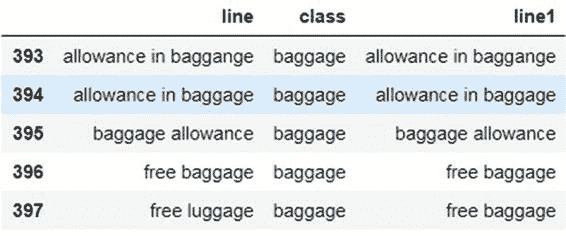
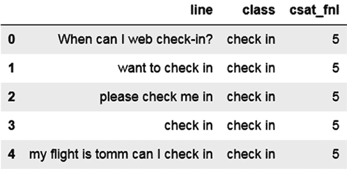
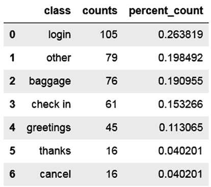
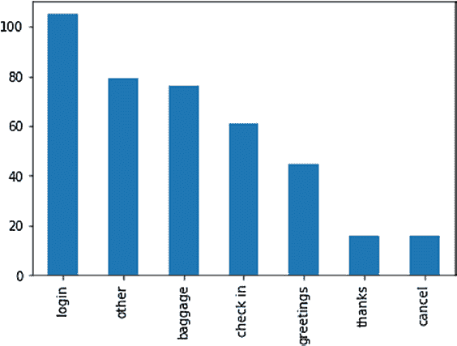
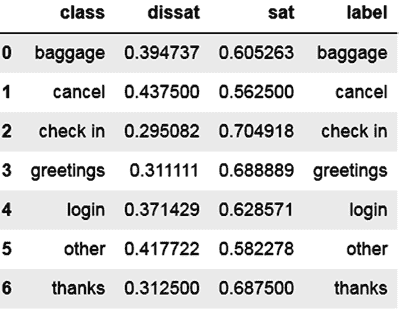
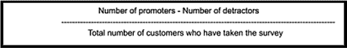
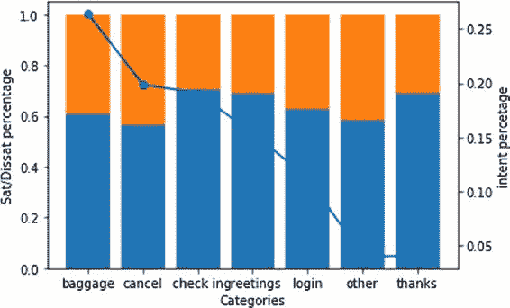

# 第 2 章 客户服务中的自然语言处理

假设有一个包含 1000 个文档的语料库。假设词“this”和“language”在语料库中的出现频率分别为 500 和 50。也就是说，词“this”出现在 500 个文档中，词“language”出现在 50 个文档中。“this”的`IDF`为`log(1000/500)`，即 0.3010299957；“language”的`IDF`为`log(1000/50)`，即 1.301029996。

考虑表 2-5 中的两个文档，并计算其中词“this”和“language”的 TF-IDF 值。

### 表 2-5 计算 TF-IDF

| 句子 | TF-this | TF-language | IDF-this | IDF-language | TF-IDF this | TF-IDF language |
|----------|---------|-------------|----------|--------------|-------------|-----------------|
| this is a great piece written. this will be remembered | 0.2 | | 0.301 | 1.301 | 0.060 | 0.000 |
| language models are very popular | | 0.2 | 0.301 | 1.301 | 0.000 | 0.260 |

现在回到你的用例，你将计算每个特征的 TF-IDF 值。


每个文档并用其填充单元格值。了解了词项-文档矩阵后，清单 2-17 展示了一个使用 Python 中 `scikit-learn` 库的 `vectorizer` 方法生成相同矩阵的示例。

***清单 2-17.*** 向量化方法

```
from sklearn.feature_extraction.text import TfidfVectorizer

tfidf_vectorizer = TfidfVectorizer(min_df=0.0,analyzer=u'word',ngram_range=(1, 1),stop_words=None)

tfidf_matrix = tfidf_vectorizer.fit_transform(df["line"])

tf1= tfidf_matrix.todense()

tfidf_vectorizer.vocabulary_
```

```
{u'03': 0,
u'12th': 1,
u'2017': 2,
u'20th': 3,
u'24th': 4,
u'26th': 5,
u'35': 6,
u'65321': 7,
u'abcddef': 8,
u'abel': 9,
u'able': 10,
u'access': 11,
u'account': 12,
u'afternoon': 13,
u'air': 14,..}
```

```
len(tfidf_vectorizer.vocabulary_),tf1.shape
(223, (398L, 223L))

tf1[0:10]
matrix([[0., 0., 0., ..., 0., 0., 0.],
[0., 0., 0., ..., 0., 0., 0.],
[0., 0., 0., ..., 0., 0., 0.],
...,
[0., 0., 0., ..., 0., 0., 0.],
[0., 0., 0., ..., 0., 0., 0.],
[0., 0., 0., ..., 0., 0., 0.]])
```

`TfidfVectorizer` 对象有几个重要参数，用于降低矩阵的稀疏性（列数）：

- `mindf` 是一个词应出现的最小文档数。
- `Stop_words` 是一个选项，用于指定是否提供停用词。

`analyzer` 可以是词或字符，具体取决于你想要的词元类型。对于当前问题，你希望使用词作为词元。

`ngram_range` 的选项提供了任意长度的 n-gram（二元组、三元组等）。例如，通过使用 `ngram_range(2,3)`，你可以获得从二元组到三元组的词元范围。

一旦你获得了一个向量化器对象，就可以将其拟合到语料库上，并得到一个稀疏矩阵。然后可以将稀疏矩阵转换为稠密矩阵。命令 `tfidf_vectorizer.vocabulary` 列出了向量化器生成的词元集合。如你所见，其中包含一堆数字和日期，它们可能不会为分析增加太多价值，但如果将它们归一化为实体（如日期、月份等），则可以带来很大价值。你将在下一节学习数据归一化。

## 数据归一化

数据归一化通常包括使用正则表达式对日期、时间和金额进行泛化处理。例如，你可以将所有日期格式归为一个词，如“Dates”。类似地，所有支付或收到的金额都可以替换为“Money”一词。你还可以对相似的词进行重新标记。例如，在你的案例中，“Baggage”和“Luggage”含义相同，因此可以将它们替换为同一个词。

归一化有助于实现两件事：使数据变得稠密，并为任何未见过的变体准备数据。例如，考虑句子“My flight is on Sunday and I want to check in.”如果你基于前一个句子构建模型，那么当出现一个新句子“My flight is on Friday and I want to check in”时，模型可能表现不佳。因此，你可以将任何此类词（此处为星期几）替换为一个通用名称（此处为“Dayofweek”），以泛化模型并使其更健壮。

## 替换特定模式

以下是几个示例，展示正则表达式如何帮助预处理句子。如果你不熟悉正则表达式，我建议你快速学习一个正则表达式教程，以熟悉其语法。参见清单 2-18。

***清单 2-18.*** 正则表达式

```
str1 = "I want to be there on 19th"
re.sub("[0-9]+th","datepp",str1)
'I want to be there on datepp'

str1 = "I want to be there on 23-05-18"
str2 = "I want to be there on 23-05"
```

```
import re
print (re.sub("[0-9]+[\/-]+[0-9]+[\/-]*[0-9]*","datepp",str1))
print (re.sub("[0-9]+[\/-]+[0-9]+[\/-]*[0-9]*","datepp",str2))
I want to be there on datepp
I want to be there on datepp
```

现在，让我们将正则表达式预处理应用于语料库。参见清单 2-19。


***清单 2-19.*** 应用正则表达式预处理

`df["line1"] = df["line"].str.replace('[0-9]+th','datepp')`

`df["line1"] = df["line1"].str.replace('[0-9]+[\/-]+[0-9]+[\/-]*[0-9]*','datepp')`

`df["line1"] = df["line1"].str.replace('[0-9]+','digitpp')`

`df["line1"] = df["line1"].str.replace('[^A-Za-z]+',' ')`

你已经用通用词汇替换了日期和数字。最后一条语句还清理了文本，将所有非英文字符替换为空格。清单 2-20 和图 2-9 展示了使用通用组名进行单词替换的示例。这里，你将含义相似的单词替换为通用名称。我创建了一个文件，将相似单词映射到同一组。现在，你将导入并查看该文件。

***清单 2-20.*** 使用通用词汇

`pp = pd.read_csv('preprocess.csv', low_memory=False, encoding='latin1')`

`pp.head()`

***图 2-9.*** 将相似单词映射到同一组



第 2 章 客户服务中的自然语言处理

下一步是将这些单词替换为对应的类别名称。请参见清单 2-21 和图 2-10。

***清单 2-21.***

```
def preprocess(l1):
    l2 = l1
    for word in pp["word"]:
        if (l1.find(word) >= 0):
            newcl = list(pp.loc[pp.word.str.contains(word), "class"])[0]
            l2 = l1.replace(word, newcl)
            break
    return l2

df["line1"] = df["line1"].apply(preprocess)
df.tail()
```

***图 2-10.***

现在，你已准备好对数据集运行机器学习算法。为了了解数据集在训练集和测试集上的表现，你需要将数据集划分为训练集和测试集。由于处理的是文本类别，你必须进行多类别分类。这意味着你需要将数据集拆分为多个类别，以便每个类别在训练集和测试集中都有足够的样本。请参见清单 2-22。

第 2 章 客户服务中的自然语言处理

***清单 2-22.*** 将数据集拆分为多个类别

```
from sklearn.model_selection import StratifiedShuffleSplit

sss = StratifiedShuffleSplit(test_size=0.1, random_state=42, n_splits=1)
for train_index, test_index in sss.split(df, tgt):
    x_train, x_test = df[df.index.isin(train_index)], df[df.index.isin(test_index)]
    y_train, y_test = df.loc[df.index.isin(train_index), "class"], df.loc[df.index.isin(test_index), "class"]
```

你打印出形状并检查一次。请参见清单 2-23。

***清单 2-23.*** 打印形状

`x_train.shape, y_train.shape, x_test.shape, x_test.shape`

`((358, 3), (358,), (40, 3), (40, 3))`

你可以看到训练集和测试集分别被拆分为 358 行和 40 行。

现在，你在已划分的训练集和测试集上应用 TF-IDF 向量化器。请记住，此步骤必须在训练集和测试集划分之后进行。如果在划分之前执行此步骤，你很可能会高估准确率。请参见清单 2-24。

***清单 2-24.*** 应用 TF-IDF 向量化器

```
tfidf_vectorizer = TfidfVectorizer(min_df=0.0001, analyzer=u'word', ngram_range=(1, 3), stop_words='english')
tfidf_matrix_tr = tfidf_vectorizer.fit_transform(x_train["line1"])
tfidf_matrix_te = tfidf_vectorizer.transform(x_test["line1"])
x_train2 = tfidf_matrix_tr.todense()
x_test2 = tfidf_matrix_te.todense()
x_train2.shape, y_train.shape, x_test2.shape, y_test.shape
```

`((358, 269), (358,), (40, 269), (40,))`

从上述矩阵可以看出，训练集和测试集具有相同数量的列。你从句子中总共生成了 269 个特征。现在，你已准备好应用机器学习算法，以单词特征作为自变量，类别作为因变量。在应用机器学习算法之前，你将执行特征选择步骤，将特征数量减少到原始特征的 40%。请参见清单 2-25。

第 2 章 客户服务中的自然语言处理

***清单 2-25.*** 特征选择步骤

```
from sklearn.feature_selection import SelectPercentile, f_classif
```


`selector = SelectPercentile(f_classif, percentile=40)`

`selector.fit(x_train2, y_train)`

`x_train3 = selector.fit_transform(x_train2, y_train)`

`x_test3 = selector.transform(x_test2)`

`x_train3.shape, x_test3.shape`

`((358, 107), (40, 107))`

现在你可以在训练数据集上运行机器学习算法，并在 `x_test` 上进行测试。参见清单 2-26 和清单 2-27。

**清单 2-26.**

```
clf_log = LogisticRegression()
clf_log.fit(x_train3, y_train)
```

**清单 2-27.**

```
pred = clf_log.predict(x_test3)
print(accuracy_score(y_test, pred))
```

`0.875`

与之前构建的规则相比，这个快速模型的准确率更高。该结果是在未见过的测试数据集上得出的，而之前的规则是在同一数据集上测试的，因此这个结果更加稳健。现在你将测试其他一些重要的指标。在多分类问题中，类别不平衡是常见现象，即类别的分布可能偏向于少数几个主要类别。因此，除了整体准确率之外，你还需要测试不同类别的单独准确率。这可以通过混淆矩阵、精确率、召回率和 F1 值来实现。

你可以从题为“Accuracy, Precision, Recall & F1 Score: Interpretation of Performance Measures”的文章（[`blog.exsilio.com/all/accuracy-precision-recall-f1-score-interpretation-of-performance-measures/`](https://blog.exsilio.com/all/accuracy-precision-recall-f1-score-interpretation-of-performance-measures/)）以及 Scikit-Learn 关于混淆矩阵（https://scikit-learn.org/stable/modules/generated/sklearn.metrics.confusion_matrix.html）和 F1 值（https://scikit-learn.org/stable/modules/generated/sklearn.metrics.f1_score.html#sklearn.metrics.f1_score）的页面中了解更多关于这些评分的信息。现在请看清单 2-28、清单 2-29 和图 2-11。

**第 2 章 客户服务中的 NLP**

**清单 2-28.**

```
from sklearn.metrics import f1_score
f1_score(y_test, pred, average='macro')
```

`0.8060606060606059`

**清单 2-29.**

```
from sklearn.metrics import confusion_matrix
confusion_matrix(y_test, pred, labels=None, sample_weight=None)
```

`array([[ 7, 0, 0, 0, 0, 1, 0],`

`[ 0, 2, 0, 0, 0, 0, 0],`

`[ 0, 0, 5, 0, 0, 1, 0],`

`[ 0, 0, 0, 4, 0, 0, 0],`

`[ 0, 0, 0, 0, 10, 0, 0],`

**图 2-11.** 混淆矩阵

你可以看到混淆矩阵具有强对角线特征，这表明模型良好，分类错误较少。

## 识别问题行

在上面的例子中，提供的数据是单行句子。然而，在对话中，存在整个对话语料库。将整个对话语料库标记为某个意图是很困难的。信噪比相当低，因此通常你会先尝试识别对话中可能包含问题行的部分，然后仅对这些句子进行意图挖掘。这可以显著提高信噪比。你还可以构建另一个监督学习模型来定位对话中的哪些行包含客户的问题。客户问题通常出现在“聊天”的前几行，或者会跟在诸如“请问有什么可以帮助您”这样的问题之后。参见表 2-6。

**第 2 章 客户服务中的 NLP**

**表 2-6.** 问题行

**系统**

**感谢您选择 Best Telco。客服代表将很快与您联系。**

**系统**

**您现在正在与 Max 聊天。**

**客户 Himax**

**客服**


**感谢您联系 Best Telco。我是 Max。**

**客服**

**您好，我看到我正在与 Sara 女士聊天，您提供了 `XXXXXXX` 作为您账户关联的号码，对吗？**

**客户 是的，没错。我刚收到一封邮件，说我的服务费要涨到 `$70/month`，但在你们网站上，它只要 `$30`。这是怎么回事？**

正如你在上面的例子中所见，客户陈述问题的行是客户的第二行，紧跟在用户的问候语之后。在邮件中，它可能是客户邮件线程的起始行。因此，定位并寻找问题行能带来更好的结果。

在深入探讨了通过监督和无监督机制进行的意图挖掘和主题建模之后，你现在将看到一些经典的客服分析，其中这些意图构成了核心基础。这就像先做好披萨的饼底，然后再撒上不同的配料。一旦你掌握了客服对话的意图，就可以进行以下分析。

## 热门客户查询

查询的频率分布可以快速洞察热门话题以及客户通常联系的原因。在下面的例子中，你将使用航空公司的数据集。你将创建一个包含标签频率分布的数据框。请注意，航空公司数据集中有一个名为 `CSAT` 的额外列。这是用户提供的 CSAT 评分。在绘图时，你将使用 `matplotlib` 库。参见清单 2-30 和图 2-12。



**清单 2-30.**

```
import pandas as pd
import numpy as np
import matplotlib.pyplot as plt

df = pd.read_csv('airline_dataset_csat.csv', low_memory=False, encoding='latin1')
df.head()
```

**图 2-12.**

现在你将获取频率分布，并用绝对值绘制热门查询。参见清单 2-31 和图 2-13。

**清单 2-31.**

```
freq1 = pd.DataFrame(df["class"].value_counts()).reset_index()
freq1.columns = ["class", "counts"]
freq1["percent_count"] = freq1["counts"] / freq1["counts"].sum()
freq1
```



**图 2-13.**

现在你使用 `matplotlib` 中的 `pyplot` 来绘制这些值。`pyplot.bar()` 接受 X 和 Y 值来构建条形图。参见清单 2-32 和图 2-14。

**清单 2-32.** 绘制数值

```
x_axis_lab = list(freq1["class"])
y_axis_lab = list(freq1["counts"])
y_per_axis_lab = list(freq1["percent_count"])

import matplotlib.pyplot as plt

plt.bar(x_axis_lab, y_axis_lab)
plt.ylabel('Counts')
plt.xlabel('Categories')
plt.show()
```



**图 2-14.** 绘制数值

## 热门 CSAT 驱动因素

客户满意度是用户在客服互动结束时回答的一项调查，通常采用 1 到 5 分的评分标准。通过挖掘出的主题来绘制 CSAT 响应，可以了解客户对哪些意图满意或不满意。在航空公司数据集的例子中，如果客户给出 4 分或 5 分，则将其归类为满意。1 到 3 分则意味着客户被认为不满意。你根据这个逻辑对 `csat_fnl` 分数进行分类。首先，你对意图和满意度类别（满意、不满意）进行交叉制表。参见清单 2-33 和图 2-15。

**清单 2-33.**

```
df["sat"] = 1
df.loc[df.csat_fnl <= 3, "sat"] = 0

ct = pd.crosstab(df["class"], df["sat"], normalize='index')
ct = ct.reset_index()
ct_cols = ct.columns
ct_cols1 = [ct_cols[0], "dissat", "sat"]
ct.columns = ct_cols1
ct["label"] = ct["class"]
ct
```



**图 2-15.**

现在你绘制一个包含满意和不满意情况的堆叠条形图。你将意图百分比分布作为次坐标轴。在 `matplotlib` 包中，你创建子图以显示两个 y 轴。首先，你使用 `bottom` 参数为满意/不满意创建堆叠条形图。`dissat` 变量堆叠在 `sat` 变量之上。参见清单 2-34。

**清单 2-34.**

```
ct_sat = ct["sat"]
ct_dissat = ct["dissat"]
ind = ct["label"]

fig, ax = plt.subplots()
p1 = ax.bar(ind, ct_sat)
p2 = ax.bar(ind, ct_dissat, bottom=ct_sat)
ax.set_xlabel('Categories')
ax.set_ylabel('Sat/Dissat percentage')
ax2 = ax.twinx()
```


## 使用次坐标轴绘制不同 Y 轴的图表

`ax2.plot(ind, y_per_axis_lab, color="blue", marker="o")`

`ax2.set_ylabel('意图百分比')`

`plt.show()`

`ax.twinx()` 函数帮助你创建次 Y 轴。`ax2.plot` 函数中的变量 `y_per_axis_lab` 包含了意图的百分比分布，如图所示。最终图表如图 2-16 所示。





**图 2-16.**

类似的图表可以针对 CSAT、聊天整体处理时间、解决率等指标绘制，然后可以从中得出可操作的分析结论。

## 主要 NPS 驱动因素

在继续本节之前，先简要说明 NPS。主要 NPS 驱动因素即净推荐值。在交互结束时，客户会被问到他们向朋友/亲戚推荐某个产品/服务的可能性，评分范围为 1 到 10。评分为 8-10 的客户被视为推荐者，1-4 为贬损者，5-7 为中立者。NPS 的计算公式如下：

上一节中的图表展示了用户问题或意图与 CSAT 的相关性。同样的分析也可以针对 NPS 进行。在某些情况下，你可能希望更深入地了解导致 CSAT 或 NPS 差异的因素。例如，NPS 可能是意图、解决方案、客服礼貌程度、产品属性、用户变量等的函数。表 2-7 展示了一个 NPS 样本数据集。

**表 2-7.** NPS 样本数据

| 用户 ID | 意图 | AHT | 出发地 | 目的地 | 预算 | 家庭人数 | 客户类型 | 过去联系客服次数 | 是否解决 | 是否转接电话 | NPS 分数 |
|---------|--------|-----|--------|-------------|--------|-------------|------------------|----------------------------------------|----------|------------------|-----------|
|         | 预订   |     | ATL    | FLL         | Na     | Na          | 金卡             |                                        | 是       | 否               | s         |
|         | 值机   |     | ATL    | LG          | Na     | Na          | 新客户           |                                        | 是       | 否               | s         |
|         | 登录   |     | Na     | LAX         | Na     | Na          | 新客户           |                                        | 是       | 否               | s         |
|         | 行李   |     | DEN    | Na          | Na     | Na          | 银卡             |                                        | 是       | 否               | s         |
|         | 登录   |     | Na     | Na          | Na     | Na          | 银卡             |                                        | 否       | 是               | s         |

这里的思路是理解 NPS 的主要驱动因素。通过回归模型来识别 NPS 的主要驱动因素，从而得出按优先级排序的行动项。数学上可以表示为：

`NPS = f(用户属性, 交易属性, 交互属性, 客服属性)`

下面我将详细讨论每个属性：

- **用户属性**：这些是用户特征，如用户会员等级、年龄、平均消费、生命周期价值等。这些属性通常以结构化数据的形式存在于某些数据库中。如果不可用，可以从当前交互或用户历史交互中提取。建议记录这些变量，因为它们有助于更好地理解问题。例如，如果发现新客户的 NPS 较低，则说明存在重大问题，可能会影响组织的增长。要从交互数据中提取某些属性，可以采用基于规则的方法。

- **交易属性**：这些是定义意图背后具体交易的特征。例如，如果是预订查询，则包括出发地、目的地、预算和人数。如果是取消，则可能包括路线、支付方式或取消费用。这些属性会严重影响解决率，从而影响 NPS。

- **交互属性**：这些是当前交互的特征，例如客户消息数、客服消息数、聊天处理时间（聊天结束时间减去开始时间）、客户平均响应时间、客服平均响应时间（客服总响应时间除以响应次数）、聊天的整体情感、提供的解决方案数量、问题是否解决以及升级（如有，例如升级到主管或其他部门）。


### 客服人员属性

**客服人员属性：** 这些是处理交互的客服人员的特征，例如他们在对话中是否礼貌得体，以及是否熟悉产品。提取这些属性有几种方法：由质检专员从不同维度对这些交互进行评分，或者通过文本提取。由于由质检专员评分的方式难以规模化，因此文本挖掘方法是解决此问题的最佳途径。

让我们看看来自 Customer Thermometer（[www.customerthermometer.com/customer-service/excellent-customer-service-phrases/](http://www.customerthermometer.com/customer-service/excellent-customer-service-phrases/)）的一些示例：

1.  很抱歉听到您有这种感受，[X 先生/X 女士]。
2.  您的反馈对我们极其宝贵，我们非常感谢您抽出时间致电，[X 先生/X 女士]。
3.  我想给您回电告知最新进展。什么时间联系您最方便？
4.  我完全理解您的感受，[X 先生/X 女士]。
5.  我充分理解这给您带来的不便，[X 先生/X 女士]。
6.  感谢您的理解，[X 先生/X 女士]。我们正竭尽全力快速解决您的问题。

以上句子表达了礼貌，而像“我们在这里什么也做不了”、“抱歉，这没办法”和“我们就是这么工作的”这类句子则不然。

通常，定义服务质量的变量被用来解释客服人员的行为。（更多信息，请参阅题为“Applying The Technology Acceptance And Service Quality Models To Live Customer Support Chat For E-Commerce Websites”的文章，网址为 [www.researchgate.net/publication/289170615_Applying_The_Technology_Acceptance_And_Service_Quality_Models_To_Live_Customer_Support_Chat_For_E-Commerce_Websites](http://www.researchgate.net/publication/289170615_Applying_The_Technology_Acceptance_And_Service_Quality_Models_To_Live_Customer_Support_Chat_For_E-Commerce_Websites)。另请参见表 2-8。）

### 第 2 章：客户服务中的自然语言处理

**表 2-8.** 维度与客户支持

| 维度 | 如何应用于客户支持 |
| --- | --- |
| 可靠性 | 客服人员回复的可靠性 |
| 响应性 | 问题得到解答的速度 |
| 保证性 | 他们能否保证问题得到解决 |
| 同理心 | 他们能否对客户的担忧表现出同理心 |
| 有形性 | 所使用的界面组件、聊天窗口的外观和感觉 |

题为“A human capital predictive model for agent performance in contact centres”（[www.researchgate.net/publication/262612058_A_human_capital_predictive_model_for_agent_performance_in_contact_centres](http://www.researchgate.net/publication/262612058_A_human_capital_predictive_model_for_agent_performance_in_contact_centres)）的论文也描述了衡量客服人员绩效的不同维度。在上述列表之外，还可以加上客服人员的知识/能力、他们解决问题的积极性等。

你可以采用基于规则的方法来解决这些问题，或者使用在线词典来挖掘某些行为属性。例如，请参阅“Empathy Statements for Customer Service Representatives”（[www.customerservicemanager.com/empathy-statements-for-customer-service-representatives/](http://www.customerservicemanager.com/empathy-statements-for-customer-service-representatives/)）。


