# 第 3 章：NLP 在在线评论中的应用

如今，评论是在线购买周期的重要组成部分。尽管“发声的少数人”数量不多，但受评论影响的用户数量却非常庞大。一项研究发现，63%的用户更喜欢有评论的在线网站。访问评论页面的顾客从网站购买的可能性高出惊人的 105%（[`cxl.com/blog/user-generated-reviews/#:~:text=Reevoo%20found%20that%2050%20or,site%20that%20has%20user%20reviews`](https://cxl.com/blog/user-generated-reviews/#:~:text=Reevoo%20found%20that%2050%20or,site%20that%20has%20user%20reviews)）。挖掘这些评论可以为在线服务提供商以及上架产品的卖家提供见解。除了了解顾客是否满意之外，我们还可以知道用户对产品中的每一项特征。有时评论者会大量描述他们的生活方式以及他们发现的产品使用场景。这可以提供关于产品市场契合度或产品价值主张等方面的洞察。这些信息日后可用于产品的品牌传播。我们还能发现某个品类中的机会或空白，从而通过“客户之声”来创造新产品，甚至开启新业务。

## 情感分析

`情感`是从评论中提取的第一个也是最常见的属性。`情感`被定义为用户在给定语料库中表达的感受或情绪。这通常表现为正面或负面情感。但情感还有其他维度，比如愤怒、愉悦、沮丧等。另一个维度可以衡量文本语料库的客观性或主观性。图 3-1 展示了一些示例。

© Mathangi Sri 2021
M. Sri, *实用 Python 自然语言处理*, [`doi.org/10.1007/978-1-4842-6246-7_3`](https://doi.org/10.1007/978-1-4842-6246-7_3#DOI)

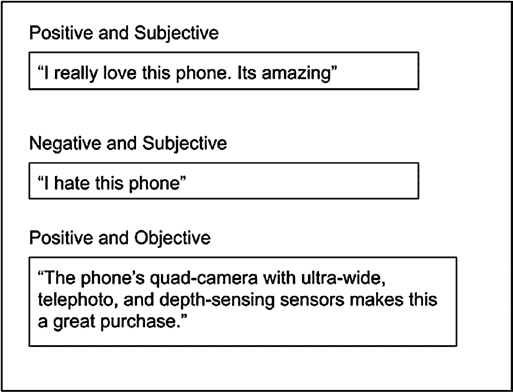

## 情绪挖掘

`情感分析`是分析更深层情感感受的简化版本。情绪在心理学领域已有深入研究。在某些产品评论挖掘用例中，我们可以超越情感分析，进入更深层的情绪挖掘。一个著名的情绪理论模型是普拉奇克的情绪之轮（图 3-2）。情绪之轮的核心包含八种基本情绪：喜悦、悲伤、愤怒、恐惧、信任、厌恶、惊讶和期待。当向外轮移动时，强度减弱；向核心移动时，强度增强。轮中的白色区域是两种情绪的组合。即使你不打算挖掘整个情绪之轮，挖掘这八种基本情绪也能揭示大量关于用户偏好的信息。如需进一步阅读，请访问“面向计算文学研究的情感与情绪分析综述”，网址为 [`arxiv.org/abs/1808.03137`](https://arxiv.org/abs/1808.03137)。

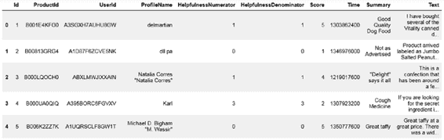

现在让我们进入代码部分，了解如何在 Python 中进行情感挖掘的细节。你将首先构建一个基础版本，然后我将讨论如何在此基础上处理复杂用例。本章将使用亚马逊评论数据集。所有包及其版本号列于本章末尾的表 3-7 中。

## 方法一：基于词典的方法

第一种方法很简单。你将使用标准的基于词典的方法来分类正面、负面和中性情感。词典是代表某个主题的单词列表。你将使用互联网上可用的一些词典来分类正面、负面和中性评论。

**数据集**：本次分析将使用亚马逊美食评论数据集。你可以从 Kaggle 下载；这是亚马逊美食评论调查，网址为 [www.irjet.net/archives/V6/i4/IRJET-V6I4134.pdf](http://www.irjet.net/archives/V6/i4/IRJET-V6I4134.pdf)。参见代码清单 3-1 和图 3-3。

**代码清单 3-1.** 数据集

```python
import pandas as pd

t1 = pd.read_csv("Reviews.csv")
t1.shape
(568454, 12)
t1.head()
```


我们这里的重点是`Text`和`Summary`列。你也可以看到`Score`列。你将使用该分数来理解和衡量基于词典方法的准确性。你将使用论文《Mining and summarizing customer reviews》（[`dl.acm.org/doi/10.1145/1014052.1014073`](https://dl.acm.org/doi/10.1145/1014052.1014073)）中提到的词典。参见清单 3-2。

**清单 3-2.**

```python
pos1=pd.read_csv("positive-words.txt",sep="\t",error_bad_lines=True, encoding='latin1',header=None)
neg1=pd.read_csv("negative-words.txt",sep="\t",error_bad_lines=True, encoding='latin1',header=None)
pos1.columns = ["words"]
neg1.columns = ["words"]
pos_set = set(list(pos1["words"]))
neg_set = set(list(neg1["words"]))
```

在`t1`数据集中有两列文本：`Text`和`Summary`。你将合并它们并处理成一个单独的列。正是这个列将进行词典挖掘。参见清单 3-3。

**清单 3-3.** 合并列

```python
t1["full_txt"] = t1["Summary"] + " " + t1["Text"]
t1["full_txt"] = t1["full_txt"].str.lower()
t1["sent_len"] = t1["full_txt"].str.count(" ") + 1
```

清单 3-4 帮助你排除包含缺失单词的句子。

**清单 3-4.** 优化数据集

```python
t2 = t1[t1.sent_len>=1]
len(t1),len(t2)
(568454, 568427)
```

为了衡量你的方法的准确性，你将把客户在`Score`列中提供的最终评分分桶。参见清单 3-5。

**清单 3-5.**

```python
##for meausring accuracy
t2["score_bkt"]="neu"
t2.loc[t2.Score>=4,"score_bkt"] = "pos"
t2.loc[t2.Score<=2,"score_bkt"] = "neg"
```

最简单的方法是遍历句子语料库中的所有单词，并与词典列表进行匹配。由于这些是较长的句子，你需要通过句子中的单词数量来标准化正面和负面命中的数量。之后，对正面、负面和中性分数进行简单比较，并根据哪个分数更高来标记句子。为了进一步改进并提出额外策略，你还将记录句子中出现的单词列表，作为`pos_set_list`和`neg_set_list`。参见清单 3-6。

**清单 3-6.**

```python
final_tag_list = []
pos_percent_list = []
neg_percent_list = []
pos_set_list = []
neg_set_list = []
for i,row in t3.iterrows():
    full_txt_set = set(row["full_txt"].split())
    sent_len = len(full_txt_set)
    pos_set1 = (full_txt_set) & (pos_set)
    neg_set1 = (full_txt_set) & (neg_set)
    com_pos = len(pos_set1)
    com_neg = len(neg_set1)
    if(com_pos>0):
        pos_percent = com_pos/sent_len
    else:
        pos_percent = 0
    if(com_neg>0):
        neg_percent = com_neg/sent_len
    else:
        neg_percent =0
    if(pos_percent>0)|(neg_percent>0):
        if(pos_percent>neg_percent):
            final_tag = "pos"
        else:
            final_tag = "neg"
    else:
        final_tag="neu"
    final_tag_list.append(final_tag)
    pos_percent_list.append(pos_percent)
    neg_percent_list.append(neg_percent)
    pos_set_list.append(pos_set1)
    neg_set_list.append(neg_set1)
```

将创建的列表赋值给`t3`数据框的操作在清单 3-7 中完成。

**清单 3-7.** 赋值列表

```python
t3["final_tags"] = final_tag_list
t3["pos_percent"] = pos_percent_list
t3["neg_percent"] = neg_percent_list
t3["pos_set"] = pos_set_list
t3["neg_set"] = neg_set_list
```

现在你已经将句子分类为正面、负面和中性三个类别。你需要检查它们是否与之前讨论的`score_bkt`一致。你将使用准确率分数、F1 分数和混淆矩阵来衡量。更多关于这些指标的详细信息，可以从文章《Accuracy, Precision, Recall & F1 Score: Interpretation of Performance Measures》（[`blog.exsilio.com/all/accuracy-precision-recall-f1-score-interpretation-of-performance-measures/`](https://blog.exsilio.com/all/accuracy-precision-recall-f1-score-interpretation-of-performance-measures/)）以及 Scikit-Learn 关于混淆矩阵（[`scikit-learn.org/stable/modules/generated/sklearn.metrics.confusion_matrix.html`](https://scikit-learn.org/stable/modules/generated/sklearn.metrics.confusion_matrix.html)）和 F1 分数（[`scikit-learn.org/stable/modules/generated/sklearn.metrics.f1_score.html#sklearn.metrics.f1_score`](https://scikit-learn.org/stable/modules/generated/sklearn.metrics.f1_score.html#sklearn.metrics.f1_score)）的页面中学习。现在请参见代码清单 3-8 和图 3-4。

**代码清单 3-8.**

```python
from sklearn.metrics import accuracy_score

print (accuracy_score(t3["score_bkt"],t3["final_tags"]))

#0.8003448093872596

from sklearn.metrics import f1_score

f1_score(t3["score_bkt"],t3["final_tags"], average='macro')

#0.502500231042986
```

```python
rows_name = t3["score_bkt"].unique()

from sklearn.metrics import confusion_matrix

cmat = pd.DataFrame(confusion_matrix(t3["score_bkt"],t3["final_tags"], labels=rows_name, sample_weight=None))

cmat.columns = rows_name

cmat["act"] = rows_name

cmat
```

**图 3-4.**

如您所见，您有足够的空间来改进算法。为了进一步理解这一点，让我们查看一些错误，探究其原因，并采取一些步骤来进一步改进模型。从基于词典的方法，您现在正在过渡到基于词典和规则的方法。在分析错误的过程中，您将提出一些规则来解决情感问题。

## 方法二：基于规则的方法

下一个方法是通过添加规则来改进基于词典的方法的性能。规则基于语言模式和数据结构。为了识别规则，您首先通过比较预测情感和实际标签来调查错误。请参见代码清单 3-9。

**代码清单 3-9.**

```python
pd.options.display.max_colwidth=1000

t3.loc[t3.score_bkt!=t3.final_tags,["Summary","full_txt","final_tags","score_bkt","pos_percent","neg_percent","pos_set","neg_set"]]
```

以下是从代码清单 3-9 的输出中得出的观察结果。

### 观察结果 1

`Summary` 列中的情感非常清晰、简洁且明确。您可以利用这一点，并赋予 `Summary` 的命中比 `full_txt` 更高的权重。请参见表 3-1。

**表 3-1.**

| **摘要** | **完整文本** | **正面词集** | **负面词集** |
| --- | --- | --- | --- |
| 我挑剔的猫喜欢它们 | 我挑剔的猫喜欢它们，我同意另外两篇评论。我的猫非常非常非常…… | {喜欢, 兴奋, 最爱, 爱} | {无聊, 拒绝, 挑剔, 善变} |
| ... | ... | ... | ... |
| 我的狗很喜欢它…… | 我的狗很喜欢它……我的狗已经享用很多年了…… | {享受, 喜爱} | {问题} |
| 我女儿喜欢！ | 我女儿喜欢！我女儿喜欢这些…… | {爱} | {廉价} |
| 如果我有狗，对狗有好处 | 如果我有狗，对狗有好处。我喜欢杰克链接牛肉干，尤其是胡椒味的。这里…… | {诚实, 爱, 好, 棒, 喜欢} | {硬, 错, 干} |

### 观察结果 2

像“非常”和“极度”这样的强化词会加剧情感。示例如表 3-2 所示。

**表 3-2.** 强化词

| **摘要** | **完整文本** | **正面词集** | **负面词集** |
| --- | --- | --- | --- |
| 对胃酸反流非常有帮助 | 对胃酸反流非常有帮助。这个配方与将米粉加入配方奶或母乳不同…… | {有帮助, 推荐, 容易} | {拒绝, 更稠, 拒绝} |

您将识别出这些强化词，并将它们与正面或负面词集结合，以调整情感分数。

### 观察结果 3

否定词是某个词语的否定形式。它可以是肯定或否定的。"不喜欢"就是一个否定实例。由于你的词典只包含单个词语，如果不处理否定词，你可能会给句子打上错误的情感极性标签。与增强词方法类似，你需要识别一组否定词，并与肯定和否定集合进行交叉引用，以检查句子中是否存在否定情况。如果存在否定情况，你需要从该极性中减去分数。假设你有五个肯定命中词和两个否定命中词。你将减去 5 和 3 的分数。

你也可以给否定词赋予比肯定命中词更高的权重。参见表 3-3。

**表 3-3.**

| **摘要** | **完整文本** | **肯定集合** | **否定集合** |
| --- | --- | --- | --- |
| 不仅仅是 | 不仅仅是胡椒味，我真的很兴奋能尝到 | {兴奋, 好} | {差} |
| | 胡椒味的混合胡椒粒，但由于其中混入了多香果，这真的破坏了我所有菜肴的味道，你能尝到胡椒味，但也能尝到一种土腥味的辛辣刺激。我甚至尝试挑出胡椒粒并去除多香果，但为时已晚，味道已经混进去了 <耸肩> 太可惜了 | | |
| 并非无味 | 并非广告所说的无味，当我开始购买这些时.... | {欣赏, 免费, 改善, 气味, 疯狂, 满意} | {不幸, 霸凌, 气味} |

### 观察结果 4

（此处内容缺失，原文未提供）

# 总体得分

你需要计算四个总体得分：`完整文本`的肯定命中数、`完整文本`的否定命中数、`摘要`的肯定命中数、`摘要`的否定命中数。然后按照`图 3-5`所述，将它们组合起来得到最终分数。

```
肯定得分 = 肯定命中数 + 增强肯定命中数 + 感叹号肯定命中数 - 2 * 否定（肯定）命中数
否定得分 = 否定命中数 + 增强否定命中数 + 感叹号否定命中数 - 2 * 否定（否定）命中数
```

**图 3-5. 得分公式**

你对`完整文本`和`摘要`都应用`图 3-5`中的公式，然后使用`图 3-6`中的公式得到肯定和否定得分。

```
肯定得分 = 完整文本的肯定得分 + 1.5 * 摘要的肯定得分
否定得分 = 完整文本的否定得分 + 1.5 * 摘要的否定得分
```

**图 3-6. 肯定和否定得分公式**

现在你比较所有四个得分，并根据`图 3-7`中的流程图得到最终标签。

```
开始
获取肯定和否定得分
肯定 > 0 或 否定 > 0
是
否定 > 肯定
是 -> 标签为否定
否
肯定 > 否定
是 -> 标签为肯定
否
否
包含 "!"
是 -> 标签为肯定
否
标签为中性
```

**图 3-7. 最终标签流程图**

根据流程图，你首先检查正面或负面分数是否大于零。如果是，则进一步检查 `positive` 是否更大，还是 `negative` 更大。据此，你将最终标签标记为 `positive` 或 `negative`。如果不是这种情况，则检查强度指示符，在你的场景中就是感叹号。感叹号的存在是一个强度指标，你知道它应该是 `positive` 或 `negative`。

我已将这些情况标记为 `positive`（根据准确率和手头的数据集，它们也可能被判定为 `negative`）。其余情况则标记为 `neutral`。在没有 `positive` 或 `negative` 命中的情况下，你再次检查感叹号，并将其标记为 `positive` 或 `neutral`。

# 实现观察结果

## 预处理

现在你将开始在 Python 中实现这些观察结果。第一步，你需要进行一些预处理。这对于处理双词否定形式特别有用。其思路是将像 `"did not"` 和 `"would not"` 这样的双词组替换为单个单词，如 `"didn't"` 和 `"wouldn't"`。这样，即使你实际查找的是双词组合，你所采用的查找和替换方法也能继续有效。首先，定义需要替换的双词组单词，然后将它们替换为单个单词，如`代码清单 3-10`所示。

**代码清单 3-10. 替换双词组合**

```python
not_list = ["did not","could not","cannot","would not","have not"]

def repl_text(t3,col_to_repl):
    t3[col_to_repl] = t3[col_to_repl].str.replace("''","")
    t3[col_to_repl] = t3[col_to_repl].str.replace('[.,]+'," ")
    t3[col_to_repl] = t3[col_to_repl].str.replace("[\s]{2,}"," ")
    for i in not_list:
        repl = i.replace("not","").lstrip().rstrip() + "nt"
        repl = repl + " "
        t3[col_to_repl] = t3[col_to_repl].str.replace(i,repl)
    return t3
```

现在，你对 `full_txt` 和 `Summary` 这两个列都调用此函数。你将把所有的函数应用于这两个列，以获取之前看到的四个分数：

```python
t3 = repl_text(t3,"full_txt")
t3 = repl_text(t3,"Summary")
```

## 增强词与否定词（观察结果 2 和观察结果 3）

现在定义增强词和否定词。它们必须是单个单词。如果是两个单词，则必须在预处理函数 `repl_text` 中处理。其背后的思路是将增强词与匹配到该句子的正面词汇子集（`pos_set1`）组合起来，并查看组合结果。你通过一个计数器来统计正面和负面增强词的命中次数。参见`代码清单 3-11`。

**代码清单 3-11. 增强词检查函数**

```python
booster_words = set(["very","extreme","extremely","huge"])

def booster_chks(com_boost,pos_set1,neg_set1,full_txt_str):
    boost_num_pos = 0
    boost_num_neg = 0
    if(len(pos_set1)>0):
        for a in list(com_boost):
            for b in list(pos_set1):
                wrd_fnd = a + " " + b
                #print (wrd_fnd)
                if(full_txt_str.find(wrd_fnd)>=0):
                    #print (wrd_fnd,full_txt_str,"pos")
                    boost_num_pos = boost_num_pos +1
    if(len(neg_set1)>0):
        for a in list(com_boost):
            for b in list(neg_set1):
                wrd_fnd = a + " " + b
                if(full_txt_str.find(wrd_fnd)>=0):
                    #print (wrd_fnd,full_txt_str,"neg")
                    boost_num_neg = boost_num_neg +1
    return boost_num_pos,boost_num_neg
```

接下来，你对否定词重复此过程。参见`代码清单 3-12`。

**代码清单 3-12. 否定词检查函数**

```python
negation_words = set(["no","dont","didnt","cant","couldnt"])

def neg_chks(com_negation,pos_set1,neg_set1,full_txt_str):
    neg_num_pos = 0
    neg_num_neg = 0
    if(len(pos_set1)>0):
        for a in list(com_negation):
            for b in list(pos_set1):
                wrd_fnd = a + " " + b
                #print (wrd_fnd)
                if(full_txt_str.find(wrd_fnd)>=0):
                    #print (wrd_fnd,full_txt_str,"pos")
                    neg_num_pos = neg_num_pos +1
    if(len(neg_set1)>0):
        for a in list(com_negation):
            for b in list(neg_set1):
                wrd_fnd = a + " " + b
                if(full_txt_str.find(wrd_fnd)>=0):
                    #print (wrd_fnd,full_txt_str,"neg")
                    neg_num_neg = neg_num_neg +1
    return neg_num_pos,neg_num_neg
```

让我们做一个小测试来演示该功能。你将匹配的否定词与句子、匹配的肯定词集、匹配的否定词集（本例中为空集）以及句子本身传入。你会看到，你得到了一个肯定词被否定的命中结果（`“didn’t like”`）。参见`代码清单 3-13`。

**代码清单 3-13. 否定词检查函数测试示例**

```python
str_test ="it was given as a gift and the receiver didnt like it i wished
i had bought some other kind i was believing that ghirardelli would be the
best you could buy but not when it comes to peppermint bark this is not
their best effort."

neg_chks({"didnt"},{"like", "best"},{},str_test)

(1, 0)
```

### 感叹号（观察点 4）

接下来，我们讨论感叹号。感叹号会增强潜在情感（无论是正面还是负面）的强度。你需要检查句子中是否包含感叹号，并且该句子是否同时有正面或负面的命中结果。

你需要在句子级别进行检查，而不是在评论级别。与其它情况一样，你需要对 `Summary` 和 `full_txt` 都执行此操作。参见`代码清单 3-14`。

**代码清单 3-14. 感叹号检查函数**

```python
def excl(pos_set1,neg_set1,full_txt_str):
    excl_pos_num=0
    excl_neg_num=0
    tok_sent = sent_tokenize(full_txt_str)
    for i in tok_sent:
        if(i.find('!')>=0):
            com_set = set(i.split()) & pos_set1
            if(len(com_set)>0):
                excl_pos_num= excl_pos_num+1
            else:
                com_set1 =set(i.split()) & neg_set1
                if(len(com_set1)>0):
                    excl_neg_num= excl_neg_num+1
    return excl_pos_num,excl_neg_num
```

### 对 `full_txt` 和 `Summary` 的评估（观察点 1）

`代码清单 3-15`展示了首先获取匹配的正面和负面词汇集合的代码。这部分与你之前看到的类似。然后，它调用函数来获取 `full_txt` 和 `Summary` 列的强化词、否定词和感叹词的数量。接着，代码基于`图 3-5`和`图 3-6`中讨论的公式进行求和，并遵循`图 3-7`中的逻辑来确定评论的最终标签，从而得到 `final_tag`。

`代码清单 3-15`中有大量的列表初始化操作。你需要记录所有导致 `full_txt` 和 `Summary` 列总体得分的值。你需要这一步来后续分析结果并进一步优化结果。

**代码清单 3-15. 列表初始化**

```python
final_tag_list = []
pos_score_list = []
neg_score_list = []
pos_set_list = []
neg_set_list = []
neg_num_pos_list = []
neg_num_neg_list = []
boost_num_pos_list = []
boost_num_neg_list = []
excl_num_pos_list =[]
excl_num_neg_list =[]
pos_score_list_sum = []
neg_score_list_sum = []
pos_set_list_sum = []
neg_set_list_sum = []
neg_num_pos_list_sum = []
neg_num_neg_list_sum = []
boost_num_pos_list_sum = []
boost_num_neg_list_sum = []
excl_num_pos_list_sum =[]
excl_num_neg_list_sum =[]
```

在`代码清单 3-16`中，`t3` 数据框的每一行都根据到目前为止讨论的步骤进行评估。

**代码清单 3-16. 数据框评估循环**

```python
for i,row in t3.iterrows():
    full_txt_str = row["full_txt"]
    full_txt_set = set(full_txt_str.split())
    sum_txt_str = row["Summary"].lower()
    summary_txt_set = set(sum_txt_str.split())
    sent_len = len(full_txt_set)

    # 正面和负面集合
    pos_set1 = (full_txt_set) & (pos_set)
    neg_set1 = (full_txt_set) & (neg_set)
    com_pos_sum = (summary_txt_set) & (pos_set)
    com_neg_sum = (summary_txt_set) & (neg_set)

    # 强化词和否定词集合
    com_boost = (full_txt_set) & (booster_words)
    com_negation = (full_txt_set) & (negation_words)
    com_boost_sum = (summary_txt_set) & (booster_words)
    com_negation_sum = (summary_txt_set) & (negation_words)

    boost_num_pos=0
    boost_num_neg=0
    neg_num_pos=0
    neg_num_neg =0
    excl_pos_num=0
    excl_neg_num = 0
    boost_num_pos_sum=0
    boost_num_neg_sum=0
    neg_num_pos_sum=0
    neg_num_neg_sum =0
    excl_pos_num_sum=0
    excl_neg_num_sum = 0

    # 获取强化词、否定词和感叹词集合的计数器
    if(len(com_boost)>0):
        boost_num_pos, boost_num_neg = booster_chks(com_boost, pos_set1, neg_set1, full_txt_str)
        boost_num_pos_sum, boost_num_neg_sum = booster_chks(com_boost_sum, com_pos_sum, com_neg_sum, sum_txt_str)

    if(len(com_negation)>0):
        neg_num_pos, neg_num_neg = neg_chks(com_negation, pos_set1, neg_set1, full_txt_str)
        neg_num_pos_sum, neg_num_neg_sum = neg_chks(com_negation_sum, com_pos_sum, com_neg_sum, sum_txt_str)

    if((full_txt_str.find("!")>=0) and ((neg_num_pos+neg_num_neg)==0)):
        excl_pos_num, excl_neg_num = excl(pos_set1, neg_set1, full_txt_str)
        excl_pos_num_sum, excl_neg_num_sum = excl(com_pos_sum, com_neg_sum, sum_txt_str)
```

### 计算总体得分

## 最终判定

```python
if((score_pos>0)|(score_neg>0)):
    if((score_neg>score_pos)):
        final_tag = "neg"
    elif(score_pos>score_neg):
        final_tag = "pos"
    else:
        if(full_txt_str.find("!")>=0):
            final_tag = "pos"
        else:
            final_tag = "neu"
else:
    if(full_txt_str.find("!")>=0):
        final_tag="pos"
    else:
        final_tag="neu"
```

## 记录中间值以便排查问题

```python
final_tag_list.append(final_tag)
pos_score_list.append(score_pos)
neg_score_list.append(score_neg)
pos_set_list.append(pos_set1)
neg_set_list.append(neg_set1)
neg_num_pos_list.append(neg_num_pos)
neg_num_neg_list.append(neg_num_neg)
boost_num_pos_list.append(boost_num_pos)
boost_num_neg_list.append(boost_num_neg)
excl_num_pos_list.append(excl_pos_num)
excl_num_neg_list.append(excl_neg_num)
pos_set_list_sum.append(com_pos_sum)
neg_set_list_sum.append(com_neg_sum)
neg_num_pos_list_sum.append(neg_num_pos_sum)
neg_num_neg_list_sum.append(neg_num_neg_sum)
boost_num_pos_list_sum.append(boost_num_pos_sum)
boost_num_neg_list_sum.append(boost_num_neg_sum)
excl_num_pos_list_sum.append(excl_pos_num_sum)
excl_num_neg_list_sum.append(excl_neg_num_sum)
```

`清单 3-17` 将所有值设置到数据框中，以便理解准确率并识别任何改进机会。

### `清单 3-17`

```python
t3["final_tags"] = final_tag_list
t3["pos_score"] = pos_score_list
t3["neg_score"] = neg_score_list
t3["pos_set"] = pos_set_list
t3["neg_set"] = neg_set_list
t3["neg_num_pos_count"] = neg_num_pos_list
t3["neg_num_neg_count"] = neg_num_neg_list
t3["boost_num_pos_count"] = boost_num_pos_list
t3["boost_num_neg_count"] = boost_num_neg_list
t3["pos_set_sum"] = pos_set_list_sum
t3["neg_set_sum"] = neg_set_list_sum
t3["neg_num_pos_count_sum"] = neg_num_pos_list_sum
t3["neg_num_neg_count_sum"] = neg_num_neg_list_sum
t3["boost_num_pos_count_sum"] = boost_num_pos_list_sum
t3["boost_num_neg_count_sum"] = boost_num_neg_list_sum
t3["excl_num_pos_count"] = excl_num_pos_list
t3["excl_num_neg_count"] = excl_num_neg_list
t3["excl_num_pos_count_sum"] = excl_num_pos_list_sum
t3["excl_num_neg_count_sum"] = excl_num_neg_list_sum
```

在 `清单 3-18` 中，你计算准确率、混淆矩阵和 F1 分数。

### `清单 3-18`. 准确率、混淆矩阵和 F1 分数

```python
from sklearn.metrics import accuracy_score
print (accuracy_score(t3["score_bkt"],t3["final_tags"]))
# 0.8003448093872596

from sklearn.metrics import f1_score
f1_score(t3["score_bkt"],t3["final_tags"], average='macro')
# 0.502500231042986
```

你可以看到 `清单 3-18` 中的数值有所改善。接下来，让我们查看 `清单 3-19` 和图 3-8 中的混淆矩阵。

### `清单 3-19`. 混淆矩阵

```python
rows_name = t3["score_bkt"].unique()
from sklearn.metrics import confusion_matrix
```

```python
cmat = pd.DataFrame(confusion_matrix(t3["score_bkt"],t3["final_tags"], labels=rows_name, sample_weight=None))
cmat.columns = rows_name
cmat["act"] = rows_name
cmat
```

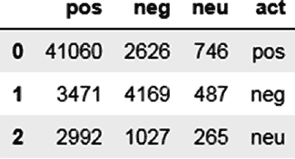

**图 3-8.** 混淆矩阵

如您所见，负面和正面分类的效果远好于中性分类。这拉低了您的整体 F1 分数（宏平均）。然而，在中性分类上，您的表现相当糟糕。您也可以通过从数据集中移除中性分类来重新检查分数。请参见 `代码清单 3-20`。

### `代码清单 3-20`. 从数据集中移除中性分类

```python
t4 = t3.loc[(t3.score_bkt!="neu") & (t3.final_tags!="neu")].reset_index()
print(accuracy_score(t4["score_bkt"],t4["final_tags"]))
print(f1_score(t4["score_bkt"],t4["final_tags"],average='macro'))
0.8812103027705257
0.75425508403348
```

## 优化代码

显然，您的策略在正面和负面分类上效果良好。因此，在下一轮迭代中，您应重点关注并优化中性情感的分类。以下是下一轮优化的一些策略（既针对中性分类，也适用于其他分类）。您可以继续推进这个问题，运用任何您能想到的策略来解决它，并将当前的分数作为基准。

- **大小写**：大写单词表示强烈的情感，类似于感叹号。有时大写单词本身就是情感词，或者它们可能紧邻情感词，例如 `"EXTREMELY happy"` 或 `"EXTREMELY angry with the product"`。您需要相应地识别大写单词并调整分数。

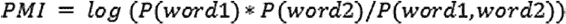

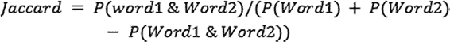

- **情感词典**：您可以尝试使用不同的情感词典。还有一些词典为不同的情感词提供了权重。论文《基于词典的极端观点搜索方法》（[PLOS ONE 论文](https://journals.plos.org/plosone/article?id=10.1371/journal.pone.0197816)）描述了一种从现有在线评分中生成词典的方法。其思路是利用给定评论中带有评分的词语作为词典来源，然后对所有评论中的这些评分进行归一化处理，从而得到一个带有权重标度的词典。该词典随后可用于任何分类目的。

- **使用语义倾向性确定极性**：另一种方法是利用网络或任何其他外部来源来确定当前词语的极性。例如，您可以查看单词 `"delight"` 与单词 `"good"` 共同出现的页面点击量。您还可以查看单词 `"delight"` 与单词 `"bad"` 共同出现的页面点击量。通过比较结果，您可以判断单词 `"delight"` 应具有正面还是负面极性。以下方法来自论文《赞还是踩？：语义倾向性在无监督评论分类中的应用》（[ACM 论文](https://dl.acm.org/doi/10.3115/1073083.1073153)）。已知的正面词（例如 `"good"`）与给定词典之间的相似度是基于点互信息以及杰卡德指数来衡量的。公式如图 3-9 和图 3-10 所示。

**图 3-9.**

**图 3-10.**

这里 `P(Word1)` 或 `P(Word2)` 指的是该词在网络搜索引擎中的点击量。`P(Word1 & Word2)` 指的是在同一查询中，单词 1 和单词 2 共同出现的点击量。`清单 3-21` 和 `3-22` 演示了针对几个词语的方法。您可以通过网络搜索结果，获取给定词语与


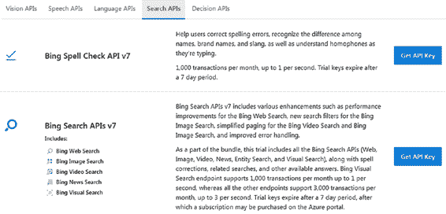

一个感兴趣的短语。这可以扩展到词典中的所有词汇，也可以对语料库句子中的形容词进行类似处理。对于以下练习，你需要一个 `Bing API` 密钥来获取 `Bing` 搜索中的命中次数。创建 `Bing API` 密钥的步骤如下：

1.  访问 [Azure Cognitive Services](https://azure.microsoft.com/en-us/try/cognitive-services/)。

2.  在图 3-11 所示的屏幕中，点击“搜索 API”选项卡。

**图 3-11. 搜索 API**

3.  点击图 3-12 所示的“获取 API 密钥（Bing 搜索 API V7）”按钮。

**图 3-12. 获取 API 密钥**

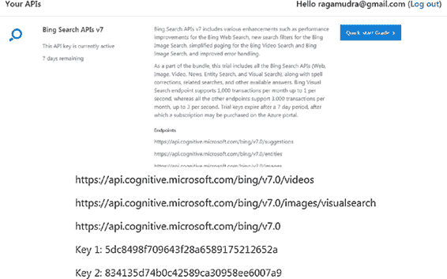

4.  系统会要求你登录，之后你将看到一个类似于图 3-13 的页面。向下滚动以获取密钥 1。

**图 3-13. 获取密钥 1**

一旦你获得了 `Bing API` 密钥，请按照以下步骤操作：

1.  获取锚词的命中次数。对于正面词，考虑单词 `"good"`；对于负面词，考虑单词 `"bad"`。

2.  对于感兴趣单词列表中的每个单词，获取其总命中次数。

3.  对于每个单词，获取该单词与每个锚词共同出现的总命中次数。

4.  计算 `PMI` 和 `Jaccard` 系数。当命中次数低于某个阈值时，将该分数视为无效。这是因为很大一部分命中次数可能纯属偶然。由于这是网络搜索，我们将阈值设定在数百万级别。此方法基于论文《使用网络搜索引擎测量词语间的语义相似度》，论文地址为 [www2007.org/papers/paper632.pdf](http://www2007.org/papers/paper632.pdf)。

5.  比较分数并标记情感极性。

让我们开始吧。参见 `清单 3-21`。

### `清单 3-21`

```python
import requests
import numpy as np

search_url = "https://api.cognitive.microsoft.com/bing/v7.0/search"
headers = {"Ocp-Apim-Subscription-Key": "your-key"}
```

在 `清单 3-22` 中，`get_total` 函数用于获取给定查询的总词数，`get_query_word` 函数通过将感兴趣单词与正面和负面锚词组合来准备查询。

### `清单 3-22`

```python
def get_total(query_word):
    params = {"q": query_word, "textDecorations": True, "textFormat": "HTML"}
    response = requests.get(search_url, headers=headers, params=params)
    response.raise_for_status()
    search_results = response.json()
    return search_results['webPages']['totalEstimatedMatches']

def get_query_word(str1, gword, bword):
    str_base = gword
    str_base1 = bword
    query_word_pos = str1 + "+" + str_base
    query_word_neg = str1 + "+" + str_base1
    return query_word_pos, query_word_neg
```

在 `清单 3-23` 中，`get_pmi` 和 `get_jaccard` 函数根据图 3-10 中描述的公式，为所有输入参数计算逐点互信息分数和 Jaccard 分数。如果命中次数不足，则将其标记为 `"na"`。

### `清单 3-23`

```python
def get_pmi(hits_good, hits_bad, hits_total, sr_results_pos_int, sr_results_neg_int, str1_tot):
    pos_score = "na"
    neg_score = "na"
    if(sr_results_pos_int >= 1000000):
        pos_score = np.log((hits_total * sr_results_pos_int) / (hits_good * str1_tot))
    if(sr_results_neg_int >= 1000000):
        neg_score = np.log((hits_total * sr_results_neg_int) / (str1_tot * hits_bad))
    return pos_score, neg_score

def get_jaccard(hits_good, hits_bad, sr_results_pos_int, sr_results_neg_int, str1_tot):
    pos_score = "na"
    neg_score = "na"
    if(sr_results_pos_int >= 1000000):
        pos_score = sr_results_pos_int / (((str1_tot + hits_good) - sr_results_pos_int))
    if(sr_results_neg_int >= 1000000):
        neg_score = sr_results_neg_int / (((str1_tot + hits_bad) - sr_results_neg_int))
    return pos_score, neg_score
```

现在，你需要定义锚词以及你想要分析的感兴趣单词。

理解极性（`list1`）。对于锚点词，你需要理解当这些词中的任意一个出现时的总命中数（你将这个空间定义为全集）。这是计算 `PMI` 和 `Jaccard` 分数所必需的。另一点需要注意的是，由于你感兴趣的是评论中通常表达的情感词汇，因此你将单词 `"reviews"` 添加到搜索范围中。这会将上下文限定在情感领域。这些是我已经应用的优化。请根据手头的问题随意修改。参见 `清单 3-24`。

### `清单 3-24`

```python
gword = "good"
bword = "bad"
hits_good = get_total(gword)
hits_bad = get_total(bword)
hits_total = get_total(gword + " OR " + bword)
list1 = ["delight", "pathetic", "average", "awesome", "tiresome", "angry", "furious"]
```

# 第 3 章 在线评论中的 NLP

现在你遍历这个列表并确定每个词的极性。最终输出可以是正面、负面或不确定。参见清单 3-25。

***清单 3-25.*** 确定极性

```python
for i in list1:
    str1 = i + "+reviews"
    str1_tot = get_total(str1)
    query_word_pos, query_word_neg = get_query_word(str1, gword, bword)
    sr_results_pos_int = get_total(query_word_pos)
    sr_results_neg_int = get_total(query_word_neg)
    pmi_score = get_pmi(hits_good, hits_bad, hits_total, sr_results_pos_int, sr_results_neg_int, str1_tot)
    jc_score = get_jaccard(hits_good, hits_bad, sr_results_pos_int, sr_results_neg_int, str1_tot)

    if (pmi_score[0] == "na" or pmi_score[1] == "na"):
        print(i, "pmi indeterminate")
    elif (pmi_score[0] > pmi_score[1]):
        print(i, "pmi pos")
    elif (pmi_score[0] < pmi_score[1]):
        print(i, "pmi neg")
    else:
        print(i, "pmi neutral")

    if (jc_score[0] == "na") or (jc_score[1] == "na"):
        print(i, "jc indeterminate")
    elif (jc_score[0] > jc_score[1]):
        print(i, "jc pos")
    elif (jc_score[0] < pmi_score[1]):
        print(i, "jc neg")
    else:
        print(i, "jc neutral")
```

输出如清单 3-26 所示。部分输出，例如“average”，显示为正面，因为你没有定义中性状态。你可以添加一个条件：如果正面和负面之间的差异在某个阈值内，则该词将被视为中性。

***清单 3-26.*** 输出结果

```
delight pmi pos
delight jc pos
pathetic pmi neg
pathetic jc neg
average pmi pos
average jc pos
awesome pmi indeterminate
awesome jc indeterminate
tiresome pmi indeterminate
tiresome jc indeterminate
angry pmi neg
angry jc neg
furious pmi neg
furious jc neg
```

你也可以使用其他语料库，例如维基百科或新闻语料库。你可以尝试不同的锚点词组合以及其他一些范围限定词（在你的例子中是单词“reviews”）以获得更好的结果。

## 情感分析库

也有一些标准库可用于进行情感分析。它们提供开箱即用的情感分析，因此必须适当使用。如果它适合手头的问题，那么你就有了一个快速且稳健的解决方案。你也可以将其与他们使用的算法/方法结合使用，或作为独立解决方案使用。`Vader`（情感感知词典和情感推理器）是一个进行情感分析并提供带有权重的词极性的 `Python` 库。原始研究论文题为“Vader: A parsimonious rule-based model for sentiment analysis of social media text”，可在 [`www.aaai.org/ocs/index.php/ICWSM/ICWSM14/paper/viewPaper/8109`](https://www.aaai.org/ocs/index.php/ICWSM/ICWSM14/paper/viewPaper/8109) 找到。从根本上说，`Vader` 从成熟的词典以及社交媒体语料库中获取了一组词汇。每个词都由一组人员按照群体智慧的方法提供极性分数，以得出最终的词典及其权重。清单 3-27 展示了如何使用 `pip install` 安装 `Vader` 库。

***清单 3-27.*** 安装 Vader 库

```python
!pip install vaderSentiment
```

清单 3-28 提供了一种使用 Vader 库的快速方法。

***清单 3-28.*** 使用 Vader 库

```python
from vaderSentiment.vaderSentiment import SentimentIntensityAnalyzer

analyser = SentimentIntensityAnalyzer()

score = analyser.polarity_scores("I am good")

score
```

```python
{'neg': 0.0, 'neu': 0.256, 'pos': 0.744, 'compound': 0.4404}
```

此示例中的复合分数是该句子情感极性的最终加权分数。正面和负面分数是处于该极性的词汇所占的百分比。它们的总和为 1。

## 方法 3：基于机器学习的方法（神经网络）

由于您拥有用户提供的最终评分，您可以尝试拟合一个监督模型。在您的情况下，进行监督模型的一种方法是使用 `Summary` 和 `Text` 列中的所有文本作为特征，`score_bkt` 作为目标变量，并拟合一个机器学习模型。这种方法的一个问题是，模型可能会因产品名称或评分较高或较低的产品类别而产生偏差。另一种方法是使用您之前创建的词汇特征作为模型中的特征。表 3-5 显示了您在基于词汇的方法中创建的中间变量。您将在此基础上添加更多变量来构建您的模型。

***表 3-5.** 中间变量*

| 词汇特征 | 变量含义 |
| --- | --- |
| `sent_len` | 文本长度 |
| `pos_score` | 词汇方法得出的正面分数 |
| `neg_score` | 词汇方法得出的负面分数 |
| `neg_num_pos_count` | 正面词汇附近的负面词汇数量 |
| `neg_num_neg_count` | 正面词汇附近的负面词汇数量 |
| `boost_num_pos_count` | 正面词汇附近的强化词数量 |
| `boost_num_neg_count` | 负面词汇附近的强化词数量 |
| `neg_num_neg_count_sum` | 摘要中正面词汇附近的负面词汇数量 |
| `boost_num_pos_count_sum` | 摘要中正面词汇附近的负面词汇数量 |
| `boost_num_neg_count_sum` | 摘要中正面词汇附近的强化词数量 |
| `excl_num_pos_count` | 正面词汇附近的感叹号数量 |
| `excl_num_neg_count` | 负面词汇附近的感叹号数量 |
| `excl_num_pos_count_sum` | 摘要中正面词汇附近的感叹号数量 |
| `excl_num_neg_count_sum` | 摘要中负面词汇附近的感叹号数量 |

### 语料库特征

利用语料库的文本和摘要，您可以使用 `TF-IDF` 向量化器创建词袋特征。由于您想创建一个通用的情感分析模块，您只从语料库中选择与情感或情绪相关的词汇。这是一个重要的步骤，因为使用所有词汇（在您的情况下，如宠物食品名称、糖果名称等）可能会使模型学习到将产品与其相关情感关联起来的模式。您将创建两组词汇特征：仅包含形容词和仅包含停用词。请注意，在第 2 章的分类示例中，您剔除了停用词。在这里，您将仅使用停用词作为特征集。
然后，您将合并这两组特征，并以 `score_bkt` 作为因变量来训练一个神经网络，调整类别权重，以得到一个能够在所有级别上进行良好分类的最佳模型。您在此处使用的是 `NLTK` 3.4.3 版本，如表 3-7 所述。请参见清单 3-29 和清单 3-30。

***清单 3-29.***

```python
import pandas as pd
from sklearn.linear_model import LogisticRegression
import nltk
import warnings
import stop_words
warnings.filterwarnings('ignore')
```

***清单 3-30.***

```python
t1 = pd.read_csv("lexicon_sent_processed.csv")
tgt = t1.loc[:,"score_bkt"]
```

以下代码展示了获取文本特征的函数。函数 `cnv_str` 将正面和负面集合转换为字符串，以便进行向量化处理并用于模型。函数 `filter_pos` 仅从文本和摘要句子中筛选出形容词。函数 `get_stop_words` 仅从文本语料库中保留停用词。
请参见清单 3-31 至 3-33。

***清单 3-31.***

```python
def cnv_str(x):
    x1 = list(eval(x))
    x2 = ' '.join(x1)
    return x2
```

***清单 3-32.***

```python
def filter_pos(fltr, sent_list):
    str1 = ""
    for i in sent_list:
        if(i[1]=="JJ"):
            str1 = str1 + i[0].lower() + " "
    return str1
```

***清单 3-33.***

```python
def get_stop_words(sent):
    list1 = set(sent.split())
    st_comm = list(list1 & st_set)
    st_comm = ' '.join(st_comm)
    return st_comm
```

清单 3-34 将这些函数应用于正面/负面集合和文本字段。

***清单 3-34.***

```python
t1["pos_set1"] = t1["pos_set"].apply(cnv_str)
t1["neg_set1"] = t1["neg_set"].apply(cnv_str)
t1["pos_neg_comb"] = t1["pos_set1"] + " " + t1["neg_set1"]
get_pos_tags = nltk.pos_tag_sents(t1["Text"].str.split())
str_sel_list = []
for i in get_pos_tags:
    str_sel = filter_pos("JJ", i)
    str_sel_list.append(str_sel)
```

```python
t1["pos_neg_comb_adj"] = t1["pos_neg_comb"] + str_sel_list
st1 = stop_words.get_stop_words('en')
st_set = set(st1)
onl_stop_words = t1["full_txt"].apply(get_stop_words)
t1["pos_neg_comb_adj_st"] = t1["pos_neg_comb_adj"] + onl_stop_words
```

清单 3-35 展示了为获取样本准确率而进行的分层拆分，以创建训练集和测试集。

***清单 3-35.***

```python
from sklearn.model_selection import StratifiedShuffleSplit
sss = StratifiedShuffleSplit(test_size=0.8, random_state=42, n_splits=1)
for train_index, test_index in sss.split(t1, tgt):
    x_train, x_test = t1[t1.index.isin(train_index)], t1[t1.index.isin(test_index)]
    y_train, y_test = t1.loc[t1.index.isin(train_index), "score_bkt"], t1.loc[t1.index.isin(test_index), "score_bkt"]
```

在清单 3-36 中，你仅保留词汇特征。文本特征将在另一步骤中处理，并与数值数组 `x_train1` 和 `x_test1` 拼接。请参见图 3-14。

***清单 3-36.***

```python
inde_vars = ["sent_len", "pos_score", "neg_score", "neg_num_pos_count",
             "neg_num_neg_count", 'boost_num_pos_count', 'boost_num_neg_count',
             'neg_num_pos_count_sum', 'neg_num_neg_count_sum', 'boost_num_pos_count_sum',
             'boost_num_neg_count_sum', 'excl_num_pos_count', 'excl_num_neg_count',
             'excl_num_pos_count_sum', 'excl_num_neg_count_sum']
x_train1 = x_train[inde_vars]
x_test1 = x_test[inde_vars]
x_train1.head()
```


***图 3-14.***

清单 3-36 展示了数据集中的数值特征。现在，你对包含形容词、停用词以及正面和负面匹配词的列进行向量化处理并创建矩阵。请参见清单 3-37。

***清单 3-37.***

```python
from sklearn.feature_extraction.text import TfidfVectorizer
tfidf_vectorizer = TfidfVectorizer(min_df=0.001, analyzer=u'word', ngram_range=(1,1))
tfidf_matrix_tr = tfidf_vectorizer.fit_transform(x_train["pos_neg_comb_adj_st"])
tfidf_matrix_te = tfidf_vectorizer.transform(x_test["pos_neg_comb_adj_st"])
x_train2 = tfidf_matrix_tr.todense()
x_test2 = tfidf_matrix_te.todense()
```

`x_train2` 和 `x_test2` 是处理了一组文本特征的矩阵。这些矩阵随后将与数值矩阵 `x_train1` 和 `x_test1` 拼接。请参见清单 3-38。

***清单 3-38.***

```python
import numpy as np
x_train3 = np.concatenate([x_train1, x_train2], axis=1)
x_test3 = np.concatenate([x_test1, x_test2], axis=1)
```

由于你将使用 `score_bkt` 作为目标变量构建神经网络分类器，因此对特征进行标准化非常重要。你将使用最小-最大缩放器进行标准化。清单 3-39 展示了使用 sklearn 函数 `sklearn` 的最小-最大缩放器公式。

```
X_std = (X - X.min(axis=0)) / (X.max(axis=0) - X.min(axis=0))
X_scaled = X_std * (max - min) + min
```

***清单 3-39.*** 最小-最大缩放器

```python
from sklearn import preprocessing
min_max_scaler = preprocessing.MinMaxScaler()
x_train_scaled = min_max_scaler.fit_transform(x_train3)
x_test_scaled = min_max_scaler.transform(x_test3)
```

你使用特征选择算法减少特征数量，就像上一章所做的那样。请参见清单 3-40。

***清单 3-40.***

```python
from sklearn.feature_selection import SelectPercentile, f_classif
selector = SelectPercentile(f_classif, percentile=40)
selector.fit(x_train3, y_train)
x_train4 = selector.fit_transform(x_train_scaled, y_train)
x_test4 = selector.transform(x_test_scaled)
```

你还需要将分类目标变量转换为独热编码形式。独热编码是一种形式，其中每个级别由其他级别的缺失和该级别的存在来表示，因此正面可以表示为 `100`，负面表示为 `010`，中性表示为 `001`。

***清单 3-41.*** 独热编码

# 构建神经网络

现在你已经将自变量和因变量调整为正确的形状，你将开始构建神经网络的过程。你的神经网络将是一个浅层网络，包含四层，随着网络的深入，层中的节点数量将减少。你将拥有 `500`、`200`、`100`、`50` 个节点。最后一层将有三个输入，并使用 `softmax` 激活函数，因为你正在解决一个包含三个类别的多类问题。请随意调整网络以获得更好的结果。由于你面临类别不平衡问题，你还需要为神经网络提供类别权重，以偏向于少数类别。请参见 `清单 3-42` 至 `清单 3-45`。

`清单 3-42.`

```python
from sklearn.preprocessing import LabelEncoder
from keras.utils import np_utils
le = LabelEncoder()
y_train1 = le.fit_transform(y_train)
y_train2 = np_utils.to_categorical(y_train1)
y_test1 = le.transform(y_test)
print(y_train2.shape)
(11368, 3)
```

`清单 3-43.`

```python
import tensorflow as tf
import keras
from keras.models import Sequential
from keras.layers import Dense
from keras.layers import Input, Dense, Dropout
from keras.models import Model
from keras.utils import to_categorical
from keras.optimizers import Adam
```

`清单 3-44.`

```python
def get_nn_mod(list_layers, dp):
    model = Sequential()
    model.add(Dense(list_layers[0], input_dim=x_train4.shape[1],
                    activation='tanh', kernel_initializer='lecun_uniform'))
    model.add(Dropout(dp))
    for i in list_layers[1:]:
        model.add(Dense(i, input_dim=x_train4.shape[1], activation='tanh'))
        model.add(Dropout(dp))
    model.add(Dense(3, activation='softmax'))
    opt = Adam(0.0001)
    model.compile(optimizer=opt, loss='categorical_crossentropy', metrics=['accuracy'])
    return model
```

`清单 3-45.`

```python
list_layers = [500, 200, 100, 50]
class_weight = {0: 0.2, 1: 0.6, 2: 0.2}
model = get_nn_mod(list_layers, 0.1)
model.fit(x_train4, y_train2, batch_size=100, epochs=20, class_weight=class_weight, verbose=2, validation_split=0.2)
```

模型拟合完成后，你需要检查准确率和 F1 分数。你会发现准确率与词表方法持平，但 F1 分数有了显著提升。混淆矩阵也呈现相同的结果。参见 `清单 3-46`、`清单 3-47` 和 `图 3-15`。

`清单 3-46.`

```python
pred = model.predict_classes(x_test4)
from sklearn.metrics import accuracy_score
from sklearn.metrics import f1_score
ac1 = accuracy_score(y_test1, pred)
print(ac1, f1_score(y_test1, pred, average='macro'))
0.8045519516217702 0.5858385721186434
```

`清单 3-47.`

```python
from sklearn.metrics import confusion_matrix
rows_name = t1["score_bkt"].unique()
pred_inv = le.inverse_transform(pred)
cmat = pd.DataFrame(confusion_matrix(y_test, pred_inv, labels=rows_name, sample_weight=None))
cmat.columns = rows_name
cmat["act"] = rows_name
cmat
```


# 改进方向

为了改进此模型，你可以添加其他文本特征，例如副词、连词、大写单词等。还可以调整超参数和类别权重，以在不损失准确率的情况下获得更好的 F1 分数。

# 属性提取

当你分析评论的情感倾向时，会发现客户对产品持有混合意见。例如，“这款手机的摄像头非常高效，但电池却糟糕透顶。”这条评论对摄像头评价非常积极，而对电池评价极其消极。你需要先提取属性，然后识别每个属性对应的情感极性。下面是一个关于属性提取的小示例。PromptCloud ([www.promptcloud.com](http://www.promptcloud.com/)) 提取了 40 万条关于无锁手机的亚马逊评论。该数据集的详细信息可在 [`data.world/promptcloud/amazon-mobile-phone-reviews`](https://data.world/promptcloud/amazon-mobile-phone-reviews) 找到。该数据集包含各种手机型号和品牌的评论。本练习的目标是从每条评论中提取属性，然后将其与正面和负面评分进行关联分析。你希望了解每个品牌相对于其他品牌评分最高的属性。

第一步，你将提取属性，然后与评分进行关联。参见 `清单 3-48` 和 `图 3-16`。

`清单 3-48.`

```python
import pandas as pd
import nltk
pd.options.display.max_colwidth = 1000
t1 = pd.read_csv("Amazon_Unlocked_Mobile.csv")
t1.shape
(413840, 6)
t1.head()
```


你需要较长的评论，因此将保留至少 `10` 个字符的最低截断值。由于我们只是进行样本工作并快速迭代，我只保留了 `10%` 的数据。现在参见 `清单 3-49`。

`清单 3-49.`

```python
t2 = t1[t1.Reviews.str.len() >= 10]
t3 = t2.sample(frac=0.01)
```

你将按照 `图 3-17` 中的步骤进行属性提取。


1.  你将使用正则表达式来规范化字符或单词，例如英寸（`"`）、美元（`$`）、`GB` 等。我为此创建了一个正则表达式映射文件，其中每个正则表达式都有一个需要替换的单词。例如，美元符号（`$`）可以替换为单词“dollars”。你还将提取这些替换后的单词，并将其收集到一个单独的列中，这将用于步骤 3。
2.  在此步骤中，你使用 `nltk` 提取名词短语。属性通常是名词或名词形式（`NN`、`NNP` 或 `NNS`）。你将提取出的名词传递给下一步。并非所有名词都是属性，因此这一步起到了过滤器的作用。
3.  你创建一个文件，将属性映射到不同的属性类别。我通过查看语料库中提取频率最高的名词，并结合评论网站中使用的手机规格，创建了属性列表。
4.  每当有匹配项时，步骤 1 中提取的名词列表以及通过正则表达式映射的单词，都会被传递到步骤 3 的映射文件中，并捕获评论中的属性。映射文件将单词映射到属性。例如，将单词 `"GB"` 映射到属性 `"storage"`。
5.  一旦每条评论都被映射到一个属性，你就可以根据评分对属性进行切片和切块分析，从而获得分析结果和所需输出。
6.  在下一节中，你将查看每个步骤的详细代码。

## `步骤 1`：使用正则表达式进行标准化

在代码清单 `3-50` 中，你将一个正则表达式映射读取到文件中，并提供了文件行的样本。见 `图 3-18`。

**代码清单 `3-50`.**

```python
rrpl = pd.read_csv("regex_repl.csv")
rrpl.head()
```


接下来，你使用一个函数，将句子中提取的正则表达式替换为相应的单词。变量 `words_Coll` 是提取并映射后的单词集合。如果 `Reviews1` 中被替换的单词未被“词性”标注器识别为名词形式，我们仍通过使用步骤 3 中 `words_Coll` 提取的单词，确保它们可用于最终的映射过程。见代码清单 `3-51`。

**代码清单 `3-51`.**

```python
def repl_text(t3, to_repl, word_to_repl):
    t3["Reviews1"] = t3["Reviews1"].str.replace(to_repl, word_to_repl)
    ind_list = t3[t3["Reviews"].str.contains(to_repl)].index
    t3.loc[ind_list, "words_Coll"] = t3.loc[ind_list, "words_Coll"] + " " + word_to_repl
    return t3
```

在代码清单 `3-52` 中，你迭代运行行，替换模式，并将替换后的单词保存在单独的列中。

**代码清单 `3-52`.**

```python
t3["Reviews1"] = t3["Reviews"].str.lower()
t3["words_Coll"] = ""
for index, row in rrpl.iterrows():
    repl = row["repl"]
    word = row["word"]
    t3 = repl_text(t3, repl, word)
```

在此步骤结束时，你得到两列：`Reviews1`（替换模式后的文本）和 `words_Coll`（从模式中提取的单词）。

## `步骤 2`：提取名词形式

现在，你将在以下函数中使用 `filter_pos` 提取名词形式。这里的 `fltr` 是你传递给函数的变量。如果你想尝试其他词性标签，可以重复使用它。见代码清单 `3-53` 和 `3-54`。

**代码清单 `3-53`.**

```python
def filter_pos(fltr, sent_list):
    str1 = ""
    for i in sent_list:
        if(i[1].find(fltr) >= 0):
            str1 = str1 + i[0].lower() + " "
    return str1
```

**代码清单 `3-54`.**

```python
get_pos_tags = nltk.pos_tag_sents(t3["Reviews1"].str.split())
str_sel_list = []
for i in get_pos_tags:
    str_sel = filter_pos("NN", i)
    str_sel_list.append(str_sel)
```

包含名词形式属性的变量 `str_sel_list` 与 `words_coll` 合并。这是为了确保即使某些替换后的单词被词性标注器遗漏，它们仍能成为分析的一部分。见代码清单 `3-55`。

**代码清单 `3-55`.**

```python
t3["pos_tags"] = str_sel_list
t3["all_attrs_ext"] = t3["pos_tags"] + t3["words_Coll"]
```

列 `all_attrs_ext` 将用于将属性映射到类别。

## `步骤 3`：创建映射文件

你需要创建一个映射文件。你可以抓取手机评论网站，然后开始生成映射文件。例如，请参阅 [www.gsmarena.com/xiaomi_redmi_k30-review-2055.php](http://www.gsmarena.com/xiaomi_redmi_k30-review-2055.php) 上的规格。

## 设备规格与自然语言处理

### 设备规格

- **机身：** 金属框架，前后 Gorilla Glass 5 玻璃，重 `208g`。
- **显示屏：** `6.67` 英寸 IPS LCD，`120Hz` 刷新率，`HDR10`，分辨率 `1080 x 2400px`，`20:9` 屏幕比例，`395ppi`。
- **后置摄像头：** 主摄：`64MP`，`f/1.89` 光圈，`1/1.7` 英寸传感器尺寸，`0.8μm` 像素尺寸，`PDAF`。超广角：`8MP`，`f/2.2`，`1/4` 英寸，`1.12μm` 像素。微距摄像头：`2MP`，`f/2.4`，`1/5` 英寸，`1.75μm`。深度传感器：`2MP`；支持 `2160p@30fps`、`1080p@30/60/120fps`、`720p@960fps` 视频录制。
- **前置摄像头：** 主摄：`20MP`，`f/2.2` 光圈，`0.9μm` 像素。深度传感器：`2MP`；支持 `1080p/30fps` 视频录制。
- **操作系统：** `Android 10`；`MIUI 11`。
- **芯片组：** `Snapdragon 730G`（`8nm`）：八核（`2x2.2 GHz Kryo 470 Gold` 和 `6x1.8 GHz Kryo 470 Silver`），`Adreno 618 GPU`。
- **内存：** `6/8GB RAM`；`64/128/256GB UFS 2.1` 存储；共享 `microSD` 卡槽。
- **电池：** `4,500mAh`；支持 `27W` 快充。
- **连接性：** 双卡双待；`LTE-A`，`4` 频段载波聚合，`LTE Cat-12/Cat-13`；`USB-C`；`Wi-Fi a/b/g/n/ac`；双频 `GPS`；蓝牙 `5.0`；`FM` 收音机；`NFC`；红外发射器。
- **其他：** 侧面指纹识别；`3.5mm` 音频插孔。

例如，后置和前置摄像头可以映射到“摄像头”类别。`LTE`、`WiFi` 等可以映射到“网络”类别。通过查看多个评论网站，我将属性类别标准化为以下类别：

1.  通信（Comm）
2.  尺寸
3.  重量
4.  构造
5.  音质
6.  SIM 卡
7.  显示屏
8.  操作系统
9.  性能
10. 价格
11. 电池
12. 收音机
13. 摄像头
14. 键盘
15. 应用
16. 保修
17. 保证
18. 通话质量
19. 存储

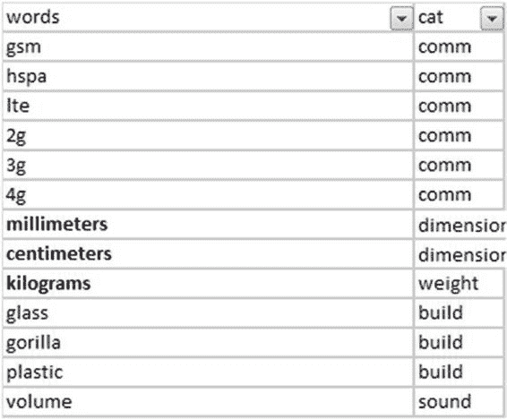

`attr_cat.csv` 是映射文件。映射文件的快速预览如 `表 3-6` 所示。

**`表 3-6`.** 映射文件快速预览

你还可以从 `str_sel_list` 获取名词的顶部列表。这可用于调整类别属性的映射列表。任何出现在顶部词汇但不在映射文件中的名词都应被包含。请参见 `清单 3-56` 和 `图 3-19`。

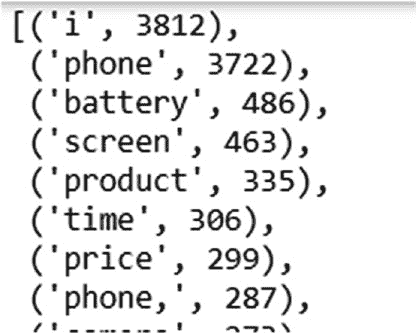

**`清单 3-56`.** 获取顶部词汇

```python
from collections import Counter

str_sel_list_all = ' '.join(str_sel_list)
str_sel_list_all = str_sel_list_all.replace('.', '')
str_sel_list_all_list = Counter(str_sel_list_all.split())
str_sel_list_all_list.most_common()
```

## `步骤 4`：将每条评论映射到属性

设置好映射文件后，你将迭代地将每条评论映射到一个属性。请参见 `清单 3-57`。

**`清单 3-57`.**

```python
attr_cats = pd.read_csv("attr_cat.csv")
attrs_all = []

for index, row in t3.iterrows():
    ext1 = row["all_attrs_ext"]
    attr_list = []
    for index1, row1 in attr_cats.iterrows():
        wrd = row1["words"]
        cat = row1["cat"]
        if(ext1.find(wrd) >= 0):
            attr_list.append(cat)
    attr_list = list(set(attr_list))
    attr_str = ' '.join(attr_list)
    attrs_all.append(attr_str)
```

数据框中的 `attrs_all` 列包含提取出的属性。

## `步骤 5`：分析品牌

现在你将分析不同品牌在不同类别中的表现。为此，你选择了顶级品牌。你还会将评分分类为 `pol_tag`。`4` 分和 `5` 分的高评分将被分类为正面，`1` 分和 `2` 分的低评分为负面，`3` 分为中性。请参见 `清单 3-58`。

**`清单 3-58`.** 评分分类

# 第 3 章 在线评论中的自然语言处理

```python
t3["attrs"] = attrs_all
t3["pol_tag"] = "neu"
t3.loc[t3.Rating>=4,"pol_tag"] = "pos"
t3.loc[t3.Rating<=2,"pol_tag"] = "neg"
```

顶级品牌是指在样本数据集中至少有 100 条评论的品牌。请参见列表 3-59。

#### 列表 3-59. 顶级品牌

```python
brand_df = pd.DataFrame(t3["Brand Name"].value_counts()).reset_index()
brand_df.columns = ["brand","count"]
brand_df1 = brand_df[brand_df["count"]>=100]
brand_list = list(brand_df1["brand"])
```

```python
['Samsung',
 'BLU',
 'Apple',
 'LG',
 'Nokia',
 'Motorola',
 'BlackBerry',
 'CNPGD',
 'HTC']
```

`Listing 3-59` 的输出是数据集中顶级品牌的列表。分析将针对这些品牌进行。通过以下函数，您可以获得正面评价中最常见的属性以及负面评价中最常见的属性及其计数。您创建一个参数化变量 `col3`，其中包含每个属性正面得分与负面得分的比率。此函数将在整体层面以及每个品牌层面被调用。

现在，您可以比较不同品牌的比率，并了解每个品牌的感知主张。请参见 `Listing 3-60`。

#### `Listing 3-60`.

```python
def get_attrs_df(df1,col1,col2,col3):
    list1 = ' '.join(list(df1.loc[(df1.pol_tag=='pos'),"attrs"]))
    list2 = Counter(list1.split())
    df_pos = pd.DataFrame(list2.most_common())
    list1 = ' '.join(list(df1.loc[df1.pol_tag=='neg',"attrs"]))
    list2 = Counter(list1.split())
    df_neg = pd.DataFrame(list2.most_common())
    df_pos.columns = ["attrs",col1]
    df_neg.columns = ["attrs",col2]
    df_all = pd.merge(df_pos,df_neg,on="attrs")
    df_all[col3] = df_all[col1]/df_all[col2]
    return df_all
```

第一次调用 `df_gen` 函数会获取最常见的正面属性和最常见的负面属性及其在数据框中的出现次数。然后，它会迭代地为品牌列表中的每个品牌调用该函数。请参见 `Listing 3-61` 和 `Figure 3-20`。

#### `Listing 3-61`.

```python
df_gen = get_attrs_df(t3,"pos_count","neg_count","ratio_all")
for num,i in enumerate(brand_list):
    brand_only_df = t3.loc[t3["Brand Name"]==i]
    col1 = 'pos_count_' + i
    col2 = "neg_count_" + i
    col3 = "ratio_" + i
    df_brand = get_attrs_df(brand_only_df,col1,col2,col3)
    df_gen = pd.merge(df_gen,df_brand[["attrs",col3]],how='left',on="attrs")
df_gen
```

| `attrs` | `ratio_all` | `ratio_Samsung` | `ratio_BLU` | `ratio_Apple` | `ratio_LG` | `ratio_Nokia` | `ratio_Motorola` | `ratio_BlackBerry` | `ratio_CNPGD` | `ratio_HTC` |
| :--- | :--- | :--- | :--- | :--- | :--- | :--- | :--- | :--- | :--- | :--- |
| `battery` | 1.11 | 1.64 | 2.14 | 1.97 | 1.15 | 1.47 | 1.89 | 1.67 | 0.60 | 1.60 |
| `camera` | 3.00 | 3.35 | 3.78 | 3.50 | 4.00 | 3.40 | 3.80 | 4.00 | 2.00 | 1.50 |
| `display` | 0.71 | 1.67 | 2.67 | 2.15 | 0.65 | 2.57 | 1.75 | 2.67 | 0.25 | 0.10 |
| `price` | 0.11 | 1.06 | 1.13 | 2.21 | 0.64 | 3.00 | 0.86 | 0.67 | 0.67 | 0.36 |
| `comm` | 2.00 | 1.84 | 4.20 | 1.73 | 1.00 | 3.50 | 3.67 | 4.00 | 1.33 | 0.60 |

`Figure 3-20`.

第一列 `ratio_all` 是属性的总体得分。总体而言，人们对 `camera` 的评价更积极，对 `price` 的评价最不积极。在 `price` 方面，您可以看到 `BLU` 品牌似乎比其他品牌更受青睐。在 `camera` 方面，`Apple` 和 `BlackBerry` 表现突出。您将绘制顶级品牌与属性相对得分（正面与负面得分）之间的图表。但首先，您需要将数据准备成 `matplotlib` 所需的格式。您首先收集顶级品牌的所有比率列的名称。请参见 `Listing 3-62` 和 `Figure 3-21`。

#### `Listing 3-62`.

```python
ratio_list = []
for i in brand_list:
    ratio_list.append("ratio_" + i)
ratio_list
```

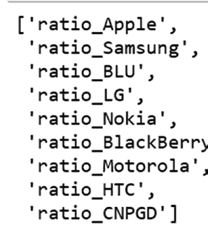

`Figure 3-21`.

接下来，您将每个列中的所有值制作成一个列表的列表。`list_all` 中的每组列表对应一个品牌，每个品牌列表中的值集对应感兴趣的属性。这里您获取了数据框开头的属性：`battery`、`display`、`camera`、`price`、`comm` 和 `os`。请参见 `Listing 3-63` 和 `Figure 3-22`。

#### `Listing 3-63`.

```python
import matplotlib.pyplot as plt
cols = ["battery","display","camera","price","comm","os"]
list_all = []
for j in ratio_list:
    list1 = df_gen.loc[df_gen.attrs.isin(cols),j].round(2).fillna(0).values.flatten().tolist()
    list_all.append(list1)
list_all
```

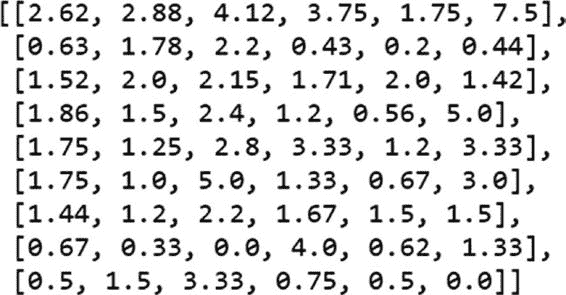

`Figure 3-22`.

现在数据已准备就绪，您可以使用 `matplotlib` 来绘制图表。您绘制每个 `series` 作为一组 `X` 值，并递增 `X` 值列表，以便下一组值稍微远离上一组。你有六个属性，因此循环运行六次。

每个列表对应一个品牌，因此标签就是该品牌的标签。参见清单 3-64。

#### `Listing 3-64`.

```python
import matplotlib.pyplot as plt
import numpy as np

X = np.arange(6)

for i in range(6):
    plt.bar(X, list_all[i], width = 0.09, label=brand_list[i])

plt.xticks(X, cols)
X = X + 0.09
plt.ylabel('Ratio of Positive/Negative')
plt.xlabel('Attributes')
plt.legend(bbox_to_anchor=(1.05, 1), loc='upper left', borderaxespad=0.)
plt.show()
```

图 3-23 展示了相同的图表。


`图 3-23`.

总结来说，到目前为止，你已经深入探讨了三种情感分析方法：词典法、基于词典的规则法以及机器学习分析法。类似的技术也可用于情绪或主观性/客观性检测。你还了解了一种属性分析算法。如果你有一个经过适当训练、将不同词语标记为属性的语料库，你可以使用监督学习进行属性分析。一旦你将句子标记为极性、情绪和属性，你就可以通过按不同维度对数据进行切片和切块来获得更多洞察。

表 3-7 列出了第 3 章中使用的包。

`表 3-7`. 第 3 章中使用的包

| `包名` | `版本` |
| :--- | :--- |
| `azure-cognitiveservices-nspkg` | 3.0.1 |
| `azure-cognitiveservices-search-nspkg` | 3.0.1 |
| `azure-cognitiveservices-search-websearch` | 1.0.0 |
| `azure-common` | 1.1.24 |
| `azure-nspkg` | 3.0.2 |
| `backcall` | 0.1.0 |
| `backports-abc` | 0.5 |
| `backports.shutil-get-terminal-size` | 1.0.0 |
| `beautifulsoup4` | 4.8.1 |
| `bs4` | 0.0.1 |
| `certifi` | 2019.11.28 |
| `chardet` | 3.0.4 |
| `colorama` | 0.4.3 |
| `decorator` | 4.4.1 |
| `Distance` | 0.1.3 |
| `enum34` | 1.1.6 |
| `futures` | 3.3.0 |
| `idna` | 2.8 |
| `ipykernel` | 4.10.0 |
| `ipython` | 5.8.0 |
| `ipython-genutils` | 0.2.0 |
| `isodate` | 0.6.0 |
| `jedi` | 0.13.3 |
| `jupyter-client` | 5.3.4 |
| `jupyter-core` | 4.6.1 |
| `msrest` | 0.6.10 |
| `nltk` | 3.4.3 |
| `numpy` | 1.16.6 |
| `oauthlib` | 3.1.0 |
| `pandas` | 0.24.2 |
| `parso` | 0.4.0 |
| `pathlib2` | 2.3.5 |
| `pickleshare` | 0.7.5 |
| `pip` | 19.3.1 |
| `prompt-toolkit` | 1.0.15 |
| `pybind11` | 2.4.3 |
| `pydot-ng` | 1.0.1.dev0 |
| `pygments` | 2.4.2 |
| `pyparsing` | 2.4.6 |
| `python-dateutil` | 2.8.1 |
| `pywin32` | |
| `pyzmq` | 18.1.0 |
| `requests` | 2.22.0 |
| `requests-oauthlib` | 1.3.0 |
| `scandir` | 1.10.0 |
| `setuptools` | 44.0.0.post20200106 |
| `simplegeneric` | 0.8.1 |
| `singledispatch` | 3.4.0.3 |
| `six` | 1.13.0 |
| `sklearn` | |
| `soupsieve` | 1.9.5 |
| `speechrecognition` | 3.8.1 |
| `tornado` | 5.1.1 |
| `traitlets` | 4.3.3 |
| `urllib3` | 1.25.7 |
| `wcwidth` | 0.1.8 |
| `wheel` | 0.33.6 |
| `win-unicode-console` | 0.5 |
| `wincertstore` | 0.2 |