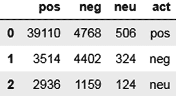

# 排版后的内容

[blog.exsilio.com/all/accuracy-precision-recall-f1-score-interpretation-](https://blog.exsilio.com/all/accuracy-precision-recall-f1-score-interpretation-of-performance-measures/)

[of-performance-measures/](https://blog.exsilio.com/all/accuracy-precision-recall-f1-score-interpretation-of-performance-measures/) 以及 Scikit-Learn 关于混淆矩阵（[`scikit-learn.org/stable/modules/generated/sklearn.metrics.`](https://scikit-learn.org/stable/modules/generated/sklearn.metrics.confusion_matrix.html)

[confusion_matrix.html](https://scikit-learn.org/stable/modules/generated/sklearn.metrics.confusion_matrix.html)）和 F1 分数（[`scikit-learn.org/stable/modules/`](https://scikit-learn.org/stable/modules/generated/sklearn.metrics.f1_score.html#sklearn.metrics.f1_score)

[generated/sklearn.metrics.f1_score.html#sklearn.metrics.f1_score](https://scikit-learn.org/stable/modules/generated/sklearn.metrics.f1_score.html#sklearn.metrics.f1_score)）的页面。现在请参见代码清单 3-8 和图 3-4。

**代码清单 3-8.**

```python
from sklearn.metrics import accuracy_score

print (accuracy_score(t3["score_bkt"],t3["final_tags"]))

#0.8003448093872596

from sklearn.metrics import f1_score

f1_score(t3["score_bkt"],t3["final_tags"], average='macro')

#0.502500231042986
```



## 第 3 章 在线评论中的 NLP

```python
rows_name = t3["score_bkt"].unique()

from sklearn.metrics import confusion_matrix

cmat = pd.DataFrame(confusion_matrix(t3["score_bkt"],t3["final_tags"], labels=rows_name, sample_weight=None))

cmat.columns = rows_name

cmat["act"] = rows_name

cmat
```

**图 3-4.**

如您所见，您有足够的空间来改进算法。为了进一步理解这一点，让我们查看一些错误，探究其原因，并采取一些步骤来进一步改进模型。从基于词典的方法，您现在正在过渡到基于词典和规则的方法。在分析错误的过程中，您将提出一些规则来解决情感问题。

## 方法 2：基于规则的方法

下一个方法是通过添加规则来改进基于词典的方法的性能。规则基于语言模式和数据结构。为了识别规则，您首先通过比较预测情感和实际标签来调查错误。请参见代码清单 3-9。

**代码清单 3-9.**

```python
pd.options.display.max_colwidth=1000

t3.loc[t3.score_bkt!=t3.final_tags,["Summary","full_txt","final_tags","score_bkt","pos_percent","neg_percent","pos_set","neg_set"]]
```

以下是从代码清单 3-9 的输出中得出的观察结果。

### 观察结果 1

`Summary` 列中的情感非常清晰、简洁且明确。您可以利用这一点，并赋予 `Summary` 的命中比 `full_txt` 更高的权重。请参见表 3-1。

**表 3-1.**

| **摘要** | **完整文本** | **正面词集** | **负面词集** |
| --- | --- | --- | --- |
| 我挑剔的猫喜欢它们 | 我挑剔的猫喜欢它们，我同意另外两篇评论。我的猫非常非常非常…… | {喜欢, 兴奋, 最爱, 爱} | {无聊, 拒绝, 挑剔, 善变} |
| ... | ... | ... | ... |
| 我的狗很喜欢它…… | 我的狗很喜欢它……我的狗已经享用很多年了…… | {享受, 喜爱} | {问题} |
| 我女儿喜欢！ | 我女儿喜欢！我女儿喜欢这些…… | {爱} | {廉价} |
| 如果我有狗，对狗有好处 | 如果我有狗，对狗有好处。我喜欢杰克链接牛肉干，尤其是胡椒味的。这里…… | {诚实, 爱, 好, 棒, 喜欢} | {硬, 错, 干} |

### 观察结果 2

像“非常”和“极度”这样的强化词会加剧情感。示例如表 3-2 所示。

**表 3-2.** 强化词

| **摘要** | **完整文本** | **正面词集** | **负面词集** |
| --- | --- | --- | --- |
| 对胃酸反流非常有帮助 | 对胃酸反流非常有帮助。这个配方与将米粉加入配方奶或母乳不同…… | {有帮助, 推荐, 容易} | {拒绝, 更稠, 拒绝} |

您将识别出这些强化词，并将它们与正面


