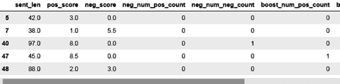

# 第 3 章 在线评论中的自然语言处理

```
t1["pos_neg_comb_adj"] = t1["pos_neg_comb"] + str_sel_list
st1 = stop_words.get_stop_words('en')
st_set = set(st1)
onl_stop_words = t1["full_txt"].apply(get_stop_words)
t1["pos_neg_comb_adj_st"] = t1["pos_neg_comb_adj"] + onl_stop_words
```

列表 3-35 展示了为获取样本准确率而进行的分层拆分，以创建训练集和测试集。

***列表 3-35.***

```
from sklearn.model_selection import StratifiedShuffleSplit
sss = StratifiedShuffleSplit(test_size=0.8, random_state=42, n_splits=1)
for train_index, test_index in sss.split(t1, tgt):
    x_train, x_test = t1[t1.index.isin(train_index)], t1[t1.index.isin(test_index)]
    y_train, y_test = t1.loc[t1.index.isin(train_index), "score_bkt"], t1.loc[t1.index.isin(test_index), "score_bkt"]
```

在列表 3-36 中，你仅保留词汇特征。文本特征将在另一步骤中处理，并与数值数组 `x_train1` 和 `x_test1` 拼接。请参见图 3-14。

***列表 3-36.***

```
inde_vars = ["sent_len", "pos_score", "neg_score", "neg_num_pos_count",
             "neg_num_neg_count", 'boost_num_pos_count', 'boost_num_neg_count',
             'neg_num_pos_count_sum', 'neg_num_neg_count_sum', 'boost_num_pos_count_sum',
             'boost_num_neg_count_sum', 'excl_num_pos_count', 'excl_num_neg_count',
             'excl_num_pos_count_sum', 'excl_num_neg_count_sum']
x_train1 = x_train[inde_vars]
x_test1 = x_test[inde_vars]
x_train1.head()
```



