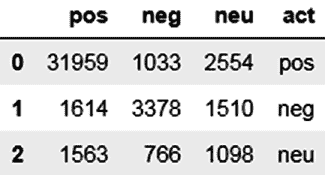
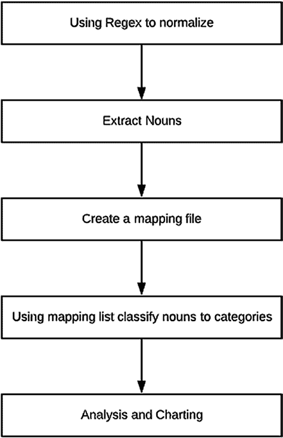
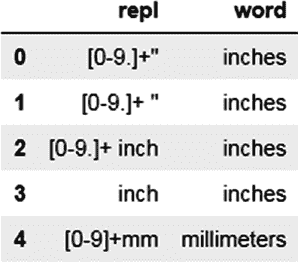

# 第 3 章 在线评论中的自然语言处理

```
    model.add(Dense(3, activation='softmax'))
    opt = Adam(0.0001)
```


## 编译模型

`model.compile(optimizer=opt, loss='categorical_crossentropy', metrics=['accuracy'])`

`return model`

**清单 3-44.**

`list_layers = [500,200,100,50]`

`class_weight = {0:0.2,1:0.6,2:0.2}`

`model = get_nn_mod(list_layers,0.1)`

**清单 3-45.**

`model.fit(x_train4, y_train2, batch_size=100, epochs=20, class_weight=class_weight, verbose=2, validation_split=0.2)`

模型拟合完成后，你需要检查准确率和 F1 分数。你会发现准确率与词表方法持平，但 F1 分数有了显著提升。混淆矩阵也呈现相同的结果。参见清单 3-46、清单 3-47 和图 3-15。

**清单 3-46.**

```
pred = model.predict_classes(x_test4)
from sklearn.metrics import accuracy_score
from sklearn.metrics import f1_score
ac1 = accuracy_score(y_test1, pred)
print(ac1, f1_score(y_test1, pred, average='macro'))
0.8045519516217702 0.5858385721186434
```

**清单 3-47.**

```
from sklearn.metrics import confusion_matrix
rows_name = t1["score_bkt"].unique()
pred_inv = le.inverse_transform(pred)
```



第 3 章 在线评论中的 NLP

```
cmat = pd.DataFrame(confusion_matrix(y_test, pred_inv, labels=rows_name, sample_weight=None))
cmat.columns = rows_name
cmat["act"] = rows_name
cmat
```

**图 3-15.**

## 改进方向

为了改进此模型，你可以添加其他文本特征，例如副词、连词、大写单词等。还可以调整超参数和类别权重，以在不损失准确率的情况下获得更好的 F1 分数。

## 属性提取

当你分析评论的情感倾向时，会发现客户对产品持有混合意见。例如，“这款手机的摄像头非常高效，但电池却糟糕透顶。”这条评论对摄像头评价非常积极，而对电池评价极其消极。你需要先提取属性，然后识别每个属性对应的情感极性。下面是一个关于属性提取的小示例。PromptCloud ([www.promptcloud.com/](http://www.promptcloud.com/)) 提取了 40 万条关于无锁手机的亚马逊评论。该数据集的详细信息可在 [`data.world/promptcloud/amazon-mobile-phone-reviews`](https://data.world/promptcloud/amazon-mobile-phone-reviews) 找到。该数据集包含各种手机型号和品牌的评论。本练习的目标是从每条评论中提取属性，然后将其与正面和负面评分进行关联分析。你希望了解每个品牌相对于其他品牌评分最高的属性。

第一步，你将提取属性，然后与评分进行关联。参见清单 3-48 和图 3-16。


第 3 章 在线评论中的 NLP

**清单 3-48.**

```
import pandas as pd
import nltk
pd.options.display.max_colwidth = 1000
t1 = pd.read_csv("Amazon_Unlocked_Mobile.csv")
t1.shape
(413840, 6)
t1.head()
```

**图 3-16.**

你需要较长的评论，因此将保留至少 10 个字符的最低截断值。由于我们只是进行样本工作并快速迭代，我只保留了 10% 的数据。现在参见清单 3-49。

**清单 3-49.**

```
t2 = t1[t1.Reviews.str.len() >= 10]
t3 = t2.sample(frac=0.01)
```

你将按照图 3-17 中的步骤进行属性提取。



第 3 章 在线评论中的 NLP

**图 3-17.**

1. 你将使用正则表达式来规范化字符或单词，例如英寸（`"`）、美元（`$`）、GB 等。我为此创建了一个正则表达式映射文件，其中每个正则表达式都有一个需要替换的单词。例如，美元符号（`$`）可以替换为单词“dollars”。你还将提取这些替换后的单词，并将其收集到一个单独的列中，这将


用于步骤 3。

2. 在此步骤中，你使用 NLTK 提取名词短语。属性通常是名词或名词形式（`NN`、`NNP` 或 `NNS`）。你将提取出的名词传递给下一步。并非所有名词都是属性，因此这一步起到了过滤器的作用。



